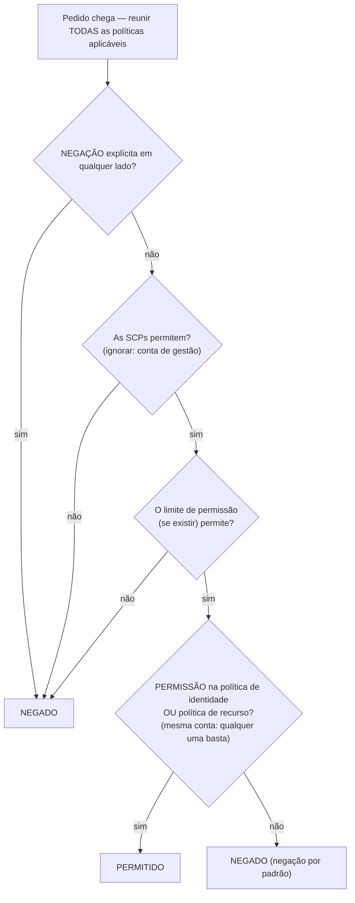

# Capítulo 14: Quem Tem Permissão Para Fazer O Quê

Os novos engenheiros começavam na segunda-feira. Soo-Jin e Rafael. Maya andava a pensar na primeira semana deles — a que precisariam de aceder, no que não deviam tocar, e se a configuração atual do IAM estava sequer pronta para ser estendida a mais duas pessoas.

Ela sentou-se com um café antes de o escritório encher, a fazer uma lista.

---

*O CloudFront estava implantado. As taxas de acertos de cache eram boas. O desempenho tinha subido. Mas à medida que a equipa se preparava para receber novos engenheiros, um problema silencioso veio à tona: a configuração do IAM tinha sido construída por pessoas com pressa. As chaves de acesso estavam em ficheiros de configuração. Algumas roles tinham mais permissões do que precisavam. E duas pessoas novas estavam prestes a receber credenciais para um sistema de produção que não tinha sido projetado a pensar em múltiplos utilizadores.*

---

Tom tinha as chaves de acesso abertas num ficheiro de texto, prontas para colar.

"O que estás a fazer?", perguntou Priya.

"A instância EC2 precisa de ler ficheiros de configuração do S3. Estou a pôr as credenciais na configuração do servidor."

Ela olhou para o ecrã por um momento. "Fecha esse ficheiro."

"Eu estava só—"

"Se alguém entrar nesse servidor", disse ela, "obtém essas chaves. E essas chaves tocam o que quer que o utilizador IAM tenha permissão para tocar. Que é provavelmente mais do que apenas S3."

Tom fechou o ficheiro.

"Há uma forma melhor", disse ela. "O próprio servidor pode ter uma role. Pensa nisso como um cargo — a instância não precisa de credenciais porque o sistema já sabe o que ela é e o que tem permissão para fazer."

Tom pareceu cético. "Então o servidor autentica-se a si mesmo?"

"Sim. Sem palavra-passe. Sem chaves num ficheiro de configuração. Sem nada que possa ser acidentalmente confirmado no git."

Esta última parte aterrou. Tom quase tinha confirmado uma chave de acesso no repositório ele próprio há duas semanas — apanhou-a no diff no último segundo. Ele abriu uma nova aba do browser.

**Revisitar o IAM: O Quadro Completo**

O Capítulo 3 introduziu o IAM: utilizadores, grupos, roles e políticas. Agora é hora de ir mais fundo.

As políticas IAM são documentos JSON que especificam quais ações são permitidas ou negadas em quais recursos. Parecem-se com isto:

```json
{
  "Version": "2012-10-17",
  "Statement": [
    {
      "Effect": "Allow",
      "Action": [
        "s3:GetObject",
        "s3:PutObject"
      ],
      "Resource": "arn:aws:s3:::nimbus-assets/*"
    }
  ]
}
```

Esta política permite ler e escrever objetos no bucket `nimbus-assets`, e nada mais. Não eliminar. Não listar buckets. Nenhuma outra operação do S3. Nenhum outro serviço AWS.

Esta é a forma correta de conceder permissões: ações específicas, recursos específicos.

**O Problema com o "Acesso de Administrador"**

As Políticas Geridas da AWS, como a `AdministratorAccess`, são concebidas para começar rapidamente. Não são concebidas para correr sistemas de produção com membros reais da equipa.

A `AdministratorAccess` concede todas as ações em todos os recursos. Se um membro da equipa com esta política cometer um erro — eliminar acidentalmente um bucket S3, terminar a instância EC2 errada, alterar regras de grupos de segurança — não há nada que a AWS possa fazer para o impedir. A permissão foi concedida.

Se as credenciais de um membro da equipa forem comprometidas (ataque de phishing, chave de acesso vazada, roubo de portátil), o atacante tem acesso de administrador a tudo na sua conta AWS.

"Então o que deve ter Soo-Jin?", perguntou Leo.

"O que é que Soo-Jin precisa de fazer?", respondeu Priya.

"Fazer deploy da API. Verificar logs. Nada mais."

"Então ela fica com: a capacidade de enviar para o pipeline de código, acesso de leitura aos logs do CloudWatch, e nada mais."

"Isso é... muito específico."

"Sim. É essa a questão."

**Roles do IAM: Identidades para Serviços**

O Capítulo 3 introduziu as roles como uma forma de as instâncias EC2 acederem a serviços AWS sem guardar credenciais. Vamos tornar isto concreto.

As suas instâncias EC2 que correm a API da Nimbus precisam de:

- Ler do DynamoDB (o menu)
- Escrever no DynamoDB (pedidos)
- Pôr objetos no S3 (recibos, uploads)
- Escrever logs no CloudWatch
- Ler secrets do Secrets Manager

Em vez de criar um utilizador com uma chave de acesso e guardar essa chave na instância EC2 (um pesadelo de segurança — as chaves de acesso podem ser lidas por qualquer pessoa com acesso SSH), você cria uma **role do IAM** para a instância EC2 com exatamente estas permissões.

"Espera — mas *por que* faríamos dessa forma?", perguntou Maya. "A instância EC2 já corre o nosso código. Por que não simplesmente dar ao código uma chave de acesso?"

Porque as chaves de acesso são credenciais estáticas que vivem algures — num ficheiro de configuração, numa variável de ambiente, num repositório git se alguém cometer um erro. Podem ser copiadas, exfiltradas, confirmadas por acidente. Uma role do IAM funciona de forma diferente: a instância EC2 assume a role automaticamente. A AWS fornece credenciais temporárias através do serviço de metadados da instância. As credenciais rodam automaticamente — expiram a cada poucas horas e são atualizadas sem qualquer ação da sua parte. Não há nada para vazar, porque não há nada guardado.

"E se alguém invadir a instância EC2?", perguntou Leo.

"Eles podem fazer o que a role da EC2 permite", disse Priya. "Que é ler o menu, escrever pedidos e enviar logs. Não podem eliminar o bucket S3. Não podem terminar instâncias EC2. Não podem tocar no IAM."

"Porque a role da EC2 não tem essas permissões."

"Exatamente."

---

**Como Funciona a Assunção de Role da EC2 Passo a Passo**

"Algo não bate certo", disse Maya. "Se não há credenciais guardadas na instância, como é que a instância prova de facto à AWS quem é? Tem de haver uma credencial algures."

Há. Mas é temporária, rodada automaticamente, e só acessível de dentro da instância.

Quando uma instância EC2 arranca com uma role do IAM anexada, a AWS faz o seguinte:

**Passo 1**: O AWS STS (Security Token Service) gera credenciais temporárias — um access key ID, uma secret access key e um session token. Para roles de instância EC2, estas são tipicamente válidas durante cerca de seis horas, e a AWS rota-as automaticamente antes de expirarem.

**Passo 2**: A AWS disponibiliza estas credenciais num endereço IP especial: `169.254.169.254`. Este é o **serviço de metadados da instância** (IMDS). Só é alcançável de dentro da instância EC2. Nada fora da instância pode aceder a ele.

**Passo 3**: Quando o código da sua aplicação chama qualquer SDK da AWS (boto3, o SDK de Java, o SDK de Node.js), o SDK consulta automaticamente o endpoint de metadados da instância:

```
GET http://169.254.169.254/latest/meta-data/iam/security-credentials/{role-name}
```

**Passo 4**: O SDK recebe as credenciais temporárias e usa-as para assinar o pedido de API — por exemplo, um pedido para ler do S3.

**Passo 5**: A AWS valida as credenciais, verifica a política IAM anexada à role, e ou permite ou nega o pedido.

**Passo 6**: Cerca de quinze minutos antes de as credenciais expirarem, a instância EC2 atualiza-as automaticamente a partir do serviço de metadados. O código da aplicação nunca precisa de tratar disto — o SDK fá-lo de forma transparente.

Todo o processo é invisível para o programador. Você escreve `s3.get_object(...)`. O SDK trata do resto.

"Então a credencial existe", disse Maya. "Só é temporária, auto-rotativa e trancada ao endpoint de metadados da instância."

"É por isso que é muito mais segura do que uma chave de acesso estática", disse Priya. "Uma chave estática, uma vez roubada, é válida até alguém a rodar manualmente. Uma credencial temporária roubada expira por si própria — dentro de horas, não meses."

"E se alguém dentro da instância consultar o endpoint de metadados?"

"Eles conseguem obter a credencial temporária atual. Isso é um risco real, e é por isso que a AWS introduziu o IMDSv2 — versão 2 do Instance Metadata Service. O IMDSv2 exige que quem chama obtenha primeiro um session token através de um pedido PUT. Isto previne uma classe de ataque chamada Server-Side Request Forgery, onde código malicioso engana o servidor para ir buscar o URL de metadados em nome do atacante."

Leo atualizou a configuração de lançamento da EC2 para impor o IMDSv2. Uma definição, aplicada no momento do lançamento.

---

**Assunção de Role: Como os Serviços Se Tornam Outros Serviços**

As roles podem ser assumidas por:

- **Serviços AWS** (EC2, Lambda, tarefas ECS, etc.)
- **Utilizadores IAM** na sua própria conta (elevação de role — você assume uma role com mais permissões para uma tarefa específica)
- **Utilizadores IAM noutras contas AWS** (acesso entre contas — a conta de outra organização pode assumir uma role na sua)
- **Fornecedores de identidade externos** (Google, Active Directory, Okta — acesso federado para utilizadores humanos)

"Já pensámos no que acontece se a Nimbus usar um serviço de terceiros que precisa de acesso aos nossos recursos AWS?", perguntou Priya. "Um fornecedor externo de analytics, por exemplo. Não queremos criar um utilizador IAM para ele e entregar-lhe uma chave de acesso."

"Roles entre contas", disse Leo. "Criamos uma role na nossa conta e escrevemos uma política de confiança que diz 'esta conta externa específica tem permissão para assumir esta role.' Eles usam as suas próprias credenciais para assumir a role e obter acesso temporário. Sem chaves para gerir, sem chaves para vazar."

Este último padrão — **federação de identidade** — é como as grandes organizações dão aos seus funcionários acesso à AWS sem criar utilizadores IAM individuais para cada pessoa. O Active Directory da sua empresa tem as suas credenciais. Quando você faz login na AWS, autentica-se contra o Active Directory, e a AWS concede-lhe uma role.

---

**Acesso Entre Contas: O Cenário da Equipa de Contabilidade**

Seis meses depois, a Nimbus contratou uma firma de contabilidade para ajudar com os relatórios financeiros. A equipa de contabilidade precisava de acesso de leitura aos dados de faturação no bucket S3 de faturação da Nimbus — mas operava a partir da sua própria conta AWS separada. A Nimbus não queria criar um utilizador IAM para eles. Entregar a alguém numa empresa externa uma chave de acesso estática parecia exatamente errado.

"Role entre contas", disse Priya.

A configuração tem três partes:

**Parte um**: Na conta da Nimbus, criar uma role do IAM — chamemos-lhe `AccountingReadRole`. Anexar uma política que permite `s3:GetObject` e `s3:ListBucket` no bucket S3 de faturação. Nada mais.

**Parte dois**: Adicionar uma política de confiança à `AccountingReadRole`. A política de confiança diz qual identidade externa tem permissão para assumir esta role:

```json
{
  "Version": "2012-10-17",
  "Statement": [{
    "Effect": "Allow",
    "Principal": {
      "AWS": "arn:aws:iam::ACCOUNTING-FIRM-ACCOUNT-ID:role/AccountingAppRole"
    },
    "Action": "sts:AssumeRole"
  }]
}
```

Isto diz: apenas a role específica na conta AWS da firma de contabilidade pode assumir esta role. Mais ninguém.

**Parte três**: Na conta da firma de contabilidade, a aplicação deles usa `sts:AssumeRole` para obter credenciais temporárias para a `AccountingReadRole`. Essas credenciais estão limitadas apenas ao que a `AccountingReadRole` permite. A aplicação de contabilidade pode ler ficheiros de faturação. Não pode escrever neles. Não pode tocar em mais nada na conta da Nimbus.

Há mais um passo de reforço para exatamente este cenário — e é um tópico de exame com nome. A firma de contabilidade serve muitos clientes. Suponha que um cliente malicioso deles descobre o ARN da `AccountingReadRole` da Nimbus e pede ao software da firma para "analisá-la". O software da firma tem permissão legítima para assumir roles — poderia ser enganado para aceder aos dados da Nimbus em nome do cliente errado. Este é o **problema do deputado confuso (confused deputy)**, e a correção é o **ExternalId**: a Nimbus gera um valor secreto único, coloca-o na política de confiança como uma condição (`"sts:ExternalId": "nimbus-7f3a..."`), e partilha-o apenas com a firma de contabilidade. O software da firma tem de passar esse ExternalId em cada chamada `AssumeRole`, e usa um ExternalId *diferente* por cliente — por isso um pedido feito em nome do cliente errado falha. Gatilho de exame: "terceiro precisa de acesso entre contas" → role + política de confiança + **ExternalId**. Nunca um utilizador IAM com chaves partilhadas.

"E se precisarmos de revogar o acesso deles?", perguntou Tom.

"Eliminar a política de confiança ou eliminar a role", disse Priya. "Feito. Sem credenciais para caçar, sem chaves para desativar. A role é o acesso. Remove a role, o acesso desaparece."

"E conseguimos ver cada vez que a usaram no CloudTrail", acrescentou Leo.

"Cada chamada de API que fizeram, registada. Qual bucket, qual ficheiro, que hora, que resultado."

Tom anotou o padrão. Iria voltar a surgir — cada parceiro de integração, cada fornecedor externo, cada ferramenta de terceiros que precisasse de acesso à AWS receberia uma role com uma política de confiança, não um utilizador com uma chave de acesso.

---

**Avaliação de Políticas IAM: A Lógica de Decisão**

"Já pensámos no que acontece quando múltiplas políticas se aplicam ao mesmo pedido?", perguntou Priya. "Um utilizador IAM tem uma política. O recurso a que está a aceder tem uma política de recurso. Pode haver uma SCP. Como é que a AWS decide?"

O importante a perceber é que a AWS **não** verifica as políticas um tipo de cada vez, em sequência. Ela reúne *todas* as políticas que se aplicam ao pedido — baseadas em identidade, baseadas em recurso, SCPs, limites de permissão, políticas de sessão — e aplica um conjunto de regras a toda a pilha de uma vez:

**Regra 1 — A negação explícita vence, sempre.** Se qualquer política aplicável — IAM, baseada em recurso, SCP ou limite — negar explicitamente a ação, o pedido é negado. Nada pode anular uma negação explícita.

**Regra 2 — As SCPs e os limites de permissão atuam como filtros.** Nunca concedem nada. A ação tem de ser *permitida* por cada SCP aplicável e pelo limite de permissão (se existir um), ou é negada — independentemente do que outras políticas digam.

**Regra 3 — Dentro da mesma conta, uma permissão é suficiente.** Uma permissão explícita *quer* na política IAM da identidade *quer* na política do recurso permite a ação. São uma união, não uma sequência — a política do recurso não é avaliada "antes" da política IAM.

**Regra 4 — Negação por padrão.** Se nada permitir explicitamente a ação, ela é negada.



O resultado: negação explícita em qualquer lado = negado. Nenhuma permissão em lado nenhum = negado. Uma permissão da política de identidade *ou* da política de recurso = permitido, desde que nenhuma negação, SCP ou limite o bloqueie.

Mais um facto que o exame adora: **as SCPs não se aplicam à conta de gestão da organização** (nem às service-linked roles). Uma SCP que diz "nenhuma EC2 fora de us-west-2" restringe cada conta-membro — mas a conta de gestão fica intocada. Esta é uma das razões pelas quais a AWS lhe diz para manter as cargas de trabalho totalmente fora da conta de gestão.

Uma nuance que tropeça os candidatos ao exame: para **acesso entre contas**, uma política baseada em recurso na conta de destino não é suficiente por si só. A identidade na conta de origem também precisa de permissão explícita na sua própria política IAM para realizar a ação. Se você conceder uma política de bucket S3 que permite à Conta B ler os seus objetos, mas os utilizadores IAM da Conta B não têm nenhuma política IAM a permitir `s3:GetObject`, o acesso continua a ser negado. Ambos os lados têm de permitir a ação — a política de recurso abre a porta no lado de destino, e a política IAM na conta de origem concede ao utilizador permissão para passar por ela.

"Então se a SCP de Priya diz 'sem EC2 em eu-west-1', e a política IAM dela diz 'permitir todas as ações de EC2', ela ainda não consegue criar uma instância em eu-west-1?", perguntou Leo.

"Correto", disse Priya. "A SCP filtra o que é possível antes de as políticas IAM serem avaliadas. Ambas têm de concordar para uma ação ter sucesso."

"E uma negação explícita numa política IAM anula uma permissão explícita numa política de recurso?"

"Sempre. Uma negação explícita em qualquer ponto da cadeia vence."

---

**Limites de Permissão: Limitar o Que as Roles Podem Conceder**

Aqui está um problema subtil mas importante: por padrão, o IAM não impede um utilizador de conceder permissões que ele atualmente não tem.

Se Soo-Jin tem `iam:CreatePolicy` e `iam:AttachUserPolicy`, ela poderia criar uma política a conceder acesso de escrita ao S3 e anexá-la a si própria — mesmo que as suas políticas existentes só permitam leitura do S3. Esta classe de vulnerabilidade chama-se **escalonamento de privilégios (privilege escalation)**, e é exatamente por isso que os limites de permissão existem.

Mas e se você quiser delegar a criação de permissões IAM a um líder de equipa, garantindo ao mesmo tempo que ele não pode conceder mais do que você pretendia?

Os **limites de permissão (permission boundaries)** definem as permissões máximas que podem alguma vez ser concedidas a uma identidade. Mesmo que as políticas anexadas da identidade sejam mais amplas, as permissões efetivas são limitadas pelo limite de permissão.

Exemplo: Você dá a um líder de equipa uma política que lhe permite criar roles IAM. Mas anexa um limite de permissão que diz "as roles criadas por este líder de equipa nunca podem ter acesso de eliminação ao S3". Mesmo que o líder de equipa crie uma role com acesso total ao S3, o limite impede que a eliminação no S3 tenha efeito.

Você pode estar a perguntar-se: qual é a diferença entre um limite de permissão e uma Service Control Policy? Soam semelhantes — ambos limitam quais permissões podem ser efetivas. A distinção é o âmbito. Um limite de permissão aplica-se a uma identidade IAM específica (um utilizador ou role) e limita o que essa identidade pode alguma vez fazer. Uma SCP aplica-se a uma conta AWS inteira ou unidade organizacional — é uma proteção ao nível da organização que afeta cada identidade na conta, incluindo administradores. Use limites de permissão quando estiver a delegar a gestão de IAM a um líder de equipa. Use SCPs quando precisar de regras ao nível de toda a organização que ninguém numa conta possa anular.

Este é um conceito avançado, mas aparece no exame e reflete como as organizações delegam a gestão de IAM em escala.

**Um Limite de Permissão Concreto: Delegar a Criação de Roles com Segurança**

A Nimbus estava a crescer. Soo-Jin propôs que cada engenheiro sénior da equipa de plataforma fosse autorizado a criar roles IAM para as funções Lambda que possuía — sem exigir que Priya aprovasse cada uma.

"O risco", disse Priya, "é que um engenheiro sénior crie uma role de Lambda com `AdministratorAccess` — ou por engano ou por não pensar com cuidado."

"Então usamos limites de permissão", disse Soo-Jin.

Priya criou uma política de limite de permissão chamada `NimbusDeveloperBoundary`:

```json
{
  "Version": "2012-10-17",
  "Statement": [
    {
      "Effect": "Allow",
      "Action": [
        "s3:GetObject", "s3:PutObject",
        "dynamodb:GetItem", "dynamodb:PutItem", "dynamodb:Query",
        "cloudwatch:PutMetricData", "logs:CreateLogGroup",
        "logs:CreateLogStream", "logs:PutLogEvents",
        "secretsmanager:GetSecretValue",
        "xray:PutTraceSegments"
      ],
      "Resource": "*"
    }
  ]
}
```

Ela depois permitiu que cada engenheiro sénior criasse roles, mas apenas se anexassem este limite:

```json
{
  "Effect": "Allow",
  "Action": ["iam:CreateRole", "iam:AttachRolePolicy"],
  "Resource": "*",
  "Condition": {
    "StringEquals": {
      "iam:PermissionsBoundary": "arn:aws:iam::ACCOUNT_ID:policy/NimbusDeveloperBoundary"
    }
  }
}
```

Sem a condição, um engenheiro poderia criar uma role com quaisquer permissões. Com a condição, qualquer role que ele crie tem de ter a `NimbusDeveloperBoundary` anexada. Uma role com `AdministratorAccess` mais `NimbusDeveloperBoundary` tem a interseção das duas — efetivamente apenas os serviços listados no limite.

"Então eles podem criar roles", disse Leo, "mas essas roles nunca podem fazer mais do que ler do S3, escrever no DynamoDB e registar logs no CloudWatch."

"Correto. Não podem criar roles que toquem no IAM. Não podem criar roles que eliminem instâncias EC2. O limite define o teto."

"E se eles se esquecerem de anexar o limite?"

"A condição impede que a chamada `CreateRole` tenha sucesso. A criação falha a não ser que o limite seja incluído."

Priya percorreu o exercício com Soo-Jin. Vinte minutos de configuração. O resultado: os engenheiros podiam fazer self-service da criação das suas roles de Lambda sem uma revisão de segurança a cada deploy, e a equipa de plataforma mantinha a confiança de que nenhuma função Lambda teria alguma vez mais do que as permissões definidas.

**IAM Access Analyzer: Auditar Permissões**

Priya passou dois dias a rever a configuração de IAM da equipa. Ela encontrou:

- O utilizador pessoal de Leo tinha acesso de administrador (como descoberto)
- Uma função Lambda antiga tinha permissões para ler todos os buckets S3 (sobra de um teste)
- Uma role de serviço tinha acesso de escrita a tabelas DynamoDB que já não existiam

Isto é normal. As configurações de IAM acumulam tralha ao longo do tempo.

O **IAM Access Analyzer** é um serviço AWS que identifica automaticamente recursos (buckets S3, roles IAM, chaves KMS, funções Lambda, filas SQS) que são acessíveis de fora da sua conta AWS. Inclui também uma funcionalidade de validação de políticas que verifica as políticas contra as melhores práticas de IAM, e uma funcionalidade de geração de políticas que cria políticas de privilégio mínimo analisando os eventos do CloudTrail.

"Quanto é que isso custa por mês?", perguntou Tom, levantando os olhos do seu browser.

"A análise de acesso externo é gratuita", disse Priya. "Corre continuamente e reporta as descobertas na consola. A análise de acesso não utilizado — que identifica roles e permissões que não foram usadas recentemente — custa cerca de $0,20 por role IAM analisada por mês."

Tom voltou ao seu browser.

As descobertas de acesso externo são as mais imediatamente valiosas. Quando Priya ativou o Access Analyzer, ele encontrou duas coisas:

Primeiro, o bucket S3 `nimbus-receipts` tinha uma política de bucket que permitia leituras de uma conta AWS externa específica — a conta de um contratado que tinha ajudado a construir a funcionalidade inicial de exportação de recibos há oito meses. O contratado já não estava envolvido. A política do bucket nunca tinha sido limpa.

"Oito meses de acesso que ninguém pretendeu", disse Priya.

"Eles ainda estavam a aceder?", perguntou Tom.

Leo abriu os logs de acesso do S3. Nenhum pedido dessa conta em seis meses. Mas a permissão estava lá. O Access Analyzer tinha-a trazido à superfície; ninguém a teria encontrado numa revisão manual.

Segundo, o bucket S3 `nimbus-dev-assets` estava definido como leitura pública. Isso tinha sido intencional durante o desenvolvimento — era mais fácil testar com acesso público. Tinha sido esquecido.

"Remove a anulação do bloqueio de acesso público", disse Priya. "E ativa o S3 Block Public Access ao nível da conta. Isso impede que qualquer bucket se torne público, independentemente das definições individuais do bucket."

Eles fizeram ambos.

A análise de acesso não utilizado, corrida mensalmente, traria à superfície roles que não tinham sido usadas em 90 dias. Essas eram candidatas a eliminação. As configurações de IAM crescem numa só direção naturalmente — roles e políticas acumulam-se. O Access Analyzer torna a limpeza visível.

As auditorias regulares de IAM devem fazer parte das suas operações. O Access Analyzer não substitui a auditoria — torna a auditoria gerível.

**As Service Control Policies: Proteções ao Nível da Organização**

Se o seu ambiente AWS cresce para múltiplas contas (um padrão comum para grandes equipas — conta de dev, conta de staging, conta de produção), o **AWS Organizations** permite-lhe geri-las a partir de uma conta central. Um benefício imediato e prático: **faturação consolidada**. Todas as contas-membro juntam-se numa única fatura paga pela conta de gestão, e o uso é agregado entre contas — por isso os descontos de volume (níveis de preço do S3, por exemplo) e os descontos de Reserved Instances ou Savings Plans aplicam-se a toda a organização em vez de por conta. Tom aprovou o Organizations antes de perceber qualquer outra coisa sobre ele.

Dentro do Organizations, as **Service Control Policies (SCPs)** aplicam proteções que afetam *cada* entidade IAM na conta, incluindo administradores.

Exemplo de SCP: "Ninguém na conta de dev pode criar instâncias EC2 na região eu-west-1."

Mesmo que alguém tenha acesso de administrador na conta de dev, não pode violar esta SCP. É imposta ao nível da organização, acima do nível da conta.

As SCPs não concedem permissões — restringem-nas. Definem as permissões máximas que qualquer entidade IAM numa conta pode alguma vez ter.

Quando a Nimbus estabeleceu uma estrutura multi-conta — uma conta de produção partilhada, uma conta de desenvolvimento e uma conta de segurança — Priya escreveu três SCPs fundacionais:

**SCP 1 — Bloqueio de região**: Todas as contas estão restritas a `us-east-1` e `us-west-2`. Se um programador implantar acidentalmente em `ap-southeast-1`, a ação é negada. Isto previne infraestrutura sombra em regiões não intencionais.

**SCP 2 — Proteção do CloudTrail**: Ninguém em nenhuma conta pode desativar o CloudTrail ou eliminar os logs do CloudTrail. Nem mesmo os administradores de conta. Se o CloudTrail ficar às escuras, a visibilidade de segurança vai com ele — esta SCP torna isso estruturalmente impossível.

**SCP 3 — Bloqueio do utilizador root**: Nega todas as ações realizadas pelo utilizador root das contas-membro (o padrão recomendado pela AWS é uma negação total em `aws:PrincipalArn` correspondente ao root, em vez de exigir MFA condicionalmente — as SCPs de MFA condicional quebram fluxos de serviço que não conseguem apresentar MFA). O utilizador root quase nunca deve ser usado; o trabalho do dia a dia pertence às roles. Lembre-se: as SCPs aplicam-se aos utilizadores root das contas-membro, mas **nunca** à conta de gestão.

"Estas três políticas teriam evitado três incidentes reais que vimos no último ano", disse Priya. "O bloqueio de região teria parado o programador que lançou acidentalmente duzentas instâncias EC2 numa região em que não operamos. A proteção do CloudTrail teria parado o incidente de ameaça interna no nosso empregador anterior. O bloqueio do root é apenas higiene."

"Isto aplica-se também à conta de segurança?", perguntou Leo.

"A conta de segurança tem uma SCP diferente — menos restrições, porque a equipa de segurança às vezes precisa de fazer coisas que outras contas não podem. Mas a proteção do CloudTrail aplica-se em todo o lado. O logging é sagrado."

A regra de ouro: SCPs para o que nunca deve acontecer, em lado nenhum, em nenhuma conta sob nenhuma circunstância. Políticas IAM para o que cada equipa e serviço especificamente precisa.

---

## Automatizar a Landing Zone: AWS Control Tower

As SCPs estavam a funcionar. A estrutura multi-conta estava a ganhar forma. Mas Priya andava a fazer um cálculo silencioso, e não gostava dos números.

"Oito contas", disse ela. "E ainda nem sequer contámos as novas cadeias."

A Nimbus tinha crescido para além de uma única conta AWS. Tinham produção. Tinham staging. Tinham três cadeias de restaurantes adquiridas — cada uma a correr o seu próprio ambiente AWS, cada uma a precisar de ser integrada no modelo de governança da Nimbus. Oito contas no total, com mais a caminho.

Soo-Jin conhecia este problema. "Na minha última empresa, configurávamos cada nova conta manualmente", disse ela. "E-mail da conta root, utilizadores IAM, anexação de SCPs, CloudTrail, Config, GuardDuty — duas horas por conta, no mínimo. E algo estava sempre ligeiramente diferente. Uma conta tinha o CloudTrail apenas em us-east-1. Outra tinha o GuardDuty desativado porque alguém se tinha esquecido de o ativar. Quando tinhas cinquenta contas, auditar as diferenças era um projeto à parte."

"Não é assim que vamos fazer isto", disse Priya.

O **AWS Control Tower** automatiza a configuração e a governança de um ambiente AWS multi-conta. Em vez de ligar manualmente o Organizations, as SCPs, o CloudTrail, o Config e o GuardDuty para cada nova conta, o Control Tower constrói e mantém a estrutura por si.

Quando você configura o Control Tower, ele cria uma **landing zone**: um ambiente multi-conta pré-configurado e seguro com uma conta de gestão, uma conta de arquivo de logs e uma conta de auditoria, todas a seguir as melhores práticas da AWS. A conta de arquivo de logs recolhe os logs do CloudTrail de cada conta na organização. A conta de auditoria aloja ferramentas de segurança. Esta base é configurada automaticamente — não pela sua equipa durante dois dias, mas pelo Control Tower em minutos.

Uma vez que a landing zone exista, o Control Tower gere-a através de **controlos (controls)** (o nome mais antigo, **guardrails**, ainda aparece em todo o lado, incluindo no exame) — regras de governança pré-construídas em três formas. Os *controlos preventivos* são SCPs: bloqueiam ações não conformes antes de elas poderem acontecer. Os *controlos detetivos* são regras do AWS Config: procuram desvios (drift) e reportam-nos ao painel do Control Tower. Os *controlos proativos* são hooks do CloudFormation: verificam recursos quanto à conformidade *antes* de serem provisionados, fazendo falhar o deploy em vez de o sinalizar depois. A SCP de proteção do CloudTrail de Priya, traduzida para a linguagem do Control Tower, é um controlo preventivo. Uma regra do Config que sinaliza qualquer bucket S3 com acesso público é um controlo detetivo. Um hook que bloqueia uma stack do CloudFormation de criar um volume EBS não encriptado é um controlo proativo.

A peça que resolveu o problema de duas-horas-por-conta de Soo-Jin: o **Account Factory**. Quando a Nimbus adquire outra cadeia de restaurantes, a equipa de engenharia abre o Account Factory, preenche o nome e o e-mail da conta, e clica em provisionar. Minutos depois, uma nova conta AWS chega pré-configurada com as roles IAM corretas, o CloudTrail, o Config, e todos os guardrails já aplicados. Não quase corretos. Não a faltar uma coisa. Idêntica a cada outra conta.

"Espera — mas *por que* faríamos dessa forma?", perguntou Maya. "Já temos o Organizations e as SCPs. Por que adicionar outro serviço por cima?"

Porque o Organizations com SCPs dá-lhe proteções — mas você constrói e mantém tudo o resto por si próprio. O Control Tower dá-lhe a landing zone completa: a estrutura de contas, o arquivo de logs, a conta de auditoria, a configuração de segurança de base, e o Account Factory, tudo mantido pela AWS. O Control Tower usa o Organizations por baixo, mas acrescenta a configuração automática e opinativa que o Organizations sozinho não fornece. Se você começa do zero hoje e precisa de governança consistente em escala, o Control Tower é a resposta. Se você já tem uma configuração madura de Organizations que construiu manualmente, pode inscrevê-la no Control Tower — ou deixá-la como está.

A distinção que tropeça os candidatos ao exame: "aplicar uma SCP para restringir uma ação específica entre contas" → você quer o Organizations + SCP diretamente. "Configurar um ambiente multi-conta seguro a seguir as melhores práticas da AWS automaticamente, com um fluxo de provisionamento de novas contas" → você quer o Control Tower.

"Quanto tempo demora a inscrever a conta da Meridian Kitchen?", perguntou Leo.

"O Account Factory provisiona uma nova conta em cerca de trinta minutos", disse Priya. "Totalmente configurada. Não 'maioritariamente configurada'."

Tom não disse nada. Estava a olhar para o custo de duas horas do tempo de um engenheiro, multiplicado por oito, multiplicado por quantas contas viessem.

---

> **Dica de Exame — AWS Control Tower**
>
> *Domínio SAA-C03: Projetar Arquiteturas Seguras (Domínio 1)*
>
> - O **Control Tower** automatiza a configuração de uma landing zone multi-conta com guardrails e Account Factory. Use-o quando estiver a iniciar uma nova organização AWS ou a precisar de provisionar contas em escala com bases de governança consistentes.
> - **Controlos preventivos = SCPs.** Bloqueiam ações não conformes antes de elas acontecerem.
> - **Controlos detetivos = regras do AWS Config.** Detetam desvios e reportam-nos ao painel.
> - **Controlos proativos = hooks do CloudFormation.** Validam recursos antes do provisionamento. Três tipos de controlo, três mecanismos — o exame testa o mapeamento.
> - O **Account Factory** provisiona novas contas pré-configuradas com a base de segurança da sua organização — sem configuração manual.
> - **Control Tower vs. Organizations:** Organizations + SCPs = você constrói e gere tudo. Control Tower = a AWS constrói a landing zone e gere as atualizações de guardrails por si, usando o Organizations por baixo.
> - **Gatilho de exame:** "configurar novas contas com bases de segurança automaticamente" → Control Tower. "Aplicar uma SCP específica para restringir uma ação entre contas" → Organizations + SCP diretamente.

---

**Pipelines de CI/CD: As Credenciais Que Você Esquece**

"Já pensámos no que acontece com as credenciais no nosso pipeline de deploy?", perguntou Priya.

Os workflows do GitHub Actions que faziam deploy da aplicação Nimbus tinham anteriormente usado chaves de acesso AWS guardadas como GitHub Secrets. Esta era a prática padrão — mas significava que existiam chaves de acesso de longa duração num sistema de terceiros.

"E se o GitHub for comprometido?", perguntou Priya. "Ou um repositório for acidentalmente tornado público e alguém ler os secrets?"

A solução: federação OIDC do GitHub. O GitHub Actions suporta OpenID Connect — pode obter um token temporário do fornecedor de identidade do GitHub e trocá-lo por credenciais AWS através de uma role IAM. Nunca é criada nenhuma chave de acesso estática.

A política de confiança IAM para a role de deploy:

```json
{
  "Effect": "Allow",
  "Principal": {
    "Federated": "arn:aws:iam::ACCOUNT_ID:oidc-provider/token.actions.githubusercontent.com"
  },
  "Action": "sts:AssumeRoleWithWebIdentity",
  "Condition": {
    "StringEquals": {
      "token.actions.githubusercontent.com:aud": "sts.amazonaws.com",
      "token.actions.githubusercontent.com:sub": "repo:nimbus-org/nimbus-api:ref:refs/heads/main"
    }
  }
}
```

Esta política de confiança permite ao GitHub Actions assumir a role de deploy — mas apenas quando corre a partir do branch `main` do repositório `nimbus-api`. Um fork, um pull request de um contribuidor externo, ou um branch diferente não podem assumir a role.

"Sem chave de acesso nos GitHub Secrets", disse Leo. "O pipeline autentica-se com a AWS usando o token de identidade do GitHub."

"E a role só permite o que o deploy realmente precisa", acrescentou Priya. "Enviar para o ECR, atualizar o serviço ECS, pôr um ficheiro no S3. Nada mais."

"Eu já fiz o deploy — oh." Leo tinha testado a federação OIDC no branch `main` mas tinha-se esquecido de que o ambiente de staging fazia deploy a partir de um branch `staging`. A condição era demasiado restritiva. Ele atualizou a condição para permitir `ref:refs/heads/main` e `ref:refs/heads/staging`.

As chaves de acesso antigas foram eliminadas. O pipeline de deploy operava agora sem quaisquer credenciais de longa duração.

---

**IAM à Escala Empresarial**

Soo-Jin tinha vindo de uma empresa com trezentos engenheiros e quinhentas contas AWS. Ela olhou para a configuração de IAM da Nimbus e não disse nada por um momento.

"É limpa", disse ela finalmente. "Bom privilégio mínimo. Mas quando esta empresa tiver cinquenta engenheiros, esta estrutura vai ser dolorosa."

"O que muda?", perguntou Maya.

"Você deixa de gerir permissões de utilizadores individuais e começa a gerir grupos de utilizadores através do IAM Identity Center", disse Soo-Jin. "Você tem múltiplas contas — dev, staging, produção, segurança, serviços partilhados. Os engenheiros precisam de acesso a algumas contas e não a outras. Fazer isso com utilizadores IAM individuais em cada conta são centenas de configurações para manter."

O IAM Identity Center (anteriormente AWS Single Sign-On) resolve isto. Os engenheiros fazem login uma vez com as suas credenciais corporativas. O Identity Center mapeia a identidade deles para conjuntos de permissões (permission sets) — pacotes de políticas — em contas específicas. Um programador obtém acesso de leitura a dev e staging, acesso de escrita aos recursos do seu próprio serviço em produção. Um engenheiro de segurança obtém acesso de leitura a todas as contas.

"Um lugar para gerir quem tem acesso a quê, em todas as contas", disse Soo-Jin. "Quando alguém entra, adiciona-se a um grupo. Quando sai, remove-se do Identity Center e o seu acesso a tudo desaparece."

"E sem utilizadores IAM individuais para limpar", disse Leo.

"Correto. Os utilizadores IAM não existem. A federação existe."

O padrão empresarial: AWS Organizations com múltiplas contas, Identity Center a gerir o acesso humano centralmente, roles de serviço em cada conta para automação, SCPs a impor proteções em toda a conta. Sem chaves de acesso de longa duração. Sem credenciais partilhadas. Sem desprovisionamento manual quando alguém sai.

"Ainda não estamos lá", disse Maya.

"Não", disse Soo-Jin. "Mas é a direção. Cada decisão que você toma agora deve tornar mais fácil chegar lá, não mais difícil."

**Onde Vive o Diretório Corporativo? AWS Directory Service**

Há mais uma peça do quadro de federação. O Identity Center precisa de uma *fonte* de identidade — algures onde as identidades corporativas vivem de facto. Para muitas empresas, essa fonte é o Microsoft Active Directory, e a AWS oferece três formas de o conectar, sob o guarda-chuva do **AWS Directory Service**:

O **AWS Managed Microsoft AD** é Microsoft Active Directory real, a correr em controladores de domínio geridos pela AWS em duas AZs. Suporta tudo o que o AD real suporta: group policy, relações de confiança com o seu AD on-premises, e cargas de trabalho AWS dependentes de AD — FSx for Windows File Server, Amazon RDS for SQL Server com autenticação Windows, instâncias EC2 juntas ao domínio. Esta é a escolha quando você precisa de um diretório completo *na* AWS, ou quando está a correr aplicações que dependem de AD na nuvem. (Este é o diretório que Leo usou para a migração FSx da Copper Kettle no Capítulo 6.)

O **AD Connector** não é um diretório de todo — é um proxy. Reencaminha pedidos de autenticação para o seu AD *on-premises existente* através de um link VPN ou Direct Connect. Nenhum dado de diretório é guardado ou colocado em cache na AWS; os utilizadores mantêm as suas credenciais existentes, e o seu AD on-premises permanece a única fonte de verdade. Esta é a escolha quando o requisito diz "usar credenciais corporativas existentes" e "nenhuma informação de identidade pode ser guardada na nuvem".

O **Simple AD** é um diretório de baixo custo, baseado em Samba, com compatibilidade básica com AD. Funciona para ambientes pequenos e autónomos que precisam de LDAP e junção de domínio simples, mas não suporta confianças, MFA, nem as funcionalidades avançadas do AD. Existe sobretudo como a opção de orçamento para diretórios pequenos — e como distrator de exame.

"A árvore de decisão é curta", disse Soo-Jin. "AD on-premises existente e um mandato para não o copiar para a nuvem? AD Connector. Cargas de trabalho dependentes de AD a correr na AWS, ou uma relação de confiança? Managed Microsoft AD. Diretório minúsculo e autónomo e um orçamento minúsculo? Simple AD. É só isto."

---

## Quando os Utilizadores Não São Contas AWS

O portal de operadores de restaurante da Nimbus estava ativo há três semanas. Os donos de restaurantes podiam fazer login para ver os seus pedidos, atualizar os seus horários e descarregar os seus relatórios semanais. Maya tinha projetado a experiência. Leo tinha-a construído. Priya tinha estado silenciosa durante tudo isto — invulgarmente silenciosa.

"Como é que estamos a tratar da autenticação?", perguntou Priya numa quinta-feira à tarde.

"Construímos uma tabela de utilizadores no RDS", disse Leo. "Nome de utilizador, palavra-passe com hash, ID do restaurante. Coisas padrão."

Priya olhou para o ecrã. "Então estamos a gerir palavras-passe. A guardá-las. A tratar de fluxos de login. E-mails de reset. Proteção contra força bruta."

"Sim?"

"Também somos responsáveis quando a conta de alguém é comprometida. Quando o e-mail de reset vai para um endereço falsificado. Quando um dono de restaurante reutiliza a palavra-passe de uma fuga de dados noutro lado."

Leo não tinha pensado em tudo isso.

"Há um serviço gerido exatamente para este problema", disse Priya. "E não é o IAM — o IAM é para as suas contas AWS, os seus engenheiros, os seus pipelines de deploy. O que você precisa é de algo que trate da autenticação para os *utilizadores da sua aplicação*. Pessoas que não têm contas AWS. Pessoas que estão apenas a tentar fazer login para ver os seus pedidos."

Esse serviço é o **Amazon Cognito**.

**User Pools: Um Diretório de Utilizadores Gerido**

Pense num User Pool do Cognito como um diretório de utilizadores gerido para a sua aplicação. Trata de tudo sobre quem os seus utilizadores são e como se autenticam — sem você construir nada disso.

Um User Pool dá-lhe:

- **Fluxos de sign-up e sign-in**: UI incorporada ou UI personalizada usando as páginas hospedadas. Verificação de e-mail, verificação de número de telefone, ou ambas.
- **Gestão de palavras-passe**: políticas, hashing, fluxos de reset, palavras-passe temporárias — tudo gerido.
- **MFA**: palavras-passe de uso único via SMS ou aplicações de autenticação. Você ativa-o; o Cognito trata dos prompts.
- **Fornecedores de identidade social**: conecte Google, Facebook, ou qualquer fornecedor OpenID Connect. Os seus utilizadores podem fazer login com as suas contas existentes. O Cognito trata do fluxo OAuth e cria um utilizador ligado no seu pool.

Quando um utilizador se autentica com sucesso contra um User Pool, o Cognito emite **JWTs** — JSON Web Tokens, especificamente um ID token (quem o utilizador é) e um access token (o que ele tem permissão para fazer dentro da sua aplicação). O seu backend valida o JWT em cada pedido.

"O que há de errado com o que tínhamos?", perguntou Maya. "Por que não simplesmente verificar o utilizador contra a nossa base de dados como fazíamos antes?"

Porque tudo o que você fazia antes — o hashing de palavras-passe, a gestão de sessões, o fluxo de reset, a proteção contra força bruta — o Cognito fá-lo automaticamente, corretamente, e sem custo de engenharia extra. O JWT é um token assinado e que expira. O seu backend não precisa de uma pesquisa na base de dados em cada pedido; apenas valida a assinatura. E se você adicionar MFA mais tarde, ou login com Google, configura-o no Cognito sem tocar no seu código de autenticação.

Leo apagou 400 linhas de código de autenticação naquela tarde.

**Identity Pools: Transformar Utilizadores da App em Identidades AWS**

Os User Pools tratam da autenticação — respondem à pergunta "quem é esta pessoa?". Mas às vezes a sua aplicação precisa que os seus utilizadores interajam diretamente com recursos AWS. O portal de um dono de restaurante pode gerar um URL S3 pré-assinado para o seu relatório semanal, ou chamar um endpoint do API Gateway que invoca um Lambda. Para isso, o utilizador precisa de credenciais AWS temporárias.

É isso que os **Identity Pools do Cognito** (também chamados Federated Identities) fazem. Um Identity Pool pega num token de uma fonte autenticada — um User Pool do Cognito, Google, Facebook, ou outro fornecedor OpenID Connect — e troca-o por credenciais AWS temporárias via STS.

O fluxo:

1. O utilizador autentica-se contra o User Pool → recebe um JWT
2. A aplicação passa o JWT ao Identity Pool
3. O Identity Pool chama o STS para gerar credenciais temporárias, mapeando o utilizador para uma role IAM que você define
4. A aplicação usa essas credenciais para chamar serviços AWS diretamente

Isto é "transformar os utilizadores da sua app em identidades AWS temporárias". As credenciais estão limitadas exatamente ao que você permite na role IAM — um dono de restaurante obtém acesso de leitura à sua pasta de relatórios no S3 e nada mais.

**Os Dois Trabalham Juntos**

O padrão mais comum:

```
O utilizador faz login
    → User Pool do Cognito (autenticação — emite JWT)
        → Identity Pool do Cognito (autorização — JWT trocado por credenciais AWS)
            → Credenciais AWS temporárias para a role IAM específica
```

O User Pool responde: "Quem é esta pessoa, e as suas credenciais são válidas?"
O Identity Pool responde: "A que recursos AWS pode esta pessoa autenticada aceder?"

Para o portal de restaurantes da Nimbus: o User Pool trata do login, dos resets de palavra-passe, e do login opcional com Google. A maioria das funcionalidades no portal chama a API da Nimbus, que valida o JWT diretamente. Apenas a funcionalidade de download de relatórios usa o Identity Pool para obter credenciais S3 temporárias — e apenas para ler do prefixo específico dos dados desse restaurante.

"E se alguém tentar manipular o JWT?", perguntou Priya.

"Os JWTs são assinados com a chave privada do Cognito", disse Leo. "O backend valida a assinatura usando as chaves públicas do Cognito. Um JWT adulterado falha a validação imediatamente."

"E as credenciais do Identity Pool estão limitadas a que role IAM?"

"Uma role que permite `s3:GetObject` em `arn:aws:s3:::nimbus-reports/{sub}/*` — onde `{sub}` é o ID de utilizador do Cognito. Cada dono de restaurante só pode ler os seus próprios relatórios."

Priya aprovou-o.

---

> **Dica de Exame — Cognito**
>
> *Domínio SAA-C03: Projetar Arquiteturas Seguras (Domínio 1)*
>
> - **User Pool = autenticação (quem é você?)**. Sign-up, sign-in, MFA, federação de IdP social, emissão de JWT. O exame sinaliza: "os utilizadores da aplicação precisam de se autenticar", "diretório de utilizadores para uma aplicação web", "login social", "tokens JWT".
> - **Identity Pool = autorização (a que recursos AWS pode você aceder?)**. Troca tokens de um User Pool ou IdP externo por credenciais AWS temporárias. O exame sinaliza: "os utilizadores autenticados precisam de acesso direto a S3/DynamoDB/API Gateway", "identidades federadas precisam de credenciais AWS".
> - **O exame testa a distinção.** "Uma app mobile precisa de deixar os utilizadores fazer login e depois carregar fotos diretamente para o S3" → User Pool para autenticação, Identity Pool para as credenciais S3. Confundir os dois é a armadilha clássica do Cognito.
> - **Cognito vs IAM Identity Center**: O Cognito é para os *utilizadores da sua aplicação* (clientes, parceiros, partes externas). O IAM Identity Center é para os seus *funcionários e engenheiros* que acedem a contas AWS. Resolvem problemas diferentes.

---

## Pontos Fortes e Limitações

**Por que as roles do IAM e o privilégio mínimo importam**:

- Limita o raio de impacto quando as credenciais são comprometidas
- Exige que os atacantes escalem através de múltiplos sistemas em vez de ganharem acesso total imediatamente
- Fornece um rasto de auditoria — o CloudTrail regista qual role fez o quê
- Força decisões conscientes sobre acesso — "o que é que este serviço realmente precisa?"

**Onde fica complicado**:

- Escrever políticas IAM precisas requer perceber o modelo de ação/recurso da AWS para cada serviço (e cada serviço tem dezenas de ações)
- Políticas excessivamente restritivas quebram aplicações — depurar erros de "access denied" em múltiplos serviços consome tempo
- O IAM propaga mudanças com ligeiro atraso (normalmente segundos, às vezes mais) — pode causar problemas de timing confusos
- As roles entre contas requerem configuração cuidadosa da política de confiança

## Resumo

A revisão do IAM do fim de semana foi humilhante — não porque o trabalho era tecnicamente difícil, mas porque tornou visível quanto acesso se tinha acumulado sem intenção. Um bom design de IAM não é sobre ser restritivo por si só. É sobre saber exatamente o que cada serviço precisa, conceder exatamente isso, e ser capaz de explicar qualquer desvio.

- Evite o **acesso de administrador** em produção — é para configuração, não para operações.
- As políticas IAM especificam **Effect**, **Action** e **Resource** — seja específico em todos os três.
- As instâncias EC2, funções Lambda e outros serviços AWS devem usar **roles do IAM**, não chaves de acesso.
- Os **limites de permissão** limitam as permissões máximas que qualquer identidade pode ter, independentemente das políticas anexadas. Use-os para delegar com segurança a criação de roles IAM a líderes de equipa.
- As **SCPs** (Service Control Policies) aplicam restrições a toda a organização que nem mesmo os administradores podem anular.
- As **roles entre contas** deixam contas externas aceder aos seus recursos usando credenciais temporárias — sem chaves de acesso estáticas.
- **Avaliação de políticas IAM**: todas as políticas aplicáveis são avaliadas em conjunto — uma negação explícita em qualquer lado vence; as SCPs e os limites de permissão têm de permitir (filtram, nunca concedem); dentro da mesma conta uma permissão *quer* na política de identidade *quer* na política de recurso é suficiente; caso contrário, negação por padrão. As SCPs nunca se aplicam à conta de gestão.
- O **IMDSv2** nas instâncias EC2 previne ataques de Server-Side Request Forgery ao serviço de metadados. Imponha-o sempre.
- O **IAM Identity Center** é a abordagem empresarial para o acesso humano em múltiplas contas. Os utilizadores IAM individuais não escalam.
- O **Amazon Cognito** é o serviço gerido de autenticação e autorização para os *utilizadores da aplicação* — clientes e parceiros que precisam de fazer login nos seus produtos, não engenheiros que precisam de acesso às suas contas AWS. Os User Pools tratam da autenticação (sign-up, sign-in, MFA, IdPs sociais, JWTs). Os Identity Pools tratam da autorização (trocar um JWT de User Pool por credenciais AWS temporárias).

## Dicas de Exame

*Domínio SAA-C03: Projetar Arquiteturas Seguras (Domínio 1, Tarefa 1.1)*

- **Roles do IAM para EC2**: A resposta canónica quando a EC2 precisa de aceder a S3, DynamoDB, Secrets Manager ou qualquer serviço AWS. Nunca guarde chaves de acesso numa instância.
- **Lógica de avaliação de políticas**: Quando o IAM avalia um pedido, usa uma hierarquia explícita de permitir/negar. Uma **Deny** explícita vence sempre, mesmo contra uma Allow explícita. O padrão é Deny.
- **Limites de permissão**: Usados ao delegar a administração de IAM. Cenário de exame: "permitir que os programadores criem roles para as suas funções Lambda, mas impedi-los de conceder permissões além das que têm." → Limites de permissão.
- **As SCPs não concedem permissões**: Apenas restringem. Se uma SCP permite S3 mas uma política IAM o nega, o S3 é negado. Se uma SCP nega S3 mas uma política IAM o permite, o S3 é negado.
- **Políticas baseadas em recurso**: Alguns serviços AWS (S3, SQS, Lambda) têm políticas baseadas em recurso — permissões anexadas ao recurso, não à identidade. Estas funcionam ao lado das políticas IAM.
- **Acesso entre contas**: Role IAM na Conta A com uma política de confiança a permitir que a Conta B a assuma. O utilizador/role da Conta B usa então `sts:AssumeRole` para obter credenciais temporárias na Conta A.
- **Utilizadores IAM vs Acesso Federado**: Para grandes organizações, o acesso federado (via IAM Identity Center ou federação direta com um IdP) é preferível aos utilizadores IAM individuais.
- **Serviço de metadados da instância**: As roles de EC2 entregam credenciais temporárias via `http://169.254.169.254/latest/meta-data/iam/security-credentials/`. O IMDSv2 acrescenta um requisito de session token para prevenir ataques de SSRF. O exame pode perguntar qual versão usar por segurança — sempre o IMDSv2.
- **Ordem de avaliação de políticas IAM**: Negação explícita em qualquer lado = negado. A SCP restringe os máximos. As políticas baseadas em recurso podem conceder acesso independentemente. As políticas baseadas em identidade requerem uma permissão explícita. O padrão é sempre negar.
- **Access Analyzer**: Identifica recursos partilhados externamente (fora da sua conta). Gratuito. Corre continuamente. O exame usa-o em cenários onde uma equipa precisa de auditar quais buckets S3 estão publicamente acessíveis ou partilhados com contas externas desconhecidas.
- **IAM Identity Center**: A abordagem moderna para o acesso humano multi-conta. Mapeia para fornecedores de identidade corporativos (Active Directory, Okta). O exame usa-o em cenários com "múltiplas contas AWS" e "gestão de acesso centralizada".
- **Amazon Cognito User Pools**: Diretório de utilizadores gerido para utilizadores da aplicação (sign-up, sign-in, MFA, IdPs sociais). Retorna JWTs. Sinal de exame: "app mobile/web precisa de autenticação de utilizadores", "login social", "autenticação baseada em JWT".
- **Amazon Cognito Identity Pools**: Troca um token de User Pool (ou IdP externo) por credenciais AWS temporárias via STS. Sinal de exame: "os utilizadores autenticados da app precisam de acesso direto a S3/DynamoDB". O exame testa a distinção User Pool vs Identity Pool — User Pool = quem é você, Identity Pool = a que recursos AWS pode você aceder.
- **AWS Control Tower:** Landing zone multi-conta automatizada com controlos (guardrails) e Account Factory. Controlos preventivos = SCPs. Controlos detetivos = regras do Config. Controlos proativos = hooks do CloudFormation. O Account Factory provisiona novas contas com a base de segurança da sua organização automaticamente. Gatilho de exame: "configurar novas contas com bases de segurança automaticamente" → Control Tower. "Aplicar uma SCP para restringir uma ação específica" → Organizations + SCP diretamente.
- **AWS Directory Service:** Três opções, três gatilhos. **AWS Managed Microsoft AD** = AD Microsoft real a correr na AWS (relações de confiança, cargas de trabalho dependentes de AD como FSx for Windows, >5.000 utilizadores). **AD Connector** = um proxy para o seu AD *on-premises existente* — nenhum dado de diretório na nuvem, nenhum cache de credenciais. **Simple AD** = baseado em Samba, de baixo custo, diretórios pequenos e autónomos com funcionalidades básicas de AD. Gatilho de exame: "usar credenciais de AD on-premises existentes sem as guardar na AWS" → AD Connector. "Correr cargas de trabalho que dependem de AD na AWS / estabelecer uma confiança com o AD on-premises" → Managed Microsoft AD.

## Exercícios

**Exercício 1 — Recordar**

Explique a diferença entre uma política IAM anexada a um utilizador e uma role IAM assumida por uma instância EC2. Quando usaria cada uma?

*(Sugestão: Pense nas credenciais — onde é que elas vivem, e quem gere a sua rotação?)*

**Exercício 2 — Cenário SAA-C03**

*Cenário*: Uma função Lambda precisa de ler de um bucket S3 e escrever numa tabela DynamoDB. Um programador deu à função Lambda uma role com `AdministratorAccess` por simplicidade durante o desenvolvimento. Antes de passar para produção, a equipa de segurança quer seguir o privilégio mínimo.

Qual das seguintes é a MELHOR abordagem?

A) Anexar uma política inline à role de execução da função Lambda a conceder `s3:GetObject` no bucket específico e `dynamodb:PutItem` na tabela específica  
B) Criar um novo utilizador IAM com permissões de leitura do S3 e de escrita no DynamoDB; gerar uma chave de acesso; guardar a chave nas variáveis de ambiente do Lambda  
C) Manter o `AdministratorAccess` mas adicionar uma SCP que bloqueia todas as ações exceto S3 e DynamoDB  
D) Criar um grupo IAM com permissões de leitura do S3 e de escrita no DynamoDB e adicionar a função Lambda ao grupo

**Sugestão 1**: As funções Lambda usam roles de execução, não chaves de acesso. Qual opção respeita isto?

**Sugestão 2**: Privilégio mínimo significa ações específicas em recursos específicos, não políticas amplas.

**Sugestão 3**: Os grupos IAM contêm utilizadores, não funções Lambda.

**Resposta**: A

**Explicação**: A role de execução do Lambda deve ter apenas as permissões específicas de que a função precisa. Políticas inline limitadas a ações específicas (`s3:GetObject`) e recursos específicos (o ARN do bucket, o ARN da tabela DynamoDB) é a implementação de privilégio mínimo.

**Por que não B?** Guardar chaves de acesso nas variáveis de ambiente do Lambda é um antipadrão de segurança — as chaves podem ser lidas por qualquer pessoa com acesso à consola do Lambda ou através do contexto de execução. As funções Lambda usam roles de execução com credenciais temporárias do IAM.

**Por que não C?** As SCPs aplicam-se ao nível da Organização/conta e não funcionam como controlos de permissão por função. AdministratorAccess com uma SCP é a camada errada.

**Por que não D?** As funções Lambda não podem ser adicionadas a grupos IAM. Os grupos são apenas para utilizadores IAM.

*Domínio SAA-C03: Projetar Arquiteturas Seguras — Tarefa 1.1*

**Exercício 3 — Desafio de Arquitetura** *(Opcional)*

A Nimbus cresceu para três equipas: a equipa da API core, a equipa do portal de parceiros de restaurante, e a equipa de analytics. Cada equipa tem cinco programadores e faz deploy para uma conta AWS partilhada.

Projete uma estrutura de IAM que:

- Dê a cada equipa acesso apenas aos seus serviços
- Impeça a equipa de analytics de escrever nas bases de dados de produção
- Permita a um líder de equipa em cada equipa criar roles IAM para os seus serviços, mas não escalar as suas próprias permissões
- Forneça um grupo de admin para a equipa de plataforma que possa gerir todos os serviços

Que construtos de IAM usaria? Onde se aplicariam os limites de permissão?

*(Não existe uma resposta única correta. O objetivo é praticar o design de IAM multi-equipa.)*

## Cena Pós-Créditos

Leo tinha começado a refazer o IAM na sexta-feira à tarde.

"Eu já fiz o deploy — oh." Ele tinha enviado uma nova role para produção antes de a testar em staging. A API tinha lançado erros de access-denied durante onze minutos antes de ele reparar. Ele reverteu, corrigiu-a em staging, e fez deploy de novo. Desta vez funcionou.

Na segunda-feira, cada serviço tinha uma role com exatamente as permissões de que precisava. Soo-Jin e Rafael tinham associações de grupo a corresponder às suas funções de trabalho reais. O próprio Leo tinha abdicado do acesso de administrador e estava a usar uma role que tinha projetado — com permissão para fazer o seu trabalho, e nada mais.

Tinha demorado mais do que o esperado.

Priya reviu o trabalho dele na terça-feira de manhã. Leu os documentos de política cuidadosamente.

"Isto está bom", disse ela.

"Obrigado", disse Leo, com o alívio de alguém que tinha passado um fim de semana a ser humilhado por JSON.

"Deixaste uma coisa."

Leo enrijeceu.

"A chave de deploy antiga da primeira versão. Num secret do GitHub Actions."

"Essa estava desativada."

Priya escreveu algo. "Estava?"

Uma pausa.

"Vou desativá-la", disse Leo.

"Os logs do CloudTrail mostram que fez três chamadas de API na semana passada."

Uma pausa mais longa.

"Algo a estava a usar", disse Leo. "Vou investigar."

No próximo capítulo: a diferença entre um guarda de segurança que se lembra de caras e uma porta que só lê crachás.
