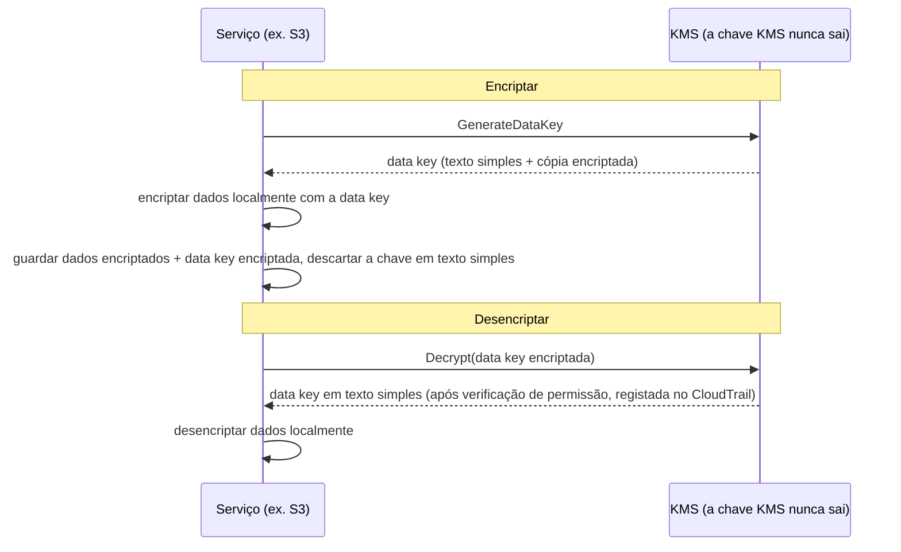

# Capítulo 16: Chaves, Fechaduras e Segredos

O repositório git tinha milhares de commits que recuavam dois anos. Leo andava a percorrê-lo há vinte minutos, a seguir um fio pela história — à procura de quando uma certa connection string de base de dados tinha aparecido pela primeira vez. Quase a perdeu. Estava numa terça-feira à tarde, entalada entre dois commits sem nada de especial, enviada por alguém que entretanto tinha saído da empresa.

Uma palavra-passe de base de dados. Em texto simples. No histórico.

---

*Os controlos de rede do capítulo anterior estavam agora apertados. Os grupos de segurança limitavam o movimento lateral. As NACLs bloqueavam intervalos de IP conhecidos como maus. O perímetro tinha sido reforçado. Mas a auditoria de segurança tinha encontrado algo que o perímetro não conseguia corrigir: uma credencial que andava a viver no histórico do git há seis meses. A segurança de perímetro assume que os segredos lá dentro estão seguros. Este não estava.*

---

Leo estava a rever o histórico do git quando o encontrou. Uma palavra-passe de base de dados. Confirmada há seis meses, em texto simples, por alguém que já não trabalhava na Nimbus — parte de um ficheiro `.env` que também continha a chave de acesso IAM do pipeline de deploy, duas linhas abaixo da connection string. O commit era público. A palavra-passe tinha entretanto sido alterada — mas não sabiam isso ao certo. Verificaram cada sistema que qualquer das credenciais alguma vez tinha tocado. Demorou quatro horas. Foi esse o dia em que a Nimbus decidiu parar de pôr segredos no código.

"Já pensámos no que acontece se alguém fizer fork do repositório?", disse Priya. "O histórico do git é permanente. Mesmo que mudemos a palavra-passe, qualquer pessoa que clonou o repositório antes da correção ainda tem a credencial antiga no seu histórico local."

"Verificámos", disse Leo. "A palavra-passe foi mudada há três meses. Todos os sistemas confirmados."

"Isso é o mínimo", disse Priya. "Mas cada sistema que essa credencial tocou precisa de ser revisto. Não apenas os que você conhece."

**A Auditoria de Quatro Horas**

Leo tinha encontrado o ficheiro `.env` vazado no histórico do git às 10h. Pelas 14h, tinham uma resposta à pergunta que importava: alguma das credenciais — a palavra-passe da base de dados ou a chave de acesso confirmada ao lado dela — tinha sido usada por alguém que não fossem sistemas da Nimbus?

A auditoria percorreu quatro categorias.

**Logs de acesso do RDS**: Cada conexão à base de dados, com timestamp e registada. A palavra-passe vazada apareceu em três connection strings — todas de instâncias EC2 no VPC da Nimbus, todas com IPs de origem esperados. Nenhuma conexão externa. A palavra-passe não tinha sido usada para conectar à base de dados de fora.

**Logs de acesso do S3**: A chave de acesso vazada pertencia ao utilizador IAM do pipeline de deploy, que tinha permissões para o bucket `nimbus-receipts`. Leo consultou os logs de acesso ao servidor S3 dos últimos seis meses. Cada acesso veio de instâncias EC2 em `us-west-2` ou da role de fetch da origem do CloudFront. Nenhuma anomalia.

**Chamadas de API do CloudTrail**: Cada chamada de API da AWS feita com o access key ID vazado. Leo filtrou os eventos do CloudTrail pela chave. Trezentos e doze eventos — todas chamadas `s3:PutObject` de rotina do pipeline de deploy, todas do mesmo IP, todas dentro do horário comercial. A chave só tinha sido usada de um endereço IP, que correspondia ao servidor de CI/CD.

"E o servidor de CI/CD", disse Priya, "está dentro do VPC. Teria tido de exfiltrar dados via HTTPS para um endpoint externo, e teríamos visto isso nos flow logs."

"Verificámos", disse Leo. "Nenhum HTTPS de saída desse servidor para IPs não-AWS nos últimos seis meses."

**Veredito**: Nenhuma das credenciais tinha sido usada por alguém fora da equipa Nimbus. A exposição foi um risco, não uma fuga.

"Mas não podemos ter a certeza", disse Priya. "Podemos estar razoavelmente confiantes com base nos logs. Não podemos ter a certeza. Essa distinção importa."

"O que nos daria a certeza?"

"Nada lhe dá a certeza depois de uma exposição de credenciais. Você roda a credencial, audita o acesso, documenta as suas descobertas, e avança com melhores controlos. A certeza não está disponível."

Tom andava a calcular durante a conversa. "Quatro horas do tempo de três engenheiros. Digamos quatro mil dólares em custo totalmente carregado. Mais a rotação da credencial, a documentação, o relatório do incidente."

"E isso é só a investigação", disse Priya. "Uma fuga teria sido ordens de magnitude maior. Notificações regulatórias. Comunicações a clientes. Possíveis multas."

"Então a lição de quatro mil dólares foi barata", disse Tom.

"Consideravelmente", disse Priya. "Não a repitamos."

---

**Os Dois Problemas: Guardar Segredos e Encriptar Dados**

A segurança em torno de informação sensível tem dois problemas distintos:

**Guardar credenciais** (palavras-passe de bases de dados, chaves de API, connection strings): Onde é que estas vivem? Quem pode aceder a elas? Como é que você as roda sem voltar a fazer deploy da sua aplicação?

**Encriptar dados** (informação de clientes, registos de pagamento, PII): Como é que você garante que mesmo que alguém ganhe acesso não autorizado à sua base de dados ou bucket S3, não consegue ler os dados?

A AWS tem um serviço dedicado para cada problema:

- **AWS Secrets Manager**: Guarda e gere credenciais com segurança
- **AWS KMS (Key Management Service)**: Gere as chaves de encriptação para encriptar e desencriptar dados

Pense no Secrets Manager como um chaveiro: contém as suas chaves (credenciais), mantém-nas organizadas, e roda-as num horário. Pense no KMS como um cofre: não contém o que é valioso — contém a chave que abre a fechadura que protege o que é valioso.

**AWS Secrets Manager: Acabou-se Colocar Credenciais no Código**

O Secrets Manager é um armazenamento seguro para segredos: credenciais de bases de dados, chaves de API, tokens OAuth, chaves SSH, ou qualquer coisa sensível.

Em vez de a sua aplicação ler uma palavra-passe de uma variável de ambiente ou ficheiro de configuração, ela chama a API do Secrets Manager no arranque (ou quando necessário) e obtém o segredo. O segredo nunca toca no disco. Nunca aparece no seu código. Não está nas suas variáveis de ambiente.

Eis como o fluxo se parece:

**Forma antiga**:
```
DB_PASSWORD=supersecretpassword123  # num ficheiro .env ou variável de ambiente
```

**Forma do Secrets Manager**:
```python
import boto3
client = boto3.client('secretsmanager')
secret = client.get_secret_value(SecretId='nimbus/production/db-password')
password = json.loads(secret['SecretString'])['password']
```

A instância EC2 precisa de uma role IAM com permissão para chamar `secretsmanager:GetSecretValue` para esse segredo específico. Nenhum outro serviço o pode ler. O segredo nunca está no código.

Você pode estar a perguntar-se: por que não usar simplesmente variáveis de ambiente? São mais simples — defina-as no momento do deploy, e a aplicação lê-as. As variáveis de ambiente parecem escondidas, mas estão guardadas na sua configuração de deploy, no armazenamento de secrets do CI/CD, possivelmente registadas durante sessões de debug, e visíveis para qualquer pessoa com acesso ao processo em execução. Mais importante, são estáticas: uma vez definidas, não mudam até alguém as atualizar manualmente. O Secrets Manager guarda credenciais num serviço encriptado com controlos de acesso IAM, logging de auditoria completo via CloudTrail, e rotação automática. As variáveis de ambiente não rodam. Uma variável de ambiente vazada permanece válida até alguém a mudar manualmente.

**Rotação Automática: O Verdadeiro Poder**

A maior funcionalidade do Secrets Manager não é guardar segredos — é rodá-los automaticamente.

Eis o cenário: a cada 30 dias, o Secrets Manager gera uma nova palavra-passe de base de dados, atualiza-a no RDS, atualiza o segredo guardado, e a sua aplicação obtém a nova palavra-passe da próxima vez que precisar dela. Sem intervenção manual. Sem deploy. Sem "preciso de me lembrar de rodar isto".

A rotação é implementada como uma função Lambda. A AWS fornece templates para bases de dados RDS (MySQL, PostgreSQL, Aurora). Você pode personalizar a função para qualquer tipo de credencial.

"Quanto é que isso custa por mês?", perguntou Tom.

O Secrets Manager cobra por segredo por mês mais por chamada de API. Para um pequeno número de palavras-passe de bases de dados e chaves de API, o custo é de dólares por mês — negligenciável comparado com o custo de um incidente.

"O comprometimento da semana passada", disse Priya, "quanto teria custado investigar e remediar?"

Tom ficou em silêncio por um momento. "Incluindo o meu tempo, o teu tempo, o fim de semana do Leo... uns dois mil dólares."

"O Secrets Manager teria apanhado a chave estática antes de ela ser explorada. E tê-la-ia rodado automaticamente."

Tom abriu a página de preços.

**O Que Acontece Durante a Rotação**

"Espera — mas *por que* faríamos dessa forma?", perguntou Maya. "Se a palavra-passe da base de dados roda, a aplicação quebra? Como é que ela apanha a nova palavra-passe sem um deploy?"

Esta era uma preocupação legítima. A rotação sem disrupção requer cuidado.

A rotação do Secrets Manager funciona em fases — concebida para prevenir o cenário "palavra-passe antiga de repente inválida, aplicação cai":

**Fase 1: Criar nova versão do segredo.** O Secrets Manager gera uma nova palavra-passe e guarda-a como uma versão pendente do segredo. A versão atual continua ativa.

**Fase 2: Definir no serviço.** O Lambda de rotação chama a base de dados para atualizar a palavra-passe para o novo valor. Atenção: com a estratégia de rotação padrão de **utilizador único (single-user)** há um breve momento em que a palavra-passe antiga acabou de deixar de funcionar (o `ALTER ROLE ... PASSWORD` do PostgreSQL tem efeito imediato) e a nova versão ainda não é a atual. Para rotação sem downtime, o Secrets Manager suporta uma estratégia de **utilizadores alternados (alternating-users)**: dois utilizadores de base de dados com permissões idênticas, onde a rotação atualiza sempre o *inativo* e depois troca — as credenciais ativas nunca são invalidadas a meio do voo. A frase de exame a lembrar é "alternating users rotation strategy".

**Fase 3: Testar o novo segredo.** O Lambda de rotação verifica que a nova palavra-passe funciona conectando-se com ela. Se isto falhar, a rotação é revertida.

**Fase 4: Concluir.** O Secrets Manager marca a nova versão como a versão atual e despromove a versão antiga a versão anterior. A versão anterior é mantida durante um período de graça.

Durante o período de graça, ambas as versões são obteníveis. Se a sua aplicação colocou em cache o segredo antigo e ainda não apanhou o novo, ainda se consegue conectar. Da próxima vez que chamar `GetSecretValue`, obtém a versão atual (nova).

"Então a aplicação nunca precisa de ser reiniciada", disse Leo.

"Não necessariamente. Se a sua aplicação coloca o segredo em cache no arranque e nunca o atualiza, você precisa de o atualizar num horário ou tratar das falhas de autenticação voltando a buscar o segredo."

"Então o Lambda de rotação e a aplicação precisam de cooperar", disse Maya.

"O Secrets Manager faz a metade dele. O código da sua aplicação precisa de fazer a outra metade: buscar o segredo quando necessário, tratar das falhas de autenticação voltando a buscar."

Leo atualizou a aplicação para apanhar exceções de autenticação da base de dados e, em caso de falha, buscar um segredo fresco do Secrets Manager antes de tentar de novo. Duas linhas de tratamento de erros. A rotação tornou-se invisível para os utilizadores.

---

**Injeção de Segredos no Pipeline de CI/CD**

"Já pensámos em como o pipeline de deploy obtém os segredos de que precisa?", perguntou Priya. "O pipeline faz deploy de infraestrutura. Precisa de credenciais AWS. Pode precisar de connection strings de base de dados para scripts de migração."

Leo explicou a configuração atual: os segredos estavam guardados como GitHub Actions Secrets — encriptados em repouso no GitHub, injetados como variáveis de ambiente em tempo de execução.

"As credenciais estão no GitHub", disse Priya.

"Encriptadas."

"Num sistema de terceiros. Uma fuga no GitHub expõe todos os segredos do nosso pipeline."

A solução: o pipeline de deploy autentica-se à AWS via federação OIDC (coberta no Capítulo 14) e obtém quaisquer segredos de que precisa do Secrets Manager em tempo de execução. Nenhum segredo guardado no GitHub. A role AWS do pipeline tem permissão para ler segredos específicos, nada mais.

```yaml
# Workflow do GitHub Actions
- name: Get DB Migration Credentials
  env:
    AWS_DEFAULT_REGION: us-west-2
  run: |
    SECRET=$(aws secretsmanager get-secret-value \
      --secret-id nimbus/staging/db-migration \
      --query SecretString --output text)
    DB_URL=$(echo $SECRET | jq -r '.url')
    # Correr a migração com DB_URL — nunca guardado num ficheiro
    flyway -url="$DB_URL" migrate
```

O segredo é buscado, usado em memória, e descartado. Nunca é escrito no disco, nunca guardado em variáveis de ambiente que persistem depois do job, nunca num ficheiro de log.

"E se o segredo for impresso no log?", perguntou Leo.

"O GitHub Actions mascara automaticamente os valores dos segredos que estão configurados como GitHub Secrets. Mas este segredo não é um GitHub Secret — vem do Secrets Manager. Você precisa de o mascarar manualmente, ou melhor, nunca o registar."

"Então a disciplina é: buscar, usar, descartar. Nunca registar segredos. Nunca os guardar em ficheiros."

"Essa disciplina", disse Priya, "é aquela em que a auditoria de quatro horas confirmou que tínhamos estado a falhar."


**AWS KMS: A Fábrica de Fechaduras**

"Espera — mas *por que* faríamos dessa forma?", perguntou Maya. "Por que um serviço de gestão de chaves separado? Não podemos simplesmente encriptar os dados nós próprios e guardar a chave no Secrets Manager?"

Você poderia guardar chaves de encriptação no Secrets Manager. Mas então quem controla o acesso à chave? O que garante que a chave é rodada? O que prova a um auditor que a chave só foi usada por serviços autorizados? O KMS responde a todas estas perguntas. Não é apenas armazenamento — é um serviço de gestão do ciclo de vida de chaves com segurança suportada por hardware, políticas IAM refinadas por chave, e um rasto de auditoria completo de cada uso. O Secrets Manager guarda o que você precisa para se conectar a sistemas. O KMS protege os próprios sistemas.

O AWS KMS (Key Management Service) gere **chaves criptográficas** — os valores secretos usados para encriptar e desencriptar dados.

A analogia: o KMS é como uma empresa de cofres que detém a chave-mestra. Os seus dados (o conteúdo do cofre) estão encriptados. Apenas alguém com permissão para usar a chave KMS os pode desencriptar. O KMS regista cada uso de cada chave no CloudTrail.

As **Customer Master Keys (CMKs)** — agora chamadas chaves KMS — vêm em três tipos de propriedade:

**Chaves propriedade da AWS (AWS owned keys)**: Chaves que a AWS possui e usa em muitas contas de clientes — você nunca as vê, nunca paga por elas, e elas não aparecem na sua conta. Vários padrões de serviços usam-nas (a encriptação padrão do DynamoDB, por exemplo).

(Uma distinção que vale a pena manter clara: a encriptação padrão **SSE-S3** do S3 *não* é de todo um modelo de chave KMS — o S3 gere as suas próprias chaves AES-256 inteiramente fora do KMS, sem chave para ver e sem rasto de auditoria de uso de chave. O **SSE-KMS** é a opção do S3 que passa pelo KMS, usando ou a chave gerida pela AWS `aws/s3` ou uma chave gerida pelo cliente. Gatilho de exame: "auditar quem usou a chave de encriptação" ou "controlar a rotação e a política de chave" → SSE-KMS com uma chave gerida pelo cliente — cada uso aterra no CloudTrail.)

**Chaves geridas pela AWS (AWS managed keys)**: A AWS cria e gere a chave automaticamente *na sua conta* para serviços como S3, EBS, RDS (com nomes como `aws/s3`). Você pode vê-la e auditar o seu uso no CloudTrail, mas não pode mudar a sua política ou rotação — a AWS roda-a automaticamente todos os anos. Gratuita.

**Chaves geridas pelo cliente (customer managed keys)**: Você cria a chave no KMS e controla cada aspeto dela: quem a pode usar, quando roda, quem a pode administrar. Você pode ativar a rotação automática de chave com um período configurável entre 90 dias e 2.560 dias (7 anos); o período de rotação padrão é 365 dias (anual). Você também pode acionar uma **rotação sob demanda** imediatamente — útil após uma suspeita de exposição, sem esperar pelo horário. Nota: a rotação automática aplica-se a chaves simétricas com material gerado pelo KMS — chaves assimétricas e material de chave importado não podem rodar automaticamente. Custo: $1/mês por chave mais cobranças por chamada de API.

Se você escolher chaves KMS geridas pelo cliente, então obtém controlo total sobre os horários de rotação, políticas de acesso e visibilidade de auditoria, mas paga por chave por mês e assume a responsabilidade da gestão de chaves; se você escolher chaves geridas pela AWS, então obtém encriptação com zero sobrecarga operacional e sem custo pela própria chave, mas não pode personalizar os horários de rotação ou as políticas de chave — são geridos inteiramente pela AWS.

**Encriptação em Serviços AWS: Integração com KMS**

A maioria dos serviços AWS integra-se com o KMS para encriptação:

**S3**: Ative a "encriptação do lado do servidor com KMS" num bucket. Cada objeto é encriptado em repouso com uma chave KMS. Ler um objeto requer permissão tanto para o bucket S3 *como* para a chave KMS.

**RDS**: Ative a encriptação no momento da criação. O armazenamento da base de dados, os backups e os snapshots são todos encriptados com uma chave KMS. Nota: a encriptação não pode ser ativada numa instância RDS não encriptada existente — você tem de fazer snapshot, copiar o snapshot com a encriptação ativada, e restaurar.

**EBS**: Encripte volumes com KMS. Novos volumes criados a partir de snapshots encriptados são automaticamente encriptados.

**DynamoDB**: A encriptação em repouso usando KMS está ativada por padrão em todas as tabelas.

**ElastiCache Redis**: Encriptação em repouso com KMS para dados sensíveis em cache.

O princípio: os dados devem ser encriptados em repouso (guardados no disco) e em trânsito (a mover-se por uma rede). O KMS trata da encriptação em repouso. O TLS/SSL (fornecido automaticamente pelos serviços AWS) trata da encriptação em trânsito.

**Encriptação de Envelope: Como o KMS Realmente Funciona**

Eis um detalhe que ajuda a perceber o comportamento do KMS e as perguntas de exame.

O KMS não encripta os seus dados diretamente na maioria dos casos. Usa a **encriptação de envelope (envelope encryption)**:

1. O KMS gera uma **data key** (uma chave simétrica única)
2. O serviço usa a data key para encriptar os seus dados localmente (rápido — encriptação simétrica)
3. O serviço pede ao KMS para encriptar a própria data key (usando a sua chave KMS)
4. Tanto os dados encriptados como a data key encriptada são guardados
5. Os seus dados reais nunca saem do serviço — apenas a data key vai ao KMS para encriptação/desencriptação

Quando você lê os dados:

1. O serviço pede ao KMS para desencriptar a data key
2. O KMS verifica as permissões, desencripta a data key, devolve-a
3. O serviço usa a data key desencriptada para desencriptar os seus dados localmente



Isto significa que o KMS consegue lidar com dados muito grandes sem os enviar todos pela API do KMS. Apenas chaves pequenas vão ao KMS. O CloudTrail regista cada chamada de API do KMS — cada operação de encriptar e desencriptar.

**Políticas de Chave KMS: O Modelo de Acesso**

"Já pensámos no que acontece se uma política IAM e uma política de chave entrarem em conflito?", perguntou Priya. "O KMS tem o seu próprio controlo de acesso por cima do IAM."

As chaves KMS têm **políticas de chave (key policies)** — políticas baseadas em recurso anexadas à própria chave. São distintas das políticas IAM e seguem regras de avaliação diferentes.

Para um principal usar uma chave KMS, duas coisas têm de ser verdadeiras:

**Primeiro**: A política de chave tem de o permitir. Se a política de chave não conceder explicitamente acesso ao principal, ele não pode usar a chave — independentemente do que a sua política IAM diga. Isto é diferente da maioria dos recursos AWS, onde as políticas IAM sozinhas são suficientes.

**Segundo**: A política IAM do principal tem de permitir a ação KMS (ex.: `kms:Decrypt`, `kms:GenerateDataKey`).

Ambos têm de dizer sim. Qualquer um a dizer não significa que a ação é negada.

A política de chave padrão que a AWS cria para chaves geridas pelo cliente inclui uma declaração que diz "a conta root pode gerir esta chave". Isto é importante: significa que um administrador IAM ao nível da conta pode sempre conceder acesso a uma chave, mesmo que a política de chave não o nomeie diretamente — porque a delegação à conta root está no lugar.

"Então se removermos a conta root da política de chave", perguntou Leo, "as políticas IAM param de funcionar para essa chave?"

"Correto. Remover a delegação à conta root é uma forma de trancar uma chave tão apertadamente que apenas os principals específicos nomeados na política de chave a podem usar — nem mesmo os administradores de conta. É também uma forma de você se trancar acidentalmente fora da sua própria chave."

"Conseguimos recuperar?"

"Apenas contactando o Suporte da AWS. Se ninguém conseguir usar a chave e a política de chave não puder ser atualizada, os dados encriptados com essa chave ficam efetivamente inacessíveis."

"Então não remova a conta root da política de chave sem uma razão extremamente boa."

"Correto."

---

**Chaves Assimétricas: Assinatura e Verificação**

O KMS também suporta pares de chaves assimétricas — uma chave pública e uma chave privada.

Os casos de uso:

**Assinatura digital**: Você assina um documento ou um token JWT com a chave privada. Qualquer pessoa com a chave pública pode verificar que a assinatura veio do detentor da chave privada, e que o conteúdo não foi adulterado.

**Encriptação de chave pública**: Qualquer pessoa pode encriptar dados com a chave pública. Apenas o detentor da chave privada os pode desencriptar.

Para a Nimbus, as chaves assimétricas tornaram-se relevantes quando eles implementaram um sistema de assinatura de webhooks para os restaurantes parceiros. Quando a Nimbus enviava um evento para o servidor de um restaurante parceiro (um novo pedido, uma atualização de estado), o parceiro precisava de verificar que o evento tinha de facto vindo da Nimbus e não tinha sido forjado.

A implementação:

1. A Nimbus cria uma chave KMS assimétrica (RSA 2048-bit, algoritmo SIGN_VERIFY)
2. Ao enviar um webhook, a Nimbus chama `kms:Sign` com a chave privada para assinar o payload do evento
3. A assinatura é incluída no cabeçalho do webhook
4. A Nimbus publica a chave pública (descarregável da consola do KMS)
5. O servidor do restaurante parceiro busca a chave pública e usa-a para verificar a assinatura em cada webhook recebido

A chave privada nunca sai do KMS. A Nimbus nunca tem acesso ao material bruto da chave privada. O KMS realiza a operação de assinatura dentro do seu hardware security module.

"Então mesmo que alguém comprometesse um servidor da Nimbus", disse Rafael, "não conseguiria forjar uma assinatura de webhook. A chave privada está no KMS, não em nenhum servidor."

"Correto. A assinatura requer uma chamada de API do KMS. Cada chamada de API é registada no CloudTrail. Se alguém tentasse assinar um evento fraudulento, veríamos a chamada de API."

---

**A História da Eliminação de Chave**

Três meses depois da configuração do KMS, Tom cometeu um erro.

Ele estava a limpar recursos AWS não utilizados — funções Lambda antigas, buckets S3 obsoletos, painéis do CloudWatch abandonados. Estava a mover-se depressa. Agendou acidentalmente uma chave KMS para eliminação.

A chave era `nimbus/prod/order-receipts` — a chave gerida pelo cliente usada para encriptar o bucket S3 dos recibos de pedidos.

"Eliminei em lote doze recursos ontem e não verifiquei qual era o décimo segundo", disse Tom de forma plana. Ele tinha agendado a eliminação e seguido em frente. Reparou no erro na manhã seguinte quando reviu as suas ações.

Ele abriu a consola do KMS. O estado da chave dizia: "Pendente de eliminação. Eliminação em 7 dias."

Ele tinha-a agendado para o período de espera mínimo.

"Podemos cancelar?", perguntou ele.

Priya abriu a documentação. "Sim. Durante o período de espera, a chave fica desativada mas não eliminada. Você pode cancelar a eliminação."

Tom cancelou a eliminação dentro do minuto. A chave foi restaurada para o estado ativo.

"Sete dias é o período de espera mínimo", disse Priya. "A AWS impõe-no porque se uma chave for eliminada e dados foram encriptados com ela, esses dados desaparecem para sempre. Irrecuperáveis. O período de espera dá-lhe tempo para perceber o erro."

"Quanto tempo deve ser o período de espera?"

"O máximo são trinta dias. Para qualquer chave que encripte dados de produção, use trinta dias. As três semanas extra de proteção contra acidentes valem o pequeno inconveniente."

Tom atualizou todas as definições de eliminação de chaves de produção para trinta dias. Também configurou um alarme do CloudWatch que disparava se o estado de qualquer chave KMS mudasse para "Pendente de eliminação" — para que da próxima vez que alguém (incluindo ele) cometesse o mesmo erro, a equipa soubesse dentro de cinco minutos.

---

**Secrets Manager vs Parameter Store**

A AWS também tem o **Systems Manager Parameter Store**, que guarda valores de configuração (não apenas segredos). O Parameter Store é mais barato — gratuito para parâmetros padrão. Também pode guardar parâmetros encriptados usando KMS.

Para segredos que precisam de rotação: Secrets Manager.

Para valores de configuração e parâmetros não sensíveis: Parameter Store (o nível gratuito é muito generoso).

Para configuração de aplicação (números de porta, feature flags, definições específicas de ambiente): Parameter Store.

| | Secrets Manager | SSM Parameter Store |
|---|---|---|
| Rotação automática | Sim (suportada por Lambda) | Não |
| Custo | ~$0,40/segredo/mês | Gratuito (padrão) |
| Encriptação | Sempre | Opcional (com KMS) |
| Versionamento | Sim | Sim |
| Acesso entre contas | Sim | Limitado |
| Melhor para | Palavras-passe de bases de dados, chaves de API | Valores de config, feature flags |

## O Certificado na Porta

Duas semanas depois da migração de segredos, Priya estava a rever o ambiente de staging da Nimbus no seu telemóvel quando reparou na barra de endereços.

"Não Seguro."

Ela abriu o URL de produção. A mesma coisa.

"Leo", disse ela, pousando o telemóvel na mesa. "Estamos a correr em HTTP?"

Leo verificou. "O listener do ALB está na porta 80. Nunca configurámos HTTPS."

"Então cada pedido que os nossos utilizadores fazem — cada pedido, cada login — vai por HTTP não encriptado?"

"Temos TLS na conexão do RDS", ofereceu Leo.

"Isso são dados em trânsito entre a aplicação e a base de dados. Eu estou a falar de dados em trânsito entre o browser do utilizador e o nosso balanceador de carga. Isso não está encriptado de todo."

Tom tinha estado a ouvir. "Isso é um problema de segurança ou um problema de perceção?"

"Ambos", disse Priya. "HTTP não encriptado significa que qualquer rede entre o utilizador e o nosso servidor — um router de café, um ISP — pode ler o tráfego. Palavras-passe, detalhes de pedidos, tokens de sessão. E os browsers modernos avisam os utilizadores com 'Não Seguro'. Isso mata as taxas de conversão."

"Então precisamos de um certificado TLS", disse Maya. "Quanto é que isso custa?"

"Nada", disse Priya. "AWS Certificate Manager."

O **AWS Certificate Manager (ACM)** provisiona certificados TLS/SSL gratuitos para uso com serviços geridos pela AWS: ALBs, distribuições CloudFront e API Gateway. Você não compra um certificado, não gere um calendário de renovações, nem toca em material de chave privada. O ACM trata de todo o ciclo de vida do certificado.

Um certificado emitido pelo ACM é válido por 13 meses. Antes de expirar, o ACM renova-o automaticamente. Se a renovação tiver sucesso, o novo certificado é anexado ao seu balanceador de carga ou distribuição sem qualquer ação da sua parte. O cadeado do browser fica verde. O alerta de expiração que você se esqueceu de definir nunca dispara.

**Dois tipos de certificados ACM**:

Os **certificados públicos** são emitidos pela autoridade de certificação da Amazon e confiáveis por todos os principais browsers. São completamente gratuitos para uso com ALB, CloudFront e API Gateway. Você valida a propriedade do domínio via DNS ou e-mail.

Os **certificados privados** são emitidos pela AWS Private CA — uma autoridade de certificação privada gerida que você corre para serviços internos (mTLS serviço-a-serviço, ferramentas internas, clientes de VPN). A Private CA tem um custo mensal.

Para a Nimbus, os certificados públicos eram a escolha certa.

**Validação por DNS vs. validação por e-mail**:

Leo abriu a consola do ACM e iniciou um pedido de certificado para `eatnimbus.com` e `*.eatnimbus.com`.

"Está a perguntar como quero validar a propriedade", disse ele. "DNS ou e-mail."

"DNS", disse Priya. "Sempre DNS."

Com a validação por DNS, o ACM adiciona um registo CNAME específico à sua zona alojada. O Route 53 pode fazer isto automaticamente — um clique na consola. Enquanto esse registo CNAME existir, o ACM pode renovar automaticamente o certificado sem qualquer ação humana. A validação por e-mail envia um e-mail para o contacto registado do domínio e requer um clique manual sempre que o certificado renova. Esse clique é esquecido. A validação por DNS não requer que ninguém se lembre de nada.

"Então eu adiciono o registo CNAME uma vez", disse Leo, "e ele renova para sempre?"

"Até alguém eliminar o registo CNAME", disse Priya. "Não elimine o registo CNAME."

Leo pediu o certificado, adicionou o CNAME de validação no Route 53 (que o ACM se ofereceu para fazer automaticamente), e esperou cinco minutos. O estado do certificado mudou para Emitido. Ele anexou-o ao listener HTTPS do ALB na porta 443 e adicionou uma regra de redirecionamento na porta 80 para enviar todo o tráfego HTTP para HTTPS.

Tom atualizou o URL de produção.

O cadeado apareceu.

Um detalhe regional que merece sinalização: um certificado é um recurso regional, e tem de viver na mesma região que o serviço que o usa. Para um ALB, é a região do ALB. Para o **CloudFront**, o certificado tem de ser pedido (ou importado) em **`us-east-1`** — sempre, independentemente de onde as suas origens correm — porque o CloudFront é um serviço global ancorado lá. Leo já tinha tropeçado nisto no Capítulo 13; é também um facto de exame fiável.

**A única coisa que os certificados ACM não conseguem fazer**:

"Posso descarregar o certificado?", perguntou Leo. "Quero instalá-lo na instância EC2 de administração interna."

"Não", disse Priya.

Os certificados públicos gratuitos do ACM não podem ser exportados. Você não pode descarregar a chave privada e instalá-la numa instância EC2, num servidor Nginx, ou em qualquer coisa fora dos serviços geridos pela AWS. O material da chave privada nunca sai do ACM. Isto é intencional — previne que a chave privada seja vazada, guardada de forma insegura, ou esquecida quando o certificado expira.

Para casos de uso que requerem um certificado instalável — uma instância EC2 a atuar como um proxy personalizado, um servidor on-premises — há três caminhos: um certificado de uma autoridade de terceiros (Let's Encrypt, por exemplo), a AWS Private CA com a exportação de certificados ativada, ou — desde junho de 2025 — os **certificados públicos exportáveis** pagos do ACM (opt-in na emissão, cobrados por FQDN ou wildcard), cuja chave privada *pode* ser exportada para uso em qualquer lugar.

"Para o nosso ALB e a nossa distribuição CloudFront", disse Priya, "o ACM é exatamente o certo. Gratuito, automático, e nunca tocamos numa chave."

## Pontos Fortes e Limitações

**AWS Secrets Manager**:

- Rotação automática de segredos sem mudanças de código ou deploys
- Controlo de acesso IAM refinado por segredo (cada segredo é um recurso IAM separado)
- Versionamento — a versão anterior permanece acessível durante a rotação, prevenindo quedas de conexão
- Auditoria via CloudTrail — cada chamada `GetSecretValue` é registada com a identidade de quem chama
- Acesso entre contas — os segredos de uma conta podem ser partilhados com a role de outra conta
- Custo: ~$0,40/segredo/mês + chamadas de API (cerca de $0,05 por 10.000 chamadas de API)

**AWS KMS**:

- Gestão de chaves centralizada com rasto de auditoria completo — cada encriptação e desencriptação registada
- Rotação automática de chave configurável para chaves geridas pelo cliente (90 dias a 2.560 dias; padrão 365 dias) — o material de chave antigo ainda desencripta os dados existentes, o novo material de chave encripta os novos dados
- Permissões IAM refinadas por chave (políticas de chave + políticas IAM — ambas têm de permitir)
- Suportado por Hardware Security Module (HSM) — as chaves nunca saem do HSM em texto simples
- Suporte de chave multi-Região para cenários de recuperação de desastres
- Suporte de chave assimétrica para assinatura e verificação digital
- Custo: $1/mês por chave + $0,03 por 10.000 chamadas de API

**Onde fica complicado**:

- As políticas de chave KMS são separadas (e avaliadas ao lado) das políticas IAM — depurar erros de access denied requer verificar ambas
- A encriptação em repouso tem de ser planeada de antemão — você não pode encriptar uma instância RDS não encriptada existente no lugar
- A eliminação de chave no KMS tem um período de espera de 7-30 dias — um mecanismo de segurança, mas fácil de esquecer durante a configuração e perigoso de acionar acidentalmente
- A rotação requer código de aplicação para tratar de voltar a buscar segredos em caso de falha de autenticação — o Secrets Manager roda a credencial, mas a aplicação tem de a apanhar
- Os custos do Secrets Manager escalam com o número de segredos e o volume de chamadas de API em grande escala
- A política de chave padrão (incluindo a delegação à conta root) é crítica de preservar — removê-la pode trancar os administradores fora da chave

## Resumo

As quatro horas gastas a seguir uma credencial comprometida por cada sistema que tocou foram quatro horas que o Secrets Manager poderia ter prevenido. A rotação automática significa que uma credencial roubada tem uma vida curta. O KMS significa que mesmo que alguém chegue aos dados, não os consegue ler sem uma chave que não está autorizado a usar. E um período de espera de trinta dias para a eliminação de chave significa que uma eliminação acidental pode ser cancelada antes de se tornar um evento de perda de dados.

- Nunca guarde credenciais no código, variáveis de ambiente ou ficheiros de configuração confirmados no controlo de versões.
- O **Secrets Manager** guarda credenciais com segurança e roda-as automaticamente. As aplicações buscam segredos via API em tempo de execução.
- A **rotação** acontece em fases: criar nova versão, atualizar no serviço, testar, promover. Tanto a versão antiga como a nova são brevemente válidas, prevenindo quedas de conexão durante a rotação.
- O **KMS** gere as chaves de encriptação. A maioria dos serviços AWS integra-se com o KMS para encriptação em repouso.
- **Encriptação de envelope**: o KMS encripta a chave, não os dados diretamente. O serviço encripta os dados usando uma data key local, que o KMS encripta. Apenas chaves pequenas atravessam a API do KMS.
- **Chaves KMS geridas pelo cliente**: controlo total sobre a rotação (configurável 90–2.560 dias, padrão 365 dias anual), acesso e auditoria ($1/mês). **Chaves geridas pela AWS**: automáticas, sem configuração necessária, gratuitas.
- **Políticas de chave KMS**: A política de chave é uma política baseada em recurso que funciona ao lado do IAM. Ambas têm de dizer sim. A delegação à conta root na política de chave padrão garante que os administradores IAM podem sempre conceder acesso.
- **Chaves assimétricas**: O KMS suporta pares de chaves RSA e ECC para assinatura e verificação. A chave privada nunca sai do HSM.
- **Eliminação de chave**: Período de espera mínimo de 7 dias, máximo de 30 dias. Chaves eliminadas significam dados encriptados permanentemente inacessíveis. Use 30 dias para chaves de produção, e monitorize o estado de pendente de eliminação.
- **Segredos de CI/CD**: Busque do Secrets Manager em tempo de execução usando federação OIDC. Nunca guarde segredos como variáveis da plataforma de CI/CD.

## Dicas de Exame

*Domínio SAA-C03: Projetar Arquiteturas Seguras (Domínio 1, Tarefa 1.3)*

- **Secrets Manager vs SSM Parameter Store**: Secrets Manager para credenciais que precisam de rotação automática; Parameter Store para configuração geral. O exame distingue-os pelo requisito de rotação e sensibilidade ao custo.
- **Políticas de chave KMS**: Uma chave KMS tem a sua própria política de chave (uma política baseada em recurso). As políticas IAM sozinhas não concedem acesso a uma chave KMS — a política de chave tem de o permitir explicitamente. Tanto a política de chave como a política IAM têm de permitir a ação.
- **Encriptar RDS**: Não pode ativar a encriptação numa instância RDS não encriptada existente. O processo: criar um snapshot → copiar o snapshot com a encriptação ativada → restaurar do snapshot encriptado → migrar o tráfego para a nova instância.
- **Encriptação EBS**: Novos volumes podem ser encriptados. Os snapshots de volumes encriptados são sempre encriptados. Volumes não encriptados não podem ser diretamente encriptados — snapshot + cópia + restauro.
- **CloudTrail + KMS**: Cada chamada de API do KMS é registada no CloudTrail. Esta é uma funcionalidade-chave de conformidade. Quando um exame pergunta como auditar quem desencriptou quais dados, a resposta é CloudTrail + KMS.
- **Chaves KMS multi-Região**: Replique o material de chave para múltiplas regiões para que a desencriptação possa acontecer sem chamadas de API entre regiões. O exame usa isto para recuperação de desastres multi-região com dados encriptados.
- **KMS vs CloudHSM**: O KMS é multi-tenant (gerido pela AWS). O CloudHSM é um hardware security module dedicado que só você controla. Sinais de exame: "FIPS 140-2 Level 3", "HSM dedicado", "operações criptográficas geridas pelo cliente" → CloudHSM.
- **Encriptação de envelope**: O KMS gera uma data key, o serviço usa-a para encriptar dados localmente, o KMS encripta a data key. Pergunta de exame: "por que é que o KMS não encripta grandes quantidades de dados diretamente?" → desempenho; a encriptação de envelope mantém os dados grandes locais.
- **Chaves KMS assimétricas**: Usadas para assinatura digital, verificação de JWT, ou encriptação de chave pública. A chave privada nunca sai do KMS. `kms:Sign` é a chamada de API para assinar; `kms:Verify` para verificar.
- **Período de espera da eliminação de chave**: 7-30 dias. Durante este período, a chave fica desativada e inutilizável, mas a eliminação pode ser cancelada. Após a eliminação, quaisquer dados encriptados com essa chave são permanentemente irrecuperáveis.
- **ACM (AWS Certificate Manager):** Certificados TLS públicos gratuitos para uso com ALB, CloudFront e API Gateway. Renovação automática via validação por DNS. Os certificados públicos gratuitos não podem ter a sua chave privada exportada — vivem apenas dentro da AWS (existe uma opção paga de *certificado público exportável* desde 2025 para uso em EC2/on-premises). Gatilho de exame: "HTTPS no balanceador de carga ou CDN" → ACM.

## Exercícios

**Exercício 1 — Recordar**

Explique o conceito de encriptação de envelope. Por que é que o KMS encripta uma data key pequena em vez de encriptar os dados da sua aplicação diretamente?

*(Sugestão: Pense no que acontece se você tiver 1GB de dados para encriptar, e quais seriam as implicações de desempenho de enviar 1GB para um serviço KMS remoto.)*

**Exercício 2 — Cenário SAA-C03**

*Cenário*: Uma empresa de serviços financeiros guarda dados sensíveis de clientes numa base de dados RDS MySQL. Um novo requisito de conformidade exige que:

1. Todos os dados sejam encriptados em repouso
2. Todo o uso de chaves de encriptação seja auditável
3. As chaves de encriptação sejam controladas pelo cliente (não geridas pela AWS)
4. A palavra-passe da base de dados seja rodada automaticamente a cada 90 dias

A base de dados foi criada há seis meses sem encriptação ativada. Qual conjunto de ações MELHOR satisfaz todos os quatro requisitos?

A) Ativar a encriptação do RDS na base de dados existente; criar uma chave KMS gerida pelo cliente; configurar o Secrets Manager com rotação de 90 dias  
B) Criar um snapshot da base de dados existente; copiar o snapshot com encriptação usando uma chave KMS gerida pelo cliente; restaurar do snapshot encriptado; configurar o Secrets Manager com rotação de 90 dias  
C) Criar uma nova instância RDS encriptada com uma chave gerida pela AWS; migrar os dados da instância antiga; configurar o Secrets Manager com rotação de 90 dias  
D) Ativar a encriptação em repouso do RDS na base de dados existente usando uma chave gerida pela AWS; configurar o Secrets Manager com rotação de 90 dias

**Sugestão 1**: Você não pode ativar a encriptação numa instância RDS não encriptada existente diretamente.

**Sugestão 2**: Chaves "controladas pelo cliente" significam chaves KMS geridas pelo cliente, não chaves geridas pela AWS.

**Sugestão 3**: O processo de cópia de snapshot é o caminho de migração padrão para RDS encriptado.

**Resposta**: B

**Explicação**: A encriptação do RDS não pode ser ativada numa instância existente. A abordagem padrão é: fazer snapshot da instância existente → copiar o snapshot com a encriptação ativada usando uma chave KMS gerida pelo cliente (satisfaz os requisitos 1, 2 e 3) → restaurar do snapshot encriptado. As chaves KMS geridas pelo cliente registam automaticamente todo o uso no CloudTrail (auditoria) e mantêm as chaves de encriptação sob o seu controlo. O Secrets Manager trata da rotação automática da palavra-passe a cada 90 dias (satisfaz o requisito 4).

**Por que não A?** Você não pode ativar a encriptação numa instância RDS não encriptada existente no lugar.

**Por que não C?** As chaves geridas pela AWS não satisfazem o requisito de "controladas pelo cliente" (requisito 3).

**Por que não D?** Mesmo problema que A (não se pode ativar no lugar) mais a chave gerida pela AWS não satisfaz o requisito 3.

*Domínio SAA-C03: Projetar Arquiteturas Seguras — Tarefa 1.3*

**Exercício 3 — Desafio de Arquitetura** *(Opcional)*

A Nimbus precisa de guardar os seguintes dados sensíveis:

- Palavra-passe da base de dados para a instância RDS de produção
- Chave secreta da API da Stripe (usada para processamento de pagamentos)
- Uma chave de encriptação simétrica para encriptar o histórico de pedidos de clientes no DynamoDB
- Valores de configuração por restaurante (endpoints de API, feature flags — não sensíveis)

Que serviço ou abordagem AWS usaria para cada um? Que estratégia de rotação aplicaria a cada um?

*(Não existe uma resposta única correta. O objetivo é praticar a correspondência de ferramentas de segurança a casos de uso.)*

## Cena Pós-Créditos

"Eu já fiz o deploy — oh." Leo tinha migrado os segredos de produção para o Secrets Manager enquanto o ambiente de desenvolvimento ainda estava a usar as variáveis de ambiente antigas. O ambiente de dev quebrou. Ele teve de reverter a config de dev manualmente.

"Staging primeiro", disse Priya. "Depois produção."

"Eu sei", disse Leo.

Os segredos foram migrados.

Palavras-passe de bases de dados: Secrets Manager, a rodar a cada 30 dias.

Chaves de API: Secrets Manager, com um Lambda de rotação que chamava a API do fornecedor de pagamentos para gerar uma nova chave.

Dados de pedidos de clientes: encriptados com uma chave KMS gerida pelo cliente.

Credenciais antigas: desativadas. Ficheiros de config antigos: eliminados. Secrets antigos do GitHub Actions: removidos.

"Estamos agora prontos para auditoria", disse Priya.

"Define pronto para auditoria", disse Maya.

"Se um auditor de conformidade nos pedisse para provar que nenhuma credencial está fixa no código ou exposta na nossa infraestrutura, poderíamos mostrar-lhe: cada segredo está no Secrets Manager, cada chave de encriptação está no KMS, cada acesso está registado no CloudTrail."

"Quando foi a última vez que alguém verificou os logs do CloudTrail?"

Uma pausa.

"Eu verifico-os todas as semanas", disse Priya.

"E se algo invulgar aparecesse, como é que saberíamos?"

"Isso", disse Priya, fechando o portátil, "é a próxima conversa."

No próximo capítulo: as três camadas de defesa que se erguem entre a Nimbus e a internet.
