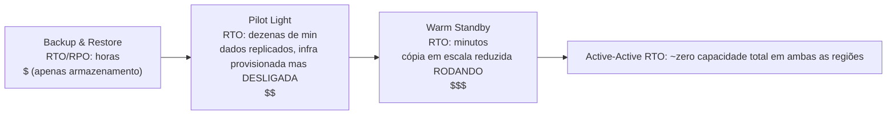

# Capítulo 18: Quando as Coisas Falham

As luzes se apagaram às 23h17.

Não no escritório da Nimbus — Leo estava em casa, no sofá, com o laptop meio fechado. As luzes se apagaram em um data center no Oregon que ele nunca tinha visitado, em um prédio que nunca tinha visto, em uma sala cheia de servidores em que nunca tinha tocado. Ele ainda não sabia. Houve um momento — apenas um momento — de silêncio completo antes de os geradores de reserva entrarem em ação em algum lugar bem distante. Aquele tipo de escuridão em que você não consegue dizer se seus olhos estão abertos ou fechados.

Então chegou a notificação do Slack.

---

Depois que os sistemas de monitoramento do capítulo 17 foram colocados em funcionamento, a equipe tinha sentido algo parecido com confiança. Os alertas estavam disparando. Os painéis estavam verdes. Os logs estavam fluindo para o CloudWatch. Eles tinham passado três semanas conectando visibilidade a cada canto da infraestrutura da Nimbus.

O que ninguém tinha dito em voz alta — aquilo contra o qual o monitoramento não protegia — era que visibilidade e resiliência são coisas diferentes. Você pode observar algo falhar em perfeito detalhe. Observar não impede a falha.

Essa lição chegou às 23h23 de uma quinta-feira.

---

Leo recebeu a notificação do Slack.

"us-west-2 — falha de cluster de data center — serviço degradado."

Ele abriu o console da AWS. As instâncias EC2 em uma das Zonas de Disponibilidade estavam mostrando falhas nas verificações de estado. Seu Auto Scaling Group tinha detectado instâncias não íntegras e estava lançando substitutas — na mesma zona.

No cluster que estava falhando.

As novas instâncias também não conseguiam iniciar. Estavam na mesma zona de falha de hardware.

"O balanceador de carga está roteando tráfego para ambas as AZs", disse Leo para ninguém. "Metade do nosso tráfego está indo para instâncias que não funcionam."

Ele abriu o console do EC2 e começou a clicar. Em Load Balancers, o Application Load Balancer mostrava ambos os grupos de destino como íntegros — porque a verificação de integridade passava na porta 80, e até as instâncias com falha respondiam a essa verificação. Elas simplesmente não conseguiam processar requisições reais.

Ele tentou remover a AZ com falha do grupo de destino. O console aceitou a alteração. Mas o Auto Scaling Group, configurado para manter o equilíbrio, imediatamente começou a tentar substituir as instâncias encerradas — na mesma zona com falha.

Leo encarou a tela. Ele tinha acabado de piorar a situação.

Ele abriu a configuração do ASG. A opção "Equilibrar capacidade entre Zonas de Disponibilidade" estava ativa. Em operação normal, isso era um bom design. Naquele momento, estava ativamente lutando contra ele.

Ele mudou o ASG para usar apenas a zona saudável. Aplicou a alteração.

O console mostrou a alteração como "Em serviço."

Três minutos depois, as primeiras instâncias substitutas saudáveis subiram.

O balanceador de carga começou a rotear tráfego. A taxa de erros caiu de 52% para 4%. Os 4% restantes eram requisições que tinham caído nas últimas instâncias não íntegras ainda drenando conexões.

Às 23h45 — vinte e dois minutos depois de a falha começar — o tráfego estava estável.

Vinte e dois minutos de serviço degradado antes de ele notar e deslocar manualmente o ASG para usar apenas a zona saudável.

"Isso aconteceu porque tudo estava em uma única AZ", disse Priya na manhã seguinte.

"Não", disse Leo. "Eu tinha instâncias em duas AZs. O problema era que as instâncias substitutas estavam surgindo na AZ com falha."

"E o banco de dados?"

Leo parou.

"O primário do RDS estava na zona com falha", disse ele. "O Multi-AZ realmente fez o seu trabalho — fez failover para o standby na zona saudável em cerca de noventa segundos. Mas nossos servidores de aplicação mantiveram suas conexões mortas abertas e tentaram novamente o endereço IP em cache em vez de resolver de novo o nome DNS do endpoint. O banco de dados estava saudável às 23h25. Nossa aplicação só reconectou de forma limpa quando eu reiniciei os pools de conexão."

Vinte e dois minutos de serviço degradado tinham se tornado trinta e oito.

Quando Leo configurou o Auto Scaling Group oito meses antes, ele tinha marcado a opção "equilibrar capacidade entre AZs" e achado que aquilo era bom o suficiente. "Vai ficar tudo bem", ele tinha dito à Maya na época. "A AWS cuida da parte das AZs automaticamente." Ele estava certo em dizer que a AWS cuida disso — e errado sobre o que "automaticamente" significava.

"O que teria acontecido", perguntou Maya na manhã seguinte, "se tivéssemos configurado tudo corretamente? Como é uma configuração Multi-AZ correta em uma falha real?"

Leo pensou a respeito. Ele vinha pensando nisso desde as 23h45.

Na configuração correta hipotética: o ASG teria verificações de integridade de instância que olhavam para a integridade do ALB — não apenas para o status do EC2. Quando a AZ falhasse, a verificação de integridade nessas instâncias teria falhado em 30 segundos. O ASG teria detectado as falhas e imediatamente começado a lançar substitutas — e quando os lançamentos falham persistentemente em uma AZ, o grupo desloca capacidade para as zonas saudáveis restantes em vez de lutar contra a zona com falha.

O balanceador de carga teria retirado os destinos da AZ com falha da rotação dentro dos mesmos 30 segundos. O tráfego teria se concentrado na AZ saudável.

Para o banco de dados: o próprio failover Multi-AZ tinha funcionado — o que faltou foi disciplina do cliente. Pools de conexão que resolvem de novo o nome DNS do endpoint na reconexão (em vez de armazenar o IP em cache), TTLs de cache DNS curtos e lógica de repetição. Com isso em vigor, um failover do RDS é um soluço de 60 a 120 segundos, não uma cauda de 16 minutos.

Impacto total visível ao cliente: 60 a 90 segundos de latência degradada enquanto o banco de dados fazia failover. Não 38 minutos de erros em cascata.

"Tínhamos toda a infraestrutura para sobreviver a isso", disse Leo. "Apenas a configuramos incorretamente."

Essa frase foi mais difícil de dizer do que o incidente original tinha sido.

**A Analogia da Rede Elétrica**

Pense em como a sua casa recebe eletricidade. A energia não vem de um único fio ligado a um único gerador. Vem de uma rede — uma teia de geradores, subestações e linhas de transmissão que se apoiam mutuamente. Se uma subestação pegar fogo, as outras reencaminham a energia em torno dela. Você não percebe. As luzes ficam acesas.

As Zonas de Disponibilidade da AWS funcionam da mesma forma. Em vez de um único data center gigante do qual tudo depende, a AWS distribui seus recursos por várias instalações fisicamente separadas. Se uma instalação perde energia ou tem uma falha de hardware, as outras continuam funcionando. O tráfego é reencaminhado automaticamente. Sua aplicação permanece no ar — porque nunca houve um único fio para cortar.

Isso é a **arquitetura Multi-AZ**: distribuir seus recursos por instalações fisicamente separadas para que uma falha nunca derrube tudo.

Multi-Região é o próximo nível: imagine ter geradores de reserva em uma cidade completamente diferente. Se toda a rede elétrica local cair, a cidade remota assume. Mais complexo de configurar, mas mais resiliente a falhas catastróficas.

Você pode estar se perguntando: se Multi-AZ significa apenas distribuir recursos por dois data centers, por que a AWS não faz disso o padrão para tudo? A resposta é custo. Multi-AZ basicamente dobra a infraestrutura — e, para um ambiente de desenvolvimento ou uma ferramenta interna de baixo tráfego, esse custo extra não se justifica. Para cargas de trabalho de produção, porém, a pergunta se inverte: você pode pagar pelo tempo de inatividade se não tiver isso?

**O Vocabulário da Falha**

Antes de projetar para resiliência, você precisa de palavras para aquilo contra o qual está projetando.

"Como é que sequer medimos se somos resilientes o suficiente?" perguntou Priya.

"Dois números", disse Leo. "Por quanto tempo podemos ficar fora do ar e quantos dados podemos perder."

**Disponibilidade**: A porcentagem de tempo em que um sistema está operacional. "Quatro noves" (99,99%) significa menos de 52 minutos de tempo de inatividade por ano. "Cinco noves" (99,999%) significa cerca de 5 minutos por ano.

**RTO (Recovery Time Objective)**: Por quanto tempo o sistema pode ficar fora do ar antes de se tornar um problema de negócio? Se o seu RTO for de 4 horas, você tem 4 horas para restaurar o serviço antes que os SLAs sejam violados.

**RPO (Recovery Point Objective)**: Quantos dados você pode se dar ao luxo de perder? Se o seu RPO for de 1 hora, você pode tolerar perder até uma hora de dados em uma falha catastrófica. Tudo o que foi gravado na última hora antes da falha se perde.

**Tolerância a falhas**: A capacidade de continuar operando (em algum nível) quando um componente falha.

**Recuperação de desastres (DR)**: O processo de recuperação de uma falha catastrófica — incêndio em data center, paralisação de toda a região, exclusão acidental em massa.

Esses cinco conceitos orientam cada decisão arquitetural neste capítulo.

**RTO e RPO São Decisões de Negócio, Não Técnicas**

Os números importam menos do que quem os define. Um engenheiro pode chutar um RTO. Um stakeholder de negócio sabe quanto uma interrupção de 30 minutos realmente custa.

Considere duas empresas com a mesma pilha tecnológica:

Uma fintech processando operações de corretagem: RTO de 4 minutos, RPO de zero. Um sistema de negociação fora do ar por quatro minutos durante o horário de mercado pode perder milhares de transações. Cada transação perdida tem um valor direto em dólares. Zero perda de dados não é filosófico — perder uma única negociação confirmada significa problemas de conformidade e processos de clientes. O custo arquitetural para alcançar isso: Multi-AZ ativo-ativo com replicação síncrona, orçamento anual de infraestrutura de seis dígitos.

Uma plataforma de pedidos de restaurante: RTO de 30 minutos, RPO de 5 minutos. Uma interrupção de 30 minutos no auge do jantar é genuinamente dolorosa e custa dinheiro de verdade. Mas perder os últimos 5 minutos de pedidos antes de uma falha significa que um punhado de clientes precisa refazer o pedido — irritante, não catastrófico. O custo arquitetural para alcançar isso: Multi-AZ em warm standby, uma fração do orçamento da fintech.

"Espera — mas *por que* uma plataforma de restaurante aceitaria 5 minutos de perda de dados?" perguntou Maya quando Leo explicou isso. "Isso não é ainda perder pedidos de clientes?"

"A questão é se prevenir essa perda de dados custa mais do que vale", disse Leo. "Reduzir o RPO de 5 minutos para 0 exigiria replicação síncrona entre regiões. Esse é um custo e um investimento de engenharia significativos. Para um app de restaurante na nossa escala, o RPO de 5 minutos é o trade-off certo."

A lição: RTO e RPO não são mínimos técnicos. São trade-offs de negócio expressos como números. Defini-los exige tanto a equipe de engenharia (que sabe o que é alcançável) quanto os stakeholders de negócio (que sabem o que é aceitável).

**Multi-AZ: Sobreviver a Falhas de Zona de Disponibilidade**

Uma Zona de Disponibilidade (AZ) é um data center fisicamente separado dentro de uma Região. As AZs são projetadas para ser independentes: fontes de energia separadas, refrigeração separada, infraestrutura de rede separada. Mas estão próximas o suficiente para que a latência de rede entre elas seja de 1 a 2 milissegundos.

As **implantações Multi-AZ** distribuem seus recursos por duas ou mais AZs dentro de uma Região. Se uma AZ falhar:

- O balanceador de carga para de rotear para instâncias não íntegras na AZ com falha
- O Auto Scaling Group substitui instâncias — mas na AZ *saudável*
- O RDS faz failover para o standby na AZ saudável

O erro de Leo: seu Auto Scaling Group não estava configurado para limitar as instâncias substitutas a AZs saudáveis. Estava configurado para manter o equilíbrio entre AZs. Quando a zona falhou, o ASG tentou equilibrar a contagem de instâncias lançando substitutas ali — na zona com falha.

A correção: configurar o ASG para lançar apenas em AZs saudáveis, com um mínimo de duas AZs sempre ativas.

A lição mais profunda: testar seus cenários de falha antes que eles aconteçam em produção.

Se você escolher Multi-AZ, você obtém failover automático e RPO próximo de zero — mas está pagando por infraestrutura que não atende a nenhum tráfego durante a operação normal. Aquela instância RDS de standby está sempre rodando, sempre replicando, e nunca respondendo a uma consulta até que o primário falhe. Esse é o trade-off: a confiabilidade custa dinheiro mesmo quando nada está quebrado.

**Engenharia do Caos: Como Foi a Primeira Execução**

A primeira execução de engenharia do caos na Nimbus não foi tão limpa quanto a documentação fazia parecer.

Leo executou o passo 2 do runbook: forçar um failover Multi-AZ do RDS. Ele usou o AWS CLI:

```
aws rds reboot-db-instance \
    --db-instance-identifier nimbus-prod \
    --force-failover
```

O comando retornou imediatamente. Leo iniciou o cronômetro.

T+0s: Failover iniciado. O console do RDS mostra o status do primário como "rebooting".

T+18s: Os logs da aplicação começam a mostrar erros de conexão ao banco de dados. O pool de conexões está tentando o antigo primário, que não é mais o primário.

T+34s: O console do RDS mostra o status como "backing-up". O novo primário está sendo promovido. O CNAME DNS (o endpoint do banco de dados) está sendo atualizado.

T+52s: Os logs da aplicação começam a mostrar conexões bem-sucedidas novamente. O pool de conexões esgotou as tentativas no antigo primário e reconectou ao CNAME, que agora aponta para o novo primário.

T+4:17: Todas as conexões restabelecidas. Taxa de erros de volta a zero.

Total: 4 minutos e 17 segundos.

"Isso são 257 segundos de indisponibilidade do banco de dados", disse Tom. "Os tablets dos nossos parceiros de restaurante mostram um indicador girando por 4 minutos."

"Nosso SLA diz 5 minutos", disse Leo.

"Então passamos", disse Priya. "Por pouco."

"Duas observações", disse Tom. "Primeira: passamos porque nosso compromisso de RTO era generoso, não porque nossa arquitetura é particularmente rápida. Segunda: o comportamento de repetição do pool de conexões foi o que nos comprou os 34 segundos extras. Se a aplicação tivesse desistido depois de 10 segundos, teríamos falhado."

Leo atualizou o runbook para documentar os tempos observados. A meta para o próximo trimestre: reduzir o tempo de detecção de failover de 52 segundos para menos de 30, ajustando os parâmetros do pool de conexões e a lógica de verificação de integridade da aplicação.

"Engenharia do caos não é um teste único", disse Priya. "É um ciclo de feedback. Você testa, encontra os números reais, melhora, testa de novo."

Na terceira vez que executaram o teste de failover, seis meses depois, o tempo de recuperação foi de 1 minuto e 44 segundos. Não porque o RDS ficou mais rápido — porque eles tinham ajustado a aplicação.

**Simular Falhas: Engenharia do Caos**

"Como sabemos que nossa configuração Multi-AZ realmente funciona?" perguntou Maya.

"Quebramos coisas de propósito", disse Leo.

"Espera — mas *por que* faríamos dessa forma?" disse Maya. "Por que não simplesmente confiar que a documentação da AWS diz que funciona?"

"Porque a documentação descreve como o serviço funciona. Ela não descreve como *a sua configuração* funciona. São coisas diferentes."

Priya se inclinou para a frente. "Já pensamos no que acontece quando a verificação de integridade do balanceador de carga e a verificação de integridade do ASG discordam? O balanceador de carga pode remover uma instância da rotação, mas o ASG acha que a instância está saudável e não a substitui. Teríamos capacidade que é invisível para o balanceador de carga."

"Esse é exatamente o tipo de coisa que a engenharia do caos encontraria", disse Leo.

Isso parece imprudente. É, na verdade, a coisa mais responsável que uma equipe pode fazer.

**Testar Compromissos de RTO**

Eis a verdade desconfortável sobre RTO: a maioria das equipes define um RTO e depois nunca testa se realmente consegue cumpri-lo.

Um RTO de 30 minutos não é uma garantia. É uma meta. A única maneira de saber se você vai alcançá-la é simular a falha e cronometrar a recuperação.

Depois do incidente das 23h23, a equipe da Nimbus se comprometeu a testar cada modo de falha a cada trimestre. Não apenas manualmente — com critérios de aceitação escritos. A recuperação de uma falha de AZ tinha de se concluir em 10 minutos. A recuperação de um failover do RDS tinha de se concluir em 5 minutos. A restauração do banco de dados a partir de backup (o teste de DR de backup-and-restore) tinha de se concluir em 2 horas.

Esses números vieram de conversas com parceiros de restaurante, que disseram que uma interrupção no auge do jantar com menos de 10 minutos era "dolorosa, mas aceitável". Acima de 30 minutos era uma conversa de contrato.

"A negociação do SLA deveria acontecer antes de você definir o RTO", disse Maya. "Não depois."

Ela não estava errada. Eles tinham feito ao contrário. Tinham definido o RTO internamente e só então perceberam que precisavam confrontá-lo com o que o negócio realmente exigia.

Definir RTO e RPO na ordem correta: requisito de negócio primeiro, arquitetura para atendê-lo segundo, teste para verificar terceiro. A maioria das equipes começa pela arquitetura e trabalha de trás para frente. Os números sofrem com isso.

A **engenharia do caos** é a prática de injetar intencionalmente falhas no seu sistema para verificar que ele as trata corretamente. Você deliberadamente encerra uma instância EC2. Você manualmente faz failover da instância RDS. Você bloqueia uma sub-rede do balanceador de carga.

Se o sistema se recupera automaticamente dentro do seu RTO, seu design funciona.

Se não, você aprendeu isso em um ambiente controlado — não durante um incidente de produção às 2 da manhã.

Para a Nimbus: Leo escreveu um runbook (um procedimento documentado) para testar cada cenário de falha. Uma vez por trimestre, eles falhariam intencionalmente um componente e mediriam o tempo de recuperação. Se a recuperação demorasse mais do que o RTO, eles corrigiriam o design.

**Multi-Região: Sobreviver a Falhas Regionais**

A maioria das falhas da AWS afeta Zonas de Disponibilidade, não Regiões inteiras. As falhas regionais são raras — mas acontecem.

Em uma falha regional (ou para aplicações globais que precisam de latência muito baixa em todo lugar), **Multi-Região** é a resposta: implante sua aplicação em duas ou mais Regiões AWS.

Multi-Região introduz complexidade fundamental:

**Replicação de dados**: Seus bancos de dados precisam estar em sincronia entre as regiões. Quaisquer dados gravados em us-east-1 devem eventualmente chegar a eu-west-1. "Eventualmente" é o problema — durante o atraso, as regiões têm visões ligeiramente diferentes do mundo.

**Ativo-passivo vs ativo-ativo**:

- **Ativo-passivo**: Uma região serve todo o tráfego. A outra é um warm standby. Em caso de falha, o DNS muda o tráfego para o standby. Mais simples, mas o standby fica inativo e é caro.
- **Ativo-ativo**: Ambas as regiões servem tráfego simultaneamente. Mais complexo de construir (requer resolução de conflitos para gravações concorrentes), mas menor latência globalmente e sem recursos inativos.

Ativo-ativo parece atraente até você pensar com cuidado sobre as gravações. Se um cliente faz um pedido em us-east-1 e, simultaneamente, o restaurante atualiza seu cardápio em eu-west-1, e há uma partição de rede entre as regiões, qual gravação vence? Esse é o teorema CAP na prática: em um sistema distribuído, durante uma partição de rede, você precisa escolher entre consistência (ambas as regiões concordam com os mesmos dados) e disponibilidade (ambas as regiões continuam aceitando requisições mesmo enquanto discordam). Ativo-ativo não elimina essa escolha. Ele exige que você a faça explicitamente, no seu modelo de dados.

Para a Nimbus: ativo-passivo. Eles não queriam raciocinar sobre conflitos de gravação concorrente em seus dados de cardápio e de pedidos. Uma única região primária autoritativa era mais simples e mais segura nesta fase.

**Tempo de failover**: As mudanças de DNS levam tempo para propagar (dependendo do TTL). Durante a janela de propagação, alguns usuários ainda vão para a região com falha. Projetar para RTO muito baixo exige pré-aquecer o standby e minimizar o TTL antes de mudanças planejadas.

**Failover de DNS com Route 53: A Camada de Rede do DR**

Antes de chegar ao espectro completo de estratégias de DR, vale a pena entender como o DNS se encaixa no failover — porque ele frequentemente é a coisa que de fato troca o tráfego entre as regiões.

O **Amazon Route 53** oferece suporte a roteamento baseado em verificação de integridade. Você configura:

1. Uma verificação de integridade que monitora seu endpoint primário (tipicamente um endpoint HTTP que retorna 200 se estiver saudável)
2. Um registro DNS primário apontando para sua região primária
3. Um registro DNS secundário (de failover) apontando para sua região de DR

Quando o Route 53 detecta que a verificação de integridade do primário está falhando, ele automaticamente troca as respostas DNS para o registro secundário. Os usuários que resolvem seu domínio agora obtêm o IP da região de DR.

"E se alguém tentar invadir durante a janela de failover?" perguntou Priya. "O certificado SSL do nosso domínio — ele funciona em ambas as regiões, ou o HTTPS quebra?"

"O certificado precisa ser provisionado em ambas as regiões", confirmou Leo. "Se você estiver usando o ACM (AWS Certificate Manager), isso significa solicitar um certificado em cada região de forma independente."

A mecânica do failover do Route 53:

- As verificações de integridade rodam a partir de múltiplas localizações da AWS no mundo todo a cada 30 segundos
- Após 3 falhas consecutivas (90 segundos), o Route 53 marca o endpoint como não íntegro
- As respostas DNS trocam imediatamente para o registro de failover
- Mas: o TTL do DNS ainda se aplica. Se o seu TTL for de 300 segundos, os clientes que já armazenaram em cache o IP primário continuam indo para a região com falha por até 5 minutos

É por isso que reduzir o TTL faz parte da preparação pré-desastre. Você não pode mudar o TTL durante um incidente (a mudança não vai propagar a tempo). A mudança de TTL precisa ser feita dias ou semanas antes de ser necessária, para que os caches dos resolvedores já estejam usando o TTL curto quando uma falha ocorrer.

"Então, reduzir o TTL do DNS não é uma ação de recuperação", disse Leo. "É uma ação de pré-posicionamento."

"Já fizemos isso?" perguntou Maya.

Eles não tinham feito.

Depois daquela conversa, Leo reduziu o TTL de eatnimbus.com de 300 segundos para 60 segundos. A mudança não custou nada e melhorou o tempo de failover do pior caso de potencialmente 8 minutos para pouco menos de 3.

**Estratégias de Recuperação de Desastres: Um Espectro**

Existem quatro estratégias de DR comuns, dispostas da mais barata (e mais lenta para recuperar) para a mais cara (e mais rápida para recuperar):



**Backup and Restore** (RPO/RTO de horas):

- Faça backup de tudo para o S3 em uma região diferente
- Em caso de desastre: provisione a infraestrutura do zero, restaure a partir do backup
- Custo: muito baixo (você só paga pelo armazenamento)
- Tempo de recuperação: horas

**Pilot Light** (RPO/RTO de minutos a 1 hora):

- Replique os dados continuamente e mantenha a infraestrutura central *provisionada mas desligada* na região de DR — templates, AMIs, recursos parados ou de tamanho zero. Nada serve tráfego; apenas a replicação de dados está "acesa" (essa é a luz piloto)
- Os dados centrais são replicados (réplica de leitura do RDS na região de DR)
- Em caso de desastre: inicie/aumente a escala da computação da região de DR, promova a réplica de leitura a primária, troque o DNS
- (Em contraste com o Warm Standby abaixo: lá, uma cópia em escala reduzida da aplicação está de fato *rodando*)
- Custo: moderado (você paga pela replicação de dados e pelos recursos provisionados-mas-desligados, não pela computação em execução)
- Tempo de recuperação: dezenas de minutos

**Warm Standby** (RPO/RTO de segundos a minutos):

- Rode uma versão em escala reduzida da aplicação completa na região de DR
- Totalmente operacional, mas com capacidade reduzida
- Em caso de desastre: aumente a escala, troque o DNS
- Custo: mais alto (sempre rodando a pilha completa em escala reduzida)
- Tempo de recuperação: minutos

**Active-Active / Multi-Site** (RPO/RTO próximo de zero):

- Capacidade total em duas ou mais regiões, servindo tráfego simultaneamente
- Nenhuma recuperação necessária — se uma região falhar, o tráfego é roteado para a outra automaticamente
- Custo: o mais alto (duas implantações completas em escala completa)
- Tempo de recuperação: segundos (apenas propagação de DNS)

Um serviço automatiza o meio desse espectro: o **AWS Elastic Disaster Recovery (DRS)** replica continuamente seus servidores — on-premises ou EC2 — bloco a bloco, para uma área de staging de baixo custo, e pode lançar instâncias de recuperação completas em minutos quando o desastre acontece. Na prática, é uma *luz piloto gerenciada*: tempos de recuperação próximos de warm standby a preços próximos de backup-and-restore. Sinal do exame: "minimizar tempo de inatividade e perda de dados para cargas de trabalho baseadas em servidor com um serviço de DR gerenciado" → Elastic Disaster Recovery.

Para a Nimbus nesta fase: warm standby. Eles não podiam pagar por ativo-ativo, mas backup and restore era lento demais para os requisitos de negócio.

**Amazon RDS: Multi-AZ vs Réplicas de Leitura vs Multi-Região**

Estes três são distintos e frequentemente confundidos:

| Recurso       | Multi-AZ                     | Réplica de Leitura | Réplica de Leitura Multi-Região |
|---------------|------------------------------|------------------|---------------------------|
| Propósito     | Alta disponibilidade (failover) | Escalonamento de leitura | Escalonamento de leitura + DR |
| Sincronização de dados | Síncrona            | Assíncrona       | Assíncrona                |
| Failover      | Automático                   | Promoção manual  | Promoção manual           |
| Legível?      | Não (standby é passivo)      | Sim              | Sim                       |
| Inter-região? | Não (mesma região)           | Sim (opcional)   | Sim                       |
| Usar para     | HA, RPO~0                    | Carga de leitura | Recuperação de desastres  |

Insight chave: o standby Multi-AZ é **síncrono** — cada gravação no primário é confirmada no standby antes de a gravação ser reconhecida. Isso significa que, se o primário falhar, nenhum dado é perdido. RPO = 0.

As réplicas de leitura são **assíncronas** — há lag de replicação. Se o primário falhar e você promover uma réplica de leitura, você pode perder segundos ou minutos de gravações recentes. RPO > 0.

**Aurora Global Database: Multi-Região para Produção**

Para equipes que precisam de resiliência multi-região genuína, o **Aurora Global Database** muda a conta. Uma réplica de leitura padrão do RDS em outra região usa replicação assíncrona com lag tipicamente medido em segundos — o que significa que uma falha regional perderá esses segundos de gravações. O Aurora Global Database usa uma infraestrutura de replicação dedicada que alcança menos de 1 segundo de lag de replicação entre a região primária e as regiões secundárias.

Quando a equipe discutiu isso na revisão pós-incidente, Leo abriu a comparação:

- Réplica de leitura inter-região padrão do RDS: lag de replicação típico de 1 a 10 segundos, até minutos sob carga pesada. A promoção a banco de dados autônomo leva minutos e envolve passos manuais.
- Secundária do Aurora Global Database: lag de replicação tipicamente abaixo de 1 segundo. A promoção de secundária a primária leva menos de 1 minuto.

"Isso significa que, se us-west-2 cair completamente", explicou Leo, "temos menos de 1 segundo de potencial perda de dados e podemos estar servindo tráfego de us-east-1 dentro de um minuto."

"Quanto isso custa por mês?" perguntou Tom imediatamente.

Mais do que o Multi-AZ padrão. O Aurora Global Database adiciona uma cobrança de I/O por gravação para a replicação entre regiões. Para o volume atual da Nimbus, isso adicionaria US$ 40-60/mês em cima dos custos existentes do Aurora.

"Esse é o trade-off", disse Leo. "Pague pela velocidade. Ou aceite a promoção mais lenta e o RPO ligeiramente mais alto de uma réplica de leitura inter-região padrão."

Por enquanto, a Nimbus permaneceu com warm standby. O Aurora Global Database foi para a lista de desejos de arquitetura para a próxima rodada de financiamento.

"Mesma janela de failover, próxima camada abaixo", disse Priya. "Cobrimos os certificados. Agora as credenciais — elas estão rotacionando em uma instância. O standby está em sincronia?"

Leo abriu a documentação. Era uma boa pergunta. O RDS Multi-AZ replica dados, não a configuração de segredos — a rotação do Secrets Manager tinha de ser testada como parte do runbook de failover.

## Pontos Fortes e Limitações

**Multi-AZ**:

- Essencial para cargas de trabalho de produção — AZ única é um ponto único de falha
- Bem suportado pelos serviços da AWS (RDS, ElastiCache, EKS, ALB todos suportam Multi-AZ)
- Custo de overhead relativamente baixo comparado com a proteção que fornece
- Falhas de AZ são a categoria mais comum de falha da AWS — Multi-AZ cobre os cenários mais prováveis

**Multi-Região**:

- Complexo de implementar corretamente, especialmente para bancos de dados
- Requisitos de residência/soberania de dados podem de fato exigi-lo (dados de usuários da UE devem permanecer na UE)
- Os benefícios de latência para usuários globais vêm do roteamento, não da multi-região em si (use o CloudFront para conteúdo estático)
- A maioria das organizações não precisa de ativo-ativo; a maioria subinveste em warm standby
- O custo do warm standby Multi-Região não é trivial, mas o custo de uma falha regional sem ele pode ser muito maior

**Quando pular o Multi-AZ** (os casos raros):

- Ambientes de desenvolvimento e staging onde o tempo de inatividade é aceitável
- Ferramentas internas verdadeiramente não críticas sem requisitos de SLA
- Cargas de trabalho em lote que podem simplesmente ser reexecutadas em caso de falha

A pressão para pular o Multi-AZ é quase sempre sobre custo. Antes de aceitar esse argumento, calcule o custo dos modos de falha prováveis: rotatividade de clientes, penalidades de SLA, tempo de engenharia para recuperar. Na maioria dos ambientes de produção, o Multi-AZ se paga na primeira vez que salva você de um alerta às 3 da manhã.

## Resumo

O trabalho de monitoramento do capítulo 17 tornou as falhas visíveis. Este capítulo é sobre fazer a infraestrutura sobreviver a elas. Ambos importam; nenhum é suficiente sem o outro.

O incidente da Nimbus naquela noite de quinta-feira custou 38 minutos de serviço degradado. Três erros de configuração se combinaram: o ASG não excluiu a AZ com falha dos lançamentos de substituição, o standby do RDS por acaso estava na zona com falha e ninguém tinha testado o processo de failover antes de confiar nele em produção.

Os três eram corrigíveis em uma tarde. O incidente tornou as correções urgentes de uma forma que a "documentação de boas práticas" nunca conseguiu.

Essa é a defesa honesta da engenharia do caos: não que seja uma prática rigorosa de engenharia (embora seja), mas que ela revela os erros de configuração que parecem teóricos até a noite em que um data center do Oregon tem uma falha de hardware.

- **RTO** (Recovery Time Objective): por quanto tempo você pode ficar fora do ar. **RPO** (Recovery Point Objective): quantos dados você pode perder.
- **Multi-AZ** distribui recursos pelas Zonas de Disponibilidade dentro de uma Região. Protege contra falhas de AZ.
- **Multi-Região** implanta em múltiplas Regiões AWS. Protege contra falhas regionais e serve usuários globais com menor latência.
- Estratégias de DR (da mais barata para a mais cara): Backup & Restore → Pilot Light → Warm Standby → Active-Active.
- Standby Multi-AZ do RDS: síncrono, failover automático, RPO = 0 dentro da região. Réplicas de leitura: assíncronas, promoção manual, RPO > 0.
- Teste suas falhas intencionalmente (engenharia do caos) antes que elas aconteçam em produção.

## Dicas de Exame

*Domínio SAA-C03: Projetar Arquiteturas Resilientes (Domínio 2, Tarefa 2.2)*

- **RTO vs RPO**: Espere que o exame lhe dê requisitos ("a organização pode tolerar no máximo 1 hora de tempo de inatividade e nenhuma perda de dados") e peça para escolher a estratégia de DR correta. Mapa: sem perda de dados = replicação síncrona = Multi-AZ ou ativo-ativo. 1 hora de tempo de inatividade = backup-and-restore é lento demais; warm standby pode funcionar.
- **RDS Multi-AZ vs Réplicas de Leitura**: O exame perguntará por HA (Multi-AZ) vs escalonamento de leitura (réplicas de leitura). O standby Multi-AZ não é legível. As réplicas de leitura podem ser promovidas a primária (manualmente) para DR.
- **Pilot Light vs Warm Standby**: O Pilot Light tem infraestrutura mínima rodando (apenas a replicação de dados). O Warm Standby tem uma aplicação funcional, mas em escala reduzida, rodando. A diferença é a rapidez com que você consegue aumentar a escala.
- **Aurora Global Database**: Recurso específico do Aurora para ativo-passivo multi-região. A região primária serve gravações; as regiões secundárias servem leituras com lag de replicação <1 segundo. Em failover, a secundária pode ser promovida em <1 minuto. Sinal do exame: "Aurora, multi-região, RTO < 1 minuto."
- **AWS Backup**: Serviço de backup centralizado para EBS, RDS, DynamoDB, EFS, Storage Gateway. O exame o usa para cenários de backup-and-restore.
- **Elastic Disaster Recovery (DRS)**: "DR gerenciado com tempo de inatividade/perda de dados mínimos para servidores (on-premises ou EC2)", "pilot light sem construí-lo você mesmo" → DRS (replicação contínua em nível de bloco + lançamento de recuperação sob demanda).
- **Failover do Route 53**: Camada de DNS do DR. A verificação de integridade do primário falha → o Route 53 roteia para a secundária. O tempo de propagação significa que isso não é instantâneo.

## Exercícios

**Exercício 1 — Recordar**

Explique a diferença entre RTO e RPO. Por que uma organização poderia ter um RTO baixo (não pode ficar fora do ar por muito tempo) mas um RPO alto (pode tolerar perder dados recentes)?

*(Dica: Pense em um negócio em que é mais importante atender clientes rapidamente do que preservar cada transação.)*

**Exercício 2 — Cenário SAA-C03**

*Cenário*: Uma empresa de saúde roda um sistema de registros de pacientes em um banco de dados compatível com PostgreSQL em `us-east-1`. Requisitos regulatórios determinam que o sistema deve sobreviver a uma **interrupção regional completa** com um RPO medido em **segundos** (perda de dados quase nula) e um RTO de menos de 30 minutos. Dentro da região primária, nenhuma perda de dados é aceitável.

Qual arquitetura MELHOR atende a esses requisitos?

A) RDS Multi-AZ em `us-east-1` com backups automatizados diários para o S3 em `us-west-2`  
B) RDS Multi-AZ em `us-east-1` com uma réplica de leitura em `us-west-2` configurada para promoção manual  
C) RDS em `us-east-1` com um warm standby em `us-west-2` e replicação ativo-ativo  
D) Aurora Global Database com primária em `us-east-1` e secundária em `us-west-2`

**Dica 1**: Separe os dois escopos. *Dentro* de uma região, RPO = 0 significa replicação síncrona (Multi-AZ — e a camada de armazenamento do Aurora é síncrona entre 3 AZs). *Entre* regiões, todas as opções realistas replicam assincronamente — a questão é quão pequeno é o lag.

**Dica 2**: RTO = 30 minutos significa que você tem tempo para uma promoção controlada. Você não precisa de failover totalmente automático de milissegundos.

**Dica 3**: Compare o RPO inter-região de cada opção: backups diários (horas), réplica de leitura inter-região do RDS (segundos a minutos, ilimitado sob carga), Aurora Global Database (tipicamente abaixo de 1 segundo).

**Resposta**: D

**Explicação**: O Aurora Global Database replica para a região secundária na camada de armazenamento com lag típico abaixo de um segundo — satisfazendo o "RPO em segundos" para um desastre regional — e uma secundária pode ser promovida em menos de um minuto, confortavelmente dentro do RTO de 30 minutos. Dentro da região primária, o armazenamento do Aurora é replicado de forma síncrona entre três AZs, atendendo ao requisito de perda zero na região. **Memorize a nuance**: o Aurora Global é *assíncrono* entre regiões — seu RPO inter-região é *próximo* de zero, nunca exatamente zero. Se uma questão de exame exigir RPO absoluto = 0, isso mapeia para replicação *síncrona* (Multi-AZ, região única) — nenhuma opção inter-região padrão fornece isso.

**Por que não A?** Backups diários para o S3 dão um RPO inter-região de até 24 horas. Isso são horas de dados de pacientes perdidos em uma falha regional.

**Por que não B?** As réplicas de leitura inter-região do RDS usam replicação assíncrona padrão, cujo lag pode crescer ilimitadamente sob carga — "segundos" podem se tornar minutos. Funcional, mas não a MELHOR quando existe uma opção com replicação sub-segundo em nível de armazenamento.

**Por que não C?** "Replicação ativo-ativo" para PostgreSQL entre regiões não é um recurso padrão do RDS. Esta opção descreve uma capacidade que requer engenharia personalizada significativa.

*Domínio SAA-C03: Projetar Arquiteturas Resilientes — Tarefa 2.2*

**Exercício 3 — Desafio de Arquitetura** *(Opcional)*

A Nimbus foi selecionada para fornecer serviços de pedidos para um grande festival de comida em Seattle. Por 72 horas, eles esperam 50x o tráfego normal, com tolerância zero para tempo de inatividade (o contrato do organizador do festival especifica penalidades financeiras para qualquer tempo de inatividade durante o evento).

Projete uma estratégia de DR especificamente para a janela do festival. Você mudaria para ativo-ativo durante essas 72 horas? Como você pré-testaria o failover? Qual seria o seu RTO e como você o validaria antes do evento?

*(Não há uma resposta única correta. O objetivo é praticar o design de DR para requisitos de SLA específicos.)*

## Cena Pós-Créditos

Leo construiu o runbook de engenharia do caos.

Cada trimestre, em uma janela de manutenção planejada, a equipe:

1. Encerraria uma instância EC2 em uma AZ e observaria o ASG substituí-la corretamente na zona saudável
2. Forçaria manualmente um failover Multi-AZ do RDS e verificaria que a aplicação reconectava em 60 segundos
3. Simularia uma falha completa de AZ ajustando as zonas de disponibilidade do ASG
4. Restauraria um backup de uma semana de idade para uma nova instância RDS e verificaria que os dados pareciam corretos

A primeira execução — o failover de 4 minutos e 17 segundos que mal passou do SLA de 5 minutos — já tinha mostrado a eles o quão fina era a margem.

"Há uma penalidade financeira nos contratos se descumprirmos", disse Tom.

"Então precisamos torná-lo mais rápido", disse Leo. E começou a ler a documentação de um banco de dados gerenciado que prometia failovers em segundos, não em minutos.

No próximo capítulo: a máquina de senhas que deixa cada parte da Nimbus trabalhar no seu próprio ritmo.
