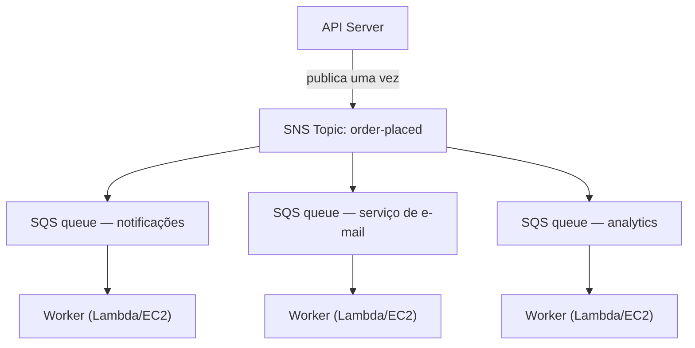

# Capítulo 19: A Máquina de Senhas

A máquina de senhas foi uma revolução silenciosa. Pegue um número, espere ser chamado. A fila virou uma fila de espera. As pessoas podiam se sentar. O balcão de atendimento trabalhava no seu próprio ritmo. Ninguém bloqueava ninguém.

Antes da máquina de senhas, você tinha de ficar de pé na fila. Sua posição na fila exigia sua presença física. Você não podia fazer mais nada enquanto esperava. E se a pessoa na frente da fila fosse lenta, todo mundo atrás dela parava.

A máquina de senhas separou a chegada do atendimento. Você chegava, pegava um número, e o sistema lembrava o seu lugar. Você podia ir se sentar. O balcão de atendimento processava os números no ritmo que conseguisse. Se o balcão estivesse temporariamente fechado, os recém-chegados ainda pegavam números. Eles esperavam. O trabalho não desaparecia — entrava na fila.

Essa pequena invenção é um dos exemplos mais antigos de desacoplamento em sistemas humanos. Ao final deste capítulo, a Nimbus terá construído a sua própria máquina de senhas — em software — e a razão pela qual precisou de uma começa com dezesseis minutos de tempo de inatividade em uma noite de sexta-feira.

---

A equipe tinha sobrevivido à falha de AZ. Leo tinha consertado o processo de engenharia do caos, e o runbook estava sólido. O tráfego tinha se recuperado e estava crescendo de novo — mais rápido do que antes, na verdade. A documentação do Aurora que Leo vinha lendo tarde da noite ainda estava alguns capítulos à frente de onde a Nimbus realmente estava.

Mas com o tráfego crescendo e mais restaurantes entrando, um tipo diferente de gargalo estava ficando visível. Não na infraestrutura. No próprio código da aplicação. A cadeia de requisições que funcionava bem a 200 pedidos por hora estava começando a dar sinais de estresse a 800.

E então veio a noite do dia 14.

---

Tudo tinha começado com o painel de analytics. Às 18h47 de uma sexta-feira, um deploy no serviço de analytics introduziu um bug de timeout. O serviço começou a responder em 8 segundos em vez dos 200 milissegundos habituais.

O fluxo de pedidos era síncrono. Cada pedido esperava pelo serviço de analytics antes de confirmar para o cliente. Oito segundos viraram 12 à medida que a carga aumentava. O pool de conexões da API começou a se encher de requisições esperando o passo de analytics se completar.

Às 18h53, o pool de conexões atingiu seu limite. As novas requisições começaram a falhar imediatamente — não porque o pedido não pudesse ser processado, mas porque não havia conexão disponível para começar a processá-lo.

"O serviço de analytics derrubou o fluxo de pedidos", disse Leo, olhando os logs na manhã seguinte. "Eles não têm nada a ver um com o outro. O serviço de analytics só calcula painéis."

"Mas estão na mesma cadeia de requisições", disse Priya.

"Dezesseis minutos de tempo de inatividade", disse Maya. "E três clientes foram cobrados em dobro."

A cobrança em dobro era pior do que o tempo de inatividade. No caos da saturação do pool de conexões, um mecanismo de repetição tinha disparado para algumas requisições que na verdade tinham tido sucesso — o passo de pagamento se completou, então a requisição expirou antes de retornar, e a repetição tentou o pagamento de novo. Mesmo cartão, mesmo valor, duas cobranças.

"O mecanismo de repetição era para ajudar", disse Leo.

"Ele ajudou na direção errada", disse Priya. "E já pensamos no que acontece quando tentarmos estornar esses clientes? O processo de estorno usa o mesmo fluxo de pedidos que falhou."

Dezesseis minutos de tempo de inatividade e três cobranças em dobro. Esse foi o custo de negócio da cadeia de requisições síncrona.

---

A Nimbus tinha um problema que não parecia um problema até os pedidos ficarem populares.

Toda vez que um pedido era feito, o servidor de API tinha de:

1. Salvar o pedido no banco de dados
2. Enviar uma notificação para o tablet do restaurante
3. Enviar um e-mail de confirmação para o cliente
4. Atualizar o painel de analytics do restaurante
5. Registrar o evento para faturamento

Em um balcão de frios movimentado, a pessoa no caixa não espera o cortador terminar de fatiar antes de passar para o próximo cliente. Ela pega o pedido, entrega à cozinha e começa a atender a próxima pessoa. A cozinha processa os pedidos no seu próprio ritmo. O cliente é atendido mais rápido. A cozinha não fica sobrecarregada por picos repentinos. Se a cozinha tem um momento de lentidão, os pedidos se acumulam atrás do balcão em vez de causar erros no caixa.

Essa era a analogia. A Nimbus não tinha um balcão e uma cozinha. Tinha uma pessoa fazendo tudo em sequência antes de o cliente poder ir embora.

E no dia 14, a pessoa cortando a carne teve um problema. Então o balcão parou. Então todo cliente depois disso esperou. A cozinha, o caixa, os clientes — todos pausaram porque um passo na cadeia tinha ficado lento.

A correção não era tornar o corte da carne mais rápido. A correção era separar os passos. Pegar o pedido no caixa, entregar uma senha, deixar a cozinha trabalhar.

"Estamos fortemente acoplados", disse Priya. "Se qualquer passo a jusante falhar, o pedido inteiro falha. Já pensamos no que acontece se o serviço de analytics for comprometido e começar a consumir mensagens malformadas? O pedido inteiro falha — porque estamos esperando por ele."

"E se pudéssemos salvar o pedido e confirmar imediatamente para o cliente", disse Leo, "e então processar o resto em segundo plano?"

"Isso é uma fila", disse Priya.

O insight chave: o cliente não precisa saber que o painel de analytics foi atualizado antes de receber a confirmação. Ele precisa saber que o pedido foi recebido. Essas são coisas diferentes. A cadeia síncrona as confundia.

**O Modelo de Desacoplamento**

Isso é **desacoplamento**: separar o componente que aceita o trabalho dos componentes que o processam.

Todos os passos do fluxo de pedidos da Nimbus tinham de acontecer de forma síncrona antes de a API poder responder ao cliente. Se o serviço de e-mail estava lento (às vezes estava), o cliente esperava. Se o painel de analytics estava fora do ar (às vezes estava), o pedido falhava.

A cascata do dia 14 demonstrou exatamente por que isso importava. O serviço de analytics não tinha nada a ver com saber se o pedido de um cliente era aceito. Mas, como ficava na mesma cadeia síncrona, a falha dele se tornava a falha de todos.

Em sistemas de software, a fila é frequentemente um message broker — um serviço que aceita mensagens de produtores e as entrega a consumidores.

Você pode estar se perguntando: se o fluxo de pedidos agora é assíncrono, como o cliente sabe que o pedido foi realmente recebido? A resposta está no design da arquitetura: a API salva o pedido no banco de dados (síncrono — esta é a confirmação autoritativa), depois publica eventos na fila. A confirmação do cliente é baseada no sucesso da gravação no banco de dados, não na conclusão dos serviços a jusante. Se o serviço de e-mail está lento, o cliente já tem a sua confirmação. O e-mail é apenas um acompanhamento desejável.

**Amazon SQS: A Fila**

O **Amazon SQS (Simple Queue Service)** é o serviço gerenciado de fila de mensagens da AWS. Ele armazena mensagens de forma durável até serem processadas por um consumidor.

O fluxo básico:

1. O **produtor** (o servidor de API) coloca uma mensagem na fila: `{ "orderId": "ORD-5532", "restaurantId": "47", "items": [...] }`
2. A API responde imediatamente ao cliente: "Pedido confirmado!"
3. Os **consumidores** (serviços de worker separados) leem mensagens da fila e as processam: enviar a notificação do restaurante, enviar o e-mail de confirmação, atualizar o analytics

A experiência do cliente: confirmação instantânea. O processamento a jusante: acontece de forma assíncrona, no ritmo dos workers.

**Conceitos-Chave do SQS**

**Tempo limite de visibilidade da mensagem (visibility timeout)**: Quando um consumidor lê uma mensagem do SQS, a mensagem se torna *invisível* para outros consumidores por um período (padrão: 30 segundos). Isso dá ao consumidor tempo para processá-la. Se o consumidor terminar com sucesso, ele exclui a mensagem. Se o consumidor falhar, o tempo limite de visibilidade expira e a mensagem se torna visível de novo para outro consumidor tentar novamente.

Isso garante a entrega pelo-menos-uma-vez: toda mensagem será processada ao menos uma vez, mesmo que um consumidor falhe no meio do processamento.

Você pode estar se perguntando: se a mensagem se torna invisível enquanto está sendo processada mas não é excluída quando o consumidor falha, ela não poderia ser processada duas vezes? Sim — e isso se chama entrega pelo-menos-uma-vez. Significa que todo consumidor deve ser projetado para lidar com o recebimento da mesma mensagem mais de uma vez sem causar um problema. Um e-mail de confirmação de pedido duplicado é irritante. Uma cobrança duplicada é um ticket de suporte. Projete seus consumidores de acordo.

O tempo limite de visibilidade deve ser maior do que o seu maior tempo de processamento esperado. Se o processamento tipicamente leva 20 segundos mas ocasionalmente leva 90 segundos, e o seu tempo limite de visibilidade é de 30 segundos, esse processamento ocasional de 90 segundos parecerá uma falha para o SQS. A mensagem se torna visível de novo. Um segundo consumidor a pega. Agora dois workers estão processando a mesma mensagem. Se o seu processamento não for idempotente, você tem um problema.

Um erro comum: definir o tempo limite de visibilidade igual ao tempo médio de processamento. A abordagem correta: defini-lo para o tempo de processamento do 99º percentil, com uma margem de segurança. Se o tempo de processamento P99 é de 45 segundos, defina o tempo limite de visibilidade para 90 segundos.

**Dead-letter queues (DLQ)**: Se uma mensagem falha no processamento vezes demais (configurável — por exemplo, 5 tentativas), o SQS a move para uma dead-letter queue. Você inspeciona a DLQ para entender por que as mensagens estão falhando sem perdê-las.

A DLQ é onde você aprende o que está realmente falhando em produção. Sem ela, as mensagens com falha simplesmente desaparecem e você não tem como investigar.

Três semanas depois da migração para o SQS, Leo notou que 23 mensagens tinham se acumulado na DLQ do serviço de notificações. Ele não vinha verificando a DLQ (tinha configurado tudo corretamente e então presumiu que ela ficaria vazia).

Ele puxou uma mensagem e olhou o payload:

```json
{
  "orderId": "ORD-9821",
  "restaurantId": "12",
  "customerMessage": "Extra spicy please 🌶️🔥",
  "timestamp": "2024-01-18T19:43:11Z"
}
```

O emoji. O serviço de notificação do restaurante estava codificando os payloads das mensagens como Latin-1 antes de enviar para a API legada do tablet do restaurante. Os caracteres de emoji — quatro bytes cada em UTF-8 — estavam ficando corrompidos, fazendo a API do tablet rejeitar a requisição. A mensagem tentava novamente, falhava de novo, tentava de novo, falhava de novo. Após 5 tentativas, o SQS a movia para a DLQ.

"Todas as 23 mensagens têm emoji no campo de observações do cliente", disse Leo.

"Então todo cliente que adicionou um emoji nas observações do pedido teve a observação silenciosamente falhando em chegar ao restaurante", disse Maya.

"Sim."

"Por quanto tempo?"

Leo verificou o timestamp da mensagem mais antiga. "Três semanas."

Priya ficou em silêncio. "E se alguém descobrisse que adicionar um emoji a uma observação de pedido causava uma falha silenciosa? Você poderia fazer pedidos com emoji e garantir que o restaurante nunca visse a instrução. Depois reclamar do pedido errado."

Ninguém tinha explorado isso. Mas era a pergunta certa a fazer.

Leo corrigiu o bug de codificação. Em seguida, escreveu um script para reprocessar todas as 23 mensagens encalhadas na DLQ. Os restaurantes receberam suas instruções de emoji apimentado (com três semanas de atraso). Os clientes nunca souberam.

A lição: a DLQ deve ser monitorada ativamente, não configurada e esquecida. Uma DLQ que cresce é um sinal silencioso de que algo está falhando repetidamente.

**Tipos de fila**:

**Filas standard**: Throughput máximo (mensagens ilimitadas por segundo). A ordem de entrega é de melhor esforço (não garantida). Entrega pelo-menos-uma-vez (muito raramente, uma mensagem pode ser entregue duas vezes).

**Filas FIFO**: Ordenação estrita primeiro-a-entrar, primeiro-a-sair. **Processamento** exatamente-uma-vez — desduplicação baseada em um `MessageDeduplicationId` dentro de uma janela de 5 minutos. A ordenação é garantida *por* `MessageGroupId`: mensagens no mesmo grupo chegam em ordem; grupos diferentes podem ser processados em paralelo, e é assim que o FIFO escala. O throughput de base é de 3.000 mensagens por segundo com lotes (300 sem); ativar o **modo de alto throughput** eleva isso para dezenas de milhares por segundo, particionando entre os grupos de mensagens. Use FIFO quando a ordem importa (transações financeiras, mudanças de estado sequenciais).

Se você precisa de throughput máximo e pode tolerar mensagens duplicadas ocasionais, use o SQS Standard — mas você deve projetar cada consumidor para lidar com duplicatas sem causar problemas. Se você precisa de ordenação estrita e processamento exatamente-uma-vez, use o SQS FIFO — e projete bem seus `MessageGroupId`s, porque o paralelismo (e, portanto, o throughput) vem de ter muitos grupos.

Para a Nimbus, a maioria das filas usava filas standard. A fila de faturamento usava FIFO para garantir que as cobranças fossem processadas em ordem.

**Auto Scaling por Profundidade de Fila: Escalando Workers para Acompanhar o Backlog**

Uma das aplicações mais poderosas do SQS é usar a profundidade da fila como gatilho de Auto Scaling. Em vez de escalar com base em CPU ou memória, você escala com base em quanto trabalho está esperando.

Para o serviço de notificações da Nimbus: a profundidade da fila SQS (o número de mensagens esperando para ser processadas) foi conectada a uma política de Application Auto Scaling para o serviço ECS que rodava os workers de notificação.

Política: quando a fila tem mais de 50 mensagens por tarefa de worker, adicionar uma tarefa. Quando a fila tem menos de 10 mensagens por tarefa de worker, remover uma tarefa.

O efeito prático: quando 1.200 pedidos chegaram durante o pico da noite de sexta-feira, a profundidade da fila de notificações disparou e a frota de workers escalou de 2 tarefas para 8 tarefas em 3 minutos. Por volta da meia-noite, a fila estava vazia e a frota voltou a 2.

"Quanto isso custa por mês?" perguntou Tom, olhando o gráfico de Auto Scaling.

"Nada a mais pelo Auto Scaling em si", disse Leo. "Mas 6 tarefas ECS extras por 3 horas nas noites de sexta — isso é significativo."

Tom calculou. "Cerca de US$ 14/mês por esses picos. E antes, estávamos rodando 8 tarefas continuamente, ao custo total?"

"Sim."

"Então pagamos pelo pico quando precisamos dele e nada caso contrário."

Esse é o padrão de escalonamento por profundidade de fila: a fila se torna um buffer que absorve os picos de tráfego, e a frota de workers escala para drenar o buffer. Os usuários não experimentam lentidão — receberam a confirmação imediatamente quando o pedido foi aceito. Os workers apenas demoram um pouco mais para se atualizar. E como você não está rodando capacidade de pico 24 horas por dia, os custos são significativamente menores.

**Amazon SNS: O Difusor**

O **Amazon SNS (Simple Notification Service)** é um serviço de mensagens de publicação/assinatura (pub/sub). Em vez de um produtor, um consumidor (fila), o SNS oferece suporte a uma mensagem sendo entregue a *muitos* assinantes simultaneamente.

O modelo:

1. Um **publicador** envia uma mensagem para um **tópico** SNS
2. Todos os **assinantes** desse tópico recebem a mensagem simultaneamente (fan-out)

Os assinantes podem ser:

- Filas SQS (empurram a mensagem para uma fila para processamento assíncrono)
- Funções Lambda (acionam a função diretamente)
- Endpoints HTTP/HTTPS (entrega de webhook)
- Endereços de e-mail
- SMS (números de telefone)

Para a Nimbus, o evento de pedido feito é publicado em um tópico SNS chamado `order-events`:

- O serviço de notificação do restaurante se inscreve (recebe em sua fila SQS)
- O serviço de e-mail se inscreve (recebe em sua fila SQS)
- O serviço de analytics se inscreve (recebe em sua fila SQS)
- O serviço de faturamento se inscreve (recebe em sua fila SQS FIFO)

Um evento de pedido. Quatro assinantes. Todos notificados simultaneamente. Cada um processa no seu próprio ritmo.

"Então o SNS é o anúncio", disse Maya, "e o SQS é a caixa de entrada onde cada equipe processa o anúncio na sua própria velocidade. Mas então por que usar os dois? Por que não fazer todo mundo se inscrever diretamente no tópico SNS?"

"Porque a entrega direta do SNS é dispara-e-esquece", disse Leo. "Se o serviço de analytics está fora do ar quando o SNS dispara, aquela mensagem se perde. Com uma fila SQS no meio, a mensagem espera até o serviço se recuperar."

"Exatamente", disse Priya. "O fan-out SNS/SQS é o padrão consagrado."

**O Padrão Fan-Out SNS/SQS**

Essa combinação — um tópico SNS alimentando múltiplas filas SQS — é um dos padrões arquiteturais mais importantes da AWS:



Cada fila é independente. O serviço de analytics pode estar lento — sua fila se enche, mas os serviços de notificação e e-mail continuam sem serem afetados. Se o serviço de analytics cair, suas mensagens esperam na fila até ele voltar. Nada é perdido.

Esta é a propriedade chave: **falha independente**. Problemas em um consumidor não se propagam para os outros.

**Filtragem de Mensagens: Nem Toda Mensagem para Todo Assinante**

À medida que os sistemas crescem, você não quer que todo assinante processe toda mensagem. Um serviço de analytics não deveria receber mensagens sobre processamento de pagamento com falha se ele só se importa com pedidos concluídos.

A **filtragem de mensagens do SNS** permite que os assinantes especifiquem políticas de filtro — entregar apenas as mensagens que correspondem a certos atributos.

O serviço de notificação do restaurante se inscreve com um filtro: apenas mensagens onde `status = "confirmed"`.

O serviço de alerta de erros se inscreve com um filtro: apenas mensagens onde `status = "failed"`.

Cada assinante recebe apenas o que precisa.

Sem filtragem, todo assinante recebe toda mensagem e deve ignorar o que é irrelevante. Isso desperdiça processamento, desperdiça dinheiro (o SQS cobra por mensagem) e introduz ruído. Um sistema de pedidos de alto volume sem filtragem inundaria a fila de alerta de erros com pedidos bem-sucedidos — tornando as falhas reais difíceis de encontrar.

As políticas de filtro são parecidas com isto:

```json
{
  "status": ["confirmed"],
  "region": ["us-west-2", "us-east-1"]
}
```

Este assinante recebe apenas mensagens onde o status é "confirmed" E a região é "us-west-2" ou "us-east-1". Mensagens que não correspondem à política não são entregues à fila deste assinante de forma alguma — elas nunca sequer chegam ao SQS.

"Então a filtragem acontece na camada do SNS", disse Priya, "antes de as mensagens serem gravadas no SQS?"

"Correto. A fila SQS do serviço de notificação do restaurante só vê mensagens nas quais precisa agir."

"E se alguém tentar invadir publicando uma mensagem especialmente elaborada no tópico SNS que corresponda a todos os filtros dos assinantes?" perguntou Priya.

O tópico SNS tinha uma política de recurso IAM: apenas o serviço de API de pedidos (por meio de sua função IAM) tinha permissão para publicar. As políticas de acesso do SNS e as políticas de fila do SQS formavam a camada de controle de acesso — a filtragem era apenas para roteamento, não para segurança.

**Quando Usar SQS vs SNS**

**SQS sozinho**: Um produtor, um consumidor (ou múltiplos consumidores concorrentes na mesma fila). As mensagens precisam ser processadas uma vez, em ordem (FIFO) ou não (standard). Padrão de fila de workers — uma fila, múltiplos workers consumindo dela.

**SNS sozinho**: Notificações dispara-e-esquece. Empurrar para e-mail, SMS ou endpoints HTTP. Não há necessidade de enfileirar a mensagem — apenas notificar e seguir em frente.

**SNS + SQS (fan-out)**: Um evento, múltiplos consumidores independentes. Cada consumidor tem a sua própria fila, processa de forma independente e pode falhar de forma independente.

## Tópicos FIFO do SNS

Tudo acima sobre o SNS usa tópicos standard — eles têm throughput efetivamente ilimitado, entregam aos assinantes quase simultaneamente e dão conta do recado para a grande maioria dos casos de uso.

Mas os tópicos SNS standard não garantem ordenação. Se você publicar dez mensagens em sequência, os assinantes podem recebê-las em uma ordem ligeiramente diferente. Para as notificações de pedido da Nimbus, isso não tem problema — uma atualização de analytics chegando uma fração de segundo antes de uma confirmação de e-mail não importa.

Para alguns cenários, importa. Considere um livro-razão financeiro: se dois eventos — um crédito e depois um débito — são entregues na ordem inversa, os cálculos de saldo durante o processamento estarão errados mesmo que ambos os eventos sejam eventualmente processados corretamente.

Os **tópicos FIFO do SNS** aplicam o mesmo princípio das filas FIFO do SQS ao modelo de fan-out. As mensagens são entregues aos assinantes na ordem exata em que foram publicadas, e cada mensagem é entregue exatamente uma vez.

O trade-off: os tópicos FIFO do SNS têm um throughput de base similar ao do SQS FIFO (3.000 mensagens por segundo por tópico; 300 por segundo por grupo de mensagens — com um modo de alto throughput disponível desde 2025 para muito mais), e eles fazem fan-out apenas para **filas SQS** — FIFO ou, desde 2023, Standard. Inscrever uma fila Standard é útil para consumidores que não se importam com a ordem (um feed de analytics, por exemplo), mas a ordenação e o exatamente-uma-vez sobrevivem de ponta a ponta **apenas** para filas FIFO. Você não pode usar um tópico FIFO do SNS para entregar a endpoints HTTP ou endereços de e-mail.

Para o pipeline de faturamento da Nimbus — onde uma sequência de atualizações de preço tinha de ser aplicada às contas dos restaurantes em ordem — o tópico SNS de faturamento foi migrado de standard para FIFO. A fila SQS de faturamento já era FIFO. O fan-out agora garantia que um evento de aumento de preço nunca chegaria ao processador de faturamento antes do evento de início de período do qual ele dependia.

> **Dica de Exame — SNS FIFO**
>
> Se um cenário exige **entrega de fan-out ordenada** entre múltiplos assinantes, a resposta é **SNS FIFO**. O SNS standard não garante ordenação. O SNS FIFO faz fan-out apenas para filas SQS — para manter ordenação e exatamente-uma-vez de ponta a ponta, o assinante deve ser uma fila SQS **FIFO** (assinaturas de fila Standard são permitidas, mas obtêm ordenação de melhor esforço e entrega pelo-menos-uma-vez). O throughput padrão é de 3.000/seg por tópico — se o cenário descreve volume muito maior *e* ordenação estrita, esse é um sinal para olhar para arquiteturas alternativas (Kinesis, por exemplo, que é abordado em um capítulo posterior).

## Quando a Fila Legada Não Quer Soltar

A Nimbus estava prestes a fechar sua maior aquisição até então: a Barato, uma concorrente de entrega de comida com 200 restaurantes e dois anos de dianteira nas operações. A equipe de engenharia agendou uma chamada de planejamento da integração.

A chamada durou vinte minutos antes de Leo ficar quieto.

"O sistema de processamento de pedidos deles", disse ele. "Roda em quê?"

"ActiveMQ", disse o engenheiro da Barato do outro lado. "Broker on-premises. O app é em Java. Está rodando desde 2018. Tudo fala AMQP."

"AMQP", disse Leo.

"Sim."

Ele olhou para o diagrama de arquitetura na sua tela. A Nimbus rodava SQS e SNS. O SQS não fala AMQP. O SNS não fala AMQP. A aplicação da Barato não falava mais nada.

"Reescrevê-la vai levar seis meses", disse Leo à equipe depois da chamada. "No mínimo."

"Não podemos atrasar a aquisição por seis meses", disse Maya.

"E não podemos rodar um broker ActiveMQ em bare-metal na AWS", acrescentou Priya. "Já pensamos como isso fica do ponto de vista de segurança e confiabilidade? Um message broker autogerenciado, rodando em produção, sem patching gerenciado, sem failover automático, conectando-se à nossa infraestrutura?"

"Há uma opção gerenciada", disse Leo lentamente. Ele tinha estado lendo enquanto eles conversavam. "Amazon MQ."

**Amazon MQ: O Broker Gerenciado**

O **Amazon MQ** é um serviço gerenciado de message broker para Apache ActiveMQ e RabbitMQ. Ele roda o seu broker existente — o mesmo broker ao qual suas aplicações vêm se conectando há anos — mas como um serviço gerenciado da AWS. A AWS cuida da infraestrutura subjacente: provisionamento, patching, failover, backups.

A propriedade chave que torna o Amazon MQ diferente do SQS e do SNS: ele fala os protocolos que os message brokers legados falam. AMQP, STOMP, MQTT, OpenWire, NMS. Os protocolos que o SQS e o SNS simplesmente não entendem.

Para a integração da Barato, o plano era simples. A AWS rodaria um broker Amazon MQ configurado como ActiveMQ. A aplicação Java da Barato seria apontada para o novo endpoint do broker em vez do on-premises. A mudança do lado da aplicação: atualizar um arquivo de configuração com a nova string de conexão. Era isso. A aplicação não precisava saber que estava falando com um broker de nuvem gerenciado em vez de um servidor no escritório da Barato.

"Espera aí", disse Maya. "Se vamos integrá-los à Nimbus eventualmente, não deveríamos simplesmente migrá-los para o SQS desde o início?"

"Porque o caminho de migração existe", disse Leo. "E vale a pena fazê-lo direito — eventualmente. Mas agora, precisamos da Barato operacional na infraestrutura da AWS em trinta dias, não em seis meses. O Amazon MQ coloca a aplicação rodando sem mudar a aplicação. Então temos tempo para planejar a migração para o SQS como um projeto deliberado, não como um pré-requisito atropelado da aquisição."

"Quanto isso custa por mês?" perguntou Tom.

O broker Amazon MQ — um único par ativo/standby para confiabilidade — estava na faixa de US$ 200/mês para um broker adequado ao volume da Barato. Comparado ao custo de seis meses de tempo de reescrita, não era um debate.

Priya aprovou o plano com uma condição: a instância do Amazon MQ ficaria em uma sub-rede privada, com regras de grupo de segurança permitindo conexões apenas dos servidores de aplicação da Barato. Sem exposição pública. Logging de auditoria habilitado.

A migração levou doze dias. A aplicação da Barato se conectou ao Amazon MQ no dia treze. No dia quatorze, ela processou seu primeiro pedido na infraestrutura da AWS sem uma única mudança de código.

---

> **Dica de Exame — Amazon MQ**
>
> *Domínio SAA-C03: Projetar Arquiteturas Resilientes (Domínio 2)*
>
> O exame distingue o Amazon MQ do SQS e do SNS em um único eixo: **compatibilidade de protocolo**. Se o cenário descreve uma aplicação que já usa um message broker e fala um protocolo específico, o Amazon MQ é quase certamente a resposta.
>
> Os sinais-chave: **"ActiveMQ", "RabbitMQ", "AMQP", "STOMP", "MQTT", "OpenWire"** ou qualquer frase equivalente a **"sem mudar o código da aplicação".** Se você vir essas frases, a resposta é Amazon MQ — não SQS, não SNS.
>
> Se o cenário descreve uma aplicação *nova* que precisa de desacoplamento, ou não menciona um broker legado ou protocolo específico, use SQS/SNS.
>
> Mais um sinal: "migrar message broker on-premises existente para a AWS." Se o app precisa continuar falando o mesmo protocolo com o mesmo tipo de broker, o Amazon MQ é a resposta de lift-and-shift.

## Pontos Fortes e Limitações

**Por que SQS e SNS são poderosos**:

- O SQS fornece entrega de mensagens durável e confiável — as mensagens são armazenadas em múltiplas AZs
- O desacoplamento permite escalonamento e implantação independentes dos serviços produtor e consumidor
- As dead-letter queues garantem que nenhuma mensagem seja silenciosamente perdida em caso de falha
- O padrão fan-out do SNS permite adicionar novos consumidores sem mudar o produtor

**Onde fica complicado**:

- A entrega pelo-menos-uma-vez significa que os consumidores devem ser *idempotentes* — processar a mesma mensagem duas vezes não deve causar problemas (pedidos duplicados, cobranças duplicadas)
- As filas FIFO são mais caras e têm limites de throughput
- Depurar mensagens com falha entre múltiplas filas e serviços exige bom logging e observabilidade
- As garantias de ordenação de mensagens são limitadas — se a ordenação estrita importa entre múltiplos serviços, o design fica complexo

**Idempotência: Um Mergulho Prático Profundo**

Idempotência soa abstrato até você ter tido três clientes cobrados em dobro.

Uma operação é **idempotente** se executá-la múltiplas vezes produz o mesmo resultado de executá-la uma vez. Uma operação de cobrança não é naturalmente idempotente: executá-la duas vezes cobra duas vezes. Uma operação de cobrança idempotente verifica se a cobrança já foi processada antes de tentá-la.

O padrão: cada mensagem carrega um ID único (o ID do pedido, ou um ID de mensagem separado). Antes de processar, o consumidor verifica um armazenamento (o DynamoDB funciona bem para isso) para ver se este ID de mensagem já foi processado com sucesso. Se sim: não faça nada, exclua a mensagem. Se não: processe, registre o ID, exclua a mensagem.

```python
def process_charge(message):
    order_id = message['orderId']
    
    # Idempotency check
    if already_processed(order_id):
        logger.info(f"Order {order_id} already charged, skipping duplicate")
        return  # Message will be deleted from queue
    
    # Process the charge
    charge_result = payment_service.charge(
        amount=message['amount'],
        card_token=message['cardToken'],
        idempotency_key=order_id  # Also pass to payment processor
    )
    
    # Record that we've processed this
    mark_as_processed(order_id, charge_result)
```

A chave de idempotência também deve ser passada para os serviços a jusante (processadores de pagamento, sistemas de e-mail) que a suportam. O Stripe, por exemplo, aceita um cabeçalho `Idempotency-Key` que previne cobranças duplicadas mesmo que a mesma chamada de API seja feita duas vezes.

"E quanto aos correlation IDs?" perguntou Priya. "Quando uma mensagem passa por múltiplos serviços, como rastreamos qual requisição causou qual ação a jusante?"

**Correlation IDs: Rastreando Entre Serviços**

Quando um cliente faz um pedido, a requisição flui por: API → SNS → SQS → worker de notificação → API do tablet do restaurante → SQS → worker de e-mail → SES.

Sem correlation IDs, se a API do tablet do restaurante retorna um erro no passo 6, os logs em cada serviço mostram o evento, mas não há como rastreá-lo de volta ao pedido específico daquele cliente desde o começo.

Um **correlation ID** é um identificador único anexado à requisição original e passado por cada interação de serviço. Cada serviço inclui o correlation ID em seus logs.

Quando Priya pesquisa no CloudWatch por um correlation ID específico, ela obtém cada linha de log — em cada serviço — que fez parte do processamento daquele único pedido.

"Uma ressalva", disse Priya. "Correlation IDs vêm de fora. Alguém poderia injetar um ID malicioso e bagunçar o nosso logging?"

Os correlation IDs são internos — eles não afetam a lógica de processamento, apenas o logging. Sanitizá-los (alfanumérico, comprimento fixo) previne ataques de injeção nas saídas de log.

**Quando o Desacoplamento É a Escolha Errada**

"Espera — mas *por que* não desacoplaríamos tudo?" perguntou Maya.

Era uma pergunta justa. Se o desacoplamento previne as falhas em cascata e torna os sistemas resilientes, por que não aplicá-lo em todo lugar?

Porque o desacoplamento tem custos. E há cenários onde esses custos superam os benefícios.

**Quando você precisa de consistência imediata**: Se um pagamento deve ser confirmado antes de um pedido poder prosseguir — e o usuário está esperando na tela pelo resultado —, você não pode colocar o pagamento em uma fila assíncrona e retornar uma confirmação antes de saber se a cobrança teve sucesso. O usuário poderia fazer o pedido duas vezes antes de a primeira cobrança se completar. O desacoplamento assíncrono não funciona para operações onde a resposta depende do resultado.

**Quando o fluxo de trabalho é inerentemente sequencial**: Se o passo 3 deve ver o resultado do passo 2 para tomar uma decisão, eles não podem rodar em paralelo a partir de uma fila. Forçá-los a uma fila cria um mecanismo desajeitado de passagem de resultados que frequentemente acaba sendo mais complexo do que a versão síncrona.

**Quando a ordenação de mensagens é crítica e o volume é baixo**: O SQS Standard não garante ordenação. O SQS FIFO garante, mas tem limite de 3.000 mensagens/segundo com lotes por padrão (o modo de alto throughput aumenta isso substancialmente). Se você tem um fluxo de trabalho de baixo volume, estritamente ordenado, uma fila síncrona simples (como um bloqueio de linha de banco de dados) pode ser mais simples e mais confiável.

**Quando o overhead excede o benefício**: Uma pequena ferramenta interna com um usuário e sem SLA provavelmente não precisa de tópicos SNS de fan-out e DLQs. O overhead operacional de monitorar filas e DLQs é real. Dimensione a arquitetura ao problema.

A pergunta não é "devo desacoplar isto?" É "qual é o custo deste acoplamento, e o desacoplamento reduz esse custo mais do que adiciona?"

## Resumo

O desacoplamento é o princípio de resiliência do Capítulo 18 aplicado à arquitetura interna: do mesmo modo que o Multi-AZ elimina pontos únicos de falha na infraestrutura, o SQS e o SNS eliminam pontos únicos de falha nas cadeias de requisições.

- O **desacoplamento** separa os componentes que produzem trabalho dos componentes que o processam.
- O **SQS** dá aos produtores um lugar durável para colocar trabalho quando os consumidores estão lentos, offline ou escalando.
- O **SNS** permite que um evento alcance múltiplos consumidores independentes sem o publicador saber quem eles são.
- O **fan-out SNS + SQS** permite que cada serviço a jusante processe o mesmo evento no seu próprio ritmo.
- **DLQs, idempotência e correlation IDs** são a disciplina operacional que torna os sistemas assíncronos depuráveis em vez de misteriosos.
- **Não desacople cegamente**: fluxos de trabalho síncronos, requisitos de consistência imediata e ferramentas pequenas de baixo risco podem não justificar a superfície operacional adicional.

## Dicas de Exame

*Domínio SAA-C03: Projetar Arquiteturas Resilientes (Domínio 2, Tarefa 2.1)*

- **SQS Standard vs FIFO**: O exame distingue por garantias de ordenação e entrega. "Deve processar em ordem" → FIFO. "Throughput máximo" → Standard.
- **Auto Scaling por profundidade de fila**: "Escalar workers com base na profundidade da fila" → métrica do SQS (ApproximateNumberOfMessagesVisible) usada com Application Auto Scaling ou ECS Service Auto Scaling.
- **Tempo limite de visibilidade**: Conceito-chave para entrega pelo-menos-uma-vez. Se um consumidor falha, a mensagem se torna visível de novo após o tempo limite. Cenário do exame: "mensagens estão sendo processadas duas vezes" → o tempo limite de visibilidade é muito curto (o consumidor leva mais tempo do que o tempo limite para processar).
- **Dead-letter queue**: Mensagens que falham após N tentativas são movidas para cá. Cenário do exame: "garantir que nenhuma mensagem seja perdida, mesmo que o processamento falhe repetidamente" → DLQ.
- **Fan-out do SNS**: Padrão clássico de exame para um evento acionando múltiplos consumidores. "Notificação de pedido feito deve acionar e-mail, SMS e atualização de estoque simultaneamente" → tópico SNS com assinaturas SQS.
- **SQS + Lambda**: O Lambda pode ser configurado para fazer polling de uma fila SQS e acionar a cada lote de mensagens. O exame usa isso para processamento orientado a eventos em escala.
- **Long polling do SQS**: Em vez de os consumidores fazerem polling a cada poucos segundos (short polling, desperdiça chamadas de API), o long polling espera até 20 segundos por uma mensagem. Reduz custos e respostas vazias falsas.
- **Biblioteca de cliente estendido do SQS**: Para mensagens maiores que o limite de payload da fila (256KB por padrão; elevável a 1MB desde 2025), use a SQS Extended Client Library, que armazena o corpo da mensagem no S3 e envia uma referência via SQS. O exame ainda trata 256KB como o limite do SQS — "mensagem SQS muito grande" → Extended Client Library + S3.
- **Filtragem de mensagens do SNS**: Os assinantes recebem apenas as mensagens que correspondem à sua política de filtro. Cenário do exame: "enviar apenas notificações que correspondem a critérios específicos a um assinante" → filtragem de mensagens do SNS.
- **Observação**: O fan-out SNS/SQS também aparece em cenários do Domínio 3 sobre arquiteturas de processamento assíncrono de alto throughput. Conheça o padrão tanto para questões de resiliência quanto de desempenho.
- **Sinais do Amazon MQ**: "ActiveMQ", "RabbitMQ", "AMQP", "STOMP", "MQTT", "OpenWire" ou "sem mudar o código da aplicação" → Amazon MQ, NÃO SQS. Se o cenário diz aplicação nova que precisa de desacoplamento → SQS/SNS.
- **SNS FIFO vs Standard**: O SNS standard não garante ordenação. Se o cenário exige **fan-out ordenado** → tópico SNS FIFO alimentando filas SQS FIFO. Lembre-se: o SNS FIFO não pode entregar a endpoints HTTP ou e-mail — apenas a filas SQS (FIFO para ordenação/exatamente-uma-vez; assinaturas Standard funcionam mas rebaixam para ordenação de melhor esforço e entrega pelo-menos-uma-vez).

## Exercícios

**Exercício 1 — Recordar**

Explique o padrão fan-out SNS/SQS. Por que o padrão usa filas SQS em vez de fazer os serviços se inscreverem diretamente no tópico SNS com endpoints HTTP?

*(Dica: Pense no que acontece se um dos endpoints HTTP estiver fora do ar quando o SNS publicar uma mensagem.)*

**Exercício 2 — Cenário SAA-C03**

*Cenário*: Uma plataforma de e-commerce processa 10.000 pedidos por hora. Quando um pedido é feito, o sistema deve: (1) armazenar o pedido no banco de dados, (2) deduzir o estoque, (3) enviar um e-mail de confirmação e (4) atualizar o painel de analytics. Atualmente, os quatro passos acontecem de forma síncrona — se o serviço de analytics está lento, os clientes esperam. A equipe quer melhorar o tempo de resposta voltado ao cliente ao mesmo tempo em que garante que nenhum pedido seja perdido.

Qual arquitetura MELHOR atende a esse requisito?

A) Usar filas SQS FIFO para processar os quatro passos em sequência  
B) Fazer a API salvar o pedido e confirmar imediatamente ao cliente; publicar um evento em um tópico SNS; fazer os serviços de estoque, e-mail e analytics se inscreverem via filas SQS  
C) Usar instâncias EC2 paralelas para processar cada passo simultaneamente, de forma síncrona  
D) Usar um API Gateway com validação de requisição para acelerar o processamento de pedidos

**Dica 1**: A confirmação do cliente deve ser imediata. Quais passos devem acontecer antes da resposta, e quais podem acontecer depois?

**Dica 2**: O serviço de analytics estar lento não deveria afetar os serviços de e-mail ou estoque.

**Dica 3**: O fan-out do SNS permite que os três serviços a jusante recebam o evento simultaneamente.

**Resposta**: B

**Explicação**: A API salva o pedido no banco de dados (síncrono — deve ser feito antes de confirmar) e imediatamente retorna uma confirmação. Em seguida, publica um evento `order-placed` em um tópico SNS. Os serviços de estoque, e-mail e analytics cada um se inscreve via filas SQS independentes. Eles processam no seu próprio ritmo — se o analytics está lento, sua fila cresce mas os outros serviços não são afetados. Se algum serviço falha, suas mensagens permanecem na fila SQS e são repetidas; após o número configurado de tentativas com falha, elas são movidas para a DLQ.

**Por que não A?** As filas FIFO processam mensagens em sequência — isso não ajuda com a lentidão síncrona. Além disso, o processamento sequencial significa que o analytics estar lento ainda bloqueia o e-mail.

**Por que não C?** "Instâncias EC2 paralelas processando de forma síncrona" ainda exige que todos os passos se completem antes de responder ao cliente. Adicionar instâncias não resolve o acoplamento síncrono.

**Por que não D?** O API Gateway acelera o roteamento e a validação de API, mas não desacopla os passos de processamento a jusante.

*Domínio SAA-C03: Projetar Arquiteturas Resilientes — Tarefa 2.1*

**Exercício 3 — Desafio de Arquitetura** *(Opcional)*

A Nimbus está construindo um sistema de notificações para parceiros de restaurante. Quando um cliente faz um pedido, o restaurante precisa ser notificado via:

- Seu app de tablet (push notification)
- Um sistema de display de cozinha (webhook HTTP para o hardware local deles)
- Um SMS de backup (se a notificação do tablet falhar)

O serviço de notificação do tablet é confiável. O webhook da cozinha às vezes está fora do ar (os restaurantes desligam o hardware na hora de fechar). O SMS só deveria disparar se a notificação do tablet falhar.

Projete a arquitetura usando SNS e SQS. Como você lidaria com o requisito de "SMS apenas se o tablet falhar"? Como você garantiria que o webhook da cozinha não bloqueie a notificação do tablet quando estiver offline?

Considere também: qual tempo limite de visibilidade é apropriado para a entrega do webhook da cozinha se o tempo médio de resposta do webhook é de 2 segundos mas restaurantes com hardware lento podem levar até 30 segundos? Qual política de DLQ acionaria o fallback de SMS após as tentativas de webhook serem esgotadas?

*(Não há uma resposta única correta. O objetivo é praticar o design de fan-out com roteamento condicional.)*

## Cena Pós-Créditos

O novo fluxo de pedidos estava no ar.

Leo o tinha implantado em uma tarde de terça-feira sem rodar um teste de carga completo antes. "Vai ficar tudo bem", ele tinha dito a Priya. "A arquitetura é sólida."

Os clientes faziam pedidos. A API respondia em 95 milissegundos. A confirmação aparecia nos celulares deles instantaneamente.

Nos bastidores: quatro serviços processando de forma assíncrona. O serviço de analytics tinha um bug que fazia ele travar em pedidos contendo certos caracteres especiais no nome do item. Sua fila acumulou 3.200 mensagens ao longo de duas horas.

Os clientes nunca notaram.

Quando Leo corrigiu o bug e o serviço de analytics reiniciou, ele processou o backlog em 18 minutos. Nenhum dado foi perdido. A DLQ estava vazia.

Ele atualizou o painel do CloudWatch. Profundidade da fila: 0. Mensagens processadas: 3.200. Erros: 0 (após a correção).

"É exatamente assim que o dia 14 teria sido", disse ele. "O analytics teve um problema. A fila o absorveu. Todo o resto continuou funcionando."

"Isso é o que o desacoplamento significa", disse Priya.

"Quanto isso custa por mês?" perguntou Tom, já na página de preços.

"No nosso volume atual, cerca de doze dólares por mês para o SQS." Ele encarou a tela. "Eu esperava mais."

Ele tinha o olhar de alguém descobrindo que algo inesperadamente barato também era inesperadamente bom.

"Configure os alertas de DLQ", lembrou Priya a Leo. "Não queremos outras três semanas de falhas silenciosas."

"Já está feito", disse Leo.

Ele tinha feito isso desta vez.

No próximo capítulo: a função que roda só quando alguém bate à porta — e não custa nada quando ninguém bate.
