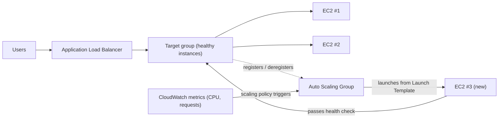

# Глава 7: Ресторан, который растёт, когда становится оживлённым

Было 7:43 вечера в пятницу.

Стул Тома был чуть отодвинут назад — так бывало, когда он смотрел на что-то с тем уровнем сосредоточенности, который означал, что он не ответит, если к нему обратиться. Офис опустел час назад. Он остался.

У него была открыта вкладка с дашбордом метрик, которую он обновлял так же, как другие люди проверяют социальные сети — рефлекторно, постоянно, не совсем намеренно.

Кризис хранилища остался позади. У базы данных был собственный диск. Фотографии жили в S3. Две недели система была стабильной — не захватывающей, просто стабильной. Это должно было ощущаться хорошо.

Затем процент ошибок пересёк отметку 12%.

«Лео», — сказал Том.

Лео уже смотрел. Время отклика: растёт. Запросы в очереди: растут. Единственный экземпляр EC2 — даже после тщательного подбора размера в прошлом месяце — показывал 94% нагрузки CPU.

«Мы теряем клиентов», — сказал Том.

«Мы их не теряем», — сказал Лео. «Сервер теряет».

«Это одно и то же».

Это было одно и то же. И так происходило каждую пятницу три недели подряд. Nimbus пережил кризис хранилища — у базы данных был собственный диск, фотографии жили в S3 — но стабильный и масштабируемый — это совершенно разные проблемы. Система работала. Она просто не росла.

Появилось сообщение в Slack от Майи: *дашборд говорит, заказы упали на 40% по сравнению с прошлой пятницей. что происходит?*

Том ответил: *сервер на пределе мощности. работаем над этим.*

Прошло три минуты.

Майя: *владелец ресторана звонит в поддержку и говорит, что приложение сломано.*

Лео положил руки на клавиатуру. Он менял размер экземпляра — ручная версия исправления, та, что требует остановки сервера и смены типа экземпляра. Что означало простой.

«Сколько займёт перезапуск?» — спросил Том.

«Семь минут», — сказал Лео.

«У нас будет ещё семь минут простоя вечером в пятницу», — сказал Том. Он не спрашивал. Он напечатал сообщение в Slack Майе. Она ответила одним символом: *к*

Перезапуск завершился. Экземпляр снова поднялся. Нагрузка CPU упала до 60%. Процент ошибок упал. Том пятнадцать минут наблюдал за метриками, не говоря ни слова.

В 21:15 трафик пошёл на спад. Кризис миновал.

Лео посмотрел на свои руки, которые слегка дрожали в 8 вечера и больше не дрожали.

«Мы не можем делать это каждую пятницу», — сказал он.

«Нет», — сказал Том. «Не можем».

Команде нужно было, чтобы система автоматически справлялась с переменной нагрузкой. Не покупала столько серверов, сколько нужно для худшего случая, впустую расходуя деньги в спокойное время. И не вынуждала вручную метаться, когда ударяют пики трафика.

Для этого есть паттерн. В AWS есть два сервиса, которые его реализуют.

**Концепция: горизонтальное масштабирование**

Есть два способа заставить систему справляться с большей нагрузкой.

**Вертикальное масштабирование** означает увеличение одного сервера. Больше CPU. Больше RAM.
Мы делали это в Главе 4, когда перешли с `t3.micro` на `t3.large`. Это помогает.
Но у этого есть пределы: можно сделать сервер только настолько большим, экземпляр нужно
перезапустить для изменения размера, и у вас по-прежнему остаётся единая точка отказа.

**Горизонтальное масштабирование** означает добавление большего количества серверов. Вместо одного большого сервера запустите
пять средних. Когда трафик падает — запустите два. Когда резко возрастает — десять.

Горизонтальное масштабирование имеет преимущества, которых нет у вертикального:

- Нет единой точки отказа. Если один сервер падает, другие продолжают обслуживать.
- Для добавления мощности не нужен перезапуск.
- Платите только за то, что используете — добавляйте серверы, когда нужно, удаляйте, когда нет.
- Линейное масштабирование: вдвое больше серверов — примерно вдвое больше пропускной способности.

Есть также измерение надёжности, с которым вертикальное масштабирование не может сравниться. Когда у вас есть
пять серверов и один выходит из строя, ваша мощность падает до 80% — достаточно, чтобы продолжать обслуживать трафик,
пока неисправный экземпляр заменяется. Когда у вас один сервер и он выходит из строя, мощность
падает до 0%. Избыточность присуща горизонтальному масштабированию так, как вертикальное
масштабирование не может обеспечить ни при каком размере.

Это важно и для обслуживания. Когда патч безопасности требует перезапуска сервера,
горизонтальное масштабирование позволяет перезапускать экземпляры по одному — скользящие перезапуски, которые
поддерживают непрерывность обслуживания. Один большой сервер требует либо принятия простоя
во время перезапуска, либо реализации сложности сине-зелёного развёртывания.

Загвоздка: если у вас несколько серверов, как пользователи узнают, к какому из них обращаться?

И есть ограничение проектирования, которое накладывает горизонтальное масштабирование: ваше приложение
должно быть способно работать на нескольких идентичных серверах одновременно, не мешая
серверам друг другу. Это требование **отсутствия состояния** (stateless) — каждый запрос
должен быть самодостаточным, не зависящим от состояния, хранящегося на конкретном сервере. Мы увидим
точно, почему это важно, когда столкнёмся с проблемой липких сессий.

**Application Load Balancer: одна дверь, много комнат**

Думайте о большом ресторане со стойкой хостес у входа. Посетители приходят, и хостес
направляет их к свободному столику. Хостес знает, какие столики заняты, а какие
свободны. Посетителям не нужно знать, сколько столиков есть — они просто входят, и
хостес занимается распределением.

**Application Load Balancer** (ALB) делает это с веб-запросами.

Пользователи подключаются к балансировщику нагрузки. Балансировщик нагрузки распределяет входящие запросы
по вашему парку экземпляров EC2. Каждый пользователь видит один адрес (URL балансировщика нагрузки).
За этим адресом запросы распределяются по стольким серверам, сколько работает.

Сам ALB работает на инфраструктуре, управляемой AWS, распределённой по нескольким AZ
в вашем Регионе. Это не один сервер — это управляемый, распределённый сервис.
Когда вы включаете кросс-зонную балансировку нагрузки (по умолчанию для ALB), каждый узел ALB
равномерно распределяет запросы по всем зарегистрированным целям независимо от того, в какой AZ
они находятся. Это предотвращает распространённый режим сбоя, когда в одной AZ вдвое больше
здоровых экземпляров, чем в другой, что приводит к неравномерной нагрузке.

Он получает каждый входящий HTTP-запрос и решает, какой экземпляр EC2 (называемый
**целью**) должен его обработать, основываясь на таких факторах, как:

- Round-robin (каждый сервер получает запросы по очереди)
- Наименьшее количество активных запросов (следующий запрос получает сервер с наименьшим количеством запросов в обработке)
- Состояние здоровья — только здоровые цели получают трафик

**Проверки состояния** (health checks) существенны. ALB регулярно отправляет тестовые запросы каждой цели.
Если цель не отвечает правильно, ALB помечает её как нездоровую и перестаёт направлять к ней
трафик. Когда цель восстанавливается, трафик возобновляется.

Это автоматически. Вы настраиваете параметры проверки состояния; ALB их применяет.

Вы настраиваете проверки состояния тремя ключевыми параметрами: **путь** для проверки (например, `/health`),
**интервал** (как часто проверять — каждые от 5 до 300 секунд; по умолчанию 30) и **порог** (сколько
последовательных успешных или неудачных проверок до изменения статуса здоровья цели).

Агрессивные интервалы проверки состояния выявляют проблемы быстрее, но добавляют больше трафика к целям.
Интервал в 30 секунд с порогом в 3 сбоя означает, что неисправная цель удаляется из
ротации в течение 90 секунд. Интервал в 10 секунд с порогом в 2 сбоя означает
удаление в течение 20 секунд — ценой большего трафика проверок состояния.

Для Nimbus Прия выбрала интервал в 30 секунд с порогом в 3 сбоя (90 секунд,
чтобы объявить нездоровой) и 2 успеха (60 секунд, чтобы снова объявить здоровой после восстановления).
Это уравновешивало быстрое обнаружение сбоев с избеганием ложных срабатываний от кратковременных сетевых
сбоев.

**Настройка проверки состояния: больше, чем «Живо ли оно?»**

Первая проверка состояния Лео была простым TCP-пингом: «Принимает ли порт 80 соединения?» Это минимум. Сервер мог принимать соединения на порту 80, пока база данных была недоступна, пока приложение было в цикле ошибок, пока диск был заполнен.

У Прии был другой взгляд на то, что должно означать «здоровый».

«Мы подумали о том, что произойдёт, если проверка состояния пройдёт, но приложение сломано?» — спросила она. «Сервер, который может принимать соединения, но не может обращаться к базе данных, не здоров. Он просто отзывчив».

Лео встроил эндпоинт `/health` в код приложения. Эндпоинт делал три вещи:
1. Подтверждал, что процесс приложения работает
2. Делал тестовый запрос к базе данных (простой `SELECT 1`)
3. Подтверждал, что соединение с S3 доступно

Если все три проходили, эндпоинт возвращал HTTP 200. Если хоть один не проходил, он возвращал HTTP 503.

Проверка состояния ALB была настроена вызывать этот эндпоинт каждые 30 секунд. Если она получала три последовательных ответа 503, экземпляр помечался как нездоровый и удалялся из ротации.

«Это значит, что если база данных выйдет из строя», — сказала Прия, — «проверка состояния поймает это и удалит затронутые серверы из балансировщика нагрузки в течение 90 секунд».

«Даже если сами серверы всё ещё работают», — сказал Том.

«Даже если снаружи они выглядят нормально».

ALB, направленный на реальную проверку состояния приложения, стал гораздо более надёжным детектором реальных проблем — а не просто живости сервера.

**Auto Scaling: ресторан, который открывает больше столиков**

ALB распределяет трафик по вашим существующим серверам. Но он не добавляет серверы,
когда нужно больше.

Это делает **Auto Scaling**.

**Auto Scaling Group** (ASG) — это конфигурация, которая говорит AWS:

- Минимальное количество экземпляров, которые всегда должны работать
- Максимальное допустимое количество экземпляров
- Условия, при которых масштабироваться наружу (добавлять экземпляры) или внутрь (удалять их)

Условия масштабирования называются **политиками**. Четыре наиболее распространённых типа:

**Отслеживание целевого показателя (Target tracking)**: «Держать среднюю загрузку CPU на уровне 70%». Когда средняя загрузка CPU превышает
70%, AWS запускает новые экземпляры. Когда падает ниже — экземпляры завершаются.
Это самая простая и наиболее рекомендуемая политика для большинства рабочих нагрузок — задайте целевую
метрику и позвольте AWS выяснить, сколько экземпляров нужно. Целью может быть загрузка CPU,
количество запросов на цель или любая пользовательская метрика CloudWatch.

**Ступенчатое масштабирование (Step scaling)**: Определите конкретные пороги с конкретными реакциями. «Когда CPU
превышает 60%, добавить 1 экземпляр. Когда CPU превышает 80%, добавить 3 экземпляра. Когда CPU падает
ниже 30%, удалить 1 экземпляр». Более детальный контроль, чем отслеживание целевого показателя, но
требует больше настройки и постоянной донастройки.

**Запланированное масштабирование (Scheduled scaling)**: «В 18:45 каждую пятницу обеспечить как минимум 4 работающих
экземпляра». Это проактивное масштабирование для предсказуемых событий. Оно работает вместе с
реактивным масштабированием — запланированное действие устанавливает нижний предел, а отслеживание целевого показателя добавляет
экземпляры выше этого предела по мере необходимости.

**Прогнозирующее масштабирование (Predictive scaling)**: версия той же идеи на основе машинного обучения. Вместо того чтобы вы писали расписание, Auto Scaling анализирует до двух недель исторической нагрузки и прогнозирует следующие 48 часов, запуская мощности *заранее*, до прогнозируемого роста. Для циклического трафика — обеденный наплыв каждую пятницу, открытие рынка каждый будний день — прогнозирующее масштабирование обнаруживает паттерн и предварительно прогревает мощности автоматически, и продолжает корректироваться по мере дрейфа паттерна. Триггер для экзамена: «повторяющиеся/циклические пики трафика; экземпляры должны быть готовы *до* пика» → прогнозирующее масштабирование. (Запланированное масштабирование — ручной ответ; прогнозирующее — выученный. Оба превосходят только реактивное масштабирование, которое всегда отстаёт от пика на время загрузки экземпляра.)

Для Nimbus комбинацией было: отслеживание целевого показателя для реактивного масштабирования (держать CPU
на 65%), плюс запланированное действие масштабирования каждую пятницу в 18:45 для предварительного прогрева 2
дополнительных экземпляров перед обеденным наплывом.

Это автоматически. Никому не нужно следить за метриками. Никому не нужно вручную запускать
серверы. Система реагирует на нагрузку в реальном времени.

Прия впервые наблюдала это вживую во время пятничного наплыва. Количество серверов
выросло с 2 до 5 за пятнадцать минут, а потом снова упало до 2 после наплыва.

«Это», — сказала она, — «по-настоящему впечатляет».

Том вместо этого смотрел на график затрат. Счёт рос во время наплыва и падал
после. «Мы платили только за то, что использовали», — сказал он, равно впечатлённый. «Сколько это стоит в месяц в среднем за обычную неделю?»

Лео открыл калькулятор. Пятничные пики добавляли, может быть, 15% к месячному счёту. Без Auto Scaling им пришлось бы предоставлять мощность для пика всю неделю. Разница: примерно $120/месяц, потраченных впустую на простаивающую пиковую мощность, против $0 впустую при правильно настроенном Auto Scaling.

Есть одна тонкость в масштабировании внутрь, которую команды часто упускают: **защита от масштабирования внутрь** (scale-in protection). Вы
можете настроить конкретные экземпляры в ASG так, чтобы они были защищены от масштабирования внутрь — то есть
они не будут завершены во время автоматических событий масштабирования внутрь. Это полезно для экземпляров,
которые находятся в процессе обработки длительной задачи, которую вы не хотите прерывать.
Код приложения также может устанавливать защиту экземпляра программно, когда он начинает
длительную задачу, и снимать защиту, когда задача завершается. Это не даёт ASG
выдернуть почву из-под активной работы.

**Тёплые пулы: не всё должно стартовать холодным**

В ту пятницу, когда Auto Scaling впервые сработал, Том засёк, сколько времени занимало от «CPU превышает порог» до «новые экземпляры обслуживают трафик».

Четыре минуты двадцать секунд.

«Это четыре минуты, когда нам не хватает мощности», — сказал он.

«Мы могли бы увеличить минимальное количество экземпляров», — сказал Лео.

«Это значит платить за простаивающие экземпляры всю неделю», — сказал Том.

Была золотая середина: **Тёплые пулы** (Warm Pools).

Тёплый пул — это группа предварительно инициализированных экземпляров EC2, которые находятся в остановленном состоянии, уже загруженные, уже настроенные, уже прошедшие скрипт UserData. Они сделали всё, кроме начала обслуживания трафика.

Когда Auto Scaling Group решает масштабироваться наружу, вместо запуска нового холодного экземпляра с нуля (что занимает от трёх до пяти минут на загрузку, выполнение UserData и прохождение проверок состояния), она запускает экземпляр из Тёплого пула. Запуск остановленного экземпляра занимает примерно от 30 до 60 секунд.

Для пятничного паттерна Nimbus — известного, предсказуемого всплеска, начинающегося около 19:00 — Прия настроила Тёплый пул из двух экземпляров для поддержания в рабочие часы. К 18:45 два тёплых экземпляра сидели наготове, остановленные, но инициализированные. Когда трафик пошёл вверх в 19:00 и ASG понадобилось масштабироваться, тёплые экземпляры запустились менее чем за минуту и присоединились к парку.

«Сколько стоит Тёплый пул?» — спросил Том.

Остановленный экземпляр EC2 не платит за вычисления — но платит за подключённое хранилище EBS. Два экземпляра `t3.small` в Тёплом пуле: примерно $4/месяц на затраты на хранилище. Улучшение времени масштабирования наружу с четырёх минут до менее чем одной минуты стоило $4/месяц вечером в пятницу.

**Маршрутизация ALB на основе пути**

По мере роста Nimbus Лео добавил второй компонент: отдельный API-сервис для управления рестораном. Владельцы ресторанов получали доступ к этому сервису через тот же домен, но по другому URL-пути: `/api/restaurant/` вместо `/`.

«Подожди — но *почему* мы сделали бы это так?» — спросила Майя. «Почему не дать API управления рестораном совершенно отдельный домен?»

«Могли бы», — сказал Лео. «Но тогда нам понадобился бы второй сертификат, второй балансировщик нагрузки, вторая DNS-запись. Маршрутизация на основе пути справляется с этим одним сертификатом, одним балансировщиком нагрузки».

ALB поддерживал это нативно. **Правило маршрутизации на основе пути** говорило ALB: когда URL начинается с `/api/restaurant/`, направить запрос в целевую группу управления рестораном. Когда URL начинается с чего угодно другого, направить его в целевую группу клиентского приложения.

Два отдельных парка экземпляров EC2. Один балансировщик нагрузки. Трафик направляется по URL-пути.

«Значит, мы можем масштабировать API управления рестораном независимо от клиентского приложения?» — спросила Майя.

«Именно», — сказал Лео. «Если владельцы ресторанов делают много обновлений меню, эти API-серверы масштабируются. Если клиенты активно заказывают, эти серверы масштабируются. Они не влияют друг на друга».

Майя осмыслила это. «И мы платим только за один ALB вместо двух».

«Верно», — сказал Том. У него было число. «ALB стоит примерно $20 в месяц базовой платы плюс плата за обработку данных. Один ALB, обслуживающий обе рабочие нагрузки, против двух отдельных: примерно $20 экономии в месяц. И мы избегаем управления несколькими сертификатами и DNS-записями».

«Но», — сказала Прия, — «если сам ALB выйдет из строя, оба сервиса выйдут из строя вместе».

«AWS проектирует ALB как высокодоступный по нескольким AZ», — сказал Лео. «Риск сбоя ALB очень низок по сравнению со сложностью поддержки двух отдельных балансировщиков нагрузки».

Прия отнесла это в категорию «принятый компромисс, задокументировано».

**Как ALB и ASG работают вместе**

Эти два сервиса спроектированы для совместного использования.

Вы помещаете ALB спереди. ALB указывает на **целевую группу** (target group) — коллекцию
экземпляров, которые должны получать трафик. Auto Scaling Group управляет этими экземплярами:
добавляет их в целевую группу при масштабировании наружу, удаляет при масштабировании внутрь.

Поток:

1. Трафик поступает в ALB
2. ALB распределяет запросы по здоровым целям
3. CPU/нагрузка растут на этих целях
4. ASG обнаруживает рост нагрузки, запускает новые экземпляры
5. Новые экземпляры проходят проверки состояния, регистрируются в ALB
6. ALB начинает направлять трафик к ним
7. Нагрузка снижается, ASG завершает лишние экземпляры
8. ALB перестаёт направлять трафик к завершённым экземплярам

Это происходит без какого-либо вмешательства человека.

**Шаблоны запуска: чертёж для новых экземпляров**

Когда ASG запускает новый экземпляр, ему нужно знать, что запускать. Это определяется
в **Launch Template** — AMI, тип экземпляра, группы безопасности для применения
и любые данные пользователя (скрипты запуска, которые выполняются при загрузке экземпляра).

Распространённый паттерн: вы собираете своё приложение в пользовательский AMI (см. Главу 4).
Когда ASG нужен новый экземпляр, он запускает этот AMI. Новый экземпляр загружается с
уже установленным приложением. Ручная настройка не нужна.

Для более динамичных сред вы также можете использовать **скрипты данных пользователя**, которые загружают и
устанавливают последнюю версию вашего кода при запуске. Это более гибко, но требует
больше времени для загрузки.

Правильный выбор зависит от того, как долго вашим экземплярам нужно загружаться и как часто меняется
ваше приложение.

**Липкие сессии: незаметная проблема**

Вот что застаёт многие команды врасплох, когда они впервые реализуют балансировку нагрузки.

Некоторые веб-приложения хранят данные сессии — состояние входа, содержимое корзины —
непосредственно на сервере (в памяти или на локальном диске). С одним сервером это работает нормально.
С несколькими серверами — ломается.

Пользователь входит. Запрос идёт к серверу А. Сервер А сохраняет сессию. Следующий
запрос идёт к серверу Б. У сервера Б нет сессии. Пользователь выглядит вышедшим из системы.

Это можно решить двумя способами:

**Липкие сессии** (или привязка сессий): Настроить ALB всегда направлять запросы
от одного и того же пользователя к одному и тому же серверу. Это краткосрочное исправление. Оно подрывает балансировку
нагрузки (у некоторых серверов больше «прилипших» пользователей, чем у других) и создаёт проблемы
при завершении экземпляра.

Майя посмотрела на страницу настройки липких сессий. «Если мы привяжем пользователей к конкретным серверам, что произойдёт, когда эти серверы будут завершены во время масштабирования внутрь?»

«Они потеряют свою сессию», — сказал Лео.

«Значит, липкие сессии просто откладывают проблему».

«Верно», — сказала Прия. «Настоящее исправление — это дизайн приложения без состояния».

**Дизайн приложения без состояния**: Хранить данные сессии внешне — в базе данных или
кэше, таком как ElastiCache (Глава 10). Каждый сервер может восстановить сессию любого пользователя
из внешнего хранилища. Серверы становятся взаимозаменяемыми. Это правильный подход
для горизонтально масштабируемых приложений.

Прия назвала это «самым важным архитектурным решением, которое вы принимаете при переходе
на несколько серверов». Она права. Мы снова встретимся с этим в Главе 10.

**Если липкие сессии, то меньше сложности, но больше риска**

Если вы используете липкие сессии для решения проблемы состояния сессии, то вы уменьшаете необходимость настройки внешнего хранилища сессий в краткосрочной перспективе — но когда липкий сервер завершается во время масштабирования внутрь, все привязанные к нему пользователи теряют свои сессии разом. Сбой не постепенный; он внезапный и затрагивает кластер пользователей одновременно. Если вы выносите состояние сессии вовне, вы добавляете зависимость (ElastiCache или базу данных), но устраняете этот внезапный режим сбоя. Для любого приложения, которое масштабируется регулярно, вложение в дизайн без состояния окупается в первый же раз, когда Auto Scaling завершает экземпляр с активными сессиями на нём.

**Расчёт затрат Тома**

На следующей неделе Том построил модель затрат для настройки ALB и ASG.

ALB: примерно $20/месяц базы плюс плата за обработку данных. При объёме трафика Nimbus: примерно $22/месяц.

Сам Auto Scaling Group: без дополнительных затрат. Вы платите за экземпляры, которые он запускает, но эти экземпляры существовали бы в любом случае. ASG бесплатен; вы платите за вычисления.

Тёплый пул: примерно $4/месяц на хранилище EBS для двух остановленных экземпляров.

Итого дополнительные затраты на инфраструктуру: примерно $26/месяц, или $312/год.

Затем Том посмотрел на журнал инцидентов за три пятницы до того, как ALB и ASG были на месте. Каждый инцидент стоил Nimbus примерно 40% пятничной выручки во время окна простоя. Средняя пятничная выручка: примерно $2 400. 40% от $2 400 — это $960 за инцидент. Три инцидента: примерно $2 880 потерянной выручки за три недели.

«ALB и ASG стоят $312 в год», — сказал Том. «Три плохие пятницы стоили нам почти $3 000. И это только прямая потеря выручки — без учёта оттока клиентов от людей, которые перестали пользоваться Nimbus после плохого опыта».

Майя прочитала цифры. «Запускай инфраструктуру».

«Уже запущена», — сказал Лео.

## Когда ALB недостаточно: NLB и GWLB

Лео просматривал IoT-интеграцию, которую Nimbus незаметно добавил для ресторанных партнёров — небольшие датчики температуры в холодильных камерах, которые отправляли показания в Nimbus каждые тридцать секунд, чтобы менеджеры кухни могли получать оповещения, если холодильник поднимется выше безопасной температуры.

«Подожди», — сказал Лео. «Эти датчики отправляют UDP-пакеты».

«Это проблема?» — спросила Майя.

«ALB не поддерживает UDP», — сказал Лео. «ALB понимает HTTP. И всё».

Прия уже смотрела документацию. «Для этого есть Network Load Balancer».

**Network Load Balancer (NLB)** работает на Уровне 4 — транспортном уровне. Он маршрутизирует TCP- и UDP-пакеты. Он не инспектирует содержимое этих пакетов, не понимает заголовки HTTP, не делает маршрутизацию на основе пути. Что он делает — это перемещает пакеты от клиентов к целям с чрезвычайной скоростью.

- **Миллионы запросов в секунду с задержкой в единицы миллисекунд.** ALB обрабатывает HTTP на Уровне 7, что означает, что он парсит заголовки, оценивает правила маршрутизации и терминирует TLS-соединения. NLB ничего из этого не делает — он ближе к высокоскоростному регулировщику трафика, чем к веб-прокси.
- **Сохраняет исходный IP-адрес клиента.** Когда ALB получает соединение, он терминирует его и открывает новое к цели — ваш экземпляр EC2 видит IP ALB, а не пользователя. NLB этого не делает; исходный IP пакета прибывает к цели неизменным. Если вашему приложению нужно знать, откуда приходят запросы — для геолокации, ограничения частоты или обнаружения мошенничества — и вам нужно, чтобы это было точно, NLB — правильный выбор. (ALB добавляет заголовок `X-Forwarded-For`, который несёт оригинальный IP, но это требует, чтобы приложение читало заголовок; NLB помещает реальный IP прямо в пакет.)
- **Статические IP-адреса и Elastic IP.** IP-адреса ALB меняются со временем — AWS управляет ими, и они не фиксированы. NLB поддерживает статические IP на каждую Зону доступности, и вы можете назначать им Elastic IP. Если нижестоящим системам нужно вносить конкретный IP-адрес в белый список для разрешения трафика от вашего балансировщика нагрузки — распространённое требование в финансовых услугах или управлении IoT-устройствами — NLB — единственный вариант. ALB этого не может.
- **TLS pass-through.** NLB может пропускать зашифрованный TLS-трафик напрямую к целям без его расшифровки. Цель терминирует TLS. Это полезно, когда требования соответствия говорят, что расшифровка должна происходить на конкретном устройстве, или когда вы не хотите управлять TLS-сертификатами на балансировщике нагрузки.

«Если NLB такой быстрый», — спросила Майя, — «почему мы просто не используем его для всего?»

«Потому что он тупой», — сказал Лео. «В лучшем смысле. NLB не знает, что такое HTTP. Он не может делать маршрутизацию на основе пути. Он не может перенаправлять HTTP на HTTPS. Он не может добавлять заголовки безопасности. Он не может интегрироваться с WAF. Для веб-приложения — всего, что говорит на HTTP — осведомлённость ALB об Уровне 7 — это то, что делает все эти возможности возможными. Для данных датчиков, которые являются UDP, у нас нет выбора».

«А для нашего веб-трафика?»

«ALB, как и раньше».

«Сколько это стоит в месяц?» — спросил Том. «NLB дешевле?»

Модель ценообразования та же, что у ALB: базовая почасовая плата плюс плата за Load Balancer Capacity Unit (LCU) на основе обработанного трафика. При эквивалентных объёмах трафика стоимость сопоставима. Для случая использования IoT в Nimbus — низкообъёмные данные датчиков — стоимость NLB была бы менее $20/месяц.

**Gateway Load Balancer (GWLB)** — совершенно другой зверь. Он работает на Уровне 3 — уровне IP-пакета — и существует для одной конкретной цели: вставки сторонних виртуальных сетевых устройств в ваш поток трафика.

Представьте, что Nimbus вырос до размера, при котором их команда безопасности потребовала, чтобы весь трафик, входящий и выходящий из их VPC, проходил через коммерческое устройство-файрвол — виртуальную машину, на которой работает ПО от поставщика вроде Palo Alto или Fortinet. Без GWLB вам пришлось бы вручную маршрутизировать трафик через эти устройства и выяснять, как их масштабировать и поддерживать высокодоступными. С GWLB вы настраиваете устройство как цель, и весь трафик прозрачно маршрутизируется через него с использованием протокола GENEVE. Приложение не знает, что трафик инспектируется. Файрволу не нужно знать топологию сети. GWLB обрабатывает маршрутизацию, масштабирование и переключение при сбое.

Для большинства веб-приложений на ранних и средних этапах — включая Nimbus — GWLB не сервис, который вы будете настраивать. Но для экзамена и для того дня, когда требование безопасности потребует инспекции на сетевом уровне, вы будете знать, для чего он.

Лео добавил NLB для эндпоинта датчиков в тот же день после обеда. Данные о температуре начали поступать.

«Первый ресторан получает оповещение, что его холодильная камера на 47 градусах», — сказал он. «Это выше безопасного порога».

«Она действительно на 47 градусах?» — спросила Майя.

«Владелец ресторана подтвердил. Они вызвали техника по ремонту в тот же день».

Прия записала это в журнал воздействия на клиентов Nimbus. Не событие безопасности. Просто работающая IoT-функция.

**Три балансировщика нагрузки, бок о бок**

AWS предлагает три типа балансировщиков нагрузки. ALB обрабатывает HTTP и HTTPS на Уровне 7 —
он понимает протокол, поэтому может маршрутизировать на основе URL-пути (`/api` в одну группу,
`/static` в другую), заголовков хоста и параметров запроса. Это то, что используют большинство веб-
приложений, и это то, что Nimbus использует для своего веб-трафика.

ALB также терминирует TLS-соединения — SSL/HTTPS-сертификаты устанавливаются на
балансировщике нагрузки, а не на каждом отдельном экземпляре EC2. ALB расшифровывает запрос,
инспектирует заголовки HTTP, маршрутизирует на основе правил и (опционально) перешифровывает перед
пересылкой к цели. Это значительно упрощает управление сертификатами: вы
управляете одним сертификатом на ALB, а не сертификатом на каждом экземпляре.

NLB, как команда увидела с датчиками температуры, обрабатывает TCP, UDP и TLS на
Уровне 4 — чистая скорость, сохранение исходного IP, статические IP. GWLB находится на Уровне 3 для
протягивания трафика через сторонние устройства вроде файрволов и систем обнаружения
вторжений — редко нужен на джуниорском уровне.

Для Nimbus (и для большинства веб-приложений) ALB — правильный выбор.

Вы можете задаваться вопросом: можно ли использовать и ALB, и NLB для одного приложения? Да. Распространённый паттерн — NLB перед ALB — NLB обрабатывает чистую TCP-терминацию на краю, ALB обрабатывает HTTP-маршрутизацию за ним. Это добавляет сложности и затрат и не нужно для большинства веб-приложений.

**ALB против NLB для экзамена**: Ключевой дифференциатор — Уровень 7 против Уровня 4. Если
сценарий экзамена упоминает маршрутизацию на основе URL, маршрутизацию на основе хоста, инспекцию заголовков HTTP
или WebSockets — это ALB. Если он упоминает TCP pass-through, сохранение исходного IP,
миллионы запросов в секунду или крайне низкую задержку для не-HTTP протоколов — это
NLB. Когда сценарий просто говорит «балансировщик нагрузки для веб-приложения», ответ
почти всегда ALB.

## Сильные стороны и ограничения

**Почему ALB + Auto Scaling мощны**:

- Масштабирование без простоев (экземпляры добавляются/удаляются без нарушения существующих соединений)
- Автоматическое переключение при сбое (нездоровые экземпляры автоматически удаляются из трафика)
- Экономичность (платите только за работающие экземпляры)
- Нет единой точки отказа — несколько экземпляров в нескольких AZ

**Где всё усложняется**:

- Приложения с состоянием требуют особой обработки (липкие сессии или внешнее состояние)
- Масштабирование наружу занимает время — если трафик резко возрастает мгновенно, есть задержка перед готовностью новых
  экземпляров. Смягчайте Тёплыми пулами для предсказуемых пиков или большим минимальным количеством.
- Больше движущихся частей означает больше для мониторинга и отладки
- Некоторые приложения нельзя легко горизонтально масштабировать (базы данных, некоторые устаревшие
  системы). Горизонтальное масштабирование лучше всего работает для уровней без состояния.

## Итоги

Два сервиса, один паттерн — и паттерн — это то, что важно. ALB обрабатывает распределение; ASG обрабатывает размер парка. Вместе они превращают хрупкую настройку из одного экземпляра в систему, которая может поглощать пятничный обеденный трафик без бодрствующего человека. Затраты на инфраструктуру в $312/год против трёх пятниц потерянной выручки (~$2 880) — это вид математики, который Том заносит в таблицу и никогда не забывает.

- **Горизонтальное масштабирование** (добавление большего количества серверов) предпочтительнее вертикального масштабирования, потому что устраняет единые точки отказа и обеспечивает эластичные затраты. **Application Load Balancer (ALB)** распределяет входящий HTTP/HTTPS-трафик и направляет только к здоровым экземплярам.
- **Проверки состояния должны тестировать реальную функциональность приложения** — эндпоинт `/health`, который проверяет подключение к базе данных, ловит реальные сбои раньше, чем клиенты.
- **Auto Scaling Group (ASG)** автоматически регулирует количество экземпляров EC2 на основе политик масштабирования. Отслеживание целевого показателя — наиболее распространённый тип; запланированное масштабирование справляется с предсказуемыми пиками вроде пятничного обеденного наплыва.
- Приложения с состоянием должны выносить состояние сессии вовне, а не полагаться на липкие сессии в долгосрочной перспективе. Липкие сессии — краткосрочное исправление; вынесение состояния — правильная архитектура.
- Для HTTP/HTTPS-трафика используйте ALB. Для чистой производительности TCP/UDP используйте NLB. Маршрутизация ALB на основе пути позволяет одному балансировщику нагрузки обслуживать несколько компонентов приложения по URL-пути.

## Советы по экзамену

*Домен SAA-C03 2 — Задача 2.1 (масштабируемые архитектуры) / Домен 3 — Задача 3.2*

- **Проверки состояния ASG могут поступать от EC2 или ALB.** Проверки состояния EC2 определяют только,
  работает ли экземпляр. Проверки состояния ALB определяют, правильно ли отвечает
  приложение. Проверки состояния ALB более тщательны и должны быть предпочтительны
  для веб-приложений.
- **Масштабирование с отслеживанием целевого показателя — наиболее распространённый ответ на экзамене** для политик масштабирования.
  Простое масштабирование (добавить N экземпляров при срабатывании сигнала тревоги) устарело и менее адаптивно.
- **Масштабирование наружу быстрое; масштабирование внутрь медленное.** AWS завершает экземпляры постепенно во время
  масштабирования внутрь, чтобы не прерывать активные соединения — поведение, контролируемое параметром **задержки отмены регистрации** ALB.
- **Минимальное количество экземпляров — ваш нижний предел устойчивости.** Если вы установите минимум = 1
  и этот экземпляр выйдет из строя, ваше приложение будет недоступно до того, как ASG успеет среагировать. Установите
  минимум ≥ 2 и распределите по AZ для настоящей устойчивости.
- **ALB может автоматически распределять трафик по AZ.** При включённой кросс-зонной балансировке
  нагрузки каждый узел ALB равномерно распределяет запросы по всем зарегистрированным
  целям независимо от AZ. Это важно для сбалансированной нагрузки при разном количестве экземпляров по AZ.
- **Маршрутизация ALB на основе пути** появляется в сценариях экзамена, описывающих несколько компонентов
  приложения, разделяющих один балансировщик нагрузки. Правильный термин — «правила слушателя» (listener rules), которые
  маршрутизируют на основе условий URL-пути.
- **Выбор балансировщика нагрузки:** ALB = HTTP/HTTPS, Уровень 7, маршрутизация по пути/заголовку, WebSockets, интеграция с WAF. NLB = TCP/UDP, Уровень 4, экстремальная производительность, статические IP, сохранение исходного IP. GWLB = Уровень 3, вставка виртуальных файрволов/устройств в путь трафика. Триггер для экзамена: «протокол UDP» или «статический IP на балансировщике нагрузки» → NLB. «Вставить устройство-файрвол в поток трафика» → GWLB.

## Упражнения

**Упражнение 1 — Запоминание**

Своими словами: в чём разница между Application Load Balancer и
Auto Scaling Group? Какую проблему решает каждый, и почему их обычно
используют вместе?

*(Подсказка: один распределяет трафик, который уже существует; другой регулирует, сколько
у вас мощности.)*

**Упражнение 2 — Сценарий SAA-C03**

*Сценарий*: Веб-сайт электронной коммерции розничной компании испытывает сильно переменный трафик:
низкий трафик в будни, огромные пики в выходные и во время мгновенных распродаж.
Они хотят, чтобы их приложение справлялось с пиковыми нагрузками, не поддерживая неиспользуемые мощности
в спокойное время. Приложение в настоящее время хранит данные сессий в памяти сервера.

Какое архитектурное изменение НАИЛУЧШИМ образом удовлетворит их требования к масштабируемости?

A) Перейти на один очень большой экземпляр EC2, который может справиться с пиковым трафиком
B) Развернуть несколько экземпляров EC2 за ALB с Auto Scaling Group и
   вынести хранение сессий в ElastiCache
C) Развернуть несколько экземпляров EC2 за ALB с включёнными липкими сессиями
D) Вручную добавлять экземпляры EC2 перед каждым ожидаемым пиком трафика и завершать их
   после

**Подсказка 1**: «Не поддерживая неиспользуемые мощности» означает, что вам нужно автоматическое масштабирование,
а не фиксированный большой экземпляр или ручное управление.

**Подсказка 2**: Хранение сессий в памяти сервера — это проблема для многоэкземплярных
развёртываний. Какие варианты решают её?

**Подсказка 3**: Вариант C использует липкие сессии — это обходное решение, а не исправление.
Какой вариант решает и проблему масштабирования, и проблему хранения сессий правильно?

**Ответ**: B

**Объяснение**: ALB с Auto Scaling Group обеспечивает автоматическое эластичное масштабирование
— экземпляры добавляются во время пиков и удаляются в спокойное время. Перенос хранения сессий
в ElastiCache (внешний кэш) делает приложение без состояния: любой
экземпляр может обработать запрос любого пользователя, и ALB может свободно распределять трафик.
Это архитектурно правильное решение.

**Почему не A?** Один большой экземпляр, каким бы большим он ни был, всё равно является единой точкой
отказа. Он также расходует деньги впустую в спокойное время, когда большая часть его мощности простаивает.

**Почему не C?** Липкие сессии направляют пользователя к одному и тому же экземпляру, что частично
смягчает проблему сессий, но подрывает балансировку нагрузки. Если этот экземпляр
завершается (во время масштабирования внутрь или сбоя), пользователь всё равно теряет свою сессию.

**Почему не D?** Ручное масштабирование требует, чтобы кто-то правильно предсказывал пики трафика
и действовал заблаговременно. Это медленно, подвержено ошибкам и трудоёмко. Auto Scaling обрабатывает
это автоматически.

*Домен SAA-C03 2 — Задача 2.1 / Домен 3 — Задача 3.2*

**Упражнение 3 — Архитектурный вызов** *(Необязательно)*

У Nimbus скоро крупная акция: скидка 50% на все заказы на 4 часа
в следующую субботу. В прошлом году аналогичная акция вызвала 10-кратный рост обычного трафика. Команда
ожидает, что пик будет резким и продлится ровно 4 часа.

Auto Scaling в конечном счёте среагирует, но есть задержка. Как бы вы спроектировали систему для этого
известного пика? В чём разница между реактивным и проактивным масштабированием, и когда
каждый из них уместен?

*(Нет единственно правильного ответа. Думайте о запланированных действиях масштабирования,
предварительном прогреве и стоимостных последствиях каждого подхода.)*

## Послесловие к главе

В первую пятницу после развёртывания Auto Scaling и ALB команда наблюдала за
метриками вместе.

19:15: два работающих экземпляра. Нормальная нагрузка.
19:45: нагрузка растёт. Auto Scaling запускает ещё два экземпляра.
20:00: четыре экземпляра справляются с пиком. Время отклика стабильно.
21:30: нагрузка падает. Auto Scaling завершает два экземпляра.
21:45: снова два экземпляра.

Сайт ни разу не лёг. Ни разу.

Лео три раза обновил страницу метрик, как будто ожидая найти сбой, который пропустил.

«Странно, что я чуть-чуть разочарован тем, что ничего не сломалось?» — сказал он.

«Да», — сказала Прия.

Том смотрел на счёт. Стоимость почти точно следовала за трафиком.
«Мы платили ровно за то, что использовали», — сказал он. «Не больше. Не меньше».

Он звучал по-настоящему удивлённо.

На следующее утро Майя обнаружила новую проблему в журналах ошибок. Не простой — хуже.

«Наша база данных», — сказала она, — «возвращает запросы в среднем за восемь секунд».

Восемь секунд. Для приложения заказов ресторана.

«Каждый раз, когда кто-то загружает меню, мы запрашиваем каждый элемент в базе данных, чтобы
построить страницу», — сказал Лео. «И у нас теперь сорок семь ресторанов».

«Сколько всего пунктов меню?» — спросил Том.

Лео выполнил запрос.

«Около двадцати двух тысяч».

Тишина.

В следующей главе: база данных, которая не требует DBA — только кредитную карту.
