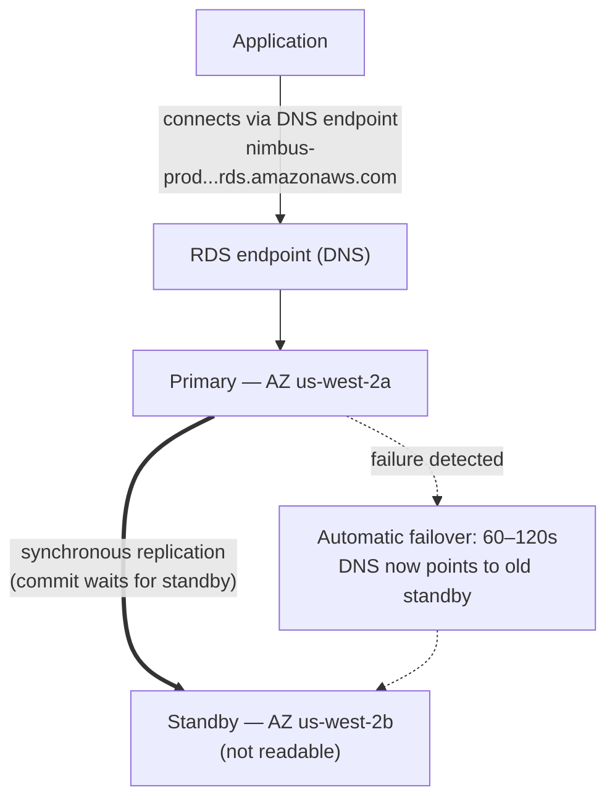

# Глава 8: Администратор базы данных, который никогда не уходит на больничный

Было 3 часа ночи, когда пришёл сигнал тревоги.

Прия была единственной, кто не спал. Её телефон загорелся на тумбочке, и она прочитала сообщение в темноте, яркость экрана была слишком высокой. Она села. Нашла ноутбук по памяти и открыла его, не включая свет.

Клавиатура тихо щёлкала в тёмной комнате.

Серверу базы данных нужен был патч безопасности — такой, который требовал перезагрузки. Уязвимость
была реальной, патч был доступен, и окно для его применения
без нарушения работы клиентов было прямо сейчас, посреди ночи, когда трафик
был низким.

Она подключилась к серверу. Загрузила патч. Применила его.

Затем она прочитала примечания к выпуску.

Обновление пакета затронуло файл конфигурации, который PostgreSQL использует для определения параметров соединения. Примечания к выпуску включали предупреждение: в зависимости от того, как было выполнено обновление, настроенный файл конфигурации мог быть заменён версией по умолчанию из пакета.

Их файл конфигурации был настроен. Лео отредактировал его два месяца назад, чтобы настроить параметр max_connections.

Патч запустился. Сервер перезагрузился. База данных снова вернулась в онлайн.

Прия протестировала запрос. Он сработал.

Она проверила логи. Всё выглядело нормально.

Она вернулась в постель в 4:15 утра.

В 9:05 утра Лео открыл приложение и получил ошибку. Он проверил базу данных. Max connections было установлено на значение по умолчанию: 100. Их приложение было настроено использовать пулы соединений до 500.

Каждая новая попытка соединения проваливалась. Приложение фактически потеряло доступ к базе данных.

«Что случилось?» — спросила Майя.

«Патч», — сказала Прия. Она уже смотрела на файл конфигурации. «Обновление пакета перезаписало наш настроенный файл конфигурации файлом по умолчанию. Настройка max_connections Лео просто исчезла — сервер перезагрузился со стоковыми настройками, и никто не получил ошибку. Он молча откатился к значению по умолчанию».

«Сколько займёт исправление?» — спросил Лео.

«Двадцать минут», — сказала Прия. «Но нам нужно окно обслуживания. Это требует изменения конфигурации и перезагрузки».

«У нас рестораны открываются на обед через два часа», — сказал Том.

Прия исправила это за восемнадцать минут. Окно обслуживания заняло двенадцать минут фактического простоя. Рестораны были затронуты, но пик ещё не начался.

Утром она рассказала команде, что произошло. Наступила тишина.

«Это будет повторяться», — сказал Том.

«Это будет происходить каждый раз, когда нужен патч», — сказала Прия. «А патчи нужны
всегда. Должен быть лучший способ это делать».

Восьмисекундное время запросов всё ещё не было решено. И на той же неделе вот это: окно обслуживания в 3 ночи, которое превратилось в утренний инцидент. У обеих проблем была одна и та же первопричина — Nimbus запускал базу данных, которой они не были оснащены управлять.

Решение было. Просто требовалось отказаться от идеи, что им необходимо самим управлять базой данных.

**Традиционная проблема базы данных**

Когда вы запускаете базу данных самостоятельно на экземпляре EC2, вы несёте ответственность за всё.

Установка программного обеспечения базы данных. Её безопасная настройка. Патчинг при обнаружении уязвимостей
безопасности. Создание резервных копий. Проверка того, что резервные копии действительно работают
(шаг, который большинство команд пропускают, пока не станет слишком поздно). Мониторинг дискового пространства. Настройка
репликации для избыточности. Настройка переключения при сбое, когда основной сервер выходит из строя.
Тонкая настройка производительности запросов. Управление соединениями под нагрузкой.

Ничто из этого не является приложением. Ничто из этого не добавляет функций. Всё это требует экспертизы.

Требование экспертизы — это ключевой вопрос. Квалифицированный администратор базы данных понимает
не только то, как запускать базу данных, но и то, как:

- Мониторить логи медленных запросов и выявлять узкие места производительности
- Подбирать размер памяти для рабочего набора, чтобы избежать дискового ввода-вывода
- Настраивать архивирование WAL для восстановления на момент времени
- Настраивать синхронную потоковую репликацию с автоматическим переключением при сбое
- Настраивать пул соединений для предотвращения исчерпания соединений под нагрузкой
- Применять обновления мажорных версий без потери данных или длительного простоя

Это отдельный, специализированный набор навыков. Опытные DBA получают высокие зарплаты именно
потому, что делать всё это хорошо — сложно. Большинство стартапов не могут нанять для этого. У большинства
команд разработки этого нет.

Большинство команд разработки не являются администраторами баз данных. Это создаёт предсказуемый паттерн:
база данных устанавливается, настраивается минимально, а потом в основном забывается — до тех пор, пока что-то
не пойдёт катастрофически не так. Экземпляр PostgreSQL в Nimbus работал на конфигурации
по умолчанию — max_connections на 100, без пула соединений, ручные резервные копии, которые Лео
запустил дважды, а потом забыл о них, и без какой-либо репликации.

Инцидент с патчем в 3 ночи был симптомом системы, которой управляли люди, которые были превосходны
в создании приложений и не имели опыта в эксплуатации баз данных. Это не
критика — это точное описание большинства стартапов. Решение не в том, чтобы
нанять DBA. Решение в том, чтобы использовать сервис, который предоставляет операции уровня DBA
автоматически.

«Это то, что мы сделали?» — спросила Майя.

Ответом Лео была тишина, что было равнозначно «да».

**Управляемая база данных**

Представьте, что вы наняли администратора базы данных, который никогда не уходит на больничный, автоматически справляется
с каждым патчем безопасности, делает резервную копию каждую ночь, не дожидаясь просьбы, и сам
себя чинит, когда что-то ломается. Он делает всё это, не беспокоя вас — и он
никогда, ни при каких обстоятельствах, не трогает логику вашего приложения.

AWS называет этот сервис **RDS** — Relational Database Service.

С RDS AWS управляет:

- Установкой и патчингом движка базы данных
- Автоматическими резервными копиями (хранящимися в S3, сохраняемыми до 35 дней)
- Автоматическим переключением при сбое (когда основная база данных выходит из строя, резервная автоматически берёт управление)
- Мониторингом и метриками
- Шифрованием в состоянии покоя и при передаче
- Автомасштабированием хранилища (если вы его включите, диск растёт, когда заполняется)

Вы управляете:

- Схемой базы данных (структура ваших таблиц)
- Запросами и логикой приложения
- Тем, кто имеет доступ к базе данных
- Типом экземпляра, на котором работает база данных
- Тонкой настройкой параметров (хотя RDS предоставляет разумные значения по умолчанию)

**Поддерживаемые движки**

RDS поддерживает несколько популярных движков баз данных:

- **MySQL** — наиболее широко используемая реляционная база данных с открытым исходным кодом
- **PostgreSQL** — мощная, расширяемая, всё более популярная для сложных нагрузок
- **MariaDB** — форк MySQL с открытым исходным кодом, полностью совместимый
- **Oracle** — корпоративный уровень, используется в крупных организациях с устаревшими требованиями
- **Microsoft SQL Server** — для сред с преобладанием Windows
- **Amazon Aurora** — собственный движок AWS, совместимый с MySQL/PostgreSQL, построенный для облака
  (мы подробно рассмотрим Aurora в Главе 24)

Для Nimbus выбором стал PostgreSQL. Это то, что знал Лео, и он хорошо справлялся с реляционными
данными. Выбор движка имеет меньше значения, чем вы думаете для большинства приложений —
операционные преимущества RDS применяются независимо от движка.

Один нюанс: когда вы запускаете движок на RDS, AWS поддерживает патчи минорных версий
автоматически (во время настроенного вами окна обслуживания). Обновления мажорных версий —
переход с PostgreSQL 14 на 15, например — это ручная операция, которую вы
планируете и выполняете. AWS тщательно тестирует обновления мажорных версий, но вам следует тестировать
их сначала в среде staging. Изменения мажорных версий могут вносить проблемы совместимости
с конкретным синтаксисом SQL, расширениями или версиями драйверов.

Лео обнаружил это, когда RDS применил минорный патч и лог приложения ненадолго
показал предупреждение об устаревании функции, которая была удалена в подвыпуске.
Минорные патчи должны быть по существу прозрачными — но мониторинг логов вашего приложения
после каждого окна обслуживания — хорошая практика.

«Мы подумали о том, что произойдёт, если минорный патч что-то сломает?» — спросила Прия.

«Мы откатываемся к предыдущему снимку», — сказал Лео.

«Сколько это занимает?»

Лео нашёл время восстановления RDS для размера их базы данных. Для базы данных в 50 ГБ на
`db.m6i.large`: примерно от 15 до 30 минут на восстановление из снимка.

«Значит, у нас есть окно восстановления в 15–30 минут, если патч сломает продакшен», — сказала Прия. «И мы применяем патч в раннее утреннее окно обслуживания, так что по крайней мере воздействие минимально».

«И мы тестируем патчи сначала в staging», — добавил Лео.

«Да», — сказала Прия. «Это тоже».

**Подбор размера экземпляра RDS: не все рабочие нагрузки равны**

Когда вы создаёте экземпляр RDS, вы выбираете тип экземпляра — та же концепция, что и в EC2, но в рамках рабочих нагрузок баз данных. AWS организует типы экземпляров RDS в несколько полезных уровней.

**Семейство db.t3**: Экземпляры с пакетной производительностью (burstable). Спроектированы для разработки, staging и лёгких производственных нагрузок, которым не нужен устойчивый высокий CPU. `db.t3.micro` подходит для базы данных разработки с низким трафиком. `db.t3.medium` справляется с умеренной производственной нагрузкой с эпизодическими всплесками.

Компромисс с экземплярами серии T: они накапливают кредиты CPU в периоды низкой утилизации и тратят эти кредиты во время всплесков. Если вы запускаете экземпляр серии T на устойчивом высоком CPU, вы исчерпываете кредиты, и производительность дросселируется до базового уровня, который может быть недостаточным.

**Семейство db.m6i**: Универсальные экземпляры с постоянной, непакетной производительностью. `db.m6i.large` — распространённая отправная точка для производственных баз данных. У них нет ограничений по кредитам — CPU доступен на полной мощности всякий раз, когда вам это нужно.

**Семейство db.r6i**: Экземпляры с оптимизацией под память. Больше RAM на vCPU, чем у семейства M. Подходят для баз данных с большими рабочими наборами — запросы, которые выигрывают от того, что данные находятся в памяти, а не извлекаются с диска при каждом обращении. Если производительность вашей базы данных резко улучшается, когда вы добавляете RAM, семейство R — правильный выбор.

Для Nimbus:

- Разработка и staging: `db.t3.medium`. Достаточно для запросов разработки, низкая стоимость.
- Продакшен: `db.m6i.large`. Постоянная производительность, достаточно RAM для рабочего набора меню и заказов, без дросселирования по кредитам.

«Насколько m6i.large дороже, чем t3.medium?» — спросил Том.

Лео проверил страницу цен. `db.t3.medium` обходился примерно в $55/месяц. `db.m6i.large` обходился примерно в $140/месяц. Разница была реальной, но реальной была и разница в надёжности.

«t3 будет дросселироваться под устойчивой нагрузкой», — сказала Прия. «Если у нас оживлённая пятница и CPU остаётся высоким четыре часа, t3 исчерпывает кредиты и дросселируется. m6i — нет».

Том записал число. Он также записал стоимость пятничных простоев двухнедельной давности. Сравнение было совсем не близким.

Продакшен пошёл на `db.m6i.large`.

**Multi-AZ: резервная база данных, готовая взять управление**

Это функция, которая полностью меняет расчёт надёжности.

**Развёртывание Multi-AZ** означает, что RDS поддерживает синхронный резервный экземпляр в
другой зоне доступности от основного. Каждая транзакция, зафиксированная на основном экземпляре,
синхронно реплицируется на резервный перед подтверждением фиксации.

Когда основной сервер выходит из строя — аппаратный сбой, сбой AZ, программный сбой — RDS
автоматически переключается на резервный. DNS-запись для конечной точки базы данных
обновляется. Ваше приложение переподключается к новому основному.

Переключение при сбое занимает 60–120 секунд. В течение этого окна ваше приложение будет испытывать
ошибки соединения. Правильно написанные приложения должны справляться с этим корректно (повторные
попытки соединения с отступлением).

Резервная база данных не является репликой для чтения. Она не обслуживает трафик на чтение. Единственная её цель —
быть готовой взять управление.



(Примечание: более новый вариант развёртывания **Multi-AZ DB Cluster** держит *два* резервных
экземпляра, которые **являются** читаемыми, и переключается при сбое за ~35 секунд — экзамен может отличать его от
классического развёртывания Multi-AZ *экземпляра*, описанного здесь.)

«Сколько стоит Multi-AZ?» — спросил Том.

Примерно вдвое дороже одного экземпляра — потому что вы буквально запускаете два
экземпляра базы данных. Резервный стоит столько же, сколько основной.

Том открыл историю заказов и оценил выручку в час во время их пятничного пика.

«А что, если кто-то попытается взломать систему во время окна переключения при сбое?» — спросила Прия. «Когда основной сервер недоступен, а резервный повышается, есть ли шестьдесят секунд, когда мы уязвимы?»

«Переключение прозрачно», — сказала Майя, — «но вопрос справедливый. Строки соединения должны использовать конечную точку RDS, а не жёстко прописанные IP — иначе переключение не будет бесшовным».

Multi-AZ был включён в тот же день после полудня.

**Автоматические резервные копии и восстановление на момент времени**

RDS делает автоматические резервные копии каждый день. AWS хранит эти резервные копии в S3 (управляется
RDS — вы не видите их напрямую в консоли S3). Вы можете восстановить базу данных
в любую точку в пределах периода хранения резервных копий.

Резервные копии происходят в настраиваемом **окне резервного копирования** — в период низкого трафика,
обычно ранним утром. (Это настройка, отдельная от **окна обслуживания**,
которое определяет, когда RDS применяет патчи и изменения конфигурации. Экзамен
любит проверять, что это два разных окна.) Для большинства типов движков резервные копии
не вызывают простоев — а на развёртываниях Multi-AZ снимок берётся с
резервного, так что основной вообще не затрагивается.

**Восстановление на момент времени** — одна из наиболее ценных функций: вы можете восстановиться в
любую секунду в пределах вашего периода хранения. Не только ежедневные снимки — *любую секунду*.
Это возможно потому, что RDS непрерывно архивирует журналы транзакций в дополнение к
ежедневным резервным копиям.

Если кто-то случайно выполнит `DELETE FROM orders WHERE 1=1` в 14:37, вы можете
восстановиться до 14:36.

Лео явно расслабился, когда понял это.

«Я уже установил хранение резервных копий на один день», — сказал Лео. «О — но это нормально, да? Мы можем это изменить?»

«Измени минимум на семь дней», — сказала Прия. «Тридцать для продакшена».

Лео обновил это немедленно.

«Мы могли бы восстановиться из того, что я удалил в прошлом месяце?» — спросил он.

«До RDS? Нет», — сказала Прия. «После RDS? Да».

Вы можете задаваться вопросом: в чём разница между автоматической резервной копией и ручным снимком? Автоматические резервные копии удаляются, когда истекает период хранения (до 35 дней). Ручные снимки хранятся бессрочно, пока вы их явно не удалите. Если вам нужно сохранить состояние базы данных навсегда — перед крупной миграцией, перед рискованным развёртыванием — сделайте ручной снимок.

**RDS Proxy: решение проблемы соединений в масштабе**

Через две недели после миграции на RDS Лео заметил кое-что в метриках.

База данных обрабатывала запросы нормально. Но количество открытых соединений было высоким — выше, чем он ожидал. С Auto Scaling Group, добавляющей экземпляры EC2 во время пика, каждый новый экземпляр открывал собственный пул соединений с базой данных. Десять экземпляров EC2, каждый с пулом соединений в 50: пятьсот одновременных соединений с базой данных.

«У PostgreSQL есть накладные расходы на каждое соединение», — сказала Прия. «Память, CPU для обработчика соединений. Пятьсот соединений используют значительную часть ресурсов базы данных только на управление соединениями — ещё до того, как она сделала какую-либо реальную работу».

«Можем ли мы уменьшить размер пула соединений?» — спросил Лео.

«Могли бы», — сказала Прия. «Но тогда мы рискуем тем, что запросы будут выстраиваться в очередь в ожидании соединения во время пика».

Лучшее решение: **RDS Proxy**.

RDS Proxy находится между приложением и базой данных. Экземпляры EC2 подключаются к Proxy, а не напрямую к экземпляру RDS. Proxy поддерживает пул соединений с базой данных и мультиплексирует запросы приложения через них. Если десять экземпляров EC2 каждый открывает пятьдесят соединений к Proxy, Proxy может поддерживать всего сто фактических соединений с базой данных — эффективно разделяя их между всеми запросами приложения.

Преимущества:

**Пул соединений**: Меньше фактических соединений с базой данных означает меньше накладных расходов на память на экземпляре RDS и лучшую производительность под нагрузкой.

**Более быстрое переключение при сбое**: Во время переключения при сбое Multi-AZ Proxy поддерживает соединение со стороны приложения, восстанавливая соединение с базой данных на бэкенде. Приложения видят кратковременную паузу, а не полный сброс соединения. RDS Proxy сокращает воздействие переключения при сбое с 60–120 секунд до обычно 30 секунд или меньше.

**Аутентификация IAM**: Вместо встраивания учётных данных базы данных в приложение, приложение может аутентифицироваться в RDS Proxy с помощью роли IAM. Proxy обрабатывает фактические учётные данные базы данных. Это полностью устраняет секреты из среды приложения.

«Сколько стоит RDS Proxy?» — спросил Том.

Он обходится примерно в $0,015 за vCPU-час базового экземпляра RDS, выставляется отдельно от самого экземпляра. Для `db.m6i.large` (2 vCPU) Proxy добавляет примерно $22/месяц.

Том посмотрел на график количества соединений — пятьсот соединений, конкурирующих за ресурсы базы данных во время пика — и посмотрел на стоимость $22/месяц.

«Это дешевле, чем переход на более крупный экземпляр RDS для обработки накладных расходов на соединения», — сказал он.

RDS Proxy был включён на той же неделе.

«А что, если кто-то попытается взломать систему через Proxy?» — спросила Прия. «Снижает ли аутентификация IAM для Proxy поверхность атаки?»

«Да», — Прия ответила на свой собственный вопрос. «Отсутствие учётных данных базы данных в среде приложения означает, что нет учётных данных базы данных, которые можно украсть из приложения».

Она включила аутентификацию IAM для Proxy.

**Реплики для чтения: масштабирование трафика на чтение**

Multi-AZ — про доступность. **Реплики для чтения** — про производительность.

Реплика для чтения — это асинхронная копия вашей основной базы данных, которая может обслуживать запросы
на чтение. У вас может быть до 15 реплик для чтения для основных движков RDS — MySQL, PostgreSQL и MariaDB (Aurora также поддерживает до 15 Aurora Replicas, разделяющих тот же том хранилища).

Приложение модифицируется так, чтобы отправлять запросы на чтение реплике, а запросы на запись —
основному серверу. Это распределяет нагрузку: основной обрабатывает записи и сложные
транзакции; реплики обрабатывают чтение.

Ключевые характеристики:

- Репликация **асинхронная** — может быть небольшая задержка (лаг) между
  основным и репликой. Если вы напишете запись и сразу прочитаете из реплики,
  вы можете ещё не увидеть её.
- Реплики для чтения могут быть в том же регионе или в другом регионе (кросс-региональные
  реплики добавляют задержку, но позволяют географическое распределение).
- Реплики для чтения могут быть повышены до самостоятельных баз данных в сценарии катастрофы.

Для Nimbus: поиск по меню — это чтение. История заказов — это чтение. Подавляющее большинство
трафика — это операции чтения. Добавление реплики для чтения и маршрутизация операций чтения к ней значительно
снижает нагрузку на основную базу данных.

Мы рассматриваем реплики для чтения более подробно в Главе 24, когда обсуждаем Aurora.

**Если нагрузка с интенсивным чтением, то добавьте реплику, но следите за лагом**

Если ваша рабочая нагрузка с интенсивным чтением, добавление реплики для чтения снижает нагрузку на основной сервер и улучшает производительность запросов — но репликация асинхронная, что означает, что реплика может немного отставать от основного. Если ваше приложение записывает запись и сразу же читает её обратно, оно должно читать из основного сервера, а не из реплики. Сделать это неправильно — значит породить тонкие, трудноотлаживаемые баги свежести данных: пользователь оформляет заказ, страница подтверждения запрашивает реплику, реплика не успела догнать, заказ кажется пропавшим. Это называется согласованностью чтения-после-записи (read-your-writes), и это самая распространённая ошибка, которую команды делают, когда впервые добавляют реплики.

**Performance Insights: поиск медленного запроса**

Восьмисекундное время загрузки меню всё ещё было проблемой. Переход на RDS улучшил надёжность, но запрос всё ещё был медленным.

Лео добавил реплику для чтения и направил запросы меню к ней. Время загрузки меню упало примерно до четырёх секунд. Лучше. Всё ещё не хорошо.

«Запрос всё ещё медленный», — сказала Майя. «Мы улучшили узкое место, но не исправили его».

RDS включает функцию под названием **Performance Insights** — инструмент мониторинга, который показывает, какие запросы потребляют больше всего ресурсов базы данных, какие сессии ждут и чего они ждут.

Лео включил Performance Insights на реплике для чтения и многократно загружал страницу меню во время дневной тестовой сессии.

Дашборд Performance Insights показал один запрос, доминирующий в нагрузке: полное сканирование таблицы `menu_items`, извлекающее все 22 000 строк каждый раз, когда загружалась страница меню. Не было индекса на `restaurant_id` — столбце, по которому фильтровало приложение.

Время выполнения без индекса: 8,2 секунды.

Лео добавил индекс.

```sql
CREATE INDEX idx_menu_items_restaurant_id ON menu_items(restaurant_id);
```

Время выполнения с индексом: 14 миллисекунд.

8 200 миллисекунд до 14 миллисекунд. Разница между приложением заказов ресторана, которое отпугивает клиентов, и тем, которым они пользуются, не задумываясь.

«И это была проблема всё это время?» — сказала Майя.

«Это была проблема», — сказал Лео.

«А Performance Insights нашёл её за сколько?»

«Около двадцати минут».

Том уже считал. Три недели субоптимального времени загрузки меню, оценочно 200 000 загрузок страницы меню за этот период, оценочно 15% отказов из-за медлительности. Число, к которому он пришёл, было некомфортным.

«В следующий раз добавляй недостающие индексы до запуска», — сказал он.

«Будет чек-лист», — сказала Прия. Она уже его писала.

**Когда не использовать RDS**

RDS отлично подходит для широкого спектра рабочих нагрузок реляционных баз данных. Это не правильный ответ для всего.

**Когда вам нужен доступ на уровне ОС**: RDS не даёт вам доступа к базовой операционной системе. Вы не можете устанавливать пользовательские пакеты ОС, изменять параметры ядра или запускать инструменты, требующие root-доступа к серверу базы данных. Если ваша база данных имеет требования, которые требуют доступа к ОС — определённые конфигурации Oracle, пользовательские драйверы хранилища, специфические сетевые интерфейсы — вам нужно запускать базу данных на экземпляре EC2 напрямую.

**Когда вы используете неподдерживаемый движок**: RDS поддерживает MySQL, PostgreSQL, MariaDB, Oracle, SQL Server и Aurora. Если ваше приложение использует другой движок базы данных — CockroachDB, SingleStore, Greenplum — вы запускаете его на EC2, а не на RDS.

**Когда вам нужно горизонтальное масштабирование с интенсивной записью**: RDS масштабирует чтение через реплики. Записи идут на один основной экземпляр. Если ваша рабочая нагрузка с интенсивной записью и нуждается в распределении по нескольким узлам записи, RDS — не правильная архитектура. Aurora Global Database может помочь в большом масштабе, но для экстремальных требований к масштабу записи распределённые базы данных вроде DynamoDB (Глава 9) или CockroachDB, работающие на EC2, — подходящие инструменты.

**Когда стоимость управляемого сервиса превышает операционную стоимость**: Для очень крупных, стабильных рабочих нагрузок, где у вашей команды есть настоящая экспертиза в администрировании баз данных, запуск PostgreSQL на EC2 с собственным инструментарием может быть дешевле, чем RDS. Это необычно для команд, которые не являются в первую очередь DBA-командами. Но это реально, и хороший архитектор это признаёт.

Для Nimbus — стартапа без выделенных ресурсов DBA, запускающего PostgreSQL на управляемом сервисе, с непредсказуемым ростом — RDS был явно правильным выбором.

**Группы параметров и группы опций RDS**

Два механизма конфигурации, которые встречаются на экзамене:

**Группы параметров** управляют настройками движка базы данных — например, максимальным количеством соединений,
размером кэша запросов, значениями таймаута. RDS создаёт группу параметров по умолчанию, которая работает
для большинства случаев. Вы создаёте пользовательские группы параметров, когда вам нужно настроить конкретные параметры.

**Группы опций** включают дополнительные функции для некоторых движков — например, нативное
сетевое шифрование Oracle или прозрачное шифрование данных SQL Server. Большинство развёртываний движков
с открытым исходным кодом не требуют пользовательских групп опций.

Вы можете настраивать поведение движка базы данных через эти механизмы — но значения по умолчанию работают для большинства команд на старте.

### Загрузка данных: AWS Database Migration Service

Через несколько недель Том пришёл на стендап со слайдом.

Nimbus приобретал небольшого регионального конкурента. Их система заказов работала на базе данных MySQL в дата-центре колокации. Систему нельзя было отключать во время миграции — рестораны её использовали.

«Нам нужно перенести их данные в RDS», — сказал Том. «Не отключая систему».

«Насколько велика база данных?» — спросил Лео.

«Около 80 гигабайт».

«Когда им нужно переключиться?»

«Шесть недель».

Прия уже открыла документацию. «AWS DMS», — сказала она.

**AWS DMS (Database Migration Service)** перемещает данные из исходной базы данных в целевую базу данных с минимальным простоем. Он обрабатывает миграцию в две фазы: полная загрузка существующих данных, за которой следует непрерывная репликация изменений по мере того, как исходная система продолжает работать.

Есть два типа миграции:

**Гомогенная миграция:** источник и цель — один и тот же движок — MySQL в RDS MySQL, PostgreSQL в Aurora PostgreSQL. Схема совместима; DMS мигрирует данные напрямую.

**Гетерогенная миграция:** источник и цель — разные движки — Oracle в Aurora PostgreSQL, SQL Server в RDS MySQL. Схема должна быть сначала конвертирована. Это требует **AWS Schema Conversion Tool (SCT)** для перевода схемы, затем DMS для перемещения данных.

Для приобретения Nimbus: MySQL в RDS MySQL. Гомогенная. SCT не нужен.

Как это работает на практике:

1. DMS читает из источника — базы данных MySQL в колокации
2. **Полная загрузка**: DMS копирует все существующие данные в целевой экземпляр RDS
3. **CDC (Change Data Capture)**: после полной загрузки DMS читает журнал транзакций исходной базы данных и реплицирует текущие изменения в цель почти в реальном времени
4. Источник продолжает работать. Когда команда готова, она переключает строку соединения.

«Так система заказов ресторана остаётся живой всё время?» — спросил Том.

«Всё время», — подтвердила Прия. «Источник и цель остаются синхронизированными через CDC. Когда мы готовы, мы переключаем конечную точку. Простой — это секунды, которые требуются для распространения этого изменения».

DMS поддерживает десятки комбинаций источников и целей: Oracle, SQL Server, MySQL, PostgreSQL, MongoDB, DynamoDB, S3, Redshift, Aurora и другие.

«Подожди — но *почему* нам нужен отдельный инструмент для гетерогенных миграций?» — спросила Майя. «Разве DMS не может просто разобраться с различиями схем?»

«VARCHAR в Oracle — это не то же самое, что VARCHAR в PostgreSQL», — сказала Прия. «Типы данных, хранимые процедуры, последовательности, проприетарные функции — они не отображаются один к одному. SCT анализирует исходную схему и генерирует ближайший эквивалент для цели. DMS затем перемещает данные в эту конвертированную схему. Разделение конвертации схемы и перемещения данных — это то, что делает процесс надёжным».

«А что, если кто-то попытается взломать систему через экземпляр репликации DMS?» — спросила себя Прия мгновением позже. «Ему нужен доступ на чтение к источнику и доступ на запись к цели».

«Наименьшие привилегии на обоих концах», — сказал Лео. «IAM только на чтение на источнике. Доступ на запись, ограниченный только целью миграции. И экземпляр репликации остаётся в приватной подсети».

Прия записала это.

## Сильные стороны и ограничения

**Почему RDS отличный**:

- Устраняет операционную нагрузку по управлению программным обеспечением базы данных
- Автоматические резервные копии и восстановление на момент времени
- Multi-AZ для автоматического переключения при сбое с минимальным RTO
- Реплики для чтения для масштабирования трафика на чтение
- Шифрование в состоянии покоя и при передаче встроено
- Поддерживаются все основные движки реляционных баз данных
- RDS Proxy для пула соединений и улучшенной реакции на переключение при сбое

**Где у RDS есть ограничения**:

- Вы не можете получить доступ к базовой ОС. Если ваша база данных имеет требования, которые требуют
  доступа на уровне ОС, вам может потребоваться запустить собственную базу данных на EC2.
- RDS не является бессерверным (с исключениями — Aurora Serverless существует, рассматривается в
  Главе 24). Вы платите за работающий экземпляр, даже если он простаивает.
- RDS не предназначен для горизонтально шардированных баз данных. Для массивного горизонтального
  масштабирования рабочих нагрузок с интенсивной записью на реляционных данных вам в конечном счёте может потребоваться другая архитектура.
- Для нереляционных (NoSQL) паттернов данных DynamoDB (Глава 9) более уместен.

## Итоги

Окно патча Прии в 3 ночи было симптомом. Первопричина была в том, что Nimbus управлял базой данных, с которой управляемый сервис мог справиться лучше. RDS не просто устраняет звонок-пробуждение в 3 ночи — он перекладывает ответственность за патчинг, переключение при сбое, резервные копии и управление соединениями на AWS, освобождая команду для фокуса на коде приложения, который действительно обслуживает клиентов. Компромисс — потеря доступа на уровне ОС, что имеет значение редко и гораздо меньше, чем звучит.

- **Amazon RDS** — это управляемый сервис реляционных баз данных. AWS обслуживает патчинг, резервные копии, переключение при сбое и хранилище. Вы обслуживаете схему, запросы и логику приложения.
- **Multi-AZ** поддерживает синхронный резервный экземпляр в другой AZ. Автоматическое переключение при сбое происходит за 60–120 секунд. Всегда используйте DNS-имя конечной точки RDS в строках соединения — а не жёстко прописанные IP — чтобы переключение было прозрачным.
- **Реплики для чтения** — это асинхронные копии, обслуживающие трафик на чтение. Лаг репликации означает, что они могут немного отставать — согласованность чтения-после-записи требует чтения из основного сразу после записи.
- **RDS Proxy** объединяет соединения в пул, снижая накладные расходы и улучшая скорость переключения при сбое. Критичен для нагрузок на основе Lambda, которые могут создавать тысячи короткоживущих соединений.
- **Performance Insights** выявляет медленные запросы — обнаружение недостающего индекса может превратить 8-секундный запрос в 14-миллисекундный. Обновления мажорных версий ручные; тестируйте в staging сначала.

## Советы по экзамену

*Домен SAA-C03 3 — Задача 3.3 (решения баз данных)*

- **Multi-AZ — для высокой доступности, а не производительности.** Резервная база данных не обслуживает
  трафик на чтение. Реплики для чтения — для производительности. Это различие часто проверяется.
- **Переключение при сбое Multi-AZ автоматическое.** Вы не настраиваете когда или как это происходит.
  RDS следит за основной базой данных и автоматически запускает переключение.
- **Лаг репликации важен.** Реплики для чтения могут немного отставать от основного.
  Если ваше приложение требует читать данные, которые оно только что записало, оно должно читать из
  основного сервера, а не из реплики. Это называется «согласованность чтения-после-записи».
- **Автоматические резервные копии хранятся от 0 до 35 дней.** Установка хранения на 0
  отключает автоматические резервные копии. Ручные снимки хранятся бессрочно, пока
  вы их не удалите.
- **Автомасштабирование хранилища RDS** предотвращает сбои из-за переполнения диска. Включите его. Оно только увеличивается,
  никогда не уменьшается. Экзамен может проверить, знаете ли вы эту асимметрию.
- **RDS Proxy** появляется в сценариях экзамена, связанных с функциями Lambda, подключающимися к RDS
  (Lambda может создавать тысячи короткоживущих соединений, которые перегружают базу данных
  без Proxy), или в сценариях, требующих более быстрого переключения при сбое Multi-AZ.
- **Экземпляры db.t3 пакетируют и дросселируют.** Сценарии экзамена, описывающие периодическую
  деградацию производительности на малых экземплярах RDS, могут описывать исчерпание кредитов CPU
  на экземплярах серии T. Исправление — переход на экземпляр серии M или R.
- **DNS-конечная точка Multi-AZ**: Когда происходит переключение при сбое Multi-AZ, DNS-запись
  конечной точки RDS обновляется, чтобы указывать на новый основной. Приложения, использующие конечную точку RDS
  (а не жёстко прописанный IP), переподключаются автоматически. Приложения с длинными DNS TTL или
  жёстко прописанными IP-адресами не переподключатся автоматически. Всегда используйте конечную точку RDS.
- **Повышение реплики для чтения**: Реплику для чтения можно повысить до самостоятельного экземпляра БД
  — полезно для аварийного восстановления, если основной потерян, а Multi-AZ не был настроен.
  Повышение — это одностороння операция: реплика становится основной и больше не
  реплицирует с оригинала. Сценарии экзамена, спрашивающие о «ручном повышении» или
  «преобразовании реплики для чтения в основную», касаются этой операции.
- **Performance Insights** выявляет топовые SQL-запросы по времени ожидания и использованию CPU.
  Когда сценарий экзамена спрашивает, как диагностировать медленные запросы на базе данных RDS, Performance
  Insights — это нативный для AWS ответ.
- **RDS против запуска базы данных на EC2**: Экзамен иногда представляет это как выбор.
  RDS предоставляет управляемые операции, но ограничивает доступ на уровне ОС. Базы данных на основе EC2 дают
  вам полный контроль, но требуют экспертизы DBA для операций. Фраза «требуется доступ на уровне ОС»
  в сценарии экзамена — это сигнал выбрать EC2 вместо RDS.
- **AWS DMS:** Мигрирует базы данных с минимальным простоем с помощью полной загрузки + CDC. Гомогенная (один движок) = DMS напрямую. Гетерогенная (разные движки) = SCT для конвертации схемы сначала, затем DMS для перемещения данных. Триггер для экзамена: «мигрировать базу данных с минимальным простоем» или «Oracle в Aurora» → DMS + SCT.

## Упражнения

**Упражнение 1 — Запоминание**

Своими словами: в чём разница между Multi-AZ и репликами для чтения в RDS?
Какую проблему решает каждый?

*(Подсказка: один защищает от простоев; другой улучшает производительность при нагрузке с интенсивным
чтением. Они решают разные проблемы и могут использоваться вместе.)*

**Упражнение 2 — Сценарий SAA-C03**

*Сценарий*: Компания запускает производственную базу данных PostgreSQL на RDS. База данных
испытывает высокий трафик на чтение из-за аналитических запросов, работающих в течение дня.
Команда также обеспокоена доступностью базы данных — они не могут позволить себе более
нескольких минут простоя в сценарии сбоя. Они хотят минимизировать воздействие на
основную базу данных от аналитических нагрузок.

Какая комбинация функций RDS НАИЛУЧШИМ образом решает обе проблемы?

A) Включить Multi-AZ и выполнять все запросы к резервному экземпляру
B) Делать более частые ручные снимки и восстанавливать из них при отказе основного сервера
C) Создать несколько реплик для чтения и отключить Multi-AZ для снижения затрат
D) Включить Multi-AZ для защиты от переключения при сбое и создать реплику для чтения для аналитических запросов

**Подсказка 1**: Два требования: (1) доступность при сбое, (2) разгрузка
операций чтения. Какие функции решают какое требование?

**Подсказка 2**: Multi-AZ обеспечивает автоматическое переключение при сбое. Резервная база данных НЕ обслуживает трафик на чтение.
Так что Multi-AZ один не помогает с проблемой чтения.

**Подсказка 3**: Реплики для чтения обслуживают трафик на чтение. Multi-AZ обеспечивает переключение при сбое. Вам нужны оба.

**Ответ**: D

**Объяснение**: Multi-AZ обеспечивает автоматическое переключение при сбое на резервный экземпляр в другой AZ —
это решает требование доступности. Реплика для чтения позволяет аналитическим запросам
выполняться без воздействия на основную базу данных — это решает требование
производительности. Обе функции могут использоваться одновременно.

**Почему не A?** Резервная база данных Multi-AZ не может обслуживать трафик на чтение. Она исключительно для
переключения при сбое. Попытка запрашивать её напрямую не поддерживается.

**Почему не B?** Ручные снимки восстанавливают полную копию базы данных — значительно более длительный
процесс (потенциально часы для крупных баз данных). Это не соответствует требованию «несколько минут
простоя».

**Почему не C?** Реплики для чтения помогают с производительностью на чтение, но не обеспечивают автоматического
переключения при сбое. Если основной сервер выходит из строя, вам придётся вручную повысить реплику для чтения —
что занимает время и не является автоматическим.

*Домен SAA-C03 3 — Задача 3.3*

**Упражнение 3 — Архитектурный вызов** *(Необязательно)*

Nimbus рассматривает возможность миграции существующей самоуправляемой базы данных PostgreSQL
(работающей на экземпляре EC2) на RDS PostgreSQL. Миграция должна произойти
с минимальным простоем — в идеале менее 15 минут. Размер базы данных — 200 ГБ.

Что бы вы порекомендовали? Какие сервисы AWS могут помочь с миграцией?
Какие риски вы бы протестировали перед переключением производственного трафика?

*(Нет единственно правильного ответа. Думайте о AWS Database Migration Service,
логической репликации и риске несогласованности данных во время переключения.)*

## Послесловие к главе

К концу дня Nimbus переехал на RDS PostgreSQL с включённым Multi-AZ. Сама
миграция заняла большую часть дня — Лео использовал подход резервного копирования и восстановления
с коротким окном обслуживания.

Том тщательно следил за счётом.

«Экземпляр RDS», — сказал он, — «стоит вдвое больше, чем стоила база данных EC2».

«А автоматические резервные копии?» — спросила Майя.

«Немного больше».

«А переключение при сбое, которое мы получим бесплатно, если основной сервер умрёт?»

У Тома не было цены на это. Он записал это как вопрос.

Три дня спустя база данных была здорова. Время запросов резко упало после того, как Лео добавил недостающий индекс. Меню загружалось менее чем за секунду.

«Проблема», — сказала Прия, — «не в движке базы данных. В модели данных».

Она сделала паузу.

«Часть этих данных вообще не реляционная. Пункты меню, профили ресторанов,
зоны доставки — эти данные имеют переменную форму. SQL нас ограничивает».

Лео уже что-то исследовал.

«Что если использовать другую базу данных для меню?» — сказал он.

В следующей главе: база данных, которая не замедляется, даже когда миллион человек заказывает одновременно.
