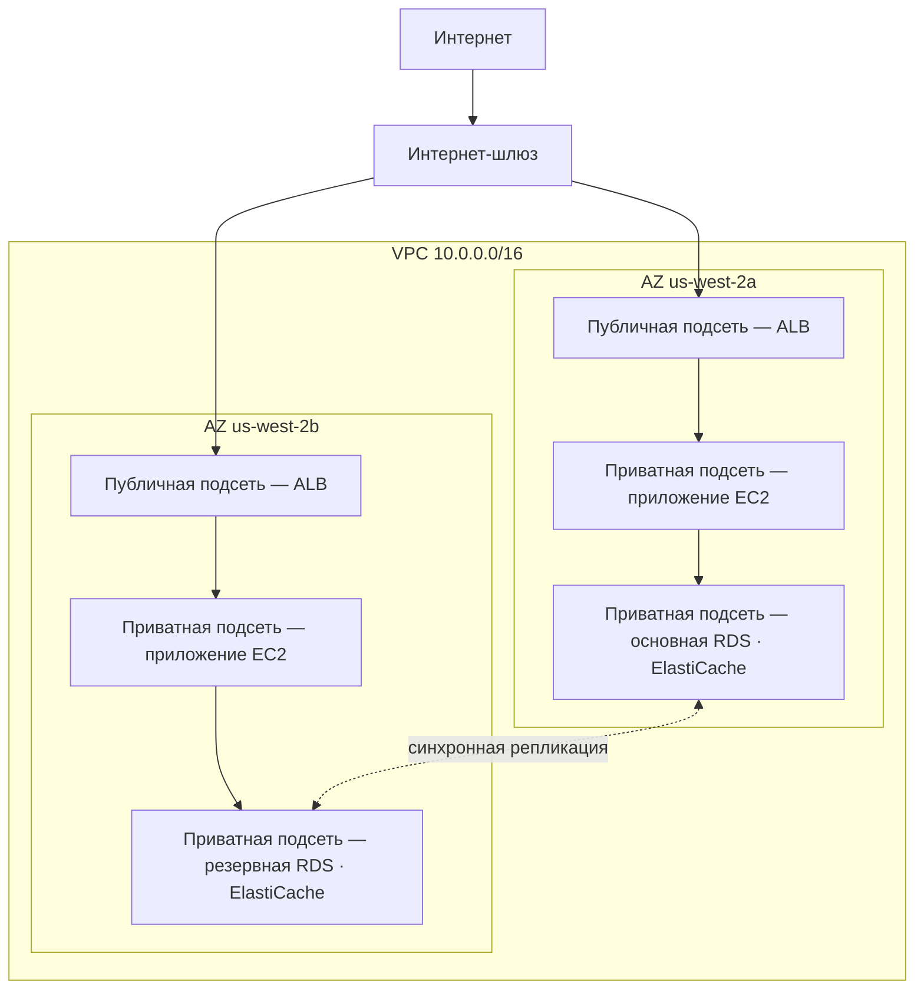

# Глава 11: Ваш приватный уголок в облаке

У Прии был листок бумаги с рисунком.

Рисунок был несложным. Прямоугольник с надписью «AWS». Внутри прямоугольника — кластер блоков: экземпляры EC2, база данных RDS, кластер ElastiCache. Линии, соединяющие всё со всем. И снаружи прямоугольника — одна надпись: «Интернет».

Она положила листок в центр стола.

---

*Уровень кэширования работал. Redis сократил загрузку страниц со 188 миллисекунд до 12. Но пока Лео праздновал эту победу, Прия читала сетевые журналы — и ей не нравилось то, что она видела. Каждый сервис находился в одной плоской сети. У базы данных был публичный IP-адрес. Кластер Redis технически был достижим извне. Приложение работало, но архитектура была парковкой: ни заборов, ни ворот, ни зон.*

---

«Вот что у нас есть», — сказала она. «Наша база данных имеет публичный IP-адрес. К нашему кэш-уровню можно получить доступ из интернета. Наши экземпляры EC2 находятся в одной плоской сети».

«Это кажется нормальным», — сказал Лео. «У нас есть группы безопасности».

«Группы безопасности, которые ты настроил», — сказала Прия. «Ночью. Во время первоначальной настройки».

Лео промолчал.

«Я не критикую конфигурацию», — сказала она. «Я говорю, что когда всё находится в одной плоской публичной сети, одна ошибка конфигурации — это разница между работающей системой и той, которая доступна всем в интернете».

Она взяла красный маркер и обвела базу данных кружком.

«Это не должно быть доступно из интернета. Совсем. Не через правило группы безопасности, не через усиленную конфигурацию. Оно должно быть структурно недостижимым».

«Нам нужно поговорить о сетевой архитектуре», — сказала Майя.

«Нам нужно было поговорить об этом три месяца назад», — сказала Прия. «Но сейчас тоже нормально».

Команда собралась вокруг доски впервые за несколько недель.

**Проблема с открытой парковкой**

Представьте огромный публичный паркинг. Десять тысяч машин. Любая машина может парковаться где угодно. Нет барьеров между зонами, нет ворот, нет зарезервированных секций.

Это открытая сеть. Каждый сервис может достичь каждого другого. Ваш веб-сервер может разговаривать с вашей базой данных. База данных может достигать интернета. Ваш кэш-уровень может принимать подключения откуда угодно.

Когда всё может разговаривать со всем, одна компрометация затрагивает всё.

«Значит, если кто-то проникнет на парковку», — сказал Том, — «они могут войти в любую машину».

«И из любой машины поехать куда угодно», — подтвердила Прия. «Нам нужны заборы. Нам нужны заблокированные ворота. Нам нужны зоны».

VPC — это то, как вы строите эти зоны в AWS.

**Что такое VPC?**

«Подождите — но *почему* мы делали бы это именно так?» — спросила Майя. «Если у нас уже есть группы безопасности на каждом ресурсе, зачем нам VPC? Разве группы безопасности не делают ту же работу?»

Группы безопасности и VPC защищают на разных уровнях. Группа безопасности — это правило, прикреплённое к конкретному ресурсу — оно говорит «этот экземпляр EC2 принимает трафик только на порту 8080 от балансировщика нагрузки». Но он всё ещё в публичной сети. IP-адрес всё ещё достижим; правило просто блокирует соединение у двери. VPC полностью убирает дверь с публичной улицы. У ресурса в приватной подсети нет *маршрута* к интернету — и по соглашению нет публичного IP — поэтому он не может быть достигнут из интернета, что бы ни говорила группа безопасности. Это структурная гарантия, а не конфигурационная.

**Virtual Private Cloud (VPC)** — это логически изолированная секция облака AWS — частная сеть, которую вы определяете, доступ к которой по умолчанию имеют только ваши ресурсы.

Думайте о нём как об огороженной частной территории внутри огромного публичного паркинга. У вашей территории есть собственные правила: кто может войти, кто может выйти, какие маршруты существуют между секциями.

Когда вы создаёте VPC, вы определяете:

**Блок CIDR**: Диапазон IP-адресов, доступных внутри вашей сети. Например, `10.0.0.0/16` даёт вам 65 536 возможных IP-адресов (от 10.0.0.0 до 10.0.255.255).

**Подсети**: Подразделения вашего VPC, каждое из которых имеет часть вашего диапазона IP-адресов и связано с конкретной зоной доступности.

**Таблицы маршрутизации**: Правила, определяющие, куда идёт сетевой трафик.

**Интернет-шлюз**: Соединение между вашим VPC и публичным интернетом.

**Подсети: публичные и приватные**

Не все ресурсы должны быть публично доступны.

Вашему веб-серверу нужно принимать трафик из интернета — браузеры пользователей должны достигать его.

Ваша база данных *никогда* не должна принимать трафик из интернета — только ваш веб-сервер должен иметь возможность разговаривать с ней.

Именно здесь вступают подсети.

**Публичная подсеть** подключена к Интернет-шлюзу и может иметь ресурсы с публичными IP-адресами. Трафик может идти в интернет и из интернета.

**Приватная подсеть** не имеет маршрута к интернету в своей таблице маршрутизации. Ресурсы в приватной подсети могут общаться только с другими ресурсами в вашем VPC (если только вы не настроите конкретные исходящие маршруты). По соглашению у них также нет публичных IP-адресов.

Для Nimbus структура стала ясной:



Балансировщик нагрузки ориентирован на публичную сторону — ему нужно получать трафик из интернета. Экземпляры EC2 приватные — они получают трафик только от балансировщика нагрузки. Базы данных приватные — они получают трафик только от экземпляров EC2.

«Значит, чтобы добраться до базы данных», — сказал Том, — «кому-то нужно пройти через балансировщик нагрузки, потом через экземпляр EC2, потом через группу безопасности базы данных?»

«Три слоя», — подтвердила Прия. «Эшелонированная защита».

---

**План CIDR для Nimbus**

«Подождите — но *почему* мы делали бы это именно так?» — спросила Майя, глядя на выбор блоков CIDR. «Почему Прия так конкретна в отношении диапазонов IP-адресов? Разве мы не можем просто использовать то, что AWS предлагает по умолчанию?»

«Потому что блоки CIDR очень трудно изменить позже», — сказала Прия. «И потому что если мы когда-нибудь соединим этот VPC с другим VPC или с локальной сетью, перекрывающиеся диапазоны IP вызывают сбои маршрутизации, которые мучительно отлаживать».

Она нарисовала план на доске.

VPC Nimbus: `10.0.0.0/16` — всего 65 536 адресов.

| Подсеть | CIDR | AZ | Назначение |
|---|---|---|---|
| Публичная A | 10.0.0.0/24 | us-west-2a | Балансировщики нагрузки |
| Публичная B | 10.0.1.0/24 | us-west-2b | Балансировщики нагрузки |
| Приватная App A | 10.0.10.0/24 | us-west-2a | Серверы приложения EC2 |
| Приватная App B | 10.0.11.0/24 | us-west-2b | Серверы приложения EC2 |
| Приватная Data A | 10.0.20.0/24 | us-west-2a | RDS, ElastiCache |
| Приватная Data B | 10.0.21.0/24 | us-west-2b | RDS, ElastiCache |

«Почему просто не сделать всё /16?» — спросил Лео.

«Потому что подсети в разных AZ не должны разделять адресное пространство. Каждая подсеть находится в одной AZ. Если мы когда-нибудь соединим этот VPC через пиринг с другим, чем более детально мы это сделаем, тем менее вероятно, что у нас будут конфликты. И каждый /24 даёт нам 251 пригодный адрес — более чем достаточно для любого отдельного уровня».

«AWS резервирует пять адресов в каждой подсети», — заметил Том, глядя в документацию. «Вот почему это 251, а не 256».

«Верно. Первые четыре и последний. Сетевой адрес, маршрутизатор VPC, DNS-сервер, для будущего использования, широковещательный».

«Значит /24 — самое маленькое, до чего ты дойдёшь?»

«На практике. Вы бы использовали /28 для очень маленьких подсетей — например, подсеть VPN-шлюза, которой нужна лишь горстка IP. Но для уровней приложения /24 — разумный минимум».

Том записал числа и подсчитал разницу в месячной стоимости между размерами. Он всегда так делал.

---

**Ошибки планирования CIDR, которых стоит избегать**

«Мы думали о том, что произойдёт, если мы перерастём подсеть?» — спросила Прия. Она спрашивала не потому, что не знала. Она спрашивала, потому что остальной команде нужно было усвоить ответ.

Лео обдумал это. «Мы можем добавить больше подсетей?»

«Вы можете добавлять подсети к VPC. Но вы не можете изменить размер существующей подсети. Если ваша приватная подсеть приложения заполнится — 251 адреса недостаточно — вам нужно будет создать новую подсеть и мигрировать экземпляры на неё».

«Как часто это на самом деле происходит?»

«Редко, если вы хорошо планируете. Но люди совершают три распространённые ошибки».

Она перечислила их:

**Ошибка первая**: Использование слишком маленького CIDR для VPC. Если вы используете `10.0.0.0/24` для всего VPC (254 адреса), у вас закончится пространство до того, как вы закончите планировать подсети. Начинайте с `/16` для гибкости.

**Ошибка вторая**: Использование перекрывающихся CIDR между VPC. Если ваш продакшен-VPC — `10.0.0.0/16`, и ваш staging-VPC тоже `10.0.0.0/16`, вы никогда не сможете соединить их через пиринг или через transit gateway. Маршрутизаторы не будут знать, в какой VPC отправлять трафик.

**Ошибка третья**: Не резервировать адресное пространство для будущих уровней. План Nimbus оставил `10.0.30.0/24` и `10.0.31.0/24` неназначенными — место для будущего уровня внутренних инструментов, подсети мониторинга или подсети VPN-эндпоинта, без необходимости перестраивать всё адресное пространство.

«Планируйте вдвое больше, чем, как вы думаете, вам нужно», — сказала Прия. «Подсети бесплатны. Адресного пространства из `/16` в изобилии. Цена неправильного планирования — миграция сети».

---

**NAT-шлюз: приватные подсети, которые всё же могут скачивать вещи**

Приватные подсети не могут достигать интернета. Но иногда им это нужно. Вашему экземпляру EC2 нужно скачать обновление программного обеспечения. Вашему приложению нужно обратиться к внешнему API.

Здесь вступает **NAT-шлюз** (Network Address Translation).

NAT-шлюз находится в публичной подсети. Ресурсы в приватных подсетях могут отправлять исходящий трафик NAT-шлюзу, который транслирует его в интернет — но интернет не может инициировать обратные соединения.

Это как вращающаяся дверь в одну сторону. Вы можете выйти. Никто снаружи не может войти.

«Сколько это стоит в месяц?» — спросил Том.

Ценообразование NAT-шлюза включает два компонента: почасовую плату за каждый NAT-шлюз плюс плату за обработку данных за ГБ.

На момент, когда Nimbus это настраивал, это было примерно $32/месяц за NAT-шлюз плюс $0,045 за ГБ обработанных данных. Для небольших объёмов трафика фиксированная стоимость доминирует. В масштабе платы за данные могут быть существенными.

Том настроил оповещение о выставлении счетов для затрат на обработку данных, прежде чем закончил конфигурацию NAT-шлюза. Он видел, как выглядят затраты AWS на данные, когда за ними никто не следит.

Сюрприз, который застаёт команды врасплох: каждый байт, проходящий через NAT-шлюз, оплачивается. Если ваши экземпляры EC2 в приватных подсетях скачивают большие пакеты программного обеспечения, передают журналы внешним сервисам или отправляют значительные данные внешним API, платы за данные NAT-шлюза появляются в счёте как сюрприз. Решение для трафика AWS-к-AWS: VPC Endpoints маршрутизируют трафик к сервисам AWS (S3, DynamoDB) приватно, полностью минуя NAT-шлюз и устраняя эти платы за данные.

«Значит, экземпляры EC2 в приватной подсети скачивают обновления ОС через NAT-шлюз», — сказал Том. «Сколько гигабайт эти обновления?»

«На экземпляр, в месяц, может, два-пять ГБ», — сказал Лео.

«Умножить на десять экземпляров. Умножить на двенадцать месяцев. По $0,045 за ГБ—»

«От одиннадцати до двадцати семи долларов в год», — закончила Прия. «В этом случае приемлемо».

«Но если бы мы передавали журналы — например, отправляли все наши журналы приложения внешнему сервису наблюдаемости—»

«Мы бы маршрутизировали их через VPC Endpoint или использовали CloudWatch Logs вместо выхода через NAT».

Том закрыл калькулятор. Математика была достаточно ясной.

### NAT-экземпляр: бюджетная альтернатива

«Подождите», — сказал Том, всё ещё глядя на страницу с ценами. «Мы платим за гигабайт просто чтобы позволить приватным экземплярам достичь интернета? Это единственный вариант?»

«Это управляемый вариант», — сказала Прия. «Есть более старый способ, но он идёт с компромиссами».

До того как появился NAT-шлюз, команды достигали той же исходящей маршрутизации с помощью обычного экземпляра EC2 — «NAT-экземпляра». Вы запускаете экземпляр EC2 в публичной подсети, включаете переадресацию IP в ОС, отключаете проверку источника/назначения (которую AWS включает по умолчанию, чтобы отбрасывать пакеты, не адресованные экземпляру) и направляете таблицу маршрутизации приватной подсети на ENI экземпляра. Трафик от приватных экземпляров проходит через него в интернет, так же как NAT-шлюз.

Это всё ещё работает. AWS всё ещё документирует это. И при очень низких объёмах трафика — единственная среда разработки, где горстка экземпляров изредка скачивает пакеты — NAT-экземпляр `t3.micro` может стоить меньше пяти долларов в месяц, против фиксированной почасовой платы NAT-шлюза плюс платы за ГБ.

| | NAT-шлюз | NAT-экземпляр |
|---|---|---|
| Управление | Полностью управляется AWS | Вы управляете EC2 |
| Доступность | Резервирован внутри AZ | Один EC2 — единая точка отказа |
| Пропускная способность | До 100 Гбит/с, масштабируется автоматически | Ограничена типом экземпляра EC2 |
| Стоимость | $0,045/ГБ + почасовая плата | Только стоимость экземпляра EC2 |

Преимущество в стоимости быстро исчезает. При значимых объёмах трафика плата NAT-шлюза за ГБ конкурентоспособна с типом экземпляра EC2, который вам понадобился бы для обработки этой пропускной способности — а NAT-шлюз не требует ни патчинга, ни мониторинга, ни реагирования на инциденты при сбое (которого нет).

«Так когда бы мы на самом деле использовали NAT-экземпляр?» — спросил Лео.

«Одноразовая среда разработки», — сказала Прия. «Где-то, где вы запускаете один-два экземпляра, делаете изредка обновления пакетов и хотите минимизировать фиксированную стоимость. Продакшен-нагрузки — всё, что должно быть доступным — NAT-шлюз, по одному на AZ».

Экзамен тестирует этот компромисс по имени. Паттерн: «минимизировать стоимость NAT в среде разработки или тестирования с низким трафиком» указывает на NAT-экземпляр. «Продакшен-нагрузка, требующая высокой доступности» указывает на NAT-шлюз, развёрнутый по AZ.

Возможно, вы задаётесь вопросом: если группы безопасности уже существуют и блокируют трафик по умолчанию, почему VPC с приватными подсетями добавляет значимую защиту? Потому что «заблокировано группой безопасности» и «структурно недостижимо» — это разные вещи. Ошибка конфигурации группы безопасности — одно неправильное правило, один открытый порт — может раскрыть ресурс с публичным IP. У ресурса в приватной подсети вообще нет публичного IP, до которого можно добраться. Вам пришлось бы скомпрометировать балансировщик нагрузки и работающий экземпляр EC2, прежде чем вы смогли бы хотя бы попытаться достичь базы данных. Приватные подсети обеспечивают изоляцию на сетевом уровне, а не на уровне правил.

**Таблицы маршрутизации: как трафик находит свой путь**

У каждой подсети есть **таблица маршрутизации**, которая указывает трафику, куда идти.

Типичная таблица маршрутизации публичной подсети выглядит так:

| Назначение  | Цель                          |
|-------------|-------------------------------|
| 10.0.0.0/16 | local                         |
| 0.0.0.0/0   | igw-xxxx (Интернет-шлюз)      |

Первое правило: трафик к любому IP в диапазоне вашего VPC остаётся локальным. Второе правило: весь другой трафик (`0.0.0.0/0` означает «всё остальное») идёт к Интернет-шлюзу.

Таблица маршрутизации приватной подсети:

| Назначение  | Цель                       |
|-------------|----------------------------|
| 10.0.0.0/16 | local                      |
| 0.0.0.0/0   | nat-xxxx (NAT-шлюз)        |

Трафик приватной подсети остаётся локальным или выходит через NAT-шлюз. Нет прямого маршрута к Интернет-шлюзу.

**Группы безопасности против NACL (предварительный просмотр)**

Внутри VPC у вас есть два инструмента для контроля трафика на уровне ресурсов:

**Группы безопасности** (Глава 15 рассматривает это подробно) действуют как виртуальные файрволы для отдельных ресурсов — экземпляра EC2, экземпляра RDS, балансировщика нагрузки. Они *с состоянием*: если трафик пропущен входящим, ответный трафик автоматически разрешается исходящим.

**Сетевые ACL (NACL)** работают на уровне подсети и *без состояния*: вы должны явно разрешать как входящий, так и исходящий трафик по отдельности.

Для большинства случаев использования групп безопасности достаточно. NACL добавляют дополнительный слой, когда вам нужны элементы управления на уровне подсети — например, блокировка определённого IP-диапазона от достижения подсети.

«Группы безопасности на уровне экземпляра», — написал Лео на доске. «NACL на уровне подсети».

«И никогда не оставляй порт 22 открытым для 0.0.0.0/0», — добавила Прия, глядя на Лео.

«Это было один раз», — сказал Лео.

«Это всегда ровно один раз», — сказала Прия, — «до тех пор, пока нет».

«А что, если кто-то попытается взломать?» — сказала Прия, всё ещё у доски. «Не через неправильно настроенную группу безопасности — что, если они скомпрометируют сам балансировщик нагрузки? Что мешает им проникнуть в приватную подсеть?»

«Экземпляры EC2 приватной подсети принимают трафик только от группы безопасности балансировщика нагрузки», — сказал Лео. «Даже если балансировщик нагрузки скомпрометирован, атакующий может делать только запросы, которые выглядят как обычные вызовы API».

«А база данных принимает трафик только от группы безопасности EC2», — сказала Прия. «Эшелонированная защита. Каждый слой предполагает, что предыдущий может отказать».

---

**VPC Flow Logs: видеть, что происходит**

«Нам нужны глаза на сети», — сказала Прия, на третий день редизайна VPC.

«У нас есть группы безопасности и NACL», — сказал Лео. «Трафик контролируется».

«Контролируется не означает видимо. Если случается что-то странное — неожиданная попытка подключения, трафик на странный порт — как мы узнаем?»

VPC Flow Logs захватывают метаданные о сетевом трафике, проходящем через ваш VPC. Не содержимое пакетов — только информацию на уровне соединения: исходный IP, IP назначения, порт, протокол, количество пакетов, количество байт, время начала, время окончания и был ли трафик принят или отклонён.

Типичная запись flow log выглядит так:

```
2 123456789012 eni-0abc123 10.0.10.5 10.0.20.8 49321 5432 6 20 4320 1620000000 1620000060 ACCEPT OK
```

Это говорит вам: от `10.0.10.5` (экземпляр EC2 в подсети приложения) к `10.0.20.8` (экземпляр RDS), порт 5432 (PostgreSQL), 20 пакетов, 4320 байт, принято. Нормальный трафик.

Но через несколько дней после включения Flow Logs Прия нашла это:

```
2 123456789012 eni-0abc123 185.220.101.55 10.0.10.5 0 8080 6 1 40 1620003200 1620003201 REJECT OK
```

Внешний IP — `185.220.101.55` — попытался подключиться к экземпляру EC2 на порту 8080. Соединение было отклонено группой безопасности. Но попытка была залогирована.

Она проверила IP. Он принадлежал румынскому блоку адресов, известному автоматическим сканированием — тот вид фонового зондирования, которое каждый публичный IP в интернете получает постоянно.

«Кто-то нас зондирует», — сказала она.

«Но получает отказ», — сказал Лео.

«В этот раз. Включи GuardDuty» — сервис обнаружения угроз, с которым мы как следует познакомимся в главе 17 — «прежде чем мы двинемся дальше. Нам нужно поведенческое обнаружение, а не просто блокировка периметра».

Flow Logs хранятся в CloudWatch Logs или S3. Их можно запрашивать с помощью CloudWatch Insights или Athena. Прия настроила запрос CloudWatch Insights, который выполнялся еженощно и помечал любые отклонённые попытки подключения из не-AWS диапазонов IP.

«Сколько это стоит в месяц?» — спросил Том.

«Flow logs оплачиваются за ГБ данных, поглощённых в CloudWatch или S3. При нашем объёме трафика, вероятно, восемь-пятнадцать долларов в месяц».

Том сделал паузу. «А альтернатива — не знать, что кто-то зондирует нашу сеть».

«Да».

«Это нормально», — сказал он и открыл консоль.

**Чтение сканирования портов во Flow Logs**

Через две недели после включения flow logs Прия запустила свой еженощный запрос CloudWatch Insights и нашла что-то новое. Не одно отклонённое соединение — десятки, в быстрой последовательности, с одного и того же исходного IP, по последовательным портам.

```
185.220.101.55 → 10.0.10.5 порт 22   REJECT
185.220.101.55 → 10.0.10.5 порт 23   REJECT
185.220.101.55 → 10.0.10.5 порт 25   REJECT
185.220.101.55 → 10.0.10.5 порт 80   REJECT
185.220.101.55 → 10.0.10.5 порт 443  REJECT
185.220.101.55 → 10.0.10.5 порт 3306 REJECT
185.220.101.55 → 10.0.10.5 порт 5432 REJECT
185.220.101.55 → 10.0.10.5 порт 6379 REJECT
```

Всё в пределах пятисекундного окна. Всё отклонено.

«Это сканирование портов», — сказала Прия. «Кто-то зондирует, какие сервисы запущены на этом экземпляре».

«Но всё отклонено», — сказал Лео. «Значит, группа безопасности делает свою работу».

«Группа безопасности делает свою работу. Сканирование всё равно информативно для атакующего — оно говорит ему, какие порты *не* отклонили в пределах таймаута, что означает, что эти порты где-то открыты. И оно говорит ему, что этот хост жив и стоит исследования».

«Что нам делать?»

«Две вещи», — сказала Прия. «Первое: добавить правило NACL для блокировки диапазона /24, которому принадлежит этот IP. Не просто этот IP — всю подсеть. Сканеры портов ротируют IP в пределах диапазона. Второе: добавить сигнал CloudWatch, который срабатывает, когда любой отдельный исходный IP генерирует более десяти отклонённых соединений за шестьдесят секунд. Этот паттерн почти всегда сканирование».

Она настроила оба. Сигнал сработал дважды на следующей неделе — один раз из того же румынского диапазона, один раз из автоматического сканера, базирующегося в Сингапуре. Оба были заблокированы на NACL в течение минут после обнаружения.

Flow logs не останавливают атаки. Они делают атаки видимыми. А на видимые атаки можно реагировать. Альтернатива — трафик, текущий невидимо — означает, что первый признак проблемы — это ущерб, а не попытка.

---

**Ловушка единственного NAT-шлюза**

Через три месяца после редизайна VPC Прия запустила симуляцию сбоя. Она хотела узнать, что произойдёт с Nimbus, если зона доступности `us-west-2a` испытает сбой.

Большая часть была в порядке. Балансировщик нагрузки переключился на экземпляры в `us-west-2b`. Резервная RDS в `us-west-2b` уже была активна. ElastiCache повысил реплику. Приложение продолжало обслуживать запросы.

Затем Лео заметил, что его экземпляры EC2 в `us-west-2b` перестали получать уведомления об обновлениях ОС. Он проверил конфигурацию NAT-шлюза.

Был один. В `us-west-2a`.

«Весь исходящий интернет-трафик из приватных подсетей в обеих AZ маршрутизируется через один NAT-шлюз в одной AZ», — сказала Прия.

«Значит, если `us-west-2a` падает—»

«Каждый экземпляр EC2 в `us-west-2b` теряет исходящий интернет-доступ. Они не могут скачивать обновления. Они не могут достигать внешних API. Поиски Secrets Manager, которые не закэшированы, провалятся. Всё, что требует исходящего интернета, сломается».

Исправление: один NAT-шлюз на AZ. Приватные подсети каждой AZ маршрутизируют исходящий трафик к NAT-шлюзу в той же AZ. Когда AZ падает, затрагивается только трафик этой AZ.

«А ценник на это исправление?» — спросил Том.

«Дополнительные тридцать два доллара в месяц за NAT-шлюз второй AZ».

Том на мгновение замолчал.

«Ёмкость EC2 в `us-west-2b`, которая не может достичь внешних API во время сбоя», — сказала Прия, — «стоит больше тридцати двух долларов».

Том одобрил изменение.

Это одна из самых распространённых ошибок проектирования VPC: NAT-шлюз, который выглядит высокодоступным, но на самом деле является единой точкой отказа. Если у вас есть ресурсы в трёх AZ и один NAT-шлюз, у вас есть отказоустойчивость вычислений на три AZ, но сетевая отказоустойчивость на одну AZ. Эти две не совпадают.

Правило: один NAT-шлюз на AZ, в публичной подсети этой AZ. Приватная таблица маршрутизации каждой AZ указывает на свой собственный NAT-шлюз. Стоимость скромная. Улучшение доступности реально.


---

**Пиринг VPC: соединение частных сетей**

Что если Nimbus вырастет до нескольких VPC? (Это случается. Команды становятся большими. Сервисы изолируются в отдельные аккаунты.)

**Пиринг VPC** позволяет двум VPC общаться приватно, как если бы они находились в одной сети. Трафик не покидает частную сеть AWS.

Важные ограничения:

- Пиринг VPC не транзитивен. Если VPC A имеет пиринг с VPC B, а VPC B имеет пиринг с VPC C, A и C не могут общаться — если только вы не добавите прямой пиринг A-C.
- Блоки CIDR не могут перекрываться между пиринговыми VPC.

Для более крупных архитектур со многими VPC **AWS Transit Gateway** (Глава 25) обрабатывает транзитивную маршрутизацию без необходимости полной сети пиринговых соединений.

---

**AWS PrivateLink: приватный доступ к сервисам AWS**

«А что насчёт достижения S3 из приватной подсети?» — спросил Лео. «Наши экземпляры EC2 пишут чеки в S3. Сейчас этот трафик выходит через NAT-шлюз».

«VPC Endpoints», — сказала Прия. «В частности, Gateway Endpoints для S3 и DynamoDB — они бесплатны».

**VPC Endpoint** создаёт приватное соединение между вашим VPC и сервисом AWS, полностью минуя публичный интернет. Трафик между вашей приватной подсетью и сервисом AWS остаётся в сети AWS. Никакой платы за NAT-шлюз. Никакого выхода в интернет.

Для S3 и DynamoDB **Gateway Endpoints** бесплатны и просты: добавьте запись в таблицу маршрутизации, указывающую трафику S3/DynamoDB на эндпоинт вместо NAT-шлюза.

Для других сервисов AWS (Secrets Manager, KMS, SNS, SQS) **Interface Endpoints** создают эластичный сетевой интерфейс (ENI) в вашей подсети с приватным IP-адресом. Трафик к сервису идёт на этот приватный IP. Интерфейсные эндпоинты стоят денег — примерно $0,01/час **за каждую AZ, в которой выделен эндпоинт** (эндпоинт с ENI в трёх AZ стоит втрое больше почасовой ставки), плюс около $0,01/ГБ обработанных данных — но они устраняют необходимость маршрутизировать чувствительные вызовы API (как поиски Secrets Manager) через NAT-шлюз или по публичному интернету.

«Значит, наши экземпляры EC2 могут достигать S3, DynamoDB, Secrets Manager и KMS», — сказала Прия, — «всё из приватной подсети, без какого-либо выхода в интернет, а для S3 и DynamoDB — без каких-либо плат за данные NAT-шлюза».

Том пересчитал. Экономия на трафике S3 окупит стоимость Interface Endpoint для Secrets Manager в течение нескольких месяцев.

«PrivateLink — общее название», — добавила Прия. «AWS PrivateLink — это базовая технология для Interface Endpoints. Экзамен использует оба термина».

---

**Контрольный список отладки**

Через три месяца после редизайна VPC Лео сломал сеть. Не драматично — он изменил ассоциацию таблицы маршрутизации и случайно отключил приватную подсеть приложения от её маршрута NAT-шлюза.

Экземпляры EC2 не могли достичь внешних API. Они могли достигать друг друга и могли достигать баз данных. Просто не интернета. Исходящие HTTPS-вызовы начали проваливаться.

Он провёл сорок минут в поиске неисправности, прежде чем Прия вручила ему контрольный список.

«Когда что-то не достигает чего-то другого в VPC, проверяйте это по порядку», — сказала она.

1. **Группа безопасности на источнике**: Правильно ли исходящее правило? Разрешает ли оно трафик, который вы пытаетесь отправить?
2. **Группа безопасности на назначении**: Правильно ли входящее правило? Разрешает ли оно трафик от источника?
3. **NACL на подсети источника**: Есть ли входящее правило запрета, блокирующее ответный трафик? Есть ли исходящее правило разрешения?
4. **NACL на подсети назначения**: Есть ли входящее правило разрешения? Есть ли исходящее правило разрешения для ответов?
5. **Таблица маршрутизации на подсети источника**: Есть ли в ней маршрут к назначению? Указывает ли маршрут на правильную цель (NAT-шлюз, IGW, VPC Endpoint)?
6. **Таблица маршрутизации на подсети назначения**: Есть ли в ней маршрут обратно к источнику?
7. **Политика VPC Endpoint**: Если используется VPC Endpoint, разрешает ли политика эндпоинта действие?
8. **Разрешения IAM**: Есть ли у роли EC2 разрешение вызывать сервис? (Для вызовов API AWS)

Лео нашёл это на шаге 5. Таблица маршрутизации была переассоциирована к неправильной приватной подсети. Маршрут NAT-шлюза отсутствовал.

«Если бы у меня был этот список три месяца назад», — сказал он, — «я бы нашёл это за пять минут».

«Теперь он у тебя будет», — сказала Прия.

## Direct Connect: выделенная линия

Через три месяца после редизайна VPC Nimbus закрыл сделку с Harborview Dining Group — сетью предприятий на сто локаций, которая обрабатывала транзакции на два миллиона долларов в день.

Звонок технического обзора начался хорошо. Затем их специалист по соответствию требованиям включил микрофон.

«Мы не можем маршрутизировать данные продакшен-транзакций по публичному интернету», — сказала она. «Наши аудиторы требуют выделенный, приватный, аудируемый сетевой путь между нашим центром обработки данных и любой облачной средой. Site-to-Site VPN неприемлем. Он разделяет пропускную способность со всеми остальными. Он идёт по тем же проводам, что и потребительский трафик».

Том посмотрел на Лео. Лео посмотрел на Прию.

«Если быть точной», — осторожно сказала Прия, — «сам PCI DSS не запрещает зашифрованный VPN по интернету — зашифрованная передача удовлетворяет стандарту. То, что вы описываете, — это внутренняя политика ваших аудиторов, которая строже. Это законно. И для этого есть сервис».

**AWS Direct Connect** — это выделенное физическое сетевое соединение между вашим локальным центром обработки данных и AWS. Соединение полностью минует публичный интернет — ваш трафик никогда не касается общей инфраструктуры, никогда не конкурирует за пропускную способность ни с кем другим и никогда не идёт по проводу, который не ваш.

Настройка Direct Connect означает работу с AWS и провайдером колокации или сети для установки физического кросс-коннекта в локации Direct Connect — центре обработки данных, где у AWS есть выделенное оборудование. Как только физическая связь установлена, вы создаёте виртуальные интерфейсы поверх неё, которые подключаются к вашему VPC или к сервисам AWS напрямую.

**Ключевые характеристики:**

Пропускная способность бывает двух форм. *Выделенные соединения* идут напрямую к оборудованию AWS: 1 Гбит/с, 10 Гбит/с или 100 Гбит/с. *Хостированные соединения* идут через партнёра AWS и предлагают более детальные варианты от 50 Мбит/с до 10 Гбит/с — полезно, когда вам не нужен полный выделенный порт.

Задержка постоянна. Поскольку вы не конкурируете за пропускную способность интернета, время приёма-передачи к AWS предсказуемо. Для Harborview, чьи системы точек продаж делали сотни вызовов API на транзакцию, постоянная задержка менее 5 мс была разницей между оформлением заказа за 200 мс и за 400 мс.

Приватность структурна, а не конфигурационна. Site-to-Site VPN зашифрован, но он всё равно проходит по публичному интернету — той же физической инфраструктуре, используемой всеми остальными. Трафик Direct Connect никогда не касается публичного интернета. Для команды соответствия требованиям Harborview это было требованием, и никакая конфигурация VPN не удовлетворила бы его.

Стоимость выше, чем у VPN. Вы платите плату за порт-час за соединение Direct Connect плюс цену передачи данных. Соединение недёшево, и его выделение занимает от недель до месяцев — установка физического кросс-коннекта не то, что вы запускаете в пятницу днём.

«Подождите», — сказала Майя. «Если VPN зашифрован, почему важно, что он идёт по публичному интернету?»

Потому что требование соответствия — не только о шифровании, оно об изоляции. VPN шифрует содержимое трафика, но трафик всё равно проходит по общей физической инфраструктуре. Любой, кто контролирует маршрутизатор на пути, может видеть зашифрованные пакеты, записывать их и пытаться расшифровать позже. У выделенной физической связи нет общих маршрутизаторов. Путь физически ваш. Для отраслей со строгими требованиями к суверенитету данных — финансы, здравоохранение, государство — это различие — разница между соответствием и несоответствием.

«Ещё одна вещь», — сказала Прия. «Direct Connect приватен по умолчанию, но не зашифрован по умолчанию. Если вы хотите оба — приватный и зашифрованный — вы запускаете IPSec VPN поверх соединения Direct Connect. Это даёт вам выделенную пропускную способность плюс шифрование. Оба».

Том уже нашёл страницу с ценами. Он посмотрел на месячное обязательство для выделенного соединения 1 Гбит/с.

«Дневной объём Harborview в $2 млн означает, что это окупается в погрешностях округления», — сказал он.

Он отправил предложение.

---

> **Совет для экзамена — Direct Connect против VPN**
>
> *Домен SAA-C03: Проектирование безопасных архитектур (Домен 1)*
>
> - **VPN:** зашифрован, быстро выделяется (минуты), идёт по публичному интернету, переменная пропускная способность и задержка.
> - **Direct Connect:** выделенная физическая связь, постоянная пропускная способность и задержка, приватен (трафик никогда не касается публичного интернета), но не зашифрован по умолчанию. Выделение занимает от недель до месяцев.
> - **Зашифрованный И приватный:** запустите IPSec VPN поверх Direct Connect. Вы получаете и выделенную пропускную способность, и шифрование.
> - **Триггер экзамена:** «постоянная, приватная, выделенная пропускная способность к AWS» или «соответствие требует, чтобы трафик не шёл по публичному интернету» → Direct Connect. «Зашифрованный И приватный» → Direct Connect + IPSec VPN. «Быстро настроить, ниже стоимость, приемлемо использовать публичный интернет» → Site-to-Site VPN.
> - **Стоимость и время настройки** — компромиссы, которые тестирует экзамен: VPN = быстро + дёшево; Direct Connect = медленно выделяется + дорого + постоянно.

---

### Client VPN: удалённый доступ для отдельных пользователей

Direct Connect и Site-to-Site VPN соединяют сети — целый офис или центр обработки данных с AWS. Но инженерам также нужно подключать отдельные ноутбуки к VPC: для отладки приватного экземпляра EC2, запросов к приватной базе данных RDS или доступа к внутренним инструментам из дома.

«Разве у нас уже нет этого?» — спросила Майя. «У нас есть бастионный хост. Разве Лео не может просто подключиться по SSH через него?»

«Для SSH — да», — сказала Прия. «Но что, если Лео нужно подключиться к экземпляру RDS из GUI базы данных на его ноутбуке? Или запросить внутренний дашборд метрик по HTTP? Бастионный обрабатывает только SSH. Client VPN работает для любого протокола».

**AWS Client VPN** — это управляемый VPN-эндпоинт, который позволяет отдельным пользователям подключаться к вашему VPC с любого устройства, откуда угодно. Пользователи устанавливают стандартный клиент OpenVPN на свой ноутбук; VPN-эндпоинт находится в AWS.

Ключевые характеристики:

- Управляется AWS — вы не запускаете VPN-сервер
- Основан на OpenVPN — работает с любым стандартным клиентом OpenVPN
- Аутентификация через Active Directory (на основе пользователей), взаимный TLS на основе сертификатов или федеративная аутентификация SAML 2.0 (SSO через провайдера идентификации)
- Каждый подключённый клиент получает приватный IP в вашем VPC и может получать доступ к приватным ресурсам (RDS, ElastiCache, внутренние сервисы), как если бы он был внутри VPC
- Поддерживает **split-tunnel** (только трафик VPC идёт через VPN — интернет-трафик идёт напрямую) или **full-tunnel** (весь трафик через VPN)

«Split-tunnel», — сразу сказал Том.

«Почему?» — спросил Лео.

«Потому что full-tunnel означает, что мой стрим Netflix идёт через наш VPN-эндпоинт, и я плачу за передачу данных по нему».

Это было верно. Split-tunnel — рекомендация по умолчанию для доступа разработчиков: трафик, направленный в VPC, маршрутизируется через VPN, интернет-трафик идёт прямо наружу. VPN обрабатывает только то, что должно быть приватным.

**против Site-to-Site VPN:** Site-to-Site соединяет две сети (офис ↔ VPC). Client VPN соединяет отдельные устройства (ноутбук ↔ VPC).

**против бастионного хоста:** бастионный хост требует SSH; Client VPN работает для любого протокола — подключения к базе данных, внутренние HTTP-сервисы, всё, что работает по TCP или UDP.

> **Совет для экзамена — Client VPN против Site-to-Site VPN**
>
> - **Site-to-Site VPN:** сеть-к-сети (офис к VPC, центр обработки данных к VPC).
> - **Client VPN:** отдельное устройство к VPC (инженеры, работающие удалённо, доступ к приватным ресурсам из дома).
> - Триггер экзамена: «пользователям нужен доступ к приватным ресурсам VPC из дома» или «удалённым разработчикам нужен доступ к базе данных» → Client VPN. «Подключить целый филиал к AWS» → Site-to-Site VPN.

---

## Сильные стороны и ограничения

**Почему проектирование VPC важно**:

- Сетевая изоляция — это эшелонированная защита — взлом одного слоя не означает компрометацию всего
- Приватные подсети значительно уменьшают поверхность атаки
- Таблицы маршрутизации и группы безопасности дают точный контроль над потоками трафика
- VPC интегрируется с каждым сетевым сервисом AWS (Direct Connect, VPN, Transit Gateway)
- Flow Logs делают сетевой трафик видимым и аудируемым

**Где всё усложняется**:

- Проектирование VPC требует предварительного планирования — блоки CIDR трудно изменить впоследствии
- Слишком много небольших VPC создаёт сложность пиринга (проблема квадратичного роста)
- Отладка сетевых проблем в VPC требует одновременного понимания таблиц маршрутизации, групп безопасности, NACL и ассоциаций подсетей
- Затраты NAT-шлюза могут удивить в масштабе (платы за обработку данных за ГБ)
- VPC Endpoints снижают затраты NAT, но добавляют свои собственные почасовые платы для не-шлюзовых эндпоинтов

## Итоги

Редизайн сети занял три дня. Каждый ресурс оказался на правильном месте — и правильное место означало, что он мог быть достигнут только ровно теми сервисами, которым он был нужен, и ничем иным. Хороший дизайн сети не просто делает взломы труднее; он ограничивает то, что атакующий может сделать после взлома.

- **VPC** — это логически изолированная частная сеть в AWS — ваша огороженная территория внутри публичного облака.
- **Подсети** делят ваш VPC по зонам доступности. Публичные подсети подключаются к Интернет-шлюзу; приватные — нет.
- Помещайте ресурсы, ориентированные на интернет (балансировщики нагрузки), в публичные подсети. Помещайте всё остальное (EC2, базы данных, кэши) в приватные подсети.
- **Таблицы маршрутизации** контролируют, куда идёт трафик. У каждой подсети есть одна.
- **NAT-шлюз** (в публичной подсети) позволяет приватным ресурсам инициировать исходящие интернет-соединения без принятия входящих соединений.
- **VPC Flow Logs** записывают метаданные обо всём сетевом трафике — необходимы для видимости безопасности и отладки.
- **VPC Endpoints** соединяют приватные подсети с сервисами AWS без прохождения через NAT-шлюз или публичный интернет. Gateway Endpoints (S3, DynamoDB) бесплатны.
- Тщательно планируйте свои блоки CIDR — их очень трудно изменить после развёртывания ресурсов.

## Советы по экзамену

*Домен SAA-C03: Проектирование безопасных архитектур (Домен 1, Задача 1.2)*

- **Публичная против приватной подсети**: разница в таблице маршрутизации. Публичная подсеть имеет маршрут к Интернет-шлюзу. Приватная подсеть — нет.
- **Размещение NAT-шлюза**: всегда в *публичной* подсети. Ресурсы приватной подсети маршрутизируют исходящий трафик к нему.
- **Высокая доступность для NAT**: создайте NAT-шлюз для каждой AZ. Если у вас один NAT-шлюз в AZ-a и экземпляры AZ-b маршрутизируются через него, сбой AZ-a отключит также интернет-доступ AZ-b.
- **Пиринг VPC не транзитивен**: экзамен опишет три VPC и спросит, могут ли они общаться через средний — ответ «нет» без прямого пиринга или Transit Gateway.
- **Перекрытие CIDR**: пиринговые VPC не могут иметь перекрывающихся блоков CIDR. Классическая ловушка экзамена.
- **Бастионный хост (jump-box)**: для SSH в приватный экземпляр EC2 вам нужен бастионный хост в публичной подсети. Бастионный — единственная машина с публичным IP; приватные экземпляры принимают SSH только от группы безопасности бастионного хоста.
- **VPC Endpoints**: позволяют приватным ресурсам достигать сервисов AWS (S3, DynamoDB) без прохода через NAT-шлюз. Два типа: **Gateway endpoints** (S3, DynamoDB — бесплатно) и **Interface endpoints** (другие сервисы — цена по часам плюс данные).
- **VPC Flow Logs**: только метаданные — не содержимое пакетов. Используются для анализа безопасности, отладки сети и соответствия требованиям. Могут отправляться в CloudWatch Logs или S3.
- **NAT-шлюз против NAT-экземпляра:** NAT-шлюз управляемый, высокодоступный, масштабируется автоматически, но стоит за ГБ. NAT-экземпляр — самостоятельно управляемый EC2 с переадресацией IP — дешевле при очень низких объёмах трафика, но единая точка отказа. Триггер экзамена: «минимизировать стоимость NAT в dev/test» → NAT-экземпляр.
- **Direct Connect против VPN:** VPN = зашифрован, быстро выделяется, идёт по публичному интернету, переменная пропускная способность. Direct Connect = выделенная физическая связь, постоянная пропускная способность/задержка, приватен (не зашифрован по умолчанию), выделение за недели. Триггер экзамена: «постоянная, приватная, выделенная пропускная способность» → Direct Connect. «Зашифрованный И приватный» → Direct Connect + IPSec VPN поверх. «Быстро, ниже стоимость, публичный интернет приемлем» → Site-to-Site VPN.
- **Client VPN против Site-to-Site VPN:** Site-to-Site = сеть-к-сети (офис к VPC). Client VPN = отдельное устройство к VPC (инженеры, работающие удалённо). Триггер экзамена: «пользователям нужен доступ к приватным ресурсам из дома» → Client VPN. «Подключить филиал к AWS» → Site-to-Site VPN.

## Упражнения

**Упражнение 1 — Запоминание**

Объясните, почему база данных должна находиться в приватной подсети. Какую конкретную угрозу это снижает?

*(Подсказка: что может сделать кто-то с базой данных, которая в публичном интернете, чего они не могут сделать с той, которая доступна только изнутри VPC?)*

**Упражнение 2 — Сценарий SAA-C03**

*Сценарий*: Компания проектирует трёхуровневое веб-приложение на AWS. Веб-уровень (ALB + EC2) должен принимать интернет-трафик. Уровень приложения (EC2) должен получать трафик только от веб-уровня. Уровень базы данных (RDS) должен получать трафик только от уровня приложения. Экземплярам EC2 уровня приложения нужно скачивать программные пакеты из интернета. Решение должно быть высокодоступным.

Какая архитектура НАИЛУЧШИМ образом отвечает этим требованиям?

A) Все уровни в публичных подсетях; группы безопасности ограничивают трафик между уровнями  
B) Веб-уровень в публичных подсетях; уровни приложения и базы данных в приватных подсетях; один NAT-шлюз в публичной подсети  
C) Веб-уровень в публичных подсетях; уровни приложения и базы данных в приватных подсетях; один NAT-шлюз на AZ  
D) Все уровни в приватных подсетях; Интернет-шлюз обеспечивает двунаправленный интернет-доступ ко всем уровням

**Подсказка 1**: «Высокодоступный» означает отсутствие единых точек отказа. Какой вариант вводит NAT-шлюз как единую точку отказа?

**Подсказка 2**: Если AZ NAT-шлюза падает, какие экземпляры теряют интернет-доступ?

**Подсказка 3**: Внимательно читайте требование — уровню приложения нужен *исходящий* интернет-доступ, не входящий.

**Ответ**: C

**Объяснение**: Веб-уровень в публичных подсетях обеспечивает ориентированный на интернет доступ через ALB. Уровни приложения и базы данных в приватных подсетях гарантируют, что они не доступны напрямую из интернета. Один NAT-шлюз на AZ (по одному в каждой публичной подсети) обеспечивает высокодоступный исходящий интернет-доступ для экземпляров приватной подсети — если одна AZ падает, NAT-шлюз другой AZ продолжает обслуживать трафик.

**Почему не A?** Публичные подсети для всех уровней раскрывают приложение и базу данных напрямую интернету, что сводит на нет смысл многоуровневой модели безопасности.

**Почему не B?** Один NAT-шлюз в одной AZ является единой точкой отказа. Если NAT-шлюз этой AZ выходит из строя, все приватные экземпляры теряют исходящий интернет-доступ.

**Почему не D?** Интернет-шлюз обеспечивает двунаправленное подключение — приватные подсети с маршрутом к Интернет-шлюзу фактически являются публичными подсетями.

*Домен SAA-C03: Проектирование безопасных архитектур — Задача 1.2*

**Упражнение 3 — Архитектурный вызов** *(Необязательно)*

Nimbus растёт. Инженерная команда хочет разделить «сервис меню» в отдельный аккаунт с собственным VPC, оставив основное приложение Nimbus в отдельном аккаунте и VPC.

Как бы вы соединили эти два VPC, чтобы основное приложение могло запрашивать сервис меню? Какие ограничения нужно планировать? Что бы вы использовали вместо этого, если бы у Nimbus было десять отдельных VPC микросервисов, которым всем нужно общаться?

*(Нет единственно правильного ответа. Цель — практиковать проектирование сети с несколькими VPC.)*

## Послесловие к главе

Прия перепроектировала сеть.

Три дня спустя каждый ресурс был на правильном месте. Экземпляры EC2 в приватных подсетях. Балансировщики нагрузки в публичных подсетях. RDS и ElastiCache доступны только с уровня приложения. Группы безопасности с минимально необходимыми портами.

«Я уже задеплоил это — ой». Лео попытался подключиться по SSH напрямую к базе данных, чтобы проверить кое-что. У него не получилось. Соединение прервалось по таймауту — что на самом деле было правильно — но он запаниковал и открыл временное правило группы безопасности, прежде чем понял, что архитектура работает так, как задумано.

Прия закрыла правило без комментариев.

«Таймаут был хорош», — сказала она.

«Мне просто нужно было проверить одну вещь», — сказал Лео.

«Что?»

«Правильно ли настроен индекс».

Прия открыла ноутбук. «Я могу проверить с бастионного хоста, через экземпляр приложения, у которого есть правильные учётные данные базы данных в Secrets Manager».

«Это четыре перехода».

«Это правильно». Она что-то напечатала. «Индекс настроен. Пожалуйста».

Лео посмотрел на экран на мгновение.

«Я собираюсь это освоить», — сказал он.

«Ты уже осваиваешь», — сказала она. «Ты только что пожаловался на средства безопасности вместо того, чтобы жаловаться на их отсутствие».

В следующей главе: как интернет находит Nimbus — невидимый механизм доменных имён.
