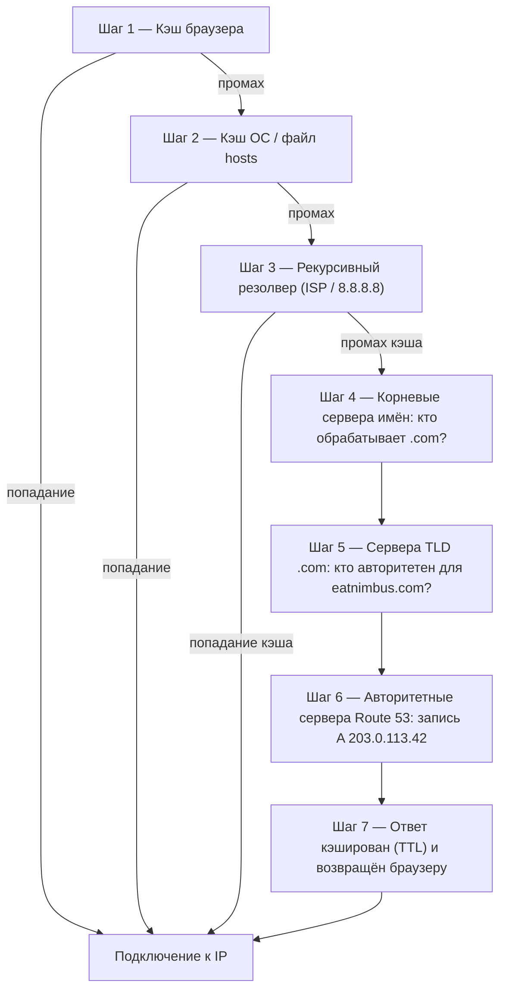

# Глава 12: Как интернет находит вас

Майя ещё раз обновила `nimbus-alb-123456789.us-west-2.elb.amazonaws.com` в браузере, затем откинулась назад и посмотрела в потолок. Страница загрузилась. Приложение работало. Но каждый раз, когда она делилась ссылкой с партнёром-рестораном, она чувствовала небольшое смущение, которое не могла толком назвать.

Этот URL был техническим артефактом, а не продуктом.

---

*Редизайн сети из прошлой главы прошёл хорошо. Каждый ресурс был на правильном месте — балансировщики нагрузки в публичных подсетях, базы данных заперты в приватных. Инфраструктура была безопасной и правильно сегментированной. Но пока Nimbus готовился к своему первому публичному запуску, появилась новая проблема: URL балансировщика нагрузки, который AWS присвоил автоматически, выглядел как системный идентификатор, а не как продукт, которому люди будут доверять. Им нужно было настоящее доменное имя. И им нужно было понять, что происходит между моментом, когда кто-то набирает `eatnimbus.com`, и моментом, когда появляется страница.*

---

Nimbus работал. У балансировщика нагрузки был публичный IP. У экземпляров EC2 были приватные IP. Базы данных были заперты в приватных подсетях. Прия одобрительно кивнула сетевой схеме.

Том посмотрел на URL балансировщика нагрузки: `nimbus-alb-123456789.us-west-2.elb.amazonaws.com`.

«Это то, что клиенты вводят в браузер?» — спросил он.

«Это то, что AWS присваивает автоматически», — сказала Майя.

«Я не собираюсь ставить это на визитке».

«Я тоже».

Им нужно было доменное имя. Они купили `eatnimbus.com` у регистратора доменов. Теперь нужно было связать это имя с их инфраструктурой AWS.

«Как интернет узнает, что `eatnimbus.com` означает балансировщик нагрузки в us-west-2?» — спросил Лео.

Хороший вопрос, Лео.

**Аналогия с телефонной книгой**

До смартфонов в каждом городе была телефонная книга. Если вы хотели найти «Пиццерию Марио», вы не запоминали их номер — вы искали название, находили номер и звонили.

У интернета есть своя телефонная книга: **Система доменных имён (DNS)**.

DNS переводит читаемые человеком имена (такие как `eatnimbus.com`) в читаемые машиной IP-адреса (такие как `203.0.113.42`). Каждый раз, когда вы посещаете сайт, ваш компьютер тихо ищет доменное имя в DNS и получает IP-адрес для подключения.

Если вы изменили IP-адрес вашего сервера, вы обновляете запись DNS — как смена номера в телефонной книге — и интернет найдёт вас по новому адресу.

**Полное путешествие разрешения DNS**

«Но *как* поиск работает на самом деле?» — спросил Лео. «Ну, шаг за шагом. Мой браузер знает имя `eatnimbus.com`. Что происходит дальше?»

Большинство документации обходит это стороной. Это важно.

Когда вашему браузеру нужно разрешить `eatnimbus.com`, вот каждый прыжок, по порядку:

**Шаг 1 — Кэш браузера**: Браузер проверяет, разрешал ли он уже это имя недавно. Если да, он использует кэшированный IP. Если нет, продолжаем.

**Шаг 2 — Кэш ОС / локальный резолвер**: Ваша операционная система проверяет свой собственный кэш DNS и локальный файл `hosts`. Если найдено, готово. Если нет, она перенаправляет к вашему настроенному DNS-резолверу — обычно резолверу вашего интернет-провайдера или публичному, как 8.8.8.8.

**Шаг 3 — Рекурсивный резолвер**: Рекурсивный резолвер (ваш интернет-провайдер или 8.8.8.8 от Google) — это рабочая лошадка. У него тоже есть кэш. Если он знает ответ, он возвращает его немедленно. Если нет, он запускает фактическую цепочку разрешения.

**Шаг 4 — Корневые сервера имён**: Рекурсивный резолвер обращается к одному из 13 кластеров корневых серверов имён (развёрнутых по всему миру). Корневой сервер не знает, где находится `eatnimbus.com`. Но он знает, кто управляет доменами `.com` — сервера TLD `.com`. Он возвращает их адрес.

**Шаг 5 — Сервера имён TLD (Top Level Domain)**: Рекурсивный резолвер обращается к серверам TLD `.com`. Сервера TLD тоже не знают, где находится `eatnimbus.com`. Но они знают, какие сервера имён авторитетны для `eatnimbus.com` — сервера, которые фактически содержат DNS-записи. Они возвращают эти адреса.

**Шаг 6 — Авторитетные сервера имён**: Рекурсивный резолвер обращается к серверам имён Route 53 — авторитетным серверам имён для `eatnimbus.com`. У Route 53 есть фактические записи. Он возвращает запись A: `eatnimbus.com → 203.0.113.42`. Этот ответ авторитетен — это настоящий ответ, а не кэшированный.

**Шаг 7 — Ответ кэшируется и возвращается**: Рекурсивный резолвер кэширует ответ на время TTL (Time-To-Live) записи. Он возвращает IP вашему браузеру. Ваш браузер кэширует его. Ваш браузер подключается.



«Это семь прыжков просто чтобы найти IP-адрес», — сказал Том.

«Обычно менее 100 миллисекунд в сумме», — сказала Прия. «Шаги с 3 по 6 агрессивно кэшируются на каждом уровне. Для популярных доменов шаги 4 и 5 — поиски корня и TLD — часто пропускаются полностью, потому что у рекурсивного резолвера уже есть эти сервера в кэше. Вся цепочка обычно выполняется за 20–40 миллисекунд».

«А после первого поиска кэш браузера означает, что последующие запросы пропускают всё это», — добавил Лео.

«Верно. DNS кажется мгновенным, потому что большинство поисков — это попадания в кэш. Полная цепочка выполняется только когда запись новая или её TTL истёк».

**Знакомьтесь: Route 53**

Amazon Route 53 — это управляемый DNS-сервис AWS. Он называется Route 53, потому что порт 53 — стандартный DNS-порт. (Иногда AWS называет вещи прямолинейно.)

Route 53 делает несколько вещей:

**Регистрация доменов**: Вы можете покупать доменные имена через Route 53 напрямую.

**Хостинг DNS (хостинговые зоны)**: Вы создаёте *хостинговую зону* для вашего домена, и Route 53 управляет DNS-записями, которые сообщают миру, где вас найти.

**Проверка состояния**: Route 53 может отслеживать ваши конечные точки и перенаправлять трафик от нездоровых.

**Политики маршрутизации трафика**: Route 53 поддерживает несколько стратегий маршрутизации помимо простого DNS — взвешенную, на основе задержки, геолокацию, переключение при сбое.

**DNS-записи: записи в телефонной книге**

DNS-запись сопоставляет имя с назначением. Наиболее распространённые типы:

**Запись A**: Сопоставляет имя с IPv4-адресом.
`eatnimbus.com → 203.0.113.42`

**Запись AAAA**: Сопоставляет имя с IPv6-адресом.

**Запись CNAME**: Сопоставляет имя с другим именем (псевдоним).
`www.eatnimbus.com → eatnimbus.com`

**Запись MX**: Указывает, какие серверы обрабатывают электронную почту для домена.

**Запись TXT**: Хранит произвольный текст. Обычно используется для верификации домена (доказательство владения доменом) и аутентификации электронной почты (SPF, DKIM).

Для Nimbus, основная настройка:

- `eatnimbus.com` → Псевдонимная запись, указывающая на балансировщик нагрузки
- `www.eatnimbus.com` → CNAME, указывающий на `eatnimbus.com`
- `api.eatnimbus.com` → Псевдонимная запись, указывающая на балансировщик нагрузки API

«Стоп», — сказал Том. «IP балансировщика нагрузки может меняться. AWS так написал в документации».

Хорошее замечание, Том.

**Псевдонимные записи: решение AWS для динамических IP**

Балансировщики нагрузки, дистрибутивы CloudFront и сайты S3 имеют DNS-имена, а не статические IP-адреса. Основные IP могут меняться.

Если вы создаёте CNAME, указывающий на DNS-имя балансировщика нагрузки, это работает — но вы не можете использовать CNAME для корневых доменов (`eatnimbus.com` без `www`) из-за стандартов DNS.

Route 53 решает это с помощью **Псевдонимных записей (Alias records)** — специфического для AWS расширения DNS. Псевдонимная запись сопоставляет имя непосредственно с ресурсом AWS (балансировщик нагрузки, дистрибутив CloudFront, сайт S3), и Route 53 автоматически обрабатывает динамическое разрешение IP. Псевдонимные записи можно использовать на уровне корневого домена. И в отличие от обычных DNS-запросов к внешним сервисам, запросы псевдонимных записей к ресурсам AWS бесплатны.

«Значит мы используем псевдонимную запись для `eatnimbus.com`, указывающую на балансировщик нагрузки», — подтвердил Лео.

«И Route 53 обрабатывает любой IP, который использует балансировщик нагрузки в любой момент времени», — добавила Прия.

«Бесплатно», — сказал Том, внезапно очень заинтересованный. Он открыл страницу с ценами Route 53. «А остальное?»

«Пятьдесят центов за хостинговую зону», — сказал Лео. «Плюс около сорока центов за миллион DNS-запросов. Для нашего трафика прямо сейчас, вероятно, меньше двух долларов в месяц».

Том закрыл страницу с ценами удовлетворённый.

**Политики маршрутизации: больше, чем просто «где это?»**

Здесь Route 53 становится интересным. DNS — это не просто сервис поиска, это инструмент управления трафиком.

**Простая маршрутизация**: Одна запись, одно назначение. Стандартный DNS.

**Взвешенная маршрутизация**: Разделять трафик между несколькими назначениями по весу. Отправлять 90% на новый сервер, 10% на старый во время миграции. Регулируйте веса, пока не будете уверены в новом сервере, затем переключайтесь на 100%.

**Маршрутизация на основе задержки**: Маршрутизируйте пользователей к региону AWS с наименьшей задержкой для них. Пользователь в Сиэтле попадёт в `us-west-2`. Пользователь в Токио попадёт в `ap-northeast-1`. Одно доменное имя, разные назначения.

**Маршрутизация по геолокации**: Маршрутизация на основе географического положения пользователя. Все европейские пользователи идут в `eu-west-1`. Все североамериканские пользователи идут в `us-east-1`. Полезно для суверенитета данных (хранение данных EU-пользователей в EU-регионах) или кастомизации контента (язык, валюта). Решения о маршрутизации используют жёсткие границы — пользователь находится в стране, на континенте или в штате США, и туда он и попадает.

**Маршрутизация по геоблизости**: Маршрутизирует трафик на основе географического положения пользователей *и* позволяет корректировать эти решения с помощью значения **bias** (смещения). Положительное смещение расширяет географическую область, маршрутизируемую к ресурсу — привлекая больше трафика. Отрицательное смещение сжимает её. В отличие от геолокации, которая использует жёсткие границы стран и континентов, геоблизость непрерывна: небольшое значение смещения может постепенно переместить трафик из одного региона в другой без перерисовки каких-либо фиксированных линий.

Сценарий, который различает эти два: если компания постепенно мигрирует с `us-east-1` на `us-west-2` и хочет инкрементально сместить трафик на запад — не переключить рубильник, а настраивать его со временем — геоблизость с растущим положительным смещением на западной конечной точке — правильный инструмент. Геолокация либо маршрутизировала бы всех пользователей Западного побережья в Орегон, либо нет; у неё нет регулятора. С января 2024 года геоблизость доступна как обычная политика маршрутизации непосредственно в DNS-записях (консоль, API, CLI) — она больше не требует Route 53 Traffic Flow, хотя остаётся доступной и там.

**Маршрутизация переключения при сбое**: Назначьте основную и вторичную конечную точки. Если основная не проходит проверку состояния Route 53, трафик автоматически перенаправляется на вторичную. Это DNS-уровень аварийного восстановления.

«Подождите — но *почему* мы настраивали бы маршрутизацию переключения при сбое на второй регион, если у нас уже есть Multi-AZ?» — спросила Майя. «Разве Multi-AZ не должен справляться со сбоями?»

Хороший вопрос. Multi-AZ защищает от сбоя одной зоны доступности внутри региона — если один центр обработки данных падает, резерв в другой AZ берёт управление. Но что, если весь регион AWS становится недоступным? Или если есть общерегиональный сбой сервиса? Маршрутизация переключения при сбое DNS работает на другом уровне: она перенаправляет трафик от целого региона, когда проверка состояния этого региона не проходит. Multi-AZ — это внутрирегиональная отказоустойчивость. DNS-переключение при сбое — межрегиональная отказоустойчивость.

**Маршрутизация с несколькими значениями**: Возвращать до восьми здоровых IP-адресов на запрос, позволяя клиенту выбирать. Простая альтернатива балансировщику нагрузки для распределения трафика по нескольким серверам.

«Значит Route 53 — это не просто телефонная книга», — сказала Майя. «Это умная телефонная книга, которая может направлять звонки в зависимости от того, откуда вы звоните».

«И отключать вас, если номер нездоровый», — добавила Прия.

---

**Маршрутизация по задержке плюс проверки состояния: мысленный эксперимент**

Прия набросала сценарий на доске. Предположим, база пользователей Nimbus на Восточном побережье продолжала расти, и однажды команда подняла лёгкий стек в `us-east-1` (Северная Вирджиния) — не полную мультирегиональную active-active установку, которая была бы дорогой и сложной, а балансировщик нагрузки и набор экземпляров EC2 только для чтения, обслуживающих статический контент и страницы просмотра. Заказы по-прежнему уходили бы на запад к основной базе данных в `us-west-2`. Трафик просмотра — на который приходилось семьдесят процентов запросов — мог бы обслуживаться с любого побережья.

Конфигурация Route 53 для конечной точки просмотра выглядела бы так:

```
browse.eatnimbus.com
  → Запись задержки: us-east-1 ALB (с проверкой состояния, set-identifier "east")
  → Запись задержки: us-west-2 ALB (с проверкой состояния, set-identifier "west")
```

(Обратите внимание, что запись — это *имя хоста*, `browse.eatnimbus.com` — DNS маршрутизирует имена, никогда не пути URL. Маршрутизация на основе путей, как `/browse`, — работа балансировщика нагрузки, а не Route 53.)

С маршрутизацией по задержке пользователь в Сиэтле был бы разрешён к конечной точке `us-west-2`. Пользователь в Бостоне попал бы в `us-east-1`. Route 53 непрерывно измеряет задержку от своей инфраструктуры до каждого региона и выбирает более быстрый для каждого пользователя.

«Но что, если у западного региона проблема?» — спросил Том. «Наши пользователи просмотра в Сиэтле застряли бы».

«Для этого и нужны проверки состояния», — сказала Прия. «Каждая запись задержки получает проверку состояния на своём соответствующем балансировщике нагрузки. Если проверка состояния `us-west-2` не проходит три проверки подряд, Route 53 прекращает возвращать эту запись — даже для пользователей, для которых Орегон обычно был бы быстрее. Пользователи Сиэтла маршрутизируются на восток, пока Орегон не восстановится».

«Значит, маршрутизация по задержке определяет, какой регион обычно предпочтителен», — сказала Майя, — «а проверки состояния переопределяют это предпочтение, если предпочтительный регион падает?»

«Именно. Политика задержки выбирает победителя в нормальных условиях. Проверки состояния убирают победителя, который перестал работать».

Лео подумал о сценарии сбоя. «А TTL на этих записях?»

«Шестьдесят секунд», — сказала Прия. «Три неудачные проверки с интервалом в тридцать секунд, чтобы сработать — до девяноста секунд на обнаружение сбоя — затем до шестидесяти секунд, чтобы DNS-резолверы приняли изменение».

«Две с половиной минуты в худшем случае», — сказал Лео.

«Вот почему вы понижаете TTL до того, как он вам понадобится, а не после».

Эта комбинация — маршрутизация по задержке с проверками состояния на каждой записи — одна из самых мощных конфигураций Route 53 для мультирегиональных развёртываний. Пользователи всегда идут в самый быстрый здоровый регион. Система самовосстанавливается, когда у региона проблемы. И всё это — DNS: никакой дополнительной инфраструктуры, никаких прокси-серверов, никаких балансировщиков нагрузки между регионами.

---

**Инцидент со сбоем проверки состояния**

Staging-среда Nimbus дала им случайную демонстрацию маршрутизации переключения при сбое.

Они настроили проверки состояния Route 53 на staging-балансировщике нагрузки как тест — проверяя конечную точку `/health` каждые 30 секунд. Однажды в пятницу днём Лео отправил развёртывание в staging, в котором был баг: конечная точка состояния начала возвращать ошибки 500. Оно прошло его локальные тесты, но сломалось на сервере.

Route 53 отметил сбои. После трёх последовательных неудачных проверок он пометил конечную точку как нездоровую. Запись переключения при сбое активировалась, маршрутизируя staging-трафик на резервную страницу только для чтения, которая гласила «Идёт обслуживание».

Первым оповещением Лео было сообщение в Slack от QA-инженера: «Staging показывает страницу обслуживания».

Лео проверил развёртывание. Ошибки 500 были очевидны в логах. Он откатил развёртывание. В течение 90 секунд после того, как конечная точка состояния вернула 200-е, Route 53 переоценил проверку, увидел три последовательных успеха и вернул трафик на staging-балансировщик нагрузки. Страница обслуживания исчезла.

Общее время на странице обслуживания: семь минут.

«Это система работала правильно», — сказала Прия.

«Я знаю», — сказал Лео. «Страшная часть — думать о том, что произошло бы без проверки состояния. Ошибки 500 ушли бы реальным пользователям».

«В продакшене проверка состояния переключилась бы на вторичный регион или статическую страницу ошибки. Пользователи увидели бы поддерживаемый опыт вместо ошибок».

«Сколько на самом деле занимает переключение при сбое?» — спросила Майя. «От момента, когда проверка состояния не проходит, до момента, когда DNS начинает маршрутизировать иначе?»

«Интервал проверки состояния по умолчанию — 30 секунд. Три последовательных сбоя, чтобы сработало переключение. Это до 90 секунд на обнаружение проблемы. Затем TTL DNS — если это 60 секунд, распространение — ещё минута».

«Значит, в худшем случае около трёх минут?»

«Примерно так. Вот почему вы хотите, чтобы ваш TTL был низким на критических записях, а интервал проверки состояния — настолько коротким, насколько позволяет ваш бюджет».

---

**Проверки состояния: маршрутизация вокруг сбоя**

«А что, если кто-то попытается взломать?» — сказала Прия. «DNS публичен. Любой может посмотреть, куда указывает `eatnimbus.com`. Это значит, что атакующий знает точно, какой IP атаковать».

«Это правда», — сказал Лео. «Но IP, который они находят, — это IP балансировщика нагрузки. ALB — единственное, что имеет публичный адрес. Всё за ним — EC2, RDS, ElastiCache — в приватных подсетях. DNS говорит им, где входная дверь. Он не говорит им, что за ней».

Route 53 может отслеживать ваши конечные точки с помощью проверок состояния. Если конечная точка не работает, Route 53 может:

- Удалить её из DNS-ответов (прекратить отправлять туда трафик)
- Запустить переключение при сбое на резервную конечную точку
- Отправить оповещение через CloudWatch

Проверки состояния — это связь между DNS-маршрутизацией и реальным состоянием приложения. В конфигурации переключения при сбое: Route 53 отслеживает основную конечную точку каждые 30 секунд. Если три последовательные проверки не проходят, Route 53 начинает возвращать адрес вторичной конечной точки. Ни одно из этих чисел не фиксировано: 30 секунд — стандартный интервал (платный «быстрый» вариант проверяет каждые 10 секунд), а порог сбоя по умолчанию — 3 последовательные проверки, но настраивается от 1 до 10.

Это не мгновенно — у DNS есть время распространения. После того как Route 53 изменяет DNS-запись, DNS-резолверам по всему миру нужно принять изменение, что может занять секунды или минуты в зависимости от настроек TTL.

**TTL: DNS-кэш**

DNS-ответы кэшируются на нескольких уровнях — на вашем роутере, у вашего интернет-провайдера, в браузере. **TTL (Time-To-Live)** в DNS-записи сообщает кэшам, как долго помнить ответ перед повторной проверкой.

Высокий TTL (1 час и более): Меньше DNS-запросов, меньше нагрузка на Route 53, но изменения распространяются дольше.

Низкий TTL (60 секунд и меньше): Изменения распространяются быстро, но нужно больше DNS-запросов.

Перед планируемой миграцией (обновление DNS, чтобы указать на новый сервер), понизьте TTL до 60 секунд за день заранее. Тогда когда вы вносите изменение, оно распространяется примерно за минуту. После миграции поднимите его обратно до нормального значения.

«Я уже задеплоил это — ой». Лео обновил DNS-запись до понижения TTL. Он осознал свою ошибку и начал считать: старый TTL был один час. Некоторые пользователи будут получать старый сервер следующие шестьдесят минут.

«Если мы просто понизим его во время миграции, а не до», — медленно сказал Лео, — «старый TTL означает, что некоторые пользователи будут видеть старый сервер час».

«Именно», — сказала Прия. «DNS-миграции требуют планирования до миграции, а не только во время неё».

Возможно, вы задаётесь вопросом: если TTL установлен в один час, означает ли это, что каждый пользователь будет ждать полный час после изменения DNS, прежде чем увидит новый сервер? Не совсем. TTL означает, что резолверы не будут перепроверять, пока TTL не истечёт. Если DNS-резолвер пользователя закэшировал старое значение 55 минут назад с TTL в 1 час, он получит новое значение через 5 минут. Если он закэшировал его 5 минут назад, он будет ждать 55 минут. В среднем пользователи видят изменение в пределах половины длительности TTL. Вот почему понижение TTL заранее так важно: оно сжимает окно распространения в худшем случае до того, как изменение происходит.

---

**Приватные хостинговые зоны: внутренний DNS**

Прия подняла новое требование через две недели после того, как публичный домен заработал.

«Нашим экземплярам EC2 нужно достигать базы данных», — сказала она. «Сейчас они используют DNS-имя конечной точки RDS — `nimbus-prod.abc123.us-west-2.rds.amazonaws.com`. Это работает, но это публичное DNS-имя. Если мы когда-нибудь захотим изменить конфигурацию нашей базы данных, все конфигурационные файлы приложения нужно будет обновить».

«Мы могли бы использовать приватное DNS-имя», — сказал Лео. «Например, `db.nimbus.internal`. Что-то, что наши сервисы используют внутренне, что сопоставляется с текущей конечной точкой базы данных».

«Именно. Приватные хостинговые зоны Route 53».

**Приватная хостинговая зона** — это DNS-домен, который разрешается только внутри вашего VPC. Внешние DNS-запросы для `nimbus.internal` не получают ответа. Но изнутри VPC `db.nimbus.internal` разрешается в конечную точку RDS.

Они настроили это:

- Приватная хостинговая зона: `nimbus.internal`
- Запись CNAME: `db.nimbus.internal → nimbus-prod.abc123.us-west-2.rds.amazonaws.com`
- Запись CNAME: `cache.nimbus.internal → nimbus-cache.abc123.usw2.cache.amazonaws.com`
- Запись A: `api.nimbus.internal → 10.0.10.5` (внутренний IP EC2 — записи A сопоставляют имена с IP-адресами; CNAME сопоставляют имена с другими именами. Здесь это нормально, потому что этот экземпляр сохраняет статический приватный IP; для всего, что за Auto Scaling, вы бы указывали на балансировщик нагрузки вместо этого)

Теперь конфигурация приложения читалась:

```
DATABASE_HOST=db.nimbus.internal
CACHE_HOST=cache.nimbus.internal
```

Когда они мигрировали на новый экземпляр RDS, они обновили одну DNS-запись. Никакого развёртывания приложения не потребовалось.

«Вот почему приватный DNS также важен во время миграции базы данных», — сказала Прия. «Вы обновляете `db.nimbus.internal`, чтобы указать на новую конечную точку. Трафик переключается. Старая конечная точка остаётся доступной в окне TTL. Никаких изменений конфигурации приложения».

**История отладки внутреннего DNS**

Три недели спустя Лео развернул новый сервис — фоновый воркер — и он не мог достичь базы данных. Воркер был в том же VPC, той же приватной подсети, что и API-серверы. API-серверы могли достичь базы данных. Воркер — нет.

Он проверил группы безопасности. У группы безопасности воркера было исходящее правило для PostgreSQL. У группы безопасности базы данных было входящее правило от группы безопасности воркера. Всё выглядело правильно.

Он запустил `nslookup db.nimbus.internal` с экземпляра воркера.

Нет ответа.

«DNS-поиск проваливается», — сказал он Прие.

Она посмотрела на конфигурацию VPC экземпляра воркера. «В каком VPC воркер на самом деле находится? Приватные хостинговые зоны связаны с VPC — если экземпляр не в связанном VPC, зона просто не существует для него».

«Он в основном VPC. Как и всё остальное».

«Точно?»

Приватные хостинговые зоны должны быть явно связаны с каждым VPC, который они обслуживают — связь идёт по VPC, никогда не по подсети. Прия связала основной VPC, когда создавала зону. Но Лео случайно развернул воркер в тестовом VPC, который он создал для другого эксперимента. Другой VPC. Не связан с приватной хостинговой зоной.

«Воркер в неправильном VPC», — сказала Прия.

«Я уже задеплоил это — ой». Лео переместил воркер в правильный VPC. DNS разрешился. Воркер подключился к базе данных.

«Один VPC», — сказал Лео, делая заметку. «Если только у нас нет причины для более чем одного».

---

**DNSSEC: аутентификация DNS-ответов**

«Мы думали о DNS-спуфинге?» — спросила Прия. «Что, если кто-то перехватит наш DNS-запрос и вернёт поддельный IP? Браузеры наших пользователей подключились бы к серверу атакующего вместо нашего».

**DNSSEC (DNS Security Extensions)** решает это, криптографически подписывая DNS-записи. Когда DNS-ответ включает подпись DNSSEC, резолвер может проверить, что ответ пришёл от авторитетного сервера имён и не был подделан.

Route 53 поддерживает подписание DNSSEC для публичных хостинговых зон. Процесс включает:

1. Включение DNSSEC на хостинговой зоне в Route 53
2. Route 53 генерирует ключ подписи ключей (KSK), хранящийся в KMS
3. Route 53 подписывает все записи ключом подписи зоны
4. Вы добавляете запись DS (Delegation Signer) у регистратора родительского домена (TLD .com)
5. Резолверы, поддерживающие DNSSEC, теперь могут проверять подлинность ответов

«Насколько распространён DNS-спуфинг?» — спросил Лео.

«В публичном интернете редко, но возможно», — сказала Прия. «Большинство резолверов интернет-провайдеров сегодня поддерживают валидацию DNSSEC. Включение DNSSEC ничего не стоит и добавляет значимый слой подлинности».

«Сколько это стоит в месяц?» — спросил Том.

«Включение самого подписания DNSSEC в Route 53 бесплатно», — сказала Прия. «Единственная реальная стоимость — ключ KMS, который содержит ключ подписи ключей: $1/месяц, плюс вызовы API KMS — и один ключ можно разделить между несколькими хостинговыми зонами. Защита от атак захвата DNS фактически бесплатна в нашем масштабе».

Том включил его до обеда.

---

**Route 53 Resolver: гибридный DNS**

Когда Nimbus в итоге соединил свой VPC AWS со своей локальной сетью разработки через VPN, возникла новая проблема: локальным серверам нужно было разрешать приватные DNS-имена AWS (как `db.nimbus.internal`), а ресурсам AWS нужно было разрешать локальные имена хостов (как `jenkins.corp.nimbus.local`).

DNS-разрешение по умолчанию не пересекает границы сети. Ресурсы AWS разрешают DNS, используя Route 53 Resolver (встроенный в каждый VPC). Локальные серверы используют свои собственные DNS-серверы. Ни один не видит записи другого.

**Конечные точки Route 53 Resolver** перекрывают этот разрыв:

**Входящие конечные точки**: Локальные DNS-серверы могут перенаправлять запросы для DNS-зон, размещённых в AWS, на IP входящей конечной точки в вашем VPC. Route 53 Resolver обрабатывает запрос и возвращает результат.

**Исходящие конечные точки**: Когда экземплярам EC2 нужно разрешить локальные имена хостов, Resolver перенаправляет эти запросы на локальные DNS-серверы через исходящую конечную точку.

«Значит, это как сервис перевода», — сказала Майя. «Ваш DNS AWS и ваш локальный DNS не разговаривают друг с другом напрямую. Конечные точки Resolver действуют как посредники».

«Именно. Ваши локальные серверы теперь могут разрешать `db.nimbus.internal`. Ваши экземпляры EC2 могут разрешать `jenkins.corp.nimbus.local`. Обе стороны видят DNS-имена из обоих миров».

Для Nimbus это стало актуально, когда команда разработки захотела запускать интеграционные тесты из своего офиса против staging-среды в AWS. Без конечных точек Resolver им пришлось бы вручную редактировать файлы hosts. С ними внутренний DNS просто работал через VPN.

Архитектура для конечных точек Resolver:

- **Входящая конечная точка**: Два ENI (Elastic Network Interfaces), созданные в двух разных AZ в вашем VPC. Каждый получает приватный IP. Вы настраиваете свой локальный DNS-сервер на перенаправление запросов для ваших зон, размещённых в AWS, на эти IP. Трафик идёт через ваш VPN или Direct Connect.
- **Исходящая конечная точка**: Два ENI в двух AZ. Вы создаёте правила перенаправления: «запросы для `corp.nimbus.local` идут на эти IP локальных DNS-серверов». Экземпляры EC2 автоматически используют Resolver, который сверяется с вашими правилами перенаправления и отправляет запрос локально.

«Почему два ENI на конечную точку?» — спросил Лео.

«Высокая доступность», — сказала Прия. «Если одна AZ теряет сетевое подключение, IP другой конечной точки всё равно работает. Тот же принцип, что и у NAT-шлюзов».

«Сколько это стоит в месяц?» — спросил Том.

Конечные точки Resolver стоят примерно $0,125 в час **за эластичный сетевой интерфейс**, и каждая конечная точка требует как минимум два ENI для доступности — так что реалистичный минимум составляет около $180 в месяц на конечную точку, плюс $0,40 за миллион DNS-запросов. Для команды, использующей гибридный DNS для разрешения внутренних имён, стоимость скромна — и устраняет необходимость поддерживать файлы hosts на множестве машин разработчиков и системах CI/CD.

«Мы могли бы просто поместить имена хостов в файлы hosts», — предложил Лео.

«На каждой машине разработчика, каждом CI-раннере, при каждом новом онбординге», — сказала Прия. «Каждый раз, когда что-то меняется».

«Конечная точка того стоит», — сказал Лео.

«Стоит».

## Сильные стороны и ограничения

**Route 53 — правильный выбор для**: регистрации и управления доменными именами полностью внутри AWS; маршрутизации трафика на основе задержки, геолокации или взвешенного распределения по нескольким конечным точкам; переключения при сбое на основе проверок состояния между регионами или между основной и аварийной конечной точкой; интеграции DNS с другими сервисами AWS через псевдонимные записи; приватных хостинговых зон для обнаружения внутренних сервисов.

**Когда Route 53 — не то, что вам нужно**: Route 53 — это DNS-сервис, а не балансировщик нагрузки. Если вам нужно распределять трафик между несколькими серверами или контейнерами в регионе, используйте Application Load Balancer — Route 53 не может делать взвешенный round-robin на уровне соединения так, как это делает балансировщик нагрузки. Маршрутизация на основе задержки между регионами добавляет стоимость и операционную сложность, имеющую смысл только тогда, когда ваши пользователи действительно глобально распределены и миллисекунды важны для конверсии. Для большинства приложений с одним регионом достаточно одной псевдонимной записи, указывающей на ALB.

## Итоги

Переход от `nimbus-alb-123456789.us-west-2.elb.amazonaws.com` к `eatnimbus.com` казался мелочью. Это было не так. DNS — это адресная система, на которой работает весь интернет, и Route 53 даёт вам инструменты для использования этой системы не только для поисков, но и для управления трафиком и отказоустойчивости.

- **DNS** переводит доменные имена в IP-адреса — телефонная книга интернета.
- **Route 53** — управляемый DNS-сервис AWS: регистрация доменов, хостинг DNS, проверки состояния и политики маршрутизации.
- **Записи A** сопоставляют имена с IPv4-адресами. **CNAME** сопоставляют имена с другими именами. **Псевдонимные записи** сопоставляют имена с ресурсами AWS (балансировщики нагрузки, CloudFront, S3).
- Используйте псевдонимные записи (не CNAME) для корневых доменов и для ресурсов с динамическими IP.
- Политики маршрутизации выходят за рамки простого DNS: **взвешенная** (разделение трафика), **на основе задержки** (производительность), **геолокация** (суверенитет данных — жёсткие границы стран/континентов), **геоблизость** (на основе расстояния с регулятором смещения — постепенное смещение трафика), **переключение при сбое** (аварийное восстановление).
- **Приватные хостинговые зоны** предоставляют внутренний DNS для ресурсов VPC — связь сервис-сервис по имени, а не по жёстко закодированному IP.
- **DNSSEC** криптографически подписывает записи, защищая от DNS-спуфинга.
- **Конечные точки Route 53 Resolver** перекрывают гибридные сети — DNS AWS и локальный DNS могут разрешать имена друг друга.

## Советы по экзамену

*Домен SAA-C03: Проектирование высокопроизводительных архитектур (Домен 3, Задача 3.4)*

- **Псевдонимные записи против CNAME**: Псевдонимные записи можно использовать на корневом домене; CNAME — нельзя. Псевдонимные записи к ресурсам AWS бесплатны; DNS-запросы CNAME платные. Когда экзамен спрашивает о сопоставлении корневого домена с балансировщиком нагрузки → псевдонимная запись.
- **Случаи использования политик маршрутизации** (распространённые сценарии экзамена):
  - «Постепенно переносить трафик на новую версию» → Взвешенная маршрутизация
  - «Направлять пользователей к ближайшему региону AWS» → Маршрутизация на основе задержки
  - «Держать данные EU-пользователей в EU-регионах» → Маршрутизация по геолокации
  - «Автоматическое DNS-переключение при сбое основного» → Маршрутизация переключения при сбое с проверками состояния
  - «Постепенно сместить трафик в новый регион» или «увеличить трафик, привлекаемый к нашему развёртыванию в ЕС» → Маршрутизация по геоблизости с положительным смещением
- **Геоблизость против геолокации:** Геолокация маршрутизирует по стране/континенту пользователя с жёсткими границами. Геоблизость маршрутизирует по географическому расстоянию с настраиваемым смещением — используйте её, когда нужно постепенно сместить трафик в новый регион или привлечь больше пользователей к конкретному развёртыванию. Доступна как обычная политика маршрутизации на записях с января 2024 года (Traffic Flow больше не требуется).
- **Проверки состояния Route 53**: Могут проверять конечные точки HTTP/HTTPS/TCP и запускать сигналы тревоги CloudWatch. Экзамен использует их в сценариях аварийного восстановления.
- **TTL и распространение**: Знайте, что TTL контролирует, как долго DNS-резолверы кэшируют запись. Короткий TTL = более быстрые изменения. Сценарий экзамена: «команда обновила DNS, но пользователи всё ещё попадают на старый сервер» → TTL слишком высок.
- **Приватные хостинговые зоны**: Route 53 может создавать DNS-записи, которые разрешаются только внутри VPC. Экзамен использует это для обнаружения внутренних сервисов (например, `database.internal`, разрешающийся в приватную конечную точку RDS).
- Route 53 является **глобальным** — он не развёртывается в регионе. При создании хостинговых зон выбор региона не нужен.
- **Конечные точки Route 53 Resolver**: Используются в гибридных сценариях, где локальный и AWS DNS должны разрешать имена друг друга. Входящая конечная точка для локальный → AWS. Исходящая конечная точка для AWS → локальный.

## Упражнения

**Упражнение 1 — Запоминание**

Объясните разницу между записью CNAME и псевдонимной записью. Когда вы использовали бы каждую?

*(Подсказка: рассмотрите ограничения на CNAME для корневых доменов и поведение псевдонимных записей с динамическими ресурсами AWS.)*

**Упражнение 2 — Сценарий SAA-C03**

*Сценарий*: Медиакомпания управляет веб-сайтом из двух регионов AWS: `us-east-1` (основной) и `eu-west-1` (вторичный). Команда хочет, чтобы трафик автоматически маршрутизировался в `eu-west-1`, если основной регион станет недоступным. Компания также хочет убедиться, что этот механизм переключения при сбое работает правильно, не выводя из строя основной регион.

Какая конфигурация Route 53 НАИЛУЧШИМ образом отвечает этим требованиям?

A) Взвешенная маршрутизация со 100% весом на `us-east-1` и 0% весом на `eu-west-1`  
B) Маршрутизация на основе задержки с проверками состояния на обеих конечных точках  
C) Маршрутизация переключения при сбое с проверкой состояния на основной конечной точке и вторичной записью, указывающей на `eu-west-1`  
D) Маршрутизация по геолокации с Северной Америкой, указывающей на `us-east-1`, и Европой, указывающей на `eu-west-1`

**Подсказка 1**: Требование — автоматическое переключение при сбое при недоступности основного. Какая политика маршрутизации предназначена именно для этого?

**Подсказка 2**: «Тестировать без вывода из строя основного региона» — проверки состояния можно вручную установить в «нездоровое» для тестирования.

**Подсказка 3**: Маршрутизация на основе задержки оптимизирует скорость, а не переключение при сбое.

**Ответ**: C

**Объяснение**: Маршрутизация переключения при сбое предназначена именно для этого случая использования. Основная запись указывает на `us-east-1` с проверкой состояния. Вторичная запись указывает на `eu-west-1`. Если проверка состояния не проходит, Route 53 автоматически обслуживает вторичную запись. Проверки состояния можно вручную принудительно сделать неудачными для тестирования без фактического нарушения работы основного региона.

**Почему не A?** Взвешенная маршрутизация с 100%/0% фактически статична — она не переключается автоматически при сбое основного.

**Почему не B?** Записи задержки *с проверками состояния* действительно прекращают возвращать нездоровую конечную точку, так что B пережил бы реальный сбой. Но это меняет нормальный паттерн трафика (пользователи были бы разделены между регионами по задержке, а не основной/вторичный, как требуется) и у неё нет чистого способа *протестировать* переключение при сбое: вам пришлось бы фактически провалить проверку состояния основного в продакшене. Маршрутизация переключения при сбое моделирует заявленное намерение — назначенный основной, назначенный вторичный, тестируемый принудительным заданием состояния проверки.

**Почему не D?** Маршрутизация по геолокации маршрутизирует по местоположению пользователя, а не по состоянию конечной точки. Европейские пользователи застревали бы на `eu-west-1`, даже если `us-east-1` здоров, а североамериканские пользователи не переключались бы на `eu-west-1`, даже если `us-east-1` падает.

*Домен SAA-C03: Проектирование высокопроизводительных архитектур — Задача 3.4*

**Упражнение 3 — Архитектурный вызов** *(Необязательно)*

Nimbus расширяется на международный рынок. Они хотят, чтобы `eatnimbus.com` быстро загружался для пользователей на Западном побережье, Восточном побережье и в Австралии. У них также есть регуляторное требование: заказы европейских пользователей должны обрабатываться серверами в ЕС.

Спроектируйте стратегию маршрутизации Route 53, решающую оба требования. Какую политику маршрутизации или комбинацию политик вы использовали бы? Какая инфраструктура в каждом регионе вам потребуется?

*(Нет единственно правильного ответа. Цель — практиковать проектирование мультирегиональной маршрутизации.)*

## Послесловие к главе

`eatnimbus.com` был в сети.

Майя ввела его в браузер, и страница заказов Nimbus загрузилась. Она заказала арепу из семейного ресторана своих родителей, просто чтобы проверить поток. Заказ прошёл. Кухня его получила.

Она откинулась назад.

Том уже читал логи проверок состояния Route 53. «Время отклика 18 миллисекунд от проверяющих us-west-2».

«Это быстро?» — спросила Майя.

«Для DNS? Да. И для пользователей Сиэтла тоже — они практически по соседству с Орегоном».

«А для пользователя в Бостоне?»

Том посмотрел на график задержки. «Около 80 миллисекунд».

Майя задумалась об этом. «Если наши партнёры на Восточном побережье продолжат расти, а наши серверы в Орегоне...»

«Каждый запрос путешествует из Бостона в Орегон и обратно», — сказал Лео с другого конца комнаты. «Скорость света. Физику не обмануть».

«Значит нам нужны серверы ближе к Бостону».

«Или что-то ближе к Бостону, которое обслуживает контент вместо них».

Эта мысль повисла в воздухе.

В следующей главе: склады, которые помещают контент Nimbus в миллисекунду от каждого пользователя, везде.
