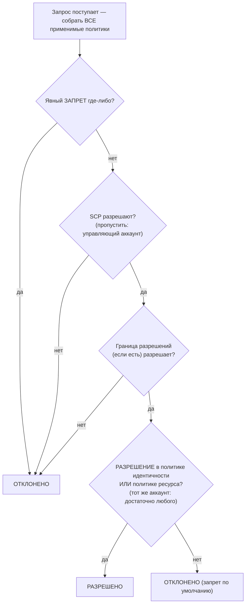

# Глава 14: Кому разрешено что делать

Новые инженеры начинали в понедельник. Су-Джин и Рафаэль. Майя думала об их первой неделе — к чему им понадобится доступ, чего им не следует касаться, и была ли текущая настройка IAM вообще готова к расширению ещё на двух человек.

Она сидела с кофе, пока офис не наполнился, составляя список.

---

*CloudFront был развёрнут. Проценты попаданий в кэш были хорошими. Производительность выросла. Но пока команда готовилась принять новых инженеров, всплыла тихая проблема: конфигурация IAM была построена людьми в спешке. Ключи доступа лежали в конфигурационных файлах. У некоторых ролей было больше разрешений, чем им было нужно. И двум новым людям вот-вот вручат учётные данные к продакшен-системе, которая не была спроектирована с расчётом на нескольких пользователей.*

---

У Тома ключи доступа были открыты в текстовом файле, готовые для вставки.

«Что ты делаешь?» — спросила Прия.

«Экземпляру EC2 нужно читать конфигурационные файлы из S3. Я помещаю учётные данные в конфигурацию сервера».

Она несколько секунд смотрела на экран. «Закрой этот файл».

«Я просто хотел...»

«Если кто-то проникнет на этот сервер», — сказала она, — «они получат эти ключи. А эти ключи касаются всего, что IAM-пользователю разрешено касаться. Что, вероятно, больше чем просто S3».

Том закрыл файл.

«Есть лучший способ», — сказала она. «Сам сервер может иметь роль. Думай об этом как о должности — экземпляру не нужны учётные данные, потому что система уже знает, что он такое и что ему разрешено делать».

Том выглядел скептично. «Значит сервер аутентифицирует сам себя?»

«Да. Без пароля. Без ключей в конфигурационном файле. Без чего-либо, что может быть случайно закоммичено в git».

Последняя часть попала в цель. Том сам чуть не закоммитил ключ доступа в репозиторий две недели назад — поймал его в diff в последнюю секунду. Он открыл новую вкладку браузера.

**Пересмотр IAM: полная картина**

Глава 3 ввела IAM: пользователи, группы, роли и политики. Теперь время углубиться.

Политики IAM — это JSON-документы, которые указывают, какие действия разрешены или запрещены с какими ресурсами. Они выглядят так:

```json
{
  "Version": "2012-10-17",
  "Statement": [
    {
      "Effect": "Allow",
      "Action": [
        "s3:GetObject",
        "s3:PutObject"
      ],
      "Resource": "arn:aws:s3:::nimbus-assets/*"
    }
  ]
}
```

Эта политика разрешает чтение и запись объектов в бакете `nimbus-assets`, и ничего больше. Не удаление. Не перечисление бакетов. Не любую другую операцию S3. Не любой другой сервис AWS.

Это правильный способ предоставления разрешений: конкретные действия, конкретные ресурсы.

**Проблема с «Administrator Access»**

Управляемые политики AWS, как `AdministratorAccess`, предназначены для быстрого старта. Они не предназначены для управления продакшен-системами с реальными членами команды.

`AdministratorAccess` предоставляет каждое действие на каждом ресурсе. Если член команды с этой политикой совершает ошибку — случайно удаляет бакет S3, завершает не тот экземпляр EC2, меняет правила группы безопасности — AWS ничего не может сделать, чтобы их остановить. Разрешение было предоставлено.

Если учётные данные члена команды скомпрометированы (фишинговая атака, утёкший ключ доступа, кража ноутбука), у атакующего есть административный доступ ко всему в вашем аккаунте AWS.

«Так что должно быть у Су-Джин?» — спросил Лео.

«Что Су-Джин нужно делать?» — ответила Прия.

«Развёртывать API. Проверять логи. Ничего больше».

«Тогда она получает: возможность отправлять в конвейер кода, доступ на чтение к логам CloudWatch, и ничего больше».

«Это... очень конкретно».

«Да. В этом и смысл».

**Роли IAM: идентичности для сервисов**

Глава 3 ввела роли как способ для экземпляров EC2 получать доступ к сервисам AWS без хранения учётных данных. Давайте сделаем это конкретным.

Вашим экземплярам EC2, запускающим API Nimbus, нужно:

- Читать из DynamoDB (меню)
- Писать в DynamoDB (заказы)
- Помещать объекты в S3 (чеки, загрузки)
- Писать логи в CloudWatch
- Читать секреты из Secrets Manager

Вместо создания пользователя с ключом доступа и хранения этого ключа на экземпляре EC2 (кошмар безопасности — ключи доступа может прочитать любой с SSH-доступом) вы создаёте **роль IAM** для экземпляра EC2 ровно с этими разрешениями.

«Подождите — но *почему* мы делали бы это именно так?» — спросила Майя. «Экземпляр EC2 уже запускает наш код. Почему просто не дать коду ключ доступа?»

Потому что ключи доступа — это статические учётные данные, которые где-то живут — в конфигурационном файле, переменной окружения, git-репозитории, если кто-то совершит ошибку. Их можно скопировать, выкрасть, случайно закоммитить. Роль IAM работает иначе: экземпляр EC2 автоматически принимает роль. AWS предоставляет временные учётные данные через сервис метаданных экземпляра. Учётные данные автоматически ротируются — они истекают каждые несколько часов и обновляются без каких-либо действий с вашей стороны. Нечего утекать, потому что нечего хранить.

«А если кто-то взломает экземпляр EC2?» — спросил Лео.

«Они могут делать то, что разрешает роль EC2», — сказала Прия. «А это — читать меню, писать заказы и отправлять логи. Они не могут удалить бакет S3. Они не могут завершить экземпляры EC2. Они не могут касаться IAM».

«Потому что у роли EC2 нет этих разрешений».

«Именно».

---

**Как принятие роли EC2 работает шаг за шагом**

«Что-то не сходится», — сказала Майя. «Если на экземпляре не хранятся учётные данные, как экземпляр на самом деле доказывает AWS, кто он? Где-то должны быть учётные данные».

Они есть. Но они временные, автоматически ротируемые и доступны только изнутри экземпляра.

Когда экземпляр EC2 запускается с прикреплённой ролью IAM, AWS делает следующее:

**Шаг 1**: AWS STS (Security Token Service) генерирует временные учётные данные — ID ключа доступа, секретный ключ доступа и токен сессии. Для ролей экземпляров EC2 они обычно действительны около шести часов, и AWS автоматически ротирует их до истечения.

**Шаг 2**: AWS делает эти учётные данные доступными по специальному IP-адресу: `169.254.169.254`. Это **сервис метаданных экземпляра** (IMDS). Он достижим только изнутри экземпляра EC2. Ничто за пределами экземпляра не может к нему обратиться.

**Шаг 3**: Когда код вашего приложения вызывает любой SDK AWS (boto3, Java SDK, Node.js SDK), SDK автоматически запрашивает конечную точку метаданных экземпляра:

```
GET http://169.254.169.254/latest/meta-data/iam/security-credentials/{role-name}
```

**Шаг 4**: SDK получает временные учётные данные и использует их для подписания запроса API — например, запроса на чтение из S3.

**Шаг 5**: AWS валидирует учётные данные, проверяет политику IAM, прикреплённую к роли, и либо разрешает, либо запрещает запрос.

**Шаг 6**: Примерно за пятнадцать минут до истечения учётных данных экземпляр EC2 автоматически обновляет их из сервиса метаданных. Коду приложения никогда не нужно это обрабатывать — SDK делает это прозрачно.

Весь процесс невидим для разработчика. Вы пишете `s3.get_object(...)`. SDK делает остальное.

«Значит, учётные данные существуют», — сказала Майя. «Они просто временные, автоматически ротируемые и привязанные к конечной точке метаданных экземпляра».

«Вот почему это намного безопаснее, чем статический ключ доступа», — сказала Прия. «Статический ключ, однажды украденный, действителен, пока кто-то вручную его не ротирует. Украденные временные учётные данные истекают сами по себе — в течение часов, а не месяцев».

«А если кто-то внутри экземпляра запросит конечную точку метаданных?»

«Они могут получить текущие временные учётные данные. Это реальный риск, поэтому AWS ввёл IMDSv2 — версию 2 сервиса метаданных экземпляра. IMDSv2 требует, чтобы вызывающий сначала получил токен сессии через запрос PUT. Это предотвращает класс атак, называемый Server-Side Request Forgery, где вредоносный код обманывает сервер, заставляя его получить URL метаданных от имени атакующего».

Лео обновил конфигурацию запуска EC2, чтобы принудительно применять IMDSv2. Одна настройка, применённая во время запуска.

---

**Принятие роли: как сервисы становятся другими сервисами**

Роли могут быть приняты:

- **Сервисами AWS** (EC2, Lambda, задачи ECS и т. д.)
- **Пользователями IAM** в вашем собственном аккаунте (повышение роли — вы принимаете роль с большими разрешениями для конкретной задачи)
- **Пользователями IAM в других аккаунтах AWS** (кросс-аккаунтный доступ — аккаунт другой организации может принять роль в вашем)
- **Внешними провайдерами идентификации** (Google, Active Directory, Okta — федеративный доступ для пользователей-людей)

«Мы думали о том, что произойдёт, если Nimbus использует сторонний сервис, которому нужен доступ к нашим ресурсам AWS?» — спросила Прия. «Внешний аналитический поставщик, например. Мы не хотим создавать IAM-пользователя для них и передавать ключ доступа».

«Кросс-аккаунтные роли», — сказал Лео. «Мы создаём роль в нашем аккаунте и пишем политику доверия, которая говорит „этому конкретному внешнему аккаунту разрешено принимать эту роль“. Они используют свои собственные учётные данные, чтобы принять роль и получить временный доступ. Нет ключей для управления, нет ключей для утечки».

Этот последний паттерн — **федерация идентичности** — это то, как крупные организации дают своим сотрудникам доступ к AWS без создания отдельных IAM-пользователей для каждого человека. В Active Directory вашей компании есть ваши учётные данные. Когда вы входите в AWS, вы аутентифицируетесь против Active Directory, и AWS предоставляет вам роль.

---

**Кросс-аккаунтный доступ: сценарий с бухгалтерской командой**

Через полгода Nimbus привлёк бухгалтерскую фирму для помощи с финансовой отчётностью. Бухгалтерской команде нужен был доступ на чтение к данным выставления счетов в бакете биллинга S3 Nimbus — но они работали из своего собственного отдельного аккаунта AWS. Nimbus не хотел создавать IAM-пользователя для них. Передача кому-то во внешней компании статического ключа доступа казалась совершенно неправильной.

«Кросс-аккаунтная роль», — сказала Прия.

Настройка состоит из трёх частей:

**Часть первая**: В аккаунте Nimbus создать роль IAM — назовём её `AccountingReadRole`. Прикрепить политику, которая разрешает `s3:GetObject` и `s3:ListBucket` на бакете биллинга S3. Ничего больше.

**Часть вторая**: Добавить политику доверия к `AccountingReadRole`. Политика доверия говорит, какой внешней идентичности разрешено принимать эту роль:

```json
{
  "Version": "2012-10-17",
  "Statement": [{
    "Effect": "Allow",
    "Principal": {
      "AWS": "arn:aws:iam::ACCOUNTING-FIRM-ACCOUNT-ID:role/AccountingAppRole"
    },
    "Action": "sts:AssumeRole"
  }]
}
```

Это говорит: только конкретная роль в аккаунте AWS бухгалтерской фирмы может принять эту роль. Никто иной.

**Часть третья**: В аккаунте бухгалтерской фирмы их приложение использует `sts:AssumeRole`, чтобы получить временные учётные данные для `AccountingReadRole`. Эти учётные данные ограничены только тем, что разрешает `AccountingReadRole`. Бухгалтерское приложение может читать файлы биллинга. Оно не может в них писать. Оно не может касаться ничего другого в аккаунте Nimbus.

Есть ещё один шаг усиления именно для этого сценария — и это именованная тема экзамена. Бухгалтерская фирма обслуживает много клиентов. Предположим, злонамеренный клиент узнаёт ARN роли `AccountingReadRole` Nimbus и просит ПО фирмы «проанализировать» её. У ПО фирмы есть законное разрешение принимать роли — его можно обмануть, заставив получить доступ к данным Nimbus от имени неправильного клиента. Это **проблема запутанного заместителя**, и исправление — **ExternalId**: Nimbus генерирует уникальное секретное значение, помещает его в политику доверия как условие (`"sts:ExternalId": "nimbus-7f3a..."`) и делится им только с бухгалтерской фирмой. ПО фирмы должно передавать этот ExternalId в каждом вызове `AssumeRole`, и оно использует *разный* ExternalId для каждого клиента — так что запрос, сделанный от имени неправильного клиента, проваливается. Триггер экзамена: «третьей стороне нужен кросс-аккаунтный доступ» → роль + политика доверия + **ExternalId**. Никогда IAM-пользователь с общими ключами.

«А если нам нужно отозвать их доступ?» — спросил Том.

«Удалить политику доверия или удалить роль», — сказала Прия. «Готово. Нет учётных данных, которые нужно выслеживать, нет ключей для деактивации. Роль и есть доступ. Уберите роль — доступ исчез».

«И мы можем видеть каждый раз, когда они её использовали, в CloudTrail», — добавил Лео.

«Каждый вызов API, который они сделали, залогирован. Какой бакет, какой файл, во сколько, какой результат».

Том записал паттерн. Он будет всплывать снова — каждый партнёр по интеграции, каждый внешний поставщик, каждый сторонний инструмент, которому нужен доступ к AWS, получит роль с политикой доверия, а не пользователя с ключом доступа.

---

**Оценка политики IAM: логика решения**

«Мы думали о том, что произойдёт, когда несколько политик применяются к одному запросу?» — спросила Прия. «У IAM-пользователя есть политика. У ресурса, к которому они обращаются, есть политика ресурса. Может быть SCP. Как AWS решает?»

Важно понимать, что AWS **не** проверяет политики по одному типу за раз, последовательно. Он собирает *все* политики, которые применяются к запросу — на основе идентичности, на основе ресурса, SCP, границы разрешений, политики сессии — и применяет набор правил ко всей куче сразу:

**Правило 1 — Явный запрет побеждает всегда.** Если любая применимая политика — IAM, на основе ресурса, SCP или граница — явно запрещает действие, запрос отклоняется. Ничто не может переопределить явный запрет.

**Правило 2 — SCP и границы разрешений действуют как фильтры.** Они никогда ничего не предоставляют. Действие должно быть *разрешено* каждым применимым SCP и границей разрешений (если она существует), иначе оно отклоняется — независимо от того, что говорят другие политики.

**Правило 3 — В пределах одного аккаунта одного разрешения достаточно.** Явное разрешение в *либо* политике IAM идентичности, *либо* политике ресурса разрешает действие. Они — объединение, а не последовательность — политика ресурса не оценивается «до» политики IAM.

**Правило 4 — Запрет по умолчанию.** Если ничто явно не разрешает действие, оно отклоняется.



Результат: явный запрет где-либо = отклонено. Нет разрешения нигде = отклонено. Разрешение из политики идентичности *или* политики ресурса = разрешено, пока никакой запрет, SCP или граница не блокирует.

Ещё один факт, который любит экзамен: **SCP не применяются к управляющему аккаунту организации** (а также к ролям, связанным с сервисами). SCP, который говорит «никакого EC2 за пределами us-west-2», ограничивает каждый аккаунт-член — но управляющий аккаунт не затронут. Это одна из причин, почему AWS советует держать нагрузки полностью вне управляющего аккаунта.

Один нюанс, который сбивает с толку кандидатов на экзамене: для **кросс-аккаунтного доступа** политики на основе ресурса в целевом аккаунте недостаточно самой по себе. Идентичности в исходном аккаунте также нужно явное разрешение в её собственной политике IAM для выполнения действия. Если вы предоставляете политику бакета S3, которая разрешает аккаунту B читать ваши объекты, но у IAM-пользователей аккаунта B нет политики IAM, разрешающей `s3:GetObject`, доступ всё равно отклоняется. Обе стороны должны разрешать действие — политика ресурса открывает дверь на целевой стороне, а политика IAM в исходном аккаунте даёт пользователю разрешение пройти через неё.

«Значит, если SCP Прии говорит „никакого EC2 в eu-west-1“, а её политика IAM говорит „разрешить все действия EC2“, она всё равно не может создать экземпляр в eu-west-1?» — спросил Лео.

«Верно», — сказала Прия. «SCP фильтрует, что возможно, до того, как оцениваются политики IAM. Обе должны согласиться, чтобы действие прошло».

«И явный запрет в политике IAM переопределяет явное разрешение в политике ресурса?»

«Всегда. Явный запрет где-либо в цепочке побеждает».

---

**Границы разрешений: ограничение того, что роли могут предоставлять**

Вот тонкая, но важная проблема: по умолчанию IAM не мешает пользователю предоставлять разрешения, которых у него в данный момент нет.

Если у Су-Джин есть `iam:CreatePolicy` и `iam:AttachUserPolicy`, она могла бы создать политику, предоставляющую доступ на запись в S3, и прикрепить её к себе — даже если её существующие политики разрешают только чтение S3. Этот класс уязвимости называется **повышением привилегий**, и именно поэтому существуют границы разрешений.

Но что, если вы хотите делегировать создание разрешений IAM руководителю команды, гарантируя при этом, что он не может предоставить больше, чем вы намеревались?

**Границы разрешений** устанавливают максимальные разрешения, которые когда-либо могут быть предоставлены идентичности. Даже если прикреплённые политики идентичности шире, эффективные разрешения ограничены границей разрешений.

Пример: Вы даёте руководителю команды политику, которая позволяет ему создавать роли IAM. Но вы прикрепляете границу разрешений, которая говорит «роли, созданные этим руководителем, никогда не могут иметь доступа на удаление S3». Даже если руководитель создаёт роль с полным доступом к S3, граница предотвращает вступление в силу удаления S3.

Возможно, вы задаётесь вопросом: в чём разница между границей разрешений и Service Control Policy? Они звучат похоже — обе ограничивают, какие разрешения могут быть эффективными. Различие в области применения. Граница разрешений применяется к конкретной идентичности IAM (пользователю или роли) и ограничивает, что эта идентичность когда-либо может делать. SCP применяется ко всему аккаунту AWS или организационной единице — это ограждение уровня организации, которое влияет на каждую идентичность в аккаунте, включая администраторов. Используйте границы разрешений, когда делегируете управление IAM руководителю команды. Используйте SCP, когда нужны правила в масштабе организации, которые никто в аккаунте не может переопределить.

Это продвинутая концепция, но она появляется на экзамене и отражает то, как организации делегируют управление IAM в масштабе.

**Конкретная граница разрешений: безопасное делегирование создания ролей**

Nimbus рос. Су-Джин предложила, чтобы каждому старшему инженеру в платформенной команде было разрешено создавать роли IAM для функций Lambda, которыми они владели — без требования, чтобы Прия одобряла каждую.

«Риск», — сказала Прия, — «в том, что старший инженер создаёт роль Lambda с `AdministratorAccess` — либо по ошибке, либо не подумав тщательно».

«Так что мы используем границы разрешений», — сказала Су-Джин.

Прия создала политику границы разрешений под названием `NimbusDeveloperBoundary`:

```json
{
  "Version": "2012-10-17",
  "Statement": [
    {
      "Effect": "Allow",
      "Action": [
        "s3:GetObject", "s3:PutObject",
        "dynamodb:GetItem", "dynamodb:PutItem", "dynamodb:Query",
        "cloudwatch:PutMetricData", "logs:CreateLogGroup",
        "logs:CreateLogStream", "logs:PutLogEvents",
        "secretsmanager:GetSecretValue",
        "xray:PutTraceSegments"
      ],
      "Resource": "*"
    }
  ]
}
```

Затем она разрешила каждому старшему инженеру создавать роли, но только если они прикрепляют эту границу:

```json
{
  "Effect": "Allow",
  "Action": ["iam:CreateRole", "iam:AttachRolePolicy"],
  "Resource": "*",
  "Condition": {
    "StringEquals": {
      "iam:PermissionsBoundary": "arn:aws:iam::ACCOUNT_ID:policy/NimbusDeveloperBoundary"
    }
  }
}
```

Без условия инженер мог бы создать роль с любыми разрешениями. С условием любая роль, которую они создают, должна иметь прикреплённую `NimbusDeveloperBoundary`. Роль с `AdministratorAccess` плюс `NimbusDeveloperBoundary` имеет пересечение двух — фактически только сервисы, перечисленные в границе.

«Значит, они могут создавать роли», — сказал Лео, — «но эти роли никогда не могут делать больше, чем читать из S3, писать в DynamoDB и логировать в CloudWatch».

«Верно. Они не могут создавать роли, касающиеся IAM. Они не могут создавать роли, удаляющие экземпляры EC2. Граница определяет потолок».

«А если они забудут прикрепить границу?»

«Условие предотвращает успех вызова `CreateRole`. Создание проваливается, если граница не включена».

Прия прошлась по упражнению с Су-Джин. Двадцать минут настройки. Результат: инженеры могли самостоятельно создавать свои роли Lambda без проверки безопасности для каждого развёртывания, и платформенная команда сохраняла уверенность, что ни одна функция Lambda никогда не будет иметь больше определённых разрешений.

**IAM Access Analyzer: аудит разрешений**

Прия провела два дня, проверяя настройку IAM команды. Она нашла:

- У личного пользователя Лео был административный доступ (как обнаружено)
- У старой функции Lambda были разрешения на чтение всех бакетов S3 (остаток от теста)
- У сервисной роли был доступ на запись к таблицам DynamoDB, которые больше не существовали

Это нормально. Конфигурации IAM накапливают мусор со временем.

**IAM Access Analyzer** — это сервис AWS, который автоматически выявляет ресурсы (бакеты S3, роли IAM, ключи KMS, функции Lambda, очереди SQS), доступные из-за пределов вашего аккаунта AWS. Он также включает функцию валидации политик, которая проверяет политики против лучших практик IAM, и функцию генерации политик, которая создаёт политики наименьших привилегий, анализируя события CloudTrail.

«Сколько это стоит в месяц?» — спросил Том, отрываясь от браузера.

«Анализ внешнего доступа бесплатен», — сказала Прия. «Он работает непрерывно и сообщает находки в консоли. Анализ неиспользуемого доступа — который выявляет роли и разрешения, которые недавно не использовались — стоит около $0,20 за анализируемую роль IAM в месяц».

Том вернулся к своему браузеру.

Находки внешнего доступа наиболее ценны немедленно. Когда Прия включила Access Analyzer, он нашёл две вещи:

Во-первых, у бакета S3 `nimbus-receipts` была политика бакета, которая разрешала чтение из конкретного внешнего аккаунта AWS — аккаунта подрядчика, который помог построить первоначальную функцию экспорта чеков восемь месяцев назад. Подрядчик больше не был задействован. Политику бакета так и не вычистили.

«Восемь месяцев доступа, который никто не намеревался давать», — сказала Прия.

«Они всё ещё к нему обращались?» — спросил Том.

Лео открыл логи доступа S3. Никаких запросов от этого аккаунта за шесть месяцев. Но разрешение было там. Access Analyzer выявил его; никто не нашёл бы его при ручной проверке.

Во-вторых, бакет S3 `nimbus-dev-assets` был установлен на публичное чтение. Это было намеренно во время разработки — с публичным доступом было проще тестировать. Об этом забыли.

«Уберите переопределение блокировки публичного доступа», — сказала Прия. «И включите S3 Block Public Access на уровне аккаунта. Это предотвращает становление любого бакета публичным, независимо от индивидуальных настроек бакета».

Они сделали и то, и другое.

Анализ неиспользуемого доступа, запускаемый ежемесячно, выявил бы роли, которые не использовались в течение 90 дней. Это были кандидаты на удаление. Конфигурации IAM растут в одном направлении естественным образом — роли и политики накапливаются. Access Analyzer делает очистку видимой.

Регулярные аудиты IAM должны быть частью ваших операций. Access Analyzer не заменяет аудит — он делает аудит управляемым.

**Service Control Policies: ограждения на уровне организации**

Если ваша среда AWS вырастает до нескольких аккаунтов (распространённый паттерн для крупных команд — аккаунт разработки, аккаунт staging, продакшен-аккаунт), **AWS Organizations** позволяет управлять ими из центрального аккаунта. Одна немедленная, практическая выгода: **консолидированное выставление счетов**. Все аккаунты-члены сводятся в единый счёт, оплачиваемый управляющим аккаунтом, и использование агрегируется по аккаунтам — так что объёмные скидки (например, ценовые уровни S3) и скидки на Reserved Instance или Savings Plans применяются в масштабе всей организации, а не по аккаунту. Том одобрил Organizations, прежде чем понял о них что-либо ещё.

В рамках Organizations **Service Control Policies (SCP)** применяют ограждения, которые влияют на *каждую* сущность IAM в аккаунте, включая администраторов.

Пример SCP: «Никто в аккаунте разработки не может создавать экземпляры EC2 в регионе eu-west-1».

Даже если у кого-то есть административный доступ в аккаунте разработки, они не могут нарушить этот SCP. Он применяется на уровне организации, выше уровня аккаунта.

SCP не предоставляют разрешения — они их ограничивают. Они определяют максимальные разрешения, которые любая сущность IAM в аккаунте когда-либо может иметь.

Когда Nimbus установил многоаккаунтную структуру — общий продакшен-аккаунт, аккаунт разработки и аккаунт безопасности — Прия написала три основополагающих SCP:

**SCP 1 — Блокировка региона**: Все аккаунты ограничены `us-east-1` и `us-west-2`. Если разработчик случайно развёртывает в `ap-southeast-1`, действие отклоняется. Это предотвращает теневую инфраструктуру в непредусмотренных регионах.

**SCP 2 — Защита CloudTrail**: Никто ни в одном аккаунте не может отключить CloudTrail или удалить логи CloudTrail. Даже администраторы аккаунтов. Если CloudTrail гаснет, видимость безопасности уходит с ним — этот SCP делает это структурно невозможным.

**SCP 3 — Блокировка root-пользователя**: Запрещает все действия, выполняемые root-пользователем аккаунтов-членов (рекомендуемый AWS паттерн — прямой запрет на `aws:PrincipalArn`, совпадающий с root, а не условное требование MFA — SCP с условным MFA ломают сервисные потоки, которые не могут предоставить MFA). Root-пользователя почти никогда не следует использовать; повседневная работа принадлежит ролям. Помните: SCP применяются к root-пользователям аккаунтов-членов, но **никогда** к управляющему аккаунту.

«Эти три политики предотвратили бы три реальных инцидента, которые мы видели в прошлом году», — сказала Прия. «Блокировка региона остановила бы разработчика, который случайно запустил двести экземпляров EC2 в регионе, в котором мы не работаем. Защита CloudTrail остановила бы инцидент с инсайдерской угрозой у нашего предыдущего работодателя. Блокировка root — это просто гигиена».

«Это применяется и к аккаунту безопасности?» — спросил Лео.

«У аккаунта безопасности другой SCP — меньше ограничений, потому что команде безопасности иногда нужно делать вещи, которые другие аккаунты не могут. Но защита CloudTrail применяется везде. Логирование священно».

Эмпирическое правило: SCP для того, что никогда не должно происходить, нигде, ни в каком аккаунте, ни при каких обстоятельствах. Политики IAM для того, что конкретно нужно каждой команде и сервису.

---

## Автоматизация landing zone: AWS Control Tower

SCP работали. Многоаккаунтная структура обретала форму. Но Прия проводила тихий расчёт, и ей не нравились цифры.

«Восемь аккаунтов», — сказала она. «А мы ещё даже не посчитали новые сети».

Nimbus вырос за пределы одного аккаунта AWS. У них был продакшен. У них был staging. У них были три приобретённые ресторанные сети — каждая со своей средой AWS, каждую нужно было встроить в модель управления Nimbus. Восемь аккаунтов в общей сложности, и ещё больше впереди.

Су-Джин знала эту проблему. «В моей последней компании мы настраивали каждый новый аккаунт вручную», — сказала она. «Email root-аккаунта, IAM-пользователи, прикрепления SCP, CloudTrail, Config, GuardDuty — два часа на аккаунт, минимум. И что-то всегда было немного по-другому. В одном аккаунте CloudTrail был только в us-east-1. В другом GuardDuty был отключён, потому что кто-то забыл его включить. К тому времени, когда у вас было пятьдесят аккаунтов, аудит различий был отдельным проектом».

«Мы делаем это не так», — сказала Прия.

**AWS Control Tower** автоматизирует настройку и управление многоаккаунтной средой AWS. Вместо ручного связывания Organizations, SCP, CloudTrail, Config и GuardDuty для каждого нового аккаунта Control Tower строит и поддерживает структуру за вас.

Когда вы настраиваете Control Tower, он создаёт **landing zone**: предварительно настроенную, безопасную многоаккаунтную среду с управляющим аккаунтом, аккаунтом архива логов и аккаунтом аудита, все следующие лучшим практикам AWS. Аккаунт архива логов собирает логи CloudTrail из каждого аккаунта в организации. Аккаунт аудита размещает инструменты безопасности. Этот базовый уровень настраивается автоматически — не вашей командой за два дня, а Control Tower за минуты.

Как только landing zone существует, Control Tower управляет ею через **controls** (более старое название, **guardrails**, всё ещё встречается везде, включая экзамен) — предустановленные правила управления в трёх формах. *Превентивные controls* — это SCP: они блокируют несоответствующие действия до того, как они могут произойти. *Детективные controls* — это правила AWS Config: они сканируют на дрейф и сообщают о нём на дашборд Control Tower. *Проактивные controls* — это хуки CloudFormation: они проверяют ресурсы на соответствие *до* их выделения, проваливая развёртывание, а не помечая его постфактум. SCP защиты CloudTrail Прии, переведённый на язык Control Tower, — это превентивный control. Правило Config, помечающее любой бакет S3 с публичным доступом, — детективный control. Хук, блокирующий стек CloudFormation от создания незашифрованного тома EBS, — проактивный control.

Деталь, решившая проблему Су-Джин с двумя часами на аккаунт: **Account Factory**. Когда Nimbus приобретает очередную ресторанную сеть, инженерная команда открывает Account Factory, заполняет имя аккаунта и email и нажимает выделить. Через минуты приходит новый аккаунт AWS, предварительно настроенный с правильными ролями IAM, CloudTrail, Config и всеми уже применёнными guardrails. Не почти правильно. Не с пропущенной одной вещью. Идентично каждому другому аккаунту.

«Подождите — но *почему* мы делали бы это именно так?» — спросила Майя. «У нас уже есть Organizations и SCP. Зачем добавлять ещё один сервис сверху?»

Потому что Organizations с SCP даёт вам ограждения — но всё остальное вы строите и поддерживаете сами. Control Tower даёт вам полную landing zone: структуру аккаунтов, архив логов, аккаунт аудита, базовую конфигурацию безопасности и Account Factory, всё поддерживаемое AWS. Control Tower использует Organizations под капотом, но добавляет автоматизированную мнениевую настройку, которую один Organizations не предоставляет. Если вы начинаете с нуля сегодня и нуждаетесь в согласованном управлении в масштабе, Control Tower — это ответ. Если у вас уже есть зрелая настройка Organizations, которую вы построили вручную, вы можете зачислить её в Control Tower — или оставить как есть.

Различие, которое сбивает с толку кандидатов на экзамене: «применить SCP, чтобы ограничить конкретное действие по аккаунтам» → вам нужны Organizations + SCP напрямую. «Настроить безопасную многоаккаунтную среду, следующую лучшим практикам AWS, автоматически, с рабочим процессом выделения новых аккаунтов» → вам нужен Control Tower.

«Сколько времени занимает зачисление аккаунта Meridian Kitchen?» — спросил Лео.

«Account Factory выделяет новый аккаунт примерно за тридцать минут», — сказала Прия. «Полностью настроенный. Не „в основном настроенный“».

Том ничего не сказал. Он смотрел на стоимость двух часов времени инженера, умноженных на восемь, умноженных на сколько бы аккаунтов ни приходило.

---

> **Совет для экзамена — AWS Control Tower**
>
> *Домен SAA-C03: Проектирование безопасных архитектур (Домен 1)*
>
> - **Control Tower** автоматизирует настройку многоаккаунтной landing zone с guardrails и Account Factory. Используйте его при запуске новой организации AWS или необходимости выделять аккаунты в масштабе с согласованными базовыми уровнями управления.
> - **Превентивные controls = SCP.** Они блокируют несоответствующие действия до того, как они произойдут.
> - **Детективные controls = правила AWS Config.** Они обнаруживают дрейф и сообщают о нём на дашборд.
> - **Проактивные controls = хуки CloudFormation.** Они валидируют ресурсы до выделения. Три типа controls, три механизма — экзамен тестирует сопоставление.
> - **Account Factory** выделяет новые аккаунты, предварительно настроенные с базовым уровнем безопасности вашей организации — без ручной настройки.
> - **Control Tower против Organizations:** Organizations + SCP = вы строите и управляете всем. Control Tower = AWS строит landing zone и управляет обновлениями guardrails за вас, используя Organizations под капотом.
> - **Триггер экзамена:** «настроить новые аккаунты с базовыми уровнями безопасности автоматически» → Control Tower. «Применить конкретный SCP, чтобы ограничить действие по аккаунтам» → Organizations + SCP напрямую.

---

**CI/CD-конвейеры: учётные данные, о которых вы забываете**

«Мы думали о том, что происходит с учётными данными в нашем конвейере развёртывания?» — спросила Прия.

Рабочие процессы GitHub Actions, которые развёртывали приложение Nimbus, ранее использовали ключи доступа AWS, хранящиеся как GitHub Secrets. Это была стандартная практика — но это означало, что долгоживущие ключи доступа существовали в стороннней системе.

«А что, если GitHub скомпрометирован?» — спросила Прия. «Или репозиторий случайно сделан публичным, и кто-то читает секреты?»

Решение: федерация OIDC GitHub. GitHub Actions поддерживает OpenID Connect — он может получить временный токен от провайдера идентификации GitHub и обменять его на учётные данные AWS через роль IAM. Никакой статический ключ доступа никогда не создаётся.

Политика доверия IAM для роли развёртывания:

```json
{
  "Effect": "Allow",
  "Principal": {
    "Federated": "arn:aws:iam::ACCOUNT_ID:oidc-provider/token.actions.githubusercontent.com"
  },
  "Action": "sts:AssumeRoleWithWebIdentity",
  "Condition": {
    "StringEquals": {
      "token.actions.githubusercontent.com:aud": "sts.amazonaws.com",
      "token.actions.githubusercontent.com:sub": "repo:nimbus-org/nimbus-api:ref:refs/heads/main"
    }
  }
}
```

Эта политика доверия разрешает GitHub Actions принять роль развёртывания — но только при запуске из ветки `main` репозитория `nimbus-api`. Форк, pull request от внешнего контрибьютора или другая ветка не могут принять роль.

«Никакого ключа доступа в GitHub Secrets», — сказал Лео. «Конвейер аутентифицируется с AWS, используя токен идентификации GitHub».

«И роль разрешает только то, что развёртыванию действительно нужно», — добавила Прия. «Отправить в ECR, обновить сервис ECS, поместить файл в S3. Ничего больше».

«Я уже задеплоил это — ой». Лео протестировал федерацию OIDC в ветке `main`, но забыл, что среда staging развёртывается из ветки `staging`. Условие было слишком ограничительным. Он обновил условие, чтобы разрешить `ref:refs/heads/main` и `ref:refs/heads/staging`.

Старые ключи доступа были удалены. Конвейер развёртывания теперь работал без каких-либо долгоживущих учётных данных.

---

**IAM в масштабе предприятия**

Су-Джин пришла из компании с тремя сотнями инженеров и пятьюстами аккаунтами AWS. Она посмотрела на настройку IAM Nimbus и на мгновение ничего не сказала.

«Она чистая», — сказала она наконец. «Хорошие наименьшие привилегии. Но когда у этой компании будет пятьдесят инженеров, эта структура будет болезненной».

«Что изменится?» — спросила Майя.

«Вы перестаёте управлять разрешениями отдельных пользователей и начинаете управлять группами пользователей через IAM Identity Center», — сказала Су-Джин. «У вас несколько аккаунтов — dev, staging, production, security, shared services. Инженерам нужен доступ к некоторым аккаунтам, но не к другим. Делать это с отдельными IAM-пользователями в каждом аккаунте — это сотни конфигураций для поддержки».

IAM Identity Center (ранее AWS Single Sign-On) решает это. Инженеры входят один раз со своими корпоративными учётными данными. Identity Center сопоставляет их идентичность с наборами разрешений — связками политик — в конкретных аккаунтах. Разработчик получает доступ на чтение к dev и staging, доступ на запись к ресурсам своего сервиса в продакшене. Инженер безопасности получает доступ на чтение ко всем аккаунтам.

«Одно место для управления тем, у кого есть доступ к чему, по всем аккаунтам», — сказала Су-Джин. «Когда кто-то приходит, вы добавляете его в группу. Когда он уходит, вы удаляете его из Identity Center, и его доступ ко всему исчезает».

«И никаких отдельных IAM-пользователей для очистки», — сказал Лео.

«Верно. IAM-пользователи не существуют. Существует федерация».

Корпоративный паттерн: AWS Organizations с несколькими аккаунтами, Identity Center, управляющий человеческим доступом централизованно, сервисные роли в каждом аккаунте для автоматизации, SCP, применяющие ограждения по всему аккаунту. Никаких долгоживущих ключей доступа. Никаких общих учётных данных. Никакой ручной деавторизации, когда кто-то уходит.

«Мы ещё не там», — сказала Майя.

«Нет», — сказала Су-Джин. «Но это направление. Каждое решение, которое вы принимаете сейчас, должно облегчать путь туда, а не усложнять».

**Где живёт корпоративный каталог? AWS Directory Service**

Есть ещё один кусок картины федерации. Identity Center нужен *источник* идентичности — где-то, где действительно живут корпоративные идентичности. Для многих предприятий этот источник — Microsoft Active Directory, и AWS предлагает три способа подключить его, под зонтиком **AWS Directory Service**:

**AWS Managed Microsoft AD** — это настоящий Microsoft Active Directory, работающий на управляемых AWS контроллерах домена в двух AZ. Он поддерживает всё, что поддерживает настоящий AD: групповые политики, доверительные отношения с вашим локальным AD и AD-зависимые нагрузки AWS — FSx for Windows File Server, Amazon RDS for SQL Server с аутентификацией Windows, экземпляры EC2, присоединённые к домену. Это выбор, когда вам нужен полный каталог *в* AWS, или когда вы запускаете AD-зависимые приложения в облаке. (Это каталог, который Лео использовал для миграции FSx Copper Kettle в главе 6.)

**AD Connector** — это вообще не каталог, это прокси. Он перенаправляет запросы аутентификации к вашему *существующему локальному* AD через VPN или Direct Connect. Никакие данные каталога не хранятся и не кэшируются в AWS; пользователи сохраняют свои существующие учётные данные, а ваш локальный AD остаётся единственным источником истины. Это выбор, когда требование говорит «использовать существующие корпоративные учётные данные» и «никакая информация об идентичности не может храниться в облаке».

**Simple AD** — это низкозатратный каталог на основе Samba с базовой совместимостью с AD. Он работает для небольших, автономных сред, которым нужен LDAP и простое присоединение к домену, но он не поддерживает доверительные отношения, MFA или продвинутые функции AD. Он существует в основном как бюджетный вариант для небольших каталогов — и как отвлекающий вариант на экзамене.

«Дерево решений короткое», — сказала Су-Джин. «Существующий локальный AD и мандат не копировать его в облако? AD Connector. AD-зависимые нагрузки, работающие в AWS, или доверительные отношения? Managed Microsoft AD. Крошечный автономный каталог и крошечный бюджет? Simple AD. Это всё».

---

## Когда пользователи — не аккаунты AWS

Портал оператора ресторана Nimbus был в сети три недели. Владельцы ресторанов могли входить, чтобы видеть свои заказы, обновлять часы работы и загружать еженедельные отчёты. Майя спроектировала опыт. Лео его построил. Прия была тихой всё это время — необычно тихой.

«Как мы обрабатываем аутентификацию?» — спросила Прия в четверг днём.

«Мы построили таблицу пользователей в RDS», — сказал Лео. «Имя пользователя, хэшированный пароль, ID ресторана. Стандартные вещи».

Прия посмотрела на экран. «Значит, мы управляем паролями. Храним их. Обрабатываем потоки входа. Письма сброса. Защиту от брутфорса».

«Да?»

«Мы также ответственны, когда чей-то аккаунт скомпрометирован. Когда письмо сброса уходит на подменённый адрес. Когда владелец ресторана повторно использует свой пароль из утечки где-то ещё».

Лео не подумал обо всём этом.

«Есть управляемый сервис именно для этой проблемы», — сказала Прия. «И это не IAM — IAM для ваших аккаунтов AWS, ваших инженеров, ваших конвейеров развёртывания. Что вам нужно — это что-то, что обрабатывает аутентификацию для *пользователей вашего приложения*. Люди, у которых нет аккаунтов AWS. Люди, которые просто пытаются войти, чтобы увидеть свои заказы».

Этот сервис — **Amazon Cognito**.

**User Pools: управляемый каталог пользователей**

Думайте о Cognito User Pool как об управляемом каталоге пользователей для вашего приложения. Он обрабатывает всё о том, кто ваши пользователи и как они аутентифицируются — без того, чтобы вы строили что-либо из этого.

User Pool даёт вам:

- **Потоки регистрации и входа**: встроенный UI или кастомный UI с использованием размещённых страниц. Верификация email, верификация номера телефона или оба.
- **Управление паролями**: политики, хэширование, потоки сброса, временные пароли — всё управляется.
- **MFA**: одноразовые пароли через SMS или приложения-аутентификаторы. Вы включаете; Cognito обрабатывает запросы.
- **Социальные провайдеры идентификации**: подключите Google, Facebook или любой провайдер OpenID Connect. Ваши пользователи могут входить со своими существующими аккаунтами. Cognito обрабатывает поток OAuth и создаёт связанного пользователя в вашем пуле.

Когда пользователь успешно аутентифицируется против User Pool, Cognito выдаёт **JWT** — JSON Web Tokens, конкретно токен идентификации (кто пользователь) и токен доступа (что им разрешено делать в вашем приложении). Ваш бэкенд валидирует JWT при каждом запросе.

«Что не так с тем, что у нас было?» — спросила Майя. «Почему просто не проверять пользователя по нашей базе данных, как мы делали раньше?»

Потому что всё, что вы делали раньше — хэширование пароля, управление сессиями, поток сброса, защита от брутфорса — Cognito делает автоматически, правильно и без дополнительных инженерных затрат. JWT — это подписанный, истекающий токен. Вашему бэкенду не нужен поиск в базе данных при каждом запросе; он просто валидирует подпись. И если вы добавите MFA позже, или вход через Google, вы настраиваете это в Cognito без касания вашего кода аутентификации.

Лео удалил 400 строк кода аутентификации в тот день.

**Identity Pools: превращение пользователей приложения в идентичности AWS**

User Pools обрабатывают аутентификацию — они отвечают на вопрос «кто этот человек?». Но иногда вашему приложению нужно, чтобы его пользователи взаимодействовали с ресурсами AWS напрямую. Портал владельца ресторана может генерировать предподписанный URL S3 для своего еженедельного отчёта или вызывать конечную точку API Gateway, которая вызывает Lambda. Для этого пользователю нужны временные учётные данные AWS.

Это то, что делают **Cognito Identity Pools** (также называемые Federated Identities). Identity Pool берёт токен из аутентифицированного источника — Cognito User Pool, Google, Facebook или другого провайдера OpenID Connect — и обменивает его на временные учётные данные AWS через STS.

Поток:

1. Пользователь аутентифицируется против User Pool → получает JWT
2. Приложение передаёт JWT в Identity Pool
3. Identity Pool вызывает STS для генерации временных учётных данных, сопоставляя пользователя с ролью IAM, которую вы определяете
4. Приложение использует эти учётные данные для вызова сервисов AWS напрямую

Это «превращение пользователей вашего приложения во временные идентичности AWS». Учётные данные ограничены ровно тем, что вы разрешаете в роли IAM — владелец ресторана получает доступ на чтение к своей папке отчётов S3 и ничего больше.

**Эти двое работают вместе**

Наиболее распространённый паттерн:

```
Пользователь входит
    → Cognito User Pool (аутентификация — выдаёт JWT)
        → Cognito Identity Pool (авторизация — JWT обменивается на учётные данные AWS)
            → Временные учётные данные AWS для конкретной роли IAM
```

User Pool отвечает: «Кто этот человек, и действительны ли их учётные данные?»
Identity Pool отвечает: «К каким ресурсам AWS может получить доступ этот аутентифицированный человек?»

Для портала ресторана Nimbus: User Pool обрабатывает вход, сбросы паролей и опциональный вход через Google. Большинство функций в портале вызывают API Nimbus, который валидирует JWT напрямую. Только функция загрузки отчётов использует Identity Pool, чтобы получить временные учётные данные S3 — и только для чтения из конкретного префикса для данных этого ресторана.

«А если кто-то попытается манипулировать JWT?» — спросила Прия.

«JWT подписаны приватным ключом Cognito», — сказал Лео. «Бэкенд валидирует подпись, используя публичные ключи Cognito. Подделанный JWT немедленно проваливает валидацию».

«А учётные данные Identity Pool ограничены какой ролью IAM?»

«Роль, которая разрешает `s3:GetObject` на `arn:aws:s3:::nimbus-reports/{sub}/*` — где `{sub}` — это ID пользователя Cognito. Каждый владелец ресторана может читать только свои собственные отчёты».

Прия одобрила это.

---

> **Совет для экзамена — Cognito**
>
> *Домен SAA-C03: Проектирование безопасных архитектур (Домен 1)*
>
> - **User Pool = аутентификация (кто вы?)**. Регистрация, вход, MFA, федерация социальных IdP, выдача JWT. Сигналы экзамена: «пользователям приложения нужно аутентифицироваться», «каталог пользователей для веб-приложения», «социальный вход», «токены JWT».
> - **Identity Pool = авторизация (к каким ресурсам AWS вы можете получить доступ?)**. Обменивает токены от User Pool или внешнего IdP на временные учётные данные AWS. Сигналы экзамена: «аутентифицированным пользователям нужен прямой доступ к S3/DynamoDB/API Gateway», «федеративным идентичностям нужны учётные данные AWS».
> - **Экзамен тестирует различие.** «Мобильному приложению нужно позволить пользователям входить, а затем напрямую загружать фото в S3» → User Pool для аутентификации, Identity Pool для учётных данных S3. Путаница этих двух — классическая ловушка Cognito.
> - **Cognito против IAM Identity Center**: Cognito для *пользователей вашего приложения* (клиенты, партнёры, внешние стороны). IAM Identity Center для *ваших сотрудников и инженеров*, обращающихся к аккаунтам AWS. Они решают разные проблемы.

---

## Сильные стороны и ограничения

**Почему роли IAM и наименьшие привилегии важны**:

- Ограничивают радиус поражения при компрометации учётных данных
- Требуют от атакующих повышения через несколько систем, а не немедленного получения полного доступа
- Предоставляют аудиторский след — CloudTrail логирует, какая роль что сделала
- Заставляют принимать осознанные решения о доступе — «что этому сервису на самом деле нужно?»

**Где всё усложняется**:

- Написание точных политик IAM требует понимания модели действий/ресурсов AWS для каждого сервиса (а у каждого сервиса десятки действий)
- Чрезмерно ограничительные политики ломают приложения — отладка ошибок «access denied» по нескольким сервисам отнимает время
- IAM распространяет изменения с небольшой задержкой (обычно секунды, иногда больше) — может вызывать запутанные проблемы тайминга
- Кросс-аккаунтные роли требуют тщательной конфигурации политики доверия

## Итоги

Выходной капитальный ремонт IAM был отрезвляющим — не потому, что работа была технически сложной, а потому, что она сделала видимым, сколько доступа накопилось без намерения. Хороший дизайн IAM — не о том, чтобы быть ограничительным ради ограничительности. Он о том, чтобы точно знать, что нужно каждому сервису, предоставлять ровно это и быть способным объяснить любое отклонение.

- Избегайте **административного доступа** в продакшене — он для настройки, а не для операций.
- Политики IAM указывают **Effect**, **Action** и **Resource** — будьте конкретны во всех трёх.
- Экземпляры EC2, функции Lambda и другие сервисы AWS должны использовать **роли IAM**, а не ключи доступа.
- **Границы разрешений** ограничивают максимальные разрешения, которые любая идентичность может иметь, независимо от прикреплённых политик. Используйте их для безопасного делегирования создания ролей IAM руководителям команд.
- **SCP** (Service Control Policies) применяют ограничения в масштабе организации, которые даже администраторы не могут переопределить.
- **Кросс-аккаунтные роли** позволяют внешним аккаунтам получать доступ к вашим ресурсам, используя временные учётные данные — никаких статических ключей доступа.
- **Оценка политики IAM**: все применимые политики оцениваются вместе — явный запрет где-либо побеждает; SCP и границы разрешений должны разрешать (они фильтруют, никогда не предоставляют); в пределах одного аккаунта разрешения в *либо* политике идентичности, *либо* политике ресурса достаточно; иначе запрет по умолчанию. SCP никогда не применяются к управляющему аккаунту.
- **IMDSv2** на экземплярах EC2 предотвращает атаки Server-Side Request Forgery на сервис метаданных. Всегда применяйте его принудительно.
- **IAM Identity Center** — корпоративный подход к человеческому доступу по нескольким аккаунтам. Отдельные IAM-пользователи не масштабируются.
- **Amazon Cognito** — управляемый сервис аутентификации и авторизации для *пользователей приложения* — клиентов и партнёров, которым нужно входить в ваши продукты, а не инженеров, которым нужен доступ к вашим аккаунтам AWS. User Pools обрабатывают аутентификацию (регистрация, вход, MFA, социальные IdP, JWT). Identity Pools обрабатывают авторизацию (обмен JWT User Pool на временные учётные данные AWS).

## Советы по экзамену

*Домен SAA-C03: Проектирование безопасных архитектур (Домен 1, Задача 1.1)*

- **Роли IAM для EC2**: Канонический ответ, когда EC2 нужен доступ к S3, DynamoDB, Secrets Manager или любому сервису AWS. Никогда не храните ключи доступа на экземпляре.
- **Логика оценки политики**: Когда IAM оценивает запрос, он использует явную иерархию разрешения/запрета. Явный **Deny** всегда побеждает, даже против явного Allow. По умолчанию — Deny.
- **Границы разрешений**: Используются при делегировании администрирования IAM. Сценарий экзамена: «разрешить разработчикам создавать роли для своих функций Lambda, но предотвратить предоставление ими разрешений сверх того, что у них есть». → Границы разрешений.
- **SCP не предоставляют разрешения**: Они только ограничивают. Если SCP разрешает S3, но политика IAM запрещает, S3 запрещён. Если SCP запрещает S3, но политика IAM разрешает, S3 запрещён.
- **Политики на основе ресурсов**: У некоторых сервисов AWS (S3, SQS, Lambda) есть политики на основе ресурсов — разрешения, прикреплённые к ресурсу, а не к идентичности. Они работают вместе с политиками IAM.
- **Кросс-аккаунтный доступ**: Роль IAM в аккаунте A с политикой доверия, разрешающей аккаунту B её принять. Пользователь/роль аккаунта B затем использует `sts:AssumeRole`, чтобы получить временные учётные данные в аккаунте A.
- **IAM-пользователи против федеративного доступа**: Для крупных организаций федеративный доступ (через IAM Identity Center или прямую федерацию с IdP) предпочтительнее отдельных IAM-пользователей.
- **Сервис метаданных экземпляра**: Роли EC2 доставляют временные учётные данные через `http://169.254.169.254/latest/meta-data/iam/security-credentials/`. IMDSv2 добавляет требование токена сессии для предотвращения атак SSRF. Экзамен может спросить, какую версию использовать для безопасности — всегда IMDSv2.
- **Порядок оценки политики IAM**: Явный запрет где-либо = отклонено. SCP ограничивает максимумы. Политики на основе ресурсов могут предоставлять доступ независимо. Политики на основе идентичности требуют явного разрешения. По умолчанию всегда запрет.
- **Access Analyzer**: Выявляет ресурсы, разделённые внешне (за пределами вашего аккаунта). Бесплатно. Работает непрерывно. Экзамен использует его в сценариях, где команде нужно проверить, какие бакеты S3 публично доступны или разделены с неизвестными внешними аккаунтами.
- **IAM Identity Center**: Современный подход к многоаккаунтному человеческому доступу. Сопоставляется с корпоративными провайдерами идентификации (Active Directory, Okta). Экзамен использует его в сценариях с «несколькими аккаунтами AWS» и «централизованным управлением доступом».
- **Amazon Cognito User Pools**: Управляемый каталог пользователей для пользователей приложения (регистрация, вход, MFA, социальные IdP). Возвращает JWT. Сигнал экзамена: «мобильному/веб-приложению нужна аутентификация пользователей», «социальный вход», «аутентификация на основе JWT».
- **Amazon Cognito Identity Pools**: Обменивает токен User Pool (или внешнего IdP) на временные учётные данные AWS через STS. Сигнал экзамена: «аутентифицированным пользователям приложения нужен прямой доступ к S3/DynamoDB». Экзамен тестирует различие User Pool против Identity Pool — User Pool = кто вы, Identity Pool = к каким ресурсам AWS вы можете получить доступ.
- **AWS Control Tower:** Автоматизированная многоаккаунтная landing zone с controls (guardrails) и Account Factory. Превентивные controls = SCP. Детективные controls = правила Config. Проактивные controls = хуки CloudFormation. Account Factory выделяет новые аккаунты с базовым уровнем безопасности вашей организации автоматически. Триггер экзамена: «настроить новые аккаунты с базовыми уровнями безопасности автоматически» → Control Tower. «Применить SCP, чтобы ограничить конкретное действие» → Organizations + SCP напрямую.
- **AWS Directory Service:** Три варианта, три триггера. **AWS Managed Microsoft AD** = настоящий Microsoft AD, работающий в AWS (доверительные отношения, AD-зависимые нагрузки, как FSx for Windows, >5000 пользователей). **AD Connector** = прокси к вашему *существующему локальному* AD — никаких данных каталога в облаке, никакого кэширования учётных данных. **Simple AD** = низкозатратный, на основе Samba, небольшие автономные каталоги с базовыми функциями AD. Триггер экзамена: «использовать существующие локальные учётные данные AD без хранения их в AWS» → AD Connector. «Запускать AD-зависимые нагрузки в AWS / установить доверие с локальным AD» → Managed Microsoft AD.

## Упражнения

**Упражнение 1 — Запоминание**

Объясните разницу между политикой IAM, прикреплённой к пользователю, и ролью IAM, принятой экземпляром EC2. Когда вы использовали бы каждую?

*(Подсказка: подумайте об учётных данных — где они живут, и кто управляет их ротацией?)*

**Упражнение 2 — Сценарий SAA-C03**

*Сценарий*: Функции Lambda нужно читать из бакета S3 и писать в таблицу DynamoDB. Разработчик дал функции Lambda роль с `AdministratorAccess` для простоты во время разработки. Перед переходом в продакшен команда безопасности хочет следовать наименьшим привилегиям.

Какой из следующих подходов является НАИЛУЧШИМ?

A) Прикрепить встроенную политику к роли выполнения функции Lambda, предоставляющую `s3:GetObject` на конкретном бакете и `dynamodb:PutItem` на конкретной таблице  
B) Создать нового IAM-пользователя с разрешениями на чтение S3 и запись DynamoDB; сгенерировать ключ доступа; хранить ключ в переменных окружения Lambda  
C) Сохранить `AdministratorAccess`, но добавить SCP, который блокирует все действия, кроме S3 и DynamoDB  
D) Создать группу IAM с разрешениями на чтение S3 и запись DynamoDB и добавить функцию Lambda в группу

**Подсказка 1**: Функции Lambda используют роли выполнения, а не ключи доступа. Какой вариант это уважает?

**Подсказка 2**: Наименьшие привилегии означают конкретные действия на конкретных ресурсах, а не широкие политики.

**Подсказка 3**: Группы IAM содержат пользователей, а не функции Lambda.

**Ответ**: A

**Объяснение**: Роль выполнения Lambda должна иметь только конкретные разрешения, которые нужны функции. Встроенные политики, ограниченные конкретными действиями (`s3:GetObject`) и конкретными ресурсами (ARN бакета, ARN таблицы DynamoDB) — это реализация наименьших привилегий.

**Почему не B?** Хранение ключей доступа в переменных окружения Lambda — антипаттерн безопасности — ключи может прочитать любой с доступом к консоли Lambda или через контекст выполнения. Функции Lambda используют роли выполнения с временными учётными данными от IAM.

**Почему не C?** SCP применяются на уровне организации/аккаунта и не функционируют как контроль разрешений для каждой функции. AdministratorAccess с SCP — это неправильный уровень.

**Почему не D?** Функции Lambda нельзя добавить в группы IAM. Группы только для IAM-пользователей.

*Домен SAA-C03: Проектирование безопасных архитектур — Задача 1.1*

**Упражнение 3 — Архитектурный вызов** *(Необязательно)*

Nimbus вырос до трёх команд: команда основного API, команда портала партнёров-ресторанов и команда аналитики. У каждой команды пять разработчиков, и они развёртывают в общий аккаунт AWS.

Спроектируйте структуру IAM, которая:

- Даёт каждой команде доступ только к их сервисам
- Предотвращает запись команды аналитики в продакшен-базы данных
- Позволяет руководителю команды в каждой команде создавать роли IAM для своих сервисов, но не повышать свои собственные разрешения
- Предоставляет группу администраторов для платформенной команды, которая может управлять всеми сервисами

Какие конструкции IAM вы использовали бы? Где применялись бы границы разрешений?

*(Нет единственно правильного ответа. Цель — практиковать проектирование IAM для нескольких команд.)*

## Послесловие к главе

Лео начал переделывать IAM в пятницу днём.

«Я уже задеплоил это — ой». Он отправил новую роль в продакшен, не протестировав её в staging. API выбрасывал ошибки access-denied одиннадцать минут, прежде чем он заметил. Он откатил её, исправил в staging и развернул снова. На этот раз сработало.

К понедельнику у каждого сервиса была роль ровно с теми разрешениями, которые ему были нужны. У Су-Джин и Рафаэля были членства в группах, соответствующие их фактическим должностным функциям. Сам Лео отказался от административного доступа и использовал роль, которую сам спроектировал — с разрешением делать свою работу, и ничего больше.

Это заняло дольше, чем ожидалось.

Прия проверила его работу во вторник утром. Она внимательно прочитала документы политик.

«Это хорошо», — сказала она.

«Спасибо», — сказал Лео с облегчением человека, который провёл выходные, отрезвляемый JSON.

«Ты оставил одну вещь».

Лео напрягся.

«Старый ключ развёртывания из первой версии. В секрете GitHub Actions».

«Он был деактивирован».

Прия что-то напечатала. «Был ли?»

Пауза.

«Я его деактивирую», — сказал Лео.

«Логи CloudTrail показывают, что он сделал три вызова API на прошлой неделе».

Более долгая пауза.

«Что-то его использовало», — сказал Лео. «Я расследую».

В следующей главе: разница между охранником, который запоминает лица, и дверью, которая только считывает бейджи.
