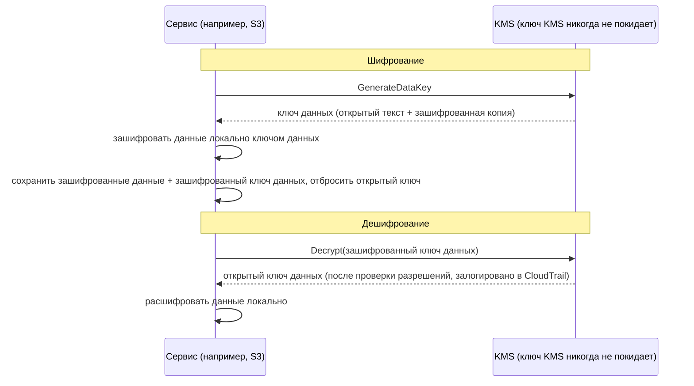

# Глава 16: Ключи, замки и секреты

В git-репозитории были тысячи коммитов, уходящих на два года назад. Лео листал двадцать минут, следуя за нитью сквозь историю — выискивая, когда определённая строка подключения к базе данных впервые появилась. Он чуть не пропустил это. Это было во вторник днём, зажатое между двумя ничем не примечательными коммитами, отправленное кем-то, кто с тех пор покинул компанию.

Пароль базы данных. В открытом виде. В истории.

---

*Сетевые элементы управления из прошлой главы теперь были жёсткими. Группы безопасности ограничивали боковое перемещение. NACL блокировали известные плохие IP-диапазоны. Периметр был укреплён. Но аудит безопасности нашёл то, что периметр не мог исправить: учётные данные, которые жили в истории git шесть месяцев. Безопасность периметра предполагает, что секреты внутри защищены. Этот — нет.*

---

Лео просматривал историю git, когда нашёл это. Пароль базы данных. Закоммиченный шесть месяцев назад, в открытом виде, кем-то, кто больше не работал в Nimbus — часть файла `.env`, который также содержал ключ доступа IAM конвейера развёртывания, двумя строками ниже строки подключения. Коммит был публичным. Пароль с тех пор был изменён — но они не знали этого наверняка. Они проверили каждую систему, которой когда-либо касались любые из этих учётных данных. Это заняло четыре часа. В тот день Nimbus решил перестать класть секреты в код.

«Мы думали о том, что произойдёт, если кто-то форкнет репозиторий?» — сказала Прия. «История git постоянна. Даже если мы изменим пароль, любой, кто клонировал репозиторий до исправления, всё ещё имеет старые учётные данные в своей локальной истории».

«Мы проверили», — сказал Лео. «Пароль был изменён три месяца назад. Все системы подтверждены».

«Это минимум», — сказала Прия. «Но каждая система, которой касались эти учётные данные, должна быть проверена. Не только те, о которых ты знаешь».

**Четырёхчасовой аудит**

Лео нашёл утёкший файл `.env` в истории git в 10 утра. К 2 дня у них был ответ на вопрос, который имел значение: использовались ли какие-либо из учётных данных — пароль базы данных или ключ доступа, закоммиченный рядом с ним — кем-либо, кроме систем Nimbus?

Аудит прошёл по четырём категориям.

**Логи доступа RDS**: Каждое соединение с базой данных, с меткой времени и залогированное. Утёкший пароль появился в трёх строках подключения — все от экземпляров EC2 в VPC Nimbus, все с ожидаемыми исходными IP. Никаких внешних соединений. Пароль не использовался для подключения к базе данных извне.

**Логи доступа S3**: Утёкший ключ доступа принадлежал IAM-пользователю конвейера развёртывания, у которого были разрешения для бакета `nimbus-receipts`. Лео запросил серверные логи доступа S3 за последние шесть месяцев. Каждый доступ исходил от экземпляров EC2 `us-west-2` или от роли получения origin CloudFront. Никаких аномалий.

**Вызовы API CloudTrail**: Каждый вызов API AWS, сделанный с утёкшим ID ключа доступа. Лео отфильтровал события CloudTrail для ключа. Триста двенадцать событий — все рутинные вызовы `s3:PutObject` от конвейера развёртывания, все с одного IP, все в рабочие часы. Ключ когда-либо использовался только с одного IP-адреса, который совпадал с CI/CD-сервером.

«А CI/CD-сервер», — сказала Прия, — «внутри VPC. Ему пришлось бы эксфильтровать данные через HTTPS к внешней конечной точке, и мы бы увидели это в логах потоков».

«Мы проверили», — сказал Лео. «Никакого исходящего HTTPS от этого сервера к не-AWS IP за последние шесть месяцев».

**Вердикт**: Ни одни учётные данные не использовались кем-либо за пределами команды Nimbus. Раскрытие было риском, а не утечкой.

«Но мы не можем быть уверены», — сказала Прия. «Мы можем быть разумно уверены на основе логов. Мы не можем быть уверены. Это различие имеет значение».

«Что сделало бы нас уверенными?»

«Ничто не делает вас уверенными после раскрытия учётных данных. Вы ротируете учётные данные, проверяете доступ, документируете находки и движетесь вперёд с лучшими элементами управления. Уверенность недоступна».

Том считал во время разговора. «Четыре часа времени трёх инженеров. Назовём это четырьмя тысячами долларов в полной стоимости. Плюс ротация учётных данных, документация, описание инцидента».

«И это только расследование», — сказала Прия. «Утечка была бы на порядки больше. Уведомления регуляторов. Коммуникации с клиентами. Возможные штрафы».

«Так что урок за четыре тысячи долларов был дешёвым», — сказал Том.

«Значительно», — сказала Прия. «Давайте не повторять его».

---

**Две проблемы: хранение секретов и шифрование данных**

Безопасность вокруг чувствительной информации имеет две отдельные проблемы:

**Хранение учётных данных** (пароли баз данных, ключи API, строки подключения): Где они живут? Кто может получить к ним доступ? Как вы ротируете их без повторного развёртывания приложения?

**Шифрование данных** (информация о клиентах, платёжные записи, PII): Как вы гарантируете, что даже если кто-то получит несанкционированный доступ к вашей базе данных или бакету S3, они не смогут прочитать данные?

У AWS есть отдельный сервис для каждой проблемы:

- **AWS Secrets Manager**: Безопасно хранит и управляет учётными данными
- **AWS KMS (Key Management Service)**: Управляет ключами шифрования для шифрования и дешифрования данных

Думайте о Secrets Manager как о связке ключей: она держит ваши ключи (учётные данные), держит их упорядоченными и ротирует их по расписанию. Думайте о KMS как о хранилище: оно не держит то, что ценно — оно держит ключ, который открывает замок, защищающий то, что ценно.

**AWS Secrets Manager: больше никаких жёстко прописанных учётных данных**

Secrets Manager — это безопасное хранилище для секретов: учётных данных баз данных, ключей API, токенов OAuth, SSH-ключей или чего угодно чувствительного.

Вместо того чтобы ваше приложение читало пароль из переменной окружения или конфигурационного файла, оно вызывает API Secrets Manager при запуске (или когда нужно) и извлекает секрет. Секрет никогда не касается диска. Он никогда не появляется в вашем коде. Его нет в ваших переменных окружения.

Вот как выглядит поток:

**Старый способ**:
```
DB_PASSWORD=supersecretpassword123  # в файле .env или переменной окружения
```

**Способ Secrets Manager**:
```python
import boto3
client = boto3.client('secretsmanager')
secret = client.get_secret_value(SecretId='nimbus/production/db-password')
password = json.loads(secret['SecretString'])['password']
```

Экземпляру EC2 нужна роль IAM с разрешением вызывать `secretsmanager:GetSecretValue` для этого конкретного секрета. Никакой другой сервис не может его прочитать. Секрета никогда нет в коде.

Возможно, вы задаётесь вопросом: почему просто не использовать переменные окружения? Они проще — установите их во время развёртывания, и приложение читает их. Переменные окружения кажутся скрытыми, но они хранятся в вашей конфигурации развёртывания, хранилище секретов CI/CD, возможно логируются во время отладочных сессий и видны любому с доступом к запущенному процессу. Что важнее, они статичны: однажды установленные, они не меняются, пока кто-то не обновит их вручную. Secrets Manager хранит учётные данные в зашифрованном сервисе с контролем доступа IAM, полным аудиторским логированием через CloudTrail и автоматической ротацией. Переменные окружения не ротируются. Утёкшая переменная окружения остаётся действительной, пока кто-то не изменит её вручную.

**Автоматическая ротация: настоящая сила**

Величайшая функция Secrets Manager — не хранение секретов, а их автоматическая ротация.

Вот сценарий: каждые 30 дней Secrets Manager генерирует новый пароль базы данных, обновляет его в RDS, обновляет хранимый секрет, и ваше приложение извлекает новый пароль в следующий раз, когда он ему нужен. Никакого ручного вмешательства. Никакого развёртывания. Никакого «мне нужно не забыть ротировать это».

Ротация реализована как функция Lambda. AWS предоставляет шаблоны для баз данных RDS (MySQL, PostgreSQL, Aurora). Вы можете настроить функцию для любого типа учётных данных.

«Сколько это стоит в месяц?» — спросил Том.

Secrets Manager взимает плату за секрет в месяц плюс за вызов API. Для небольшого количества паролей баз данных и ключей API стоимость составляет доллары в месяц — пренебрежимо мало по сравнению со стоимостью инцидента.

«Компрометация на прошлой неделе», — сказала Прия, — «во сколько обошлось бы расследовать и устранить её?»

Том на мгновение замолчал. «Включая моё время, твоё время, выходные Лео... пару тысяч долларов».

«Secrets Manager поймал бы статический ключ до того, как он был использован. И он ротировал бы его автоматически».

Том открыл страницу цен.

**Что происходит во время ротации**

«Подождите — но *почему* мы делали бы это именно так?» — спросила Майя. «Если пароль базы данных ротируется, ломается ли приложение? Как оно подхватывает новый пароль без развёртывания?»

Это было законное беспокойство. Ротация без сбоев требует осторожности.

Ротация Secrets Manager работает поэтапно — спроектирована, чтобы предотвратить сценарий «старый пароль внезапно недействителен, приложение падает»:

**Этап 1: Создать новую версию секрета.** Secrets Manager генерирует новый пароль и сохраняет его как ожидающую версию секрета. Текущая версия всё ещё активна.

**Этап 2: Установить на сервисе.** Lambda ротации вызывает базу данных, чтобы обновить пароль до нового значения. Имейте в виду: при стратегии ротации по умолчанию **с одним пользователем (single-user)** есть короткий момент, когда старый пароль только что перестал работать (`ALTER ROLE ... PASSWORD` в PostgreSQL вступает в силу немедленно), а новая версия ещё не текущая. Для ротации без простоя Secrets Manager поддерживает стратегию **с чередующимися пользователями (alternating-users)**: два пользователя базы данных с идентичными разрешениями, где ротация всегда обновляет *неактивного*, а затем переключается — активные учётные данные никогда не аннулируются на лету. Фраза для экзамена, которую нужно запомнить, — «стратегия ротации с чередующимися пользователями (alternating users)».

**Этап 3: Протестировать новый секрет.** Lambda ротации проверяет, что новый пароль работает, подключаясь с ним. Если это не удаётся, ротация откатывается.

**Этап 4: Завершить.** Secrets Manager помечает новую версию как текущую и понижает старую версию до предыдущей. Предыдущая версия сохраняется на льготный период.

В течение льготного периода обе версии можно извлечь. Если ваше приложение закэшировало старый секрет и ещё не подхватило новый, оно всё ещё может подключиться. В следующий раз, когда оно вызовет `GetSecretValue`, оно получит текущую (новую) версию.

«Значит, приложение никогда не нужно перезапускать», — сказал Лео.

«Не обязательно. Если ваше приложение кэширует секрет при запуске и никогда не обновляет его, вам нужно либо обновлять его по расписанию, либо обрабатывать сбои аутентификации повторным извлечением секрета».

«Значит, Lambda ротации и приложение должны сотрудничать», — сказала Майя.

«Secrets Manager делает свою половину. Код вашего приложения должен делать другую половину: извлекать секрет, когда нужно, обрабатывать сбои аутентификации повторным извлечением».

Лео обновил приложение, чтобы перехватывать исключения аутентификации базы данных и при сбое извлекать свежий секрет из Secrets Manager перед повторной попыткой. Две строки обработки ошибок. Ротация стала невидимой для пользователей.

---

**Инъекция секретов в CI/CD-конвейер**

«Мы думали о том, как конвейер развёртывания получает нужные ему секреты?» — спросила Прия. «Конвейер развёртывает инфраструктуру. Ему нужны учётные данные AWS. Ему могут понадобиться строки подключения к базе данных для скриптов миграции».

Лео объяснил текущую настройку: секреты хранились как GitHub Actions Secrets — зашифрованные в покое в GitHub, инъецируемые как переменные окружения во время выполнения.

«Учётные данные в GitHub», — сказала Прия.

«Зашифрованы».

«В сторонней системе. Одна утечка GitHub раскрывает все секреты нашего конвейера».

Решение: конвейер развёртывания аутентифицируется в AWS через федерацию OIDC (рассмотрена в главе 14) и извлекает любые нужные ему секреты из Secrets Manager во время выполнения. Никаких секретов, хранящихся в GitHub. Роль AWS конвейера имеет разрешение читать конкретные секреты, и ничего больше.

```yaml
# Рабочий процесс GitHub Actions
- name: Get DB Migration Credentials
  env:
    AWS_DEFAULT_REGION: us-west-2
  run: |
    SECRET=$(aws secretsmanager get-secret-value \
      --secret-id nimbus/staging/db-migration \
      --query SecretString --output text)
    DB_URL=$(echo $SECRET | jq -r '.url')
    # Запустить миграцию с DB_URL — никогда не хранится в файле
    flyway -url="$DB_URL" migrate
```

Секрет извлекается, используется в памяти и отбрасывается. Он никогда не записывается на диск, никогда не хранится в переменных окружения, которые сохраняются после задачи, никогда в файле логов.

«А что, если секрет напечатан в логе?» — спросил Лео.

«GitHub Actions автоматически маскирует значения секретов, которые настроены как GitHub Secrets. Но этот секрет не GitHub Secret — он приходит из Secrets Manager. Тебе нужно маскировать его вручную или, лучше, никогда не логировать».

«Значит, дисциплина такая: извлечь, использовать, отбросить. Никогда не логировать секреты. Никогда не хранить их в файлах».

«Эта дисциплина», — сказала Прия, — «это то, в чём, как подтвердил четырёхчасовой аудит, мы давали сбой».


**AWS KMS: фабрика замков**

«Подождите — но *почему* мы делали бы это именно так?» — спросила Майя. «Зачем отдельный сервис управления ключами? Разве мы не можем просто зашифровать данные сами и хранить ключ в Secrets Manager?»

Вы могли бы хранить ключи шифрования в Secrets Manager. Но тогда кто контролирует доступ к ключу? Что гарантирует, что ключ ротируется? Что доказывает аудитору, что ключ использовался только авторизованными сервисами? KMS отвечает на все эти вопросы. Это не просто хранилище — это сервис управления жизненным циклом ключей с аппаратно обеспеченной безопасностью, детализированными политиками IAM для каждого ключа и полным аудиторским следом каждого использования. Secrets Manager хранит то, что вам нужно для подключения к системам. KMS защищает сами системы.

AWS KMS (Key Management Service) управляет **криптографическими ключами** — секретными значениями, используемыми для шифрования и дешифрования данных.

Аналогия: KMS похож на компанию по сейфовым ячейкам, которая держит мастер-ключ. Ваши данные (содержимое ячейки) зашифрованы. Только тот, у кого есть разрешение использовать ключ KMS, может их расшифровать. KMS логирует каждое использование каждого ключа в CloudTrail.

**Customer Master Keys (CMK)** — теперь называемые ключами KMS — бывают трёх типов владения:

**Ключи, принадлежащие AWS (AWS owned keys)**: Ключи, которыми AWS владеет и использует во многих клиентских аккаунтах — вы никогда их не видите, никогда за них не платите, и они не появляются в вашем аккаунте. Несколько умолчаний сервисов используют их (шифрование по умолчанию DynamoDB, например).

(Одно различие, которое стоит держать в голове: шифрование по умолчанию S3 **SSE-S3** — это вообще *не* модель ключей KMS — S3 управляет своими собственными ключами AES-256 полностью вне KMS, без ключа, который можно увидеть, и без аудиторского следа использования ключа. **SSE-KMS** — это опция S3, которая проходит через KMS, используя либо управляемый AWS ключ `aws/s3`, либо управляемый клиентом ключ. Триггер экзамена: «проверить, кто использовал ключ шифрования» или «контролировать ротацию и политику ключа» → SSE-KMS с управляемым клиентом ключом — каждое использование попадает в CloudTrail.)

**Ключи, управляемые AWS (AWS managed keys)**: AWS создаёт и автоматически управляет ключом *в вашем аккаунте* для сервисов вроде S3, EBS, RDS (названные вроде `aws/s3`). Вы можете видеть его и проверять его использование в CloudTrail, но вы не можете изменить его политику или ротацию — AWS ротирует его автоматически каждый год. Бесплатно.

**Ключи, управляемые клиентом (Customer managed keys)**: Вы создаёте ключ в KMS и контролируете каждый его аспект: кто может его использовать, когда он ротируется, кто может им администрировать. Вы можете включить автоматическую ротацию ключа с настраиваемым периодом от 90 дней до 2560 дней (7 лет); период ротации по умолчанию — 365 дней (ежегодно). Вы также можете запустить **ротацию по требованию (on-demand rotation)** немедленно — полезно после подозреваемого раскрытия, без ожидания расписания. Примечание: автоматическая ротация применяется к симметричным ключам с материалом, сгенерированным KMS — асимметричные ключи и импортированный материал ключа не могут авторотироваться. Стоимость: $1/месяц за ключ плюс плата за вызов API.

Если вы выбираете управляемые клиентом ключи KMS, то вы получаете полный контроль над расписаниями ротации, политиками доступа и видимостью аудита, но вы платите за ключ в месяц и берёте на себя ответственность за управление ключами; если вы выбираете управляемые AWS ключи, то вы получаете шифрование с нулевыми операционными издержками и без стоимости за сам ключ, но вы не можете настраивать расписания ротации или политики ключей — они полностью управляются AWS.

**Шифрование в сервисах AWS: интеграция с KMS**

Большинство сервисов AWS интегрируются с KMS для шифрования:

**S3**: Включите «серверное шифрование с KMS» на бакете. Каждый объект шифруется в покое ключом KMS. Чтение объекта требует разрешения как на бакет S3, *так и* на ключ KMS.

**RDS**: Включите шифрование во время создания. Хранилище базы данных, резервные копии и снимки — все зашифрованы ключом KMS. Примечание: шифрование нельзя включить на существующем незашифрованном экземпляре RDS — вы должны сделать снимок, скопировать снимок с включённым шифрованием и восстановить.

**EBS**: Шифруйте тома с KMS. Новые тома, созданные из зашифрованных снимков, шифруются автоматически.

**DynamoDB**: Шифрование в покое с использованием KMS включено по умолчанию на всех таблицах.

**ElastiCache Redis**: Шифрование в покое с KMS для чувствительных кэшированных данных.

Принцип: данные должны быть зашифрованы в покое (хранятся на диске) и в транзите (перемещаются по сети). KMS обрабатывает шифрование в покое. TLS/SSL (предоставляемый автоматически сервисами AWS) обрабатывает шифрование в транзите.

**Конвертное шифрование: как KMS на самом деле работает**

Вот деталь, которая помогает вам понять поведение KMS и экзаменационные вопросы.

KMS не шифрует ваши данные напрямую в большинстве случаев. Он использует **конвертное шифрование (envelope encryption)**:

1. KMS генерирует **ключ данных (data key)** (уникальный симметричный ключ)
2. Сервис использует ключ данных для шифрования ваших данных локально (быстро — симметричное шифрование)
3. Сервис просит KMS зашифровать сам ключ данных (используя ваш ключ KMS)
4. И зашифрованные данные, и зашифрованный ключ данных хранятся
5. Ваши фактические данные никогда не покидают сервис — только ключ данных идёт в KMS для шифрования/дешифрования

Когда вы читаете данные:

1. Сервис просит KMS расшифровать ключ данных
2. KMS проверяет разрешения, расшифровывает ключ данных, возвращает его
3. Сервис использует расшифрованный ключ данных для дешифрования ваших данных локально



Это означает, что KMS может обрабатывать очень большие данные без отправки их всех через API KMS. Только маленькие ключи идут в KMS. CloudTrail логирует каждый вызов API KMS — каждую операцию шифрования и дешифрования.

**Политики ключей KMS: модель доступа**

«Мы думали о том, что произойдёт, если политика IAM и политика ключа конфликтуют?» — спросила Прия. «У KMS свой собственный контроль доступа поверх IAM».

У ключей KMS есть **политики ключей (key policies)** — политики на основе ресурсов, прикреплённые к самому ключу. Они отличаются от политик IAM и следуют другим правилам оценки.

Чтобы принципал использовал ключ KMS, две вещи должны быть истинны:

**Первое**: Политика ключа должна это разрешать. Если политика ключа явно не предоставляет принципалу доступ, он не может использовать ключ — независимо от того, что говорит его политика IAM. Это отличается от большинства ресурсов AWS, где одних политик IAM достаточно.

**Второе**: Политика IAM принципала должна разрешать действие KMS (например, `kms:Decrypt`, `kms:GenerateDataKey`).

Обе должны сказать да. Любая из них, говорящая нет, означает, что действие отклонено.

Политика ключа по умолчанию, которую AWS создаёт для управляемых клиентом ключей, включает оператор, который говорит «root-аккаунт может управлять этим ключом». Это важно: это означает, что администратор IAM уровня аккаунта всегда может предоставить доступ к ключу, даже если политика ключа не называет его напрямую — потому что делегирование root-аккаунту на месте.

«Значит, если мы удалим root-аккаунт из политики ключа», — спросил Лео, — «политики IAM перестают работать для этого ключа?»

«Верно. Удаление делегирования root-аккаунту — это способ заблокировать ключ так плотно, что только конкретные принципалы, названные в политике ключа, могут его использовать — даже не администраторы аккаунта. Это также способ случайно заблокировать себя от собственного ключа».

«Можем ли мы восстановиться?»

«Только связавшись с поддержкой AWS. Если никто не может использовать ключ и политику ключа нельзя обновить, данные, зашифрованные этим ключом, фактически недоступны».

«Значит, не удаляйте root-аккаунт из политики ключа без чрезвычайно веской причины».

«Верно».

---

**Асимметричные ключи: подписание и проверка**

KMS также поддерживает асимметричные пары ключей — публичный ключ и приватный ключ.

Случаи использования:

**Цифровое подписание**: Вы подписываете документ или токен JWT приватным ключом. Любой с публичным ключом может проверить, что подпись пришла от держателя приватного ключа и что содержимое не было подделано.

**Шифрование с публичным ключом**: Любой может зашифровать данные публичным ключом. Только держатель приватного ключа может их расшифровать.

Для Nimbus асимметричные ключи стали актуальны, когда они реализовали систему подписи вебхуков для ресторанных партнёров. Когда Nimbus отправлял событие на сервер ресторанного партнёра (новый заказ, обновление статуса), партнёру нужно было проверить, что событие действительно пришло от Nimbus и не было подделано.

Реализация:

1. Nimbus создаёт асимметричный ключ KMS (RSA 2048-бит, алгоритм SIGN_VERIFY)
2. При отправке вебхука Nimbus вызывает `kms:Sign` с приватным ключом, чтобы подписать полезную нагрузку события
3. Подпись включается в заголовок вебхука
4. Nimbus публикует публичный ключ (загружаемый из консоли KMS)
5. Сервер ресторанного партнёра извлекает публичный ключ и использует его для проверки подписи на каждом входящем вебхуке

Приватный ключ никогда не покидает KMS. У Nimbus никогда нет доступа к сырому материалу приватного ключа. KMS выполняет операцию подписания внутри своего аппаратного модуля безопасности.

«Значит, даже если кто-то скомпрометировал бы сервер Nimbus», — сказал Рафаэль, — «они не могли бы подделать подпись вебхука. Приватный ключ в KMS, а не на каком-либо сервере».

«Верно. Подписание требует вызова API KMS. Каждый вызов API логируется в CloudTrail. Если бы кто-то попытался подписать мошенническое событие, мы бы увидели вызов API».

---

**История удаления ключа**

Через три месяца после настройки KMS Том сделал ошибку.

Он чистил неиспользуемые ресурсы AWS — старые функции Lambda, устаревшие бакеты S3, заброшенные дашборды CloudWatch. Он двигался быстро. Он случайно запланировал ключ KMS на удаление.

Ключ был `nimbus/prod/order-receipts` — управляемый клиентом ключ, используемый для шифрования бакета S3 чеков заказов.

«Я пакетно удалил двенадцать ресурсов вчера и не проверил, какой был двенадцатый», — ровно сказал Том. Он запланировал удаление и двинулся дальше. Он заметил ошибку на следующее утро, когда просматривал свои действия.

Он открыл консоль KMS. Статус ключа гласил: «Ожидает удаления. Удаление через 7 дней».

Он запланировал его на минимальный период ожидания.

«Можем ли мы его отменить?» — спросил он.

Прия открыла документацию. «Да. В течение периода ожидания ключ отключён, но не удалён. Вы можете отменить удаление».

Том отменил удаление в течение минуты. Ключ был восстановлен в активный статус.

«Семь дней — минимальный период ожидания», — сказала Прия. «AWS обеспечивает его, потому что если ключ удалён и данные были зашифрованы им, эти данные пропали навсегда. Невосстановимо. Период ожидания даёт вам время осознать ошибку».

«Каким должен быть период ожидания?»

«Максимум — тридцать дней. Для любого ключа, который шифрует продакшен-данные, используйте тридцать дней. Дополнительные три недели защиты от случайностей стоят небольшого неудобства».

Том обновил все настройки удаления продакшен-ключей до тридцати дней. Он также настроил будильник CloudWatch, который срабатывал, если статус любого ключа KMS менялся на «Ожидает удаления» — так что в следующий раз, когда кто-то (включая его) сделает ту же ошибку, команда узнает в течение пяти минут.

---

**Secrets Manager против Parameter Store**

У AWS также есть **Systems Manager Parameter Store**, который хранит значения конфигурации (не только секреты). Parameter Store дешевле — бесплатен для стандартных параметров. Он также может хранить зашифрованные параметры с использованием KMS.

Для секретов, которым нужна ротация: Secrets Manager.

Для значений конфигурации и нечувствительных параметров: Parameter Store (бесплатный уровень очень щедр).

Для конфигурации приложения (номера портов, флаги функций, специфичные для среды настройки): Parameter Store.

| | Secrets Manager | SSM Parameter Store |
|---|---|---|
| Автоматическая ротация | Да (на основе Lambda) | Нет |
| Стоимость | ~$0,40/секрет/месяц | Бесплатно (стандарт) |
| Шифрование | Всегда | Опционально (с KMS) |
| Версионирование | Да | Да |
| Кросс-аккаунтный доступ | Да | Ограничен |
| Лучше всего для | Паролей баз данных, ключей API | Значений конфигурации, флагов функций |

## Сертификат на двери

Через две недели после миграции секретов Прия просматривала среду staging Nimbus на телефоне, когда заметила адресную строку.

«Не защищено».

Она открыла продакшен-URL. То же самое.

«Лео», — сказала она, кладя телефон на стол. «Мы работаем на HTTP?»

Лео проверил. «Слушатель ALB на порту 80. Мы никогда не настраивали HTTPS».

«Значит, каждый запрос, который делают наши пользователи — каждый заказ, каждый вход — идёт по незашифрованному HTTP?»

«У нас есть TLS на соединении RDS», — предложил Лео.

«Это данные в транзите между приложением и базой данных. Я говорю о данных в транзите между браузером пользователя и нашим балансировщиком нагрузки. Это вообще не зашифровано».

Том слушал. «Это проблема безопасности или проблема восприятия?»

«И то, и другое», — сказала Прия. «Незашифрованный HTTP означает, что любая сеть между пользователем и нашим сервером — роутер кофейни, интернет-провайдер — может читать трафик. Пароли, детали заказов, токены сессий. И современные браузеры предупреждают пользователей „Не защищено“. Это убивает конверсию».

«Значит, нам нужен сертификат TLS», — сказала Майя. «Сколько это стоит?»

«Ничего», — сказала Прия. «AWS Certificate Manager».

**AWS Certificate Manager (ACM)** предоставляет бесплатные сертификаты TLS/SSL для использования с управляемыми AWS сервисами: ALB, дистрибутивами CloudFront и API Gateway. Вы не покупаете сертификат, не управляете календарём обновления и не касаетесь материала приватного ключа. ACM обрабатывает весь жизненный цикл сертификата.

Сертификат, выданный ACM, действителен 13 месяцев. До истечения ACM обновляет его автоматически. Если обновление успешно, новый сертификат прикрепляется к вашему балансировщику нагрузки или дистрибутиву без каких-либо действий с вашей стороны. Замок в браузере остаётся зелёным. Уведомление об истечении, которое вы забыли установить, никогда не срабатывает.

**Два типа сертификатов ACM**:

**Публичные сертификаты** выдаются центром сертификации Amazon и доверяются всеми основными браузерами. Они полностью бесплатны для использования с ALB, CloudFront и API Gateway. Вы подтверждаете владение доменом либо через DNS, либо через email.

**Приватные сертификаты** выдаются AWS Private CA — управляемым приватным центром сертификации, который вы запускаете для внутренних сервисов (mTLS между сервисами, внутренние инструменты, клиенты VPN). У Private CA есть ежемесячная стоимость.

Для Nimbus публичные сертификаты были правильным выбором.

**Валидация DNS против валидации email**:

Лео открыл консоль ACM и начал запрос сертификата для `eatnimbus.com` и `*.eatnimbus.com`.

«Он спрашивает, как я хочу подтвердить владение», — сказал он. «DNS или email».

«DNS», — сказала Прия. «Всегда DNS».

При валидации DNS ACM добавляет конкретную запись CNAME в вашу хостинговую зону. Route 53 может сделать это автоматически — один клик в консоли. Пока эта запись CNAME существует, ACM может автоматически обновлять сертификат без каких-либо действий человека. Валидация email отправляет письмо зарегистрированному контакту домена и требует ручного клика каждый раз, когда сертификат обновляется. Этот клик забывается. Валидация DNS не требует, чтобы кто-то что-то помнил.

«Значит, я добавляю запись CNAME один раз», — сказал Лео, — «и она обновляется вечно?»

«Пока кто-то не удалит запись CNAME», — сказала Прия. «Не удаляй запись CNAME».

Лео запросил сертификат, добавил валидационный CNAME в Route 53 (что ACM предложил сделать автоматически) и подождал пять минут. Статус сертификата изменился на Issued. Он прикрепил его к слушателю HTTPS ALB на порту 443 и добавил правило перенаправления на порту 80, чтобы отправлять весь HTTP-трафик на HTTPS.

Том обновил продакшен-URL.

Замок появился.

Одна региональная деталь, заслуживающая флага: сертификат — это региональный ресурс, и он должен находиться в том же регионе, что и сервис, который его использует. Для ALB это регион ALB. Для **CloudFront** сертификат должен быть запрошен (или импортирован) в **`us-east-1`** — всегда, независимо от того, где работают ваши origin — потому что CloudFront — глобальный сервис, привязанный туда. Лео уже спотыкался об это в главе 13; это также надёжный экзаменационный факт.

**Единственное, чего сертификаты ACM не могут**:

«Могу ли я скачать сертификат?» — спросил Лео. «Я хочу установить его на внутренний админский экземпляр EC2».

«Нет», — сказала Прия.

Бесплатные публичные сертификаты ACM нельзя экспортировать. Вы не можете скачать приватный ключ и установить его на экземпляр EC2, сервер Nginx или что-либо вне управляемых AWS сервисов. Материал приватного ключа никогда не покидает ACM. Это намеренно — это предотвращает утечку приватного ключа, его небезопасное хранение или забывание о нём, когда сертификат истекает.

Для случаев использования, требующих устанавливаемого сертификата — экземпляр EC2, действующий как пользовательский прокси, локальный сервер — есть три пути: сертификат от стороннего центра (Let's Encrypt, например), AWS Private CA с включённым экспортом сертификатов или — с июня 2025 — платные **экспортируемые публичные сертификаты (exportable public certificates)** ACM (по согласию при выдаче, оплачиваемые за FQDN или wildcard), чей приватный ключ *можно* экспортировать для использования где угодно.

«Для нашего ALB и нашего дистрибутива CloudFront», — сказала Прия, — «ACM именно то, что нужно. Бесплатно, автоматически, и мы никогда не касаемся ключа».

## Сильные стороны и ограничения

**AWS Secrets Manager**:

- Автоматическая ротация секретов без изменений кода или развёртываний
- Детализированный контроль доступа IAM для каждого секрета (каждый секрет — отдельный ресурс IAM)
- Версионирование — предыдущая версия остаётся доступной во время ротации, предотвращая обрывы соединений
- Аудит через CloudTrail — каждый вызов `GetSecretValue` логируется с идентичностью вызывающего
- Кросс-аккаунтный доступ — секреты одного аккаунта могут быть разделены с ролью другого аккаунта
- Стоимость: ~$0,40/секрет/месяц + вызовы API (примерно $0,05 за 10 000 вызовов API)

**AWS KMS**:

- Централизованное управление ключами с полным аудиторским следом — каждое шифрование и дешифрование залогировано
- Настраиваемая автоматическая ротация ключей для управляемых клиентом ключей (90 дней до 2560 дней; по умолчанию 365 дней) — старый материал ключа всё ещё расшифровывает существующие данные, новый материал ключа шифрует новые данные
- Детализированные разрешения IAM для каждого ключа (политики ключей + политики IAM — обе должны разрешать)
- Обеспеченные аппаратным модулем безопасности (HSM) — ключи никогда не покидают HSM в открытом виде
- Поддержка ключей Multi-Region для сценариев аварийного восстановления
- Поддержка асимметричных ключей для цифрового подписания и проверки
- Стоимость: $1/месяц за ключ + $0,03 за 10 000 вызовов API

**Где всё усложняется**:

- Политики ключей KMS отдельны от (и оцениваются вместе с) политик IAM — отладка ошибок access denied требует проверки обоих
- Шифрование в покое должно планироваться заранее — вы не можете зашифровать существующий незашифрованный экземпляр RDS на месте
- Удаление ключа в KMS имеет период ожидания 7-30 дней — механизм безопасности, но легко забыть во время настройки и опасно случайно запустить
- Ротация требует, чтобы код приложения обрабатывал повторное извлечение секретов при сбое аутентификации — Secrets Manager ротирует учётные данные, но приложение должно их подхватить
- Стоимость Secrets Manager масштабируется с количеством секретов и объёмом вызовов API при большом масштабе
- Политика ключа по умолчанию (включая делегирование root-аккаунту) критична для сохранения — её удаление может заблокировать администраторов от ключа

## Итоги

Четыре часа, потраченные на отслеживание скомпрометированных учётных данных через каждую систему, которой они касались, были четырьмя часами, которые Secrets Manager мог бы предотвратить. Автоматическая ротация означает, что украденные учётные данные имеют короткий срок жизни. KMS означает, что даже если кто-то доберётся до данных, они не смогут их прочитать без ключа, который им не разрешено использовать. А тридцатидневный период ожидания удаления ключа означает, что случайное удаление можно отменить до того, как оно станет событием потери данных.

- Никогда не храните учётные данные в коде, переменных окружения или конфигурационных файлах, закоммиченных в систему контроля версий.
- **Secrets Manager** безопасно хранит учётные данные и ротирует их автоматически. Приложения извлекают секреты через API во время выполнения.
- **Ротация** происходит поэтапно: создать новую версию, обновить на сервисе, протестировать, повысить. И старая, и новая версии кратко действительны, предотвращая обрывы соединений во время ротации.
- **KMS** управляет ключами шифрования. Большинство сервисов AWS интегрируются с KMS для шифрования в покое.
- **Конвертное шифрование**: KMS шифрует ключ, а не данные напрямую. Сервис шифрует данные с использованием локального ключа данных, который KMS шифрует. Только маленькие ключи проходят через API KMS.
- **Управляемые клиентом ключи KMS**: полный контроль над ротацией (настраиваемо 90–2560 дней, по умолчанию 365 дней ежегодно), доступом и аудитом ($1/месяц). **Управляемые AWS ключи**: автоматически, без необходимости настройки, бесплатно.
- **Политики ключей KMS**: Политика ключа — это политика на основе ресурсов, которая работает вместе с IAM. Обе должны сказать да. Делегирование root-аккаунту в политике ключа по умолчанию гарантирует, что администраторы IAM всегда могут предоставить доступ.
- **Асимметричные ключи**: KMS поддерживает пары ключей RSA и ECC для подписания и проверки. Приватный ключ никогда не покидает HSM.
- **Удаление ключа**: Минимум 7-дневный, максимум 30-дневный период ожидания. Удалённые ключи означают навсегда недоступные зашифрованные данные. Используйте 30 дней для продакшен-ключей и отслеживайте статус ожидания удаления.
- **Секреты CI/CD**: Извлекайте из Secrets Manager во время выполнения с использованием федерации OIDC. Никогда не храните секреты как переменные платформы CI/CD.

## Советы по экзамену

*Домен SAA-C03: Проектирование безопасных архитектур (Домен 1, Задача 1.3)*

- **Secrets Manager против SSM Parameter Store**: Secrets Manager для учётных данных, которым нужна автоматическая ротация; Parameter Store для общей конфигурации. Экзамен различает их по требованию ротации и чувствительности к стоимости.
- **Политики ключей KMS**: У ключа KMS есть своя собственная политика ключа (политика на основе ресурсов). Одни политики IAM не предоставляют доступ к ключу KMS — политика ключа должна явно его разрешать. И политика ключа, и политика IAM должны разрешать действие.
- **Шифрование RDS**: Нельзя включить шифрование на существующем незашифрованном экземпляре RDS. Процесс: создать снимок → скопировать снимок с включённым шифрованием → восстановить из зашифрованного снимка → мигрировать трафик на новый экземпляр.
- **Шифрование EBS**: Новые тома можно зашифровать. Снимки зашифрованных томов всегда зашифрованы. Незашифрованные тома нельзя зашифровать напрямую — снимок + копия + восстановление.
- **CloudTrail + KMS**: Каждый вызов API KMS логируется в CloudTrail. Это ключевая функция соответствия. Когда экзамен спрашивает, как проверить, кто расшифровал какие данные, ответ — CloudTrail + KMS.
- **Ключи KMS Multi-Region**: Реплицируйте материал ключа в несколько регионов, чтобы дешифрование могло происходить без кросс-региональных вызовов API. Экзамен использует это для многорегионального аварийного восстановления с зашифрованными данными.
- **KMS против CloudHSM**: KMS многопользовательский (управляется AWS). CloudHSM — выделенный аппаратный модуль безопасности, который контролируете только вы. Сигналы экзамена: «FIPS 140-2 Level 3», «выделенный HSM», «управляемые клиентом криптографические операции» → CloudHSM.
- **Конвертное шифрование**: KMS генерирует ключ данных, сервис использует его для шифрования данных локально, KMS шифрует ключ данных. Вопрос экзамена: «почему KMS не шифрует большие объёмы данных напрямую?» → производительность; конвертное шифрование держит большие данные локально.
- **Асимметричные ключи KMS**: Используются для цифрового подписания, проверки JWT или шифрования с публичным ключом. Приватный ключ никогда не покидает KMS. `kms:Sign` — вызов API для подписания; `kms:Verify` — для проверки.
- **Период ожидания удаления ключа**: 7-30 дней. В течение этого периода ключ отключён и неиспользуем, но удаление можно отменить. После удаления любые данные, зашифрованные этим ключом, навсегда невосстановимы.
- **ACM (AWS Certificate Manager):** Бесплатные публичные сертификаты TLS для использования с ALB, CloudFront и API Gateway. Автообновление через валидацию DNS. У бесплатных публичных сертификатов нельзя экспортировать приватный ключ — они живут только внутри AWS (платная опция *экспортируемого публичного сертификата* существует с 2025 для использования на EC2/локально). Триггер экзамена: «HTTPS на балансировщике нагрузки или CDN» → ACM.

## Упражнения

**Упражнение 1 — Запоминание**

Объясните концепцию конвертного шифрования. Почему KMS шифрует маленький ключ данных, а не шифрует данные вашего приложения напрямую?

*(Подсказка: подумайте о том, что произойдёт, если у вас 1 ГБ данных для шифрования, и каковы были бы последствия для производительности отправки 1 ГБ удалённому сервису KMS.)*

**Упражнение 2 — Сценарий SAA-C03**

*Сценарий*: Компания финансовых услуг хранит чувствительные данные клиентов в базе данных RDS MySQL. Новое требование соответствия предписывает, что:

1. Все данные должны быть зашифрованы в покое
2. Всё использование ключей шифрования должно быть проверяемым
3. Ключи шифрования должны контролироваться клиентом (не управляться AWS)
4. Пароль базы данных должен ротироваться автоматически каждые 90 дней

База данных была создана шесть месяцев назад без включённого шифрования. Какой набор действий НАИЛУЧШИМ образом удовлетворяет все четыре требования?

A) Включить шифрование RDS на существующей базе данных; создать управляемый клиентом ключ KMS; настроить Secrets Manager с 90-дневной ротацией  
B) Создать снимок существующей базы данных; скопировать снимок с шифрованием с использованием управляемого клиентом ключа KMS; восстановить из зашифрованного снимка; настроить Secrets Manager с 90-дневной ротацией  
C) Создать новый зашифрованный экземпляр RDS с управляемым AWS ключом; мигрировать данные со старого экземпляра; настроить Secrets Manager с 90-дневной ротацией  
D) Включить шифрование в покое RDS на существующей базе данных с использованием управляемого AWS ключа; настроить Secrets Manager с 90-дневной ротацией

**Подсказка 1**: Вы не можете включить шифрование на существующем незашифрованном экземпляре RDS напрямую.

**Подсказка 2**: «Контролируемые клиентом» ключи означают управляемые клиентом ключи KMS, а не управляемые AWS ключи.

**Подсказка 3**: Процесс копирования снимка — стандартный путь миграции к зашифрованному RDS.

**Ответ**: B

**Объяснение**: Шифрование RDS нельзя включить на существующем экземпляре. Стандартный подход: сделать снимок существующего экземпляра → скопировать снимок с включённым шифрованием с использованием управляемого клиентом ключа KMS (удовлетворяет требования 1, 2 и 3) → восстановить из зашифрованного снимка. Управляемые клиентом ключи KMS автоматически логируют всё использование в CloudTrail (аудит) и держат ключи шифрования под вашим контролем. Secrets Manager обрабатывает автоматическую 90-дневную ротацию пароля (удовлетворяет требование 4).

**Почему не A?** Вы не можете включить шифрование на существующем незашифрованном экземпляре RDS на месте.

**Почему не C?** Управляемые AWS ключи не удовлетворяют требование «контролируемые клиентом» (требование 3).

**Почему не D?** Та же проблема, что и A (нельзя включить на месте), плюс управляемый AWS ключ не удовлетворяет требование 3.

*Домен SAA-C03: Проектирование безопасных архитектур — Задача 1.3*

**Упражнение 3 — Архитектурный вызов** *(Необязательно)*

Nimbus нужно хранить следующие чувствительные данные:

- Пароль базы данных для продакшен-экземпляра RDS
- Секретный ключ API Stripe (используется для обработки платежей)
- Симметричный ключ шифрования для шифрования истории заказов клиентов в DynamoDB
- Значения конфигурации для каждого ресторана (конечные точки API, флаги функций — нечувствительные)

Какой сервис AWS или подход вы использовали бы для каждого? Какую стратегию ротации вы применили бы к каждому?

*(Нет единственно правильного ответа. Цель — практиковать сопоставление инструментов безопасности со случаями использования.)*

## Послесловие к главе

«Я уже задеплоил это — ой». Лео мигрировал продакшен-секреты в Secrets Manager, пока среда разработки всё ещё использовала старые переменные окружения. Dev-среда сломалась. Ему пришлось откатить dev-конфиг вручную.

«Сначала staging», — сказала Прия. «Потом продакшен».

«Я знаю», — сказал Лео.

Секреты были мигрированы.

Пароли баз данных: Secrets Manager, ротация каждые 30 дней.

Ключи API: Secrets Manager, с Lambda ротации, которая вызывала API платёжного провайдера для генерации нового ключа.

Данные заказов клиентов: зашифрованы управляемым клиентом ключом KMS.

Старые учётные данные: деактивированы. Старые конфигурационные файлы: удалены. Старые секреты GitHub Actions: убраны.

«Теперь мы готовы к аудиту», — сказала Прия.

«Определи готовы к аудиту», — сказала Майя.

«Если бы аудитор соответствия попросил нас доказать, что никакие учётные данные не прописаны жёстко в нашем коде или не раскрыты в нашей инфраструктуре, мы могли бы показать им: каждый секрет в Secrets Manager, каждый ключ шифрования в KMS, каждый доступ залогирован в CloudTrail».

«Когда последний раз кто-то проверял логи CloudTrail?»

Пауза.

«Я проверяю их каждую неделю», — сказала Прия.

«А если бы появилось что-то необычное, как бы мы узнали?»

«Это», — сказала Прия, закрывая ноутбук, — «следующий разговор».

В следующей главе: три уровня обороны, которые стоят между Nimbus и интернетом.
