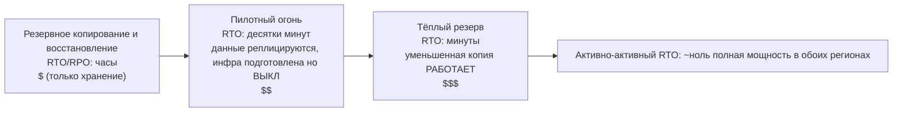

# Глава 18: Когда всё ломается

Свет погас в 23:17.

Не в офисе Nimbus — Лео был дома, на диване, с полузакрытым ноутбуком. Свет погас в дата-центре в Орегоне, где он никогда не был, в здании, которого он никогда не видел, в зале, полном серверов, к которым он никогда не прикасался. Он ещё не знал об этом. Был момент — всего лишь момент — полной тишины, прежде чем где-то далеко включились резервные генераторы. Такая темнота, в которой не понять, открыты у тебя глаза или закрыты.

Затем пришло уведомление в Slack.

---

После того как системы мониторинга из главы 17 были на месте, команда ощутила что-то вроде уверенности. Срабатывали оповещения. Дашборды были зелёными. Логи текли в CloudWatch. Они потратили три недели, встраивая видимость в каждый уголок инфраструктуры Nimbus.

Чего никто не сказал вслух — от чего мониторинг не защищал — это что видимость и устойчивость разные вещи. Можно наблюдать сбой в идеальных деталях. Наблюдение не останавливает его.

Этот урок пришёл в 23:23 в четверг.

---

Лео получил уведомление в Slack.

«us-west-2 — сбой кластера дата-центра — деградированное обслуживание».

Он открыл консоль AWS. Экземпляры EC2 в одной из зон доступности показывали неудачные проверки состояния. Его Auto Scaling Group обнаружил нездоровые экземпляры и запускал замены — в той же зоне.

В кластере, который выходил из строя.

Новые экземпляры тоже не могли запуститься. Они были в той же зоне аппаратного сбоя.

«Балансировщик нагрузки маршрутизирует трафик в обе AZ», — сказал Лео, ни к кому конкретно не обращаясь. «Половина нашего трафика идёт к экземплярам, которые не работают».

Он открыл консоль EC2 и начал кликать. В разделе Load Balancers Application Load Balancer показывал обе целевые группы как здоровые — потому что проверка состояния проходила на порту 80, и даже выходящие из строя экземпляры отвечали на эту проверку. Они просто не могли обрабатывать реальные запросы.

Он попытался удалить выходящую из строя AZ из целевой группы. Консоль приняла изменение. Но Auto Scaling Group, настроенный поддерживать баланс, немедленно начал пытаться заменить завершённые экземпляры — в той же выходящей из строя зоне.

Лео уставился на экран. Он только что сделал хуже.

Он открыл конфигурацию ASG. Настройка «Balance capacity across Availability Zones» была активна. В нормальной работе это был хороший дизайн. Прямо сейчас она активно работала против него.

Он изменил ASG на использование только здоровой зоны. Применил изменение.

Консоль показала изменение как «In Service».

Через три минуты появились первые здоровые экземпляры замены.

Балансировщик нагрузки начал маршрутизировать трафик. Частота ошибок упала с 52% до 4%. Оставшиеся 4% были запросами, которые попали на последние несколько нездоровых экземпляров, всё ещё закрывающих соединения.

К 23:45 — через двадцать две минуты после начала сбоя — трафик был стабильным.

Двадцать две минуты деградированного обслуживания, прежде чем он заметил и вручную переключил ASG на использование только здоровой зоны.

«Это произошло потому, что всё было в одной AZ», — сказала Прия на следующее утро.

«Нет», — сказал Лео. «У меня были экземпляры в двух AZ. Проблема была в том, что экземпляры замены появлялись в выходящей из строя AZ».

«И база данных?»

Лео остановился.

«Основной экземпляр RDS был в выходящей из строя зоне», — сказал он. «Multi-AZ на самом деле сделал свою работу — он переключился на резервный в здоровой зоне примерно за девяносто секунд. Но наши серверы приложений держали свои мёртвые соединения открытыми и повторяли попытки на закешированный IP-адрес вместо повторного разрешения DNS-имени эндпоинта. База данных была здорова к 23:25. Наше приложение не переподключилось чисто, пока я не перезапустил пулы соединений».

Двадцать две минуты деградированного обслуживания стали тридцатью восемью.

Когда Лео настраивал Auto Scaling Group восемь месяцев назад, он отметил настройку «balance capacity across AZs» и решил, что этого достаточно. «Всё будет хорошо», — сказал он тогда Майе. «AWS обрабатывает всю эту историю с AZ автоматически». Он был прав, что AWS это обрабатывает, — и ошибался насчёт того, что значит «автоматически».

«Что бы произошло», — спросила Майя на следующее утро, — «если бы мы настроили всё правильно? Как выглядит правильная настройка Multi-AZ при реальном сбое?»

Лео подумал об этом. Он думал об этом с 23:45.

В гипотетической правильной настройке: у ASG были бы проверки состояния экземпляров, которые смотрели на состояние ALB — а не только на статус EC2. Когда AZ выходит из строя, проверка состояния на этих экземплярах не прошла бы в течение 30 секунд. ASG обнаружил бы сбои и немедленно начал бы запускать замены — а когда запуски постоянно проваливаются в одной AZ, группа перемещает мощность в оставшиеся здоровые зоны, а не борется с выходящей из строя.

Балансировщик нагрузки вывел бы цели выходящей из строя AZ из ротации в течение тех же 30 секунд. Трафик сконцентрировался бы в здоровой AZ.

Для базы данных: само переключение Multi-AZ сработало — не хватало дисциплины клиента. Пулы соединений, которые повторно разрешают DNS-имя эндпоинта при переподключении (вместо кеширования IP), короткие TTL DNS-кеша и логика повторных попыток. С этим на месте переключение RDS — это сбой на 60–120 секунд, а не хвост в 16 минут.

Общее влияние, видимое клиентам: 60–90 секунд деградированной задержки, пока база данных переключалась. Не 38 минут каскадных ошибок.

«У нас была вся инфраструктура, чтобы пережить это», — сказал Лео. «Мы просто настроили её неправильно».

Эту фразу было труднее произнести, чем пережить сам инцидент.

**Аналогия с электросетью**

Подумайте о том, как ваш дом получает электричество. Энергия поступает не по одному проводу от одного генератора. Она поступает из сети — системы генераторов, подстанций и линий передачи, которые поддерживают друг друга. Если одна подстанция загорается, другие перенаправляют энергию вокруг неё. Вы не замечаете. Свет остаётся включённым.

Зоны доступности AWS работают точно так же. Вместо одного огромного дата-центра, от которого всё зависит, AWS распределяет ваши ресурсы по нескольким физически отдельным объектам. Если один объект теряет питание или испытывает аппаратный сбой, другие продолжают работать. Трафик перенаправляется автоматически. Ваше приложение остаётся работать — потому что никогда не было одного провода для разрезания.

Это **архитектура Multi-AZ**: распределение ваших ресурсов по физически отдельным объектам, так что один сбой никогда не выводит из строя всё.

Multi-Region — следующий уровень: представьте резервные генераторы в совершенно другом городе. Если вся местная электросеть падает, удалённый город берёт управление. Сложнее настроить, но более устойчиво к катастрофическим сбоям.

Вы можете задаться вопросом: если Multi-AZ просто означает распределение ресурсов по двум дата-центрам, почему AWS не делает это по умолчанию для всего? Ответ — стоимость. Multi-AZ примерно удваивает инфраструктуру — и для среды разработки или внутреннего инструмента с низким трафиком эта дополнительная стоимость не оправдана. Однако для производственных нагрузок вопрос переворачивается: можете ли вы позволить себе простой, если у вас этого нет?

**Словарь сбоев**

Прежде чем проектировать устойчивость, вам нужны слова для того, против чего вы проектируете.

«Как нам вообще измерить, достаточно ли мы устойчивы?» — спросила Прия.

«Два числа», — сказал Лео. «Как долго мы можем быть недоступны и сколько данных мы можем потерять».

**Доступность**: Процент времени, когда система работает. «Четыре девятки» (99,99%) означают менее 52 минут простоя в год. «Пять девяток» (99,999%) — около 5 минут в год.

**RTO (Recovery Time Objective)**: Как долго система может быть недоступна до того, как это становится бизнес-проблемой? Если ваш RTO 4 часа, у вас 4 часа для восстановления сервиса до нарушения SLA.

**RPO (Recovery Point Objective)**: Сколько данных вы можете позволить себе потерять? Если ваш RPO 1 час, вы можете допустить потерю до одного часа данных в катастрофическом сбое. Всё, написанное за последний час до сбоя, утеряно.

**Отказоустойчивость**: Способность продолжать работать (на каком-то уровне) при сбое компонента.

**Аварийное восстановление (DR)**: Процесс восстановления после катастрофического сбоя — пожар в дата-центре, региональный сбой, случайное массовое удаление.

Эти пять концепций управляют каждым архитектурным решением в этой главе.

**RTO и RPO — это бизнес-решения, а не технические**

Числа значат меньше, чем то, кто их устанавливает. Инженер может угадать RTO. Бизнес-стейкхолдер знает, во что на самом деле обходится 30-минутный простой.

Рассмотрим две компании с одинаковым технологическим стеком:

Финтех-компания, обрабатывающая брокерские сделки: RTO 4 минуты, RPO ноль. Торговая система, недоступная четыре минуты в часы работы рынка, может пропустить тысячи транзакций. Каждая пропущенная транзакция имеет прямую долларовую стоимость. Нулевая потеря данных не философская — потеря одной подтверждённой сделки означает проблемы с комплаенсом и судебные иски клиентов. Стоимость архитектуры для достижения этого: активно-активный Multi-AZ с синхронной репликацией, шестизначный годовой бюджет на инфраструктуру.

Платформа заказа еды для ресторанов: RTO 30 минут, RPO 5 минут. 30-минутный простой во время ужина по-настоящему болезненный и стоит реальных денег. Но потеря последних 5 минут заказов перед сбоем означает, что горстке клиентов нужно перезаказать — раздражает, но не катастрофа. Стоимость архитектуры для достижения этого: тёплый резерв Multi-AZ, доля бюджета финтеха.

«Подожди — но *почему* ресторанная платформа примет 5 минут потери данных?» — спросила Майя, когда Лео объяснил это. «Разве это всё равно не потеря заказов клиентов?»

«Вопрос в том, стоит ли предотвращение этой потери данных больше, чем оно того стоит», — сказал Лео. «Снижение RPO с 5 минут до 0 потребовало бы синхронной репликации между регионами. Это значительная стоимость и инженерная инвестиция. Для ресторанного приложения нашего масштаба RPO в 5 минут — это правильный компромисс».

Урок: RTO и RPO — это не технические минимумы. Это бизнес-компромиссы, выраженные числами. Их установка требует и инженерной команды (которая знает, что достижимо), и бизнес-стейкхолдеров (которые знают, что приемлемо).

**Multi-AZ: переживание сбоев зоны доступности**

Зона доступности (AZ) — это физически отдельный дата-центр в регионе. AZ спроектированы быть независимыми: отдельные источники питания, отдельное охлаждение, отдельная сетевая инфраструктура. Но они достаточно близко, чтобы задержка сети между ними составляла 1-2 миллисекунды.

**Развёртывания Multi-AZ** распределяют ваши ресурсы по двум или более AZ в регионе. Если одна AZ выходит из строя:

- Балансировщик нагрузки прекращает маршрутизацию к нездоровым экземплярам в выбывшей AZ
- Auto Scaling Group заменяет экземпляры — но в *здоровой* AZ
- RDS переключается на резервную базу данных в здоровой AZ

Ошибка Лео: его Auto Scaling Group не был настроен ограничивать экземпляры замены здоровыми AZ. Он был настроен поддерживать баланс между AZ. Когда зона вышла из строя, ASG пытался сбалансировать количество экземпляров, запуская замены там — в выходящей из строя зоне.

Исправление: настроить ASG запускать только в здоровые AZ, с минимум двумя AZ, всегда активными.

Более глубокий урок: тестировать ваши сценарии сбоев до того, как они происходят в производстве.

Если вы выбираете Multi-AZ, вы получаете автоматическое переключение и почти нулевой RPO — но вы платите за инфраструктуру, которая не обслуживает трафик во время нормальной работы. Этот резервный экземпляр RDS всегда запущен, всегда реплицирует и никогда не отвечает на запрос, пока основной не выйдет из строя. Это компромисс: надёжность стоит денег, даже когда ничего не сломано.

**Хаотическая инженерия: как выглядел первый запуск**

Первый запуск хаотической инженерии в Nimbus был не таким чистым, как звучала документация.

Лео запустил шаг 2 руководства по запуску: принудительное переключение RDS Multi-AZ. Он использовал AWS CLI:

```
aws rds reboot-db-instance \
    --db-instance-identifier nimbus-prod \
    --force-failover
```

Команда вернулась немедленно. Лео запустил таймер.

T+0с: Переключение инициировано. Консоль RDS показывает статус основного как «rebooting».

T+18с: Логи приложения начинают показывать ошибки соединения с базой данных. Пул соединений пытается обратиться к старому основному, который больше не основной.

T+34с: Консоль RDS показывает статус как «backing-up». Новый основной повышается. DNS CNAME (эндпоинт базы данных) обновляется.

T+52с: Логи приложения снова начинают показывать успешные соединения. Пул соединений исчерпал повторные попытки на старом основном и переподключился к CNAME, который теперь указывает на новый основной.

T+4:17: Все соединения восстановлены. Частота ошибок вернулась к нулю.

Итого: 4 минуты и 17 секунд.

«Это 257 секунд недоступности базы данных», — сказал Том. «Планшеты наших ресторанных партнёров показывают крутящийся индикатор в течение 4 минут».

«Наш SLA говорит 5 минут», — сказал Лео.

«Значит, мы прошли», — сказала Прия. «Еле-еле».

«Два наблюдения», — сказал Том. «Первое: мы прошли, потому что наше обязательство по RTO было щедрым, а не потому что наша архитектура особенно быстра. Второе: поведение повторных попыток пула соединений — это то, что выиграло нам дополнительные 34 секунды. Если бы приложение сдалось через 10 секунд, мы бы провалились».

Лео обновил руководство по запуску, чтобы задокументировать наблюдаемые тайминги. Цель на следующий квартал: сократить время обнаружения переключения с 52 секунд до менее 30, настроив параметры пула соединений и логику проверки состояния приложения.

«Хаотическая инженерия — это не разовый тест», — сказала Прия. «Это цикл обратной связи. Вы тестируете, находите реальные числа, улучшаете, тестируете снова».

В третий раз, когда они запустили тест переключения, шесть месяцев спустя, время восстановления составило 1 минуту и 44 секунды. Не потому что RDS стал быстрее — потому что они настроили приложение.

**Симуляция сбоев: хаотическая инженерия**

«Как мы знаем, что наша настройка Multi-AZ действительно работает?» — спросила Майя.

«Мы намеренно ломаем вещи», — сказал Лео.

«Подожди — но *почему* мы делаем это так?» — сказала Майя. «Почему просто не доверять тому, что документация AWS говорит, что это работает?»

«Потому что документация описывает, как работает сервис. Она не описывает, как работает *ваша конфигурация*. Это разные вещи».

Прия наклонилась вперёд. «Мы думали о том, что происходит, когда проверка состояния балансировщика нагрузки и проверка состояния ASG расходятся? Балансировщик может удалить экземпляр из ротации, но ASG думает, что экземпляр здоров, и не заменяет его. У нас была бы мощность, невидимая для балансировщика».

«Это именно тот тип вещей, который нашла бы хаотическая инженерия», — сказал Лео.

Это звучит безрассудно. На самом деле это наиболее ответственное, что может делать команда.

**Тестирование обязательств по RTO**

Вот неудобная правда о RTO: большинство команд устанавливают RTO, а затем никогда не проверяют, могут ли они действительно его соблюсти.

RTO в 30 минут — это не гарантия. Это цель. Единственный способ узнать, попадёте ли вы в неё, — симулировать сбой и засечь восстановление.

После инцидента в 23:23 команда Nimbus обязалась тестировать каждый режим сбоя каждый квартал. Не просто вручную — с письменными критериями приёмки. Восстановление после сбоя AZ должно было завершиться в течение 10 минут. Восстановление после переключения RDS должно было завершиться в течение 5 минут. Восстановление базы данных из резервной копии (тест DR резервного копирования и восстановления) должно было завершиться в течение 2 часов.

Эти числа пришли из разговоров с ресторанными партнёрами, которые сказали, что простой во время ужина менее 10 минут «болезненный, но приемлемый». Свыше 30 минут — это разговор о контракте.

«Переговоры по SLA должны происходить до того, как вы устанавливаете RTO», — сказала Майя. «А не после».

Она была права. Они сделали это задом наперёд. Они установили RTO внутренне, а затем поняли, что им нужно сверить его с тем, что на самом деле требовал бизнес.

Установка RTO и RPO в правильном порядке: сначала бизнес-требование, затем архитектура для его удовлетворения, затем тест для проверки. Большинство команд начинают с архитектуры и работают в обратном направлении. Числа от этого страдают.

**Хаотическая инженерия** — это практика намеренного внесения сбоев в вашу систему для проверки того, что она правильно их обрабатывает. Вы намеренно завершаете экземпляр EC2. Вы вручную переключаете экземпляр RDS. Вы блокируете подсеть от балансировщика нагрузки.

Если система автоматически восстанавливается в пределах вашего RTO, ваш дизайн работает.

Если нет, вы узнали это в контролируемой среде — не во время производственного инцидента в 2 часа ночи.

Для Nimbus: Лео написал руководство по запуску (задокументированную процедуру) для тестирования каждого сценария сбоя. Раз в квартал они намеренно ломали один компонент и измеряли время восстановления. Если восстановление занимало больше RTO, они исправляли дизайн.

**Multi-Region: переживание региональных сбоев**

Большинство сбоев AWS затрагивают Зоны доступности, а не целые Регионы. Региональные сбои редки — но они случаются.

При региональном сбое (или для глобальных приложений, которым нужна очень низкая задержка везде) **Multi-Region** — это ответ: развернуть приложение в двух или более Регионах AWS.

Multi-Region вводит фундаментальную сложность:

**Репликация данных**: Ваши базы данных должны быть синхронизированы между регионами. Любые данные, записанные в us-east-1, должны в конечном счёте достичь eu-west-1. «В конечном счёте» — это проблема: во время лага регионы имеют немного разные взгляды на мир.

**Активно-пассивный против активно-активного**:

- **Активно-пассивный**: Один регион обслуживает весь трафик. Другой — тёплый резерв. При сбое DNS переключает трафик на резерв. Проще, но резерв простаивает и дорогостоящий.
- **Активно-активный**: Оба региона обслуживают трафик одновременно. Сложнее строить (требует разрешения конфликтов для параллельных записей), но ниже задержка глобально и нет простаивающих ресурсов.

Активно-активный звучит привлекательно, пока вы тщательно не подумаете о записях. Если клиент размещает заказ в us-east-1 и одновременно ресторан обновляет своё меню в eu-west-1, и есть сетевое разделение между регионами, какая запись побеждает? Это теорема CAP на практике: в распределённой системе во время сетевого разделения вы должны выбирать между согласованностью (оба региона согласны об одних и тех же данных) и доступностью (оба региона продолжают принимать запросы, даже пока они расходятся). Активно-активный не устраняет этот выбор. Он требует, чтобы вы сделали его явно, в вашей модели данных.

Для Nimbus: активно-пассивный. Они не хотели рассуждать о конфликтах параллельных записей в данных меню и заказов. Один авторитетный основной регион был проще и безопаснее на этом этапе.

**Время переключения при сбое**: Изменения DNS занимают время для распространения (в зависимости от TTL). Во время окна распространения некоторые пользователи всё ещё попадают в выбывший регион. Проектирование для очень низкого RTO требует предварительного прогрева резерва и минимизации TTL заблаговременно до планируемых переключений.

**Переключение DNS Route 53: сетевой уровень DR**

Прежде чем перейти к полному спектру стратегий DR, стоит понять, как DNS вписывается в переключение — потому что часто это именно то, что фактически переключает трафик между регионами.

**Amazon Route 53** поддерживает маршрутизацию на основе проверок состояния. Вы настраиваете:

1. Проверку состояния, которая мониторит ваш основной эндпоинт (обычно HTTP-эндпоинт, который возвращает 200, если здоров)
2. Основную DNS-запись, указывающую на ваш основной регион
3. Вторичную (резервную) DNS-запись, указывающую на ваш DR-регион

Когда Route 53 обнаруживает, что проверка состояния основного не проходит, он автоматически переключает DNS-ответы на вторичную запись. Пользователи, разрешающие ваш домен, теперь получают IP DR-региона.

«А что, если кто-то попытается взломать во время окна переключения?» — спросила Прия. «SSL-сертификат для нашего домена — работает ли он в обоих регионах, или HTTPS ломается?»

«Сертификат нужно подготовить в обоих регионах», — подтвердил Лео. «Если вы используете ACM (AWS Certificate Manager), это означает запрос сертификата в каждом регионе независимо».

Механика переключения Route 53:

- Проверки состояния выполняются из нескольких мест AWS по всему миру каждые 30 секунд
- После 3 последовательных сбоев (90 секунд) Route 53 помечает эндпоинт как нездоровый
- DNS-ответы немедленно переключаются на резервную запись
- Но: TTL DNS всё ещё применяется. Если ваш TTL 300 секунд, клиенты, которые уже закешировали основной IP, продолжают попадать в выбывший регион до 5 минут

Вот почему снижение TTL — часть подготовки до катастрофы. Вы не можете изменить TTL во время инцидента (изменение не распространится вовремя). Изменение TTL должно быть сделано за дни или недели до того, как оно понадобится, чтобы кеши резолверов уже использовали короткий TTL, когда произойдёт сбой.

«Значит, снижение TTL DNS — это не действие восстановления», — сказал Лео. «Это действие предварительного позиционирования».

«Мы это сделали?» — спросила Майя.

Они не сделали.

После того разговора Лео снизил TTL для eatnimbus.com с 300 секунд до 60 секунд. Изменение не стоило ничего и улучшило их худшее время переключения с потенциально 8 минут до чуть менее 3.

**Стратегии аварийного восстановления: спектр**

Существует четыре распространённые стратегии DR, упорядоченные от самой дешёвой (и медленнее восстанавливающейся) до самой дорогой (и быстрее восстанавливающейся):



**Резервное копирование и восстановление** (RPO/RTO часы):

- Резервное копирование всего в S3 в другом регионе
- При катастрофе: предоставить инфраструктуру с нуля, восстановить из резервной копии
- Стоимость: очень низкая (вы платите только за хранение)
- Время восстановления: часы

**Пилотный огонь** (RPO/RTO минуты-1 час):

- Непрерывно реплицировать данные и держать основную инфраструктуру *подготовленной, но выключенной* в DR-регионе — шаблоны, AMI, остановленные или нулевого размера ресурсы. Ничто не обслуживает трафик; «зажжена» только репликация данных (это и есть пилотный огонь)
- Основные данные реплицируются (реплика для чтения RDS в DR-регионе)
- При катастрофе: запустить/масштабировать вычисления DR-региона, повысить реплику для чтения до основной, переключить DNS
- (Сравните с тёплым резервом ниже: там уменьшенная копия приложения фактически *работает*)
- Стоимость: умеренная (вы платите за репликацию данных и подготовленные, но выключенные ресурсы, а не за работающие вычисления)
- Время восстановления: десятки минут

**Тёплый резерв** (RPO/RTO секунды-минуты):

- Запустить уменьшенную версию полного приложения в DR-регионе
- Полностью работоспособно, но при уменьшенной мощности
- При катастрофе: масштабировать, переключить DNS
- Стоимость: выше (всегда запущен полный стек при уменьшенном масштабе)
- Время восстановления: минуты

**Активно-активный / Мультисайт** (RPO/RTO почти ноль):

- Полная мощность в двух или более регионах, одновременно обслуживающих трафик
- Восстановление не нужно — если один регион выходит из строя, трафик автоматически маршрутизируется к другому
- Стоимость: наивысшая (два полных развёртывания при полном масштабе)
- Время восстановления: секунды (только распространение DNS)

Один сервис автоматизирует середину этого спектра: **AWS Elastic Disaster Recovery (DRS)** непрерывно реплицирует ваши серверы — локальные или EC2 — блок за блоком в недорогую промежуточную область и может запускать полные экземпляры восстановления за минуты, когда наступает катастрофа. По сути, это *управляемый пилотный огонь*: время восстановления, близкое к тёплому резерву, по ценам, близким к резервному копированию и восстановлению. Сигнал экзамена: «минимизировать простой и потерю данных для серверных нагрузок с управляемым сервисом DR» → Elastic Disaster Recovery.

Для Nimbus на этом этапе: тёплый резерв. Они не могли позволить себе активно-активный, но резервное копирование и восстановление было слишком медленным для их бизнес-требований.

**Amazon RDS: Multi-AZ против реплик для чтения против Multi-Region**

Эти три различны и часто путаются:

| Функция         | Multi-AZ                     | Реплика для чтения | Кросс-региональная реплика для чтения |
|-----------------|------------------------------|--------------------|---------------------------|
| Цель            | Высокая доступность (переключение при сбое) | Масштабирование чтения | Масштабирование чтения + DR |
| Синхр. данных   | Синхронная                   | Асинхронная        | Асинхронная               |
| Переключение    | Автоматическое               | Ручное повышение   | Ручное повышение          |
| Читаемая?       | Нет (резервная пассивна)     | Да                 | Да                        |
| Кросс-регионал? | Нет (тот же регион)          | Да (опционально)   | Да                        |
| Используйте для | HA, RPO~0                    | Нагрузка чтения    | Аварийное восстановление   |

Ключевое понимание: резервная Multi-AZ является **синхронной** — каждая запись в основную подтверждается на резервной до подтверждения записи. Это означает, что если основная выходит из строя, данные не теряются. RPO = 0.

Реплики для чтения являются **асинхронными** — есть лаг репликации. Если основная выходит из строя и вы повышаете реплику для чтения, вы можете потерять секунды или минуты последних записей. RPO > 0.

**Aurora Global Database: Multi-Region для производства**

Для команд, которым нужна настоящая мультирегиональная устойчивость, **Aurora Global Database** меняет расклад. Стандартная реплика для чтения RDS в другом регионе использует асинхронную репликацию с лагом, обычно измеряемым в секундах, — то есть региональный сбой потеряет эти секунды записей. Aurora Global Database использует выделенную инфраструктуру репликации, которая достигает менее 1 секунды лага репликации между основным регионом и вторичными регионами.

Когда команда обсуждала это в разборе после инцидента, Лео открыл сравнение:

- Стандартная кросс-региональная реплика для чтения RDS: лаг репликации обычно 1-10 секунд, до минут при высокой нагрузке. Повышение до автономной базы данных занимает минуты и включает ручные шаги.
- Вторичная Aurora Global Database: лаг репликации обычно менее 1 секунды. Повышение из вторичной в основную занимает менее 1 минуты.

«Это означает, что если us-west-2 полностью выходит из строя», — объяснил Лео, — «у нас менее 1 секунды потенциальной потери данных, и мы можем обслуживать трафик из us-east-1 в течение минуты».

«Сколько это стоит в месяц?» — немедленно спросил Том.

Больше, чем стандартный Multi-AZ. Aurora Global Database добавляет плату за I/O на запись для репликации между регионами. Для текущего объёма Nimbus это добавило бы $40-60/месяц поверх существующих затрат на Aurora.

«Это компромисс», — сказал Лео. «Платить за скорость. Или принять более медленное повышение и слегка более высокий RPO стандартной кросс-региональной реплики для чтения».

Пока что Nimbus остался с тёплым резервом. Aurora Global Database попала в список архитектурных пожеланий для следующего раунда финансирования.

«То же окно переключения, следующий слой ниже», — сказала Прия. «Мы покрыли сертификаты. Теперь учётные данные — они ротируются на одном экземпляре. Синхронизирован ли резерв?»

Лео открыл документацию. Это был хороший вопрос. RDS Multi-AZ реплицирует данные, а не конфигурацию секретов — ротацию Secrets Manager нужно было протестировать как часть руководства по переключению.

## Сильные стороны и ограничения

**Multi-AZ**:

- Необходимо для производственных нагрузок — однозонная — это единая точка отказа
- Хорошо поддерживается сервисами AWS (RDS, ElastiCache, EKS, ALB — все поддерживают Multi-AZ)
- Относительно низкие накладные расходы по стоимости по сравнению с обеспечиваемой защитой
- Сбои AZ — самая распространённая категория сбоев AWS — Multi-AZ покрывает наиболее вероятные сценарии

**Multi-Region**:

- Сложно реализовать правильно, особенно для баз данных
- Требования к местонахождению/суверенитету данных могут фактически требовать этого (данные пользователей ЕС должны оставаться в ЕС)
- Преимущества задержки для глобальных пользователей приходят от маршрутизации, а не от мультирегиона как такового (используйте CloudFront для статического контента)
- Большинству организаций не нужен активно-активный; большинство недостаточно инвестирует в тёплый резерв
- Стоимость мультирегионального тёплого резерва не тривиальна, но стоимость регионального сбоя без него может быть гораздо выше

**Когда пропустить Multi-AZ** (редкие случаи):

- Среды разработки и стейджинга, где простой приемлем
- По-настоящему некритичные внутренние инструменты без требований SLA
- Пакетные нагрузки, которые можно просто перезапустить при сбое

Давление пропустить Multi-AZ почти всегда о стоимости. Прежде чем принять этот аргумент, посчитайте стоимость вероятных режимов сбоя: отток клиентов, штрафы по SLA, инженерное время на восстановление. В большинстве производственных сред Multi-AZ окупает себя в первый раз, когда спасает вас от звонка в 3 часа ночи.

## Итоги

Работа по мониторингу из главы 17 сделала сбои видимыми. Эта глава о том, как сделать инфраструктуру способной их пережить. Оба важны; ни одно не достаточно без другого.

Инцидент Nimbus в ту четверговую ночь стоил 38 минут деградированного обслуживания. Совпали три ошибки конфигурации: ASG не исключал выходящую из строя AZ из запусков замены, резервный RDS оказался в выходящей из строя зоне, и никто не протестировал процесс переключения до того, как полагаться на него в производстве.

Все три были исправимы за полдня. Инцидент сделал исправления срочными так, как «документация по лучшим практикам» никогда вполне не делала.

Это честный довод в пользу хаотической инженерии: не то, что это строгая инженерная практика (хотя это так), а то, что она выявляет ошибки конфигурации, которые кажутся теоретическими, пока ночью в орегонском дата-центре не происходит аппаратный сбой.

- **RTO** (Recovery Time Objective): как долго вы можете быть недоступны. **RPO** (Recovery Point Objective): сколько данных вы можете потерять.
- **Multi-AZ** распределяет ресурсы по Зонам доступности в Регионе. Защищает от сбоев AZ.
- **Multi-Region** развёртывает в нескольких Регионах AWS. Защищает от региональных сбоев и обслуживает глобальных пользователей с меньшей задержкой.
- Стратегии DR (от самой дешёвой к самой дорогой): Резервное копирование и восстановление → Пилотный огонь → Тёплый резерв → Активно-активный.
- Резервная RDS Multi-AZ: синхронная, автоматическое переключение, RPO = 0 в пределах региона. Реплики для чтения: асинхронные, ручное повышение, RPO > 0.
- Тестируйте ваши сбои намеренно (хаотическая инженерия) до того, как они произойдут в производстве.

## Советы по экзамену

*Домен SAA-C03: Проектирование устойчивых архитектур (Домен 2, Задача 2.2)*

- **RTO против RPO**: Ожидайте, что экзамен даст вам требования («организация может допустить не более 1 часа простоя и никаких потерь данных») и спросит выбрать правильную стратегию DR. Карта: нет потери данных = синхронная репликация = Multi-AZ или активно-активный. 1 час простоя = резервное копирование-и-восстановление слишком медленное; тёплый резерв может сработать.
- **Multi-AZ RDS против реплик для чтения**: Экзамен спросит о HA (Multi-AZ) против масштабирования чтения (реплики для чтения). Резервная Multi-AZ не читаемая. Реплики для чтения могут быть повышены до основной (вручную) для DR.
- **Пилотный огонь против тёплого резерва**: Пилотный огонь имеет минимальную работающую инфраструктуру (только репликацию данных). Тёплый резерв имеет уменьшенное, но функциональное работающее приложение. Разница в том, как быстро вы можете масштабировать.
- **Aurora Global Database**: Специфическая для Aurora функция для мультирегионального активно-пассивного. Основной регион обслуживает записи; вторичные регионы обслуживают чтения с лагом репликации <1 секунды. При переключении вторичный может быть повышен за <1 минуту. Сигнал экзамена: «Aurora, мультирегион, RTO < 1 минуты».
- **AWS Backup**: Централизованный сервис резервного копирования для EBS, RDS, DynamoDB, EFS, Storage Gateway. Экзамен использует его для сценариев резервного копирования и восстановления.
- **Elastic Disaster Recovery (DRS)**: «управляемое DR с минимальным простоем/потерей данных для серверов (локальных или EC2)», «пилотный огонь без построения его самому» → DRS (непрерывная блочная репликация + запуск восстановления по требованию).
- **Переключение при сбое Route 53**: DNS-уровень DR. Проверка состояния основного не проходит → Route 53 маршрутизирует к вторичному. Время распространения означает, что это не мгновенно.

## Упражнения

**Упражнение 1 — Запоминание**

Объясните разницу между RTO и RPO. Почему организация может иметь низкий RTO (не может долго быть недоступной), но высокий RPO (может допустить потерю последних данных)?

*(Подсказка: подумайте о бизнесе, где важнее быстро обслуживать клиентов, чем сохранять каждую транзакцию.)*

**Упражнение 2 — Сценарий SAA-C03**

*Сценарий*: Медицинская компания запускает систему записей пациентов на PostgreSQL-совместимой базе данных в `us-east-1`. Нормативные требования предписывают, что система должна пережить **полный региональный сбой** с RPO, измеряемым в **секундах** (почти нулевая потеря данных), и RTO менее 30 минут. В пределах основного региона потеря данных недопустима.

Какая архитектура НАИЛУЧШИМ образом отвечает этим требованиям?

A) RDS Multi-AZ в `us-east-1` с ежедневными автоматическими резервными копиями в S3 в `us-west-2`  
B) RDS Multi-AZ в `us-east-1` с репликой для чтения в `us-west-2`, настроенной для ручного повышения  
C) RDS в `us-east-1` с тёплым резервом в `us-west-2` и активно-активной репликацией  
D) Aurora Global Database с основным в `us-east-1` и вторичным в `us-west-2`

**Подсказка 1**: Разделите два масштаба. *В пределах* региона RPO = 0 означает синхронную репликацию (Multi-AZ — а хранилище Aurora синхронно по 3 AZ). *Между* регионами все реалистичные варианты реплицируют асинхронно — вопрос в том, насколько мал лаг.

**Подсказка 2**: RTO = 30 минут означает, что у вас есть время для контролируемого повышения. Вам не нужно полностью автоматическое миллисекундное переключение при сбое.

**Подсказка 3**: Сравните кросс-региональный RPO каждого варианта: ежедневные резервные копии (часы), кросс-региональная реплика для чтения RDS (секунды-минуты, неограниченно под нагрузкой), Aurora Global Database (обычно менее 1 секунды).

**Ответ**: D

**Объяснение**: Aurora Global Database реплицирует во вторичный регион на уровне хранилища с типичным лагом менее одной секунды — удовлетворяя «RPO в секундах» для регионального бедствия — и вторичный может быть повышен менее чем за минуту, комфортно в пределах RTO в 30 минут. В пределах основного региона хранилище Aurora синхронно реплицируется по трём AZ, отвечая требованию нулевой потери в регионе. **Запомните нюанс**: Aurora Global *асинхронна* между регионами — её кросс-региональный RPO *близок* к нулю, никогда не точно ноль. Если вопрос экзамена требует абсолютного RPO = 0, это отображается на *синхронную* репликацию (Multi-AZ, один регион) — ни один стандартный кросс-региональный вариант её не обеспечивает.

**Почему не A?** Ежедневные резервные копии S3 дают кросс-региональный RPO до 24 часов. Это часы данных пациентов, потерянных при региональном сбое.

**Почему не B?** Кросс-региональные реплики для чтения RDS используют стандартную асинхронную репликацию, лаг которой может неограниченно расти под нагрузкой — «секунды» могут стать минутами. Рабочий вариант, но не НАИЛУЧШИЙ, когда существует вариант с субсекундной репликацией на уровне хранилища.

**Почему не C?** «Активно-активная репликация» для PostgreSQL между регионами не является стандартной функцией RDS. Этот вариант описывает возможность, которая требует значительной кастомной инженерии.

*Домен SAA-C03: Проектирование устойчивых архитектур — Задача 2.2*

**Упражнение 3 — Архитектурный вызов** *(Необязательно)*

Nimbus был выбран для предоставления услуг заказа для крупного фуд-фестиваля в Сиэтле. На 72 часа они ожидают 50-кратный обычный трафик с нулевой толерантностью к простоям (контракт организатора фестиваля предусматривает финансовые штрафы за любой простой во время мероприятия).

Разработайте стратегию DR конкретно для окна фестиваля. Переключились бы вы на активно-активный на эти 72 часа? Как бы вы предварительно протестировали переключение при сбое? Каким был бы ваш RTO и как бы вы его валидировали до мероприятия?

*(Нет единственно правильного ответа. Цель — практиковать проектирование DR для конкретных требований SLA.)*

## Послесловие к главе

Лео построил руководство по хаотической инженерии.

Каждый квартал, в запланированное окно обслуживания, команда будет:

1. Завершать один экземпляр EC2 в одной AZ и наблюдать, как ASG правильно его заменяет в здоровой зоне
2. Вручную принудительно запускать переключение при сбое RDS Multi-AZ и проверять, переподключается ли приложение в течение 60 секунд
3. Симулировать полный сбой AZ путём корректировки зон доступности ASG
4. Восстанавливать недельной давности резервную копию на новый экземпляр RDS и проверять корректность данных

Первый запуск — переключение за 4 минуты 17 секунд, которое еле уложилось в их 5-минутный SLA — уже показал им, насколько тонкой была разница.

«В контрактах есть финансовый штраф, если мы не уложимся», — сказал Том.

«Тогда нам нужно сделать это быстрее», — сказал Лео. И он начал читать документацию по управляемой базе данных, которая обещала переключения за секунды, а не минуты.

В следующей главе: талоновая машина, которая позволяет каждой части Nimbus работать в своём темпе.
