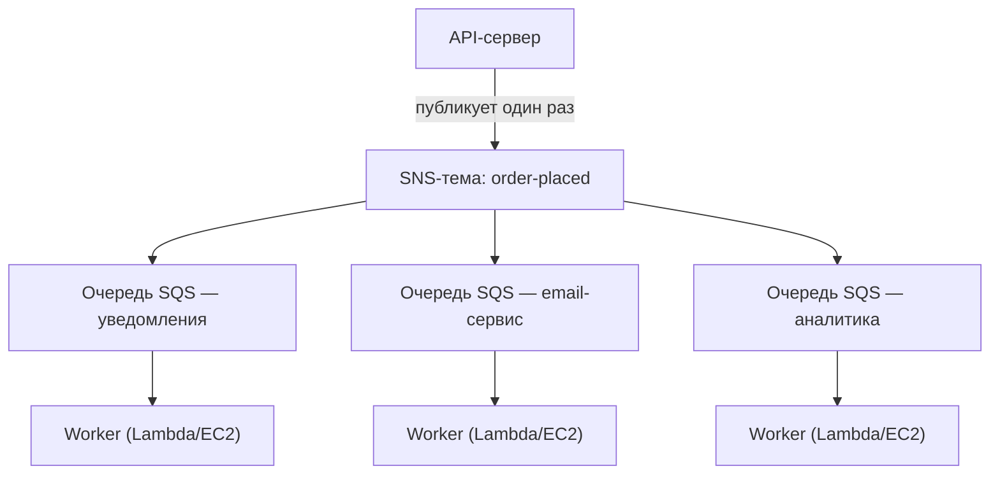

# Глава 19: Талонная машина

Талонная машина была тихой революцией. Возьми номер, жди вызова. Линия превратилась в очередь. Люди могли присесть. Сервисная стойка работала в своём темпе. Никто никого не блокировал.

До талонной машины приходилось стоять в линии. Ваше место в линии требовало вашего физического присутствия. Вы не могли делать ничего другого, пока ждали. И если человек в начале линии был медленным, все позади него останавливались.

Талонная машина отделила прибытие от обслуживания. Вы прибывали, брали номер, и система запоминала ваше место. Вы могли пойти присесть. Сервисная стойка отрабатывала номера в любом темпе, который могла осилить. Если стойка была временно закрыта, новоприбывшие всё равно получали номера. Они ждали. Работа не исчезала — она вставала в очередь.

Это маленькое изобретение — один из старейших примеров развязывания в человеческих системах. К концу этой главы Nimbus построит свою собственную талонную машину — в программном обеспечении — и причина, по которой она ему понадобилась, начинается с шестнадцати минут простоя в пятницу вечером.

---

Команда пережила сбой AZ. Лео исправил процесс хаотической инженерии, и руководство по запуску было надёжным. Трафик восстановился и снова рос — на самом деле быстрее, чем раньше. Документация по Aurora, которую Лео читал поздно ночью, была всё ещё на несколько глав впереди того, где Nimbus был на самом деле.

Но с ростом трафика и подключением новых ресторанов становился виден другой вид узкого места. Не в инфраструктуре. В самом коде приложения. Цепочка запросов, которая прекрасно работала при 200 заказах в час, начинала показывать напряжение при 800.

А затем наступил вечер 14-го.

---

Всё началось с аналитического дашборда. В 18:47 в пятницу деплой в сервис аналитики внёс баг с таймаутом. Сервис начал отвечать за 8 секунд вместо обычных 200 миллисекунд.

Поток заказов был синхронным. Каждый заказ ждал сервис аналитики, прежде чем подтвердить клиенту. Восемь секунд стали 12 по мере роста нагрузки. Пул соединений API начал заполняться запросами, ждущими завершения шага аналитики.

В 18:53 пул соединений достиг своего предела. Новые запросы начали немедленно проваливаться — не потому, что заказ нельзя было обработать, а потому, что не было доступного соединения, чтобы начать его обработку.

«Сервис аналитики обрушил поток заказов», — сказал Лео, глядя на логи на следующее утро. «Они не имеют друг к другу никакого отношения. Сервис аналитики просто рассчитывает дашборды».

«Но они в одной цепочке запросов», — сказала Прия.

«Шестнадцать минут простоя», — сказала Майя. «И с трёх клиентов списали деньги дважды».

Двойное списание было хуже простоя. В хаосе насыщения пула соединений механизм повторных попыток сработал для некоторых запросов, которые на самом деле прошли успешно — шаг оплаты завершился, затем запрос истёк по таймауту до возврата, и повтор попробовал оплату снова. Та же карта, та же сумма, два списания.

«Механизм повторных попыток должен был помочь», — сказал Лео.

«Он помог в неправильном направлении», — сказала Прия. «И подумали ли мы о том, что происходит, когда мы пытаемся вернуть деньги этим клиентам? Процесс возврата использует тот же поток заказов, который провалился».

Шестнадцать минут простоя и три двойных списания. Это была бизнес-стоимость синхронной цепочки запросов.

---

У Nimbus была проблема, которая не ощущалась как проблема — до тех пор, пока заказы не стали популярными.

Каждый раз, когда размещался заказ, API-сервер должен был:

1. Сохранить заказ в базу данных
2. Отправить уведомление на планшет ресторана
3. Отправить подтверждение по электронной почте клиенту
4. Обновить аналитический дашборд ресторана
5. Зафиксировать событие для биллинга

На оживлённом гастрономическом прилавке человек у кассы не ждёт, пока резчик закончит нарезать, прежде чем перейти к следующему клиенту. Он принимает заказ, передаёт его на кухню и начинает обслуживать следующего. Кухня работает с заказами в своём темпе. Клиент получает более быстрое обслуживание. Кухня не перегружается внезапными всплесками. Если на кухне медленный момент, заказы накапливаются за прилавком, а не вызывают ошибки у кассы.

Это была аналогия. У Nimbus не было кассы и кухни. У него был один человек, делавший всё последовательно, прежде чем клиент мог уйти.

И 14-го у человека, нарезавшего мясо, возникла проблема. Поэтому прилавок остановился. Поэтому каждый клиент после этого ждал. Кухня, касса, клиенты — все приостановились, потому что один шаг в цепочке замедлился.

Исправление было не в том, чтобы ускорить нарезку мяса. Исправление было в том, чтобы разделить шаги. Принять заказ у кассы, передать талон, позволить кухне работать.

«Мы тесно связаны», — сказала Прия. «Если любой последующий шаг не удастся, весь заказ не проходит. Подумали ли мы о том, что происходит, если сервис аналитики компрометируется и начинает потреблять некорректно сформированные сообщения? Весь заказ проваливается — потому что мы ждём его».

«Что если мы сможем сохранить заказ и сразу подтвердить клиенту», — сказал Лео, — «а потом обрабатывать остальное в фоне?»

«Это очередь», — сказала Прия.

Ключевое понимание: клиенту не нужно знать, что аналитический дашборд был обновлён, прежде чем он получит своё подтверждение. Ему нужно знать, что его заказ получен. Это разные вещи. Синхронная цепочка смешала их.

**Модель развязывания**

Это **развязывание**: разделение компонента, принимающего работу, от компонентов, обрабатывающих её.

Все шаги в потоке заказов Nimbus должны были происходить синхронно, прежде чем API мог ответить клиенту. Если сервис электронной почты работал медленно (иногда так и было), клиент ждал. Если аналитический дашборд был недоступен (иногда так и было), заказ не проходил.

Каскад 14-го продемонстрировал именно то, почему это имело значение. Сервис аналитики не имел никакого отношения к тому, был ли принят заказ клиента. Но поскольку он сидел в той же синхронной цепочке, его сбой стал сбоем для всех.

В программных системах очередь часто представляет собой брокер сообщений — сервис, который принимает сообщения от производителей и доставляет их потребителям.

Вы можете задаться вопросом: если поток заказов теперь асинхронный, как клиент узнаёт, что его заказ действительно получен? Ответ — в проектировании архитектуры: API сохраняет заказ в базу данных (синхронно — это авторитетное подтверждение), затем публикует события в очередь. Подтверждение клиента основано на успешной записи в базу данных, а не на завершении последующих сервисов. Если сервис электронной почты медленный, у клиента уже есть его подтверждение. Email — это просто приятное дополнение.

**Amazon SQS: очередь**

**Amazon SQS (Simple Queue Service)** — это управляемый сервис очереди сообщений AWS. Он надёжно хранит сообщения до их обработки потребителем.

Основной поток:

1. **Производитель** (API-сервер) помещает сообщение в очередь: `{ "orderId": "ORD-5532", "restaurantId": "47", "items": [...] }`
2. API немедленно отвечает клиенту: «Заказ подтверждён!»
3. **Потребители** (отдельные рабочие сервисы) читают сообщения из очереди и обрабатывают их: отправляют уведомление ресторану, отправляют подтверждающее письмо, обновляют аналитику

Опыт клиента: мгновенное подтверждение. Последующая обработка: происходит асинхронно, в темпе рабочих.

**Ключевые концепции SQS**

**Таймаут видимости сообщения**: Когда потребитель читает сообщение из SQS, сообщение становится *невидимым* для других потребителей на некоторое время (по умолчанию: 30 секунд). Это даёт потребителю время обработать его. Если потребитель завершает работу успешно, он удаляет сообщение. Если потребитель падает, таймаут видимости истекает и сообщение снова становится видимым для другого потребителя для повтора.

Это обеспечивает доставку хотя бы один раз: каждое сообщение будет обработано хотя бы один раз, даже если потребитель выйдет из строя в процессе обработки.

Вы можете задаться вопросом: если сообщение становится невидимым во время обработки, но не удаляется, когда потребитель падает, не может ли оно быть обработано дважды? Да — и это называется доставкой хотя бы один раз. Это означает, что каждый потребитель должен быть спроектирован так, чтобы справляться с получением одного и того же сообщения более одного раза, не вызывая проблем. Дублированное письмо с подтверждением заказа раздражает. Дублированное списание — это обращение в поддержку. Проектируйте своих потребителей соответственно.

Таймаут видимости должен быть длиннее, чем ваше самое длинное ожидаемое время обработки. Если обработка обычно занимает 20 секунд, но иногда занимает 90 секунд, а ваш таймаут видимости 30 секунд, эта случайная 90-секундная обработка будет выглядеть для SQS как сбой. Сообщение снова становится видимым. Второй потребитель подхватывает его. Теперь два рабочих обрабатывают одно и то же сообщение. Если ваша обработка не идемпотентна, у вас проблема.

Распространённая ошибка: установить таймаут видимости равным среднему времени обработки. Правильный подход: установить его на время обработки 99-го процентиля, с запасом прочности. Если время обработки P99 — 45 секунд, установите таймаут видимости на 90 секунд.

**Очереди недоставленных сообщений (DLQ)**: Если обработка сообщения не удаётся слишком много раз (настраивается — например, 5 попыток), SQS перемещает его в очередь недоставленных сообщений. Вы проверяете DLQ, чтобы понять, почему сообщения не обрабатываются, не теряя их.

DLQ — это место, где вы узнаёте, что на самом деле проваливается в производстве. Без неё неудавшиеся сообщения просто исчезают, и у вас нет способа провести расследование.

Через три недели после миграции на SQS Лео заметил, что в DLQ сервиса уведомлений накопилось 23 сообщения. Он не проверял DLQ (он настроил её правильно, а затем предположил, что она останется пустой).

Он вытащил одно сообщение и посмотрел на его содержимое:

```json
{
  "orderId": "ORD-9821",
  "restaurantId": "12",
  "customerMessage": "Extra spicy please 🌶️🔥",
  "timestamp": "2024-01-18T19:43:11Z"
}
```

Эмодзи. Сервис уведомлений ресторана кодировал содержимое сообщений как Latin-1 перед отправкой в legacy API планшета ресторана. Символы эмодзи — по четыре байта каждый в UTF-8 — повреждались, заставляя API планшета отклонять запрос. Сообщение повторялось, снова проваливалось, повторялось снова, снова проваливалось. После 5 попыток SQS перемещал его в DLQ.

«Во всех 23 сообщениях есть эмодзи в поле заметок клиента», — сказал Лео.

«Значит, у каждого клиента, добавившего эмодзи в заметки к заказу, его заметка тихо не доходила до ресторана», — сказала Майя.

«Да».

«Как долго?»

Лео проверил временную метку самого старого сообщения. «Три недели».

Прия молчала. «А что, если кто-то сообразил, что добавление эмодзи в заметку к заказу вызывает тихий сбой? Можно было бы размещать заказы с эмодзи и гарантировать, что ресторан никогда не увидит инструкцию. А потом жаловаться на неправильный заказ».

Никто этого не эксплуатировал. Но это был правильный вопрос.

Лео исправил баг с кодировкой. Затем он написал скрипт, чтобы воспроизвести все 23 застрявших сообщения из DLQ. Рестораны получили свои (трёхнедельной давности) острые эмодзи-инструкции. Клиенты так и не узнали.

Урок: DLQ нужно активно мониторить, а не настроить и забыть. Растущая DLQ — это тихий сигнал, что что-то повторно проваливается.

**Типы очередей**:

**Стандартные очереди**: Максимальная пропускная способность (неограниченное количество сообщений в секунду). Порядок доставки — на основе лучших усилий (не гарантирован). Доставка хотя бы один раз (в очень редких случаях сообщение может быть доставлено дважды).

**Очереди FIFO**: Строгий порядок «первый вошёл — первый вышел». Ровно однократная **обработка** — дедупликация на основе `MessageDeduplicationId` в течение 5-минутного окна. Порядок гарантирован *в пределах* `MessageGroupId`: сообщения в одной группе приходят по порядку; разные группы могут обрабатываться параллельно — именно так FIFO масштабируется. Базовая пропускная способность — 3 000 сообщений в секунду с батчингом (300 без); включение **режима высокой пропускной способности** поднимает это до десятков тысяч в секунду путём разбиения по группам сообщений. Используйте FIFO, когда порядок важен (финансовые транзакции, последовательные изменения состояния).

Если вам нужна максимальная пропускная способность и вы можете терпеть случайные дублирующиеся сообщения, используйте SQS Standard — но вы должны спроектировать каждого потребителя так, чтобы он справлялся с дубликатами без проблем. Если вам нужен строгий порядок и однократная обработка, используйте SQS FIFO — и хорошо проектируйте ваши `MessageGroupId`, потому что параллелизм (а значит, и пропускная способность) приходит от наличия многих групп.

Для Nimbus большинство очередей использовали стандартные очереди. Очередь биллинга использовала FIFO для обеспечения обработки начислений по порядку.

**Автомасштабирование по глубине очереди: масштабирование рабочих под объём бэклога**

Одно из самых мощных применений SQS — использование глубины очереди как триггера автомасштабирования. Вместо масштабирования на основе CPU или памяти вы масштабируете на основе того, сколько работы ждёт.

Для сервиса уведомлений Nimbus: глубина очереди SQS (количество сообщений, ждущих обработки) была подключена к политике Application Auto Scaling для сервиса ECS, запускающего рабочих уведомлений.

Политика: когда в очереди больше 50 сообщений на одну рабочую задачу, добавить задачу. Когда в очереди меньше 10 сообщений на одну рабочую задачу, удалить задачу.

Практический эффект: когда 1 200 заказов обрушились на пятничный вечерний пик, глубина очереди уведомлений подскочила, и флот рабочих масштабировался с 2 задач до 8 задач в течение 3 минут. К полуночи очередь была пуста, и флот вернулся к 2.

«Сколько это стоит в месяц?» — спросил Том, глядя на график автомасштабирования.

«Ничего дополнительного за само автомасштабирование», — сказал Лео. «Но 6 дополнительных задач ECS на 3 часа в пятничные вечера — это ощутимо».

Том посчитал. «Около $14/месяц за эти пики. А раньше мы непрерывно запускали 8 задач по полной стоимости?»

«Да».

«Значит, мы платим за всплеск, когда он нам нужен, и ничего в остальное время».

Это паттерн масштабирования по глубине очереди: очередь становится буфером, поглощающим всплески трафика, а флот рабочих масштабируется, чтобы осушить буфер. Пользователи не испытывают замедления — они получили своё подтверждение немедленно, когда заказ был принят. Рабочие просто немного дольше нагоняют. И поскольку вы не запускаете пиковую мощность 24/7, затраты значительно ниже.

**Amazon SNS: вещатель**

**Amazon SNS (Simple Notification Service)** — это сервис сообщений типа публикация/подписка (pub/sub). Вместо одного производителя, одного потребителя (очередь), SNS поддерживает одно сообщение, доставляемое *многим* подписчикам одновременно.

Модель:

1. **Публикатор** отправляет сообщение в **тему** SNS
2. Все **подписчики** этой темы получают сообщение одновременно (веерная рассылка)

Подписчиками могут быть:

- Очереди SQS (поместить сообщение в очередь для асинхронной обработки)
- Lambda-функции (запустить функцию напрямую)
- Конечные точки HTTP/HTTPS (доставка webhook)
- Адреса электронной почты
- SMS (номера телефонов)

Для Nimbus событие размещения заказа публикуется в тему SNS с именем `order-events`:

- Сервис уведомлений ресторана подписывается (получает в своей очереди SQS)
- Сервис электронной почты подписывается (получает в своей очереди SQS)
- Сервис аналитики подписывается (получает в своей очереди SQS)
- Сервис биллинга подписывается (получает в своей очереди FIFO SQS)

Одно событие заказа. Четыре подписчика. Все уведомлены одновременно. Каждый обрабатывает в своём темпе.

«Значит SNS — это объявление», — сказала Майя, — «а SQS — это ящик входящих, где каждая команда обрабатывает объявление в своём темпе. Тогда зачем использовать оба? Почему просто не подписать всех на тему SNS напрямую?»

«Потому что прямая доставка SNS работает по принципу „выстрелил и забыл“», — сказал Лео. «Если сервис аналитики недоступен, когда SNS срабатывает, это сообщение пропало. С очередью SQS между ними сообщение ждёт, пока сервис не восстановится».

«Именно», — сказала Прия. «Веерная рассылка SNS/SQS — стандартный паттерн».

**Паттерн веерной рассылки SNS/SQS**

Эта комбинация — тема SNS, питающая несколько очередей SQS — является одним из наиболее важных архитектурных паттернов в AWS:



Каждая очередь независима. Сервис аналитики может работать медленно — его очередь заполняется, но сервисы уведомлений и электронной почты продолжают работать без помех. Если сервис аналитики выходит из строя, его сообщения ждут в очереди, пока он не восстановится. Ничего не теряется.

Это ключевое свойство: **независимый сбой**. Проблемы в одном потребителе не распространяются на других.

**Фильтрация сообщений: не каждое сообщение для каждого подписчика**

По мере роста систем вы не хотите, чтобы каждый подписчик обрабатывал каждое сообщение. Сервис аналитики не должен получать сообщения о неудачной обработке платежей, если его интересуют только выполненные заказы.

**Фильтрация сообщений SNS** позволяет подписчикам указывать политики фильтрации — доставлять только сообщения, соответствующие определённым атрибутам.

Сервис уведомлений ресторана подписывается с фильтром: только сообщения где `status = "confirmed"`.

Сервис оповещений об ошибках подписывается с фильтром: только сообщения где `status = "failed"`.

Каждый подписчик получает только то, что ему нужно.

Без фильтрации каждый подписчик получает каждое сообщение и должен игнорировать неважное. Это тратит обработку, тратит деньги (SQS взимает плату за сообщение) и вносит шум. Система заказов с высоким объёмом без фильтрации затопила бы очередь оповещений об ошибках успешными заказами — делая реальные сбои трудными для нахождения.

Политики фильтрации выглядят так:

```json
{
  "status": ["confirmed"],
  "region": ["us-west-2", "us-east-1"]
}
```

Этот подписчик получает только сообщения, где status равен "confirmed" И region равен либо "us-west-2", либо "us-east-1". Сообщения, не соответствующие политике, вообще не доставляются в очередь этого подписчика — они даже не достигают SQS.

«Значит, фильтрация происходит на уровне SNS», — сказала Прия, — «до того, как сообщения записываются в SQS?»

«Верно. Очередь SQS для сервиса уведомлений ресторана видит только те сообщения, на которые ей нужно реагировать».

«А что, если кто-то попытается взломать, опубликовав специально сформированное сообщение в тему SNS, которое соответствует всем фильтрам подписчиков?» — спросила Прия.

У темы SNS была IAM-политика ресурса: публиковать разрешалось только сервису order API (по его IAM-роли). Политики доступа SNS и политики очередей SQS формировали уровень контроля доступа — фильтрация была только для маршрутизации, а не для безопасности.

**Когда использовать SQS против SNS**

**Только SQS**: Один производитель, один потребитель (или несколько конкурирующих потребителей на той же очереди). Сообщения нужно обработать один раз, по порядку (FIFO) или нет (стандартный). Паттерн рабочей очереди — одна очередь, несколько рабочих, потребляющих из неё.

**Только SNS**: Уведомления «выстрелил и забыл». Отправить на email, SMS или HTTP-конечные точки. Нет необходимости ставить сообщение в очередь — просто уведомить и двигаться дальше.

**SNS + SQS (веерная рассылка)**: Одно событие, несколько независимых потребителей. У каждого потребителя своя очередь, он обрабатывает независимо и может независимо выйти из строя.

## Темы SNS FIFO

Всё вышесказанное о SNS использует стандартные темы — у них фактически неограниченная пропускная способность, они доставляют подписчикам почти одновременно и справляются с работой для подавляющего большинства сценариев использования.

Но стандартные темы SNS не гарантируют порядок. Если вы публикуете десять сообщений последовательно, подписчики могут получить их в немного другом порядке. Для уведомлений о заказах Nimbus это нормально — обновление аналитики, прибывающее на долю секунды раньше подтверждения по email, не имеет значения.

Для некоторых сценариев это имеет значение. Рассмотрим финансовую книгу учёта: если два события — кредит, а затем дебет — доставлены в обратном порядке, расчёты баланса во время обработки будут неправильными, даже если оба события в конечном счёте обработаны корректно.

**Темы SNS FIFO** применяют тот же принцип, что и очереди SQS FIFO, к модели веерной рассылки. Сообщения доставляются подписчикам в точном порядке, в котором они были опубликованы, и каждое сообщение доставляется ровно один раз.

Компромисс: темы SNS FIFO имеют пропускную способность, схожую с базовой у SQS FIFO (3 000 сообщений в секунду на тему; 300 в секунду на группу сообщений — с режимом высокой пропускной способности, доступным с 2025 года для гораздо большего), и они веерно рассылают только в **очереди SQS** — FIFO или, с 2023 года, Standard. Подписка стандартной очереди полезна для потребителей, которым не важен порядок (например, аналитическая лента), но порядок и однократность сохраняются от начала до конца **только** в очереди FIFO. Вы не можете использовать тему SNS FIFO для доставки на HTTP-конечные точки или адреса электронной почты.

Для биллингового конвейера Nimbus — где последовательность обновлений цен должна была применяться к ресторанным аккаунтам по порядку — биллинговая тема SNS была мигрирована со стандартной на FIFO. Биллинговая очередь SQS уже была FIFO. Теперь веерная рассылка гарантировала, что событие повышения цены никогда не прибудет в биллинговый процессор раньше события начала периода, от которого оно зависело.

> **Совет для экзамена — SNS FIFO**
>
> Если сценарий требует **упорядоченной веерной доставки** между несколькими подписчиками, ответ — **SNS FIFO**. Стандартный SNS не гарантирует порядок. SNS FIFO веерно рассылает только в очереди SQS — чтобы сохранить порядок и однократность от начала до конца, подписчиком должна быть очередь SQS **FIFO** (подписки стандартной очереди разрешены, но получают порядок по лучшим усилиям и доставку хотя бы один раз). Пропускная способность по умолчанию — 3 000/сек на тему — если сценарий описывает гораздо больший объём *и* строгий порядок, это сигнал посмотреть на альтернативные архитектуры (например, Kinesis, который рассматривается в одной из последующих глав).

## Когда legacy-очередь не отпускает

Nimbus вот-вот должен был закрыть свою крупнейшую сделку: Barato, конкурента по доставке еды с 200 ресторанами и двухлетней форой в операциях. Инженерная команда назначила звонок по планированию интеграции.

Звонок длился двадцать минут, прежде чем Лео замолчал.

«Их система обработки заказов», — сказал он. «На чём она работает?»

«ActiveMQ», — сказал инженер Barato на другом конце. «Локальный брокер. Приложение на Java. Оно работает с 2018 года. Всё говорит на AMQP».

«AMQP», — сказал Лео.

«Да».

Он посмотрел на архитектурную диаграмму на своём экране. Nimbus работал на SQS и SNS. SQS не говорит на AMQP. SNS не говорит на AMQP. Приложение Barato не говорило ни на чём другом.

«Переписывание займёт шесть месяцев», — сказал Лео команде после звонка. «Как минимум».

«Мы не можем отложить сделку на шесть месяцев», — сказала Майя.

«И мы не можем запускать bare-metal-брокер ActiveMQ в AWS», — добавила Прия. «Подумали ли мы о том, как это выглядит с точки зрения безопасности и надёжности? Самоуправляемый брокер сообщений, сидящий в продакшене, без управляемого патчинга, без автоматического переключения, подключённый к нашей инфраструктуре?»

«Есть управляемый вариант», — медленно сказал Лео. Он читал, пока они говорили. «Amazon MQ».

**Amazon MQ: управляемый брокер**

**Amazon MQ** — это управляемый сервис брокера сообщений для Apache ActiveMQ и RabbitMQ. Он запускает ваш существующий брокер — тот самый брокер, к которому ваши приложения были подключены годами — но как управляемый сервис AWS. AWS обрабатывает базовую инфраструктуру: предоставление, патчинг, переключение, резервные копии.

Ключевое свойство, делающее Amazon MQ отличным от SQS и SNS: он говорит на протоколах, на которых говорят legacy-брокеры сообщений. AMQP, STOMP, MQTT, OpenWire, NMS. Протоколы, которые SQS и SNS просто не понимают.

Для интеграции Barato план был прямолинейным. AWS запустит брокер Amazon MQ, настроенный как ActiveMQ. Java-приложение Barato будет направлено на новую конечную точку брокера вместо локальной. Изменение на стороне приложения: обновить один файл конфигурации новой строкой подключения. Вот и всё. Приложению не нужно было знать, что оно говорит с управляемым облачным брокером вместо сервера в офисе Barato.

«Подожди», — сказала Майя. «Если мы в конце концов интегрируем их в Nimbus, не стоит ли просто мигрировать их на SQS с самого начала?»

«Потому что путь миграции существует», — сказал Лео. «И его стоит проделать как следует — в конце концов. Но прямо сейчас нам нужно, чтобы Barato был работоспособен на инфраструктуре AWS за тридцать дней, а не за шесть месяцев. Amazon MQ заставляет приложение работать без изменения приложения. Затем у нас есть время спланировать миграцию на SQS как обдуманный проект, а не как спешно собранную предпосылку для сделки».

«Сколько это стоит в месяц?» — спросил Том.

Брокер Amazon MQ — одна активно-резервная пара для надёжности — был в диапазоне $200/месяц для брокера, подходящего под объём Barato. По сравнению со стоимостью шести месяцев времени на переписывание, это не было предметом спора.

Прия одобрила план с одним условием: экземпляр Amazon MQ будет жить в приватной подсети, с правилами групп безопасности, разрешающими соединения только с серверов приложений Barato. Никакого публичного доступа. Аудит-логирование включено.

Миграция заняла двенадцать дней. Приложение Barato подключилось к Amazon MQ на тринадцатый день. На четырнадцатый день оно обработало свой первый заказ на инфраструктуре AWS без единого изменения кода.

---

> **Совет для экзамена — Amazon MQ**
>
> *Домен SAA-C03: Проектирование устойчивых архитектур (Домен 2)*
>
> Экзамен отличает Amazon MQ от SQS и SNS по единственной оси: **совместимость протоколов**. Если сценарий описывает приложение, которое уже использует брокер сообщений и говорит на конкретном протоколе, Amazon MQ почти наверняка является ответом.
>
> Ключевые сигналы: **«ActiveMQ», «RabbitMQ», «AMQP», «STOMP», «MQTT», «OpenWire»** или любая фраза, эквивалентная **«без изменения кода приложения»**. Если вы видите эти фразы, ответ — Amazon MQ, а не SQS, не SNS.
>
> Если сценарий описывает *новое* приложение, которому нужно развязывание, или не упоминает legacy-брокер или конкретный протокол, используйте SQS/SNS.
>
> Ещё один сигнал: «мигрировать существующий локальный брокер сообщений в AWS». Если приложению нужно продолжать говорить на том же протоколе с тем же типом брокера, Amazon MQ — это ответ lift-and-shift.

## Сильные стороны и ограничения

**Почему SQS и SNS мощны**:

- SQS обеспечивает надёжную и достоверную доставку сообщений — сообщения хранятся в нескольких AZ
- Развязывание позволяет независимое масштабирование и развёртывание сервисов производителя и потребителя
- Очереди недоставленных сообщений гарантируют, что ни одно сообщение не будет тихо потеряно при сбое
- Паттерн веерной рассылки SNS позволяет добавлять новых потребителей без изменения производителя

**Где всё усложняется**:

- Доставка хотя бы один раз означает, что потребители должны быть *идемпотентными* — обработка одного и того же сообщения дважды не должна вызывать проблем (дублированные заказы, дублированные начисления)
- Очереди FIFO дороже и имеют ограничения пропускной способности
- Отладка неудачных сообщений по нескольким очередям и сервисам требует хорошего логирования и наблюдаемости
- Гарантии порядка сообщений ограничены — если строгий порядок важен для нескольких сервисов, дизайн усложняется

**Идемпотентность: практическое погружение**

Идемпотентность звучит абстрактно, пока с трёх клиентов не списали деньги дважды.

Операция **идемпотентна**, если её многократный запуск даёт тот же результат, что и однократный запуск. Операция списания не идемпотентна по природе: запуск её дважды списывает дважды. Идемпотентная операция списания проверяет, было ли списание уже обработано, прежде чем пытаться его выполнить.

Паттерн: каждое сообщение несёт уникальный ID (ID заказа или отдельный ID сообщения). Перед обработкой потребитель проверяет хранилище (DynamoDB хорошо для этого подходит), чтобы увидеть, было ли это сообщение уже успешно обработано. Если да: ничего не делать, удалить сообщение. Если нет: обработать, записать ID, удалить сообщение.

```python
def process_charge(message):
    order_id = message['orderId']
    
    # Проверка идемпотентности
    if already_processed(order_id):
        logger.info(f"Order {order_id} already charged, skipping duplicate")
        return  # Сообщение будет удалено из очереди
    
    # Обработка списания
    charge_result = payment_service.charge(
        amount=message['amount'],
        card_token=message['cardToken'],
        idempotency_key=order_id  # Также передаём процессору платежей
    )
    
    # Записываем, что мы это обработали
    mark_as_processed(order_id, charge_result)
```

Ключ идемпотентности следует также передавать последующим сервисам (процессорам платежей, системам электронной почты), которые его поддерживают. Stripe, например, принимает заголовок `Idempotency-Key`, который предотвращает дублированные списания, даже если один и тот же API-вызов сделан дважды.

«А что насчёт correlation ID?» — спросила Прия. «Когда сообщение проходит через несколько сервисов, как мы отслеживаем, какой запрос вызвал какое последующее действие?»

**Correlation ID: отслеживание между сервисами**

Когда клиент размещает заказ, запрос проходит через: API → SNS → SQS → рабочий уведомлений → API планшета ресторана → SQS → рабочий email → SES.

Без correlation ID, если API планшета ресторана возвращает ошибку на шаге 6, логи в каждом сервисе показывают событие, но нет способа отследить его обратно к конкретному заказу клиента с самого начала.

**Correlation ID** — это уникальный идентификатор, прикреплённый к исходному запросу и передаваемый через каждое взаимодействие сервисов. Каждый сервис включает correlation ID в свои логи.

Когда Прия ищет в CloudWatch конкретный correlation ID, она получает каждую строку лога — по всем сервисам — которая была частью обработки этого единственного заказа.

«Одна оговорка», — сказала Прия. «Correlation ID приходят извне. Может ли кто-то внедрить вредоносный ID и нарушить наше логирование?»

Correlation ID внутренние — они не влияют на логику обработки, только на логирование. Их санитизация (буквенно-цифровые, фиксированной длины) предотвращает атаки внедрения в выводе логов.

**Когда развязывание — неправильный выбор**

«Подожди — но *почему* нам не развязать всё?» — спросила Майя.

Это был справедливый вопрос. Если развязывание предотвращает каскадные сбои и делает системы устойчивыми, почему не применять его везде?

Потому что у развязывания есть издержки. И есть сценарии, где эти издержки перевешивают выгоды.

**Когда вам нужна немедленная согласованность**: Если платёж должен быть подтверждён до того, как заказ может продолжиться — и пользователь ждёт на экране результата — вы не можете поместить платёж в асинхронную очередь и вернуть подтверждение до того, как узнаете, прошло ли списание успешно. Пользователь может заказать дважды, прежде чем первое списание завершится. Асинхронное развязывание не работает для операций, где ответ зависит от результата.

**Когда рабочий процесс по своей природе последователен**: Если шаг 3 должен увидеть результат шага 2, чтобы принять решение, они не могут выполняться параллельно из очереди. Принудительное помещение их в очередь создаёт неуклюжий механизм передачи результата, который часто оказывается сложнее синхронной версии.

**Когда порядок сообщений критичен, а объём низкий**: SQS Standard не гарантирует порядок. SQS FIFO гарантирует, но по умолчанию ограничен 3 000 сообщениями в секунду с батчингом (режим высокой пропускной способности существенно это поднимает). Если у вас низкообъёмный, строго упорядоченный рабочий процесс, простая синхронная очередь (например, блокировка строки базы данных) может быть проще и надёжнее.

**Когда накладные расходы превышают выгоду**: Маленький внутренний инструмент с одним пользователем и без SLA, вероятно, не нуждается в веерных темах SNS и DLQ. Операционные накладные расходы на мониторинг очередей и DLQ реальны. Подгоняйте архитектуру под проблему.

Вопрос не в том, «следует ли мне это развязать?» Вопрос в том, «какова стоимость этой связанности, и снижает ли развязывание эту стоимость больше, чем добавляет?»

## Итоги

Развязывание — это принцип устойчивости из главы 18, применённый к внутренней архитектуре: так же как Multi-AZ устраняет единые точки отказа в инфраструктуре, SQS и SNS устраняют единые точки отказа в цепочках запросов.

- **Развязывание** разделяет компоненты, производящие работу, от компонентов, обрабатывающих её.
- **SQS** даёт производителям надёжное место, куда поместить работу, когда потребители медленны, офлайн или масштабируются.
- **SNS** позволяет одному событию достичь нескольких независимых потребителей, при этом публикатор не знает, кто они.
- **Веерная рассылка SNS + SQS** позволяет каждому последующему сервису обрабатывать одно и то же событие в своём темпе.
- **DLQ, идемпотентность и correlation ID** — это операционная дисциплина, которая делает асинхронные системы отлаживаемыми, а не загадочными.
- **Не развязывайте слепо**: синхронные рабочие процессы, требования немедленной согласованности и маленькие низкорисковые инструменты могут не оправдывать добавленную операционную поверхность.

## Советы по экзамену

*Домен SAA-C03: Проектирование устойчивых архитектур (Домен 2, Задача 2.1)*

- **SQS Standard против FIFO**: Экзамен различает по гарантиям порядка и доставки. «Должны обрабатывать по порядку» → FIFO. «Максимальная пропускная способность» → Standard.
- **Автомасштабирование по глубине очереди**: «Масштабировать рабочих на основе глубины очереди» → метрика SQS (ApproximateNumberOfMessagesVisible), используемая с Application Auto Scaling или ECS Service Auto Scaling.
- **Таймаут видимости**: Ключевая концепция для доставки хотя бы один раз. Если потребитель выходит из строя, сообщение снова становится видимым после таймаута. Сценарий экзамена: «сообщения обрабатываются дважды» → таймаут видимости слишком короткий (потребитель занимает больше времени для обработки, чем таймаут).
- **Очередь недоставленных сообщений**: Сообщения, не прошедшие N попыток, перемещаются сюда. Сценарий экзамена: «гарантировать, что ни одно сообщение не потеряно, даже если обработка продолжает не удаваться» → DLQ.
- **Веерная рассылка SNS**: Классический паттерн экзамена для одного события, запускающего несколько потребителей. «Уведомление о размещении заказа должно одновременно запускать email, SMS и обновление склада» → тема SNS с подписками SQS.
- **SQS + Lambda**: Lambda может быть настроена опрашивать очередь SQS и запускаться при каждом пакете сообщений. Экзамен использует это для событийно-управляемой обработки в масштабе.
- **Длинный опрос SQS**: Вместо того чтобы потребители опрашивали каждые несколько секунд (короткий опрос, тратящий API-вызовы), длинный опрос ждёт до 20 секунд для сообщения. Снижает затраты и ложные пустые ответы.
- **Расширенная клиентская библиотека SQS**: Для сообщений больше предела полезной нагрузки очереди (256 КБ по умолчанию; повышается до 1 МБ с 2025 года) используйте SQS Extended Client Library, которая хранит тело сообщения в S3 и отправляет ссылку через SQS. Экзамен всё ещё трактует 256 КБ как предел SQS — «сообщение SQS слишком большое» → Extended Client Library + S3.
- **Фильтрация сообщений SNS**: Подписчики получают только сообщения, соответствующие их политике фильтрации. Сценарий экзамена: «отправлять подписчику только уведомления, соответствующие определённым критериям» → фильтрация сообщений SNS.
- **Примечание**: Веерная рассылка SNS/SQS также появляется в сценариях Домена 3 о высокопроизводительных архитектурах асинхронной обработки. Знайте этот паттерн как для вопросов устойчивости, так и для вопросов производительности.
- **Сигналы Amazon MQ**: «ActiveMQ», «RabbitMQ», «AMQP», «STOMP», «MQTT», «OpenWire» или «без изменения кода приложения» → Amazon MQ, НЕ SQS. Если сценарий говорит о новом приложении, которому нужно развязывание → SQS/SNS.
- **SNS FIFO против Standard**: Стандартный SNS не гарантирует порядок. Если сценарий требует **упорядоченной веерной рассылки** → тема SNS FIFO, питающая очереди SQS FIFO. Помните: SNS FIFO не может доставлять на HTTP-конечные точки или email — только в очереди SQS (FIFO для порядка/однократности; стандартные подписки работают, но понижаются до порядка по лучшим усилиям и доставки хотя бы один раз).

## Упражнения

**Упражнение 1 — Запоминание**

Объясните паттерн веерной рассылки SNS/SQS. Почему паттерн использует очереди SQS вместо того, чтобы сервисы напрямую подписывались на тему SNS с HTTP-конечными точками?

*(Подсказка: подумайте о том, что происходит, если одна из HTTP-конечных точек недоступна, когда SNS публикует сообщение.)*

**Упражнение 2 — Сценарий SAA-C03**

*Сценарий*: Платформа электронной коммерции обрабатывает 10 000 заказов в час. Когда размещается заказ, система должна: (1) сохранить заказ в базу данных, (2) вычесть склад, (3) отправить подтверждающее письмо и (4) обновить аналитический дашборд. В настоящее время все четыре шага происходят синхронно — если сервис аналитики работает медленно, клиенты ждут. Команда хочет улучшить клиентское время отклика, гарантируя, что ни один заказ не будет потерян.

Какая архитектура НАИЛУЧШИМ образом решает это требование?

A) Использовать очереди SQS FIFO для обработки всех четырёх шагов по порядку  
B) Заставить API сохранить заказ и немедленно подтвердить клиенту; опубликовать событие в тему SNS; подписать сервисы склада, электронной почты и аналитики через очереди SQS  
C) Использовать параллельные экземпляры EC2 для обработки каждого шага одновременно синхронно  
D) Использовать API Gateway с валидацией запросов для ускорения обработки заказа

**Подсказка 1**: Подтверждение клиента должно быть немедленным. Какие шаги должны произойти до ответа, а какие могут произойти после?

**Подсказка 2**: Медленный сервис аналитики не должен влиять на сервисы электронной почты или склада.

**Подсказка 3**: Веерная рассылка SNS позволяет всем трём последующим сервисам получить событие одновременно.

**Ответ**: B

**Объяснение**: API сохраняет заказ в базу данных (синхронно — должно быть сделано до подтверждения) и немедленно возвращает подтверждение. Затем он публикует событие `order-placed` в тему SNS. Сервисы склада, электронной почты и аналитики подписываются каждый через независимые очереди SQS. Они обрабатывают в своём темпе — если аналитика медленная, её очередь растёт, но другие сервисы не затронуты. Если какой-либо сервис выходит из строя, его сообщения остаются в очереди SQS и повторяются; после настроенного числа неудачных попыток они перемещаются в DLQ.

**Почему не A?** Очереди FIFO обрабатывают сообщения по порядку — это не помогает с синхронным замедлением. Кроме того, последовательная обработка означает, что медленная аналитика всё равно блокирует электронную почту.

**Почему не C?** «Параллельные экземпляры EC2, обрабатывающие синхронно» по-прежнему требуют завершения всех шагов до ответа клиенту. Добавление экземпляров не решает проблему синхронной связанности.

**Почему не D?** API Gateway ускоряет маршрутизацию и валидацию API, но не развязывает последующие шаги обработки.

*Домен SAA-C03: Проектирование устойчивых архитектур — Задача 2.1*

**Упражнение 3 — Архитектурный вызов** *(Необязательно)*

Nimbus создаёт систему уведомлений для партнёров-ресторанов. Когда клиент размещает заказ, ресторану нужно уведомление через:

- Приложение для их планшета (push-уведомление)
- Систему отображения кухни (HTTP-webhook к их локальному оборудованию)
- Резервное SMS (если уведомление на планшет не удаётся)

Сервис уведомлений на планшете надёжен. Кухонный webhook иногда недоступен (рестораны выключают оборудование при закрытии). SMS должно срабатывать только при неудаче уведомления на планшет.

Спроектируйте архитектуру с использованием SNS и SQS. Как бы вы обрабатывали требование «SMS только при сбое планшета»? Как бы вы гарантировали, что кухонный webhook не блокирует уведомление планшета, когда он офлайн?

Подумайте также: какой таймаут видимости подходит для доставки кухонного webhook, если среднее время отклика webhook — 2 секунды, но рестораны с медленным оборудованием могут занимать до 30 секунд? Какая политика DLQ запустила бы резервное SMS после исчерпания повторных попыток webhook?

*(Нет единственно правильного ответа. Цель — практиковать проектирование веерной рассылки с условной маршрутизацией.)*

## Послесловие к главе

Новый поток заказов был запущен.

Лео развернул его во вторник днём, не запустив предварительно полный нагрузочный тест. «Всё будет хорошо», — сказал он Прие. «Архитектура надёжна».

Клиенты размещали заказы. API отвечал за 95 миллисекунд. Подтверждение немедленно появлялось на их телефонах.

За кулисами: четыре сервиса обрабатывали асинхронно. У сервиса аналитики была ошибка, вызывавшая его падение при заказах, содержащих определённые специальные символы в названии блюда. Его очередь за два часа накопила 3 200 сообщений.

Клиенты ничего не заметили.

Когда Лео исправил ошибку и сервис аналитики перезапустился, он обработал накопленные сообщения за 18 минут. Данные не были потеряны. DLQ была пустой.

Он обновил дашборд CloudWatch. Глубина очереди: 0. Обработано сообщений: 3 200. Ошибок: 0 (после исправления).

«Вот как выглядело бы 14-е», — сказал он. «У аналитики возникла проблема. Очередь поглотила её. Всё остальное продолжало работать».

«Вот что означает развязывание», — сказала Прия.

«Сколько это стоит в месяц?» — спросил Том, уже на странице цен.

«При нашем текущем объёме — около двенадцати долларов в месяц за SQS». Он уставился на экран. «Я ожидал больше».

У него был вид человека, обнаружившего, что что-то неожиданно дешёвое также неожиданно хорошее.

«Настрой оповещения DLQ», — напомнила Прия Лео. «Мы не хотим ещё трёх недель тихих сбоев».

«Уже сделано», — сказал Лео.

В этот раз он это сделал.

В следующей главе: функция, которая запускается только когда кто-то стучит, и ничего не стоит, когда нет.
