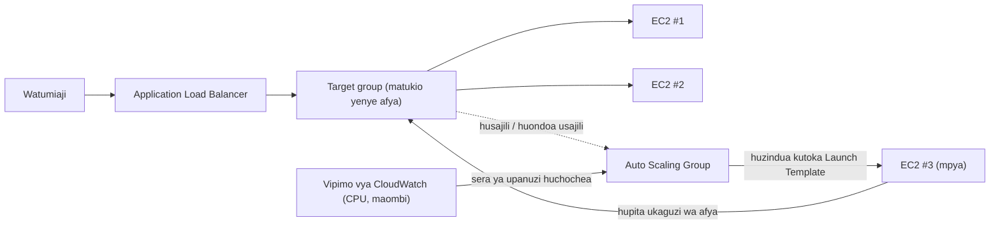

# Sura ya 7: Mgahawa Unaokua Wakati Unapokuwa na Shughuli

Ilikuwa saa 1:43 jioni ya Ijumaa.

Kiti cha Tom kilikuwa kimesukumwa nyuma kidogo, jinsi kilivyokuwa wakati alipokuwa akikodolea macho kitu kwa aina ya umakini iliyomaanisha kwamba hangejibu ukiongea naye. Ofisi ilikuwa imetoka saa moja iliyopita. Alikuwa amebaki.

Alikuwa na kichupo wazi kwa dashibodi ya vipimo ambacho aliionyesha upya jinsi watu wengine wanavyokagua mitandao ya kijamii — kwa silika, mara kwa mara, bila kukusudia kabisa.

Mgogoro wa hifadhi ulikuwa nyuma yao. Hifadhidata ilikuwa na diski yake. Picha ziliishi katika S3. Kwa wiki mbili, mfumo ulikuwa thabiti — si wa kusisimua, thabiti tu. Hilo lingepaswa kuhisi vizuri.

Kisha kiwango cha hitilafu kilivuka asilimia 12.

"Leo," Tom alisema.

Leo alikuwa tayari anaangalia. Nyakati za mwitikio: zikipanda. Maombi yaliyowekwa kwenye foleni: yakipanda. Tukio moja la EC2 — hata baada ya zoezi makini la mwezi uliopita la kupima ukubwa sahihi — lilikuwa kwa asilimia 94 ya CPU.

"Tunawageuza wateja," Tom alisema.

"Hatuwageuzi," Leo alisema. "Seva ndiyo inawageuza."

"Hicho ni kitu kile kile."

Kilikuwa. Na kilikuwa kikitokea kila Ijumaa kwa wiki tatu. Nimbus ilikuwa imeokoka mgogoro wa hifadhi — hifadhidata ilikuwa na diski yake, picha ziliishi katika S3 — lakini thabiti na inayoweza kupanuka ni matatizo tofauti kabisa. Mfumo ulifanya kazi. Hauukua tu.

Ujumbe wa Slack ulionekana kutoka Maya: *dashibodi inasema maagizo yameshuka asilimia 40 kutoka Ijumaa iliyopita. nini kinatokea?*

Tom alijibu: *seva imejaa uwezo. tunashughulikia.*

Dakika tatu zilipita.

Maya: *tuna mmiliki wa mgahawa anayepiga laini ya msaada akisema programu imevunjika.*

Leo alikuwa na mikono yake kwenye kibodi. Alikuwa akibadilisha ukubwa wa tukio — toleo la mkono la suluhisho, lile lililohitaji kusimamisha seva na kubadilisha aina ya tukio. Ambalo lilimaanisha kupungukiwa na huduma.

"Kuanzisha upya kutachukua muda gani?" Tom aliuliza.

"Dakika saba," Leo alisema.

"Tutakuwa na dakika saba zaidi za kukatika usiku wa Ijumaa," Tom alisema. Hakuwa akiuliza. Aliandika ujumbe wa Slack kwa Maya. Alijibu kwa herufi moja: *k*

Kuanzisha upya kulikamilika. Tukio lilirudi. CPU ilishuka hadi asilimia 60. Kiwango cha hitilafu kilishuka. Tom aliangalia vipimo kwa dakika kumi na tano bila kuongea.

Saa 3:15, trafiki ilipungua. Mgogoro uliisha.

Leo aliangalia mikono yake, ambayo ilikuwa ikitetemeka kidogo saa 2 usiku na haikuwa tena.

"Hatuwezi kufanya hivyo kila Ijumaa," alisema.

"Hapana," Tom alisema. "Hatuwezi."

Timu ilihitaji mfumo wao kushughulikia mzigo unaobadilika kiotomatiki. Si kununua seva ya kutosha kwa hali mbaya zaidi na kupoteza pesa wakati wa nyakati za kimya. Na si kuhangaika kwa mkono wakati vilele vya trafiki vinapogonga.

Kuna muundo wa hili. AWS ina huduma mbili zinazoutekeleza.

**Dhana: Upanuzi wa Kiusawa**

Kuna njia mbili za kufanya mfumo kushughulikia mzigo zaidi.

**Upanuzi wa kiwima** unamaanisha kufanya seva moja kuwa kubwa zaidi. CPU zaidi. RAM zaidi.
Tulifanya hivi katika Sura ya 4 tulipoboresha kutoka `t3.micro` hadi `t3.large`. Inasaidia.
Lakini ina mipaka: unaweza kwenda kubwa kiasi tu, tukio lazima lianzishwe upya kubadilisha ukubwa,
na bado una nukta moja ya kushindwa.

**Upanuzi wa kiusawa** unamaanisha kuongeza seva zaidi. Badala ya seva moja kubwa, endesha
seva tano za kati. Trafiki inaposhuka, endesha mbili. Inapopanda, endesha kumi.

Upanuzi wa kiusawa una faida ambazo wa kiwima hauna:

- Hakuna nukta moja ya kushindwa. Ikiwa seva moja itakufa, zingine zinaendelea kuhudumia.
- Hakuna kuanzisha upya kunakohitajika kuongeza uwezo.
- Lipa tu kile unachotumia — ongeza seva unapozihitaji, ondoa usipohitaji.
- Upanuzi wa mstari: seva mara mbili, takriban throughput mara mbili.

Pia kuna kipimo cha uaminifu ambacho upanuzi wa kiwima hauwezi kulingana. Unapokuwa na
seva tano na moja inashindwa, uwezo wako unashuka hadi asilimia 80 — wa kutosha kuendelea kuhudumia trafiki
wakati tukio lililoshindwa linabadilishwa. Unapokuwa na seva moja na inashindwa, uwezo
unashuka hadi asilimia 0. Nakala rudufu ni ya ndani kwa upanuzi wa kiusawa kwa njia ambayo upanuzi wa
kiwima hauwezi kutoa kwa ukubwa wowote.

Hili linajalisha kwa matengenezo pia. Wakati kiraka cha usalama kinapohitaji kuanzisha upya seva,
upanuzi wa kiusawa hukuruhusu kuanzisha upya matukio moja moja — kuanzisha upya kwa mzunguko kunakodumisha
mwendelezo wa huduma. Seva moja kubwa inahitaji ama kukubali kupungukiwa na huduma
wakati wa kuanzisha upya au kutekeleza ugumu wa usambazaji wa blue/green.

Kasoro: ikiwa una seva nyingi, watumiaji wanajuaje ni ipi ya kuzungumza nayo?

Na kuna kikwazo cha ubunifu ambacho upanuzi wa kiusawa hukiweka: programu yako
lazima iweze kuendesha kwenye seva nyingi zinazofanana kwa wakati mmoja bila seva
kuingiliana. Hili ni hitaji la **isiyo na hali** (stateless) — kila ombi
lazima liwe la kujitosheleza, lisilotegemea hali iliyohifadhiwa kwenye seva mahususi. Tutaona
haswa kwa nini hili linajalisha tunapokutana na tatizo la sticky sessions.

**Application Load Balancer: Mlango Mmoja, Vyumba Vingi**

Fikiri mgahawa mkubwa wenye kituo cha mwenyeji mlangoni. Wateja hufika na mwenyeji
huwaelekeza kwa meza inayopatikana. Mwenyeji anajua meza zipi zina shughuli na zipi
ziko wazi. Wateja hawahitaji kujua kuna meza ngapi — wanaingia tu na mwenyeji
hushughulikia usambazaji.

**Application Load Balancer** (ALB) hufanya hivi na maombi ya wavuti.

Watumiaji huunganisha kwa kisawazisha mzigo. Kisawazisha mzigo husambaza maombi yanayoingia
kuvuka meli yako ya matukio ya EC2. Kila mtumiaji huona anwani moja (URL ya kisawazisha mzigo).
Nyuma ya anwani hiyo, maombi yanaenezwa kuvuka seva zozote zinazoendesha.

ALB yenyewe huendesha kwenye miundombinu inayodhibitiwa na AWS, iliyotapakaa kuvuka AZ nyingi
katika Region yako. Si seva moja — ni huduma inayodhibitiwa, iliyotapakaa.
Unapowezesha kusawazisha mzigo wa kuvuka-zone (chaguomsingi kwa ALB), kila nodi ya ALB
husambaza maombi kwa usawa kuvuka malengo yote yaliyosajiliwa bila kujali ni AZ gani
yaliyo ndani yake. Hii huzuia modi ya kushindwa ya kawaida ambapo AZ moja ina matukio
yenye afya mara mbili zaidi ya nyingine, ikileta mzigo usio sawa.

Inapokea kila ombi linaloingia la HTTP na huamua ni tukio gani la EC2 (linaloitwa
**lengo** / target) linapaswa kulishughulikia, kulingana na vigezo kama:

- Mzunguko (round-robin) (kila seva inapata zamu kwa zamu)
- Maombi machache zaidi yaliyosalia (seva yenye maombi machache zaidi yanayoendelea hupata ombi linalofuata)
- Afya — malengo yenye afya pekee hupokea trafiki

**Ukaguzi wa afya** (health checks) ni muhimu. ALB hutuma mara kwa mara maombi ya majaribio kwa kila lengo.
Ikiwa lengo halitajibu ipasavyo, ALB hulitia alama kuwa lisilo na afya na huacha kutuma
trafiki kwake. Lengo linapopona, trafiki huanza tena.

Hii ni otomatiki. Unasanidi vigezo vya ukaguzi wa afya; ALB huvitekeleza.

Unasanidi ukaguzi wa afya kwa vigezo vitatu muhimu: **njia** ya kukagua (mfano, `/health`),
**muda** (ni mara ngapi kukagua — kila sekunde 5 hadi 300; chaguomsingi 30), na **kizingiti** (ni
ukaguzi mfululizo mangapi uliofaulu au kushindwa kabla ya kubadilisha hali ya afya ya lengo).

Vipindi vikali vya ukaguzi wa afya hukamata matatizo kwa haraka lakini huongeza trafiki zaidi kwa malengo.
Muda wa sekunde 30 na kizingiti cha kushindwa 3 unamaanisha lengo linaloshindwa linaondolewa kutoka
mzunguko ndani ya sekunde 90. Muda wa sekunde 10 na kizingiti cha kushindwa 2 unamaanisha
kuondolewa ndani ya sekunde 20 — kwa gharama ya trafiki zaidi ya ukaguzi wa afya.

Kwa Nimbus, Priya alichagua muda wa sekunde 30 na kizingiti cha kushindwa 3 (sekunde 90
kutangaza isiyo na afya) na kufaulu 2 (sekunde 60 kutangaza yenye afya tena baada ya kupona).
Hii ilisawazisha ugunduzi wa haraka wa kushindwa na kuepuka chanya za uongo kutoka mtikisiko mfupi
wa mtandao.

**Usanidi wa Ukaguzi wa Afya: Zaidi ya "Je, Iko Hai?"**

Ukaguzi wa afya wa kwanza wa Leo ulikuwa ping rahisi ya TCP: "Je, bandari 80 inakubali miunganisho?" Hicho ni kima cha chini. Seva ingeweza kukubali miunganisho kwenye bandari 80 wakati hifadhidata ilikuwa chini, wakati programu ilikuwa katika kitanzi cha hitilafu, wakati diski ilikuwa imejaa.

Priya alikuwa na mtazamo tofauti wa kile "yenye afya" kinapaswa kumaanisha.

"Je, tumefikiri kuhusu kile kinachotokea ikiwa ukaguzi wa afya utafaulu lakini programu imevunjika?" aliuliza. "Seva inayoweza kukubali miunganisho lakini haiwezi kuhoji hifadhidata si yenye afya. Ni yenye mwitikio tu."

Leo alijenga nukta ya mwisho ya `/health` katika msimbo wa programu. Nukta ya mwisho ilifanya mambo matatu:
1. Ilithibitisha mchakato wa programu ulikuwa ukiendesha
2. Ilifanya hoja ya majaribio kwa hifadhidata (`SELECT 1` rahisi)
3. Ilithibitisha muunganisho wa S3 ulikuwa unafikika

Ikiwa zote tatu zilifaulu, nukta ya mwisho ilirudisha HTTP 200. Ikiwa yoyote ilishindwa, ilirudisha HTTP 503.

Ukaguzi wa afya wa ALB ulisanidiwa kuita nukta hii ya mwisho kila sekunde 30. Ikiwa ulipokea majibu matatu mfululizo ya 503, tukio lilitiwa alama kuwa lisilo na afya na kuondolewa kutoka mzunguko.

"Hiyo inamaanisha ikiwa hifadhidata itashuka," Priya alisema, "ukaguzi wa afya utaikamata na kuondoa seva zilizoathiriwa kutoka kisawazisha mzigo ndani ya sekunde 90."

"Hata kama seva zenyewe bado zinaendesha," Tom alisema.

"Hata kama zinaonekana sawa kutoka nje."

ALB, ikielekezwa kwenye ukaguzi halisi wa afya wa programu, ikawa kigunduzi cha kuaminika zaidi cha matatizo halisi — si tu uhai wa seva.

**Auto Scaling: Mgahawa Unaofungua Meza Zaidi**

ALB husambaza trafiki kuvuka seva zako zilizopo. Lakini haiongezi seva
unapohitaji zaidi.

**Auto Scaling** huongeza.

**Auto Scaling Group** (ASG) ni usanidi unaoiambia AWS:

- Idadi ya chini ya matukio ya kuwa nayo yakiendesha daima
- Idadi ya juu ya matukio yanayoruhusiwa
- Hali ambazo chini yake kupanua nje (kuongeza matukio) au kupanua ndani (kuyaondoa)

Hali za upanuzi zinaitwa **sera** (policies). Aina nne za kawaida zaidi:

**Target tracking**: "Weka matumizi ya wastani ya CPU kwa asilimia 70." Wakati CPU ya wastani inazidi
asilimia 70, AWS huzindua matukio mapya. Inaposhuka chini, matukio hufutwa.
Hii ndiyo sera rahisi na inayopendekezwa zaidi kwa mizigo mingi — weka kipimo
lengwa na uache AWS ibaini ni matukio mangapi yanahitajika. Lengo linaweza kuwa matumizi ya
CPU, idadi ya maombi kwa kila lengo, au kipimo chochote cha desturi cha CloudWatch.

**Step scaling**: Fafanua vizingiti mahususi na majibu mahususi. "Wakati CPU
inazidi asilimia 60, ongeza tukio 1. Wakati CPU inazidi asilimia 80, ongeza matukio 3. Wakati CPU inashuka
chini ya asilimia 30, ondoa tukio 1." Udhibiti wa kina zaidi kuliko target tracking, lakini
unahitaji usanidi zaidi na urekebishaji unaoendelea.

**Scheduled scaling**: "Saa 12:45 jioni kila Ijumaa, hakikisha angalau matukio 4 yana
endesha." Huu ni upanuzi makini kwa matukio yanayotabirika. Unafanya kazi pamoja na
upanuzi wa kuitikia — kitendo kilichopangwa huweka sakafu, na target tracking huongeza
matukio juu ya sakafu hiyo kadiri inavyohitajika.

**Predictive scaling**: toleo la kujifunza kwa mashine la wazo lile lile. Badala yako kuandika ratiba, Auto Scaling huchanganua hadi wiki mbili za mzigo wa kihistoria na hutabiri masaa 48 yajayo, ikizindua uwezo *kabla* ya kupanda kunakotabiriwa. Kwa trafiki ya mzunguko — msongamano wa chakula cha jioni kila Ijumaa, ufunguzi wa soko kila siku ya kazi — predictive scaling hugundua muundo na hupasha joto mapema kiotomatiki, na huendelea kurekebisha kadiri muundo unavyohama. Kichocheo cha mtihani: "vilele vya trafiki vinavyojirudia/vya mzunguko; matukio lazima yawe tayari *kabla* ya kilele" → predictive scaling. (Scheduled scaling ni jibu la mkono; predictive ni lililojifunza. Vyote vinashinda upanuzi wa kuitikia-tu, ambao daima huchelewa kilele kwa muda wa kuwasha tukio.)

Kwa Nimbus, mchanganyiko ulikuwa: target tracking kwa upanuzi wa kuitikia (weka CPU
kwa asilimia 65), pamoja na kitendo cha scheduled scaling kila Ijumaa saa 12:45 jioni kupasha joto matukio 2
ya ziada kabla ya msongamano wa chakula cha jioni.

Hii ni otomatiki. Hakuna anayepaswa kuangalia vipimo. Hakuna anayepaswa kuzindua seva
kwa mkono. Mfumo huitikia mzigo kwa wakati halisi.

Priya aliona hili likitokea moja kwa moja wakati wa msongamano wa Ijumaa kwa mara ya kwanza. Idadi ya
seva ilienda kutoka 2 hadi 5 kwa dakika kumi na tano, kisha ikarudi 2 baada ya msongamano.

"Hilo," alisema, "ni la kuvutia kweli."

Tom alikuwa akiangalia grafu ya gharama badala yake. Bili iliongezeka wakati wa msongamano na ikashuka
baadaye. "Tulilipia tu kile tulichotumia," alisema, akivutiwa vivyo hivyo. "Hilo linagharimu kiasi gani kwa mwezi, likiwa wastani kuvuka wiki ya kawaida?"

Leo alifungua kikokotoo. Vilele vya Ijumaa viliongeza labda asilimia 15 kwa bili ya kila mwezi. Bila Auto Scaling, wangehitaji kutoa rasilimali kwa kilele wiki nzima. Tofauti: takriban dola 120/mwezi zilizopotea kwa uwezo wa kilele usiotumika, dhidi ya dola 0 zilizopotea na Auto Scaling iliyosanidiwa ipasavyo.

Kuna hila moja katika kupanua-ndani ambayo timu mara nyingi hukosa: **ulinzi wa kupanua-ndani** (scale-in protection). Unaweza
kusanidi matukio mahususi katika ASG kulindwa kutoka kupanua-ndani — kumaanisha
hayatafutwa wakati wa matukio ya kupanua-ndani otomatiki. Hii ni muhimu kwa matukio
yaliyo katikati ya kuchakata kazi ndefu ambayo hutaki iingiliwe.
Msimbo wa programu unaweza pia kuweka ulinzi wa tukio kiprogramu unapoanzisha
kazi ndefu na huondoa ulinzi kazi inapokamilika. Hii huzuia ASG isivute
zulia kutoka chini ya kazi inayoendelea.

**Warm Pools: Si Kila Kitu Kinahitaji Kuanza Kikiwa Baridi**

Ijumaa ambayo Auto Scaling ilianza kufanya kazi kwa mara ya kwanza, Tom alipima ilichukua muda gani kutoka "CPU inazidi kizingiti" hadi "matukio mapya yanahudumia trafiki."

Dakika nne na sekunde ishirini.

"Hizo ni dakika nne ambapo tunapungukiwa na uwezo," alisema.

"Tungeweza kuongeza idadi ya chini ya matukio," Leo alisema.

"Hiyo inamaanisha kulipia matukio yasiyofanya kazi wiki nzima," Tom alisema.

Kulikuwa na njia ya kati: **Warm Pools**.

Warm Pool ni kundi la matukio ya EC2 yaliyoanzishwa mapema yanayokaa katika hali iliyosimamishwa, tayari yamewashwa, tayari yamesanidiwa, tayari yamepita skripti ya UserData. Wamefanya kila kitu isipokuwa kuanza kuhudumia trafiki.

Wakati Auto Scaling Group inapoamua kupanua nje, badala ya kuzindua tukio jipya baridi kutoka mwanzo (ambalo huchukua dakika tatu hadi tano kuwasha, kuendesha UserData, na kupita ukaguzi wa afya), huanzisha tukio kutoka Warm Pool. Kuanzisha tukio lililosimamishwa huchukua takriban sekunde 30 hadi 60.

Kwa muundo wa Ijumaa wa Nimbus — ongezeko linalojulikana, linalotabirika linaloanza karibu saa 1 jioni — Priya alisanidi Warm Pool ya matukio mawili ya kudumisha wakati wa saa za biashara. Kufikia saa 12:45 jioni, matukio mawili yenye joto yalikuwa yakikaa tayari, yamesimamishwa lakini yameanzishwa. Trafiki ilipopanda saa 1 jioni na ASG ikahitaji kupanua, matukio yenye joto yalianza ndani ya chini ya dakika na yakajiunga na meli.

"Warm Pool inagharimu kiasi gani?" Tom aliuliza.

Tukio la EC2 lililosimamishwa halilipii kompyuta — lakini hulipia hifadhi ya EBS iliyoambatanishwa. Matukio mawili ya `t3.small` katika Warm Pool: takriban dola 4/mwezi katika gharama za hifadhi. Uboreshaji wa muda wa kupanua-nje kutoka dakika nne hadi chini ya dakika moja ulistahili dola 4/mwezi usiku wa Ijumaa.

**ALB Path-Based Routing**

Kadiri Nimbus ilivyokua, Leo aliongeza kipengele cha pili: huduma tofauti ya API kwa usimamizi wa mgahawa. Wamiliki wa migahawa walifikia huduma hii kupitia kikoa kile kile lakini katika njia tofauti ya URL: `/api/restaurant/` badala ya `/`.

"Subiri — lakini *kwa nini* tungelifanya hivyo?" Maya aliuliza. "Kwa nini tusiipe API ya usimamizi wa mgahawa kikoa tofauti kabisa?"

"Tungeweza," Leo alisema. "Lakini basi tungehitaji cheti cha pili, kisawazisha mzigo cha pili, kuingia kwa DNS kwa pili. Path-based routing inashughulikia hilo kwa cheti kimoja, kisawazisha mzigo kimoja."

ALB iliunga mkono hili kiasili. **Sheria ya path-based routing** iliiambia ALB: wakati URL inapoanza na `/api/restaurant/`, elekeza ombi kwa kundi lengwa la usimamizi wa mgahawa. Wakati URL inapoanza na kitu kingine chochote, elekeza kwa kundi lengwa la programu inayokabili mteja.

Meli mbili tofauti za matukio ya EC2. Kisawazisha mzigo kimoja. Trafiki ikielekezwa na njia ya URL.

"Kwa hivyo tunaweza kupanua API ya usimamizi wa mgahawa kwa kujitegemea na programu inayokabili mteja?" Maya aliuliza.

"Haswa," Leo alisema. "Ikiwa wamiliki wa migahawa wanafanya masasisho mengi ya menyu, seva hizo za API hupanuka. Ikiwa wateja wanaagiza sana, seva hizo hupanuka. Haziathirikani."

Maya aliketi na hili. "Na tunalipia ALB moja tu badala ya mbili."

"Sahihi," Tom alisema. Alikuwa na nambari. "ALB inagharimu takriban dola 20 kwa mwezi katika ada za msingi pamoja na malipo ya kuchakata data. ALB moja inayoshughulikia mizigo yote miwili dhidi ya mbili tofauti: takriban dola 20 zinazookolewa kwa mwezi. Na tunaepuka kusimamia vyeti vingi na rekodi za DNS."

"Lakini," Priya alisema, "ikiwa ALB yenyewe itashuka, huduma zote mbili zinashuka pamoja."

"AWS hubuni ALB kuwa ya upatikanaji wa juu kuvuka AZ nyingi," Leo alisema. "Hatari ya kushindwa kwa ALB ni ya chini sana ikilinganishwa na ugumu wa kudumisha visawazisha mzigo viwili tofauti."

Priya aliiweka chini ya "uwiano uliokubaliwa, ulioandikwa."

**Jinsi ALB na ASG Vinavyofanya Kazi Pamoja**

Huduma mbili zimebuniwa kutumiwa pamoja.

Unaweka ALB mbele. ALB inaelekeza kwa **target group** — mkusanyiko wa
matukio yanayopaswa kupokea trafiki. Auto Scaling Group husimamia matukio hayo:
huyaongeza kwenye target group inapopanua nje, huyaondoa inapopanua ndani.

Mtiririko:

1. Trafiki inafika kwenye ALB
2. ALB husambaza maombi kwa malengo yenye afya
3. CPU/mzigo unapanda kwenye malengo hayo
4. ASG hugundua ongezeko la mzigo, huzindua matukio mapya
5. Matukio mapya yanapita ukaguzi wa afya, yanasajiliwa na ALB
6. ALB huanza kutuma trafiki kwao
7. Mzigo unapungua, ASG hufuta matukio ya ziada
8. ALB huacha kutuma trafiki kwa matukio yaliyofutwa

Hili hutokea bila uingiliaji wowote wa kibinadamu.

**Launch Templates: Ramani ya Matukio Mapya**

Wakati ASG inazindua tukio jipya, inahitaji kujua nini cha kuzindua. Hii inafafanuliwa
katika **Launch Template** — AMI, aina ya tukio, security groups za kutumia,
na data yoyote ya mtumiaji (skripti za kuanza zinazoendesha tukio linapowashwa).

Muundo wa kawaida: unajenga programu yako katika AMI ya desturi (ona Sura ya 4).
Wakati ASG inahitaji tukio jipya, huzindua AMI hiyo. Tukio jipya huwashwa likiwa na
programu yako tayari imesakinishwa. Hakuna usanidi wa mkono unaohitajika.

Kwa mazingira yanayobadilika zaidi, unaweza pia kutumia **skripti za user data** zinazovuta na
kusakinisha toleo la hivi karibuni la msimbo wako wakati wa kuanza. Hii ni rahisi zaidi kubadilika lakini huchukua
muda mrefu kuwasha.

Chaguo sahihi linategemea matukio yako yanahitaji muda gani kuwasha na mara ngapi
programu yako inabadilika.

**Sticky Sessions: Tatizo la Hila**

Hapa kuna kitu kinachowavurua timu nyingi wanapotekeleza kusawazisha mzigo kwa mara ya kwanza.

Baadhi ya programu za wavuti huhifadhi data ya kikao — hali ya kuingia, maudhui ya kikapu cha ununuzi — kwenye
seva yenyewe (katika kumbukumbu au kwenye diski ya kienyeji). Hii hufanya kazi vizuri na seva moja.
Na seva nyingi, inavunjika.

Mtumiaji anaingia. Ombi linakwenda Seva A. Seva A huhifadhi kikao. Ombi
linalofuata linakwenda Seva B. Seva B haina kikao. Mtumiaji anaonekana ametoka.

Hili linaweza kushughulikiwa kwa njia mbili:

**Sticky sessions** (au session affinity): Sanidi ALB kutuma daima maombi
kutoka mtumiaji yule yule kwa seva ile ile. Hii ni suluhisho la muda mfupi. Inadhoofisha kusawazisha
mzigo (baadhi ya seva hupata watumiaji "wanaonata" zaidi kuliko zingine) na huunda matatizo
wakati tukio linapofutwa.

Maya aliangalia ukurasa wa usanidi wa sticky sessions. "Tukibandika watumiaji kwenye seva mahususi, nini kinatokea wakati seva hizo zinapofutwa wakati wa kupanua-ndani?"

"Wanapoteza kikao chao," Leo alisema.

"Kwa hivyo sticky sessions zinachelewesha tu tatizo."

"Sahihi," Priya alisema. "Suluhisho halisi ni ubunifu wa programu usio na hali."

**Ubunifu wa programu usio na hali** (stateless application design): Hifadhi data ya kikao nje — katika hifadhidata au
akiba kama ElastiCache (Sura ya 10). Kila seva inaweza kujenga upya kikao cha mtumiaji yeyote
kutoka hifadhi ya nje. Seva huwa zinazoweza kubadilishana. Hii ndiyo mbinu sahihi
kwa programu zinazoweza kupanuka kiusawa.

Priya aliiita hii "uamuzi muhimu zaidi wa kiusanifu unaofanya unapoenda
seva-nyingi." Yuko sahihi. Tunaikutana tena katika Sura ya 10.

**Ikiwa Sticky Sessions Basi Ugumu Mdogo Lakini Hatari Zaidi**

Ikiwa unatumia sticky sessions kusuluhisha tatizo la hali ya kikao, basi unapunguza hitaji la kuweka hifadhi ya kikao ya nje kwa muda mfupi — lakini wakati seva inayonata inafutwa wakati wa kupanua-ndani, watumiaji wake wote waliofungwa hupoteza vikao vyao kwa mara moja. Kushindwa si kwa taratibu; ni kwa ghafla na huathiri kundi la watumiaji kwa wakati mmoja. Ikiwa unaweka hali ya kikao nje, unaongeza utegemezi (ElastiCache au hifadhidata) lakini unaondoa modi hiyo ya kushindwa ya ghafla. Kwa programu yoyote inayopanuka mara kwa mara, uwekezaji katika ubunifu usio na hali hujilipa mara ya kwanza Auto Scaling inapofuta tukio lenye vikao vinavyoendelea juu yake.

**Hesabu ya Gharama ya Tom**

Wiki iliyofuata, Tom alijenga modeli ya gharama kwa usanidi wa ALB na ASG.

ALB: takriban dola 20/mwezi msingi pamoja na malipo ya kuchakata data. Kwa kiasi cha trafiki cha Nimbus: takriban dola 22/mwezi.

Auto Scaling Group yenyewe: hakuna gharama ya ziada. Unalipia matukio inayoendesha, lakini matukio hayo yangekuwepo bila kujali. ASG ni ya bure; unalipia kompyuta.

Warm Pool: takriban dola 4/mwezi katika hifadhi ya EBS kwa matukio mawili yaliyosimamishwa.

Gharama jumla ya miundombinu ya ziada: takriban dola 26/mwezi, au dola 312/mwaka.

Tom kisha aliangalia kumbukumbu ya matukio kutoka Ijumaa tatu kabla ALB na ASG hazijawekwa. Kila tukio lilikuwa limegharimu Nimbus takriban asilimia 40 ya mapato ya Ijumaa wakati wa dirisha la kukatika. Mapato ya wastani ya Ijumaa: takriban dola 2,400. Asilimia 40 ya dola 2,400 ni dola 960 kwa kila tukio. Matukio matatu: takriban dola 2,880 katika mapato yaliyopotea katika wiki tatu.

"ALB na ASG vinagharimu dola 312 kwa mwaka," Tom alisema. "Ijumaa tatu mbaya zilitugharimu karibu dola 3,000. Na hiyo ni hasara ya mapato ya moja kwa moja tu — si kuondoka kwa wateja kutoka watu walioacha kutumia Nimbus baada ya uzoefu mbaya."

Maya alisoma nambari. "Endesha miundombinu."

"Tayari inaendesha," Leo alisema.

## Wakati ALB Haitoshi: NLB na GWLB

Leo alikuwa akikagua ujumuishaji wa IoT ambao Nimbus ilikuwa imeongeza kimya kwa washirika wa migahawa — sensa ndogo za joto katika baridi za kutembea ndani zilizotuma usomaji kwa Nimbus kila sekunde thelathini, ili wasimamizi wa jiko waweze kupata arifa ikiwa friji ingehama juu ya joto salama.

"Subiri," Leo alisema. "Sensa hizi zinatuma pakiti za UDP."

"Je, hilo ni tatizo?" Maya aliuliza.

"ALB haiungi mkono UDP," Leo alisema. "ALB inaelewa HTTP. Ndio tu."

Priya alikuwa tayari akiangalia nyaraka. "Hicho ndicho Network Load Balancer inatumika."

**Network Load Balancer (NLB)** huendesha katika Tabaka la 4 — tabaka la usafiri. Inaelekeza pakiti za TCP na UDP. Haikagui maudhui ya pakiti hizo, haielewi vichwa vya HTTP, haifanyi path-based routing. Kile inachofanya ni kusogeza pakiti kutoka wateja kwenda malengo kwa kasi ya ajabu.

- **Mamilioni ya maombi kwa sekunde na latensi ya milisekunde ya tarakimu moja.** ALB huchakata HTTP katika Tabaka la 7, jambo linalomaanisha huchanganua vichwa, hutathmini sheria za uelekezaji, na humaliza miunganisho ya TLS. NLB haifanyi yoyote kati ya hayo — iko karibu zaidi na mwelekezaji wa trafiki wa kasi ya juu kuliko wakala wa wavuti.
- **Huhifadhi anwani ya IP ya chanzo ya mteja.** Wakati ALB inapopokea muunganisho, huumaliza na hufungua mpya kwa lengo — tukio lako la EC2 huona IP ya ALB, si ya mtumiaji. NLB haifanyi hivi; IP ya chanzo ya pakiti hufika bila kubadilika kwenye lengo. Ikiwa programu yako inahitaji kujua maombi yanatoka wapi — kwa eneo la kijiografia, kupunguza kiwango, au ugunduzi wa ulaghai — na unahitaji iwe sahihi, NLB ndicho chaguo sahihi. (ALB huongeza kichwa cha `X-Forwarded-For` kinachobeba IP asili, lakini hilo linahitaji programu kusoma kichwa; NLB huweka IP halisi moja kwa moja katika pakiti.)
- **Anwani za IP tuli na Elastic IPs.** Anwani za IP za ALB hubadilika baada ya muda — AWS huzisimamia nazo si zisizobadilika. NLB inaunga mkono IP tuli kwa kila Availability Zone, na unaweza kupeana Elastic IPs kwa hizo. Ikiwa mifumo ya chini inahitaji kuorodhesha anwani mahususi ya IP kuruhusu trafiki kutoka kisawazisha mzigo chako — hitaji la kawaida katika huduma za kifedha au usimamizi wa vifaa vya IoT — NLB ndicho chaguo pekee. ALB haiwezi kufanya hivi.
- **Upitishaji wa TLS.** NLB inaweza kupitisha trafiki ya TLS iliyosimbwa moja kwa moja kwa malengo bila kuisimbua. Lengo humaliza TLS. Hii ni muhimu wakati mahitaji ya uzingatiaji yanasema usimbuaji lazima utokee kwenye kifaa mahususi, au wakati hutaki kusimamia vyeti vya TLS kwenye kisawazisha mzigo.

"Ikiwa NLB ni ya haraka sana," Maya aliuliza, "kwa nini tusiitumie tu kwa kila kitu?"

"Kwa sababu ni 'mjinga'," Leo alisema. "Kwa maana bora. NLB haijui HTTP ni nini. Haiwezi kufanya path-based routing. Haiwezi kuelekeza upya HTTP kwenda HTTPS. Haiwezi kuongeza vichwa vya usalama. Haiwezi kujumuika na WAF. Kwa programu ya wavuti — chochote kinachozungumza HTTP — ufahamu wa Tabaka la 7 wa ALB ndio unaofanya vipengele hivyo vyote viwezekane. Kwa data ya sensa, ambayo ni UDP, hatuna chaguo."

"Na kwa trafiki yetu ya wavuti?"

"ALB, sawa na awali."

"Hilo linagharimu kiasi gani kwa mwezi?" Tom aliuliza. "Je, NLB ni nafuu zaidi?"

Modeli ya bei ni sawa na ALB: malipo ya msingi ya kila saa pamoja na malipo kwa kila Load Balancer Capacity Unit (LCU) kulingana na trafiki iliyochakatwa. Kwa kiasi sawa cha trafiki, gharama inalingana. Kwa matumizi ya IoT ya Nimbus — data ya sensa ya kiasi cha chini — gharama ya NLB ingekuwa chini ya dola 20/mwezi.

**Gateway Load Balancer (GWLB)** ni mnyama tofauti kabisa. Huendesha katika Tabaka la 3 — kiwango cha pakiti ya IP — nayo ipo kwa kusudi moja mahususi: kuingiza vifaa pepe vya mtandao vya watu wa tatu katika mtiririko wako wa trafiki.

Fikiri Nimbus ilikua hadi ukubwa ambapo timu yao ya usalama ilihitaji trafiki yote inayoingia na kutoka VPC zao kupita kupitia kifaa cha firewall cha kibiashara — mashine pepe inayoendesha programu kutoka muuzaji kama Palo Alto au Fortinet. Bila GWLB, ungelazimika kuelekeza trafiki kwa mkono kupitia vifaa hivyo na kubaini jinsi ya kuvipanua na kuviweka vya upatikanaji wa juu. Na GWLB, unasanidi kifaa kama lengo, na trafiki yote inaelekezwa kwa uwazi kupitia kwacho kwa kutumia itifaki ya GENEVE. Programu haijui trafiki inakaguliwa. Firewall haihitaji kujua topolojia ya mtandao. GWLB hushughulikia uelekezaji, upanuzi, na kushindwa kwa kibadala.

Kwa programu nyingi za wavuti katika hatua za awali na za kati — Nimbus ikijumuishwa — GWLB si huduma utakayoisanidi. Lakini kwa mtihani, na kwa siku ambapo hitaji la usalama linadai ukaguzi wa kiwango cha mtandao, utajua inatumika kwa nini.

Leo aliongeza NLB kwa nukta ya mwisho ya sensa mchana ule. Data ya joto ilianza kutiririka.

"Mgahawa wa kwanza unapata arifa kwamba baridi yao ya kutembea ndani iko digrii 47," alisema. "Hiyo iko juu ya kizingiti salama."

"Je, kweli iko digrii 47?" Maya aliuliza.

"Mmiliki wa mgahawa amethibitisha. Walimpigia fundi wa ukarabati mchana ule ule."

Priya aliandika hili katika kumbukumbu ya athari kwa wateja ya Nimbus. Si tukio la usalama. Tu kipengele cha IoT kikifanya kazi.

**Visawazisha Mzigo Vitatu, Pamoja**

AWS hutoa aina tatu za visawazisha mzigo. ALB hushughulikia HTTP na HTTPS katika Tabaka la 7 —
inaelewa itifaki, kwa hivyo inaweza kuelekeza kulingana na njia ya URL (`/api` kwa kundi moja,
`/static` kwa lingine), vichwa vya mwenyeji, na vigezo vya hoja. Hii ndiyo programu nyingi za
wavuti hutumia, na ndicho Nimbus hutumia kwa trafiki yake ya wavuti.

ALB pia humaliza miunganisho ya TLS — vyeti vya SSL/HTTPS husakinishwa kwenye
kisawazisha mzigo, si kwenye kila tukio binafsi la EC2. ALB husimbua ombi,
hukagua vichwa vya HTTP, huelekeza kulingana na sheria, na (kwa hiari) husimba upya kabla ya
kupeleka kwa lengo. Hii hurahisisha usimamizi wa vyeti kwa kiasi kikubwa: una
simamia cheti kimoja kwenye ALB badala ya cheti kwenye kila tukio.

NLB, kama timu ilivyoona na sensa za joto, hushughulikia TCP, UDP, na TLS katika
Tabaka la 4 — kasi mbichi, uhifadhi wa IP ya chanzo, IP tuli. GWLB huketi katika Tabaka la 3 kwa
kuunganisha trafiki kupitia vifaa vya watu wa tatu kama firewall na mifumo ya ugunduzi wa
uingiliaji — inahitajika nadra katika kiwango cha mwanzo.

Kwa Nimbus (na kwa programu nyingi za wavuti), ALB ndicho chaguo sahihi.

Pengine unajiuliza: je, unaweza kutumia ALB na NLB zote kwa programu ile ile? Ndiyo. Muundo wa kawaida ni NLB mbele ya ALB — NLB hushughulikia umaliziaji wa TCP mbichi ukingoni, ALB hushughulikia uelekezaji wa HTTP nyuma yake. Hii huongeza ugumu na gharama, na haihitajiki kwa programu nyingi za wavuti.

**ALB dhidi ya NLB kwa mtihani**: Kitofautishi muhimu ni Tabaka la 7 dhidi ya Tabaka la 4. Ikiwa
mazingira ya mtihani yanataja uelekezaji wa msingi-wa-URL, uelekezaji wa msingi-wa-mwenyeji, ukaguzi wa kichwa cha HTTP,
au WebSockets — hiyo ni ALB. Ikiwa yanataja upitishaji wa TCP, kuhifadhi IP ya chanzo,
mamilioni ya maombi kwa sekunde, au latensi ya chini sana kwa itifaki zisizo za HTTP — hiyo ni
NLB. Wakati mazingira yanasema tu "kisawazisha mzigo kwa programu ya wavuti," jibu ni
karibu daima ALB.

## Nguvu na Mapungufu

**Kwa nini ALB + Auto Scaling ni yenye nguvu**:

- Upanuzi bila kupungukiwa na huduma (matukio huongezwa/huondolewa bila kuvuruga miunganisho iliyopo)
- Kushindwa kwa kibadala otomatiki (matukio yasiyo na afya huondolewa kutoka trafiki kiotomatiki)
- Ufanisi wa gharama (lipa tu kwa matukio yanayoendesha)
- Hakuna nukta moja ya kushindwa — matukio mengi kuvuka AZ nyingi

**Ambapo inakuwa ngumu**:

- Programu zenye hali zinahitaji ushughulikiaji maalum (sticky sessions au hali ya nje)
- Kupanua nje huchukua muda — ikiwa trafiki inapanda papo hapo, kuna ucheleweshaji kabla matukio
  mapya hayajawa tayari. Punguza na Warm Pools kwa vilele vinavyotabirika au idadi ya chini ya juu zaidi.
- Vipande zaidi vinavyosogea vinamaanisha zaidi vya kufuatilia na kutatua
- Baadhi ya programu haziwezi kupanuliwa kiusawa kwa urahisi (hifadhidata, baadhi ya mifumo ya
  urithi). Upanuzi wa kiusawa hufanya kazi vizuri kwa tabaka zisizo na hali.

## Muhtasari

Huduma mbili, muundo mmoja — na muundo ndio unaojalisha. ALB hushughulikia usambazaji; ASG hushughulikia ukubwa wa meli. Pamoja huzigeuza usanidi dhaifu wa tukio-moja kuwa mfumo unaoweza kunyonya trafiki ya chakula cha jioni cha Ijumaa bila binadamu kuwa macho. Gharama ya miundombinu ya dola 312/mwaka dhidi ya Ijumaa tatu za mapato yaliyopotea (~dola 2,880) ni aina ya hesabu ambayo Tom huiweka kwenye lahajedwali na hasahau kamwe.

- **Upanuzi wa kiusawa** (kuongeza seva zaidi) hupendelewa kuliko upanuzi wa kiwima kwa sababu huondoa nukta moja za kushindwa na huruhusu gharama inayonyumbulika. **Application Load Balancer (ALB)** husambaza trafiki inayoingia ya HTTP/HTTPS na huelekeza tu kwa matukio yenye afya.
- **Ukaguzi wa afya unapaswa kujaribu utendaji halisi wa programu** — nukta ya mwisho ya `/health` inayothibitisha muunganisho wa hifadhidata hukamata kushindwa halisi kabla wateja hawajafanya.
- **Auto Scaling Group (ASG)** hurekebisha kiotomatiki idadi ya matukio ya EC2 kulingana na sera za upanuzi. Target tracking ndiyo aina ya kawaida zaidi; scheduled scaling hushughulikia vilele vinavyotabirika kama msongamano wa chakula cha jioni cha Ijumaa.
- Programu zenye hali lazima ziweke hali ya kikao nje badala ya kutegemea sticky sessions kwa muda mrefu. Sticky sessions ni suluhisho la muda mfupi; kuweka hali nje ni usanifu sahihi.
- Kwa trafiki ya HTTP/HTTPS, tumia ALB. Kwa utendaji mbichi wa TCP/UDP, tumia NLB. ALB path-based routing huruhusu kisawazisha mzigo kimoja kuhudumia vipengele vingi vya programu kwa njia ya URL.

## Vidokezo vya Mtihani

*Kikoa cha SAA-C03 2 — Kazi 2.1 (usanifu unaoweza kupanuka) / Kikoa 3 — Kazi 3.2*

- **Ukaguzi wa afya wa ASG unaweza kutoka EC2 au ALB.** Ukaguzi wa afya wa EC2 hugundua tu
  kama tukio linaendesha. Ukaguzi wa afya wa ALB hugundua kama programu inajibu
  ipasavyo. Ukaguzi wa afya wa ALB ni wa kina zaidi na unapaswa kupendelewa
  kwa programu za wavuti.
- **Target tracking scaling ndilo jibu la kawaida la mtihani** kwa sera za upanuzi.
  Simple scaling (ongeza matukio N wakati arifa inapowaka) ni la zamani na lisilojirekebisha.
- **Kupanua-nje ni haraka; kupanua-ndani ni polepole.** AWS hufuta matukio taratibu wakati wa
  kupanua-ndani kuepuka kuvuruga miunganisho inayoendelea — tabia inayodhibitiwa na mpangilio wa **deregistration delay** wa ALB.
- **Idadi ya chini ya matukio ni sakafu yako ya ustahimilivu.** Ukiweka kima cha chini = 1
  na tukio hilo likashindwa, programu yako iko chini kabla ASG haijaweza kuitikia. Weka
  kima cha chini ≥ 2 na ueneze kuvuka AZ kwa ustahimilivu halisi.
- **ALB inaweza kusambaza trafiki kuvuka AZ kiotomatiki.** Na kusawazisha mzigo wa kuvuka-zone
  kumewezeshwa, kila nodi ya ALB husambaza maombi kwa usawa kuvuka malengo yote
  yaliyosajiliwa bila kujali AZ. Hii ni muhimu kwa mzigo wenye usawa wakati idadi za matukio
  za AZ zinatofautiana.
- **ALB path-based routing** hujitokeza kwenye mazingira ya mtihani yanayoeleza vipengele vingi vya
  programu vinavyoshiriki kisawazisha mzigo kimoja. Neno sahihi ni "listener rules" zinazo
  elekeza kulingana na hali za njia ya URL.
- **Uteuzi wa kisawazisha mzigo:** ALB = HTTP/HTTPS, Tabaka la 7, uelekezaji wa njia/kichwa, WebSockets, ujumuishaji wa WAF. NLB = TCP/UDP, Tabaka la 4, utendaji wa juu sana, IP tuli, uhifadhi wa IP ya chanzo. GWLB = Tabaka la 3, kuingiza firewall/vifaa pepe katika njia ya trafiki. Kichocheo cha mtihani: "itifaki ya UDP" au "IP tuli kwenye kisawazisha mzigo" → NLB. "Ingiza kifaa cha firewall katika mtiririko wa trafiki" → GWLB.

## Mazoezi

**Zoezi la 1 — Kumbuka**

Kwa maneno yako mwenyewe: ni nini tofauti kati ya Application Load Balancer na
Auto Scaling Group? Ni tatizo gani kila moja husuluhisha, na kwa nini kwa kawaida
unaitumia pamoja?

*(Kidokezo: Moja husambaza trafiki iliyopo tayari; nyingine hurekebisha kiasi gani cha
uwezo ulionao.)*

**Zoezi la 2 — Mazingira ya SAA-C03**

*Mazingira*: Tovuti ya biashara ya kielektroniki ya kampuni ya rejareja hupata trafiki inayobadilika sana:
trafiki ya chini wakati wa siku za kazi, vilele vikubwa wikendi na wakati wa matukio ya mauzo ya haraka.
Wanataka programu yao kushughulikia mizigo ya kilele bila kudumisha uwezo usiotumika
wakati wa nyakati za kimya. Programu kwa sasa huhifadhi data ya kikao katika kumbukumbu ya seva.

Ni mabadiliko gani ya usanifu yangeshughulikia VIZURI ZAIDI mahitaji yao ya upanukaji?

A) Boresha hadi tukio moja kubwa sana la EC2 linaloweza kushughulikia trafiki ya kilele
B) Sambaza matukio mengi ya EC2 nyuma ya ALB na Auto Scaling Group, na
   uweke hifadhi ya kikao nje kwa ElastiCache
C) Sambaza matukio mengi ya EC2 nyuma ya ALB na sticky sessions zimewezeshwa
D) Ongeza matukio ya EC2 kwa mkono kabla ya kila kilele cha trafiki kinachotarajiwa na uyafute
   baadaye

**Kidokezo cha 1**: "Bila kudumisha uwezo usiotumika" inamaanisha unahitaji upanuzi otomatiki,
si tukio kubwa lisilobadilika au usimamizi wa mkono.

**Kidokezo cha 2**: Hifadhi ya kikao katika kumbukumbu ya seva ni tatizo kwa usambazaji wa
matukio-mengi. Ni chaguzi zipi zinazoshughulikia hili?

**Kidokezo cha 3**: Chaguo C linatumia sticky sessions — hilo ni njia mbadala, si suluhisho.
Ni chaguo gani linaloshughulikia tatizo la upanuzi na hifadhi ya kikao ipasavyo?

**Jibu**: B

**Ufafanuzi**: ALB na Auto Scaling Group hutoa upanuzi otomatiki, unaonyumbulika
— matukio huongezwa wakati wa vilele na huondolewa wakati wa nyakati za kimya. Kuhamisha
hifadhi ya kikao kwenda ElastiCache (akiba ya nje) hufanya programu kuwa isiyo na hali: tukio
lolote linaweza kushughulikia ombi la mtumiaji yeyote, na ALB inaweza kusambaza trafiki kwa uhuru.
Hili ni suluhisho sahihi kiusanifu.

**Kwa nini si A?** Tukio moja kubwa, bila kujali ni kubwa kiasi gani, bado ni nukta moja
ya kushindwa. Pia hupoteza pesa wakati wa nyakati za kimya wakati uwezo wake mwingi unakaa bila kazi.

**Kwa nini si C?** Sticky sessions huelekeza mtumiaji kwa tukio lile lile, ambalo kwa sehemu
hupunguza tatizo la kikao lakini hudhoofisha kusawazisha mzigo. Ikiwa tukio hilo
litafutwa (wakati wa kupanua-ndani au kushindwa), mtumiaji hupoteza kikao chao hata hivyo.

**Kwa nini si D?** Upanuzi wa mkono unahitaji mtu kutabiri vilele vya trafiki kwa usahihi
na kuchukua hatua mapema. Ni polepole, wenye makosa, na unaohitaji nguvu kazi nyingi. Auto Scaling hushughulikia
hili kiotomatiki.

*Kikoa cha SAA-C03 2 — Kazi 2.1 / Kikoa 3 — Kazi 3.2*

**Zoezi la 3 — Changamoto ya Usanifu** *(Si lazima)*

Nimbus ina ofa kubwa inayokuja: punguzo la asilimia 50 kwa maagizo yote kwa masaa 4
Jumamosi ijayo. Mwaka jana, ofa kama hiyo ilisababisha trafiki mara 10 ya kawaida. Timu
inatarajia kilele kuwa cha ghafla na kudumu haswa masaa 4.

Auto Scaling hatimaye itaitikia, lakini kuna ucheleweshaji. Ungebuni vipi kwa kilele
hiki kinachojulikana? Ni nini tofauti kati ya upanuzi wa kuitikia na makini, na lini
kila moja una maana?

*(Hakuna jibu moja sahihi. Fikiri kuhusu vitendo vya scheduled scaling,
kupasha joto mapema, na athari za gharama za kila mbinu.)*

## Onyesho la Baada ya Mikopo

Ijumaa ya kwanza baada ya kusambaza Auto Scaling na ALB, timu iliangalia
vipimo pamoja.

Saa 1:15 jioni: matukio mawili yanaendesha. Mzigo wa kawaida.
Saa 1:45 jioni: mzigo unapanda. Auto Scaling huzindua matukio mawili zaidi.
Saa 2:00 jioni: matukio manne yanashughulikia kilele. Nyakati za mwitikio thabiti.
Saa 3:30 jioni: mzigo unashuka. Auto Scaling hufuta matukio mawili.
Saa 3:45 jioni: kurudi matukio mawili.

Tovuti haikuwahi kushuka. Hata mara moja.

Leo aliionyesha upya ukurasa wa vipimo mara tatu, kana kwamba alitarajia kupata kushindwa alikokuwa amekosa.

"Je, ni ajabu kwamba ninahisi kukatishwa tamaa kidogo kwamba hakuna kilichovunjika?" alisema.

"Ndiyo," Priya alisema.

Tom alikuwa akiangalia bili. Gharama ilikuwa imefuata trafiki karibu kikamilifu.
"Tulilipia haswa kile tulichotumia," alisema. "Si zaidi. Si chini."

Alisikika ameshangaa kweli.

Asubuhi iliyofuata, Maya alipata tatizo jipya katika kumbukumbu za hitilafu. Si kukatika — mbaya zaidi.

"Hifadhidata yetu," alisema, "inarudisha nyakati za hoja za sekunde nane kwa wastani."

Sekunde nane. Kwa programu ya kuagiza ya mgahawa.

"Kila mtu anapopakia menyu, tunahoji kila kitu katika hifadhidata
kujenga ukurasa," Leo alisema. "Na tuna migahawa arobaini na saba sasa."

"Vitu vya menyu vingapi jumla?" aliuliza Tom.

Leo aliendesha hoja.

"Karibu elfu ishirini na mbili."

Kimya.

Katika sura inayofuata: hifadhidata isiyohitaji DBA — kadi ya mkopo tu.
