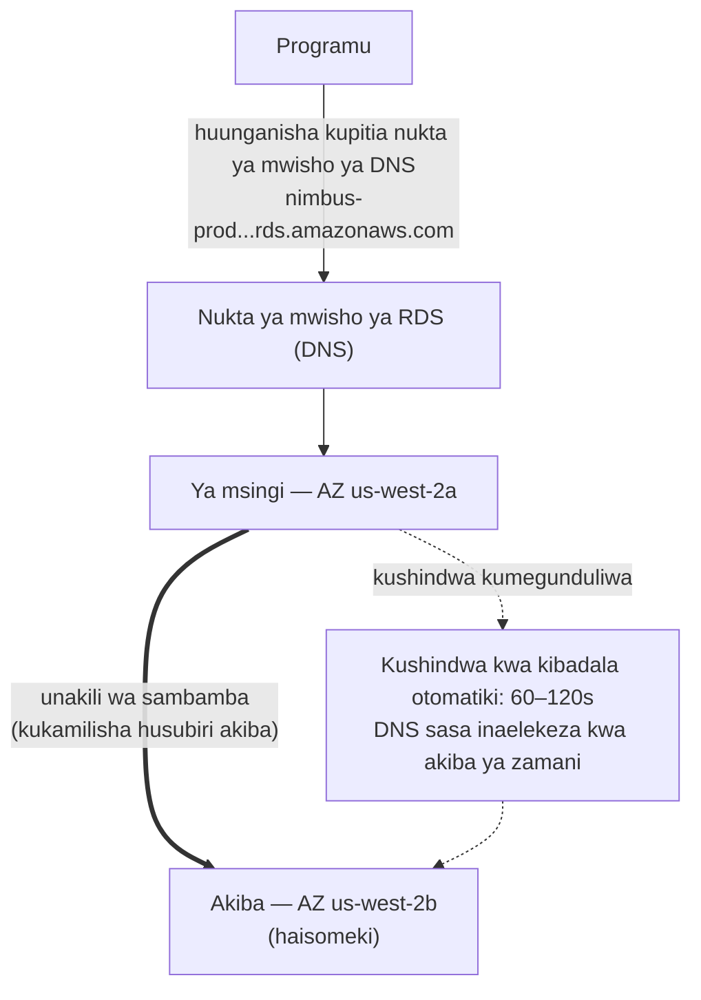

# Sura ya 8: Msimamizi wa Hifadhidata Ambaye Hajawahi Kupiga Simu akiwa Mgonjwa

Ilikuwa saa tisa usiku wakati arifa ilipoingia.

Priya alikuwa pekee aliyekuwa macho. Simu yake iliwaka kwenye meza ya kando na akaisoma gizani, mwangaza wa skrini wa juu mno. Akakaa. Akaipata laptop yake kwa kumbukumbu na akaifungua bila kuwasha taa.

Kibodi ilibofya kimya katika chumba chenye giza.

Seva ya hifadhidata ilihitaji kiraka cha usalama — aina iliyohitaji kuanzisha upya. Udhaifu
ulikuwa halisi, kiraka kilipatikana, na dirisha la kukitumia bila
kuvuruga wateja lilikuwa sasa hivi, katikati ya usiku, wakati trafiki
ilikuwa ya chini.

Aliunganisha na seva. Akavuta kiraka. Akakitumia.

Kisha akasoma maelezo ya toleo.

Sasisho la kifurushi liligusa faili ya usanidi ambayo PostgreSQL hutumia kufafanua vigezo vya muunganisho. Maelezo ya toleo yalijumuisha onyo: kulingana na jinsi uboreshaji ulivyofanywa, faili ya usanidi iliyobinafsishwa ingeweza kubadilishwa na toleo la chaguomsingi la kifurushi.

Faili yao ya usanidi ilikuwa imebinafsishwa. Leo alikuwa ameihariri miezi miwili iliyopita kurekebisha mpangilio wa max_connections.

Kiraka kiliendesha. Seva ilianza upya. Hifadhidata ilirudi mtandaoni.

Priya alijaribu hoja. Ilifanya kazi.

Akakagua kumbukumbu. Kila kitu kilionekana cha kawaida.

Alirudi kitandani saa 10:15 usiku.

Saa 3:05 asubuhi, Leo alifungua programu na akapata hitilafu. Akakagua hifadhidata. Max connections ilikuwa imewekwa kwa chaguomsingi: 100. Programu yao ilikuwa imesanidiwa kutumia mabwawa ya muunganisho ya hadi 500.

Kila jaribio jipya la muunganisho lilikuwa likishindwa. Programu kwa kweli ilikuwa imepoteza ufikiaji wa hifadhidata.

"Nini kilitokea?" Maya aliuliza.

"Kiraka," Priya alisema. Alikuwa tayari akiangalia faili ya usanidi. "Sasisho la kifurushi liliandika juu ya faili yetu ya usanidi iliyobinafsishwa na ya chaguomsingi. Urekebishaji wa max_connections wa Leo umekwisha tu — seva ilianza upya na mipangilio ya kawaida na hakuna aliyepata hitilafu. Ilirudi kimya kwa chaguomsingi."

"Itachukua muda gani kurekebisha?" Leo aliuliza.

"Dakika ishirini," Priya alisema. "Lakini tunahitaji dirisha la matengenezo. Hii inahitaji mabadiliko ya usanidi na kuanzisha upya."

"Tuna migahawa inayofungua kwa chakula cha mchana baada ya masaa mawili," Tom alisema.

Priya aliirekebisha kwa dakika kumi na nane. Dirisha la matengenezo lilikuwa dakika kumi na mbili za kupungukiwa na huduma halisi. Migahawa iliathiriwa, lakini kilele kilikuwa hakijaanza bado.

Asubuhi aliwaambia timu kile kilichotokea. Kulikuwa na kimya.

"Hilo litatokea tena," Tom alisema.

"Litatokea kila wakati kuna kiraka," Priya alisema. "Na daima kuna
viraka. Lazima kuwe na njia bora ya kufanya hivi."

Nyakati za hoja za sekunde nane zilikuwa bado hazijatatuliwa. Na katika wiki ile ile, hili: dirisha la matengenezo la saa tisa usiku lililogeuka kuwa tukio la asubuhi. Matatizo yote mawili yalikuwa na chanzo kile kile — Nimbus ilikuwa ikiendesha hifadhidata ambayo haikuwa na vifaa vya kuisimamia.

Kulikuwa na suluhisho. Lilihitaji tu kuachilia wazo kwamba walihitaji kusimamia hifadhidata wenyewe.

**Tatizo la Hifadhidata ya Kitamaduni**

Unapoendesha hifadhidata mwenyewe kwenye tukio la EC2, unawajibika kwa kila kitu.

Kusakinisha programu ya hifadhidata. Kuisanidi kwa usalama. Kuipachika viraka wakati udhaifu wa
usalama unapogunduliwa. Kuchukua nakala rudufu. Kujaribu kwamba nakala rudufu zinafanya kazi kweli
(hatua ambayo timu nyingi huruka hadi inapokuwa imechelewa mno). Kufuatilia nafasi ya diski. Kuweka
unakili kwa nakala rudufu. Kusanidi kushindwa kwa kibadala kwa wakati seva ya msingi inaposhuka.
Kurekebisha utendaji wa hoja. Kusimamia miunganisho chini ya mzigo.

Hakuna kati ya haya ni programu. Hakuna kati yake huongeza vipengele. Yote yanahitaji utaalam.

Hitaji la utaalam ndilo suala kuu. Msimamizi wa hifadhidata mwenye sifa anaelewa
si tu jinsi ya kuendesha hifadhidata, bali jinsi ya:

- Kufuatilia kumbukumbu za hoja za polepole na kutambua vizuizi vya utendaji
- Kupima ukubwa wa kumbukumbu kwa seti ya kazi kuepuka I/O ya diski
- Kusanidi uhifadhi wa WAL kwa urejeshaji wa nukta-katika-wakati
- Kuweka unakili wa utiririshaji wa sambamba na kushindwa kwa kibadala otomatiki
- Kurekebisha mabwawa ya muunganisho kuzuia uchovu wa muunganisho chini ya mzigo
- Kutumia uboreshaji wa matoleo makubwa bila kupoteza data au kupungukiwa na huduma kuliko ongezeka

Huu ni seti tofauti, maalum ya ujuzi. DBA waandamizi hudai mishahara ya juu haswa
kwa sababu kufanya yote haya vizuri ni vigumu. Startups nyingi haziwezi kuajiri kwa ajili yake. Timu nyingi
za maendeleo hazina.

Timu nyingi za maendeleo si wasimamizi wa hifadhidata. Hili huunda muundo unaotabirika:
hifadhidata husakinishwa, husanidiwa kidogo, na kisha husahaulika zaidi hadi kitu kinapokwenda
vibaya sana. Tukio la PostgreSQL la Nimbus lilikuwa likiendesha kwenye usanidi wa
chaguomsingi — max_connections kwa 100, hakuna mabwawa ya muunganisho, nakala rudufu za mkono ambazo Leo
alikuwa ameendesha mara mbili kisha akazisahau, na hakuna unakili wowote kabisa.

Tukio la kiraka la saa tisa usiku lilikuwa dalili ya mfumo unaoendeshwa na watu waliokuwa bora
kwa kujenga programu na hawakuwa na asili katika operesheni za hifadhidata. Hiyo si
ukosoaji — ni maelezo sahihi ya startups nyingi. Suluhisho si
kuajiri DBA. Suluhisho ni kutumia huduma inayotoa operesheni za kiwango cha DBA
kiotomatiki.

"Je, ndicho tulichofanya?" Maya aliuliza.

Jibu la Leo lilikuwa kimya, ambalo lilikuwa sawa na ndiyo.

**Hifadhidata Inayodhibitiwa**

Fikiri kuajiri msimamizi wa hifadhidata ambaye hajawahi kupiga simu akiwa mgonjwa, kiotomatiki hushughulikia
kila kiraka cha usalama, huchukua nakala rudufu kila usiku bila kuombwa, na hujirekebisha
wakati kitu kinapovunjika. Hufanya yote haya bila kukusumbua — na hawagusi
kamwe, chini ya hali yoyote, mantiki ya programu yako.

AWS huita huduma hii **RDS** — Relational Database Service.

Na RDS, AWS husimamia:

- Kusakinisha na kupachika viraka injini ya hifadhidata
- Nakala rudufu otomatiki (zilizohifadhiwa katika S3, zilizowekwa hadi siku 35)
- Kushindwa kwa kibadala otomatiki (wakati ya msingi inaposhuka, ya akiba inachukua nafasi kiotomatiki)
- Ufuatiliaji na vipimo
- Usimbaji wakati umehifadhiwa na safarini
- Upanuzi otomatiki wa hifadhi (ukiwezesha, diski hukua inapojaa)

Wewe husimamia:

- Muundo (schema) wa hifadhidata (muundo wa majedwali yako)
- Hoja zako na mantiki ya programu
- Nani ana ufikiaji wa hifadhidata
- Ni aina gani ya tukio inayoendesha hifadhidata
- Urekebishaji wa vigezo (ingawa RDS hutoa chaguomsingi zenye busara)

**Injini Zinazoungwa Mkono**

RDS inaunga mkono injini kadhaa maarufu za hifadhidata:

- **MySQL** — hifadhidata ya uhusiano ya chanzo huru inayotumika zaidi
- **PostgreSQL** — yenye nguvu, inayopanuka, inazidi kuwa maarufu kwa mizigo changamano
- **MariaDB** — uma wa MySQL wa chanzo huru, unaolingana kikamilifu
- **Oracle** — kiwango cha biashara, inayotumika katika mashirika makubwa yenye mahitaji ya urithi
- **Microsoft SQL Server** — kwa mazingira yenye Windows nyingi
- **Amazon Aurora** — injini ya AWS yenyewe inayolingana na MySQL/PostgreSQL, iliyojengwa kwa wingu
  (tunafunika Aurora kwa kina katika Sura ya 24)

Kwa Nimbus, chaguo lilikuwa PostgreSQL. Ndicho Leo alichokijua, na ilishughulikia data ya
uhusiano vizuri. Chaguo la injini linajalisha kidogo kuliko ungefikiri kwa programu nyingi —
faida za kiuendeshaji za RDS hutumika bila kujali.

Nuance moja: unapoendesha injini kwenye RDS, AWS hudumisha viraka vya matoleo madogo
kiotomatiki (wakati wa dirisha lako la matengenezo lililosanidiwa). Uboreshaji wa matoleo makubwa —
kuhama kutoka PostgreSQL 14 hadi 15, kwa mfano — ni operesheni ya mkono ambayo
unaipanga na kuitekeleza. AWS hujaribu uboreshaji wa matoleo makubwa kwa makini, lakini unapaswa kuyajaribu
katika mazingira ya staging kwanza. Mabadiliko ya matoleo makubwa yanaweza kuingiza masuala ya
upatanifu na sintaksia mahususi ya SQL, viendelezi, au matoleo ya viendeshi.

Leo aligundua hili wakati RDS ilipotumia kiraka kidogo na kumbukumbu ya programu kwa muda mfupi
ilionyesha onyo la kuachwa kuhusu kazi ambayo ilikuwa imeondolewa katika toleo dogo.
Viraka vidogo vinapaswa kuwa vya uwazi kimsingi — lakini kufuatilia kumbukumbu za programu yako
baada ya kila dirisha la matengenezo ni mazoezi mazuri.

"Je, tumefikiri kuhusu kile kinachotokea ikiwa kiraka kidogo kitavunja kitu?" Priya aliuliza.

"Tunarudi nyuma kwa snapshot ya awali," Leo alisema.

"Hilo linachukua muda gani?"

Leo alitafuta muda wa kurejesha wa RDS kwa ukubwa wa hifadhidata yao. Kwa hifadhidata ya GB 50 kwenye
`db.m6i.large`: takriban dakika 15 hadi 30 kurejesha kutoka snapshot.

"Kwa hivyo tuna dirisha la urejeshaji la dakika 15-hadi-30 ikiwa kiraka kitavunja uzalishaji," Priya alisema. "Na tunatumia kiraka katika dirisha la matengenezo la asubuhi ya mapema, kwa hivyo angalau athari ni ndogo."

"Na tunajaribu viraka katika staging kwanza," Leo aliongeza.

"Ndiyo," Priya alisema. "Hilo pia."

**Kupima Ukubwa wa Tukio la RDS: Si Mizigo Yote Inalingana**

Unapounda tukio la RDS, unachagua aina ya tukio — dhana ile ile kama EC2, lakini imewekewa upeo kwa mizigo ya hifadhidata. AWS hupanga aina za matukio za RDS katika tabaka chache muhimu.

**Familia ya db.t3**: Matukio ya utendaji wa kupasuka. Yamebuniwa kwa maendeleo, staging, na mizigo nyepesi ya uzalishaji isiyohitaji CPU ya juu endelevu. `db.t3.micro` inafaa kwa hifadhidata ya maendeleo yenye trafiki ya chini. `db.t3.medium` hushughulikia mzigo wa wastani wa uzalishaji wenye milipuko ya mara kwa mara.

Uwiano wa biashara na matukio ya mfululizo wa T: yanakusanya mikopo ya CPU wakati wa vipindi vya matumizi ya chini na hutumia mikopo hiyo wakati wa milipuko. Ukiendesha tukio la mfululizo wa T kwa CPU ya juu endelevu, unachoma mikopo na utendaji hudhibitiwa hadi msingi unaoweza kuwa hautoshi.

**Familia ya db.m6i**: Matukio ya madhumuni ya jumla yenye utendaji thabiti, usio wa kupasuka. `db.m6i.large` ni nukta ya kawaida ya kuanzia kwa hifadhidata za uzalishaji. Haya hayana mipaka ya mikopo — CPU inapatikana kwa uwezo kamili wakati wowote unapouhitaji.

**Familia ya db.r6i**: Matukio yaliyoboreshwa kwa kumbukumbu. RAM zaidi kwa kila vCPU kuliko familia ya M. Inafaa kwa hifadhidata zenye seti kubwa za kazi — hoja zinazonufaika na data kuwa katika kumbukumbu badala ya kuipata kutoka diski kwa kila ufikiaji. Ikiwa utendaji wa hifadhidata yako unaboreka sana unapoongeza RAM, familia ya R ndicho chaguo sahihi.

Kwa Nimbus:

- Maendeleo na staging: `db.t3.medium`. Inatosha kwa hoja za maendeleo, gharama ya chini.
- Uzalishaji: `db.m6i.large`. Utendaji thabiti, RAM ya kutosha kwa seti ya kazi ya menyu na maagizo, hakuna udhibiti wa mikopo.

"db.m6i.large inagharimu zaidi kiasi gani kuliko db.t3.medium?" Tom aliuliza.

Leo alikagua ukurasa wa bei. `db.t3.medium` iligharimu takriban dola 55/mwezi. `db.m6i.large` iligharimu takriban dola 140/mwezi. Tofauti ilikuwa halisi, lakini ndivyo tofauti ya uaminifu ilivyokuwa.

"t3 itadhibiti chini ya mzigo endelevu," Priya alisema. "Tukiwa na Ijumaa yenye shughuli na CPU ikabaki juu kwa masaa manne, t3 inaishiwa mikopo na inadhibiti. m6i haifanyi hivyo."

Tom aliandika nambari. Pia aliandika gharama ya kukatika kwa Ijumaa kutoka wiki mbili zilizopita. Ulinganisho haukuwa karibu.

Uzalishaji uliendelea kwenye `db.m6i.large`.

**Multi-AZ: Akiba Inayochukua Nafasi**

Hiki ndicho kipengele kinachobadilisha hesabu ya uaminifu kabisa.

**Usambazaji wa Multi-AZ** unamaanisha RDS hudumisha tukio la akiba la sambamba katika
Availability Zone tofauti na ya msingi. Kila muamala unaokamilishwa kwa ya msingi
hunakiliwa kwa sambamba kwa akiba kabla ya kukamilishwa kukubaliwa.

Wakati ya msingi inaposhindwa — kushindwa kwa maunzi, kukatika kwa AZ, kuanguka kwa programu — RDS
kiotomatiki hushindwa kwa kibadala kwa akiba. Rekodi ya DNS ya nukta ya mwisho ya hifadhidata
husasishwa. Programu yako huunganisha tena na ya msingi mpya.

Kushindwa kwa kibadala huchukua sekunde 60–120. Wakati wa dirisha hilo, programu yako itapata
hitilafu za muunganisho. Programu zilizoandikwa ipasavyo zinapaswa kushughulikia hili kwa ulaini (majaribio upya
ya muunganisho na backoff).

Akiba si nakala ya kusoma. Haihudumii trafiki ya kusoma. Kusudi lake pekee ni
kuwa tayari kuchukua nafasi.



(Dokezo: chaguo jipya zaidi la usambazaji la **Multi-AZ DB Cluster** huweka akiba *mbili* ambazo
**zina**someka na hushindwa kwa kibadala kwa ~sekunde 35 — mtihani unaweza kuitofautisha na
usambazaji wa kawaida wa *tukio* la Multi-AZ ulioelezwa hapa.)

"Multi-AZ inagharimu kiasi gani?" Tom aliuliza.

Takriban maradufu ya gharama ya tukio moja — kwa sababu unaendesha kihalisia matukio mawili
ya hifadhidata. Akiba inagharimu sawa na ya msingi.

Tom alifungua historia ya maagizo na akakadiria mapato kwa saa wakati wa kilele chao cha Ijumaa.

"Na vipi ikiwa mtu atajaribu kuingia kwa nguvu wakati wa dirisha la kushindwa kwa kibadala?" Priya aliuliza. "Wakati ya msingi iko chini na akiba inapandishwa, je, kuna sekunde sitini ambapo tumefichuliwa?"

"Kushindwa kwa kibadala ni kwa uwazi," Maya alisema, "lakini swali ni la haki. Mfuatano wa muunganisho unapaswa kutumia nukta ya mwisho ya RDS, si IP zilizowekwa kwa nguvu — vinginevyo kushindwa kwa kibadala hakutakuwa kwa laini."

Multi-AZ iliwezeshwa mchana ule.

**Nakala Rudufu Otomatiki na Urejeshaji wa Nukta-katika-Wakati**

RDS huchukua nakala rudufu otomatiki kila siku. AWS huhifadhi nakala rudufu hizi katika S3 (zinazodhibitiwa na
RDS — huzioni moja kwa moja katika kiweko chako cha S3). Unaweza kurejesha hifadhidata
kwa nukta yoyote ndani ya kipindi chako cha uhifadhi wa nakala rudufu.

Nakala rudufu hutokea wakati wa **dirisha la nakala rudufu** linaloweza kusanidiwa — kipindi cha trafiki ya
chini, kwa kawaida asubuhi ya mapema. (Hii ni mpangilio tofauti na **dirisha la
matengenezo**, ambalo ni wakati RDS inatumia viraka na mabadiliko ya usanidi. Mtihani
hupenda kujaribu kwamba haya ni madirisha mawili tofauti.) Kwa aina nyingi za injini, nakala rudufu
hazisababishi kupungukiwa na huduma — na kwenye usambazaji wa Multi-AZ, snapshot huchukuliwa kutoka
akiba, kwa hivyo ya msingi haiguswi kabisa.

**Urejeshaji wa nukta-katika-wakati** ni mojawapo ya vipengele vyenye thamani zaidi: unaweza kurejesha kwa
sekunde yoyote ndani ya kipindi chako cha uhifadhi. Si snapshots za kila siku tu — *sekunde yoyote*.
Hili linawezekana kwa sababu RDS huhifadhi kuendelea kumbukumbu za miamala pamoja na
nakala rudufu za kila siku.

Ikiwa mtu atatumia kwa bahati mbaya `DELETE FROM orders WHERE 1=1` saa 8:37 mchana, unaweza
kurejesha kwa saa 8:36 mchana.

Leo alipumzika kwa kuonekana alipoelewa hili.

"Tayari niliweka uhifadhi wa nakala rudufu kuwa siku moja," Leo alisema. "Lo — hilo ni sawa ingawa, sivyo? Tunaweza kuibadilisha?"

"Ibadilishe kuwa siku saba kima cha chini," Priya alisema. "Thelathini kwa uzalishaji."

Leo aliisasisha mara moja.

"Je, tungeweza kupona kutoka kile nilichofuta mwezi uliopita?" aliuliza.

"Kabla ya RDS? Hapana," Priya alisema. "Baada ya RDS? Ndiyo."

Pengine unajiuliza: ni nini tofauti kati ya nakala rudufu otomatiki na snapshot ya mkono? Nakala rudufu otomatiki hufutwa wakati kipindi cha uhifadhi kinapoisha (hadi siku 35). Snapshots za mkono huwekwa bila kikomo hadi uzifute waziwazi. Ikiwa unahitaji kuhifadhi hali ya hifadhidata kabisa — kabla ya uhamaji mkubwa, kabla ya usambazaji wa hatari — chukua snapshot ya mkono.

**RDS Proxy: Kusuluhisha Tatizo la Muunganisho kwa Kiwango Kikubwa**

Wiki mbili baada ya kuhamia RDS, Leo aligundua kitu katika vipimo.

Hifadhidata ilikuwa ikishughulikia hoja vizuri. Lakini idadi ya miunganisho iliyo wazi ilikuwa juu — juu kuliko alivyotarajia. Na Auto Scaling Group ikiongeza matukio ya EC2 wakati wa kilele, kila tukio jipya lilifungua bwawa lake la miunganisho ya hifadhidata. Matukio kumi ya EC2, kila moja na bwawa la muunganisho la 50: miunganisho mia tano ya wakati mmoja kwa hifadhidata.

"PostgreSQL ina gharama ya ziada kwa kila muunganisho," Priya alisema. "Kumbukumbu, CPU kwa mshughulikiaji wa muunganisho. Miunganisho mia tano hutumia kiasi chenye maana cha rasilimali za hifadhidata kwa usimamizi wa muunganisho pekee — kabla haijafanya kazi yoyote halisi."

"Tunaweza kupunguza ukubwa wa bwawa la muunganisho?" Leo aliuliza.

"Tungeweza," Priya alisema. "Lakini basi tunahatarisha maombi kusubiri kwenye foleni yakingoja muunganisho wakati wa kilele."

Suluhisho bora: **RDS Proxy**.

RDS Proxy huketi kati ya programu na hifadhidata. Matukio ya EC2 huunganisha kwa Proxy, si moja kwa moja kwa tukio la RDS. Proxy hudumisha bwawa la miunganisho ya hifadhidata na huzidisha maombi ya programu kuvuka hizo. Ikiwa matukio kumi ya EC2 kila moja hufungua miunganisho hamsini kwa Proxy, Proxy inaweza kudumisha miunganisho mia moja tu halisi ya hifadhidata — ikishiriki kwa ufanisi kuvuka maombi yote ya programu.

Faida:

**Mabwawa ya muunganisho**: Miunganisho michache halisi ya hifadhidata inamaanisha gharama ndogo ya kumbukumbu kwenye tukio la RDS na utendaji bora chini ya mzigo.

**Kushindwa kwa kibadala kwa haraka**: Wakati wa kushindwa kwa kibadala kwa Multi-AZ, Proxy hudumisha muunganisho upande wa programu wakati ikianzisha upya muunganisho wa hifadhidata upande wa nyuma. Programu huona kusimama kwa muda mfupi badala ya kuweka upya muunganisho kamili. RDS Proxy hupunguza athari ya kushindwa kwa kibadala kutoka sekunde 60–120 hadi kwa kawaida sekunde 30 au chini.

**Uthibitishaji wa IAM**: Badala ya kupachika vitambulisho vya hifadhidata katika programu, programu inaweza kujithibitisha kwa RDS Proxy kwa kutumia jukumu la IAM. Proxy hushughulikia vitambulisho halisi vya hifadhidata. Hii huondoa siri kutoka mazingira ya programu kabisa.

"RDS Proxy inagharimu kiasi gani?" Tom aliuliza.

Inagharimu takriban dola 0.015 kwa saa-vCPU ya tukio la RDS lililo chini, ikitozwa tofauti na tukio lenyewe. Kwa `db.m6i.large` (vCPU 2), Proxy huongeza takriban dola 22/mwezi.

Tom aliangalia grafu ya idadi ya muunganisho — miunganisho mia tano ikishindania rasilimali za hifadhidata wakati wa kilele — na akaangalia gharama ya dola 22/mwezi.

"Hiyo ni nafuu kuliko kuboresha hadi tukio kubwa zaidi la RDS kushughulikia gharama ya ziada ya muunganisho," alisema.

RDS Proxy iliwezeshwa wiki hiyo.

"Na vipi ikiwa mtu atajaribu kuingia kwa nguvu kupitia Proxy?" Priya aliuliza. "Je, uthibitishaji wa IAM kwa Proxy hupunguza nyuso za shambulio?"

"Ndiyo," Priya alijibu swali lake mwenyewe. "Hakuna vitambulisho vya hifadhidata katika mazingira ya programu kunamaanisha hakuna vitambulisho vya hifadhidata vya kuiba kutoka programu."

Aliwezesha uthibitishaji wa IAM kwa Proxy.

**Read Replicas: Kupanua Trafiki ya Kusoma**

Multi-AZ inahusu upatikanaji. **Read replicas** zinahusu utendaji.

Read replica ni nakala isiyo sambamba ya hifadhidata yako ya msingi inayoweza kuhudumia hoja za
kusoma. Unaweza kuwa na hadi read replicas 15 kwa injini kuu za RDS — MySQL, PostgreSQL, na MariaDB (Aurora inaunga mkono hadi Aurora Replicas 15 pia, zikishiriki sauti ile ile ya hifadhi).

Programu hurekebishwa kutuma hoja za kusoma kwa replica na hoja za kuandika kwa
ya msingi. Hii husambaza mzigo: ya msingi hushughulikia maandishi na miamala
changamano; replicas hushughulikia usomaji.

Sifa muhimu:

- Unakili ni **usio sambamba** — kunaweza kuwa na ucheleweshaji mdogo (lag) kati ya
  ya msingi na replica. Ukiandika rekodi na mara moja ukasoma kutoka replica,
  unaweza usiione bado.
- Read replicas zinaweza kuwa katika Region ile ile au katika Region tofauti (replicas za
  kuvuka-Region huongeza latensi lakini huwezesha usambazaji wa kijiografia).
- Read replicas zinaweza kupandishwa kuwa hifadhidata zinazojitegemea katika mazingira ya maafa.

Kwa Nimbus: utafutaji wa menyu ni usomaji. Historia ya maagizo ni usomaji. Wengi mkubwa wa
trafiki ni trafiki ya kusoma. Kuongeza read replica na kuelekeza usomaji kwake hupunguza mzigo wa
hifadhidata ya msingi kwa kiasi kikubwa.

Tunafunika read replicas kwa kina zaidi katika Sura ya 24 tunapojadili Aurora.

**Ikiwa Usomaji-Mzito Basi Ongeza Replica Lakini Angalia Lag**

Ikiwa mzigo wako ni wa usomaji-mzito, kuongeza read replica hupunguza mzigo kwenye ya msingi na huboresha utendaji wa hoja — lakini unakili ni usio sambamba, jambo linalomaanisha replica inaweza kuwa nyuma kidogo ya ya msingi. Ikiwa programu yako inaandika rekodi na mara moja kuisoma tena, lazima isome kutoka ya msingi, si replica. Kulikosea hili hutoa hitilafu za hila, ngumu-kutatua za upya wa data: mtumiaji anatoa agizo, ukurasa wa uthibitisho unahoji replica, replica haijapatana, agizo linaonekana halipo. Hii inaitwa uthabiti wa soma-maandishi-yako (read-your-writes consistency), nayo ni kosa la kawaida zaidi ambalo timu hufanya wanapoongeza replicas kwa mara ya kwanza.

**Performance Insights: Kupata Hoja ya Polepole**

Muda wa kupakia menyu wa sekunde nane ulikuwa bado tatizo. Kuhamia RDS kuliboresha uaminifu, lakini hoja ilikuwa bado ya polepole.

Leo aliongeza read replica na akaelekeza hoja za menyu kwake. Muda wa kupakia menyu ulishuka hadi takriban sekunde nne. Bora. Bado si nzuri.

"Hoja bado ni ya polepole," Maya alisema. "Tuliboresha kizuizi, lakini hatukulirekebisha."

RDS inajumuisha kipengele kinachoitwa **Performance Insights** — zana ya ufuatiliaji inayoonyesha ni hoja zipi zinatumia rasilimali nyingi zaidi za hifadhidata, ni vikao vipi vinasubiri, na vinasubiri nini.

Leo aliwezesha Performance Insights kwenye read replica na akapakia ukurasa wa menyu mara kwa mara wakati wa kikao cha majaribio cha mchana.

Dashibodi ya Performance Insights ilionyesha hoja moja ikitawala mzigo: skani kamili ya jedwali la `menu_items`, ikipata safu zote 22,000 kila wakati ukurasa wa menyu ulipopakiwa. Hakukuwa na index kwenye `restaurant_id` — safu ambayo programu ilikuwa ikichuja kwayo.

Muda wa utekelezaji bila index: sekunde 8.2.

Leo aliongeza index.

```sql
CREATE INDEX idx_menu_items_restaurant_id ON menu_items(restaurant_id);
```

Muda wa utekelezaji na index: milisekunde 14.

Milisekunde 8,200 hadi milisekunde 14. Tofauti kati ya programu ya kuagiza ya mgahawa inayowafukuza wateja na ile wanayoitumia bila kufikiri.

"Hilo lilikuwa tatizo wakati wote?" Maya alisema.

"Hilo lilikuwa tatizo," Leo alisema.

"Na Performance Insights ililipata kwa muda gani?"

"Karibu dakika ishirini."

Tom alikuwa tayari akihesabu. Wiki tatu za nyakati za kupakia menyu zisizo bora, makadirio ya upakiaji wa ukurasa wa menyu 200,000 wakati wa kipindi hicho, makadirio ya asilimia 15 ya kuachwa kutokana na upolepole. Nambari aliyofikia ilikuwa ya kutia wasiwasi.

"Ongeza index zinazokosekana kabla ya uzinduzi mara ijayo," alisema.

"Kutakuwa na orodha ya ukaguzi," Priya alisema. Alikuwa tayari akiiandika.

**Lini Usitumie RDS**

RDS ni bora kabisa kwa anuwai ya mizigo ya hifadhidata ya uhusiano. Si jibu sahihi kwa kila kitu.

**Wakati unahitaji ufikiaji wa kiwango cha OS**: RDS haikupi ufikiaji wa mfumo wa uendeshaji ulio chini. Huwezi kusakinisha vifurushi vya desturi vya OS, kurekebisha vigezo vya kernel, au kuendesha zana zinazohitaji ufikiaji wa root kwa seva ya hifadhidata. Ikiwa hifadhidata yako ina mahitaji yanayodai ufikiaji wa OS — usanidi fulani wa Oracle, viendeshi vya hifadhi vya desturi, violesura mahususi vya mtandao — unahitaji kuendesha hifadhidata kwenye tukio la EC2 moja kwa moja.

**Wakati unatumia injini isiyoungwa mkono**: RDS inaunga mkono MySQL, PostgreSQL, MariaDB, Oracle, SQL Server, na Aurora. Ikiwa programu yako inatumia injini tofauti ya hifadhidata — CockroachDB, SingleStore, Greenplum — unaiendesha kwenye EC2, si RDS.

**Wakati unahitaji upanuzi wa kiusawa wa uandishi-mzito**: RDS hupanua usomaji kupitia replicas. Maandishi huenda kwa tukio moja la msingi. Ikiwa mzigo wako ni wa uandishi-mzito na unahitaji kusambazwa kuvuka nodi nyingi za kuandika, RDS si usanifu sahihi. Aurora's Global Database inaweza kusaidia kwa kiwango kikubwa, lakini kwa mahitaji ya kiwango cha juu sana cha uandishi, hifadhidata zilizotapakaa kama DynamoDB (Sura ya 9) au CockroachDB inayoendesha kwenye EC2 ni zana zinazofaa.

**Wakati gharama inayodhibitiwa inazidi gharama ya kiuendeshaji**: Kwa mizigo mikubwa sana, thabiti ambapo timu yako ina utaalam halisi wa usimamizi wa hifadhidata, kuendesha PostgreSQL kwenye EC2 na zana zako mwenyewe kunaweza kuwa nafuu kuliko RDS. Hili ni kawaida kwa timu ambazo si maduka ya DBA hasa. Lakini ni halisi, na mbunifu mzuri hukiri.

Kwa Nimbus — startup bila rasilimali za DBA zilizojitolea, inayoendesha PostgreSQL kwenye huduma inayodhibitiwa, yenye ukuaji usiotabirika — RDS lilikuwa wazi chaguo sahihi.

**RDS Parameter Groups na Option Groups**

Mifumo miwili ya usanidi hujitokeza kwenye mtihani:

**Parameter groups** hudhibiti mipangilio ya injini ya hifadhidata — kama miunganisho ya juu zaidi,
ukubwa wa akiba ya hoja, thamani za kuisha kwa muda. RDS huunda parameter group ya chaguomsingi inayofanya kazi
kwa visa vingi. Unaunda parameter groups za desturi unapohitaji kurekebisha mipangilio mahususi.

**Option groups** huwezesha vipengele vya ziada kwa baadhi ya injini — kama usimbaji wa asili
wa mtandao wa Oracle au usimbaji wa data wa uwazi wa SQL Server. Usambazaji mwingi wa injini za
chanzo huru hauhitaji option groups za desturi.

Unaweza kubinafsisha tabia ya injini ya hifadhidata kupitia mifumo hii — lakini chaguomsingi hufanya kazi kwa timu nyingi zinazoanza.

### Kuingiza Data: AWS Database Migration Service

Wiki chache ndani, Tom alifika kwenye standup na slaidi.

Nimbus ilikuwa ikipata mshindani mdogo wa kieneo. Mfumo wao wa kuagiza uliendesha kwenye hifadhidata ya MySQL katika kituo cha kushiriki. Mfumo haukuweza kwenda nje ya mtandao wakati wa uhamaji — migahawa ilikuwa ikiutumia.

"Tunahitaji kuhamisha data yao kwenda RDS," Tom alisema. "Bila kushusha mfumo."

"Hifadhidata ni kubwa kiasi gani?" Leo aliuliza.

"Karibu gigabaiti 80."

"Wanahitaji kuhamia lini?"

"Wiki sita."

Priya alikuwa tayari amefungua nyaraka. "AWS DMS," alisema.

**AWS DMS (Database Migration Service)** husogeza data kutoka hifadhidata ya chanzo kwenda hifadhidata lengwa kwa kupungukiwa na huduma kuliko ongeza. Hushughulikia uhamaji katika awamu mbili: upakiaji kamili wa data iliyopo, ukifuatiwa na unakili unaoendelea wa mabadiliko kadiri chanzo kinavyoendelea kuendesha.

Kuna aina mbili za uhamaji:

**Uhamaji wa sawiya (homogeneous):** chanzo na lengwa ni injini ile ile — MySQL kwenda RDS MySQL, PostgreSQL kwenda Aurora PostgreSQL. Schema inalingana; DMS huhamisha data moja kwa moja.

**Uhamaji wa tofauti (heterogeneous):** chanzo na lengwa ni injini tofauti — Oracle kwenda Aurora PostgreSQL, SQL Server kwenda RDS MySQL. Schema lazima ibadilishwe kwanza. Hii inahitaji **AWS Schema Conversion Tool (SCT)** kutafsiri schema, kisha DMS kuhamisha data.

Kwa upataji wa Nimbus: MySQL kwenda RDS MySQL. Sawiya. Hakuna SCT inayohitajika.

Jinsi inavyofanya kazi katika vitendo:

1. DMS husoma kutoka chanzo — hifadhidata ya MySQL ya kituo cha kushiriki
2. **Upakiaji kamili**: DMS hunakili data yote iliyopo kwa tukio lengwa la RDS
3. **CDC (Change Data Capture)**: baada ya upakiaji kamili, DMS husoma kumbukumbu ya miamala ya hifadhidata ya chanzo na hunakili mabadiliko yanayoendelea kwa lengwa karibu na wakati halisi
4. Chanzo huendelea kuendesha. Timu inapokuwa tayari, hubadilisha mfuatano wa muunganisho.

"Kwa hivyo mfumo wa kuagiza wa mgahawa hubaki hai wakati wote?" Tom aliuliza.

"Wakati wote," Priya alithibitisha. "Chanzo na lengwa hubaki sambamba kupitia CDC. Tunapokuwa tayari, tunabadilisha nukta ya mwisho. Kupungukiwa na huduma ni sekunde inachukua kwa mabadiliko hayo kuenea."

DMS inaunga mkono dazeni za michanganyiko ya chanzo na lengwa: Oracle, SQL Server, MySQL, PostgreSQL, MongoDB, DynamoDB, S3, Redshift, Aurora, na zaidi.

"Subiri — lakini *kwa nini* tunahitaji zana tofauti kwa uhamaji wa tofauti?" Maya aliuliza. "DMS haiwezi tu kubaini tofauti za schema?"

"VARCHAR katika Oracle si sawa na VARCHAR katika PostgreSQL," Priya alisema. "Aina za data, taratibu zilizohifadhiwa, mifuatano, kazi za umiliki — hazirameni moja-kwa-moja. SCT huchanganua schema ya chanzo na huzalisha mlingano ulio karibu zaidi kwa lengwa. DMS kisha huhamisha data kwa schema iliyobadilishwa. Kutenganisha ubadilishaji wa schema na usogezaji wa data ndio kunachofanya mchakato kuwa wa kuaminika."

"Na vipi ikiwa mtu atajaribu kuingia kwa nguvu kupitia tukio la unakili la DMS?" Priya alijiuliza muda mfupi baadaye. "Linahitaji ufikiaji wa kusoma kwa chanzo na ufikiaji wa kuandika kwa lengwa."

"Upendeleo mdogo pande zote mbili," Leo alisema. "IAM ya kusoma-tu kwa chanzo. Ufikiaji wa kuandika uliowekewa upeo kwa lengwa la uhamaji pekee. Na tukio la unakili linabaki katika subnet ya faragha."

Priya aliiandika.

## Nguvu na Mapungufu

**Kwa nini RDS ni bora kabisa**:

- Huondoa mzigo wa kiuendeshaji wa kusimamia programu ya hifadhidata
- Nakala rudufu otomatiki na urejeshaji wa nukta-katika-wakati
- Multi-AZ kwa kushindwa kwa kibadala otomatiki na RTO ndogo
- Read replicas kwa kupanua trafiki ya kusoma
- Usimbaji wakati umehifadhiwa na safarini umejengwa ndani
- Injini zote kuu za hifadhidata za uhusiano zinaungwa mkono
- RDS Proxy kwa mabwawa ya muunganisho na mwitikio bora wa kushindwa kwa kibadala

**Ambapo RDS ina mipaka**:

- Huwezi kufikia OS iliyo chini. Ikiwa hifadhidata yako ina mahitaji yanayodai
  ufikiaji wa kiwango cha OS, unaweza kuhitaji kuendesha hifadhidata yako mwenyewe ya msingi-wa-EC2.
- RDS si serverless (na istisna — Aurora Serverless ipo, imefunikwa katika
  Sura ya 24). Unalipia tukio linaloendesha hata kama liko bila kazi.
- RDS haijabuniwa kwa hifadhidata zilizogawanywa kiusawa. Kwa upanuzi mkubwa wa nje
  wa mizigo ya uhusiano ya uandishi-mzito, unaweza hatimaye kuhitaji usanifu tofauti.
- Kwa mifumo ya data isiyo ya uhusiano (NoSQL), DynamoDB (Sura ya 9) inafaa zaidi.

## Muhtasari

Dirisha la kiraka la saa tisa usiku la Priya lilikuwa dalili. Chanzo cha msingi kilikuwa kwamba Nimbus ilikuwa ikisimamia hifadhidata ambayo huduma inayodhibitiwa ingeishughulikia vizuri zaidi. RDS haiondoi tu wito wa kuamka wa saa tisa usiku — huhamisha wajibu wa kupachika viraka, kushindwa kwa kibadala, nakala rudufu, na usimamizi wa muunganisho kwa AWS, ikiifungua timu kulenga msimbo wa programu unaohudumia wateja kwa kweli. Uwiano wa biashara ni kupoteza ufikiaji wa kiwango cha OS, ambacho hujalisha nadra na kidogo zaidi kuliko inavyosikika.

- **Amazon RDS** ni huduma ya hifadhidata ya uhusiano inayodhibitiwa. AWS hushughulikia kupachika viraka, nakala rudufu, kushindwa kwa kibadala, na hifadhi. Wewe hushughulikia schema, hoja, na mantiki ya programu.
- **Multi-AZ** hudumisha akiba ya sambamba katika AZ tofauti. Kushindwa kwa kibadala otomatiki hutokea kwa sekunde 60–120. Daima tumia jina la DNS la nukta ya mwisho ya RDS katika mifuatano ya muunganisho — si IP zilizowekwa kwa nguvu — ili kushindwa kwa kibadala kuwe kwa uwazi.
- **Read replicas** ni nakala zisizo sambamba zinazohudumia trafiki ya kusoma. Lag ya unakili inamaanisha zinaweza kuwa nyuma kidogo — uthabiti wa soma-maandishi-yako unahitaji kusoma kutoka ya msingi mara moja baada ya kuandika.
- **RDS Proxy** huweka mabwawa ya miunganisho, ikipunguza gharama ya ziada na kuboresha kasi ya kushindwa kwa kibadala. Muhimu kwa mizigo ya msingi-wa-Lambda inayoweza kuunda maelfu ya miunganisho ya muda mfupi.
- **Performance Insights** hutambua hoja za polepole — kupata index inayokosekana kunaweza kubadilisha hoja ya sekunde 8 kuwa ya milisekunde 14. Uboreshaji wa matoleo makubwa ni wa mkono; jaribu katika staging kwanza.

## Vidokezo vya Mtihani

*Kikoa cha SAA-C03 3 — Kazi 3.3 (suluhisho za hifadhidata)*

- **Multi-AZ ni kwa upatikanaji wa juu, si utendaji.** Akiba haihudumii
  trafiki ya kusoma. Read replicas ni kwa utendaji. Tofauti hii hujaribiwa mara kwa mara.
- **Kushindwa kwa kibadala kwa Multi-AZ ni otomatiki.** Husanidi lini au jinsi inavyotokea.
  RDS hufuatilia ya msingi na huchochea kushindwa kwa kibadala kiotomatiki.
- **Lag ya unakili inajalisha.** Read replicas zinaweza kuwa nyuma kidogo ya ya msingi.
  Ikiwa programu yako inahitaji kusoma data iliyoiandika tu, lazima isome kutoka
  ya msingi, si replica. Hii inaitwa "read-your-writes consistency."
- **Nakala rudufu otomatiki huwekwa kwa siku 0–35.** Kuweka uhifadhi kuwa 0
  hulemaza nakala rudufu otomatiki. Snapshots za mkono huwekwa bila kikomo hadi
  uzifute.
- **Upanuzi otomatiki wa hifadhi wa RDS** huzuia kukatika kwa diski-imejaa. Uwezeshe. Hupanuka
  juu tu, kamwe chini. Mtihani unaweza kujaribu kama unajua kutofautiana huku.
- **RDS Proxy** hujitokeza katika mazingira ya mtihani yanayohusisha kazi za Lambda zinazounganisha na RDS
  (Lambda inaweza kuunda maelfu ya miunganisho ya muda mfupi, inayolemea hifadhidata
  bila Proxy), au mazingira yanayohitaji kushindwa kwa kibadala kwa haraka kwa Multi-AZ.
- **Matukio ya db.t3 hupasuka na kudhibiti.** Mazingira ya mtihani yanayoeleza upungufu wa
  utendaji wa vipindi kwenye matukio madogo ya RDS yanaweza kuwa yanaeleza uchovu wa mikopo ya CPU
  kwenye matukio ya mfululizo wa T. Suluhisho ni kuboresha hadi tukio la mfululizo wa M au R.
- **Nukta ya mwisho ya DNS ya Multi-AZ**: Wakati kushindwa kwa kibadala kwa Multi-AZ kunapotokea, rekodi ya DNS
  ya nukta ya mwisho ya RDS husasishwa kuelekeza kwa ya msingi mpya. Programu zinazotumia nukta ya mwisho ya RDS
  (si IP iliyowekwa kwa nguvu) huunganisha tena kiotomatiki. Programu zenye TTL ndefu za DNS au
  anwani za IP zilizowekwa kwa nguvu hazitaunganisha tena kiotomatiki. Daima tumia nukta ya mwisho ya RDS.
- **Upandishaji wa read replica**: Read replica inaweza kupandishwa kuwa tukio la DB linalojitegemea
  — muhimu kwa urejeshaji wa maafa ikiwa ya msingi imepotea na Multi-AZ haikuwa imesanidiwa.
  Upandishaji ni operesheni ya njia-moja: replica inakuwa ya msingi na haiendelei
  kunakili kutoka asili. Mazingira ya mtihani yanayouliza kuhusu "kupandisha kwa mkono" au
  "kubadilisha read replica kuwa ya msingi" yanahusisha operesheni hii.
- **Performance Insights** hutambua hoja za juu za SQL kwa muda wa kusubiri na matumizi ya CPU.
  Wakati mazingira ya mtihani yanapouliza jinsi ya kutambua hoja za polepole kwenye hifadhidata ya RDS, Performance
  Insights ndilo jibu la asili la AWS.
- **RDS dhidi ya kuendesha hifadhidata kwenye EC2**: Mtihani wakati mwingine huwasilisha hili kama chaguo.
  RDS hutoa operesheni zinazodhibitiwa lakini huzuia ufikiaji wa kiwango cha OS. Hifadhidata za msingi-wa-EC2 hukupa
  udhibiti kamili lakini zinahitaji utaalam wa DBA kwa operesheni. Kishazi "ufikiaji wa kiwango cha OS unahitajika"
  katika mazingira ya mtihani ni ishara ya kuchagua EC2 badala ya RDS.
- **AWS DMS:** Huhamisha hifadhidata kwa kupungukiwa na huduma kuliko ongeza ukitumia upakiaji kamili + CDC. Sawiya (injini ile ile) = DMS moja kwa moja. Tofauti (injini tofauti) = SCT kubadilisha schema kwanza, kisha DMS kuhamisha data. Kichocheo cha mtihani: "hamisha hifadhidata kwa kupungukiwa na huduma kuliko ongeza" au "Oracle kwenda Aurora" → DMS + SCT.

## Mazoezi

**Zoezi la 1 — Kumbuka**

Kwa maneno yako mwenyewe: ni nini tofauti kati ya Multi-AZ na read replicas katika RDS?
Ni tatizo gani kila moja husuluhisha?

*(Kidokezo: Moja hulinda dhidi ya kupungukiwa na huduma; nyingine huboresha utendaji chini ya mzigo
wa usomaji-mzito. Husuluhisha matatizo tofauti na zinaweza kutumiwa pamoja.)*

**Zoezi la 2 — Mazingira ya SAA-C03**

*Mazingira*: Kampuni huendesha hifadhidata ya uzalishaji ya PostgreSQL kwenye RDS. Hifadhidata
hupata trafiki ya kusoma ya juu kutokana na hoja za uripoti zinazoendesha mchana kutwa.
Timu pia ina wasiwasi kuhusu upatikanaji wa hifadhidata — hawawezi kustahimili zaidi ya
dakika chache za kupungukiwa na huduma katika mazingira ya kushindwa. Wanataka kupunguza athari kwa
hifadhidata ya msingi kutoka mizigo ya uripoti.

Ni mchanganyiko gani wa vipengele vya RDS unaoshughulikia VIZURI ZAIDI wasiwasi wote wawili?

A) Wezesha Multi-AZ na uendeshe hoja zote dhidi ya tukio la akiba  
B) Chukua snapshots za mkono za mara kwa mara zaidi na urejeshe kutoka kwazo ikiwa ya msingi itashindwa  
C) Unda read replicas nyingi na ulemaze Multi-AZ kupunguza gharama  
D) Wezesha Multi-AZ kwa ulinzi wa kushindwa kwa kibadala na uunde read replica kwa hoja za uripoti

**Kidokezo cha 1**: Mahitaji mawili ni: (1) upatikanaji wakati wa kushindwa, (2) kupunguza
usomaji. Ni vipengele vipi vinashughulikia hitaji lipi?

**Kidokezo cha 2**: Multi-AZ hutoa kushindwa kwa kibadala otomatiki. Akiba HAIHUDUMII trafiki ya kusoma.
Kwa hivyo Multi-AZ pekee haisaidii na tatizo la usomaji.

**Kidokezo cha 3**: Read replicas huhudumia trafiki ya kusoma. Multi-AZ hutoa kushindwa kwa kibadala. Unahitaji vyote viwili.

**Jibu**: D

**Ufafanuzi**: Multi-AZ hutoa kushindwa kwa kibadala otomatiki kwa akiba katika AZ tofauti —
hii inashughulikia hitaji la upatikanaji. Read replica inaruhusu hoja za uripoti
kuendesha bila kuathiri hifadhidata ya msingi — hii inashughulikia hitaji la
utendaji. Vipengele vyote viwili vinaweza kutumiwa kwa wakati mmoja.

**Kwa nini si A?** Akiba ya Multi-AZ haiwezi kuhudumia trafiki ya kusoma. Ni kwa ajili ya
kushindwa kwa kibadala pekee. Kujaribu kuihoji moja kwa moja hakuungwa mkono.

**Kwa nini si B?** Snapshots za mkono hurejesha nakala kamili ya hifadhidata — mchakato mrefu
zaidi (unaowezekana masaa kwa hifadhidata kubwa). Hii haikidhi hitaji la "dakika chache
za kupungukiwa na huduma."

**Kwa nini si C?** Read replicas husaidia na utendaji wa kusoma lakini hazitoi kushindwa kwa kibadala
otomatiki. Ikiwa ya msingi itashindwa, ungehitaji kupandisha read replica kwa mkono —
ambacho huchukua muda na si otomatiki.

*Kikoa cha SAA-C03 3 — Kazi 3.3*

**Zoezi la 3 — Changamoto ya Usanifu** *(Si lazima)*

Nimbus inazingatia kuhamisha hifadhidata yao iliyopo ya PostgreSQL inayojisimamia
(inayoendesha kwenye tukio la EC2) kwenda RDS PostgreSQL. Uhamaji unahitaji kutokea
kwa kupungukiwa na huduma kuliko ongeza — kwa hakika chini ya dakika 15. Hifadhidata ni GB 200.

Ni mbinu gani ungependekeza? Ni huduma zipi za AWS zinaweza kusaidia na uhamaji?
Ni hatari zipi ungejaribu kabla ya kuhamisha trafiki ya uzalishaji?

*(Hakuna jibu moja sahihi. Fikiri kuhusu AWS Database Migration Service,
unakili wa kimantiki, na hatari ya kutofautiana kwa data wakati wa kuhamia.)*

## Onyesho la Baada ya Mikopo

Kufikia mwisho wa siku, Nimbus ilikuwa imehamia RDS PostgreSQL na Multi-AZ imewezeshwa. Uhamaji
wenyewe ulichukua sehemu kubwa ya mchana — Leo alitumia mbinu ya nakala-rudufu-na-rejesha,
na dirisha fupi la matengenezo.

Tom alikuwa ameangalia bili kwa makini.

"Tukio la RDS," alisema, "linagharimu maradufu ya kile hifadhidata ya EC2 ilivyogharimu."

"Na nakala rudufu otomatiki?" Maya aliuliza.

"Kidogo zaidi."

"Na kushindwa kwa kibadala ambacho tutapata bure ikiwa ya msingi itakufa?"

Tom hakuwa na bei kwa hilo. Aliiandika kama swali.

Siku tatu baadaye, hifadhidata ilikuwa na afya. Nyakati za hoja zilikuwa zimeshuka kwa kiasi kikubwa baada ya Leo kuongeza index iliyokosekana. Menyu ilipakia ndani ya sekunde moja.

"Tatizo," Priya alisema, "si injini ya hifadhidata. Ni modeli ya data."

Akasimama.

"Baadhi ya data hii si ya uhusiano kabisa. Vitu vya menyu, wasifu wa migahawa,
maeneo ya uwasilishaji — data hii ina maumbo yanayobadilika. SQL inatupinga."

Leo alikuwa tayari akitafiti kitu.

"Vipi ikiwa tutatumia aina tofauti ya hifadhidata kwa menyu?" alisema.

Katika sura inayofuata: hifadhidata isiyopungua kasi, hata wakati watu milioni wanaagiza kwa mara moja.
