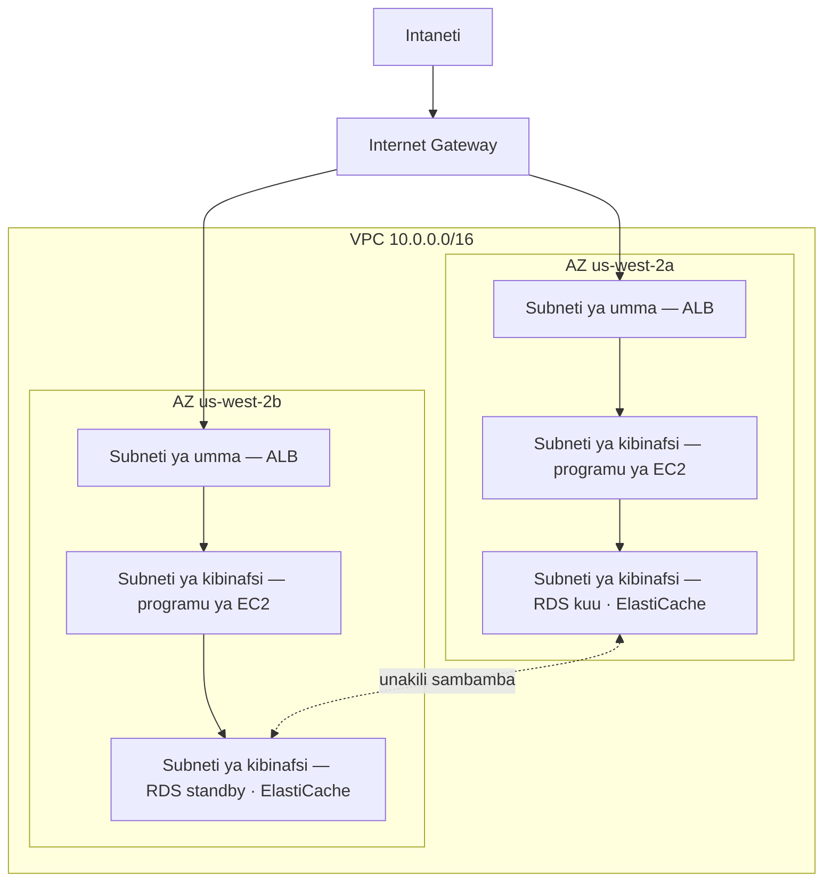

# Sura ya 11: Kona Yako ya Kibinafsi ya Wingu

Priya alikuwa na karatasi yenye mchoro.

Haukuwa mchoro mgumu. Mstatili, ulioandikwa "AWS." Ndani ya mstatili, kundi la visanduku: vihalisi vya EC2, hifadhidata ya RDS, klasta ya ElastiCache. Mistari ikiunganisha kila kitu na kila kitu kingine. Na nje ya mstatili, lebo moja: "Intaneti."

Aliiweka katikati ya meza.

---

*Safu ya kuweka akiba ilikuwa ikifanya kazi. Redis ilikuwa imekata upakiaji wa kurasa kutoka milisekunde 188 hadi 12. Lakini wakati Leo alikuwa akisherehekea ushindi huo, Priya alikuwa akisoma kumbukumbu za mtandao — na hakupenda alichokiona. Kila huduma ilikuwa kwenye mtandao bapa uleule. Hifadhidata ilikuwa na anwani ya IP ya umma. Klasta ya Redis kiufundi ilikuwa inaweza kufikiwa kutoka nje. Programu ilifanya kazi, lakini usanifu ulikuwa eneo la maegesho: hakuna uzio, hakuna mageti, hakuna kanda.*

---

"Hii ndiyo tuliyo nayo," alisema. "Hifadhidata yetu ina anwani ya IP ya umma. Safu yetu ya akiba inaweza kufikiwa kutoka intaneti. Vihalisi vyetu vya EC2 vyote viko kwenye mtandao bapa uleule."

"Hiyo inaonekana sawa," Leo alisema. "Tuna vikundi vya usalama."

"Vikundi vya usalama ulivyovisanidi wewe," Priya alisema. "Usiku. Wakati wa usanidi wa awali."

Leo hakusema kitu.

"Sikosoi usanidi," alisema. "Ninasema kwamba kila kitu kinapoishi kwenye mtandao bapa wa umma, usanidi mmoja usio sahihi ndio tofauti kati ya mfumo unaofanya kazi na ule unaofikika kwa kila mtu kwenye intaneti."

Alichukua kalamu nyekundu na kuchora duara kuzunguka hifadhidata.

"Hii haipaswi kufikiwa kutoka intaneti. Hata kidogo. Si kupitia sheria ya kikundi cha usalama, si kupitia usanidi mgumu. Inapaswa kuwa isiyofikika kimuundo."

"Tunahitaji kuzungumza kuhusu usanifu wa mtandao," Maya alisema.

"Tulihitaji kuuzungumzia miezi mitatu iliyopita," Priya alisema. "Lakini sasa ni sawa."

Timu ilikusanyika kuzunguka ubao mweupe kwa mara ya kwanza baada ya wiki.

**Tatizo la Eneo la Maegesho Wazi**

Hebu fikiria karakana kubwa ya maegesho ya umma. Magari elfu kumi. Gari lolote linaweza kuegesha popote. Hakuna vizuizi kati ya kanda, hakuna mageti, hakuna sehemu zilizohifadhiwa.

Huu ni mtandao wazi. Kila huduma inaweza kufikia kila huduma nyingine. Seva yako ya wavuti inaweza kuzungumza na hifadhidata yako. Hifadhidata yako inaweza kufikia intaneti. Safu yako ya kuweka akiba inaweza kupokea miunganisho kutoka popote.

Wakati kila kitu kinaweza kuzungumza na kila kitu, maelewano moja huathiri kila kitu.

"Kwa hivyo ikiwa mtu ataingia kwa nguvu kwenye karakana ya maegesho," Tom alisema, "anaweza kuingia kwenye gari lolote."

"Na kutoka gari lolote, kuendesha popote," Priya alithibitisha. "Tunataka uzio. Tunataka mageti yaliyofungwa. Tunataka kanda."

VPC ndiyo jinsi unavyojenga kanda hizo katika AWS.

**VPC ni Nini?**

"Subiri — lakini *kwa nini* tungeifanya hivyo?" Maya aliuliza. "Ikiwa tayari tuna vikundi vya usalama kwenye kila rasilimali, kwa nini tunahitaji VPC? Si vikundi vya usalama vinafanya kazi ileile?"

Vikundi vya usalama na VPC hulinda katika viwango tofauti. Kikundi cha usalama ni sheria iliyoambatishwa kwenye rasilimali mahususi — inasema "kihalisi hiki cha EC2 kinakubali tu trafiki kwenye lango 8080 kutoka kwa load balancer." Lakini bado kiko kwenye mtandao wa umma. Anwani ya IP bado inaweza kufikiwa; sheria hufunga tu muunganisho mlangoni. VPC huondoa mlango kutoka kwenye barabara ya umma kabisa. Rasilimali katika subneti ya kibinafsi haina *njia* ya kufikia intaneti — na kwa kawaida hakuna IP ya umma — kwa hivyo haiwezi kufikiwa kutoka intaneti, bila kujali kikundi cha usalama kinasema nini. Hilo ni uhakikisho wa kimuundo, si wa usanidi.

**Virtual Private Cloud (VPC)** ni sehemu iliyotengwa kimantiki ya wingu la AWS — mtandao wa kibinafsi unaoufafanua wewe, ambao rasilimali zako pekee zinaweza kuufikia kwa chaguomsingi.

Ifikirie kama eneo la kibinafsi lenye uzio ndani ya karakana kubwa ya maegesho ya umma. Eneo lako lina sheria zake: nani anaweza kuingia, nani anaweza kutoka, njia zipi zipo kati ya sehemu.

Unapounda VPC, unafafanua:

**Kizuizi cha CIDR**: Masafa ya anwani za IP zinazopatikana ndani ya mtandao wako. Kwa mfano, `10.0.0.0/16` hukupa anwani za IP 65,536 zinazowezekana (10.0.0.0 hadi 10.0.255.255).

**Subneti (Subnets)**: Migawanyiko ya VPC yako, kila moja ikitengewa sehemu ya masafa yako ya anwani za IP na kuhusishwa na Eneo mahususi la Upatikanaji.

**Majedwali ya njia (Route tables)**: Sheria zinazobainisha trafiki ya mtandao inakwenda wapi.

**Internet Gateway**: Muunganisho kati ya VPC yako na intaneti ya umma.

**Subneti: Umma dhidi ya Kibinafsi**

Si rasilimali zote zinapaswa kufikiwa na umma.

Seva yako ya wavuti inahitaji kukubali trafiki kutoka intaneti — vivinjari vya watumiaji vinahitaji kuifikia.

Hifadhidata yako *haipaswi kamwe* kukubali trafiki kutoka intaneti — seva yako ya wavuti pekee ndiyo inayopaswa kuwa na uwezo wa kuzungumza nayo.

Hapa ndipo subneti zinapoingia.

**Subneti ya umma** imeunganishwa kwenye Internet Gateway na inaweza kuwa na rasilimali zenye anwani za IP za umma. Trafiki inaweza kutiririka kwenda na kutoka intaneti.

**Subneti ya kibinafsi** haina njia ya kufikia intaneti katika jedwali lake la njia. Rasilimali katika subneti ya kibinafsi zinaweza kuwasiliana tu na rasilimali nyingine katika VPC yako (isipokuwa uweke njia mahususi za kwenda nje). Kwa kawaida, hazina anwani za IP za umma pia.

Kwa Nimbus, muundo ukawa wazi:



Load balancer inakabili umma — inahitaji kupokea trafiki kutoka intaneti. Vihalisi vya EC2 ni vya kibinafsi — hupokea tu trafiki kutoka load balancer. Hifadhidata ni za kibinafsi — hupokea tu trafiki kutoka vihalisi vya EC2.

"Kwa hivyo kufikia hifadhidata," Tom alisema, "mtu angelazimika kupita load balancer, kisha kupitia kihalisi cha EC2, kisha kupitia kikundi cha usalama cha hifadhidata?"

"Tabaka tatu," Priya alithibitisha. "Ulinzi kwa kina."

---

**Mpango wa CIDR wa Nimbus**

"Subiri — lakini *kwa nini* tungeifanya hivyo?" Maya aliuliza, akiangalia chaguzi za kizuizi cha CIDR. "Kwa nini Priya yuko mahususi sana kuhusu masafa ya anwani za IP? Hatuwezi tu kutumia chochote ambacho AWS inaweka kichaguomsingi?"

"Kwa sababu vizuizi vya CIDR ni vigumu sana kubadilisha baadaye," Priya alisema. "Na kwa sababu tukiwahi kuunganisha VPC hii na VPC nyingine, au na mtandao wa kawaida (on-premises), masafa ya IP yanayopishana husababisha hitilafu za uelekezaji ambazo ni za uchungu kutatua."

Alichora mpango kwenye ubao mweupe.

VPC ya Nimbus: `10.0.0.0/16` — anwani 65,536 jumla.

| Subneti | CIDR | AZ | Madhumuni |
|---|---|---|---|
| Public A | 10.0.0.0/24 | us-west-2a | Load balancer |
| Public B | 10.0.1.0/24 | us-west-2b | Load balancer |
| Private App A | 10.0.10.0/24 | us-west-2a | Seva za programu za EC2 |
| Private App B | 10.0.11.0/24 | us-west-2b | Seva za programu za EC2 |
| Private Data A | 10.0.20.0/24 | us-west-2a | RDS, ElastiCache |
| Private Data B | 10.0.21.0/24 | us-west-2b | RDS, ElastiCache |

"Kwa nini tusifanye tu kila kitu /16?" Leo aliuliza.

"Kwa sababu subneti katika AZ tofauti hazipaswi kushiriki nafasi ya anwani. Kila subneti iko katika AZ moja. Tukiwahi kuunganisha VPC hii na nyingine, kadiri tunavyokuwa na undani zaidi, ndivyo uwezekano wa kuwa na migongano unavyopungua. Na kila /24 hutupa anwani 251 zinazotumika — zaidi ya kutosha kwa tabaka lolote moja."

"AWS huhifadhi anwani tano katika kila subneti," Tom alibainisha, akiangalia nyaraka. "Ndio sababu ni 251, si 256."

"Sahihi. Nne za kwanza na ya mwisho moja. Anwani ya mtandao, kipanga njia cha VPC, seva ya DNS, matumizi ya baadaye, broadcast."

"Kwa hivyo /24 ndiyo ndogo zaidi ungeenda?"

"Kivitendo. Ungetumia /28 kwa subneti ndogo sana — kama subneti ya VPN gateway, ambayo inahitaji IP chache tu. Lakini kwa tabaka za programu, /24 ni kima cha chini cha busara."

Tom akaandika namba chini na kuhesabu tofauti ya gharama ya kila mwezi kati ya saizi. Siku zote alifanya hivyo.

---

**Makosa ya Kupanga CIDR ya Kuepuka**

"Tumefikiria kinachotokea ikiwa tutazidi subneti?" Priya aliuliza. Hakuwa akiuliza kwa sababu hakujua. Alikuwa akiuliza kwa sababu sehemu nyingine ya timu ilihitaji kuingiza jibu ndani.

Leo akafikiria. "Tunaweza kuongeza subneti zaidi?"

"Unaweza kuongeza subneti kwa VPC. Lakini huwezi kubadilisha ukubwa wa subneti iliyopo. Ikiwa subneti yako ya kibinafsi ya programu itajaa — anwani 251 hazitoshi — ungehitaji kuunda subneti mpya na kuhamisha vihalisi humo."

"Hilo hutokea mara ngapi kwa hakika?"

"Mara chache, ukipanga vizuri. Lakini watu hufanya makosa matatu ya kawaida."

Aliyaorodhesha:

**Kosa la kwanza**: Kutumia CIDR ndogo sana ya VPC. Ukitumia `10.0.0.0/24` kwa VPC nzima (anwani 254), utaishiwa nafasi kabla ya kumaliza kupanga subneti. Anza na `/16` kwa unyumbufu.

**Kosa la pili**: Kutumia CIDR zinazopishana katika VPC. Ikiwa VPC yako ya uzalishaji ni `10.0.0.0/16` na VPC yako ya staging pia ni `10.0.0.0/16`, huwezi kamwe kuziunganisha au kuziunganisha kupitia transit gateway. Vipanga njia havitajua VPC gani ya kutuma trafiki.

**Kosa la tatu**: Kutohifadhi nafasi ya anwani kwa tabaka za baadaye. Mpango wa Nimbus uliacha `10.0.30.0/24` na `10.0.31.0/24` bila kutengewa — nafasi kwa tabaka la baadaye la zana za ndani, subneti ya ufuatiliaji, au subneti ya mwisho ya VPN, bila kulazimika kupanga upya nafasi nzima ya anwani.

"Panga kwa mara mbili ya kile unachofikiri unahitaji," Priya alisema. "Subneti ni za bure. Nafasi ya anwani za IP kutoka `/16` ni nyingi. Gharama ya kupanga vibaya ni uhamishaji wa mtandao."

---

**NAT Gateway: Subneti za Kibinafsi Ambazo Bado Zinaweza Kupakua Vitu**

Subneti za kibinafsi haziwezi kufikia intaneti. Lakini wakati mwingine, zinahitaji. Kihalisi chako cha EC2 kinahitaji kupakua sasisho la programu. Programu yako inahitaji kuita API ya nje.

Hapa ndipo **NAT Gateway** (Network Address Translation) inapoingia.

NAT Gateway hukaa katika subneti ya umma. Rasilimali katika subneti za kibinafsi zinaweza kutuma trafiki ya kwenda nje kwa NAT Gateway, ambayo huipeleka kwenye intaneti — lakini intaneti haiwezi kuanzisha miunganisho kurudi.

Ni kama mlango unaozunguka wa upande mmoja. Unaweza kwenda nje. Hakuna mtu wa nje anayeweza kuingia.

"Hilo linagharimu kiasi gani kwa mwezi?" Tom aliuliza.

Bei ya NAT Gateway ina vipengele viwili: malipo ya kila saa kwa kila NAT Gateway, pamoja na ada ya kuchakata data kwa kila GB.

Wakati Nimbus walipoweka hili, hiyo ilikuwa takriban $32/mwezi kwa kila NAT Gateway, pamoja na $0.045 kwa kila GB ya data iliyochakatwa. Kwa kiasi kidogo cha trafiki, gharama isiyobadilika hutawala. Kwa kiwango kikubwa, malipo ya data yanaweza kuwa makubwa.

Tom aliweka tahadhari ya bili kwa gharama za kuchakata data kabla ya kumaliza usanidi wa NAT Gateway. Alikuwa ameona jinsi gharama za data za AWS zinavyoonekana wakati hakuna mtu anayezitazama.

Mshangao uliozishtua timu: kila baiti inayotiririka kupitia NAT Gateway hutozwa. Ikiwa vihalisi vyako vya EC2 katika subneti za kibinafsi vinapakua vifurushi vikubwa vya programu, vinatiririsha kumbukumbu kwa huduma za nje, au vinatuma data kubwa kwa API za nje, malipo ya data ya NAT Gateway huonekana kwenye bili kama mshangao. Suluhisho la trafiki ya AWS-kwa-AWS: VPC Endpoints huelekeza trafiki kwa huduma za AWS (S3, DynamoDB) kwa faragha, ikipita NAT Gateway kabisa na kuondoa malipo hayo ya data.

"Kwa hivyo vihalisi vya EC2 katika subneti ya kibinafsi hupakua masasisho ya OS kupitia NAT Gateway," Tom alisema. "Masasisho hayo ni gigabaiti ngapi?"

"Kwa kila kihalisi, kwa mwezi, pengine GB mbili hadi tano," Leo alisema.

"Mara vihalisi kumi. Mara miezi kumi na miwili. Kwa $0.045 kwa kila GB—"

"Dola kumi na moja hadi ishirini na saba kwa mwaka," Priya alimalizia. "Katika hali hii, linakubalika."

"Lakini kama tungekuwa tunatiririsha kumbukumbu — kama kutuma kumbukumbu zetu zote za programu kwa huduma ya nje ya uchunguzaji—"

"Tungeelekeza hizo kupitia VPC Endpoint au kutumia CloudWatch Logs badala ya kutoka nje kupitia NAT."

Tom akafunga kikokotoo. Hesabu ilikuwa wazi vya kutosha.

### NAT Instance: Mbadala wa Bajeti

"Subiri," Tom alisema, bado akikodolea ukurasa wa bei. "Tunalipa kwa kila gigabaiti ili tu kuruhusu vihalisi vya kibinafsi kufikia intaneti? Hilo ndilo chaguo pekee?"

"Ni chaguo linalosimamiwa," Priya alisema. "Kuna njia ya zamani, lakini inakuja na maafikiano."

Kabla NAT Gateway haijawepo, timu zilifanikisha uelekezaji uleule wa kwenda nje kwa kihalisi cha kawaida cha EC2 — "NAT instance." Ungeanzisha kihalisi cha EC2 katika subneti ya umma, ungewasha usambazaji wa IP katika OS, ungezima ukaguzi wa chanzo/marudio (ambao AWS huwasha kwa chaguomsingi kuangusha pakiti zisizoelekezwa kwa kihalisi), na kuelekeza jedwali la njia la subneti ya kibinafsi kwenye ENI ya kihalisi. Trafiki kutoka vihalisi vya kibinafsi ingetiririka kupitia hicho kwenda intaneti, kama NAT Gateway.

Bado inafanya kazi. AWS bado inaiandika. Na kwa kiasi kidogo sana cha trafiki — mazingira moja ya msanidi ambapo vihalisi vichache mara kwa mara hupakua vifurushi — kihalisi cha NAT cha `t3.micro` kinaweza kugharimu chini ya dola tano kwa mwezi, dhidi ya malipo ya kila saa yasiyobadilika ya NAT Gateway pamoja na ada za kila GB.

| | NAT Gateway | NAT Instance |
|---|---|---|
| Usimamizi | Inasimamiwa kikamilifu na AWS | Wewe husimamia EC2 |
| Upatikanaji | Yenye mrudufu ndani ya AZ | EC2 moja — sehemu moja ya kushindwa |
| Kipimo data | Hadi 100 Gbps, hupanuka kiotomatiki | Imepunguzwa na aina ya kihalisi cha EC2 |
| Gharama | $0.045/GB + malipo ya kila saa | Gharama ya kihalisi cha EC2 pekee |

Faida ya gharama hupotea haraka. Kwa kiasi cha maana cha trafiki, malipo ya kila GB ya NAT Gateway ni shindani na aina ya kihalisi cha EC2 ungehitaji kushughulikia kipimo data hicho — na NAT Gateway haihitaji kuweka viraka, kufuatilia, wala kujibu matukio inaposhindwa (haifanyi).

"Kwa hivyo tungetumia NAT instance lini kwa hakika?" Leo aliuliza.

"Mazingira ya msanidi ya kutupwa," Priya alisema. "Mahali unaendesha kihalisi kimoja au viwili, ukifanya masasisho ya vifurushi mara kwa mara, na unataka kupunguza gharama isiyobadilika. Mizigo ya kazi ya uzalishaji — chochote kinachohitaji kupatikana — NAT Gateway, moja kwa kila AZ."

Mtihani huapima maafikiano haya kwa jina. Mfumo: "punguza gharama ya NAT katika mazingira ya msanidi au jaribio yenye trafiki ndogo" huelekeza kwa NAT Instance. "Mzigo wa kazi wa uzalishaji unaohitaji upatikanaji wa juu" huelekeza kwa NAT Gateway iliyosambazwa kwa kila AZ.

Huenda unajiuliza: ikiwa vikundi vya usalama tayari vipo na huzuia trafiki kwa chaguomsingi, kwa nini VPC yenye subneti za kibinafsi inaongeza ulinzi wa maana? Kwa sababu "imezuiwa na kikundi cha usalama" na "isiyofikika kimuundo" ni vitu tofauti. Usanidi usio sahihi wa kikundi cha usalama — sheria moja isiyo sahihi, lango moja wazi — unaweza kufichua rasilimali yenye IP ya umma. Rasilimali katika subneti ya kibinafsi haina IP ya umma ya kufikia kwanza kabisa. Ungelazimika kuathiri load balancer na kihalisi cha EC2 kinachoendesha kabla hata ya kuweza kujaribu kufikia hifadhidata. Subneti za kibinafsi hutekeleza kutengwa katika kiwango cha mtandao, si kiwango cha sheria.

**Majedwali ya Njia: Jinsi Trafiki Inavyopata Njia Yake**

Kila subneti ina **jedwali la njia** linaloiambia trafiki iende wapi.

Jedwali la kawaida la njia la subneti ya umma linaonekana hivi:

| Marudio | Lengo                       |
|-------------|-----------------------------|
| 10.0.0.0/16 | local                       |
| 0.0.0.0/0   | igw-xxxx (Internet Gateway) |

Sheria ya kwanza: trafiki kwa IP yoyote katika masafa yako ya VPC hubaki ndani (local). Sheria ya pili: trafiki nyingine zote (`0.0.0.0/0` inamaanisha "kila kitu") huenda kwa Internet Gateway.

Jedwali la njia la subneti ya kibinafsi:

| Marudio | Lengo                  |
|-------------|------------------------|
| 10.0.0.0/16 | local                  |
| 0.0.0.0/0   | nat-xxxx (NAT Gateway) |

Trafiki ya subneti ya kibinafsi hubaki ndani au hutoka kupitia NAT Gateway. Hakuna njia ya moja kwa moja kwa Internet Gateway.

**Vikundi vya Usalama dhidi ya NACL (Maonyesho ya Awali)**

Ndani ya VPC, una zana mbili za kudhibiti trafiki katika kiwango cha rasilimali:

**Vikundi vya Usalama (Security Groups)** (Sura ya 15 inashughulikia hili kwa kina) hufanya kama ngome za mtandaoni za rasilimali mmoja mmoja — kihalisi cha EC2, kihalisi cha RDS, load balancer. Ni *vyenye hali (stateful)*: ikiwa trafiki itaruhusiwa kuingia, trafiki ya jibu inaruhusiwa kutoka kiotomatiki.

**Network ACLs (NACLs)** hufanya kazi katika kiwango cha subneti na ni *zisizo na hali (stateless)*: lazima uruhusu kwa uwazi trafiki ya kuingia na kutoka tofauti.

Kwa hali nyingi za matumizi, Vikundi vya Usalama vinatosha. NACL huongeza safu ya ziada unapohitaji vidhibiti vya kiwango cha subneti — kwa mfano, kuzuia masafa mahususi ya IP yasiwahi kufikia subneti.

"Vikundi vya usalama katika kiwango cha kihalisi," Leo aliandika kwenye ubao mweupe. "NACL katika kiwango cha subneti."

"Na usiwahi kuacha lango 22 wazi kwa 0.0.0.0/0," Priya aliongeza, akimtazama Leo.

"Hiyo ilikuwa mara moja," Leo alisema.

"Daima ni mara moja haswa," Priya alisema, "mpaka isiwe."

"Na vipi ikiwa mtu atajaribu kuvunja?" Priya alisema, bado kwenye ubao mweupe. "Si kupitia kikundi cha usalama kisichosanidiwa vizuri — vipi ikiwa wataathiri load balancer yenyewe? Ni nini kinachowazuia kupenya hadi subneti ya kibinafsi?"

"Vihalisi vya EC2 vya subneti ya kibinafsi hukubali tu trafiki kutoka kikundi cha usalama cha load balancer," Leo alisema. "Hata kama load balancer itaathiriwa, mvamizi anaweza tu kufanya maombi yanayoonekana kama miito ya kawaida ya API."

"Na hifadhidata hukubali tu trafiki kutoka kikundi cha usalama cha EC2," Priya alisema. "Ulinzi kwa kina. Kila tabaka huchukulia kuwa lile la awali linaweza kushindwa."

---

**VPC Flow Logs: Kuona Kinachoendelea**

"Tunahitaji macho kwenye mtandao," Priya alisema, siku tatu ndani ya ubunifu upya wa VPC.

"Tuna vikundi vya usalama na NACL," Leo alisema. "Trafiki imedhibitiwa."

"Imedhibitiwa hakumaanishi inaonekana. Ikiwa kitu cha ajabu kitatokea — jaribio la muunganisho lisilotarajiwa, trafiki kwa lango la ajabu — tunajuaje?"

VPC Flow Logs hunasa metadata kuhusu trafiki ya mtandao inayotiririka kupitia VPC yako. Si yaliyomo kwenye pakiti — ni habari za kiwango cha muunganisho tu: IP ya chanzo, IP ya marudio, lango, protokoli, idadi ya pakiti, idadi ya baiti, wakati wa kuanza, wakati wa kumaliza, na kama trafiki ilikubaliwa au kukataliwa.

Ingizo la kawaida la flow log linaonekana hivi:

```
2 123456789012 eni-0abc123 10.0.10.5 10.0.20.8 49321 5432 6 20 4320 1620000000 1620000060 ACCEPT OK
```

Hii inakuambia: kutoka `10.0.10.5` (kihalisi cha EC2 katika subneti ya programu) hadi `10.0.20.8` (kihalisi cha RDS), lango 5432 (PostgreSQL), pakiti 20, baiti 4,320, imekubaliwa. Trafiki ya kawaida.

Lakini siku chache baada ya kuwasha Flow Logs, Priya alipata hili:

```
2 123456789012 eni-0abc123 185.220.101.55 10.0.10.5 0 8080 6 1 40 1620003200 1620003201 REJECT OK
```

IP ya nje — `185.220.101.55` — ilikuwa imejaribu muunganisho kwa kihalisi cha EC2 kwenye lango 8080. Muunganisho ulikataliwa na kikundi cha usalama. Lakini jaribio liliingizwa kumbukumbu.

Aliitafuta IP. Ilikuwa ya kizuizi cha anwani cha Kiromania kinachojulikana kwa uchunguzaji otomatiki — aina ya upapasaji wa kelele za chinichini ambao kila IP ya umma kwenye intaneti hupokea kila wakati.

"Mtu anatupapasa," alisema.

"Lakini akikataliwa," Leo alisema.

"Mara hii. Washa GuardDuty" — huduma ya kugundua vitisho tutakayoikutana vizuri katika Sura ya 17 — "kabla hatujaendelea. Tunahitaji kugundua kwa kitabia, si kuzuia kwenye mzunguko tu."

Flow Logs huhifadhiwa katika CloudWatch Logs au S3. Zinaweza kuulizwa kwa kutumia CloudWatch Insights au Athena. Priya aliweka hoja ya CloudWatch Insights iliyoendeshwa kila usiku na kuashiria jaribio lolote la muunganisho lililokataliwa kutoka masafa ya IP yasiyo ya AWS.

"Hilo linagharimu kiasi gani kwa mwezi?" Tom aliuliza.

"Flow logs hutozwa kwa kila GB ya data inayoingizwa katika CloudWatch au S3. Kwa kiasi chetu cha trafiki, pengine dola nane hadi kumi na tano kwa mwezi."

Tom akasita. "Na mbadala ni kutojua mtu anapapasa mtandao wetu."

"Ndiyo."

"Hilo ni sawa," alisema, na kufungua koni.

**Kusoma Skanyo ya Lango katika Flow Logs**

Wiki mbili baada ya kuwasha flow logs, Priya aliendesha hoja yake ya kila usiku ya CloudWatch Insights na akapata kitu kipya. Si muunganisho mmoja uliokataliwa — kadhaa, kwa mfuatano wa haraka, kutoka IP ya chanzo kileile, kupitia malango yanayofuatana.

```
185.220.101.55 → 10.0.10.5 port 22   REJECT
185.220.101.55 → 10.0.10.5 port 23   REJECT
185.220.101.55 → 10.0.10.5 port 25   REJECT
185.220.101.55 → 10.0.10.5 port 80   REJECT
185.220.101.55 → 10.0.10.5 port 443  REJECT
185.220.101.55 → 10.0.10.5 port 3306 REJECT
185.220.101.55 → 10.0.10.5 port 5432 REJECT
185.220.101.55 → 10.0.10.5 port 6379 REJECT
```

Zote ndani ya dirisha la sekunde tano. Zote zilikataliwa.

"Hiyo ni skanyo ya lango (port scan)," Priya alisema. "Mtu anapapasa huduma gani kihalisi hiki kinaendesha."

"Lakini zote zilikataliwa," Leo alisema. "Kwa hivyo kikundi cha usalama kinafanya kazi yake."

"Kikundi cha usalama kinafanya kazi yake. Skanyo bado inafahamisha mvamizi — inawaambia malango gani *hayakukataa* ndani ya muda fulani, ambayo inamaanisha malango hayo yako wazi mahali fulani. Na inawaambia mwenyeji huyu yu hai na anastahili kuchunguzwa."

"Tunafanya nini?"

"Mambo mawili," Priya alisema. "Kwanza: ongeza sheria ya NACL kuzuia masafa ya /24 ambayo IP hiyo inayostahili. Si IP hiyo tu — subneti nzima. Vipapasaji vya lango huzungusha IP ndani ya masafa. Pili: ongeza kengele ya CloudWatch inayowaka wakati IP yoyote moja ya chanzo inazalisha zaidi ya miunganisho kumi iliyokataliwa katika sekunde sitini. Mfumo huo karibu daima ni skanyo."

Aliweka zote mbili. Kengele iliwaka mara mbili wiki iliyofuata — mara moja kutoka masafa yaleyale ya Kiromania, mara moja kutoka kipapasaji otomatiki kilichoko Singapore. Zote zilizuiwa kwenye NACL ndani ya dakika za kugunduliwa.

Flow logs hazizuii mashambulizi. Zinafanya mashambulizi kuonekana. Na mashambulizi yanayoonekana yanaweza kujibiwa. Mbadala — trafiki ikitiririka bila kuonekana — inamaanisha ishara ya kwanza ya tatizo ni uharibifu, si jaribio.

---

**Mtego wa NAT Gateway Moja**

Miezi mitatu baada ya ubunifu upya wa VPC, Priya aliendesha uigaji wa kushindwa. Alitaka kujua nini kingetokea kwa Nimbus ikiwa eneo la upatikanaji la `us-west-2a` lingepata usumbufu.

Sehemu kubwa yake ilikuwa sawa. Load balancer ilihamia vihalisi vilivyoko `us-west-2b`. RDS standby katika `us-west-2b` ilikuwa tayari hai. ElastiCache ilipandisha nakala. Programu iliendelea kuhudumia maombi.

Kisha Leo aligundua kuwa vihalisi vyake vya EC2 katika `us-west-2b` vilikuwa vimeacha kupokea arifa za sasisho la OS. Aliangalia usanidi wa NAT Gateway.

Kulikuwa na moja. Katika `us-west-2a`.

"Trafiki yote ya intaneti ya kwenda nje kutoka subneti za kibinafsi katika AZ zote mbili huelekezwa kupitia NAT Gateway moja katika AZ moja," Priya alisema.

"Kwa hivyo ikiwa `us-west-2a` itashuka—"

"Kila kihalisi cha EC2 katika `us-west-2b` hupoteza ufikiaji wa intaneti wa kwenda nje. Haviwezi kupakua masasisho. Haviwezi kufikia API za nje. Utafutaji wa Secrets Manager ambao haujawekwa akiba utashindwa. Chochote kinachohitaji intaneti ya kwenda nje kitavunjika."

Suluhisho: NAT Gateway moja kwa kila AZ. Subneti za kibinafsi za kila AZ huelekeza trafiki ya kwenda nje kwa NAT Gateway katika AZ ileile. AZ inaposhindwa, trafiki ya AZ hiyo pekee ndiyo inayoathiriwa.

"Na bei ya suluhisho hilo?" Tom aliuliza.

"Dola thelathini na mbili za ziada kwa mwezi kwa NAT Gateway ya AZ ya pili."

Tom alikaa kimya kwa muda.

"Kapasiti ya kompyuta katika `us-west-2b` ikishindwa kufikia API za nje wakati wa kukatika," Priya alisema, "inagharimu zaidi ya dola thelathini na mbili."

Tom aliidhinisha mabadiliko.

Hili ni mojawapo ya makosa ya kawaida ya muundo wa VPC: NAT Gateway inayoonekana kuwa na upatikanaji wa juu lakini kwa kweli ni sehemu moja ya kushindwa. Ikiwa una rasilimali katika AZ tatu na NAT Gateway moja, una ustahimilivu wa kompyuta wa AZ tatu lakini ustahimilivu wa mtandao wa AZ moja. Hizi mbili hazilingani.

Kanuni: NAT Gateway moja kwa kila AZ, katika subneti ya umma ya AZ hiyo. Jedwali la njia la kibinafsi la kila AZ huelekeza kwa NAT Gateway yake. Gharama ni ndogo. Uboreshaji wa upatikanaji ni halisi.


---

**VPC Peering: Kuunganisha Mitandao ya Kibinafsi**

Vipi ikiwa Nimbus itakua hadi VPC nyingi? (Hili hutokea. Timu zinakuwa kubwa. Huduma hutengwa katika akaunti tofauti.)

**VPC Peering** huruhusu VPC mbili kuwasiliana kwa faragha kana kwamba ziko kwenye mtandao uleule. Trafiki haiondoki kwenye mtandao wa kibinafsi wa AWS.

Vikomo muhimu:

- VPC peering si ya mpito (transitive). Ikiwa VPC A imeunganishwa na VPC B, na VPC B imeunganishwa na VPC C, A na C haziwezi kuwasiliana — isipokuwa uongeze muunganisho wa moja kwa moja wa A-C.
- Vizuizi vya CIDR haviwezi kupishana kati ya VPC zilizounganishwa.

Kwa usanifu mkubwa wenye VPC nyingi, **AWS Transit Gateway** (Sura ya 25) hushughulikia uelekezaji wa mpito bila kuhitaji wavu kamili wa miunganisho ya peering.

---

**AWS PrivateLink: Ufikiaji wa Kibinafsi kwa Huduma za AWS**

"Vipi kuhusu kufikia S3 kutoka subneti ya kibinafsi?" Leo aliuliza. "Vihalisi vyetu vya EC2 huandika risiti kwa S3. Hivi sasa trafiki hiyo hutoka nje kupitia NAT Gateway."

"VPC Endpoints," Priya alisema. "Hasa, Gateway Endpoints kwa S3 na DynamoDB — ni za bure."

**VPC Endpoint** huunda muunganisho wa kibinafsi kati ya VPC yako na huduma ya AWS, ikipita intaneti ya umma kabisa. Trafiki kati ya subneti yako ya kibinafsi na huduma ya AWS hubaki kwenye mtandao wa AWS. Hakuna malipo ya NAT Gateway. Hakuna ufichuzi wa intaneti.

Kwa S3 na DynamoDB, **Gateway Endpoints** ni za bure na rahisi: ongeza ingizo kwenye jedwali la njia likielekeza trafiki ya S3/DynamoDB kwa endpoint badala ya NAT Gateway.

Kwa huduma nyingine za AWS (Secrets Manager, KMS, SNS, SQS), **Interface Endpoints** huunda kiolesura cha mtandao kinachonyumbulika (ENI) katika subneti yako chenye anwani ya IP ya kibinafsi. Trafiki kwa huduma huenda kwenye IP hiyo ya kibinafsi. Interface endpoints hugharimu pesa — takriban $0.01/saa **kwa kila AZ ambamo endpoint imetolewa** (endpoint yenye ENI katika AZ tatu hugharimu mara tatu ya kiwango cha kila saa), pamoja na takriban $0.01/GB ya data iliyochakatwa — lakini huondoa hitaji la kuelekeza miito nyeti ya API (kama utafutaji wa Secrets Manager) kupitia NAT Gateway au juu ya intaneti ya umma.

"Kwa hivyo vihalisi vyetu vya EC2 vinaweza kufikia S3, DynamoDB, Secrets Manager, na KMS," Priya alisema, "vyote kutoka subneti ya kibinafsi, bila ufichuzi wowote wa intaneti, na kwa S3 na DynamoDB, bila malipo yoyote ya data ya NAT Gateway."

Tom alihesabu upya. Akiba ya trafiki ya S3 ingefidia gharama ya Interface Endpoint kwa Secrets Manager ndani ya miezi michache.

"PrivateLink ndilo jina la jumla," Priya aliongeza. "AWS PrivateLink ni teknolojia ya msingi ya Interface Endpoints. Mtihani hutumia maneno yote mawili."

---

**Orodha ya Ukaguzi ya Utatuzi**

Miezi mitatu baada ya ubunifu upya wa VPC, Leo alivunja mtandao. Si kwa kushtua — alikuwa amerekebisha uhusiano wa jedwali la njia na bila kukusudia akakata uhusiano wa subneti ya kibinafsi ya programu kutoka kwa njia yake ya NAT Gateway.

Vihalisi vya EC2 havikuweza kufikia API za nje. Vingeweza kufikiana, na vingeweza kufikia hifadhidata. Ila tu si intaneti. Miito ya HTTPS ya kwenda nje ilianza kushindwa.

Alitumia dakika arobaini akitatua kabla Priya hajampa orodha ya ukaguzi.

"Wakati kitu kinaposhindwa kufikia kitu kingine katika VPC, angalia haya kwa mpangilio," alisema.

1. **Kikundi cha usalama kwenye chanzo**: Je, sheria ya kwenda nje ni sahihi? Je, inaruhusu trafiki unayojaribu kutuma?
2. **Kikundi cha usalama kwenye marudio**: Je, sheria ya kuingia ni sahihi? Je, inaruhusu trafiki kutoka chanzo?
3. **NACL kwenye subneti ya chanzo**: Je, kuna sheria ya kukataa ya kuingia inayozuia trafiki ya jibu? Je, kuna sheria ya kuruhusu ya kwenda nje?
4. **NACL kwenye subneti ya marudio**: Je, kuna sheria ya kuruhusu ya kuingia? Je, kuna sheria ya kuruhusu ya kwenda nje kwa majibu?
5. **Jedwali la njia kwenye subneti ya chanzo**: Je, lina njia ya kufikia marudio? Je, njia inaelekeza kwa lengo sahihi (NAT Gateway, IGW, VPC Endpoint)?
6. **Jedwali la njia kwenye subneti ya marudio**: Je, lina njia ya kurudi kwa chanzo?
7. **Sera ya VPC Endpoint**: Ikiwa unatumia VPC Endpoint, je, sera ya endpoint inaruhusu kitendo?
8. **Idhini za IAM**: Je, jukumu la EC2 lina ruhusa ya kuita huduma? (Kwa miito ya API ya AWS)

Leo aliipata kwenye hatua ya 5. Jedwali la njia lilikuwa limeunganishwa upya kwa subneti ya kibinafsi isiyo sahihi. Njia ya NAT Gateway ilikuwa imekosekana.

"Kama ningekuwa na orodha hii miezi mitatu iliyopita," alisema, "ningeipata ndani ya dakika tano."

"Utakuwa nayo kuanzia sasa," Priya alisema.

## Direct Connect: Laini Iliyojitolea

Miezi mitatu baada ya ubunifu upya wa VPC, Nimbus walifunga mkataba na Harborview Dining Group — mlolongo wa biashara wa maeneo mia moja uliochakata dola milioni mbili katika miamala kwa siku.

Simu ya ukaguzi wa kiufundi ilianza vizuri. Kisha afisa wao wa uzingatiaji aliondoa kimya.

"Hatuwezi kuelekeza data ya miamala ya uzalishaji juu ya intaneti ya umma," alisema. "Wakaguzi wetu wanahitaji njia ya mtandao iliyojitolea, ya kibinafsi, inayoweza kukaguliwa kati ya kituo chetu cha data na mazingira yoyote ya wingu. Site-to-Site VPN haikubaliki. Inashiriki kipimo data na kila mtu mwingine. Inasafiri waya zilezile kama trafiki ya watumiaji."

Tom alimwangalia Leo. Leo alimwangalia Priya.

"Kwa usahihi," Priya alisema kwa makini, "PCI DSS yenyewe haikatazi VPN iliyosimbwa juu ya intaneti — usafiri uliosimbwa hukidhi kiwango. Unachokielezea ni sera ya ndani ya wakaguzi wenu, ambayo ni kali zaidi. Hiyo ni halali. Na kuna huduma kwa ajili yake."

**AWS Direct Connect** ni muunganisho wa kimwili wa mtandao uliojitolea kati ya kituo chako cha data cha kawaida na AWS. Muunganisho hupita intaneti ya umma kabisa — trafiki yako haigusi kamwe miundombinu iliyoshirikiwa, haishindani kamwe kwa kipimo data na mtu mwingine, na haisafiri kamwe waya isiyokuwa yako.

Kuweka Direct Connect kunamaanisha kufanya kazi na AWS na mtoaji wa colocation au mtandao kusakinisha cross-connect ya kimwili katika eneo la Direct Connect — kituo cha data ambapo AWS ina vifaa vilivyojitolea. Mara kiungo cha kimwili kikiwekwa, unaanzisha violesura vya kawaida juu yake vinavyounganisha kwa VPC yako au kwa huduma za AWS moja kwa moja.

**Sifa muhimu:**

Kipimo data huja katika namna mbili. *Miunganisho iliyojitolea (dedicated connections)* huenda moja kwa moja kwa vifaa vya AWS: 1 Gbps, 10 Gbps, au 100 Gbps. *Miunganisho iliyopangishwa (hosted connections)* huenda kupitia AWS Partner na hutoa chaguzi za undani zaidi kuanzia 50 Mbps hadi 10 Gbps — muhimu wakati huhitaji lango kamili lililojitolea.

Ucheleweshaji ni thabiti. Kwa sababu hushindani kwa kipimo data cha intaneti, muda wa kwenda-na-kurudi kwa AWS unatabirika. Kwa Harborview, ambao mifumo yao ya point-of-sale ilifanya mamia ya miito ya API kwa kila muamala, ucheleweshaji thabiti wa chini ya 5ms ulikuwa tofauti kati ya malipo ya 200ms na ya 400ms.

Faragha ni ya kimuundo, si ya kiusanidi. Site-to-Site VPN imesimbwa, lakini bado hupita intaneti ya umma — miundombinu ileile ya kimwili inayotumiwa na kila mtu mwingine. Trafiki ya Direct Connect haigusi kamwe intaneti ya umma. Kwa timu ya uzingatiaji ya Harborview, hilo ndilo lilikuwa hitaji, na hakuna kiwango chochote cha usanidi wa VPN kingelitosheleza.

Gharama ni ya juu kuliko VPN. Unalipa malipo ya saa-ya-lango kwa muunganisho wa Direct Connect pamoja na bei ya uhamishaji wa data. Muunganisho si nafuu, na huchukua wiki hadi miezi kutoa — usakinishaji wa cross-connect ya kimwili si kitu unachoanzisha Ijumaa alasiri.

"Subiri," Maya alisema. "Ikiwa VPN imesimbwa, kwa nini inajalisha kwamba inaenda juu ya intaneti ya umma?"

Kwa sababu hitaji la uzingatiaji si kuhusu usimbaji tu — ni kuhusu kutengwa. VPN husimba yaliyomo kwenye trafiki, lakini trafiki bado hupita miundombinu ya kimwili iliyoshirikiwa. Yeyote anayedhibiti kipanga njia kwenye njia anaweza kuona pakiti zilizosimbwa, kuzirekodi, na kujaribu kuzifungua baadaye. Kiungo cha kimwili kilichojitolea hakina vipanga njia vilivyoshirikiwa. Njia ni yako kimwili. Kwa viwanda vyenye mahitaji makali ya uhuru wa data — fedha, afya, serikali — tofauti hiyo ndio tofauti kati ya kuzingatia na kutozingatia.

"Jambo moja zaidi," Priya alisema. "Direct Connect ni ya kibinafsi kwa chaguomsingi, lakini si iliyosimbwa kwa chaguomsingi. Ukitaka vyote viwili — ya kibinafsi na iliyosimbwa — unaendesha IPSec VPN juu ya muunganisho wa Direct Connect. Hilo hukupa kipimo data kilichojitolea pamoja na usimbaji. Vyote viwili."

Tom alikuwa tayari ameipata ukurasa wa bei. Aliangalia ahadi ya kila mwezi ya muunganisho wa 1 Gbps Dedicated.

"Kiasi cha kila siku cha Harborview cha $2M kinamaanisha hii hujilipia kwa makosa ya kuzungusha namba," alisema.

Akatuma pendekezo.

---

> **Kidokezo cha Mtihani — Direct Connect dhidi ya VPN**
>
> *Kikoa cha SAA-C03: Buni Usanifu Salama (Kikoa cha 1)*
>
> - **VPN:** iliyosimbwa, ya haraka kutoa (dakika), husafiri intaneti ya umma, kipimo data na ucheleweshaji vinavyobadilika.
> - **Direct Connect:** kiungo cha kimwili kilichojitolea, kipimo data na ucheleweshaji thabiti, ya kibinafsi (trafiki haigusi kamwe intaneti ya umma), lakini si iliyosimbwa kwa chaguomsingi. Huchukua wiki hadi miezi kutoa.
> - **Iliyosimbwa NA ya kibinafsi:** endesha IPSec VPN juu ya Direct Connect. Unapata kipimo data kilichojitolea na usimbaji vyote.
> - **Kiamsha cha mtihani:** "kipimo data thabiti, cha kibinafsi, kilichojitolea kwa AWS" au "uzingatiaji unahitaji trafiki isisafiri intaneti ya umma" → Direct Connect. "Iliyosimbwa NA ya kibinafsi" → Direct Connect + IPSec VPN. "Ya haraka kuweka, gharama ya chini, inakubalika kutumia intaneti ya umma" → Site-to-Site VPN.
> - **Gharama na muda wa kuweka** ndizo maafikiano ambazo mtihani huapima: VPN = haraka + nafuu; Direct Connect = polepole kutoa + ghali + thabiti.

---

### Client VPN: Ufikiaji wa Mbali kwa Watumiaji Mmoja Mmoja

Direct Connect na Site-to-Site VPN huunganisha mitandao — ofisi nzima au kituo cha data kwa AWS. Lakini wahandisi pia wanahitaji kuunganisha laptop mmoja mmoja kwa VPC: kutatua kihalisi cha EC2 cha kibinafsi, kuuliza hifadhidata ya RDS ya kibinafsi, au kufikia zana za ndani kutoka nyumbani.

"Si tayari tunalo hili?" Maya aliuliza. "Tuna bastion host. Leo hawezi tu kufanya SSH kupitia hiyo?"

"Kwa SSH, ndiyo," Priya alisema. "Lakini vipi ikiwa Leo anahitaji kuunganisha kwa kihalisi cha RDS kutoka GUI ya hifadhidata kwenye laptop yake? Au kuuliza dashibodi ya vipimo vya ndani juu ya HTTP? Bastion hushughulikia SSH tu. Client VPN hufanya kazi kwa protokoli yoyote."

**AWS Client VPN** ni endpoint ya VPN inayosimamiwa inayoruhusu watumiaji mmoja mmoja kuunganisha kwa VPC yako kutoka kifaa chochote, kutoka popote. Watumiaji husakinisha mteja wa kawaida wa OpenVPN kwenye laptop yao; endpoint ya VPN iko katika AWS.

Sifa muhimu:

- Inasimamiwa na AWS — wewe huendeshi seva ya VPN
- Imejengwa juu ya OpenVPN — hufanya kazi na mteja yeyote wa kawaida wa OpenVPN
- Uthibitishaji kupitia Active Directory (kulingana na mtumiaji), TLS ya pamoja kulingana na cheti, au uthibitishaji wa SAML 2.0 wa shirikisho (SSO kupitia mtoaji wa utambulisho)
- Kila mteja aliyeunganishwa hupata IP ya kibinafsi katika VPC yako na anaweza kufikia rasilimali za kibinafsi (RDS, ElastiCache, huduma za ndani) kana kwamba yuko ndani ya VPC
- Inaunga mkono **split-tunnel** (trafiki ya VPC pekee huenda kupitia VPN — trafiki ya intaneti huenda moja kwa moja) au **full-tunnel** (trafiki yote kupitia VPN)

"Split-tunnel," Tom alisema mara moja.

"Kwa nini?" Leo aliuliza.

"Kwa sababu full-tunnel inamaanisha mtiririko wangu wa Netflix huenda kupitia endpoint yetu ya VPN na ninalipa malipo ya uhamishaji wa data juu yake."

Hiyo ilikuwa sahihi. Split-tunnel ndilo pendekezo la chaguomsingi kwa ufikiaji wa msanidi: trafiki iliyofungamana na VPC huelekezwa kupitia VPN, trafiki ya intaneti huenda moja kwa moja nje. VPN hushughulikia tu kile kinachohitaji kuwa cha kibinafsi.

**dhidi ya Site-to-Site VPN:** Site-to-Site huunganisha mitandao miwili (ofisi ↔ VPC). Client VPN huunganisha vifaa mmoja mmoja (laptop ↔ VPC).

**dhidi ya bastion host:** bastion host inahitaji SSH; Client VPN hufanya kazi kwa protokoli yoyote — miunganisho ya hifadhidata, huduma za ndani za HTTP, chochote kinachoendesha juu ya TCP au UDP.

> **Kidokezo cha Mtihani — Client VPN dhidi ya Site-to-Site VPN**
>
> - **Site-to-Site VPN:** mtandao-kwa-mtandao (ofisi kwa VPC, kituo cha data kwa VPC).
> - **Client VPN:** kifaa kimoja kwa VPC (wahandisi wanaofanya kazi kwa mbali, wakifikia rasilimali za kibinafsi kutoka nyumbani).
> - Kiamsha cha mtihani: "watumiaji wanahitaji kufikia rasilimali za VPC za kibinafsi kutoka nyumbani" au "wasanidi wa mbali wanahitaji ufikiaji wa hifadhidata" → Client VPN. "Unganisha ofisi nzima ya tawi kwa AWS" → Site-to-Site VPN.

---

## Nguvu na Mapungufu

**Kwa nini muundo wa VPC unajalisha**:

- Kutengwa kwa mtandao ni ulinzi kwa kina — kuvunja tabaka moja hakumaanishi kuathiri kila kitu
- Subneti za kibinafsi hupunguza uso wa shambulizi kwa kiasi kikubwa
- Majedwali ya njia na vikundi vya usalama hutoa udhibiti sahihi wa mtiririko wa trafiki
- VPC huunganishwa na kila huduma ya mtandao ya AWS (Direct Connect, VPN, Transit Gateway)
- Flow Logs hufanya trafiki ya mtandao kuonekana na kukaguliwa

**Pale inapokuwa ngumu**:

- Muundo wa VPC unahitaji upangaji wa awali — vizuizi vya CIDR ni vigumu kubadilisha baadaye
- VPC ndogo nyingi sana huunda ugumu wa peering (tatizo la n-mraba)
- Kutatua matatizo ya mtandao katika VPC kunahitaji kuelewa majedwali ya njia, vikundi vya usalama, NACL, na uhusiano wa subneti kwa wakati mmoja
- Gharama za NAT Gateway zinaweza kukushtua kwa kiwango kikubwa (ada za kuchakata kwa kila GB)
- VPC Endpoints hupunguza gharama za NAT lakini huongeza malipo yao ya kila saa kwa endpoints zisizo za gateway

## Muhtasari

Ubunifu upya wa mtandao ulichukua siku tatu. Kila rasilimali iliishia mahali pake sahihi — na mahali sahihi kulimaanisha ingeweza kufikiwa tu na huduma zile haswa zilizoihitaji, na hakuna kingine. Muundo mzuri wa mtandao haufanyi tu uvunjaji kuwa mgumu zaidi; huzuia mvamizi anachoweza kufanya baada ya uvunjaji.

- **VPC** ni mtandao wa kibinafsi uliotengwa kimantiki katika AWS — eneo lako lenye uzio ndani ya wingu la umma.
- **Subneti** hugawanya VPC yako kwa Eneo la Upatikanaji. Subneti za umma huunganisha kwa Internet Gateway; subneti za kibinafsi hazifanyi.
- Weka rasilimali zinazokabili intaneti (load balancer) katika subneti za umma. Weka kila kitu kingine (EC2, hifadhidata, akiba) katika subneti za kibinafsi.
- **Majedwali ya njia** hudhibiti trafiki inakotiririka. Kila subneti ina moja.
- **NAT Gateway** (katika subneti ya umma) huruhusu rasilimali za kibinafsi kuanzisha miunganisho ya intaneti ya kwenda nje bila kukubali miunganisho ya kuingia.
- **VPC Flow Logs** hurekodi metadata kuhusu trafiki yote ya mtandao — muhimu kwa uonekanaji wa usalama na utatuzi.
- **VPC Endpoints** huunganisha subneti za kibinafsi kwa huduma za AWS bila kupitia NAT Gateway au intaneti ya umma. Gateway Endpoints (S3, DynamoDB) ni za bure.
- Panga vizuizi vyako vya CIDR kwa makini — ni vigumu sana kubadilisha baada ya rasilimali kusambazwa.

## Vidokezo vya Mtihani

*Kikoa cha SAA-C03: Buni Usanifu Salama (Kikoa cha 1, Kazi ya 1.2)*

- **Subneti ya umma dhidi ya kibinafsi**: tofauti ni jedwali la njia. Subneti ya umma ina njia kwa Internet Gateway. Subneti ya kibinafsi haina.
- **Uwekaji wa NAT Gateway**: daima katika subneti ya *umma*. Rasilimali za subneti ya kibinafsi huelekeza trafiki ya kwenda nje kwake.
- **Upatikanaji wa juu kwa NAT**: unda NAT Gateway kwa kila AZ. Ikiwa una NAT Gateway moja katika AZ-a na vihalisi vya AZ-b huelekeza kupitia hicho, kushindwa kwa AZ-a kunaangusha ufikiaji wa intaneti wa AZ-b pia.
- **VPC Peering si ya mpito**: mtihani utaeleza VPC tatu na kuuliza kama zinaweza kuwasiliana kupitia ile ya kati — jibu ni hapana bila peering ya moja kwa moja au Transit Gateway.
- **Mpishano wa CIDR**: VPC zilizounganishwa haziwezi kuwa na vizuizi vya CIDR vinavyopishana. Mtego wa kawaida wa mtihani.
- **Bastion host (jump box)**: kufanya SSH kwa kihalisi cha EC2 cha kibinafsi, unahitaji bastion host katika subneti ya umma. Bastion ndiyo mashine pekee yenye IP ya umma; vihalisi vya kibinafsi hukubali tu SSH kutoka kikundi cha usalama cha bastion.
- **VPC Endpoints**: huruhusu rasilimali za kibinafsi kufikia huduma za AWS (S3, DynamoDB) bila kupitia NAT Gateway. Aina mbili: **Gateway endpoints** (S3, DynamoDB — za bure) na **Interface endpoints** (huduma nyingine — bei kwa saa pamoja na data).
- **VPC Flow Logs**: metadata pekee — si yaliyomo kwenye pakiti. Hutumiwa kwa uchanganuzi wa usalama, utatuzi wa mtandao, na uzingatiaji. Zinaweza kutumwa kwa CloudWatch Logs au S3.
- **NAT Gateway dhidi ya NAT Instance**: NAT Gateway inasimamiwa, ya HA, hupanuka kiotomatiki lakini hugharimu kwa kila GB. NAT Instance ni EC2 inayojisimamia yenye usambazaji wa IP — nafuu kwa kiasi kidogo sana cha trafiki, lakini sehemu moja ya kushindwa. Kiamsha cha mtihani: "punguza gharama ya NAT katika dev/test" → NAT Instance.
- **Direct Connect dhidi ya VPN**: VPN = iliyosimbwa, ya haraka kutoa, husafiri intaneti ya umma, kipimo data kinachobadilika. Direct Connect = kiungo cha kimwili kilichojitolea, kipimo data/ucheleweshaji thabiti, ya kibinafsi (si iliyosimbwa kwa chaguomsingi), wiki kutoa. Kiamsha cha mtihani: "kipimo data thabiti, cha kibinafsi, kilichojitolea" → Direct Connect. "Iliyosimbwa NA ya kibinafsi" → Direct Connect + IPSec VPN juu yake. "Ya haraka, gharama ya chini, intaneti ya umma inakubalika" → Site-to-Site VPN.
- **Client VPN dhidi ya Site-to-Site VPN**: Site-to-Site = mtandao-kwa-mtandao (ofisi kwa VPC). Client VPN = kifaa kimoja kwa VPC (wahandisi wanaofanya kazi kwa mbali). Kiamsha cha mtihani: "watumiaji wanahitaji kufikia rasilimali za kibinafsi kutoka nyumbani" → Client VPN. "Unganisha ofisi ya tawi kwa AWS" → Site-to-Site VPN.

## Mazoezi

**Zoezi la 1 — Kumbuka**

Eleza kwa nini hifadhidata inapaswa kuwa katika subneti ya kibinafsi. Hili linapunguza tishio gani mahususi?

*(Kidokezo: Mtu anaweza kufanya nini kwa hifadhidata iliyo kwenye intaneti ya umma ambacho hawezi kufanya kwa ile inayofikika tu kutoka ndani ya VPC?)*

**Zoezi la 2 — Hali ya SAA-C03**

*Hali*: Kampuni inabuni programu ya wavuti ya tabaka tatu kwenye AWS. Tabaka la wavuti (ALB + EC2) lazima likubali trafiki ya intaneti. Tabaka la programu (EC2) lazima lipokee trafiki kutoka tabaka la wavuti pekee. Tabaka la hifadhidata (RDS) lazima lipokee trafiki kutoka tabaka la programu pekee. Vihalisi vya EC2 vya tabaka la programu vinahitaji kupakua vifurushi vya programu kutoka intaneti. Suluhisho lazima liwe na upatikanaji wa juu.

Ni usanifu upi unaokidhi mahitaji haya BORA zaidi?

A) Tabaka zote katika subneti za umma; vikundi vya usalama huzuia trafiki kati ya tabaka  
B) Tabaka la wavuti katika subneti za umma; tabaka za programu na hifadhidata katika subneti za kibinafsi; NAT Gateway moja katika subneti ya umma  
C) Tabaka la wavuti katika subneti za umma; tabaka za programu na hifadhidata katika subneti za kibinafsi; NAT Gateway moja kwa kila AZ  
D) Tabaka zote katika subneti za kibinafsi; Internet Gateway hutoa ufikiaji wa intaneti wa pande mbili kwa tabaka zote

**Kidokezo cha 1**: "Upatikanaji wa juu" inamaanisha hakuna sehemu moja ya kushindwa. Ni chaguo gani huanzisha NAT Gateway kama sehemu moja ya kushindwa?

**Kidokezo cha 2**: Ikiwa AZ ya NAT Gateway itashuka, ni vihalisi gani hupoteza ufikiaji wa intaneti?

**Kidokezo cha 3**: Soma hitaji kwa makini — tabaka la programu linahitaji ufikiaji wa intaneti wa *kwenda nje*, si wa kuingia.

**Jibu**: C

**Maelezo**: Tabaka la wavuti katika subneti za umma hutoa ufikiaji unaokabili intaneti kupitia ALB. Tabaka za programu na hifadhidata katika subneti za kibinafsi huhakikisha hazifikiki moja kwa moja kutoka intaneti. NAT Gateway moja kwa kila AZ (moja katika kila subneti ya umma) hutoa ufikiaji wa intaneti wa kwenda nje wenye upatikanaji wa juu kwa vihalisi vya subneti za kibinafsi — ikiwa AZ moja itashindwa, NAT Gateway ya AZ nyingine inaendelea kuhudumia trafiki.

**Kwa nini si A?** Subneti za umma kwa tabaka zote hufichua programu na hifadhidata moja kwa moja kwa intaneti, ikishinda madhumuni ya muundo wa usalama wa tabaka.

**Kwa nini si B?** NAT Gateway moja katika AZ moja ni sehemu moja ya kushindwa. Ikiwa NAT Gateway ya AZ hiyo itashindwa, vihalisi vyote vya kibinafsi hupoteza ufikiaji wa intaneti wa kwenda nje.

**Kwa nini si D?** Internet Gateway hutoa muunganisho wa pande mbili — subneti za kibinafsi zenye njia kwa Internet Gateway kwa hakika ni subneti za umma.

*Kikoa cha SAA-C03: Buni Usanifu Salama — Kazi ya 1.2*

**Zoezi la 3 — Changamoto ya Usanifu** *(Si lazima)*

Nimbus inakua. Timu ya uhandisi inataka kutenganisha "huduma ya menyu" katika akaunti yake yenye VPC yake, huku ikiweka programu kuu ya Nimbus katika akaunti tofauti na VPC.

Ungeunganishaje VPC hizi mbili ili programu kuu iweze kuuliza huduma ya menyu? Ni vikwazo gani ungehitaji kupanga? Ungetumia nini badala yake ikiwa Nimbus ingekuwa na VPC kumi tofauti za microservice ambazo zote zilihitaji kuwasiliana?

*(Hakuna jibu moja sahihi. Lengo ni kufanya mazoezi ya kubuni mtandao wa VPC nyingi.)*

## Onyesho la Baada ya Mikopo

Priya alibuni upya mtandao.

Siku tatu baadaye, kila rasilimali ilikuwa mahali pake sahihi. Vihalisi vya EC2 katika subneti za kibinafsi. Load balancer katika subneti za umma. RDS na ElastiCache zinazofikika tu kutoka tabaka la programu. Vikundi vya usalama vyenye malango ya chini zaidi yanayohitajika.

"Tayari niliisambaza — oh." Leo alikuwa amejaribu kufanya SSH moja kwa moja kwenye hifadhidata kuangalia kitu. Hakuweza. Muunganisho uliisha muda — ambao kwa kweli ulikuwa sahihi — lakini alikuwa amewahi kushtuka na kufungua sheria ya muda ya kikundi cha usalama kabla ya kutambua kuwa usanifu ulikuwa ukifanya kazi kama ilivyokusudiwa.

Priya alikuwa amefunga sheria bila maoni.

"Kuisha muda kulikuwa kuzuri," alisema.

"Nilihitaji tu kuangalia jambo moja," Leo alisema.

"Nini?"

"Kama fahirisi iliwekwa kwa usahihi."

Priya akavuta laptop yake. "Ninaweza kuangalia kutoka bastion host, kupitia kihalisi cha programu, ambacho kina vitambulisho sahihi vya hifadhidata katika Secrets Manager."

"Hiyo ni hatua nne."

"Hiyo ni sahihi." Aliandika kitu. "Fahirisi imewekwa. Karibu."

Leo aliangalia skrini kwa muda.

"Nitajifunza hili," alisema.

"Tayari unajifunza," alisema. "Ulilalamika tu kuhusu vidhibiti vya usalama badala ya kulalamika kwamba havikuwepo."

Katika sura inayofuata: jinsi intaneti inavyoipata Nimbus — mitambo isiyoonekana ya majina ya kikoa.
