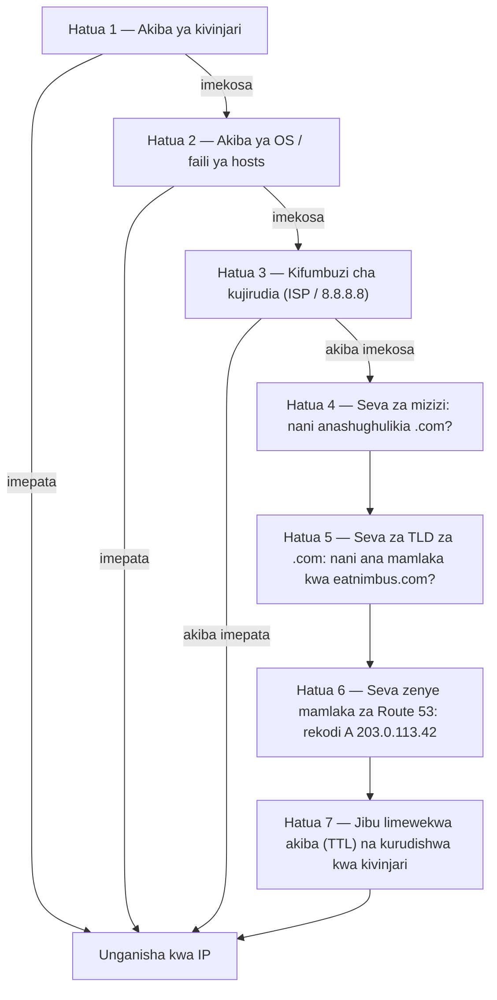

# Sura ya 12: Jinsi Intaneti Inavyokupata

Maya aliburudisha `nimbus-alb-123456789.us-west-2.elb.amazonaws.com` katika kivinjari chake mara moja zaidi, kisha akaegemea nyuma na kuangalia dari. Ukurasa ulipakia. Programu ilifanya kazi. Lakini kila wakati alipomshirikisha mshirika wa mkahawa kiungo, alihisi aibu ndogo asiyoweza kuitaja kabisa.

URL ile ilikuwa kifaa cha kiufundi, si bidhaa.

---

*Ubunifu upya wa mtandao kutoka sura iliyopita ulikuwa umeenda vizuri. Kila rasilimali ilikuwa mahali pake — load balancer katika subneti za umma, hifadhidata zilizofungwa katika za kibinafsi. Miundombinu ilikuwa salama na imegawanywa kwa usahihi. Lakini Nimbus ilipojiandaa kwa uzinduzi wake wa kwanza wa umma, tatizo jipya lilikuwa limetokea: URL ya load balancer ambayo AWS ilikuwa imeipanga kiotomatiki ilionekana kama kitambulisho cha mfumo, si bidhaa ambayo watu wangeiamini. Walihitaji jina halisi la kikoa. Na walihitaji kuelewa kilichotokea kati ya wakati mtu alipoandika `eatnimbus.com` na wakati ukurasa ulipoonekana.*

---

Nimbus ilikuwa ikiendesha. Load balancer ilikuwa na IP ya umma. Vihalisi vya EC2 vilikuwa na IP ya kibinafsi. Hifadhidata zilikuwa zimefungwa katika subneti za kibinafsi. Priya alikuwa ameitikia kwa kichwa kwa kukubali kwenye mchoro wa mtandao.

Tom aliangalia URL ya load balancer: `nimbus-alb-123456789.us-west-2.elb.amazonaws.com`.

"Hicho ndicho wateja wanaandika kwenye kivinjari chao?" aliuliza.

"Hicho ndicho AWS inapanga kiotomatiki," Maya alisema.

"Siweki hiyo kwenye kadi ya biashara."

"Wala mimi."

Walihitaji jina la kikoa. Walinunua `eatnimbus.com` kutoka kwa msajili wa kikoa. Sasa walihitaji kuunganisha jina hilo na miundombinu yao ya AWS.

"Intaneti inajuaje kuwa `eatnimbus.com` inamaanisha load balancer katika us-west-2?" Leo aliuliza.

Swali zuri, Leo.

**Mlinganisho wa Kitabu cha Simu**

Kabla ya simu mahiri, kila jiji lilikuwa na kitabu cha simu. Ikiwa ulitaka kufikia "Mario's Pizza," hukukariri nambari yao ya simu — ulitafuta jina, ukapata nambari, na ukapiga simu.

Intaneti ina kitabu chake cha simu: **Domain Name System (DNS)**.

DNS hutafsiri majina yanayoweza kusomwa na binadamu (kama `eatnimbus.com`) kuwa anwani za IP zinazoweza kusomwa na mashine (kama `203.0.113.42`). Kila wakati unapotembelea tovuti, kompyuta yako hutafuta kimyakimya jina la kikoa katika DNS na kupata anwani ya IP ya kuunganisha.

Ukibadilisha anwani ya IP ya seva yako, ungesasisha rekodi ya DNS — kama kubadilisha nambari yako katika kitabu cha simu — na intaneti ingekupata katika eneo lako jipya.

**Safari Kamili ya Ufumbuzi wa DNS**

"Lakini *jinsi gani* utafutaji unavyofanya kazi kwa hakika?" Leo aliuliza. "Kama, hatua kwa hatua. Kivinjari changu kinajua jina `eatnimbus.com`. Nini kinatokea baadaye?"

Nyaraka nyingi hupita haya kwa haraka. Yanajalisha.

Wakati kivinjari chako kinahitaji kufumbua `eatnimbus.com`, hapa kuna kila hatua, kwa mpangilio:

**Hatua 1 — Akiba ya kivinjari**: Kivinjari huangalia kama tayari kimefumbua jina hili hivi karibuni. Ikiwa ndiyo, kinatumia IP iliyowekwa akiba. Ikiwa hapana, endelea.

**Hatua 2 — Akiba ya OS / kifumbuzi cha ndani**: Mfumo wako wa uendeshaji huangalia akiba yake ya DNS na faili ya ndani ya `hosts`. Ikipatikana, imekamilika. Ikiwa hapana, husambaza kwa kifumbuzi chako cha DNS kilichosanidiwa — kawaida cha ISP wako au cha umma kama 8.8.8.8.

**Hatua 3 — Kifumbuzi cha kujirudia (recursive resolver)**: Kifumbuzi cha kujirudia (ISP wako au 8.8.8.8 ya Google) ndio kifaa kikuu. Kina akiba pia. Kikijua jibu, kinalirudisha mara moja. Ikiwa hapana, kinaanzisha mnyororo halisi wa ufumbuzi.

**Hatua 4 — Seva za majina za mizizi (root name servers)**: Kifumbuzi cha kujirudia huwasiliana na mojawapo ya makundi 13 ya seva za majina za mizizi (zilizosambazwa duniani kote). Seva ya mizizi haijui `eatnimbus.com` iko wapi. Lakini inajua nani anasimamia vikoa vya `.com` — seva za TLD za `.com`. Inarudisha anwani zao.

**Hatua 5 — Seva za majina za TLD (Top Level Domain)**: Kifumbuzi cha kujirudia huwasiliana na seva za TLD za `.com`. Seva za TLD pia hazijui `eatnimbus.com` iko wapi. Lakini zinajua seva gani za majina ni zenye mamlaka kwa `eatnimbus.com` — seva ambazo kwa kweli zinashikilia rekodi za DNS. Zinarudisha anwani hizo.

**Hatua 6 — Seva za majina zenye mamlaka (authoritative name servers)**: Kifumbuzi cha kujirudia huwasiliana na seva za majina za Route 53 — seva za majina zenye mamlaka kwa `eatnimbus.com`. Route 53 ina rekodi halisi. Inarudisha rekodi A: `eatnimbus.com → 203.0.113.42`. Jibu hili ni la mamlaka — ni jibu halisi, si lililowekwa akiba.

**Hatua 7 — Jibu limewekwa akiba na kurudishwa**: Kifumbuzi cha kujirudia huweka jibu akiba kwa muda wa TTL (Time-To-Live) kwenye rekodi. Inarudisha IP kwa kivinjari chako. Kivinjari chako kinaiweka akiba. Kivinjari chako kinaunganisha.



"Hizo ni hatua saba ili tu kupata anwani ya IP," Tom alisema.

"Kawaida chini ya milisekunde 100 jumla," Priya alisema. "Hatua 3 hadi 6 zimewekwa akiba kwa nguvu katika kila ngazi. Kwa vikoa maarufu, hatua 4 na 5 — utafutaji wa mizizi na TLD — mara nyingi huruka kabisa kwa sababu kifumbuzi cha kujirudia tayari kina seva hizo zikiwa akibani. Mnyororo mzima kawaida huendesha katika milisekunde 20–40."

"Na baada ya utafutaji wa kwanza, akiba ya kivinjari inamaanisha maombi yanayofuata huruka yote," Leo aliongeza.

"Sahihi. DNS huhisi papo hapo kwa sababu utafutaji mwingi ni hits za akiba. Mnyororo kamili huendesha tu wakati rekodi ni mpya au TTL yake imeisha."

**Kutana na Route 53**

Amazon Route 53 ni huduma ya DNS inayosimamiwa ya AWS. Inaitwa Route 53 kwa sababu lango 53 ndilo lango la kawaida la DNS. (Wakati mwingine AWS hutaja vitu moja kwa moja.)

Route 53 hufanya mambo kadhaa:

**Usajili wa kikoa**: Unaweza kununua majina ya kikoa kupitia Route 53 moja kwa moja.

**Upangishaji wa DNS (hosted zones)**: Unaunda *eneo lililopangishwa* kwa kikoa chako, na Route 53 husimamia rekodi za DNS zinazouambia ulimwengu mahali pa kukupata.

**Ukaguzi wa afya**: Route 53 inaweza kufuatilia endpoints zako na kuelekeza trafiki mbali na zile zisizo na afya.

**Sera za uelekezaji wa trafiki**: Route 53 inaunga mkono mikakati mingi ya uelekezaji zaidi ya DNS rahisi — kwa uzani, kulingana na ucheleweshaji, kijiografia, failover.

**Rekodi za DNS: Maingizo ya Kitabu cha Simu**

Rekodi ya DNS huelekeza jina kwa marudio. Aina za kawaida zaidi:

**Rekodi A**: Huelekeza jina kwa anwani ya IPv4.
`eatnimbus.com → 203.0.113.42`

**Rekodi AAAA**: Huelekeza jina kwa anwani ya IPv6.

**Rekodi CNAME**: Huelekeza jina kwa jina lingine (lakabu).
`www.eatnimbus.com → eatnimbus.com`

**Rekodi MX**: Hubainisha seva gani zinashughulikia barua pepe kwa kikoa.

**Rekodi TXT**: Huhifadhi maandishi kiholela. Hutumiwa sana kwa uthibitishaji wa kikoa (kuthibitisha kuwa unamiliki kikoa) na uthibitishaji wa barua pepe (SPF, DKIM).

Kwa Nimbus, usanidi wa msingi:

- `eatnimbus.com` → Rekodi ya Alias inayoelekeza kwa load balancer
- `www.eatnimbus.com` → CNAME inayoelekeza kwa `eatnimbus.com`
- `api.eatnimbus.com` → Rekodi ya Alias inayoelekeza kwa load balancer ya API

"Subiri," Tom alisema. "IP ya load balancer inaweza kubadilika. AWS ilisema hivyo katika nyaraka."

Kushika vizuri, Tom.

**Rekodi za Alias: Suluhisho la AWS kwa IP Zinazobadilika**

Load balancer, usambazaji wa CloudFront, na tovuti za S3 zina majina ya DNS, si anwani za IP tuli. IP za msingi zinaweza kubadilika.

Ukiunda CNAME inayoelekeza kwa jina la DNS la load balancer, inafanya kazi — lakini huwezi kutumia CNAME kwa vikoa vya mizizi (`eatnimbus.com` bila `www`) kwa sababu ya viwango vya DNS.

Route 53 hutatua hili kwa **Rekodi za Alias** — kiendelezi mahususi cha AWS kwa DNS. Rekodi ya Alias huelekeza jina moja kwa moja kwa rasilimali ya AWS (load balancer, usambazaji wa CloudFront, tovuti ya S3), na Route 53 hushughulikia ufumbuzi wa IP unaobadilika kiotomatiki. Rekodi za Alias zinaweza kutumika katika kiwango cha kikoa cha mizizi. Na tofauti na hoja za kawaida za DNS kwa huduma za nje, hoja za rekodi za Alias kwa rasilimali za AWS ni za bure.

"Kwa hivyo tunatumia rekodi ya Alias kwa `eatnimbus.com` inayoelekeza kwa load balancer," Leo alithibitisha.

"Na Route 53 inashughulikia IP yoyote ambayo load balancer inatumia wakati wowote," Priya aliongeza.

"Kwa bure," Tom alisema, ghafla akiwa na nia sana. Alivuta ukurasa wa bei wa Route 53. "Na sehemu nyingine yake?"

"Senti hamsini kwa kila hosted zone," Leo alisema. "Pamoja na karibu senti arobaini kwa kila milioni ya hoja za DNS. Kwa trafiki yetu hivi sasa, pengine chini ya dola mbili kwa mwezi."

Tom akafunga ukurasa wa bei akiwa ameridhika.

**Sera za Uelekezaji: Zaidi ya "Iko Wapi?"**

Hapa ndipo Route 53 inapokuwa ya kuvutia. DNS si huduma ya utafutaji tu — inaweza kuwa zana ya usimamizi wa trafiki.

**Uelekezaji rahisi**: Rekodi moja, marudio moja. DNS ya kawaida.

**Uelekezaji wa uzani (weighted)**: Gawanya trafiki kati ya marudio mengi kwa uzani. Tuma 90% kwa seva mpya, 10% kwa seva ya zamani wakati wa uhamishaji. Rekebisha uzani hadi ujiamini katika seva mpya, kisha ubadilishe hadi 100%.

**Uelekezaji kulingana na ucheleweshaji (latency-based)**: Elekeza watumiaji kwa eneo la AWS lenye ucheleweshaji wa chini zaidi kwao. Mtumiaji katika Seattle huelekezwa `us-west-2`. Mtumiaji katika Tokyo huelekezwa `ap-northeast-1`. Jina lilelile la kikoa, marudio tofauti.

**Uelekezaji wa kijiografia (geolocation)**: Elekeza kulingana na eneo la kijiografia la mtumiaji. Watumiaji wote wa Ulaya huenda kwa `eu-west-1`. Watumiaji wote wa Amerika Kaskazini huenda kwa `us-east-1`. Muhimu kwa uhuru wa data (kuweka data ya watumiaji wa EU katika maeneo ya EU) au ubinafsishaji wa maudhui (lugha, sarafu). Maamuzi ya uelekezaji hutumia mipaka migumu — mtumiaji yuko katika nchi, bara, au jimbo la Marekani, na hapo ndipo anaenda.

**Uelekezaji wa ukaribu wa kijiografia (geoproximity)**: Huelekeza trafiki kulingana na eneo la kijiografia la watumiaji *na* hukuruhusu kurekebisha maamuzi hayo kwa thamani ya **bias**. Bias chanya hupanua eneo la kijiografia linaloelekeza kwa rasilimali — ikivutia trafiki zaidi. Bias hasi hulipunguza. Tofauti na geolocation, ambayo hutumia mipaka migumu ya nchi na bara, geoproximity ni endelevu: thamani ndogo ya bias inaweza kuhamisha trafiki taratibu kutoka eneo moja hadi lingine bila kuchora upya mistari yoyote isiyobadilika.

Hali inayotofautisha hizi mbili: ikiwa kampuni inahama taratibu kutoka `us-east-1` kwenda `us-west-2` na inataka kuhamisha trafiki kuelekea magharibi kwa nyongeza — si kugeuza swichi, bali kuirekebisha kwa muda — geoproximity yenye bias chanya inayokua kwenye endpoint ya magharibi ndiyo zana sahihi. Geolocation ingeelekeza watumiaji wote wa Pwani ya Magharibi kwenda Oregon au la; haina kirekebishaji. Tangu Januari 2024, geoproximity inapatikana kama sera ya kawaida ya uelekezaji moja kwa moja kwenye rekodi za DNS (Console, API, CLI) — haihitaji tena Route 53 Traffic Flow, ingawa bado inapatikana hapo pia.

**Uelekezaji wa failover**: Teua endpoint kuu na ya pili. Ikiwa kuu itashindwa ukaguzi wa afya wa Route 53, trafiki huelekezwa kiotomatiki kwa ya pili. Hii ni safu ya DNS ya uokoaji wa maafa.

"Subiri — lakini *kwa nini* tungeweka uelekezaji wa failover kwa eneo la pili ikiwa tayari tuna Multi-AZ?" Maya aliuliza. "Si Multi-AZ inapaswa kushughulikia kushindwa?"

Swali zuri. Multi-AZ hulinda dhidi ya kushindwa kwa Eneo moja la Upatikanaji ndani ya eneo — ikiwa kituo kimoja cha data kitashuka, standby katika AZ nyingine huchukua nafasi. Lakini vipi ikiwa eneo zima la AWS litakuwa halipatikani? Au vipi ikiwa kuna usumbufu wa huduma wa eneo zima? Uelekezaji wa failover wa DNS hufanya kazi katika kiwango tofauti: huelekeza trafiki mbali na eneo zima wakati ukaguzi wa afya wa eneo hilo unashindwa. Multi-AZ ni ustahimilivu ndani ya eneo. Failover ya DNS ni ustahimilivu kati ya maeneo.

**Uelekezaji wa majibu mengi (multivalue answer)**: Rudisha hadi anwani nane za IP zenye afya kwa hoja, ukimruhusu mteja kuchagua. Mbadala rahisi wa load balancer kwa kusambaza trafiki katika seva nyingi.

"Kwa hivyo Route 53 si kitabu cha simu tu," Maya alisema. "Ni kitabu cha simu mahiri kinachoweza kuelekeza simu kulingana na unakopiga simu kutoka."

"Na kukukatisha ikiwa nambari haina afya," Priya aliongeza.

---

**Uelekezaji wa Latency Pamoja na Ukaguzi wa Afya: Jaribio la Fikra**

Priya alichora hali kwenye ubao mweupe. Tuseme idadi ya watumiaji wa Pwani ya Mashariki ya Nimbus iliendelea kukua, na siku moja timu iliweka stack nyepesi katika `us-east-1` (Northern Virginia) — si usanidi kamili wa multi-region active-active, ambao ungekuwa ghali na changamano, bali load balancer na seti ya vihalisi vya EC2 vya kusoma-tu vinavyohudumia maudhui tuli na kurasa za kuvinjari. Maagizo bado yangeenda magharibi kwa hifadhidata kuu katika `us-west-2`. Trafiki ya kuvinjari — iliyojumuisha asilimia sabini ya maombi — ingeweza kuhudumiwa kutoka pwani yoyote.

Usanidi wa Route 53 kwa endpoint ya kuvinjari ungeonekana hivi:

```
browse.eatnimbus.com
  → Rekodi ya Latency: us-east-1 ALB (yenye ukaguzi wa afya, set-identifier "east")
  → Rekodi ya Latency: us-west-2 ALB (yenye ukaguzi wa afya, set-identifier "west")
```

(Kumbuka rekodi ni *jina la mwenyeji*, `browse.eatnimbus.com` — DNS huelekeza majina, kamwe njia za URL. Uelekezaji kulingana na njia kama `/browse` ni kazi ya load balancer, si ya Route 53.)

Kwa uelekezaji wa latency, mtumiaji katika Seattle angefumbuliwa kwa endpoint ya `us-west-2`. Mtumiaji katika Boston angeenda `us-east-1`. Route 53 hupima ucheleweshaji kutoka miundombinu yake hadi kila eneo kila wakati na huchagua lile la haraka zaidi kwa kila mtumiaji.

"Lakini vipi ikiwa eneo la magharibi lina tatizo?" Tom aliuliza. "Watumiaji wetu wa kuvinjari katika Seattle wangekwama."

"Hicho ndicho ukaguzi wa afya ni wa nini," Priya alisema. "Kila rekodi ya latency hupata ukaguzi wa afya kwenye load balancer yake husika. Ikiwa ukaguzi wa afya wa `us-west-2` utashindwa ukaguzi tatu mfululizo, Route 53 huacha kurudisha rekodi hiyo — hata kwa watumiaji ambapo Oregon kawaida ingekuwa ya haraka zaidi. Watumiaji wa Seattle huelekezwa mashariki hadi Oregon ipone."

"Kwa hivyo uelekezaji wa latency huamua eneo gani kawaida hupendelewa," Maya alisema, "na ukaguzi wa afya hutangulia upendeleo huo ikiwa eneo lililopendelewa litashuka?"

"Sahihi kabisa. Sera ya latency huchagua mshindi chini ya hali za kawaida. Ukaguzi wa afya huondoa mshindi ambaye ameacha kufanya kazi."

Leo akafikiria hali ya kushindwa. "Na TTL kwenye rekodi hizo?"

"Sekunde sitini," Priya alisema. "Ukaguzi tatu uliofeli kwa muda wa sekunde thelathini ili kuiwasha — hadi sekunde tisini kugundua kushindwa — kisha hadi sekunde sitini kwa vifumbuzi vya DNS kuchukua mabadiliko."

"Dakika mbili na nusu kwa hali mbaya zaidi," Leo alisema.

"Ndio sababu unapunguza TTL kabla ya kuijali, si baada yake."

Mchanganyiko huu — uelekezaji wa latency wenye ukaguzi wa afya kwenye kila rekodi — ni mojawapo ya usanidi wenye nguvu zaidi wa Route 53 kwa usambazaji wa multi-region. Watumiaji daima huenda kwa eneo lenye afya la haraka zaidi. Mfumo hujirekebisha eneo linapokuwa na matatizo. Na yote ni DNS: hakuna miundombinu ya ziada, hakuna seva za proksi, hakuna load balancer kati ya maeneo.

---

**Tukio la Kushindwa kwa Ukaguzi wa Afya**

Mazingira ya staging ya Nimbus yaliwapa onyesho la bahati mbaya la uelekezaji wa failover.

Walikuwa wamesanidi ukaguzi wa afya wa Route 53 kwenye load balancer ya staging kama jaribio — ukikagua endpoint ya `/health` kila sekunde 30. Ijumaa moja alasiri, Leo alisukuma usambazaji kwa staging uliokuwa na hitilafu: endpoint ya afya ilianza kurudisha makosa ya 500. Ilipita majaribio yake ya ndani lakini ilivunjika kwenye seva.

Route 53 ilibaini kushindwa. Baada ya ukaguzi tatu mfululizo uliofeli, iliweka alama endpoint kuwa isiyo na afya. Rekodi ya failover ilianza kufanya kazi, ikielekeza trafiki ya staging kwa ukurasa wa kuanguka wa kusoma-tu uliosema "Matengenezo yanaendelea."

Tahadhari ya kwanza ya Leo ilikuwa ujumbe wa Slack kutoka kwa mhandisi wa QA: "Staging inaonyesha ukurasa wa matengenezo."

Leo aliangalia usambazaji. Makosa ya 500 yalikuwa wazi katika kumbukumbu. Aliurudisha nyuma usambazaji. Ndani ya sekunde 90 baada ya endpoint ya afya kurudisha 200, Route 53 ilitathmini upya ukaguzi, ikaona mafanikio tatu mfululizo, na ikarudisha trafiki kwa load balancer ya staging. Ukurasa wa matengenezo ulitoweka.

Muda jumla kwenye ukurasa wa matengenezo: dakika saba.

"Huo ulikuwa mfumo ukifanya kazi kwa usahihi," Priya alisema.

"Najua," Leo alisema. "Sehemu ya kutisha ni kufikiria kingetokea nini bila ukaguzi wa afya. Makosa ya 500 yangewaendea watumiaji halisi."

"Katika uzalishaji, ukaguzi wa afya ungefanya failover kwa eneo la pili au ukurasa tuli wa makosa. Watumiaji wangeona uzoefu uliotunzwa badala ya makosa."

"Failover huchukua muda gani kwa hakika?" Maya aliuliza. "Kutoka wakati ukaguzi wa afya unashindwa hadi wakati DNS inaanza kuelekeza tofauti?"

"Muda wa ukaguzi wa afya ni sekunde 30 kwa chaguomsingi. Kushindwa tatu mfululizo ili kuwasha failover. Hizo ni hadi sekunde 90 kugundua tatizo. Kisha TTL ya DNS — ikiwa ni sekunde 60, uenezi ni dakika nyingine."

"Kwa hivyo hali mbaya zaidi, karibu dakika tatu?"

"Karibu hivyo. Ndio sababu unataka TTL yako iwe chini kwenye rekodi muhimu, na muda wako wa ukaguzi wa afya uwe mfupi kadiri bajeti yako inavyoruhusu."

---

**Ukaguzi wa Afya: Kuelekeza Kuzunguka Kushindwa**

"Na vipi ikiwa mtu atajaribu kuvunja?" Priya alisema. "DNS ni ya umma. Mtu yeyote anaweza kutafuta `eatnimbus.com` inaelekeza wapi. Hilo linamaanisha mvamizi anajua haswa IP gani ya kulenga."

"Hilo ni kweli," Leo alisema. "Lakini IP wanayoipata ni IP ya load balancer. ALB ndiyo kitu pekee chenye anwani ya umma. Kila kitu nyuma yake — EC2, RDS, ElastiCache — kiko katika subneti za kibinafsi. DNS inawaambia mlango wa mbele. Haiwaambii kilicho nyuma yake."

Route 53 inaweza kufuatilia endpoints zako kwa ukaguzi wa afya. Ikiwa endpoint itashindwa, Route 53 inaweza:

- Kuiondoa kutoka majibu ya DNS (kuacha kutuma trafiki huko)
- Kuanzisha failover kwa endpoint ya chelezo
- Kutuma tahadhari kupitia CloudWatch

Ukaguzi wa afya ni kiungo kati ya uelekezaji wa DNS na afya halisi ya programu. Katika usanidi wa failover: Route 53 hufuatilia endpoint kuu kila sekunde 30. Ikiwa ukaguzi tatu mfululizo utashindwa, Route 53 huanza kurudisha anwani ya endpoint ya pili. Hakuna namba yoyote kati ya hizi iliyo isiyobadilika: sekunde 30 ni muda wa kawaida (chaguo la "haraka" linalolipiwa hukagua kila sekunde 10), na kizingiti cha kushindwa ni chaguomsingi cha ukaguzi tatu mfululizo lakini kinaweza kusanidiwa kutoka 1 hadi 10.

Hii si papo hapo — DNS ina muda wa uenezi. Mara Route 53 inapobadilisha rekodi ya DNS, vifumbuzi vya DNS kote ulimwenguni vinahitaji kuchukua mabadiliko, ambayo yanaweza kuchukua sekunde hadi dakika kulingana na mipangilio ya TTL.

**TTL: Akiba ya DNS**

Majibu ya DNS huwekwa akiba katika viwango vingi — kwenye kipanga njia chako, kwa ISP wako, katika kivinjari chako. **TTL (Time-To-Live)** kwenye rekodi ya DNS huziambia akiba muda wa kukumbuka jibu kabla ya kuangalia tena.

TTL ya juu (saa 1 au zaidi): Hoja chache za DNS, mzigo mdogo kwa Route 53, lakini mabadiliko huchukua muda mrefu kuenea.

TTL ya chini (sekunde 60 au chini): Mabadiliko huenea haraka, lakini hoja zaidi za DNS zinahitajika.

Kabla ya uhamishaji uliopangwa (kusasisha DNS ielekeze kwa seva mpya), punguza TTL yako hadi sekunde 60 siku moja mapema. Kisha unapofanya mabadiliko, hueneza katika karibu dakika moja. Baada ya uhamishaji, inua tena kwa thamani ya kawaida.

"Tayari niliisambaza — oh." Leo alikuwa amesasisha rekodi ya DNS kabla ya kupunguza TTL. Alikuwa ametambua kosa lake na akaanza kuhesabu: TTL ya zamani ilikuwa saa moja. Baadhi ya watumiaji wangepata seva ya zamani kwa dakika sitini zijazo.

"Ikiwa tutaipunguza tu wakati wa uhamishaji na si kabla," Leo alisema polepole, "TTL ya zamani inamaanisha baadhi ya watumiaji wataona seva ya zamani kwa saa moja."

"Sahihi kabisa," Priya alisema. "Uhamishaji wa DNS unahitaji kupanga kabla ya uhamishaji, si tu wakati."

Huenda unajiuliza: ikiwa TTL imewekwa kuwa saa moja, je hiyo inamaanisha kila mtumiaji atasubiri saa nzima baada ya mabadiliko ya DNS kabla ya kuona seva mpya? Si haswa. TTL inamaanisha vifumbuzi havitakagua tena hadi TTL iishe. Ikiwa kifumbuzi cha DNS cha mtumiaji kiliweka akiba thamani ya zamani dakika 55 zilizopita kwa TTL ya saa 1, watapata thamani mpya katika dakika 5. Ikiwa waliiweka akiba dakika 5 zilizopita, watasubiri dakika 55. Kwa wastani, watumiaji huona mabadiliko ndani ya nusu ya muda wa TTL. Ndio sababu kupunguza TTL mapema ni muhimu sana: hupunguza dirisha la uenezi la hali mbaya zaidi kabla ya mabadiliko kutokea.

---

**Hosted Zones za Kibinafsi: DNS ya Ndani**

Priya alileta hitaji jipya wiki mbili baada ya kikoa cha umma kuwa hewani.

"Vihalisi vyetu vya EC2 vinahitaji kufikia hifadhidata," alisema. "Hivi sasa vinatumia jina la DNS la endpoint ya RDS — `nimbus-prod.abc123.us-west-2.rds.amazonaws.com`. Hilo linafanya kazi, lakini ni jina la DNS la umma. Tukiwahi kutaka kubadilisha usanidi wetu wa hifadhidata, faili zote za usanidi wa programu zinahitaji kusasishwa."

"Tungeweza kutumia jina la DNS la kibinafsi," Leo alisema. "Kama `db.nimbus.internal`. Kitu ambacho huduma zetu hutumia kindani kinachoelekeza kwa endpoint ya sasa ya hifadhidata."

"Sahihi kabisa. Route 53 private hosted zones."

**Hosted zone ya kibinafsi** ni kikoa cha DNS kinachofumbuliwa ndani ya VPC yako pekee. Hoja za DNS za nje za `nimbus.internal` hazipati jibu lolote. Lakini kutoka ndani ya VPC, `db.nimbus.internal` hufumbuliwa kwa endpoint ya RDS.

Waliiweka:

- Hosted zone ya kibinafsi: `nimbus.internal`
- Rekodi ya CNAME: `db.nimbus.internal → nimbus-prod.abc123.us-west-2.rds.amazonaws.com`
- Rekodi ya CNAME: `cache.nimbus.internal → nimbus-cache.abc123.usw2.cache.amazonaws.com`
- Rekodi A: `api.nimbus.internal → 10.0.10.5` (IP ya kibinafsi ya EC2 — rekodi A huelekeza majina kwa anwani za IP; CNAME huelekeza majina kwa majina mengine. Sawa hapa kwa sababu kihalisi hiki kinaweka IP ya kibinafsi tuli; kwa chochote kilicho nyuma ya Auto Scaling ungeelekeza kwa load balancer badala yake)

Sasa usanidi wa programu ulisoma:

```
DATABASE_HOST=db.nimbus.internal
CACHE_HOST=cache.nimbus.internal
```

Walipohamia kwa kihalisi kipya cha RDS, walisasisha rekodi moja ya DNS. Hakuna usambazaji wa programu uliohitajika.

"Hii pia ni kwa nini DNS ya kibinafsi inajalisha wakati wa uhamishaji wa hifadhidata," Priya alisema. "Unasasisha `db.nimbus.internal` ielekeze kwa endpoint mpya. Trafiki inahama. Endpoint ya zamani inabaki ikipatikana wakati wa dirisha la TTL. Hakuna mabadiliko ya usanidi wa programu."

**Hadithi ya Utatuzi wa DNS ya Ndani**

Wiki tatu baadaye, Leo alisambaza huduma mpya — mfanyakazi wa chinichini — na haikuweza kufikia hifadhidata. Mfanyakazi alikuwa katika VPC ileile, subneti ileile ya kibinafsi kama seva za API. Seva za API zingeweza kufikia hifadhidata. Mfanyakazi hakuweza.

Aliangalia vikundi vya usalama. Kikundi cha usalama cha mfanyakazi kilikuwa na sheria ya kwenda nje kwa PostgreSQL. Kikundi cha usalama cha hifadhidata kilikuwa na sheria ya kuingia kutoka kikundi cha usalama cha mfanyakazi. Kila kitu kilionekana sahihi.

Aliendesha `nslookup db.nimbus.internal` kutoka kihalisi cha mfanyakazi.

Hakuna jibu.

"Utafutaji wa DNS unashindwa," alimwambia Priya.

Aliangalia usanidi wa VPC wa kihalisi cha mfanyakazi. "Mfanyakazi yuko katika VPC gani kwa hakika? Hosted zones za kibinafsi huhusishwa na VPC — ikiwa kihalisi hakiko katika VPC iliyohusishwa, eneo halipo kwake."

"Yuko katika VPC kuu. Sawa na kila kitu kingine."

"Yuko?"

Hosted zones za kibinafsi lazima zihusishwe kwa uwazi na kila VPC zinazohudumia — uhusiano ni kwa kila VPC, kamwe si kwa kila subneti. Priya alikuwa amehusisha VPC kuu alipounda eneo. Lakini Leo alikuwa amesambaza mfanyakazi bila kukusudia kwenye VPC ya jaribio aliyokuwa ameunda kwa jaribio tofauti. VPC tofauti. Haijahusishwa na hosted zone ya kibinafsi.

"Mfanyakazi yuko katika VPC isiyo sahihi," Priya alisema.

"Tayari niliisambaza — oh." Leo alihamisha mfanyakazi kwa VPC sahihi. DNS ikafumbua. Mfanyakazi aliunganisha kwa hifadhidata.

"VPC moja," Leo alisema, akiandika dokezo. "Isipokuwa tuwe na sababu ya zaidi ya moja."

---

**DNSSEC: Kuthibitisha Majibu ya DNS**

"Tumefikiria kuhusu udanganyifu wa DNS (DNS spoofing)?" Priya aliuliza. "Vipi ikiwa mtu atakatiza hoja yetu ya DNS na kurudisha IP bandia? Vivinjari vya watumiaji wetu vingeunganisha kwa seva ya mvamizi badala ya yetu."

**DNSSEC (DNS Security Extensions)** hutatua hili kwa kutia saini rekodi za DNS kwa kriptografia. Wakati jibu la DNS linajumuisha saini ya DNSSEC, kifumbuzi kinaweza kuthibitisha kuwa jibu lilitoka kwa seva ya majina yenye mamlaka na halijachezewa.

Route 53 inaunga mkono utiaji saini wa DNSSEC kwa hosted zones za umma. Mchakato unahusisha:

1. Kuwasha DNSSEC kwenye hosted zone katika Route 53
2. Route 53 huzalisha key signing key (KSK) iliyohifadhiwa katika KMS
3. Route 53 hutia saini rekodi zote kwa zone signing key
4. Unaongeza rekodi ya DS (Delegation Signer) kwa msajili wa kikoa cha mzazi (TLD ya .com)
5. Vifumbuzi vinavyounga mkono DNSSEC sasa vinaweza kuthibitisha uhalisia wa majibu

"Udanganyifu wa DNS ni wa kawaida kiasi gani?" Leo aliuliza.

"Kwenye intaneti ya umma, nadra lakini unawezekana," Priya alisema. "Vifumbuzi vingi vya ISP vinaunga mkono uthibitishaji wa DNSSEC leo. Kuwasha DNSSEC hakugharimu chochote na huongeza safu ya maana ya uhalisia."

"Hilo linagharimu kiasi gani kwa mwezi?" Tom aliuliza.

"Kuwasha utiaji saini wa DNSSEC wenyewe ni bure katika Route 53," Priya alisema. "Gharama halisi pekee ni ufunguo wa KMS unaoshikilia key-signing key: $1/mwezi, pamoja na miito ya API ya KMS — na ufunguo mmoja unaweza kushirikiwa katika hosted zones nyingi. Ulinzi dhidi ya mashambulizi ya kuteka nyara DNS kwa hakika ni wa bure kwa kiwango chetu."

Tom aliiwasha kabla ya chakula cha mchana.

---

**Route 53 Resolver: DNS Mseto**

Nimbus walipounganisha hatimaye VPC yao ya AWS na mtandao wao wa kawaida wa maendeleo kupitia VPN, tatizo jipya liliibuka: seva za kawaida zilihitaji kufumbua majina ya DNS ya kibinafsi ya AWS (kama `db.nimbus.internal`), na rasilimali za AWS zilihitaji kufumbua majina ya wenyeji wa kawaida (kama `jenkins.corp.nimbus.local`).

Ufumbuzi wa DNS hauvuki mipaka ya mtandao kwa chaguomsingi. Rasilimali za AWS hufumbua DNS kwa kutumia Route 53 Resolver (iliyojengwa ndani ya kila VPC). Seva za kawaida hutumia seva zao za DNS. Hakuna inayoweza kuona rekodi za nyingine.

**Route 53 Resolver Endpoints** huziba pengo hili:

**Inbound endpoints**: Seva za DNS za kawaida zinaweza kusambaza hoja kwa hosted zones za DNS za AWS kwa IP ya inbound endpoint katika VPC yako. Route 53 Resolver hushughulikia hoja na kurudisha matokeo.

**Outbound endpoints**: Wakati vihalisi vya EC2 vinahitaji kufumbua majina ya wenyeji wa kawaida, Resolver husambaza hoja hizo kwa seva za DNS za kawaida kupitia outbound endpoint.

"Kwa hivyo ni kama huduma ya tafsiri," Maya alisema. "DNS yako ya AWS na DNS yako ya kawaida hazizungumzi moja kwa moja. Resolver endpoints hufanya kama wapatanishi."

"Sahihi kabisa. Seva zako za kawaida sasa zinaweza kufumbua `db.nimbus.internal`. Vihalisi vyako vya EC2 vinaweza kufumbua `jenkins.corp.nimbus.local`. Pande zote mbili zinaona majina ya DNS kutoka ulimwengu wote miwili."

Kwa Nimbus, hili likawa muhimu wakati timu ya maendeleo ilitaka kuendesha majaribio ya muunganisho kutoka ofisi yao dhidi ya mazingira ya staging katika AWS. Bila Resolver endpoints, wangekuwa wakihariri faili za hosts kwa mkono. Pamoja nazo, DNS ya ndani ilifanya kazi tu kuvuka VPN.

Usanifu wa Resolver endpoints:

- **Inbound endpoint**: ENI mbili (Elastic Network Interfaces) zilizoundwa katika AZ mbili tofauti katika VPC yako. Kila moja hupata IP ya kibinafsi. Unasanidi seva yako ya DNS ya kawaida kusambaza hoja za hosted zones za AWS kwa IP hizi. Trafiki husafiri kupitia VPN yako au Direct Connect.
- **Outbound endpoint**: ENI mbili katika AZ mbili. Unaunda sheria za kusambaza: "hoja za `corp.nimbus.local` huenda kwa IP hizi za seva za DNS za kawaida." Vihalisi vya EC2 hutumia Resolver kiotomatiki, ambayo hushauriana na sheria zako za kusambaza na kutuma hoja kwa mtandao wa kawaida.

"Kwa nini ENI mbili kwa kila endpoint?" Leo aliuliza.

"Upatikanaji wa juu," Priya alisema. "Ikiwa AZ moja itapoteza muunganisho wa mtandao, IP nyingine ya endpoint bado inafanya kazi. Kanuni ileile kama NAT Gateways."

"Hilo linagharimu kiasi gani kwa mwezi?" Tom aliuliza.

Resolver endpoints hugharimu takriban $0.125 kwa saa **kwa kila elastic network interface**, na kila endpoint inahitaji angalau ENI mbili kwa upatikanaji — kwa hivyo sakafu halisi ni karibu $180 kwa mwezi kwa kila endpoint, pamoja na $0.40 kwa kila milioni ya hoja za DNS. Kwa timu inayotumia DNS mseto kufumbua majina ya ndani, gharama ni ndogo — na huondoa hitaji la kudumisha faili za hosts katika mashine nyingi za wasanidi na mifumo ya CI/CD.

"Tungeweza tu kuweka majina ya wenyeji katika faili za hosts," Leo alipendekeza.

"Kwenye kila mashine ya msanidi, kila CI runner, kila kuajiriwa kupya," Priya alisema. "Kila wakati kitu chochote kinabadilika."

"Endpoint inastahili," Leo alisema.

"Inastahili."

## Nguvu na Mapungufu

**Route 53 ni chaguo sahihi kwa**: kusajili na kusimamia majina ya kikoa kabisa ndani ya AWS; kuelekeza trafiki kulingana na ucheleweshaji, kijiografia, au usambazaji wa uzani katika endpoints nyingi; failover kulingana na ukaguzi wa afya kati ya maeneo au kati ya endpoint kuu na ya uokoaji wa maafa; kuunganisha DNS na huduma nyingine za AWS kupitia rekodi za alias; hosted zones za kibinafsi kwa ugunduzi wa huduma za ndani.

**Wakati Route 53 si unayohitaji**: Route 53 ni huduma ya DNS, si load balancer. Ikiwa unahitaji kusambaza trafiki kati ya seva nyingi au kontena ndani ya eneo, tumia Application Load Balancer — Route 53 haiwezi kufanya weighted round-robin katika kiwango cha muunganisho jinsi load balancer inavyoweza. Uelekezaji kulingana na latency katika maeneo huongeza gharama na ugumu wa kiutendaji ambao una maana tu wakati watumiaji wako wamesambazwa kwa kweli duniani kote na milisekunde zinajalisha kwa ubadilishaji. Kwa programu nyingi za eneo moja, rekodi moja ya Alias inayoelekeza kwa ALB ndio usanidi wote wa Route 53 unaouhitaji.

## Muhtasari

Kufika kutoka `nimbus-alb-123456789.us-west-2.elb.amazonaws.com` hadi `eatnimbus.com` kulihisi kama jambo dogo. Halikuwa. DNS ni mfumo wa anwani ambao intaneti nzima inaendesha juu yake, na Route 53 hukupa zana za kutumia mfumo huo si kwa utafutaji tu, bali kwa usimamizi wa trafiki na ustahimilivu.

- **DNS** hutafsiri majina ya kikoa kuwa anwani za IP — kitabu cha simu cha intaneti.
- **Route 53** ni huduma ya DNS inayosimamiwa ya AWS: usajili wa kikoa, upangishaji wa DNS, ukaguzi wa afya, na sera za uelekezaji.
- **Rekodi A** huelekeza majina kwa anwani za IPv4. **CNAME** huelekeza majina kwa majina mengine. **Rekodi za Alias** huelekeza majina kwa rasilimali za AWS (load balancer, CloudFront, S3).
- Tumia rekodi za Alias (si CNAME) kwa vikoa vya mizizi na kwa rasilimali zenye IP zinazobadilika.
- Sera za uelekezaji huenda zaidi ya DNS rahisi: **weighted** (mgawanyiko wa trafiki), **kulingana na latency** (utendaji), **geolocation** (uhuru wa data — mipaka migumu ya nchi/bara), **geoproximity** (kulingana na umbali na kirekebishaji cha bias — uhamishaji wa trafiki taratibu), **failover** (uokoaji wa maafa).
- **Hosted zones za kibinafsi** hutoa DNS ya ndani kwa rasilimali za VPC — mawasiliano ya huduma-kwa-huduma kwa jina, si IP iliyowekwa moja kwa moja.
- **DNSSEC** hutia saini rekodi kwa kriptografia, ikilinda dhidi ya udanganyifu wa DNS.
- **Route 53 Resolver Endpoints** huunganisha mitandao mseto — DNS ya AWS na ya kawaida zinaweza kufumbua majina ya kila mmoja.

## Vidokezo vya Mtihani

*Kikoa cha SAA-C03: Buni Usanifu wa Utendaji wa Juu (Kikoa cha 3, Kazi ya 3.4)*

- **Alias dhidi ya CNAME**: Rekodi za Alias zinaweza kutumika kwenye kikoa cha mizizi; CNAME haziwezi. Rekodi za Alias kwa rasilimali za AWS ni za bure; hoja za CNAME DNS zina bei. Mtihani unapouliza kuhusu kuelekeza kikoa cha mizizi kwa load balancer → Rekodi ya Alias.
- **Kesi za matumizi ya sera ya uelekezaji** (hali za kawaida za mtihani):
  - "Hamisha trafiki taratibu kwa toleo jipya" → Uelekezaji wa weighted
  - "Elekeza watumiaji kwa eneo la AWS lililo karibu zaidi" → Uelekezaji kulingana na latency
  - "Weka data ya watumiaji wa EU katika maeneo ya EU" → Uelekezaji wa geolocation
  - "Failover ya DNS ya kiotomatiki wakati kuu inashuka" → Uelekezaji wa failover wenye ukaguzi wa afya
  - "Hamisha trafiki taratibu kwa eneo jipya" au "ongeza trafiki inayovutwa kwa usambazaji wetu wa EU" → Uelekezaji wa geoproximity wenye bias chanya
- **Geoproximity dhidi ya Geolocation**: Geolocation huelekeza kwa nchi/bara la mtumiaji kwa mipaka migumu. Geoproximity huelekeza kwa umbali wa kijiografia na bias inayoweza kusanidiwa — itumie unapohitaji kuhamisha trafiki taratibu kwa eneo jipya au kuvutia watumiaji zaidi kwa usambazaji mahususi. Inapatikana kama sera ya kawaida ya uelekezaji kwenye rekodi tangu Januari 2024 (Traffic Flow haihitajiki tena).
- **Ukaguzi wa afya wa Route 53**: Unaweza kukagua endpoints za HTTP/HTTPS/TCP, na unaweza kuwasha kengele za CloudWatch. Mtihani hutumia haya katika hali za uokoaji wa maafa.
- **TTL na uenezi**: Jua kuwa TTL hudhibiti muda ambao vifumbuzi vya DNS huweka rekodi akiba. TTL fupi = mabadiliko ya haraka. Hali ya mtihani: "timu ilisasisha DNS lakini watumiaji bado wanagonga seva ya zamani" → TTL iko juu sana.
- **Hosted zones za kibinafsi**: Route 53 inaweza kuunda rekodi za DNS zinazofumbuliwa ndani ya VPC pekee. Mtihani hutumia hii kwa ugunduzi wa huduma za ndani (k.m., `database.internal` kufumbua kwa endpoint ya RDS ya kibinafsi).
- Route 53 ni **ya kimataifa** — haijasambazwa katika eneo. Hakuna uteuzi wa eneo unaohitajika wakati wa kuunda hosted zones.
- **Route 53 Resolver Endpoints**: Hutumiwa katika hali za mseto ambapo DNS ya kawaida na ya AWS zinahitaji kufumbua majina ya kila mmoja. Inbound endpoint kwa kawaida → AWS. Outbound endpoint kwa AWS → kawaida.

## Mazoezi

**Zoezi la 1 — Kumbuka**

Eleza tofauti kati ya rekodi ya CNAME na rekodi ya Alias. Je, ungetumia kila moja lini?

*(Kidokezo: Zingatia vikwazo kwa CNAME kwenye vikoa vya mizizi, na tabia ya rekodi za Alias na rasilimali za AWS zinazobadilika.)*

**Zoezi la 2 — Hali ya SAA-C03**

*Hali*: Kampuni ya media huendesha tovuti kutoka maeneo mawili ya AWS: `us-east-1` (kuu) na `eu-west-1` (ya pili). Timu inataka trafiki ielekeze kiotomatiki kwa `eu-west-1` ikiwa eneo kuu litakuwa halipatikani. Kampuni pia inataka kuthibitisha kuwa utaratibu huu wa failover unafanya kazi kwa usahihi bila kuangusha eneo kuu kihalisi.

Ni usanidi upi wa Route 53 unaokidhi mahitaji haya BORA zaidi?

A) Uelekezaji wa weighted wenye uzani wa 100% kwa `us-east-1` na 0% kwa `eu-west-1`  
B) Uelekezaji kulingana na latency wenye ukaguzi wa afya kwenye endpoints zote mbili  
C) Uelekezaji wa failover wenye ukaguzi wa afya kwenye endpoint kuu na rekodi ya pili inayoelekeza `eu-west-1`  
D) Uelekezaji wa geolocation ukiwa na Amerika Kaskazini ikielekeza kwa `us-east-1` na Ulaya ikielekeza kwa `eu-west-1`

**Kidokezo cha 1**: Hitaji ni failover ya kiotomatiki wakati kuu inashuka. Ni sera ipi ya uelekezaji imebuniwa haswa kwa hili?

**Kidokezo cha 2**: "Jaribu bila kuangusha eneo kuu" — ukaguzi wa afya unaweza kuwekwa kwa mkono kuwa "usiokuwa na afya" kwa majaribio.

**Kidokezo cha 3**: Uelekezaji kulingana na latency huboresha kasi, si failover.

**Jibu**: C

**Maelezo**: Uelekezaji wa failover umebuniwa haswa kwa kesi hii ya matumizi. Rekodi kuu inaelekeza kwa `us-east-1` ikiwa na ukaguzi wa afya. Rekodi ya pili inaelekeza kwa `eu-west-1`. Ikiwa ukaguzi wa afya utashindwa, Route 53 hutumikia rekodi ya pili kiotomatiki. Ukaguzi wa afya unaweza kulazimishwa kushindwa kwa majaribio bila kutatiza eneo kuu kihalisi.

**Kwa nini si A?** Uelekezaji wa weighted wenye 100%/0% kwa hakika ni tuli — haubadiliki kiotomatiki wakati kuu inashindwa.

**Kwa nini si B?** Rekodi za latency *zenye ukaguzi wa afya* hukoma kurudisha endpoint isiyo na afya, kwa hivyo B ingestahimili kukatika halisi. Lakini hubadilisha mfumo wa kawaida wa trafiki (watumiaji wangegawanywa katika maeneo kwa latency, si kuu/ya pili kama inavyohitajika) na haina njia safi ya *kujaribu* failover: ungelazimika kufeli ukaguzi wa afya wa kuu katika uzalishaji kwa hakika. Uelekezaji wa failover huiga nia iliyotajwa — kuu iliyoteuliwa, ya pili iliyoteuliwa, inayoweza kujaribiwa kwa kulazimisha hali ya ukaguzi wa afya.

**Kwa nini si D?** Uelekezaji wa geolocation huelekeza kwa eneo la mtumiaji, si kwa afya ya endpoint. Watumiaji wa Ulaya wangekwama kwenye `eu-west-1` hata kama `us-east-1` ina afya, na watumiaji wa Amerika Kaskazini hawangefanya failover kwa `eu-west-1` hata kama `us-east-1` itashuka.

*Kikoa cha SAA-C03: Buni Usanifu wa Utendaji wa Juu — Kazi ya 3.4*

**Zoezi la 3 — Changamoto ya Usanifu** *(Si lazima)*

Nimbus inapanuka kimataifa. Wanataka `eatnimbus.com` ipakie haraka kwa watumiaji wa Pwani ya Magharibi, Pwani ya Mashariki, na Australia. Pia wana hitaji la udhibiti: maagizo yaliyowekwa na watumiaji wa Ulaya lazima yachakatwe na seva katika EU.

Buni mkakati wa uelekezaji wa Route 53 unaoshughulikia mahitaji yote mawili. Ungetumia sera gani ya uelekezaji au mchanganyiko wa sera? Ungehitaji miundombinu gani katika kila eneo?

*(Hakuna jibu moja sahihi. Lengo ni kufanya mazoezi ya kubuni uelekezaji wa maeneo mengi.)*

## Onyesho la Baada ya Mikopo

`eatnimbus.com` ilikuwa hewani.

Maya alikuwa ameiandika katika kivinjari chake, na ukurasa wa kuagiza wa Nimbus ulikuwa umepakia. Alikuwa ameagiza arepa kutoka mkahawa wa familia yake mwenyewe, ili tu kujaribu mtiririko. Agizo lilikuwa limepita. Jiko lilikuwa limeipokea.

Akaketi nyuma.

Tom alikuwa tayari akisoma kumbukumbu za ukaguzi wa afya wa Route 53. "Muda wa kujibu ni milisekunde 18 kutoka kwa wakaguzi wa us-west-2."

"Je hiyo ni haraka?" Maya aliuliza.

"Kwa DNS? Ndiyo. Kwa watumiaji wa Seattle pia — kwa hakika wako jirani na Oregon."

"Lakini kwa mtumiaji katika Boston?"

Tom aliangalia grafu ya latency. "Karibu milisekunde 80."

Maya alifikiria hilo. "Ikiwa washirika wetu wa Pwani ya Mashariki wataendelea kukua, na seva zetu ziko Oregon..."

"Kila ombi husafiri kutoka Boston hadi Oregon na kurudi," Leo alisema kutoka upande mwingine wa chumba. "Kasi ya mwanga. Huwezi kushinda fizikia."

"Kwa hivyo tunahitaji seva karibu na Boston."

"Au kitu karibu na Boston kinachohudumia maudhui kwa niaba yao."

Wazo hilo lilining'inia hewani.

Katika sura inayofuata: ghala zinazoweka maudhui ya Nimbus milisekunde moja mbali na kila mtumiaji, kila mahali.
