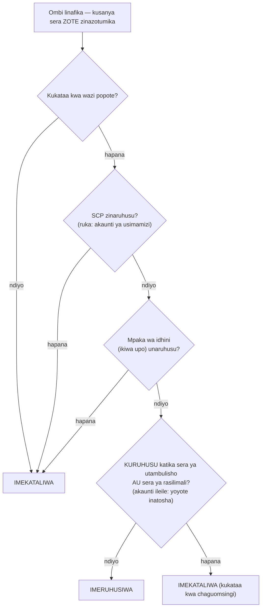

# Sura ya 14: Nani Anaruhusiwa Kufanya Nini

Wahandisi wapya walikuwa wakianza Jumatatu. Soo-Jin na Rafael. Maya alikuwa akifikiria kuhusu wiki yao ya kwanza — wangehitaji ufikiaji wa nini, wasichopaswa kugusa, na kama usanidi wa sasa wa IAM ulikuwa hata tayari kupanuliwa kwa watu wawili zaidi.

Aliketi na kahawa kabla ofisi haijajaa, akitengeneza orodha.

---

*CloudFront ilikuwa imesambazwa. Viwango vya cache hit vilikuwa vizuri. Utendaji ulikuwa umepanda. Lakini timu ilipojiandaa kuwaleta wahandisi wapya, tatizo la kimya liliibuka: usanidi wa IAM ulikuwa umejengwa na watu waliokuwa na haraka. Funguo za ufikiaji zilikuwa katika faili za usanidi. Baadhi ya majukumu yalikuwa na idhini zaidi ya yale yaliyohitajika. Na watu wawili wapya walikuwa karibu kupewa vitambulisho vya mfumo wa uzalishaji ambao haukubuniwa ukizingatia watumiaji wengi.*

---

Tom alikuwa na funguo za ufikiaji wazi katika faili ya maandishi, tayari kubandika.

"Unafanya nini?" Priya aliuliza.

"Kihalisi cha EC2 kinahitaji kusoma faili za usanidi kutoka S3. Ninaweka vitambulisho katika usanidi wa seva."

Aliangalia skrini kwa muda. "Funga faili hiyo."

"Nilikuwa tu—"

"Ikiwa mtu ataingia kwenye seva hiyo," alisema, "anapata funguo hizo. Na funguo hizo hugusa chochote ambacho mtumiaji wa IAM anaruhusiwa kugusa. Ambacho pengine ni zaidi ya S3 tu."

Tom alifunga faili.

"Kuna njia bora," alisema. "Seva yenyewe inaweza kuwa na jukumu. Lifikirie kama cheo cha kazi — kihalisi hakihitaji vitambulisho kwa sababu mfumo tayari unajua ni nini na kinaruhusiwa kufanya nini."

Tom alionekana mwenye mashaka. "Kwa hivyo seva inajithibitisha yenyewe?"

"Ndiyo. Bila nenosiri. Bila funguo katika faili ya usanidi. Bila chochote kinachoweza kuwekwa git kwa bahati mbaya."

Sehemu ile ya mwisho ilitua. Tom alikuwa karibu aweke ufunguo wa ufikiaji kwenye repo yeye mwenyewe wiki mbili zilizopita — aliunasa kwenye diff sekunde ya mwisho. Alifungua kichupo kipya cha kivinjari.

**Kurudia IAM: Picha Kamili**

Sura ya 3 ilianzisha IAM: watumiaji, vikundi, majukumu, na sera. Sasa ni wakati wa kuingia ndani zaidi.

Sera za IAM ni hati za JSON zinazobainisha vitendo vipi vinaruhusiwa au kukataliwa kwenye rasilimali zipi. Zinaonekana hivi:

```json
{
  "Version": "2012-10-17",
  "Statement": [
    {
      "Effect": "Allow",
      "Action": [
        "s3:GetObject",
        "s3:PutObject"
      ],
      "Resource": "arn:aws:s3:::nimbus-assets/*"
    }
  ]
}
```

Sera hii inaruhusu kusoma na kuandika vitu katika ndoo ya `nimbus-assets`, na hakuna kingine. Si kufuta. Si kuorodhesha ndoo. Si operesheni nyingine yoyote ya S3. Si huduma nyingine yoyote ya AWS.

Hii ndiyo njia sahihi ya kutoa idhini: vitendo mahususi, rasilimali mahususi.

**Tatizo la "Administrator Access"**

Sera Zinazosimamiwa na AWS kama `AdministratorAccess` zimebuniwa kwa kuanza haraka. Hazikubuniwa kwa kuendesha mifumo ya uzalishaji yenye washiriki halisi wa timu.

`AdministratorAccess` hutoa kila kitendo kwenye kila rasilimali. Ikiwa mshiriki wa timu mwenye sera hii atafanya kosa — kufuta ndoo ya S3 kwa bahati mbaya, kusitisha kihalisi kisicho sahihi cha EC2, kubadilisha kanuni za kikundi cha usalama — hakuna AWS inaweza kufanya kuwazuia. Idhini ilitolewa.

Ikiwa vitambulisho vya mshiriki wa timu vitaathiriwa (shambulizi la hadaa, ufunguo wa ufikiaji uliovuja, wizi wa laptop), mvamizi ana ufikiaji wa msimamizi kwa kila kitu katika akaunti yako ya AWS.

"Kwa hivyo Soo-Jin anapaswa kuwa na nini?" Leo aliuliza.

"Soo-Jin anahitaji kufanya nini?" Priya alijibu.

"Kusambaza API. Kuangalia kumbukumbu. Hakuna kingine."

"Basi anapata: uwezo wa kusukuma kwa code pipeline, ufikiaji wa kusoma kumbukumbu za CloudWatch, na hakuna kingine."

"Hiyo ni... mahususi sana."

"Ndiyo. Hiyo ndiyo nia."

**Majukumu ya IAM: Vitambulisho kwa Huduma**

Sura ya 3 ilianzisha majukumu kama njia ya vihalisi vya EC2 kufikia huduma za AWS bila kuhifadhi vitambulisho. Hebu tufanye hili halisi.

Vihalisi vyako vya EC2 vinavyoendesha API ya Nimbus vinahitaji:

- Kusoma kutoka DynamoDB (menyu)
- Kuandika kwa DynamoDB (maagizo)
- Kuweka vitu katika S3 (risiti, upakiaji)
- Kuandika kumbukumbu kwa CloudWatch
- Kusoma siri kutoka Secrets Manager

Badala ya kuunda mtumiaji mwenye ufunguo wa ufikiaji na kuhifadhi ufunguo huo kwenye kihalisi cha EC2 (ndoto mbaya ya usalama — funguo za ufikiaji zinaweza kusomwa na yeyote mwenye ufikiaji wa SSH), unaunda **jukumu la IAM** kwa kihalisi cha EC2 lenye idhini hizi haswa.

"Subiri — lakini *kwa nini* tungeifanya hivyo?" Maya aliuliza. "Kihalisi cha EC2 tayari kinaendesha msimbo wetu. Kwa nini tusiupe tu msimbo ufunguo wa ufikiaji?"

Kwa sababu funguo za ufikiaji ni vitambulisho tuli vinavyoishi mahali fulani — katika faili ya usanidi, kibadilishio cha mazingira, repo ya git ikiwa mtu atafanya kosa. Zinaweza kunakiliwa, kutolewa nje kwa siri, kuwekwa kwa bahati mbaya. Jukumu la IAM hufanya kazi tofauti: kihalisi cha EC2 huchukua jukumu kiotomatiki. AWS hutoa vitambulisho vya muda kupitia huduma ya metadata ya kihalisi. Vitambulisho huzunguka kiotomatiki — vinaisha kila saa chache na vinaburudishwa bila kitendo chochote kutoka kwako. Hakuna cha kuvuja, kwa sababu hakuna kilichohifadhiwa.

"Na ikiwa mtu atapenya kihalisi cha EC2?" Leo aliuliza.

"Wanaweza kufanya kile ambacho jukumu la EC2 linaruhusu," Priya alisema. "Ambacho ni kusoma menyu, kuandika maagizo, na kutuma kumbukumbu. Hawawezi kufuta ndoo ya S3. Hawawezi kusitisha vihalisi vya EC2. Hawawezi kugusa IAM."

"Kwa sababu jukumu la EC2 halina idhini hizo."

"Sahihi kabisa."

---

**Jinsi Uchukuaji wa Jukumu la EC2 Unavyofanya Kazi Hatua kwa Hatua**

"Kuna kitu kisichojumuika," Maya alisema. "Ikiwa hakuna vitambulisho vilivyohifadhiwa kwenye kihalisi, kihalisi kinathibitishaje kwa AWS ni nani? Lazima kuwe na kitambulisho mahali fulani."

Kipo. Lakini ni cha muda, kinazunguka kiotomatiki, na kinafikika tu kutoka ndani ya kihalisi.

Wakati kihalisi cha EC2 kinapoanza na jukumu la IAM limeambatishwa, AWS hufanya yafuatayo:

**Hatua 1**: AWS STS (Security Token Service) huzalisha vitambulisho vya muda — kitambulisho cha ufunguo wa ufikiaji, ufunguo wa siri wa ufikiaji, na tokeni ya kipindi. Kwa majukumu ya kihalisi cha EC2 haya kwa kawaida ni halali kwa karibu saa sita, na AWS huyazungusha kiotomatiki kabla ya kuisha.

**Hatua 2**: AWS hufanya vitambulisho hivi vipatikane katika anwani maalum ya IP: `169.254.169.254`. Hii ni **huduma ya metadata ya kihalisi** (IMDS). Inafikika tu kutoka ndani ya kihalisi cha EC2. Hakuna kilicho nje ya kihalisi kinachoweza kuifikia.

**Hatua 3**: Wakati msimbo wako wa programu unapoita SDK yoyote ya AWS (boto3, SDK ya Java, SDK ya Node.js), SDK huuliza kiotomatiki endpoint ya metadata ya kihalisi:

```
GET http://169.254.169.254/latest/meta-data/iam/security-credentials/{role-name}
```

**Hatua 4**: SDK hupokea vitambulisho vya muda na huvitumia kutia saini ombi la API — kwa mfano, ombi la kusoma kutoka S3.

**Hatua 5**: AWS huthibitisha vitambulisho, hukagua sera ya IAM iliyoambatishwa kwa jukumu, na hutoa ruhusa au kukataa ombi.

**Hatua 6**: Karibu dakika kumi na tano kabla ya vitambulisho kuisha, kihalisi cha EC2 huviburudisha kiotomatiki kutoka huduma ya metadata. Msimbo wa programu hauhitaji kamwe kushughulikia hili — SDK hufanya hivyo kwa uwazi.

Mchakato mzima hauonekani kwa msanidi. Unaandika `s3.get_object(...)`. SDK hushughulikia mengine.

"Kwa hivyo kitambulisho kipo," Maya alisema. "Ni cha muda tu, kinajizungusha kiotomatiki, na kimefungwa kwa endpoint ya metadata ya kihalisi."

"Ndio sababu ni salama zaidi kuliko ufunguo wa ufikiaji tuli," Priya alisema. "Ufunguo tuli, ukiibwa mara moja, ni halali hadi mtu auzunguke kwa mkono. Kitambulisho cha muda kilichoibwa huisha chenyewe — ndani ya saa, si miezi."

"Na ikiwa mtu ndani ya kihalisi atauliza endpoint ya metadata?"

"Anaweza kupata kitambulisho cha sasa cha muda. Hiyo ni hatari halisi, ndio sababu AWS ilianzisha IMDSv2 — Instance Metadata Service toleo la 2. IMDSv2 inahitaji mwitaji kwanza apate tokeni ya kipindi kupitia ombi la PUT. Hii huzuia aina ya shambulizi liitwalo Server-Side Request Forgery, ambapo msimbo hasidi humdanganya seva kuchota URL ya metadata kwa niaba ya mvamizi."

Leo alisasisha usanidi wa uzinduzi wa EC2 kutekeleza IMDSv2. Mpangilio mmoja, uliotumika wakati wa uzinduzi.

---

**Uchukuaji wa Jukumu: Jinsi Huduma Zinavyokuwa Huduma Nyingine**

Majukumu yanaweza kuchukuliwa na:

- **Huduma za AWS** (EC2, Lambda, kazi za ECS, n.k.)
- **Watumiaji wa IAM** katika akaunti yako mwenyewe (kuinua jukumu — unachukua jukumu lenye idhini zaidi kwa kazi mahususi)
- **Watumiaji wa IAM katika akaunti nyingine za AWS** (ufikiaji wa akaunti tofauti — akaunti ya shirika lingine inaweza kuchukua jukumu katika yako)
- **Watoa huduma wa utambulisho wa nje** (Google, Active Directory, Okta — ufikiaji wa shirikisho kwa watumiaji wa kibinadamu)

"Tumefikiria kinachotokea ikiwa Nimbus itatumia huduma ya mtu wa tatu inayohitaji ufikiaji wa rasilimali zetu za AWS?" Priya aliuliza. "Muuzaji wa uchanganuzi wa nje, kwa mfano. Hatutaki kuunda mtumiaji wa IAM kwa ajili yao na kuwakabidhi ufunguo wa ufikiaji."

"Majukumu ya akaunti tofauti," Leo alisema. "Tunaunda jukumu katika akaunti yetu na kuandika sera ya uaminifu inayosema 'akaunti hii mahususi ya nje inaruhusiwa kuchukua jukumu hili.' Wanatumia vitambulisho vyao wenyewe kuchukua jukumu na kupata ufikiaji wa muda. Hakuna funguo za kusimamia, hakuna funguo za kuvuja."

Mfumo huu wa mwisho — **shirikisho la utambulisho** — ndio jinsi mashirika makubwa huwapa wafanyakazi wao ufikiaji wa AWS bila kuunda watumiaji binafsi wa IAM kwa kila mtu. Active Directory ya kampuni yako ina vitambulisho vyako. Unapoingia AWS, unathibitisha dhidi ya Active Directory, na AWS hukupa jukumu.

---

**Ufikiaji wa Akaunti Tofauti: Hali ya Timu ya Uhasibu**

Miezi sita ndani, Nimbus walileta kampuni ya uhasibu kusaidia na kuripoti kifedha. Timu ya uhasibu ilihitaji ufikiaji wa kusoma data ya bili katika ndoo ya bili ya S3 ya Nimbus — lakini walifanya kazi kutoka akaunti yao tofauti ya AWS. Nimbus hawakutaka kuunda mtumiaji wa IAM kwa ajili yao. Kumkabidhi mtu katika kampuni ya nje ufunguo wa ufikiaji tuli kulihisi si sahihi kabisa.

"Jukumu la akaunti tofauti," Priya alisema.

Usanidi una sehemu tatu:

**Sehemu ya kwanza**: Katika akaunti ya Nimbus, unda jukumu la IAM — liite `AccountingReadRole`. Ambatisha sera inayoruhusu `s3:GetObject` na `s3:ListBucket` kwenye ndoo ya bili ya S3. Hakuna kingine.

**Sehemu ya pili**: Ongeza sera ya uaminifu kwa `AccountingReadRole`. Sera ya uaminifu inasema ni utambulisho gani wa nje unaruhusiwa kuchukua jukumu hili:

```json
{
  "Version": "2012-10-17",
  "Statement": [{
    "Effect": "Allow",
    "Principal": {
      "AWS": "arn:aws:iam::ACCOUNTING-FIRM-ACCOUNT-ID:role/AccountingAppRole"
    },
    "Action": "sts:AssumeRole"
  }]
}
```

Hii inasema: ni jukumu mahususi tu katika akaunti ya AWS ya kampuni ya uhasibu linaweza kuchukua jukumu hili. Hakuna mtu mwingine.

**Sehemu ya tatu**: Katika akaunti ya kampuni ya uhasibu, programu yao hutumia `sts:AssumeRole` kupata vitambulisho vya muda kwa `AccountingReadRole`. Vitambulisho hivyo vimewekewa upeo wa kile tu ambacho `AccountingReadRole` inaruhusu. Programu ya uhasibu inaweza kusoma faili za bili. Haiwezi kuziandikia. Haiwezi kugusa kitu kingine chochote katika akaunti ya Nimbus.

Kuna hatua moja zaidi ya kuimarisha kwa hali hii haswa — na ni mada iliyotajwa ya mtihani. Kampuni ya uhasibu huhudumia wateja wengi. Tuseme mteja hasidi wao ajifunze ARN ya `AccountingReadRole` ya Nimbus na aombe programu ya kampuni "kuichambua." Programu ya kampuni ina idhini halali ya kuchukua majukumu — inaweza kudanganywa kufikia data ya Nimbus kwa niaba ya mteja asiye sahihi. Hili ni **tatizo la naibu aliyechanganyikiwa (confused deputy problem)**, na suluhisho ni **ExternalId**: Nimbus huzalisha thamani ya siri ya kipekee, huiweka katika sera ya uaminifu kama sharti (`"sts:ExternalId": "nimbus-7f3a..."`), na huishiriki tu na kampuni ya uhasibu. Programu ya kampuni lazima ipitishe ExternalId hiyo katika kila wito wa `AssumeRole`, na hutumia ExternalId *tofauti* kwa kila mteja — kwa hivyo ombi lililofanywa kwa niaba ya mteja asiye sahihi hushindwa. Kiamsha cha mtihani: "mtu wa tatu anahitaji ufikiaji wa akaunti tofauti" → jukumu + sera ya uaminifu + **ExternalId**. Kamwe si mtumiaji wa IAM mwenye funguo zilizoshirikiwa.

"Vipi ikiwa tunahitaji kufuta ufikiaji wao?" Tom aliuliza.

"Futa sera ya uaminifu au futa jukumu," Priya alisema. "Imekamilika. Hakuna vitambulisho vya kuwinda, hakuna funguo za kuzima. Jukumu ndilo ufikiaji. Ondoa jukumu, ufikiaji umeisha."

"Na tunaweza kuona kila wakati walipoutumia katika CloudTrail," Leo aliongeza.

"Kila wito wa API waliofanya, umeingizwa kumbukumbu. Ndoo gani, faili gani, wakati gani, matokeo gani."

Tom aliandika mfumo chini. Ungejitokeza tena — kila mshirika wa muunganisho, kila muuzaji wa nje, kila zana ya mtu wa tatu iliyohitaji ufikiaji wa AWS ingepata jukumu lenye sera ya uaminifu, si mtumiaji mwenye ufunguo wa ufikiaji.

---

**Tathmini ya Sera ya IAM: Mantiki ya Uamuzi**

"Tumefikiria kinachotokea wakati sera nyingi zinatumika kwa ombi lilelile?" Priya aliuliza. "Mtumiaji wa IAM ana sera. Rasilimali wanayoifikia ina sera ya rasilimali. Kunaweza kuwa na SCP. AWS huamuaje?"

Jambo muhimu kuelewa ni kwamba AWS **haikagui** sera aina moja kwa wakati, kwa mfuatano. Inakusanya sera *zote* zinazotumika kwa ombi — zinazotegemea utambulisho, zinazotegemea rasilimali, SCP, mipaka ya idhini, sera za kipindi — na inatumia seti ya kanuni kwa rundo zima kwa wakati mmoja:

**Kanuni ya 1 — Kukataa kwa wazi hushinda, daima.** Ikiwa sera yoyote inayotumika — IAM, inayotegemea rasilimali, SCP, au mpaka — itakataa kitendo kwa wazi, ombi linakataliwa. Hakuna kinachoweza kubatilisha kukataa kwa wazi.

**Kanuni ya 2 — SCP na mipaka ya idhini hufanya kazi kama vichujio.** Kamwe hazitoi chochote. Kitendo lazima *kiruhusiwe* na kila SCP inayotumika na na mpaka wa idhini (ikiwa upo), au kinakataliwa — bila kujali sera nyingine zinasema nini.

**Kanuni ya 3 — Ndani ya akaunti ileile, kuruhusu moja kunatosha.** Kuruhusu kwa wazi katika *ama* sera ya IAM ya utambulisho *au* sera ya rasilimali huruhusu kitendo. Ni muungano, si mfuatano — sera ya rasilimali haitathminiwi "kabla" ya sera ya IAM.

**Kanuni ya 4 — Kukataa kwa chaguomsingi.** Ikiwa hakuna kinachoruhusu kitendo kwa wazi, kinakataliwa.



Matokeo: kukataa kwa wazi popote = imekataliwa. Hakuna kuruhusu popote = imekataliwa. Kuruhusu kutoka sera ya utambulisho *au* sera ya rasilimali = imeruhusiwa, mradi tu hakuna kukataa, SCP, au mpaka unaozuia.

Ukweli mmoja zaidi ambao mtihani hupenda: **SCP hazitumiki kwa akaunti ya usimamizi ya shirika** (wala kwa majukumu yanayohusishwa na huduma). SCP inayosema "hakuna EC2 nje ya us-west-2" inazuia kila akaunti mwanachama — lakini akaunti ya usimamizi haiguswi. Hii ni mojawapo ya sababu AWS hukuambia kuweka mizigo ya kazi nje ya akaunti ya usimamizi kabisa.

Undani mmoja unaowapotosha watahiniwa: kwa **ufikiaji wa akaunti tofauti**, sera inayotegemea rasilimali katika akaunti lengwa haitoshi yenyewe. Utambulisho katika akaunti chanzo pia unahitaji idhini ya wazi katika sera yake ya IAM kufanya kitendo. Ikiwa utatoa sera ya ndoo ya S3 inayoruhusu Akaunti B kusoma vitu vyako, lakini watumiaji wa IAM wa Akaunti B hawana sera ya IAM inayoruhusu `s3:GetObject`, ufikiaji bado unakataliwa. Pande zote mbili lazima ziruhusu kitendo — sera ya rasilimali hufungua mlango upande wa lengwa, na sera ya IAM katika akaunti chanzo humpa mtumiaji idhini ya kupita.

"Kwa hivyo ikiwa SCP ya Priya inasema 'hakuna EC2 katika eu-west-1,' na sera yake ya IAM inasema 'ruhusu vitendo vyote vya EC2,' bado hawezi kuunda kihalisi katika eu-west-1?" Leo aliuliza.

"Sahihi," Priya alisema. "SCP huchuja kile kinachowezekana kabla sera za IAM hazijatathminiwa. Zote mbili lazima zikubaliane ili kitendo kifanikiwe."

"Na kukataa kwa wazi katika sera ya IAM hubatilisha kuruhusu kwa wazi katika sera ya rasilimali?"

"Daima. Kukataa kwa wazi popote katika mnyororo hushinda."

---

**Mipaka ya Idhini: Kuweka Kikomo kwa Yale Majukumu Yanaweza Kutoa**

Hili hapa ni tatizo dogo lakini muhimu: kwa chaguomsingi, IAM haimzuii mtumiaji kutoa idhini ambazo hana kwa sasa.

Ikiwa Soo-Jin ana `iam:CreatePolicy` na `iam:AttachUserPolicy`, angeweza kuunda sera inayotoa ufikiaji wa kuandika S3 na kuiambatisha kwake mwenyewe — hata kama sera zake zilizopo zinaruhusu tu kusoma S3. Aina hii ya udhaifu inaitwa **kuinuka kwa fursa (privilege escalation)**, na ndio sababu haswa mipaka ya idhini ipo.

Lakini vipi ikiwa unataka kukabidhi uundaji wa idhini ya IAM kwa kiongozi wa timu, huku ukihakikisha hawawezi kutoa zaidi ya ulivyokusudia?

**Mipaka ya idhini** huweka idhini za juu zaidi ambazo zinaweza kutolewa kwa utambulisho. Hata kama sera zilizoambatishwa za utambulisho ni pana zaidi, idhini zinazofaa zimefungwa na mpaka wa idhini.

Mfano: Unampa kiongozi wa timu sera inayowaruhusu kuunda majukumu ya IAM. Lakini unaambatisha mpaka wa idhini unaosema "majukumu yaliyoundwa na kiongozi huyu wa timu hayawezi kamwe kuwa na ufikiaji wa kufuta S3." Hata kama kiongozi wa timu ataunda jukumu lenye ufikiaji kamili wa S3, mpaka huzuia kufuta S3 kuanza kutumika.

Huenda unajiuliza: tofauti kati ya mpaka wa idhini na Service Control Policy ni nini? Zinasikika sawa — zote zinaweka kikomo kwa idhini zinazoweza kufanya kazi. Tofauti ni upeo. Mpaka wa idhini hutumika kwa utambulisho mahususi wa IAM (mtumiaji au jukumu) na huweka kikomo kwa kile ambacho utambulisho huo unaweza kufanya. SCP hutumika kwa akaunti nzima ya AWS au kitengo cha shirika — ni ulinzi wa kiwango cha shirika unaoathiri kila utambulisho katika akaunti, ikiwa ni pamoja na wasimamizi. Tumia mipaka ya idhini unapokabidhi usimamizi wa IAM kwa kiongozi wa timu. Tumia SCP unapohitaji kanuni za shirika zima ambazo hakuna mtu katika akaunti anaweza kubatilisha.

Hili ni dhana ya hali ya juu, lakini huonekana kwenye mtihani na huakisi jinsi mashirika yanavyokabidhi usimamizi wa IAM kwa kiwango kikubwa.

**Mpaka wa Idhini Halisi: Kukabidhi Uundaji wa Jukumu kwa Usalama**

Nimbus ilikuwa ikikua. Soo-Jin alipendekeza kuwa kila mhandisi mwandamizi katika timu ya jukwaa aruhusiwe kuunda majukumu ya IAM kwa vitendaji vya Lambda walivyovimiliki — bila kuhitaji Priya kuidhinisha kila moja.

"Hatari," Priya alisema, "ni kwamba mhandisi mwandamizi aunde jukumu la Lambda lenye `AdministratorAccess` — ama kwa kosa au kwa kutofikiri kwa makini."

"Kwa hivyo tunatumia mipaka ya idhini," Soo-Jin alisema.

Priya aliunda sera ya mpaka wa idhini iliyoitwa `NimbusDeveloperBoundary`:

```json
{
  "Version": "2012-10-17",
  "Statement": [
    {
      "Effect": "Allow",
      "Action": [
        "s3:GetObject", "s3:PutObject",
        "dynamodb:GetItem", "dynamodb:PutItem", "dynamodb:Query",
        "cloudwatch:PutMetricData", "logs:CreateLogGroup",
        "logs:CreateLogStream", "logs:PutLogEvents",
        "secretsmanager:GetSecretValue",
        "xray:PutTraceSegments"
      ],
      "Resource": "*"
    }
  ]
}
```

Kisha aliruhusu kila mhandisi mwandamizi kuunda majukumu, lakini tu ikiwa wataambatisha mpaka huu:

```json
{
  "Effect": "Allow",
  "Action": ["iam:CreateRole", "iam:AttachRolePolicy"],
  "Resource": "*",
  "Condition": {
    "StringEquals": {
      "iam:PermissionsBoundary": "arn:aws:iam::ACCOUNT_ID:policy/NimbusDeveloperBoundary"
    }
  }
}
```

Bila sharti, mhandisi angeweza kuunda jukumu lenye idhini zozote. Pamoja na sharti, jukumu lolote watakaloliunda lazima liwe na `NimbusDeveloperBoundary` limeambatishwa. Jukumu lenye `AdministratorAccess` pamoja na `NimbusDeveloperBoundary` lina mwingiliano wa hizo mbili — kwa hakika huduma tu zilizoorodheshwa katika mpaka.

"Kwa hivyo wanaweza kuunda majukumu," Leo alisema, "lakini majukumu hayo hayawezi kamwe kufanya zaidi ya kusoma kutoka S3, kuandika kwa DynamoDB, na kuingiza kumbukumbu kwa CloudWatch."

"Sahihi. Hawawezi kuunda majukumu yanayogusa IAM. Hawawezi kuunda majukumu yanayofuta vihalisi vya EC2. Mpaka hufafanua kikomo cha juu."

"Na ikiwa watasahau kuambatisha mpaka?"

"Sharti huzuia wito wa `CreateRole` kufanikiwa. Uundaji unashindwa isipokuwa mpaka ujumuishwe."

Priya alipitia zoezi na Soo-Jin. Dakika ishirini za usanidi. Matokeo: wahandisi wangeweza kujihudumia uundaji wao wa jukumu la Lambda bila ukaguzi wa usalama kwa kila usambazaji, na timu ya jukwaa ilibaki na imani kwamba hakuna kitendaji cha Lambda kingekuwa na zaidi ya idhini zilizofafanuliwa.

**IAM Access Analyzer: Kukagua Idhini**

Priya alitumia siku mbili kukagua usanidi wa IAM wa timu. Alipata:

- Mtumiaji binafsi wa Leo alikuwa na ufikiaji wa msimamizi (kama ilivyogunduliwa)
- Kitendaji cha zamani cha Lambda kilikuwa na idhini ya kusoma ndoo zote za S3 (zilizosalia kutoka jaribio)
- Jukumu la huduma lilikuwa na ufikiaji wa kuandika kwa majedwali ya DynamoDB ambayo hayakuwepo tena

Hii ni kawaida. Mipangilio ya IAM hujilundika takataka kwa wakati.

**IAM Access Analyzer** ni huduma ya AWS inayotambua kiotomatiki rasilimali (ndoo za S3, majukumu ya IAM, funguo za KMS, vitendaji vya Lambda, foleni za SQS) zinazofikika kutoka nje ya akaunti yako ya AWS. Pia inajumuisha kipengele cha uthibitishaji wa sera kinachokagua sera dhidi ya mazoezi bora ya IAM, na kipengele cha kuzalisha sera kinachounda sera za fursa-ndogo kwa kuchambua matukio ya CloudTrail.

"Hilo linagharimu kiasi gani kwa mwezi?" Tom aliuliza, akiangalia juu kutoka kivinjari chake.

"Uchanganuzi wa ufikiaji wa nje ni wa bure," Priya alisema. "Huendesha kwa kuendelea na huripoti matokeo katika koni. Uchanganuzi wa ufikiaji usiotumika — unaotambua majukumu na idhini zisizotumika hivi karibuni — hugharimu karibu $0.20 kwa kila jukumu la IAM linalochanganuliwa kwa mwezi."

Tom alirudi kwenye kivinjari chake.

Matokeo ya ufikiaji wa nje ndio ya thamani zaidi mara moja. Priya alipowasha Access Analyzer, ilipata mambo mawili:

Kwanza, ndoo ya S3 ya `nimbus-receipts` ilikuwa na sera ya ndoo iliyoruhusu kusomwa kutoka akaunti mahususi ya AWS ya nje — akaunti ya mkandarasi aliyekuwa amesaidia kujenga kipengele cha awali cha kusafirisha risiti miezi minane iliyopita. Mkandarasi hakuwa tena akifanya kazi. Sera ya ndoo haikuwa imewahi kusafishwa.

"Miezi minane ya ufikiaji ambao hakuna mtu aliyekusudia," Priya alisema.

"Je, walikuwa bado wakiifikia?" Tom aliuliza.

Leo alivuta kumbukumbu za ufikiaji za S3. Hakuna maombi kutoka akaunti hiyo katika miezi sita. Lakini idhini ilikuwa pale. Access Analyzer ilikuwa imeifichua; hakuna mtu angeipata katika ukaguzi wa mkono.

Pili, ndoo ya S3 ya `nimbus-dev-assets` ilikuwa imewekwa kusomwa hadharani. Hiyo ilikuwa ya kukusudia wakati wa maendeleo — ilikuwa rahisi kujaribu na ufikiaji wa umma. Ilikuwa imesahaulika.

"Ondoa ubatilishaji wa block ya ufikiaji wa umma," Priya alisema. "Na washa S3 Block Public Access katika kiwango cha akaunti. Hilo huzuia ndoo yoyote kuwa ya umma, bila kujali mipangilio ya ndoo binafsi."

Walifanya zote mbili.

Uchanganuzi wa ufikiaji usiotumika, uliendeshwa kila mwezi, ungefichua majukumu ambayo hayajatumika katika siku 90. Hayo yalikuwa wagombea wa kufutwa. Mipangilio ya IAM hukua katika mwelekeo mmoja kiasili — majukumu na sera hujilundika. Access Analyzer hufanya usafishaji kuonekana.

Ukaguzi wa kawaida wa IAM unapaswa kuwa sehemu ya operesheni zako. Access Analyzer haibadilishi ukaguzi — inaufanya ukaguzi kuwa wa kudhibitika.

**Service Control Policies: Walinzi wa Kiwango cha Shirika**

Ikiwa mazingira yako ya AWS yatakua hadi akaunti nyingi (mfumo wa kawaida kwa timu kubwa — akaunti ya dev, akaunti ya staging, akaunti ya uzalishaji), **AWS Organizations** hukuruhusu kuzisimamia kutoka akaunti kuu. Faida moja ya haraka, ya kivitendo: **bili iliyojumuishwa (consolidated billing)**. Akaunti zote wanachama hujilundika katika bili moja inayolipwa na akaunti ya usimamizi, na matumizi yanajumlishwa katika akaunti — kwa hivyo punguzo za wingi (viwango vya bei vya S3, kwa mfano) na punguzo za Reserved Instance au Savings Plans hutumika shirika zima badala ya kwa kila akaunti. Tom aliidhinisha Organizations kabla ya kuelewa kitu kingine chochote kuhusu hilo.

Ndani ya Organizations, **Service Control Policies (SCPs)** hutumia walinzi wanaoathiri *kila* huluki ya IAM katika akaunti, ikiwa ni pamoja na wasimamizi.

Mfano wa SCP: "Hakuna mtu katika akaunti ya dev anayeweza kuunda vihalisi vya EC2 katika eneo la eu-west-1."

Hata kama mtu ana ufikiaji wa msimamizi katika akaunti ya dev, hawezi kukiuka SCP hii. Inatekelezwa katika kiwango cha shirika, juu ya kiwango cha akaunti.

SCP hazitoi idhini — zinazizuia. Zinafafanua idhini za juu zaidi ambazo huluki yoyote ya IAM katika akaunti inaweza kuwa nayo.

Wakati Nimbus walipoanzisha muundo wa akaunti nyingi — akaunti ya uzalishaji iliyoshirikiwa, akaunti ya maendeleo, na akaunti ya usalama — Priya aliandika SCP tatu za msingi:

**SCP 1 — Kufunga eneo**: Akaunti zote zimezuiwa kwa `us-east-1` na `us-west-2`. Ikiwa msanidi atasambaza kwa bahati mbaya kwa `ap-southeast-1`, kitendo kinakataliwa. Hii huzuia miundombinu ya kivuli katika maeneo yasiyokusudiwa.

**SCP 2 — Ulinzi wa CloudTrail**: Hakuna mtu katika akaunti yoyote anayeweza kuzima CloudTrail au kufuta kumbukumbu za CloudTrail. Hata wasimamizi wa akaunti. Ikiwa CloudTrail itazimwa, uonekanaji wa usalama unaondoka nayo — SCP hii huifanya kuwa isiyowezekana kimuundo.

**SCP 3 — Kufunga mtumiaji wa root**: Inakataa vitendo vyote vinavyofanywa na mtumiaji wa root wa akaunti wanachama (mfumo unaopendekezwa wa AWS ni kukataa moja kwa moja kwa `aws:PrincipalArn` inayolingana na root, badala ya kuhitaji MFA kwa masharti — SCP za MFA-ya-masharti huvunja mtiririko wa huduma usioweza kuwasilisha MFA). Mtumiaji wa root hapaswi kutumika karibu kamwe; kazi ya kila siku ni ya majukumu. Kumbuka: SCP hutumika kwa watumiaji wa root wa akaunti wanachama, lakini **kamwe** si kwa akaunti ya usimamizi.

"Sera hizi tatu zingezuia matukio matatu halisi ambayo tumeyaona katika mwaka uliopita," Priya alisema. "Kufunga eneo kungemzuia msanidi aliyeanzisha kwa bahati mbaya vihalisi mia mbili vya EC2 katika eneo tusilolifanyia kazi. Ulinzi wa CloudTrail ungezuia tukio la tishio la ndani katika mwajiri wetu wa awali. Kufunga root ni usafi tu."

"Je, hii inatumika kwa akaunti ya usalama pia?" Leo aliuliza.

"Akaunti ya usalama ina SCP tofauti — vizuizi vichache, kwa sababu timu ya usalama wakati mwingine inahitaji kufanya mambo ambayo akaunti nyingine haziwezi. Lakini ulinzi wa CloudTrail unatumika kila mahali. Kuingiza kumbukumbu ni kitakatifu."

Kanuni ya msingi: SCP kwa kile kisichopaswa kutokea kamwe, popote, katika akaunti yoyote chini ya hali yoyote. Sera za IAM kwa kile ambacho kila timu na huduma zinahitaji haswa.

---

## Kuotomatisha Landing Zone: AWS Control Tower

SCP zilikuwa zikifanya kazi. Muundo wa akaunti nyingi ulikuwa ukijiunda. Lakini Priya alikuwa akifanya hesabu ya kimya, na hakupenda namba.

"Akaunti nane," alisema. "Na hatujahesabu hata minyororo mipya."

Nimbus ilikuwa imekua zaidi ya akaunti moja ya AWS. Walikuwa na uzalishaji. Walikuwa na staging. Walikuwa na minyororo mitatu ya mikahawa iliyonunuliwa — kila moja ikiendesha mazingira yake ya AWS, kila moja ikihitaji kuunganishwa kwenye mfumo wa utawala wa Nimbus. Akaunti nane jumla, na zaidi zikija.

Soo-Jin alijua tatizo hili. "Katika kampuni yangu ya mwisho, tulianzisha kila akaunti mpya kwa mkono," alisema. "Barua pepe ya akaunti ya root, watumiaji wa IAM, viambatisho vya SCP, CloudTrail, Config, GuardDuty — saa mbili kwa kila akaunti, kima cha chini. Na kitu kilikuwa daima tofauti kidogo. Akaunti moja ilikuwa na CloudTrail katika us-east-1 pekee. Nyingine ilikuwa na GuardDuty imezimwa kwa sababu mtu alikuwa amesahau kuiwasha. Kufikia uwe na akaunti hamsini, kukagua tofauti ulikuwa mradi wenyewe."

"Si hivyo tunavyofanya hili," Priya alisema.

**AWS Control Tower** huotomatisha usanidi na utawala wa mazingira ya AWS ya akaunti nyingi. Badala ya kuunganisha kwa mkono Organizations, SCP, CloudTrail, Config, na GuardDuty kwa kila akaunti mpya, Control Tower hujenga na kudumisha muundo kwa niaba yako.

Unapoanzisha Control Tower, inaunda **landing zone**: mazingira ya akaunti nyingi yaliyosanidiwa mapema, salama yenye akaunti ya usimamizi, akaunti ya kumbukumbu za kuhifadhi, na akaunti ya ukaguzi, zote zikifuata mazoezi bora ya AWS. Akaunti ya kumbukumbu za kuhifadhi hukusanya kumbukumbu za CloudTrail kutoka kila akaunti katika shirika. Akaunti ya ukaguzi hupangisha zana za usalama. Msingi huu husanidiwa kiotomatiki — si na timu yako kwa siku mbili, bali na Control Tower kwa dakika.

Mara landing zone ikiwepo, Control Tower huidhibiti kupitia **controls** (jina la zamani, **guardrails**, bado linaonekana kila mahali, ikiwa ni pamoja na kwenye mtihani) — kanuni za utawala zilizojengwa awali katika namna tatu. *Preventive controls* ni SCP: huzuia vitendo visivyozingatia kabla havijatokea. *Detective controls* ni kanuni za AWS Config: huchunguza mtafaruku na huziripoti kwa dashibodi ya Control Tower. *Proactive controls* ni hooks za CloudFormation: huangalia rasilimali kwa uzingatiaji *kabla* hazijatengwa, zikishindwa usambazaji badala ya kuuonyesha baadaye. SCP ya ulinzi wa CloudTrail ya Priya, iliyotafsiriwa kwa lugha ya Control Tower, ni preventive control. Kanuni ya Config inayoonyesha ndoo yoyote ya S3 yenye ufikiaji wa umma ni detective control. Hook inayozuia steki ya CloudFormation kuunda kiasi cha EBS kisichosimbwa ni proactive control.

Kipande kilichotatua tatizo la Soo-Jin la saa-mbili-kwa-akaunti: **Account Factory**. Nimbus inaponunua mnyororo mwingine wa mikahawa, timu ya uhandisi hufungua Account Factory, hujaza jina la akaunti na barua pepe, na hubonyeza kutenga. Dakika baadaye, akaunti mpya ya AWS hufika imesanidiwa mapema na majukumu sahihi ya IAM, CloudTrail, Config, na walinzi wote tayari wametumika. Si karibu sahihi. Si ikikosa kitu kimoja. Sawa kabisa na kila akaunti nyingine.

"Subiri — lakini *kwa nini* tungeifanya hivyo?" Maya aliuliza. "Tayari tuna Organizations na SCP. Kwa nini kuongeza huduma nyingine juu yake?"

Kwa sababu Organizations zenye SCP hukupa walinzi — lakini unajenga na kudumisha kila kitu kingine wewe mwenyewe. Control Tower hukupa landing zone kamili: muundo wa akaunti, kumbukumbu za kuhifadhi, akaunti ya ukaguzi, usanidi wa msingi wa usalama, na Account Factory, vyote vinasimamiwa na AWS. Control Tower hutumia Organizations chini ya pazia, lakini huongeza usanidi otomatiki wa maoni ambao Organizations pekee hauutoi. Ukianza kutoka mwanzo leo na unahitaji utawala thabiti kwa kiwango kikubwa, Control Tower ndilo jibu. Ikiwa tayari una usanidi wa Organizations uliokomaa uliojenga kwa mkono, unaweza kuusajili katika Control Tower — au kuuacha kama ulivyo.

Tofauti inayowapotosha watahiniwa: "tumia SCP kuzuia kitendo mahususi katika akaunti" → unataka Organizations + SCP moja kwa moja. "Anzisha mazingira salama ya akaunti nyingi yakifuata mazoezi bora ya AWS kiotomatiki, na mtiririko wa kutenga akaunti mpya" → unataka Control Tower.

"Inachukua muda gani kusajili akaunti ya Meridian Kitchen?" Leo aliuliza.

"Account Factory hutenga akaunti mpya katika karibu dakika thelathini," Priya alisema. "Imesanidiwa kikamilifu. Si 'imesanidiwa zaidi.'"

Tom hakusema chochote. Alikuwa akiangalia gharama ya saa mbili za muda wa mhandisi, ikizidishwa mara nane, ikizidishwa kwa kadiri akaunti zilivyokuwa zikija.

---

> **Kidokezo cha Mtihani — AWS Control Tower**
>
> *Kikoa cha SAA-C03: Buni Usanifu Salama (Kikoa cha 1)*
>
> - **Control Tower** huotomatisha usanidi wa landing zone ya akaunti nyingi yenye guardrails na Account Factory. Itumie unapoanzisha shirika jipya la AWS au unapohitaji kutenga akaunti kwa kiwango kikubwa na misingi thabiti ya utawala.
> - **Preventive controls = SCP.** Huzuia vitendo visivyozingatia kabla havijatokea.
> - **Detective controls = kanuni za AWS Config.** Hugundua mtafaruku na huuripoti kwa dashibodi.
> - **Proactive controls = hooks za CloudFormation.** Huthibitisha rasilimali kabla ya kutenga. Aina tatu za control, mbinu tatu — mtihani huapima ulinganishaji.
> - **Account Factory** hutenga akaunti mpya zilizosanidiwa mapema na msingi wa usalama wa shirika lako — bila usanidi wa mkono.
> - **Control Tower dhidi ya Organizations:** Organizations + SCP = unajenga na kusimamia kila kitu. Control Tower = AWS hujenga landing zone na husimamia masasisho ya guardrail kwa niaba yako, ikitumia Organizations chini ya pazia.
> - **Kiamsha cha mtihani:** "anzisha akaunti mpya zenye misingi ya usalama kiotomatiki" → Control Tower. "Tumia SCP mahususi kuzuia kitendo katika akaunti" → Organizations + SCP moja kwa moja.

---

**CI/CD Pipelines: Vitambulisho Unavyosahau**

"Tumefikiria kinachotokea na vitambulisho katika bomba letu la usambazaji?" Priya aliuliza.

Mtiririko wa GitHub Actions uliosambaza programu ya Nimbus ulikuwa awali umetumia funguo za ufikiaji za AWS zilizohifadhiwa kama GitHub Secrets. Hili lilikuwa mazoezi ya kawaida — lakini lilimaanisha funguo za ufikiaji za muda mrefu zilikuwepo katika mfumo wa mtu wa tatu.

"Vipi ikiwa GitHub itaathiriwa?" Priya aliuliza. "Au repo itafanywa ya umma kwa bahati mbaya na mtu asome siri?"

Suluhisho: shirikisho la GitHub OIDC. GitHub Actions inaunga mkono OpenID Connect — inaweza kupata tokeni ya muda kutoka kwa mtoa huduma wa utambulisho wa GitHub na kuibadilisha kwa vitambulisho vya AWS kupitia jukumu la IAM. Hakuna ufunguo wa ufikiaji tuli unaoundwa kamwe.

Sera ya uaminifu ya IAM kwa jukumu la usambazaji:

```json
{
  "Effect": "Allow",
  "Principal": {
    "Federated": "arn:aws:iam::ACCOUNT_ID:oidc-provider/token.actions.githubusercontent.com"
  },
  "Action": "sts:AssumeRoleWithWebIdentity",
  "Condition": {
    "StringEquals": {
      "token.actions.githubusercontent.com:aud": "sts.amazonaws.com",
      "token.actions.githubusercontent.com:sub": "repo:nimbus-org/nimbus-api:ref:refs/heads/main"
    }
  }
}
```

Sera hii ya uaminifu inaruhusu GitHub Actions kuchukua jukumu la usambazaji — lakini tu wakati inaendesha kutoka tawi la `main` la repo ya `nimbus-api`. Fork, pull request kutoka kwa mchangiaji wa nje, au tawi tofauti haviwezi kuchukua jukumu.

"Hakuna ufunguo wa ufikiaji katika GitHub Secrets," Leo alisema. "Bomba huthibitisha na AWS kwa kutumia tokeni ya utambulisho ya GitHub."

"Na jukumu huruhusu tu kile ambacho usambazaji kweli unahitaji," Priya aliongeza. "Sukuma kwa ECR, sasisha huduma ya ECS, weka faili katika S3. Hakuna kingine."

"Tayari niliisambaza — oh." Leo alikuwa amejaribu shirikisho la OIDC katika tawi la `main` lakini alikuwa amesahau kuwa mazingira ya staging yalisambazwa kutoka tawi la `staging`. Sharti lilikuwa kali sana. Alisasisha sharti kuruhusu `ref:refs/heads/main` na `ref:refs/heads/staging`.

Funguo za zamani za ufikiaji zilifutwa. Bomba la usambazaji sasa lilifanya kazi bila vitambulisho vyovyote vya muda mrefu.

---

**IAM kwa Kiwango cha Biashara Kubwa**

Soo-Jin alikuwa ametoka kampuni yenye wahandisi mia tatu na akaunti za AWS mia tano. Aliangalia usanidi wa IAM wa Nimbus na hakusema chochote kwa muda.

"Ni safi," alisema hatimaye. "Fursa-ndogo nzuri. Lakini kampuni hii itakapokuwa na wahandisi hamsini, muundo huu utakuwa wa uchungu."

"Nini kinabadilika?" Maya aliuliza.

"Unaacha kusimamia idhini za watumiaji binafsi na unaanza kusimamia vikundi vya watumiaji kupitia IAM Identity Center," Soo-Jin alisema. "Una akaunti nyingi — dev, staging, uzalishaji, usalama, huduma zilizoshirikiwa. Wahandisi wanahitaji ufikiaji wa baadhi ya akaunti na si nyingine. Kufanya hivyo na watumiaji binafsi wa IAM katika kila akaunti ni mamia ya usanidi wa kudumisha."

IAM Identity Center (zamani AWS Single Sign-On) hutatua hili. Wahandisi huingia mara moja na vitambulisho vyao vya kampuni. Identity Center huelekeza utambulisho wao kwa permission sets — vifurushi vya sera — katika akaunti mahususi. Msanidi hupata ufikiaji wa kusoma kwa dev na staging, ufikiaji wa kuandika kwa rasilimali za huduma yake mwenyewe katika uzalishaji. Mhandisi wa usalama hupata ufikiaji wa kusoma kwa akaunti zote.

"Sehemu moja ya kusimamia nani ana ufikiaji wa nini, katika akaunti zote," Soo-Jin alisema. "Mtu anapojiunga, unamwongeza kwenye kikundi. Anapoondoka, unamwondoa kutoka Identity Center na ufikiaji wake wa kila kitu hutoweka."

"Na hakuna watumiaji binafsi wa IAM wa kusafisha," Leo alisema.

"Sahihi. Watumiaji wa IAM hawapo. Shirikisho lipo."

Mfumo wa biashara kubwa: AWS Organizations zenye akaunti nyingi, Identity Center inayosimamia ufikiaji wa kibinadamu kwa pamoja, majukumu ya huduma katika kila akaunti kwa otomatiki, SCP zinazotekeleza walinzi katika akaunti zote. Hakuna funguo za ufikiaji za muda mrefu. Hakuna vitambulisho vilivyoshirikiwa. Hakuna kufuta idhini kwa mkono mtu anapoondoka.

"Bado hatujafika hapo," Maya alisema.

"Hapana," Soo-Jin alisema. "Lakini ndio mwelekeo. Kila uamuzi unaoufanya sasa unapaswa kufanya iwe rahisi kufika hapo, si vigumu."

**Saraka ya Kampuni Inaishi Wapi? AWS Directory Service**

Kuna kipande kimoja zaidi cha picha ya shirikisho. Identity Center inahitaji *chanzo* cha utambulisho — mahali ambapo utambulisho wa kampuni unaishi kweli. Kwa biashara nyingi kubwa, chanzo hicho ni Microsoft Active Directory, na AWS hutoa njia tatu za kuiunganisha, chini ya mwavuli wa **AWS Directory Service**:

**AWS Managed Microsoft AD** ni Microsoft Active Directory halisi, ikiendesha kwenye vidhibiti vya kikoa vinavyosimamiwa na AWS katika AZ mbili. Inaunga mkono kila kitu ambacho AD halisi inaunga mkono: group policy, mahusiano ya uaminifu na AD yako ya kawaida, na mizigo ya kazi ya AWS inayotegemea AD — FSx for Windows File Server, Amazon RDS for SQL Server yenye uthibitishaji wa Windows, vihalisi vya EC2 vilivyojiunga na kikoa. Hili ndilo chaguo wakati unahitaji saraka kamili *ndani* ya AWS, au unapoendesha programu zinazotambua AD katika wingu. (Hii ndiyo saraka ambayo Leo alitumia kwa uhamishaji wa FSx wa Copper Kettle katika Sura ya 6.)

**AD Connector** si saraka kabisa — ni proksi. Husambaza maombi ya uthibitishaji kwa AD yako ya kawaida *iliyopo* juu ya kiungo cha VPN au Direct Connect. Hakuna data ya saraka inayohifadhiwa au kuwekwa akiba katika AWS; watumiaji huweka vitambulisho vyao vilivyopo, na AD yako ya kawaida inabaki chanzo kimoja cha ukweli. Hili ndilo chaguo wakati hitaji linasema "tumia vitambulisho vya kampuni vilivyopo" na "hakuna habari ya utambulisho inayoweza kuhifadhiwa katika wingu."

**Simple AD** ni saraka ya gharama nafuu, inayoegemea Samba yenye upatanifu wa msingi wa AD. Inafanya kazi kwa mazingira madogo, yanayojitegemea yanayohitaji LDAP na kujiunga na kikoa kwa urahisi, lakini haiungi mkono uaminifu, MFA, au vipengele vya hali ya juu vya AD. Ipo zaidi kama chaguo la bajeti kwa saraka ndogo — na kama kipotoshaji cha mtihani.

"Mti wa uamuzi ni mfupi," Soo-Jin alisema. "AD ya kawaida iliyopo na agizo la kutoinakili kwa wingu? AD Connector. Mizigo ya kazi inayotegemea AD ikiendesha AWS, au uhusiano wa uaminifu? Managed Microsoft AD. Saraka ndogo inayojitegemea na bajeti ndogo? Simple AD. Hicho ni kila kitu."

---

## Wakati Watumiaji Si Akaunti za AWS

Lango la opereta wa mkahawa wa Nimbus lilikuwa hewani kwa wiki tatu. Wamiliki wa mikahawa wangeweza kuingia kuona maagizo yao, kusasisha saa zao, na kupakua ripoti zao za kila wiki. Maya alikuwa amebuni uzoefu. Leo alikuwa ameujenga. Priya alikuwa kimya katika jambo zima — kimya isivyo kawaida.

"Tunashughulikiaje uthibitishaji?" Priya aliuliza Alhamisi alasiri.

"Tulijenga jedwali la watumiaji katika RDS," Leo alisema. "Jina la mtumiaji, nenosiri lililofanyiwa hashi, kitambulisho cha mkahawa. Mambo ya kawaida."

Priya aliangalia skrini. "Kwa hivyo tunasimamia manenosiri. Tunayahifadhi. Tunashughulikia mtiririko wa kuingia. Barua pepe za kuweka upya. Ulinzi wa brute-force."

"Ndiyo?"

"Pia tunawajibika mtu akipata akaunti yake ikiathiriwa. Wakati barua pepe ya kuweka upya itakapoenda kwa anwani iliyodanganywa. Wakati mmiliki wa mkahawa atatumia tena nenosiri lake kutoka uvunjaji mahali pengine."

Leo hakuwa amefikiria yote hayo.

"Kuna huduma inayosimamiwa kwa tatizo hili haswa," Priya alisema. "Na si IAM — IAM ni kwa akaunti zako za AWS, wahandisi wako, mabomba yako ya usambazaji. Unachohitaji ni kitu kinachoshughulikia uthibitishaji kwa *watumiaji wako wa programu*. Watu wasio na akaunti za AWS. Watu wanaojaribu tu kuingia kuona maagizo yao."

Huduma hiyo ni **Amazon Cognito**.

**User Pools: Saraka ya Watumiaji Inayosimamiwa**

Fikiria Cognito User Pool kama saraka ya watumiaji inayosimamiwa kwa programu yako. Inashughulikia kila kitu kuhusu watumiaji wako ni nani na jinsi wanavyothibitisha — bila wewe kujenga chochote kati ya hayo.

User Pool hukupa:

- **Mtiririko wa kujiandikisha na kuingia**: UI iliyojengwa au UI maalum kwa kutumia kurasa zilizopangishwa. Uthibitishaji wa barua pepe, uthibitishaji wa nambari ya simu, au vyote.
- **Usimamizi wa manenosiri**: sera, hashi, mtiririko wa kuweka upya, manenosiri ya muda — vyote vinasimamiwa.
- **MFA**: manenosiri ya mara moja kupitia SMS au programu za uthibitishaji. Wewe huwasha; Cognito hushughulikia maombi.
- **Watoa huduma wa utambulisho wa kijamii**: unganisha Google, Facebook, au mtoa huduma yeyote wa OpenID Connect. Watumiaji wako wanaweza kuingia na akaunti zao zilizopo. Cognito hushughulikia mtiririko wa OAuth na huunda mtumiaji aliyeunganishwa katika pool yako.

Mtumiaji anapothibitisha kwa mafanikio dhidi ya User Pool, Cognito hutoa **JWT** — JSON Web Tokens, hasa tokeni ya ID (mtumiaji ni nani) na tokeni ya ufikiaji (kile anachoruhusiwa kufanya ndani ya programu yako). Backend yako huthibitisha JWT kwa kila ombi.

"Nini kibaya na tulichokuwa nacho?" Maya aliuliza. "Kwa nini tusiangalie tu mtumiaji dhidi ya hifadhidata yetu kama tulivyokuwa tukifanya hapo awali?"

Kwa sababu kila kitu ulichokuwa ukifanya hapo awali — hashi ya nenosiri, usimamizi wa kipindi, mtiririko wa kuweka upya, ulinzi wa brute-force — Cognito hufanya kiotomatiki, kwa usahihi, na bila gharama ya ziada ya uhandisi. JWT ni tokeni iliyotiwa saini, inayoisha. Backend yako haihitaji utafutaji wa hifadhidata kwa kila ombi; inathibitisha tu saini. Na ukiongeza MFA baadaye, au kuingia kwa Google, unausanidi katika Cognito bila kugusa msimbo wako wa uthibitishaji.

Leo alifuta mistari 400 ya msimbo wa uthibitishaji alasiri ile.

**Identity Pools: Kugeuza Watumiaji wa Programu Kuwa Vitambulisho vya AWS**

User Pools hushughulikia uthibitishaji — hujibu swali "mtu huyu ni nani?" Lakini wakati mwingine programu yako inahitaji watumiaji wake kuingiliana na rasilimali za AWS moja kwa moja. Lango la mmiliki wa mkahawa linaweza kuzalisha URL iliyotiwa saini awali ya S3 kwa ripoti yake ya kila wiki, au kuita endpoint ya API Gateway inayoamsha Lambda. Kwa hilo, mtumiaji anahitaji vitambulisho vya muda vya AWS.

Hicho ndicho **Cognito Identity Pools** (pia huitwa Federated Identities) hufanya. Identity Pool huchukua tokeni kutoka chanzo kilichothibitishwa — Cognito User Pool, Google, Facebook, au mtoa huduma mwingine wa OpenID Connect — na huibadilisha kwa vitambulisho vya muda vya AWS kupitia STS.

Mtiririko:

1. Mtumiaji huthibitisha dhidi ya User Pool → hupokea JWT
2. Programu hupitisha JWT kwa Identity Pool
3. Identity Pool huita STS kuzalisha vitambulisho vya muda, ikielekeza mtumiaji kwa jukumu la IAM unalolifafanua
4. Programu hutumia vitambulisho hivyo kuita huduma za AWS moja kwa moja

Hii ni "kugeuza watumiaji wa programu yako kuwa vitambulisho vya muda vya AWS." Vitambulisho vimewekewa upeo wa kile haswa unachoruhusu katika jukumu la IAM — mmiliki wa mkahawa hupata ufikiaji wa kusoma folda yake ya ripoti ya S3 na hakuna kingine.

**Hizo Mbili Hufanya Kazi Pamoja**

Mfumo wa kawaida zaidi:

```
Mtumiaji anaingia
    → Cognito User Pool (uthibitishaji — hutoa JWT)
        → Cognito Identity Pool (uidhinishaji — JWT inabadilishwa kwa vitambulisho vya AWS)
            → Vitambulisho vya muda vya AWS kwa jukumu mahususi la IAM
```

User Pool hujibu: "Mtu huyu ni nani, na vitambulisho vyao ni halali?"
Identity Pool hujibu: "Mtu huyu aliyethibitishwa anaweza kufikia rasilimali zipi za AWS?"

Kwa lango la mkahawa la Nimbus: User Pool hushughulikia kuingia, kuweka upya manenosiri, na kuingia kwa Google kwa hiari. Vipengele vingi katika lango huita API ya Nimbus, ambayo huthibitisha JWT moja kwa moja. Ni kipengele cha kupakua ripoti pekee kinachotumia Identity Pool kupata vitambulisho vya muda vya S3 — na tu kusoma kutoka kiambishi mahususi cha data ya mkahawa huo.

"Na ikiwa mtu atajaribu kudanganya JWT?" Priya aliuliza.

"JWT zimetiwa saini kwa ufunguo wa kibinafsi wa Cognito," Leo alisema. "Backend huthibitisha saini kwa kutumia funguo za umma za Cognito. JWT iliyochezewa hushindwa uthibitishaji mara moja."

"Na vitambulisho vya Identity Pool vimewekewa upeo kwa jukumu gani la IAM?"

"Jukumu linaloruhusu `s3:GetObject` kwenye `arn:aws:s3:::nimbus-reports/{sub}/*` — ambapo `{sub}` ni kitambulisho cha mtumiaji cha Cognito. Kila mmiliki wa mkahawa anaweza kusoma ripoti zake mwenyewe tu."

Priya aliidhinisha.

---

> **Kidokezo cha Mtihani — Cognito**
>
> *Kikoa cha SAA-C03: Buni Usanifu Salama (Kikoa cha 1)*
>
> - **User Pool = uthibitishaji (wewe ni nani?)**. Kujiandikisha, kuingia, MFA, shirikisho la IdP la kijamii, utoaji wa JWT. Ishara za mtihani: "watumiaji wa programu wanahitaji kuthibitisha," "saraka ya watumiaji kwa programu ya wavuti," "kuingia kwa kijamii," "tokeni za JWT."
> - **Identity Pool = uidhinishaji (unaweza kufikia rasilimali zipi za AWS?)**. Hubadilisha tokeni kutoka User Pool au IdP ya nje kwa vitambulisho vya muda vya AWS. Ishara za mtihani: "watumiaji waliothibitishwa wanahitaji ufikiaji wa moja kwa moja wa S3/DynamoDB/API Gateway," "vitambulisho vya shirikisho vinahitaji vitambulisho vya AWS."
> - **Mtihani huapima tofauti.** "Programu ya simu inahitaji kuruhusu watumiaji kuingia kisha kupakia picha moja kwa moja kwa S3" → User Pool kwa uthibitishaji, Identity Pool kwa vitambulisho vya S3. Kuchanganya hizo mbili ni mtego wa kawaida wa Cognito.
> - **Cognito dhidi ya IAM Identity Center**: Cognito ni kwa *watumiaji wako wa programu* (wateja, washirika, vyama vya nje). IAM Identity Center ni kwa *wafanyakazi na wahandisi wako* wanaofikia akaunti za AWS. Zinatatua matatizo tofauti.

---

## Nguvu na Mapungufu

**Kwa nini majukumu ya IAM na fursa-ndogo zinajalisha**:

- Huweka kikomo kwa radius ya mlipuko wakati vitambulisho vinaathiriwa
- Inahitaji wavamizi kuinuka kupitia mifumo mingi badala ya kupata ufikiaji kamili mara moja
- Hutoa njia ya ukaguzi — kumbukumbu za CloudTrail huonyesha jukumu gani lilifanya nini
- Hulazimisha maamuzi makini kuhusu ufikiaji — "huduma hii inahitaji nini haswa?"

**Pale inapokuwa ngumu**:

- Kuandika sera mahususi za IAM kunahitaji kuelewa muundo wa kitendo/rasilimali wa AWS kwa kila huduma (na kila huduma ina dazeni za vitendo)
- Sera zenye vizuizi vingi kupita kiasi huvunja programu — kutatua makosa ya "access denied" katika huduma nyingi huchukua muda
- IAM hueneza mabadiliko kwa ucheleweshaji kidogo (kawaida sekunde, wakati mwingine zaidi) — kunaweza kusababisha matatizo ya kuchanganya ya muda
- Majukumu ya akaunti tofauti yanahitaji usanidi makini wa sera ya uaminifu

## Muhtasari

Marekebisho makubwa ya IAM ya wikendi yalikuwa ya kunyenyekeza — si kwa sababu kazi ilikuwa ngumu kiufundi, bali kwa sababu ilifanya kuonekana kiasi gani cha ufikiaji kilikuwa kimejilundika bila nia. Muundo mzuri wa IAM si kuhusu kuwa na vizuizi kwa ajili yake yenyewe. Ni kuhusu kujua haswa kile kila huduma inahitaji, kutoa hicho haswa, na kuweza kueleza upungufu wowote.

- Epuka **administrator access** katika uzalishaji — ni kwa usanidi, si operesheni.
- Sera za IAM hubainisha **Effect**, **Action**, na **Resource** — kuwa mahususi kwa zote tatu.
- Vihalisi vya EC2, vitendaji vya Lambda, na huduma nyingine za AWS zinapaswa kutumia **majukumu ya IAM**, si funguo za ufikiaji.
- **Mipaka ya idhini** huweka kikomo kwa idhini za juu zaidi ambazo utambulisho wowote unaweza kuwa nazo, bila kujali sera zilizoambatishwa. Zitumie kukabidhi uundaji wa jukumu la IAM kwa viongozi wa timu kwa usalama.
- **SCP** (Service Control Policies) hutumia vizuizi vya shirika zima ambavyo hata wasimamizi hawawezi kubatilisha.
- **Majukumu ya akaunti tofauti** huruhusu akaunti za nje kufikia rasilimali zako kwa vitambulisho vya muda — hakuna funguo za ufikiaji tuli.
- **Tathmini ya sera ya IAM**: sera zote zinazotumika hutathminiwa pamoja — kukataa kwa wazi popote hushinda; SCP na mipaka ya idhini lazima ziruhusu (huchuja, kamwe hazitoi); ndani ya akaunti ileile kuruhusu katika *ama* sera ya utambulisho au sera ya rasilimali kunatosha; vinginevyo kukataa kwa chaguomsingi. SCP kamwe hazitumiki kwa akaunti ya usimamizi.
- **IMDSv2** kwenye vihalisi vya EC2 huzuia mashambulizi ya Server-Side Request Forgery kwa huduma ya metadata. Daima itekeleze.
- **IAM Identity Center** ni mbinu ya biashara kubwa kwa ufikiaji wa kibinadamu katika akaunti nyingi. Watumiaji binafsi wa IAM hawapanuki.
- **Amazon Cognito** ni huduma inayosimamiwa ya uthibitishaji na uidhinishaji kwa *watumiaji wa programu* — wateja na washirika wanaohitaji kuingia kwenye bidhaa zako, si wahandisi wanaohitaji ufikiaji wa akaunti zako za AWS. User Pools hushughulikia uthibitishaji (kujiandikisha, kuingia, MFA, IdP za kijamii, JWT). Identity Pools hushughulikia uidhinishaji (kubadilisha JWT ya User Pool kwa vitambulisho vya muda vya AWS).

## Vidokezo vya Mtihani

*Kikoa cha SAA-C03: Buni Usanifu Salama (Kikoa cha 1, Kazi ya 1.1)*

- **Majukumu ya IAM kwa EC2**: Jibu la kawaida wakati EC2 inahitaji kufikia S3, DynamoDB, Secrets Manager, au huduma yoyote ya AWS. Usiwahi kuhifadhi funguo za ufikiaji kwenye kihalisi.
- **Mantiki ya tathmini ya sera**: IAM inapotathmini ombi, hutumia daraja la wazi la kuruhusu/kukataa. **Deny** ya wazi daima hushinda, hata dhidi ya Allow ya wazi. Chaguomsingi ni Deny.
- **Mipaka ya idhini**: Hutumika wakati wa kukabidhi usimamizi wa IAM. Hali ya mtihani: "ruhusu wasanidi kuunda majukumu kwa vitendaji vyao vya Lambda, lakini wazuie kutoa idhini zaidi ya walizonazo." → Mipaka ya idhini.
- **SCP hazitoi idhini**: Zinazuia tu. Ikiwa SCP inaruhusu S3 lakini sera ya IAM inakataa, S3 inakataliwa. Ikiwa SCP inakataa S3 lakini sera ya IAM inaruhusu, S3 inakataliwa.
- **Sera zinazotegemea rasilimali**: Baadhi ya huduma za AWS (S3, SQS, Lambda) zina sera zinazotegemea rasilimali — idhini zilizoambatishwa kwenye rasilimali, si utambulisho. Hizi hufanya kazi pamoja na sera za IAM.
- **Ufikiaji wa akaunti tofauti**: Jukumu la IAM katika Akaunti A lenye sera ya uaminifu inayoruhusu Akaunti B kulichukua. Kisha mtumiaji/jukumu la Akaunti B hutumia `sts:AssumeRole` kupata vitambulisho vya muda katika Akaunti A.
- **Watumiaji wa IAM dhidi ya Ufikiaji wa Shirikisho**: Kwa mashirika makubwa, ufikiaji wa shirikisho (kupitia IAM Identity Center au shirikisho la moja kwa moja na IdP) hupendelewa kuliko watumiaji binafsi wa IAM.
- **Huduma ya metadata ya kihalisi**: Majukumu ya EC2 hutoa vitambulisho vya muda kupitia `http://169.254.169.254/latest/meta-data/iam/security-credentials/`. IMDSv2 huongeza hitaji la tokeni ya kipindi kuzuia mashambulizi ya SSRF. Mtihani unaweza kuuliza toleo gani la kutumia kwa usalama — daima IMDSv2.
- **Mpangilio wa tathmini ya sera ya IAM**: Kukataa kwa wazi popote = imekataliwa. SCP huzuia idadi za juu. Sera zinazotegemea rasilimali zinaweza kutoa ufikiaji kwa kujitegemea. Sera zinazotegemea utambulisho zinahitaji kuruhusu kwa wazi. Chaguomsingi daima ni kukataa.
- **Access Analyzer**: Hutambua rasilimali zinazoshirikiwa nje (nje ya akaunti yako). Bure. Huendesha kwa kuendelea. Mtihani huitumia katika hali ambapo timu inahitaji kukagua ndoo zipi za S3 zinafikika hadharani au zinazoshirikiwa na akaunti za nje zisizojulikana.
- **IAM Identity Center**: Mbinu ya kisasa kwa ufikiaji wa kibinadamu wa akaunti nyingi. Huelekeza kwa watoa huduma wa utambulisho wa kampuni (Active Directory, Okta). Mtihani huitumia katika hali zenye "akaunti nyingi za AWS" na "usimamizi wa ufikiaji uliokusanywa."
- **Amazon Cognito User Pools**: Saraka ya watumiaji inayosimamiwa kwa watumiaji wa programu (kujiandikisha, kuingia, MFA, IdP za kijamii). Hurudisha JWT. Ishara ya mtihani: "programu ya simu/wavuti inahitaji uthibitishaji wa watumiaji," "kuingia kwa kijamii," "uthibitishaji unaotegemea JWT."
- **Amazon Cognito Identity Pools**: Hubadilisha tokeni ya User Pool (au IdP ya nje) kwa vitambulisho vya muda vya AWS kupitia STS. Ishara ya mtihani: "watumiaji wa programu waliothibitishwa wanahitaji ufikiaji wa moja kwa moja wa S3/DynamoDB." Mtihani huapima tofauti ya User Pool dhidi ya Identity Pool — User Pool = wewe ni nani, Identity Pool = unaweza kufikia rasilimali zipi za AWS.
- **AWS Control Tower**: Landing zone ya akaunti nyingi ya kiotomatiki yenye controls (guardrails) na Account Factory. Preventive controls = SCP. Detective controls = kanuni za Config. Proactive controls = hooks za CloudFormation. Account Factory hutenga akaunti mpya na msingi wa usalama wa shirika lako kiotomatiki. Kiamsha cha mtihani: "anzisha akaunti mpya zenye misingi ya usalama kiotomatiki" → Control Tower. "Tumia SCP kuzuia kitendo mahususi" → Organizations + SCP moja kwa moja.
- **AWS Directory Service**: Chaguzi tatu, viamsha vitatu. **AWS Managed Microsoft AD** = AD halisi ya Microsoft ikiendesha katika AWS (mahusiano ya uaminifu, mizigo inayotegemea AD kama FSx for Windows, watumiaji >5,000). **AD Connector** = proksi kwa AD yako ya kawaida *iliyopo* — hakuna data ya saraka katika wingu, hakuna kuweka akiba vitambulisho. **Simple AD** = ya gharama nafuu, inayoegemea Samba, saraka ndogo zinazojitegemea zenye vipengele vya msingi vya AD. Kiamsha cha mtihani: "tumia vitambulisho vya AD ya kawaida iliyopo bila kuvihifadhi katika AWS" → AD Connector. "Endesha mizigo inayotambua AD katika AWS / anzisha uaminifu na AD ya kawaida" → Managed Microsoft AD.

## Mazoezi

**Zoezi la 1 — Kumbuka**

Eleza tofauti kati ya sera ya IAM iliyoambatishwa kwa mtumiaji na jukumu la IAM linalochukuliwa na kihalisi cha EC2. Je, ungetumia kila moja lini?

*(Kidokezo: Fikiria kuhusu vitambulisho — vinaishi wapi, na nani anasimamia mzunguko wao?)*

**Zoezi la 2 — Hali ya SAA-C03**

*Hali*: Kitendaji cha Lambda kinahitaji kusoma kutoka ndoo ya S3 na kuandika kwa jedwali la DynamoDB. Msanidi amelipa kitendaji cha Lambda jukumu lenye `AdministratorAccess` kwa urahisi wakati wa maendeleo. Kabla ya kuhamia uzalishaji, timu ya usalama inataka kufuata fursa-ndogo.

Ni ipi kati ya zifuatazo ni mbinu BORA?

A) Ambatisha sera ya ndani kwa jukumu la utekelezaji la kitendaji cha Lambda inayotoa `s3:GetObject` kwenye ndoo mahususi na `dynamodb:PutItem` kwenye jedwali mahususi  
B) Unda mtumiaji mpya wa IAM mwenye idhini za kusoma S3 na kuandika DynamoDB; zalisha ufunguo wa ufikiaji; hifadhi ufunguo katika vibadilishio vya mazingira vya Lambda  
C) Weka `AdministratorAccess` lakini ongeza SCP inayozuia vitendo vyote isipokuwa S3 na DynamoDB  
D) Unda kikundi cha IAM chenye idhini za kusoma S3 na kuandika DynamoDB na uongeze kitendaji cha Lambda kwenye kikundi

**Kidokezo cha 1**: Vitendaji vya Lambda hutumia majukumu ya utekelezaji, si funguo za ufikiaji. Ni chaguo gani linaloheshimu hili?

**Kidokezo cha 2**: Fursa-ndogo inamaanisha vitendo mahususi kwenye rasilimali mahususi, si sera pana.

**Kidokezo cha 3**: Vikundi vya IAM vina watumiaji, si vitendaji vya Lambda.

**Jibu**: A

**Maelezo**: Jukumu la utekelezaji la Lambda linapaswa kuwa na idhini mahususi pekee ambazo kitendaji kinahitaji. Sera za ndani zilizowekewa upeo kwa vitendo mahususi (`s3:GetObject`) na rasilimali mahususi (ARN ya ndoo, ARN ya jedwali la DynamoDB) ni utekelezaji wa fursa-ndogo.

**Kwa nini si B?** Kuhifadhi funguo za ufikiaji katika vibadilishio vya mazingira vya Lambda ni mfumo mbaya wa usalama — funguo zinaweza kusomwa na yeyote mwenye ufikiaji wa koni ya Lambda au kupitia muktadha wa utekelezaji. Vitendaji vya Lambda hutumia majukumu ya utekelezaji yenye vitambulisho vya muda kutoka IAM.

**Kwa nini si C?** SCP hutumika katika kiwango cha Shirika/akaunti na hazifanyi kazi kama vidhibiti vya idhini kwa kila kitendaji. AdministratorAccess yenye SCP ni safu isiyo sahihi.

**Kwa nini si D?** Vitendaji vya Lambda haviwezi kuongezwa kwa vikundi vya IAM. Vikundi ni vya watumiaji wa IAM pekee.

*Kikoa cha SAA-C03: Buni Usanifu Salama — Kazi ya 1.1*

**Zoezi la 3 — Changamoto ya Usanifu** *(Si lazima)*

Nimbus imekua hadi timu tatu: timu ya msingi ya API, timu ya lango la mshirika wa mkahawa, na timu ya uchanganuzi. Kila timu ina wasanidi watano na inasambaza kwa akaunti ya AWS iliyoshirikiwa.

Buni muundo wa IAM ambao:

- Hupa kila timu ufikiaji wa huduma zao pekee
- Huzuia timu ya uchanganuzi kuandika kwa hifadhidata za uzalishaji
- Huruhusu kiongozi wa timu katika kila timu kuunda majukumu ya IAM kwa huduma zao, lakini si kuinua idhini zao wenyewe
- Hutoa kikundi cha msimamizi kwa timu ya jukwaa kinachoweza kusimamia huduma zote

Ungetumia miundo gani ya IAM? Mipaka ya idhini ingetumika wapi?

*(Hakuna jibu moja sahihi. Lengo ni kufanya mazoezi ya kubuni IAM ya timu nyingi.)*

## Onyesho la Baada ya Mikopo

Leo alikuwa ameanza kufanyia kazi upya IAM Ijumaa alasiri.

"Tayari niliisambaza — oh." Alikuwa amesukuma jukumu jipya kwa uzalishaji kabla ya kulijaribu katika staging. API ilitupa makosa ya access-denied kwa dakika kumi na moja kabla hajagundua. Aliirudisha nyuma, akairekebisha katika staging, na akasambaza tena. Mara hii ilifanya kazi.

Kufikia Jumatatu, kila huduma ilikuwa na jukumu lenye idhini haswa ilizozihitaji. Soo-Jin na Rafael walikuwa na uanachama wa vikundi unaolingana na majukumu yao halisi ya kazi. Leo mwenyewe alikuwa ameacha ufikiaji wa msimamizi na alikuwa akitumia jukumu alilolibuni — lenye idhini ya kufanya kazi yake, na hakuna zaidi.

Ilikuwa imechukua muda mrefu kuliko ilivyotarajiwa.

Priya alikagua kazi yake Jumanne asubuhi. Alisoma hati za sera kwa makini.

"Hii ni nzuri," alisema.

"Asante," Leo alisema, kwa unafuu wa mtu aliyetumia wikendi akinyenyekezwa na JSON.

"Umeacha jambo moja."

Leo akakaza.

"Ufunguo wa zamani wa kusambaza kutoka toleo la kwanza. Katika siri ya GitHub Actions."

"Huo ulizimwa."

Priya aliandika kitu. "Ulizimwa?"

Kimya.

"Nitauzima," Leo alisema.

"Kumbukumbu za CloudTrail zinaonyesha ulifanya miito mitatu ya API wiki iliyopita."

Kimya kirefu zaidi.

"Kitu kilikuwa kikiutumia," Leo alisema. "Nitachunguza."

Katika sura inayofuata: tofauti kati ya mlinzi anayekumbuka nyuso na mlango unaosoma beji pekee.
