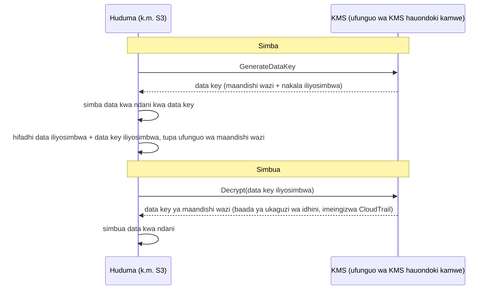

# Sura ya 16: Funguo, Kufuli, na Siri

Repo ya git ilikuwa na maelfu ya commits zikirudi miaka miwili nyuma. Leo alikuwa akisogeza kwa dakika ishirini, akifuata uzi kupitia historia — akitafuta mfuatano fulani wa muunganisho wa hifadhidata ulipotokea kwa mara ya kwanza. Karibu aikose. Ilikuwa Jumanne alasiri, iliyobanwa kati ya commits mbili zisizo za kawaida, iliyosukumwa na mtu ambaye tangu wakati huo alikuwa ameondoka kampuni.

Nenosiri la hifadhidata. Kwa maandishi wazi. Katika historia.

---

*Vidhibiti vya mtandao kutoka sura iliyopita vilikuwa vikali sasa. Vikundi vya usalama vilizuia harakati za upande. NACL zilizuia masafa ya IP yanayojulikana kuwa mabaya. Mzunguko ulikuwa umeimarishwa. Lakini ukaguzi wa usalama ulikuwa umepata kitu ambacho mzunguko hauwezi kukirekebisha: kitambulisho kilichokuwa kikiishi katika historia ya git kwa miezi sita. Usalama wa mzunguko huchukulia kuwa siri za ndani ni salama. Hii haikuwa.*

---

Leo alikuwa akikagua historia ya git alipokipata. Nenosiri la hifadhidata. Lililowekwa miezi sita iliyopita, kwa maandishi wazi, na mtu ambaye hafanyi kazi tena Nimbus — sehemu ya faili ya `.env` ambayo pia ilikuwa na ufunguo wa ufikiaji wa IAM wa bomba la usambazaji, mistari miwili chini ya mfuatano wa muunganisho. Commit ilikuwa ya umma. Nenosiri lilikuwa limebadilishwa tangu wakati huo — lakini hawakujua hilo kwa hakika. Walikagua kila mfumo ambao kitambulisho chochote kati ya hivyo kiliwahi kugusa. Ilichukua saa nne. Hiyo ndiyo siku Nimbus iliamua kuacha kuweka siri katika msimbo.

"Tumefikiria kinachotokea ikiwa mtu atafanya fork ya repo?" Priya alisema. "Historia ya git ni ya kudumu. Hata tukibadilisha nenosiri, yeyote aliyenakili repo kabla ya marekebisho bado ana kitambulisho cha zamani katika historia yake ya ndani."

"Tulikagua," Leo alisema. "Nenosiri lilibadilishwa miezi mitatu iliyopita. Mifumo yote imethibitishwa."

"Hicho ni kima cha chini," Priya alisema. "Lakini kila mfumo ambao kitambulisho hicho kiligusa unahitaji kukaguliwa. Si tu ule unaoujua."

**Ukaguzi wa Saa Nne**

Leo alikuwa amepata faili ya `.env` iliyovuja katika historia ya git saa 4 asubuhi. Kufikia saa 8 mchana, walikuwa na jibu la swali lililojalisha: je, kitambulisho chochote — nenosiri la hifadhidata au ufunguo wa ufikiaji uliowekwa pamoja nalo — kilikuwa kimetumika na mtu yeyote isipokuwa mifumo ya Nimbus?

Ukaguzi ulipitia kategoria nne.

**Kumbukumbu za ufikiaji za RDS**: Kila muunganisho kwa hifadhidata, wenye muhuri wa muda na ulioingizwa kumbukumbu. Nenosiri lililovuja lilionekana katika mifuatano mitatu ya muunganisho — yote kutoka vihalisi vya EC2 katika VPC ya Nimbus, yote na IP za chanzo zinazotarajiwa. Hakuna miunganisho ya nje. Nenosiri halikuwa limetumika kuunganisha kwa hifadhidata kutoka nje.

**Kumbukumbu za ufikiaji za S3**: Ufunguo wa ufikiaji uliovuja ulikuwa wa mtumiaji wa IAM wa bomba la usambazaji, ambaye alikuwa na idhini kwa ndoo ya `nimbus-receipts`. Leo aliuliza kumbukumbu za ufikiaji za seva za S3 kwa miezi sita iliyopita. Kila ufikiaji ulitoka vihalisi vya EC2 vya `us-west-2` au kutoka jukumu la kuchota la origin la CloudFront. Hakuna hitilafu.

**Miito ya API ya CloudTrail**: Kila wito wa API ya AWS uliofanywa na kitambulisho cha ufunguo wa ufikiaji uliovuja. Leo alichuja matukio ya CloudTrail kwa ufunguo. Matukio mia tatu na kumi na mawili — yote miito ya kawaida ya `s3:PutObject` kutoka bomba la usambazaji, yote kutoka IP ileile, yote ndani ya saa za kazi. Ufunguo ulikuwa umetumika tu kutoka anwani moja ya IP, iliyolingana na seva ya CI/CD.

"Na seva ya CI/CD," Priya alisema, "iko ndani ya VPC. Ingelazimika kutoa data nje kupitia HTTPS kwa endpoint ya nje, na tungeona hilo katika flow logs."

"Tulikagua," Leo alisema. "Hakuna HTTPS ya kwenda nje kutoka seva hiyo kwa IP zisizo za AWS katika miezi sita iliyopita."

**Hukumu**: Hakuna kitambulisho kilichotumika na mtu yeyote nje ya timu ya Nimbus. Ufichuzi ulikuwa hatari, si uvunjaji.

"Lakini hatuwezi kuwa na uhakika," Priya alisema. "Tunaweza kuwa na ujasiri wa kuridhisha kulingana na kumbukumbu. Hatuwezi kuwa na uhakika. Tofauti hiyo inajalisha."

"Nini kingetufanya tuwe na uhakika?"

"Hakuna kinachokufanya uwe na uhakika baada ya ufichuzi wa kitambulisho. Unazungusha kitambulisho, unakagua ufikiaji, unaandika matokeo yako, na unasonga mbele na vidhibiti bora. Uhakika haupatikani."

Tom alikuwa akihesabu wakati wa mazungumzo. "Saa nne za muda wa wahandisi watatu. Iite dola elfu nne katika gharama kamili. Pamoja na mzunguko wa kitambulisho, nyaraka, uandishi wa tukio."

"Na hiyo ni uchunguzi tu," Priya alisema. "Uvunjaji ungekuwa wa ukubwa wa maagizo zaidi. Arifa za udhibiti. Mawasiliano na wateja. Faini zinazowezekana."

"Kwa hivyo somo la dola elfu nne lilikuwa nafuu," Tom alisema.

"Kwa kiasi kikubwa," Priya alisema. "Tusilirudie."

---

**Matatizo Mawili: Kuhifadhi Siri na Kusimba Data**

Usalama kuzunguka taarifa nyeti una matatizo mawili tofauti:

**Kuhifadhi vitambulisho** (manenosiri ya hifadhidata, funguo za API, mifuatano ya muunganisho): Haya yanaishi wapi? Nani anaweza kuyafikia? Unayazungushaje bila kusambaza upya programu yako?

**Kusimba data** (taarifa za mteja, rekodi za malipo, PII): Unahakikishaje kwamba hata kama mtu atapata ufikiaji usioidhinishwa wa hifadhidata yako au ndoo ya S3, hawezi kusoma data?

AWS ina huduma iliyojitolea kwa kila tatizo:

- **AWS Secrets Manager**: Huhifadhi na kusimamia vitambulisho kwa usalama
- **AWS KMS (Key Management Service)**: Husimamia funguo za usimbaji kwa kusimba na kusimbua data

Fikiria Secrets Manager kama mnyororo wa funguo: hushikilia funguo zako (vitambulisho), huziweka kwa mpangilio, na huzizungusha kwa ratiba. Fikiria KMS kama hazina: haishikilii kilicho cha thamani — hushikilia ufunguo unaofungua kufuli kinacholinda kilicho cha thamani.

**AWS Secrets Manager: Hakuna Vitambulisho Vilivyowekwa Moja kwa Moja Tena**

Secrets Manager ni hifadhi salama ya siri: vitambulisho vya hifadhidata, funguo za API, tokeni za OAuth, funguo za SSH, au chochote nyeti.

Badala ya programu yako kusoma nenosiri kutoka kibadilishio cha mazingira au faili ya usanidi, huita API ya Secrets Manager wakati wa kuanza (au inapohitajika) na huchukua siri. Siri haigusi kamwe diski. Haionekani kamwe katika msimbo wako. Haiko katika vibadilishio vyako vya mazingira.

Hivi ndivyo mtiririko unavyoonekana:

**Njia ya zamani**:
```
DB_PASSWORD=supersecretpassword123  # katika faili ya .env au kibadilishio cha mazingira
```

**Njia ya Secrets Manager**:
```python
import boto3
client = boto3.client('secretsmanager')
secret = client.get_secret_value(SecretId='nimbus/production/db-password')
password = json.loads(secret['SecretString'])['password']
```

Kihalisi cha EC2 kinahitaji jukumu la IAM lenye idhini ya kuita `secretsmanager:GetSecretValue` kwa siri hiyo mahususi. Hakuna huduma nyingine inayoweza kuisoma. Siri haiko kamwe katika msimbo.

Huenda unajiuliza: kwa nini tusitumie tu vibadilishio vya mazingira? Ni rahisi zaidi — viweke wakati wa kusambaza, na programu inavisoma. Vibadilishio vya mazingira huonekana vimefichwa, lakini vimehifadhiwa katika usanidi wako wa usambazaji, hifadhi ya siri ya CI/CD, pengine vimeingizwa kumbukumbu wakati wa vikao vya kutatua, na vinaonekana kwa yeyote mwenye ufikiaji wa mchakato unaoendesha. Muhimu zaidi, ni tuli: vikishawekwa, havibadiliki hadi mtu auvisasishe kwa mkono. Secrets Manager huhifadhi vitambulisho katika huduma iliyosimbwa yenye vidhibiti vya ufikiaji vya IAM, kuingiza kumbukumbu kamili kupitia CloudTrail, na mzunguko wa kiotomatiki. Vibadilishio vya mazingira havizunguki. Kibadilishio cha mazingira kilichovuja kinabaki halali hadi mtu akibadilishe kwa mkono.

**Mzunguko wa Kiotomatiki: Nguvu Halisi**

Kipengele kikubwa zaidi cha Secrets Manager si kuhifadhi siri — ni kuzizungusha kiotomatiki.

Hii hapa hali: kila siku 30, Secrets Manager huzalisha nenosiri jipya la hifadhidata, hulisasisha katika RDS, husasisha siri iliyohifadhiwa, na programu yako huchukua nenosiri jipya wakati ujao inapohitaji. Hakuna uingiliaji wa mkono. Hakuna usambazaji. Hakuna "ninahitaji kukumbuka kuzungusha hii."

Mzunguko hutekelezwa kama kitendaji cha Lambda. AWS hutoa violezo vya hifadhidata za RDS (MySQL, PostgreSQL, Aurora). Unaweza kubinafsisha kitendaji kwa aina yoyote ya kitambulisho.

"Hilo linagharimu kiasi gani kwa mwezi?" Tom aliuliza.

Secrets Manager hutoza kwa kila siri kwa mwezi pamoja na kwa kila wito wa API. Kwa idadi ndogo ya manenosiri ya hifadhidata na funguo za API, gharama ni dola kwa mwezi — kidogo ikilinganishwa na gharama ya tukio.

"Maelewano ya wiki iliyopita," Priya alisema, "yangegharimu nini kuchunguza na kurekebisha?"

Tom alikuwa kimya kwa muda. "Ikijumuisha muda wangu, muda wako, wikendi ya Leo... dola elfu kadhaa."

"Secrets Manager ingeunasa ufunguo tuli kabla haujatumiwa vibaya. Na ingeuzungusha kiotomatiki."

Tom alivuta ukurasa wa bei.

**Kinachotokea Wakati wa Mzunguko**

"Subiri — lakini *kwa nini* tungeifanya hivyo?" Maya aliuliza. "Ikiwa nenosiri la hifadhidata litazunguka, je, programu inavunjika? Inachukuaje nenosiri jipya bila usambazaji?"

Hili lilikuwa wasiwasi halali. Mzunguko bila usumbufu unahitaji uangalifu.

Mzunguko wa Secrets Manager hufanya kazi kwa hatua — uliobuniwa kuzuia hali ya "nenosiri la zamani ghafla si halali, programu inaanguka":

**Hatua 1: Unda toleo jipya la siri.** Secrets Manager huzalisha nenosiri jipya na hulihifadhi kama toleo linalosubiri la siri. Toleo la sasa bado ni amilifu.

**Hatua 2: Weka kwenye huduma.** Lambda ya mzunguko huita hifadhidata kusasisha nenosiri kwa thamani mpya. Fahamu: kwa mkakati wa chaguomsingi wa mzunguko wa **mtumiaji-mmoja** kuna kipindi kifupi ambapo nenosiri la zamani limeacha kufanya kazi (`ALTER ROLE ... PASSWORD` ya PostgreSQL huanza kutumika mara moja) na toleo jipya bado si la sasa. Kwa mzunguko wa sifuri-kukatika, Secrets Manager inaunga mkono mkakati wa **watumiaji-wanaobadilishana**: watumiaji wawili wa hifadhidata wenye idhini sawa, ambapo mzunguko daima husasisha *asiye amilifu* kisha hubadilisha — vitambulisho amilifu havibatilishwi kamwe katikati. Kifungu cha mtihani cha kukumbuka ni "alternating users rotation strategy."

**Hatua 3: Jaribu siri mpya.** Lambda ya mzunguko huthibitisha kuwa nenosiri jipya linafanya kazi kwa kuunganisha nalo. Ikiwa hili litashindwa, mzunguko hurudishwa nyuma.

**Hatua 4: Maliza.** Secrets Manager huweka alama toleo jipya kama toleo la sasa na hushusha toleo la zamani kuwa toleo la awali. Toleo la awali huhifadhiwa kwa kipindi cha neema.

Wakati wa kipindi cha neema, matoleo yote mawili yanaweza kuchukuliwa. Ikiwa programu yako iliweka akiba siri ya zamani na bado haijachukua mpya, bado inaweza kuunganisha. Wakati ujao inapoita `GetSecretValue`, inapata toleo la sasa (jipya).

"Kwa hivyo programu haihitaji kamwe kuanzishwa upya," Leo alisema.

"Si lazima. Ikiwa programu yako huweka akiba siri wakati wa kuanza na haiiburudishi kamwe, unahitaji ama kuiburudisha kwa ratiba au kushughulikia kushindwa kwa uthibitishaji kwa kuchukua tena siri."

"Kwa hivyo Lambda ya mzunguko na programu zinahitaji kushirikiana," Maya alisema.

"Secrets Manager hufanya nusu yake. Msimbo wako wa programu unahitaji kufanya nusu nyingine: chukua siri inapohitajika, shughulikia kushindwa kwa uthibitishaji kwa kuchukua tena."

Leo alisasisha programu kunasa hitilafu za uthibitishaji wa hifadhidata na, wakati wa kushindwa, kuchukua siri mpya kutoka Secrets Manager kabla ya kujaribu tena. Mistari miwili ya kushughulikia hitilafu. Mzunguko ukawa hauonekani kwa watumiaji.

---

**Kuingiza Siri za Bomba la CI/CD**

"Tumefikiria jinsi bomba la usambazaji linavyopata siri linazohitaji?" Priya aliuliza. "Bomba husambaza miundombinu. Linahitaji vitambulisho vya AWS. Linaweza kuhitaji mifuatano ya muunganisho wa hifadhidata kwa hati za uhamishaji."

Leo alieleza usanidi wa sasa: siri zilihifadhiwa kama GitHub Actions Secrets — zikisimbwa zikiwa zimepumzika katika GitHub, zikiingizwa kama vibadilishio vya mazingira wakati wa kuendesha.

"Vitambulisho viko katika GitHub," Priya alisema.

"Vimesimbwa."

"Katika mfumo wa mtu wa tatu. Uvunjaji mmoja wa GitHub hufichua siri zote za bomba letu."

Suluhisho: bomba la usambazaji huthibitisha kwa AWS kupitia shirikisho la OIDC (lililoshughulikiwa katika Sura ya 14) na huchukua siri zozote linazohitaji kutoka Secrets Manager wakati wa kuendesha. Hakuna siri zilizohifadhiwa katika GitHub. Jukumu la AWS la bomba lina idhini ya kusoma siri mahususi, hakuna kingine.

```yaml
# Mtiririko wa GitHub Actions
- name: Get DB Migration Credentials
  env:
    AWS_DEFAULT_REGION: us-west-2
  run: |
    SECRET=$(aws secretsmanager get-secret-value \
      --secret-id nimbus/staging/db-migration \
      --query SecretString --output text)
    DB_URL=$(echo $SECRET | jq -r '.url')
    # Endesha uhamishaji na DB_URL — kamwe haihifadhiwi katika faili
    flyway -url="$DB_URL" migrate
```

Siri huchukuliwa, hutumika katika kumbukumbu, na hutupwa. Haiandikwi kamwe kwenye diski, haihifadhiwi kamwe katika vibadilishio vya mazingira vinavyodumu baada ya kazi, kamwe katika faili ya kumbukumbu.

"Vipi ikiwa siri itachapishwa kwenye kumbukumbu?" Leo aliuliza.

"GitHub Actions huficha kiotomatiki thamani za siri zilizosanidiwa kama GitHub Secrets. Lakini siri hii si GitHub Secret — inatoka Secrets Manager. Unahitaji kuificha kwa mkono, au bora zaidi, usiiingize kamwe kumbukumbu."

"Kwa hivyo nidhamu ni: chukua, tumia, tupa. Usiingize siri kumbukumbu kamwe. Usizihifadhi kamwe katika faili."

"Nidhamu hiyo," Priya alisema, "ndio ukaguzi wa saa nne ulithibitisha tulikuwa tukishindwa."


**AWS KMS: Kiwanda cha Kufuli**

"Subiri — lakini *kwa nini* tungeifanya hivyo?" Maya aliuliza. "Kwa nini huduma tofauti ya usimamizi wa funguo? Hatuwezi tu kusimba data wenyewe na kuhifadhi ufunguo katika Secrets Manager?"

Ungeweza kuhifadhi funguo za usimbaji katika Secrets Manager. Lakini nani anadhibiti ufikiaji wa ufunguo? Nini kinahakikisha ufunguo unazungushwa? Nini kinathibitisha kwa mkaguzi kuwa ufunguo ulitumika tu na huduma zilizoidhinishwa? KMS hujibu maswali haya yote. Si hifadhi tu — ni huduma ya usimamizi wa mzunguko wa maisha ya funguo yenye usalama unaoungwa mkono na vifaa, sera za IAM za kina kwa kila ufunguo, na njia kamili ya ukaguzi ya kila matumizi. Secrets Manager huhifadhi unachohitaji kuunganisha kwa mifumo. KMS hulinda mifumo yenyewe.

AWS KMS (Key Management Service) husimamia **funguo za kriptografia** — thamani za siri zinazotumiwa kusimba na kusimbua data.

Mlinganisho: KMS ni kama kampuni ya sanduku la kufuli inayoshikilia ufunguo mkuu. Data yako (yaliyomo ndani ya sanduku) imesimbwa. Ni mtu mwenye idhini ya kutumia ufunguo wa KMS pekee anayeweza kuisimbua. KMS huingiza kumbukumbu kila matumizi ya kila ufunguo katika CloudTrail.

**Customer Master Keys (CMKs)** — sasa zinaitwa funguo za KMS — zinakuja katika aina tatu za umiliki:

**Funguo zinazomilikiwa na AWS**: Funguo ambazo AWS inazimiliki na kuzitumia katika akaunti nyingi za wateja — huzioni kamwe, hulipi kamwe kwa ajili yake, na hazionekani katika akaunti yako. Chaguomsingi kadhaa za huduma huzitumia (usimbaji wa chaguomsingi wa DynamoDB, kwa mfano).

(Tofauti moja inayofaa kuiweka wazi: usimbaji wa chaguomsingi wa S3 wa **SSE-S3** *si* muundo wa ufunguo wa KMS kabisa — S3 husimamia funguo zake za AES-256 kabisa nje ya KMS, bila ufunguo wa kuona na bila njia ya ukaguzi wa matumizi ya ufunguo. **SSE-KMS** ndilo chaguo la S3 linalopitia KMS, likitumia ama ufunguo unaosimamiwa na AWS `aws/s3` au ufunguo unaosimamiwa na mteja. Kiamsha cha mtihani: "kagua nani alitumia ufunguo wa usimbaji" au "dhibiti mzunguko na sera ya ufunguo" → SSE-KMS na ufunguo unaosimamiwa na mteja — kila matumizi hutua katika CloudTrail.)

**Funguo zinazosimamiwa na AWS**: AWS huunda na kusimamia ufunguo kiotomatiki *katika akaunti yako* kwa huduma kama S3, EBS, RDS (zinazoitwa kama `aws/s3`). Unaweza kuuona na kukagua matumizi yake katika CloudTrail, lakini huwezi kubadilisha sera yake au mzunguko — AWS huuzungusha kiotomatiki kila mwaka. Bure.

**Funguo zinazosimamiwa na mteja**: Unaunda ufunguo katika KMS na unadhibiti kila kipengele chake: nani anaweza kuutumia, lini unazunguka, nani anaweza kuusimamia. Unaweza kuwasha mzunguko wa kiotomatiki wa ufunguo na kipindi kinachoweza kusanidiwa kati ya siku 90 na siku 2,560 (miaka 7); kipindi cha chaguomsingi cha mzunguko ni siku 365 (kila mwaka). Unaweza pia kuanzisha **mzunguko wa on-demand** mara moja — muhimu baada ya ufichuzi unaoshukiwa, bila kusubiri ratiba. Kumbuka: mzunguko wa kiotomatiki unatumika kwa funguo linganifu zenye material iliyozalishwa na KMS — funguo zisizo linganifu na material ya funguo iliyoingizwa haziwezi kuzunguka kiotomatiki. Gharama: $1/mwezi kwa kila ufunguo pamoja na malipo ya kila wito-wa-API.

Ukichagua funguo za KMS zinazosimamiwa na mteja, basi unapata udhibiti kamili wa ratiba za mzunguko, sera za ufikiaji, na uonekanaji wa ukaguzi, lakini unalipa kwa kila ufunguo kwa mwezi na unachukua jukumu la usimamizi wa funguo; ukichagua funguo zinazosimamiwa na AWS, basi unapata usimbaji bila mzigo wowote wa kiutendaji na bila gharama kwa ufunguo wenyewe, lakini huwezi kubinafsisha ratiba za mzunguko au sera za ufunguo — zinasimamiwa kabisa na AWS.

**Usimbaji katika Huduma za AWS: Muunganisho wa KMS**

Huduma nyingi za AWS huunganishwa na KMS kwa usimbaji:

**S3**: Washa "server-side encryption na KMS" kwenye ndoo. Kila kitu kimesimbwa kikiwa kimepumzika kwa ufunguo wa KMS. Kusoma kitu kunahitaji idhini kwa ndoo ya S3 *na* ufunguo wa KMS.

**RDS**: Washa usimbaji wakati wa kuunda. Hifadhi ya hifadhidata, chelezo, na picha vyote vimesimbwa kwa ufunguo wa KMS. Kumbuka: usimbaji hauwezi kuwashwa kwa kihalisi cha RDS kilichopo kisichosimbwa — lazima upige picha, unakili picha na usimbaji umewashwa, na urejeshe.

**EBS**: Simba viasi kwa KMS. Viasi vipya vilivyoundwa kutoka picha zilizosimbwa husimbwa kiotomatiki.

**DynamoDB**: Usimbaji ukiwa umepumzika kwa kutumia KMS umewashwa kwa chaguomsingi kwenye majedwali yote.

**ElastiCache Redis**: Usimbaji ukiwa umepumzika kwa KMS kwa data nyeti iliyowekwa akiba.

Kanuni: data inapaswa kusimbwa ikiwa imepumzika (imehifadhiwa kwenye diski) na katika usafiri (ikisonga katika mtandao). KMS hushughulikia usimbaji wa ukiwa-umepumzika. TLS/SSL (hutolewa kiotomatiki na huduma za AWS) hushughulikia usimbaji wa ndani-ya-usafiri.

**Usimbaji wa Bahasha: Jinsi KMS Hufanya Kazi Kweli**

Hii hapa undani unaokusaidia kuelewa tabia ya KMS na maswali ya mtihani.

KMS haisimbi data yako moja kwa moja katika hali nyingi. Inatumia **usimbaji wa bahasha (envelope encryption)**:

1. KMS huzalisha **data key** (ufunguo linganifu wa kipekee)
2. Huduma hutumia data key kusimba data yako kwa ndani (haraka — usimbaji linganifu)
3. Huduma huiuliza KMS kusimba data key yenyewe (kwa kutumia ufunguo wako wa KMS)
4. Data iliyosimbwa na data key iliyosimbwa vyote huhifadhiwa
5. Data yako halisi haiondoki kamwe huduma — data key pekee ndiyo huenda kwa KMS kwa usimbaji/usimbuaji

Unaposoma data:

1. Huduma huiuliza KMS kusimbua data key
2. KMS hukagua idhini, husimbua data key, huirudisha
3. Huduma hutumia data key iliyosimbuliwa kusimbua data yako kwa ndani



Hii inamaanisha KMS inaweza kushughulikia data kubwa sana bila kutuma yote kupitia API ya KMS. Funguo ndogo pekee huenda kwa KMS. CloudTrail huingiza kumbukumbu kila wito wa API ya KMS — kila operesheni ya kusimba na kusimbua.

**Sera za Ufunguo za KMS: Muundo wa Ufikiaji**

"Tumefikiria kinachotokea ikiwa sera ya IAM na sera ya ufunguo zitagongana?" Priya aliuliza. "KMS ina udhibiti wake wa ufikiaji juu ya IAM."

Funguo za KMS zina **key policies** — sera zinazotegemea rasilimali zilizoambatishwa kwa ufunguo wenyewe. Ni tofauti na sera za IAM na hufuata kanuni tofauti za tathmini.

Kwa principal kutumia ufunguo wa KMS, mambo mawili lazima yawe ya kweli:

**Kwanza**: Sera ya ufunguo lazima iruhusu. Ikiwa sera ya ufunguo haitoi principal ufikiaji kwa wazi, hawawezi kutumia ufunguo — bila kujali sera yao ya IAM inasema nini. Hii ni tofauti na rasilimali nyingi za AWS, ambapo sera za IAM pekee zinatosha.

**Pili**: Sera ya IAM ya principal lazima iruhusu kitendo cha KMS (k.m., `kms:Decrypt`, `kms:GenerateDataKey`).

Zote mbili lazima ziseme ndiyo. Yoyote ikisema hapana inamaanisha kitendo kinakataliwa.

Sera ya ufunguo ya chaguomsingi ambayo AWS huunda kwa funguo zinazosimamiwa na mteja inajumuisha kauli inayosema "akaunti ya root inaweza kusimamia ufunguo huu." Hii ni muhimu: inamaanisha msimamizi wa IAM wa kiwango cha akaunti anaweza daima kutoa ufikiaji kwa ufunguo, hata kama sera ya ufunguo haiwataji moja kwa moja — kwa sababu ukabidhi wa akaunti ya root upo.

"Kwa hivyo tukiondoa akaunti ya root kutoka sera ya ufunguo," Leo aliuliza, "sera za IAM zinaacha kufanya kazi kwa ufunguo huo?"

"Sahihi. Kuondoa ukabidhi wa akaunti ya root ni njia ya kufunga ufunguo kwa ukali sana hivi kwamba ni principals mahususi waliotajwa katika sera ya ufunguo pekee wanaoweza kuutumia — hata wasimamizi wa akaunti. Pia ni njia ya kujifungia nje ya ufunguo wako mwenyewe kwa bahati mbaya."

"Tunaweza kupona?"

"Tu kwa kuwasiliana na AWS Support. Ikiwa hakuna mtu anayeweza kutumia ufunguo na sera ya ufunguo haiwezi kusasishwa, data iliyosimbwa kwa ufunguo huo kwa hakika haifikiki."

"Kwa hivyo usiondoe akaunti ya root kutoka sera ya ufunguo bila sababu nzuri sana."

"Sahihi."

---

**Funguo Zisizo Linganifu: Kutia Saini na Kuthibitisha**

KMS pia inaunga mkono jozi za funguo zisizo linganifu — ufunguo wa umma na ufunguo wa kibinafsi.

Kesi za matumizi:

**Kutia saini kidijitali**: Unatia saini hati au tokeni ya JWT kwa ufunguo wa kibinafsi. Yeyote mwenye ufunguo wa umma anaweza kuthibitisha kuwa saini ilitoka kwa mshikilia wa ufunguo wa kibinafsi, na kwamba maudhui hayajachezewa.

**Usimbaji wa ufunguo wa umma**: Yeyote anaweza kusimba data kwa ufunguo wa umma. Mshikilia wa ufunguo wa kibinafsi pekee anaweza kuisimbua.

Kwa Nimbus, funguo zisizo linganifu zikawa muhimu walipotekeleza mfumo wa saini ya webhook kwa washirika wa mikahawa. Wakati Nimbus ilipotuma tukio kwa seva ya mshirika wa mkahawa (agizo jipya, sasisho la hali), mshirika alihitaji kuthibitisha tukio kwa kweli lilitoka Nimbus na halikutengenezwa kwa udanganyifu.

Utekelezaji:

1. Nimbus huunda ufunguo wa KMS usio linganifu (RSA 2048-bit, algoriti ya SIGN_VERIFY)
2. Wakati wa kutuma webhook, Nimbus huita `kms:Sign` kwa ufunguo wa kibinafsi kutia saini mzigo wa tukio
3. Saini hujumuishwa katika kichwa cha webhook
4. Nimbus huchapisha ufunguo wa umma (unaopakuliwa kutoka koni ya KMS)
5. Seva ya mshirika wa mkahawa huchukua ufunguo wa umma na huutumia kuthibitisha saini kwenye kila webhook inayoingia

Ufunguo wa kibinafsi hauondoki kamwe KMS. Nimbus haina kamwe ufikiaji wa material ghafi ya ufunguo wa kibinafsi. KMS hufanya operesheni ya kutia saini ndani ya moduli yake ya usalama ya vifaa.

"Kwa hivyo hata kama mtu angeathiri seva ya Nimbus," Rafael alisema, "hawangeweza kutengeneza saini ya webhook kwa udanganyifu. Ufunguo wa kibinafsi uko katika KMS, si kwenye seva yoyote."

"Sahihi. Kutia saini kunahitaji wito wa API ya KMS. Kila wito wa API umeingizwa kumbukumbu katika CloudTrail. Ikiwa mtu angejaribu kutia saini tukio la udanganyifu, tungeona wito wa API."

---

**Hadithi ya Kufuta Ufunguo**

Miezi mitatu baada ya usanidi wa KMS, Tom alifanya kosa.

Alikuwa akisafisha rasilimali za AWS zisizotumika — vitendaji vya zamani vya Lambda, ndoo za S3 zilizochakaa, dashibodi za CloudWatch zilizoachwa. Alikuwa akisonga haraka. Alipanga kwa bahati mbaya ufunguo wa KMS kufutwa.

Ufunguo ulikuwa `nimbus/prod/order-receipts` — ufunguo unaosimamiwa na mteja uliotumika kusimba ndoo ya S3 ya risiti za maagizo.

"Nilifuta rasilimali kumi na mbili kwa wingi jana na sikuangalia ya kumi na mbili ilikuwa nini," Tom alisema kavu. Alikuwa amepanga ufutaji na akaendelea. Aligundua kosa asubuhi iliyofuata alipokagua vitendo vyake.

Alivuta koni ya KMS. Hali ya ufunguo ilisoma: "Inasubiri kufutwa. Kufutwa katika siku 7."

Alikuwa ameupanga kwa kipindi cha chini cha kusubiri.

"Tunaweza kuighairi?" aliuliza.

Priya alivuta nyaraka. "Ndiyo. Wakati wa kipindi cha kusubiri, ufunguo umezimwa lakini haujafutwa. Unaweza kughairi ufutaji."

Tom alighairi ufutaji ndani ya dakika moja. Ufunguo ulirudishwa kwa hali amilifu.

"Siku saba ni kipindi cha chini cha kusubiri," Priya alisema. "AWS huitekeleza kwa sababu ikiwa ufunguo utafutwa na data ilisimbwa nao, data hiyo imeenda milele. Isiyoweza kupatikana. Kipindi cha kusubiri hukupa muda wa kutambua kosa."

"Kipindi cha kusubiri kinapaswa kuwa cha muda gani?"

"Kikomo cha juu ni siku thelathini. Kwa ufunguo wowote unaosimba data ya uzalishaji, tumia siku thelathini. Wiki tatu za ziada za ulinzi dhidi ya ajali zinastahili usumbufu mdogo."

Tom alisasisha mipangilio yote ya kufuta ufunguo ya uzalishaji kuwa siku thelathini. Pia aliweka kengele ya CloudWatch iliyowaka ikiwa hali yoyote ya ufunguo wa KMS itabadilika kuwa "Inasubiri kufutwa" — ili wakati ujao mtu (ikiwa ni pamoja na yeye) atakapofanya kosa lilelile, timu ingejua ndani ya dakika tano.

---

**Secrets Manager dhidi ya Parameter Store**

AWS pia ina **Systems Manager Parameter Store**, ambayo huhifadhi thamani za usanidi (si siri tu). Parameter Store ni nafuu zaidi — bure kwa parameta za kawaida. Pia inaweza kuhifadhi parameta zilizosimbwa kwa kutumia KMS.

Kwa siri zinazohitaji mzunguko: Secrets Manager.

Kwa thamani za usanidi na parameta zisizo nyeti: Parameter Store (tier ya bure ni ya ukarimu sana).

Kwa usanidi wa programu (nambari za lango, feature flags, mipangilio mahususi ya mazingira): Parameter Store.

| | Secrets Manager | SSM Parameter Store |
|---|---|---|
| Mzunguko wa kiotomatiki | Ndiyo (unaoungwa na Lambda) | Hapana |
| Gharama | ~$0.40/siri/mwezi | Bure (kawaida) |
| Usimbaji | Daima | Hiari (na KMS) |
| Utoaji wa matoleo | Ndiyo | Ndiyo |
| Ufikiaji wa akaunti tofauti | Ndiyo | Mdogo |
| Bora kwa | Manenosiri ya hifadhidata, funguo za API | Thamani za usanidi, feature flags |

## Cheti Mlangoni

Wiki mbili baada ya uhamishaji wa siri, Priya alikuwa akikagua mazingira ya staging ya Nimbus kwenye simu yake alipoona upau wa anwani.

"Si Salama (Not Secure)."

Alivuta URL ya uzalishaji. Vivyo hivyo.

"Leo," alisema, akiweka simu yake mezani. "Je, tunaendesha juu ya HTTP?"

Leo aliangalia. "Msikilizaji wa ALB uko kwenye lango 80. Hatukuwahi kuweka HTTPS."

"Kwa hivyo kila ombi ambalo watumiaji wetu hufanya — kila agizo, kila kuingia — linaenda juu ya HTTP isiyosimbwa?"

"Tuna TLS kwenye muunganisho wa RDS," Leo alitoa.

"Hiyo ni data katika usafiri kati ya programu na hifadhidata. Ninazungumza kuhusu data katika usafiri kati ya kivinjari cha mtumiaji na load balancer yetu. Hiyo haijasimbwa hata kidogo."

Tom alikuwa akisikiliza. "Je, hilo ni tatizo la usalama au tatizo la mtazamo?"

"Vyote viwili," Priya alisema. "HTTP isiyosimbwa inamaanisha mtandao wowote kati ya mtumiaji na seva yetu — kipanga njia cha mkahawa wa kahawa, ISP — unaweza kusoma trafiki. Manenosiri, undani wa maagizo, tokeni za vipindi. Na vivinjari vya kisasa huwaonya watumiaji kwa 'Si Salama.' Hilo huua viwango vya ubadilishaji."

"Kwa hivyo tunahitaji cheti cha TLS," Maya alisema. "Hilo linagharimu kiasi gani?"

"Hakuna chochote," Priya alisema. "AWS Certificate Manager."

**AWS Certificate Manager (ACM)** hutoa vyeti vya bure vya TLS/SSL kwa matumizi na huduma zinazosimamiwa na AWS: ALB, usambazaji wa CloudFront, na API Gateway. Hununui cheti, husimamii kalenda ya uhuishaji, wala hugusi material ya ufunguo wa kibinafsi. ACM hushughulikia mzunguko mzima wa maisha ya cheti.

Cheti kilichotolewa na ACM ni halali kwa miezi 13. Kabla hakijaisha, ACM hukihuisha kiotomatiki. Ikiwa uhuishaji utafaulu, cheti kipya huambatishwa kwa load balancer au usambazaji wako bila kitendo chochote kutoka kwako. Kufuli la kijani la kivinjari hubaki. Tahadhari ya kuisha uliyosahau kuiweka haiwaki kamwe.

**Aina mbili za vyeti vya ACM**:

**Vyeti vya umma** hutolewa na mamlaka ya cheti ya Amazon na vinaaminiwa na vivinjari vyote vikuu. Ni bure kabisa kwa matumizi na ALB, CloudFront, na API Gateway. Unathibitisha umiliki wa kikoa ama kupitia DNS au barua pepe.

**Vyeti vya kibinafsi** hutolewa na AWS Private CA — mamlaka ya cheti ya kibinafsi inayosimamiwa unayoiendesha kwa huduma za ndani (mTLS ya huduma-kwa-huduma, zana za ndani, wateja wa VPN). Private CA ina gharama ya kila mwezi.

Kwa Nimbus, vyeti vya umma vilikuwa chaguo sahihi.

**Uthibitishaji wa DNS dhidi ya uthibitishaji wa barua pepe**:

Leo alivuta koni ya ACM na akaanza ombi la cheti kwa `eatnimbus.com` na `*.eatnimbus.com`.

"Inaniuliza jinsi ninavyotaka kuthibitisha umiliki," alisema. "DNS au barua pepe."

"DNS," Priya alisema. "Daima DNS."

Kwa uthibitishaji wa DNS, ACM huongeza rekodi mahususi ya CNAME kwa hosted zone yako. Route 53 inaweza kufanya hili kiotomatiki — bonyezo moja katika koni. Mradi rekodi hiyo ya CNAME ipo, ACM inaweza kuhuisha cheti kiotomatiki bila kitendo chochote cha kibinadamu. Uthibitishaji wa barua pepe hutuma barua pepe kwa mawasiliano yaliyosajiliwa ya kikoa na huhitaji bonyezo la mkono kila wakati cheti kinapohuishwa. Bonyezo hilo husahaulika. Uthibitishaji wa DNS hauhitaji yeyote kukumbuka chochote.

"Kwa hivyo ninaongeza rekodi ya CNAME mara moja," Leo alisema, "na inahuishwa milele?"

"Hadi mtu afute rekodi ya CNAME," Priya alisema. "Usifute rekodi ya CNAME."

Leo aliomba cheti, aliongeza CNAME ya uthibitishaji katika Route 53 (ambayo ACM ilijitolea kufanya kiotomatiki), na akasubiri dakika tano. Hali ya cheti ilibadilika kuwa Issued. Aliambatisha kwa msikilizaji wa HTTPS wa ALB kwenye lango 443 na akaongeza kanuni ya kuelekeza upya kwenye lango 80 kutuma trafiki yote ya HTTP kwa HTTPS.

Tom aliburudisha URL ya uzalishaji.

Kufuli lilionekana.

Undani mmoja wa kieneo unaostahili kuangaziwa: cheti ni rasilimali ya kieneo, na lazima kiishi katika eneo lilelile na huduma inayokitumia. Kwa ALB, hilo ni eneo la ALB. Kwa **CloudFront**, cheti lazima kiombwe (au kiingizwe) katika **`us-east-1`** — daima, bila kujali origins zako zinaendesha wapi — kwa sababu CloudFront ni huduma ya kimataifa iliyotia nanga hapo. Leo alikuwa tayari amejikwaa kwenye hili katika Sura ya 13; pia ni ukweli wa kuaminika wa mtihani.

**Kitu kimoja ambacho vyeti vya ACM haviwezi kufanya**:

"Naweza kupakua cheti?" Leo aliuliza. "Nataka kukisakinisha kwenye kihalisi cha EC2 cha msimamizi wa ndani."

"Hapana," Priya alisema.

Vyeti vya umma vya bure vya ACM haviwezi kusafirishwa nje. Huwezi kupakua ufunguo wa kibinafsi na kuusakinisha kwenye kihalisi cha EC2, seva ya Nginx, au chochote nje ya huduma zinazosimamiwa na AWS. Material ya ufunguo wa kibinafsi haiondoki kamwe ACM. Hii ni ya kukusudia — huzuia ufunguo wa kibinafsi kuvuja, kuhifadhiwa bila usalama, au kusahaulika cheti kinapoisha.

Kwa kesi za matumizi zinazohitaji cheti kinachoweza kusakinishwa — kihalisi cha EC2 kinachofanya kama proksi maalum, seva ya kawaida — kuna njia tatu: cheti kutoka mamlaka ya mtu wa tatu (Let's Encrypt, kwa mfano), AWS Private CA na usafirishaji wa cheti ukiwa umewashwa, au — tangu Juni 2025 — **vyeti vya umma vinavyoweza kusafirishwa** vya ACM vinavyolipiwa (kujiandikisha wakati wa kutoa, vinatozwa kwa kila FQDN au wildcard), ambavyo ufunguo wao wa kibinafsi *unaweza* kusafirishwa kwa matumizi popote.

"Kwa ALB yetu na usambazaji wetu wa CloudFront," Priya alisema, "ACM ni sahihi haswa. Bure, kiotomatiki, na hatugusi kamwe ufunguo."

## Nguvu na Mapungufu

**AWS Secrets Manager**:

- Mzunguko wa kiotomatiki wa siri bila mabadiliko ya msimbo au usambazaji
- Udhibiti wa kina wa ufikiaji wa IAM kwa kila siri (kila siri ni rasilimali tofauti ya IAM)
- Utoaji wa matoleo — toleo la awali linabaki linafikika wakati wa mzunguko, kuzuia kukatika kwa miunganisho
- Ukaguzi kupitia CloudTrail — kila wito wa `GetSecretValue` umeingizwa kumbukumbu na utambulisho wa mwitaji
- Ufikiaji wa akaunti tofauti — siri za akaunti moja zinaweza kushirikiwa na jukumu la akaunti nyingine
- Gharama: ~$0.40/siri/mwezi + miito ya API (takriban $0.05 kwa miito 10,000 ya API)

**AWS KMS**:

- Usimamizi wa funguo uliokusanywa na njia kamili ya ukaguzi — kila kusimba na kusimbua kumeingizwa kumbukumbu
- Mzunguko wa kiotomatiki wa ufunguo unaoweza kusanidiwa kwa funguo zinazosimamiwa na mteja (siku 90 hadi 2,560; chaguomsingi siku 365) — material ya zamani ya ufunguo bado husimbua data iliyopo, material mpya husimba data mpya
- Idhini za kina za IAM kwa kila ufunguo (key policies + IAM policies — zote lazima ziruhusu)
- Inaungwa mkono na Hardware Security Module (HSM) — funguo haziondoki kamwe HSM zikiwa maandishi wazi
- Msaada wa funguo za Multi-Region kwa hali za uokoaji wa maafa
- Msaada wa funguo zisizo linganifu kwa kutia saini kidijitali na kuthibitisha
- Gharama: $1/mwezi kwa kila ufunguo + $0.03 kwa miito 10,000 ya API

**Pale inapokuwa ngumu**:

- Sera za ufunguo za KMS ni tofauti na (na hutathminiwa pamoja na) sera za IAM — kutatua makosa ya access denied kunahitaji kuangalia zote mbili
- Usimbaji ukiwa umepumzika lazima upangwe mapema — huwezi kusimba kihalisi cha RDS kilichopo kisichosimbwa mahali pake
- Kufuta ufunguo katika KMS kuna kipindi cha kusubiri cha siku 7-30 — utaratibu wa usalama, lakini rahisi kusahau wakati wa usanidi na hatari kuanzisha kwa bahati mbaya
- Mzunguko unahitaji msimbo wa programu kushughulikia kuchukua tena siri wakati wa kushindwa kwa uthibitishaji — Secrets Manager huzungusha kitambulisho, lakini programu lazima ikichukue
- Secrets Manager hugharimu kulingana na idadi ya siri na kiasi cha miito ya API kwa kiwango kikubwa
- Sera ya ufunguo ya chaguomsingi (ikiwa ni pamoja na ukabidhi wa akaunti ya root) ni muhimu kuihifadhi — kuiondoa kunaweza kuwafungia wasimamizi nje ya ufunguo

## Muhtasari

Saa nne zilizotumika kufuatilia kitambulisho kilichoathiriwa kupitia kila mfumo kilichogusa zilikuwa saa nne ambazo Secrets Manager ingeweza kuzizuia. Mzunguko wa kiotomatiki unamaanisha kitambulisho kilichoibwa kina maisha mafupi. KMS inamaanisha hata kama mtu atafikia data, hawezi kuisoma bila ufunguo ambao hawajaidhinishwa kuutumia. Na kipindi cha kusubiri cha siku thelathini cha kufuta ufunguo kinamaanisha ufutaji wa bahati mbaya unaweza kughairiwa kabla haujakuwa tukio la kupoteza data.

- Usihifadhi kamwe vitambulisho katika msimbo, vibadilishio vya mazingira, au faili za usanidi zilizowekwa katika udhibiti wa toleo.
- **Secrets Manager** huhifadhi vitambulisho kwa usalama na huvizungusha kiotomatiki. Programu huchukua siri kupitia API wakati wa kuendesha.
- **Mzunguko** hutokea kwa hatua: unda toleo jipya, sasisha kwenye huduma, jaribu, pandisha. Matoleo ya zamani na mapya yote ni halali kwa muda mfupi, kuzuia kukatika kwa miunganisho wakati wa mzunguko.
- **KMS** husimamia funguo za usimbaji. Huduma nyingi za AWS huunganishwa na KMS kwa usimbaji ukiwa umepumzika.
- **Usimbaji wa bahasha**: KMS husimba ufunguo, si data moja kwa moja. Huduma husimba data kwa kutumia data key ya ndani, ambayo KMS husimba. Funguo ndogo pekee hupita katika API ya KMS.
- **Funguo za KMS zinazosimamiwa na mteja**: udhibiti kamili wa mzunguko (unaoweza kusanidiwa siku 90–2,560, chaguomsingi siku 365 kila mwaka), ufikiaji, na ukaguzi ($1/mwezi). **Funguo zinazosimamiwa na AWS**: kiotomatiki, hakuna usanidi unaohitajika, bure.
- **Sera za ufunguo za KMS**: Sera ya ufunguo ni sera inayotegemea rasilimali inayofanya kazi pamoja na IAM. Zote mbili lazima ziseme ndiyo. Ukabidhi wa akaunti ya root katika sera ya ufunguo ya chaguomsingi huhakikisha wasimamizi wa IAM wanaweza daima kutoa ufikiaji.
- **Funguo zisizo linganifu**: KMS inaunga mkono jozi za funguo za RSA na ECC kwa kutia saini na kuthibitisha. Ufunguo wa kibinafsi hauondoki kamwe HSM.
- **Kufuta ufunguo**: Kipindi cha kusubiri cha chini cha siku 7, cha juu cha siku 30. Funguo zilizofutwa zinamaanisha data iliyosimbwa isiyofikika kabisa. Tumia siku 30 kwa funguo za uzalishaji, na fuatilia hali ya kusubiri kufutwa.
- **Siri za CI/CD**: Chukua kutoka Secrets Manager wakati wa kuendesha kwa kutumia shirikisho la OIDC. Usihifadhi kamwe siri kama vibadilishio vya jukwaa la CI/CD.

## Vidokezo vya Mtihani

*Kikoa cha SAA-C03: Buni Usanifu Salama (Kikoa cha 1, Kazi ya 1.3)*

- **Secrets Manager dhidi ya SSM Parameter Store**: Secrets Manager kwa vitambulisho vinavyohitaji mzunguko wa kiotomatiki; Parameter Store kwa usanidi wa jumla. Mtihani huzitofautisha kwa hitaji la mzunguko na usikivu wa gharama.
- **Sera za ufunguo za KMS**: Ufunguo wa KMS una sera yake ya ufunguo (sera inayotegemea rasilimali). Sera za IAM pekee hazitoi ufikiaji wa ufunguo wa KMS — sera ya ufunguo lazima iruhusu kwa wazi. Sera ya ufunguo na sera ya IAM zote lazima ziruhusu kitendo.
- **Kusimba RDS**: Haiwezi kuwasha usimbaji kwa kihalisi cha RDS kilichopo kisichosimbwa. Mchakato: unda picha → nakili picha na usimbaji umewashwa → rejesha kutoka picha iliyosimbwa → hamisha trafiki kwa kihalisi kipya.
- **Usimbaji wa EBS**: Viasi vipya vinaweza kusimbwa. Picha za viasi vilivyosimbwa daima husimbwa. Viasi visivyosimbwa haviwezi kusimbwa moja kwa moja — picha + nakili + rejesha.
- **CloudTrail + KMS**: Kila wito wa API ya KMS huingia katika CloudTrail. Hiki ni kipengele muhimu cha uzingatiaji. Mtihani unapouliza jinsi ya kukagua nani alisimbua data gani, jibu ni CloudTrail + KMS.
- **Funguo za KMS za Multi-Region**: Nakili material ya ufunguo kwa maeneo mengi ili usimbuaji ufanyike bila miito ya API ya maeneo tofauti. Mtihani hutumia hii kwa uokoaji wa maafa wa maeneo mengi na data iliyosimbwa.
- **KMS dhidi ya CloudHSM**: KMS ni ya wapangaji wengi (inasimamiwa na AWS). CloudHSM ni moduli maalum ya usalama ya vifaa unayoidhibiti wewe pekee. Ishara za mtihani: "FIPS 140-2 Level 3," "HSM maalum," "operesheni za kriptografia zinazodhibitiwa na mteja" → CloudHSM.
- **Usimbaji wa bahasha**: KMS huzalisha data key, huduma huitumia kusimba data kwa ndani, KMS husimba data key. Swali la mtihani: "kwa nini KMS haisimbi data nyingi moja kwa moja?" → utendaji; usimbaji wa bahasha huweka data kubwa kwa ndani.
- **Funguo zisizo linganifu za KMS**: Hutumiwa kwa kutia saini kidijitali, kuthibitisha JWT, au usimbaji wa ufunguo wa umma. Ufunguo wa kibinafsi hauondoki kamwe KMS. `kms:Sign` ni wito wa API wa kutia saini; `kms:Verify` kuthibitisha.
- **Kipindi cha kusubiri cha kufuta ufunguo**: Siku 7-30. Wakati wa kipindi hiki, ufunguo umezimwa na hauwezi kutumika, lakini ufutaji unaweza kughairiwa. Baada ya kufutwa, data yoyote iliyosimbwa na ufunguo huo haiwezi kupatikana kabisa.
- **ACM (AWS Certificate Manager)**: Vyeti vya bure vya TLS vya umma kwa matumizi na ALB, CloudFront, na API Gateway. Huhuisha kiotomatiki kupitia uthibitishaji wa DNS. Vyeti vya bure vya umma haviwezi kusafirisha ufunguo wao wa kibinafsi — vinaishi ndani ya AWS pekee (chaguo la *cheti cha umma kinachoweza kusafirishwa* kinacholipiwa kipo tangu 2025 kwa matumizi ya EC2/kawaida). Kiamsha cha mtihani: "HTTPS kwenye load balancer au CDN" → ACM.

## Mazoezi

**Zoezi la 1 — Kumbuka**

Eleza dhana ya usimbaji wa bahasha. Kwa nini KMS husimba data key ndogo badala ya kusimba data ya programu yako moja kwa moja?

*(Kidokezo: Fikiria kinachotokea ikiwa una GB 1 ya data ya kusimba, na athari za utendaji za kutuma GB 1 kwa huduma ya mbali ya KMS zingekuwaje.)*

**Zoezi la 2 — Hali ya SAA-C03**

*Hali*: Kampuni ya huduma za kifedha huhifadhi data nyeti ya mteja katika hifadhidata ya RDS MySQL. Hitaji jipya la uzingatiaji linaamuru kwamba:

1. Data zote lazima zisimbwe zikiwa zimepumzika
2. Matumizi yote ya ufunguo wa usimbaji lazima yaweze kukaguliwa
3. Funguo za usimbaji lazima zidhibitiwe na mteja (zisidhibitiwe na AWS)
4. Nenosiri la hifadhidata lazima lizungushwe kiotomatiki kila siku 90

Hifadhidata iliundwa miezi sita iliyopita bila usimbaji kuwashwa. Ni seti gani ya vitendo inayokidhi mahitaji yote manne BORA zaidi?

A) Washa usimbaji wa RDS kwenye hifadhidata iliyopo; unda ufunguo wa KMS unaosimamiwa na mteja; sanidi Secrets Manager na mzunguko wa siku 90  
B) Unda picha ya hifadhidata iliyopo; nakili picha na usimbaji kwa kutumia ufunguo wa KMS unaosimamiwa na mteja; rejesha kutoka picha iliyosimbwa; sanidi Secrets Manager na mzunguko wa siku 90  
C) Unda kihalisi kipya cha RDS kilichosimbwa kwa ufunguo unaosimamiwa na AWS; hamisha data kutoka kihalisi cha zamani; sanidi Secrets Manager na mzunguko wa siku 90  
D) Washa usimbaji wa RDS ukiwa umepumzika kwenye hifadhidata iliyopo kwa kutumia ufunguo unaosimamiwa na AWS; sanidi Secrets Manager na mzunguko wa siku 90

**Kidokezo cha 1**: Huwezi kuwasha usimbaji kwenye kihalisi cha RDS kilichopo kisichosimbwa moja kwa moja.

**Kidokezo cha 2**: Funguo "zinazodhibitiwa na mteja" zinamaanisha funguo za KMS zinazosimamiwa na mteja, si funguo zinazosimamiwa na AWS.

**Kidokezo cha 3**: Mchakato wa kunakili picha ni njia ya kawaida ya uhamishaji hadi RDS iliyosimbwa.

**Jibu**: B

**Maelezo**: Usimbaji wa RDS hauwezi kuwashwa kwenye kihalisi kilichopo. Mbinu ya kawaida ni: piga picha kihalisi kilichopo → nakili picha na usimbaji umewashwa kwa kutumia ufunguo wa KMS unaosimamiwa na mteja (hukidhi mahitaji 1, 2, na 3) → rejesha kutoka picha iliyosimbwa. Funguo za KMS zinazosimamiwa na mteja huingiza kiotomatiki matumizi yote katika CloudTrail (ukaguzi) na huweka funguo za usimbaji chini ya udhibiti wako. Secrets Manager hushughulikia mzunguko wa kiotomatiki wa nenosiri wa siku 90 (hukidhi hitaji la 4).

**Kwa nini si A?** Huwezi kuwasha usimbaji kwenye kihalisi cha RDS kilichopo kisichosimbwa mahali pake.

**Kwa nini si C?** Funguo zinazosimamiwa na AWS hazikidhi hitaji la "kudhibitiwa na mteja" (hitaji la 3).

**Kwa nini si D?** Tatizo lilelile na A (haiwezi kuwasha mahali pake) pamoja na ufunguo unaosimamiwa na AWS haukidhi hitaji la 3.

*Kikoa cha SAA-C03: Buni Usanifu Salama — Kazi ya 1.3*

**Zoezi la 3 — Changamoto ya Usanifu** *(Si lazima)*

Nimbus inahitaji kuhifadhi data nyeti ifuatayo:

- Nenosiri la hifadhidata kwa kihalisi cha uzalishaji cha RDS
- Ufunguo wa siri wa Stripe API (unaotumika kwa kuchakata malipo)
- Ufunguo linganifu wa usimbaji wa kusimba historia ya maagizo ya mteja katika DynamoDB
- Thamani za usanidi za kila mkahawa (endpoints za API, feature flags — si nyeti)

Je, ungetumia huduma au mbinu gani ya AWS kwa kila moja? Ungetumia mkakati gani wa mzunguko kwa kila moja?

*(Hakuna jibu moja sahihi. Lengo ni kufanya mazoezi ya kulinganisha zana za usalama na kesi za matumizi.)*

## Onyesho la Baada ya Mikopo

"Tayari niliisambaza — oh." Leo alikuwa amehamisha siri za uzalishaji kwa Secrets Manager wakati mazingira ya maendeleo bado yalikuwa yakitumia vibadilishio vya zamani vya mazingira. Mazingira ya dev yalivunjika. Alilazimika kurudisha nyuma usanidi wa dev kwa mkono.

"Staging kwanza," Priya alisema. "Kisha uzalishaji."

"Najua," Leo alisema.

Siri zilihamishwa.

Manenosiri ya hifadhidata: Secrets Manager, yanazunguka kila siku 30.

Funguo za API: Secrets Manager, na Lambda ya mzunguko iliyoita API ya mtoa huduma wa malipo kuzalisha ufunguo mpya.

Data ya maagizo ya mteja: imesimbwa kwa ufunguo wa KMS unaosimamiwa na mteja.

Vitambulisho vya zamani: vimezimwa. Faili za zamani za usanidi: zimefutwa. Siri za zamani za GitHub Actions: zimeondolewa.

"Sasa tuko tayari kwa ukaguzi," Priya alisema.

"Fafanua tayari kwa ukaguzi," Maya alisema.

"Ikiwa mkaguzi wa uzingatiaji angetuomba kuthibitisha kwamba hakuna vitambulisho vilivyowekwa moja kwa moja katika msimbo wetu au kufichuliwa katika miundombinu yetu, tungeweza kuwaonyesha: kila siri iko katika Secrets Manager, kila ufunguo wa usimbaji uko katika KMS, kila ufikiaji umeingizwa kumbukumbu katika CloudTrail."

"Ni lini mara ya mwisho mtu alikagua kumbukumbu za CloudTrail?"

Kimya.

"Ninazikagua kila wiki," Priya alisema.

"Na ikiwa kitu kisicho cha kawaida kingetokea, tungejuaje?"

"Hilo," Priya alisema, akifunga laptop yake, "ndio mazungumzo yanayofuata."

Katika sura inayofuata: tabaka tatu za ulinzi zinazosimama kati ya Nimbus na intaneti.
