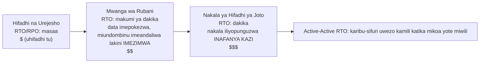

# Sura ya 18: Wakati Mambo Yanavunjika

Taa zilizimika saa 5:17 usiku.

Si katika ofisi ya Nimbus — Leo alikuwa nyumbani, kwenye kochi, kompyuta yake ndogo nusu-imefungwa. Taa zilizimika katika kituo cha data huko Oregon ambacho hajawahi kutembelea, katika jengo ambalo hajawahi kuona, katika chumba kilichojaa seva ambazo hajawahi kuzigusa. Hakujua bado. Kulikuwa na muda — muda mfupi tu — wa ukimya kamili kabla ya jenereta za hifadhi kuanza kufanya kazi mahali fulani mbali. Aina ya giza ambapo huwezi kujua kama macho yako yamefunguliwa au yamefungwa.

Kisha arifa ya Slack ilifika.

---

Baada ya mifumo ya ufuatiliaji ya sura ya 17 kuwekwa, timu ilikuwa imehisi kitu kama kujiamini. Arifa zilikuwa zikifanya kazi. Dashibodi zilikuwa za kijani. Kumbukumbu zilikuwa zikitiririka ndani ya CloudWatch. Walikuwa wametumia wiki tatu kuunganisha uonekanaji katika kila kona ya miundombinu ya Nimbus.

Kile ambacho hakuna mtu aliyekisema kwa sauti — kile ambacho ufuatiliaji haukukilinda — ni kwamba uonekanaji na ustahimilivu ni vitu tofauti. Unaweza kutazama kitu kikishindwa kwa undani kamili. Kukitazama hakukomeshi.

Somo hilo lilifika saa 5:23 usiku siku ya Alhamisi.

---

Leo alipokea arifa ya Slack.

"us-west-2 — kushindwa kwa nguzo ya kituo cha data — huduma iliyodhoofika."

Alifungua dashibodi ya AWS. Vipengele vya EC2 katika moja ya Availability Zones vilikuwa vikionyesha ukaguzi wa hali ukishindwa. Auto Scaling Group yake ilikuwa imegundua vipengele visivyo na afya na ilikuwa ikizindua vipengele vya kubadilisha — katika eneo lile lile.

Katika nguzo iliyokuwa ikishindwa.

Vipengele vipya havikuweza kuanza pia. Vilikuwa katika eneo lile lile la kushindwa kwa vifaa.

"Kisambazaji cha mzigo kinaelekeza trafiki kwa AZ zote mbili," Leo alisema bila mtu yeyote. "Nusu ya trafiki yetu inaenda kwa vipengele visivyofanya kazi."

Alifungua dashibodi ya EC2 na akaanza kubofya. Chini ya Load Balancers, Application Load Balancer ilionyesha makundi yote mawili ya lengo kama yenye afya — kwa sababu ukaguzi wa afya ulipita kwenye lango la 80, na hata vipengele vilivyokuwa vikishindwa vilikuwa vikijibu ukaguzi huo. Tu havikuweza kushughulikia maombi halisi.

Alijaribu kuondoa AZ iliyokuwa ikishindwa kutoka kwa kundi la lengo. Dashibodi ilikubali mabadiliko. Lakini Auto Scaling Group, iliyosanidiwa kudumisha usawa, mara moja ilianza kujaribu kubadilisha vipengele vilivyokomeshwa — katika eneo lile lile lililokuwa likishindwa.

Leo alitazama skrini. Ndio kwanza alikuwa amefanya hali kuwa mbaya zaidi.

Alipata usanidi wa ASG. Mpangilio wa "Balance capacity across Availability Zones" ulikuwa hai. Katika utendaji wa kawaida huu ulikuwa muundo mzuri. Sasa hivi ulikuwa ukimpinga moja kwa moja.

Alibadilisha ASG kutumia eneo lenye afya pekee. Akatekeleza mabadiliko.

Dashibodi ilionyesha mabadiliko kama "In Service."

Dakika tatu baadaye, vipengele vya kwanza vya kubadilisha vyenye afya vilianza.

Kisambazaji cha mzigo kilianza kuelekeza trafiki. Kiwango cha makosa kilishuka kutoka 52% hadi 4%. Asilimia 4 iliyobaki yalikuwa maombi yaliyokuwa yamefika kwenye vipengele vichache vya mwisho visivyo na afya ambavyo bado vilikuwa vikimaliza miunganisho.

Kufikia saa 5:45 usiku — dakika ishirini na mbili baada ya kushindwa kuanza — trafiki ilikuwa imetulia.

Dakika ishirini na mbili za huduma iliyodhoofika kabla hajaona na kuhamisha ASG kwa mkono ili itumie eneo lenye afya pekee.

"Hii ilitokea kwa sababu kila kitu kilikuwa katika AZ moja," Priya alisema asubuhi iliyofuata.

"Hapana," Leo alisema. "Nilikuwa na vipengele katika AZ mbili. Tatizo lilikuwa vipengele vya kubadilisha vilikuwa vikizuka katika AZ inayoshindwa."

"Na hifadhidata?"

Leo alisimama.

"Msingi wa RDS ulikuwa katika eneo lililokuwa likishindwa," alisema. "Multi-AZ kweli ilifanya kazi yake — ilihama kwenda kwa nakala ya hifadhi katika eneo lenye afya kwa takriban sekunde tisini. Lakini seva zetu za programu ziliendelea kuweka miunganisho yake iliyokufa wazi na zikajaribu tena anwani ya IP iliyohifadhiwa badala ya kutatua tena jina la DNS la mwisho. Hifadhidata ilikuwa na afya kufikia saa 5:25. Programu yetu haikuunganishwa tena kwa usafi hadi nilipoanzisha upya mabwawa ya miunganisho."

Dakika ishirini na mbili za huduma iliyodhoofika zilikuwa zimekuwa thelathini na nane.

Leo alipoweka Auto Scaling Group miezi minane iliyopita, alikuwa amechagua mpangilio wa "balance capacity across AZs" na akafikiri huo ulikuwa wa kutosha. "Itakuwa sawa," alikuwa amemwambia Maya wakati huo. "AWS inashughulikia mambo ya AZ kiotomatiki." Alikuwa sahihi kwamba AWS inayashughulikia — na alikuwa amekosea kuhusu maana ya "kiotomatiki."

"Ingekuwaje," Maya aliuliza asubuhi iliyofuata, "ikiwa tungekuwa tumesanidi kila kitu ipasavyo? Usanidi sahihi wa Multi-AZ unaonekanaje katika kushindwa halisi?"

Leo aliufikiria. Alikuwa ameufikiria tangu saa 5:45 usiku.

Katika usanidi sahihi wa kudhaniwa: ASG ingekuwa na ukaguzi wa afya wa vipengele uliokuwa ukiangalia afya ya ALB — si tu hali ya EC2. AZ iliposhindwa, ukaguzi wa afya kwenye vipengele hivyo ungeshindwa ndani ya sekunde 30. ASG ingegundua kushindwa na mara moja ingeanza kuzindua vipengele vya kubadilisha — na uzinduaji unaposhindwa kwa kuendelea katika AZ moja, kundi linahamisha uwezo kwenda maeneo yenye afya yaliyobaki badala ya kupambana na lile linaloshindwa.

Kisambazaji cha mzigo kingekuwa kimeondoa malengo ya AZ iliyokuwa ikishindwa kutoka kwa mzunguko ndani ya sekunde hizo hizo 30. Trafiki ingejilimbikiza katika AZ yenye afya.

Kwa hifadhidata: kushindwa hama kwa Multi-AZ kwenyewe kulifanya kazi — kilichokosekana kilikuwa nidhamu ya mteja. Mabwawa ya miunganisho yanayotatua tena jina la DNS la mwisho yanapounganishwa upya (badala ya kuhifadhi IP), TTL fupi za hifadhi ya DNS, na mantiki ya kujaribu tena. Vikiwepo hivyo, kushindwa hama kwa RDS ni kusita kwa sekunde 60–120, si mkia wa dakika 16.

Athari yote inayoonekana kwa mteja: sekunde 60-90 za latency iliyodhoofika wakati hifadhidata ikihama. Si dakika 38 za makosa yanayofululiza.

"Tulikuwa na miundombinu yote ya kuishi hili," Leo alisema. "Tuliisanidi tu kimakosa."

Sentensi hiyo ilikuwa ngumu zaidi kuisema kuliko tukio lenyewe la awali.

**Mfano wa Gridi ya Umeme**

Fikiria jinsi nyumba yako inavyopata umeme. Umeme hauji kutoka kwa waya moja unaotoka kwa jenereta moja. Unakuja kutoka kwa gridi — mtandao wa jenereta, vituo vya umeme, na mistari ya usambazaji inayohifadhiana. Ikiwa kituo kimoja cha umeme kitachomeka moto, vingine vinaelekeza umeme karibu nacho. Hujui. Taa zinabaki kuwaka.

Availability Zones za AWS zinafanya kazi kwa njia ile ile. Badala ya kituo kimoja kikubwa cha data ambacho kila kitu kinategemea, AWS inasambaza rasilimali zako katika vituo vingi vilivyotengwa kimwili. Ikiwa kituo kimoja kitapoteza nguvu au kuwa na kushindwa kwa vifaa, vingine vinaendelea kufanya kazi. Trafiki inabadilishwa kiotomatiki. Programu yako inabaki hai — kwa sababu hakukuwa na waya mmoja wa kukata.

Huu ni **muundo wa Multi-AZ**: kusambaza rasilimali zako katika vituo vilivyotengwa kimwili ili kushindwa kumoja kamwe kusiangushe kila kitu.

Multi-Region ni kiwango kinachofuata: fikiria kuwa na jenereta za hifadhi katika mji tofauti kabisa. Ikiwa gridi yote ya umeme ya eneo lako itashuka, mji wa mbali utachukua. Ngumu zaidi kusanidi, lakini imara zaidi kwa kushindwa kwa maafa.

Unaweza kuwa unajiuliza: ikiwa Multi-AZ inamaanisha tu kusambaza rasilimali katika vituo viwili vya data, kwa nini AWS haifanyi hivyo kuwa chaguo-msingi kwa kila kitu? Jibu ni gharama. Multi-AZ takriban inaongeza miundombinu mara mbili — na kwa mazingira ya maendeleo au zana ya ndani ya trafiki ndogo, gharama hiyo ya ziada haina haki. Kwa mzigo wa uzalishaji, hata hivyo, swali linageuka: je, unaweza kumudu kutofanya kazi ikiwa huna?

**Msamiati wa Kushindwa**

Kabla ya kubuni kwa ajili ya ustahimilivu, unahitaji maneno kwa ajili ya kile unachoundwa dhidi yake.

"Tunapimaje hata kama tuna ustahimilivu wa kutosha?" Priya aliuliza.

"Namba mbili," Leo alisema. "Tunaweza kushuka kwa muda gani, na tunaweza kupoteza data ngapi."

**Upatikanaji (Availability)**: Asilimia ya wakati mfumo unafanya kazi. "Nne tisa" (99.99%) inamaanisha chini ya dakika 52 za kutofanya kazi kwa mwaka. "Tano tisa" (99.999%) inamaanisha karibu dakika 5 kwa mwaka.

**RTO (Recovery Time Objective)**: Mfumo unaweza kushuka kwa muda gani kabla kuwa tatizo la biashara? Ikiwa RTO yako ni masaa 4, una masaa 4 ya kurejesha huduma kabla SLA hazijakiukwa.

**RPO (Recovery Point Objective)**: Unaweza kumudu kupoteza data ngapi? Ikiwa RPO yako ni saa 1, unaweza kustahimili kupoteza data ya hadi saa moja katika kushindwa kwa maafa. Kila kitu kilichoandikwa katika saa moja ya mwisho kabla ya kushindwa kimepotea.

**Uvumilivu wa hitilafu (Fault tolerance)**: Uwezo wa kuendelea kufanya kazi (kwa kiwango fulani) wakati kipengele kinashindwa.

**Uokoaji wa maafa (Disaster recovery - DR)**: Mchakato wa kurejesha kutoka kwa kushindwa kwa maafa — moto wa kituo cha data, kukatika kwa mkoa mzima, kufuta kwa bahati mbaya kwa wingi.

Dhana hizi tano zinaongoza kila uamuzi wa muundo katika sura hii.

**RTO na RPO ni Maamuzi ya Biashara, Si ya Kiufundi**

Namba zinajalisha kidogo kuliko ni nani anaziweka. Mhandisi anaweza kukisia RTO. Mdau wa biashara anajua gharama halisi ya kutofanya kazi kwa dakika 30.

Fikiria kampuni mbili zenye mrundiko sawa wa teknolojia:

Kampuni ya fintech inayochakata biashara za udalali: RTO ya dakika 4, RPO ya sifuri. Mfumo wa biashara uliokwama kwa dakika nne wakati wa masaa ya soko unaweza kukosa maelfu ya miamala. Kila muamala uliokosa una thamani ya dola ya moja kwa moja. Kupoteza data sifuri si suala la kifalsafa — kupoteza biashara moja iliyothibitishwa kunamaanisha matatizo ya kufuata kanuni na kesi za wateja. Gharama ya usanifu kufikia hili: Multi-AZ ya active-active yenye upokezaji wa wakati mmoja, bajeti ya miundombinu ya kila mwaka ya tarakimu sita.

Jukwaa la kuagiza chakula la mgahawa: RTO ya dakika 30, RPO ya dakika 5. Kutofanya kazi kwa dakika 30 wakati wa pilikapilika za chakula cha jioni kunaumiza kweli na kunagharimu pesa halisi. Lakini kupoteza dakika 5 za mwisho za maagizo kabla ya kushindwa kunamaanisha wachache wa wateja wanahitaji kuagiza tena — kero, si maafa. Gharama ya usanifu kufikia hili: Multi-AZ ya warm standby, sehemu tu ya bajeti ya fintech.

"Subiri — lakini *kwa nini* jukwaa la mgahawa lingekubali kupoteza data ya dakika 5?" Maya aliuliza Leo alipoeleza hili. "Je, huko bado si kupoteza maagizo ya wateja?"

"Swali ni kama kuzuia upotezaji huo wa data kunagharimu zaidi ya thamani yake," Leo alisema. "Kupunguza RPO kutoka dakika 5 hadi 0 kungehitaji upokezaji wa wakati mmoja katika mikoa. Hiyo ni gharama kubwa na uwekezaji wa uhandisi. Kwa programu ya mgahawa katika kiwango chetu, RPO ya dakika 5 ni biashara sahihi ya mbadala."

Somo: RTO na RPO si kiwango cha chini cha kiufundi. Ni biashara za mbadala za kibiashara zinazoonyeshwa kama namba. Kuziweka kunahitaji timu ya uhandisi (inayojua kinachowezekana) na wadau wa biashara (wanaojua kinachokubalika).

**Multi-AZ: Kuishi kwa Kushindwa kwa Availability Zone**

Availability Zone (AZ) ni kituo cha data kilichotengwa kimwili ndani ya Mkoa. AZ zimeundwa kuwa huru: vyanzo tofauti vya nguvu, baridi tofauti, miundombinu tofauti ya mtandao. Lakini ziko karibu vya kutosha kwamba latency ya mtandao kati yao ni millisekunde 1-2.

**Usambazaji wa Multi-AZ** unasambaza rasilimali zako katika AZ mbili au zaidi ndani ya Mkoa. Ikiwa AZ moja itashindwa:

- Kisambazaji cha mzigo kinaacha kuelekeza trafiki kwa vipengele visivyo na afya katika AZ iliyoshindwa
- Auto Scaling Group inabadilisha vipengele — lakini katika AZ *yenye afya*
- RDS inahama kwenda kwa nakala ya hifadhi katika AZ yenye afya

Kosa la Leo: Auto Scaling Group yake haikusanidiwa ili izuie vipengele vya kubadilisha kuwa katika AZ zenye afya. Ilisanidiwa kudumisha usawa kati ya AZ. Eneo liliposhindwa, ASG ilijaribu kusawazisha idadi ya vipengele kwa kuzindua vipengele vya kubadilisha hapo — katika eneo linaloshindwa.

Marekebisho: sanidi ASG ili izindue tu katika AZ zenye afya, na kiwango cha chini cha AZ mbili zinazofanya kazi wakati wote.

Somo la kina zaidi: kujaribu hali zako za kushindwa kabla hazijatokea katika uzalishaji.

Ukichagua Multi-AZ, unapata kushindwa hama kiotomatiki na RPO karibu-sifuri — lakini unalipia miundombinu isiyohudumia trafiki yoyote wakati wa utendaji wa kawaida. Kipengele kile cha RDS cha hifadhi daima kinaendesha, daima kinapokeza, na kamwe hakijibu hoja hadi msingi utakaposhindwa. Hiyo ndiyo biashara ya mbadala: uaminifu unagharimu pesa hata wakati hakuna kilichovunjika.

**Uhandisi wa Machafuko: Jinsi Utekelezaji wa Kwanza Ulivyokuwa**

Utekelezaji wa kwanza wa uhandisi wa machafuko huko Nimbus haukuwa safi kama nyaraka zilivyoufanya usikike.

Leo alitekeleza hatua ya 2 ya kitabu cha maelekezo: kulazimisha kushindwa hama kwa RDS Multi-AZ. Alitumia AWS CLI:

```
aws rds reboot-db-instance \
    --db-instance-identifier nimbus-prod \
    --force-failover
```

Amri ilirudi mara moja. Leo alianzisha kipima muda.

T+0s: Kushindwa hama kumeanzishwa. Dashibodi ya RDS inaonyesha hali ya msingi kama "rebooting."

T+18s: Kumbukumbu za programu zinaanza kuonyesha makosa ya muunganisho wa hifadhidata. Bwawa la muunganisho linajaribu msingi wa zamani, ambao si msingi tena.

T+34s: Dashibodi ya RDS inaonyesha hali kama "backing-up." Msingi mpya unapandishwa cheo. CNAME ya DNS (mwisho wa hifadhidata) inasasishwa.

T+52s: Kumbukumbu za programu zinaanza kuonyesha miunganisho yenye mafanikio tena. Bwawa la muunganisho limemaliza majaribio kwenye msingi wa zamani na limeunganishwa upya na CNAME, ambayo sasa inaelekeza kwa msingi mpya.

T+4:17: Miunganisho yote imeanzishwa upya. Kiwango cha makosa kimerudi sifuri.

Jumla: dakika 4 na sekunde 17.

"Hizo ni sekunde 257 za hifadhidata kutopatikana," Tom alisema. "Vidonge vya washirika wetu wa mgahawa vinaonyesha kiashiria kinachozunguka kwa dakika 4."

"SLA yetu inasema dakika 5," Leo alisema.

"Kwa hivyo tulipita," Priya alisema. "Kwa shida."

"Maoni mawili," Tom alisema. "Kwanza: tulipita kwa sababu ahadi yetu ya RTO ilikuwa ya ukarimu, si kwa sababu usanifu wetu una kasi ya pekee. Pili: tabia ya bwawa la muunganisho ya kujaribu tena ndiyo iliyotununulia sekunde 34 za ziada. Kama programu ingekata tamaa baada ya sekunde 10, tungekuwa tumeshindwa."

Leo aliboresha kitabu cha maelekezo ili kuandika nyakati zilizoonekana. Lengo la robo inayofuata: kupunguza muda wa kugundua kushindwa hama kutoka sekunde 52 hadi chini ya 30 kwa kurekebisha vigezo vya bwawa la muunganisho na mantiki ya ukaguzi wa afya wa programu.

"Uhandisi wa machafuko si jaribio la mara moja," Priya alisema. "Ni mzunguko wa maoni. Unajaribu, unapata namba halisi, unaboresha, unajaribu tena."

Mara ya tatu walipotekeleza jaribio la kushindwa hama, miezi sita baadaye, muda wa uokoaji ulikuwa dakika 1 na sekunde 44. Si kwa sababu RDS ilipata kasi zaidi — kwa sababu walikuwa wameirekebisha programu.

**Kuiga Kushindwa: Uhandisi wa Machafuko**

"Tunajuaje kwamba usanidi wetu wa Multi-AZ unafanya kazi kweli?" Maya aliuliza.

"Tunavunja mambo kwa makusudi," Leo alisema.

"Subiri — lakini *kwa nini* tungefanya kwa njia hiyo?" Maya alisema. "Kwa nini tusiamini tu kwamba nyaraka za AWS zinasema inafanya kazi?"

"Kwa sababu nyaraka zinaeleza jinsi huduma inavyofanya kazi. Haieleza jinsi *usanidi wako* unavyofanya kazi. Ni vitu tofauti."

Priya alielekea mbele. "Je, tumefikiria nini kinatokea wakati ukaguzi wa afya wa kisambazaji cha mzigo na ukaguzi wa afya wa ASG hawakubaliani? Kisambazaji cha mzigo kinaweza kuondoa kipengele kutoka kwa mzunguko, lakini ASG inadhani kipengele kina afya na haikibadilishi. Tungekuwa na uwezo usioonekana kwa kisambazaji cha mzigo."

"Hilo ndilo aina ya kitu ambacho uhandisi wa machafuko ungekipata," Leo alisema.

Hii inasikika kama upuuzi. Kwa kweli ni jambo la uwajibikaji zaidi ambalo timu inaweza kufanya.

**Kujaribu Ahadi za RTO**

Hii ndio ukweli usio wa starehe kuhusu RTO: timu nyingi zinaweka RTO, kisha hazijaribu kamwe kama zinaweza kuifikia kweli.

RTO ya dakika 30 si dhamana. Ni lengo. Njia pekee ya kujua kama utaifikia ni kuiga kushindwa na kupima muda wa uokoaji.

Baada ya tukio la saa 5:23 usiku, timu ya Nimbus iliahidi kujaribu kila aina ya kushindwa kila robo. Si kwa mkono tu — na vigezo vilivyoandikwa vya kukubalika. Uokoaji kutoka kwa kushindwa kwa AZ ilibidi ukamilike ndani ya dakika 10. Uokoaji kutoka kwa kushindwa hama kwa RDS ilibidi ukamilike ndani ya dakika 5. Urejesho wa hifadhidata kutoka kwa hifadhi (jaribio la DR la backup-and-restore) ilibidi ukamilike ndani ya masaa 2.

Namba hizi zilitoka kwa mazungumzo na washirika wa mgahawa, ambao walisema kutofanya kazi kwa pilikapilika za chakula cha jioni chini ya dakika 10 kulikuwa "kunauma lakini kunakubalika." Zaidi ya dakika 30 ilikuwa mazungumzo ya mkataba.

"Mazungumzo ya SLA yanapaswa kutokea kabla ya kuweka RTO," Maya alisema. "Si baada."

Hakukosea. Walikuwa wamefanya kinyume nyume. Walikuwa wameweka RTO ndani na kisha wakatambua walihitaji kuilinganisha na kile biashara ilihitaji kweli.

Kuweka RTO na RPO katika mpangilio sahihi: mahitaji ya biashara kwanza, usanifu wa kuyafikia pili, jaribio la kuhakikisha tatu. Timu nyingi zinaanza na usanifu na kufanya kazi kinyume nyume. Namba zinateseka kwa ajili yake.

**Uhandisi wa machafuko (Chaos engineering)** ni mazoea ya kuingiza makusudi kushindwa katika mfumo wako ili kuthibitisha kwamba unashughulikia ipasavyo. Unakomesha kwa makusudi kipengele cha EC2. Unalazimisha kwa mkono kushindwa hama kwa kipengele cha RDS. Unazuia subnet kutoka kwa kisambazaji cha mzigo.

Ikiwa mfumo utarejea kiotomatiki ndani ya RTO yako, muundo wako unafanya kazi.

Ikiwa hautarejea, umejifunza hilo katika mazingira ya kudhibitiwa — si wakati wa tukio la uzalishaji saa 8 usiku.

Kwa Nimbus: Leo aliandika kitabu cha maelekezo (utaratibu ulioandikwa) wa kujaribu kila hali ya kushindwa. Mara moja kwa robo mwaka, wangevunja kwa makusudi kipengele kimoja na kupima muda wa uokoaji. Ikiwa uokoaji ulichukua muda mrefu zaidi ya RTO, wangeboresha muundo.

**Multi-Region: Kuishi kwa Kushindwa kwa Mkoa**

Kushindwa kwingi kwa AWS kunaathiri Availability Zones, si Mikoa mzima. Kushindwa kwa mkoa ni nadra — lakini kunafanyika.

Katika kushindwa kwa mkoa (au kwa programu za kimataifa zinazohitaji latency ya chini sana kila mahali), **Multi-Region** ndiyo jibu: sambaza programu yako katika Mikoa miwili au zaidi ya AWS.

Multi-Region inaanzisha ugumu wa kimsingi:

**Upokezaji wa data**: Hifadhidata zako zinahitaji kuwa sawa katika mikoa. Data yoyote iliyoandikwa katika us-east-1 lazima hatimaye ifike eu-west-1. "Hatimaye" ni tatizo — wakati wa kuchelewa, mikoa ina mtazamo tofauti kidogo wa ulimwengu.

**Active-passive dhidi ya active-active**:

- **Active-passive**: Mkoa mmoja unahudumia trafiki yote. Mwingine ni nakala ya hifadhi ya joto. Wakati wa kushindwa, DNS inabadilisha trafiki kwa nakala ya hifadhi. Rahisi zaidi, lakini nakala ya hifadhi iko bila kufanya kazi na ni ghali.
- **Active-active**: Mikoa yote miwili inahudumia trafiki wakati mmoja. Ngumu zaidi kujenga (inahitaji utatuzi wa migogoro kwa maandishi ya wakati mmoja), lakini latency ya chini kimataifa na hakuna rasilimali zisizofanya kazi.

Active-active inasikika kuvutia hadi unapofikiria kwa makini kuhusu maandishi. Ikiwa mteja anaweka agizo katika us-east-1 na wakati huo huo mgahawa unasasisha menyu yake katika eu-west-1, na kuna mgawanyiko wa mtandao kati ya mikoa, andishi gani linashinda? Hii ni nadharia ya CAP katika vitendo: katika mfumo uliosambazwa, wakati wa mgawanyiko wa mtandao, lazima uchague kati ya uthabiti (mikoa yote inakubaliana na data sawa) na upatikanaji (mikoa yote inaendelea kukubali maombi hata wakati hawakubaliani). Active-active haiondoi chaguo hili. Inakuhitaji ulifanye kwa uwazi, katika modeli yako ya data.

Kwa Nimbus: active-passive. Hawakutaka kufikiria kuhusu migogoro ya maandishi ya wakati mmoja katika data yao ya menyu na maagizo. Mkoa mmoja wa msingi wenye mamlaka ulikuwa rahisi na salama zaidi katika hatua hii.

**Muda wa kushindwa hama**: Mabadiliko ya DNS huchukua muda kusambazwa (kulingana na TTL). Wakati wa dirisha la usambazaji, baadhi ya watumiaji bado wanafikia mkoa ulioshindwa. Kubuni kwa RTO ya chini sana kunahitaji kupasha joto mapema nakala ya hifadhi na kupunguza TTL kabla ya mabadiliko yaliyopangwa.

**Kushindwa Hama kwa DNS ya Route 53: Tabaka la Mtandao la DR**

Kabla ya kufikia wigo kamili wa mikakati ya DR, inafaa kuelewa jinsi DNS inavyolingana na kushindwa hama — kwa sababu mara nyingi ndicho kitu kinachobadilisha trafiki kati ya mikoa kwa kweli.

**Amazon Route 53** inasaidia upitishaji unaotegemea ukaguzi wa afya. Unasanidi:

1. Ukaguzi wa afya unaofuatilia mwisho wako wa msingi (kwa kawaida mwisho wa HTTP unaorudisha 200 ukiwa na afya)
2. Rekodi ya DNS ya msingi inayoelekeza kwa mkoa wako wa msingi
3. Rekodi ya DNS ya sekondari (ya kushindwa hama) inayoelekeza kwa mkoa wako wa DR

Wakati Route 53 inagundua kwamba ukaguzi wa afya wa msingi unashindwa, inabadilisha kiotomatiki majibu ya DNS kwa rekodi ya sekondari. Watumiaji wanaotatua kikoa chako sasa wanapata IP ya mkoa wa DR.

"Na vipi ikiwa mtu atajaribu kuvunja wakati wa dirisha la kushindwa hama?" Priya aliuliza. "Cheti cha SSL cha kikoa chetu — je, kinafanya kazi katika mikoa yote miwili, au HTTPS inavunjika?"

"Cheti kinahitaji kuandaliwa katika mikoa yote miwili," Leo alithibitisha. "Ukitumia ACM (AWS Certificate Manager), hiyo inamaanisha kuomba cheti katika kila mkoa kwa kujitegemea."

Mfumo wa kushindwa hama wa Route 53:

- Ukaguzi wa afya unaendeshwa kutoka maeneo mengi ya AWS duniani kote kila sekunde 30
- Baada ya kushindwa mfululizo mara 3 (sekunde 90), Route 53 inaweka alama ya mwisho kama usio na afya
- Majibu ya DNS yanabadilika mara moja kwa rekodi ya kushindwa hama
- Lakini: TTL ya DNS bado inatumika. Ikiwa TTL yako ni sekunde 300, wateja waliokwisha hifadhi IP ya msingi wanaendelea kufikia mkoa ulioshindwa kwa hadi dakika 5

Hii ndiyo sababu kupunguza TTL ni sehemu ya maandalizi ya kabla ya maafa. Huwezi kubadilisha TTL wakati wa tukio (mabadiliko hayatasambaa kwa wakati). Mabadiliko ya TTL lazima yafanywe siku au wiki kabla yanahitajika, ili hifadhi za vitatuzi tayari zinatumia TTL fupi kushindwa kunapotokea.

"Kwa hivyo kupunguza TTL ya DNS si hatua ya uokoaji," Leo alisema. "Ni hatua ya kuweka mahali mapema."

"Je, tumeifanya?" Maya aliuliza.

Walikuwa hawajafanya.

Baada ya mazungumzo hayo, Leo alipunguza TTL ya eatnimbus.com kutoka sekunde 300 hadi sekunde 60. Mabadiliko hayakugharimu kitu na yaliboresha muda wao wa kushindwa hama wa hali mbaya zaidi kutoka uwezekano wa dakika 8 hadi chini kidogo ya 3.

**Mikakati ya Uokoaji wa Maafa: Wigo**

Kuna mikakati minne ya kawaida ya DR, iliyopangwa kutoka ya bei ndogo zaidi (na polepole zaidi kurejesha) hadi ya bei ghali zaidi (na ya haraka zaidi kurejesha):



**Hifadhi na Urejesho (Backup and Restore)** (RPO/RTO ya masaa):

- Hifadhi kila kitu kwa S3 katika mkoa tofauti
- Wakati wa maafa: andaa miundombinu kutoka mwanzo, rejesha kutoka kwa hifadhi
- Gharama: ndogo sana (unalipa tu kwa uhifadhi)
- Muda wa uokoaji: masaa

**Mwanga wa Rubani (Pilot Light)** (RPO/RTO ya dakika hadi saa 1):

- Pokeza data kwa kuendelea na weka miundombinu ya msingi *imeandaliwa lakini imezimwa* katika mkoa wa DR — violezo, AMIs, rasilimali zilizosimamishwa au zenye ukubwa-sifuri. Hakuna kinachohudumia trafiki; ni upokezaji wa data tu uliowashwa (huo ndio mwanga wa rubani)
- Data kuu inapokezwa (nakala ya kusomwa ya RDS katika mkoa wa DR)
- Wakati wa maafa: anzisha/pangeza upya hesabu ya mkoa wa DR, pandisha cheo nakala ya kusomwa kuwa ya msingi, badilisha DNS
- (Linganisha na Nakala ya Hifadhi ya Joto hapa chini: hapo, nakala iliyopunguzwa ya programu kwa kweli *inafanya kazi*)
- Gharama: wastani (unalipa kwa upokezaji wa data na rasilimali zilizoandaliwa-lakini-zimezimwa, si kwa hesabu inayofanya kazi)
- Muda wa uokoaji: makumi ya dakika

**Nakala ya Hifadhi ya Joto (Warm Standby)** (RPO/RTO ya sekunde hadi dakika):

- Endesha toleo lililopunguzwa la programu kamili katika mkoa wa DR
- Inafanya kazi kikamilifu lakini kwa uwezo uliopunguzwa
- Wakati wa maafa: pangeza, badilisha DNS
- Gharama: ya juu zaidi (daima unaendesha mrundiko kamili kwa kiwango kilichopunguzwa)
- Muda wa uokoaji: dakika

**Active-Active / Maeneo Mengi (Multi-Site)** (RPO/RTO karibu-sifuri):

- Uwezo kamili katika mikoa miwili au zaidi, ukihudumia trafiki wakati mmoja
- Hakuna uokoaji unaohitajika — ikiwa mkoa mmoja utashindwa, trafiki inabadilishwa kwa mwingine kiotomatiki
- Gharama: ya juu zaidi (usambazaji wawili kamili kwa kiwango kamili)
- Muda wa uokoaji: sekunde (usambazaji wa DNS tu)

Huduma moja inafanya otomatiki kati ya wigo huu: **AWS Elastic Disaster Recovery (DRS)** inapokeza kwa kuendelea seva zako — za ndani au EC2 — block kwa block kwenda eneo la maandalizi la gharama ndogo, na inaweza kuzindua vipengele kamili vya uokoaji ndani ya dakika maafa yanapopiga. Kwa kweli, ni *mwanga wa rubani unaosimamiwa*: nyakati za uokoaji karibu na warm standby kwa bei karibu na backup-and-restore. Ishara ya mtihani: "punguza muda wa kutofanya kazi na upotezaji wa data kwa mzigo wa kazi unaotegemea seva kwa huduma ya DR inayosimamiwa" → Elastic Disaster Recovery.

Kwa Nimbus katika hatua hii: nakala ya hifadhi ya joto. Hawangeweza kumudu active-active, lakini hifadhi na urejesho ulikuwa polepole sana kwa mahitaji yao ya biashara.

**Amazon RDS: Multi-AZ dhidi ya Nakala za Kusomwa dhidi ya Multi-Region**

Hizi tatu ni tofauti na mara nyingi zinachanganywa:

| Kipengele     | Multi-AZ                     | Nakala ya Kusomwa | Nakala ya Kusomwa ya Multi-Region |
|---------------|------------------------------|------------------|---------------------------|
| Madhumuni     | Upatikanaji wa juu (kushindwa hama) | Kupanua kusoma | Kupanua kusoma + DR       |
| Usawazishaji wa data | Wakati mmoja          | Kwa ucheleweshaji | Kwa ucheleweshaji         |
| Kushindwa hama | Kiotomatiki                | Kupandisha cheo kwa mkono | Kupandisha cheo kwa mkono |
| Inaweza kusomwa? | Hapana (nakala ya hifadhi ni tulivu) | Ndiyo        | Ndiyo                     |
| Toka mkoa hadi mkoa? | Hapana (mkoa sawa)   | Ndiyo (hiari)  | Ndiyo                     |
| Tumia kwa    | HA, RPO~0                    | Mzigo wa kusoma  | Uokoaji wa maafa          |

Maarifa muhimu: Nakala ya hifadhi ya Multi-AZ ni **ya wakati mmoja** — kila andishi kwenye msingi linathibitishwa kwenye nakala ya hifadhi kabla andishi halijathibitishwa. Hii inamaanisha ikiwa msingi utashindwa, hakuna data iliyopotea. RPO = 0.

Nakala za kusomwa ni **za ucheleweshaji** — kuna ucheleweshaji wa upokezaji. Ikiwa msingi utashindwa na ukapandisha cheo nakala ya kusomwa, unaweza kupoteza sekunde au dakika za maandishi ya hivi karibuni. RPO > 0.

**Aurora Global Database: Multi-Region kwa Uzalishaji**

Kwa timu zinazohitaji ustahimilivu wa kweli wa multi-region, **Aurora Global Database** inabadilisha hesabu. Nakala ya kusomwa ya kawaida ya RDS katika mkoa mwingine inatumia upokezaji wa ucheleweshaji wenye ucheleweshaji kwa kawaida unaopimwa kwa sekunde — ikimaanisha kushindwa kwa mkoa kutapoteza sekunde hizo za maandishi. Aurora Global Database inatumia miundombinu maalumu ya upokezaji inayofikia chini ya sekunde 1 ya ucheleweshaji wa upokezaji kati ya mkoa wa msingi na mikoa ya sekondari.

Timu iliyojadili hilo katika ukaguzi wa baada ya tukio, Leo aliibua ulinganisho:

- Nakala ya kusomwa ya RDS ya toka mkoa hadi mkoa ya kawaida: ucheleweshaji wa upokezaji wa sekunde 1-10 wa kawaida, hadi dakika chini ya mzigo mzito. Kupandisha cheo kuwa hifadhidata ya pekee kunachukua dakika na kunahusisha hatua za mkono.
- Sekondari ya Aurora Global Database: ucheleweshaji wa upokezaji kwa kawaida chini ya sekunde 1. Kupandisha cheo kutoka sekondari hadi msingi kunachukua chini ya dakika 1.

"Hiyo inamaanisha ikiwa us-west-2 itashuka kabisa," Leo alieleza, "tuna chini ya sekunde 1 ya upotezaji wa data unaowezekana na tunaweza kuhudumia trafiki kutoka us-east-1 ndani ya dakika moja."

"Inagharimu kiasi gani kwa mwezi?" Tom aliuliza mara moja.

Zaidi ya Multi-AZ ya kawaida. Aurora Global Database inaongeza ada ya I/O kwa kila andishi kwa upokezaji katika mikoa. Kwa kiwango cha sasa cha Nimbus, ingeongeza $40-60/mwezi juu ya gharama zilizopo za Aurora.

"Hiyo ndiyo biashara ya mbadala," Leo alisema. "Lipia kasi. Au kubali kupandisha cheo kwa polepole na RPO ya juu kidogo ya nakala ya kusomwa ya kawaida ya toka mkoa hadi mkoa."

Kwa sasa, Nimbus ilibaki na warm standby. Aurora Global Database ilienda kwenye orodha ya matakwa ya usanifu kwa duru ijayo ya ufadhili.

"Dirisha lile lile la kushindwa hama, tabaka linalofuata chini," Priya alisema. "Tumeshughulikia vyeti. Sasa stakabadhi — zinazunguka kwenye kipengele kimoja. Je, nakala ya hifadhi iko sawa?"

Leo aliibua nyaraka. Lilikuwa swali zuri. RDS Multi-AZ inapokeza data, si usanidi wa siri — kuzunguka kwa Secrets Manager ilibidi kujaribiwa kama sehemu ya kitabu cha maelekezo cha kushindwa hama.

## Nguvu na Mipaka

**Multi-AZ**:

- Muhimu kwa mzigo wa uzalishaji — AZ moja ni hatua moja ya kushindwa
- Inasaidiwa vizuri na huduma za AWS (RDS, ElastiCache, EKS, ALB zote zinasaidia Multi-AZ)
- Gharama ndogo ya ziada ikilinganishwa na ulinzi inaotoa
- Kushindwa kwa AZ ndiyo kategoria ya kawaida zaidi ya kushindwa kwa AWS — Multi-AZ inashughulikia hali zenye uwezekano mkubwa zaidi

**Multi-Region**:

- Ngumu kutekeleza ipasavyo, hasa kwa hifadhidata
- Mahitaji ya makazi ya data/uhuru wa data yanaweza kuihitaji kweli (data ya watumiaji wa EU lazima ibaki EU)
- Faida za latency kwa watumiaji wa kimataifa zinatoka kwa upitishaji, si kwa multi-region yenyewe (tumia CloudFront kwa maudhui ya kudumu)
- Mashirika mengi hayahitaji active-active; wengi hawafanyi uwekezaji wa kutosha katika nakala ya hifadhi ya joto
- Gharama ya warm standby ya Multi-Region si ndogo, lakini gharama ya kushindwa kwa mkoa bila hiyo inaweza kuwa kubwa zaidi

**Wakati wa kuruka Multi-AZ** (kesi nadra):

- Mazingira ya maendeleo na ya staging ambapo kutofanya kazi kunakubalika
- Zana za ndani zisizo muhimu kweli kweli zisizo na mahitaji ya SLA
- Mzigo wa batch unaoweza kuendeshwa tena tu wakati wa kushindwa

Shinikizo la kuruka Multi-AZ karibu daima linahusu gharama. Kabla ya kukubali hoja hiyo, hesabu gharama ya aina za kushindwa zenye uwezekano: kuondoka kwa wateja, faini za SLA, muda wa uhandisi wa kurejesha. Katika mazingira mengi ya uzalishaji, Multi-AZ inajilipia mara ya kwanza inakuokoa kutoka kwa simu ya saa 9 usiku.

## Muhtasari

Kazi ya ufuatiliaji ya sura ya 17 ilifanya kushindwa kuonekane. Sura hii inahusu kufanya miundombinu iyastahimili. Vyote viwili vinajalisha; hakuna kimoja kinachotosha bila kingine.

Tukio la Nimbus usiku ule wa Alhamisi liligharimu dakika 38 za huduma iliyodhoofika. Makosa matatu ya usanidi yaliungana: ASG haikutenga AZ iliyokuwa ikishindwa kutoka kwa uzinduzi wa kubadilisha, nakala ya hifadhi ya RDS ilijikuta ikiwa katika eneo lililokuwa likishindwa, na hakuna mtu aliyekuwa amejaribu mchakato wa kushindwa hama kabla ya kuutegemea katika uzalishaji.

Yote matatu yangeweza kurekebishwa kwa mchana mmoja. Tukio lilifanya marekebisho kuwa ya dharura kwa njia ambayo "nyaraka za mazoea bora" hazikuwahi kufanya kweli.

Hiyo ndiyo hoja ya uaminifu ya uhandisi wa machafuko: si kwamba ni mazoea ya uhandisi makini (ingawa ni hivyo), bali kwamba inaibua makosa ya usanidi ambayo yanaonekana ya kinadharia hadi usiku ambapo kituo cha data cha Oregon kina kushindwa kwa vifaa.

- **RTO** (Recovery Time Objective): muda unaoweza kushuka. **RPO** (Recovery Point Objective): kiasi cha data unachoweza kupoteza.
- **Multi-AZ** inasambaza rasilimali katika Availability Zones ndani ya Mkoa. Inalinda dhidi ya kushindwa kwa AZ.
- **Multi-Region** inapeleka katika Mikoa mingi ya AWS. Inalinda dhidi ya kushindwa kwa mkoa na kuhudumia watumiaji wa kimataifa kwa latency ya chini.
- Mikakati ya DR (bei ndogo hadi ghali zaidi): Hifadhi na Urejesho → Mwanga wa Rubani → Nakala ya Hifadhi ya Joto → Active-Active.
- Nakala ya hifadhi ya RDS Multi-AZ: wakati mmoja, kushindwa hama kiotomatiki, RPO = 0 ndani ya mkoa. Nakala za kusomwa: ucheleweshaji, kupandisha cheo kwa mkono, RPO > 0.
- Jaribu kushindwa kwako kwa makusudi (uhandisi wa machafuko) kabla haijatokea katika uzalishaji.

## Vidokezo vya Mtihani

*SAA-C03 Kikoa: Kubuni Miundo Thabiti (Kikoa cha 2, Kazi ya 2.2)*

- **RTO dhidi ya RPO**: Tarajia mtihani kukupa mahitaji ("shirika haliwezi kuvumilia zaidi ya saa 1 ya kutofanya kazi na hakuna upotezaji wa data") na kukuuliza uchague mkakati sahihi wa DR. Ramani: hakuna upotezaji wa data = upokezaji wa wakati mmoja = Multi-AZ au active-active. Saa 1 ya kutofanya kazi = hifadhi-na-urejesho ni polepole sana; nakala ya hifadhi ya joto inaweza kufanya kazi.
- **RDS Multi-AZ dhidi ya Nakala za Kusomwa**: Mtihani utauliza HA (Multi-AZ) dhidi ya kupanua kusoma (nakala za kusomwa). Nakala ya hifadhi ya Multi-AZ haiwezi kusomwa. Nakala za kusomwa zinaweza kupandishwa cheo kuwa msingi (kwa mkono) kwa DR.
- **Mwanga wa Rubani dhidi ya Nakala ya Hifadhi ya Joto**: Mwanga wa Rubani una miundombinu ndogo inayofanya kazi (tu upokezaji wa data). Nakala ya Hifadhi ya Joto ina programu iliyopunguzwa lakini inayofanya kazi. Tofauti ni jinsi haraka unavyoweza kupanua.
- **Aurora Global Database**: Kipengele mahususi cha Aurora kwa active-passive ya multi-region. Mkoa wa msingi unahudumia maandishi; mikoa ya sekondari inahudumia masomo yenye ucheleweshaji wa upokezaji wa chini ya sekunde 1. Wakati wa kushindwa hama, sekondari inaweza kupandishwa cheo kwa chini ya dakika 1. Ishara ya mtihani: "Aurora, multi-region, RTO < dakika 1."
- **AWS Backup**: Huduma ya hifadhi kuu kwa EBS, RDS, DynamoDB, EFS, Storage Gateway. Mtihani unatumia hii kwa hali za hifadhi-na-urejesho.
- **Elastic Disaster Recovery (DRS)**: "DR inayosimamiwa yenye muda mdogo wa kutofanya kazi/upotezaji wa data kwa seva (za ndani au EC2)," "mwanga wa rubani bila kuujenga mwenyewe" → DRS (upokezaji unaoendelea wa kiwango cha block + uzinduzi wa uokoaji kwa mahitaji).
- **Kushindwa hama kwa Route 53**: Tabaka la DNS la DR. Ukaguzi wa afya ya msingi unashindwa → Route 53 inaelekeza kwa sekondari. Muda wa usambazaji unamaanisha hii si wa papo hapo.

## Mazoezi

**Zoezi la 1 — Kumbuka**

Eleza tofauti kati ya RTO na RPO. Kwa nini shirika linaweza kuwa na RTO ya chini (haliwezi kushuka kwa muda mrefu) lakini RPO ya juu (linaweza kustahimili kupoteza data ya hivi karibuni)?

*(Kidokezo: Fikiria biashara ambapo ni muhimu zaidi kuhudumia wateja haraka kuliko kuhifadhi kila muamala.)*

**Zoezi la 2 — Hali ya SAA-C03**

*Hali*: Kampuni ya huduma za afya inaendesha mfumo wa rekodi za wagonjwa kwenye hifadhidata inayooana na PostgreSQL katika `us-east-1`. Mahitaji ya kisheria yanaagiza kwamba mfumo lazima uishi **kukatika kamili kwa mkoa** ukiwa na RPO inayopimwa kwa **sekunde** (upotezaji wa data karibu-sifuri) na RTO ya chini ya dakika 30. Ndani ya mkoa wa msingi, hakuna upotezaji wa data unaokubalika.

Muundo gani wa usanifu BORA unakidhi mahitaji haya?

A) RDS Multi-AZ katika `us-east-1` na nakala za uhifadhi za kiotomatiki za kila siku kwa S3 katika `us-west-2`  
B) RDS Multi-AZ katika `us-east-1` na nakala ya kusomwa katika `us-west-2` iliyosanidiwa kwa kupandisha cheo kwa mkono  
C) RDS katika `us-east-1` na nakala ya hifadhi ya joto katika `us-west-2` na upokezaji wa active-active  
D) Aurora Global Database na msingi katika `us-east-1` na sekondari katika `us-west-2`

**Kidokezo cha 1**: Tenganisha wigo mbili. *Ndani* ya mkoa, RPO = 0 inamaanisha upokezaji wa wakati mmoja (Multi-AZ — na tabaka la uhifadhi la Aurora ni la wakati mmoja katika AZ 3). *Katika* mikoa, chaguo zote halisi zinapokeza kwa ucheleweshaji — swali ni ucheleweshaji ni mdogo kiasi gani.

**Kidokezo cha 2**: RTO = dakika 30 inamaanisha una muda wa kupandisha cheo kwa udhibiti. Huhitaji kushindwa hama kiotomatiki kwa millisekunde kabisa.

**Kidokezo cha 3**: Linganisha RPO ya toka mkoa hadi mkoa ya kila chaguo: nakala za uhifadhi za kila siku (masaa), nakala ya kusomwa ya RDS ya toka mkoa hadi mkoa (sekunde hadi dakika, isiyo na kikomo chini ya mzigo), Aurora Global Database (kwa kawaida chini ya sekunde 1).

**Jibu**: D

**Maelezo**: Aurora Global Database inapokeza kwa mkoa wa sekondari katika tabaka la uhifadhi ukiwa na ucheleweshaji wa kawaida chini ya sekunde moja — ikitosheleza "RPO kwa sekunde" kwa maafa ya mkoa — na sekondari inaweza kupandishwa cheo katika chini ya dakika moja, ndani vizuri ya RTO ya dakika 30. Ndani ya mkoa wa msingi, uhifadhi wa Aurora unapokezwa kwa wakati mmoja katika AZ tatu, ukikidhi mahitaji ya upotezaji-sifuri ndani ya mkoa. **Kumbuka utofauti mdogo**: Aurora Global ni *ya ucheleweshaji* katika mikoa — RPO yake ya toka mkoa hadi mkoa ni *karibu* sifuri, kamwe si sifuri haswa. Ikiwa swali la mtihani linadai RPO = 0 kabisa, hiyo inaramania upokezaji wa *wakati mmoja* (Multi-AZ, mkoa mmoja) — hakuna chaguo la kawaida la toka mkoa hadi mkoa linalotoa hilo.

**Kwa nini si A?** Nakala za uhifadhi za S3 za kila siku zinatoa RPO ya toka mkoa hadi mkoa ya hadi masaa 24. Hizo ni masaa ya data ya mgonjwa iliyopotea katika kushindwa kwa mkoa.

**Kwa nini si B?** Nakala za kusomwa za RDS za toka mkoa hadi mkoa zinatumia upokezaji wa kawaida wa ucheleweshaji ambao ucheleweshaji wake unaweza kukua bila kikomo chini ya mzigo — "sekunde" zinaweza kuwa dakika. Inawezekana, lakini si BORA wakati kuna chaguo lenye upokezaji wa kiwango cha uhifadhi wa chini ya sekunde.

**Kwa nini si C?** "Upokezaji wa active-active" kwa PostgreSQL katika mikoa si kipengele cha kawaida cha RDS. Chaguo hili linaeleza uwezo unaohitaji uhandisi mkubwa wa desturi.

*SAA-C03 Kikoa: Kubuni Miundo Thabiti — Kazi ya 2.2*

**Zoezi la 3 — Changamoto ya Usanifu** *(Hiari)*

Nimbus imechaguliwa kutoa huduma za kuagiza kwa tamasha kubwa la chakula huko Seattle. Kwa masaa 72, wanatarajia msongamano wa mara 50 wa trafiki yao ya kawaida, bila kuvumilia kabisa kutofanya kazi (mkataba wa mpangaji wa tamasha unabainisha faini za kifedha kwa kutofanya kazi wowote wakati wa tukio).

Buni mkakati wa DR kwa dirisha la tamasha hasa. Je, ungebadilisha hadi active-active kwa masaa hayo 72? Ungejaribu awali jinsi gani kushindwa hama? RTO yako ingekuwa nini, na ungeihakikisha vipi kabla ya tukio?

*(Hakuna jibu moja sahihi. Lengo ni mazoezi ya kubuni DR kwa mahitaji mahususi ya SLA.)*

## Tukio Baada ya Mikopo

Leo alijenga kitabu cha maelekezo cha uhandisi wa machafuko.

Kila robo mwaka, kwenye dirisha la matengenezo ya kupangwa, timu ingeweza:

1. Komesha kipengele kimoja cha EC2 katika AZ moja na kutazama ASG ikiibadilisha ipasavyo katika eneo lenye afya
2. Kulazimisha kwa mkono kushindwa hama kwa RDS Multi-AZ na kuthibitisha programu imeungana tena ndani ya sekunde 60
3. Kuiga kushindwa kamili kwa AZ kwa kurekebisha availability zones za ASG
4. Kurejesha hifadhi ya wiki moja iliyopita kwa kipengele kipya cha RDS na kuthibitisha data inaonekana sahihi

Utekelezaji wa kwanza — kushindwa hama kwa dakika 4 sekunde 17 kulikopita SLA yao ya dakika 5 kwa shida — tayari kulikuwa kumewaonyesha jinsi pambizo lilivyokuwa nyembamba.

"Kuna faini ya kifedha katika mikataba ikiwa tutaikosa," Tom alisema.

"Basi tunahitaji kuifanya haraka zaidi," Leo alisema. Na akaanza kusoma nyaraka za hifadhidata inayosimamiwa iliyoahidi kushindwa hama kwa sekunde, si dakika.

Katika sura inayofuata: mashine ya tikiti inayoruhusu kila sehemu ya Nimbus kufanya kazi kwa kasi yake mwenyewe.
