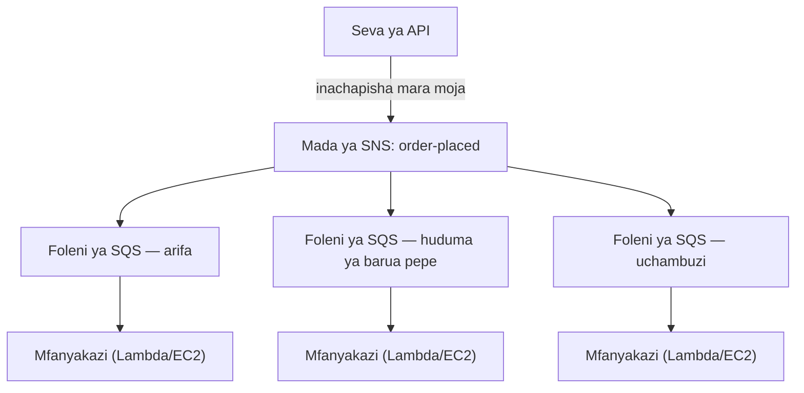

# Sura ya 19: Mashine ya Tikiti

Mashine ya tikiti ilikuwa mapinduzi ya kimya. Chukua nambari, subiri kuitwa. Mstari ulikuwa foleni. Watu waliweza kukaa. Dawati la huduma lilifanya kazi kwa kasi yake mwenyewe. Hakuna aliyezuia mwingine.

Kabla ya mashine ya tikiti, ilibidi usimame mstarini. Nafasi yako mstarini ilihitaji uwepo wako wa kimwili. Hukuweza kufanya kitu kingine chochote ukisubiri. Na kama mtu aliyekuwa mbele ya mstari alikuwa polepole, kila mtu nyuma yake alisimama.

Mashine ya tikiti ilitenganisha kuwasili na huduma. Uliwasili, ulichukua nambari, na mfumo ulikumbuka nafasi yako. Uliweza kwenda kukaa. Dawati la huduma lilifanya kazi kupitia nambari kwa kasi yoyote lingeweza kuimudu. Kama dawati lilikuwa limefungwa kwa muda, waliowasili wapya bado walipata nambari. Walisubiri. Kazi haikutoweka — iliingia foleni.

Uvumbuzi huu mdogo ni mojawapo ya mifano ya zamani zaidi ya kutengana katika mifumo ya binadamu. Mwishoni mwa sura hii, Nimbus itakuwa imejenga mashine yake ya tikiti — katika programu — na sababu ya kuihitaji inaanza na dakika kumi na sita za kutofanya kazi jioni ya Ijumaa.

---

Timu ilikuwa imeishi kushindwa kwa AZ. Leo alikuwa amerekebisha mchakato wa uhandisi wa machafuko, na kitabu cha maelekezo kilikuwa imara. Trafiki ilikuwa imerejea na ilikuwa ikikua tena — haraka zaidi kuliko hapo awali, kwa kweli. Nyaraka za Aurora ambazo Leo alikuwa akisoma usiku wa manane bado zilikuwa sura chache mbele ya hapo Nimbus ilipokuwa kwa kweli.

Lakini trafiki ikikua na migahawa zaidi ikijiunga, aina tofauti ya kizuizi ilikuwa ikionekana. Si katika miundombinu. Katika msimbo wa programu wenyewe. Mnyororo wa maombi uliofanya kazi vizuri kwa maagizo 200 kwa saa ulikuwa ukianza kuonyesha mkazo kwa 800.

Na kisha ikaja jioni ya tarehe 14.

---

Ilikuwa imeanza na dashibodi ya uchambuzi. Saa 12:47 jioni siku ya Ijumaa, usambazaji kwa huduma ya uchambuzi ulileta hitilafu ya muda kuisha. Huduma ilianza kujibu katika sekunde 8 badala ya millisekunde 200 za kawaida.

Mtiririko wa agizo ulikuwa wa wakati mmoja. Kila agizo lilisubiri huduma ya uchambuzi kabla ya kuthibitisha kwa mteja. Sekunde nane zikawa 12 mzigo ulipoongezeka. Bwawa la muunganisho la API lilianza kujaa na maombi yaliyokuwa yakisubiri hatua ya uchambuzi kukamilika.

Saa 12:53 jioni, bwawa la muunganisho lilifikia kikomo chake. Maombi mapya yalianza kushindwa mara moja — si kwa sababu agizo halikuweza kushughulikiwa, bali kwa sababu hakukuwa na muunganisho uliopo wa kuanza kuushughulikia.

"Huduma ya uchambuzi iliangusha mtiririko wa agizo," Leo alisema, akiangalia kumbukumbu asubuhi iliyofuata. "Hazina uhusiano wowote. Huduma ya uchambuzi inakokotoa dashibodi tu."

"Lakini ziko katika mnyororo mmoja wa maombi," Priya alisema.

"Dakika kumi na sita za kutofanya kazi," Maya alisema. "Na wateja watatu walitozwa mara mbili."

Kutozwa mara mbili kulikuwa kubaya zaidi kuliko kutofanya kazi. Katika machafuko ya kujaa kwa bwawa la muunganisho, mfumo wa kujaribu tena ulikuwa umewashwa kwa baadhi ya maombi ambayo kwa kweli yalikuwa yamefaulu — hatua ya malipo ilikamilika, kisha ombi likaisha muda kabla ya kurudi, na jaribio la tena likajaribu malipo tena. Kadi ile ile, kiasi kile kile, malipo mawili.

"Mfumo wa kujaribu tena ulipaswa kusaidia," Leo alisema.

"Ulisaidia kwa mwelekeo usio sahihi," Priya alisema. "Na je, tumefikiria nini kinatokea tunapojaribu kuwarudishia pesa wateja hao? Mchakato wa kurudisha pesa unatumia mtiririko ule ule wa agizo uliyoshindwa."

Dakika kumi na sita za kutofanya kazi na kutozwa mara mbili tatu. Hiyo ndiyo ilikuwa gharama ya biashara ya mnyororo wa maombi wa wakati mmoja.

---

Nimbus ilikuwa na tatizo ambalo halikuonekana kama tatizo mpaka maagizo yalipopata umaarufu.

Kila wakati agizo lilipowekwa, seva ya API ililazimika:

1. Hifadhi agizo kwenye hifadhidata
2. Tuma arifa kwa kompyuta kibao ya mgahawa
3. Tuma barua pepe ya uthibitisho kwa mteja
4. Sasisha dashibodi ya uchambuzi wa mgahawa
5. Rekodi tukio kwa ajili ya malipo

Katika dawati la deli lenye shughuli nyingi, mtu kwenye dafitari hasubiri mkato kumaliza kukata kabla ya kwenda kwa mteja mwingine. Wanachukua agizo, kumkabidhi jikoni, na kuanza kuhudumia mtu mwingine. Jikoni inafanya kazi kupitia maagizo kwa kasi yake mwenyewe. Mteja anapata huduma ya haraka zaidi. Jikoni haizidiliwi na mashambulizi ya ghafla. Ikiwa jikoni ina wakati wa polepole, maagizo yanajikusanya nyuma ya dawati badala ya kusababisha makosa kwenye dafitari.

Huo ndio ulikuwa mfano. Nimbus haikuwa na dawati na jikoni. Ilikuwa na mtu mmoja akifanya kila kitu kwa mfuatano kabla mteja hajaweza kuondoka.

Na tarehe 14, mtu aliyekuwa akikata nyama alikuwa na tatizo. Kwa hivyo dawati lilisimama. Kwa hivyo kila mteja baada ya hapo alisubiri. Jikoni, dafitari, wateja — wote walisimama kwa sababu hatua moja katika mnyororo ilikuwa imepunguza kasi.

Marekebisho hayakuwa kufanya ukataji wa nyama kuwa haraka zaidi. Marekebisho yalikuwa kutenganisha hatua. Chukua agizo kwenye dafitari, kabidhi tikiti, acha jikoni ifanye kazi.

"Tumeshikamana kwa nguvu," Priya alisema. "Ikiwa hatua yoyote ya chini inashindwa, agizo lote linashindwa. Je, tumefikiria nini kinatokea ikiwa huduma ya uchambuzi itadukuliwa na kuanza kutumia ujumbe usio sahihi? Agizo lote linashindwa — kwa sababu tunaisubiri."

"Vipi kama tungeweza kuhifadhi agizo na kuthibitisha mara moja kwa mteja," Leo alisema, "na kisha kushughulikia iliyobaki nyuma?"

"Hiyo ni foleni," Priya alisema.

Maarifa muhimu: mteja hahitaji kujua kwamba dashibodi ya uchambuzi ilisasishwa kabla ya kupata uthibitisho wao. Wanahitaji kujua agizo lao limepokelewa. Hizo ni vitu tofauti. Mnyororo wa wakati mmoja uliyachanganya.

**Modeli ya Kutengana**

Hii ni **kutengana (decoupling)**: kutenganisha kipengele kinachokubali kazi kutoka kwa vipengele vinavyoishughulikia.

Hatua zote katika mtiririko wa agizo wa Nimbus zililazimika kutokea kwa wakati mmoja kabla API haijaweza kujibu kwa mteja. Ikiwa huduma ya barua pepe ilikuwa polepole (wakati mwingine ilikuwa), mteja alisubiri. Ikiwa dashibodi ya uchambuzi ilikuwa chini (wakati mwingine ilikuwa), agizo lilishindwa.

Mfululizo wa tarehe 14 ulionyesha hasa kwa nini hili lilijalisha. Huduma ya uchambuzi haikuwa na uhusiano wowote na kama agizo la mteja lilikubaliwa. Lakini kwa sababu ilikaa katika mnyororo ule ule wa wakati mmoja, kushindwa kwake kukawa kushindwa kwa kila mtu.

Katika mifumo ya programu, foleni mara nyingi ni kisambazaji cha ujumbe — huduma inayokubali ujumbe kutoka kwa wazalishaji na kuwasilisha kwa walaji.

Unaweza kuwa unajiuliza: ikiwa mtiririko wa agizo sasa ni wa nje, mteja anajuaje agizo lao lilipokelewa kwa kweli? Jibu liko katika muundo wa usanifu: API inahifadhi agizo kwenye hifadhidata (wakati mmoja — huu ndio uthibitisho wenye mamlaka), kisha inachapisha matukio kwenye foleni. Uthibitisho wa mteja unategemea kuandika kwa hifadhidata kufanikiwa, si huduma za chini kukamilika. Ikiwa huduma ya barua pepe ni polepole, mteja tayari ana uthibitisho wao. Barua pepe ni ufuatiliaji wa nyongeza tu.

**Amazon SQS: Foleni**

**Amazon SQS (Simple Queue Service)** ni huduma ya foleni ya ujumbe inayosimamiwa na AWS. Inahifadhi ujumbe kwa kudumu mpaka utashughulikiwa na mlaji.

Mtiririko wa kimsingi:

1. **Mzalishaji** (seva ya API) anaweka ujumbe kwenye foleni: `{ "orderId": "ORD-5532", "restaurantId": "47", "items": [...] }`
2. API inajibu mara moja kwa mteja: "Agizo limethibitishwa!"
3. **Walaji** (huduma za wafanyakazi tofauti) wanasoma ujumbe kutoka kwa foleni na kuusindika: tuma arifa ya mgahawa, tuma barua pepe ya uthibitisho, sasisha uchambuzi

Uzoefu wa mteja: uthibitisho wa papo hapo. Usindikaji wa chini: unafanyika kwa nje, kwa kasi ya wafanyakazi.

**Dhana Muhimu za SQS**

**Muda wa kutoweka kwa ujumbe (Message visibility timeout)**: Wakati mlaji anasoma ujumbe kutoka kwa SQS, ujumbe unakuwa *hauonekani* kwa walaji wengine kwa kipindi fulani (chaguo-msingi: sekunde 30). Hii inampa mlaji muda wa kuusindika. Ikiwa mlaji atamaliza kwa mafanikio, atafuta ujumbe. Ikiwa mlaji ataacha ghafla, muda wa kutoweka utaisha na ujumbe utaonekana tena kwa mlaji mwingine kujaribu tena.

Hii inahakikisha utoaji wa angalau mara moja: kila ujumbe utashughulikiwa angalau mara moja, hata kama mlaji atashindwa katikati ya usindikaji.

Unaweza kuwa unajiuliza: ikiwa ujumbe unakuwa hauonekani wakati unaposhughulikiwa lakini haufutwi mlaji anapoacha ghafla, je, hauwezi kushughulikiwa mara mbili? Ndiyo — na hii inaitwa utoaji wa angalau mara moja. Inamaanisha kila mlaji lazima abuniwe kushughulikia kupokea ujumbe ule ule zaidi ya mara moja bila kusababisha tatizo. Barua pepe ya uthibitisho wa agizo ya nakala ni kero. Malipo ya nakala ni tikiti ya msaada. Buni walaji wako ipasavyo.

Muda wa kutoweka lazima uwe mrefu zaidi ya muda wako mrefu zaidi unaotarajiwa wa usindikaji. Ikiwa usindikaji kwa kawaida unachukua sekunde 20 lakini mara kwa mara unachukua sekunde 90, na muda wako wa kutoweka ni sekunde 30, usindikaji huo wa mara kwa mara wa sekunde 90 utaonekana kama kushindwa kwa SQS. Ujumbe unaonekana tena. Mlaji wa pili anauchukua. Sasa wafanyakazi wawili wanashughulikia ujumbe ule ule. Ikiwa usindikaji wako si wa kuzalisha matokeo sawa, una tatizo.

Kosa la kawaida: kuweka muda wa kutoweka sawa na muda wa wastani wa usindikaji. Njia sahihi: uweke kwa muda wa usindikaji wa asilimia ya 99, ukiwa na pambizo la usalama. Ikiwa muda wa usindikaji wa P99 ni sekunde 45, weka muda wa kutoweka kwa sekunde 90.

**Foleni za ujumbe uliokufa (Dead-letter queues - DLQ)**: Ikiwa ujumbe utashindwa usindikaji mara nyingi sana (inaweza kusanidiwa — mfano, majaribio 5), SQS unauhamishia foleni ya ujumbe uliokufa. Unakagua DLQ kuelewa kwa nini ujumbe unashindwa bila kuupoteza.

DLQ ndipo unapojifunza kile kinachoshindwa kwa kweli katika uzalishaji. Bila yake, ujumbe uliyoshindwa unatoweka tu na huna njia ya kuchunguza.

Wiki tatu baada ya uhamiaji wa SQS, Leo aliona ujumbe 23 ulikuwa umejikusanya kwenye DLQ ya huduma ya arifa. Hakuwa akiangalia DLQ (alikuwa ameiweka ipasavyo na kisha akadhani ingebaki tupu).

Alitoa ujumbe mmoja na akaangalia mzigo wake:

```json
{
  "orderId": "ORD-9821",
  "restaurantId": "12",
  "customerMessage": "Extra spicy please 🌶️🔥",
  "timestamp": "2024-01-18T19:43:11Z"
}
```

Emoji. Huduma ya arifa ya mgahawa ilikuwa ikisimba mizigo ya ujumbe kama Latin-1 kabla ya kutuma kwa API ya kompyuta kibao ya zamani ya mgahawa. Herufi za emoji — baiti nne kila moja katika UTF-8 — zilikuwa zikiharibika, zikisababisha API ya kompyuta kibao kukataa ombi. Ujumbe ungejaribu tena, ungeshindwa tena, ungejaribu tena, ungeshindwa tena. Baada ya majaribio 5, SQS uliuhamishia DLQ.

"Ujumbe wote 23 una emoji katika sehemu ya maelezo ya mteja," Leo alisema.

"Kwa hivyo kila mteja aliyeongeza emoji kwenye maelezo ya agizo lake alikuwa na maelezo yake yakishindwa kimya kufika kwa mgahawa," Maya alisema.

"Ndiyo."

"Kwa muda gani?"

Leo aliangalia muhuri wa wakati wa ujumbe wa zamani zaidi. "Wiki tatu."

Priya alikuwa kimya. "Na je, ikiwa mtu angegundua kwamba kuongeza emoji kwenye maelezo ya agizo kulisababisha kushindwa kimya? Ungeweza kuweka maagizo yenye emoji na kuhakikisha mgahawa kamwe haukuona maelekezo. Kisha ulalamike kuhusu agizo lisilo sahihi."

Hakuna mtu aliyekuwa ametumia hili vibaya. Lakini lilikuwa swali sahihi la kuuliza.

Leo alirekebisha hitilafu ya usimbaji. Kisha akaandika hati ya kucheza tena ujumbe wote 23 uliyokwama kutoka DLQ. Migahawa ilipokea maelekezo yao ya emoji ya kiungo (yenye umri wa wiki tatu). Wateja kamwe hawakujua.

Somo: DLQ lazima ifuatiliwe kwa bidii, si kuwekwa na kusahaulika. DLQ inayokua ni ishara ya kimya kwamba kitu kinashindwa mara kwa mara.

**Aina za foleni**:

**Foleni za kawaida (Standard queues)**: Uendeshaji wa juu zaidi (ujumbe usio na kikomo kwa sekunde). Mpangilio wa utoaji ni wa juhudi bora (hauhakikishwi). Utoaji wa angalau mara moja (nadra sana, ujumbe unaweza kutolewa mara mbili).

**Foleni za FIFO**: Mpangilio mkali wa kwanza-ndani, kwanza-nje. **Usindikaji** wa mara moja haswa — uondoaji wa nakala kulingana na `MessageDeduplicationId` ndani ya dirisha la dakika 5. Mpangilio unahakikishwa *kwa kila* `MessageGroupId`: ujumbe katika kundi lile lile unafika kwa mpangilio; makundi tofauti yanaweza kushughulikiwa sambamba, ndiyo jinsi FIFO inavyopanuka. Uendeshaji wa msingi ni ujumbe 3,000 kwa sekunde na kutungisha kwa pamoja (300 bila); kuwezesha **modi ya uendeshaji wa juu** kunainua hii hadi makumi ya maelfu kwa sekunde kwa kugawanya katika makundi ya ujumbe. Tumia FIFO wakati mpangilio ni muhimu (miamala ya kifedha, mabadiliko ya hali ya mfululizo).

Ikiwa unahitaji uendeshaji wa juu zaidi na unaweza kustahimili ujumbe wa nakala wa mara kwa mara, tumia SQS Standard — lakini lazima ubuni kila mlaji kushughulikia nakala bila kusababisha matatizo. Ikiwa unahitaji mpangilio mkali na usindikaji wa mara moja haswa, tumia SQS FIFO — na buni `MessageGroupId` zako vizuri, kwa sababu usambamba (na hivyo uendeshaji) unatoka kwa kuwa na makundi mengi.

Kwa Nimbus, foleni nyingi zilitumia foleni za kawaida. Foleni ya malipo ilitumia FIFO kuhakikisha malipo yanashughulikiwa kwa mpangilio.

**Upanuzi Kiotomatiki kwa Kina cha Foleni: Kupanua Wafanyakazi Kuendana na Mlundikano**

Mojawapo ya matumizi yenye nguvu zaidi ya SQS ni kutumia kina cha foleni kama kichocheo cha Auto Scaling. Badala ya kupanua kulingana na CPU au kumbukumbu, unapanua kulingana na kazi ngapi inasubiri.

Kwa huduma ya arifa ya Nimbus: kina cha foleni ya SQS (idadi ya ujumbe unaosubiri kushughulikiwa) kiliunganishwa na sera ya Application Auto Scaling kwa huduma ya ECS inayoendesha wafanyakazi wa arifa.

Sera: foleni inapokuwa na zaidi ya ujumbe 50 kwa kila kazi ya mfanyakazi, ongeza kazi. Foleni inapokuwa na chini ya ujumbe 10 kwa kila kazi ya mfanyakazi, ondoa kazi.

Athari ya vitendo: maagizo 1,200 yalipopiga katika kilele cha jioni ya Ijumaa, kina cha foleni ya arifa kiliruka na kundi la wafanyakazi lilipanuka kutoka kazi 2 hadi kazi 8 ndani ya dakika 3. Kufikia usiku wa manane, foleni ilikuwa tupu na kundi lilirudi kwa 2.

"Inagharimu kiasi gani kwa mwezi?" Tom aliuliza, akiangalia grafu ya Auto Scaling.

"Hakuna kitu cha ziada kwa Auto Scaling yenyewe," Leo alisema. "Lakini kazi 6 za ziada za ECS kwa masaa 3 jioni za Ijumaa — hilo ni la maana."

Tom alikokotoa. "Karibu $14/mwezi kwa vilele hivyo. Na kabla, tulikuwa tukiendesha kazi 8 kwa kuendelea kwa gharama kamili?"

"Ndiyo."

"Kwa hivyo tunalipia mlipuko tunapouhitaji na sivyo vinginevyo."

Huu ni mchakato wa upanuzi wa kina cha foleni: foleni inakuwa buffer inayonyonya milipuko ya trafiki, na kundi la wafanyakazi linapanuka kumwaga buffer. Watumiaji hawapati upolepole — walipata uthibitisho wao mara moja agizo lilipokubaliwa. Wafanyakazi tu wanachukua muda kidogo zaidi kufikia. Na kwa sababu hauendeshi uwezo wa kilele saa 24/7, gharama ni za chini kwa kiasi kikubwa.

**Amazon SNS: Mtangazaji**

**Amazon SNS (Simple Notification Service)** ni huduma ya ujumbe ya kuchapisha/kujiandikisha (pub/sub). Badala ya mzalishaji mmoja, mlaji mmoja (foleni), SNS inasaidia ujumbe mmoja unaotolewa kwa *wajiandikishaji wengi* wakati mmoja.

Modeli:

1. **Mchapishaji** anatuma ujumbe kwa **mada** ya SNS
2. Wajiandikishaji wote wa mada hiyo wanapokea ujumbe wakati mmoja (fan-out)

Wajiandikishaji wanaweza kuwa:

- Foleni za SQS (sukuma ujumbe kwa foleni kwa usindikaji wa nje)
- Vitendo vya Lambda (amsha kitendo moja kwa moja)
- Sehemu za mwisho za HTTP/HTTPS (utoaji wa webhook)
- Anwani za barua pepe
- SMS (nambari za simu)

Kwa Nimbus, tukio la agizo lililowekwa linachapishwa kwa mada ya SNS inayoitwa `order-events`:

- Huduma ya arifa ya mgahawa inajiandikisha (inapokea kwenye foleni yake ya SQS)
- Huduma ya barua pepe inajiandikisha (inapokea kwenye foleni yake ya SQS)
- Huduma ya uchambuzi inajiandikisha (inapokea kwenye foleni yake ya SQS)
- Huduma ya malipo inajiandikisha (inapokea kwenye foleni yake ya FIFO ya SQS)

Tukio moja la agizo. Wajiandikishaji wanne. Wote wanaarifu wakati mmoja. Kila mmoja anashughulikia kwa kasi yake mwenyewe.

"Kwa hivyo SNS ni tangazo," Maya alisema, "na SQS ni sanduku la barua ambapo kila timu inashughulikia tangazo kwa kasi yake mwenyewe. Basi kwa nini kutumia vyote viwili? Kwa nini tusiwe na kila mtu anayejiandikisha kwa mada ya SNS moja kwa moja?"

"Kwa sababu utoaji wa moja kwa moja wa SNS ni wa kutuma-na-kusahau," Leo alisema. "Ikiwa huduma ya uchambuzi iko chini wakati SNS inawasha, ujumbe huo umekwisha. Kwa foleni ya SQS katikati, ujumbe unangoja hadi huduma irudi."

"Hasa," Priya alisema. "Fan-out ya SNS/SQS ni mchakato wa kawaida."

**Mchakato wa Fan-Out wa SNS/SQS**

Mchanganyiko huu — mada ya SNS inayolisha foleni nyingi za SQS — ni moja ya mifumo muhimu zaidi ya usanifu katika AWS:



Kila foleni ni ya kujitegemea. Huduma ya uchambuzi inaweza kuwa polepole — foleni yake inajaa, lakini huduma za arifa na barua pepe zinaendelea bila kuathiriwa. Ikiwa huduma ya uchambuzi itashuka, ujumbe wake unangoja kwenye foleni mpaka irudi. Hakuna kilichopotea.

Hii ndiyo mali muhimu: **kushindwa kwa kujitegemea**. Matatizo katika mlaji mmoja hayasambazwi kwa wengine.

**Uchujaji wa Ujumbe: Si Kila Ujumbe kwa Kila Mjiandikishaji**

Mifumo inapokua, hutaki kila mjiandikishaji kushughulikia kila ujumbe. Huduma ya uchambuzi haipaswi kupokea ujumbe kuhusu usindikaji uliokataliwa wa malipo ikiwa inajali tu maagizo yaliyokamilika.

**Uchujaji wa ujumbe wa SNS** unaruhusu wajiandikishaji kubainisha sera za kuchuja — tolewa tu ujumbe unaofanana na sifa fulani.

Huduma ya arifa ya mgahawa inajiandikisha na kichujio: ujumbe tu ambapo `status = "confirmed"`.

Huduma ya tahadhari ya hitilafu inajiandikisha na kichujio: ujumbe tu ambapo `status = "failed"`.

Kila mjiandikishaji anapata tu kile anachohitaji.

Bila kuchuja, kila mjiandikishaji anapokea kila ujumbe na lazima apuuze kile kisicho na maana. Hii inapoteza usindikaji, inapoteza pesa (SQS inatoza kwa kila ujumbe), na inaleta kelele. Mfumo wa agizo wa kiasi kikubwa bila kuchuja ungejaza foleni ya tahadhari ya hitilafu na maagizo yaliyofaulu — ukifanya kushindwa halisi kuwa kugumu kupata.

Sera za kuchuja zinaonekana hivi:

```json
{
  "status": ["confirmed"],
  "region": ["us-west-2", "us-east-1"]
}
```

Mjiandikishaji huyu anapokea tu ujumbe ambapo status ni "confirmed" NA region ni ama "us-west-2" au "us-east-1". Ujumbe usiofanana na sera hautolewi kwa foleni ya mjiandikishaji huyu hata kidogo — kamwe haufiki SQS.

"Kwa hivyo kuchuja kunatokea katika tabaka la SNS," Priya alisema, "kabla ujumbe haujaandikwa kwa SQS?"

"Sahihi. Foleni ya SQS ya huduma ya arifa ya mgahawa kamwe haioni ujumbe usiopaswa kufanyia kazi."

"Na je, ikiwa mtu atajaribu kuvunja kwa kuchapisha ujumbe uliotengenezwa maalum kwa mada ya SNS unaofanana na vichujio vyote vya wajiandikishaji?" Priya aliuliza.

Mada ya SNS ilikuwa na sera ya rasilimali ya IAM: huduma ya API ya agizo tu (kwa jukumu lake la IAM) iliruhusiwa kuchapisha. Sera za ufikiaji za SNS na sera za foleni za SQS ziliunda tabaka la udhibiti wa ufikiaji — kuchuja kulikuwa kwa upitishaji tu, si usalama.

**Wakati wa Kutumia SQS dhidi ya SNS**

**SQS peke yake**: Mzalishaji mmoja, mlaji mmoja (au walaji wengi wanaoshindana kwenye foleni moja). Ujumbe unahitaji kushughulikiwa mara moja, kwa mpangilio (FIFO) au la (kawaida). Mchakato wa foleni ya mfanyakazi — foleni moja, wafanyakazi wengi wanaotumia kutoka kwake.

**SNS peke yake**: Arifa za kutuma-na-kusahau. Sukuma kwa barua pepe, SMS, au sehemu za mwisho za HTTP. Hakuna haja ya kuhifadhi ujumbe kwenye foleni — arifu tu na endelea.

**SNS + SQS (fan-out)**: Tukio moja, walaji wengi wa kujitegemea. Kila mlaji ana foleni yake mwenyewe, anashughulikia kwa kujitegemea, na anaweza kushindwa kwa kujitegemea.

## Mada za SNS FIFO

Kila kitu hapo juu kuhusu SNS kinatumia mada za kawaida — zina uendeshaji usio na kikomo kwa kweli, zinatoa kwa wajiandikishaji karibu wakati mmoja, na zinakamilisha kazi kwa wingi wa matumizi.

Lakini mada za SNS za kawaida hazihakikishi mpangilio. Ukichapisha ujumbe kumi kwa mfuatano, wajiandikishaji wanaweza kuupokea kwa mpangilio tofauti kidogo. Kwa arifa za agizo za Nimbus, hilo ni sawa — sasisho la uchambuzi linalofika sehemu ya sekunde kabla ya uthibitisho wa barua pepe halijalishi.

Kwa baadhi ya hali, linajalisha. Fikiria leja ya kifedha: ikiwa matukio mawili — mkopo na kisha deni — yanatolewa kwa mpangilio wa kinyume, hesabu za salio wakati wa usindikaji zitakuwa zisizo sahihi hata kama matukio yote mawili yatashughulikiwa ipasavyo hatimaye.

**Mada za SNS FIFO** zinatumia kanuni ile ile ya foleni za SQS FIFO kwa modeli ya fan-out. Ujumbe unatolewa kwa wajiandikishaji kwa mpangilio sahihi uliochapishwa, na kila ujumbe unatolewa mara moja haswa.

Biashara ya mbadala: mada za SNS FIFO zina uendeshaji wa msingi unaofanana na SQS FIFO (ujumbe 3,000 kwa sekunde kwa mada; 300 kwa sekunde kwa kundi la ujumbe — pamoja na modi ya uendeshaji wa juu inayopatikana tangu 2025 kwa zaidi sana), na zinafanya fan-out tu kwa **foleni za SQS** — FIFO au, tangu 2023, Standard. Kujiandikisha foleni ya Standard ni muhimu kwa walaji wasiojali mpangilio (mlisho wa uchambuzi, kwa mfano), lakini mpangilio na mara-moja-haswa vinaishi kutoka mwanzo hadi mwisho **tu** kuingia foleni za FIFO. Huwezi kutumia mada ya SNS FIFO kutoa kwa sehemu za mwisho za HTTP au anwani za barua pepe.

Kwa bomba la malipo la Nimbus — ambapo mfululizo wa sasisho za bei ulipaswa kutumika kwa akaunti za migahawa kwa mpangilio — mada ya SNS ya malipo ilihamishwa kutoka standard hadi FIFO. Foleni ya malipo ya SQS ilikuwa tayari FIFO. Fan-out sasa ilihakikisha kwamba tukio la ongezeko la bei kamwe lisifike kwa kichakataji cha malipo kabla ya tukio la kuanza kwa kipindi ilolitegemea.

> **Kidokezo cha Mtihani — SNS FIFO**
>
> Ikiwa hali inahitaji **utoaji wa fan-out wenye mpangilio** katika wajiandikishaji wengi, jibu ni **SNS FIFO**. SNS Standard haihakikishi mpangilio. SNS FIFO inafanya fan-out tu kwa foleni za SQS — kuhifadhi mpangilio na mara-moja-haswa kutoka mwanzo hadi mwisho, mjiandikishaji lazima awe foleni ya SQS **FIFO** (uandikishaji wa foleni za Standard unaruhusiwa lakini unapata mpangilio wa juhudi bora na utoaji wa angalau mara moja). Uendeshaji chaguo-msingi ni 3,000/sekunde kwa mada — ikiwa hali inaeleza kiasi kikubwa zaidi *na* mpangilio mkali, hiyo ni ishara ya kuangalia usanifu mbadala (Kinesis, kwa mfano, ambayo inashughulikiwa katika sura ya baadaye).

## Wakati Foleni ya Zamani Haitaki Kuachilia

Nimbus ilikuwa karibu kufunga ununuzi wake mkubwa zaidi bado: Barato, mshindani wa uwasilishaji wa chakula mwenye migahawa 200 na mwanzo wa miaka miwili wa shughuli. Timu ya uhandisi ilipanga simu ya kupanga ujumuishaji.

Simu ilidumu dakika ishirini kabla Leo kunyamaza.

"Mfumo wao wa usindikaji wa agizo," alisema. "Unaendeshwa kwa nini?"

"ActiveMQ," alisema mhandisi wa Barato upande wa pili. "Kisambazaji cha on-prem. Programu ni Java. Imekuwa ikiendeshwa tangu 2018. Kila kitu kinazungumza AMQP."

"AMQP," Leo alisema.

"Ndiyo."

Aliangalia mchoro wa usanifu kwenye skrini yake. Nimbus iliendesha SQS na SNS. SQS haizungumzi AMQP. SNS haizungumzi AMQP. Programu ya Barato haikuzungumza kitu kingine.

"Kuiandika upya kutachukua miezi sita," Leo alisema kwa timu baada ya simu. "Kwa uchache."

"Hatuwezi kuchelewesha ununuzi kwa miezi sita," Maya alisema.

"Na hatuwezi kuendesha kisambazaji cha ActiveMQ cha bare-metal katika AWS," Priya aliongeza. "Je, tumefikiria hilo linaonekanaje kutoka mtazamo wa usalama na uaminifu? Kisambazaji cha ujumbe kinachojisimamia, kikiwa katika uzalishaji, bila kuwekewa viraka kunakosimamiwa, bila kushindwa hama kiotomatiki, kikiunganishwa na miundombinu yetu?"

"Kuna chaguo linalosimamiwa," Leo alisema polepole. Alikuwa akisoma walipokuwa wakizungumza. "Amazon MQ."

**Amazon MQ: Kisambazaji Kinachosimamiwa**

**Amazon MQ** ni huduma ya kisambazaji cha ujumbe inayosimamiwa kwa Apache ActiveMQ na RabbitMQ. Inaendesha kisambazaji chako kilichopo — kisambazaji kile kile ambacho programu zako zimekuwa zikiunganishwa nacho kwa miaka — lakini kama huduma inayosimamiwa ya AWS. AWS inashughulikia miundombinu ya msingi: uandaaji, kuweka viraka, kushindwa hama, nakala za hifadhi.

Mali muhimu inayofanya Amazon MQ kuwa tofauti na SQS na SNS: inazungumza itifaki ambazo visambazaji vya zamani vya ujumbe vinazungumza. AMQP, STOMP, MQTT, OpenWire, NMS. Itifaki ambazo SQS na SNS tu hazielewi.

Kwa ujumuishaji wa Barato, mpango ulikuwa wa moja kwa moja. AWS ingeendesha kisambazaji cha Amazon MQ kilichosanidiwa kama ActiveMQ. Programu ya Java ya Barato ingeelekezwa kwa sehemu ya mwisho mpya ya kisambazaji badala ya ile ya on-premises. Mabadiliko upande wa programu: sasisha faili moja ya usanidi na mfuatano mpya wa muunganisho. Hayo tu. Programu haikuhitaji kujua ilikuwa ikizungumza na kisambazaji kinachosimamiwa cha wingu badala ya seva katika ofisi ya Barato.

"Subiri," Maya alisema. "Ikiwa tunaenda kuwajumuisha katika Nimbus hatimaye, je, hatupaswi tu kuwahamishia SQS tangu mwanzo?"

"Kwa sababu njia ya uhamiaji ipo," Leo alisema. "Na ni jambo la kuifanya ipasavyo — hatimaye. Lakini sasa hivi, tunahitaji Barato ikifanya kazi kwenye miundombinu ya AWS katika siku thelathini, si miezi sita. Amazon MQ inafanya programu kuendeshwa bila kubadilisha programu. Kisha tuna muda wa kupanga uhamiaji wa SQS kama mradi wa makusudi, si sharti la haraka la ununuzi."

"Inagharimu kiasi gani kwa mwezi?" Tom aliuliza.

Kisambazaji cha Amazon MQ — jozi moja ya active/standby kwa uaminifu — kilikuwa katika kiwango cha $200/mwezi kwa kisambazaji kinachofaa kiasi cha Barato. Ikilinganishwa na gharama ya miezi sita ya muda wa kuandika upya, haikuwa mjadala.

Priya aliidhinisha mpango kwa sharti moja: kipengele cha Amazon MQ kingeishi katika subnet ya faragha, kikiwa na sheria za kikundi cha usalama zinazoruhusu miunganisho tu kutoka kwa seva za programu za Barato. Hakuna mfichuo wa umma. Ukaguzi wa kumbukumbu umewezeshwa.

Uhamiaji ulichukua siku kumi na mbili. Programu ya Barato iliunganishwa na Amazon MQ siku ya kumi na tatu. Siku ya kumi na nne, ilishughulikia agizo lake la kwanza kwenye miundombinu ya AWS bila mabadiliko moja ya msimbo.

---

> **Kidokezo cha Mtihani — Amazon MQ**
>
> *SAA-C03 Kikoa: Kubuni Miundo Thabiti (Kikoa cha 2)*
>
> Mtihani unatofautisha Amazon MQ na SQS na SNS kwa mhimili mmoja: **uoanifu wa itifaki**. Ikiwa hali inaeleza programu inayotumia tayari kisambazaji cha ujumbe na inazungumza itifaki maalum, Amazon MQ karibu hakika ni jibu.
>
> Ishara muhimu: **"ActiveMQ," "RabbitMQ," "AMQP," "STOMP," "MQTT," "OpenWire,"** au kifungu chochote sawa na **"bila kubadilisha msimbo wa programu."** Ukiona vifungu hivyo, jibu ni Amazon MQ — si SQS, si SNS.
>
> Ikiwa hali inaeleza programu *mpya* inayohitaji kutengana, au haitaji kisambazaji cha zamani au itifaki maalum, tumia SQS/SNS.
>
> Ishara nyingine: "hamisha kisambazaji kilichopo cha ujumbe cha on-premises kwenda AWS." Ikiwa programu inahitaji kuendelea kuzungumza itifaki ile ile kwa aina ile ile ya kisambazaji, Amazon MQ ni jibu la kuinua-na-kuhamisha.

## Nguvu na Mipaka

**Kwa nini SQS na SNS ni zenye nguvu**:

- SQS hutoa utoaji wa ujumbe wa kudumu na wa kuaminika — ujumbe huhifadhiwa katika AZ nyingi
- Kutengana kunawezesha kupanua na kusambaza kwa kujitegemea kwa huduma za mzalishaji na mlaji
- Foleni za ujumbe uliokufa zinahakikisha hakuna ujumbe uliopotea kimya kimya wakati wa kushindwa
- Mchakato wa fan-out wa SNS unaruhusu kuongeza walaji wapya bila kubadilisha mzalishaji

**Mahali ambapo mambo yanakuwa magumu**:

- Utoaji wa angalau mara moja unamaanisha walaji lazima wawe *wa kuzalisha matokeo sawa (idempotent)* — kushughulikia ujumbe sawa mara mbili haipaswi kusababisha matatizo (maagizo ya nakala, malipo ya nakala)
- Foleni za FIFO ni ghali zaidi na zina vikwazo vya uendeshaji
- Utatuzi wa ujumbe uliyoshindwa katika foleni na huduma nyingi unahitaji kurekodi na kuona vizuri
- Dhamana za mpangilio wa ujumbe ni ndogo — ikiwa mpangilio mkali ni muhimu katika huduma nyingi, muundo unakuwa mgumu

**Uzalishaji wa Matokeo Sawa: Uchunguzi wa Kina wa Vitendo**

Idempotency inasikika ya kufikirika hadi umewahi kuwa na wateja watatu waliotozwa mara mbili.

Operesheni ni **ya kuzalisha matokeo sawa (idempotent)** ikiwa kuiendesha mara nyingi kunazaa matokeo sawa na kuiendesha mara moja. Operesheni ya malipo si ya kuzalisha matokeo sawa kwa asili: kuiendesha mara mbili kunatoza mara mbili. Operesheni ya malipo ya kuzalisha matokeo sawa inaangalia kama malipo tayari yameshughulikiwa kabla ya kuyajaribu.

Mchakato: kila ujumbe unabeba kitambulisho cha kipekee (kitambulisho cha agizo, au kitambulisho cha ujumbe tofauti). Kabla ya usindikaji, mlaji anaangalia hifadhi (DynamoDB inafanya kazi vizuri kwa hili) kuona kama kitambulisho hiki cha ujumbe tayari kimeshughulikiwa kwa mafanikio. Ikiwa ndiyo: usifanye kitu, futa ujumbe. Ikiwa hapana: shughulikia, rekodi kitambulisho, futa ujumbe.

```python
def process_charge(message):
    order_id = message['orderId']
    
    # Ukaguzi wa idempotency
    if already_processed(order_id):
        logger.info(f"Order {order_id} already charged, skipping duplicate")
        return  # Ujumbe utafutwa kutoka foleni
    
    # Shughulikia malipo
    charge_result = payment_service.charge(
        amount=message['amount'],
        card_token=message['cardToken'],
        idempotency_key=order_id  # Pia pitisha kwa kichakataji cha malipo
    )
    
    # Rekodi kwamba tumeshughulikia hili
    mark_as_processed(order_id, charge_result)
```

Kitufe cha idempotency kinapaswa pia kupitishwa kwa huduma za chini (vichakataji vya malipo, mifumo ya barua pepe) zinazokisaidia. Stripe, kwa mfano, inakubali kichwa cha `Idempotency-Key` kinachozuia malipo ya nakala hata kama wito ule ule wa API utafanywa mara mbili.

"Na vipi kuhusu vitambulisho vya uwiano (correlation IDs)?" Priya aliuliza. "Ujumbe unaposafiri kupitia huduma nyingi, tunafuatiliaje ni ombi gani lilisababisha kitendo gani cha chini?"

**Vitambulisho vya Uwiano: Kufuatilia Katika Huduma**

Mteja anapoweka agizo, ombi linatiririka kupitia: API → SNS → SQS → mfanyakazi wa arifa → API ya kompyuta kibao ya mgahawa → SQS → mfanyakazi wa barua pepe → SES.

Bila vitambulisho vya uwiano, ikiwa API ya kompyuta kibao ya mgahawa itarudisha hitilafu kwenye hatua ya 6, kumbukumbu katika kila huduma zinaonyesha tukio, lakini hakuna njia ya kulifuatilia hadi kwa agizo mahususi la mteja kutoka mwanzo.

**Kitambulisho cha uwiano** ni kitambulisho cha kipekee kilichoambatanishwa na ombi la awali na kupitishwa kupitia kila mwingiliano wa huduma. Kila huduma inajumuisha kitambulisho cha uwiano katika kumbukumbu zake.

Priya anapotafuta CloudWatch kwa kitambulisho mahususi cha uwiano, anapata kila mstari wa kumbukumbu — katika kila huduma — uliyokuwa sehemu ya usindikaji wa agizo hilo moja.

"Tahadhari moja," Priya alisema. "Vitambulisho vya uwiano vinaingia kutoka nje. Je, mtu anaweza kuingiza kitambulisho hatari na kuvuruga ukumbushaji wetu?"

Vitambulisho vya uwiano ni vya ndani — havyaathiri mantiki ya usindikaji, kumbukumbu tu. Kuvisafisha (alfanumeriki, urefu uliowekwa) kunazuia mashambulizi ya kuingiza katika matokeo ya kumbukumbu.

**Wakati Kutengana ni Chaguo Lisilo Sahihi**

"Subiri — lakini *kwa nini* tusitenganishe kila kitu?" Maya aliuliza.

Lilikuwa swali la haki. Ikiwa kutengana kunazuia kushindwa kwa mfululizo na kunafanya mifumo kuwa imara, kwa nini tusikitumie kila mahali?

Kwa sababu kutengana kuna gharama. Na kuna hali ambapo gharama hizo zinazidi faida.

**Wakati unahitaji uthabiti wa papo hapo**: Ikiwa malipo lazima yathibitishwe kabla agizo halijaweza kuendelea — na mtumiaji anasubiri kwenye skrini kwa matokeo — huwezi kuweka malipo kwenye foleni ya nje na kurudisha uthibitisho kabla hujui kama malipo yamefaulu. Mtumiaji anaweza kuagiza mara mbili kabla malipo ya kwanza hayajakamilika. Kutengana kwa nje hakufanyi kazi kwa operesheni ambapo majibu yanategemea matokeo.

**Wakati mtiririko wa kazi ni wa mfuatano kwa asili**: Ikiwa hatua ya 3 lazima ione matokeo ya hatua ya 2 ili kufanya uamuzi, haziwezi kuendeshwa sambamba kutoka kwa foleni. Kuzilazimisha kwenye foleni kunaunda mfumo wa kupitisha matokeo wa kuvurugika ambao mara nyingi unakuwa mgumu zaidi kuliko toleo la wakati mmoja.

**Wakati mpangilio wa ujumbe ni muhimu na kiasi ni kidogo**: SQS Standard haihakikishi mpangilio. SQS FIFO inahakikisha, lakini inakomea kwa ujumbe 3,000/sekunde na kutungisha kwa pamoja chaguo-msingi (modi ya uendeshaji wa juu inainua hilo kwa kiasi kikubwa). Ikiwa una mtiririko wa kazi wa kiasi kidogo, wenye mpangilio mkali, foleni rahisi ya wakati mmoja (kama kufuli la safu ya hifadhidata) inaweza kuwa rahisi na ya kuaminika zaidi.

**Wakati gharama za ziada zinazidi faida**: Zana ndogo ya ndani yenye mtumiaji mmoja na bila SLA pengine haihitaji mada za fan-out za SNS na DLQ. Gharama za uendeshaji za kufuatilia foleni na DLQ ni halisi. Kadiria usanifu kuendana na tatizo.

Swali si "je, nitenganishe hili?" Ni "gharama ya ushikamano huu ni nini, na je, kutengana kunapunguza gharama hiyo zaidi ya kile kinachoongeza?"

## Muhtasari

Kutengana ni kanuni ya ustahimilivu ya Sura ya 18 iliyotumika kwa usanifu wa ndani: kwa njia ile ile Multi-AZ inavyoondoa hatua moja za kushindwa katika miundombinu, SQS na SNS zinaondoa hatua moja za kushindwa katika minyororo ya maombi.

- **Kutengana** kunatenganisha vipengele vinavyozalisha kazi kutoka kwa vipengele vinavyoishughulikia.
- **SQS** inawapa wazalishaji mahali pa kudumu pa kuweka kazi wakati walaji ni polepole, hawapo mtandaoni, au wanapanuka.
- **SNS** inaruhusu tukio moja kufikia walaji wengi wa kujitegemea bila mchapishaji kujua ni nani.
- **Fan-out ya SNS + SQS** inaruhusu kila huduma ya chini kushughulikia tukio lile lile kwa kasi yake mwenyewe.
- **DLQ, idempotency, na vitambulisho vya uwiano** ni nidhamu ya uendeshaji inayofanya mifumo ya nje kuwa ya kutatulika badala ya ya kushangaza.
- **Usitenganishe kipofu**: mitiririko ya kazi ya wakati mmoja, mahitaji ya uthabiti wa papo hapo, na zana ndogo zenye hatari ndogo zinaweza zisihalalishe eneo la ziada la uendeshaji.

## Vidokezo vya Mtihani

*SAA-C03 Kikoa: Kubuni Miundo Thabiti (Kikoa cha 2, Kazi ya 2.1)*

- **SQS Standard dhidi ya FIFO**: Mtihani unatofautisha kwa dhamana za mpangilio na utoaji. "Lazima ushughulikie kwa mpangilio" → FIFO. "Uendeshaji wa juu zaidi" → Standard.
- **Auto Scaling ya kina cha foleni**: "Panua wafanyakazi kulingana na kina cha foleni" → metriki ya SQS (ApproximateNumberOfMessagesVisible) inayotumiwa na Application Auto Scaling au ECS Service Auto Scaling.
- **Muda wa kutoweka**: Dhana muhimu kwa utoaji wa angalau mara moja. Ikiwa mlaji atashindwa, ujumbe utaonekana tena baada ya muda wa kutoweka. Hali ya mtihani: "ujumbe unashughulikiwa mara mbili" → muda wa kutoweka ni mfupi sana (mlaji anachukua muda mrefu zaidi kuliko muda wa kutoweka kushughulikia).
- **Foleni ya ujumbe uliokufa**: Ujumbe unaoshindwa baada ya majaribio N unahamishwa hapa. Hali ya mtihani: "hakikisha hakuna ujumbe uliopotea, hata kama usindikaji unashindwa mara kwa mara" → DLQ.
- **Fan-out ya SNS**: Mchakato wa kawaida wa mtihani kwa tukio moja linaloanzisha walaji wengi. "Arifa ya agizo lililowekwa lazima ianzishe barua pepe, SMS, na sasisho la orodha wakati mmoja" → mada ya SNS na uandikishaji wa SQS.
- **SQS + Lambda**: Lambda inaweza kusanidiwa kutoa kura kwa foleni ya SQS na kuanzishwa kwenye kila kundi la ujumbe. Mtihani unatumia hii kwa usindikaji unaoendelewa na matukio kwa kiwango.
- **Utafutaji mrefu wa SQS (Long polling)**: Badala ya walaji kutoa kura kila sekunde chache (utafutaji mfupi, unapoteza wito za API), utafutaji mrefu husubiri hadi sekunde 20 kwa ujumbe. Hupunguza gharama na majibu ya uongo ya tupu.
- **Maktaba ya mteja iliyopanuliwa ya SQS**: Kwa ujumbe mkubwa kuliko kikomo cha mzigo cha foleni (256KB chaguo-msingi; kinachoweza kuinuliwa hadi 1MB tangu 2025), tumia SQS Extended Client Library, ambayo inahifadhi mwili wa ujumbe katika S3 na kutuma rejea kupitia SQS. Mtihani bado unachukulia 256KB kama kikomo cha SQS — "ujumbe wa SQS ni mkubwa sana" → Extended Client Library + S3.
- **Uchujaji wa ujumbe wa SNS**: Wajiandikishaji wanapokea tu ujumbe unaofanana na sera yao ya kuchuja. Hali ya mtihani: "tuma arifa zinazofanana na vigezo mahususi tu kwa mjiandikishaji" → uchujaji wa ujumbe wa SNS.
- **Kumbuka**: Fan-out ya SNS/SQS pia inaonekana katika hali za Kikoa cha 3 kuhusu usanifu wa usindikaji wa nje wa uendeshaji wa juu. Jua mchakato kwa maswali ya ustahimilivu na ya utendaji.
- **Ishara za Amazon MQ**: "ActiveMQ," "RabbitMQ," "AMQP," "STOMP," "MQTT," "OpenWire," au "bila kubadilisha msimbo wa programu" → Amazon MQ, SI SQS. Ikiwa hali inasema programu mpya inayohitaji kutengana → SQS/SNS.
- **SNS FIFO dhidi ya Standard**: SNS Standard haihakikishi mpangilio. Ikiwa hali inahitaji **fan-out yenye mpangilio** → mada ya SNS FIFO inayolisha foleni za SQS FIFO. Kumbuka: SNS FIFO haiwezi kutoa kwa sehemu za mwisho za HTTP au barua pepe — tu kwa foleni za SQS (FIFO kwa mpangilio/mara-moja-haswa; uandikishaji wa Standard unafanya kazi lakini unashushwa hadi mpangilio wa juhudi bora na utoaji wa angalau mara moja).

## Mazoezi

**Zoezi la 1 — Kumbuka**

Eleza mchakato wa fan-out wa SNS/SQS. Kwa nini mchakato unatumia foleni za SQS badala ya kuwa na huduma zinazojiandikisha moja kwa moja kwenye mada ya SNS na sehemu za mwisho za HTTP?

*(Kidokezo: Fikiria kinachotokea ikiwa moja ya sehemu za mwisho za HTTP iko chini wakati SNS inachapisha ujumbe.)*

**Zoezi la 2 — Hali ya SAA-C03**

*Hali*: Jukwaa la biashara ya kielektroniki linashughulikia maagizo 10,000 kwa saa. Agizo linapowekwa, mfumo lazima: (1) hifadhi agizo kwenye hifadhidata, (2) punguza orodha, (3) tuma barua pepe ya uthibitisho, na (4) sasisha dashibodi ya uchambuzi. Kwa sasa, hatua zote nne zinafanyika kwa wakati mmoja — ikiwa huduma ya uchambuzi ni polepole, wateja wanasubiri. Timu inataka kuboresha muda wa majibu unaomwelekea mteja huku ikihakikisha hakuna maagizo yaliyopotea.

Muundo gani wa usanifu BORA unakidhi mahitaji haya?

A) Tumia foleni za SQS FIFO kushughulikia hatua zote nne kwa mfululizo  
B) API ihifadhi agizo na kuthibitisha mara moja kwa mteja; ichapishe tukio kwenye mada ya SNS; huduma za orodha, barua pepe, na uchambuzi zijiandikishe kupitia foleni za SQS  
C) Tumia vipengele vya EC2 vya sambamba kushughulikia kila hatua wakati mmoja, kwa wakati mmoja  
D) Tumia API Gateway yenye uthibitishaji wa ombi ili kuharakisha usindikaji wa agizo

**Kidokezo cha 1**: Uthibitisho wa mteja unapaswa kuwa wa papo hapo. Hatua zipi lazima zitokee kabla ya majibu, na zipi zinaweza kutokea baada yake?

**Kidokezo cha 2**: Huduma ya uchambuzi kuwa polepole haipaswi kuathiri huduma za barua pepe au orodha.

**Kidokezo cha 3**: Fan-out ya SNS inaruhusu huduma zote tatu za chini kupokea tukio wakati mmoja.

**Jibu**: B

**Maelezo**: API inahifadhi agizo kwenye hifadhidata (kwa wakati mmoja — lazima ifanyike kabla ya kuthibitisha) na mara moja inarudisha uthibitisho. Kisha inachapisha tukio la `order-placed` kwenye mada ya SNS. Huduma za orodha, barua pepe, na uchambuzi zinajiandikisha kila moja kupitia foleni huru za SQS. Zinashughulikia kwa kasi zao mwenyewe — ikiwa uchambuzi ni polepole, foleni yake inakua lakini huduma nyingine haziathiriki. Ikiwa huduma yoyote itashindwa, ujumbe wake unabaki kwenye foleni ya SQS na kujaribu tena; baada ya idadi iliyosanidiwa ya majaribio yaliyoshindwa unahamishwa kwenye DLQ.

**Kwa nini si A?** Foleni za FIFO zinashughulikia ujumbe kwa mfululizo — hii haisaidii kupunguza ucheleweshaji wa wakati mmoja. Pia, usindikaji wa mfululizo unamaanisha uchambuzi kuwa polepole bado unazuia barua pepe.

**Kwa nini si C?** "Vipengele vya EC2 vya sambamba vinavyoshughulikia kwa wakati mmoja" bado kunahitaji hatua zote kukamilika kabla ya kujibu mteja. Kuongeza vipengele hakutatui ushikamano wa wakati mmoja.

**Kwa nini si D?** API Gateway inaharakisha upitishaji na uthibitishaji wa API, lakini haitenganishi hatua za usindikaji wa chini.

*SAA-C03 Kikoa: Kubuni Miundo Thabiti — Kazi ya 2.1*

**Zoezi la 3 — Changamoto ya Usanifu** *(Hiari)*

Nimbus inajenga mfumo wa arifa kwa washirika wa mgahawa. Mteja anapoweka agizo, mgahawa unahitaji kutaarifiwa kupitia:

- Programu yao ya kompyuta kibao (arifa ya sukuma)
- Mfumo wa kuonyesha jikoni (webhook ya HTTP kwa vifaa vyao vya ndani)
- SMS ya hifadhi (ikiwa arifa ya kompyuta kibao itashindwa)

Huduma ya arifa ya kompyuta kibao ni ya kuaminika. Webhook ya jikoni wakati mwingine iko chini (migahawa inazima vifaa vyao wakati wa kufunga). SMS inapaswa kutumwa tu ikiwa arifa ya kompyuta kibao itashindwa.

Buni usanifu kwa kutumia SNS na SQS. Ungeshughulikia vipi mahitaji ya "SMS tu ikiwa kompyuta kibao itashindwa"? Ungehakikisha vipi kwamba webhook ya jikoni haizuii arifa ya kompyuta kibao inapokuwa nje ya mtandao?

Fikiria pia: muda gani wa kutoweka unafaa kwa utoaji wa webhook ya jikoni ikiwa muda wa wastani wa majibu ya webhook ni sekunde 2 lakini migahawa yenye vifaa vya polepole inaweza kuchukua hadi sekunde 30? Sera gani ya DLQ ingeanzisha mbadala wa SMS baada ya majaribio ya webhook kuisha?

*(Hakuna jibu moja sahihi. Lengo ni mazoezi ya kubuni fan-out yenye upitishaji wa masharti.)*

## Tukio Baada ya Mikopo

Mtiririko mpya wa agizo ulikuwa hai.

Leo alikuwa ameusambaza siku ya Jumanne mchana bila kuendesha jaribio kamili la mzigo kwanza. "Itakuwa sawa," alikuwa amemwambia Priya. "Usanifu ni imara."

Wateja walipanga maagizo. API ilijibu katika millisekunde 95. Uthibitisho ulionekana kwenye simu zao mara moja.

Nyuma ya pazia: huduma nne zikishughulikia kwa nje. Huduma ya uchambuzi ilikuwa na hitilafu iliyoisababisha kuanguka kwenye maagizo yenye herufi maalum fulani katika jina la kipengele. Foleni yake ilijaa hadi ujumbe 3,200 zaidi ya masaa mawili.

Wateja kamwe hawakugundua.

Leo aliporekebisha hitilafu na huduma ya uchambuzi ilipoanzishwa tena, ilishughulikia mlundikano katika dakika 18. Hakuna data iliyopotea. DLQ ilikuwa tupu.

Aliburudisha dashibodi ya CloudWatch. Kina cha foleni: 0. Ujumbe uliyoshughulikiwa: 3,200. Makosa: 0 (baada ya marekebisho).

"Hii ndiyo hasa tarehe 14 ingeonekana," alisema. "Uchambuzi ulikuwa na tatizo. Foleni iliunyonya. Kila kitu kingine kiliendelea kufanya kazi."

"Hii ndiyo maana ya kutengana," Priya alisema.

"Inagharimu kiasi gani kwa mwezi?" Tom aliuliza, tayari kwenye ukurasa wa bei.

"Kwa kiwango chetu cha sasa, karibu dola kumi na mbili kwa mwezi kwa SQS." Alitazama skrini. "Nilitarajia zaidi."

Alikuwa na mwonekano wa mtu anayegundua kitu kisichotarajiwa kuwa cha bei nafuu pia kilikuwa kisichotarajiwa kuwa kizuri.

"Weka tahadhari za DLQ," Priya alimkumbusha Leo. "Hatutaki wiki tatu nyingine za kushindwa kimya."

"Tayari imefanyika," Leo alisema.

Alikuwa amefanya hivi safari hii.

Katika sura inayofuata: kitendo kinachofanya kazi tu mtu anapobishabisha — na hakigharimu chochote wakati hawabishi.
