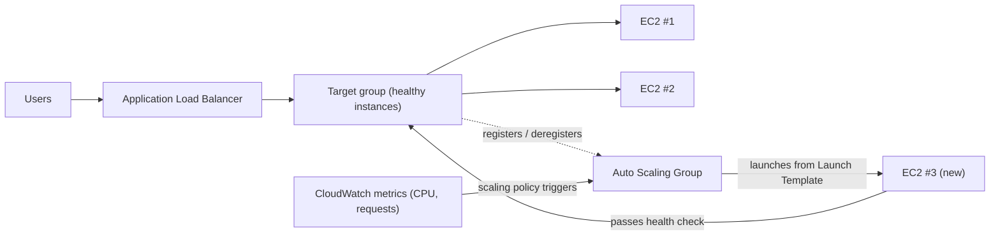

# บทที่ 7: ร้านอาหารที่เติบโตเมื่อยุ่ง

เวลา 19:43 น. ของวันศุกร์

เก้าอี้ของ Tom ถูกดันถอยหลังเล็กน้อย แบบที่มันเป็นเมื่อเขาจ้องอะไรบางอย่างด้วยสมาธิแบบที่หมายความว่าเขาจะไม่ตอบถ้าคุณพูดกับเขา ออฟฟิศว่างเปล่าไปเมื่อชั่วโมงก่อน เขาอยู่ต่อ

เขามีแท็บที่เปิดไปยังแดชบอร์ดเมตริกที่เขารีเฟรชแบบที่คนอื่นเช็คโซเชียลมีเดีย — โดยอัตโนมัติ ตลอดเวลา โดยไม่ค่อยตั้งใจ

วิกฤตพื้นที่จัดเก็บผ่านพ้นไปแล้ว ฐานข้อมูลมีดิสก์ของตัวเอง รูปอยู่ใน S3 เป็นเวลาสองสัปดาห์ ระบบเสถียร — ไม่น่าตื่นเต้น แค่เสถียร นั่นน่าจะรู้สึกดี

จากนั้นอัตราข้อผิดพลาดข้าม 12%

"Leo" Tom พูด

Leo มองอยู่แล้ว เวลาตอบสนอง: ไต่ขึ้น คำขอที่เข้าคิว: ไต่ขึ้น EC2 instance เดียว — แม้หลังจากการกำหนดขนาดอย่างระมัดระวังเมื่อเดือนที่แล้ว — อยู่ที่ 94% CPU

"เรากำลังปฏิเสธลูกค้า" Tom พูด

"เราไม่ได้ปฏิเสธพวกเขา" Leo พูด "เซิร์ฟเวอร์ต่างหาก"

"นั่นก็เรื่องเดียวกัน"

ใช่ และมันเกิดขึ้นทุกวันศุกร์มาสามสัปดาห์ Nimbus รอดจากวิกฤตพื้นที่จัดเก็บ — ฐานข้อมูลมีดิสก์ของตัวเอง รูปอยู่ใน S3 — แต่เสถียรและขยายได้เป็นปัญหาคนละเรื่องโดยสิ้นเชิง ระบบทำงาน มันแค่ไม่เติบโต

ข้อความ Slack ปรากฏจาก Maya: *แดชบอร์ดบอกว่าออร์เดอร์ลดลง 40% จากศุกร์ที่แล้ว เกิดอะไรขึ้น?*

Tom ตอบ: *เซิร์ฟเวอร์เต็มกำลัง กำลังแก้อยู่*

สามนาทีผ่านไป

Maya: *เรามีเจ้าของร้านอาหารโทรมาที่สายสนับสนุนบอกว่าแอปพัง*

Leo มีมืออยู่บนคีย์บอร์ด เขากำลังปรับขนาด instance — เวอร์ชันแก้ด้วยมือ อันที่ต้องหยุดเซิร์ฟเวอร์และเปลี่ยนประเภท instance ซึ่งหมายถึง downtime

"การรีสตาร์ทจะใช้เวลานานแค่ไหน?" Tom ถาม

"เจ็ดนาที" Leo พูด

"เราจะมี downtime อีกเจ็ดนาทีในคืนวันศุกร์" Tom พูด เขาไม่ได้ถาม เขาพิมพ์ข้อความ Slack หา Maya เธอตอบด้วยตัวอักษรเดียว: *k*

การรีสตาร์ทเสร็จ instance กลับมา CPU ลดลงเหลือ 60% อัตราข้อผิดพลาดลดลง Tom เฝ้าดูเมตริกสิบห้านาทีโดยไม่พูด

ตอน 21:15 น. ทราฟฟิกลดลง วิกฤตจบลง

Leo มองมือของเขา ที่สั่นเล็กน้อยตอนสองทุ่มและตอนนี้ไม่สั่นแล้ว

"เราทำแบบนั้นทุกวันศุกร์ไม่ได้" เขาพูด

"ไม่" Tom พูด "เราทำไม่ได้"

ทีมต้องการให้ระบบของพวกเขาจัดการโหลดผันแปรโดยอัตโนมัติ ไม่ใช่ซื้อเซิร์ฟเวอร์เผื่อกรณีเลวร้ายที่สุดและเสียเงินเปล่าในช่วงเงียบ และไม่ใช่ดิ้นรนด้วยมือเมื่อการพุ่งขึ้นของทราฟฟิกมาถึง

มีรูปแบบสำหรับเรื่องนี้ AWS มีสองบริการที่นำมันมาใช้

**แนวคิด: การขยายแนวนอน**

มีสองวิธีในการทำให้ระบบจัดการโหลดมากขึ้น

**การขยายแนวตั้ง (Vertical scaling)** หมายถึงการทำให้เซิร์ฟเวอร์เดียวใหญ่ขึ้น CPU มากขึ้น RAM มากขึ้น เราทำสิ่งนี้ในบทที่ 4 เมื่อเราอัปเกรดจาก `t3.micro` เป็น `t3.large` มันช่วย แต่มันมีขีดจำกัด: คุณไปได้ใหญ่แค่นั้น instance ต้องรีสตาร์ทเพื่อปรับขนาด และคุณยังมีจุดล้มเหลวเดียว

**การขยายแนวนอน (Horizontal scaling)** หมายถึงการเพิ่มเซิร์ฟเวอร์ แทนที่จะเป็นเซิร์ฟเวอร์ใหญ่หนึ่งเครื่อง รันเซิร์ฟเวอร์กลางห้าเครื่อง เมื่อทราฟฟิกลดลง รันสองเครื่อง เมื่อมันพุ่งขึ้น รันสิบเครื่อง

การขยายแนวนอนมีข้อได้เปรียบที่แนวตั้งไม่มี:

- ไม่มีจุดล้มเหลวเดียว ถ้าเซิร์ฟเวอร์หนึ่งตาย อันอื่นยังให้บริการต่อ
- ไม่ต้องรีสตาร์ทเพื่อเพิ่มกำลังการผลิต
- จ่ายเฉพาะสิ่งที่คุณใช้ — เพิ่มเซิร์ฟเวอร์เมื่อคุณต้องการ ลบเมื่อคุณไม่ต้องการ
- การขยายเชิงเส้น: เซิร์ฟเวอร์สองเท่า ทรูพุตราว ๆ สองเท่า

ยังมีมิติด้านความน่าเชื่อถือที่การขยายแนวตั้งเทียบไม่ได้ เมื่อคุณมีเซิร์ฟเวอร์ห้าเครื่องและหนึ่งล้มเหลว กำลังการผลิตของคุณลดลงเหลือ 80% — เพียงพอที่จะให้บริการทราฟฟิกต่อในขณะที่ instance ที่ล้มเหลวถูกเปลี่ยนทดแทน เมื่อคุณมีเซิร์ฟเวอร์หนึ่งเครื่องและมันล้มเหลว กำลังการผลิตลดลงเหลือ 0% ความซ้ำซ้อนเป็นสิ่งโดยกำเนิดในการขยายแนวนอนในแบบที่การขยายแนวตั้งให้ไม่ได้ไม่ว่าขนาดใด

สิ่งนี้สำคัญสำหรับการบำรุงรักษาด้วย เมื่อ security patch ต้องการการรีสตาร์ทเซิร์ฟเวอร์ การขยายแนวนอนให้คุณรีสตาร์ท instance ทีละตัว — การรีสตาร์ทแบบ rolling ที่รักษาความต่อเนื่องของบริการ เซิร์ฟเวอร์ใหญ่เดียวต้องการการยอมรับ downtime ในระหว่างการรีสตาร์ทหรือการนำความซับซ้อนของการ deploy แบบ blue/green มาใช้

ปัญหา: ถ้าคุณมีเซิร์ฟเวอร์หลายตัว ผู้ใช้รู้ได้อย่างไรว่าจะคุยกับตัวไหน?

และมีข้อจำกัดด้านการออกแบบที่การขยายแนวนอนกำหนด: แอปพลิเคชันของคุณต้องสามารถรันบนเซิร์ฟเวอร์ที่เหมือนกันหลายตัวพร้อมกันโดยที่เซิร์ฟเวอร์ไม่รบกวนกัน นี่คือข้อกำหนด **stateless** — แต่ละคำขอต้องอยู่ได้ด้วยตัวเอง ไม่พึ่งพาสถานะที่เก็บไว้บนเซิร์ฟเวอร์เฉพาะ เราจะเห็นว่าทำไมสิ่งนี้ถึงสำคัญพอดีเมื่อเราเจอปัญหา sticky session

**Application Load Balancer: ประตูเดียว หลายห้อง**

ลองนึกภาพร้านอาหารใหญ่ที่มีโต๊ะพนักงานต้อนรับที่ประตู ลูกค้ามาถึงและพนักงานต้อนรับนำพวกเขาไปยังโต๊ะที่ว่าง พนักงานต้อนรับรู้ว่าโต๊ะไหนยุ่งและโต๊ะไหนว่าง ลูกค้าไม่ต้องรู้ว่ามีกี่โต๊ะ — พวกเขาแค่เดินเข้ามาและพนักงานต้อนรับจัดการการกระจาย

**Application Load Balancer** (ALB) ทำสิ่งนี้กับคำขอเว็บ

ผู้ใช้เชื่อมต่อกับ load balancer load balancer กระจายคำขอที่เข้ามาข้ามฟลีตของ EC2 instance ของคุณ ผู้ใช้แต่ละคนเห็นที่อยู่เดียว (URL ของ load balancer) เบื้องหลังที่อยู่นั้น คำขอถูกกระจายไปยังเซิร์ฟเวอร์ที่กำลังรันกี่ตัวก็ตาม

ตัว ALB เองรันบนโครงสร้างพื้นฐานที่ AWS จัดการ กระจายข้าม AZ หลายแห่งใน Region ของคุณ มันไม่ใช่เซิร์ฟเวอร์ตัวเดียว — มันเป็นบริการที่มีการจัดการแบบกระจาย เมื่อคุณเปิดใช้งาน cross-zone load balancing (ค่าเริ่มต้นสำหรับ ALB) แต่ละโหนด ALB กระจายคำขออย่างเท่าเทียมข้าม target ที่ลงทะเบียนทั้งหมดไม่ว่าพวกมันจะอยู่ใน AZ ไหน สิ่งนี้ป้องกันโหมดความล้มเหลวที่พบบ่อยที่ AZ หนึ่งมี instance ที่แข็งแรงมากกว่าอีกอันสองเท่า ส่งผลให้โหลดไม่สม่ำเสมอ

มันรับคำขอ HTTP ที่เข้ามาแต่ละอันและตัดสินใจว่า EC2 instance ใด (เรียกว่า **target**) ควรจัดการมัน ตามปัจจัยเช่น:

- Round-robin (เซิร์ฟเวอร์แต่ละตัวได้รับตามรอบ)
- Least outstanding requests (เซิร์ฟเวอร์ที่มีคำขอค้างน้อยที่สุดได้รับคำขอถัดไป)
- ความแข็งแรง — เฉพาะ target ที่แข็งแรงได้รับทราฟฟิก

**Health check** จำเป็น ALB ส่งคำขอทดสอบไปยัง target แต่ละตัวเป็นประจำ ถ้า target ไม่ตอบสนองอย่างถูกต้อง ALB ทำเครื่องหมายว่าไม่แข็งแรงและหยุดส่งทราฟฟิกไปยังมัน เมื่อ target ฟื้นตัว ทราฟฟิกก็กลับมา

นี่เป็นอัตโนมัติ คุณกำหนดค่าพารามิเตอร์ health check ALB บังคับใช้มัน

คุณกำหนดค่า health check ด้วยพารามิเตอร์หลักสามอย่าง: **path** ที่จะตรวจสอบ (เช่น `/health`) **interval** (ตรวจสอบบ่อยแค่ไหน — ทุก 5 ถึง 300 วินาที ค่าเริ่มต้น 30) และ **threshold** (กี่ครั้งที่สำเร็จหรือล้มเหลวติดต่อกันก่อนเปลี่ยนสถานะความแข็งแรงของ target)

interval ของ health check ที่ก้าวร้าวจับปัญหาได้เร็วกว่าแต่เพิ่มทราฟฟิกให้ target มากขึ้น interval 30 วินาทีพร้อม threshold ล้มเหลว 3 ครั้งหมายความว่า target ที่ล้มเหลวถูกลบออกจากการหมุนเวียนภายใน 90 วินาที interval 10 วินาทีพร้อม threshold ล้มเหลว 2 ครั้งหมายความว่าลบภายใน 20 วินาที — โดยแลกกับทราฟฟิก health check ที่มากขึ้น

สำหรับ Nimbus Priya เลือก interval 30 วินาทีพร้อม threshold ล้มเหลว 3 ครั้ง (90 วินาทีในการประกาศว่าไม่แข็งแรง) และสำเร็จ 2 ครั้ง (60 วินาทีในการประกาศว่าแข็งแรงอีกครั้งหลังฟื้นตัว) สิ่งนี้สมดุลการตรวจจับความล้มเหลวที่เร็วกับการหลีกเลี่ยง false positive จากความสะดุดของเครือข่ายช่วงสั้น

**การกำหนดค่า Health Check: มากกว่า "มันยังมีชีวิตอยู่ไหม?"**

health check แรกของ Leo เป็น TCP ping ง่าย ๆ: "port 80 รับการเชื่อมต่อไหม?" นั่นคือขั้นต่ำ เซิร์ฟเวอร์อาจรับการเชื่อมต่อบน port 80 ในขณะที่ฐานข้อมูลล่ม ในขณะที่แอปพลิเคชันอยู่ในลูปข้อผิดพลาด ในขณะที่ดิสก์เต็ม

Priya มีมุมมองที่ต่างออกไปว่า "แข็งแรง" ควรหมายถึงอะไร

"เราคิดถึงเรื่องที่จะเกิดขึ้นถ้า health check ผ่านแต่แอปพลิเคชันพังหรือยัง?" เธอถาม "เซิร์ฟเวอร์ที่รับการเชื่อมต่อได้แต่สืบค้นฐานข้อมูลไม่ได้ ไม่ใช่แข็งแรง มันแค่ตอบสนอง"

Leo สร้าง endpoint `/health` ในโค้ดแอปพลิเคชัน endpoint ทำสามอย่าง:
1. ยืนยันว่ากระบวนการแอปพลิเคชันกำลังรัน
2. ทำการสืบค้นทดสอบไปยังฐานข้อมูล (`SELECT 1` ง่าย ๆ)
3. ยืนยันว่าการเชื่อมต่อ S3 เข้าถึงได้

ถ้าทั้งสามผ่าน endpoint ส่งคืน HTTP 200 ถ้าอันใดล้มเหลว มันส่งคืน HTTP 503

health check ของ ALB ถูกกำหนดค่าให้เรียก endpoint นี้ทุก 30 วินาที ถ้ามันได้รับการตอบสนอง 503 ติดต่อกันสามครั้ง instance ถูกทำเครื่องหมายว่าไม่แข็งแรงและถูกลบออกจากการหมุนเวียน

"นั่นหมายความว่าถ้าฐานข้อมูลล่ม" Priya พูด "health check จะจับมันและลบเซิร์ฟเวอร์ที่ได้รับผลกระทบออกจาก load balancer ภายใน 90 วินาที"

"แม้ว่าตัวเซิร์ฟเวอร์เองยังรันอยู่" Tom พูด

"แม้ว่าพวกมันดูปกติจากภายนอก"

ALB ที่ชี้ไปที่ health check แอปพลิเคชันจริง กลายเป็นตัวตรวจจับปัญหาจริงที่น่าเชื่อถือกว่ามาก — ไม่ใช่แค่ความมีชีวิตของเซิร์ฟเวอร์

**Auto Scaling: ร้านอาหารที่เปิดโต๊ะมากขึ้น**

ALB กระจายทราฟฟิกข้ามเซิร์ฟเวอร์ที่มีอยู่ของคุณ แต่มันไม่เพิ่มเซิร์ฟเวอร์เมื่อคุณต้องการมากขึ้น

**Auto Scaling** ทำ

**Auto Scaling Group** (ASG) คือการกำหนดค่าที่บอก AWS:

- จำนวน instance ขั้นต่ำที่จะรันอยู่เสมอ
- จำนวน instance สูงสุดที่อนุญาต
- เงื่อนไขที่จะขยายออก (เพิ่ม instance) หรือขยายเข้า (ลบพวกมัน)

เงื่อนไขการขยายเรียกว่า **policy** สี่ประเภทที่พบบ่อยที่สุด:

**Target tracking**: "รักษาการใช้งาน CPU เฉลี่ยที่ 70%" เมื่อ CPU เฉลี่ยเกิน 70% AWS เปิด instance ใหม่ เมื่อมันลดลงต่ำกว่า instance ถูกยุติ นี่คือ policy ที่เรียบง่ายและแนะนำที่สุดสำหรับเวิร์กโหลดส่วนใหญ่ — ตั้งเมตริกเป้าหมายและให้ AWS หาว่าต้องการกี่ instance เป้าหมายอาจเป็นการใช้งาน CPU จำนวนคำขอต่อ target หรือเมตริก CloudWatch ที่กำหนดเองใด ๆ

**Step scaling**: กำหนด threshold เฉพาะพร้อมการตอบสนองเฉพาะ "เมื่อ CPU เกิน 60% เพิ่ม 1 instance เมื่อ CPU เกิน 80% เพิ่ม 3 instance เมื่อ CPU ลดลงต่ำกว่า 30% ลบ 1 instance" การควบคุมที่ละเอียดกว่า target tracking แต่ต้องการการกำหนดค่ามากกว่าและการปรับจูนอย่างต่อเนื่อง

**Scheduled scaling**: "ตอน 18:45 น. ทุกวันศุกร์ ตรวจสอบให้แน่ใจว่ามีอย่างน้อย 4 instance กำลังรัน" นี่คือการขยายเชิงรุกสำหรับเหตุการณ์ที่คาดเดาได้ มันทำงานควบคู่กับการขยายเชิงปฏิกิริยา — การกระทำตามกำหนดการตั้งพื้น และ target tracking เพิ่ม instance เหนือพื้นนั้นตามต้องการ

**Predictive scaling**: เวอร์ชัน machine-learning ของแนวคิดเดียวกัน แทนที่คุณจะเขียนกำหนดการ Auto Scaling วิเคราะห์โหลดในอดีตได้ถึงสองสัปดาห์และพยากรณ์ 48 ชั่วโมงถัดไป เปิดกำลังการผลิต *ล่วงหน้า* ก่อนการเพิ่มขึ้นที่ทำนาย สำหรับทราฟฟิกแบบวัฏจักร — ช่วงเร่งด่วนมื้อค่ำทุกวันศุกร์ การเปิดตลาดทุกวันธรรมดา — predictive scaling ค้นพบรูปแบบและอุ่นเครื่องล่วงหน้าโดยอัตโนมัติ และปรับต่อเนื่องเมื่อรูปแบบเลื่อน ตัวกระตุ้นการสอบ: "การพุ่งขึ้นของทราฟฟิกที่เกิดซ้ำ/เป็นวัฏจักร; instance ต้องพร้อม *ก่อน* การพุ่งขึ้น" → predictive scaling (scheduled scaling คือคำตอบแบบมือ predictive คือแบบเรียนรู้ ทั้งคู่ดีกว่าการขยายเชิงปฏิกิริยาเท่านั้น ซึ่งล้าหลังการพุ่งขึ้นเสมอด้วยเวลาบูต instance)

สำหรับ Nimbus การผสมผสานคือ: target tracking สำหรับการขยายเชิงปฏิกิริยา (รักษา CPU ที่ 65%) บวกการกระทำ scheduled scaling ทุกวันศุกร์ตอน 18:45 น. เพื่ออุ่นเครื่อง instance เพิ่มเติม 2 ตัวก่อนช่วงเร่งด่วนมื้อค่ำ

นี่เป็นอัตโนมัติ ไม่มีใครต้องเฝ้าดูเมตริก ไม่มีใครต้องเปิดเซิร์ฟเวอร์ด้วยมือ ระบบตอบสนองต่อโหลดแบบเรียลไทม์

Priya เฝ้าดูสิ่งนี้เกิดขึ้นสดในระหว่างช่วงเร่งด่วนวันศุกร์เป็นครั้งแรก จำนวนเซิร์ฟเวอร์ไปจาก 2 เป็น 5 ในสิบห้านาที จากนั้นกลับไป 2 หลังช่วงเร่งด่วน

"นั่น" เธอพูด "น่าประทับใจจริง ๆ"

Tom กำลังดูกราฟต้นทุนแทน บิลเพิ่มขึ้นในระหว่างช่วงเร่งด่วนและลดลงหลังจากนั้น "เราจ่ายเฉพาะสิ่งที่เราใช้" เขาพูด ประทับใจไม่แพ้กัน "มันมีต้นทุนต่อเดือนเท่าไหร่ เฉลี่ยตลอดสัปดาห์ปกติ?"

Leo เปิดเครื่องคำนวณ พีควันศุกร์เพิ่มบิลรายเดือนอาจ 15% หากไม่มี Auto Scaling พวกเขาต้องจัดสรรเผื่อพีคทั้งสัปดาห์ ความแตกต่าง: ประมาณ $120/เดือนเสียเปล่ากับกำลังการผลิตพีคที่ว่าง เทียบกับ $0 เสียเปล่าด้วย Auto Scaling ที่กำหนดค่าอย่างเหมาะสม

มีรายละเอียดหนึ่งในการขยายเข้าที่ทีมมักพลาด: **scale-in protection** คุณกำหนดค่า instance เฉพาะใน ASG ให้ได้รับการป้องกันจากการขยายเข้าได้ — หมายความว่าพวกมันจะไม่ถูกยุติในระหว่างเหตุการณ์ขยายเข้าอัตโนมัติ สิ่งนี้มีประโยชน์สำหรับ instance ที่กำลังประมวลผลงานที่รันยาวซึ่งคุณไม่ต้องการให้ถูกขัดจังหวะ โค้ดแอปพลิเคชันยังตั้งการป้องกัน instance แบบโปรแกรมได้เมื่อมันเริ่มงานยาวและลบการป้องกันเมื่องานเสร็จ สิ่งนี้ป้องกัน ASG จากการดึงพรมออกจากใต้งานที่กำลังทำอยู่

**Warm Pools: ไม่ใช่ทุกอย่างที่ต้องเริ่มแบบเย็น**

วันศุกร์ที่ Auto Scaling เริ่มทำงานเป็นครั้งแรก Tom จับเวลาว่าใช้เวลานานแค่ไหนจาก "CPU เกิน threshold" ไปยัง "instance ใหม่ให้บริการทราฟฟิก"

สี่นาทียี่สิบวินาที

"นั่นคือสี่นาทีที่เราขาดกำลังการผลิต" เขาพูด

"เราเพิ่มจำนวน instance ขั้นต่ำได้" Leo พูด

"นั่นหมายถึงการจ่ายค่า instance ที่ว่างทั้งสัปดาห์" Tom พูด

มีทางสายกลาง: **Warm Pools**

Warm Pool คือกลุ่มของ EC2 instance ที่เริ่มต้นไว้ล่วงหน้าซึ่งนั่งอยู่ในสถานะหยุด บูตแล้ว กำหนดค่าแล้ว ผ่านสคริปต์ UserData แล้ว พวกมันทำทุกอย่างยกเว้นการเริ่มให้บริการทราฟฟิก

เมื่อ Auto Scaling Group ตัดสินใจขยายออก แทนที่จะเปิด instance ที่เย็นใหม่ตั้งแต่ต้น (ซึ่งใช้เวลาสามถึงห้านาทีในการบูต รัน UserData และผ่าน health check) มันเริ่ม instance จาก Warm Pool การเริ่ม instance ที่หยุดอยู่ใช้เวลาประมาณ 30 ถึง 60 วินาที

สำหรับรูปแบบวันศุกร์ของ Nimbus — การพุ่งขึ้นที่รู้และคาดเดาได้ซึ่งเริ่มราว ๆ หนึ่งทุ่ม — Priya กำหนดค่า Warm Pool ของสอง instance ให้รักษาไว้ในระหว่างเวลาทำการ เมื่อถึง 18:45 น. instance อุ่นสองตัวนั่งพร้อม หยุดแต่เริ่มต้นแล้ว เมื่อทราฟฟิกไต่ขึ้นตอนหนึ่งทุ่มและ ASG ต้องขยาย instance อุ่นเริ่มในเวลาต่ำกว่าหนึ่งนาทีและเข้าร่วมฟลีต

"Warm Pool มีต้นทุนเท่าไหร่?" Tom ถาม

EC2 instance ที่หยุดอยู่ไม่จ่ายค่าคอมพิวต์ — แต่มันจ่ายค่าพื้นที่จัดเก็บ EBS ที่แนบอยู่ สอง `t3.small` instance ใน Warm Pool: ประมาณ $4/เดือนในค่าพื้นที่จัดเก็บ การปรับปรุงเวลาขยายออกจากสี่นาทีเป็นต่ำกว่าหนึ่งนาทีคุ้มกับ $4/เดือนในคืนวันศุกร์

**ALB Path-Based Routing**

เมื่อ Nimbus เติบโต Leo เพิ่มส่วนประกอบที่สอง: บริการ API แยกต่างหากสำหรับการจัดการร้านอาหาร เจ้าของร้านอาหารเข้าถึงบริการนี้ผ่านโดเมนเดียวกันแต่ที่พาธ URL ต่างกัน: `/api/restaurant/` แทน `/`

"เดี๋ยวนะ — แต่ *ทำไม* เราถึงจะทำแบบนั้น?" Maya ถาม "ทำไมไม่ให้ API การจัดการร้านอาหารมีโดเมนต่างกันเลย?"

"เราทำได้" Leo พูด "แต่แล้วเราจะต้องการใบรับรองที่สอง load balancer ที่สอง รายการ DNS ที่สอง path-based routing จัดการมันด้วยใบรับรองเดียว load balancer เดียว"

ALB รองรับสิ่งนี้โดยกำเนิด **กฎ path-based routing** บอก ALB: เมื่อ URL เริ่มด้วย `/api/restaurant/` ส่งคำขอไปยัง target group การจัดการร้านอาหาร เมื่อ URL เริ่มด้วยอะไรอย่างอื่น ส่งมันไปยัง target group แอปพลิเคชันฝั่งลูกค้า

ฟลีต EC2 instance สองชุดแยกกัน load balancer หนึ่งตัว ทราฟฟิกถูกนำทางตามพาธ URL

"ดังนั้นเราขยาย API การจัดการร้านอาหารได้อย่างอิสระจากแอปฝั่งลูกค้า?" Maya ถาม

"นั่นแหละ" Leo พูด "ถ้าเจ้าของร้านอาหารกำลังอัปเดตเมนูจำนวนมาก เซิร์ฟเวอร์ API พวกนั้นก็ขยาย ถ้าลูกค้าสั่งหนัก เซิร์ฟเวอร์พวกนั้นก็ขยาย พวกมันไม่กระทบกัน"

Maya นั่งคิดกับสิ่งนี้ "และเราจ่ายค่า ALB เดียวแทนสองตัว"

"ถูกต้อง" Tom พูด เขามีตัวเลข "ALB มีต้นทุนประมาณ $20 ต่อเดือนในค่าธรรมเนียมพื้นฐานบวกค่าประมวลผลข้อมูล ALB หนึ่งตัวจัดการทั้งสองเวิร์กโหลดเทียบกับสองตัวแยกกัน: ประหยัดราว ๆ $20 ต่อเดือน และเราหลีกเลี่ยงการจัดการใบรับรองและรายการ DNS หลายอัน"

"แต่" Priya พูด "ถ้าตัว ALB เองล่ม ทั้งสองบริการก็ล่มไปด้วยกัน"

"AWS ออกแบบให้ ALB มีความพร้อมใช้งานสูงข้าม AZ หลายแห่ง" Leo พูด "ความเสี่ยงของความล้มเหลวของ ALB ต่ำมากเมื่อเทียบกับความซับซ้อนของการดูแล load balancer สองตัวแยกกัน"

Priya เก็บสิ่งนี้ไว้ใต้ "ข้อแลกเปลี่ยนที่ยอมรับ มีเอกสาร"

**ALB และ ASG ทำงานร่วมกันอย่างไร**

สองบริการถูกออกแบบให้ใช้ร่วมกัน

คุณวาง ALB ไว้ข้างหน้า ALB ชี้ไปที่ **target group** — กลุ่มของ instance ที่ควรได้รับทราฟฟิก Auto Scaling Group จัดการ instance เหล่านั้น: มันเพิ่มพวกมันลงใน target group เมื่อขยายออก ลบพวกมันเมื่อขยายเข้า

ลำดับ:

1. ทราฟฟิกมาถึง ALB
2. ALB กระจายคำขอไปยัง target ที่แข็งแรง
3. CPU/โหลดไต่ขึ้นบน target เหล่านั้น
4. ASG ตรวจพบการเพิ่มขึ้นของโหลด เปิด instance ใหม่
5. instance ใหม่ผ่าน health check ลงทะเบียนกับ ALB
6. ALB เริ่มส่งทราฟฟิกไปยังพวกมัน
7. โหลดลดลง ASG ยุติ instance ส่วนเกิน
8. ALB หยุดส่งทราฟฟิกไปยัง instance ที่ถูกยุติ

สิ่งนี้เกิดขึ้นโดยไม่มีการแทรกแซงของมนุษย์ใด ๆ

**Launch Templates: พิมพ์เขียวสำหรับ Instance ใหม่**

เมื่อ ASG เปิด instance ใหม่ มันต้องรู้ว่าจะเปิดอะไร นี่ถูกกำหนดใน **Launch Template** — AMI ประเภท instance security group ที่จะใช้ และ user data ใด ๆ (สคริปต์เริ่มต้นที่รันเมื่อ instance บูต)

รูปแบบที่พบบ่อย: คุณสร้างแอปพลิเคชันของคุณลงใน AMI ที่กำหนดเอง (ดูบทที่ 4) เมื่อ ASG ต้องการ instance ใหม่ มันเปิด AMI นั้น instance ใหม่บูตพร้อมแอปพลิเคชันของคุณติดตั้งไว้แล้ว ไม่ต้องตั้งค่าด้วยมือ

สำหรับสภาพแวดล้อมที่ไดนามิกกว่า คุณยังใช้ **สคริปต์ user data** ที่ดึงและติดตั้งโค้ดของคุณเวอร์ชันล่าสุดเมื่อเริ่มต้นได้ สิ่งนี้ยืดหยุ่นกว่าแต่ใช้เวลาบูตนานกว่า

ทางเลือกที่ถูกต้องขึ้นอยู่กับว่า instance ของคุณต้องใช้เวลาบูตนานแค่ไหนและแอปพลิเคชันของคุณเปลี่ยนบ่อยแค่ไหน

**Sticky Sessions: ปัญหาแยบยล**

นี่คือสิ่งที่ทำให้หลายทีมพลาดเมื่อพวกเขานำ load balancing มาใช้ครั้งแรก

เว็บแอปพลิเคชันบางอันเก็บข้อมูล session — สถานะการล็อกอิน เนื้อหาตะกร้าสินค้า — บนเซิร์ฟเวอร์เอง (ในหน่วยความจำหรือบนดิสก์ในเครื่อง) สิ่งนี้ทำงานได้ดีกับเซิร์ฟเวอร์เดียว กับเซิร์ฟเวอร์หลายตัว มันพัง

ผู้ใช้ล็อกอิน คำขอไปที่เซิร์ฟเวอร์ A เซิร์ฟเวอร์ A เก็บ session คำขอถัดไปไปที่เซิร์ฟเวอร์ B เซิร์ฟเวอร์ B ไม่มี session ผู้ใช้ดูเหมือนล็อกเอาต์

สิ่งนี้แก้ได้สองวิธี:

**Sticky sessions** (หรือ session affinity): กำหนดค่า ALB ให้ส่งคำขอจากผู้ใช้คนเดียวกันไปยังเซิร์ฟเวอร์เดียวกันเสมอ นี่คือการแก้ระยะสั้น มันบ่อนทำลาย load balancing (เซิร์ฟเวอร์บางตัวได้ผู้ใช้ "เหนียว" มากกว่าตัวอื่น) และสร้างปัญหาเมื่อ instance ถูกยุติ

Maya มองหน้ากำหนดค่า sticky sessions "ถ้าเราปักหมุดผู้ใช้ไว้กับเซิร์ฟเวอร์เฉพาะ จะเกิดอะไรขึ้นเมื่อเซิร์ฟเวอร์เหล่านั้นถูกยุติในระหว่างการขยายเข้า?"

"พวกเขาเสีย session" Leo พูด

"ดังนั้น sticky sessions แค่หน่วงปัญหาไว้"

"ถูกต้อง" Priya พูด "การแก้จริงคือการออกแบบแอปพลิเคชันแบบ stateless"

**การออกแบบแอปพลิเคชันแบบ stateless**: เก็บข้อมูล session ภายนอก — ในฐานข้อมูลหรือแคชเช่น ElastiCache (บทที่ 10) เซิร์ฟเวอร์แต่ละตัวสร้าง session ของผู้ใช้ใด ๆ ขึ้นใหม่จากที่เก็บภายนอกได้ เซิร์ฟเวอร์กลายเป็นใช้แทนกันได้ นี่คือแนวทางที่ถูกต้องสำหรับแอปพลิเคชันที่ขยายแนวนอนได้

Priya เรียกสิ่งนี้ว่า "การตัดสินใจด้านสถาปัตยกรรมที่สำคัญที่สุดที่คุณทำเมื่อคุณไปหลายเซิร์ฟเวอร์" เธอพูดถูก เราเจอมันอีกครั้งในบทที่ 10

**ถ้า Sticky Sessions ก็ความซับซ้อนน้อยลงแต่ความเสี่ยงมากขึ้น**

ถ้าคุณใช้ sticky sessions เพื่อแก้ปัญหาสถานะ session คุณก็ลดความจำเป็นในการตั้งค่าที่เก็บ session ภายนอกในระยะสั้น — แต่เมื่อเซิร์ฟเวอร์ที่เหนียวถูกยุติในระหว่างการขยายเข้า ผู้ใช้ที่ผูกกับมันทั้งหมดเสีย session ในคราวเดียว ความล้มเหลวไม่ค่อยเป็นไป มันฉับพลันและกระทบผู้ใช้กลุ่มหนึ่งพร้อมกัน ถ้าคุณนำสถานะ session ออกไปภายนอก คุณเพิ่มการพึ่งพา (ElastiCache หรือฐานข้อมูล) แต่ขจัดโหมดความล้มเหลวฉับพลันนั้น สำหรับแอปพลิเคชันใด ๆ ที่ขยายเป็นประจำ การลงทุนในการออกแบบแบบ stateless คุ้มทุนตัวเองในครั้งแรกที่ Auto Scaling ยุติ instance ที่มี session ที่ใช้งานอยู่บนมัน

**การคำนวณต้นทุนของ Tom**

สัปดาห์ถัดมา Tom สร้างแบบจำลองต้นทุนสำหรับการตั้งค่า ALB และ ASG

ALB: ประมาณ $20/เดือนพื้นฐานบวกค่าประมวลผลข้อมูล ที่ปริมาณทราฟฟิกของ Nimbus: ประมาณ $22/เดือน

ตัว Auto Scaling Group เอง: ไม่มีต้นทุนเพิ่ม คุณจ่ายค่า instance ที่มันรัน แต่ instance เหล่านั้นจะมีอยู่อยู่ดี ASG ฟรี คุณจ่ายค่าคอมพิวต์

Warm Pool: ประมาณ $4/เดือนในพื้นที่จัดเก็บ EBS สำหรับสอง instance ที่หยุดอยู่

ต้นทุนโครงสร้างพื้นฐานเพิ่มเติมรวม: ประมาณ $26/เดือน หรือ $312/ปี

จากนั้น Tom ดูบันทึกเหตุการณ์จากสามวันศุกร์ก่อนที่ ALB และ ASG จะอยู่ในที่ แต่ละเหตุการณ์ทำให้ Nimbus เสียประมาณ 40% ของรายได้วันศุกร์ในระหว่างช่วง downtime รายได้วันศุกร์เฉลี่ย: ราว ๆ $2,400 40% ของ $2,400 คือ $960 ต่อเหตุการณ์ สามเหตุการณ์: ประมาณ $2,880 ในรายได้ที่สูญเสียในสามสัปดาห์

"ALB และ ASG มีต้นทุน $312 ต่อปี" Tom พูด "สามวันศุกร์ที่แย่ทำให้เราเสียเกือบ $3,000 และนั่นเป็นแค่การสูญเสียรายได้โดยตรง — ไม่ใช่การสูญเสียลูกค้าจากคนที่หยุดใช้ Nimbus หลังจากประสบการณ์ที่แย่"

Maya อ่านตัวเลข "รันโครงสร้างพื้นฐาน"

"รันอยู่แล้ว" Leo พูด

## เมื่อ ALB ไม่เพียงพอ: NLB และ GWLB

Leo กำลังตรวจทานการผสานรวม IoT ที่ Nimbus เพิ่มเข้ามาอย่างเงียบ ๆ สำหรับพาร์ทเนอร์ร้านอาหาร — เซ็นเซอร์อุณหภูมิเล็ก ๆ ในห้องเย็นที่ส่งค่าอ่านไปยัง Nimbus ทุกสามสิบวินาที เพื่อให้ผู้จัดการครัวได้รับการแจ้งเตือนถ้าตู้เย็นเลื่อนสูงกว่าอุณหภูมิที่ปลอดภัย

"เดี๋ยว" Leo พูด "เซ็นเซอร์เหล่านี้กำลังส่งแพ็กเก็ต UDP"

"นั่นเป็นปัญหาไหม?" Maya ถาม

"ALB ไม่รองรับ UDP" Leo พูด "ALB เข้าใจ HTTP แค่นั้น"

Priya กำลังดูเอกสารอยู่แล้ว "นั่นคือสิ่งที่ Network Load Balancer มีไว้"

**Network Load Balancer (NLB)** ทำงานที่ Layer 4 — ชั้นการขนส่ง มันส่งแพ็กเก็ต TCP และ UDP มันไม่ตรวจสอบเนื้อหาของแพ็กเก็ตเหล่านั้น ไม่เข้าใจ HTTP header ไม่ทำ path-based routing สิ่งที่มันทำคือการเคลื่อนแพ็กเก็ตจากไคลเอนต์ไปยัง target ด้วยความเร็วพิเศษ

- **คำขอหลายล้านครั้งต่อวินาทีด้วยความหน่วงระดับมิลลิวินาทีหลักเดียว** ALB ประมวลผล HTTP ที่ Layer 7 ซึ่งหมายความว่ามัน parse header ประเมินกฎ routing และยุติการเชื่อมต่อ TLS NLB ไม่ทำสิ่งใดเลย — มันใกล้เคียงกับผู้กำกับจราจรความเร็วสูงมากกว่า web proxy
- **รักษาที่อยู่ IP ต้นทางของไคลเอนต์** เมื่อ ALB รับการเชื่อมต่อ มันยุติมันและเปิดอันใหม่ไปยัง target — EC2 instance ของคุณเห็น IP ของ ALB ไม่ใช่ของผู้ใช้ NLB ไม่ทำสิ่งนี้ IP ต้นทางของแพ็กเก็ตมาถึง target โดยไม่เปลี่ยน ถ้าแอปพลิเคชันของคุณต้องรู้ว่าคำขอมาจากที่ไหน — สำหรับ geolocation การจำกัดอัตรา หรือการตรวจจับการฉ้อโกง — และคุณต้องการให้มันแม่นยำ NLB คือทางเลือกที่ถูกต้อง (ALB เพิ่ม header `X-Forwarded-For` ที่บรรจุ IP เดิม แต่นั่นต้องให้แอปพลิเคชันอ่าน header NLB ใส่ IP จริงลงในแพ็กเก็ตโดยตรง)
- **ที่อยู่ IP แบบสแตติกและ Elastic IP** ที่อยู่ IP ของ ALB เปลี่ยนตามเวลา — AWS จัดการพวกมันและพวกมันไม่ตายตัว NLB รองรับ IP สแตติกต่อ Availability Zone และคุณกำหนด Elastic IP ให้พวกนั้นได้ ถ้าระบบ downstream ต้อง whitelist ที่อยู่ IP เฉพาะเพื่ออนุญาตทราฟฟิกจาก load balancer ของคุณ — ข้อกำหนดที่พบบ่อยในบริการทางการเงินหรือการจัดการอุปกรณ์ IoT — NLB เป็นตัวเลือกเดียว ALB ทำสิ่งนี้ไม่ได้
- **TLS pass-through** NLB ส่งทราฟฟิก TLS ที่เข้ารหัสไปยัง target โดยตรงโดยไม่ถอดรหัสได้ target ยุติ TLS สิ่งนี้มีประโยชน์เมื่อข้อกำหนดการปฏิบัติตามบอกว่าการถอดรหัสต้องเกิดขึ้นบนอุปกรณ์เฉพาะ หรือเมื่อคุณไม่ต้องการจัดการใบรับรอง TLS บน load balancer

"ถ้า NLB เร็วขนาดนั้น" Maya ถาม "ทำไมเราไม่ใช้มันสำหรับทุกอย่าง?"

"เพราะมันโง่" Leo พูด "ในความหมายที่ดีที่สุด NLB ไม่รู้ว่า HTTP คืออะไร มันทำ path-based routing ไม่ได้ มันเปลี่ยนเส้นทาง HTTP ไป HTTPS ไม่ได้ มันเพิ่ม security header ไม่ได้ มันผสานรวมกับ WAF ไม่ได้ สำหรับเว็บแอปพลิเคชัน — อะไรก็ตามที่พูด HTTP — การรับรู้ Layer 7 ของ ALB คือสิ่งที่ทำให้ฟีเจอร์ทั้งหมดเหล่านั้นเป็นไปได้ สำหรับข้อมูลเซ็นเซอร์ ซึ่งเป็น UDP เราไม่มีทางเลือก"

"แล้วสำหรับทราฟฟิกเว็บของเราล่ะ?"

"ALB เหมือนเดิม"

"มันมีต้นทุนต่อเดือนเท่าไหร่?" Tom ถาม "NLB ถูกกว่าไหม?"

โมเดลการกำหนดราคาเหมือน ALB: ค่ารายชั่วโมงพื้นฐานบวกค่าต่อ Load Balancer Capacity Unit (LCU) ตามทราฟฟิกที่ประมวลผล ที่ปริมาณทราฟฟิกเทียบเท่า ต้นทุนใกล้เคียงกัน สำหรับกรณีการใช้งาน IoT ของ Nimbus — ข้อมูลเซ็นเซอร์ปริมาณต่ำ — ต้นทุน NLB จะต่ำกว่า $20/เดือน

**Gateway Load Balancer (GWLB)** เป็นสัตว์คนละชนิดโดยสิ้นเชิง มันทำงานที่ Layer 3 — ระดับแพ็กเก็ต IP — และมันมีอยู่เพื่อจุดประสงค์เฉพาะหนึ่งอย่าง: การแทรกอุปกรณ์เครือข่ายเสมือนของบุคคลที่สามลงในการไหลของทราฟฟิกของคุณ

ลองนึกภาพว่า Nimbus เติบโตถึงขนาดที่ทีมความปลอดภัยกำหนดให้ทราฟฟิกทั้งหมดที่เข้าและออกจาก VPC ของพวกเขาต้องผ่านอุปกรณ์ไฟร์วอลล์เชิงพาณิชย์ — เครื่องเสมือนที่รันซอฟต์แวร์จากผู้ขายเช่น Palo Alto หรือ Fortinet หากไม่มี GWLB คุณจะต้องนำทางทราฟฟิกผ่านอุปกรณ์เหล่านั้นด้วยมือและหาว่าจะขยายพวกมันและรักษาให้พร้อมใช้งานสูงอย่างไร ด้วย GWLB คุณกำหนดค่าอุปกรณ์เป็น target และทราฟฟิกทั้งหมดถูกนำทางผ่านมันอย่างโปร่งใสโดยใช้โปรโตคอล GENEVE แอปพลิเคชันไม่รู้ว่าทราฟฟิกกำลังถูกตรวจสอบ ไฟร์วอลล์ไม่ต้องรู้โทโพโลยีเครือข่าย GWLB จัดการการนำทาง การขยาย และการ failover

สำหรับเว็บแอปพลิเคชันส่วนใหญ่ในช่วงเริ่มต้นและช่วงกลาง — รวมถึง Nimbus — GWLB ไม่ใช่บริการที่คุณจะกำหนดค่า แต่สำหรับการสอบ และสำหรับวันที่ข้อกำหนดความปลอดภัยเรียกร้องการตรวจสอบระดับเครือข่าย คุณจะรู้ว่ามันมีไว้เพื่ออะไร

Leo เพิ่ม NLB สำหรับ endpoint เซ็นเซอร์ในบ่ายวันนั้น ข้อมูลอุณหภูมิเริ่มไหล

"ร้านอาหารแรกได้การแจ้งเตือนว่าห้องเย็นของพวกเขาอยู่ที่ 47 องศา" เขาพูด "นั่นสูงกว่า threshold ที่ปลอดภัย"

"มันอยู่ที่ 47 องศาจริงหรือเปล่า?" Maya ถาม

"เจ้าของร้านอาหารยืนยัน พวกเขาโทรหาช่างซ่อมในบ่ายวันเดียวกัน"

Priya เขียนสิ่งนี้ลงในบันทึกผลกระทบต่อลูกค้าของ Nimbus ไม่ใช่เหตุการณ์ความปลอดภัย แค่ฟีเจอร์ IoT ทำงาน

**Load Balancer สามตัว เคียงข้างกัน**

AWS เสนอ load balancer สามประเภท ALB จัดการ HTTP และ HTTPS ที่ Layer 7 — มันเข้าใจโปรโตคอล ดังนั้นมันส่งตามพาธ URL ได้ (`/api` ไปกลุ่มหนึ่ง `/static` ไปอีกอัน) host header และพารามิเตอร์ query นี่คือสิ่งที่เว็บแอปพลิเคชันส่วนใหญ่ใช้ และเป็นสิ่งที่ Nimbus ใช้สำหรับทราฟฟิกเว็บของมัน

ALB ยังยุติการเชื่อมต่อ TLS — ใบรับรอง SSL/HTTPS ถูกติดตั้งบน load balancer ไม่ใช่บน EC2 instance แต่ละตัว ALB ถอดรหัสคำขอ ตรวจสอบ HTTP header ส่งตามกฎ และ (ตามตัวเลือก) เข้ารหัสใหม่ก่อนส่งต่อไปยัง target สิ่งนี้ทำให้การจัดการใบรับรองง่ายขึ้นอย่างมีนัยสำคัญ: คุณจัดการใบรับรองเดียวบน ALB แทนที่จะเป็นใบรับรองบนทุก instance

NLB อย่างที่ทีมเห็นกับเซ็นเซอร์อุณหภูมิ จัดการ TCP, UDP และ TLS ที่ Layer 4 — ความเร็วดิบ การรักษา IP ต้นทาง IP สแตติก GWLB อยู่ที่ Layer 3 สำหรับการร้อยทราฟฟิกผ่านอุปกรณ์ของบุคคลที่สามเช่นไฟร์วอลล์และระบบตรวจจับการบุกรุก — แทบไม่ต้องการที่ระดับจูเนียร์

สำหรับ Nimbus (และสำหรับเว็บแอปพลิเคชันส่วนใหญ่) ALB คือทางเลือกที่ถูกต้อง

คุณอาจสงสัย: คุณใช้ทั้ง ALB และ NLB สำหรับแอปพลิเคชันเดียวกันได้ไหม? ได้ รูปแบบที่พบบ่อยคือ NLB อยู่หน้า ALB — NLB จัดการการยุติ TCP ดิบที่ขอบ ALB จัดการ HTTP routing ข้างหลัง สิ่งนี้เพิ่มความซับซ้อนและต้นทุน และไม่จำเป็นสำหรับเว็บแอปพลิเคชันส่วนใหญ่

**ALB กับ NLB สำหรับการสอบ**: ตัวแยกความแตกต่างหลักคือ Layer 7 กับ Layer 4 ถ้าสถานการณ์การสอบกล่าวถึง routing ตาม URL, routing ตาม host, การตรวจสอบ HTTP header หรือ WebSockets — นั่นคือ ALB ถ้ามันกล่าวถึง TCP pass-through การรักษา IP ต้นทาง คำขอหลายล้านครั้งต่อวินาที หรือความหน่วงต่ำมากสำหรับโปรโตคอลที่ไม่ใช่ HTTP — นั่นคือ NLB เมื่อสถานการณ์แค่บอกว่า "load balancer สำหรับเว็บแอปพลิเคชัน" คำตอบเกือบจะเป็น ALB เสมอ

## จุดแข็งและข้อจำกัด

**ทำไม ALB + Auto Scaling จึงทรงพลัง**:

- การขยายแบบไม่มี downtime (instance ถูกเพิ่ม/ลบโดยไม่รบกวนการเชื่อมต่อที่มีอยู่)
- การ failover อัตโนมัติ (instance ที่ไม่แข็งแรงถูกลบออกจากทราฟฟิกโดยอัตโนมัติ)
- ประสิทธิภาพต้นทุน (จ่ายเฉพาะ instance ที่กำลังรัน)
- ไม่มีจุดล้มเหลวเดียว — instance หลายตัวข้าม AZ หลายแห่ง

**ที่ซึ่งมันเริ่มซับซ้อน**:

- แอปพลิเคชันแบบ stateful ต้องการการจัดการพิเศษ (sticky sessions หรือสถานะภายนอก)
- การขยายออกใช้เวลา — ถ้าทราฟฟิกพุ่งขึ้นทันที จะมีความล่าช้าก่อนที่ instance ใหม่
  จะพร้อม บรรเทาด้วย Warm Pool สำหรับพีคที่คาดเดาได้หรือจำนวนขั้นต่ำที่สูงขึ้น
- ชิ้นส่วนที่เคลื่อนไหวมากขึ้นหมายถึงมีให้มอนิเตอร์และดีบักมากขึ้น
- แอปพลิเคชันบางอันขยายแนวนอนได้ยาก (ฐานข้อมูล ระบบเก่าบางอย่าง)
  การขยายแนวนอนทำงานได้ดีที่สุดสำหรับชั้นที่เป็น stateless

## สรุป

สองบริการ หนึ่งรูปแบบ — และรูปแบบคือสิ่งที่สำคัญ ALB จัดการการกระจาย ASG จัดการขนาดฟลีต ทั้งสองรวมกันเปลี่ยนการตั้งค่า instance เดียวที่เปราะบางให้เป็นระบบที่ดูดซับทราฟฟิกมื้อค่ำวันศุกร์ได้โดยไม่ต้องมีมนุษย์ตื่นอยู่ ต้นทุนโครงสร้างพื้นฐาน $312/ปีเทียบกับสามวันศุกร์ของรายได้ที่สูญเสีย (~$2,880) คือคณิตศาสตร์แบบที่ Tom ใส่ในสเปรดชีตและไม่เคยลืม

- **การขยายแนวนอน** (การเพิ่มเซิร์ฟเวอร์) เป็นที่นิยมเหนือการขยายแนวตั้งเพราะมันขจัดจุดล้มเหลวเดียวและให้ต้นทุนที่ยืดหยุ่น **Application Load Balancer (ALB)** กระจายทราฟฟิก HTTP/HTTPS ที่เข้ามาและส่งไปยังเฉพาะ instance ที่แข็งแรง
- **Health check ควรทดสอบการทำงานจริงของแอปพลิเคชัน** — endpoint `/health` ที่ตรวจสอบการเชื่อมต่อฐานข้อมูลจับความล้มเหลวจริงก่อนที่ลูกค้าจะทำ
- **Auto Scaling Group (ASG)** ปรับจำนวน EC2 instance โดยอัตโนมัติตาม policy การขยาย Target tracking เป็นประเภทที่พบบ่อยที่สุด scheduled scaling จัดการพีคที่คาดเดาได้เช่นช่วงเร่งด่วนมื้อค่ำวันศุกร์
- แอปพลิเคชันแบบ stateful ต้องนำสถานะ session ออกไปภายนอกแทนที่จะพึ่ง sticky sessions ในระยะยาว sticky sessions เป็นการแก้ระยะสั้น การนำสถานะออกไปภายนอกคือสถาปัตยกรรมที่ถูกต้อง
- สำหรับทราฟฟิก HTTP/HTTPS ใช้ ALB สำหรับประสิทธิภาพ TCP/UDP ดิบ ใช้ NLB ALB path-based routing ให้ load balancer เดียวให้บริการส่วนประกอบแอปพลิเคชันหลายอันตามพาธ URL

## เคล็ดลับการสอบ

*SAA-C03 Domain 2 — Task 2.1 (สถาปัตยกรรมที่ขยายได้) / Domain 3 — Task 3.2*

- **Health check ของ ASG มาจาก EC2 หรือ ALB ได้** EC2 health check ตรวจจับเฉพาะ
  ว่า instance กำลังรันหรือไม่ ALB health check ตรวจจับว่าแอปพลิเคชันกำลัง
  ตอบสนองอย่างถูกต้องหรือไม่ ALB health check ละเอียดกว่าและควรเป็นที่นิยม
  สำหรับเว็บแอปพลิเคชัน
- **Target tracking scaling เป็นคำตอบสอบที่พบบ่อยที่สุด** สำหรับ policy การขยาย
  Simple scaling (เพิ่ม N instance เมื่อ alarm ทำงาน) เก่ากว่าและปรับตัวน้อยกว่า
- **การขยายออกเร็ว การขยายเข้าช้า** AWS ยุติ instance ทีละน้อยในระหว่าง
  การขยายเข้าเพื่อหลีกเลี่ยงการรบกวนการเชื่อมต่อที่ใช้งานอยู่ — พฤติกรรมที่ควบคุมโดยการตั้งค่า **deregistration delay** ของ ALB
- **จำนวน instance ขั้นต่ำคือพื้นความยืดหยุ่นของคุณ** ถ้าคุณตั้งขั้นต่ำ = 1
  และ instance นั้นล้มเหลว แอปพลิเคชันของคุณล่มก่อนที่ ASG จะตอบสนองได้ ตั้ง
  ขั้นต่ำ ≥ 2 และกระจายข้าม AZ เพื่อความยืดหยุ่นที่แท้จริง
- **ALB กระจายทราฟฟิกข้าม AZ ได้โดยอัตโนมัติ** เมื่อเปิดใช้งาน cross-zone load
  balancing แต่ละโหนด ALB กระจายคำขออย่างเท่าเทียมข้าม target ที่ลงทะเบียนทั้งหมด
  ไม่ว่า AZ ใด สิ่งนี้สำคัญสำหรับโหลดที่สมดุลเมื่อจำนวน instance ในแต่ละ AZ ต่างกัน
- **ALB path-based routing** ปรากฏในสถานการณ์การสอบที่อธิบายส่วนประกอบแอปพลิเคชัน
  หลายอันที่แชร์ load balancer เดียว คำที่ถูกต้องคือ "listener rule" ที่
  ส่งตามเงื่อนไขพาธ URL
- **การเลือก Load Balancer:** ALB = HTTP/HTTPS, Layer 7, routing ตามพาธ/header, WebSockets, การผสานรวม WAF NLB = TCP/UDP, Layer 4, ประสิทธิภาพสุดขีด, IP สแตติก, การรักษา IP ต้นทาง GWLB = Layer 3, การแทรกไฟร์วอลล์/อุปกรณ์เสมือนลงในเส้นทางทราฟฟิก ตัวกระตุ้นการสอบ: "โปรโตคอล UDP" หรือ "IP สแตติกบน load balancer" → NLB "แทรกอุปกรณ์ไฟร์วอลล์ลงในการไหลของทราฟฟิก" → GWLB

## แบบฝึกหัด

**แบบฝึกหัด 1 — การจำ**

ด้วยคำพูดของคุณเอง: ความแตกต่างระหว่าง Application Load Balancer กับ Auto Scaling Group คืออะไร? แต่ละอันแก้ปัญหาอะไร และทำไมคุณมักใช้พวกมันร่วมกัน?

*(คำใบ้: อันหนึ่งกระจายทราฟฟิกที่มีอยู่แล้ว อีกอันปรับว่าคุณมีกำลังการผลิตเท่าไหร่)*

**แบบฝึกหัด 2 — สถานการณ์ SAA-C03**

*สถานการณ์*: เว็บไซต์อีคอมเมิร์ซของบริษัทค้าปลีกประสบทราฟฟิกที่ผันแปรสูง: ทราฟฟิกต่ำในวันธรรมดา การพุ่งขึ้นมหาศาลในวันหยุดสุดสัปดาห์และในระหว่างงาน flash sale พวกเขาต้องการให้แอปพลิเคชันจัดการโหลดพีคโดยไม่ต้องรักษากำลังการผลิตที่ไม่ได้ใช้ในช่วงเงียบ แอปพลิเคชันปัจจุบันเก็บข้อมูล session ในหน่วยความจำเซิร์ฟเวอร์

การเปลี่ยนแปลงสถาปัตยกรรมใดจะตอบสนองข้อกำหนดด้านการขยายของพวกเขาได้ดีที่สุด?

A) อัปเกรดเป็น EC2 instance เดียวขนาดใหญ่มากที่จัดการทราฟฟิกพีคได้  
B) Deploy EC2 instance หลายตัวหลัง ALB พร้อม Auto Scaling Group และนำที่เก็บ session
   ออกไปภายนอกไปยัง ElastiCache  
C) Deploy EC2 instance หลายตัวหลัง ALB พร้อม sticky sessions เปิดใช้งาน  
D) เพิ่ม EC2 instance ด้วยมือก่อนการพุ่งขึ้นของทราฟฟิกที่คาดไว้แต่ละครั้งและยุติพวกมัน
   หลังจากนั้น

**คำใบ้ 1**: "โดยไม่ต้องรักษากำลังการผลิตที่ไม่ได้ใช้" หมายความว่าคุณต้องการการขยายอัตโนมัติ ไม่ใช่ instance ใหญ่คงที่หรือการจัดการด้วยมือ

**คำใบ้ 2**: ที่เก็บ session ในหน่วยความจำเซิร์ฟเวอร์เป็นปัญหาสำหรับการ deploy หลาย instance ตัวเลือกใดจัดการสิ่งนี้?

**คำใบ้ 3**: ตัวเลือก C ใช้ sticky sessions — นั่นเป็นทางเลี่ยง ไม่ใช่การแก้ ตัวเลือกใดจัดการทั้งปัญหาการขยายและปัญหาที่เก็บ session อย่างเหมาะสม?

**คำตอบ**: B

**คำอธิบาย**: ALB พร้อม Auto Scaling Group ให้การขยายอัตโนมัติแบบยืดหยุ่น — instance ถูกเพิ่มในระหว่างการพุ่งขึ้นและลบในช่วงเงียบ การย้ายที่เก็บ session ไปยัง ElastiCache (แคชภายนอก) ทำให้แอปพลิเคชันเป็น stateless: instance ใด ๆ จัดการคำขอของผู้ใช้ใด ๆ ได้ และ ALB กระจายทราฟฟิกได้อย่างอิสระ นี่คือโซลูชันที่ถูกต้องทางสถาปัตยกรรม

**ทำไมไม่ใช่ A?** instance ใหญ่เดียว ไม่ว่าใหญ่แค่ไหน ก็ยังเป็นจุดล้มเหลวเดียว มันยังเสียเงินในช่วงเงียบเมื่อกำลังการผลิตส่วนใหญ่นั่งว่าง

**ทำไมไม่ใช่ C?** sticky sessions ส่งผู้ใช้ไปยัง instance เดียวกัน ซึ่งบรรเทาปัญหา session บางส่วนแต่บ่อนทำลาย load balancing ถ้า instance นั้นถูกยุติ (ในระหว่างการขยายเข้าหรือความล้มเหลว) ผู้ใช้เสีย session อยู่ดี

**ทำไมไม่ใช่ D?** การขยายด้วยมือต้องการให้ใครสักคนทำนายการพุ่งขึ้นของทราฟฟิกได้ถูกต้องและทำล่วงหน้า มันช้า ผิดพลาดง่าย และใช้แรงงานมาก Auto Scaling จัดการสิ่งนี้โดยอัตโนมัติ

*SAA-C03 Domain 2 — Task 2.1 / Domain 3 — Task 3.2*

**แบบฝึกหัด 3 — ความท้าทายด้านสถาปัตยกรรม** *(ตัวเลือกเสริม)*

Nimbus มีโปรโมชันใหญ่กำลังจะมา: ส่วนลด 50% สำหรับทุกออร์เดอร์เป็นเวลา 4 ชั่วโมงในวันเสาร์หน้า ปีที่แล้ว โปรโมชันที่คล้ายกันทำให้เกิดทราฟฟิก 10 เท่าของปกติ ทีมคาดว่าการพุ่งขึ้นจะฉับพลันและจะกินเวลา 4 ชั่วโมงพอดี

Auto Scaling จะตอบสนองในที่สุด แต่มีความล่าช้า คุณจะออกแบบสำหรับการพุ่งขึ้นที่รู้นี้อย่างไร? อะไรคือความแตกต่างระหว่างการขยายเชิงปฏิกิริยาและเชิงรุก และแต่ละอันสมเหตุสมผลเมื่อไหร่?

*(ไม่มีคำตอบที่ถูกต้องเพียงคำตอบเดียว คิดถึงการกระทำ scheduled scaling การอุ่นเครื่องล่วงหน้า และนัยด้านต้นทุนของแต่ละแนวทาง)*

## ฉากหลังเครดิต

วันศุกร์แรกหลังจาก deploy Auto Scaling และ ALB ทีมเฝ้าดูเมตริกด้วยกัน

19:15 น.: สอง instance กำลังรัน โหลดปกติ
19:45 น.: โหลดไต่ขึ้น Auto Scaling เปิด instance อีกสองตัว
20:00 น.: สี่ instance จัดการพีค เวลาตอบสนองเสถียร
21:30 น.: โหลดลดลง Auto Scaling ยุติสอง instance
21:45 น.: กลับไปสอง instance

ไซต์ไม่เคยล่ม ไม่เลยสักครั้ง

Leo รีเฟรชหน้าเมตริกสามครั้ง ราวกับว่าเขาคาดว่าจะพบความล้มเหลวที่เขาพลาด

"แปลกไหมที่ผมรู้สึกผิดหวังเล็กน้อยที่ไม่มีอะไรพัง?" เขาพูด

"ใช่" Priya พูด

Tom กำลังดูบิล ต้นทุนติดตามทราฟฟิกเกือบสมบูรณ์แบบ "เราจ่ายเฉพาะสิ่งที่เราใช้พอดี" เขาพูด "ไม่มากกว่า ไม่น้อยกว่า"

เขาฟังดูประหลาดใจจริง ๆ

เช้าวันถัดมา Maya พบปัญหาใหม่ในบันทึกข้อผิดพลาด ไม่ใช่การหยุดทำงาน — แย่กว่า

"ฐานข้อมูลของเรา" เธอพูด "กำลังส่งคืนเวลาสืบค้นแปดวินาทีโดยเฉลี่ย"

แปดวินาที สำหรับแอปสั่งอาหารร้านอาหาร

"ทุกครั้งที่มีคนโหลดเมนู เรากำลังสืบค้นทุกรายการในฐานข้อมูลเพื่อสร้างหน้าเพจ" Leo พูด "และตอนนี้เรามีร้านอาหารสี่สิบเจ็ดแห่ง"

"รายการเมนูทั้งหมดกี่รายการ?" Tom ถาม

Leo รันคำสืบค้น

"ประมาณสองหมื่นสองพัน"

เงียบ

ในบทถัดไป: ฐานข้อมูลที่ไม่ต้องการ DBA — แค่บัตรเครดิต
