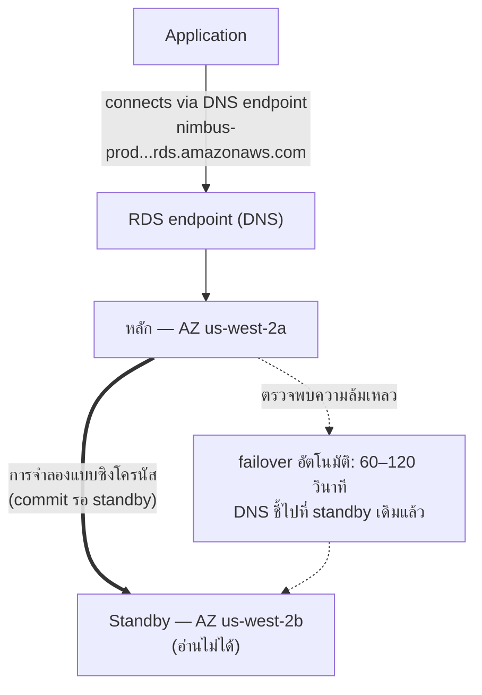

# บทที่ 8: ผู้ดูแลฐานข้อมูลที่ไม่เคยป่วย

ตีสามเมื่อการแจ้งเตือนเข้ามา

Priya เป็นคนเดียวที่ตื่นอยู่ โทรศัพท์ของเธอสว่างขึ้นบนโต๊ะข้างเตียงและเธออ่านมันในความมืด ความสว่างหน้าจอสูงเกินไป เธอลุกขึ้นนั่ง เธอหาแล็ปท็อปได้ด้วยความจำและเปิดมันโดยไม่เปิดไฟ

คีย์บอร์ดคลิกเบา ๆ ในห้องมืด

เซิร์ฟเวอร์ฐานข้อมูลต้องการ security patch — แบบที่ต้องการการรีสตาร์ท ช่องโหว่เป็นของจริง patch พร้อมใช้งาน และหน้าต่างสำหรับการนำมันมาใช้โดยไม่รบกวนลูกค้าคือตอนนี้ ในกลางดึก เมื่อทราฟฟิกต่ำ

เธอเชื่อมต่อกับเซิร์ฟเวอร์ เธอดึง patch เธอนำมันมาใช้

จากนั้นเธออ่านบันทึกการเผยแพร่

การอัปเดตแพ็กเกจแตะไฟล์การกำหนดค่าที่ PostgreSQL ใช้ในการกำหนดพารามิเตอร์การเชื่อมต่อ บันทึกการเผยแพร่มีคำเตือน: ขึ้นอยู่กับว่าการอัปเกรดทำอย่างไร ไฟล์การกำหนดค่าที่กำหนดเองอาจถูกแทนที่ด้วยเวอร์ชันค่าเริ่มต้นของแพ็กเกจ

ไฟล์การกำหนดค่าของพวกเขาถูกกำหนดเอง Leo แก้ไขมันเมื่อสองเดือนก่อนเพื่อปรับการตั้งค่า max_connections

patch รัน เซิร์ฟเวอร์รีสตาร์ท ฐานข้อมูลกลับมาออนไลน์

Priya ทดสอบคำสืบค้น มันทำงาน

เธอตรวจสอบบันทึก ทุกอย่างดูปกติ

เธอกลับไปนอนตอนตี 4:15 น.

ตอน 9:05 น. Leo เปิดแอปพลิเคชันและได้ข้อผิดพลาด เขาตรวจสอบฐานข้อมูล max connections ถูกตั้งเป็นค่าเริ่มต้น: 100 แอปพลิเคชันของพวกเขาถูกกำหนดค่าให้ใช้ connection pool สูงสุด 500

ทุกความพยายามเชื่อมต่อใหม่กำลังล้มเหลว แอปพลิเคชันได้สูญเสียการเข้าถึงฐานข้อมูลไปอย่างมีประสิทธิภาพ

"เกิดอะไรขึ้น?" Maya ถาม

"patch" Priya พูด เธอกำลังดูไฟล์การกำหนดค่าอยู่แล้ว "การอัปเดตแพ็กเกจเขียนทับไฟล์ config ที่กำหนดเองของเราด้วยอันค่าเริ่มต้น การปรับ max_connections ของ Leo หายไปเฉย ๆ — เซิร์ฟเวอร์รีสตาร์ทด้วยการตั้งค่าสต็อกและไม่มีใครได้ข้อผิดพลาด มันถอยกลับไปค่าเริ่มต้นอย่างเงียบ ๆ"

"แก้นานแค่ไหน?" Leo ถาม

"ยี่สิบนาที" Priya พูด "แต่เราต้องการหน้าต่างการบำรุงรักษา นี่ต้องการการเปลี่ยนการกำหนดค่าและการรีสตาร์ท"

"เรามีร้านอาหารเปิดสำหรับมื้อกลางวันในอีกสองชั่วโมง" Tom พูด

Priya แก้มันในสิบแปดนาที หน้าต่างการบำรุงรักษาเป็น downtime จริงสิบสองนาที ร้านอาหารได้รับผลกระทบ แต่พีคยังไม่เริ่ม

ในตอนเช้าเธอบอกทีมว่าเกิดอะไรขึ้น มีความเงียบ

"นั่นจะเกิดขึ้นอีก" Tom พูด

"มันจะเกิดขึ้นทุกครั้งที่มี patch" Priya พูด "และมี patch อยู่เสมอ ต้องมีวิธีที่ดีกว่าในการทำสิ่งนี้"

เวลาสืบค้นแปดวินาทียังไม่ได้รับการแก้ไข และในสัปดาห์เดียวกัน สิ่งนี้: หน้าต่างการบำรุงรักษาตีสามที่กลายเป็นเหตุการณ์ในตอนเช้า ทั้งสองปัญหามีสาเหตุรากเดียวกัน — Nimbus กำลังรันฐานข้อมูลที่พวกเขาไม่ได้มีอุปกรณ์พร้อมในการจัดการ

มีทางออก มันแค่ต้องการการละทิ้งความคิดที่ว่าพวกเขาต้องจัดการฐานข้อมูลเอง

**ปัญหาฐานข้อมูลแบบดั้งเดิม**

เมื่อคุณรันฐานข้อมูลเองบน EC2 instance คุณรับผิดชอบทุกอย่าง

การติดตั้งซอฟต์แวร์ฐานข้อมูล การกำหนดค่ามันอย่างปลอดภัย การ patch มันเมื่อพบช่องโหว่ด้านความปลอดภัย การสำรองข้อมูล การทดสอบว่าข้อมูลสำรองทำงานจริง (ขั้นตอนที่ทีมส่วนใหญ่ข้ามจนกระทั่งสายเกินไป) การมอนิเตอร์พื้นที่ดิสก์ การตั้งค่าการจำลองเพื่อความซ้ำซ้อน การกำหนดค่า failover สำหรับเมื่อเซิร์ฟเวอร์หลักล่ม การปรับประสิทธิภาพคำสืบค้น การจัดการการเชื่อมต่อภายใต้โหลด

ไม่มีสิ่งใดนี้เป็นแอปพลิเคชัน ไม่มีสิ่งใดเพิ่มฟีเจอร์ ทั้งหมดต้องการความเชี่ยวชาญ

ข้อกำหนดเรื่องความเชี่ยวชาญคือประเด็นหลัก ผู้ดูแลฐานข้อมูลที่มีคุณสมบัติเข้าใจไม่ใช่แค่วิธีรันฐานข้อมูล แต่วิธีที่จะ:

- มอนิเตอร์บันทึกคำสืบค้นที่ช้าและระบุคอขวดด้านประสิทธิภาพ
- กำหนดขนาดหน่วยความจำสำหรับ working set เพื่อหลีกเลี่ยง disk I/O
- กำหนดค่าการเก็บถาวร WAL สำหรับการกู้คืน ณ จุดเวลา
- ตั้งค่าการจำลองสตรีมแบบซิงโครนัสพร้อม failover อัตโนมัติ
- ปรับ connection pooling เพื่อป้องกันการหมดการเชื่อมต่อภายใต้โหลด
- นำการอัปเกรดเวอร์ชันหลักมาใช้โดยไม่สูญเสียข้อมูลหรือ downtime ยาวนาน

นี่คือชุดทักษะเฉพาะทางที่แยกออกมา DBA อาวุโสได้เงินเดือนสูงพอดีเพราะการทำสิ่งทั้งหมดนี้ได้ดีนั้นยาก สตาร์ทอัปส่วนใหญ่จ้างเพื่อมันไม่ได้ ทีมพัฒนาส่วนใหญ่ไม่มีมัน

ทีมพัฒนาส่วนใหญ่ไม่ใช่ผู้ดูแลฐานข้อมูล สิ่งนี้สร้างรูปแบบที่คาดเดาได้: ฐานข้อมูลถูกติดตั้ง กำหนดค่าน้อยที่สุด แล้วส่วนใหญ่ถูกลืมจนกระทั่งมีอะไรผิดพลาดอย่างหายนะ Nimbus PostgreSQL instance รันบนการกำหนดค่าเริ่มต้น — max_connections ที่ 100 ไม่มี connection pooling ข้อมูลสำรองด้วยมือที่ Leo รันสองครั้งแล้วลืม และไม่มีการจำลองเลย

เหตุการณ์ patch ตีสามคืออาการของระบบที่รันโดยคนที่ยอดเยี่ยมในการสร้างแอปพลิเคชันและไม่มีพื้นฐานในการดำเนินงานฐานข้อมูล นั่นไม่ใช่คำวิจารณ์ — มันคือคำอธิบายที่ถูกต้องของสตาร์ทอัปส่วนใหญ่ ทางออกไม่ใช่การจ้าง DBA ทางออกคือการใช้บริการที่ให้การดำเนินงานระดับ DBA โดยอัตโนมัติ

"นั่นคือสิ่งที่เราทำหรือเปล่า?" Maya ถาม

คำตอบของ Leo คือความเงียบ ซึ่งเหมือนกับใช่

**ฐานข้อมูลที่มีการจัดการ**

ลองนึกภาพการจ้างผู้ดูแลฐานข้อมูลที่ไม่เคยป่วย จัดการทุก security patch โดยอัตโนมัติ สำรองข้อมูลทุกคืนโดยไม่ต้องบอก และซ่อมตัวเองเมื่อมีอะไรพัง พวกเขาทำทั้งหมดนี้โดยไม่รบกวนคุณ — และพวกเขาไม่เคยแตะตรรกะแอปพลิเคชันของคุณไม่ว่าในกรณีใด

AWS เรียกบริการนี้ว่า **RDS** — Relational Database Service

ด้วย RDS AWS จัดการ:

- การติดตั้งและ patch เอนจินฐานข้อมูล
- ข้อมูลสำรองอัตโนมัติ (เก็บใน S3 เก็บไว้ได้ถึง 35 วัน)
- failover อัตโนมัติ (เมื่อเซิร์ฟเวอร์หลักล่ม standby เข้าทำหน้าที่แทนโดยอัตโนมัติ)
- การมอนิเตอร์และเมตริก
- การเข้ารหัสตอนพักและระหว่างการส่ง
- การปรับขนาดพื้นที่จัดเก็บอัตโนมัติ (ถ้าคุณเปิดใช้งาน ดิสก์โตขึ้นเมื่อมันเต็ม)

คุณจัดการ:

- schema ฐานข้อมูล (โครงสร้างของตารางของคุณ)
- คำสืบค้นและตรรกะแอปพลิเคชันของคุณ
- ใครเข้าถึงฐานข้อมูลได้
- ประเภท instance ใดที่รันฐานข้อมูล
- การปรับพารามิเตอร์ (แม้ว่า RDS ให้ค่าเริ่มต้นที่สมเหตุสมผล)

**เอนจินที่รองรับ**

RDS รองรับเอนจินฐานข้อมูลยอดนิยมหลายตัว:

- **MySQL** — ฐานข้อมูลเชิงสัมพันธ์โอเพนซอร์สที่ใช้กว้างขวางที่สุด
- **PostgreSQL** — ทรงพลัง ขยายได้ ได้รับความนิยมเพิ่มขึ้นสำหรับเวิร์กโหลดที่ซับซ้อน
- **MariaDB** — fork ของ MySQL ที่เป็นโอเพนซอร์ส เข้ากันได้เต็มรูปแบบ
- **Oracle** — ระดับองค์กร ใช้ในองค์กรขนาดใหญ่ที่มีข้อกำหนดเดิม
- **Microsoft SQL Server** — สำหรับสภาพแวดล้อมที่เน้น Windows
- **Amazon Aurora** — เอนจินที่เข้ากันได้กับ MySQL/PostgreSQL ของ AWS เอง สร้างมาเพื่อคลาวด์
  (เราครอบคลุม Aurora อย่างลึกในบทที่ 24)

สำหรับ Nimbus ทางเลือกคือ PostgreSQL มันเป็นสิ่งที่ Leo รู้ และมันจัดการข้อมูลเชิงสัมพันธ์ได้ดี ทางเลือกเอนจินสำคัญน้อยกว่าที่คุณคิดสำหรับแอปพลิเคชันส่วนใหญ่ — ประโยชน์ด้านการดำเนินงานของ RDS ใช้ได้ไม่ว่าจะเลือกอะไร

รายละเอียดหนึ่ง: เมื่อคุณรันเอนจินบน RDS AWS ดูแล patch เวอร์ชันรองโดยอัตโนมัติ (ในระหว่างหน้าต่างการบำรุงรักษาที่คุณกำหนดค่า) การอัปเกรดเวอร์ชันหลัก — ไปจาก PostgreSQL 14 เป็น 15 เป็นต้น — เป็นการดำเนินการด้วยมือที่คุณกำหนดเวลาและดำเนินการ AWS ทดสอบการอัปเกรดเวอร์ชันหลักอย่างระมัดระวัง แต่คุณควรทดสอบพวกมันในสภาพแวดล้อม staging ก่อน การเปลี่ยนเวอร์ชันหลักนำปัญหาความเข้ากันได้กับ syntax SQL เฉพาะ extension หรือเวอร์ชัน driver มาได้

Leo ค้นพบสิ่งนี้เมื่อ RDS นำ patch รองมาใช้และบันทึกแอปพลิเคชันแสดงคำเตือน deprecation สั้น ๆ เกี่ยวกับฟังก์ชันที่ถูกลบใน sub-release patch รองควรโปร่งใสโดยพื้นฐาน — แต่การมอนิเตอร์บันทึกแอปพลิเคชันของคุณหลังจากแต่ละหน้าต่างการบำรุงรักษาเป็นแนวปฏิบัติที่ดี

"เราคิดถึงเรื่องที่จะเกิดขึ้นถ้า patch รองทำอะไรพังหรือยัง?" Priya ถาม

"เรา roll back ไปยัง snapshot ก่อนหน้า" Leo พูด

"นั่นใช้เวลานานแค่ไหน?"

Leo ค้นเวลากู้คืน RDS สำหรับขนาดฐานข้อมูลของพวกเขา สำหรับฐานข้อมูล 50GB บน `db.m6i.large`: ประมาณ 15 ถึง 30 นาทีในการกู้คืนจาก snapshot

"ดังนั้นเรามีหน้าต่างกู้คืน 15-ถึง-30 นาทีถ้า patch ทำให้ production พัง" Priya พูด "และเรานำ patch มาใช้ในหน้าต่างการบำรุงรักษาเช้าตรู่ ดังนั้นอย่างน้อยผลกระทบก็น้อยที่สุด"

"และเราทดสอบ patch ใน staging ก่อน" Leo เสริม

"ใช่" Priya พูด "อันนั้นด้วย"

**การกำหนดขนาด RDS Instance: ไม่ใช่ทุกเวิร์กโหลดที่เท่ากัน**

เมื่อคุณสร้าง RDS instance คุณเลือกประเภท instance — แนวคิดเดียวกับ EC2 แต่จำกัดอยู่ที่เวิร์กโหลดฐานข้อมูล AWS จัดระเบียบประเภท RDS instance เป็นไม่กี่ระดับที่มีประโยชน์

**ตระกูล db.t3**: instance ประสิทธิภาพแบบ burstable ออกแบบสำหรับ development, staging และเวิร์กโหลด production เบาที่ไม่ต้องการ CPU สูงต่อเนื่อง `db.t3.micro` เหมาะสำหรับฐานข้อมูล development ที่มีทราฟฟิกต่ำ `db.t3.medium` จัดการโหลด production ปานกลางพร้อม burst เป็นครั้งคราว

ข้อแลกเปลี่ยนกับ instance ซีรีส์ T: พวกมันสะสมเครดิต CPU ในช่วงที่ใช้งานต่ำและใช้เครดิตเหล่านั้นในระหว่าง burst ถ้าคุณรัน instance ซีรีส์ T ที่ CPU สูงต่อเนื่อง คุณก็หมดเครดิตและประสิทธิภาพถูกจำกัดลงสู่เส้นฐานที่อาจไม่เพียงพอ

**ตระกูล db.m6i**: instance อเนกประสงค์ที่มีประสิทธิภาพสม่ำเสมอ ไม่ burstable `db.m6i.large` เป็นจุดเริ่มต้นที่พบบ่อยสำหรับฐานข้อมูล production พวกนี้ไม่มีขีดจำกัดเครดิต — CPU พร้อมใช้งานเต็มกำลังเมื่อใดก็ตามที่คุณต้องการ

**ตระกูล db.r6i**: instance ที่ปรับเพื่อหน่วยความจำ RAM ต่อ vCPU มากกว่าตระกูล M เหมาะสำหรับฐานข้อมูลที่มี working set ขนาดใหญ่ — คำสืบค้นที่ได้ประโยชน์จากข้อมูลที่อยู่ในหน่วยความจำแทนที่จะดึงจากดิสก์ในทุกการเข้าถึง ถ้าประสิทธิภาพฐานข้อมูลของคุณดีขึ้นอย่างมากเมื่อคุณเพิ่ม RAM ตระกูล R คือทางเลือกที่ถูกต้อง

สำหรับ Nimbus:

- Development และ staging: `db.t3.medium` เพียงพอสำหรับคำสืบค้น development ต้นทุนต่ำ
- Production: `db.m6i.large` ประสิทธิภาพสม่ำเสมอ RAM เพียงพอสำหรับ working set เมนูและออร์เดอร์ ไม่มีการจำกัดเครดิต

"m6i.large แพงกว่า t3.medium แค่ไหน?" Tom ถาม

Leo ตรวจสอบหน้าราคา `db.t3.medium` อยู่ที่ราว ๆ $55/เดือน `db.m6i.large` อยู่ที่ราว ๆ $140/เดือน ความแตกต่างเป็นจริง แต่ความแตกต่างด้านความน่าเชื่อถือก็เป็นจริง

"t3 จะถูกจำกัดภายใต้โหลดต่อเนื่อง" Priya พูด "ถ้าเรามีวันศุกร์ที่ยุ่งและ CPU อยู่สูงสี่ชั่วโมง t3 หมดเครดิตและถูกจำกัด m6i ไม่"

Tom เขียนตัวเลขลงไป เขายังเขียนต้นทุนของการหยุดทำงานวันศุกร์จากสองสัปดาห์ก่อนด้วย การเปรียบเทียบไม่ได้ใกล้เคียงกัน

Production ไปบน `db.m6i.large`

**Multi-AZ: Standby ที่เข้าทำหน้าที่แทน**

นี่คือฟีเจอร์ที่เปลี่ยนการคำนวณความน่าเชื่อถืออย่างสิ้นเชิง

**การ deploy แบบ Multi-AZ** หมายความว่า RDS รักษา standby instance แบบซิงโครนัสไว้ใน Availability Zone ที่ต่างจากเซิร์ฟเวอร์หลัก ทุกธุรกรรมที่ commit ไปยังเซิร์ฟเวอร์หลักถูกจำลองแบบซิงโครนัสไปยัง standby ก่อนที่ commit จะถูกรับทราบ

เมื่อเซิร์ฟเวอร์หลักล้มเหลว — ความล้มเหลวของฮาร์ดแวร์ การหยุดทำงานของ AZ การล่มของซอฟต์แวร์ — RDS ทำ failover ไปยัง standby โดยอัตโนมัติ บันทึก DNS สำหรับ endpoint ฐานข้อมูลถูกอัปเดต แอปพลิเคชันของคุณเชื่อมต่อใหม่กับเซิร์ฟเวอร์หลักตัวใหม่

failover ใช้เวลา 60–120 วินาที ในระหว่างหน้าต่างนั้น แอปพลิเคชันของคุณจะประสบข้อผิดพลาดการเชื่อมต่อ แอปพลิเคชันที่เขียนอย่างเหมาะสมควรจัดการสิ่งนี้อย่างนุ่มนวล (การลองเชื่อมต่อใหม่พร้อม backoff)

standby ไม่ใช่ read replica มันไม่ให้บริการทราฟฟิกการอ่าน จุดประสงค์เดียวของมันคือพร้อมที่จะเข้าทำหน้าที่แทน



(หมายเหตุ: ตัวเลือกการ deploy **Multi-AZ DB Cluster** ที่ใหม่กว่าเก็บ standby *สอง* ตัวที่
**อ่านได้** และทำ failover ใน ~35 วินาที — การสอบอาจแยกแยะมันออกจากการ deploy
แบบ Multi-AZ *instance* คลาสสิกที่อธิบายไว้ตรงนี้)

"Multi-AZ มีต้นทุนเท่าไหร่?" Tom ถาม

ราว ๆ สองเท่าของต้นทุน instance เดียว — เพราะคุณรันฐานข้อมูลสอง instance ตามตัวอักษร standby มีต้นทุนเท่ากับเซิร์ฟเวอร์หลัก

Tom เปิดประวัติออร์เดอร์และประมาณรายได้ต่อชั่วโมงในระหว่างพีควันศุกร์ของพวกเขา

"แล้วถ้ามีคนพยายามบุกรุกในระหว่างหน้าต่าง failover ล่ะ?" Priya ถาม "เมื่อเซิร์ฟเวอร์หลักล่มและ standby กำลังเลื่อนขึ้น มีหกสิบวินาทีที่เราเปิดเผยหรือเปล่า?"

"failover โปร่งใส" Maya พูด "แต่คำถามยุติธรรม connection string ควรใช้ RDS endpoint ไม่ใช่ IP ที่ฮาร์ดโค้ด — ไม่อย่างนั้น failover จะไม่ราบรื่น"

Multi-AZ ถูกเปิดใช้งานในบ่ายวันนั้น

**ข้อมูลสำรองอัตโนมัติและการกู้คืน ณ จุดเวลา**

RDS ทำข้อมูลสำรองอัตโนมัติทุกวัน AWS เก็บข้อมูลสำรองเหล่านี้ใน S3 (จัดการโดย RDS — คุณไม่เห็นมันโดยตรงในคอนโซล S3 ของคุณ) คุณกู้คืนฐานข้อมูลไปยังจุดใด ๆ ภายในช่วงการเก็บรักษาข้อมูลสำรองของคุณได้

ข้อมูลสำรองเกิดขึ้นในระหว่าง **หน้าต่างสำรอง (backup window)** ที่กำหนดค่าได้ — ช่วงเวลาที่ทราฟฟิกต่ำ โดยทั่วไปในเช้าตรู่ (นี่เป็นการตั้งค่าที่แยกจาก **หน้าต่างการบำรุงรักษา (maintenance window)** ซึ่งเป็นเมื่อ RDS นำ patch และการเปลี่ยนการกำหนดค่ามาใช้ การสอบชอบทดสอบว่าทั้งสองเป็นหน้าต่างคนละอัน) สำหรับเอนจินส่วนใหญ่ ข้อมูลสำรองไม่ทำให้เกิด downtime — และบนการ deploy แบบ Multi-AZ snapshot ถูกทำจาก standby ดังนั้นเซิร์ฟเวอร์หลักไม่ถูกแตะเลย

**การกู้คืน ณ จุดเวลา (Point-in-time recovery)** เป็นหนึ่งในฟีเจอร์ที่มีค่าที่สุด: คุณกู้คืนไปยังวินาทีใด ๆ ภายในช่วงการเก็บรักษาของคุณได้ ไม่ใช่แค่ snapshot รายวัน — *วินาทีใดก็ได้* สิ่งนี้เป็นไปได้เพราะ RDS เก็บถาวรบันทึกธุรกรรมอย่างต่อเนื่องนอกเหนือจากข้อมูลสำรองรายวัน

ถ้ามีคนเผลอรัน `DELETE FROM orders WHERE 1=1` ตอน 14:37 น. คุณกู้คืนไปยัง 14:36 น. ได้

Leo ผ่อนคลายอย่างเห็นได้ชัดเมื่อเขาเข้าใจสิ่งนี้

"ผมตั้งการเก็บรักษาข้อมูลสำรองไว้ที่หนึ่งวัน" Leo พูด "อ้อ — แต่นั่นโอเคใช่ไหม? เราเปลี่ยนได้?"

"เปลี่ยนเป็นเจ็ดวันขั้นต่ำ" Priya พูด "สามสิบสำหรับ production"

Leo อัปเดตมันทันที

"เรากู้คืนจากสิ่งที่ผมลบเมื่อเดือนก่อนได้ไหม?" เขาถาม

"ก่อน RDS? ไม่ได้" Priya พูด "หลัง RDS? ได้"

คุณอาจสงสัย: ความแตกต่างระหว่างข้อมูลสำรองอัตโนมัติกับ snapshot ด้วยมือคืออะไร? ข้อมูลสำรองอัตโนมัติถูกลบเมื่อช่วงการเก็บรักษาหมด (สูงสุด 35 วัน) snapshot ด้วยมือถูกเก็บไว้อย่างไม่มีกำหนดจนกว่าคุณจะลบมันอย่างชัดเจน ถ้าคุณต้องเก็บสถานะฐานข้อมูลอย่างถาวร — ก่อนการย้ายใหญ่ ก่อนการ deploy ที่เสี่ยง — ให้ทำ snapshot ด้วยมือ

**RDS Proxy: การแก้ปัญหาการเชื่อมต่อในระดับขนาดใหญ่**

สองสัปดาห์หลังจากย้ายไป RDS Leo สังเกตเห็นบางอย่างในเมตริก

ฐานข้อมูลจัดการคำสืบค้นได้ดี แต่จำนวนการเชื่อมต่อที่เปิดอยู่สูง — สูงกว่าที่เขาคาด เมื่อ Auto Scaling Group เพิ่ม EC2 instance ในระหว่างพีค แต่ละ instance ใหม่เปิด pool การเชื่อมต่อฐานข้อมูลของตัวเอง EC2 instance สิบตัว แต่ละตัวมี connection pool 50: ห้าร้อยการเชื่อมต่อพร้อมกันไปยังฐานข้อมูล

"PostgreSQL มี overhead สำหรับการเชื่อมต่อแต่ละอัน" Priya พูด "หน่วยความจำ CPU สำหรับตัวจัดการการเชื่อมต่อ ห้าร้อยการเชื่อมต่อใช้ทรัพยากรของฐานข้อมูลจำนวนมีนัยสำคัญแค่สำหรับการจัดการการเชื่อมต่อ — ก่อนที่มันจะทำงานจริงเสร็จ"

"เราลดขนาด connection pool ได้ไหม?" Leo ถาม

"เราทำได้" Priya พูด "แต่แล้วเราก็เสี่ยงให้คำขอเข้าคิวรอการเชื่อมต่อในระหว่างพีค"

ทางออกที่ดีกว่า: **RDS Proxy**

RDS Proxy อยู่ระหว่างแอปพลิเคชันกับฐานข้อมูล EC2 instance เชื่อมต่อกับ Proxy ไม่ใช่กับ RDS instance โดยตรง Proxy รักษา pool ของการเชื่อมต่อฐานข้อมูลและ multiplex คำขอแอปพลิเคชันข้ามพวกมัน ถ้า EC2 instance สิบตัวแต่ละตัวเปิดห้าสิบการเชื่อมต่อไปยัง Proxy Proxy อาจรักษาการเชื่อมต่อฐานข้อมูลจริงเพียงหนึ่งร้อย — แชร์พวกมันอย่างมีประสิทธิภาพข้ามคำขอแอปพลิเคชันทั้งหมด

ประโยชน์:

**Connection pooling**: การเชื่อมต่อฐานข้อมูลจริงน้อยลงหมายถึง overhead หน่วยความจำบน RDS instance น้อยลงและประสิทธิภาพภายใต้โหลดดีขึ้น

**failover ที่เร็วกว่า**: ในระหว่าง failover แบบ Multi-AZ Proxy รักษาการเชื่อมต่อฝั่งแอปพลิเคชันในขณะที่สร้างการเชื่อมต่อฐานข้อมูลใหม่ที่ backend แอปพลิเคชันเห็นการหยุดชั่วคราวสั้น ๆ แทนที่จะเป็นการรีเซ็ตการเชื่อมต่อเต็มรูปแบบ RDS Proxy ลดผลกระทบ failover จาก 60–120 วินาทีเหลือโดยทั่วไป 30 วินาทีหรือน้อยกว่า

**การยืนยันตัวตน IAM**: แทนที่จะฝังข้อมูลประจำตัวฐานข้อมูลในแอปพลิเคชัน แอปพลิเคชันยืนยันตัวตนกับ RDS Proxy โดยใช้ IAM role ได้ Proxy จัดการข้อมูลประจำตัวฐานข้อมูลจริง สิ่งนี้ขจัดความลับออกจากสภาพแวดล้อมแอปพลิเคชันอย่างสิ้นเชิง

"RDS Proxy มีต้นทุนเท่าไหร่?" Tom ถาม

มันอยู่ที่ราว ๆ $0.015 ต่อ vCPU-ชั่วโมงของ RDS instance ที่อยู่เบื้องล่าง เรียกเก็บแยกจาก instance เอง สำหรับ `db.m6i.large` (2 vCPU) Proxy เพิ่มประมาณ $22/เดือน

Tom มองกราฟจำนวนการเชื่อมต่อ — ห้าร้อยการเชื่อมต่อแย่งทรัพยากรฐานข้อมูลในระหว่างพีค — และมองต้นทุน $22/เดือน

"นั่นถูกกว่าการอัปเกรดเป็น RDS instance ที่ใหญ่กว่าเพื่อจัดการ overhead การเชื่อมต่อ" เขาพูด

RDS Proxy ถูกเปิดใช้งานในสัปดาห์นั้น

"แล้วถ้ามีคนพยายามบุกรุกผ่าน Proxy ล่ะ?" Priya ถาม "การยืนยันตัวตน IAM สำหรับ Proxy ลดพื้นผิวการโจมตีไหม?"

"ได้" Priya ตอบคำถามของตัวเอง "ไม่มีข้อมูลประจำตัวฐานข้อมูลในสภาพแวดล้อมแอปพลิเคชันหมายความว่าไม่มีข้อมูลประจำตัวฐานข้อมูลให้ขโมยจากแอปพลิเคชัน"

เธอเปิดใช้งานการยืนยันตัวตน IAM สำหรับ Proxy

**Read Replicas: การขยายทราฟฟิกการอ่าน**

Multi-AZ เกี่ยวกับความพร้อมใช้งาน **Read replica** เกี่ยวกับประสิทธิภาพ

read replica คือสำเนาแบบอะซิงโครนัสของฐานข้อมูลหลักของคุณที่ให้บริการคำสืบค้นการอ่านได้ คุณมี read replica ได้ถึง 15 ตัวสำหรับเอนจิน RDS หลัก — MySQL, PostgreSQL และ MariaDB (Aurora รองรับ Aurora Replica ได้ถึง 15 ตัวเช่นกัน แชร์ volume พื้นที่จัดเก็บเดียวกัน)

แอปพลิเคชันถูกปรับให้ส่งคำสืบค้นการอ่านไปยัง replica และคำสืบค้นการเขียนไปยังเซิร์ฟเวอร์หลัก สิ่งนี้กระจายโหลด: เซิร์ฟเวอร์หลักจัดการการเขียนและธุรกรรมที่ซับซ้อน replica จัดการการอ่าน

คุณลักษณะหลัก:

- การจำลองเป็น **แบบอะซิงโครนัส** — อาจมีความล่าช้าเล็กน้อย (lag) ระหว่าง
  เซิร์ฟเวอร์หลักกับ replica ถ้าคุณเขียนบันทึกและอ่านจาก replica ทันที
  คุณอาจยังไม่เห็นมัน
- read replica อยู่ใน Region เดียวกันหรือใน Region ต่างกันได้ (replica ข้าม Region
  เพิ่มความหน่วงแต่เปิดให้มีการกระจายทางภูมิศาสตร์)
- read replica เลื่อนขึ้นเป็นฐานข้อมูลแบบสแตนด์อโลนในสถานการณ์ภัยพิบัติได้

สำหรับ Nimbus: การค้นหาเมนูเป็นการอ่าน ประวัติออร์เดอร์เป็นการอ่าน ทราฟฟิกส่วนใหญ่เป็นทราฟฟิกการอ่าน การเพิ่ม read replica และนำการอ่านไปยังมันตัดโหลดฐานข้อมูลหลักลงอย่างมีนัยสำคัญ

เราครอบคลุม read replica อย่างละเอียดกว่าในบทที่ 24 เมื่อเราพูดถึง Aurora

**ถ้าอ่านหนักก็เพิ่ม Replica แต่ระวัง Lag**

ถ้าเวิร์กโหลดของคุณอ่านหนัก การเพิ่ม read replica ลดโหลดบนเซิร์ฟเวอร์หลักและปรับปรุงประสิทธิภาพคำสืบค้น — แต่การจำลองเป็นแบบอะซิงโครนัส ซึ่งหมายความว่า replica อาจตามหลังเซิร์ฟเวอร์หลักเล็กน้อย ถ้าแอปพลิเคชันของคุณเขียนบันทึกและอ่านมันกลับทันที มันต้องอ่านจากเซิร์ฟเวอร์หลัก ไม่ใช่ replica การทำสิ่งนี้ผิดสร้างบั๊กความสดของข้อมูลที่แยบยลและดีบักยาก: ผู้ใช้สั่งออร์เดอร์ หน้ายืนยันสืบค้น replica replica ยังตามไม่ทัน ออร์เดอร์ดูเหมือนหายไป นี่เรียกว่าความสอดคล้องแบบ read-your-writes และเป็นความผิดพลาดที่พบบ่อยที่สุดที่ทีมทำเมื่อพวกเขาเพิ่ม replica ครั้งแรก

**Performance Insights: การหาคำสืบค้นที่ช้า**

เวลาโหลดเมนูแปดวินาทียังเป็นปัญหา การย้ายไป RDS ปรับปรุงความน่าเชื่อถือ แต่คำสืบค้นยังช้า

Leo เพิ่ม read replica และนำคำสืบค้นเมนูไปยังมัน เวลาโหลดเมนูลดลงเหลือประมาณสี่วินาที ดีขึ้น แต่ยังไม่ดี

"คำสืบค้นยังช้า" Maya พูด "เราปรับปรุงคอขวด แต่เราไม่ได้แก้มัน"

RDS มีฟีเจอร์ที่เรียกว่า **Performance Insights** — เครื่องมือมอนิเตอร์ที่แสดงว่าคำสืบค้นใดบริโภคทรัพยากรฐานข้อมูลมากที่สุด session ใดกำลังรอ และพวกมันรออะไรอยู่

Leo เปิดใช้งาน Performance Insights บน read replica และโหลดหน้าเมนูซ้ำ ๆ ในระหว่างเซสชันทดสอบช่วงบ่าย

แดชบอร์ด Performance Insights แสดงคำสืบค้นหนึ่งครอบงำโหลด: การสแกนตารางเต็มของตาราง `menu_items` ดึงทั้ง 22,000 แถวทุกครั้งที่หน้าเมนูโหลด ไม่มี index บน `restaurant_id` — คอลัมน์ที่แอปพลิเคชันกรองด้วย

เวลาประมวลผลโดยไม่มี index: 8.2 วินาที

Leo เพิ่ม index

```sql
CREATE INDEX idx_menu_items_restaurant_id ON menu_items(restaurant_id);
```

เวลาประมวลผลด้วย index: 14 มิลลิวินาที

8,200 มิลลิวินาทีเป็น 14 มิลลิวินาที ความแตกต่างระหว่างแอปสั่งอาหารร้านอาหารที่ไล่ลูกค้าออกไปกับอันที่พวกเขาใช้โดยไม่ต้องคิด

"นั่นคือปัญหามาตลอดเลยเหรอ?" Maya พูด

"นั่นคือปัญหา" Leo พูด

"และ Performance Insights หามันเจอในเวลานานแค่ไหน?"

"ประมาณยี่สิบนาที"

Tom กำลังคำนวณอยู่แล้ว สามสัปดาห์ของเวลาโหลดเมนูที่ต่ำกว่าเหมาะสม ประมาณ 200,000 การโหลดหน้าเมนูในช่วงนั้น ประมาณ 15% ละทิ้งเนื่องจากความช้า ตัวเลขที่เขาลงเอยทำให้อึดอัด

"เพิ่ม index ที่ขาดก่อนเปิดตัวครั้งหน้า" เขาพูด

"จะมีรายการตรวจสอบ" Priya พูด เธอกำลังเขียนมันอยู่แล้ว

**เมื่อไม่ควรใช้ RDS**

RDS ยอดเยี่ยมสำหรับเวิร์กโหลดฐานข้อมูลเชิงสัมพันธ์หลากหลาย มันไม่ใช่คำตอบที่ถูกต้องสำหรับทุกอย่าง

**เมื่อคุณต้องการการเข้าถึงระดับ OS**: RDS ไม่ให้คุณเข้าถึงระบบปฏิบัติการที่อยู่เบื้องล่าง คุณติดตั้งแพ็กเกจ OS ที่กำหนดเอง ปรับเปลี่ยนพารามิเตอร์ kernel หรือรันเครื่องมือที่ต้องการการเข้าถึง root ไปยังเซิร์ฟเวอร์ฐานข้อมูลไม่ได้ ถ้าฐานข้อมูลของคุณมีข้อกำหนดที่ต้องการการเข้าถึง OS — การกำหนดค่า Oracle บางอย่าง storage driver ที่กำหนดเอง network interface เฉพาะ — คุณต้องรันฐานข้อมูลบน EC2 instance โดยตรง

**เมื่อคุณใช้เอนจินที่ไม่รองรับ**: RDS รองรับ MySQL, PostgreSQL, MariaDB, Oracle, SQL Server และ Aurora ถ้าแอปพลิเคชันของคุณใช้เอนจินฐานข้อมูลอื่น — CockroachDB, SingleStore, Greenplum — คุณรันมันบน EC2 ไม่ใช่ RDS

**เมื่อคุณต้องการการขยายแนวนอนแบบเขียนหนัก**: RDS ขยายการอ่านผ่าน replica การเขียนไปที่เซิร์ฟเวอร์หลักหนึ่งตัว ถ้าเวิร์กโหลดของคุณเขียนหนักและต้องกระจายข้าม write node หลายตัว RDS ไม่ใช่สถาปัตยกรรมที่ถูกต้อง Aurora Global Database ช่วยได้ในระดับขนาดใหญ่ แต่สำหรับข้อกำหนดการเขียนระดับสุดขีด ฐานข้อมูลแบบกระจายเช่น DynamoDB (บทที่ 9) หรือ CockroachDB ที่รันบน EC2 เป็นเครื่องมือที่เหมาะสม

**เมื่อต้นทุนที่มีการจัดการเกินต้นทุนการดำเนินงาน**: สำหรับเวิร์กโหลดที่ใหญ่มาก เสถียร ที่ทีมของคุณมีความเชี่ยวชาญการดูแลฐานข้อมูลแท้จริง การรัน PostgreSQL บน EC2 ด้วยเครื่องมือของตัวเองอาจถูกกว่า RDS สิ่งนี้ผิดปกติสำหรับทีมที่ไม่ใช่ร้าน DBA เป็นหลัก แต่มันเป็นจริง และสถาปนิกที่ดีรับทราบมัน

สำหรับ Nimbus — สตาร์ทอัปที่ไม่มีทรัพยากร DBA เฉพาะ รัน PostgreSQL บนบริการที่มีการจัดการ พร้อมการเติบโตที่คาดเดาไม่ได้ — RDS ชัดเจนว่าเป็นทางเลือกที่ถูกต้อง

**RDS Parameter Groups และ Option Groups**

กลไกการกำหนดค่าสองอย่างปรากฏในการสอบ:

**Parameter group** ควบคุมการตั้งค่าเอนจินฐานข้อมูล — เช่นการเชื่อมต่อสูงสุด ขนาด query cache ค่า timeout RDS สร้าง parameter group เริ่มต้นที่ทำงานได้สำหรับกรณีส่วนใหญ่ คุณสร้าง parameter group ที่กำหนดเองเมื่อคุณต้องปรับการตั้งค่าเฉพาะ

**Option group** เปิดใช้งานฟีเจอร์เพิ่มเติมสำหรับบางเอนจิน — เช่นการเข้ารหัสเครือข่ายแบบ native ของ Oracle หรือ transparent data encryption ของ SQL Server การ deploy เอนจินโอเพนซอร์สส่วนใหญ่ไม่ต้องการ option group ที่กำหนดเอง

คุณปรับแต่งพฤติกรรมของเอนจินฐานข้อมูลผ่านกลไกเหล่านี้ได้ — แต่ค่าเริ่มต้นทำงานได้สำหรับทีมส่วนใหญ่ที่เริ่มต้น

### การนำข้อมูลเข้า: AWS Database Migration Service

ไม่กี่สัปดาห์ต่อมา Tom มาที่ standup พร้อมสไลด์

Nimbus กำลังซื้อกิจการคู่แข่งระดับภูมิภาคขนาดเล็ก ระบบสั่งอาหารของพวกเขารันบนฐานข้อมูล MySQL ในสิ่งอำนวยความสะดวก co-location ระบบออฟไลน์ในระหว่างการย้ายไม่ได้ — ร้านอาหารกำลังใช้มันอยู่

"เราต้องย้ายข้อมูลของพวกเขาเข้า RDS" Tom พูด "โดยไม่ทำให้ระบบล่ม"

"ฐานข้อมูลใหญ่แค่ไหน?" Leo ถาม

"ประมาณ 80 กิกะไบต์"

"พวกเขาต้องตัดสับเปลี่ยนเมื่อไหร่?"

"หกสัปดาห์"

Priya เปิดเอกสารไว้แล้ว "AWS DMS" เธอพูด

**AWS DMS (Database Migration Service)** ย้ายข้อมูลจากฐานข้อมูลต้นทางไปยังฐานข้อมูลปลายทางด้วย downtime น้อยที่สุด มันจัดการการย้ายในสองเฟส: การโหลดเต็มของข้อมูลที่มีอยู่ ตามด้วยการจำลองการเปลี่ยนแปลงอย่างต่อเนื่องในขณะที่ต้นทางยังรันอยู่

มีการย้ายสองประเภท:

**การย้ายแบบ homogeneous:** ต้นทางและปลายทางเป็นเอนจินเดียวกัน — MySQL ไป RDS MySQL, PostgreSQL ไป Aurora PostgreSQL schema เข้ากันได้ DMS ย้ายข้อมูลโดยตรง

**การย้ายแบบ heterogeneous:** ต้นทางและปลายทางเป็นเอนจินต่างกัน — Oracle ไป Aurora PostgreSQL, SQL Server ไป RDS MySQL schema ต้องถูกแปลงก่อน สิ่งนี้ต้องการ **AWS Schema Conversion Tool (SCT)** เพื่อแปล schema จากนั้น DMS เพื่อย้ายข้อมูล

สำหรับการซื้อกิจการของ Nimbus: MySQL ไป RDS MySQL แบบ homogeneous ไม่ต้องการ SCT

วิธีที่มันทำงานในทางปฏิบัติ:

1. DMS อ่านจากต้นทาง — ฐานข้อมูล MySQL ที่ co-location
2. **การโหลดเต็ม**: DMS คัดลอกข้อมูลที่มีอยู่ทั้งหมดไปยัง RDS instance ปลายทาง
3. **CDC (Change Data Capture)**: หลังจากการโหลดเต็ม DMS อ่านบันทึกธุรกรรมของฐานข้อมูลต้นทางและจำลองการเปลี่ยนแปลงที่ดำเนินอยู่ไปยังปลายทางแบบเกือบเรียลไทม์
4. ต้นทางยังรันอยู่ เมื่อทีมพร้อม พวกเขาสลับ connection string

"ดังนั้นระบบสั่งอาหารร้านอาหารยังคงทำงานตลอดเวลา?" Tom ถาม

"ตลอดเวลา" Priya ยืนยัน "ต้นทางและปลายทางอยู่ในซิงค์ผ่าน CDC เมื่อเราพร้อม เราสลับ endpoint downtime คือวินาทีที่ใช้ให้การเปลี่ยนแปลงนั้นแพร่กระจาย"

DMS รองรับการผสมผสานต้นทางและปลายทางหลายสิบแบบ: Oracle, SQL Server, MySQL, PostgreSQL, MongoDB, DynamoDB, S3, Redshift, Aurora และอื่น ๆ

"เดี๋ยวนะ — แต่ *ทำไม* เราถึงต้องการเครื่องมือแยกต่างหากสำหรับการย้ายแบบ heterogeneous?" Maya ถาม "DMS หาความแตกต่างของ schema เองไม่ได้เหรอ?"

"VARCHAR ใน Oracle ไม่เหมือน VARCHAR ใน PostgreSQL" Priya พูด "ประเภทข้อมูล stored procedure sequence ฟังก์ชันกรรมสิทธิ์ — พวกมันไม่แมปแบบหนึ่งต่อหนึ่ง SCT วิเคราะห์ schema ต้นทางและสร้างสิ่งที่เทียบเท่าที่ใกล้ที่สุดสำหรับปลายทาง DMS จากนั้นย้ายข้อมูลลงใน schema ที่แปลงแล้วนั้น การแยกการแปลง schema ออกจากการเคลื่อนย้ายข้อมูลคือสิ่งที่ทำให้กระบวนการน่าเชื่อถือ"

"แล้วถ้ามีคนพยายามบุกรุกผ่าน DMS replication instance ล่ะ?" Priya ถามตัวเองสักครู่ต่อมา "มันต้องการสิทธิ์อ่านต้นทางและสิทธิ์เขียนปลายทาง"

"สิทธิ์ขั้นต่ำทั้งสองฝั่ง" Leo พูด "IAM อ่านอย่างเดียวบนต้นทาง สิทธิ์เขียนจำกัดเฉพาะเป้าหมายการย้ายเท่านั้น และ replication instance อยู่ใน private subnet"

Priya เขียนมันลงไป

## จุดแข็งและข้อจำกัด

**ทำไม RDS จึงยอดเยี่ยม**:

- ขจัดภาระการดำเนินงานในการจัดการซอฟต์แวร์ฐานข้อมูล
- ข้อมูลสำรองอัตโนมัติและการกู้คืน ณ จุดเวลา
- Multi-AZ สำหรับ failover อัตโนมัติด้วย RTO น้อยที่สุด
- read replica สำหรับการขยายทราฟฟิกการอ่าน
- การเข้ารหัสตอนพักและระหว่างการส่งในตัว
- รองรับเอนจินฐานข้อมูลเชิงสัมพันธ์หลักทั้งหมด
- RDS Proxy สำหรับ connection pooling และการตอบสนอง failover ที่ดีขึ้น

**ที่ซึ่ง RDS มีขีดจำกัด**:

- คุณเข้าถึง OS ที่อยู่เบื้องล่างไม่ได้ ถ้าฐานข้อมูลของคุณมีข้อกำหนดที่ต้องการ
  การเข้าถึงระดับ OS คุณอาจต้องรันฐานข้อมูลที่ใช้ EC2 ของตัวเอง
- RDS ไม่ใช่ serverless (โดยมีข้อยกเว้น — Aurora Serverless มีอยู่ ครอบคลุมใน
  บทที่ 24) คุณจ่ายค่า instance ที่กำลังรันแม้ว่ามันจะว่าง
- RDS ไม่ได้ออกแบบสำหรับฐานข้อมูลที่ sharded แนวนอน สำหรับการขยายออกในระดับมหึมา
  ของเวิร์กโหลดเชิงสัมพันธ์ที่เขียนหนัก คุณอาจต้องการสถาปัตยกรรมที่ต่างออกไปในที่สุด
- สำหรับรูปแบบข้อมูลที่ไม่ใช่เชิงสัมพันธ์ (NoSQL) DynamoDB (บทที่ 9) เหมาะสมกว่า

## สรุป

หน้าต่าง patch ตีสามของ Priya คืออาการ สาเหตุรากคือ Nimbus กำลังจัดการฐานข้อมูลที่บริการที่มีการจัดการจัดการได้ดีกว่า RDS ไม่ได้แค่ขจัดการปลุกตื่นตอนตีสาม — มันย้ายความรับผิดชอบสำหรับการ patch failover ข้อมูลสำรอง และการจัดการการเชื่อมต่อไปยัง AWS ปลดปล่อยทีมให้มุ่งเน้นที่โค้ดแอปพลิเคชันที่ให้บริการลูกค้าจริง ข้อแลกเปลี่ยนคือการสูญเสียการเข้าถึงระดับ OS ซึ่งสำคัญน้อยและน้อยกว่าที่ฟังดูมาก

- **Amazon RDS** เป็นบริการฐานข้อมูลเชิงสัมพันธ์ที่มีการจัดการ AWS จัดการการ patch ข้อมูลสำรอง failover และพื้นที่จัดเก็บ คุณจัดการ schema คำสืบค้น และตรรกะแอปพลิเคชัน
- **Multi-AZ** รักษา standby แบบซิงโครนัสไว้ใน AZ ต่างกัน failover อัตโนมัติเกิดขึ้นใน 60–120 วินาที ใช้ชื่อ DNS ของ RDS endpoint ใน connection string เสมอ — ไม่ใช่ IP ที่ฮาร์ดโค้ด — เพื่อให้ failover โปร่งใส
- **Read replica** เป็นสำเนาแบบอะซิงโครนัสที่ให้บริการทราฟฟิกการอ่าน lag การจำลองหมายความว่าพวกมันอาจตามหลังเล็กน้อย — ความสอดคล้องแบบ read-your-writes ต้องการการอ่านจากเซิร์ฟเวอร์หลักทันทีหลังการเขียน
- **RDS Proxy** รวม pool การเชื่อมต่อ ลด overhead และปรับปรุงความเร็ว failover สำคัญสำหรับเวิร์กโหลดที่ใช้ Lambda ที่สร้างการเชื่อมต่ออายุสั้นได้หลายพันอัน
- **Performance Insights** ระบุคำสืบค้นที่ช้า — การหา index ที่ขาดเปลี่ยนคำสืบค้น 8 วินาทีเป็น 14 มิลลิวินาทีได้ การอัปเกรดเวอร์ชันหลักทำด้วยมือ ทดสอบใน staging ก่อน

## เคล็ดลับการสอบ

*SAA-C03 Domain 3 — Task 3.3 (โซลูชันฐานข้อมูล)*

- **Multi-AZ มีไว้สำหรับความพร้อมใช้งานสูง ไม่ใช่ประสิทธิภาพ** standby ไม่ให้บริการ
  ทราฟฟิกการอ่าน read replica มีไว้สำหรับประสิทธิภาพ ความแตกต่างนี้ถูกทดสอบบ่อย
- **failover ของ Multi-AZ เป็นอัตโนมัติ** คุณไม่ได้กำหนดค่าว่ามันเกิดขึ้นเมื่อไหร่หรืออย่างไร
  RDS มอนิเตอร์เซิร์ฟเวอร์หลักและกระตุ้น failover โดยอัตโนมัติ
- **lag การจำลองสำคัญ** read replica อาจตามหลังเซิร์ฟเวอร์หลักเล็กน้อย
  ถ้าแอปพลิเคชันของคุณต้องการอ่านข้อมูลที่เพิ่งเขียน มันต้องอ่านจาก
  เซิร์ฟเวอร์หลัก ไม่ใช่ replica นี่เรียกว่า "ความสอดคล้องแบบ read-your-writes"
- **ข้อมูลสำรองอัตโนมัติถูกเก็บไว้ 0–35 วัน** การตั้งการเก็บรักษาเป็น 0
  ปิดใช้งานข้อมูลสำรองอัตโนมัติ snapshot ด้วยมือถูกเก็บไว้อย่างไม่มีกำหนดจนกว่า
  คุณจะลบมัน
- **การปรับขนาดพื้นที่จัดเก็บอัตโนมัติของ RDS** ป้องกันการหยุดทำงานจากดิสก์เต็ม เปิดใช้งานมัน มันปรับขนาด
  ขึ้นเท่านั้น ไม่เคยลง การสอบอาจทดสอบว่าคุณรู้ความไม่สมมาตรนี้หรือไม่
- **RDS Proxy** ปรากฏในสถานการณ์การสอบที่เกี่ยวข้องกับฟังก์ชัน Lambda ที่เชื่อมต่อกับ RDS
  (Lambda สร้างการเชื่อมต่ออายุสั้นได้หลายพันอัน ซึ่งท่วม
  ฐานข้อมูลโดยไม่มี Proxy) หรือสถานการณ์ที่ต้องการ failover แบบ Multi-AZ ที่เร็วกว่า
- **instance db.t3 burst และถูกจำกัด** สถานการณ์การสอบที่อธิบายการเสื่อมประสิทธิภาพ
  เป็นช่วง ๆ บน RDS instance ขนาดเล็กอาจกำลังอธิบายการหมดเครดิต CPU
  บน instance ซีรีส์ T การแก้คือการอัปเกรดเป็น instance ซีรีส์ M หรือ R
- **DNS endpoint ของ Multi-AZ**: เมื่อ failover แบบ Multi-AZ เกิดขึ้น บันทึก DNS
  ของ RDS endpoint ถูกอัปเดตให้ชี้ไปที่เซิร์ฟเวอร์หลักตัวใหม่ แอปพลิเคชันที่ใช้ RDS endpoint
  (ไม่ใช่ IP ที่ฮาร์ดโค้ด) เชื่อมต่อใหม่โดยอัตโนมัติ แอปพลิเคชันที่มี DNS TTL ยาวหรือ
  ที่อยู่ IP ที่ฮาร์ดโค้ดจะไม่เชื่อมต่อใหม่โดยอัตโนมัติ ใช้ RDS endpoint เสมอ
- **การเลื่อน read replica ขึ้น**: read replica เลื่อนขึ้นเป็น DB instance แบบสแตนด์อโลนได้
  — มีประโยชน์สำหรับการกู้คืนจากภัยพิบัติถ้าเซิร์ฟเวอร์หลักสูญหายและไม่ได้กำหนดค่า Multi-AZ
  การเลื่อนขึ้นเป็นการดำเนินการทางเดียว: replica กลายเป็นเซิร์ฟเวอร์หลักและไม่ได้
  จำลองจากต้นฉบับอีกต่อไป สถานการณ์การสอบที่ถามเกี่ยวกับ "การเลื่อนขึ้นด้วยมือ" หรือ
  "การแปลง read replica เป็นเซิร์ฟเวอร์หลัก" เกี่ยวข้องกับการดำเนินการนี้
- **Performance Insights** ระบุคำสืบค้น SQL อันดับต้นตามเวลารอและการใช้ CPU
  เมื่อสถานการณ์การสอบถามว่าจะวินิจฉัยคำสืบค้นที่ช้าบนฐานข้อมูล RDS อย่างไร Performance
  Insights คือคำตอบที่เป็น AWS-native
- **RDS กับการรันฐานข้อมูลบน EC2**: การสอบบางครั้งนำเสนอสิ่งนี้เป็นทางเลือก
  RDS ให้การดำเนินงานที่มีการจัดการแต่จำกัดการเข้าถึงระดับ OS ฐานข้อมูลที่ใช้ EC2 ให้
  คุณควบคุมเต็มรูปแบบแต่ต้องการความเชี่ยวชาญ DBA สำหรับการดำเนินงาน วลี "ต้องการการเข้าถึงระดับ OS"
  ในสถานการณ์การสอบเป็นสัญญาณให้เลือก EC2 เหนือ RDS
- **AWS DMS:** ย้ายฐานข้อมูลด้วย downtime น้อยที่สุดโดยใช้การโหลดเต็ม + CDC แบบ homogeneous (เอนจินเดียวกัน) = DMS โดยตรง แบบ heterogeneous (เอนจินต่างกัน) = SCT เพื่อแปลง schema ก่อน จากนั้น DMS เพื่อย้ายข้อมูล ตัวกระตุ้นการสอบ: "ย้ายฐานข้อมูลด้วย downtime น้อยที่สุด" หรือ "Oracle ไป Aurora" → DMS + SCT

## แบบฝึกหัด

**แบบฝึกหัด 1 — การจำ**

ด้วยคำพูดของคุณเอง: ความแตกต่างระหว่าง Multi-AZ กับ read replica ใน RDS คืออะไร? แต่ละอันแก้ปัญหาอะไร?

*(คำใบ้: อันหนึ่งป้องกัน downtime อีกอันปรับปรุงประสิทธิภาพภายใต้โหลดที่อ่านหนัก พวกมันแก้ปัญหาคนละอย่างและใช้ร่วมกันได้)*

**แบบฝึกหัด 2 — สถานการณ์ SAA-C03**

*สถานการณ์*: บริษัทรันฐานข้อมูล PostgreSQL production บน RDS ฐานข้อมูลประสบทราฟฟิกการอ่านสูงเนื่องจากคำสืบค้นรายงานที่รันตลอดทั้งวัน ทีมยังกังวลเกี่ยวกับความพร้อมใช้งานของฐานข้อมูล — พวกเขาทน downtime ได้ไม่เกินไม่กี่นาทีในสถานการณ์ความล้มเหลว พวกเขาต้องการลดผลกระทบต่อฐานข้อมูลหลักจากเวิร์กโหลดรายงานให้น้อยที่สุด

ชุดของฟีเจอร์ RDS ใดตอบสนองข้อกังวลทั้งสองได้ดีที่สุด?

A) เปิดใช้งาน Multi-AZ และรันคำสืบค้นทั้งหมดกับ standby instance  
B) ทำ snapshot ด้วยมือบ่อยขึ้นและกู้คืนจากพวกมันถ้าเซิร์ฟเวอร์หลักล้มเหลว  
C) สร้าง read replica หลายตัวและปิดใช้งาน Multi-AZ เพื่อลดต้นทุน  
D) เปิดใช้งาน Multi-AZ สำหรับการป้องกัน failover และสร้าง read replica สำหรับคำสืบค้นรายงาน

**คำใบ้ 1**: ข้อกำหนดสองอย่างคือ: (1) ความพร้อมใช้งานในระหว่างความล้มเหลว (2) การถ่ายภาระการอ่าน ฟีเจอร์ใดตอบสนองข้อกำหนดใด?

**คำใบ้ 2**: Multi-AZ ให้ failover อัตโนมัติ standby ไม่ให้บริการทราฟฟิกการอ่าน ดังนั้น Multi-AZ เพียงอย่างเดียวไม่ช่วยกับปัญหาการอ่าน

**คำใบ้ 3**: read replica ให้บริการทราฟฟิกการอ่าน Multi-AZ ให้ failover คุณต้องการทั้งสอง

**คำตอบ**: D

**คำอธิบาย**: Multi-AZ ให้ failover อัตโนมัติไปยัง standby ใน AZ ต่างกัน — สิ่งนี้ตอบสนองข้อกำหนดความพร้อมใช้งาน read replica ให้คำสืบค้นรายงานรันได้โดยไม่กระทบฐานข้อมูลหลัก — สิ่งนี้ตอบสนองข้อกำหนดด้านประสิทธิภาพ ทั้งสองฟีเจอร์ใช้พร้อมกันได้

**ทำไมไม่ใช่ A?** standby ของ Multi-AZ ให้บริการทราฟฟิกการอ่านไม่ได้ มันมีไว้สำหรับ failover โดยเฉพาะ การพยายามสืบค้นมันโดยตรงไม่ได้รับการรองรับ

**ทำไมไม่ใช่ B?** snapshot ด้วยมือกู้คืนสำเนาเต็มของฐานข้อมูล — กระบวนการที่นานกว่ามาก (อาจหลายชั่วโมงสำหรับฐานข้อมูลขนาดใหญ่) สิ่งนี้ไม่ตอบสนองข้อกำหนด "downtime ไม่กี่นาที"

**ทำไมไม่ใช่ C?** read replica ช่วยกับประสิทธิภาพการอ่านแต่ไม่ให้ failover อัตโนมัติ ถ้าเซิร์ฟเวอร์หลักล้มเหลว คุณต้องเลื่อน read replica ขึ้นด้วยมือ — ซึ่งใช้เวลาและไม่อัตโนมัติ

*SAA-C03 Domain 3 — Task 3.3*

**แบบฝึกหัด 3 — ความท้าทายด้านสถาปัตยกรรม** *(ตัวเลือกเสริม)*

Nimbus กำลังพิจารณาย้ายฐานข้อมูล PostgreSQL ที่จัดการเองที่มีอยู่ (รันบน EC2 instance) ไปยัง RDS PostgreSQL การย้ายต้องเกิดขึ้นด้วย downtime น้อยที่สุด — ในอุดมคติต่ำกว่า 15 นาที ฐานข้อมูลมีขนาด 200 GB

คุณจะแนะนำแนวทางใด? AWS service ใดอาจช่วยกับการย้าย? คุณจะทดสอบความเสี่ยงใดก่อนตัดสับเปลี่ยนทราฟฟิก production?

*(ไม่มีคำตอบที่ถูกต้องเพียงคำตอบเดียว คิดถึง AWS Database Migration Service การจำลองเชิงตรรกะ และความเสี่ยงของความไม่สอดคล้องของข้อมูลในระหว่างการตัดสับเปลี่ยน)*

## ฉากหลังเครดิต

เมื่อจบวัน Nimbus ได้ย้ายไป RDS PostgreSQL พร้อมเปิดใช้งาน Multi-AZ การย้ายเองใช้เวลาเกือบทั้งบ่าย — Leo ใช้แนวทาง backup-and-restore พร้อมหน้าต่างการบำรุงรักษาสั้น ๆ

Tom เฝ้าดูบิลอย่างระมัดระวัง

"RDS instance" เขาพูด "มีต้นทุนสองเท่าของฐานข้อมูล EC2"

"แล้วข้อมูลสำรองอัตโนมัติล่ะ?" Maya ถาม

"มากกว่านิดหน่อย"

"แล้ว failover ที่เราจะได้ฟรีถ้าเซิร์ฟเวอร์หลักตายล่ะ?"

Tom ไม่มีราคาสำหรับสิ่งนั้น เขาเขียนมันลงไปเป็นคำถาม

สามวันต่อมา ฐานข้อมูลแข็งแรง เวลาสืบค้นลดลงอย่างมากหลังจาก Leo เพิ่ม index ที่ขาด เมนูโหลดในเวลาต่ำกว่าหนึ่งวินาที

"ปัญหา" Priya พูด "ไม่ใช่เอนจินฐานข้อมูล มันคือโมเดลข้อมูล"

เธอหยุด

"ข้อมูลบางส่วนนี้ไม่ใช่เชิงสัมพันธ์เลย รายการเมนู โปรไฟล์ร้านอาหาร โซนการจัดส่ง — ข้อมูลนี้มีรูปร่างที่ผันแปร SQL กำลังต่อสู้กับเรา"

Leo กำลังค้นคว้าอะไรบางอย่างอยู่แล้ว

"ถ้าเราใช้ฐานข้อมูลชนิดต่างกันสำหรับเมนูล่ะ?" เขาพูด

ในบทถัดไป: ฐานข้อมูลที่ไม่ช้าลง แม้เมื่อคนล้านคนสั่งพร้อมกัน
