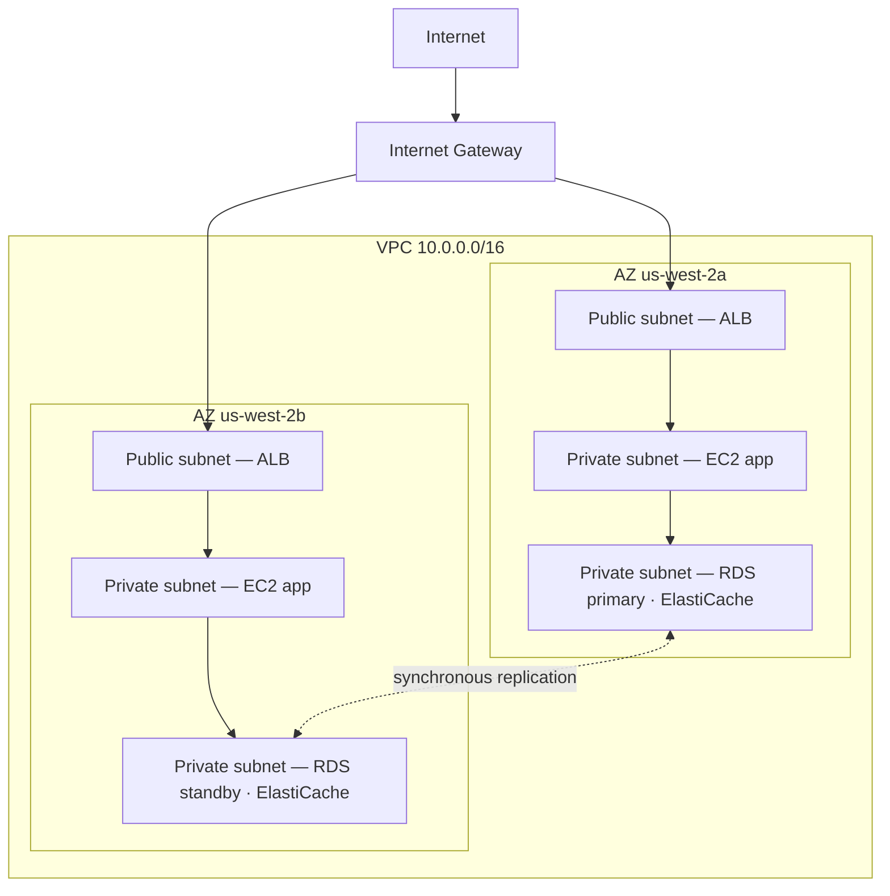

# บทที่ 11: มุมส่วนตัวของคุณในคลาวด์

Priya มีกระดาษแผ่นหนึ่งที่มีภาพวาดอยู่

ไม่ใช่ภาพวาดที่ซับซ้อน สี่เหลี่ยมผืนผ้าที่มีป้ายว่า "AWS" ภายในสี่เหลี่ยมผืนผ้ามีกล่องหลายใบรวมกัน: EC2 instances, ฐานข้อมูล RDS, คลัสเตอร์ ElastiCache เส้นที่เชื่อมทุกอย่างเข้ากับทุกอย่าง และนอกสี่เหลี่ยมผืนผ้า มีป้ายเดียว: "Internet"

เธอวางมันไว้ตรงกลางโต๊ะ

---

*caching layer ทำงานได้ Redis ตัดการโหลดหน้าจาก 188 มิลลิวินาทีเป็น 12 แต่ขณะที่ Leo กำลังฉลองชัยชนะนั้น Priya กำลังอ่าน network log — และเธอไม่ชอบสิ่งที่เห็น ทุกบริการอยู่บนเครือข่ายแบนเดียวกัน ฐานข้อมูลมี IP สาธารณะ คลัสเตอร์ Redis เข้าถึงได้จากภายนอกในทางเทคนิค แอปพลิเคชันทำงานได้ แต่สถาปัตยกรรมเป็นเหมือนลานจอดรถ: ไม่มีรั้ว ไม่มีประตู ไม่มีโซน*

---

"นี่คือสิ่งที่เรามี" เธอพูด "ฐานข้อมูลของเรามี IP สาธารณะ ชั้น cache ของเราเข้าถึงได้จากอินเทอร์เน็ต EC2 instances ของเราทั้งหมดอยู่บนเครือข่ายแบนเดียวกัน"

"ฟังดูโอเค" Leo พูด "เรามี security group"

"Security group ที่คุณกำหนดค่า" Priya พูด "ตอนกลางคืน ระหว่างการตั้งค่าเริ่มต้น"

Leo ไม่พูดอะไร

"ฉันไม่ได้วิจารณ์การกำหนดค่า" เธอพูด "ฉันกำลังบอกว่าเมื่อทุกอย่างอาศัยอยู่บนเครือข่ายสาธารณะแบน การกำหนดค่าผิดเพียงครั้งเดียวคือความแตกต่างระหว่างระบบที่ทำงานกับระบบที่ทุกคนบนอินเทอร์เน็ตเข้าถึงได้"

เธอหยิบปากกาเมจิกสีแดงขึ้นมาและวาดวงกลมรอบฐานข้อมูล

"นี่ไม่ควรเข้าถึงได้จากอินเทอร์เน็ต เลย ไม่ผ่านกฎ security group ไม่ผ่าน configuration ที่แข็งแกร่ง มันควรเข้าถึงไม่ได้เชิงโครงสร้าง"

"เราต้องคุยเรื่องสถาปัตยกรรมเครือข่าย" Maya พูด

"เราจำเป็นต้องคุยเรื่องนี้ตั้งแต่สามเดือนที่แล้ว" Priya พูด "แต่ตอนนี้ก็โอเค"

ทีมรวมตัวกันรอบไวท์บอร์ดเป็นครั้งแรกในรอบหลายสัปดาห์

**ปัญหากับลานจอดรถที่เปิดโล่ง**

ลองนึกภาพลานจอดรถสาธารณะขนาดใหญ่ รถหนึ่งหมื่นคัน รถคันไหนก็จอดที่ไหนก็ได้ ไม่มีสิ่งกีดขวางระหว่างโซน ไม่มีประตู ไม่มีส่วนที่จองไว้

นี่คือเครือข่ายที่เปิด ทุกบริการเข้าถึงทุกบริการอื่นได้ web server ของคุณคุยกับฐานข้อมูลของคุณได้ ฐานข้อมูลของคุณเข้าถึงอินเทอร์เน็ตได้ caching layer ของคุณรับการเชื่อมต่อจากที่ไหนก็ได้

เมื่อทุกอย่างคุยกับทุกอย่างได้ การถูกบุกรุกครั้งหนึ่งกระทบทุกอย่าง

"ดังนั้นถ้ามีคนบุกเข้าลานจอดรถ" Tom พูด "พวกเขาเดินเข้าไปในรถคันไหนก็ได้"

"และจากรถคันไหนก็ขับไปไหนก็ได้" Priya ยืนยัน "เราต้องการรั้ว เราต้องการประตูที่ล็อก เราต้องการโซน"

VPC คือวิธีที่คุณสร้างโซนเหล่านั้นใน AWS

**VPC คืออะไร?**

"เดี๋ยว — แต่ *ทำไม* เราถึงทำแบบนั้น?" Maya ถาม "ถ้าเรามี security group บนทุกทรัพยากรอยู่แล้ว ทำไมเราต้องการ VPC? security group ไม่ได้ทำงานเดียวกันหรือ?"

security group และ VPC ปกป้องที่ระดับต่างกัน security group คือกฎที่แนบกับทรัพยากรเฉพาะ — มันบอกว่า "EC2 instance นี้รับ traffic เฉพาะบนพอร์ต 8080 จาก load balancer" แต่มันยังอยู่บนเครือข่ายสาธารณะ IP address ยังเข้าถึงได้; กฎแค่บล็อกการเชื่อมต่อที่ประตู VPC เอาประตูออกจากถนนสาธารณะทั้งหมด ทรัพยากรใน private subnet ไม่มี *เส้นทาง* ไปยังอินเทอร์เน็ต — และตามธรรมเนียมไม่มี IP สาธารณะ — ดังนั้นมันเข้าถึงไม่ได้จากอินเทอร์เน็ต ไม่ว่า security group จะว่าอย่างไร นั่นคือการรับประกันเชิงโครงสร้าง ไม่ใช่เชิง configuration

**Virtual Private Cloud (VPC)** คือส่วนที่แยกออกจากกันเชิงตรรกะของ AWS cloud — เครือข่ายส่วนตัวที่คุณกำหนด ซึ่งเฉพาะทรัพยากรของคุณเท่านั้นที่เข้าถึงได้โดยค่าเริ่มต้น

คิดว่ามันเป็นลานส่วนตัวที่มีรั้วภายในลานจอดรถสาธารณะขนาดใหญ่ ลานของคุณมีกฎของตัวเอง: ใครเข้าได้ ใครออกได้ เส้นทางอะไรมีอยู่ระหว่างส่วนต่าง ๆ

เมื่อคุณสร้าง VPC คุณกำหนด:

**บล็อก CIDR**: ช่วงของ IP address ที่มีอยู่ภายในเครือข่ายของคุณ ตัวอย่างเช่น `10.0.0.0/16` ให้คุณ IP address ที่เป็นไปได้ 65,536 อัน (10.0.0.0 ถึง 10.0.255.255)

**Subnets**: การแบ่งย่อยของ VPC แต่ละอันได้รับส่วนหนึ่งของช่วง IP address และเชื่อมโยงกับ Availability Zone เฉพาะ

**Route tables**: กฎที่กำหนดว่า network traffic ไปที่ไหน

**Internet Gateway**: การเชื่อมต่อระหว่าง VPC ของคุณและอินเทอร์เน็ตสาธารณะ

**Subnets: สาธารณะ vs ส่วนตัว**

ไม่ใช่ทุกทรัพยากรควรเข้าถึงได้แบบสาธารณะ

web server ของคุณต้องรับ traffic จากอินเทอร์เน็ต — เบราว์เซอร์ของผู้ใช้ต้องเข้าถึงมันได้

ฐานข้อมูลของคุณ *ไม่ควร* รับ traffic จากอินเทอร์เน็ตเลย — เฉพาะ web server ของคุณเท่านั้นที่ควรคุยกับมันได้

นี่คือที่ที่ subnet เข้ามา

**public subnet** เชื่อมต่อกับ Internet Gateway และสามารถมีทรัพยากรที่มี IP สาธารณะ traffic ไหลไปและมาจากอินเทอร์เน็ตได้

**private subnet** ไม่มีเส้นทางไปยังอินเทอร์เน็ตใน route table ของมัน ทรัพยากรใน private subnet สื่อสารได้เฉพาะกับทรัพยากรอื่นใน VPC ของคุณ (เว้นแต่คุณตั้งเส้นทาง outbound เฉพาะ) ตามธรรมเนียม พวกมันไม่มี IP สาธารณะด้วย

สำหรับ Nimbus การออกแบบชัดเจน:



load balancer หันหน้าสู่สาธารณะ — มันต้องรับ traffic จากอินเทอร์เน็ต EC2 instances เป็น private — พวกมันรับ traffic จาก load balancer เท่านั้น ฐานข้อมูลเป็น private — พวกมันรับ traffic จาก EC2 instances เท่านั้น

"ดังนั้นเพื่อเข้าถึงฐานข้อมูล" Tom พูด "มีคนต้องผ่าน load balancer แล้วผ่าน EC2 instance แล้วผ่าน security group ของฐานข้อมูล?"

"สามชั้น" Priya ยืนยัน "Defense in depth"

---

**แผน CIDR ของ Nimbus**

"เดี๋ยว — แต่ *ทำไม* เราถึงทำแบบนั้น?" Maya ถาม มองที่ตัวเลือกบล็อก CIDR "ทำไม Priya ถึงเจาะจงมากเรื่องช่วง IP address? เราใช้ค่าเริ่มต้นของ AWS ไม่ได้หรือ?"

"เพราะบล็อก CIDR เปลี่ยนทีหลังยากมาก" Priya พูด "และเพราะถ้าเราเชื่อม VPC นี้กับ VPC อื่น หรือกับเครือข่าย on-premises ช่วง IP ที่ซ้อนทับกันทำให้เกิด routing failure ที่ดีบั๊กเจ็บปวด"

เธอวาดแผนบนไวท์บอร์ด

VPC ของ Nimbus: `10.0.0.0/16` — 65,536 address รวม

| Subnet | CIDR | AZ | วัตถุประสงค์ |
|---|---|---|---|
| Public A | 10.0.0.0/24 | us-west-2a | Load balancers |
| Public B | 10.0.1.0/24 | us-west-2b | Load balancers |
| Private App A | 10.0.10.0/24 | us-west-2a | EC2 app servers |
| Private App B | 10.0.11.0/24 | us-west-2b | EC2 app servers |
| Private Data A | 10.0.20.0/24 | us-west-2a | RDS, ElastiCache |
| Private Data B | 10.0.21.0/24 | us-west-2b | RDS, ElastiCache |

"ทำไมไม่ทำทุกอย่างเป็น /16?" Leo ถาม

"เพราะ subnet ใน AZ ต่างกันไม่ควรใช้ address space ร่วมกัน แต่ละ subnet อยู่ใน AZ เดียว ถ้าเรา peer VPC นี้กับ VPC อื่น ยิ่งเราละเอียดมากเท่าไร เรายิ่งมีโอกาสขัดแย้งน้อยลง และแต่ละ /24 ให้ address ที่ใช้ได้ 251 อัน — มากพอสำหรับ tier เดียวใด ๆ"

"AWS สำรอง address ห้าอันในแต่ละ subnet" Tom สังเกต มองที่เอกสาร "นั่นคือเหตุผลที่เป็น 251 ไม่ใช่ 256"

"ถูกต้อง สี่อันแรกและอันสุดท้าย Network address, VPC router, DNS server, การใช้ในอนาคต, broadcast"

"ดังนั้น /24 คือเล็กที่สุดที่คุณจะลงไปถึง?"

"ในทางปฏิบัติ คุณจะใช้ /28 สำหรับ subnet เล็กมาก — เช่น subnet ของ VPN gateway ซึ่งต้องการ IP แค่ไม่กี่อัน แต่สำหรับ application tier /24 เป็นขั้นต่ำที่สมเหตุสมผล"

Tom จดตัวเลขลงไปและคำนวณความแตกต่างของต้นทุนรายเดือนระหว่างขนาด เขาทำเสมอ

---

**ความผิดพลาดในการวางแผน CIDR ที่ควรหลีกเลี่ยง**

"เราคิดเรื่องว่าจะเกิดอะไรขึ้นถ้าเราโตเกิน subnet หรือยัง?" Priya ถาม เธอไม่ได้ถามเพราะไม่รู้ เธอถามเพราะทีมที่เหลือต้องซึมซับคำตอบ

Leo คิดเกี่ยวกับมัน "เราเพิ่ม subnet ได้?"

"คุณเพิ่ม subnet ให้ VPC ได้ แต่คุณ resize subnet ที่มีอยู่ไม่ได้ ถ้า private app subnet ของคุณเต็ม — 251 address ไม่พอ — คุณต้องสร้าง subnet ใหม่และย้าย instance ไปยังมัน"

"เกิดขึ้นบ่อยแค่ไหนจริง ๆ?"

"นาน ๆ ครั้ง ถ้าคุณวางแผนดี แต่คนทำความผิดที่พบบ่อยสามอย่าง"

เธอแจกแจงมัน:

**ความผิดที่หนึ่ง**: ใช้ VPC CIDR ที่เล็กเกินไป ถ้าคุณใช้ `10.0.0.0/24` สำหรับทั้ง VPC (254 address) คุณจะหมดพื้นที่ก่อนที่จะวางแผน subnet เสร็จ เริ่มด้วย `/16` เพื่อความยืดหยุ่น

**ความผิดที่สอง**: ใช้ CIDR ที่ซ้อนทับกันข้าม VPC ถ้า production VPC ของคุณคือ `10.0.0.0/16` และ staging VPC ของคุณก็เป็น `10.0.0.0/16` ด้วย คุณจะ peer หรือเชื่อมพวกมันผ่าน transit gateway ไม่ได้เลย router จะไม่รู้ว่าจะส่ง traffic ไปยัง VPC ไหน

**ความผิดที่สาม**: ไม่สำรอง address space สำหรับ tier ในอนาคต แผนของ Nimbus เว้น `10.0.30.0/24` และ `10.0.31.0/24` ไว้ไม่ระบุ — มีที่สำหรับ tier เครื่องมือภายในในอนาคต subnet สำหรับการตรวจสอบ หรือ subnet ของ VPN endpoint โดยไม่ต้องปรับโครงสร้าง address space ทั้งหมด

"วางแผนสำหรับสองเท่าของที่คุณคิดว่าต้องการ" Priya พูด "Subnet ฟรี address space จาก `/16` มีอุดมสมบูรณ์ ต้นทุนของการวางแผนผิดคือการย้ายเครือข่าย"

---

**NAT Gateway: Private Subnet ที่ยังดาวน์โหลดของได้**

private subnet เข้าถึงอินเทอร์เน็ตไม่ได้ แต่บางครั้งพวกมันต้องการ EC2 instance ของคุณต้องการดาวน์โหลด software update แอปพลิเคชันของคุณต้องเรียก external API

นี่คือที่ที่ **NAT Gateway** (Network Address Translation) เข้ามา

NAT Gateway อยู่ใน public subnet ทรัพยากรใน private subnet สามารถส่ง outbound traffic ไปยัง NAT Gateway ซึ่งส่งต่อมันไปยังอินเทอร์เน็ต — แต่อินเทอร์เน็ตไม่สามารถเริ่มการเชื่อมต่อกลับมาได้

มันเหมือนประตูหมุนทางเดียว คุณออกไปได้ ไม่มีใครจากภายนอกเข้ามาได้

"ราคาเท่าไรต่อเดือน?" Tom ถาม

ราคา NAT Gateway มีสององค์ประกอบ: ค่าบริการรายชั่วโมงสำหรับแต่ละ NAT Gateway บวกค่าธรรมเนียมการประมวลผลข้อมูลต่อ GB

ตอนที่ Nimbus ตั้งค่านี้ นั่นคือประมาณ $32/เดือน ต่อ NAT Gateway บวก $0.045 ต่อ GB ของข้อมูลที่ประมวลผล สำหรับปริมาณ traffic เล็ก ค่าใช้จ่ายคงที่ครอบงำ ในระดับใหญ่ ค่าธรรมเนียมข้อมูลอาจมาก

Tom ตั้งการแจ้งเตือนค่าใช้จ่ายสำหรับต้นทุนการประมวลผลข้อมูลก่อนที่เขาจะตั้งค่า NAT Gateway เสร็จ เขาเคยเห็นว่าต้นทุนข้อมูลของ AWS เป็นยังไงเมื่อไม่มีใครจับตามอง

เรื่องเซอร์ไพรส์ที่ทำให้ทีมไม่ทันตั้งตัว: ทุกไบต์ที่ไหลผ่าน NAT Gateway ถูกคิดเงิน ถ้า EC2 instances ของคุณใน private subnet กำลังดาวน์โหลดแพ็กเกจซอฟต์แวร์ขนาดใหญ่ สตรีม log ไปยังบริการภายนอก หรือส่งข้อมูลจำนวนมากไปยัง external API ค่าธรรมเนียมข้อมูลของ NAT Gateway ปรากฏบนบิลเป็นเซอร์ไพรส์ วิธีแก้สำหรับ traffic แบบ AWS-to-AWS: VPC Endpoint ส่ง traffic ไปยัง AWS service (S3, DynamoDB) แบบส่วนตัว ข้าม NAT Gateway ทั้งหมด และกำจัดค่าธรรมเนียมข้อมูลเหล่านั้น

"ดังนั้น EC2 instances ใน private subnet ดาวน์โหลด OS update ผ่าน NAT Gateway" Tom พูด "update เหล่านั้นกี่กิกะไบต์?"

"ต่อ instance ต่อเดือน อาจสองถึงห้า GB" Leo พูด

"คูณสิบ instance คูณสิบสองเดือน ที่ $0.045 ต่อ GB—"

"สิบเอ็ดถึงยี่สิบเจ็ดดอลลาร์ต่อปี" Priya พูดจบ "ในกรณีนี้ ยอมรับได้"

"แต่ถ้าเราสตรีม log — เช่นส่ง application log ทั้งหมดไปยังบริการ observability ภายนอก—"

"เราจะส่งพวกนั้นผ่าน VPC Endpoint หรือใช้ CloudWatch Logs แทนการออกผ่าน NAT"

Tom ปิด calculator คณิตศาสตร์ชัดเจนพอ

### NAT Instance: ทางเลือกประหยัด

"เดี๋ยว" Tom พูด ยังจ้องมองหน้าราคา "เราจ่ายต่อกิกะไบต์แค่เพื่อให้ private instance เข้าถึงอินเทอร์เน็ต? นั่นคือตัวเลือกเดียว?"

"มันคือตัวเลือกแบบ managed" Priya พูด "มีวิธีเก่ากว่า แต่มันมาพร้อมการแลกเปลี่ยน"

ก่อนที่ NAT Gateway จะมีอยู่ ทีมทำ outbound routing เดียวกันด้วย EC2 instance ปกติ — "NAT instance" คุณจะ launch EC2 instance ใน public subnet เปิด IP forwarding ใน OS ปิด source/destination check (ซึ่ง AWS เปิดโดยค่าเริ่มต้นเพื่อ drop packet ที่ไม่ได้ส่งถึง instance) และชี้ route table ของ private subnet ไปที่ ENI ของ instance traffic จาก private instance จะไหลผ่านมันไปยังอินเทอร์เน็ต เหมือน NAT Gateway

มันยังใช้ได้ AWS ยังมีเอกสารมัน และที่ปริมาณ traffic ต่ำมาก — dev environment เดียวที่ instance ไม่กี่ตัวดาวน์โหลดแพ็กเกจเป็นครั้งคราว — `t3.micro` NAT instance อาจมีราคาต่ำกว่าห้าดอลลาร์ต่อเดือน เทียบกับค่าบริการรายชั่วโมงคงที่ของ NAT Gateway บวกค่าธรรมเนียมต่อ GB

| | NAT Gateway | NAT Instance |
|---|---|---|
| การจัดการ | Managed เต็มรูปแบบโดย AWS | คุณจัดการ EC2 |
| ความพร้อมใช้งาน | สำรองภายใน AZ | EC2 เดี่ยว — single point of failure |
| Bandwidth | สูงถึง 100 Gbps, scale อัตโนมัติ | จำกัดโดย EC2 instance type |
| ต้นทุน | $0.045/GB + ค่าบริการรายชั่วโมง | ต้นทุน EC2 instance เท่านั้น |

ข้อได้เปรียบด้านต้นทุนหายไปอย่างรวดเร็ว ที่ปริมาณ traffic ที่มีนัยสำคัญ ค่าธรรมเนียมต่อ GB ของ NAT Gateway แข่งขันได้กับ EC2 instance type ที่คุณต้องการเพื่อจัดการ bandwidth นั้น — และ NAT Gateway ไม่ต้อง patch ไม่ต้องตรวจสอบ และไม่ต้องตอบสนองเหตุการณ์เมื่อมันล้มเหลว (มันไม่ล้ม)

"ดังนั้นเมื่อไรเราจะใช้ NAT instance จริง ๆ?" Leo ถาม

"dev environment ที่ใช้แล้วทิ้ง" Priya พูด "ที่ที่คุณรัน instance หนึ่งหรือสองตัว ทำการอัปเดตแพ็กเกจเป็นครั้งคราว และอยากลดต้นทุนคงที่ Production workload — อะไรก็ตามที่ต้องพร้อมใช้งาน — NAT Gateway หนึ่งตัวต่อ AZ"

ข้อสอบทดสอบการแลกเปลี่ยนนี้ตามชื่อ รูปแบบ: "ลดต้นทุน NAT ใน dev หรือ test environment ที่ traffic ต่ำ" ชี้ไปที่ NAT Instance "Production workload ที่ต้องการ high availability" ชี้ไปที่ NAT Gateway ที่ deploy ต่อ AZ

คุณอาจสงสัย: ถ้า security group มีอยู่แล้วและบล็อก traffic โดยค่าเริ่มต้น ทำไม VPC ที่มี private subnet ถึงเพิ่มการป้องกันที่มีความหมาย? เพราะ "ถูกบล็อกโดย security group" และ "เข้าถึงไม่ได้เชิงโครงสร้าง" เป็นคนละเรื่อง การกำหนดค่า security group ผิด — กฎผิดหนึ่งกฎ พอร์ตเปิดหนึ่งพอร์ต — เปิดเผยทรัพยากรที่มี IP สาธารณะได้ ทรัพยากรใน private subnet ไม่มี IP สาธารณะให้เข้าถึงตั้งแต่แรก คุณต้อง compromise load balancer และ EC2 instance ที่กำลังรันก่อนที่จะพยายามเข้าถึงฐานข้อมูลได้ private subnet บังคับการแยกที่ระดับเครือข่าย ไม่ใช่ระดับกฎ

**Route Tables: Traffic หาทางอย่างไร**

ทุก subnet มี **route table** ที่บอก traffic ว่าจะไปที่ไหน

route table ของ public subnet ทั่วไปมีลักษณะดังนี้:

| ปลายทาง | เป้าหมาย                      |
|-------------|-----------------------------|
| 10.0.0.0/16 | local                       |
| 0.0.0.0/0   | igw-xxxx (Internet Gateway) |

กฎแรก: traffic ไปยัง IP ใด ๆ ในช่วง VPC ของคุณอยู่ local กฎที่สอง: traffic อื่นทั้งหมด (`0.0.0.0/0` หมายถึง "ทุกอย่าง") ไปยัง Internet Gateway

route table ของ private subnet:

| ปลายทาง | เป้าหมาย                 |
|-------------|------------------------|
| 10.0.0.0/16 | local                  |
| 0.0.0.0/0   | nat-xxxx (NAT Gateway) |

traffic ของ private subnet อยู่ local หรือออกผ่าน NAT Gateway ไม่มีเส้นทางตรงไปยัง Internet Gateway

**Security Groups vs NACLs (ตัวอย่าง)**

ภายใน VPC คุณมีเครื่องมือสองอย่างสำหรับควบคุม traffic ที่ระดับทรัพยากร:

**Security Groups** (บทที่ 15 ครอบคลุมเรื่องนี้เชิงลึก) ทำหน้าที่เป็น firewall เสมือนสำหรับทรัพยากรแต่ละอัน — EC2 instance, RDS instance, load balancer พวกมันเป็น *stateful*: ถ้า traffic ถูกอนุญาตเข้า response traffic ถูกอนุญาตออกโดยอัตโนมัติ

**Network ACLs (NACLs)** ทำงานที่ระดับ subnet และเป็น *stateless*: คุณต้องอนุญาต traffic ทั้งขาเข้าและขาออกแยกกันอย่างชัดเจน

สำหรับ use case ส่วนใหญ่ Security Groups เพียงพอ NACLs เพิ่มชั้นพิเศษเมื่อคุณต้องการการควบคุมระดับ subnet — เช่น การบล็อกช่วง IP เฉพาะไม่ให้เข้าถึง subnet เลย

"Security group ที่ระดับ instance" Leo เขียนบนไวท์บอร์ด "NACL ที่ระดับ subnet"

"และอย่าเปิดพอร์ต 22 ให้ 0.0.0.0/0 เด็ดขาด" Priya เสริม มองที่ Leo

"นั่นมันครั้งเดียว" Leo พูด

"มันเป็นครั้งเดียวเป๊ะเสมอ" Priya พูด "จนกว่าจะไม่ใช่"

"แล้วถ้ามีคนพยายามบุกรุกล่ะ?" Priya พูด ยังอยู่ที่ไวท์บอร์ด "ไม่ผ่าน security group ที่กำหนดค่าผิด — ถ้าพวกเขา compromise ตัว load balancer เองล่ะ? อะไรหยุดพวกเขาจากการ pivot ไปยัง private subnet?"

"EC2 instances ใน private subnet รับ traffic จาก security group ของ load balancer เท่านั้น" Leo พูด "แม้ load balancer ถูก compromise ผู้โจมตีทำได้แค่คำขอที่ดูเหมือน API call ปกติ"

"และฐานข้อมูลรับ traffic จาก security group ของ EC2 เท่านั้น" Priya พูด "Defense in depth ทุกชั้นสมมติว่าชั้นก่อนหน้าอาจล้มเหลว"

---

**VPC Flow Logs: เห็นว่าเกิดอะไรขึ้น**

"เราต้องการตาบนเครือข่าย" Priya พูด สามวันในการออกแบบ VPC ใหม่

"เรามี security group และ NACL" Leo พูด "Traffic ถูกควบคุม"

"ควบคุมไม่ได้แปลว่ามองเห็น ถ้ามีอะไรแปลก ๆ เกิดขึ้น — ความพยายามเชื่อมต่อที่ไม่คาดคิด traffic ไปยังพอร์ตแปลก ๆ — เรารู้ได้ยังไง?"

VPC Flow Logs จับ metadata เกี่ยวกับ network traffic ที่ไหลผ่าน VPC ของคุณ ไม่ใช่เนื้อหา packet — แค่ข้อมูลระดับการเชื่อมต่อ: source IP, destination IP, พอร์ต, โปรโตคอล, จำนวน packet, จำนวนไบต์, เวลาเริ่ม, เวลาจบ และ traffic ถูกยอมรับหรือปฏิเสธ

flow log entry ทั่วไปมีลักษณะดังนี้:

```
2 123456789012 eni-0abc123 10.0.10.5 10.0.20.8 49321 5432 6 20 4320 1620000000 1620000060 ACCEPT OK
```

นี่บอกคุณ: จาก `10.0.10.5` (EC2 instance ใน app subnet) ไปยัง `10.0.20.8` (RDS instance) พอร์ต 5432 (PostgreSQL) 20 packet 4,320 ไบต์ ยอมรับ traffic ปกติ

แต่ไม่กี่วันหลังเปิด Flow Logs Priya พบสิ่งนี้:

```
2 123456789012 eni-0abc123 185.220.101.55 10.0.10.5 0 8080 6 1 40 1620003200 1620003201 REJECT OK
```

IP ภายนอก — `185.220.101.55` — พยายามเชื่อมต่อกับ EC2 instance บนพอร์ต 8080 การเชื่อมต่อถูกปฏิเสธโดย security group แต่ความพยายามถูก log ไว้

เธอค้นหา IP มันเป็นของบล็อก address โรมาเนียที่รู้จักกันว่าทำ automated scanning — แบบ background-noise probing ที่ทุก IP สาธารณะบนอินเทอร์เน็ตได้รับตลอดเวลา

"มีคน probe เรา" เธอพูด

"แต่ถูกปฏิเสธ" Leo พูด

"ครั้งนี้ เปิด GuardDuty" — บริการตรวจจับภัยคุกคามที่เราจะพบอย่างเหมาะสมในบทที่ 17 — "ก่อนที่เราจะไปต่อ เราต้องการการตรวจจับเชิงพฤติกรรม ไม่ใช่แค่การบล็อกที่ขอบ"

Flow Logs ถูกเก็บใน CloudWatch Logs หรือ S3 query ได้ด้วย CloudWatch Insights หรือ Athena Priya ตั้ง CloudWatch Insights query ที่รันทุกคืนและ flag ความพยายามเชื่อมต่อที่ถูกปฏิเสธจากช่วง IP ที่ไม่ใช่ AWS

"ราคาเท่าไรต่อเดือน?" Tom ถาม

"Flow log ถูกคิดต่อ GB ของข้อมูลที่ ingest เข้า CloudWatch หรือ S3 ที่ปริมาณ traffic ของเรา น่าจะแปดถึงสิบห้าดอลลาร์ต่อเดือน"

Tom หยุด "และทางเลือกคือไม่รู้ว่ามีคน probe เครือข่ายของเรา"

"ใช่"

"นั่นโอเค" เขาพูด และเปิด console

**การอ่าน Port Scan ใน Flow Logs**

สองสัปดาห์หลังเปิด flow log Priya รัน CloudWatch Insights query ทุกคืนของเธอและพบสิ่งใหม่ ไม่ใช่การเชื่อมต่อที่ถูกปฏิเสธหนึ่งครั้ง — หลายสิบครั้ง ในลำดับอย่างรวดเร็ว จาก source IP เดียวกัน ข้ามพอร์ตติดต่อกัน

```
185.220.101.55 → 10.0.10.5 port 22   REJECT
185.220.101.55 → 10.0.10.5 port 23   REJECT
185.220.101.55 → 10.0.10.5 port 25   REJECT
185.220.101.55 → 10.0.10.5 port 80   REJECT
185.220.101.55 → 10.0.10.5 port 443  REJECT
185.220.101.55 → 10.0.10.5 port 3306 REJECT
185.220.101.55 → 10.0.10.5 port 5432 REJECT
185.220.101.55 → 10.0.10.5 port 6379 REJECT
```

ทั้งหมดภายในช่วงห้าวินาที ทั้งหมดถูกปฏิเสธ

"นั่นคือ port scan" Priya พูด "มีคน probe ว่า instance นี้รันบริการอะไรอยู่"

"แต่ถูกปฏิเสธทั้งหมด" Leo พูด "ดังนั้น security group กำลังทำงานของมัน"

"security group กำลังทำงานของมัน scan ยังให้ข้อมูลแก่ผู้โจมตี — มันบอกพวกเขาว่าพอร์ตไหน *ไม่* ปฏิเสธภายใน timeout ซึ่งหมายความว่าพอร์ตเหล่านั้นเปิดอยู่ที่ไหนสักแห่ง และมันบอกพวกเขาว่า host นี้ยังมีชีวิตและคุ้มค่าที่จะตรวจสอบ"

"เราทำอะไร?"

"สองอย่าง" Priya พูด "หนึ่ง: เพิ่มกฎ NACL เพื่อบล็อกช่วง /24 ที่ IP นั้นเป็นของ ไม่ใช่แค่ IP นั้น — ทั้ง subnet port scanner หมุนเวียน IP ภายในช่วง สอง: เพิ่ม CloudWatch alarm ที่ยิงเมื่อ source IP เดียวสร้างการเชื่อมต่อที่ถูกปฏิเสธมากกว่าสิบครั้งในหกสิบวินาที รูปแบบนั้นเกือบจะเป็น scan เสมอ"

เธอตั้งทั้งสอง alarm ยิงสองครั้งในสัปดาห์ถัดมา — ครั้งหนึ่งจากช่วงโรมาเนียเดียวกัน ครั้งหนึ่งจาก automated scanner ที่อยู่ในสิงคโปร์ ทั้งสองถูกบล็อกที่ NACL ภายในไม่กี่นาทีหลังตรวจพบ

flow log ไม่หยุดการโจมตี มันทำให้การโจมตีมองเห็นได้ และการโจมตีที่มองเห็นได้ตอบสนองได้ ทางเลือก — traffic ไหลอย่างมองไม่เห็น — หมายความว่าสัญญาณแรกของปัญหาคือความเสียหาย ไม่ใช่ความพยายาม

---

**กับดัก NAT Gateway เดี่ยว**

สามเดือนหลังการออกแบบ VPC ใหม่ Priya รันการจำลอง failure เธออยากรู้ว่าจะเกิดอะไรขึ้นกับ Nimbus ถ้า availability zone `us-west-2a` เกิดการหยุดชะงัก

ส่วนใหญ่โอเค load balancer fail over ไปยัง instance ใน `us-west-2b` RDS standby ใน `us-west-2b` มีชีวิตอยู่แล้ว ElastiCache promote replica แอปพลิเคชันยังให้บริการคำขอต่อไป

แล้ว Leo สังเกตว่า EC2 instances ของเขาใน `us-west-2b` หยุดรับ OS update notification เขาตรวจสอบการตั้งค่า NAT Gateway

มีหนึ่งตัว ใน `us-west-2a`

"outbound internet traffic ทั้งหมดจาก private subnet ในทั้งสอง AZ ส่งผ่าน NAT Gateway หนึ่งตัวใน AZ เดียว" Priya พูด

"ดังนั้นถ้า `us-west-2a` ล่ม—"

"ทุก EC2 instance ใน `us-west-2b` สูญเสียการเข้าถึงอินเทอร์เน็ตขาออก พวกมันดาวน์โหลด update ไม่ได้ เข้าถึง external API ไม่ได้ Secrets Manager lookup ที่ไม่ได้ cache จะล้มเหลว อะไรก็ตามที่ต้องการอินเทอร์เน็ตขาออกจะพัง"

วิธีแก้: NAT Gateway หนึ่งตัวต่อ AZ private subnet ของแต่ละ AZ ส่ง outbound traffic ไปยัง NAT Gateway ใน AZ เดียวกัน เมื่อ AZ ล้มเหลว เฉพาะ traffic ของ AZ นั้นได้รับผลกระทบ

"แล้วป้ายราคาของวิธีแก้นั้นล่ะ?" Tom ถาม

"สามสิบสองดอลลาร์เพิ่มต่อเดือนสำหรับ NAT Gateway ของ AZ ที่สอง"

Tom เงียบไปครู่หนึ่ง

"EC2 capacity ใน `us-west-2b` ที่เข้าถึง external API ไม่ได้ระหว่าง outage" Priya พูด "มีต้นทุนมากกว่าสามสิบสองดอลลาร์"

Tom อนุมัติการเปลี่ยนแปลง

นี่คือหนึ่งในความผิดพลาดการออกแบบ VPC ที่พบบ่อยที่สุด: NAT Gateway ที่ดูเหมือน high available แต่จริง ๆ เป็น single point of failure ถ้าคุณมีทรัพยากรในสาม AZ และ NAT Gateway หนึ่งตัว คุณมี three-AZ compute resilience แต่ one-AZ network resilience ทั้งสองไม่ตรงกัน

กฎ: NAT Gateway หนึ่งตัวต่อ AZ ใน public subnet ของ AZ นั้น private route table ของแต่ละ AZ ชี้ไปที่ NAT Gateway ของตัวเอง ต้นทุนพอประมาณ การปรับปรุงความพร้อมใช้งานเป็นจริง


---

**VPC Peering: เชื่อมต่อเครือข่ายส่วนตัว**

จะเป็นยังไงถ้า Nimbus โตเป็นหลาย VPC? (สิ่งนี้เกิดขึ้น ทีมโตขึ้น บริการถูกแยกเป็นบัญชีแยกกัน)

**VPC Peering** ให้สอง VPC สื่อสารกันแบบส่วนตัวเหมือนพวกมันอยู่บนเครือข่ายเดียวกัน traffic ไม่ออกจากเครือข่ายส่วนตัวของ AWS

ขีดจำกัดสำคัญ:

- VPC peering ไม่ใช่ transitive ถ้า VPC A peer กับ VPC B และ VPC B peer กับ VPC C, A และ C สื่อสารกันไม่ได้ — เว้นแต่คุณเพิ่ม peer A-C ตรง
- บล็อก CIDR ซ้อนทับกันไม่ได้ระหว่าง VPC ที่ peer กัน

สำหรับสถาปัตยกรรมที่ใหญ่กว่าที่มีหลาย VPC **AWS Transit Gateway** (บทที่ 25) จัดการ transitive routing โดยไม่ต้องการ mesh เต็มของการเชื่อมต่อ peering

---

**AWS PrivateLink: การเข้าถึง AWS Service แบบส่วนตัว**

"แล้วการเข้าถึง S3 จาก private subnet ล่ะ?" Leo ถาม "EC2 instances ของเราเขียนใบเสร็จไปยัง S3 ตอนนี้ traffic นั้นออกผ่าน NAT Gateway"

"VPC Endpoint" Priya พูด "โดยเฉพาะ Gateway Endpoint สำหรับ S3 และ DynamoDB — พวกมันฟรี"

**VPC Endpoint** สร้างการเชื่อมต่อส่วนตัวระหว่าง VPC ของคุณและ AWS service ข้ามอินเทอร์เน็ตสาธารณะทั้งหมด traffic ระหว่าง private subnet ของคุณและ AWS service อยู่บนเครือข่าย AWS ไม่มีค่า NAT Gateway ไม่มีการเปิดเผยต่ออินเทอร์เน็ต

สำหรับ S3 และ DynamoDB **Gateway Endpoint** ฟรีและง่าย: เพิ่ม entry ใน route table ที่ชี้ traffic ของ S3/DynamoDB ไปยัง endpoint แทน NAT Gateway

สำหรับ AWS service อื่น (Secrets Manager, KMS, SNS, SQS) **Interface Endpoint** สร้าง elastic network interface (ENI) ใน subnet ของคุณด้วย IP address ส่วนตัว traffic ไปยังบริการไปยัง IP ส่วนตัวนั้น Interface endpoint เสียเงิน — ประมาณ $0.01/ชั่วโมง **ต่อ AZ ที่ endpoint ถูก provision** (endpoint ที่มี ENI ในสาม AZ มีค่าใช้จ่ายสามเท่าของอัตรารายชั่วโมง) บวกประมาณ $0.01/GB ของข้อมูลที่ประมวลผล — แต่พวกมันกำจัดความจำเป็นในการส่ง API call ที่อ่อนไหว (เช่น Secrets Manager lookup) ผ่าน NAT Gateway หรือผ่านอินเทอร์เน็ตสาธารณะ

"ดังนั้น EC2 instances ของเราเข้าถึง S3, DynamoDB, Secrets Manager และ KMS ได้" Priya พูด "ทั้งหมดจาก private subnet โดยไม่มีการเปิดเผยต่ออินเทอร์เน็ต และสำหรับ S3 และ DynamoDB โดยไม่มีค่าธรรมเนียมข้อมูล NAT Gateway"

Tom คำนวณใหม่ การประหยัด traffic ของ S3 จะชดเชยต้นทุน Interface Endpoint สำหรับ Secrets Manager ภายในไม่กี่เดือน

"PrivateLink คือชื่อทั่วไป" Priya เสริม "AWS PrivateLink คือเทคโนโลยีพื้นฐานสำหรับ Interface Endpoint ข้อสอบใช้ทั้งสองคำ"

---

**เช็คลิสต์การดีบัก**

สามเดือนหลังการออกแบบ VPC ใหม่ Leo ทำเครือข่ายพัง ไม่ได้พังอย่างน่าตื่นเต้น — เขาแก้ไขการเชื่อมโยง route table และตัดการเชื่อมต่อ private app subnet จากเส้นทาง NAT Gateway โดยบังเอิญ

EC2 instances เข้าถึง external API ไม่ได้ พวกมันเข้าถึงกันและกันได้ และเข้าถึงฐานข้อมูลได้ แค่ไม่ใช่อินเทอร์เน็ต outbound HTTPS call เริ่มล้มเหลว

เขาใช้เวลาสี่สิบนาทีแก้ปัญหาก่อนที่ Priya ยื่นเช็คลิสต์ให้เขา

"เมื่ออะไรเข้าถึงอะไรอื่นใน VPC ไม่ได้ ตรวจสิ่งเหล่านี้ตามลำดับ" เธอพูด

1. **Security group บน source**: กฎ outbound ถูกต้องไหม? มันอนุญาต traffic ที่คุณพยายามส่งไหม?
2. **Security group บน destination**: กฎ inbound ถูกต้องไหม? มันอนุญาต traffic จาก source ไหม?
3. **NACL บน source subnet**: มีกฎ inbound deny ที่บล็อก response traffic ไหม? มีกฎ outbound allow ไหม?
4. **NACL บน destination subnet**: มีกฎ inbound allow ไหม? มีกฎ outbound allow สำหรับ response ไหม?
5. **Route table บน source subnet**: มีเส้นทางไปยัง destination ไหม? เส้นทางชี้ไปที่เป้าหมายที่ถูกต้องไหม (NAT Gateway, IGW, VPC Endpoint)?
6. **Route table บน destination subnet**: มีเส้นทางกลับไปยัง source ไหม?
7. **นโยบาย VPC Endpoint**: ถ้าใช้ VPC Endpoint นโยบาย endpoint อนุญาตการกระทำไหม?
8. **สิทธิ์ IAM**: บทบาท EC2 มีสิทธิ์เรียกบริการไหม? (สำหรับ AWS API call)

Leo พบมันที่ขั้นตอน 5 route table ถูกเชื่อมโยงใหม่ไปยัง private subnet ที่ผิด เส้นทาง NAT Gateway หายไป

"ถ้าผมมีลิสต์นี้สามเดือนที่แล้ว" เขาพูด "ผมจะหาเจอใน 5 นาที"

"คุณจะมีมันตั้งแต่นี้เป็นต้นไป" Priya พูด

## Direct Connect: สายเฉพาะ

สามเดือนหลังการออกแบบ VPC ใหม่ Nimbus ปิดดีลกับ Harborview Dining Group — เครือร้านองค์กรร้อยสาขาที่ประมวลผลธุรกรรมสองล้านดอลลาร์ต่อวัน

การประชุมตรวจสอบทางเทคนิคเริ่มต้นได้ดี แล้ว compliance officer ของพวกเขาเปิดไมค์

"เราส่ง production transaction data ผ่านอินเทอร์เน็ตสาธารณะไม่ได้" เธอพูด "ผู้ตรวจสอบของเราต้องการเส้นทางเครือข่ายเฉพาะ ส่วนตัว ตรวจสอบได้ ระหว่างศูนย์ข้อมูลของเราและสภาพแวดล้อมคลาวด์ใด ๆ Site-to-Site VPN ยอมรับไม่ได้ มันแชร์ bandwidth กับคนอื่น มันเดินทางบนสายเดียวกับ traffic ผู้บริโภค"

Tom มองที่ Leo Leo มองที่ Priya

"พูดให้ชัด" Priya พูดอย่างระมัดระวัง "PCI DSS เองไม่ได้ห้าม encrypted VPN ผ่านอินเทอร์เน็ต — การขนส่งที่เข้ารหัสเป็นไปตามมาตรฐาน สิ่งที่คุณอธิบายคือนโยบายภายในของผู้ตรวจสอบของคุณ ซึ่งเข้มงวดกว่า นั่นถูกต้อง และมีบริการสำหรับมัน"

**AWS Direct Connect** คือการเชื่อมต่อเครือข่ายทางกายภาพเฉพาะระหว่างศูนย์ข้อมูล on-premises ของคุณและ AWS การเชื่อมต่อข้ามอินเทอร์เน็ตสาธารณะทั้งหมด — traffic ของคุณไม่เคยแตะโครงสร้างพื้นฐานที่แชร์กัน ไม่เคยแข่งขัน bandwidth กับคนอื่น และไม่เคยเดินทางบนสายที่ไม่ใช่ของคุณ

การตั้งค่า Direct Connect หมายถึงการทำงานกับ AWS และผู้ให้บริการ colocation หรือเครือข่ายเพื่อติดตั้ง physical cross-connect ที่ตำแหน่ง Direct Connect — ศูนย์ข้อมูลที่ AWS มีอุปกรณ์เฉพาะ เมื่อ physical link พร้อมแล้ว คุณสร้าง virtual interface บนมันที่เชื่อมต่อกับ VPC ของคุณหรือกับ AWS service โดยตรง

**ลักษณะสำคัญ:**

Bandwidth มาในสองรูปแบบ *Dedicated connection* ไปตรงยังฮาร์ดแวร์ AWS: 1 Gbps, 10 Gbps หรือ 100 Gbps *Hosted connection* ไปผ่าน AWS Partner และเสนอตัวเลือกที่ละเอียดกว่าจาก 50 Mbps สูงถึง 10 Gbps — มีประโยชน์เมื่อคุณไม่ต้องการ dedicated port เต็ม

Latency สม่ำเสมอ เพราะคุณไม่ได้แข่งขัน bandwidth อินเทอร์เน็ต round-trip time ไปยัง AWS คาดเดาได้ สำหรับ Harborview ซึ่งระบบ point-of-sale ทำ API call หลายร้อยครั้งต่อธุรกรรม latency ต่ำกว่า 5ms ที่สม่ำเสมอคือความแตกต่างระหว่าง checkout 200ms กับ 400ms

ความเป็นส่วนตัวเป็นเชิงโครงสร้าง ไม่ใช่เชิง configuration Site-to-Site VPN เข้ารหัส แต่มันยังผ่านอินเทอร์เน็ตสาธารณะ — โครงสร้างพื้นฐานทางกายภาพเดียวกันที่ทุกคนใช้ traffic ของ Direct Connect ไม่เคยแตะอินเทอร์เน็ตสาธารณะ สำหรับทีม compliance ของ Harborview นั่นคือความต้องการ และไม่มี configuration VPN ใดจะตอบสนองมันได้

ต้นทุนสูงกว่า VPN คุณจ่ายค่า port-hour สำหรับการเชื่อมต่อ Direct Connect บวกราคาการถ่ายโอนข้อมูล การเชื่อมต่อไม่ถูก และใช้เวลาหลายสัปดาห์ถึงหลายเดือนในการ provision — การติดตั้ง physical cross-connect ไม่ใช่อะไรที่คุณ spin up บ่ายวันศุกร์

"เดี๋ยวก่อน" Maya พูด "ถ้า VPN เข้ารหัส ทำไมมันถึงสำคัญที่มันไปผ่านอินเทอร์เน็ตสาธารณะ?"

เพราะความต้องการ compliance ไม่ใช่แค่เรื่องการเข้ารหัส — มันเรื่องการแยก VPN เข้ารหัสเนื้อหาของ traffic แต่ traffic ยังผ่านโครงสร้างพื้นฐานทางกายภาพที่แชร์กัน ใครก็ตามที่ควบคุม router บนเส้นทางเห็น encrypted packet ได้ บันทึกมัน และพยายามถอดรหัสมันทีหลัง physical link เฉพาะไม่มี router ที่แชร์กัน เส้นทางเป็นของคุณทางกายภาพ สำหรับอุตสาหกรรมที่มีความต้องการ data sovereignty เข้มงวด — การเงิน สุขภาพ รัฐบาล — ความแตกต่างนั้นคือความแตกต่างระหว่าง compliant กับไม่

"อีกอย่างหนึ่ง" Priya พูด "Direct Connect เป็นส่วนตัวโดยค่าเริ่มต้น แต่ไม่ได้เข้ารหัสโดยค่าเริ่มต้น ถ้าคุณต้องการทั้งสอง — ส่วนตัวและเข้ารหัส — คุณรัน IPSec VPN บนการเชื่อมต่อ Direct Connect นั่นให้ dedicated bandwidth บวกการเข้ารหัส ทั้งสอง"

Tom พบหน้าราคาไปแล้ว เขามองที่ข้อผูกพันรายเดือนสำหรับการเชื่อมต่อ Dedicated 1 Gbps

"ปริมาณรายวัน $2M ของ Harborview หมายความว่านี่จ่ายคืนตัวเองในเศษเหลือจากการปัดเศษ" เขาพูด

เขาส่งข้อเสนอ

---

> **เคล็ดลับการสอบ — Direct Connect vs. VPN**
>
> *SAA-C03 Domain: ออกแบบสถาปัตยกรรมที่ปลอดภัย (Domain 1)*
>
> - **VPN:** เข้ารหัส provision เร็ว (นาที) เดินทางผ่านอินเทอร์เน็ตสาธารณะ bandwidth และ latency ผันแปร
> - **Direct Connect:** physical link เฉพาะ bandwidth และ latency สม่ำเสมอ ส่วนตัว (traffic ไม่เคยแตะอินเทอร์เน็ตสาธารณะ) แต่ไม่ได้เข้ารหัสโดยค่าเริ่มต้น ใช้เวลาหลายสัปดาห์ถึงหลายเดือนในการ provision
> - **เข้ารหัสและส่วนตัว:** รัน IPSec VPN บน Direct Connect คุณได้ทั้ง dedicated bandwidth และการเข้ารหัส
> - **ทริกเกอร์ในข้อสอบ:** "bandwidth ไปยัง AWS ที่สม่ำเสมอ ส่วนตัว เฉพาะ" หรือ "compliance ต้องการ traffic ไม่เดินทางผ่านอินเทอร์เน็ตสาธารณะ" → Direct Connect "เข้ารหัสและส่วนตัว" → Direct Connect + IPSec VPN "ตั้งค่าเร็ว ต้นทุนต่ำกว่า ยอมรับได้ที่จะใช้อินเทอร์เน็ตสาธารณะ" → Site-to-Site VPN
> - **ต้นทุนและเวลาตั้งค่า** คือการแลกเปลี่ยนที่ข้อสอบทดสอบ: VPN = เร็ว + ถูก; Direct Connect = provision ช้า + แพง + สม่ำเสมอ

---

### Client VPN: การเข้าถึงระยะไกลสำหรับผู้ใช้รายบุคคล

Direct Connect และ Site-to-Site VPN เชื่อมต่อเครือข่าย — ทั้งออฟฟิศหรือศูนย์ข้อมูลกับ AWS แต่วิศวกรก็ต้องเชื่อมแล็ปท็อปรายบุคคลกับ VPC ด้วย: เพื่อดีบัก private EC2 instance, query private RDS database หรือเข้าถึงเครื่องมือภายในจากบ้าน

"เราไม่มีสิ่งนี้อยู่แล้วหรือ?" Maya ถาม "เรามี bastion host Leo SSH ผ่านมันไม่ได้หรือ?"

"สำหรับ SSH ได้" Priya พูด "แต่ถ้า Leo ต้องเชื่อมต่อกับ RDS instance จาก database GUI บนแล็ปท็อปของเขาล่ะ? หรือ query internal metrics dashboard ผ่าน HTTP? bastion จัดการแค่ SSH Client VPN ใช้ได้กับโปรโตคอลใด ๆ"

**AWS Client VPN** คือ managed VPN endpoint ที่ให้ผู้ใช้รายบุคคลเชื่อมต่อกับ VPC ของคุณจากอุปกรณ์ใด ๆ จากที่ไหนก็ได้ ผู้ใช้ติดตั้ง OpenVPN client มาตรฐานบนแล็ปท็อปของพวกเขา; VPN endpoint อยู่ใน AWS

ลักษณะสำคัญ:

- Managed โดย AWS — คุณไม่ต้องรัน VPN server
- อิงจาก OpenVPN — ใช้ได้กับ OpenVPN client มาตรฐานใด ๆ
- การตรวจสอบสิทธิ์ผ่าน Active Directory (อิงผู้ใช้) certificate-based mutual TLS หรือ SAML 2.0 federated authentication (SSO ผ่าน identity provider)
- client ที่เชื่อมต่อแต่ละตัวได้ IP ส่วนตัวใน VPC ของคุณและเข้าถึงทรัพยากรส่วนตัว (RDS, ElastiCache, บริการภายใน) ได้เหมือนพวกมันอยู่ภายใน VPC
- รองรับ **split-tunnel** (เฉพาะ VPC traffic ไปผ่าน VPN — internet traffic ไปตรง) หรือ **full-tunnel** (traffic ทั้งหมดผ่าน VPN)

"Split-tunnel" Tom พูดทันที

"ทำไม?" Leo ถาม

"เพราะ full-tunnel หมายถึง Netflix stream ของผมไปผ่าน VPN endpoint ของเราและผมจ่ายค่าการถ่ายโอนข้อมูลกับมัน"

นั่นถูกต้อง Split-tunnel คือคำแนะนำค่าเริ่มต้นสำหรับการเข้าถึงของนักพัฒนา: traffic ที่ผูกกับ VPC ส่งผ่าน VPN, internet traffic ออกตรง VPN จัดการเฉพาะสิ่งที่ต้องเป็นส่วนตัว

**vs. Site-to-Site VPN:** Site-to-Site เชื่อมต่อสองเครือข่าย (ออฟฟิศ ↔ VPC) Client VPN เชื่อมต่ออุปกรณ์รายบุคคล (แล็ปท็อป ↔ VPC)

**vs. bastion host:** bastion host ต้องการ SSH; Client VPN ใช้ได้กับโปรโตคอลใด ๆ — การเชื่อมต่อฐานข้อมูล บริการ HTTP ภายใน อะไรก็ตามที่รันบน TCP หรือ UDP

> **เคล็ดลับการสอบ — Client VPN vs Site-to-Site VPN**
>
> - **Site-to-Site VPN:** เครือข่ายต่อเครือข่าย (ออฟฟิศถึง VPC, ศูนย์ข้อมูลถึง VPC)
> - **Client VPN:** อุปกรณ์รายบุคคลถึง VPC (วิศวกรทำงานระยะไกล เข้าถึงทรัพยากรส่วนตัวจากบ้าน)
> - ทริกเกอร์ในข้อสอบ: "ผู้ใช้ต้องเข้าถึงทรัพยากร VPC ส่วนตัวจากบ้าน" หรือ "นักพัฒนาระยะไกลต้องการการเข้าถึงฐานข้อมูล" → Client VPN "เชื่อมต่อสำนักงานสาขาทั้งหมดกับ AWS" → Site-to-Site VPN

---

## จุดแข็งและข้อจำกัด

**ทำไมการออกแบบ VPC ถึงสำคัญ**:

- การแยกเครือข่ายคือ defense in depth — การเจาะชั้นหนึ่งไม่ได้แปลว่า compromise ทุกอย่าง
- private subnet ลด attack surface อย่างมาก
- route table และ security group ให้การควบคุมที่แม่นยำเหนือการไหลของ traffic
- VPC รวมเข้ากับทุกบริการเครือข่ายของ AWS (Direct Connect, VPN, Transit Gateway)
- Flow Logs ทำให้ network traffic มองเห็นได้และตรวจสอบได้

**ที่ที่มันซับซ้อน**:

- การออกแบบ VPC ต้องการการวางแผนล่วงหน้า — บล็อก CIDR เปลี่ยนทีหลังยาก
- VPC เล็กมากเกินไปสร้างความซับซ้อนของ peering (ปัญหา n-squared)
- การดีบักปัญหาเครือข่ายใน VPC ต้องเข้าใจ route table, security group, NACL และการเชื่อมโยง subnet พร้อมกัน
- ต้นทุน NAT Gateway อาจทำให้คุณประหลาดใจในระดับใหญ่ (ค่าธรรมเนียมประมวลผลต่อ GB)
- VPC Endpoint ลดต้นทุน NAT แต่เพิ่มค่าบริการรายชั่วโมงของตัวเองสำหรับ endpoint ที่ไม่ใช่ gateway

## สรุป

การออกแบบเครือข่ายใหม่ใช้เวลาสามวัน ทุกทรัพยากรลงเอยในตำแหน่งที่ถูกต้อง — และตำแหน่งที่ถูกต้องหมายความว่ามันเข้าถึงได้เฉพาะโดยบริการที่ต้องการมันเป๊ะ และไม่มีอะไรอื่น การออกแบบเครือข่ายที่ดีไม่ได้แค่ทำให้การบุกรุกยากขึ้น; มันจำกัดสิ่งที่ผู้โจมตีทำได้หลังการบุกรุก

- **VPC** คือเครือข่ายส่วนตัวที่แยกออกจากกันเชิงตรรกะใน AWS — ลานที่มีรั้วของคุณภายใน public cloud
- **Subnets** แบ่ง VPC ของคุณตาม Availability Zone Public subnet เชื่อมต่อกับ Internet Gateway; private subnet ไม่
- วางทรัพยากรที่หันหน้าสู่อินเทอร์เน็ต (load balancer) ใน public subnet วางทุกอย่างอื่น (EC2, ฐานข้อมูล, cache) ใน private subnet
- **Route tables** ควบคุมว่า traffic ไหลไปที่ไหน ทุก subnet มีหนึ่งอัน
- **NAT Gateway** (ใน public subnet) ให้ทรัพยากร private เริ่มการเชื่อมต่ออินเทอร์เน็ตขาออกโดยไม่รับการเชื่อมต่อขาเข้า
- **VPC Flow Logs** บันทึก metadata เกี่ยวกับ network traffic ทั้งหมด — จำเป็นสำหรับการมองเห็นด้านความปลอดภัยและการดีบัก
- **VPC Endpoints** เชื่อม private subnet กับ AWS service โดยไม่ผ่าน NAT Gateway หรืออินเทอร์เน็ตสาธารณะ Gateway Endpoint (S3, DynamoDB) ฟรี
- วางแผนบล็อก CIDR ของคุณอย่างระมัดระวัง — พวกมันเปลี่ยนยากมากหลังจากทรัพยากรถูก deploy

## เคล็ดลับการสอบ

*SAA-C03 Domain: ออกแบบสถาปัตยกรรมที่ปลอดภัย (Domain 1, Task 1.2)*

- **Public vs private subnet**: ความแตกต่างคือ route table Public subnet มีเส้นทางไปยัง Internet Gateway Private subnet ไม่มี
- **การวาง NAT Gateway**: อยู่ใน *public* subnet เสมอ ทรัพยากร private subnet ส่ง outbound traffic ไปยังมัน
- **High availability สำหรับ NAT**: สร้าง NAT Gateway ต่อ AZ ถ้าคุณมี NAT Gateway หนึ่งตัวใน AZ-a และ instance ใน AZ-b ส่งผ่านมัน การล้มเหลวของ AZ-a ทำให้การเข้าถึงอินเทอร์เน็ตของ AZ-b ล่มด้วย
- **VPC Peering ไม่ใช่ transitive**: ข้อสอบจะอธิบาย VPC สามอันและถามว่าพวกมันสื่อสารผ่านอันตรงกลางได้ไหม — คำตอบคือไม่ได้โดยไม่มี peering ตรงหรือ Transit Gateway
- **CIDR ซ้อนทับ**: VPC ที่ peer กันมีบล็อก CIDR ซ้อนทับไม่ได้ กับดักข้อสอบคลาสสิก
- **Bastion host (jump box)**: เพื่อ SSH เข้า private EC2 instance คุณต้องการ bastion host ใน public subnet bastion เป็นเครื่องเดียวที่มี IP สาธารณะ; private instance รับ SSH จาก security group ของ bastion เท่านั้น
- **VPC Endpoints**: ให้ทรัพยากร private เข้าถึง AWS service (S3, DynamoDB) โดยไม่ผ่าน NAT Gateway สองประเภท: **Gateway endpoint** (S3, DynamoDB — ฟรี) และ **Interface endpoint** (บริการอื่น — คิดราคารายชั่วโมงบวกข้อมูล)
- **VPC Flow Logs**: metadata เท่านั้น — ไม่ใช่เนื้อหา packet ใช้สำหรับการวิเคราะห์ความปลอดภัย การดีบักเครือข่าย และ compliance ส่งไปยัง CloudWatch Logs หรือ S3 ได้
- **NAT Gateway vs. NAT Instance:** NAT Gateway เป็น managed, HA, scale อัตโนมัติแต่คิดต่อ GB NAT Instance คือ EC2 ที่จัดการเองด้วย IP forwarding — ถูกกว่าที่ปริมาณ traffic ต่ำมาก แต่เป็น single point of failure ทริกเกอร์ในข้อสอบ: "ลดต้นทุน NAT ใน dev/test" → NAT Instance
- **Direct Connect vs. VPN:** VPN = เข้ารหัส, provision เร็ว, เดินทางผ่านอินเทอร์เน็ตสาธารณะ, bandwidth ผันแปร Direct Connect = physical link เฉพาะ, bandwidth/latency สม่ำเสมอ, ส่วนตัว (ไม่ได้เข้ารหัสโดยค่าเริ่มต้น), หลายสัปดาห์ในการ provision ทริกเกอร์ในข้อสอบ: "bandwidth เฉพาะ ส่วนตัว สม่ำเสมอ" → Direct Connect "เข้ารหัสและส่วนตัว" → Direct Connect + IPSec VPN บนมัน "เร็ว ต้นทุนต่ำกว่า อินเทอร์เน็ตสาธารณะยอมรับได้" → Site-to-Site VPN
- **Client VPN vs. Site-to-Site VPN:** Site-to-Site = เครือข่ายต่อเครือข่าย (ออฟฟิศถึง VPC) Client VPN = อุปกรณ์รายบุคคลถึง VPC (วิศวกรทำงานระยะไกล) ทริกเกอร์ในข้อสอบ: "ผู้ใช้ต้องเข้าถึงทรัพยากรส่วนตัวจากบ้าน" → Client VPN "เชื่อมต่อสำนักงานสาขากับ AWS" → Site-to-Site VPN

## แบบฝึกหัด

**แบบฝึกหัด 1 — ทบทวน**

อธิบายว่าทำไมฐานข้อมูลควรอยู่ใน private subnet ภัยคุกคามเฉพาะใดที่สิ่งนี้บรรเทา?

*(คำใบ้: มีคนทำอะไรกับฐานข้อมูลที่อยู่บนอินเทอร์เน็ตสาธารณะได้ที่พวกเขาทำกับฐานข้อมูลที่เข้าถึงได้เฉพาะจากภายใน VPC ไม่ได้?)*

**แบบฝึกหัด 2 — สถานการณ์ SAA-C03**

*สถานการณ์*: บริษัทกำลังออกแบบ three-tier web application บน AWS web tier (ALB + EC2) ต้องรับ internet traffic application tier (EC2) ต้องรับ traffic จาก web tier เท่านั้น database tier (RDS) ต้องรับ traffic จาก application tier เท่านั้น EC2 instances ของ application tier ต้องดาวน์โหลดแพ็กเกจซอฟต์แวร์จากอินเทอร์เน็ต วิธีแก้ต้อง high available

สถาปัตยกรรมใดตอบความต้องการเหล่านี้ได้ดีที่สุด?

A) ทุก tier ใน public subnet; security group จำกัด traffic ระหว่าง tier  
B) web tier ใน public subnet; app และ database tier ใน private subnet; NAT Gateway หนึ่งตัวใน public subnet  
C) web tier ใน public subnet; app และ database tier ใน private subnet; NAT Gateway หนึ่งตัวต่อ AZ  
D) ทุก tier ใน private subnet; Internet Gateway ให้การเข้าถึงอินเทอร์เน็ตสองทิศทางแก่ทุก tier

**คำใบ้ 1**: "High available" หมายถึงไม่มี single point of failure ตัวเลือกใดแนะนำ NAT Gateway เป็น single point of failure?

**คำใบ้ 2**: ถ้า AZ ของ NAT Gateway ล่ม instance ใดสูญเสียการเข้าถึงอินเทอร์เน็ต?

**คำใบ้ 3**: อ่านความต้องการอย่างระมัดระวัง — application tier ต้องการการเข้าถึงอินเทอร์เน็ต *ขาออก* ไม่ใช่ขาเข้า

**คำตอบ**: C

**คำอธิบาย**: web tier ใน public subnet ให้การเข้าถึงที่หันหน้าสู่อินเทอร์เน็ตผ่าน ALB app และ database tier ใน private subnet รับประกันว่าพวกมันเข้าถึงไม่ได้โดยตรงจากอินเทอร์เน็ต NAT Gateway หนึ่งตัวต่อ AZ (หนึ่งตัวในแต่ละ public subnet) ให้การเข้าถึงอินเทอร์เน็ตขาออกแบบ high-availability สำหรับ instance ใน private subnet — ถ้า AZ หนึ่งล้มเหลว NAT Gateway ของ AZ อื่นยังให้บริการ traffic ต่อไป

**ทำไมไม่ใช่ A?** public subnet สำหรับทุก tier เปิดเผย application และ database ต่ออินเทอร์เน็ตโดยตรง ทำลายวัตถุประสงค์ของโมเดลความปลอดภัยแบบ tier

**ทำไมไม่ใช่ B?** NAT Gateway หนึ่งตัวใน AZ เดียวเป็น single point of failure ถ้า NAT Gateway ของ AZ นั้นล้มเหลว private instance ทั้งหมดสูญเสียการเข้าถึงอินเทอร์เน็ตขาออก

**ทำไมไม่ใช่ D?** Internet Gateway ให้การเชื่อมต่อสองทิศทาง — private subnet ที่มีเส้นทางไปยัง Internet Gateway เป็น public subnet โดยพฤตินัย

*SAA-C03 Domain: ออกแบบสถาปัตยกรรมที่ปลอดภัย — Task 1.2*

**แบบฝึกหัด 3 — ความท้าทายด้านสถาปัตยกรรม** *(ทางเลือก)*

Nimbus กำลังเติบโต ทีมวิศวกรรมอยากแยก "menu service" ออกเป็นบัญชีของตัวเองพร้อม VPC ของตัวเอง ขณะที่เก็บแอปพลิเคชัน Nimbus หลักในบัญชีและ VPC แยกต่างหาก

คุณจะเชื่อมต่อสอง VPC นี้อย่างไรเพื่อให้แอปพลิเคชันหลัก query menu service ได้? ข้อจำกัดอะไรที่คุณต้องวางแผน? คุณจะใช้อะไรแทนถ้า Nimbus มี microservice VPC สิบอันแยกกันที่ทั้งหมดต้องสื่อสาร?

*(ไม่มีคำตอบที่ถูกต้องเพียงข้อเดียว เป้าหมายคือการฝึกออกแบบเครือข่ายแบบหลาย VPC)*

## ฉากหลังเครดิต

Priya ออกแบบเครือข่ายใหม่

สามวันต่อมา ทุกทรัพยากรอยู่ในตำแหน่งที่ถูกต้อง EC2 instances ใน private subnet Load balancer ใน public subnet RDS และ ElastiCache เข้าถึงได้เฉพาะจากชั้น application security group ที่มีพอร์ตขั้นต่ำที่จำเป็น

"ผมdeployไปแล้ว — อ้อ" Leo พยายาม SSH เข้าฐานข้อมูลโดยตรงเพื่อตรวจอะไรบางอย่าง เขาทำไม่ได้ การเชื่อมต่อหมดเวลา — ซึ่งถูกต้อง จริง ๆ — แต่เขาตกใจและเปิดกฎ security group ชั่วคราวก่อนที่จะรู้ว่าสถาปัตยกรรมกำลังทำงานตามที่ตั้งใจ

Priya ปิดกฎโดยไม่แสดงความเห็น

"การหมดเวลานั้นดี" เธอพูด

"ผมแค่ต้องตรวจสิ่งเดียว" Leo พูด

"อะไร?"

"ว่า index ถูกตั้งค่าถูกต้องไหม"

Priya ดึงแล็ปท็อปของเธอขึ้นมา "ฉันตรวจได้จาก bastion host ผ่าน application instance ซึ่งมี database credential ที่ถูกต้องใน Secrets Manager"

"นั่นสี่ hop"

"นั่นถูกต้อง" เธอพิมพ์อะไรบางอย่าง "Index ถูกตั้งค่าแล้ว ไม่ต้องขอบคุณ"

Leo มองหน้าจอครู่หนึ่ง

"ผมจะเรียนรู้สิ่งนี้" เขาพูด

"คุณกำลังเรียนรู้อยู่แล้ว" เธอพูด "คุณแค่บ่นเรื่องการควบคุมความปลอดภัยแทนการบ่นว่ามันไม่มีอยู่"

ในบทต่อไป: อินเทอร์เน็ตค้นหา Nimbus อย่างไร — กลไกที่มองไม่เห็นของ domain name
