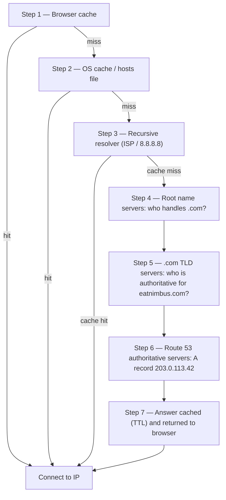

# บทที่ 12: อินเทอร์เน็ตค้นหาคุณได้อย่างไร

Maya รีเฟรช `nimbus-alb-123456789.us-west-2.elb.amazonaws.com` ในเบราว์เซอร์ของเธออีกครั้ง แล้วเอนหลังและมองเพดาน หน้าเพจโหลด แอปทำงาน แต่ทุกครั้งที่เธอแชร์ลิงก์กับพาร์ทเนอร์ร้านอาหาร เธอรู้สึกอายเล็ก ๆ ที่เธอเรียกชื่อไม่ถูก

URL นั้นเป็นสิ่งประดิษฐ์ทางเทคนิค ไม่ใช่ผลิตภัณฑ์

---

*การออกแบบเครือข่ายใหม่จากบทที่แล้วไปได้ดี ทุกทรัพยากรอยู่ในตำแหน่งที่ถูกต้อง — load balancer ใน public subnet ฐานข้อมูลถูกล็อกใน private subnet โครงสร้างพื้นฐานปลอดภัยและแบ่งส่วนอย่างถูกต้อง แต่ขณะที่ Nimbus เตรียมการเปิดตัวสาธารณะครั้งแรก ปัญหาใหม่ปรากฏ: URL ของ load balancer ที่ AWS กำหนดโดยอัตโนมัติดูเหมือน system identifier ไม่ใช่ผลิตภัณฑ์ที่คนจะไว้ใจ พวกเขาต้องการ domain name จริง และพวกเขาต้องเข้าใจว่าเกิดอะไรขึ้นระหว่างขณะที่มีคนพิมพ์ `eatnimbus.com` กับขณะที่หน้าเพจปรากฏ*

---

Nimbus กำลังทำงาน load balancer มี IP สาธารณะ EC2 instances มี IP ส่วนตัว ฐานข้อมูลถูกล็อกใน private subnet Priya พยักหน้าเห็นด้วยกับแผนภาพเครือข่าย

Tom มองที่ URL ของ load balancer: `nimbus-alb-123456789.us-west-2.elb.amazonaws.com`

"นั่นคือสิ่งที่ลูกค้าพิมพ์ลงในเบราว์เซอร์ของพวกเขาหรือ?" เขาถาม

"นั่นคือสิ่งที่ AWS กำหนดโดยอัตโนมัติ" Maya พูด

"ผมจะไม่ใส่สิ่งนั้นบนนามบัตร"

"ฉันก็ไม่"

พวกเขาต้องการ domain name พวกเขาซื้อ `eatnimbus.com` จาก domain registrar ตอนนี้พวกเขาต้องเชื่อมต่อชื่อนั้นกับ AWS infrastructure ของพวกเขา

"อินเทอร์เน็ตรู้ได้ยังไงว่า `eatnimbus.com` หมายถึง load balancer ใน us-west-2?" Leo ถาม

คำถามที่ดี Leo

**การเปรียบเปรยกับสมุดโทรศัพท์**

ก่อนสมาร์ทโฟน ทุกเมืองมีสมุดโทรศัพท์ ถ้าคุณต้องการติดต่อ "ร้านพิซซ่า Mario" คุณไม่ได้จำหมายเลขโทรศัพท์ของพวกเขา — คุณค้นหาชื่อ ได้หมายเลข แล้วโทร

อินเทอร์เน็ตมีสมุดโทรศัพท์ของตัวเอง: **Domain Name System (DNS)**

DNS แปลชื่อที่มนุษย์อ่านได้ (เช่น `eatnimbus.com`) เป็น IP address ที่เครื่องอ่านได้ (เช่น `203.0.113.42`) ทุกครั้งที่คุณเยี่ยมชมเว็บไซต์ คอมพิวเตอร์ของคุณค้นหา domain name ใน DNS อย่างเงียบ ๆ และได้ IP address ที่จะเชื่อมต่อ

ถ้าคุณเปลี่ยน IP address ของเซิร์ฟเวอร์ คุณจะอัปเดต DNS record — เหมือนเปลี่ยนหมายเลขของคุณในสมุดโทรศัพท์ — และอินเทอร์เน็ตจะหาคุณเจอที่ตำแหน่งใหม่ของคุณ

**การเดินทางของ DNS Resolution แบบเต็ม**

"แต่การ lookup *ทำงาน* จริง ๆ ยังไง?" Leo ถาม "แบบ ทีละขั้นตอน เบราว์เซอร์ของผมรู้ชื่อ `eatnimbus.com` เกิดอะไรขึ้นต่อไป?"

เอกสารส่วนใหญ่ข้ามสิ่งนี้ มันสำคัญ

เมื่อเบราว์เซอร์ของคุณต้อง resolve `eatnimbus.com` นี่คือทุก hop ตามลำดับ:

**ขั้นตอนที่ 1 — Browser cache**: เบราว์เซอร์ตรวจว่ามัน resolve ชื่อนี้ล่าสุดแล้วหรือยัง ถ้าใช่ มันใช้ IP ที่ cache ไว้ ถ้าไม่ ทำต่อ

**ขั้นตอนที่ 2 — OS cache / local resolver**: ระบบปฏิบัติการของคุณตรวจ DNS cache ของตัวเองและไฟล์ `hosts` ในเครื่อง ถ้าพบ เสร็จ ถ้าไม่ มันส่งต่อไปยัง DNS resolver ที่กำหนดค่าไว้ — มักเป็นของ ISP หรือสาธารณะเช่น 8.8.8.8

**ขั้นตอนที่ 3 — Recursive resolver**: recursive resolver (ISP ของคุณหรือ 8.8.8.8 ของ Google) คือตัวหลัก มันมี cache ด้วย ถ้ามันรู้คำตอบ มันส่งคืนทันที ถ้าไม่ มันเริ่มห่วงโซ่การ resolution จริง

**ขั้นตอนที่ 4 — Root name servers**: recursive resolver ติดต่อหนึ่งในคลัสเตอร์ root name server 13 อัน (deploy ทั่วโลก) root server ไม่รู้ว่า `eatnimbus.com` อยู่ที่ไหน แต่มันรู้ว่าใครจัดการ domain `.com` — เซิร์ฟเวอร์ TLD ของ `.com` มันส่งคืน address ของพวกมัน

**ขั้นตอนที่ 5 — TLD (Top Level Domain) name servers**: recursive resolver ติดต่อเซิร์ฟเวอร์ TLD ของ `.com` เซิร์ฟเวอร์ TLD ก็ไม่รู้ว่า `eatnimbus.com` อยู่ที่ไหนเช่นกัน แต่พวกมันรู้ว่า name server ใดเป็น authoritative สำหรับ `eatnimbus.com` — เซิร์ฟเวอร์ที่ถือ DNS record จริง พวกมันส่งคืน address เหล่านั้น

**ขั้นตอนที่ 6 — Authoritative name servers**: recursive resolver ติดต่อ name server ของ Route 53 — authoritative name server สำหรับ `eatnimbus.com` Route 53 มี record จริง มันส่งคืน A record: `eatnimbus.com → 203.0.113.42` คำตอบนี้เป็น authoritative — มันคือคำตอบจริง ไม่ใช่คำตอบที่ cache ไว้

**ขั้นตอนที่ 7 — คำตอบถูก cache และส่งคืน**: recursive resolver cache คำตอบตามระยะเวลา TTL (Time-To-Live) บน record มันส่งคืน IP ให้เบราว์เซอร์ของคุณ เบราว์เซอร์ของคุณ cache มัน เบราว์เซอร์ของคุณเชื่อมต่อ



"นั่นเจ็ด hop แค่เพื่อหา IP address" Tom พูด

"โดยปกติต่ำกว่า 100 มิลลิวินาทีทั้งหมด" Priya พูด "ขั้นตอน 3 ถึง 6 ถูก cache อย่างหนักในทุกระดับ สำหรับ domain ยอดนิยม ขั้นตอน 4 และ 5 — root และ TLD lookup — มักถูกข้ามทั้งหมดเพราะ recursive resolver มีเซิร์ฟเวอร์เหล่านั้น cache ไว้แล้ว ห่วงโซ่ทั้งหมดมักรันใน 20-40 มิลลิวินาที"

"และหลัง lookup แรก browser cache หมายความว่าคำขอถัดไปข้ามมันทั้งหมด" Leo เสริม

"ถูกต้อง DNS รู้สึกเหมือนทันทีเพราะ lookup ส่วนใหญ่เป็น cache hit ห่วงโซ่เต็มรันเฉพาะเมื่อ record ใหม่หรือ TTL ของมันหมดอายุ"

**พบกับ Route 53**

Amazon Route 53 คือ managed DNS service ของ AWS มันถูกเรียกว่า Route 53 เพราะพอร์ต 53 คือพอร์ต DNS มาตรฐาน (บางครั้ง AWS ตั้งชื่อสิ่งต่าง ๆ อย่างตรงไปตรงมา)

Route 53 ทำหลายสิ่ง:

**การลงทะเบียน domain**: คุณซื้อ domain name ผ่าน Route 53 ได้โดยตรง

**DNS hosting (hosted zones)**: คุณสร้าง *hosted zone* สำหรับ domain ของคุณ และ Route 53 จัดการ DNS record ที่บอกโลกว่าจะหาคุณเจอที่ไหน

**Health checking**: Route 53 สามารถตรวจสอบ endpoint ของคุณและ route traffic ออกจากอันที่ไม่แข็งแรง

**Traffic routing policies**: Route 53 รองรับกลยุทธ์การ routing หลายแบบนอกเหนือจาก DNS ธรรมดา — weighted, latency-based, geolocation, failover

**DNS Records: รายการในสมุดโทรศัพท์**

DNS record แมปชื่อกับปลายทาง ประเภทที่พบบ่อยที่สุด:

**A record**: แมปชื่อกับ IPv4 address
`eatnimbus.com → 203.0.113.42`

**AAAA record**: แมปชื่อกับ IPv6 address

**CNAME record**: แมปชื่อกับชื่ออื่น (นามแฝง)
`www.eatnimbus.com → eatnimbus.com`

**MX record**: ระบุว่าเซิร์ฟเวอร์ใดจัดการอีเมลสำหรับ domain

**TXT record**: เก็บข้อความใด ๆ ใช้กันทั่วไปสำหรับการยืนยัน domain (พิสูจน์ว่าคุณเป็นเจ้าของ domain) และการตรวจสอบสิทธิ์อีเมล (SPF, DKIM)

สำหรับ Nimbus การตั้งค่าหลัก:

- `eatnimbus.com` → Alias record ที่ชี้ไปยัง load balancer
- `www.eatnimbus.com` → CNAME ที่ชี้ไปยัง `eatnimbus.com`
- `api.eatnimbus.com` → Alias record ที่ชี้ไปยัง API load balancer

"เดี๋ยว" Tom พูด "IP ของ load balancer เปลี่ยนได้ AWS ว่าอย่างนั้นในเอกสาร"

จับได้ดี Tom

**Alias Records: วิธีแก้ของ AWS สำหรับ Dynamic IP**

load balancer, CloudFront distribution และ S3 website มี DNS name ไม่ใช่ static IP address IP เบื้องล่างเปลี่ยนได้

ถ้าคุณสร้าง CNAME ที่ชี้ไปยัง DNS name ของ load balancer มันใช้ได้ — แต่คุณใช้ CNAME สำหรับ root domain ไม่ได้ (`eatnimbus.com` ที่ไม่มี `www`) เพราะมาตรฐาน DNS

Route 53 แก้สิ่งนี้ด้วย **Alias record** — ส่วนขยาย DNS เฉพาะของ AWS Alias record แมปชื่อโดยตรงกับทรัพยากร AWS (load balancer, CloudFront distribution, S3 website) และ Route 53 จัดการ dynamic IP resolution โดยอัตโนมัติ Alias record ใช้ได้ที่ระดับ root domain และต่างจาก DNS query ปกติไปยังบริการภายนอก Alias record query ไปยังทรัพยากร AWS ฟรี

"ดังนั้นเราใช้ Alias record สำหรับ `eatnimbus.com` ที่ชี้ไปยัง load balancer" Leo ยืนยัน

"และ Route 53 จัดการ IP ใดก็ตามที่ load balancer ใช้ในขณะใด ๆ" Priya เสริม

"ฟรี" Tom พูด สนใจขึ้นมาทันที เขาดึงหน้าราคา Route 53 ขึ้นมา "แล้วที่เหลือล่ะ?"

"ห้าสิบเซนต์ต่อ hosted zone" Leo พูด "บวกประมาณสี่สิบเซนต์ต่อ DNS query หนึ่งล้านครั้ง สำหรับ traffic ของเราตอนนี้ น่าจะต่ำกว่าสองดอลลาร์ต่อเดือน"

Tom ปิดหน้าราคาอย่างพอใจ

**Routing Policies: มากกว่าแค่ "มันอยู่ที่ไหน?"**

นี่คือที่ที่ Route 53 น่าสนใจ DNS ไม่ใช่แค่บริการ lookup — มันเป็นเครื่องมือจัดการ traffic ได้

**Simple routing**: หนึ่ง record หนึ่งปลายทาง DNS มาตรฐาน

**Weighted routing**: แบ่ง traffic ระหว่างหลายปลายทางตาม weight ส่ง 90% ไปเซิร์ฟเวอร์ใหม่ 10% ไปเซิร์ฟเวอร์เก่าระหว่างการย้าย ปรับ weight จนคุณมั่นใจในเซิร์ฟเวอร์ใหม่ แล้วสลับเป็น 100%

**Latency-based routing**: Route ผู้ใช้ไปยัง AWS region ที่มี latency ต่ำที่สุดสำหรับพวกเขา ผู้ใช้ในซีแอตเทิลถูก route ไป `us-west-2` ผู้ใช้ในโตเกียวถูก route ไป `ap-northeast-1` domain name เดียวกัน ปลายทางต่างกัน

**Geolocation routing**: Route ตามตำแหน่งทางภูมิศาสตร์ของผู้ใช้ ผู้ใช้ยุโรปทั้งหมดไป `eu-west-1` ผู้ใช้อเมริกาเหนือทั้งหมดไป `us-east-1` มีประโยชน์สำหรับอธิปไตยข้อมูล (เก็บข้อมูลผู้ใช้ EU ใน region EU) หรือการปรับแต่งเนื้อหา (ภาษา สกุลเงิน) การตัดสินใจ routing ใช้ขอบเขตแข็ง — ผู้ใช้อยู่ในประเทศ ทวีป หรือรัฐของสหรัฐ และนั่นคือที่ที่พวกเขาไป

**Geoproximity routing**: Route traffic ตามตำแหน่งทางภูมิศาสตร์ของผู้ใช้ *และ* ให้คุณปรับการตัดสินใจเหล่านั้นด้วยค่า **bias** bias บวกขยายพื้นที่ทางภูมิศาสตร์ที่ route ไปยังทรัพยากร — ดึงดูด traffic มากขึ้น bias ลบหดมัน ต่างจาก geolocation ที่ใช้ขอบเขตแข็งของประเทศและทวีป geoproximity เป็นแบบต่อเนื่อง: ค่า bias เล็ก ๆ ค่อย ๆ เปลี่ยน traffic จาก region หนึ่งไปอีก region โดยไม่ต้องวาดเส้นตายตัวใด ๆ ใหม่

สถานการณ์ที่แยกแยะทั้งสอง: ถ้าบริษัทค่อย ๆ ย้ายจาก `us-east-1` ไป `us-west-2` และอยากเปลี่ยน traffic ไปทางตะวันตกทีละน้อย — ไม่ใช่พลิกสวิตช์ แต่หมุนปรับมันตามเวลา — geoproximity ที่มี bias บวกที่เพิ่มขึ้นบน endpoint ตะวันตกคือเครื่องมือที่ถูกต้อง geolocation จะ route ผู้ใช้ฝั่งตะวันตกทั้งหมดไปออริกอนหรือไม่; มันไม่มีปุ่มหมุน ตั้งแต่มกราคม 2024 geoproximity มีให้เป็น routing policy ปกติบน DNS record โดยตรง (Console, API, CLI) — มันไม่ต้องการ Route 53 Traffic Flow อีกต่อไป แม้ว่ามันยังมีให้ที่นั่นด้วย

**Failover routing**: กำหนด primary และ secondary endpoint ถ้า primary ล้มเหลว health check ของ Route 53 traffic จะถูกเปลี่ยนเส้นทางไป secondary โดยอัตโนมัติ นี่คือชั้น DNS ของ disaster recovery

"เดี๋ยว — แต่ *ทำไม* เราถึงตั้ง failover routing ไปยัง region ที่สองถ้าเรามี Multi-AZ อยู่แล้ว?" Maya ถาม "Multi-AZ ไม่ได้ควรจัดการความล้มเหลวหรือ?"

คำถามที่ดี Multi-AZ ป้องกันความล้มเหลวของ Availability Zone เดียวภายใน region — ถ้าศูนย์ข้อมูลหนึ่งล่ม standby ในอีก AZ เข้าทำงานแทน แต่ถ้าทั้ง AWS region ใช้งานไม่ได้ล่ะ? หรือถ้ามีการหยุดชะงักบริการทั่วทั้ง region ล่ะ? DNS failover routing ทำงานที่ระดับต่างกัน: มัน route traffic ออกจากทั้ง region เมื่อ health check ของ region นั้นล้มเหลว Multi-AZ คือ resilience ภายใน region DNS failover คือ resilience ระหว่าง region

**Multivalue answer routing**: ส่งคืน IP address ที่แข็งแรงสูงสุดแปดอันสำหรับ query ให้ client เลือก ทางเลือกง่าย ๆ แทน load balancer สำหรับการกระจาย traffic ข้ามหลายเซิร์ฟเวอร์

"ดังนั้น Route 53 ไม่ใช่แค่สมุดโทรศัพท์" Maya พูด "มันคือสมุดโทรศัพท์อัจฉริยะที่ route สายตามว่าคุณโทรมาจากที่ไหน"

"และตัดสายคุณถ้าหมายเลขไม่แข็งแรง" Priya เสริม

---

**Latency Routing บวก Health Check: การทดลองทางความคิด**

Priya ร่างสถานการณ์บนไวท์บอร์ด สมมติว่าฐานผู้ใช้ฝั่งตะวันออกของ Nimbus เติบโตขึ้นเรื่อย ๆ และวันหนึ่งทีมตั้ง stack เบา ๆ ใน `us-east-1` (เวอร์จิเนียเหนือ) — ไม่ใช่ multi-region active-active เต็ม ซึ่งจะแพงและซับซ้อน แต่เป็น load balancer และชุด EC2 instance แบบอ่านอย่างเดียวที่ให้บริการเนื้อหา static และหน้าเรียกดู ออเดอร์ยังไปทางตะวันตกสู่ฐานข้อมูลหลักใน `us-west-2` browse traffic — ซึ่งคิดเป็นเจ็ดสิบเปอร์เซ็นต์ของคำขอ — ให้บริการจากชายฝั่งใดก็ได้

การกำหนดค่า Route 53 สำหรับ browse endpoint จะมีลักษณะดังนี้:

```
browse.eatnimbus.com
  → Latency record: us-east-1 ALB (with health check, set-identifier "east")
  → Latency record: us-west-2 ALB (with health check, set-identifier "west")
```

(สังเกตว่า record คือ *hostname* `browse.eatnimbus.com` — DNS route ชื่อ ไม่เคย route URL path การ routing ตาม path เช่น `/browse` เป็นงานของ load balancer ไม่ใช่ของ Route 53)

ด้วย latency routing ผู้ใช้ในซีแอตเทิลจะถูก resolve ไปยัง endpoint `us-west-2` ผู้ใช้ในบอสตันจะไป `us-east-1` Route 53 วัด latency จากโครงสร้างพื้นฐานของมันไปยังแต่ละ region อย่างต่อเนื่องและเลือกอันที่เร็วกว่าต่อผู้ใช้

"แต่ถ้า region ตะวันตกมีปัญหาล่ะ?" Tom ถาม "ผู้ใช้เรียกดูของเราในซีแอตเทิลจะติดอยู่"

"นั่นคือสิ่งที่ health check มีไว้" Priya พูด "แต่ละ latency record ได้ health check บน load balancer ของมัน ถ้า health check `us-west-2` ล้มเหลวสามการตรวจติดต่อกัน Route 53 หยุดส่งคืน record นั้น — แม้สำหรับผู้ใช้ที่ออริกอนปกติจะเร็วกว่า ผู้ใช้ซีแอตเทิลถูก route ไปทางตะวันออกจนกว่าออริกอนจะฟื้นตัว"

"ดังนั้น latency routing กำหนดว่า region ใดถูกเลือกตามปกติ" Maya พูด "และ health check แทนที่ความชอบนั้นถ้า region ที่ชอบล่ม?"

"ใช่เลย latency policy เลือกผู้ชนะภายใต้เงื่อนไขปกติ health check เอาผู้ชนะที่หยุดทำงานออก"

Leo คิดเกี่ยวกับสถานการณ์ความล้มเหลว "แล้ว TTL บน record เหล่านั้นล่ะ?"

"หกสิบวินาที" Priya พูด "การตรวจที่ล้มเหลวสามครั้งที่ช่วงสามสิบวินาทีเพื่อให้มันทำงาน — สูงถึงเก้าสิบวินาทีในการตรวจพบความล้มเหลว — แล้วสูงถึงหกสิบวินาทีให้ DNS resolver รับการเปลี่ยนแปลง"

"สองนาทีครึ่งกรณีแย่ที่สุด" Leo พูด

"ซึ่งเป็นเหตุผลที่คุณลด TTL ก่อนที่คุณจะสนใจมัน ไม่ใช่หลังจาก"

การรวมกันนี้ — latency routing กับ health check บนทุก record — คือหนึ่งในการกำหนดค่า Route 53 ที่ทรงพลังที่สุดสำหรับการ deploy หลาย region ผู้ใช้ไปยัง region ที่แข็งแรงและเร็วที่สุดเสมอ ระบบเยียวยาตัวเองเมื่อ region มีปัญหา และทั้งหมดคือ DNS: ไม่มีโครงสร้างพื้นฐานเพิ่ม ไม่มี proxy server ไม่มี load balancer ระหว่าง region

---

**เหตุการณ์ Health Check ล้มเหลว**

สภาพแวดล้อม staging ของ Nimbus ให้การสาธิต failover routing โดยบังเอิญ

พวกเขากำหนดค่า Route 53 health check บน staging load balancer เป็นการทดสอบ — ตรวจ endpoint `/health` ทุก 30 วินาที บ่ายวันศุกร์หนึ่ง Leo push การ deploy ไป staging ที่มีบั๊ก: health endpoint เริ่มส่งคืน error 500 มันผ่านการทดสอบในเครื่องของเขาแต่พังบนเซิร์ฟเวอร์

Route 53 บันทึกความล้มเหลว หลังการตรวจที่ล้มเหลวสามครั้งติดต่อกัน มันมาร์ก endpoint ว่าไม่แข็งแรง failover record ทำงาน route staging traffic ไปยังหน้า fallback แบบอ่านอย่างเดียวที่บอกว่า "อยู่ระหว่างการบำรุงรักษา"

การแจ้งเตือนแรกของ Leo คือข้อความ Slack จากวิศวกร QA: "Staging กำลังแสดงหน้าบำรุงรักษา"

Leo ตรวจ deploy error 500 ชัดเจนใน log เขา roll back การ deploy ภายใน 90 วินาทีหลัง health endpoint ส่งคืน 200 Route 53 ประเมิน check ใหม่ เห็นความสำเร็จสามครั้งติดต่อกัน และคืน traffic ไปยัง staging load balancer หน้าบำรุงรักษาหายไป

เวลาทั้งหมดบนหน้าบำรุงรักษา: เจ็ดนาที

"นั่นคือระบบที่ทำงานถูกต้อง" Priya พูด

"ผมรู้" Leo พูด "ส่วนที่น่ากลัวคือการคิดว่าจะเกิดอะไรขึ้นถ้าไม่มี health check error 500 จะไปถึงผู้ใช้จริง"

"ใน production health check จะ fail over ไปยัง region ที่สองหรือหน้า error static ผู้ใช้จะเห็นประสบการณ์ที่ได้รับการบำรุงรักษาแทน error"

"failover ใช้เวลานานแค่ไหนจริง ๆ?" Maya ถาม "จากตอนที่ health check ล้มเหลวจนถึงตอนที่ DNS เริ่ม route ต่างออกไป?"

"ช่วง health check คือ 30 วินาทีโดยค่าเริ่มต้น ความล้มเหลวสามครั้งติดต่อกันเพื่อให้ failover ทำงาน นั่นสูงถึง 90 วินาทีในการตรวจพบปัญหา แล้ว DNS TTL — ถ้ามันคือ 60 วินาที การกระจายอีกหนึ่งนาที"

"ดังนั้นกรณีแย่ที่สุด ประมาณสามนาที?"

"ประมาณนั้น ซึ่งเป็นเหตุผลที่คุณอยากให้ TTL ต่ำบน record ที่สำคัญ และช่วง health check สั้นที่สุดเท่าที่งบของคุณอนุญาต"

---

**Health Checks: Route รอบ ๆ ความล้มเหลว**

"แล้วถ้ามีคนพยายามบุกรุกล่ะ?" Priya พูด "DNS เป็นสาธารณะ ใครก็ค้นได้ว่า `eatnimbus.com` ชี้ไปที่ไหน นั่นหมายความว่าผู้โจมตีรู้แน่ชัดว่าจะโจมตี IP ไหน"

"นั่นจริง" Leo พูด "แต่ IP ที่พวกเขาเจอคือ IP ของ load balancer ALB เป็นสิ่งเดียวที่มี address สาธารณะ ทุกอย่างที่อยู่หลังมัน — EC2, RDS, ElastiCache — อยู่ใน private subnet DNS บอกพวกเขาประตูหน้า มันไม่บอกพวกเขาว่ามีอะไรอยู่ข้างหลัง"

Route 53 สามารถตรวจสอบ endpoint ของคุณด้วย health check ถ้า endpoint ล้มเหลว Route 53 สามารถ:

- เอามันออกจาก DNS response (หยุดส่ง traffic ไปที่นั่น)
- ทริกเกอร์ failover ไปยัง backup endpoint
- ส่งการแจ้งเตือนผ่าน CloudWatch

health check คือลิงก์ระหว่าง DNS routing และสุขภาพแอปพลิเคชันจริง ในการกำหนดค่า failover: Route 53 ตรวจสอบ primary endpoint ทุก 30 วินาที ถ้าการตรวจสามครั้งติดต่อกันล้มเหลว Route 53 เริ่มส่งคืน address ของ secondary endpoint ไม่มีตัวเลขเหล่านี้ที่ตายตัว: 30 วินาทีคือช่วงมาตรฐาน (ตัวเลือก "fast" แบบเสียเงินตรวจทุก 10 วินาที) และเกณฑ์ความล้มเหลวเป็นค่าเริ่มต้น 3 การตรวจติดต่อกันแต่กำหนดค่าได้จาก 1 ถึง 10

นี่ไม่ใช่ทันที — DNS มีเวลาการกระจาย เมื่อ Route 53 เปลี่ยน DNS record DNS resolver ทั่วโลกต้องรับการเปลี่ยนแปลง ซึ่งอาจใช้เวลาวินาทีถึงนาทีขึ้นกับการตั้งค่า TTL

**TTL: DNS Cache**

DNS response ถูก cache ที่หลายระดับ — ที่ router ของคุณ ที่ ISP ของคุณ ในเบราว์เซอร์ของคุณ **TTL (Time-To-Live)** บน DNS record บอก cache ว่าจะจำคำตอบนานแค่ไหนก่อนตรวจอีกครั้ง

TTL สูง (1 ชั่วโมงขึ้นไป): DNS query น้อยลง โหลดบน Route 53 น้อยลง แต่การเปลี่ยนแปลงใช้เวลากระจายนานกว่า

TTL ต่ำ (60 วินาทีหรือน้อยกว่า): การเปลี่ยนแปลงกระจายเร็ว แต่ต้องการ DNS query มากขึ้น

ก่อนการย้ายที่วางแผนไว้ (อัปเดต DNS ให้ชี้ไปยังเซิร์ฟเวอร์ใหม่) ลด TTL ของคุณเป็น 60 วินาทีล่วงหน้าหนึ่งวัน แล้วเมื่อคุณทำการเปลี่ยนแปลง มันกระจายในประมาณหนึ่งนาที หลังการย้าย ขึ้นมันกลับไปค่าปกติ

"ผมdeployไปแล้ว — อ้อ" Leo อัปเดต DNS record ก่อนลด TTL เขารู้ความผิดพลาดและเริ่มนับ: TTL เก่าคือหนึ่งชั่วโมง ผู้ใช้บางคนจะได้เซิร์ฟเวอร์เก่าในหกสิบนาทีถัดไป

"ถ้าเราแค่ลดมันระหว่างการย้ายและไม่ใช่ก่อน" Leo พูดช้า ๆ "TTL เก่าหมายความว่าผู้ใช้บางคนจะเห็นเซิร์ฟเวอร์เก่าหนึ่งชั่วโมง"

"ใช่เลย" Priya พูด "การย้าย DNS ต้องการการวางแผนก่อนการย้าย ไม่ใช่แค่ระหว่าง"

คุณอาจสงสัย: ถ้า TTL ตั้งเป็นหนึ่งชั่วโมง นั่นหมายความว่าผู้ใช้ทุกคนจะรอเต็มหนึ่งชั่วโมงหลังการเปลี่ยน DNS ก่อนเห็นเซิร์ฟเวอร์ใหม่หรือ? ไม่เป๊ะ TTL หมายความว่า resolver จะไม่ตรวจใหม่จนกว่า TTL หมดอายุ ถ้า DNS resolver ของผู้ใช้ cache ค่าเก่าเมื่อ 55 นาทีก่อนด้วย TTL 1 ชั่วโมง พวกเขาจะได้ค่าใหม่ใน 5 นาที ถ้าพวกเขา cache มันเมื่อ 5 นาทีก่อน พวกเขาจะรอ 55 นาที โดยเฉลี่ย ผู้ใช้เห็นการเปลี่ยนแปลงภายในครึ่งหนึ่งของระยะเวลา TTL นั่นคือเหตุผลที่การลด TTL ล่วงหน้าสำคัญมาก: มันหดหน้าต่างการกระจายกรณีแย่ที่สุดก่อนที่การเปลี่ยนแปลงจะเกิดขึ้น

---

**Private Hosted Zones: DNS ภายใน**

Priya ยกความต้องการใหม่สองสัปดาห์หลัง public domain มีชีวิต

"EC2 instances ของเราต้องเข้าถึงฐานข้อมูล" เธอพูด "ตอนนี้พวกมันใช้ DNS name ของ RDS endpoint — `nimbus-prod.abc123.us-west-2.rds.amazonaws.com` มันใช้ได้ แต่มันเป็น DNS name สาธารณะ ถ้าเราอยากเปลี่ยนการกำหนดค่าฐานข้อมูล ไฟล์ config แอปพลิเคชันทั้งหมดต้องอัปเดต"

"เราใช้ DNS name ส่วนตัวได้" Leo พูด "เช่น `db.nimbus.internal` อะไรที่บริการของเราใช้ภายในที่แมปกับ database endpoint ปัจจุบันใด ๆ"

"ใช่เลย Route 53 private hosted zone"

**private hosted zone** คือ DNS domain ที่ resolve เฉพาะภายใน VPC ของคุณ DNS query ภายนอกสำหรับ `nimbus.internal` ไม่ได้รับ response แต่จากภายใน VPC `db.nimbus.internal` resolve เป็น RDS endpoint

พวกเขาตั้งค่ามัน:

- Private hosted zone: `nimbus.internal`
- CNAME record: `db.nimbus.internal → nimbus-prod.abc123.us-west-2.rds.amazonaws.com`
- CNAME record: `cache.nimbus.internal → nimbus-cache.abc123.usw2.cache.amazonaws.com`
- A record: `api.nimbus.internal → 10.0.10.5` (IP ของ EC2 ภายใน — A record แมปชื่อกับ IP address; CNAME แมปชื่อกับชื่ออื่น โอเคที่นี่เพราะ instance นี้รักษา private IP แบบ static; สำหรับอะไรที่อยู่หลัง Auto Scaling คุณจะชี้ไปที่ load balancer แทน)

ตอนนี้ config แอปพลิเคชันอ่านว่า:

```
DATABASE_HOST=db.nimbus.internal
CACHE_HOST=cache.nimbus.internal
```

เมื่อพวกเขาย้ายไป RDS instance ใหม่ พวกเขาอัปเดต DNS record เดียว ไม่ต้อง deploy แอปพลิเคชัน

"นี่ก็เป็นเหตุผลที่ DNS ส่วนตัวสำคัญระหว่างการย้ายฐานข้อมูล" Priya พูด "คุณอัปเดต `db.nimbus.internal` ให้ชี้ไปยัง endpoint ใหม่ traffic เปลี่ยน endpoint เก่ายังพร้อมใช้งานระหว่างหน้าต่าง TTL ไม่ต้องเปลี่ยน config แอปพลิเคชัน"

**เรื่องราวการดีบัก DNS ภายใน**

สามสัปดาห์ต่อมา Leo deploy บริการใหม่ — background worker — และมันเข้าถึงฐานข้อมูลไม่ได้ worker อยู่ใน VPC เดียวกัน private subnet เดียวกันกับ API server API server เข้าถึงฐานข้อมูลได้ worker เข้าไม่ได้

เขาตรวจ security group security group ของ worker มีกฎ outbound สำหรับ PostgreSQL security group ของฐานข้อมูลมีกฎ inbound จาก security group ของ worker ทุกอย่างดูถูกต้อง

เขารัน `nslookup db.nimbus.internal` จาก worker instance

ไม่มี response

"DNS lookup กำลังล้มเหลว" เขาพูดกับ Priya

เธอมองที่การกำหนดค่า VPC ของ worker instance "worker อยู่ใน VPC ไหนจริง ๆ? private hosted zone เชื่อมโยงกับ VPC — ถ้า instance ไม่อยู่ใน VPC ที่เชื่อมโยง zone ไม่มีอยู่สำหรับมันเลย"

"มันอยู่ใน main VPC เหมือนกับทุกอย่างอื่น"

"ใช่หรือ?"

private hosted zone ต้องเชื่อมโยงกับแต่ละ VPC ที่มันให้บริการอย่างชัดเจน — การเชื่อมโยงเป็นต่อ VPC ไม่เคยต่อ subnet Priya เชื่อมโยง main VPC เมื่อเธอสร้าง zone แต่ Leo deploy worker เข้า test VPC ที่เขาสร้างสำหรับการทดลองอื่นโดยบังเอิญ VPC ต่างกัน ไม่เชื่อมโยงกับ private hosted zone

"worker อยู่ใน VPC ที่ผิด" Priya พูด

"ผมdeployไปแล้ว — อ้อ" Leo ย้าย worker ไปยัง VPC ที่ถูกต้อง DNS resolve worker เชื่อมต่อกับฐานข้อมูล

"หนึ่ง VPC" Leo พูด จดบันทึก "เว้นแต่เรามีเหตุผลสำหรับมากกว่าหนึ่ง"

---

**DNSSEC: การตรวจสอบสิทธิ์ DNS Response**

"เราคิดเรื่อง DNS spoofing หรือยัง?" Priya ถาม "ถ้ามีคนดักจับ DNS query ของเราและส่งคืน IP ปลอมล่ะ? เบราว์เซอร์ของผู้ใช้เราจะเชื่อมต่อกับเซิร์ฟเวอร์ของผู้โจมตีแทนของเรา"

**DNSSEC (DNS Security Extensions)** แก้สิ่งนี้โดยลงนาม DNS record เชิงเข้ารหัส เมื่อ DNS response มีลายเซ็น DNSSEC resolver สามารถยืนยันว่า response มาจาก authoritative name server และไม่ถูกแก้ไข

Route 53 รองรับการลงนาม DNSSEC สำหรับ public hosted zone กระบวนการเกี่ยวข้องกับ:

1. เปิด DNSSEC บน hosted zone ใน Route 53
2. Route 53 สร้าง key signing key (KSK) ที่เก็บใน KMS
3. Route 53 ลงนาม record ทั้งหมดด้วย zone signing key
4. คุณเพิ่ม DS (Delegation Signer) record ที่ parent domain registrar (.com TLD)
5. resolver ที่รองรับ DNSSEC สามารถยืนยันความถูกต้องของ response ได้แล้ว

"DNS spoofing พบบ่อยแค่ไหน?" Leo ถาม

"บนอินเทอร์เน็ตสาธารณะ หายากแต่เป็นไปได้" Priya พูด "ISP resolver ส่วนใหญ่รองรับการตรวจสอบ DNSSEC ในวันนี้ การเปิด DNSSEC ไม่เสียค่าใช้จ่ายและเพิ่มชั้นความถูกต้องที่มีความหมาย"

"ราคาเท่าไรต่อเดือน?" Tom ถาม

"การเปิดการลงนาม DNSSEC เองฟรีใน Route 53" Priya พูด "ต้นทุนจริงเดียวคือ KMS key ที่ถือ key-signing key: $1/เดือน บวก KMS API call — และ key หนึ่งใช้ร่วมกันข้ามหลาย hosted zone ได้ การป้องกันการโจมตี DNS hijacking ฟรีโดยพฤตินัยที่ขนาดของเรา"

Tom เปิดมันก่อนมื้อเที่ยง

---

**Route 53 Resolver: Hybrid DNS**

เมื่อ Nimbus ในที่สุดเชื่อม AWS VPC ของพวกเขากับเครือข่ายพัฒนา on-premises ผ่าน VPN ปัญหาใหม่ปรากฏ: เซิร์ฟเวอร์ on-premises ต้อง resolve AWS private DNS name (เช่น `db.nimbus.internal`) และทรัพยากร AWS ต้อง resolve on-premises hostname (เช่น `jenkins.corp.nimbus.local`)

DNS resolution ไม่ข้ามขอบเขตเครือข่ายโดยค่าเริ่มต้น ทรัพยากร AWS resolve DNS โดยใช้ Route 53 Resolver (สร้างมาในทุก VPC) เซิร์ฟเวอร์ on-premises ใช้ DNS server ของตัวเอง ไม่มีฝ่ายใดเห็น record ของอีกฝ่าย

**Route 53 Resolver Endpoints** เชื่อมช่องว่างนี้:

**Inbound endpoints**: DNS server on-premises ส่งต่อ query สำหรับ DNS zone ที่ host บน AWS ไปยัง IP ของ inbound endpoint ใน VPC ของคุณ Route 53 Resolver จัดการ query และส่งคืนผลลัพธ์

**Outbound endpoints**: เมื่อ EC2 instances ต้อง resolve on-premises hostname Resolver ส่งต่อ query เหล่านั้นไปยัง DNS server on-premises ผ่าน outbound endpoint

"ดังนั้นมันเหมือนบริการแปล" Maya พูด "AWS DNS ของคุณและ on-premises DNS ของคุณไม่ได้คุยกันโดยตรง Resolver endpoint ทำหน้าที่เป็นตัวกลาง"

"ใช่เลย เซิร์ฟเวอร์ on-premises ของคุณ resolve `db.nimbus.internal` ได้แล้ว EC2 instances ของคุณ resolve `jenkins.corp.nimbus.local` ได้ ทั้งสองฝ่ายเห็น DNS name จากทั้งสองโลก"

สำหรับ Nimbus สิ่งนี้กลายเป็นเรื่องเกี่ยวข้องเมื่อทีมพัฒนาอยากรัน integration test จากออฟฟิศของพวกเขากับสภาพแวดล้อม staging ใน AWS โดยไม่มี Resolver endpoint พวกเขาจะต้องแก้ไฟล์ hosts ด้วยมือ ด้วยมัน DNS ภายในใช้งานได้ข้าม VPN เลย

สถาปัตยกรรมสำหรับ Resolver endpoint:

- **Inbound endpoint**: สอง ENI (Elastic Network Interfaces) สร้างในสอง AZ ต่างกันใน VPC ของคุณ แต่ละอันได้ private IP คุณกำหนดค่า DNS server on-premises ของคุณให้ส่งต่อ query สำหรับ AWS-hosted zone ของคุณไปยัง IP เหล่านี้ traffic เดินทางผ่าน VPN หรือ Direct Connect ของคุณ
- **Outbound endpoint**: สอง ENI ในสอง AZ คุณสร้างกฎการส่งต่อ: "query สำหรับ `corp.nimbus.local` ไปยัง IP ของ DNS server on-premises เหล่านี้" EC2 instances ใช้ Resolver โดยอัตโนมัติ ซึ่งปรึกษากฎการส่งต่อของคุณและส่ง query ไป on-premises

"ทำไมสอง ENI ต่อ endpoint?" Leo ถาม

"High availability" Priya พูด "ถ้า AZ หนึ่งสูญเสียการเชื่อมต่อเครือข่าย IP ของ endpoint อีกตัวยังใช้ได้ หลักการเดียวกับ NAT Gateway"

"ราคาเท่าไรต่อเดือน?" Tom ถาม

Resolver endpoint มีราคาประมาณ $0.125 ต่อชั่วโมง **ต่อ elastic network interface** และแต่ละ endpoint ต้องการ ENI อย่างน้อยสองอันเพื่อความพร้อมใช้งาน — ดังนั้นพื้นที่ราคาที่สมจริงคือประมาณ $180 ต่อเดือนต่อ endpoint บวก $0.40 ต่อ DNS query หนึ่งล้านครั้ง สำหรับทีมที่ใช้ hybrid DNS เพื่อ resolve ชื่อภายใน ต้นทุนพอประมาณ — และกำจัดความจำเป็นในการรักษาไฟล์ hosts ข้ามหลายเครื่องนักพัฒนาและระบบ CI/CD

"เราแค่ใส่ hostname ในไฟล์ hosts ก็ได้" Leo เสนอ

"บนทุกเครื่องนักพัฒนา ทุก CI runner ทุกการ onboarding ใหม่" Priya พูด "ทุกครั้งที่อะไรเปลี่ยน"

"endpoint คุ้มค่า" Leo พูด

"ใช่"

## จุดแข็งและข้อจำกัด

**Route 53 คือทางเลือกที่ถูกต้องสำหรับ**: การลงทะเบียนและจัดการ domain name ทั้งหมดภายใน AWS; การ route traffic ตาม latency, geolocation หรือการกระจายตาม weight ข้ามหลาย endpoint; failover ตาม health check ระหว่าง region หรือระหว่าง primary และ disaster-recovery endpoint; การรวม DNS กับ AWS service อื่นผ่าน alias record; private hosted zone สำหรับการค้นพบบริการภายใน

**เมื่อ Route 53 ไม่ใช่สิ่งที่คุณต้องการ**: Route 53 คือบริการ DNS ไม่ใช่ load balancer ถ้าคุณต้องกระจาย traffic ระหว่างหลายเซิร์ฟเวอร์หรือ container ภายใน region ใช้ Application Load Balancer — Route 53 ทำ weighted round-robin ที่ระดับการเชื่อมต่อแบบที่ load balancer ทำได้ไม่ได้ latency-based routing ข้าม region เพิ่มต้นทุนและความซับซ้อนด้านการดำเนินงานที่สมเหตุสมผลเฉพาะเมื่อผู้ใช้ของคุณกระจายทั่วโลกจริง ๆ และมิลลิวินาทีสำคัญต่อ conversion สำหรับแอปพลิเคชัน single-region ส่วนใหญ่ Alias record เดียวที่ชี้ไปยัง ALB คือการกำหนดค่า Route 53 ทั้งหมดที่คุณต้องการ

## สรุป

การไปจาก `nimbus-alb-123456789.us-west-2.elb.amazonaws.com` เป็น `eatnimbus.com` รู้สึกเหมือนเรื่องเล็ก มันไม่ใช่ DNS คือระบบที่อยู่ที่ทั้งอินเทอร์เน็ตรันอยู่บนมัน และ Route 53 ให้เครื่องมือคุณใช้ระบบนั้นไม่ใช่แค่สำหรับการ lookup แต่สำหรับการจัดการ traffic และ resilience

- **DNS** แปล domain name เป็น IP address — สมุดโทรศัพท์ของอินเทอร์เน็ต
- **Route 53** คือ managed DNS service ของ AWS: การลงทะเบียน domain, DNS hosting, health check และ routing policy
- **A record** แมปชื่อกับ IPv4 address **CNAME** แมปชื่อกับชื่ออื่น **Alias record** แมปชื่อกับทรัพยากร AWS (load balancer, CloudFront, S3)
- ใช้ Alias record (ไม่ใช่ CNAME) สำหรับ root domain และสำหรับทรัพยากรที่มี dynamic IP
- Routing policy ไปไกลกว่า DNS ธรรมดา: **weighted** (แบ่ง traffic), **latency-based** (ประสิทธิภาพ), **geolocation** (อธิปไตยข้อมูล — ขอบเขตประเทศ/ทวีปแข็ง), **geoproximity** (อิงระยะทางพร้อมปุ่มหมุน bias — เปลี่ยน traffic ทีละน้อย), **failover** (disaster recovery)
- **Private hosted zone** ให้ DNS ภายในสำหรับทรัพยากร VPC — การสื่อสารระหว่างบริการตามชื่อ ไม่ใช่ IP ที่ hard-code
- **DNSSEC** ลงนาม record เชิงเข้ารหัส ป้องกัน DNS spoofing
- **Route 53 Resolver Endpoints** เชื่อมเครือข่าย hybrid — AWS และ on-premises DNS resolve ชื่อของกันและกันได้

## เคล็ดลับการสอบ

*SAA-C03 Domain: ออกแบบสถาปัตยกรรมที่มีประสิทธิภาพสูง (Domain 3, Task 3.4)*

- **Alias vs CNAME**: Alias record ใช้ได้ที่ root domain; CNAME ใช้ไม่ได้ Alias record ไปยังทรัพยากร AWS ฟรี; CNAME DNS query คิดราคา เมื่อข้อสอบถามเรื่องการแมป root domain กับ load balancer → Alias record
- **กรณีใช้งาน routing policy** (สถานการณ์ข้อสอบทั่วไป):
  - "ค่อย ๆ ย้าย traffic ไปเวอร์ชันใหม่" → Weighted routing
  - "Route ผู้ใช้ไป AWS region ที่ใกล้ที่สุด" → Latency-based routing
  - "เก็บข้อมูลผู้ใช้ EU ใน region EU" → Geolocation routing
  - "DNS failover อัตโนมัติเมื่อ primary ล่ม" → Failover routing พร้อม health check
  - "ค่อย ๆ เปลี่ยน traffic ไป region ใหม่" หรือ "เพิ่ม traffic ที่ดึงดูดไปยังการ deploy EU ของเรา" → Geoproximity routing พร้อม bias บวก
- **Geoproximity vs. Geolocation:** Geolocation route ตามประเทศ/ทวีปของผู้ใช้ด้วยขอบเขตแข็ง Geoproximity route ตามระยะทางทางภูมิศาสตร์ด้วย bias ที่กำหนดค่าได้ — ใช้เมื่อคุณต้องการค่อย ๆ เปลี่ยน traffic ไป region ใหม่หรือดึงดูดผู้ใช้มากขึ้นไปยังการ deploy เฉพาะ มีให้เป็น routing policy ปกติบน record ตั้งแต่มกราคม 2024 (ไม่ต้องการ Traffic Flow อีกต่อไป)
- **Route 53 health checks**: ตรวจ endpoint HTTP/HTTPS/TCP ได้ และทริกเกอร์ CloudWatch alarm ได้ ข้อสอบใช้สิ่งเหล่านี้ในสถานการณ์ disaster recovery
- **TTL และการกระจาย**: รู้ว่า TTL ควบคุมว่า DNS resolver cache record นานแค่ไหน TTL สั้น = การเปลี่ยนแปลงเร็วกว่า สถานการณ์ข้อสอบ: "ทีมอัปเดต DNS แต่ผู้ใช้ยังชนเซิร์ฟเวอร์เก่า" → TTL สูงเกินไป
- **Private hosted zones**: Route 53 สร้าง DNS record ที่ resolve เฉพาะภายใน VPC ได้ ข้อสอบใช้สิ่งนี้สำหรับการค้นพบบริการภายใน (เช่น `database.internal` resolve เป็น private RDS endpoint)
- Route 53 เป็น **global** — มันไม่ถูก deploy ใน region ไม่ต้องเลือก region เมื่อสร้าง hosted zone
- **Route 53 Resolver Endpoints**: ใช้ในสถานการณ์ hybrid ที่ on-premises และ AWS DNS ต้อง resolve ชื่อของกันและกัน Inbound endpoint สำหรับ on-premises → AWS Outbound endpoint สำหรับ AWS → on-premises

## แบบฝึกหัด

**แบบฝึกหัด 1 — ทบทวน**

อธิบายความแตกต่างระหว่าง CNAME record กับ Alias record เมื่อไรคุณจะใช้แต่ละอัน?

*(คำใบ้: พิจารณาข้อจำกัดของ CNAME ที่ root domain และพฤติกรรมของ Alias record กับทรัพยากร AWS แบบ dynamic)*

**แบบฝึกหัด 2 — สถานการณ์ SAA-C03**

*สถานการณ์*: บริษัทสื่อดำเนินการเว็บไซต์จากสอง AWS region: `us-east-1` (primary) และ `eu-west-1` (secondary) ทีมอยากให้ traffic route ไป `eu-west-1` โดยอัตโนมัติถ้า primary region ใช้งานไม่ได้ บริษัทยังอยากยืนยันว่ากลไก failover นี้ทำงานถูกต้องโดยไม่ต้องทำให้ primary region ล่มจริง

การกำหนดค่า Route 53 ใดตอบความต้องการเหล่านี้ได้ดีที่สุด?

A) Weighted routing ด้วย weight 100% บน `us-east-1` และ weight 0% บน `eu-west-1`  
B) Latency-based routing พร้อม health check บนทั้งสอง endpoint  
C) Failover routing พร้อม health check บน primary endpoint และ secondary record ที่ชี้ไปยัง `eu-west-1`  
D) Geolocation routing โดยอเมริกาเหนือชี้ไปยัง `us-east-1` และยุโรปชี้ไปยัง `eu-west-1`

**คำใบ้ 1**: ความต้องการคือ failover อัตโนมัติเมื่อ primary ล่ม routing policy ใดออกแบบมาสำหรับสิ่งนี้เป๊ะ?

**คำใบ้ 2**: "ทดสอบโดยไม่ทำให้ primary region ล่ม" — health check ตั้งเป็น "unhealthy" ด้วยมือเพื่อทดสอบได้

**คำใบ้ 3**: Latency-based routing optimize เพื่อความเร็ว ไม่ใช่ failover

**คำตอบ**: C

**คำอธิบาย**: Failover routing ออกแบบมาสำหรับกรณีใช้งานนี้เป๊ะ primary record ชี้ไปยัง `us-east-1` พร้อม health check secondary record ชี้ไปยัง `eu-west-1` ถ้า health check ล้มเหลว Route 53 ให้บริการ secondary record โดยอัตโนมัติ health check ถูกบังคับให้ล้มเหลวด้วยมือเพื่อทดสอบได้โดยไม่รบกวน primary region จริง

**ทำไมไม่ใช่ A?** Weighted routing ด้วย 100%/0% เป็นแบบ static โดยพฤตินัย — มันไม่สลับอัตโนมัติเมื่อ primary ล้มเหลว

**ทำไมไม่ใช่ B?** Latency record *พร้อม health check* หยุดส่งคืน endpoint ที่ไม่แข็งแรง ดังนั้น B จะรอด outage จริง แต่มันเปลี่ยนรูปแบบ traffic ปกติ (ผู้ใช้จะถูกแบ่งข้าม region ตาม latency ไม่ใช่ primary/secondary ตามที่ต้องการ) และมันไม่มีวิธี *ทดสอบ* failover ที่สะอาด: คุณต้องทำให้ health check ของ primary ล้มเหลวจริงใน production Failover routing จำลองเจตนาที่ระบุ — primary ที่กำหนด secondary ที่กำหนด ทดสอบได้โดยบังคับสถานะ health check

**ทำไมไม่ใช่ D?** Geolocation routing route ตามตำแหน่งผู้ใช้ ไม่ใช่ตามสุขภาพ endpoint ผู้ใช้ยุโรปจะติดอยู่บน `eu-west-1` แม้ `us-east-1` แข็งแรง และผู้ใช้อเมริกาเหนือจะไม่ failover ไป `eu-west-1` แม้ `us-east-1` ล่ม

*SAA-C03 Domain: ออกแบบสถาปัตยกรรมที่มีประสิทธิภาพสูง — Task 3.4*

**แบบฝึกหัด 3 — ความท้าทายด้านสถาปัตยกรรม** *(ทางเลือก)*

Nimbus กำลังขยายไปต่างประเทศ พวกเขาอยากให้ `eatnimbus.com` โหลดเร็วสำหรับผู้ใช้บนชายฝั่งตะวันตก ชายฝั่งตะวันออก และออสเตรเลีย พวกเขายังมีความต้องการด้านกฎระเบียบ: ออเดอร์ที่สั่งโดยผู้ใช้ยุโรปต้องประมวลผลโดยเซิร์ฟเวอร์ใน EU

ออกแบบกลยุทธ์ routing ของ Route 53 ที่ตอบทั้งสองความต้องการ คุณจะใช้ routing policy หรือการรวมกันของ policy ใด? คุณต้องการโครงสร้างพื้นฐานอะไรในแต่ละ region?

*(ไม่มีคำตอบที่ถูกต้องเพียงข้อเดียว เป้าหมายคือการฝึกออกแบบ routing หลาย region)*

## ฉากหลังเครดิต

`eatnimbus.com` มีชีวิต

Maya พิมพ์มันลงในเบราว์เซอร์ของเธอ และหน้าสั่งอาหาร Nimbus โหลดขึ้น เธอสั่ง arepa จากร้านอาหารครอบครัวของเธอเอง แค่เพื่อทดสอบ flow ออเดอร์ผ่าน ครัวได้รับมัน

เธอเอนหลัง

Tom กำลังอ่านบันทึก health check ของ Route 53 อยู่แล้ว "เวลาตอบสนองคือ 18 มิลลิวินาทีจากตัวตรวจ us-west-2"

"นั่นเร็วไหม?" Maya ถาม

"สำหรับ DNS? ใช่ สำหรับผู้ใช้ซีแอตเทิลด้วย — พวกเขาแทบจะอยู่ติดออริกอน"

"แต่สำหรับผู้ใช้ในบอสตันล่ะ?"

Tom มองที่กราฟ latency "ประมาณ 80 มิลลิวินาที"

Maya คิดเกี่ยวกับเรื่องนั้น "ถ้าพาร์ทเนอร์ฝั่งตะวันออกของเราเติบโตเรื่อย ๆ และเซิร์ฟเวอร์ของเราอยู่ในออริกอน..."

"ทุกคำขอเดินทางจากบอสตันไปออริกอนและกลับมา" Leo พูดจากอีกด้านของห้อง "ความเร็วแสง คุณเอาชนะฟิสิกส์ไม่ได้"

"ดังนั้นเราต้องการเซิร์ฟเวอร์ที่ใกล้บอสตันมากขึ้น"

"หรือบางสิ่งที่ใกล้บอสตันมากขึ้นที่ให้บริการเนื้อหาในนามของพวกเขา"

ความคิดนั้นลอยอยู่ในอากาศ

ในบทต่อไป: โกดังที่วางเนื้อหาของ Nimbus ห่างจากผู้ใช้ทุกคนเพียงมิลลิวินาทีเดียว ทุกที่
