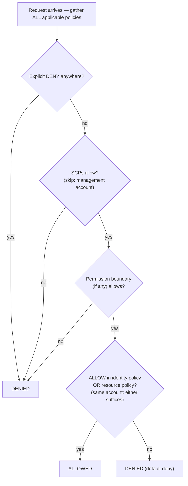

# บทที่ 14: ใครได้รับอนุญาตให้ทำอะไร

วิศวกรใหม่เริ่มงานวันจันทร์ Soo-Jin และ Rafael Maya คิดเกี่ยวกับสัปดาห์แรกของพวกเขา — สิ่งที่พวกเขาจะต้องเข้าถึง สิ่งที่พวกเขาไม่ควรแตะ และว่าการตั้งค่า IAM ปัจจุบันพร้อมจะขยายไปยังคนอีกสองคนหรือเปล่า

เธอนั่งกับกาแฟก่อนออฟฟิศจะเต็ม ทำรายการ

---

*CloudFront ถูก deploy แล้ว Cache hit rate ดี ประสิทธิภาพสูงขึ้น แต่ขณะที่ทีมเตรียมรับวิศวกรใหม่ ปัญหาเงียบ ๆ ปรากฏ: การกำหนดค่า IAM ถูกสร้างโดยคนที่รีบ access key อยู่ในไฟล์ config บาง role มีสิทธิ์มากกว่าที่ต้องการ และคนใหม่สองคนกำลังจะได้รับ credential ไปยังระบบ production ที่ไม่ได้ออกแบบมาโดยคำนึงถึงผู้ใช้หลายคน*

---

Tom มี access key เปิดอยู่ในไฟล์ข้อความ พร้อมที่จะวาง

"คุณกำลังทำอะไร?" Priya ถาม

"EC2 instance ต้องอ่านไฟล์ config จาก S3 ผมกำลังใส่ credential ในการกำหนดค่าเซิร์ฟเวอร์"

เธอมองหน้าจอสักครู่ "ปิดไฟล์นั้น"

"ผมแค่—"

"ถ้ามีคนบุกเข้าเซิร์ฟเวอร์นั้น" เธอพูด "พวกเขาได้ key เหล่านั้น และ key เหล่านั้นสัมผัสกับทุกสิ่งที่ IAM user ได้รับอนุญาตให้สัมผัส ซึ่งน่าจะมากกว่าแค่ S3"

Tom ปิดไฟล์

"มีวิธีที่ดีกว่า" เธอพูด "ตัวเซิร์ฟเวอร์เองมี role ได้ คิดว่ามันเหมือนตำแหน่งงาน — instance ไม่ต้องการ credential เพราะระบบรู้แล้วว่ามันคืออะไรและอะไรที่มันได้รับอนุญาตให้ทำ"

Tom ดูกังขา "ดังนั้นเซิร์ฟเวอร์ตรวจสอบสิทธิ์ตัวเอง?"

"ใช่ โดยไม่มีรหัสผ่าน โดยไม่มี key ในไฟล์ config โดยไม่มีอะไรที่ commit เข้า git ได้โดยบังเอิญ"

ส่วนสุดท้ายนั้นโดนใจ Tom เกือบ commit access key เข้า repo ด้วยตัวเองเมื่อสองสัปดาห์ก่อน — จับมันได้ใน diff ในวินาทีสุดท้าย เขาเปิดแท็บเบราว์เซอร์ใหม่

**กลับมาที่ IAM: ภาพที่สมบูรณ์**

บทที่ 3 แนะนำ IAM: user, group, role และ policy ตอนนี้ถึงเวลาเจาะลึกขึ้น

IAM policy เป็นเอกสาร JSON ที่ระบุว่า action ใดได้รับอนุญาตหรือถูกปฏิเสธบน resource ใด พวกมันมีลักษณะดังนี้:

```json
{
  "Version": "2012-10-17",
  "Statement": [
    {
      "Effect": "Allow",
      "Action": [
        "s3:GetObject",
        "s3:PutObject"
      ],
      "Resource": "arn:aws:s3:::nimbus-assets/*"
    }
  ]
}
```

policy นี้อนุญาตการอ่านและเขียน object ใน bucket `nimbus-assets` และไม่มีอะไรอื่น ไม่ใช่การลบ ไม่ใช่การ list bucket ไม่ใช่การดำเนินการ S3 อื่นใด ไม่ใช่ AWS service อื่นใด

นี่คือวิธีที่ถูกต้องในการให้สิทธิ์: action เฉพาะ resource เฉพาะ

**ปัญหากับ "Administrator Access"**

AWS Managed Policy อย่าง `AdministratorAccess` ออกแบบมาเพื่อเริ่มต้นอย่างรวดเร็ว พวกมันไม่ได้ออกแบบมาเพื่อรันระบบ production กับสมาชิกทีมจริง

`AdministratorAccess` ให้ทุก action บนทุก resource ถ้าสมาชิกทีมที่มี policy นี้ทำผิดพลาด — ลบ S3 bucket โดยไม่ตั้งใจ ยุติ EC2 instance ผิดเครื่อง เปลี่ยนกฎ security group — ไม่มีอะไรที่ AWS ทำเพื่อหยุดพวกเขาได้ สิทธิ์ถูกให้ไปแล้ว

ถ้า credential ของสมาชิกทีมถูก compromise (การโจมตี phishing, access key รั่ว, แล็ปท็อปถูกขโมย) ผู้โจมตีมีสิทธิ์ administrator ต่อทุกอย่างในบัญชี AWS ของคุณ

"ดังนั้น Soo-Jin ควรมีอะไร?" Leo ถาม

"Soo-Jin ต้องทำอะไร?" Priya ตอบ

"Deploy API ตรวจ log ไม่มีอะไรอื่น"

"แล้วเธอได้: ความสามารถในการ push ไปยัง code pipeline สิทธิ์อ่าน CloudWatch log และไม่มีอะไรอื่น"

"นั่น... เฉพาะเจาะจงมาก"

"ใช่ นั่นคือประเด็น"

**IAM Roles: ข้อมูลประจำตัวสำหรับ Services**

บทที่ 3 แนะนำ role เป็นวิธีให้ EC2 instance เข้าถึง AWS service โดยไม่ต้องเก็บ credential มาทำให้สิ่งนี้เป็นรูปธรรม

EC2 instances ของคุณที่รัน Nimbus API ต้อง:

- อ่านจาก DynamoDB (เมนู)
- เขียนไปยัง DynamoDB (ออเดอร์)
- วาง object ใน S3 (ใบเสร็จ การอัปโหลด)
- เขียน log ไปยัง CloudWatch
- อ่าน secret จาก Secrets Manager

แทนที่จะสร้าง user ที่มี access key และเก็บ key นั้นบน EC2 instance (ฝันร้ายด้านความปลอดภัย — access key อ่านได้โดยใครก็ตามที่มีการเข้าถึง SSH) คุณสร้าง **IAM role** สำหรับ EC2 instance พร้อมสิทธิ์เหล่านี้เป๊ะ

"เดี๋ยว — แต่ *ทำไม* เราถึงทำแบบนั้น?" Maya ถาม "EC2 instance รันโค้ดของเราอยู่แล้ว ทำไมไม่แค่ให้ access key แก่โค้ด?"

เพราะ access key เป็น static credential ที่อาศัยอยู่ที่ไหนสักแห่ง — ในไฟล์ config, environment variable, git repository ถ้ามีคนทำผิด พวกมันถูกคัดลอก exfiltrate commit โดยบังเอิญได้ IAM role ทำงานต่างกัน: EC2 instance assume role โดยอัตโนมัติ AWS ให้ temporary credential ผ่าน instance metadata service credential หมุนเวียนโดยอัตโนมัติ — มันหมดอายุทุกไม่กี่ชั่วโมงและถูกรีเฟรชโดยไม่ต้องดำเนินการใด ๆ จากคุณ ไม่มีอะไรให้รั่ว เพราะไม่มีอะไรถูกเก็บ

"แล้วถ้ามีคนแฮกเข้า EC2 instance ล่ะ?" Leo ถาม

"พวกเขาทำได้ตามที่ EC2 role อนุญาต" Priya พูด "ซึ่งคืออ่านเมนู เขียนออเดอร์ และส่ง log พวกเขาลบ S3 bucket ไม่ได้ ยุติ EC2 instance ไม่ได้ แตะ IAM ไม่ได้"

"เพราะ EC2 role ไม่มีสิทธิ์เหล่านั้น"

"ใช่เลย"

---

**การ Assume Role ของ EC2 ทำงานทีละขั้นตอนอย่างไร**

"มีอะไรไม่ลงตัว" Maya พูด "ถ้าไม่มี credential เก็บบน instance instance พิสูจน์ต่อ AWS ว่ามันคือใครได้จริง ๆ ยังไง? ต้องมี credential ที่ไหนสักแห่ง"

มี แต่มันชั่วคราว หมุนเวียนอัตโนมัติ และเข้าถึงได้จากภายใน instance เท่านั้น

เมื่อ EC2 instance เริ่มต้นด้วย IAM role ที่แนบ AWS ทำดังนี้:

**ขั้นตอนที่ 1**: AWS STS (Security Token Service) สร้าง temporary credential — access key ID, secret access key และ session token สำหรับ EC2 instance role พวกนี้มักใช้ได้ประมาณหกชั่วโมง และ AWS หมุนเวียนพวกมันโดยอัตโนมัติก่อนหมดอายุ

**ขั้นตอนที่ 2**: AWS ทำให้ credential เหล่านี้พร้อมใช้ที่ IP address พิเศษ: `169.254.169.254` นี่คือ **instance metadata service** (IMDS) มันเข้าถึงได้จากภายใน EC2 instance เท่านั้น ไม่มีอะไรนอก instance เข้าถึงมันได้

**ขั้นตอนที่ 3**: เมื่อแอปพลิเคชันโค้ดของคุณเรียก AWS SDK ใด ๆ (boto3, Java SDK, Node.js SDK) SDK query instance metadata endpoint โดยอัตโนมัติ:

```
GET http://169.254.169.254/latest/meta-data/iam/security-credentials/{role-name}
```

**ขั้นตอนที่ 4**: SDK รับ temporary credential และใช้มันลงนาม API request — เช่น คำขออ่านจาก S3

**ขั้นตอนที่ 5**: AWS ตรวจสอบ credential ตรวจ IAM policy ที่แนบกับ role และอนุญาตหรือปฏิเสธคำขอ

**ขั้นตอนที่ 6**: ประมาณสิบห้านาทีก่อน credential หมดอายุ EC2 instance รีเฟรชพวกมันจาก metadata service โดยอัตโนมัติ แอปพลิเคชันโค้ดไม่ต้องจัดการสิ่งนี้ — SDK ทำมันอย่างโปร่งใส

กระบวนการทั้งหมดมองไม่เห็นต่อนักพัฒนา คุณเขียน `s3.get_object(...)` SDK จัดการที่เหลือ

"ดังนั้น credential มีอยู่" Maya พูด "มันแค่ชั่วคราว หมุนเวียนอัตโนมัติ และล็อกกับ instance metadata endpoint"

"ซึ่งเป็นเหตุผลที่มันปลอดภัยกว่า static access key มาก" Priya พูด "static key เมื่อถูกขโมย ใช้ได้จนกว่ามีคนหมุนเวียนมันด้วยมือ temporary credential ที่ถูกขโมยหมดอายุเอง — ภายในชั่วโมง ไม่ใช่เดือน"

"แล้วถ้ามีคนภายใน instance query metadata endpoint ล่ะ?"

"พวกเขาได้ temporary credential ปัจจุบัน นั่นเป็นความเสี่ยงจริง ซึ่งเป็นเหตุผลที่ AWS แนะนำ IMDSv2 — Instance Metadata Service เวอร์ชัน 2 IMDSv2 ต้องการให้ผู้เรียกได้ session token ก่อนผ่านคำขอ PUT สิ่งนี้ป้องกันการโจมตีประเภทหนึ่งชื่อ Server-Side Request Forgery ที่โค้ดที่เป็นอันตรายหลอกเซิร์ฟเวอร์ให้ดึง metadata URL ในนามของผู้โจมตี"

Leo อัปเดต EC2 launch configuration เพื่อบังคับ IMDSv2 การตั้งค่าเดียว ใช้ตอน launch

---

**การ Assume Role: บริการกลายเป็นบริการอื่นอย่างไร**

Role ถูก assume ได้โดย:

- **AWS services** (EC2, Lambda, ECS task ฯลฯ)
- **IAM users** ในบัญชีของคุณเอง (role elevation — คุณ assume role ที่มีสิทธิ์มากกว่าสำหรับงานเฉพาะ)
- **IAM users ในบัญชี AWS อื่น** (cross-account access — บัญชีขององค์กรอื่น assume role ในบัญชีของคุณได้)
- **External identity providers** (Google, Active Directory, Okta — federated access สำหรับผู้ใช้ที่เป็นมนุษย์)

"เราคิดเรื่องว่าจะเกิดอะไรขึ้นถ้า Nimbus ใช้บริการบุคคลที่สามที่ต้องเข้าถึงทรัพยากร AWS ของเราหรือยัง?" Priya ถาม "เช่น ผู้ขาย analytics ภายนอก เราไม่อยากสร้าง IAM user ให้พวกเขาและมอบ access key"

"Cross-account role" Leo พูด "เราสร้าง role ในบัญชีของเราและเขียน trust policy ที่บอกว่า 'บัญชีภายนอกเฉพาะนี้ได้รับอนุญาตให้ assume role นี้' พวกเขาใช้ credential ของตัวเอง assume role และได้การเข้าถึงชั่วคราว ไม่มี key ให้จัดการ ไม่มี key ให้รั่ว"

รูปแบบสุดท้ายนี้ — **identity federation** — คือวิธีที่องค์กรขนาดใหญ่ให้พนักงานเข้าถึง AWS โดยไม่ต้องสร้าง IAM user รายบุคคลสำหรับแต่ละคน Active Directory ของบริษัทคุณมี credential ของคุณ เมื่อคุณล็อกอินเข้า AWS คุณตรวจสอบสิทธิ์กับ Active Directory และ AWS ให้ role แก่คุณ

---

**Cross-Account Access: สถานการณ์ทีมบัญชี**

หกเดือนเข้าไป Nimbus จ้างสำนักงานบัญชีช่วยเรื่องรายงานทางการเงิน ทีมบัญชีต้องการสิทธิ์อ่านข้อมูลการเรียกเก็บเงินใน S3 billing bucket ของ Nimbus — แต่พวกเขาดำเนินการจากบัญชี AWS แยกของตัวเอง Nimbus ไม่อยากสร้าง IAM user ให้พวกเขา การมอบ static access key ให้คนในบริษัทภายนอกรู้สึกผิดเป๊ะ

"Cross-account role" Priya พูด

การตั้งค่ามีสามส่วน:

**ส่วนที่หนึ่ง**: ในบัญชี Nimbus สร้าง IAM role — เรียกมันว่า `AccountingReadRole` แนบ policy ที่อนุญาต `s3:GetObject` และ `s3:ListBucket` บน billing S3 bucket ไม่มีอะไรอื่น

**ส่วนที่สอง**: เพิ่ม trust policy ให้ `AccountingReadRole` trust policy บอกว่า external identity ใดได้รับอนุญาตให้ assume role นี้:

```json
{
  "Version": "2012-10-17",
  "Statement": [{
    "Effect": "Allow",
    "Principal": {
      "AWS": "arn:aws:iam::ACCOUNTING-FIRM-ACCOUNT-ID:role/AccountingAppRole"
    },
    "Action": "sts:AssumeRole"
  }]
}
```

นี่บอกว่า: เฉพาะ role เฉพาะในบัญชี AWS ของสำนักงานบัญชีเท่านั้นที่ assume role นี้ได้ ไม่มีใครอื่น

**ส่วนที่สาม**: ในบัญชีของสำนักงานบัญชี แอปพลิเคชันของพวกเขาใช้ `sts:AssumeRole` เพื่อได้ temporary credential สำหรับ `AccountingReadRole` credential เหล่านั้นถูกจำกัดเฉพาะที่ `AccountingReadRole` อนุญาต แอปพลิเคชันบัญชีอ่านไฟล์ billing ได้ มันเขียนไม่ได้ มันแตะอะไรอื่นในบัญชี Nimbus ไม่ได้

มีขั้นตอนการเสริมความแข็งแกร่งอีกหนึ่งขั้นสำหรับสถานการณ์นี้เป๊ะ — และมันคือหัวข้อข้อสอบที่มีชื่อ สำนักงานบัญชีให้บริการลูกค้าหลายราย สมมติว่าลูกค้าที่เป็นอันตรายของพวกเขารู้ ARN ของ `AccountingReadRole` ของ Nimbus และขอให้ซอฟต์แวร์ของสำนักงาน "วิเคราะห์" มัน ซอฟต์แวร์ของสำนักงานมีสิทธิ์ที่ถูกต้องในการ assume role — มันถูกหลอกให้เข้าถึงข้อมูลของ Nimbus ในนามของลูกค้าที่ผิดได้ นี่คือ **confused deputy problem** และวิธีแก้คือ **ExternalId**: Nimbus สร้างค่า secret ที่ไม่ซ้ำ ใส่มันใน trust policy เป็นเงื่อนไข (`"sts:ExternalId": "nimbus-7f3a..."`) และแชร์มันเฉพาะกับสำนักงานบัญชี ซอฟต์แวร์ของสำนักงานต้องส่ง ExternalId นั้นในทุกการเรียก `AssumeRole` และมันใช้ ExternalId *ที่ต่างกัน* ต่อลูกค้า — ดังนั้นคำขอที่ทำในนามของลูกค้าที่ผิดล้มเหลว ทริกเกอร์ในข้อสอบ: "บุคคลที่สามต้องการ cross-account access" → role + trust policy + **ExternalId** ไม่เคยเป็น IAM user ที่มี key ที่ใช้ร่วมกัน

"ถ้าเราต้องเพิกถอนการเข้าถึงของพวกเขาล่ะ?" Tom ถาม

"ลบ trust policy หรือลบ role" Priya พูด "เสร็จ ไม่มี credential ให้ตามล่า ไม่มี key ให้ปิดใช้งาน role คือการเข้าถึง เอา role ออก การเข้าถึงก็หายไป"

"และเราเห็นทุกครั้งที่พวกเขาใช้มันใน CloudTrail" Leo เสริม

"ทุก API call ที่พวกเขาทำ ถูก log ไว้ bucket ไหน ไฟล์ไหน เวลาไหน ผลอะไร"

Tom จดรูปแบบ มันจะกลับมาอีก — ทุกพาร์ทเนอร์ integration ทุกผู้ขายภายนอก ทุกเครื่องมือบุคคลที่สามที่ต้องการการเข้าถึง AWS จะได้ role ที่มี trust policy ไม่ใช่ user ที่มี access key

---

**การประเมิน IAM Policy: ตรรกะการตัดสินใจ**

"เราคิดเรื่องว่าจะเกิดอะไรขึ้นเมื่อหลาย policy ใช้กับคำขอเดียวกันหรือยัง?" Priya ถาม "IAM user มี policy resource ที่พวกเขาเข้าถึงมี resource policy อาจมี SCP AWS ตัดสินใจอย่างไร?"

สิ่งสำคัญที่ต้องเข้าใจคือ AWS **ไม่** ตรวจ policy ทีละประเภท ตามลำดับ มันรวบรวม policy *ทั้งหมด* ที่ใช้กับคำขอ — identity-based, resource-based, SCP, permission boundary, session policy — และใช้ชุดกฎกับกองทั้งหมดพร้อมกัน:

**กฎ 1 — Explicit deny ชนะ เสมอ** ถ้า policy ที่ใช้ได้อันใด — IAM, resource-based, SCP หรือ boundary — ปฏิเสธ action อย่างชัดเจน คำขอถูกปฏิเสธ ไม่มีอะไรแทนที่ explicit deny ได้

**กฎ 2 — SCP และ permission boundary ทำหน้าที่เป็นตัวกรอง** พวกมันไม่เคยให้สิทธิ์ใด ๆ action ต้องได้รับ *อนุญาต* โดยทุก SCP ที่ใช้ได้และโดย permission boundary (ถ้ามี) ไม่งั้นถูกปฏิเสธ — ไม่ว่า policy อื่นจะว่าอย่างไร

**กฎ 3 — ภายในบัญชีเดียวกัน หนึ่ง allow ก็พอ** explicit allow ใน *ทั้ง* IAM policy ของ identity *หรือ* policy ของ resource อนุญาต action พวกมันเป็น union ไม่ใช่ลำดับ — resource policy ไม่ได้ถูกประเมิน "ก่อน" IAM policy

**กฎ 4 — Default deny** ถ้าไม่มีอะไรอนุญาต action อย่างชัดเจน มันถูกปฏิเสธ



ผลลัพธ์: explicit deny ที่ไหนก็ได้ = ปฏิเสธ ไม่มี allow ที่ไหนเลย = ปฏิเสธ allow จาก identity policy *หรือ* resource policy = อนุญาต ตราบใดที่ไม่มี deny, SCP หรือ boundary บล็อก

ข้อเท็จจริงอีกอันที่ข้อสอบชอบ: **SCP ไม่ใช้กับ management account ขององค์กร** (และไม่ใช้กับ service-linked role) SCP ที่บอกว่า "ห้าม EC2 นอก us-west-2" จำกัดทุก member account — แต่ management account ไม่ถูกแตะต้อง นี่คือหนึ่งในเหตุผลที่ AWS บอกคุณให้เก็บ workload ออกจาก management account ทั้งหมด

ความละเอียดอ่อนหนึ่งที่ทำให้ผู้สอบสะดุด: สำหรับ **cross-account access** resource-based policy ในบัญชีเป้าหมายไม่เพียงพอด้วยตัวมันเอง identity ในบัญชีต้นทางก็ต้องการสิทธิ์ที่ชัดเจนใน IAM policy ของตัวเองในการทำ action ถ้าคุณให้ S3 bucket policy ที่อนุญาต Account B อ่าน object ของคุณ แต่ IAM user ของ Account B ไม่มี IAM policy ที่อนุญาต `s3:GetObject` การเข้าถึงยังถูกปฏิเสธ ทั้งสองฝ่ายต้องอนุญาต action — resource policy เปิดประตูที่ฝั่งเป้าหมาย และ IAM policy ในบัญชีต้นทางให้สิทธิ์ user เดินผ่านมัน

"ดังนั้นถ้า SCP ของ Priya บอก 'ห้าม EC2 ใน eu-west-1' และ IAM policy ของเธอบอก 'อนุญาตทุก EC2 action' เธอก็ยังสร้าง instance ใน eu-west-1 ไม่ได้?" Leo ถาม

"ถูกต้อง" Priya พูด "SCP กรองสิ่งที่เป็นไปได้ก่อน IAM policy ถูกประเมิน ทั้งสองต้องเห็นด้วยเพื่อให้ action สำเร็จ"

"และ explicit deny ใน IAM policy แทนที่ explicit allow ใน resource policy?"

"เสมอ explicit deny ที่ไหนก็ได้ในห่วงโซ่ชนะ"

---

**Permission Boundaries: การจำกัดสิ่งที่ Role ให้ได้**

นี่คือปัญหาที่ละเอียดอ่อนแต่สำคัญ: โดยค่าเริ่มต้น IAM ไม่ป้องกัน user จากการให้สิทธิ์ที่พวกเขาไม่มีในปัจจุบัน

ถ้า Soo-Jin มี `iam:CreatePolicy` และ `iam:AttachUserPolicy` เธอสร้าง policy ที่ให้สิทธิ์เขียน S3 และแนบมันกับตัวเองได้ — แม้ policy ที่มีอยู่ของเธออนุญาตแค่อ่าน S3 ช่องโหว่ประเภทนี้เรียกว่า **privilege escalation** และมันคือเหตุผลเป๊ะที่ permission boundary มีอยู่

แต่ถ้าคุณอยากมอบหมายการสร้างสิทธิ์ IAM ให้ team lead ขณะที่มั่นใจว่าพวกเขาให้มากกว่าที่คุณตั้งใจไม่ได้ล่ะ?

**Permission boundaries** กำหนดสิทธิ์สูงสุดที่จะให้ identity ได้ แม้ policy ที่แนบของ identity กว้างกว่า สิทธิ์ที่มีผลถูกจำกัดโดย permission boundary

ตัวอย่าง: คุณให้ team lead policy ที่อนุญาตให้พวกเขาสร้าง IAM role แต่คุณแนบ permission boundary ที่บอกว่า "role ที่ team lead นี้สร้างไม่เคยมีสิทธิ์ลบ S3" แม้ team lead สร้าง role ที่มีสิทธิ์ S3 เต็ม boundary ป้องกันการลบ S3 ไม่ให้มีผล

คุณอาจสงสัย: ความแตกต่างระหว่าง permission boundary กับ Service Control Policy คืออะไร? พวกมันฟังดูคล้ายกัน — ทั้งคู่จำกัดสิทธิ์ที่มีผลได้ ความแตกต่างคือขอบเขต permission boundary ใช้กับ IAM identity เฉพาะ (user หรือ role) และจำกัดสิ่งที่ identity นั้นทำได้ SCP ใช้กับทั้งบัญชี AWS หรือ organizational unit — มันคือ guardrail ระดับองค์กรที่ส่งผลต่อทุก identity ในบัญชี รวมถึง administrator ใช้ permission boundary เมื่อคุณมอบหมายการจัดการ IAM ให้ team lead ใช้ SCP เมื่อคุณต้องการกฎทั่วทั้งองค์กรที่ไม่มีใครในบัญชีแทนที่ได้

นี่เป็นแนวคิดขั้นสูง แต่มันปรากฏในข้อสอบและสะท้อนว่าองค์กรมอบหมายการจัดการ IAM ในระดับใหญ่อย่างไร

**Permission Boundary ที่เป็นรูปธรรม: การมอบหมายการสร้าง Role อย่างปลอดภัย**

Nimbus กำลังเติบโต Soo-Jin เสนอว่าวิศวกร senior แต่ละคนในทีม platform ควรได้รับอนุญาตให้สร้าง IAM role สำหรับ Lambda function ที่พวกเขาเป็นเจ้าของ — โดยไม่ต้องให้ Priya อนุมัติแต่ละอัน

"ความเสี่ยง" Priya พูด "คือวิศวกร senior สร้าง Lambda role ที่มี `AdministratorAccess` — ไม่ว่าโดยผิดพลาดหรือไม่คิดให้รอบคอบ"

"ดังนั้นเราใช้ permission boundary" Soo-Jin พูด

Priya สร้าง permission boundary policy ชื่อ `NimbusDeveloperBoundary`:

```json
{
  "Version": "2012-10-17",
  "Statement": [
    {
      "Effect": "Allow",
      "Action": [
        "s3:GetObject", "s3:PutObject",
        "dynamodb:GetItem", "dynamodb:PutItem", "dynamodb:Query",
        "cloudwatch:PutMetricData", "logs:CreateLogGroup",
        "logs:CreateLogStream", "logs:PutLogEvents",
        "secretsmanager:GetSecretValue",
        "xray:PutTraceSegments"
      ],
      "Resource": "*"
    }
  ]
}
```

แล้วเธออนุญาตให้วิศวกร senior แต่ละคนสร้าง role แต่เฉพาะถ้าพวกเขาแนบ boundary นี้:

```json
{
  "Effect": "Allow",
  "Action": ["iam:CreateRole", "iam:AttachRolePolicy"],
  "Resource": "*",
  "Condition": {
    "StringEquals": {
      "iam:PermissionsBoundary": "arn:aws:iam::ACCOUNT_ID:policy/NimbusDeveloperBoundary"
    }
  }
}
```

โดยไม่มีเงื่อนไข วิศวกรสร้าง role ที่มีสิทธิ์ใด ๆ ได้ ด้วยเงื่อนไข role ใด ๆ ที่พวกเขาสร้างต้องมี `NimbusDeveloperBoundary` แนบ role ที่มี `AdministratorAccess` บวก `NimbusDeveloperBoundary` มี intersection ของทั้งสอง — มีผลแค่บริการที่ระบุใน boundary

"ดังนั้นพวกเขาสร้าง role ได้" Leo พูด "แต่ role เหล่านั้นไม่เคยทำได้มากกว่าอ่านจาก S3 เขียนไปยัง DynamoDB และ log ไปยัง CloudWatch"

"ถูกต้อง พวกเขาสร้าง role ที่แตะ IAM ไม่ได้ พวกเขาสร้าง role ที่ลบ EC2 instance ไม่ได้ boundary กำหนดเพดาน"

"แล้วถ้าพวกเขาลืมแนบ boundary ล่ะ?"

"เงื่อนไขป้องกันการเรียก `CreateRole` ไม่ให้สำเร็จ การสร้างล้มเหลวเว้นแต่รวม boundary"

Priya ทำแบบฝึกหัดกับ Soo-Jin การตั้งค่ายี่สิบนาที ผลลัพธ์: วิศวกรทำการสร้าง Lambda role ด้วยตัวเองได้โดยไม่ต้องตรวจสอบความปลอดภัยสำหรับทุกการ deploy และทีม platform คงความมั่นใจว่าไม่มี Lambda function ใดจะมีสิทธิ์มากกว่าที่กำหนด

**IAM Access Analyzer: การตรวจสอบสิทธิ์**

Priya ใช้เวลาสองวันทบทวนการตั้งค่า IAM ของทีม เธอพบ:

- user ส่วนตัวของ Leo มีสิทธิ์ administrator (ตามที่ค้นพบ)
- Lambda function เก่ามีสิทธิ์อ่านทุก S3 bucket (เหลือจากการทดสอบ)
- service role มีสิทธิ์เขียนไปยัง DynamoDB table ที่ไม่มีอยู่อีกแล้ว

นี่เป็นเรื่องปกติ การกำหนดค่า IAM สะสมขยะตามเวลา

**IAM Access Analyzer** คือบริการ AWS ที่ระบุทรัพยากร (S3 bucket, IAM role, KMS key, Lambda function, SQS queue) ที่เข้าถึงได้จากนอกบัญชี AWS ของคุณโดยอัตโนมัติ มันยังรวมฟีเจอร์การตรวจสอบ policy ที่ตรวจ policy กับ IAM best practice และฟีเจอร์การสร้าง policy ที่สร้าง least-privilege policy โดยวิเคราะห์ CloudTrail event

"ราคาเท่าไรต่อเดือน?" Tom ถาม เงยหน้าจากเบราว์เซอร์

"การวิเคราะห์การเข้าถึงภายนอกฟรี" Priya พูด "มันรันต่อเนื่องและรายงานสิ่งที่พบใน console การวิเคราะห์การเข้าถึงที่ไม่ได้ใช้ — ซึ่งระบุ role และสิทธิ์ที่ไม่ถูกใช้เร็ว ๆ นี้ — มีราคาประมาณ $0.20 ต่อ IAM role ที่วิเคราะห์ต่อเดือน"

Tom กลับไปที่เบราว์เซอร์ของเขา

สิ่งที่พบจากการเข้าถึงภายนอกมีค่าทันทีที่สุด เมื่อ Priya เปิด Access Analyzer มันพบสองสิ่ง:

อันแรก S3 bucket `nimbus-receipts` มี bucket policy ที่อนุญาตการอ่านจากบัญชี AWS ภายนอกเฉพาะ — บัญชีของผู้รับเหมาที่ช่วยสร้างฟีเจอร์ส่งออกใบเสร็จเริ่มต้นเมื่อแปดเดือนก่อน ผู้รับเหมาไม่ได้ทำงานด้วยอีกแล้ว bucket policy ไม่เคยถูกทำความสะอาด

"แปดเดือนของการเข้าถึงที่ไม่มีใครตั้งใจ" Priya พูด

"พวกเขายังเข้าถึงมันอยู่ไหม?" Tom ถาม

Leo ดึง S3 access log ไม่มีคำขอจากบัญชีนั้นในหกเดือน แต่สิทธิ์อยู่ที่นั่น Access Analyzer ทำให้มันปรากฏ; ไม่มีใครจะหามันเจอในการทบทวนด้วยมือ

อันที่สอง S3 bucket `nimbus-dev-assets` ถูกตั้งเป็นอ่านสาธารณะ นั่นตั้งใจระหว่างการพัฒนา — มันง่ายกว่าที่จะทดสอบด้วยการเข้าถึงสาธารณะ มันถูกลืม

"เอา public access block override ออก" Priya พูด "และเปิด S3 Block Public Access ที่ระดับบัญชี นั่นป้องกันไม่ให้ bucket ใดเป็นสาธารณะ ไม่ว่าการตั้งค่า bucket แต่ละอันจะเป็นอย่างไร"

พวกเขาทำทั้งสอง

การวิเคราะห์การเข้าถึงที่ไม่ได้ใช้ ที่รันรายเดือน จะทำให้ role ที่ไม่ถูกใช้ใน 90 วันปรากฏ พวกนั้นเป็นตัวเลือกสำหรับการลบ การกำหนดค่า IAM โตในทิศทางเดียวตามธรรมชาติ — role และ policy สะสม Access Analyzer ทำให้การทำความสะอาดมองเห็นได้

การตรวจสอบ IAM เป็นประจำควรเป็นส่วนหนึ่งของการดำเนินงานของคุณ Access Analyzer ไม่แทนที่การตรวจสอบ — มันทำให้การตรวจสอบจัดการได้

**Service Control Policies: Guardrails ระดับองค์กร**

ถ้าสภาพแวดล้อม AWS ของคุณโตเป็นหลายบัญชี (รูปแบบที่พบบ่อยสำหรับทีมใหญ่ — dev account, staging account, production account) **AWS Organizations** ให้คุณจัดการพวกมันจากบัญชีกลาง ประโยชน์เชิงปฏิบัติทันทีหนึ่งอย่าง: **consolidated billing** member account ทั้งหมดรวมเป็นบิลเดียวที่ management account จ่าย และการใช้งานถูกรวมข้ามบัญชี — ดังนั้นส่วนลดปริมาณ (เช่น S3 pricing tier) และส่วนลด Reserved Instance หรือ Savings Plans ใช้ทั่วทั้งองค์กรแทนที่จะต่อบัญชี Tom เห็นชอบ Organizations ก่อนเข้าใจอะไรอื่นเกี่ยวกับมัน

ภายใน Organizations **Service Control Policies (SCPs)** ใช้ guardrail ที่ส่งผลต่อ *ทุก* IAM entity ในบัญชี รวมถึง administrator

ตัวอย่าง SCP: "ไม่มีใครใน dev account สร้าง EC2 instance ใน region eu-west-1 ได้"

แม้มีคนมีสิทธิ์ administrator ใน dev account พวกเขาละเมิด SCP นี้ไม่ได้ มันถูกบังคับที่ระดับองค์กร เหนือระดับบัญชี

SCP ไม่ให้สิทธิ์ — มันจำกัด พวกมันกำหนดสิทธิ์สูงสุดที่ IAM entity ใด ๆ ในบัญชีจะมีได้

เมื่อ Nimbus สร้างโครงสร้างหลายบัญชี — production account ที่ใช้ร่วมกัน, development account และ security account — Priya เขียน SCP พื้นฐานสามอัน:

**SCP 1 — Region lock**: ทุกบัญชีถูกจำกัดที่ `us-east-1` และ `us-west-2` ถ้านักพัฒนา deploy ไป `ap-southeast-1` โดยบังเอิญ action ถูกปฏิเสธ สิ่งนี้ป้องกัน shadow infrastructure ใน region ที่ไม่ได้ตั้งใจ

**SCP 2 — CloudTrail protection**: ไม่มีใครในบัญชีใดปิด CloudTrail หรือลบ CloudTrail log ได้ แม้แต่ administrator ของบัญชี ถ้า CloudTrail มืด การมองเห็นด้านความปลอดภัยก็ไปด้วย — SCP นี้ทำให้มันเป็นไปไม่ได้เชิงโครงสร้าง

**SCP 3 — Root user lockdown**: ปฏิเสธทุก action ที่ทำโดย root user ของ member account (รูปแบบที่ AWS แนะนำคือ deny ตรง ๆ บน `aws:PrincipalArn` ที่ตรงกับ root แทนการต้องการ MFA แบบมีเงื่อนไข — SCP แบบ conditional-MFA ทำให้ service flow ที่นำเสนอ MFA ไม่ได้พัง) root user แทบไม่ควรถูกใช้เลย; งานประจำวันเป็นของ role จำไว้: SCP ใช้กับ root user ของ member account แต่ **ไม่เคย** ใช้กับ management account

"policy สามอันนี้จะป้องกันสามเหตุการณ์จริงที่เราเห็นในปีที่ผ่านมา" Priya พูด "region lock จะหยุดนักพัฒนาที่ launch EC2 instance สองร้อยเครื่องโดยบังเอิญใน region ที่เราไม่ได้ดำเนินการ CloudTrail protection จะหยุดเหตุการณ์ insider threat ที่นายจ้างเก่าของเรา root lockdown เป็นแค่สุขอนามัย"

"นี่ใช้กับ security account ด้วยไหม?" Leo ถาม

"security account มี SCP ที่ต่างออกไป — ข้อจำกัดน้อยกว่า เพราะทีมความปลอดภัยบางครั้งต้องทำสิ่งที่บัญชีอื่นทำไม่ได้ แต่ CloudTrail protection ใช้ทุกที่ การ logging ศักดิ์สิทธิ์"

หลักการ: SCP สำหรับสิ่งที่ไม่ควรเกิดขึ้นเลย ที่ไหน ในบัญชีใด ภายใต้สถานการณ์ใด IAM policy สำหรับสิ่งที่แต่ละทีมและบริการต้องการโดยเฉพาะ

---

## การ Automate Landing Zone: AWS Control Tower

SCP ทำงานได้ โครงสร้างหลายบัญชีกำลังเป็นรูปเป็นร่าง แต่ Priya คำนวณเงียบ ๆ และเธอไม่ชอบตัวเลข

"แปดบัญชี" เธอพูด "และเรายังไม่ได้นับเครือใหม่"

Nimbus โตเกินบัญชี AWS เดียว พวกเขามี production พวกเขามี staging พวกเขามีเครือร้านอาหารที่ซื้อมาสามเครือ — แต่ละเครือรันสภาพแวดล้อม AWS ของตัวเอง แต่ละเครือต้องถูกพับเข้าโมเดล governance ของ Nimbus แปดบัญชีรวม โดยมีมากกว่ากำลังมา

Soo-Jin รู้ปัญหานี้ "ที่บริษัทเก่าของฉัน เราตั้งแต่ละบัญชีใหม่ด้วยมือ" เธอพูด "Root account email, IAM users, การแนบ SCP, CloudTrail, Config, GuardDuty — สองชั่วโมงต่อบัญชี อย่างน้อย และมีบางอย่างต่างกันเล็กน้อยเสมอ บัญชีหนึ่งมี CloudTrail ใน us-east-1 เท่านั้น อีกบัญชีปิด GuardDuty เพราะมีคนลืมเปิดมัน พอคุณมีห้าสิบบัญชี การตรวจสอบความแตกต่างเป็นโปรเจกต์ของตัวเอง"

"นั่นไม่ใช่วิธีที่เราทำสิ่งนี้" Priya พูด

**AWS Control Tower** ทำการตั้งค่าและ governance ของสภาพแวดล้อม AWS หลายบัญชีโดยอัตโนมัติ แทนที่จะ wire Organizations, SCP, CloudTrail, Config และ GuardDuty เข้าด้วยกันด้วยมือสำหรับแต่ละบัญชีใหม่ Control Tower สร้างและรักษาโครงสร้างให้คุณ

เมื่อคุณตั้งค่า Control Tower มันสร้าง **landing zone**: สภาพแวดล้อมหลายบัญชีที่กำหนดค่าไว้ล่วงหน้าและปลอดภัย พร้อม management account, log archive account และ audit account ทั้งหมดตาม AWS best practice log archive account รวบรวม CloudTrail log จากทุกบัญชีในองค์กร audit account host เครื่องมือความปลอดภัย baseline นี้ถูกตั้งค่าโดยอัตโนมัติ — ไม่ใช่โดยทีมของคุณในสองวัน แต่โดย Control Tower ในไม่กี่นาที

เมื่อ landing zone มีอยู่ Control Tower จัดการมันผ่าน **controls** (ชื่อเก่า **guardrails** ยังปรากฏทุกที่ รวมถึงในข้อสอบ) — กฎ governance ที่สร้างไว้ล่วงหน้าในสามรูปแบบ *Preventive controls* คือ SCP: พวกมันบล็อก action ที่ไม่ compliant ก่อนที่มันจะเกิดขึ้น *Detective controls* คือ AWS Config rule: พวกมันสแกนหา drift และรายงานมันไปยัง Control Tower dashboard *Proactive controls* คือ CloudFormation hook: พวกมันตรวจทรัพยากรหา compliance *ก่อน* ที่มันจะถูก provision ทำให้การ deploy ล้มเหลวแทนที่จะ flag มันทีหลัง SCP CloudTrail protection ของ Priya แปลเป็นภาษา Control Tower คือ preventive control Config rule ที่ flag S3 bucket ที่มีการเข้าถึงสาธารณะคือ detective control hook ที่บล็อก CloudFormation stack จากการสร้าง EBS volume ที่ไม่เข้ารหัสคือ proactive control

ชิ้นส่วนที่แก้ปัญหาสองชั่วโมงต่อบัญชีของ Soo-Jin: **Account Factory** เมื่อ Nimbus ซื้อเครือร้านอาหารอีกเครือ ทีมวิศวกรรมเปิด Account Factory ใส่ชื่อบัญชีและ email และคลิก provision ไม่กี่นาทีต่อมา บัญชี AWS ใหม่มาถึงพร้อมกำหนดค่าไว้ล่วงหน้าด้วย IAM role, CloudTrail, Config ที่ถูกต้อง และ guardrail ทั้งหมดที่ใช้แล้ว ไม่ใช่เกือบถูก ไม่ใช่ขาดหนึ่งอย่าง เหมือนทุกบัญชีอื่นเป๊ะ

"เดี๋ยว — แต่ *ทำไม* เราถึงทำแบบนั้น?" Maya ถาม "เรามี Organizations และ SCP อยู่แล้ว ทำไมเพิ่มอีกบริการบนยอด?"

เพราะ Organizations กับ SCP ให้ guardrail แก่คุณ — แต่คุณสร้างและรักษาทุกอย่างอื่นด้วยตัวเอง Control Tower ให้ landing zone เต็ม: โครงสร้างบัญชี, log archive, audit account, การกำหนดค่าความปลอดภัย baseline และ Account Factory ทั้งหมดรักษาโดย AWS Control Tower ใช้ Organizations เบื้องหลัง แต่มันเพิ่มการตั้งค่าอัตโนมัติแบบมีหลักการที่ Organizations อย่างเดียวไม่ให้ ถ้าคุณเริ่มจากศูนย์วันนี้และต้องการ governance ที่สม่ำเสมอในระดับใหญ่ Control Tower คือคำตอบ ถ้าคุณมีการตั้งค่า Organizations ที่โตเต็มที่ซึ่งคุณสร้างด้วยมือแล้ว คุณ enroll มันเข้า Control Tower ได้ — หรือทิ้งมันไว้ตามเดิม

ความแตกต่างที่ทำให้ผู้สอบสะดุด: "ใช้ SCP เพื่อจำกัด action เฉพาะข้ามบัญชี" → คุณต้องการ Organizations + SCP โดยตรง "ตั้งค่าสภาพแวดล้อมหลายบัญชีที่ปลอดภัยตาม AWS best practice โดยอัตโนมัติ พร้อม workflow การ provision บัญชีใหม่" → คุณต้องการ Control Tower

"ใช้เวลานานแค่ไหนในการ enroll บัญชี Meridian Kitchen?" Leo ถาม

"Account Factory provision บัญชีใหม่ในประมาณสามสิบนาที" Priya พูด "กำหนดค่าครบ ไม่ใช่ 'กำหนดค่าส่วนใหญ่'"

Tom ไม่พูดอะไร เขามองที่ต้นทุนของเวลาวิศวกรสองชั่วโมง คูณด้วยแปด คูณด้วยจำนวนบัญชีที่กำลังมา

---

> **เคล็ดลับการสอบ — AWS Control Tower**
>
> *SAA-C03 Domain: ออกแบบสถาปัตยกรรมที่ปลอดภัย (Domain 1)*
>
> - **Control Tower** ทำการตั้งค่า landing zone หลายบัญชีโดยอัตโนมัติพร้อม guardrail และ Account Factory ใช้มันเมื่อเริ่ม AWS organization ใหม่หรือต้อง provision บัญชีในระดับใหญ่ด้วย governance baseline ที่สม่ำเสมอ
> - **Preventive controls = SCP** พวกมันบล็อก action ที่ไม่ compliant ก่อนเกิดขึ้น
> - **Detective controls = AWS Config rule** พวกมันตรวจจับ drift และรายงานไปยัง dashboard
> - **Proactive controls = CloudFormation hook** พวกมันตรวจทรัพยากรก่อน provision สามประเภท control สามกลไก — ข้อสอบทดสอบการ map
> - **Account Factory** provision บัญชีใหม่ที่กำหนดค่าไว้ล่วงหน้าด้วย security baseline ขององค์กรคุณ — ไม่ต้องตั้งค่าด้วยมือ
> - **Control Tower vs. Organizations:** Organizations + SCP = คุณสร้างและจัดการทุกอย่าง Control Tower = AWS สร้าง landing zone และจัดการการอัปเดต guardrail ให้คุณ โดยใช้ Organizations เบื้องหลัง
> - **ทริกเกอร์ในข้อสอบ:** "ตั้งค่าบัญชีใหม่ด้วย security baseline โดยอัตโนมัติ" → Control Tower "ใช้ SCP เฉพาะเพื่อจำกัด action ข้ามบัญชี" → Organizations + SCP โดยตรง

---

**CI/CD Pipelines: Credential ที่คุณลืม**

"เราคิดเรื่องว่าจะเกิดอะไรขึ้นกับ credential ใน deployment pipeline ของเราหรือยัง?" Priya ถาม

GitHub Actions workflow ที่ deploy แอปพลิเคชัน Nimbus เคยใช้ AWS access key ที่เก็บเป็น GitHub Secret นี่เป็นแนวปฏิบัติมาตรฐาน — แต่มันหมายความว่า access key อายุยืนมีอยู่ในระบบบุคคลที่สาม

"ถ้า GitHub ถูก compromise ล่ะ?" Priya ถาม "หรือ repository ถูกทำเป็นสาธารณะโดยบังเอิญและมีคนอ่าน secret?"

วิธีแก้: GitHub OIDC federation GitHub Actions รองรับ OpenID Connect — มันได้ temporary token จาก identity provider ของ GitHub และแลกมันเป็น AWS credential ผ่าน IAM role ไม่มี static access key ถูกสร้างเลย

IAM trust policy สำหรับ deployment role:

```json
{
  "Effect": "Allow",
  "Principal": {
    "Federated": "arn:aws:iam::ACCOUNT_ID:oidc-provider/token.actions.githubusercontent.com"
  },
  "Action": "sts:AssumeRoleWithWebIdentity",
  "Condition": {
    "StringEquals": {
      "token.actions.githubusercontent.com:aud": "sts.amazonaws.com",
      "token.actions.githubusercontent.com:sub": "repo:nimbus-org/nimbus-api:ref:refs/heads/main"
    }
  }
}
```

trust policy นี้อนุญาตให้ GitHub Actions assume deployment role — แต่เฉพาะเมื่อรันจาก branch `main` ของ repository `nimbus-api` fork, pull request จากผู้ร่วมภายนอก หรือ branch ที่ต่างกัน assume role ไม่ได้

"ไม่มี access key ใน GitHub Secret" Leo พูด "pipeline ตรวจสอบสิทธิ์กับ AWS โดยใช้ identity token ของ GitHub"

"และ role อนุญาตแค่ที่การ deploy ต้องการจริง" Priya เสริม "push ไป ECR อัปเดต ECS service วางไฟล์ใน S3 ไม่มีอะไรอื่น"

"ผมdeployไปแล้ว — อ้อ" Leo ทดสอบ OIDC federation ใน branch `main` แต่ลืมว่าสภาพแวดล้อม staging deploy จาก branch `staging` เงื่อนไขจำกัดเกินไป เขาอัปเดตเงื่อนไขให้อนุญาต `ref:refs/heads/main` และ `ref:refs/heads/staging`

access key เก่าถูกลบ deployment pipeline ตอนนี้ดำเนินการโดยไม่มี credential อายุยืนใด ๆ

---

**IAM ในระดับองค์กร**

Soo-Jin มาจากบริษัทที่มีวิศวกรสามร้อยคนและบัญชี AWS ห้าร้อยบัญชี เธอมองการตั้งค่า IAM ของ Nimbus และไม่พูดอะไรครู่หนึ่ง

"มันสะอาด" ในที่สุดเธอก็พูด "least privilege ดี แต่เมื่อบริษัทนี้มีวิศวกรห้าสิบคน โครงสร้างนี้จะเจ็บปวด"

"อะไรเปลี่ยน?" Maya ถาม

"คุณหยุดจัดการสิทธิ์ user รายบุคคลและเริ่มจัดการกลุ่ม user ผ่าน IAM Identity Center" Soo-Jin พูด "คุณมีหลายบัญชี — dev, staging, production, security, shared services วิศวกรต้องการการเข้าถึงบางบัญชีและไม่ใช่บัญชีอื่น การทำสิ่งนั้นด้วย IAM user รายบุคคลในแต่ละบัญชีคือการกำหนดค่าหลายร้อยอันที่ต้องรักษา"

IAM Identity Center (เดิมชื่อ AWS Single Sign-On) แก้สิ่งนี้ วิศวกรล็อกอินครั้งเดียวด้วย corporate credential ของพวกเขา Identity Center map identity ของพวกเขาไปยัง permission set — กลุ่มของ policy — ในบัญชีเฉพาะ นักพัฒนาได้สิทธิ์อ่าน dev และ staging สิทธิ์เขียนทรัพยากรของบริการตัวเองใน production วิศวกรความปลอดภัยได้สิทธิ์อ่านทุกบัญชี

"ที่เดียวในการจัดการว่าใครเข้าถึงอะไร ข้ามทุกบัญชี" Soo-Jin พูด "เมื่อมีคนเข้าร่วม คุณเพิ่มพวกเขาในกลุ่ม เมื่อพวกเขาออก คุณเอาพวกเขาออกจาก Identity Center และการเข้าถึงทุกอย่างของพวกเขาหายไป"

"และไม่มี IAM user รายบุคคลให้ทำความสะอาด" Leo พูด

"ถูกต้อง IAM user ไม่มีอยู่ federation มีอยู่"

รูปแบบองค์กร: AWS Organizations กับหลายบัญชี Identity Center จัดการการเข้าถึงของมนุษย์อย่างรวมศูนย์ service role ในแต่ละบัญชีสำหรับการ automate SCP บังคับ guardrail ทั่วบัญชี ไม่มี access key อายุยืน ไม่มี credential ที่ใช้ร่วมกัน ไม่มีการ deprovision ด้วยมือเมื่อมีคนออก

"เรายังไม่ถึงตรงนั้น" Maya พูด

"ไม่" Soo-Jin พูด "แต่มันคือทิศทาง ทุกการตัดสินใจที่คุณทำตอนนี้ควรทำให้การไปถึงที่นั่นง่ายขึ้น ไม่ใช่ยากขึ้น"

**Corporate Directory อยู่ที่ไหน? AWS Directory Service**

มีอีกชิ้นส่วนของภาพ federation Identity Center ต้องการ *แหล่ง* identity — ที่ที่ corporate identity อาศัยอยู่จริง สำหรับองค์กรหลายแห่ง แหล่งนั้นคือ Microsoft Active Directory และ AWS เสนอสามวิธีในการเชื่อมต่อมัน ภายใต้ร่มของ **AWS Directory Service**:

**AWS Managed Microsoft AD** คือ Microsoft Active Directory จริง ที่รันบน domain controller ที่ AWS จัดการข้ามสอง AZ มันรองรับทุกอย่างที่ AD จริงรองรับ: group policy, ความสัมพันธ์ trust กับ on-premises AD ของคุณ และ AD-dependent AWS workload — FSx for Windows File Server, Amazon RDS for SQL Server พร้อม Windows authentication, EC2 instance ที่ join domain นี่คือทางเลือกเมื่อคุณต้องการ directory เต็ม *ใน* AWS หรือเมื่อคุณรันแอปพลิเคชันที่รู้จัก AD ในคลาวด์ (นี่คือ directory ที่ Leo ใช้สำหรับการย้าย Copper Kettle FSx ในบทที่ 6)

**AD Connector** ไม่ใช่ directory เลย — มันคือ proxy มันส่งต่อคำขอตรวจสอบสิทธิ์ไปยัง *on-premises AD ที่มีอยู่* ของคุณผ่าน VPN หรือ Direct Connect link ไม่มีข้อมูล directory ถูกเก็บหรือ cache ใน AWS; user เก็บ credential ที่มีอยู่ และ on-premises AD ของคุณยังเป็นแหล่งความจริงเดียว นี่คือทางเลือกเมื่อความต้องการบอก "ใช้ corporate credential ที่มีอยู่" และ "ไม่มีข้อมูล identity ใดถูกเก็บในคลาวด์"

**Simple AD** คือ directory ต้นทุนต่ำที่อิง Samba ที่เข้ากันได้กับ AD พื้นฐาน มันใช้ได้สำหรับสภาพแวดล้อมแบบ standalone เล็กที่ต้องการ LDAP และ domain-join ง่าย ๆ แต่มันไม่รองรับ trust, MFA หรือฟีเจอร์ AD ขั้นสูง มันมีอยู่ส่วนใหญ่เป็นตัวเลือกประหยัดสำหรับ directory เล็ก — และเป็นตัวลวงในข้อสอบ

"แผนภูมิการตัดสินใจสั้น" Soo-Jin พูด "on-premises AD ที่มีอยู่และคำสั่งห้ามคัดลอกมันไปคลาวด์? AD Connector AD-dependent workload ที่รันใน AWS หรือความสัมพันธ์ trust? Managed Microsoft AD directory แบบ standalone จิ๋วและงบจิ๋ว? Simple AD นั่นคือทั้งหมด"

---

## เมื่อ User ไม่ใช่บัญชี AWS

Nimbus restaurant operator portal มีชีวิตมาสามสัปดาห์ เจ้าของร้านอาหารล็อกอินเพื่อดูออเดอร์ อัปเดตเวลาทำการ และดาวน์โหลดรายงานรายสัปดาห์ Maya ออกแบบประสบการณ์ Leo สร้างมัน Priya เงียบตลอดทั้งเรื่อง — เงียบผิดปกติ

"เราจัดการการตรวจสอบสิทธิ์อย่างไร?" Priya ถามในบ่ายวันพฤหัสบดี

"เราสร้างตาราง user ใน RDS" Leo พูด "Username, hashed password, restaurant ID ของมาตรฐาน"

Priya มองหน้าจอ "ดังนั้นเราจัดการรหัสผ่าน เก็บมัน จัดการ login flow รีเซ็ตอีเมล การป้องกัน brute-force"

"ใช่?"

"เรายังรับผิดชอบเมื่อบัญชีของใครถูก compromise เมื่อรีเซ็ตอีเมลไปยัง address ปลอม เมื่อเจ้าของร้านอาหารใช้รหัสผ่านซ้ำจากการรั่วที่อื่น"

Leo ไม่ได้คิดถึงทั้งหมดนั้น

"มีบริการ managed สำหรับปัญหานี้เป๊ะ" Priya พูด "และมันไม่ใช่ IAM — IAM สำหรับบัญชี AWS ของคุณ วิศวกรของคุณ deployment pipeline ของคุณ สิ่งที่คุณต้องการคือสิ่งที่จัดการการตรวจสอบสิทธิ์สำหรับ *ผู้ใช้แอปพลิเคชัน* ของคุณ คนที่ไม่มีบัญชี AWS คนที่แค่พยายามล็อกอินเพื่อดูออเดอร์ของพวกเขา"

บริการนั้นคือ **Amazon Cognito**

**User Pools: Managed User Directory**

คิดว่า Cognito User Pool เป็น managed user directory สำหรับแอปพลิเคชันของคุณ มันจัดการทุกอย่างเกี่ยวกับว่า user ของคุณคือใครและพวกเขาตรวจสอบสิทธิ์อย่างไร — โดยที่คุณไม่ต้องสร้างอะไรเลย

User Pool ให้คุณ:

- **Sign-up และ sign-in flow**: UI ในตัวหรือ UI กำหนดเองโดยใช้หน้า hosted การยืนยันอีเมล การยืนยันหมายเลขโทรศัพท์ หรือทั้งสอง
- **Password management**: policy, hashing, reset flow, รหัสผ่านชั่วคราว — จัดการทั้งหมด
- **MFA**: one-time password ผ่าน SMS หรือ authenticator app คุณเปิดมัน; Cognito จัดการ prompt
- **Social identity providers**: เชื่อม Google, Facebook หรือ OpenID Connect provider ใด ๆ user ของคุณ sign in ด้วยบัญชีที่มีอยู่ได้ Cognito จัดการ OAuth flow และสร้าง user ที่เชื่อมโยงใน pool ของคุณ

เมื่อ user ตรวจสอบสิทธิ์สำเร็จกับ User Pool Cognito ออก **JWT** — JSON Web Token โดยเฉพาะ ID token (user คือใคร) และ access token (อะไรที่พวกเขาได้รับอนุญาตให้ทำภายในแอปพลิเคชันของคุณ) backend ของคุณตรวจสอบ JWT ในทุกคำขอ

"อะไรผิดกับสิ่งที่เรามี?" Maya ถาม "ทำไมไม่แค่ตรวจ user กับฐานข้อมูลของเราอย่างที่เราทำก่อนหน้านี้?"

เพราะทุกอย่างที่คุณทำก่อนหน้านี้ — password hashing, session management, reset flow, การป้องกัน brute-force — Cognito ทำโดยอัตโนมัติ ถูกต้อง และไม่มีต้นทุนวิศวกรรมเพิ่ม JWT เป็น token ที่ลงนามและหมดอายุ backend ของคุณไม่ต้อง database lookup ในทุกคำขอ; มันแค่ตรวจสอบลายเซ็น และถ้าคุณเพิ่ม MFA ทีหลัง หรือ Google sign-in คุณกำหนดค่ามันใน Cognito โดยไม่แตะโค้ดการตรวจสอบสิทธิ์ของคุณ

Leo ลบโค้ด auth 400 บรรทัดในบ่ายนั้น

**Identity Pools: เปลี่ยน User ของแอปเป็น AWS Identity**

User Pool จัดการการตรวจสอบสิทธิ์ — พวกมันตอบคำถาม "คนนี้คือใคร?" แต่บางครั้งแอปพลิเคชันของคุณต้องการให้ user ของมันโต้ตอบกับทรัพยากร AWS โดยตรง portal ของเจ้าของร้านอาหารอาจสร้าง presigned S3 URL สำหรับรายงานรายสัปดาห์ของพวกเขา หรือเรียก API Gateway endpoint ที่เรียก Lambda สำหรับนั้น user ต้องการ temporary AWS credential

นั่นคือสิ่งที่ **Cognito Identity Pools** (เรียก Federated Identities ด้วย) ทำ Identity Pool รับ token จากแหล่งที่ตรวจสอบสิทธิ์แล้ว — Cognito User Pool, Google, Facebook หรือ OpenID Connect provider อื่น — และแลกมันเป็น temporary AWS credential ผ่าน STS

flow:

1. user ตรวจสอบสิทธิ์กับ User Pool → รับ JWT
2. แอปพลิเคชันส่ง JWT ไปยัง Identity Pool
3. Identity Pool เรียก STS เพื่อสร้าง temporary credential map user ไปยัง IAM role ที่คุณกำหนด
4. แอปพลิเคชันใช้ credential เหล่านั้นเรียก AWS service โดยตรง

นี่คือ "การเปลี่ยน user ของแอปเป็น temporary AWS identity" credential ถูกจำกัดเฉพาะที่คุณอนุญาตใน IAM role — เจ้าของร้านอาหารได้สิทธิ์อ่าน S3 report folder ของพวกเขาและไม่มีอะไรอื่น

**ทั้งสองทำงานร่วมกัน**

รูปแบบที่พบบ่อยที่สุด:

```
User logs in
    → Cognito User Pool (authentication — issues JWT)
        → Cognito Identity Pool (authorization — JWT exchanged for AWS credentials)
            → Temporary AWS credentials for the specific IAM role
```

User Pool ตอบ: "คนนี้คือใคร และ credential ของพวกเขาใช้ได้ไหม?"
Identity Pool ตอบ: "ทรัพยากร AWS อะไรที่คนที่ตรวจสอบสิทธิ์แล้วนี้เข้าถึงได้?"

สำหรับ Nimbus restaurant portal: User Pool จัดการ login, การรีเซ็ตรหัสผ่าน และ Google sign-in ทางเลือก ฟีเจอร์ส่วนใหญ่ใน portal เรียก Nimbus API ซึ่งตรวจสอบ JWT โดยตรง เฉพาะฟีเจอร์ดาวน์โหลดรายงานใช้ Identity Pool เพื่อได้ temporary S3 credential — และเฉพาะเพื่ออ่านจาก prefix เฉพาะสำหรับข้อมูลของร้านอาหารนั้น

"แล้วถ้ามีคนพยายามจัดการ JWT ล่ะ?" Priya ถาม

"JWT ถูกลงนามด้วย private key ของ Cognito" Leo พูด "backend ตรวจสอบลายเซ็นโดยใช้ public key ของ Cognito JWT ที่ถูกแก้ไขล้มเหลวการตรวจสอบทันที"

"และ Identity Pool credential ถูกจำกัดที่ IAM role ใด?"

"role ที่อนุญาต `s3:GetObject` บน `arn:aws:s3:::nimbus-reports/{sub}/*` — ที่ `{sub}` คือ Cognito user ID ของ user เจ้าของร้านอาหารแต่ละคนอ่านได้แค่รายงานของตัวเอง"

Priya อนุมัติมัน

---

> **เคล็ดลับการสอบ — Cognito**
>
> *SAA-C03 Domain: ออกแบบสถาปัตยกรรมที่ปลอดภัย (Domain 1)*
>
> - **User Pool = การตรวจสอบสิทธิ์ (คุณคือใคร?)** Sign-up, sign-in, MFA, social IdP federation, การออก JWT สัญญาณในข้อสอบ: "ผู้ใช้แอปพลิเคชันต้องตรวจสอบสิทธิ์" "user directory สำหรับเว็บแอปพลิเคชัน" "social sign-in" "JWT token"
> - **Identity Pool = การอนุญาต (ทรัพยากร AWS อะไรที่คุณเข้าถึงได้?)** แลก token จาก User Pool หรือ external IdP เป็น temporary AWS credential สัญญาณในข้อสอบ: "ผู้ใช้ที่ตรวจสอบสิทธิ์แล้วต้องการการเข้าถึง S3/DynamoDB/API Gateway โดยตรง" "federated identity ต้องการ AWS credential"
> - **ข้อสอบทดสอบความแตกต่าง** "แอป mobile ต้องให้ user sign in แล้วอัปโหลดรูปไป S3 โดยตรง" → User Pool สำหรับ auth, Identity Pool สำหรับ S3 credential การสับสนทั้งสองคือกับดัก Cognito คลาสสิก
> - **Cognito vs IAM Identity Center**: Cognito สำหรับ *ผู้ใช้แอปพลิเคชัน* ของคุณ (ลูกค้า พาร์ทเนอร์ ฝ่ายภายนอก) IAM Identity Center สำหรับ *พนักงานและวิศวกร* ของคุณที่เข้าถึงบัญชี AWS พวกมันแก้ปัญหาที่ต่างกัน

---

## จุดแข็งและข้อจำกัด

**ทำไม IAM role และ least privilege ถึงสำคัญ**:

- จำกัด blast radius เมื่อ credential ถูก compromise
- บังคับให้ผู้โจมตี escalate ผ่านหลายระบบแทนที่จะได้การเข้าถึงเต็มทันที
- ให้ audit trail — CloudTrail log ว่า role ใดทำอะไร
- บังคับการตัดสินใจอย่างมีสติเกี่ยวกับการเข้าถึง — "บริการนี้ต้องการอะไรจริง ๆ?"

**ที่ที่มันซับซ้อน**:

- การเขียน IAM policy ที่แม่นยำต้องเข้าใจโมเดล action/resource ของ AWS สำหรับแต่ละบริการ (และแต่ละบริการมีหลายสิบ action)
- policy ที่จำกัดเกินไปทำให้แอปพลิเคชันพัง — การดีบัก error "access denied" ข้ามหลายบริการใช้เวลานาน
- IAM กระจายการเปลี่ยนแปลงด้วยความล่าช้าเล็กน้อย (โดยปกติวินาที บางครั้งมากกว่า) — ทำให้เกิดปัญหาเรื่องเวลาที่สับสน
- cross-account role ต้องการการกำหนดค่า trust policy อย่างระมัดระวัง

## สรุป

การยกเครื่อง IAM ในสุดสัปดาห์ทำให้ถ่อมตัว — ไม่ใช่เพราะงานยากทางเทคนิค แต่เพราะมันทำให้มองเห็นว่ามีการเข้าถึงสะสมมากแค่ไหนโดยไม่มีเจตนา การออกแบบ IAM ที่ดีไม่ใช่เรื่องการจำกัดเพื่อการจำกัด มันคือการรู้แน่ชัดว่าแต่ละบริการต้องการอะไร ให้สิ่งนั้นเป๊ะ และอธิบายความเบี่ยงเบนใด ๆ ได้

- หลีกเลี่ยง **administrator access** ใน production — มันสำหรับการตั้งค่า ไม่ใช่การดำเนินการ
- IAM policy ระบุ **Effect**, **Action** และ **Resource** — เจาะจงทั้งสาม
- EC2 instances, Lambda functions และ AWS service อื่นควรใช้ **IAM role** ไม่ใช่ access key
- **Permission boundaries** จำกัดสิทธิ์สูงสุดที่ identity ใดมีได้ ไม่ว่า policy ที่แนบจะเป็นอย่างไร ใช้พวกมันมอบหมายการสร้าง IAM role ให้ team lead อย่างปลอดภัย
- **SCPs** (Service Control Policies) ใช้ข้อจำกัดทั่วทั้งองค์กรที่แม้แต่ administrator แทนที่ไม่ได้
- **Cross-account roles** ให้บัญชีภายนอกเข้าถึงทรัพยากรของคุณโดยใช้ temporary credential — ไม่มี static access key
- **การประเมิน IAM policy**: policy ที่ใช้ได้ทั้งหมดถูกประเมินด้วยกัน — explicit deny ที่ไหนก็ได้ชนะ; SCP และ permission boundary ต้องอนุญาต (พวกมันกรอง ไม่เคยให้); ภายในบัญชีเดียวกัน allow ใน *ทั้ง* identity policy หรือ resource policy ก็พอ; ไม่งั้น default deny SCP ไม่เคยใช้กับ management account
- **IMDSv2** บน EC2 instance ป้องกันการโจมตี Server-Side Request Forgery บน metadata service บังคับมันเสมอ
- **IAM Identity Center** คือแนวทางองค์กรสำหรับการเข้าถึงของมนุษย์ข้ามหลายบัญชี IAM user รายบุคคลไม่ scale
- **Amazon Cognito** คือบริการตรวจสอบสิทธิ์และอนุญาต managed สำหรับ *ผู้ใช้แอปพลิเคชัน* — ลูกค้าและพาร์ทเนอร์ที่ต้องล็อกอินเข้าผลิตภัณฑ์ของคุณ ไม่ใช่วิศวกรที่ต้องเข้าถึงบัญชี AWS ของคุณ User Pool จัดการการตรวจสอบสิทธิ์ (sign-up, sign-in, MFA, social IdP, JWT) Identity Pool จัดการการอนุญาต (แลก User Pool JWT เป็น temporary AWS credential)

## เคล็ดลับการสอบ

*SAA-C03 Domain: ออกแบบสถาปัตยกรรมที่ปลอดภัย (Domain 1, Task 1.1)*

- **IAM role สำหรับ EC2**: คำตอบมาตรฐานเมื่อ EC2 ต้องเข้าถึง S3, DynamoDB, Secrets Manager หรือ AWS service ใด ไม่เคยเก็บ access key บน instance
- **ตรรกะการประเมิน policy**: เมื่อ IAM ประเมินคำขอ มันใช้ลำดับชั้น allow/deny ที่ชัดเจน explicit **Deny** ชนะเสมอ แม้กับ explicit Allow ค่าเริ่มต้นคือ Deny
- **Permission boundaries**: ใช้เมื่อมอบหมายการบริหาร IAM สถานการณ์ข้อสอบ: "อนุญาตให้นักพัฒนาสร้าง role สำหรับ Lambda function ของพวกเขา แต่ป้องกันพวกเขาจากการให้สิทธิ์เกินกว่าที่พวกเขามี" → Permission boundaries
- **SCP ไม่ให้สิทธิ์**: พวกมันแค่จำกัด ถ้า SCP อนุญาต S3 แต่ IAM policy ปฏิเสธมัน S3 ถูกปฏิเสธ ถ้า SCP ปฏิเสธ S3 แต่ IAM policy อนุญาตมัน S3 ถูกปฏิเสธ
- **Resource-based policies**: บาง AWS service (S3, SQS, Lambda) มี resource-based policy — สิทธิ์ที่แนบกับ resource ไม่ใช่ identity พวกนี้ทำงานควบคู่กับ IAM policy
- **Cross-account access**: IAM role ใน Account A ที่มี trust policy อนุญาต Account B assume มัน user/role ของ Account B แล้วใช้ `sts:AssumeRole` เพื่อได้ temporary credential ใน Account A
- **IAM Users vs Federated Access**: สำหรับองค์กรใหญ่ federated access (ผ่าน IAM Identity Center หรือ federation ตรงกับ IdP) เป็นที่นิยมกว่า IAM user รายบุคคล
- **Instance metadata service**: EC2 role ส่ง temporary credential ผ่าน `http://169.254.169.254/latest/meta-data/iam/security-credentials/` IMDSv2 เพิ่มข้อกำหนด session token เพื่อป้องกันการโจมตี SSRF ข้อสอบอาจถามว่าใช้เวอร์ชันใดเพื่อความปลอดภัย — IMDSv2 เสมอ
- **ลำดับการประเมิน IAM policy**: explicit deny ที่ไหนก็ได้ = ปฏิเสธ SCP จำกัดสูงสุด resource-based policy ให้การเข้าถึงโดยอิสระได้ identity-based policy ต้องการ explicit allow ค่าเริ่มต้นคือ deny เสมอ
- **Access Analyzer**: ระบุทรัพยากรที่แชร์ภายนอก (นอกบัญชีของคุณ) ฟรี รันต่อเนื่อง ข้อสอบใช้มันในสถานการณ์ที่ทีมต้องตรวจสอบว่า S3 bucket ใดเข้าถึงได้แบบสาธารณะหรือแชร์กับบัญชีภายนอกที่ไม่รู้จัก
- **IAM Identity Center**: แนวทางสมัยใหม่สำหรับการเข้าถึงของมนุษย์หลายบัญชี map กับ corporate identity provider (Active Directory, Okta) ข้อสอบใช้มันในสถานการณ์ที่มี "หลายบัญชี AWS" และ "การจัดการการเข้าถึงแบบรวมศูนย์"
- **Amazon Cognito User Pools**: managed user directory สำหรับผู้ใช้แอปพลิเคชัน (sign-up, sign-in, MFA, social IdP) ส่งคืน JWT สัญญาณในข้อสอบ: "แอป mobile/web ต้องการการตรวจสอบสิทธิ์ user" "social sign-in" "auth อิง JWT"
- **Amazon Cognito Identity Pools**: แลก token ของ User Pool (หรือ external IdP) เป็น temporary AWS credential ผ่าน STS สัญญาณในข้อสอบ: "ผู้ใช้แอปที่ตรวจสอบสิทธิ์แล้วต้องการการเข้าถึง S3/DynamoDB โดยตรง" ข้อสอบทดสอบความแตกต่าง User Pool vs Identity Pool — User Pool = คุณคือใคร, Identity Pool = ทรัพยากร AWS อะไรที่คุณเข้าถึงได้
- **AWS Control Tower:** landing zone หลายบัญชีอัตโนมัติพร้อม control (guardrail) และ Account Factory Preventive controls = SCP Detective controls = Config rule Proactive controls = CloudFormation hook Account Factory provision บัญชีใหม่ด้วย security baseline ขององค์กรคุณโดยอัตโนมัติ ทริกเกอร์ในข้อสอบ: "ตั้งค่าบัญชีใหม่ด้วย security baseline โดยอัตโนมัติ" → Control Tower "ใช้ SCP เพื่อจำกัด action เฉพาะ" → Organizations + SCP โดยตรง
- **AWS Directory Service:** สามตัวเลือก สามทริกเกอร์ **AWS Managed Microsoft AD** = Microsoft AD จริงที่รันใน AWS (ความสัมพันธ์ trust, AD-dependent workload เช่น FSx for Windows, >5,000 user) **AD Connector** = proxy ไปยัง *on-premises AD ที่มีอยู่* ของคุณ — ไม่มีข้อมูล directory ในคลาวด์ ไม่ cache credential **Simple AD** = ต้นทุนต่ำ อิง Samba directory แบบ standalone เล็กพร้อมฟีเจอร์ AD พื้นฐาน ทริกเกอร์ในข้อสอบ: "ใช้ on-premises AD credential ที่มีอยู่โดยไม่เก็บมันใน AWS" → AD Connector "รัน AD-aware workload ใน AWS / สร้าง trust กับ on-premises AD" → Managed Microsoft AD

## แบบฝึกหัด

**แบบฝึกหัด 1 — ทบทวน**

อธิบายความแตกต่างระหว่าง IAM policy ที่แนบกับ user กับ IAM role ที่ EC2 instance assume เมื่อไรคุณจะใช้แต่ละอัน?

*(คำใบ้: คิดถึง credential — มันอาศัยอยู่ที่ไหน และใครจัดการการหมุนเวียนของมัน?)*

**แบบฝึกหัด 2 — สถานการณ์ SAA-C03**

*สถานการณ์*: Lambda function ต้องอ่านจาก S3 bucket และเขียนไปยัง DynamoDB table นักพัฒนาให้ Lambda function role ที่มี `AdministratorAccess` เพื่อความง่ายระหว่างการพัฒนา ก่อนย้ายไป production ทีมความปลอดภัยอยากทำตาม least privilege

อันใดต่อไปนี้คือแนวทางที่ดีที่สุด?

A) แนบ inline policy กับ execution role ของ Lambda function ที่ให้ `s3:GetObject` บน bucket เฉพาะและ `dynamodb:PutItem` บน table เฉพาะ  
B) สร้าง IAM user ใหม่ที่มีสิทธิ์อ่าน S3 และเขียน DynamoDB; สร้าง access key; เก็บ key ใน Lambda environment variable  
C) เก็บ `AdministratorAccess` แต่เพิ่ม SCP ที่บล็อกทุก action ยกเว้น S3 และ DynamoDB  
D) สร้าง IAM group ที่มีสิทธิ์อ่าน S3 และเขียน DynamoDB และเพิ่ม Lambda function เข้ากลุ่ม

**คำใบ้ 1**: Lambda function ใช้ execution role ไม่ใช่ access key ตัวเลือกใดเคารพสิ่งนี้?

**คำใบ้ 2**: Least privilege หมายถึง action เฉพาะบน resource เฉพาะ ไม่ใช่ policy กว้าง

**คำใบ้ 3**: IAM group บรรจุ user ไม่ใช่ Lambda function

**คำตอบ**: A

**คำอธิบาย**: execution role ของ Lambda ควรมีแค่สิทธิ์เฉพาะที่ function ต้องการ inline policy ที่จำกัดเฉพาะ action เฉพาะ (`s3:GetObject`) และ resource เฉพาะ (ARN ของ bucket, ARN ของ DynamoDB table) คือการ implement แบบ least-privilege

**ทำไมไม่ใช่ B?** การเก็บ access key ใน Lambda environment variable เป็น antipattern ด้านความปลอดภัย — key อ่านได้โดยใครก็ตามที่มีการเข้าถึง Lambda console หรือผ่าน execution context Lambda function ใช้ execution role ที่มี temporary credential จาก IAM

**ทำไมไม่ใช่ C?** SCP ใช้ที่ระดับ Organization/บัญชีและไม่ทำหน้าที่เป็นการควบคุมสิทธิ์ต่อ function AdministratorAccess กับ SCP คือชั้นที่ผิด

**ทำไมไม่ใช่ D?** Lambda function เพิ่มเข้า IAM group ไม่ได้ group สำหรับ IAM user เท่านั้น

*SAA-C03 Domain: ออกแบบสถาปัตยกรรมที่ปลอดภัย — Task 1.1*

**แบบฝึกหัด 3 — ความท้าทายด้านสถาปัตยกรรม** *(ทางเลือก)*

Nimbus โตเป็นสามทีม: ทีม core API, ทีม restaurant partner portal และทีม analytics แต่ละทีมมีนักพัฒนาห้าคนและ deploy ไปยังบัญชี AWS ที่ใช้ร่วมกัน

ออกแบบโครงสร้าง IAM ที่:

- ให้แต่ละทีมเข้าถึงเฉพาะบริการของพวกเขา
- ป้องกันทีม analytics จากการเขียนไปยังฐานข้อมูล production
- อนุญาตให้ team lead ในแต่ละทีมสร้าง IAM role สำหรับบริการของพวกเขา แต่ไม่ escalate สิทธิ์ของตัวเอง
- ให้ admin group สำหรับทีม platform ที่จัดการทุกบริการได้

คุณจะใช้ IAM construct ใด? permission boundary จะใช้ที่ไหน?

*(ไม่มีคำตอบที่ถูกต้องเพียงข้อเดียว เป้าหมายคือการฝึกออกแบบ IAM หลายทีม)*

## ฉากหลังเครดิต

Leo เริ่มทำ IAM ใหม่ในบ่ายวันศุกร์

"ผมdeployไปแล้ว — อ้อ" เขา push role ใหม่ไป production ก่อนทดสอบใน staging API โยน error access-denied สิบเอ็ดนาทีก่อนเขาสังเกต เขา roll back มัน แก้มันใน staging และ deploy อีกครั้ง ครั้งนี้มันทำงานได้

พอวันจันทร์ ทุกบริการมี role ที่มีสิทธิ์ที่ต้องการเป๊ะ Soo-Jin และ Rafael มีสมาชิกภาพกลุ่มที่ตรงกับหน้าที่งานจริงของพวกเขา Leo เองทิ้งสิทธิ์ administrator และใช้ role ที่เขาออกแบบ — ด้วยสิทธิ์ทำงานของเขา และไม่มีอะไรมากกว่านั้น

มันใช้เวลานานกว่าที่คาด

Priya ทบทวนงานของเขาเช้าวันอังคาร เธออ่านเอกสาร policy อย่างระมัดระวัง

"นี่ดี" เธอพูด

"ขอบคุณ" Leo พูด ด้วยความโล่งใจของคนที่ใช้เวลาสุดสัปดาห์ถูก JSON ทำให้ถ่อมตัว

"คุณทิ้งสิ่งหนึ่งไว้"

Leo เกร็ง

"deploy key เก่าจากเวอร์ชันแรก ใน GitHub Actions secret"

"อันนั้นถูก deactivate แล้ว"

Priya พิมพ์บางอย่าง "ใช่ไหม?"

การหยุดชั่วคราว

"ผมจะ deactivate มัน" Leo พูด

"CloudTrail log แสดงว่ามันทำ API call สามครั้งสัปดาห์ที่แล้ว"

การหยุดชั่วคราวที่ยาวขึ้น

"มีอะไรกำลังใช้มัน" Leo พูด "ผมจะสืบสวน"

ในบทต่อไป: ความแตกต่างระหว่างยามรักษาความปลอดภัยที่จำหน้าได้กับประตูที่อ่านแค่บัตร
