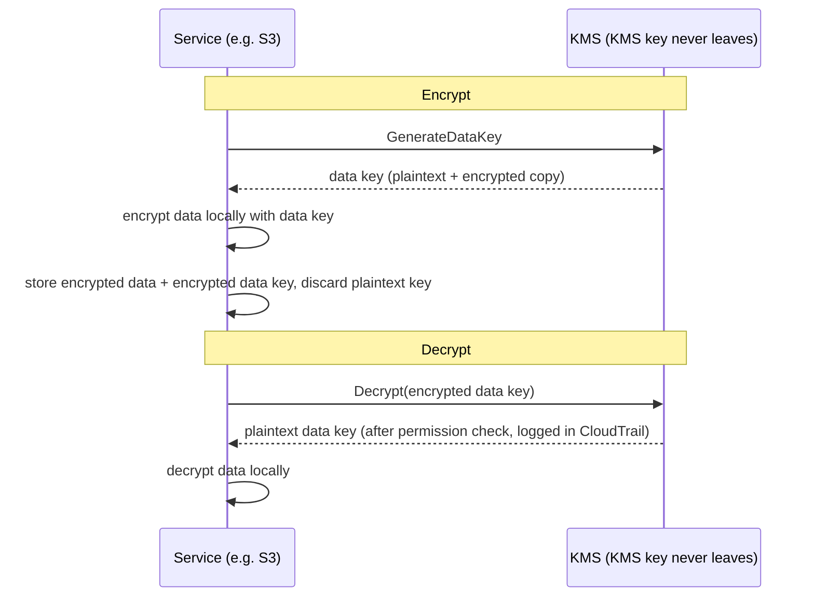

# บทที่ 16: กุญแจ ล็อก และความลับ

git repository มี commit หลายพันอันย้อนหลังสองปี Leo เลื่อนดูมายี่สิบนาที ตามด้ายผ่านประวัติ — มองหาว่า database connection string หนึ่งปรากฏครั้งแรกเมื่อไร เขาเกือบพลาดมัน มันอยู่ในบ่ายวันอังคาร แทรกระหว่าง commit ธรรมดาสองอัน push โดยคนที่ออกจากบริษัทไปแล้ว

รหัสผ่านฐานข้อมูล เป็นข้อความธรรมดา ในประวัติ

---

*การควบคุมเครือข่ายจากบทที่แล้วรัดกุมแล้ว security group จำกัดการเคลื่อนไหวด้านข้าง NACL บล็อกช่วง IP ที่รู้ว่าไม่ดี ขอบถูกเสริมความแข็งแกร่ง แต่การตรวจสอบความปลอดภัยพบบางอย่างที่ขอบแก้ไม่ได้: credential ที่อาศัยอยู่ในประวัติ git มาหกเดือน ความปลอดภัยที่ขอบสมมติว่าความลับภายในปลอดภัย อันนี้ไม่*

---

Leo กำลังตรวจประวัติ git เมื่อเขาพบมัน รหัสผ่านฐานข้อมูล commit เมื่อหกเดือนก่อน เป็นข้อความธรรมดา โดยคนที่ไม่ได้ทำงานที่ Nimbus แล้ว — ส่วนหนึ่งของไฟล์ `.env` ที่ยังมี IAM access key ของ deployment pipeline สองบรรทัดใต้ connection string commit เป็นสาธารณะ รหัสผ่านถูกเปลี่ยนไปแล้ว — แต่พวกเขาไม่รู้แน่ พวกเขาตรวจทุกระบบที่ credential ทั้งสองเคยสัมผัส มันใช้เวลาสี่ชั่วโมง นั่นคือวันที่ Nimbus ตัดสินใจหยุดใส่ความลับในโค้ด

"เราคิดเรื่องว่าจะเกิดอะไรขึ้นถ้ามีคน fork repo หรือยัง?" Priya พูด "ประวัติ git ถาวร แม้เราเปลี่ยนรหัสผ่าน ใครก็ตามที่ clone repo ก่อนการแก้ยังมี credential เก่าในประวัติในเครื่องของพวกเขา"

"เราตรวจแล้ว" Leo พูด "รหัสผ่านถูกเปลี่ยนเมื่อสามเดือนก่อน ทุกระบบยืนยัน"

"นั่นคือขั้นต่ำ" Priya พูด "แต่ทุกระบบที่ credential นั้นสัมผัสต้องถูกทบทวน ไม่ใช่แค่อันที่คุณรู้"

**การตรวจสอบสี่ชั่วโมง**

Leo พบไฟล์ `.env` ที่รั่วในประวัติ git ตอน 10 น. พอบ่าย 2 พวกเขามีคำตอบต่อคำถามที่สำคัญ: credential ทั้งสอง — รหัสผ่านฐานข้อมูลหรือ access key ที่ commit ข้าง ๆ มัน — ถูกใช้โดยใครอื่นนอกจากระบบ Nimbus ไหม?

การตรวจสอบดำเนินผ่านสี่หมวด

**RDS access log**: ทุกการเชื่อมต่อกับฐานข้อมูล มี timestamp และ log รหัสผ่านที่รั่วปรากฏใน connection string สามอัน — ทั้งหมดจาก EC2 instance ใน Nimbus VPC ทั้งหมดมี source IP ที่คาดไว้ ไม่มีการเชื่อมต่อภายนอก รหัสผ่านไม่ถูกใช้เชื่อมต่อฐานข้อมูลจากภายนอก

**S3 access log**: access key ที่รั่วเป็นของ IAM user ของ deployment pipeline ซึ่งมีสิทธิ์สำหรับ bucket `nimbus-receipts` Leo query S3 server access log สำหรับหกเดือนที่ผ่านมา ทุกการเข้าถึงมาจาก EC2 instance ของ `us-west-2` หรือจาก role ดึง origin ของ CloudFront ไม่มีความผิดปกติ

**CloudTrail API call**: ทุก AWS API call ที่ทำด้วย access key ID ที่รั่ว Leo filter CloudTrail event สำหรับ key สามร้อยสิบสอง event — ทั้งหมดเป็น `s3:PutObject` call ตามปกติจาก deployment pipeline ทั้งหมดจาก IP เดียวกัน ทั้งหมดในเวลาทำการ key ถูกใช้จาก IP address เดียวเท่านั้น ซึ่งตรงกับ CI/CD server

"และ CI/CD server" Priya พูด "อยู่ภายใน VPC มันต้อง exfiltrate ข้อมูลผ่าน HTTPS ไปยัง external endpoint และเราจะเห็นนั่นใน flow log"

"เราตรวจแล้ว" Leo พูด "ไม่มี HTTPS ขาออกจากเซิร์ฟเวอร์นั้นไปยัง IP ที่ไม่ใช่ AWS ในหกเดือนที่ผ่านมา"

**คำตัดสิน**: credential ทั้งสองไม่ถูกใช้โดยใครนอกทีม Nimbus การเปิดเผยเป็นความเสี่ยง ไม่ใช่การรั่ว

"แต่เรามั่นใจไม่ได้" Priya พูด "เรามั่นใจพอสมควรตาม log เราแน่ใจไม่ได้ ความแตกต่างนั้นสำคัญ"

"อะไรจะทำให้เราแน่ใจ?"

"ไม่มีอะไรทำให้คุณแน่ใจหลังการเปิดเผย credential คุณหมุนเวียน credential ตรวจสอบการเข้าถึง บันทึกสิ่งที่พบ และก้าวต่อไปด้วยการควบคุมที่ดีกว่า ความแน่ใจไม่มีให้"

Tom คำนวณระหว่างการสนทนา "สี่ชั่วโมงของเวลาวิศวกรสามคน เรียกมันสี่พันดอลลาร์ในต้นทุนเต็ม บวกการหมุนเวียน credential เอกสาร การเขียนรายงานเหตุการณ์"

"และนั่นแค่การสืบสวน" Priya พูด "การรั่วจะมากกว่าเป็นหลายลำดับ การแจ้งหน่วยงานกำกับ การสื่อสารกับลูกค้า อาจมีค่าปรับ"

"ดังนั้นบทเรียนสี่พันดอลลาร์ถูก" Tom พูด

"มาก" Priya พูด "อย่าทำซ้ำมัน"

---

**สองปัญหา: การจัดเก็บ Secrets และการเข้ารหัสข้อมูล**

ความปลอดภัยรอบข้อมูลที่ละเอียดอ่อนมีสองปัญหาที่แตกต่างกัน:

**การจัดเก็บ credential** (รหัสผ่านฐานข้อมูล, API key, connection string): พวกมันอยู่ที่ไหน? ใครเข้าถึงได้? คุณหมุนเวียนพวกมันโดยไม่ต้อง redeploy แอปพลิเคชันได้ยังไง?

**การเข้ารหัสข้อมูล** (ข้อมูลลูกค้า, บันทึกการชำระเงิน, PII): คุณมั่นใจได้ยังไงว่าแม้มีคนได้สิทธิ์เข้าถึงฐานข้อมูลหรือ S3 bucket ของคุณโดยไม่ได้รับอนุญาต พวกเขาอ่านข้อมูลไม่ได้?

AWS มีบริการเฉพาะสำหรับแต่ละปัญหา:

- **AWS Secrets Manager**: จัดเก็บและจัดการ credential อย่างปลอดภัย
- **AWS KMS (Key Management Service)**: จัดการ encryption key สำหรับการเข้ารหัสและถอดรหัสข้อมูล

คิดว่า Secrets Manager เป็นพวงกุญแจ: มันถือกุญแจของคุณ (credential) จัดระเบียบพวกมัน และหมุนเวียนพวกมันตามตาราง คิดว่า KMS เป็นตู้นิรภัย: มันไม่ถือสิ่งที่มีค่า — มันถือกุญแจที่เปิดล็อกที่ปกป้องสิ่งที่มีค่า

**AWS Secrets Manager: ไม่มี Credential ที่ Hardcode อีก**

Secrets Manager คือที่เก็บที่ปลอดภัยสำหรับความลับ: database credential, API key, OAuth token, SSH key หรืออะไรที่ละเอียดอ่อน

แทนที่แอปพลิเคชันของคุณจะอ่านรหัสผ่านจาก environment variable หรือไฟล์ config มันเรียก Secrets Manager API ตอนเริ่มต้น (หรือเมื่อต้องการ) และดึง secret secret ไม่เคยแตะดิสก์ มันไม่เคยปรากฏในโค้ดของคุณ มันไม่อยู่ใน environment variable ของคุณ

นี่คือลักษณะของ flow:

**วิธีเก่า**:
```
DB_PASSWORD=supersecretpassword123  # in .env file or environment variable
```

**วิธี Secrets Manager**:
```python
import boto3
client = boto3.client('secretsmanager')
secret = client.get_secret_value(SecretId='nimbus/production/db-password')
password = json.loads(secret['SecretString'])['password']
```

EC2 instance ต้องการ IAM role ที่มีสิทธิ์เรียก `secretsmanager:GetSecretValue` สำหรับ secret เฉพาะนั้น ไม่มีบริการอื่นอ่านมันได้ secret ไม่เคยอยู่ในโค้ด

คุณอาจสงสัย: ทำไมไม่แค่ใช้ environment variable? พวกมันง่ายกว่า — ตั้งมันตอน deploy และแอปพลิเคชันอ่านมัน environment variable ดูซ่อนอยู่ แต่พวกมันถูกเก็บในการกำหนดค่า deployment ของคุณ ที่เก็บ secret ของ CI/CD อาจถูก log ระหว่าง debug session และมองเห็นได้โดยใครก็ตามที่มีการเข้าถึง process ที่กำลังรัน สำคัญกว่านั้น พวกมัน static: เมื่อตั้งแล้ว พวกมันไม่เปลี่ยนจนกว่ามีคนอัปเดตด้วยมือ Secrets Manager เก็บ credential ในบริการที่เข้ารหัสพร้อมการควบคุมการเข้าถึง IAM, audit logging เต็มผ่าน CloudTrail และการหมุนเวียนอัตโนมัติ environment variable ไม่หมุนเวียน environment variable ที่รั่วยังใช้ได้จนกว่ามีคนเปลี่ยนมันด้วยมือ

**การหมุนเวียนอัตโนมัติ: พลังที่แท้จริง**

ฟีเจอร์ที่ยอดเยี่ยมที่สุดของ Secrets Manager ไม่ใช่การเก็บ secret — มันคือการหมุนเวียนพวกมันโดยอัตโนมัติ

นี่คือสถานการณ์: ทุก 30 วัน Secrets Manager สร้างรหัสผ่านฐานข้อมูลใหม่ อัปเดตมันใน RDS อัปเดต secret ที่เก็บไว้ และแอปพลิเคชันของคุณดึงรหัสผ่านใหม่ในครั้งต่อไปที่ต้องการ ไม่มีการแทรกแซงด้วยมือ ไม่มีการ deploy ไม่มี "ฉันต้องจำว่าต้องหมุนเวียนสิ่งนี้"

การหมุนเวียนถูก implement เป็น Lambda function AWS ให้ template สำหรับ RDS database (MySQL, PostgreSQL, Aurora) คุณ customize function สำหรับ credential ประเภทใดก็ได้

"ราคาเท่าไรต่อเดือน?" Tom ถาม

Secrets Manager คิดต่อ secret ต่อเดือนบวกต่อ API call สำหรับรหัสผ่านฐานข้อมูลและ API key จำนวนน้อย ต้นทุนเป็นดอลลาร์ต่อเดือน — เล็กน้อยเทียบกับต้นทุนของเหตุการณ์

"การ compromise สัปดาห์ที่แล้ว" Priya พูด "จะเสียค่าใช้จ่ายเท่าไรในการสืบสวนและแก้ไข?"

Tom เงียบไปครู่หนึ่ง "รวมเวลาของผม เวลาของคุณ สุดสัปดาห์ของ Leo... สองสามพันดอลลาร์"

"Secrets Manager จะจับ static key ก่อนมันถูกใช้ประโยชน์ และมันจะหมุนเวียนมันโดยอัตโนมัติ"

Tom ดึงหน้าราคาขึ้นมา

**สิ่งที่เกิดขึ้นระหว่างการหมุนเวียน**

"เดี๋ยว — แต่ *ทำไม* เราถึงทำแบบนั้น?" Maya ถาม "ถ้ารหัสผ่านฐานข้อมูลหมุนเวียน แอปพลิเคชันพังไหม? มันรับรหัสผ่านใหม่โดยไม่ต้อง deploy ได้ยังไง?"

นี่เป็นข้อกังวลที่สมเหตุสมผล การหมุนเวียนโดยไม่รบกวนต้องการความระมัดระวัง

การหมุนเวียนของ Secrets Manager ทำงานเป็นขั้น — ออกแบบมาเพื่อป้องกันสถานการณ์ "รหัสผ่านเก่าใช้ไม่ได้กะทันหัน แอปพลิเคชัน crash":

**ขั้นที่ 1: สร้างเวอร์ชัน secret ใหม่** Secrets Manager สร้างรหัสผ่านใหม่และเก็บมันเป็นเวอร์ชัน pending ของ secret เวอร์ชันปัจจุบันยัง active

**ขั้นที่ 2: ตั้งบนบริการ** rotation Lambda เรียกฐานข้อมูลเพื่ออัปเดตรหัสผ่านเป็นค่าใหม่ ระวัง: ด้วยกลยุทธ์การหมุนเวียนแบบ **single-user** เริ่มต้นมีช่วงสั้น ๆ ที่รหัสผ่านเก่าเพิ่งหยุดทำงาน (`ALTER ROLE ... PASSWORD` ของ PostgreSQL มีผลทันที) และเวอร์ชันใหม่ยังไม่เป็นปัจจุบัน สำหรับการหมุนเวียนแบบ zero-downtime Secrets Manager รองรับกลยุทธ์ **alternating-users**: ฐานข้อมูล user สองคนที่มีสิทธิ์เหมือนกัน ที่การหมุนเวียนอัปเดต *คนที่ไม่ active* เสมอแล้วสลับ — credential ที่ active ไม่เคยถูกทำให้ใช้ไม่ได้กลางทาง วลีในข้อสอบที่ต้องจำคือ "alternating users rotation strategy"

**ขั้นที่ 3: ทดสอบ secret ใหม่** rotation Lambda ตรวจสอบว่ารหัสผ่านใหม่ทำงานโดยเชื่อมต่อด้วยมัน ถ้านี่ล้มเหลว การหมุนเวียนถูก roll back

**ขั้นที่ 4: เสร็จ** Secrets Manager มาร์กเวอร์ชันใหม่เป็นเวอร์ชันปัจจุบันและลดเวอร์ชันเก่าเป็นเวอร์ชันก่อนหน้า เวอร์ชันก่อนหน้าถูกเก็บไว้ช่วงเวลา grace

ระหว่างช่วง grace ทั้งสองเวอร์ชันดึงได้ ถ้าแอปพลิเคชันของคุณ cache secret เก่าและยังไม่รับใหม่ มันยังเชื่อมต่อได้ ครั้งต่อไปที่มันเรียก `GetSecretValue` มันได้เวอร์ชันปัจจุบัน (ใหม่)

"ดังนั้นแอปพลิเคชันไม่ต้องรีสตาร์ทเลย" Leo พูด

"ไม่จำเป็น ถ้าแอปพลิเคชันของคุณ cache secret ตอนเริ่มต้นและไม่เคยรีเฟรชมัน คุณต้องรีเฟรชมันตามตารางหรือจัดการความล้มเหลวของการตรวจสอบสิทธิ์โดยดึง secret ใหม่"

"ดังนั้น rotation Lambda และแอปพลิเคชันต้องร่วมมือกัน" Maya พูด

"Secrets Manager ทำครึ่งของมัน โค้ดแอปพลิเคชันของคุณต้องทำอีกครึ่ง: ดึง secret เมื่อต้องการ จัดการความล้มเหลวของการตรวจสอบสิทธิ์โดยดึงใหม่"

Leo อัปเดตแอปพลิเคชันให้จับ exception การตรวจสอบสิทธิ์ฐานข้อมูล และเมื่อล้มเหลว ดึง secret ใหม่จาก Secrets Manager ก่อนลองใหม่ การจัดการ error สองบรรทัด การหมุนเวียนกลายเป็นมองไม่เห็นต่อ user

---

**การฉีด Secret ใน CI/CD Pipeline**

"เราคิดเรื่องว่า deployment pipeline ได้ secret ที่ต้องการอย่างไรหรือยัง?" Priya ถาม "pipeline deploy โครงสร้างพื้นฐาน มันต้องการ AWS credential มันอาจต้องการ database connection string สำหรับ migration script"

Leo อธิบายการตั้งค่าปัจจุบัน: secret ถูกเก็บเป็น GitHub Actions Secret — เข้ารหัสขณะพักใน GitHub ฉีดเป็น environment variable ตอน runtime

"credential อยู่ใน GitHub" Priya พูด

"เข้ารหัส"

"ในระบบบุคคลที่สาม การรั่ว GitHub ครั้งเดียวเปิดเผย secret ของ pipeline เราทั้งหมด"

วิธีแก้: deployment pipeline ตรวจสอบสิทธิ์กับ AWS ผ่าน OIDC federation (ครอบคลุมในบทที่ 14) และดึง secret ที่ต้องการจาก Secrets Manager ตอน runtime ไม่มี secret เก็บใน GitHub AWS role ของ pipeline มีสิทธิ์อ่าน secret เฉพาะ ไม่มีอะไรอื่น

```yaml
# GitHub Actions workflow
- name: Get DB Migration Credentials
  env:
    AWS_DEFAULT_REGION: us-west-2
  run: |
    SECRET=$(aws secretsmanager get-secret-value \
      --secret-id nimbus/staging/db-migration \
      --query SecretString --output text)
    DB_URL=$(echo $SECRET | jq -r '.url')
    # Run migration with DB_URL — never stored in a file
    flyway -url="$DB_URL" migrate
```

secret ถูกดึง ใช้ในหน่วยความจำ และทิ้ง มันไม่เคยถูกเขียนลงดิสก์ ไม่เคยถูกเก็บใน environment variable ที่คงอยู่หลัง job ไม่เคยอยู่ในไฟล์ log

"ถ้า secret ถูกพิมพ์ไปยัง log ล่ะ?" Leo ถาม

"GitHub Actions ปิดบังค่าของ secret ที่กำหนดค่าเป็น GitHub Secret โดยอัตโนมัติ แต่ secret นี้ไม่ใช่ GitHub Secret — มันมาจาก Secrets Manager คุณต้องปิดบังมันด้วยมือ หรือดีกว่า อย่า log มันเลย"

"ดังนั้นวินัยคือ: ดึง ใช้ ทิ้ง อย่า log secret อย่าเก็บมันในไฟล์"

"วินัยนั้น" Priya พูด "คือสิ่งที่การตรวจสอบสี่ชั่วโมงยืนยันว่าเราล้มเหลว"


**AWS KMS: โรงงานล็อก**

"เดี๋ยว — แต่ *ทำไม* เราถึงทำแบบนั้น?" Maya ถาม "ทำไมต้องบริการจัดการ key แยก? เราเข้ารหัสข้อมูลเองและเก็บ key ใน Secrets Manager ไม่ได้หรือ?"

คุณเก็บ encryption key ใน Secrets Manager ได้ แต่แล้วใครควบคุมการเข้าถึง key? อะไรรับประกันว่า key ถูกหมุนเวียน? อะไรพิสูจน์ต่อผู้ตรวจสอบว่า key ถูกใช้เฉพาะโดยบริการที่ได้รับอนุญาต? KMS ตอบทุกคำถามเหล่านี้ มันไม่ใช่แค่ที่เก็บ — มันคือบริการจัดการวงจรชีวิต key พร้อมความปลอดภัยที่หนุนด้วยฮาร์ดแวร์ IAM policy แบบละเอียดต่อ key และ audit trail สมบูรณ์ของทุกการใช้ Secrets Manager เก็บสิ่งที่คุณต้องการเชื่อมต่อกับระบบ KMS ปกป้องระบบเอง

AWS KMS (Key Management Service) จัดการ **cryptographic key** — ค่าลับที่ใช้เข้ารหัสและถอดรหัสข้อมูล

การเปรียบเปรย: KMS เป็นเหมือนบริษัทตู้นิรภัยที่ถือกุญแจหลัก ข้อมูลของคุณ (เนื้อหาในกล่อง) ถูกเข้ารหัส เฉพาะคนที่มีสิทธิ์ใช้ KMS key เท่านั้นที่ถอดรหัสมันได้ KMS log ทุกการใช้ key ทุกอันใน CloudTrail

**Customer Master Keys (CMKs)** — ตอนนี้เรียก KMS key — มีสามประเภทของความเป็นเจ้าของ:

**AWS owned keys**: key ที่ AWS เป็นเจ้าของและใช้ข้ามหลายบัญชีลูกค้า — คุณไม่เคยเห็นพวกมัน ไม่เคยจ่ายสำหรับพวกมัน และพวกมันไม่ปรากฏในบัญชีของคุณ ค่าเริ่มต้นของหลายบริการใช้พวกมัน (เช่น การเข้ารหัสเริ่มต้นของ DynamoDB)

(ความแตกต่างหนึ่งที่ควรจำให้ชัด: การเข้ารหัส **SSE-S3** เริ่มต้นของ S3 *ไม่ใช่* โมเดล KMS key เลย — S3 จัดการ key AES-256 ของตัวเองทั้งหมดนอก KMS โดยไม่มี key ให้เห็นและไม่มี audit trail การใช้ key **SSE-KMS** คือตัวเลือก S3 ที่ผ่าน KMS โดยใช้ AWS managed key `aws/s3` หรือ customer-managed key ทริกเกอร์ในข้อสอบ: "ตรวจสอบว่าใครใช้ encryption key" หรือ "ควบคุมการหมุนเวียนและ key policy" → SSE-KMS พร้อม customer-managed key — ทุกการใช้ลงใน CloudTrail)

**AWS managed keys**: AWS สร้างและจัดการ key โดยอัตโนมัติ *ในบัญชีของคุณ* สำหรับบริการเช่น S3, EBS, RDS (ตั้งชื่อเช่น `aws/s3`) คุณเห็นมันและตรวจสอบการใช้มันใน CloudTrail ได้ แต่คุณเปลี่ยน policy หรือการหมุนเวียนของมันไม่ได้ — AWS หมุนเวียนมันโดยอัตโนมัติทุกปี ฟรี

**Customer managed keys**: คุณสร้าง key ใน KMS และควบคุมทุกด้านของมัน: ใครใช้มันได้ เมื่อมันหมุนเวียน ใครบริหารมัน คุณเปิดการหมุนเวียน key อัตโนมัติด้วยช่วงที่กำหนดค่าได้ระหว่าง 90 วันถึง 2,560 วัน (7 ปี); ช่วงการหมุนเวียนเริ่มต้นคือ 365 วัน (รายปี) คุณยังทริกเกอร์ **on-demand rotation** ทันทีได้ — มีประโยชน์หลังการเปิดเผยที่สงสัย โดยไม่ต้องรอตาราง หมายเหตุ: การหมุนเวียนอัตโนมัติใช้กับ symmetric key ที่มี key material ที่ KMS สร้าง — asymmetric key และ key material ที่ import ไม่หมุนเวียนอัตโนมัติ ต้นทุน: $1/เดือน ต่อ key บวกค่า API call

ถ้าคุณเลือก customer-managed KMS key คุณจะได้การควบคุมเต็มเหนือตารางการหมุนเวียน access policy และการมองเห็น audit แต่คุณจ่ายต่อ key ต่อเดือนและรับผิดชอบการจัดการ key; ถ้าคุณเลือก AWS-managed key คุณจะได้การเข้ารหัสโดยไม่มี overhead ด้านการดำเนินงานและไม่มีต้นทุนสำหรับ key เอง แต่คุณ customize ตารางการหมุนเวียนหรือ key policy ไม่ได้ — พวกมันจัดการโดย AWS ทั้งหมด

**การเข้ารหัสใน AWS Services: การรวม KMS**

AWS service ส่วนใหญ่รวมกับ KMS สำหรับการเข้ารหัส:

**S3**: เปิด "server-side encryption with KMS" บน bucket ทุก object ถูกเข้ารหัสขณะพักด้วย KMS key การอ่าน object ต้องการสิทธิ์ทั้ง S3 bucket *และ* KMS key

**RDS**: เปิดการเข้ารหัสตอนสร้าง ที่เก็บฐานข้อมูล, backup และ snapshot ถูกเข้ารหัสด้วย KMS key ทั้งหมด หมายเหตุ: เปิดการเข้ารหัสบน RDS instance ที่ไม่เข้ารหัสที่มีอยู่ไม่ได้ — คุณต้อง snapshot คัดลอก snapshot พร้อมเปิดการเข้ารหัส และ restore

**EBS**: เข้ารหัส volume ด้วย KMS volume ใหม่ที่สร้างจาก snapshot ที่เข้ารหัสถูกเข้ารหัสโดยอัตโนมัติ

**DynamoDB**: การเข้ารหัสขณะพักโดยใช้ KMS ถูกเปิดโดยค่าเริ่มต้นบนทุกตาราง

**ElastiCache Redis**: การเข้ารหัสขณะพักด้วย KMS สำหรับข้อมูลที่ cache ที่ละเอียดอ่อน

หลักการ: ข้อมูลควรถูกเข้ารหัสขณะพัก (เก็บบนดิสก์) และระหว่างส่ง (เคลื่อนผ่านเครือข่าย) KMS จัดการการเข้ารหัสขณะพัก TLS/SSL (ให้โดยอัตโนมัติโดย AWS service) จัดการการเข้ารหัสระหว่างส่ง

**Envelope Encryption: KMS ทำงานจริงอย่างไร**

นี่คือรายละเอียดที่ช่วยให้คุณเข้าใจพฤติกรรม KMS และคำถามข้อสอบ

KMS ไม่ได้เข้ารหัสข้อมูลของคุณโดยตรงในกรณีส่วนใหญ่ มันใช้ **envelope encryption**:

1. KMS สร้าง **data key** (symmetric key ที่ไม่ซ้ำ)
2. บริการใช้ data key เข้ารหัสข้อมูลของคุณในเครื่อง (เร็ว — symmetric encryption)
3. บริการขอให้ KMS เข้ารหัส data key เอง (โดยใช้ KMS key ของคุณ)
4. ทั้งข้อมูลที่เข้ารหัสและ data key ที่เข้ารหัสถูกเก็บ
5. ข้อมูลจริงของคุณไม่เคยออกจากบริการ — เฉพาะ data key ไปยัง KMS เพื่อการเข้ารหัส/ถอดรหัส

เมื่อคุณอ่านข้อมูล:

1. บริการขอให้ KMS ถอดรหัส data key
2. KMS ตรวจสิทธิ์ ถอดรหัส data key ส่งคืนมัน
3. บริการใช้ data key ที่ถอดรหัสถอดรหัสข้อมูลของคุณในเครื่อง



นี่หมายความว่า KMS จัดการข้อมูลขนาดใหญ่มากได้โดยไม่ต้องส่งทั้งหมดผ่าน KMS API เฉพาะ key เล็กไปยัง KMS CloudTrail log ทุก KMS API call — ทุกการเข้ารหัสและถอดรหัส

**KMS Key Policies: โมเดลการเข้าถึง**

"เราคิดเรื่องว่าจะเกิดอะไรขึ้นถ้า IAM policy และ key policy ขัดแย้งกันหรือยัง?" Priya ถาม "KMS มีการควบคุมการเข้าถึงของตัวเองบน IAM"

KMS key มี **key policy** — resource-based policy ที่แนบกับ key เอง พวกมันแยกจาก IAM policy และตามกฎการประเมินที่ต่างกัน

เพื่อให้ principal ใช้ KMS key สองสิ่งต้องเป็นจริง:

**อันแรก**: key policy ต้องอนุญาตมัน ถ้า key policy ไม่ให้ principal เข้าถึงอย่างชัดเจน พวกเขาใช้ key ไม่ได้ — ไม่ว่า IAM policy ของพวกเขาจะว่าอย่างไร นี่ต่างจาก AWS resource ส่วนใหญ่ ที่ IAM policy อย่างเดียวเพียงพอ

**อันที่สอง**: IAM policy ของ principal ต้องอนุญาต KMS action (เช่น `kms:Decrypt`, `kms:GenerateDataKey`)

ทั้งสองต้องบอกใช่ อันใดอันหนึ่งบอกไม่ หมายถึง action ถูกปฏิเสธ

key policy เริ่มต้นที่ AWS สร้างสำหรับ customer-managed key มี statement ที่บอก "root account จัดการ key นี้ได้" นี่สำคัญ: มันหมายความว่า IAM administrator ระดับบัญชีให้การเข้าถึง key ได้เสมอ แม้ key policy ไม่ตั้งชื่อพวกเขาโดยตรง — เพราะการมอบหมาย root account อยู่ในที่

"ดังนั้นถ้าเราเอา root account ออกจาก key policy" Leo ถาม "IAM policy หยุดทำงานสำหรับ key นั้น?"

"ถูกต้อง การเอาการมอบหมาย root account ออกเป็นวิธีล็อก key แน่นจนเฉพาะ principal เฉพาะที่ตั้งชื่อใน key policy เท่านั้นที่ใช้มันได้ — แม้แต่ administrator ของบัญชีก็ไม่ได้ มันยังเป็นวิธีล็อกตัวเองออกจาก key ของตัวเองโดยบังเอิญด้วย"

"เรากู้ได้ไหม?"

"เฉพาะโดยติดต่อ AWS Support ถ้าไม่มีใครใช้ key ได้และ key policy อัปเดตไม่ได้ ข้อมูลที่เข้ารหัสด้วย key นั้นเข้าถึงไม่ได้โดยพฤตินัย"

"ดังนั้นอย่าเอา root account ออกจาก key policy โดยไม่มีเหตุผลที่ดีมาก"

"ถูกต้อง"

---

**Asymmetric Keys: การลงนามและการยืนยัน**

KMS ยังรองรับ asymmetric key pair — public key และ private key

กรณีใช้งาน:

**Digital signing**: คุณลงนามเอกสารหรือ JWT token ด้วย private key ใครก็ตามที่มี public key ยืนยันได้ว่าลายเซ็นมาจากผู้ถือ private key และเนื้อหาไม่ถูกแก้ไข

**Public key encryption**: ใครก็ตามเข้ารหัสข้อมูลด้วย public key ได้ เฉพาะผู้ถือ private key ถอดรหัสมันได้

สำหรับ Nimbus asymmetric key กลายเป็นเรื่องเกี่ยวข้องเมื่อพวกเขา implement ระบบลายเซ็น webhook สำหรับพาร์ทเนอร์ร้านอาหาร เมื่อ Nimbus ส่ง event ไปยังเซิร์ฟเวอร์ของพาร์ทเนอร์ร้านอาหาร (ออเดอร์ใหม่, การอัปเดตสถานะ) พาร์ทเนอร์ต้องยืนยันว่า event มาจาก Nimbus จริงและไม่ถูกปลอม

การ implement:

1. Nimbus สร้าง asymmetric KMS key (RSA 2048-bit, อัลกอริทึม SIGN_VERIFY)
2. เมื่อส่ง webhook Nimbus เรียก `kms:Sign` ด้วย private key เพื่อลงนาม event payload
3. ลายเซ็นถูกรวมใน webhook header
4. Nimbus เผยแพร่ public key (ดาวน์โหลดได้จาก KMS console)
5. เซิร์ฟเวอร์ของพาร์ทเนอร์ร้านอาหารดึง public key และใช้มันยืนยันลายเซ็นบนทุก webhook ที่เข้ามา

private key ไม่เคยออกจาก KMS Nimbus ไม่เคยเข้าถึง private key material ดิบ KMS ทำการลงนามภายใน hardware security module ของมัน

"ดังนั้นแม้มีคน compromise เซิร์ฟเวอร์ Nimbus" Rafael พูด "พวกเขาปลอมลายเซ็น webhook ไม่ได้ private key อยู่ใน KMS ไม่ใช่บนเซิร์ฟเวอร์ใด"

"ถูกต้อง การลงนามต้องการ KMS API call ทุก API call ถูก log ใน CloudTrail ถ้ามีคนพยายามลงนาม event ปลอม เราจะเห็น API call"

---

**เรื่องราวการลบ Key**

สามเดือนหลังการตั้งค่า KMS Tom ทำผิดพลาด

เขากำลังทำความสะอาดทรัพยากร AWS ที่ไม่ได้ใช้ — Lambda function เก่า, S3 bucket ที่เก่า, CloudWatch dashboard ที่ถูกทิ้ง เขาเคลื่อนเร็ว เขากำหนด KMS key สำหรับการลบโดยบังเอิญ

key คือ `nimbus/prod/order-receipts` — customer-managed key ที่ใช้เข้ารหัส S3 bucket ใบเสร็จออเดอร์

"ผม batch-delete ทรัพยากรสิบสองอันเมื่อวานและไม่ได้ตรวจว่าอันที่สิบสองคืออะไร" Tom พูดเรียบ ๆ เขากำหนดการลบและเดินต่อ เขาสังเกตความผิดเช้าวันถัดไปเมื่อเขาทบทวนการกระทำของเขา

เขาดึง KMS console สถานะ key อ่านว่า: "Pending deletion. Deletion in 7 days."

เขากำหนดมันสำหรับช่วงเวลารอขั้นต่ำ

"เรายกเลิกมันได้ไหม?" เขาถาม

Priya ดึงเอกสาร "ได้ ระหว่างช่วงเวลารอ key ถูกปิดแต่ไม่ถูกลบ คุณยกเลิกการลบได้"

Tom ยกเลิกการลบภายในนาที key ถูกคืนสู่สถานะ active

"เจ็ดวันคือช่วงเวลารอขั้นต่ำ" Priya พูด "AWS บังคับมันเพราะถ้า key ถูกลบและข้อมูลถูกเข้ารหัสด้วยมัน ข้อมูลนั้นหายไปตลอดกาล กู้ไม่ได้ ช่วงเวลารอให้คุณมีเวลาตระหนักความผิดพลาด"

"ช่วงเวลารอควรนานแค่ไหน?"

"สูงสุดคือสามสิบวัน สำหรับ key ใดที่เข้ารหัสข้อมูล production ใช้สามสิบวัน การป้องกันเพิ่มสามสัปดาห์จากอุบัติเหตุคุ้มกับความไม่สะดวกเล็กน้อย"

Tom อัปเดตการตั้งค่าการลบ key production ทั้งหมดเป็นสามสิบวัน เขายังตั้ง CloudWatch alarm ที่ยิงถ้าสถานะ KMS key ใดเปลี่ยนเป็น "Pending deletion" — ดังนั้นครั้งต่อไปที่มีคน (รวมถึงเขา) ทำผิดเดียวกัน ทีมจะรู้ภายในห้านาที

---

**Secrets Manager vs Parameter Store**

AWS ยังมี **Systems Manager Parameter Store** ซึ่งเก็บค่า configuration (ไม่ใช่แค่ secret) Parameter Store ถูกกว่า — ฟรีสำหรับ standard parameter มันยังเก็บ encrypted parameter โดยใช้ KMS ได้

สำหรับ secret ที่ต้องการการหมุนเวียน: Secrets Manager

สำหรับค่า configuration และ parameter ที่ไม่ละเอียดอ่อน: Parameter Store (free tier ใจกว้างมาก)

สำหรับ configuration แอปพลิเคชัน (หมายเลขพอร์ต, feature flag, การตั้งค่าเฉพาะสภาพแวดล้อม): Parameter Store

| | Secrets Manager | SSM Parameter Store |
|---|---|---|
| การหมุนเวียนอัตโนมัติ | ใช่ (หนุนด้วย Lambda) | ไม่ |
| ต้นทุน | ~$0.40/secret/เดือน | ฟรี (standard) |
| การเข้ารหัส | เสมอ | ทางเลือก (ด้วย KMS) |
| Versioning | ใช่ | ใช่ |
| Cross-account access | ใช่ | จำกัด |
| เหมาะที่สุดสำหรับ | รหัสผ่านฐานข้อมูล, API key | ค่า config, feature flag |

## ใบรับรองที่ประตู

สองสัปดาห์หลังการย้าย secret Priya กำลังทบทวนสภาพแวดล้อม staging ของ Nimbus บนโทรศัพท์เมื่อเธอสังเกต address bar

"Not Secure"

เธอดึง production URL เหมือนกัน

"Leo" เธอพูด วางโทรศัพท์บนโต๊ะ "เรารันบน HTTP อยู่หรือ?"

Leo ตรวจ "ALB listener อยู่บนพอร์ต 80 เราไม่เคยตั้ง HTTPS"

"ดังนั้นทุกคำขอที่ user ของเราทำ — ทุกออเดอร์ ทุก login — ไปผ่าน HTTP ที่ไม่เข้ารหัส?"

"เรามี TLS บน RDS connection" Leo เสนอ

"นั่นคือข้อมูลระหว่างส่งระหว่างแอปพลิเคชันและฐานข้อมูล ฉันกำลังพูดถึงข้อมูลระหว่างส่งระหว่างเบราว์เซอร์ของ user และ load balancer ของเรา นั่นไม่ได้เข้ารหัสเลย"

Tom ฟังอยู่ "นั่นเป็นปัญหาความปลอดภัยหรือปัญหาการรับรู้?"

"ทั้งสอง" Priya พูด "HTTP ที่ไม่เข้ารหัสหมายความว่าเครือข่ายใดระหว่าง user และเซิร์ฟเวอร์ของเรา — router ร้านกาแฟ, ISP — อ่าน traffic ได้ รหัสผ่าน รายละเอียดออเดอร์ session token และเบราว์เซอร์สมัยใหม่เตือน user ด้วย 'Not Secure' นั่นฆ่าอัตรา conversion"

"ดังนั้นเราต้องการ TLS certificate" Maya พูด "ราคาเท่าไร?"

"ไม่มี" Priya พูด "AWS Certificate Manager"

**AWS Certificate Manager (ACM)** จัดหา TLS/SSL certificate ฟรีสำหรับใช้กับบริการที่ AWS จัดการ: ALB, CloudFront distribution และ API Gateway คุณไม่ซื้อ certificate จัดการปฏิทินการต่ออายุ หรือแตะ private key material ACM จัดการวงจรชีวิต certificate ทั้งหมด

certificate ที่ออกโดย ACM ใช้ได้ 13 เดือน ก่อนมันหมดอายุ ACM ต่ออายุมันโดยอัตโนมัติ ถ้าการต่ออายุสำเร็จ certificate ใหม่ถูกแนบกับ load balancer หรือ distribution ของคุณโดยไม่ต้องดำเนินการจากคุณ แม่กุญแจของเบราว์เซอร์ยังเขียว การแจ้งเตือนหมดอายุที่คุณลืมตั้งไม่เคยยิง

**สอง ACM certificate ประเภท**:

**Public certificate** ออกโดย certificate authority ของ Amazon และเชื่อถือโดยเบราว์เซอร์หลักทั้งหมด พวกมันฟรีโดยสิ้นเชิงสำหรับใช้กับ ALB, CloudFront และ API Gateway คุณยืนยันความเป็นเจ้าของ domain ผ่าน DNS หรืออีเมล

**Private certificate** ออกโดย AWS Private CA — managed private certificate authority ที่คุณรันสำหรับบริการภายใน (service-to-service mTLS, เครื่องมือภายใน, VPN client) Private CA มีต้นทุนรายเดือน

สำหรับ Nimbus public certificate คือทางเลือกที่ถูกต้อง

**DNS validation vs. email validation**:

Leo ดึง ACM console และเริ่มคำขอ certificate สำหรับ `eatnimbus.com` และ `*.eatnimbus.com`

"มันถามว่าฉันอยากยืนยันความเป็นเจ้าของอย่างไร" เขาพูด "DNS หรืออีเมล"

"DNS" Priya พูด "DNS เสมอ"

ด้วย DNS validation ACM เพิ่ม CNAME record เฉพาะใน hosted zone ของคุณ Route 53 ทำสิ่งนี้โดยอัตโนมัติได้ — คลิกเดียวใน console ตราบใดที่ CNAME record นั้นมีอยู่ ACM ต่ออายุ certificate โดยอัตโนมัติได้โดยไม่ต้องดำเนินการจากมนุษย์ email validation ส่งอีเมลไปยังผู้ติดต่อที่ลงทะเบียนของ domain และต้องการการคลิกด้วยมือทุกครั้งที่ certificate ต่ออายุ การคลิกนั้นถูกลืม DNS validation ไม่ต้องการให้ใครจำอะไร

"ดังนั้นผมเพิ่ม CNAME record ครั้งเดียว" Leo พูด "และมันต่ออายุตลอดไป?"

"จนกว่ามีคนลบ CNAME record" Priya พูด "อย่าลบ CNAME record"

Leo ขอ certificate เพิ่ม validation CNAME ใน Route 53 (ซึ่ง ACM เสนอทำให้โดยอัตโนมัติ) และรอห้านาที สถานะ certificate เปลี่ยนเป็น Issued เขาแนบมันกับ HTTPS listener ของ ALB บนพอร์ต 443 และเพิ่มกฎ redirect บนพอร์ต 80 เพื่อส่ง HTTP traffic ทั้งหมดไป HTTPS

Tom รีเฟรช production URL

แม่กุญแจปรากฏ

รายละเอียดระดับ region หนึ่งที่ควร flag: certificate เป็นทรัพยากรระดับ region และมันต้องอยู่ใน region เดียวกับบริการที่ใช้มัน สำหรับ ALB นั่นคือ region ของ ALB สำหรับ **CloudFront** certificate ต้องถูกขอ (หรือ import) ใน **`us-east-1`** — เสมอ ไม่ว่า origin ของคุณรันที่ไหน — เพราะ CloudFront เป็นบริการ global ที่ยึดที่นั่น Leo สะดุดมันแล้วในบทที่ 13; มันยังเป็นข้อเท็จจริงในข้อสอบที่เชื่อถือได้

**สิ่งเดียวที่ ACM certificate ทำไม่ได้**:

"ผมดาวน์โหลด certificate ได้ไหม?" Leo ถาม "ผมอยากติดตั้งมันบน internal admin EC2 instance"

"ไม่" Priya พูด

ACM public certificate ฟรี export ไม่ได้ คุณดาวน์โหลด private key และติดตั้งมันบน EC2 instance, Nginx server หรืออะไรนอกบริการที่ AWS จัดการไม่ได้ private key material ไม่เคยออกจาก ACM นี่ตั้งใจ — มันป้องกันไม่ให้ private key รั่ว ถูกเก็บอย่างไม่ปลอดภัย หรือถูกลืมเมื่อ certificate หมดอายุ

สำหรับกรณีใช้งานที่ต้องการ certificate ที่ติดตั้งได้ — EC2 instance ที่ทำหน้าที่เป็น custom proxy, on-premises server — มีสามเส้นทาง: certificate จาก third-party authority (เช่น Let's Encrypt), AWS Private CA พร้อมเปิดการ export certificate หรือ — ตั้งแต่มิถุนายน 2025 — ACM **exportable public certificate** แบบเสียเงิน (opt-in ตอนออก คิดต่อ FQDN หรือ wildcard) ซึ่ง private key *export* ได้สำหรับใช้ที่ไหนก็ได้

"สำหรับ ALB และ CloudFront distribution ของเรา" Priya พูด "ACM ถูกต้องเป๊ะ ฟรี อัตโนมัติ และเราไม่เคยแตะ key"

## จุดแข็งและข้อจำกัด

**AWS Secrets Manager**:

- การหมุนเวียน secret อัตโนมัติโดยไม่เปลี่ยนโค้ดหรือ deploy
- การควบคุมการเข้าถึง IAM แบบละเอียดต่อ secret (แต่ละ secret เป็น IAM resource แยก)
- Versioning — เวอร์ชันก่อนหน้ายังเข้าถึงได้ระหว่างการหมุนเวียน ป้องกันการเชื่อมต่อหลุด
- audit ผ่าน CloudTrail — ทุก `GetSecretValue` call ถูก log พร้อม identity ของผู้เรียก
- Cross-account access — secret ของบัญชีหนึ่งแชร์กับ role ของอีกบัญชีได้
- ต้นทุน: ~$0.40/secret/เดือน + API call (ประมาณ $0.05 ต่อ 10,000 API call)

**AWS KMS**:

- การจัดการ key แบบรวมศูนย์พร้อม audit trail เต็ม — ทุกการเข้ารหัสและถอดรหัสถูก log
- การหมุนเวียน key อัตโนมัติที่กำหนดค่าได้สำหรับ customer-managed key (90 วันถึง 2,560 วัน; เริ่มต้น 365 วัน) — key material เก่ายังถอดรหัสข้อมูลที่มีอยู่ key material ใหม่เข้ารหัสข้อมูลใหม่
- สิทธิ์ IAM แบบละเอียดต่อ key (key policy + IAM policy — ทั้งสองต้องอนุญาต)
- หนุนด้วย Hardware Security Module (HSM) — key ไม่เคยออกจาก HSM เป็น plaintext
- รองรับ Multi-Region key สำหรับสถานการณ์ disaster recovery
- รองรับ asymmetric key สำหรับ digital signing และการยืนยัน
- ต้นทุน: $1/เดือน ต่อ key + $0.03 ต่อ 10,000 API call

**ที่ที่มันซับซ้อน**:

- KMS key policy แยกจาก (และประเมินควบคู่กับ) IAM policy — การดีบัก error access denied ต้องตรวจทั้งสอง
- การเข้ารหัสขณะพักต้องวางแผนล่วงหน้า — คุณเข้ารหัส RDS instance ที่ไม่เข้ารหัสที่มีอยู่ในที่ไม่ได้
- การลบ key ใน KMS มีช่วงเวลารอ 7-30 วัน — กลไกความปลอดภัย แต่ลืมง่ายระหว่างการตั้งค่าและอันตรายถ้าทริกเกอร์โดยบังเอิญ
- การหมุนเวียนต้องการโค้ดแอปพลิเคชันจัดการการดึง secret ใหม่เมื่อการตรวจสอบสิทธิ์ล้มเหลว — Secrets Manager หมุนเวียน credential แต่แอปพลิเคชันต้องรับมัน
- ต้นทุน Secrets Manager scale กับจำนวน secret และปริมาณ API call ในระดับใหญ่
- key policy เริ่มต้น (รวมการมอบหมาย root account) สำคัญที่จะรักษาไว้ — การเอามันออกล็อก administrator ออกจาก key ได้

## สรุป

สี่ชั่วโมงที่ใช้ติดตาม credential ที่ถูก compromise ผ่านทุกระบบที่มันสัมผัสคือสี่ชั่วโมงที่ Secrets Manager ป้องกันได้ การหมุนเวียนอัตโนมัติหมายความว่า credential ที่ถูกขโมยมีอายุสั้น KMS หมายความว่าแม้มีคนถึงข้อมูล พวกเขาอ่านมันไม่ได้โดยไม่มี key ที่พวกเขาไม่ได้รับอนุญาตให้ใช้ และช่วงเวลารอการลบ key สามสิบวันหมายความว่าการลบโดยบังเอิญถูกยกเลิกได้ก่อนมันกลายเป็นเหตุการณ์ข้อมูลสูญหาย

- ไม่เคยเก็บ credential ในโค้ด environment variable หรือไฟล์ config ที่ commit เข้า version control
- **Secrets Manager** เก็บ credential อย่างปลอดภัยและหมุนเวียนพวกมันโดยอัตโนมัติ แอปพลิเคชันดึง secret ผ่าน API ตอน runtime
- **การหมุนเวียน** เกิดเป็นขั้น: สร้างเวอร์ชันใหม่ อัปเดตบนบริการ ทดสอบ promote ทั้งเวอร์ชันเก่าและใหม่ใช้ได้ชั่วครู่ ป้องกันการเชื่อมต่อหลุดระหว่างการหมุนเวียน
- **KMS** จัดการ encryption key AWS service ส่วนใหญ่รวมกับ KMS สำหรับการเข้ารหัสขณะพัก
- **Envelope encryption**: KMS เข้ารหัส key ไม่ใช่ข้อมูลโดยตรง บริการเข้ารหัสข้อมูลโดยใช้ local data key ซึ่ง KMS เข้ารหัส เฉพาะ key เล็กข้าม KMS API
- **Customer-managed KMS key**: การควบคุมเต็มเหนือการหมุนเวียน (กำหนดค่าได้ 90–2,560 วัน เริ่มต้น 365 วันรายปี) การเข้าถึง และ audit ($1/เดือน) **AWS-managed key**: อัตโนมัติ ไม่ต้องกำหนดค่า ฟรี
- **KMS key policy**: key policy คือ resource-based policy ที่ทำงานควบคู่กับ IAM ทั้งสองต้องบอกใช่ การมอบหมาย root account ใน key policy เริ่มต้นรับประกันว่า IAM administrator ให้การเข้าถึงได้เสมอ
- **Asymmetric keys**: KMS รองรับ RSA และ ECC key pair สำหรับการลงนามและการยืนยัน private key ไม่เคยออกจาก HSM
- **การลบ key**: ช่วงเวลารอขั้นต่ำ 7 วัน สูงสุด 30 วัน key ที่ถูกลบหมายถึงข้อมูลที่เข้ารหัสเข้าถึงไม่ได้ถาวร ใช้ 30 วันสำหรับ key production และตรวจสอบสถานะ pending deletion
- **CI/CD secret**: ดึงจาก Secrets Manager ตอน runtime โดยใช้ OIDC federation ไม่เคยเก็บ secret เป็นตัวแปรแพลตฟอร์ม CI/CD

## เคล็ดลับการสอบ

*SAA-C03 Domain: ออกแบบสถาปัตยกรรมที่ปลอดภัย (Domain 1, Task 1.3)*

- **Secrets Manager vs SSM Parameter Store**: Secrets Manager สำหรับ credential ที่ต้องการการหมุนเวียนอัตโนมัติ; Parameter Store สำหรับ configuration ทั่วไป ข้อสอบแยกแยะพวกมันด้วยความต้องการการหมุนเวียนและความไวต่อต้นทุน
- **KMS key policy**: KMS key มี key policy ของตัวเอง (resource-based policy) IAM policy อย่างเดียวไม่ให้การเข้าถึง KMS key — key policy ต้องอนุญาตมันอย่างชัดเจน ทั้ง key policy และ IAM policy ต้องอนุญาต action
- **การเข้ารหัส RDS**: เปิดการเข้ารหัสบน RDS instance ที่ไม่เข้ารหัสที่มีอยู่ไม่ได้ กระบวนการ: สร้าง snapshot → คัดลอก snapshot พร้อมเปิดการเข้ารหัส → restore จาก snapshot ที่เข้ารหัส → ย้าย traffic ไปยัง instance ใหม่
- **EBS encryption**: volume ใหม่เข้ารหัสได้ snapshot ของ volume ที่เข้ารหัสเข้ารหัสเสมอ volume ที่ไม่เข้ารหัสเข้ารหัสโดยตรงไม่ได้ — snapshot + copy + restore
- **CloudTrail + KMS**: ทุก KMS API call ถูก log ใน CloudTrail นี่คือฟีเจอร์ compliance สำคัญ เมื่อข้อสอบถามว่าจะตรวจสอบว่าใครถอดรหัสข้อมูลใด คำตอบคือ CloudTrail + KMS
- **Multi-Region KMS keys**: ทำซ้ำ key material ไปหลาย region ดังนั้นการถอดรหัสเกิดได้โดยไม่ต้อง cross-region API call ข้อสอบใช้สิ่งนี้สำหรับ multi-region disaster recovery พร้อมข้อมูลที่เข้ารหัส
- **KMS vs CloudHSM**: KMS เป็น multi-tenant (จัดการโดย AWS) CloudHSM คือ hardware security module เฉพาะที่คุณควบคุมเท่านั้น สัญญาณในข้อสอบ: "FIPS 140-2 Level 3" "dedicated HSM" "การดำเนินการเข้ารหัสที่ลูกค้าจัดการ" → CloudHSM
- **Envelope encryption**: KMS สร้าง data key บริการใช้มันเข้ารหัสข้อมูลในเครื่อง KMS เข้ารหัส data key คำถามข้อสอบ: "ทำไม KMS ไม่เข้ารหัสข้อมูลจำนวนมากโดยตรง?" → ประสิทธิภาพ; envelope encryption เก็บข้อมูลใหญ่ไว้ในเครื่อง
- **Asymmetric KMS keys**: ใช้สำหรับ digital signing, การยืนยัน JWT หรือ public key encryption private key ไม่เคยออกจาก KMS `kms:Sign` คือ API call เพื่อลงนาม; `kms:Verify` เพื่อยืนยัน
- **ช่วงเวลารอการลบ key**: 7-30 วัน ระหว่างช่วงนี้ key ถูกปิดและใช้ไม่ได้ แต่การลบยกเลิกได้ หลังการลบ ข้อมูลใดที่เข้ารหัสด้วย key นั้นกู้ไม่ได้ถาวร
- **ACM (AWS Certificate Manager):** TLS certificate สาธารณะฟรีสำหรับใช้กับ ALB, CloudFront และ API Gateway ต่ออายุอัตโนมัติผ่าน DNS validation public certificate ฟรี export private key ไม่ได้ — พวกมันอยู่ภายใน AWS เท่านั้น (ตัวเลือก *exportable public certificate* แบบเสียเงินมีตั้งแต่ปี 2025 สำหรับใช้กับ EC2/on-premises) ทริกเกอร์ในข้อสอบ: "HTTPS บน load balancer หรือ CDN" → ACM

## แบบฝึกหัด

**แบบฝึกหัด 1 — ทบทวน**

อธิบายแนวคิดของ envelope encryption ทำไม KMS เข้ารหัส data key เล็กแทนการเข้ารหัสข้อมูลแอปพลิเคชันของคุณโดยตรง?

*(คำใบ้: คิดถึงว่าจะเกิดอะไรขึ้นถ้าคุณมีข้อมูล 1GB ที่จะเข้ารหัส และนัยด้านประสิทธิภาพของการส่ง 1GB ไปยังบริการ KMS ระยะไกลจะเป็นอย่างไร)*

**แบบฝึกหัด 2 — สถานการณ์ SAA-C03**

*สถานการณ์*: บริษัทบริการทางการเงินเก็บข้อมูลลูกค้าที่ละเอียดอ่อนในฐานข้อมูล RDS MySQL ความต้องการ compliance ใหม่กำหนดว่า:

1. ข้อมูลทั้งหมดต้องเข้ารหัสขณะพัก
2. การใช้ encryption key ทั้งหมดต้องตรวจสอบได้
3. encryption key ต้องถูกควบคุมโดยลูกค้า (ไม่ใช่จัดการโดย AWS)
4. รหัสผ่านฐานข้อมูลต้องหมุนเวียนโดยอัตโนมัติทุก 90 วัน

ฐานข้อมูลถูกสร้างเมื่อหกเดือนก่อนโดยไม่เปิดการเข้ารหัส ชุดการกระทำใดตอบทั้งสี่ความต้องการได้ดีที่สุด?

A) เปิด RDS encryption บนฐานข้อมูลที่มีอยู่; สร้าง customer-managed KMS key; กำหนดค่า Secrets Manager ด้วยการหมุนเวียน 90 วัน  
B) สร้าง snapshot ของฐานข้อมูลที่มีอยู่; คัดลอก snapshot พร้อมการเข้ารหัสโดยใช้ customer-managed KMS key; restore จาก snapshot ที่เข้ารหัส; กำหนดค่า Secrets Manager ด้วยการหมุนเวียน 90 วัน  
C) สร้าง RDS instance ที่เข้ารหัสใหม่ด้วย AWS-managed key; ย้ายข้อมูลจาก instance เก่า; กำหนดค่า Secrets Manager ด้วยการหมุนเวียน 90 วัน  
D) เปิด RDS at-rest encryption บนฐานข้อมูลที่มีอยู่โดยใช้ AWS-managed key; กำหนดค่า Secrets Manager ด้วยการหมุนเวียน 90 วัน

**คำใบ้ 1**: คุณเปิดการเข้ารหัสบน RDS instance ที่ไม่เข้ารหัสที่มีอยู่โดยตรงไม่ได้

**คำใบ้ 2**: key ที่ "ควบคุมโดยลูกค้า" หมายถึง customer-managed KMS key ไม่ใช่ AWS-managed key

**คำใบ้ 3**: กระบวนการคัดลอก snapshot คือเส้นทางการย้ายมาตรฐานไป RDS ที่เข้ารหัส

**คำตอบ**: B

**คำอธิบาย**: RDS encryption เปิดบน instance ที่มีอยู่ไม่ได้ แนวทางมาตรฐานคือ: snapshot instance ที่มีอยู่ → คัดลอก snapshot พร้อมเปิดการเข้ารหัสโดยใช้ customer-managed KMS key (ตอบความต้องการ 1, 2 และ 3) → restore จาก snapshot ที่เข้ารหัส customer-managed KMS key log การใช้ทั้งหมดใน CloudTrail โดยอัตโนมัติ (การตรวจสอบ) และเก็บ encryption key ภายใต้การควบคุมของคุณ Secrets Manager จัดการการหมุนเวียนรหัสผ่าน 90 วันอัตโนมัติ (ตอบความต้องการ 4)

**ทำไมไม่ใช่ A?** คุณเปิดการเข้ารหัสบน RDS instance ที่ไม่เข้ารหัสที่มีอยู่ในที่ไม่ได้

**ทำไมไม่ใช่ C?** AWS-managed key ไม่ตอบความต้องการ "ควบคุมโดยลูกค้า" (ความต้องการ 3)

**ทำไมไม่ใช่ D?** ปัญหาเดียวกับ A (เปิดในที่ไม่ได้) บวก AWS-managed key ไม่ตอบความต้องการ 3

*SAA-C03 Domain: ออกแบบสถาปัตยกรรมที่ปลอดภัย — Task 1.3*

**แบบฝึกหัด 3 — ความท้าทายด้านสถาปัตยกรรม** *(ทางเลือก)*

Nimbus ต้องเก็บข้อมูลที่ละเอียดอ่อนต่อไปนี้:

- รหัสผ่านฐานข้อมูลสำหรับ production RDS instance
- Stripe API secret key (ใช้สำหรับการประมวลผลการชำระเงิน)
- symmetric encryption key สำหรับเข้ารหัสประวัติออเดอร์ลูกค้าใน DynamoDB
- ค่า configuration รายร้านอาหาร (API endpoint, feature flag — ไม่ละเอียดอ่อน)

คุณจะใช้บริการหรือแนวทาง AWS ใดสำหรับแต่ละอัน? คุณจะใช้กลยุทธ์การหมุนเวียนใดกับแต่ละอัน?

*(ไม่มีคำตอบที่ถูกต้องเพียงข้อเดียว เป้าหมายคือการฝึก match เครื่องมือความปลอดภัยกับกรณีใช้งาน)*

## ฉากหลังเครดิต

"ผมdeployไปแล้ว — อ้อ" Leo ย้าย production secret ไป Secrets Manager ขณะที่สภาพแวดล้อม development ยังใช้ environment variable เก่า สภาพแวดล้อม dev พัง เขาต้อง roll back dev config ด้วยมือ

"Stage ก่อน" Priya พูด "แล้วค่อย production"

"ผมรู้" Leo พูด

secret ถูกย้าย

รหัสผ่านฐานข้อมูล: Secrets Manager หมุนเวียนทุก 30 วัน

API key: Secrets Manager พร้อม rotation Lambda ที่เรียก API ของผู้ให้บริการชำระเงินเพื่อสร้าง key ใหม่

ข้อมูลออเดอร์ลูกค้า: เข้ารหัสด้วย customer-managed KMS key

credential เก่า: ถูก deactivate ไฟล์ config เก่า: ถูกลบ GitHub Actions secret เก่า: ถูกเอาออก

"ตอนนี้เราพร้อมตรวจสอบแล้ว" Priya พูด

"นิยาม audit-ready" Maya พูด

"ถ้าผู้ตรวจสอบ compliance ขอให้เราพิสูจน์ว่าไม่มี credential hardcode ในโค้ดของเราหรือเปิดเผยในโครงสร้างพื้นฐานของเรา เราแสดงพวกเขาได้: ทุก secret อยู่ใน Secrets Manager ทุก encryption key อยู่ใน KMS ทุกการเข้าถึงถูก log ใน CloudTrail"

"ครั้งล่าสุดที่มีคนตรวจ CloudTrail log เมื่อไร?"

การหยุดชั่วคราว

"ฉันตรวจพวกมันทุกสัปดาห์" Priya พูด

"และถ้ามีอะไรผิดปกติปรากฏ เราจะรู้ได้ยังไง?"

"นั่น" Priya พูด ปิดแล็ปท็อปของเธอ "คือการสนทนาถัดไป"

ในบทต่อไป: สามชั้นการป้องกันที่ยืนระหว่าง Nimbus และอินเทอร์เน็ต
