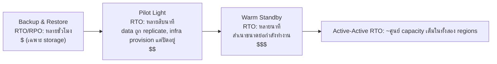

# บทที่ 18: เมื่อสิ่งต่างๆ พัง

ไฟดับเมื่อเวลา 23:17 น.

ไม่ใช่ในออฟฟิศของ Nimbus — Leo อยู่ที่บ้าน นั่งอยู่บนโซฟา แล็ปท็อปแง้มไว้ครึ่งหนึ่ง ไฟดับในดาต้าเซ็นเตอร์แห่งหนึ่งในรัฐออริกอนที่เขาไม่เคยไปเยือน ในอาคารที่เขาไม่เคยเห็น ในห้องที่เต็มไปด้วยเซิร์ฟเวอร์ที่เขาไม่เคยแตะต้อง เขายังไม่รู้ มีช่วงเวลาหนึ่ง — แค่ชั่วขณะ — ที่เงียบสนิทก่อนที่เครื่องกำเนิดไฟสำรองจะทำงานขึ้นมาที่ไหนสักแห่งไกลออกไป ความมืดแบบที่คุณบอกไม่ได้ว่าลืมตาอยู่หรือหลับตาอยู่

แล้วการแจ้งเตือน Slack ก็มาถึง

---

หลังจากระบบ monitoring จากบทที่ 17 เข้าที่เข้าทางแล้ว ทีมก็รู้สึกถึงบางอย่างที่คล้ายกับความมั่นใจ Alerts กำลังทำงาน Dashboards เป็นสีเขียว Logs ไหลเข้าสู่ CloudWatch พวกเขาใช้เวลาสามสัปดาห์ในการต่อสาย visibility เข้าไปในทุกซอกทุกมุมของ infrastructure ของ Nimbus

สิ่งที่ไม่มีใครพูดออกมาดังๆ — สิ่งที่ monitoring ไม่ได้ป้องกัน — คือ visibility กับ resilience นั้นเป็นคนละเรื่องกัน คุณสามารถเฝ้าดูบางสิ่งล้มเหลวด้วยรายละเอียดที่สมบูรณ์แบบ การเฝ้าดูมันไม่ได้หยุดมัน

บทเรียนนั้นมาถึงในเวลา 23:23 น. ของวันพฤหัสบดี

---

Leo ได้รับการแจ้งเตือน Slack

"us-west-2 — data center cluster failure — degraded service"

เขาเปิด AWS console EC2 instances ในหนึ่งใน Availability Zones กำลังแสดง status checks ที่ล้มเหลว Auto Scaling Group ของเขาตรวจพบ instances ที่ไม่แข็งแรงและกำลัง spin up ตัวแทน — ใน zone เดียวกัน

ใน cluster ที่กำลังล้มเหลว

instances ใหม่ก็เริ่มไม่ได้เช่นกัน พวกมันอยู่ใน hardware failure zone เดียวกัน

"load balancer กำลัง routing traffic ไปยังทั้งสอง AZs" Leo พูดกับตัวเอง "traffic ครึ่งหนึ่งของเรากำลังไปยัง instances ที่ไม่ทำงาน"

เขาเปิด EC2 console และเริ่มคลิก ภายใต้ Load Balancers, Application Load Balancer แสดง target groups ทั้งสองว่าแข็งแรง — เพราะ health check ผ่านบน port 80 และแม้แต่ instances ที่ล้มเหลวก็ยังตอบสนองต่อ check นั้น พวกมันแค่ประมวลผล request จริงไม่ได้

เขาพยายามนำ AZ ที่ล้มเหลวออกจาก target group console ยอมรับการเปลี่ยนแปลง แต่ Auto Scaling Group ซึ่งตั้งค่าไว้ให้รักษาสมดุล เริ่มพยายามแทนที่ instances ที่ถูก terminate ทันที — ใน zone ที่ล้มเหลวเดียวกัน

Leo จ้องมองหน้าจอ เขาเพิ่งทำให้มันแย่ลง

เขาเปิดการตั้งค่า ASG การตั้งค่า "Balance capacity across Availability Zones" กำลังทำงานอยู่ ในการทำงานปกติ นี่เป็นการออกแบบที่ดี ตอนนี้มันกำลังต่อสู้กับเขาอย่างแข็งขัน

เขาเปลี่ยน ASG ให้ใช้เฉพาะ zone ที่แข็งแรง นำการเปลี่ยนแปลงไปใช้

console แสดงการเปลี่ยนแปลงเป็น "In Service"

สามนาทีต่อมา instances ตัวแทนที่แข็งแรงตัวแรกขึ้นมา

load balancer เริ่ม routing traffic Error rate ลดลงจาก 52% เหลือ 4% ส่วน 4% ที่เหลือคือ requests ที่ไปตกอยู่ที่ instances ที่ไม่แข็งแรงไม่กี่ตัวสุดท้ายที่ยังคง draining connections อยู่

เมื่อถึงเวลา 23:45 น. — ยี่สิบสองนาทีหลังจากความล้มเหลวเริ่มขึ้น — traffic ก็เสถียร

ยี่สิบสองนาทีของ service ที่ลดคุณภาพก่อนที่เขาจะสังเกตเห็นและสลับ ASG ด้วยตนเองให้ใช้เฉพาะ zone ที่แข็งแรง

"เรื่องนี้เกิดขึ้นเพราะทุกอย่างอยู่ใน AZ เดียว" Priya พูดในเช้าวันรุ่งขึ้น

"ไม่" Leo พูด "ผมมี instances ในสอง AZs ปัญหาคือ instances ตัวแทนกำลังเกิดขึ้นใน AZ ที่ล้มเหลว"

"แล้ว database ล่ะ?"

Leo หยุดชะงัก

"RDS primary อยู่ใน zone ที่ล้มเหลว" เขาพูด "Multi-AZ ทำหน้าที่ของมันจริงๆ — มัน failover ไปยัง standby ใน zone ที่แข็งแรงในเวลาประมาณเก้าสิบวินาที แต่ application servers ของเรายังคงเปิด dead connections ไว้และ retry IP address ที่ cache ไว้แทนที่จะ re-resolve DNS name ของ endpoint database แข็งแรงตั้งแต่ 23:25 น. แอปของเราไม่ได้ reconnect อย่างสะอาดจนกระทั่งผม restart connection pools"

ยี่สิบสองนาทีของ service ที่ลดคุณภาพกลายเป็นสามสิบแปดนาที

ตอนที่ Leo ตั้งค่า Auto Scaling Group เมื่อแปดเดือนก่อน เขาได้ติ๊กการตั้งค่า "balance capacity across AZs" และคิดว่าแค่นั้นก็ดีพอแล้ว "มันจะไม่เป็นไรหรอก" เขาบอก Maya ในตอนนั้น "AWS จัดการเรื่อง AZ ให้อัตโนมัติ" เขาพูดถูกที่ว่า AWS จัดการมัน — และพูดผิดเกี่ยวกับความหมายของคำว่า "อัตโนมัติ"

"อะไรจะเกิดขึ้น" Maya ถามในเช้าวันรุ่งขึ้น "ถ้าเราตั้งค่าทุกอย่างอย่างถูกต้อง? การตั้งค่า Multi-AZ ที่ถูกต้องในความล้มเหลวจริงหน้าตาเป็นอย่างไร?"

Leo คิดเกี่ยวกับมัน เขาคิดเรื่องนี้มาตั้งแต่ 23:45 น.

ในการตั้งค่าที่ถูกต้องเชิงสมมติฐาน: ASG จะมี instance health checks ที่ดู ALB health — ไม่ใช่แค่ EC2 status เมื่อ AZ ล้มเหลว health check บน instances เหล่านั้นจะล้มเหลวภายใน 30 วินาที ASG จะตรวจพบความล้มเหลวและเริ่ม launch ตัวแทนทันที — และเมื่อการ launch ล้มเหลวอย่างต่อเนื่องใน AZ หนึ่ง group จะย้าย capacity ไปยัง zones ที่แข็งแรงที่เหลือแทนที่จะต่อสู้กับ zone ที่ล้มเหลว

load balancer จะนำ targets ของ AZ ที่ล้มเหลวออกจากการหมุนเวียนภายใน 30 วินาทีเดียวกัน Traffic จะกระจุกตัวอยู่ใน AZ ที่แข็งแรง

สำหรับ database: ตัว Multi-AZ failover เองทำงานได้ — สิ่งที่ขาดไปคือวินัยของ client Connection pools ที่ re-resolve DNS name ของ endpoint เมื่อ reconnect (แทนที่จะ cache IP), DNS cache TTLs ที่สั้น และ retry logic ด้วยสิ่งเหล่านั้นเข้าที่ การ RDS failover จะเป็นการสะดุดเพียง 60–120 วินาที ไม่ใช่หางยาว 16 นาที

ผลกระทบรวมที่ลูกค้ามองเห็น: 60-90 วินาทีของ latency ที่ลดคุณภาพในขณะที่ database failover ไม่ใช่ 38 นาทีของ cascading errors

"เรามี infrastructure ทั้งหมดที่จะรอดจากเรื่องนี้" Leo พูด "เราแค่ตั้งค่ามันไม่ถูกต้อง"

ประโยคนั้นพูดยากกว่าเหตุการณ์เดิมเสียอีก

**การเปรียบเปรยกับกริดไฟฟ้า**

ลองนึกถึงวิธีที่บ้านของคุณได้รับไฟฟ้า ไฟฟ้าไม่ได้มาจากสายไฟเส้นเดียวที่ลากจากเครื่องกำเนิดไฟเครื่องเดียว มันมาจาก grid — เครือข่ายของเครื่องกำเนิดไฟ สถานีย่อย และสายส่งที่สำรองซึ่งกันและกัน ถ้าสถานีย่อยแห่งหนึ่งไฟไหม้ สถานีอื่นๆ จะ reroute ไฟรอบๆ มัน คุณไม่สังเกตเห็น ไฟยังคงติดอยู่

Availability Zones ของ AWS ทำงานในแบบเดียวกัน แทนที่จะเป็นดาต้าเซ็นเตอร์ยักษ์เดียวที่ทุกอย่างต้องพึ่งพา AWS กระจาย resources ของคุณไปทั่วสถานที่ทางกายภาพหลายแห่งที่แยกจากกัน ถ้าสถานที่หนึ่งไฟดับหรือมี hardware failure สถานที่อื่นๆ ยังคงทำงานต่อ Traffic reroute อัตโนมัติ แอปพลิเคชันของคุณยังคงทำงาน — เพราะไม่เคยมีสายเดียวที่จะตัดได้

นี่คือ **Multi-AZ architecture**: การกระจาย resources ของคุณไปทั่วสถานที่ทางกายภาพที่แยกจากกัน เพื่อให้ความล้มเหลวเดียวไม่ทำให้ทุกอย่างล่มไปด้วย

Multi-Region คือระดับถัดไป: ลองนึกถึงการมีเครื่องกำเนิดไฟสำรองในเมืองที่แตกต่างไปอย่างสิ้นเชิง ถ้ากริดไฟฟ้าท้องถิ่นทั้งหมดล่ม เมืองที่อยู่ห่างไกลจะเข้ามารับช่วงต่อ ตั้งค่าซับซ้อนกว่า แต่ทนทานต่อความล้มเหลวขั้นหายนะได้มากกว่า

คุณอาจสงสัยว่า: ถ้า Multi-AZ หมายถึงแค่การกระจาย resources ไปทั่วดาต้าเซ็นเตอร์สองแห่ง ทำไม AWS ไม่ทำให้มันเป็นค่าเริ่มต้นสำหรับทุกอย่าง? คำตอบคือต้นทุน Multi-AZ เพิ่ม infrastructure ขึ้นเป็นสองเท่าโดยประมาณ — และสำหรับ development environment หรือ internal tool ที่มี traffic ต่ำ ต้นทุนเพิ่มเติมนั้นไม่คุ้มค่า แต่สำหรับ production workloads คำถามจะกลับด้าน: คุณรับ downtime ได้ไหมถ้าคุณไม่มีมัน?

**คำศัพท์เกี่ยวกับความล้มเหลว**

ก่อนที่จะออกแบบเพื่อ resilience คุณต้องมีคำศัพท์สำหรับสิ่งที่คุณกำลังออกแบบเพื่อต่อต้าน

"เราจะวัดได้อย่างไรว่าเรา resilient พอหรือยัง?" Priya ถาม

"สองตัวเลข" Leo พูด "เราหยุดทำงานได้นานแค่ไหน และเราสูญเสียข้อมูลได้มากแค่ไหน"

**Availability**: เปอร์เซ็นต์ของเวลาที่ระบบทำงานได้ "สี่เก้า" (99.99%) หมายถึง downtime น้อยกว่า 52 นาทีต่อปี "ห้าเก้า" (99.999%) หมายถึงประมาณ 5 นาทีต่อปี

**RTO (Recovery Time Objective)**: ระบบจะหยุดทำงานได้นานแค่ไหนก่อนที่มันจะกลายเป็นปัญหาทางธุรกิจ? ถ้า RTO ของคุณคือ 4 ชั่วโมง คุณมีเวลา 4 ชั่วโมงในการกู้คืน service ก่อนที่ SLAs จะถูกละเมิด

**RPO (Recovery Point Objective)**: คุณยอมสูญเสียข้อมูลได้มากแค่ไหน? ถ้า RPO ของคุณคือ 1 ชั่วโมง คุณยอมรับการสูญเสียข้อมูลได้สูงสุดหนึ่งชั่วโมงในความล้มเหลวขั้นหายนะ ทุกอย่างที่ถูกเขียนในหนึ่งชั่วโมงสุดท้ายก่อนความล้มเหลวจะหายไป

**Fault tolerance**: ความสามารถในการทำงานต่อ (ในบางระดับ) เมื่อ component หนึ่งล้มเหลว

**Disaster recovery (DR)**: กระบวนการกู้คืนจากความล้มเหลวขั้นหายนะ — ดาต้าเซ็นเตอร์ไฟไหม้ outage ทั้ง region การลบข้อมูลจำนวนมากโดยไม่ตั้งใจ

แนวคิดทั้งห้านี้ขับเคลื่อนทุกการตัดสินใจเชิงสถาปัตยกรรมในบทนี้

**RTO และ RPO เป็นการตัดสินใจทางธุรกิจ ไม่ใช่ทางเทคนิค**

ตัวเลขสำคัญน้อยกว่าว่าใครเป็นคนกำหนดมัน วิศวกรสามารถเดา RTO ได้ ผู้มีส่วนได้เสียทางธุรกิจรู้ว่า outage 30 นาทีมีต้นทุนจริงๆ เท่าไร

ลองพิจารณาสองบริษัทที่มี technology stack เหมือนกัน:

บริษัท fintech ที่ประมวลผลการซื้อขายหลักทรัพย์: RTO 4 นาที, RPO เป็นศูนย์ ระบบ trading ที่ล่มไป 4 นาทีในช่วงเวลาตลาดเปิดอาจพลาดธุรกรรมหลายพันรายการ แต่ละธุรกรรมที่พลาดมีมูลค่าเป็นดอลลาร์โดยตรง การสูญเสียข้อมูลเป็นศูนย์ไม่ใช่เรื่องเชิงปรัชญา — การสูญเสียการซื้อขายที่ยืนยันแล้วเพียงรายการเดียวหมายถึงปัญหาด้าน compliance และการฟ้องร้องจากลูกค้า ต้นทุนสถาปัตยกรรมเพื่อให้ได้สิ่งนี้: active-active Multi-AZ พร้อม synchronous replication งบประมาณ infrastructure ต่อปีระดับหกหลัก

แพลตฟอร์มสั่งอาหารร้านอาหาร: RTO 30 นาที, RPO 5 นาที outage 30 นาทีในช่วงเร่งด่วนมื้อค่ำเจ็บปวดจริงๆ และเสียเงินจริงๆ แต่การสูญเสียออเดอร์ 5 นาทีสุดท้ายก่อนความล้มเหลวหมายถึงลูกค้าจำนวนหนึ่งต้องสั่งใหม่ — น่ารำคาญ ไม่ใช่หายนะ ต้นทุนสถาปัตยกรรมเพื่อให้ได้สิ่งนี้: warm standby Multi-AZ เป็นเศษเสี้ยวของงบประมาณ fintech

"เดี๋ยว — แต่*ทำไม*แพลตฟอร์มร้านอาหารถึงยอมรับการสูญเสียข้อมูล 5 นาที?" Maya ถามเมื่อ Leo อธิบายเรื่องนี้ "นั่นยังคงเป็นการสูญเสียออเดอร์ของลูกค้าไม่ใช่หรือ?"

"คำถามคือการป้องกันการสูญเสียข้อมูลนั้นมีต้นทุนมากกว่าคุณค่าที่ได้หรือไม่" Leo พูด "การลด RPO จาก 5 นาทีเหลือ 0 จะต้องใช้ synchronous replication ข้าม regions นั่นเป็นต้นทุนและการลงทุนทางวิศวกรรมที่สำคัญ สำหรับแอปร้านอาหารในขนาดของเรา RPO 5 นาทีคือ trade-off ที่ถูกต้อง"

บทเรียน: RTO และ RPO ไม่ใช่ขั้นต่ำทางเทคนิค พวกมันเป็น trade-offs ทางธุรกิจที่แสดงออกมาเป็นตัวเลข การกำหนดมันต้องอาศัยทั้งทีมวิศวกรรม (ผู้รู้ว่าอะไรทำได้) และผู้มีส่วนได้เสียทางธุรกิจ (ผู้รู้ว่าอะไรยอมรับได้)

**Multi-AZ: การรอดจากความล้มเหลวของ Availability Zone**

Availability Zone (AZ) คือดาต้าเซ็นเตอร์ที่แยกจากกันทางกายภาพภายใน Region AZs ถูกออกแบบให้เป็นอิสระ: ระบบจ่ายไฟแยก ระบบทำความเย็นแยก network infrastructure แยก แต่อยู่ใกล้กันพอที่ network latency ระหว่างกันจะอยู่ที่ 1-2 มิลลิวินาที

**การ deploy แบบ Multi-AZ** กระจาย resources ของคุณไปทั่วสองหรือมากกว่า AZs ภายใน Region ถ้า AZ หนึ่งล้มเหลว:

- load balancer หยุด routing ไปยัง instances ที่ไม่แข็งแรงใน AZ ที่ล้มเหลว
- Auto Scaling Group แทนที่ instances — แต่ใน AZ ที่*แข็งแรง*
- RDS failover ไปยัง standby ใน AZ ที่แข็งแรง

ความผิดพลาดของ Leo: Auto Scaling Group ของเขาไม่ได้ถูกตั้งค่าให้จำกัด instances ตัวแทนเฉพาะ AZs ที่แข็งแรง มันถูกตั้งค่าให้รักษาสมดุลระหว่าง AZs เมื่อ zone ล้มเหลว ASG พยายามรักษาสมดุลจำนวน instances โดย spin up ตัวแทนที่นั่น — ใน zone ที่ล้มเหลว

วิธีแก้: ตั้งค่า ASG ให้ launch เฉพาะใน AZs ที่แข็งแรง โดยมีอย่างน้อยสอง AZs ทำงานอยู่เสมอ

บทเรียนที่ลึกกว่า: ทดสอบ failure scenarios ของคุณก่อนที่มันจะเกิดขึ้นใน production

ถ้าคุณเลือก Multi-AZ คุณจะได้ automatic failover และ RPO ใกล้ศูนย์ — แต่คุณกำลังจ่ายเงินสำหรับ infrastructure ที่ไม่ให้บริการ traffic ใดๆ ในระหว่างการทำงานปกติ RDS standby instance นั้นทำงานอยู่เสมอ replicating อยู่เสมอ และไม่เคยตอบ query จนกว่า primary จะล้มเหลว นั่นคือ trade-off: ความน่าเชื่อถือมีค่าใช้จ่ายแม้ในตอนที่ไม่มีอะไรพัง

**Chaos Engineering: การรันครั้งแรกหน้าตาเป็นอย่างไร**

การรัน chaos engineering ครั้งแรกที่ Nimbus ไม่สะอาดเรียบร้อยเหมือนที่เอกสารทำให้ฟังดู

Leo รันขั้นตอนที่ 2 ของ runbook: บังคับ RDS Multi-AZ failover เขาใช้ AWS CLI:

```
aws rds reboot-db-instance \
    --db-instance-identifier nimbus-prod \
    --force-failover
```

คำสั่งคืนค่ากลับมาทันที Leo เริ่มจับเวลา

T+0s: Failover เริ่มต้น RDS console แสดง primary status เป็น "rebooting"

T+18s: Application logs เริ่มแสดง database connection errors connection pool กำลังลองใช้ old primary ซึ่งไม่ใช่ primary อีกต่อไป

T+34s: RDS console แสดง status เป็น "backing-up" primary ใหม่กำลังถูก promote DNS CNAME (database endpoint) กำลังถูกอัปเดต

T+52s: Application logs เริ่มแสดง successful connections อีกครั้ง connection pool ได้ใช้ retries บน old primary จนหมดและ reconnect ไปยัง CNAME ซึ่งตอนนี้ชี้ไปยัง primary ใหม่

T+4:17: connections ทั้งหมดถูกสร้างขึ้นใหม่ Error rate กลับเป็นศูนย์

รวม: 4 นาที 17 วินาที

"นั่นคือ 257 วินาทีของ database unavailability" Tom พูด "tablets ของพันธมิตรร้านอาหารของเราแสดงตัวบ่งชี้ที่หมุนอยู่เป็นเวลา 4 นาที"

"SLA ของเราบอกว่า 5 นาที" Leo พูด

"เราจึงผ่าน แบบเฉียดฉิว" Priya พูด

"สองข้อสังเกต" Tom พูด "ข้อแรก: เราผ่านเพราะ RTO commitment ของเราใจกว้าง ไม่ใช่เพราะสถาปัตยกรรมของเราเร็วเป็นพิเศษ ข้อสอง: พฤติกรรม retry ของ connection pool คือสิ่งที่ซื้อเวลาเพิ่มอีก 34 วินาทีให้เรา ถ้าแอปพลิเคชันยอมแพ้หลังจาก 10 วินาที เราคงไม่ผ่าน"

Leo อัปเดต runbook เพื่อบันทึกเวลาที่สังเกตได้ เป้าหมายสำหรับไตรมาสถัดไป: ลดเวลา failover detection จาก 52 วินาทีให้ต่ำกว่า 30 โดยปรับ parameters ของ connection pool และ health check logic ของแอปพลิเคชัน

"Chaos engineering ไม่ใช่การทดสอบครั้งเดียว" Priya พูด "มันเป็น feedback loop คุณทดสอบ คุณพบตัวเลขจริง คุณปรับปรุง คุณทดสอบอีกครั้ง"

ครั้งที่สามที่พวกเขารัน failover test หกเดือนต่อมา recovery time คือ 1 นาที 44 วินาที ไม่ใช่เพราะ RDS เร็วขึ้น — แต่เพราะพวกเขาปรับแต่งแอปพลิเคชัน

**การจำลองความล้มเหลว: Chaos Engineering**

"เราจะรู้ได้อย่างไรว่าการตั้งค่า Multi-AZ ของเราทำงานได้จริง?" Maya ถาม

"เราทำลายสิ่งต่างๆ โดยตั้งใจ" Leo พูด

"เดี๋ยว — แต่*ทำไม*เราถึงทำแบบนั้น?" Maya พูด "ทำไมไม่แค่เชื่อใจว่าเอกสาร AWS บอกว่ามันทำงานได้?"

"เพราะเอกสารอธิบายว่า service ทำงานอย่างไร มันไม่ได้อธิบายว่า*การตั้งค่าของคุณ*ทำงานอย่างไร พวกมันเป็นคนละเรื่องกัน"

Priya โน้มตัวไปข้างหน้า "เราคิดถึงสิ่งที่เกิดขึ้นเมื่อ health check ของ load balancer และ health check ของ ASG ไม่ตรงกันหรือยัง? load balancer อาจนำ instance ออกจากการหมุนเวียน แต่ ASG คิดว่า instance นั้นแข็งแรงและไม่แทนที่มัน เราจะมี capacity ที่ load balancer มองไม่เห็น"

"นั่นแหละคือสิ่งที่ chaos engineering จะพบ" Leo พูด

ฟังดูประมาท จริงๆ แล้วมันเป็นสิ่งที่รับผิดชอบที่สุดที่ทีมหนึ่งสามารถทำได้

**การทดสอบ RTO Commitments**

นี่คือความจริงอันน่าอึดอัดเกี่ยวกับ RTO: ทีมส่วนใหญ่กำหนด RTO แล้วไม่เคยทดสอบว่าพวกเขาสามารถทำได้จริงหรือไม่

RTO 30 นาทีไม่ใช่การรับประกัน มันเป็นเป้าหมาย วิธีเดียวที่จะรู้ว่าคุณจะบรรลุมันหรือไม่คือการจำลองความล้มเหลวและจับเวลาการกู้คืน

หลังจากเหตุการณ์ 23:23 น. ทีม Nimbus มุ่งมั่นที่จะทดสอบแต่ละ failure mode ทุกไตรมาส ไม่ใช่แค่ด้วยตนเอง — แต่ด้วย acceptance criteria ที่เขียนไว้ การกู้คืนจาก AZ failure ต้องเสร็จภายใน 10 นาที การกู้คืนจาก RDS failover ต้องเสร็จภายใน 5 นาที Database restore จาก backup (การทดสอบ backup-and-restore DR) ต้องเสร็จภายใน 2 ชั่วโมง

ตัวเลขเหล่านี้มาจากการสนทนากับพันธมิตรร้านอาหาร ผู้บอกว่า outage ในช่วงเร่งด่วนมื้อค่ำที่ต่ำกว่า 10 นาทีนั้น "เจ็บปวดแต่ยอมรับได้" เกิน 30 นาทีคือเรื่องที่ต้องคุยกันเรื่องสัญญา

"การเจรจา SLA ควรเกิดขึ้นก่อนที่คุณจะกำหนด RTO" Maya พูด "ไม่ใช่หลังจากนั้น"

เธอพูดไม่ผิด พวกเขาทำมันกลับด้าน พวกเขากำหนด RTO ภายในแล้วค่อยตระหนักว่าต้องตรวจสอบกับสิ่งที่ธุรกิจต้องการจริงๆ

การกำหนด RTO และ RPO ในลำดับที่ถูกต้อง: ความต้องการทางธุรกิจก่อน สถาปัตยกรรมเพื่อตอบสนองมันเป็นอันดับสอง ทดสอบเพื่อยืนยันเป็นอันดับสาม ทีมส่วนใหญ่เริ่มจากสถาปัตยกรรมและทำงานย้อนกลับ ตัวเลขจึงแย่ลงเพราะมัน

**Chaos engineering** คือการปฏิบัติของการ inject ความล้มเหลวเข้าสู่ระบบของคุณโดยเจตนาเพื่อยืนยันว่ามันจัดการกับมันได้อย่างถูกต้อง คุณ terminate EC2 instance โดยเจตนา คุณ fail over RDS instance ด้วยตนเอง คุณ block subnet จาก load balancer

ถ้าระบบกู้คืนอัตโนมัติภายใน RTO ของคุณ การออกแบบของคุณทำงานได้

ถ้าไม่ คุณก็ได้เรียนรู้สิ่งนั้นในสภาพแวดล้อมที่ควบคุมได้ — ไม่ใช่ในระหว่างเหตุการณ์ production ตอนตี 2

สำหรับ Nimbus: Leo เขียน runbook (ขั้นตอนที่มีการบันทึกไว้) สำหรับการทดสอบแต่ละ failure scenario หนึ่งครั้งต่อไตรมาส พวกเขาจะตั้งใจทำให้ component หนึ่งล้มเหลวและวัด recovery time ถ้าการกู้คืนใช้เวลานานกว่า RTO พวกเขาจะแก้ไขการออกแบบ

**Multi-Region: การรอดจากความล้มเหลวของ Region**

ความล้มเหลวส่วนใหญ่ของ AWS ส่งผลกระทบต่อ Availability Zones ไม่ใช่ทั้ง Regions ความล้มเหลวระดับ regional นั้นหายาก — แต่มันเกิดขึ้น

ในความล้มเหลวระดับ regional (หรือสำหรับแอปพลิเคชันระดับโลกที่ต้องการ latency ต่ำมากทุกที่) **Multi-Region** คือคำตอบ: deploy แอปพลิเคชันของคุณในสองหรือมากกว่า AWS Regions

Multi-Region นำมาซึ่งความซับซ้อนพื้นฐาน:

**Data replication**: databases ของคุณต้อง sync กันข้าม regions ข้อมูลใดๆ ที่เขียนใน us-east-1 ต้องไปถึง eu-west-1 ในที่สุด "ในที่สุด" คือปัญหา — ในช่วงเวลาที่ล่าช้า regions มีมุมมองของโลกที่แตกต่างกันเล็กน้อย

**Active-passive vs active-active**:

- **Active-passive**: region หนึ่งให้บริการ traffic ทั้งหมด อีก region เป็น warm standby เมื่อล้มเหลว DNS สลับ traffic ไปยัง standby ง่ายกว่า แต่ standby เฉื่อยและแพง
- **Active-active**: ทั้งสอง regions ให้บริการ traffic พร้อมกัน สร้างซับซ้อนกว่า (ต้องการ conflict resolution สำหรับ concurrent writes) แต่ latency ต่ำกว่าทั่วโลกและไม่มี resources ที่เฉื่อย

Active-active ฟังดูน่าสนใจจนกว่าคุณจะคิดให้รอบคอบเกี่ยวกับ writes ถ้าลูกค้าวางออเดอร์ใน us-east-1 และพร้อมกันนั้นร้านอาหารอัปเดตเมนูใน eu-west-1 และมี network partition ระหว่าง regions write ใดชนะ? นี่คือ CAP theorem ในทางปฏิบัติ: ในระบบกระจาย ระหว่าง network partition คุณต้องเลือกระหว่าง consistency (ทั้งสอง regions เห็นด้วยกับข้อมูลเดียวกัน) และ availability (ทั้งสอง regions ยังคงรับ requests แม้ในขณะที่ไม่ตรงกัน) Active-active ไม่ได้ขจัดทางเลือกนี้ มันต้องการให้คุณเลือกอย่างชัดเจนใน data model ของคุณ

สำหรับ Nimbus: active-passive พวกเขาไม่ต้องการคิดเรื่อง concurrent write conflicts ในข้อมูลเมนูและออเดอร์ primary region ที่เป็น authoritative เดียวนั้นง่ายกว่าและปลอดภัยกว่าในขั้นนี้

**Failover time**: การเปลี่ยน DNS ใช้เวลาในการแพร่กระจาย (ขึ้นอยู่กับ TTL) ในช่วงการแพร่กระจาย ผู้ใช้บางคนยังคงเข้าถึง region ที่ล้มเหลว การออกแบบเพื่อ RTO ที่ต่ำมากต้องการการ pre-warm standby และลด TTL ก่อนการสลับที่วางแผนไว้

**Route 53 DNS Failover: ชั้น Network ของ DR**

ก่อนที่จะไปถึงสเปกตรัมของกลยุทธ์ DR เต็มรูปแบบ มันคุ้มค่าที่จะเข้าใจว่า DNS เข้ากับ failover อย่างไร — เพราะมันมักเป็นสิ่งที่สลับ traffic ระหว่าง regions จริงๆ

**Amazon Route 53** รองรับ routing ที่อิงตาม health-check คุณตั้งค่า:

1. health check ที่ monitor primary endpoint ของคุณ (โดยทั่วไปเป็น HTTP endpoint ที่คืนค่า 200 ถ้าแข็งแรง)
2. primary DNS record ที่ชี้ไปยัง primary region ของคุณ
3. secondary (failover) DNS record ที่ชี้ไปยัง DR region ของคุณ

เมื่อ Route 53 ตรวจพบว่า primary health check ล้มเหลว มันสลับ DNS responses ไปยัง secondary record โดยอัตโนมัติ ผู้ใช้ที่ resolve domain ของคุณตอนนี้จะได้ IP ของ DR region

"แล้วถ้ามีใครพยายามเจาะเข้ามาในช่วง failover window ล่ะ?" Priya ถาม "SSL certificate สำหรับ domain ของเรา — มันทำงานในทั้งสอง regions หรือ HTTPS พัง?"

"certificate ต้องถูก provision ในทั้งสอง regions" Leo ยืนยัน "ถ้าคุณใช้ ACM (AWS Certificate Manager) นั่นหมายถึงการ request certificate ในแต่ละ region อย่างเป็นอิสระ"

กลไกของ Route 53 failover:

- health checks รันจากหลายตำแหน่งของ AWS ทั่วโลกทุก 30 วินาที
- หลังจากความล้มเหลวต่อเนื่อง 3 ครั้ง (90 วินาที) Route 53 ทำเครื่องหมาย endpoint ว่าไม่แข็งแรง
- DNS responses สลับไปยัง failover record ทันที
- แต่: DNS TTL ยังคงมีผล ถ้า TTL ของคุณคือ 300 วินาที clients ที่ cache primary IP ไว้แล้วจะยังคงเข้าถึง region ที่ล้มเหลวได้นานถึง 5 นาที

นี่คือเหตุผลที่การลด TTL เป็นส่วนหนึ่งของการเตรียมการก่อนภัยพิบัติ คุณไม่สามารถเปลี่ยน TTL ในระหว่างเหตุการณ์ได้ (การเปลี่ยนแปลงจะไม่แพร่กระจายทันเวลา) การเปลี่ยน TTL ต้องทำหลายวันหรือหลายสัปดาห์ก่อนที่จะต้องการ เพื่อให้ resolver caches ใช้ TTL ที่สั้นอยู่แล้วเมื่อความล้มเหลวเกิดขึ้น

"ดังนั้นการลด DNS TTL จึงไม่ใช่ recovery action" Leo พูด "มันเป็น pre-positioning action"

"เราทำมันหรือยัง?" Maya ถาม

พวกเขายังไม่ได้ทำ

หลังจากการสนทนานั้น Leo ลด TTL สำหรับ eatnimbus.com จาก 300 วินาทีเหลือ 60 วินาที การเปลี่ยนแปลงไม่มีค่าใช้จ่ายและปรับปรุง failover time ในกรณีเลวร้ายที่สุดจากที่อาจเป็น 8 นาทีเหลือต่ำกว่า 3 นาที

**กลยุทธ์ Disaster Recovery: สเปกตรัม**

มีกลยุทธ์ DR ที่พบบ่อยสี่แบบ เรียงจากถูกที่สุด (และกู้คืนช้าที่สุด) ไปจนถึงแพงที่สุด (และกู้คืนเร็วที่สุด):



**Backup and Restore** (RPO/RTO หลายชั่วโมง):

- สำรองทุกอย่างไปยัง S3 ใน region อื่น
- เมื่อเกิดภัยพิบัติ: provision infrastructure ตั้งแต่ต้น restore จาก backup
- ค่าใช้จ่าย: ต่ำมาก (คุณจ่ายเฉพาะ storage)
- recovery time: หลายชั่วโมง

**Pilot Light** (RPO/RTO หลายนาทีถึง 1 ชั่วโมง):

- replicate ข้อมูลอย่างต่อเนื่องและเก็บ core infrastructure ไว้ *provision แต่ปิดอยู่* ใน DR region — templates, AMIs, resources ที่หยุดหรือมีขนาดศูนย์ ไม่มีอะไรให้บริการ traffic มีเพียง data replication ที่ "ติด" อยู่ (นั่นคือ pilot light)
- core data ถูก replicate (RDS read replica ใน DR region)
- เมื่อเกิดภัยพิบัติ: เริ่ม/scale up compute ของ DR region, promote read replica เป็น primary, สลับ DNS
- (เปรียบเทียบกับ Warm Standby ด้านล่าง: ตรงนั้น สำเนาขนาดย่อของแอปพลิเคชันกำลัง*ทำงาน*จริงๆ)
- ค่าใช้จ่าย: ปานกลาง (คุณจ่ายสำหรับ data replication และ resources ที่ provision แต่ปิดอยู่ ไม่ใช่สำหรับ compute ที่ทำงาน)
- recovery time: หลายสิบนาที

**Warm Standby** (RPO/RTO วินาทีถึงนาที):

- รันเวอร์ชันขนาดย่อของแอปพลิเคชันเต็มรูปแบบใน DR region
- ทำงานได้เต็มที่แต่ที่ capacity ที่ลดลง
- เมื่อเกิดภัยพิบัติ: scale up, สลับ DNS
- ค่าใช้จ่าย: สูงกว่า (รัน full stack ที่ขนาดลดลงเสมอ)
- recovery time: หลายนาที

**Active-Active / Multi-Site** (RPO/RTO ใกล้ศูนย์):

- capacity เต็มในสองหรือมากกว่า regions ให้บริการ traffic พร้อมกัน
- ไม่ต้องการการกู้คืน — ถ้า region หนึ่งล้มเหลว traffic จะ route ไปยังอีก region อัตโนมัติ
- ค่าใช้จ่าย: สูงที่สุด (สอง full deployments ที่ขนาดเต็ม)
- recovery time: วินาที (การแพร่กระจาย DNS เท่านั้น)

มีหนึ่ง service ที่ทำให้ตรงกลางของสเปกตรัมนี้เป็นอัตโนมัติ: **AWS Elastic Disaster Recovery (DRS)** replicate servers ของคุณอย่างต่อเนื่อง — on-premises หรือ EC2 — block ต่อ block เข้าสู่ staging area ที่มีต้นทุนต่ำ และสามารถ launch full recovery instances ได้ในไม่กี่นาทีเมื่อภัยพิบัติเกิดขึ้น โดยแท้จริงแล้วมันคือ *managed pilot light*: recovery times ใกล้เคียง warm-standby ที่ราคาใกล้เคียง backup-and-restore สัญญาณข้อสอบ: "ลด downtime และ data loss ให้น้อยที่สุดสำหรับ server-based workloads ด้วย managed DR service" → Elastic Disaster Recovery

สำหรับ Nimbus ในขั้นนี้: warm standby พวกเขาไม่สามารถจ่ายไหวสำหรับ active-active แต่ backup and restore นั้นช้าเกินไปสำหรับความต้องการทางธุรกิจของพวกเขา

**Amazon RDS: Multi-AZ vs Read Replicas vs Multi-Region**

ทั้งสามนี้แตกต่างกันและมักสับสนกัน:

| Feature       | Multi-AZ                     | Read Replica     | Multi-Region Read Replica |
|---------------|------------------------------|------------------|---------------------------|
| Purpose       | High availability (failover) | Read scaling     | Read scaling + DR         |
| Data sync     | Synchronous                  | Asynchronous     | Asynchronous              |
| Failover      | Automatic                    | Manual promotion | Manual promotion          |
| Readable?     | No (standby is passive)      | Yes              | Yes                       |
| Cross-region? | No (same region)             | Yes (optional)   | Yes                       |
| Use for       | HA, RPO~0                    | Read load        | Disaster recovery         |

ข้อมูลเชิงลึกสำคัญ: Multi-AZ standby เป็น **synchronous** — ทุก write ไปยัง primary จะถูกยืนยันบน standby ก่อนที่ write จะถูก acknowledge นี่หมายความว่าถ้า primary ล้มเหลว จะไม่มีข้อมูลสูญหาย RPO = 0

Read replicas เป็น **asynchronous** — มี replication lag ถ้า primary ล้มเหลวและคุณ promote read replica คุณอาจสูญเสีย writes ล่าสุดไปเป็นวินาทีหรือนาที RPO > 0

**Aurora Global Database: Multi-Region สำหรับ Production**

สำหรับทีมที่ต้องการ multi-region resilience ที่แท้จริง **Aurora Global Database** เปลี่ยนสมการ RDS read replica มาตรฐานใน region อื่นใช้ asynchronous replication ที่มี lag โดยทั่วไปวัดเป็นวินาที — หมายความว่า regional failure จะสูญเสีย writes เหล่านั้นไปเป็นวินาที Aurora Global Database ใช้ replication infrastructure เฉพาะที่บรรลุ replication lag ต่ำกว่า 1 วินาทีระหว่าง primary region และ secondary regions

เมื่อทีมพูดคุยกันในการ review หลังเหตุการณ์ Leo เปิดการเปรียบเทียบ:

- Standard RDS cross-region read replica: replication lag โดยทั่วไป 1-10 วินาที สูงถึงหลายนาทีภายใต้ load หนัก การ promote เป็น standalone database ใช้เวลาหลายนาทีและมีขั้นตอนที่ต้องทำด้วยตนเอง
- Aurora Global Database secondary: replication lag โดยทั่วไปต่ำกว่า 1 วินาที การ promote จาก secondary เป็น primary ใช้เวลาต่ำกว่า 1 นาที

"นั่นหมายความว่าถ้า us-west-2 ล่มไปทั้งหมด" Leo อธิบาย "เรามีการสูญเสียข้อมูลที่อาจเกิดขึ้นน้อยกว่า 1 วินาที และสามารถให้บริการ traffic จาก us-east-1 ได้ภายในหนึ่งนาที"

"นั่นมีค่าใช้จ่ายต่อเดือนเท่าไร?" Tom ถามทันที

มากกว่า standard Multi-AZ Aurora Global Database เพิ่มค่า per-write I/O สำหรับ replication ข้าม regions สำหรับ volume ปัจจุบันของ Nimbus มันจะเพิ่ม $40-60/เดือน บนต้นทุน Aurora ที่มีอยู่

"นั่นคือ trade-off" Leo พูด "จ่ายเพื่อความเร็ว หรือยอมรับการ promote ที่ช้ากว่าและ RPO ที่สูงกว่าเล็กน้อยของ standard cross-region read replica"

ในตอนนี้ Nimbus ยังคงอยู่กับ warm standby Aurora Global Database ไปอยู่ในรายการสิ่งที่อยากได้เชิงสถาปัตยกรรมสำหรับรอบการระดมทุนถัดไป

"failover window เดียวกัน ชั้นถัดลงไป" Priya พูด "เราครอบคลุม certificates แล้ว ตอนนี้ credentials — พวกมันกำลัง rotate บน instance หนึ่ง standby sync อยู่ไหม?"

Leo เปิดเอกสาร เป็นคำถามที่ดี RDS Multi-AZ replicate ข้อมูล ไม่ใช่ secrets configuration — การ rotation ของ Secrets Manager ต้องถูกทดสอบเป็นส่วนหนึ่งของ failover runbook

## จุดแข็งและข้อจำกัด

**Multi-AZ**:

- จำเป็นสำหรับ production workloads — single-AZ คือ single point of failure
- ได้รับการสนับสนุนอย่างดีจาก AWS services (RDS, ElastiCache, EKS, ALB ทั้งหมดรองรับ Multi-AZ)
- มี cost overhead ค่อนข้างต่ำเมื่อเทียบกับการป้องกันที่ให้
- AZ failures เป็นหมวดหมู่ที่พบบ่อยที่สุดของความล้มเหลวของ AWS — Multi-AZ ครอบคลุม scenarios ที่มีแนวโน้มเกิดมากที่สุด

**Multi-Region**:

- ซับซ้อนในการ implement ให้ถูกต้อง โดยเฉพาะสำหรับ databases
- ความต้องการเรื่อง data residency/sovereignty อาจต้องการมันจริงๆ (ข้อมูลผู้ใช้ EU ต้องอยู่ใน EU)
- ประโยชน์ด้าน latency สำหรับผู้ใช้ทั่วโลกมาจาก routing ไม่ใช่จาก multi-region โดยตรง (ใช้ CloudFront สำหรับ static content)
- องค์กรส่วนใหญ่ไม่ต้องการ active-active ส่วนใหญ่ลงทุนใน warm standby น้อยเกินไป
- ต้นทุนของ Multi-Region warm standby ไม่ใช่เรื่องเล็กน้อย แต่ต้นทุนของ regional failure โดยไม่มีมันอาจสูงกว่ามาก

**เมื่อใดควรข้าม Multi-AZ** (กรณีที่หายาก):

- development และ staging environments ที่ downtime ยอมรับได้
- internal tools ที่ไม่สำคัญจริงๆ โดยไม่มีความต้องการ SLA
- batch workloads ที่สามารถ rerun ได้เมื่อล้มเหลว

แรงกดดันในการข้าม Multi-AZ มักเป็นเรื่องต้นทุนเสมอ ก่อนที่จะยอมรับข้อโต้แย้งนั้น คำนวณต้นทุนของ failure modes ที่มีแนวโน้ม: customer churn, SLA penalties, เวลาวิศวกรรมในการกู้คืน ใน production environments ส่วนใหญ่ Multi-AZ คุ้มค่าในครั้งแรกที่มันช่วยคุณให้รอดจากการ page ตอนตี 3

## สรุป

งาน monitoring จากบทที่ 17 ทำให้ความล้มเหลวมองเห็นได้ บทนี้เกี่ยวกับการทำให้ infrastructure รอดจากมัน ทั้งคู่สำคัญ ไม่มีตัวใดเพียงพอโดยปราศจากอีกตัว

เหตุการณ์ Nimbus ในคืนวันพฤหัสบดีนั้นมีต้นทุน 38 นาทีของ service ที่ลดคุณภาพ ความผิดพลาดในการตั้งค่าสามอย่างรวมกัน: ASG ไม่ได้กีดกัน AZ ที่ล้มเหลวออกจากการ launch ตัวแทน, RDS standby บังเอิญอยู่ใน zone ที่ล้มเหลว และไม่มีใครทดสอบกระบวนการ failover ก่อนที่จะพึ่งพามันใน production

ทั้งสามอย่างแก้ไขได้ในหนึ่งบ่าย เหตุการณ์ทำให้การแก้ไขเร่งด่วนในแบบที่ "เอกสาร best practice" ไม่เคยทำได้

นั่นคือเหตุผลที่ซื่อสัตย์สำหรับ chaos engineering: ไม่ใช่ว่ามันเป็น engineering practice ที่เข้มงวด (แม้ว่ามันจะเป็น) แต่เป็นว่ามันเผยให้เห็นความผิดพลาดในการตั้งค่าที่ดูเหมือนเป็นทฤษฎีจนกระทั่งคืนที่ดาต้าเซ็นเตอร์ในออริกอนมี hardware failure

- **RTO** (Recovery Time Objective): คุณหยุดทำงานได้นานแค่ไหน **RPO** (Recovery Point Objective): คุณสูญเสียข้อมูลได้มากแค่ไหน
- **Multi-AZ** กระจาย resources ข้าม Availability Zones ภายใน Region ป้องกัน AZ failures
- **Multi-Region** deploy ในหลาย AWS Regions ป้องกัน regional failures และให้บริการผู้ใช้ทั่วโลกด้วย latency ที่ต่ำกว่า
- กลยุทธ์ DR (ถูกที่สุดถึงแพงที่สุด): Backup & Restore → Pilot Light → Warm Standby → Active-Active
- RDS Multi-AZ standby: synchronous, automatic failover, RPO = 0 ภายใน region Read replicas: asynchronous, manual promotion, RPO > 0
- ทดสอบความล้มเหลวของคุณโดยเจตนา (chaos engineering) ก่อนที่มันจะเกิดขึ้นใน production

## เคล็ดลับการสอบ

*SAA-C03 Domain: Design Resilient Architectures (Domain 2, Task 2.2)*

- **RTO vs RPO**: คาดหวังว่าข้อสอบจะให้ความต้องการแก่คุณ ("องค์กรสามารถยอมรับ downtime ได้ไม่เกิน 1 ชั่วโมงและไม่มี data loss") และถามให้คุณเลือกกลยุทธ์ DR ที่ถูกต้อง Map: ไม่มี data loss = synchronous replication = Multi-AZ หรือ active-active downtime 1 ชั่วโมง = backup-and-restore ช้าเกินไป; warm standby อาจใช้ได้
- **Multi-AZ RDS vs Read Replicas**: ข้อสอบจะถามถึง HA (Multi-AZ) vs read scaling (read replicas) Multi-AZ standby ไม่สามารถอ่านได้ Read replicas สามารถถูก promote เป็น primary (ด้วยตนเอง) สำหรับ DR
- **Pilot Light vs Warm Standby**: Pilot Light มี infrastructure ทำงานน้อยที่สุด (แค่ data replication) Warm Standby มีแอปพลิเคชันขนาดย่อแต่ใช้งานได้ทำงานอยู่ ความแตกต่างคือคุณสามารถ scale up ได้เร็วแค่ไหน
- **Aurora Global Database**: feature เฉพาะของ Aurora สำหรับ multi-region active-passive primary region ให้บริการ writes; secondary regions ให้บริการ reads ด้วย replication lag <1 วินาที เมื่อ failover, secondary สามารถถูก promote ใน <1 นาที สัญญาณข้อสอบ: "Aurora, multi-region, RTO < 1 minute"
- **AWS Backup**: centralized backup service สำหรับ EBS, RDS, DynamoDB, EFS, Storage Gateway ข้อสอบใช้มันสำหรับ backup-and-restore scenarios
- **Elastic Disaster Recovery (DRS)**: "managed DR ด้วย downtime/data loss น้อยที่สุดสำหรับ servers (on-premises หรือ EC2)," "pilot light โดยไม่ต้องสร้างเอง" → DRS (continuous block-level replication + on-demand recovery launch)
- **Route 53 failover**: ชั้น DNS ของ DR primary health check ล้มเหลว → Route 53 route ไปยัง secondary เวลาแพร่กระจายหมายความว่ามันไม่ทันที

## แบบฝึกหัด

**แบบฝึกหัดที่ 1 — ทบทวน**

อธิบายความแตกต่างระหว่าง RTO และ RPO ทำไมองค์กรหนึ่งอาจมี RTO ต่ำ (หยุดทำงานนานไม่ได้) แต่ RPO สูง (ยอมรับการสูญเสียข้อมูลล่าสุดได้)?

*(คำใบ้: ลองนึกถึงธุรกิจที่การให้บริการลูกค้าอย่างรวดเร็วสำคัญกว่าการรักษาทุกธุรกรรม)*

**แบบฝึกหัดที่ 2 — สถานการณ์ SAA-C03**

*สถานการณ์*: บริษัทด้านสุขภาพรันระบบ patient records บน database ที่เข้ากันได้กับ PostgreSQL ใน `us-east-1` ข้อกำหนดด้านกฎระเบียบบังคับว่าระบบต้องรอดจาก **regional outage ทั้งหมด** ด้วย RPO ที่วัดเป็น**วินาที** (data loss ใกล้ศูนย์) และ RTO ต่ำกว่า 30 นาที ภายใน primary region ไม่ยอมรับ data loss ใดๆ

สถาปัตยกรรมใดตอบสนองความต้องการเหล่านี้ได้ดีที่สุด?

A) RDS Multi-AZ ใน `us-east-1` พร้อม daily automated backups ไปยัง S3 ใน `us-west-2`  
B) RDS Multi-AZ ใน `us-east-1` พร้อม read replica ใน `us-west-2` ที่ตั้งค่าสำหรับ manual promotion  
C) RDS ใน `us-east-1` พร้อม warm standby ใน `us-west-2` และ active-active replication  
D) Aurora Global Database พร้อม primary ใน `us-east-1` และ secondary ใน `us-west-2`

**คำใบ้ 1**: แยกสอง scope ออกจากกัน *ภายใน* region, RPO = 0 หมายถึง synchronous replication (Multi-AZ — และชั้น storage ของ Aurora เป็น synchronous ข้าม 3 AZs) *ข้าม* regions, ตัวเลือกที่สมจริงทั้งหมด replicate แบบ asynchronous — คำถามคือ lag เล็กแค่ไหน

**คำใบ้ 2**: RTO = 30 นาทีหมายความว่าคุณมีเวลาสำหรับ controlled promotion คุณไม่ต้องการ fully automatic millisecond failover

**คำใบ้ 3**: เปรียบเทียบ cross-region RPO ของแต่ละตัวเลือก: daily backups (หลายชั่วโมง), RDS cross-region read replica (วินาทีถึงนาที, ไม่มีขอบเขตภายใต้ load), Aurora Global Database (โดยทั่วไปต่ำกว่า 1 วินาที)

**คำตอบ**: D

**คำอธิบาย**: Aurora Global Database replicate ไปยัง secondary region ที่ชั้น storage ด้วย lag โดยทั่วไปต่ำกว่าหนึ่งวินาที — ตอบสนอง "RPO เป็นวินาที" สำหรับ regional disaster — และ secondary สามารถถูก promote ได้ในเวลาต่ำกว่าหนึ่งนาที สบายๆ ภายใน RTO 30 นาที ภายใน primary region, storage ของ Aurora ถูก replicate แบบ synchronous ข้ามสาม AZs ตอบสนองความต้องการ zero-loss ภายใน region **จำความละเอียดอ่อนไว้**: Aurora Global เป็น *asynchronous* ข้าม regions — cross-region RPO ของมันคือ *ใกล้* ศูนย์ ไม่เคยเป็นศูนย์พอดี ถ้าข้อสอบเรียกร้อง RPO = 0 อย่างสัมบูรณ์ นั่น map ไปยัง *synchronous* replication (Multi-AZ, region เดียว) — ไม่มีตัวเลือก cross-region มาตรฐานใดให้สิ่งนี้

**ทำไมไม่ใช่ A?** Daily S3 backups ให้ cross-region RPO สูงถึง 24 ชั่วโมง นั่นคือข้อมูลผู้ป่วยหลายชั่วโมงที่สูญหายใน regional failure

**ทำไมไม่ใช่ B?** RDS cross-region read replicas ใช้ standard asynchronous replication ซึ่ง lag สามารถเติบโตได้ไม่มีขอบเขตภายใต้ load — "วินาที" อาจกลายเป็นนาที ใช้ได้ แต่ไม่ใช่ตัวเลือกที่ดีที่สุดเมื่อมีตัวเลือกที่มี sub-second, storage-level replication อยู่

**ทำไมไม่ใช่ C?** "Active-active replication" สำหรับ PostgreSQL ข้าม regions ไม่ใช่ feature มาตรฐานของ RDS ตัวเลือกนี้อธิบายความสามารถที่ต้องการ custom engineering อย่างมาก

*SAA-C03 Domain: Design Resilient Architectures — Task 2.2*

**แบบฝึกหัดที่ 3 — ความท้าทายด้านสถาปัตยกรรม** *(ทางเลือก)*

Nimbus ได้รับเลือกให้จัดหา ordering services สำหรับเทศกาลอาหารใหญ่ในซีแอตเทิล เป็นเวลา 72 ชั่วโมง พวกเขาคาดว่าจะมี traffic 50 เท่าของปกติ โดยไม่มีการยอมรับ downtime ใดๆ (สัญญาของผู้จัดเทศกาลระบุค่าปรับทางการเงินสำหรับ downtime ใดๆ ในระหว่างงาน)

ออกแบบกลยุทธ์ DR สำหรับช่วงเวลาเทศกาลโดยเฉพาะ คุณจะสลับไปยัง active-active สำหรับ 72 ชั่วโมงนั้นหรือไม่? คุณจะ pre-test failover อย่างไร? RTO ของคุณจะเป็นเท่าไร และคุณจะ validate มันอย่างไรก่อนงาน?

*(ไม่มีคำตอบที่ถูกต้องเพียงคำตอบเดียว เป้าหมายคือการฝึกออกแบบ DR สำหรับความต้องการ SLA ที่เฉพาะเจาะจง)*

## ฉากหลังเครดิต

Leo สร้าง runbook chaos engineering

ทุกไตรมาส ในช่วง planned maintenance window ทีมจะ:

1. terminate EC2 instance หนึ่งตัวใน AZ หนึ่งและเฝ้าดู ASG แทนที่มันอย่างถูกต้องใน zone ที่แข็งแรง
2. บังคับ RDS Multi-AZ failover ด้วยตนเองและยืนยันว่าแอปพลิเคชัน reconnect ภายใน 60 วินาที
3. จำลอง AZ failure ทั้งหมดโดยปรับ availability zones ของ ASG
4. restore backup อายุหนึ่งสัปดาห์ไปยัง RDS instance ใหม่และยืนยันว่าข้อมูลดูถูกต้อง

การรันครั้งแรก — การ failover 4 นาที 17 วินาทีที่เฉียดผ่าน SLA 5 นาทีของพวกเขา — ได้แสดงให้พวกเขาเห็นแล้วว่าขอบนั้นบางแค่ไหน

"มีค่าปรับทางการเงินในสัญญาถ้าเราพลาดมัน" Tom พูด

"งั้นเราต้องทำให้มันเร็วขึ้น" Leo พูด และเขาเริ่มอ่านเอกสารสำหรับ managed database ที่สัญญาว่าจะ failover ในวินาที ไม่ใช่นาที

ในบทต่อไป: เครื่องรับบัตรคิวที่ให้ทุกส่วนของ Nimbus ทำงานในอัตราของตัวเอง
