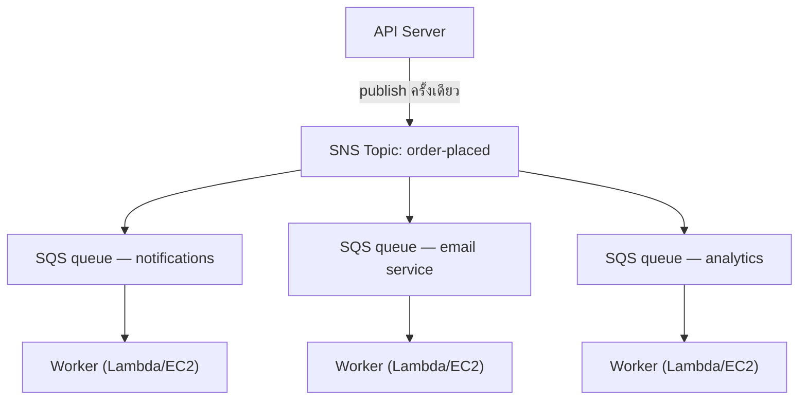

# บทที่ 19: เครื่องออกบัตรคิว

เครื่องออกบัตรคิวเป็นการปฏิวัติอย่างเงียบๆ หยิบหมายเลข รอเรียก แถวกลายเป็นคิว ผู้คนนั่งได้ เคาน์เตอร์บริการทำงานในอัตราของตัวเอง ไม่มีใครขวางใคร

ก่อนมีเครื่องออกบัตรคิว คุณต้องยืนต่อแถว ตำแหน่งของคุณในแถวต้องการการอยู่ตัวเป็นๆ ของคุณ คุณทำอย่างอื่นไม่ได้ขณะรอ และถ้าคนหน้าแถวช้า ทุกคนข้างหลังก็หยุด

เครื่องออกบัตรคิวแยกการมาถึงออกจากการบริการ คุณมาถึง หยิบหมายเลข แล้วระบบจดจำตำแหน่งของคุณ คุณไปนั่งได้ เคาน์เตอร์บริการทำงานไล่ตามหมายเลขในอัตราที่มันจัดการได้ ถ้าเคาน์เตอร์ปิดชั่วคราว ผู้มาถึงใหม่ก็ยังได้หมายเลข พวกเขารอ งานไม่ได้หายไป — มันเข้าคิว

สิ่งประดิษฐ์เล็กๆ นี้เป็นหนึ่งในตัวอย่างที่เก่าแก่ที่สุดของการ decoupling ในระบบของมนุษย์ เมื่อจบบทนี้ Nimbus จะสร้างเครื่องออกบัตรคิวของตัวเอง — ในซอฟต์แวร์ — และเหตุผลที่มันต้องการเครื่องนี้เริ่มต้นจาก downtime สิบหกนาทีในเย็นวันศุกร์

---

ทีมรอดจาก AZ failure มาได้ Leo แก้ไขกระบวนการ chaos engineering แล้ว และ runbook ก็มั่นคง Traffic ฟื้นตัวและกำลังเติบโตอีกครั้ง — เร็วกว่าเดิมเสียด้วยซ้ำ เอกสาร Aurora ที่ Leo อ่านดึกๆ ยังคงล้ำหน้าจุดที่ Nimbus อยู่จริงไปหลายบท

แต่เมื่อ traffic เติบโตและร้านอาหารเข้าร่วมมากขึ้น bottleneck ชนิดอื่นก็เริ่มปรากฏให้เห็น ไม่ใช่ใน infrastructure แต่ในตัว application code เอง request chain ที่ทำงานได้ดีที่ 200 ออร์เดอร์ต่อชั่วโมงเริ่มแสดงความตึงเครียดที่ 800

แล้วเย็นวันที่ 14 ก็มาถึง

---

มันเริ่มต้นด้วย analytics dashboard เวลา 18:47 น. ของวันศุกร์ การ deploy ไปยัง analytics service ได้นำ timeout bug เข้ามา service เริ่มตอบสนองใน 8 วินาทีแทนที่จะเป็น 200 มิลลิวินาทีตามปกติ

Order flow เป็นแบบ synchronous ทุกออร์เดอร์รอ analytics service ก่อนยืนยันให้ลูกค้า แปดวินาทีกลายเป็น 12 เมื่อ load เพิ่มขึ้น connection pool ของ API เริ่มเต็มไปด้วย requests ที่รอให้ขั้นตอน analytics เสร็จสมบูรณ์

เวลา 18:53 น. connection pool ถึงขีดจำกัด requests ใหม่เริ่มล้มเหลวทันที — ไม่ใช่เพราะประมวลผลออร์เดอร์ไม่ได้ แต่เพราะไม่มี connection ว่างที่จะเริ่มประมวลผลมัน

"analytics service ทำให้ order flow ล่ม" Leo พูดขณะดู logs ในเช้าวันรุ่งขึ้น "พวกมันไม่เกี่ยวอะไรกันเลย analytics service แค่คำนวณ dashboards"

"แต่พวกมันอยู่ใน request chain เดียวกัน" Priya พูด

"downtime สิบหกนาที" Maya พูด "และลูกค้าสามรายถูกเรียกเก็บเงินซ้ำ"

การเรียกเก็บเงินซ้ำแย่กว่า downtime ในความโกลาหลของ connection pool saturation กลไก retry ทำงานสำหรับ requests บางอันที่จริงๆ แล้วสำเร็จไปแล้ว — ขั้นตอนการชำระเงินเสร็จสมบูรณ์ แล้ว request ก็ timeout ก่อนคืนค่า และ retry พยายามชำระเงินอีกครั้ง บัตรเดียวกัน จำนวนเงินเดียวกัน เรียกเก็บสองครั้ง

"กลไก retry ควรจะช่วย" Leo พูด

"มันช่วยในทิศทางที่ผิด" Priya พูด "และเราคิดถึงสิ่งที่เกิดขึ้นเมื่อเราพยายามคืนเงินให้ลูกค้าเหล่านั้นหรือยัง? กระบวนการคืนเงินใช้ order flow เดียวกันที่ล้มเหลว"

downtime สิบหกนาทีและการเรียกเก็บเงินซ้ำสามครั้ง นั่นคือต้นทุนทางธุรกิจของ synchronous request chain

---

Nimbus มีปัญหาที่ไม่รู้สึกว่าเป็นปัญหาจนกระทั่งออร์เดอร์ได้รับความนิยม

ทุกครั้งที่มีการสั่งออร์เดอร์ API server ต้อง:

1. บันทึกออร์เดอร์ลงฐานข้อมูล
2. ส่งการแจ้งเตือนไปยังแท็บเล็ตของร้านอาหาร
3. ส่งอีเมลยืนยันไปยังลูกค้า
4. อัปเดต analytics dashboard ของร้านอาหาร
5. บันทึกเหตุการณ์สำหรับการเรียกเก็บเงิน

ที่เคาน์เตอร์เดลี่ที่งานยุ่ง คนที่อยู่หน้าเครื่องคิดเงินไม่ได้รอให้คนหั่นเนื้อหั่นเสร็จก่อนจะไปยังลูกค้าคนถัดไป พวกเขารับออร์เดอร์ ส่งให้ครัว และเริ่มบริการคนถัดไป ครัวทำงานไล่ตามออร์เดอร์ในอัตราของตัวเอง ลูกค้าได้บริการที่เร็วขึ้น ครัวไม่ถูกท่วมท้นด้วยการระเบิดของปริมาณงานกะทันหัน ถ้าครัวมีช่วงที่ช้า ออร์เดอร์จะกองสะสมหลังเคาน์เตอร์แทนที่จะทำให้เกิด errors ที่เครื่องคิดเงิน

นั่นคือการเปรียบเปรย Nimbus ไม่มีเคาน์เตอร์และครัว มันมีคนคนเดียวทำทุกอย่างตามลำดับก่อนที่ลูกค้าจะไปได้

และในวันที่ 14 คนหั่นเนื้อมีปัญหา เคาน์เตอร์จึงหยุด ลูกค้าทุกคนหลังจากนั้นจึงรอ ครัว เครื่องคิดเงิน ลูกค้า — ทั้งหมดหยุดชะงักเพราะขั้นตอนหนึ่งในห่วงโซ่ช้าลง

วิธีแก้ไม่ใช่การทำให้การหั่นเนื้อเร็วขึ้น วิธีแก้คือการแยกขั้นตอนออกจากกัน รับออร์เดอร์ที่เครื่องคิดเงิน ส่งบัตรคิวให้ ปล่อยให้ครัวทำงาน

"เราเชื่อมต่อกันอย่างแน่นหนา (tightly coupled)" Priya พูด "ถ้าขั้นตอน downstream ขั้นใดล้มเหลว ออร์เดอร์ทั้งหมดล้มเหลว เราคิดถึงสิ่งที่เกิดขึ้นถ้า analytics service ถูกบุกรุกและเริ่มบริโภค messages ที่ผิดรูปแบบหรือยัง? ออร์เดอร์ทั้งหมดล้มเหลว — เพราะเรากำลังรอมัน"

"ถ้าเราสามารถบันทึกออร์เดอร์และยืนยันให้ลูกค้าทันที" Leo พูด "แล้วประมวลผลส่วนที่เหลือในพื้นหลังล่ะ?"

"นั่นคือคิว" Priya พูด

ข้อมูลเชิงลึกสำคัญ: ลูกค้าไม่จำเป็นต้องรู้ว่า analytics dashboard ถูกอัปเดตก่อนที่พวกเขาจะได้รับการยืนยัน พวกเขาต้องการรู้ว่าออร์เดอร์ของพวกเขาได้รับแล้ว นั่นเป็นคนละเรื่องกัน synchronous chain รวมมันเข้าด้วยกัน

**โมเดลการ Decoupling**

นี่คือ **decoupling**: การแยก component ที่รับงานออกจาก components ที่ประมวลผลมัน

ทุกขั้นตอนใน order flow ของ Nimbus ต้องเกิดขึ้นแบบ synchronous ก่อนที่ API จะตอบสนองลูกค้าได้ ถ้า email service ช้า (บางครั้งก็ช้า) ลูกค้ารอ ถ้า analytics dashboard ล่ม (บางครั้งก็ล่ม) ออร์เดอร์ล้มเหลว

cascade ในวันที่ 14 แสดงให้เห็นอย่างชัดเจนว่าทำไมเรื่องนี้สำคัญ analytics service ไม่เกี่ยวข้องกับว่าออร์เดอร์ของลูกค้าได้รับการยอมรับหรือไม่ แต่เพราะมันอยู่ใน synchronous chain เดียวกัน ความล้มเหลวของมันจึงกลายเป็นความล้มเหลวของทุกคน

ในระบบซอฟต์แวร์ คิวมักเป็น message broker — service ที่รับ messages จาก producers และส่งให้ consumers

คุณอาจสงสัยว่า: ถ้า order flow ตอนนี้เป็นแบบ asynchronous แล้ว ลูกค้าจะรู้ได้อย่างไรว่าออร์เดอร์ของพวกเขาได้รับจริงๆ? คำตอบอยู่ในการออกแบบสถาปัตยกรรม: API บันทึกออร์เดอร์ลงฐานข้อมูล (synchronous — นี่คือการยืนยันที่เชื่อถือได้) แล้ว publish events ไปยังคิว การยืนยันให้ลูกค้าอิงตามการ write ฐานข้อมูลที่สำเร็จ ไม่ใช่การที่ downstream services เสร็จสมบูรณ์ ถ้า email service ช้า ลูกค้าก็ได้รับการยืนยันไปแล้ว อีเมลเป็นเพียงการติดตามที่ดีที่มีก็ดี

**Amazon SQS: คิว**

**Amazon SQS (Simple Queue Service)** คือ managed message queue service ของ AWS มันเก็บ messages อย่างทนทานจนกว่าจะถูกประมวลผลโดย consumer

Flow พื้นฐาน:

1. **Producer** (API server) วาง message ในคิว: `{ "orderId": "ORD-5532", "restaurantId": "47", "items": [...] }`
2. API ตอบสนองลูกค้าทันที: "ยืนยันออร์เดอร์แล้ว!"
3. **Consumers** (worker services แยกต่างหาก) อ่าน messages จากคิวและประมวลผล: ส่งการแจ้งเตือนร้านอาหาร ส่งอีเมลยืนยัน อัปเดต analytics

ประสบการณ์ของลูกค้า: ยืนยันทันที การประมวลผล downstream: เกิดขึ้นแบบ asynchronous ในอัตราของ workers

**แนวคิดหลักของ SQS**

**Message visibility timeout**: เมื่อ consumer อ่าน message จาก SQS message จะกลายเป็น *มองไม่เห็น* ต่อ consumers อื่นเป็นระยะเวลาหนึ่ง (ค่าเริ่มต้น: 30 วินาที) สิ่งนี้ให้เวลา consumer ในการประมวลผลมัน ถ้า consumer ทำเสร็จสำเร็จ มันจะลบ message ถ้า consumer crash, visibility timeout จะหมดอายุและ message จะกลับมามองเห็นได้อีกครั้งเพื่อให้ consumer อื่น retry

สิ่งนี้รับประกัน at-least-once delivery: ทุก message จะถูกประมวลผลอย่างน้อยหนึ่งครั้ง แม้ว่า consumer จะล้มเหลวกลางการประมวลผล

คุณอาจสงสัยว่า: ถ้า message กลายเป็นมองไม่เห็นขณะถูกประมวลผลแต่ไม่ถูกลบเมื่อ consumer crash มันจะถูกประมวลผลสองครั้งได้ไหม? ได้ — และนี่เรียกว่า at-least-once delivery มันหมายความว่าทุก consumer ต้องถูกออกแบบให้จัดการกับการรับ message เดียวกันมากกว่าหนึ่งครั้งโดยไม่ก่อให้เกิดปัญหา อีเมลยืนยันออร์เดอร์ซ้ำนั้นน่ารำคาญ การเรียกเก็บเงินซ้ำคือ support ticket ออกแบบ consumers ของคุณให้สอดคล้องกัน

visibility timeout ต้องนานกว่าเวลาประมวลผลที่คาดหวังที่ยาวที่สุดของคุณ ถ้าการประมวลผลใช้เวลาโดยทั่วไป 20 วินาทีแต่บางครั้งใช้ 90 วินาที และ visibility timeout ของคุณคือ 30 วินาที การประมวลผล 90 วินาทีในบางครั้งนั้นจะดูเหมือนความล้มเหลวสำหรับ SQS message จะกลับมามองเห็นได้อีกครั้ง consumer ตัวที่สองหยิบมันไป ตอนนี้ workers สองตัวกำลังประมวลผล message เดียวกัน ถ้าการประมวลผลของคุณไม่ใช่ idempotent คุณมีปัญหา

ความผิดพลาดที่พบบ่อย: ตั้ง visibility timeout เท่ากับเวลาประมวลผลเฉลี่ย วิธีที่ถูกต้อง: ตั้งให้เป็นเวลาประมวลผล percentile ที่ 99 พร้อม safety margin ถ้าเวลาประมวลผล P99 คือ 45 วินาที ตั้ง visibility timeout เป็น 90 วินาที

**Dead-letter queues (DLQ)**: ถ้า message ล้มเหลวในการประมวลผลมากเกินไป (ตั้งค่าได้ — เช่น 5 retries) SQS จะย้ายมันไปยัง dead-letter queue คุณตรวจสอบ DLQ เพื่อเข้าใจว่าทำไม messages ถึงล้มเหลวโดยไม่สูญเสียมัน

DLQ คือที่ที่คุณเรียนรู้ว่าอะไรกำลังล้มเหลวจริงๆ ใน production หากไม่มีมัน messages ที่ล้มเหลวจะหายไปเฉยๆ และคุณไม่มีทางที่จะสืบสวน

สามสัปดาห์หลังจากการ migrate ไป SQS, Leo สังเกตเห็นว่ามี 23 messages สะสมอยู่ใน DLQ ของ notification service เขาไม่ได้ตรวจสอบ DLQ (เขาตั้งค่ามันถูกต้องแล้วจึงสันนิษฐานว่ามันจะว่างเปล่าตลอดไป)

เขาดึง message หนึ่งออกมาและดูที่ payload:

```json
{
  "orderId": "ORD-9821",
  "restaurantId": "12",
  "customerMessage": "Extra spicy please 🌶️🔥",
  "timestamp": "2024-01-18T19:43:11Z"
}
```

อีโมจิ notification service ของร้านอาหารกำลัง encode message payloads เป็น Latin-1 ก่อนส่งไปยัง legacy tablet API ของร้านอาหาร อักขระอีโมจิ — สี่ไบต์ต่อตัวใน UTF-8 — กำลังเสียหาย ทำให้ tablet API ปฏิเสธ request message จะ retry, ล้มเหลวอีก, retry อีก, ล้มเหลวอีก หลังจาก 5 retries, SQS ย้ายมันไปยัง DLQ

"ทั้ง 23 messages มีอีโมจิในฟิลด์ customer notes" Leo พูด

"ดังนั้นลูกค้าทุกคนที่เพิ่มอีโมจิลงในโน้ตออร์เดอร์ของพวกเขามีโน้ตที่ล้มเหลวอย่างเงียบๆ ในการไปถึงร้านอาหาร" Maya พูด

"ใช่"

"นานแค่ไหน?"

Leo ตรวจสอบ timestamp ของ message ที่เก่าที่สุด "สามสัปดาห์"

Priya เงียบ "แล้วถ้ามีใครคิดออกว่าการเพิ่มอีโมจิลงในโน้ตออร์เดอร์ทำให้เกิดความล้มเหลวอย่างเงียบๆ ล่ะ? คุณสามารถวางออร์เดอร์พร้อมอีโมจิและรับประกันได้ว่าร้านอาหารจะไม่เคยเห็นคำสั่งนั้น แล้วร้องเรียนเรื่องออร์เดอร์ผิด"

ไม่มีใครเอาเปรียบเรื่องนี้ แต่มันเป็นคำถามที่ถูกต้องที่ควรถาม

Leo แก้ไข encoding bug จากนั้นเขาเขียนสคริปต์เพื่อ replay ทั้ง 23 messages ที่ติดค้างจาก DLQ ร้านอาหารได้รับคำสั่งอีโมจิเผ็ด (อายุสามสัปดาห์) ของพวกเขา ลูกค้าไม่เคยรู้

บทเรียน: DLQ ต้องถูก monitor อย่างต่อเนื่อง ไม่ใช่ตั้งค่าแล้วลืม DLQ ที่กำลังเติบโตเป็นสัญญาณเงียบๆ ว่ามีบางอย่างกำลังล้มเหลวซ้ำๆ

**ประเภทคิว**:

**Standard queues**: Throughput สูงสุด (messages ไม่จำกัดต่อวินาที) ลำดับการส่งเป็นแบบ best-effort (ไม่รับประกัน) at-least-once delivery (น้อยมากที่ message อาจถูกส่งสองครั้ง)

**FIFO queues**: ลำดับเข้าก่อนออกก่อนอย่างเคร่งครัด exactly-once **processing** — การ deduplication อิงตาม `MessageDeduplicationId` ภายในหน้าต่าง 5 นาที ลำดับถูกรับประกัน*ต่อ* `MessageGroupId`: messages ในกลุ่มเดียวกันมาถึงตามลำดับ; กลุ่มต่างกันสามารถประมวลผลแบบขนานได้ ซึ่งเป็นวิธีที่ FIFO ขยายตัว Baseline throughput คือ 3,000 messages ต่อวินาทีพร้อม batching (300 หากไม่มี); การเปิด **high-throughput mode** เพิ่มสิ่งนี้เป็นหลายหมื่นต่อวินาทีโดยการแบ่ง partition ข้าม message groups ใช้ FIFO เมื่อลำดับสำคัญ (financial transactions, การเปลี่ยน state แบบลำดับ)

ถ้าคุณต้องการ throughput สูงสุดและยอมรับ duplicate messages ในบางครั้งได้ ใช้ SQS Standard — แต่คุณต้องออกแบบทุก consumer ให้จัดการ duplicates โดยไม่ก่อให้เกิดปัญหา ถ้าคุณต้องการลำดับเคร่งครัดและ exactly-once processing ใช้ SQS FIFO — และออกแบบ `MessageGroupId` ของคุณให้ดี เพราะ parallelism (และดังนั้น throughput) มาจากการมีกลุ่มจำนวนมาก

สำหรับ Nimbus คิวส่วนใหญ่ใช้ standard queues คิว billing ใช้ FIFO เพื่อให้แน่ใจว่าการเรียกเก็บเงินถูกประมวลผลตามลำดับ

**Queue Depth Auto Scaling: การ Scale Workers ให้ตรงกับ Backlog**

หนึ่งในการประยุกต์ใช้ที่ทรงพลังที่สุดของ SQS คือการใช้ queue depth เป็น Auto Scaling trigger แทนที่จะ scale ตาม CPU หรือ memory คุณ scale ตามว่ามีงานรออยู่มากแค่ไหน

สำหรับ notification service ของ Nimbus: SQS queue depth (จำนวน messages ที่รอประมวลผล) ถูกเชื่อมต่อกับ Application Auto Scaling policy สำหรับ ECS service ที่รัน notification workers

Policy: เมื่อคิวมีมากกว่า 50 messages ต่อ worker task เพิ่ม task เมื่อคิวมีน้อยกว่า 10 messages ต่อ worker task ลบ task

ผลในทางปฏิบัติ: เมื่อ 1,200 ออร์เดอร์เข้ามาในช่วง peak เย็นวันศุกร์ notification queue depth พุ่งขึ้นและ worker fleet scale จาก 2 tasks เป็น 8 tasks ภายใน 3 นาที เมื่อถึงเที่ยงคืน คิวว่างเปล่าและ fleet กลับมาที่ 2

"นั่นมีค่าใช้จ่ายต่อเดือนเท่าไร?" Tom ถามขณะดูกราฟ Auto Scaling

"ไม่มีค่าใช้จ่ายเพิ่มสำหรับตัว Auto Scaling เอง" Leo พูด "แต่ 6 ECS tasks เพิ่มเติมเป็นเวลา 3 ชั่วโมงในเย็นวันศุกร์ — นั่นมีความหมาย"

Tom คำนวณ "ประมาณ $14/เดือน สำหรับ peaks เหล่านั้น และก่อนหน้านี้ เรารัน 8 tasks อย่างต่อเนื่องที่ค่าใช้จ่ายเต็ม?"

"ใช่"

"ดังนั้นเราจ่ายสำหรับ burst เมื่อเราต้องการมันและไม่จ่ายอะไรในเวลาอื่น"

นี่คือ queue-depth scaling pattern: คิวกลายเป็น buffer ที่ดูดซับ traffic spikes และ worker fleet scale เพื่อ drain buffer ผู้ใช้ไม่ได้สัมผัสกับความช้า — พวกเขาได้รับการยืนยันทันทีเมื่อออร์เดอร์ได้รับการยอมรับ workers แค่ใช้เวลานานขึ้นเล็กน้อยในการตามให้ทัน และเพราะคุณไม่ได้รัน peak capacity ตลอด 24 ชั่วโมงทุกวัน ค่าใช้จ่ายจึงต่ำกว่าอย่างมาก

**Amazon SNS: เครื่องกระจายเสียง**

**Amazon SNS (Simple Notification Service)** คือ publish/subscribe (pub/sub) message service แทนที่จะเป็น producer หนึ่ง consumer หนึ่ง (คิว) SNS รองรับ message หนึ่งที่ถูกส่งไปยัง subscribers *จำนวนมาก* พร้อมกัน

โมเดล:

1. **publisher** ส่ง message ไปยัง SNS **topic**
2. **subscribers** ทั้งหมดของ topic นั้นได้รับ message พร้อมกัน (fan-out)

Subscribers อาจเป็น:

- SQS queues (push message ไปยังคิวสำหรับการประมวลผล async)
- Lambda functions (trigger function โดยตรง)
- HTTP/HTTPS endpoints (การส่ง webhook)
- Email addresses
- SMS (หมายเลขโทรศัพท์)

สำหรับ Nimbus เหตุการณ์ order placed ถูก publish ไปยัง SNS topic ที่ชื่อ `order-events`:

- Restaurant notification service subscribe (รับบน SQS queue ของมัน)
- Email service subscribe (รับบน SQS queue ของมัน)
- Analytics service subscribe (รับบน SQS queue ของมัน)
- Billing service subscribe (รับบน FIFO SQS queue ของมัน)

หนึ่งเหตุการณ์ออร์เดอร์ สี่ subscribers ทั้งหมดได้รับแจ้งพร้อมกัน แต่ละตัวประมวลผลในอัตราของตัวเอง

"ดังนั้น SNS คือการประกาศ" Maya พูด "และ SQS คือกล่องจดหมายที่แต่ละทีมประมวลผลการประกาศในความเร็วของตัวเอง แล้วทำไมต้องใช้ทั้งคู่? ทำไมไม่ให้ทุกคน subscribe SNS topic โดยตรงล่ะ?"

"เพราะการส่ง SNS โดยตรงเป็นแบบ fire-and-forget" Leo พูด "ถ้า analytics service ล่มเมื่อ SNS ยิง message นั้นก็หายไป เมื่อมี SQS queue คั่นกลาง message จะรอจนกว่า service จะฟื้นตัว"

"ถูกต้อง" Priya พูด "SNS/SQS fan-out คือ pattern มาตรฐาน"

**รูปแบบ SNS/SQS Fan-Out**

การผสมผสานนี้ — SNS topic ป้อนให้ SQS queues หลายอัน — เป็นหนึ่งใน architectural patterns ที่สำคัญที่สุดใน AWS:



แต่ละคิวเป็นอิสระ analytics service อาจช้า — คิวของมันเต็ม แต่ notification และ email services ทำงานต่อไปโดยไม่ได้รับผลกระทบ ถ้า analytics service ล่ม messages ของมันจะรออยู่ในคิวจนกว่ามันจะกลับมา ไม่มีอะไรสูญหาย

นี่คือคุณสมบัติสำคัญ: **independent failure** ปัญหาใน consumer หนึ่งไม่แพร่กระจายไปยังตัวอื่น

**Message Filtering: ไม่ใช่ทุก Message สำหรับทุก Subscriber**

เมื่อระบบเติบโตขึ้น คุณไม่ต้องการให้ทุก subscriber ประมวลผลทุก message analytics service ไม่ควรได้รับ messages เกี่ยวกับ failed payment processing ถ้ามันสนใจเฉพาะ completed orders

**SNS message filtering** ให้ subscribers ระบุ filter policies — ส่งเฉพาะ messages ที่ตรงกับ attributes บางอย่าง

Restaurant notification service subscribe พร้อม filter: เฉพาะ messages ที่ `status = "confirmed"`

Error alerting service subscribe พร้อม filter: เฉพาะ messages ที่ `status = "failed"`

แต่ละ subscriber ได้รับเฉพาะสิ่งที่ต้องการ

หากไม่มี filtering ทุก subscriber จะได้รับทุก message และต้องเพิกเฉยต่อสิ่งที่ไม่เกี่ยวข้อง สิ่งนี้สิ้นเปลืองการประมวลผล สิ้นเปลืองเงิน (SQS เรียกเก็บต่อ message) และนำมาซึ่ง noise ระบบออร์เดอร์ที่มีปริมาณสูงโดยไม่มี filtering จะท่วม error alerting queue ด้วยออร์เดอร์ที่สำเร็จ — ทำให้ความล้มเหลวจริงหายาก

Filter policies มีหน้าตาแบบนี้:

```json
{
  "status": ["confirmed"],
  "region": ["us-west-2", "us-east-1"]
}
```

subscriber นี้รับเฉพาะ messages ที่ status เป็น "confirmed" และ region เป็นอย่างใดอย่างหนึ่งคือ "us-west-2" หรือ "us-east-1" Messages ที่ไม่ตรงกับ policy จะไม่ถูกส่งไปยังคิวของ subscriber นี้เลย — พวกมันไม่เคยไปถึง SQS ด้วยซ้ำ

"ดังนั้น filtering เกิดขึ้นที่ชั้น SNS" Priya พูด "ก่อนที่ messages จะถูกเขียนไปยัง SQS?"

"ถูกต้อง SQS queue สำหรับ restaurant notification service จะเห็นเฉพาะ messages ที่มันต้องดำเนินการเสมอ"

"แล้วถ้ามีคนพยายามเจาะเข้ามาโดยการ publish message ที่สร้างขึ้นมาเป็นพิเศษไปยัง SNS topic ที่ตรงกับ filters ของทุก subscriber ล่ะ?" Priya ถาม

SNS topic มี IAM resource policy: เฉพาะ order API service (ตาม IAM role ของมัน) เท่านั้นที่ได้รับอนุญาตให้ publish SNS access policies และ SQS queue policies ก่อตัวเป็นชั้นควบคุมการเข้าถึง — filtering เป็นเพียงเรื่องของ routing ไม่ใช่ความปลอดภัย

**เมื่อใดควรใช้ SQS vs SNS**

**SQS เพียงอย่างเดียว**: producer หนึ่ง consumer หนึ่ง (หรือ competing consumers หลายตัวบนคิวเดียวกัน) Messages ต้องถูกประมวลผลครั้งเดียว ตามลำดับ (FIFO) หรือไม่ (standard) Worker queue pattern — คิวหนึ่ง workers หลายตัวบริโภคจากมัน

**SNS เพียงอย่างเดียว**: fire-and-forget notifications Push ไปยัง email, SMS หรือ HTTP endpoints ไม่ต้อง queue message — แค่แจ้งเตือนแล้วไปต่อ

**SNS + SQS (fan-out)**: เหตุการณ์หนึ่ง consumers อิสระหลายตัว แต่ละ consumer มีคิวของตัวเอง ประมวลผลอย่างอิสระ และล้มเหลวได้อย่างอิสระ

## SNS FIFO Topics

ทุกอย่างข้างบนเกี่ยวกับ SNS ใช้ standard topics — พวกมันมี throughput ที่ไม่จำกัดในทางปฏิบัติ ส่งให้ subscribers แทบจะพร้อมกัน และทำงานได้สำหรับ use cases ส่วนใหญ่

แต่ standard SNS topics ไม่รับประกันลำดับ ถ้าคุณ publish สิบ messages ตามลำดับ subscribers อาจได้รับพวกมันในลำดับที่แตกต่างเล็กน้อย สำหรับ Nimbus order notifications นั่นไม่เป็นไร — analytics update ที่มาถึงเสี้ยววินาทีก่อนอีเมลยืนยันไม่สำคัญ

สำหรับบาง scenarios มันสำคัญ ลองพิจารณา financial ledger: ถ้าสองเหตุการณ์ — credit แล้ว debit — ถูกส่งในลำดับย้อนกลับ การคำนวณยอดคงเหลือในระหว่างการประมวลผลจะผิดแม้ว่าทั้งสองเหตุการณ์จะถูกประมวลผลอย่างถูกต้องในที่สุด

**SNS FIFO topics** ใช้หลักการเดียวกันกับ SQS FIFO queues กับโมเดล fan-out Messages ถูกส่งไปยัง subscribers ในลำดับที่แน่นอนที่ถูก publish และแต่ละ message ถูกส่งเพียงครั้งเดียว

trade-off: SNS FIFO topics มี baseline throughput คล้ายกับ SQS FIFO (3,000 messages ต่อวินาทีต่อ topic; 300 ต่อวินาทีต่อ message group — พร้อม high-throughput mode ที่มีให้ตั้งแต่ปี 2025 สำหรับปริมาณที่มากกว่ามาก) และพวกมัน fan out ไปยัง **SQS queues** เท่านั้น — FIFO หรือ ตั้งแต่ปี 2023 Standard ก็ได้ การ subscribe Standard queue มีประโยชน์สำหรับ consumers ที่ไม่สนใจลำดับ (analytics feed ตัวอย่างเช่น) แต่ลำดับและ exactly-once จะอยู่รอดจากต้นจนจบ**เฉพาะ**เมื่อเข้าสู่ FIFO queues เท่านั้น คุณไม่สามารถใช้ SNS FIFO topic เพื่อส่งไปยัง HTTP endpoints หรือ email addresses

สำหรับ billing pipeline ของ Nimbus — ที่ลำดับของ pricing updates ต้องถูกนำไปใช้กับ restaurant accounts ตามลำดับ — billing SNS topic ถูก migrate จาก standard เป็น FIFO SQS billing queue เป็น FIFO อยู่แล้ว ตอนนี้ fan-out รับประกันว่าเหตุการณ์ price-increase จะไม่มีวันมาถึง billing processor ก่อนเหตุการณ์ period-start ที่มันขึ้นอยู่ด้วย

> **เคล็ดลับการสอบ — SNS FIFO**
>
> ถ้า scenario ต้องการ **ordered fan-out delivery** ข้าม subscribers หลายตัว คำตอบคือ **SNS FIFO** Standard SNS ไม่รับประกันลำดับ SNS FIFO fan out ไปยัง SQS queues เท่านั้น — เพื่อรักษาลำดับและ exactly-once จากต้นจนจบ subscriber ต้องเป็น SQS **FIFO** queue (การ subscribe Standard queue ได้รับอนุญาตแต่ได้ลำดับแบบ best-effort และ at-least-once delivery) Throughput เริ่มต้นคือ 3,000/วินาทีต่อ topic — ถ้า scenario อธิบายปริมาณที่สูงกว่ามาก*และ*ลำดับที่เคร่งครัด นั่นเป็นสัญญาณให้มองหาสถาปัตยกรรมทางเลือก (Kinesis ตัวอย่างเช่น ซึ่งครอบคลุมในบทถัดไป)

## เมื่อ Legacy Queue ไม่ยอมปล่อย

Nimbus กำลังจะปิดดีลซื้อกิจการที่ใหญ่ที่สุดเท่าที่เคยมีมา: Barato คู่แข่ง food delivery ที่มี 200 ร้านอาหารและการดำเนินงานที่ล้ำหน้าไปสองปี ทีมวิศวกรรมกำหนดการประชุมวางแผน integration

การประชุมดำเนินไปยี่สิบนาทีก่อนที่ Leo จะเงียบ

"ระบบประมวลผลออร์เดอร์ของพวกเขา" เขาพูด "มันรันบนอะไร?"

"ActiveMQ" วิศวกรของ Barato ที่อยู่ปลายสายพูด "On-prem broker แอปเป็น Java มันรันมาตั้งแต่ปี 2018 ทุกอย่างพูด AMQP"

"AMQP" Leo พูด

"ใช่"

เขามองที่ architecture diagram บนหน้าจอ Nimbus รัน SQS และ SNS SQS ไม่พูด AMQP SNS ไม่พูด AMQP แอปพลิเคชัน Barato ไม่พูดอะไรอื่นเลย

"การเขียนมันใหม่จะใช้เวลาหกเดือน" Leo พูดกับทีมหลังการประชุม "อย่างน้อย"

"เราเลื่อนการซื้อกิจการออกไปหกเดือนไม่ได้" Maya พูด

"และเรารัน bare-metal ActiveMQ broker ใน AWS ไม่ได้" Priya เสริม "เราคิดถึงสิ่งที่มันดูเหมือนจากมุมมองความปลอดภัยและความน่าเชื่อถือหรือยัง? message broker ที่จัดการเองนั่งอยู่ใน production โดยไม่มี managed patching ไม่มี automatic failover เชื่อมต่อกับ infrastructure ของเรา?"

"มีตัวเลือกแบบ managed" Leo พูดอย่างช้าๆ เขาอ่านอยู่ขณะที่พวกเขาคุยกัน "Amazon MQ"

**Amazon MQ: Managed Broker**

**Amazon MQ** คือ managed message broker service สำหรับ Apache ActiveMQ และ RabbitMQ มันรัน broker ที่มีอยู่ของคุณ — broker เดียวกันที่แอปพลิเคชันของคุณเชื่อมต่อมาหลายปี — แต่เป็น managed AWS service AWS จัดการ infrastructure ที่อยู่เบื้องหลัง: provisioning, patching, failover, backups

คุณสมบัติสำคัญที่ทำให้ Amazon MQ แตกต่างจาก SQS และ SNS: มันพูด protocols ที่ legacy message brokers พูด AMQP, STOMP, MQTT, OpenWire, NMS protocols ที่ SQS และ SNS ไม่เข้าใจ

สำหรับการ integration กับ Barato แผนนั้นตรงไปตรงมา AWS จะรัน Amazon MQ broker ที่ตั้งค่าเป็น ActiveMQ แอปพลิเคชัน Java ของ Barato จะถูกชี้ไปยัง endpoint ของ broker ใหม่แทนที่ของ on-premises การเปลี่ยนแปลงในฝั่งแอปพลิเคชัน: อัปเดต configuration file หนึ่งไฟล์ด้วย connection string ใหม่ แค่นั้น แอปพลิเคชันไม่จำเป็นต้องรู้ว่ามันกำลังคุยกับ managed cloud broker แทนที่จะเป็น server ในออฟฟิศของ Barato

"เดี๋ยวก่อน" Maya พูด "ถ้าเราจะ integrate พวกเขาเข้าสู่ Nimbus ในที่สุด เราไม่ควรแค่ migrate พวกเขาไป SQS ตั้งแต่แรกหรือ?"

"เพราะ migration path มีอยู่" Leo พูด "และมันคุ้มค่าที่จะทำให้ถูกต้อง — ในที่สุด แต่ตอนนี้ เราต้องการให้ Barato ทำงานบน AWS infrastructure ในสามสิบวัน ไม่ใช่หกเดือน Amazon MQ ทำให้แอปพลิเคชันทำงานโดยไม่เปลี่ยนแอปพลิเคชัน จากนั้นเราจะมีเวลาวางแผน SQS migration เป็นโปรเจกต์ที่จงใจ ไม่ใช่ข้อกำหนดเบื้องต้นที่เร่งรีบสำหรับการซื้อกิจการ"

"นั่นมีค่าใช้จ่ายต่อเดือนเท่าไร?" Tom ถาม

Amazon MQ broker — active/standby pair เดียวเพื่อความน่าเชื่อถือ — อยู่ในช่วงประมาณ $200/เดือน สำหรับ broker ที่เหมาะกับ volume ของ Barato เมื่อเทียบกับค่าใช้จ่ายของเวลาหกเดือนในการเขียนใหม่ มันไม่ใช่เรื่องที่ต้องถกเถียง

Priya อนุมัติแผนด้วยเงื่อนไขหนึ่ง: Amazon MQ instance จะอยู่ใน private subnet โดยมี security group rules ที่อนุญาตการเชื่อมต่อจาก Barato application servers เท่านั้น ไม่มีการเปิดเผยสู่สาธารณะ เปิดใช้ audit logging

การ migration ใช้เวลาสิบสองวัน แอปพลิเคชัน Barato เชื่อมต่อกับ Amazon MQ ในวันที่สิบสาม ในวันที่สิบสี่ มันประมวลผลออร์เดอร์แรกบน AWS infrastructure โดยไม่มีการเปลี่ยน code แม้แต่บรรทัดเดียว

---

> **เคล็ดลับการสอบ — Amazon MQ**
>
> *SAA-C03 Domain: Design Resilient Architectures (Domain 2)*
>
> ข้อสอบแยก Amazon MQ ออกจาก SQS และ SNS บนแกนเดียว: **ความเข้ากันได้ของ protocol** ถ้า scenario อธิบายแอปพลิเคชันที่ใช้ message broker อยู่แล้วและพูด protocol เฉพาะ Amazon MQ แทบจะแน่นอนว่าเป็นคำตอบ
>
> สัญญาณสำคัญ: **"ActiveMQ," "RabbitMQ," "AMQP," "STOMP," "MQTT," "OpenWire,"** หรือวลีใดๆ ที่เทียบเท่ากับ **"โดยไม่เปลี่ยน application code"** ถ้าคุณเห็นวลีเหล่านั้น คำตอบคือ Amazon MQ — ไม่ใช่ SQS ไม่ใช่ SNS
>
> ถ้า scenario อธิบายแอปพลิเคชัน*ใหม่*ที่ต้องการ decoupling หรือไม่กล่าวถึง legacy broker หรือ protocol เฉพาะ ใช้ SQS/SNS
>
> สัญญาณอีกหนึ่ง: "migrate existing on-premises message broker ไป AWS" ถ้าแอปต้องพูด protocol เดิมต่อไปกับ broker ชนิดเดียวกัน Amazon MQ คือคำตอบแบบ lift-and-shift

## จุดแข็งและข้อจำกัด

**ทำไม SQS และ SNS จึงทรงพลัง**:

- SQS ให้ message delivery ที่ทนทานและเชื่อถือได้ — messages ถูกเก็บข้ามหลาย AZs
- การ decoupling เปิดให้มีการ scale และ deploy ที่เป็นอิสระของ producer และ consumer services
- Dead-letter queues รับประกันว่าไม่มี message สูญหายอย่างเงียบๆ เมื่อล้มเหลว
- SNS fan-out pattern อนุญาตให้เพิ่ม consumers ใหม่โดยไม่เปลี่ยน producer

**จุดที่ซับซ้อน**:

- at-least-once delivery หมายความว่า consumers ต้อง *idempotent* — การประมวลผล message เดียวกันสองครั้งไม่ควรก่อให้เกิดปัญหา (ออร์เดอร์ซ้ำ เรียกเก็บเงินซ้ำ)
- FIFO queues แพงกว่าและมีขีดจำกัด throughput
- การ debug messages ที่ล้มเหลวข้ามคิวและ services หลายอันต้องการ logging และ observability ที่ดี
- การรับประกันลำดับ message มีจำกัด — ถ้าลำดับเคร่งครัดสำคัญข้าม services หลายอัน การออกแบบจะซับซ้อน

**Idempotency: การเจาะลึกเชิงปฏิบัติ**

Idempotency ฟังดูเป็นนามธรรมจนกว่าคุณจะมีลูกค้าสามรายถูกเรียกเก็บเงินซ้ำ

operation จะ **idempotent** ถ้าการรันมันหลายครั้งให้ผลลัพธ์เหมือนกับการรันมันครั้งเดียว operation การเรียกเก็บเงินไม่ใช่ idempotent โดยธรรมชาติ: การรันมันสองครั้งเรียกเก็บสองครั้ง operation การเรียกเก็บเงินที่ idempotent ตรวจสอบว่าการเรียกเก็บเงินถูกประมวลผลไปแล้วหรือไม่ก่อนที่จะพยายาม

Pattern: แต่ละ message มี unique ID (order ID หรือ message ID แยกต่างหาก) ก่อนการประมวลผล consumer ตรวจสอบ store (DynamoDB เหมาะกับเรื่องนี้) เพื่อดูว่า message ID นี้ถูกประมวลผลสำเร็จไปแล้วหรือไม่ ถ้าใช่: ไม่ทำอะไร ลบ message ถ้าไม่: ประมวลผล บันทึก ID ลบ message

```python
def process_charge(message):
    order_id = message['orderId']
    
    # ตรวจสอบ Idempotency
    if already_processed(order_id):
        logger.info(f"Order {order_id} already charged, skipping duplicate")
        return  # message จะถูกลบจากคิว
    
    # ประมวลผลการเรียกเก็บเงิน
    charge_result = payment_service.charge(
        amount=message['amount'],
        card_token=message['cardToken'],
        idempotency_key=order_id  # ส่งไปยัง payment processor ด้วย
    )
    
    # บันทึกว่าเราประมวลผลสิ่งนี้แล้ว
    mark_as_processed(order_id, charge_result)
```

idempotency key ควรถูกส่งไปยัง downstream services (payment processors, email systems) ที่รองรับมันด้วย Stripe ตัวอย่างเช่น ยอมรับ `Idempotency-Key` header ที่ป้องกันการเรียกเก็บเงินซ้ำแม้ว่าจะมีการเรียก API เดียวกันสองครั้ง

"แล้ว correlation IDs ล่ะ?" Priya ถาม "เมื่อ message เคลื่อนผ่าน services หลายอัน เราจะ trace ได้อย่างไรว่า request ใดทำให้เกิด downstream action ใด?"

**Correlation IDs: การ Trace ข้าม Services**

เมื่อลูกค้าวางออร์เดอร์ request ไหลผ่าน: API → SNS → SQS → notification worker → restaurant tablet API → SQS → email worker → SES

หากไม่มี correlation IDs ถ้า restaurant tablet API คืนค่า error ที่ขั้นตอน 6 logs ในแต่ละ service แสดงเหตุการณ์ แต่ไม่มีทางที่จะ trace มันย้อนกลับไปยังออร์เดอร์เฉพาะของลูกค้าตั้งแต่ต้น

**correlation ID** คือ identifier ที่ไม่ซ้ำกันที่ติดอยู่กับ request ดั้งเดิมและส่งผ่านทุก service interaction แต่ละ service รวม correlation ID ไว้ใน logs ของมัน

เมื่อ Priya ค้นหา CloudWatch สำหรับ correlation ID เฉพาะ เธอจะได้ทุกบรรทัด log — ข้ามทุก service — ที่เป็นส่วนหนึ่งของการประมวลผลออร์เดอร์เดียวนั้น

"ข้อควรระวังหนึ่งข้อ" Priya พูด "Correlation IDs มาจากภายนอก มีใครสามารถ inject ID ที่เป็นอันตรายและทำให้ logging ของเราป่วนได้ไหม?"

Correlation IDs เป็นภายใน — พวกมันไม่ส่งผลต่อ processing logic แค่ logging การ sanitize พวกมัน (alphanumeric, ความยาวคงที่) ป้องกัน injection attacks ใน log outputs

**เมื่อใดการ Decoupling เป็นทางเลือกที่ผิด**

"เดี๋ยว — แต่*ทำไม*เราถึงไม่ decouple ทุกอย่าง?" Maya ถาม

เป็นคำถามที่ยุติธรรม ถ้าการ decoupling ป้องกัน cascade failures และทำให้ระบบ resilient ทำไมไม่นำไปใช้ทุกที่?

เพราะการ decoupling มีต้นทุน และมี scenarios ที่ต้นทุนเหล่านั้นมากกว่าประโยชน์

**เมื่อคุณต้องการ immediate consistency**: ถ้าการชำระเงินต้องถูกยืนยันก่อนที่ออร์เดอร์จะดำเนินต่อได้ — และผู้ใช้กำลังรอบนหน้าจอเพื่อผลลัพธ์ — คุณไม่สามารถใส่การชำระเงินใน asynchronous queue และคืนการยืนยันก่อนที่คุณจะรู้ว่าการเรียกเก็บเงินสำเร็จหรือไม่ ผู้ใช้อาจสั่งซื้อสองครั้งก่อนที่การเรียกเก็บเงินครั้งแรกจะเสร็จสมบูรณ์ Asynchronous decoupling ไม่ทำงานสำหรับ operations ที่ response ขึ้นอยู่กับผลลัพธ์

**เมื่อ workflow เป็นแบบลำดับโดยเนื้อแท้**: ถ้าขั้นตอน 3 ต้องเห็นผลลัพธ์ของขั้นตอน 2 เพื่อตัดสินใจ พวกมันไม่สามารถรันแบบขนานจากคิวได้ การบังคับพวกมันเข้าคิวสร้างกลไกการส่งผลลัพธ์ที่งุ่มง่ามซึ่งมักจบลงด้วยความซับซ้อนกว่าเวอร์ชัน synchronous

**เมื่อลำดับ message สำคัญและปริมาณต่ำ**: SQS Standard ไม่รับประกันลำดับ SQS FIFO รับประกัน แต่จำกัดที่ 3,000 messages/วินาทีพร้อม batching โดยค่าเริ่มต้น (high-throughput mode เพิ่มขึ้นอย่างมาก) ถ้าคุณมี workflow ที่ปริมาณต่ำและเรียงลำดับเคร่งครัด synchronous queue ง่ายๆ (เช่น database row lock) อาจง่ายกว่าและน่าเชื่อถือกว่า

**เมื่อ overhead เกินประโยชน์**: internal tool เล็กๆ ที่มีผู้ใช้คนเดียวและไม่มี SLA อาจไม่ต้องการ fan-out SNS topics และ DLQs operational overhead ของการ monitor คิวและ DLQs เป็นเรื่องจริง ปรับขนาดสถาปัตยกรรมให้เข้ากับปัญหา

คำถามไม่ใช่ "ฉันควร decouple สิ่งนี้ไหม?" แต่เป็น "ต้นทุนของ coupling นี้คืออะไร และการ decoupling ลดต้นทุนนั้นมากกว่าที่มันเพิ่มหรือไม่?"

## สรุป

การ decoupling คือหลักการ resilience ของบทที่ 18 ที่นำมาใช้กับสถาปัตยกรรมภายใน: ในแบบเดียวกับที่ Multi-AZ ขจัด single points of failure ใน infrastructure, SQS และ SNS ขจัด single points of failure ใน request chains

- **การ Decoupling** แยก components ที่ผลิตงานออกจาก components ที่ประมวลผลมัน
- **SQS** ให้ producers มีที่ทนทานในการวางงานเมื่อ consumers ช้า offline หรือกำลัง scale up
- **SNS** ให้เหตุการณ์หนึ่งเข้าถึง consumers อิสระหลายตัวโดยที่ publisher ไม่รู้ว่าพวกเขาเป็นใคร
- **SNS + SQS fan-out** ให้แต่ละ downstream service ประมวลผลเหตุการณ์เดียวกันในอัตราของตัวเอง
- **DLQs, idempotency และ correlation IDs** คือวินัยในการดำเนินงานที่ทำให้ระบบ asynchronous debug ได้แทนที่จะเป็นปริศนา
- **อย่า decouple อย่างมืดบอด**: synchronous workflows, ความต้องการ immediate consistency และ tools เล็กๆ ที่มีความเสี่ยงต่ำอาจไม่คุ้มกับ operational surface ที่เพิ่มขึ้น

## เคล็ดลับการสอบ

*SAA-C03 Domain: Design Resilient Architectures (Domain 2, Task 2.1)*

- **SQS Standard vs FIFO**: ข้อสอบแยกแยะตามการรับประกันลำดับและการส่ง "ต้องประมวลผลตามลำดับ" → FIFO "throughput สูงสุด" → Standard
- **Queue depth Auto Scaling**: "scale workers ตาม queue depth" → SQS metric (ApproximateNumberOfMessagesVisible) ใช้กับ Application Auto Scaling หรือ ECS Service Auto Scaling
- **Visibility timeout**: แนวคิดสำคัญสำหรับ at-least-once delivery ถ้า consumer ล้มเหลว message จะกลับมามองเห็นได้อีกครั้งหลัง timeout scenario ข้อสอบ: "messages กำลังถูกประมวลผลสองครั้ง" → visibility timeout สั้นเกินไป (consumer ใช้เวลานานกว่า timeout ในการประมวลผล)
- **Dead-letter queue**: Messages ที่ล้มเหลวหลัง N retries ถูกย้ายมาที่นี่ scenario ข้อสอบ: "ทำให้แน่ใจว่าไม่มี messages สูญหาย แม้ว่าการประมวลผลจะล้มเหลวซ้ำๆ" → DLQ
- **SNS fan-out**: pattern ข้อสอบคลาสสิกสำหรับเหตุการณ์หนึ่งที่ trigger consumers หลายตัว "การแจ้งเตือน order placed ต้อง trigger email, SMS และ inventory update พร้อมกัน" → SNS topic พร้อม SQS subscriptions
- **SQS + Lambda**: Lambda สามารถถูกตั้งค่าให้ poll SQS queue และ trigger บนแต่ละ message batch ข้อสอบใช้สิ่งนี้สำหรับ event-driven processing ที่ scale
- **SQS long polling**: แทนที่จะให้ consumers poll ทุกไม่กี่วินาที (short polling, สิ้นเปลือง API calls) long polling รอนานถึง 20 วินาทีสำหรับ message ลดค่าใช้จ่ายและ false empty responses
- **SQS extended client library**: สำหรับ messages ที่ใหญ่กว่า payload limit ของคิว (256KB โดยค่าเริ่มต้น; เพิ่มได้ถึง 1MB ตั้งแต่ปี 2025) ใช้ SQS Extended Client Library ซึ่งเก็บ message body ใน S3 และส่ง reference ผ่าน SQS ข้อสอบยังคงถือว่า 256KB เป็น SQS limit — "SQS message ใหญ่เกินไป" → Extended Client Library + S3
- **SNS message filtering**: Subscribers รับเฉพาะ messages ที่ตรงกับ filter policy ของพวกเขา scenario ข้อสอบ: "ส่งเฉพาะ notifications ที่ตรงกับเกณฑ์เฉพาะไปยัง subscriber" → SNS message filtering
- **หมายเหตุ**: SNS/SQS fan-out ยังปรากฏใน Domain 3 scenarios เกี่ยวกับสถาปัตยกรรมการประมวลผล asynchronous ที่มี throughput สูง รู้จัก pattern นี้สำหรับทั้งคำถาม resilience และ performance
- **สัญญาณ Amazon MQ**: "ActiveMQ," "RabbitMQ," "AMQP," "STOMP," "MQTT," "OpenWire," หรือ "โดยไม่เปลี่ยน application code" → Amazon MQ ไม่ใช่ SQS ถ้า scenario บอกว่าแอปพลิเคชันใหม่ที่ต้องการ decoupling → SQS/SNS
- **SNS FIFO vs Standard**: Standard SNS ไม่รับประกันลำดับ ถ้า scenario ต้องการ **ordered fan-out** → SNS FIFO topic ป้อนให้ SQS FIFO queues จำไว้: SNS FIFO ไม่สามารถส่งไปยัง HTTP endpoints หรือ email — เฉพาะ SQS queues (FIFO สำหรับลำดับ/exactly-once; การ subscribe Standard ทำงานได้แต่ลดเป็นลำดับ best-effort และ at-least-once)

## แบบฝึกหัด

**แบบฝึกหัดที่ 1 — ทบทวน**

อธิบาย SNS/SQS fan-out pattern ทำไม pattern ใช้ SQS queues แทนที่จะให้ services subscribe SNS topic โดยตรงด้วย HTTP endpoints?

*(คำใบ้: ลองนึกถึงสิ่งที่เกิดขึ้นถ้าหนึ่งใน HTTP endpoints ล่มเมื่อ SNS publish message)*

**แบบฝึกหัดที่ 2 — สถานการณ์ SAA-C03**

*สถานการณ์*: แพลตฟอร์ม e-commerce ประมวลผล 10,000 ออร์เดอร์ต่อชั่วโมง เมื่อมีการวางออร์เดอร์ ระบบต้อง: (1) เก็บออร์เดอร์ในฐานข้อมูล, (2) หัก inventory, (3) ส่งอีเมลยืนยัน และ (4) อัปเดต analytics dashboard ปัจจุบัน ทั้งสี่ขั้นตอนเกิดขึ้นแบบ synchronous — ถ้า analytics service ช้า ลูกค้ารอ ทีมต้องการปรับปรุงเวลาตอบสนองที่ลูกค้าเห็นในขณะที่รับประกันว่าไม่มีออร์เดอร์สูญหาย

สถาปัตยกรรมใดตอบสนองความต้องการนี้ได้ดีที่สุด?

A) ใช้ SQS FIFO queues เพื่อประมวลผลทั้งสี่ขั้นตอนตามลำดับ  
B) ให้ API บันทึกออร์เดอร์และยืนยันให้ลูกค้าทันที; publish เหตุการณ์ไปยัง SNS topic; ให้ inventory, email และ analytics services subscribe ผ่าน SQS queues  
C) ใช้ parallel EC2 instances เพื่อประมวลผลแต่ละขั้นตอนพร้อมกันแบบ synchronous  
D) ใช้ API Gateway พร้อม request validation เพื่อเร่งความเร็วการประมวลผลออร์เดอร์

**คำใบ้ 1**: การยืนยันให้ลูกค้าควรเกิดทันที ขั้นตอนใดต้องเกิดก่อน response และขั้นตอนใดเกิดหลังได้?

**คำใบ้ 2**: analytics service ที่ช้าไม่ควรส่งผลต่อ email หรือ inventory services

**คำใบ้ 3**: SNS fan-out อนุญาตให้ downstream services ทั้งสามรับเหตุการณ์พร้อมกัน

**คำตอบ**: B

**คำอธิบาย**: API บันทึกออร์เดอร์ลงฐานข้อมูล (synchronous — ต้องทำก่อนยืนยัน) และคืนการยืนยันทันที จากนั้น publish เหตุการณ์ `order-placed` ไปยัง SNS topic Inventory, email และ analytics services แต่ละตัว subscribe ผ่าน SQS queues อิสระ พวกมันประมวลผลในอัตราของตัวเอง — ถ้า analytics ช้า คิวของมันเติบโตแต่ services อื่นไม่ได้รับผลกระทบ ถ้า service ใดล้มเหลว messages ของมันยังคงอยู่ใน SQS queue และถูก retry; หลังจากจำนวน retries ที่ล้มเหลวที่ตั้งค่าไว้ พวกมันถูกย้ายไปยัง DLQ

**ทำไมไม่ใช่ A?** FIFO queues ประมวลผล messages ตามลำดับ — สิ่งนี้ไม่ช่วยกับการช้าลงแบบ synchronous นอกจากนี้ การประมวลผลแบบลำดับหมายความว่า analytics ที่ช้ายังคง block email

**ทำไมไม่ใช่ C?** "Parallel EC2 instances ประมวลผลแบบ synchronous" ยังคงต้องการให้ทุกขั้นตอนเสร็จสมบูรณ์ก่อนตอบสนองลูกค้า การเพิ่ม instances ไม่แก้ปัญหา synchronous coupling

**ทำไมไม่ใช่ D?** API Gateway เร่ง API routing และ validation แต่ไม่ decouple ขั้นตอนการประมวลผล downstream

*SAA-C03 Domain: Design Resilient Architectures — Task 2.1*

**แบบฝึกหัดที่ 3 — ความท้าทายด้านสถาปัตยกรรม** *(ทางเลือก)*

Nimbus กำลังสร้างระบบ notification สำหรับพันธมิตรร้านอาหาร เมื่อลูกค้าวางออร์เดอร์ ร้านอาหารต้องได้รับแจ้งผ่าน:

- แอปแท็บเล็ตของพวกเขา (push notification)
- kitchen display system (HTTP webhook ไปยัง local hardware ของพวกเขา)
- backup SMS (ถ้าการแจ้งเตือนแท็บเล็ตล้มเหลว)

tablet notification service น่าเชื่อถือ kitchen webhook บางครั้งล่ม (ร้านอาหารปิด hardware ของพวกเขาในเวลาปิด) SMS ควรยิงเฉพาะเมื่อการแจ้งเตือนแท็บเล็ตล้มเหลว

ออกแบบสถาปัตยกรรมโดยใช้ SNS และ SQS คุณจะจัดการความต้องการ "SMS เฉพาะเมื่อแท็บเล็ตล้มเหลว" อย่างไร? คุณจะทำให้แน่ใจได้อย่างไรว่า kitchen webhook ไม่ block การแจ้งเตือนแท็บเล็ตเมื่อมัน offline?

พิจารณาด้วยว่า: visibility timeout ใดเหมาะสมสำหรับการส่ง kitchen webhook ถ้าเวลาตอบสนอง webhook เฉลี่ยคือ 2 วินาทีแต่ร้านอาหารที่มี hardware ช้าอาจใช้เวลาถึง 30 วินาที? DLQ policy ใดจะ trigger SMS fallback หลังจาก webhook retries หมดลง?

*(ไม่มีคำตอบที่ถูกต้องเพียงคำตอบเดียว เป้าหมายคือการฝึกออกแบบ fan-out พร้อม conditional routing)*

## ฉากหลังเครดิต

order flow ใหม่ทำงานแล้ว

Leo deploy มันในบ่ายวันอังคารโดยไม่ได้รัน full load test ก่อน "มันจะไม่เป็นไรหรอก" เขาบอก Priya "สถาปัตยกรรมมั่นคง"

ลูกค้าวางออร์เดอร์ API ตอบสนองใน 95 มิลลิวินาที การยืนยันปรากฏบนโทรศัพท์ของพวกเขาทันที

เบื้องหลัง: สี่ services ประมวลผลแบบ asynchronous analytics service มี bug ที่ทำให้มัน crash บนออร์เดอร์ที่มีอักขระพิเศษบางตัวในชื่อ item คิวของมันสะสมถึง 3,200 messages ในเวลาสองชั่วโมง

ลูกค้าไม่เคยสังเกตเห็น

เมื่อ Leo แก้ไข bug และ analytics service เริ่มใหม่ มันประมวลผล backlog ใน 18 นาที ไม่มีข้อมูลสูญหาย DLQ ว่างเปล่า

เขา refresh CloudWatch dashboard Queue depth: 0 Messages processed: 3,200 Errors: 0 (หลังแก้ไข)

"นี่คือสิ่งที่วันที่ 14 น่าจะมีหน้าตาเป็น" เขาพูด "Analytics มีปัญหา คิวดูดซับมัน ทุกอย่างอื่นทำงานต่อ"

"นี่คือความหมายของการ decoupling" Priya พูด

"นั่นมีค่าใช้จ่ายต่อเดือนเท่าไร?" Tom ถาม อยู่บนหน้า pricing แล้ว

"ที่ volume ปัจจุบันของเรา ประมาณสิบสองดอลลาร์ต่อเดือนสำหรับ SQS" เขาจ้องที่หน้าจอ "ผมคาดว่าจะมากกว่านี้"

เขามีท่าทางของคนที่ค้นพบว่าบางอย่างที่ถูกอย่างไม่คาดคิดก็ดีอย่างไม่คาดคิดด้วย

"ตั้งค่า DLQ alerts" Priya เตือน Leo "เราไม่อยากมีความล้มเหลวเงียบๆ อีกสามสัปดาห์"

"ทำแล้ว" Leo พูด

ครั้งนี้เขาทำแล้ว

ในบทต่อไป: ฟังก์ชันที่รันเฉพาะเมื่อมีคนเคาะประตู — และไม่เสียค่าใช้จ่ายอะไรเลยเมื่อไม่มี
