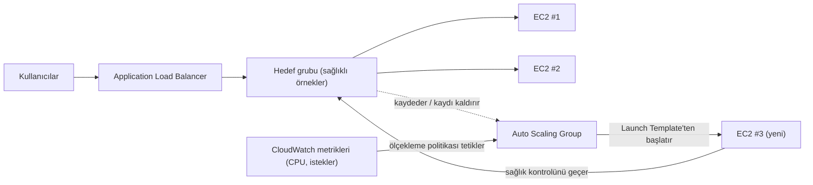

# Bölüm 7: Yoğunlaştığında Büyüyen Restoran

Cuma akşamı saat 7.43'tü.

Tom'un sandalyesi hafifçe geriye itilmişti; bu, bir şeye, ona seslenseniz bile cevap
vermeyeceği türden bir odaklanmayla baktığında olurdu. Ofis bir saat önce boşalmıştı. O
kalmıştı.

Metrik panosuna açtığı bir sekmesi vardı; onu, başkalarının sosyal medyayı kontrol ettiği gibi
yeniliyordu — refleks olarak, sürekli, tam da niyet etmeden.

Depolama krizi arkalarındaydı. Veritabanının kendi diski vardı. Fotoğraflar S3'te yaşıyordu.
İki haftadır sistem istikrarlıydı — heyecan verici değil, sadece istikrarlı. Bunun iyi
hissettirmesi gerekirdi.

Sonra hata oranı %12'yi geçti.

"Leo," dedi Tom.

Leo çoktan bakıyordu. Yanıt süreleri: tırmanıyor. Kuyruğa giren istekler: tırmanıyor. Tek EC2
örneği — geçen ayın dikkatli doğru boyutlandırma egzersizinden sonra bile — %94 CPU'daydı.

"Müşterileri geri çeviriyoruz," dedi Tom.

"Biz geri çevirmiyoruz," dedi Leo. "Sunucu çeviriyor."

"Aynı şey."

Öyleydi. Ve bu üç haftadır her cuma oluyordu. Nimbus depolama krizinden sağ çıkmıştı —
veritabanının kendi diski vardı, fotoğraflar S3'te yaşıyordu — ama istikrarlı ile ölçeklenebilir
tamamen farklı sorunlardır. Sistem çalışıyordu. Sadece büyümüyordu.

Maya'dan bir Slack mesajı belirdi: *panoya göre siparişler geçen cumadan %40 düşük. neler
oluyor?*

Tom yanıtladı: *sunucu kapasitede. üzerinde çalışıyorum.*

Üç dakika geçti.

Maya: *bir restoran sahibi destek hattını arayıp uygulamanın bozuk olduğunu söylüyor.*

Leo'nun elleri klavyedeydi. Örneği yeniden boyutlandırıyordu — düzeltmenin manuel versiyonu,
sunucuyu durdurmayı ve örnek türünü değiştirmeyi gerektiren versiyon. Bu da kesinti demekti.

"Yeniden başlatma ne kadar sürecek?" diye sordu Tom.

"Yedi dakika," dedi Leo.

"Cuma gecesi yedi dakika daha kesinti yaşayacağız," dedi Tom. Soru sormuyordu. Maya'ya bir Slack
mesajı yazdı. O tek bir karakterle yanıtladı: *tamam*

Yeniden başlatma tamamlandı. Örnek tekrar ayağa kalktı. CPU %60'a düştü. Hata oranı düştü. Tom
metrikleri on beş dakika tek kelime etmeden izledi.

9.15'te trafik azaldı. Kriz bitti.

Leo, akşam 8'de hafifçe titreyen ve artık titremeyen ellerine baktı.

"Bunu her cuma yapamayız," dedi.

"Hayır," dedi Tom. "Yapamayız."

Ekibin, sistemlerinin değişken yükü otomatik olarak kaldırmasına ihtiyacı vardı. En kötü durum
için yeterli sunucu satın alıp sakin zamanlarda para israf etmek değil. Ve trafik yükselmeleri
geldiğinde elle telaşa kapılmak da değil.

Bunun için bir kalıp var. AWS'nin onu uygulayan iki hizmeti var.

**Kavram: Yatay Ölçekleme**

Bir sistemin daha fazla yük kaldırmasını sağlamanın iki yolu vardır.

**Dikey ölçekleme**, tek sunucuyu büyütmek demektir. Daha fazla CPU. Daha fazla RAM. Bunu Bölüm
4'te `t3.micro`dan `t3.large`a yükselttiğimizde yaptık. Yardımcı olur. Ama sınırları vardır:
ancak o kadar büyük gidebilirsiniz, örneğin yeniden boyutlandırmak için yeniden başlaması
gerekir ve hâlâ tek bir arıza noktanız vardır.

**Yatay ölçekleme**, daha fazla sunucu eklemek demektir. Tek bir büyük sunucu yerine, beş orta
sunucu çalıştırın. Trafik düştüğünde, iki çalıştırın. Yükseldiğinde, on çalıştırın.

Yatay ölçeklemenin, dikeyin sahip olmadığı avantajları vardır:

- Tek arıza noktası yok. Bir sunucu ölürse, diğerleri sunmaya devam eder.
- Kapasite eklemek için yeniden başlatma gerekmez.
- Yalnızca kullandığınız için ödersiniz — ihtiyaç duyduğunuzda sunucu ekleyin, duymadığınızda
  kaldırın.
- Doğrusal ölçekleme: iki katı sunucu, kabaca iki katı verim.

Dikey ölçeklemenin eşleşemeyeceği bir güvenilirlik boyutu da var. Beş sunucunuz olduğunda ve
biri arızalandığında, kapasiteniz %80'e düşer — arızalı örnek değiştirilirken trafik sunmaya
devam edecek kadar. Tek bir sunucunuz olduğunda ve arızalandığında, kapasite %0'a düşer.
Yedeklilik, yatay ölçeklemenin doğasında, dikey ölçeklemenin hiçbir boyutta sağlayamayacağı bir
şekilde vardır.

Bu, bakım için de önemlidir. Bir güvenlik yaması bir sunucu yeniden başlatması gerektirdiğinde,
yatay ölçekleme örnekleri tek tek yeniden başlatmanıza izin verir — hizmet sürekliliğini
koruyan kademeli yeniden başlatmalar. Tek bir büyük sunucu, ya yeniden başlatma sırasında
kesintiyi kabul etmeyi ya da mavi/yeşil dağıtım karmaşıklığını uygulamayı gerektirir.

İşin püf noktası: birden fazla sunucunuz varsa, kullanıcılar hangisiyle konuşacağını nasıl
bilir?

Ve yatay ölçeklemenin dayattığı bir tasarım kısıtı var: uygulamanız, sunucular birbirine
karışmadan birden fazla özdeş sunucuda aynı anda çalışabilmelidir. Bu, **durumsuz (stateless)**
gereksinimdir — her istek kendi kendine yeterli olmalı, belirli bir sunucuda saklanan duruma
bağlı olmamalıdır. Yapışkan oturumlar (sticky sessions) sorunuyla karşılaştığımızda bunun neden
önemli olduğunu tam olarak göreceğiz.

**Application Load Balancer: Tek Kapı, Çok Oda**

Kapıda bir karşılama standı olan büyük bir restoran düşünün. Müşteriler gelir ve görevli onları
müsait bir masaya yönlendirir. Görevli hangi masaların dolu hangilerinin boş olduğunu bilir.
Müşterilerin kaç masa olduğunu bilmesine gerek yoktur — sadece içeri girerler ve görevli
dağıtımı halleder.

Bir **Application Load Balancer** (ALB) bunu web istekleriyle yapar.

Kullanıcılar yük dengeleyiciye bağlanır. Yük dengeleyici, gelen istekleri EC2 örnekleri
filonuza dağıtır. Her kullanıcı tek bir adres görür (yük dengeleyicinin URL'si). O adresin
arkasında, istekler kaç sunucu çalışıyorsa o kadarına yayılır.

ALB'nin kendisi, Bölge'nizdeki birden fazla AZ'ye dağıtılmış, AWS tarafından yönetilen
altyapıda çalışır. Tek bir sunucu değildir — yönetilen, dağıtık bir hizmettir. AZ'ler arası yük
dengelemeyi etkinleştirdiğinizde (ALB'ler için varsayılan), her ALB düğümü istekleri, hangi
AZ'de olduklarından bağımsız olarak tüm kayıtlı hedeflere eşit olarak dağıtır. Bu, bir AZ'nin
diğerinden iki kat daha fazla sağlıklı örneğe sahip olup eşitsiz yüke yol açtığı yaygın arıza
modunu önler.

Gelen her HTTP isteğini alır ve şu gibi faktörlere göre hangi EC2 örneğinin (**hedef** denir)
onu işleyeceğine karar verir:

- Round-robin (her sunucu sırayla sırasını alır)
- En az bekleyen istek (en az süren istek olan sunucu bir sonraki isteği alır)
- Sağlık — yalnızca sağlıklı hedefler trafik alır

**Sağlık kontrolleri (health checks)** esastır. ALB, her hedefe düzenli olarak test istekleri
gönderir. Bir hedef doğru yanıt vermezse, ALB onu sağlıksız olarak işaretler ve ona trafik
göndermeyi durdurur. Hedef toparlandığında, trafik yeniden başlar.

Bu otomatiktir. Sağlık kontrolü parametrelerini siz yapılandırırsınız; ALB onları uygular.

Sağlık kontrollerini üç temel parametreyle yapılandırırsınız: kontrol edilecek **yol** (path)
(örneğin `/health`), **aralık** (interval) (ne sıklıkla kontrol edileceği — her 5 ila 300
saniye; varsayılan 30) ve **eşik** (threshold) (hedefin sağlık durumunu değiştirmeden önce
ardışık kaç başarılı ya da başarısız kontrol gerektiği).

Agresif sağlık kontrolü aralıkları sorunları daha hızlı yakalar ama hedeflere daha fazla trafik
ekler. 3 başarısızlık eşikli 30 saniyelik bir aralık, arızalı bir hedefin 90 saniye içinde
rotasyondan çıkarılması demektir. 2 başarısızlık eşikli 10 saniyelik bir aralık, 20 saniye
içinde çıkarılma demektir — daha fazla sağlık kontrolü trafiği pahasına.

Nimbus için Priya, 3 başarısızlık eşikli (sağlıksız ilan etmek için 90 saniye) ve 2 başarı
(toparlandıktan sonra tekrar sağlıklı ilan etmek için 60 saniye) ile 30 saniyelik bir aralık
seçti. Bu, kısa ağ aksaklıklarından kaynaklanan yanlış pozitiflerden kaçınmakla hızlı arıza
tespitini dengeledi.

**Sağlık Kontrolü Yapılandırması: "Hayatta mı?"dan Fazlası**

Leo'nun ilk sağlık kontrolü basit bir TCP ping'iydi: "Port 80 bağlantı kabul ediyor mu?" Bu
asgaridir. Sunucu, veritabanı çökmüşken, uygulama bir hata döngüsündeyken, disk doluyken port
80'de bağlantı kabul ediyor olabilir.

Priya'nın "sağlıklı"nın ne anlama gelmesi gerektiğine dair farklı bir görüşü vardı.

"Sağlık kontrolü geçer ama uygulama bozuksa ne olacağını düşündük mü?" diye sordu. "Bağlantı
kabul edebilen ama veritabanını sorgulayamayan bir sunucu sağlıklı değildir. Sadece yanıt
veriyordur."

Leo, uygulama koduna bir `/health` uç noktası kurdu. Uç nokta üç şey yapıyordu:
1. Uygulama sürecinin çalıştığını doğruladı
2. Veritabanına bir test sorgusu yaptı (basit bir `SELECT 1`)
3. S3 bağlantısının erişilebilir olduğunu doğruladı

Üçü de geçerse, uç nokta HTTP 200 döndürüyordu. Herhangi biri başarısız olursa, HTTP 503
döndürüyordu.

ALB sağlık kontrolü, bu uç noktayı her 30 saniyede bir çağıracak şekilde yapılandırıldı. Ardışık
üç 503 yanıtı alırsa, örnek sağlıksız olarak işaretlenir ve rotasyondan çıkarılırdı.

"Bu, veritabanı çökerse," dedi Priya, "sağlık kontrolü onu yakalar ve etkilenen sunucuları 90
saniye içinde yük dengeleyiciden çıkarır demektir."

"Sunucuların kendileri hâlâ çalışıyor olsa bile," dedi Tom.

"Dışarıdan iyi görünseler bile."

Gerçek bir uygulama sağlık kontrolüne yönlendirilen ALB, gerçek sorunların çok daha güvenilir
bir tespitçisi hâline geldi — sadece sunucu hayatta olma değil.

**Auto Scaling: Daha Fazla Masa Açan Restoran**

Bir ALB, trafiği mevcut sunucularınıza dağıtır. Ama daha fazlasına ihtiyaç duyduğunuzda sunucu
eklemez.

**Auto Scaling** ekler.

Bir **Auto Scaling Group** (ASG), AWS'ye şunu söyleyen bir yapılandırmadır:

- Her zaman çalışır durumda tutulacak asgari örnek sayısı
- İzin verilen azami örnek sayısı
- Ölçek büyütme (örnek ekleme) ya da ölçek küçültme (kaldırma) koşulları

Ölçekleme koşullarına **politikalar** denir. En yaygın dört tür:

**Hedef izleme (target tracking)**: "Ortalama CPU kullanımını %70'te tut." Ortalama CPU %70'i
aştığında, AWS yeni örnekler başlatır. Altına düştüğünde, örnekler sonlandırılır. Bu, çoğu iş
yükü için en basit ve en çok önerilen politikadır — bir hedef metrik belirleyin ve kaç örneğe
ihtiyaç olduğunu AWS'nin bulmasına izin verin. Hedef, CPU kullanımı, hedef başına istek sayısı
ya da herhangi bir özel CloudWatch metriği olabilir.

**Adımlı ölçekleme (step scaling)**: Belirli yanıtlarla belirli eşikler tanımlayın. "CPU %60'ı
aştığında, 1 örnek ekle. CPU %80'i aştığında, 3 örnek ekle. CPU %30'un altına düştüğünde, 1
örnek kaldır." Hedef izlemeden daha ayrıntılı kontrol, ama daha fazla yapılandırma ve sürekli
ince ayar gerektirir.

**Zamanlanmış ölçekleme (scheduled scaling)**: "Her cuma 18.45'te, en az 4 örneğin çalıştığından
emin ol." Bu, öngörülebilir olaylar için proaktif ölçeklemedir. Reaktif ölçeklemeyle birlikte
çalışır — zamanlanmış eylem bir taban belirler ve hedef izleme, o tabanın üstüne gerektiği kadar
örnek ekler.

**Tahminsel ölçekleme (predictive scaling)**: aynı fikrin makine öğrenimi versiyonu. Programı
siz yazmak yerine, Auto Scaling iki haftaya kadar geçmiş yükü analiz eder ve sonraki 48 saati
tahmin eder, kapasiteyi öngörülen yükselmenin *önünde* başlatır. Döngüsel trafik için — her
cuma bir akşam yemeği yoğunluğu, her hafta içi bir piyasa açılışı — tahminsel ölçekleme kalıbı
keşfeder ve otomatik olarak önceden ısıtır ve kalıp kaydıkça ayarlamaya devam eder. Sınav
tetikleyicisi: "tekrarlayan/döngüsel trafik yükselmeleri; örnekler yükselmeden *önce* hazır
olmalı" → tahminsel ölçekleme. (Zamanlanmış ölçekleme manuel cevaptır; tahminsel ise
öğrenilmiş olanı. İkisi de, yükselmeye her zaman örnek önyükleme süresi kadar geriden gelen
yalnızca-reaktif ölçeklemeyi geçer.)

Nimbus için kombinasyon şuydu: reaktif ölçekleme için hedef izleme (CPU'yu %65'te tut), artı
akşam yemeği yoğunluğundan önce 2 ek örneği önceden ısıtmak için her cuma 18.45'te zamanlanmış
bir ölçekleme eylemi.

Bu otomatiktir. Kimsenin metrikleri izlemesi gerekmez. Kimsenin elle sunucu başlatması
gerekmez. Sistem yüke gerçek zamanlı tepki verir.

Priya bunun bir cuma yoğunluğu sırasında canlı olarak ilk kez gerçekleşmesini izledi. Sunucu
sayısı on beş dakika boyunca 2'den 5'e çıktı, sonra yoğunluktan sonra 2'ye geri döndü.

"Bu," dedi, "gerçekten etkileyici."

Tom bunun yerine maliyet grafiğini izliyordu. Fatura yoğunluk sırasında arttı ve sonra düştü.
"Yalnızca kullandığımız kadar ödedik," dedi, eşit derecede etkilenmiş. "Normal bir haftaya
yayıldığında bu aylık ne kadar tutar?"

Leo hesaplayıcıyı açtı. Cuma zirveleri aylık faturaya belki %15 ekliyordu. Auto Scaling olmadan,
bütün hafta zirve için kaynak ayırmaları gerekirdi. Fark: boşta zirve kapasitesine yaklaşık
aylık 120 dolar israf, buna karşı düzgün yapılandırılmış Auto Scaling ile 0 dolar israf.

Ölçek küçültmede ekiplerin sıkça kaçırdığı bir incelik var: **ölçek-küçültme koruması
(scale-in protection)**. Bir ASG'deki belirli örnekleri ölçek küçültmeden korumalı olacak
şekilde yapılandırabilirsiniz — yani otomatik ölçek küçültme olayları sırasında
sonlandırılmazlar. Bu, kesintiye uğratmak istemediğiniz uzun süren bir işin ortasındaki
örnekler için kullanışlıdır. Uygulama kodu, uzun bir işe başladığında örnek korumasını
programatik olarak ayarlayabilir ve iş tamamlandığında korumayı kaldırabilir. Bu, ASG'nin aktif
işin altından halıyı çekmesini önler.

**Warm Pool'lar: Her Şeyin Soğuk Başlaması Gerekmez**

Auto Scaling'in ilk devreye girdiği cuma, Tom "CPU eşiği aşıyor"dan "yeni örnekler trafik
sunuyor"a kadar ne kadar sürdüğünü ölçtü.

Dört dakika yirmi saniye.

"Bu, kapasitede kısa kaldığımız dört dakika," dedi.

"Asgari örnek sayısını artırabiliriz," dedi Leo.

"Bu, bütün hafta boşta örnekler için ödeme yapmak demektir," dedi Tom.

Bir orta yol vardı: **Warm Pool'lar**.

Bir Warm Pool, durdurulmuş durumda bekleyen, çoktan önyüklenmiş, çoktan yapılandırılmış, çoktan
UserData betiğinden geçmiş, önceden başlatılmış bir EC2 örnekleri grubudur. Trafik sunmaya
başlamak dışında her şeyi yapmışlardır.

Auto Scaling Group ölçek büyütmeye karar verdiğinde, sıfırdan yeni bir soğuk örnek başlatmak
(önyükleme, UserData çalıştırma ve sağlık kontrollerini geçme üç ila beş dakika sürer) yerine,
Warm Pool'dan bir örnek başlatır. Durdurulmuş bir örneği başlatmak yaklaşık 30 ila 60 saniye
sürer.

Nimbus'un cuma kalıbı için — yaklaşık 19.00'da başlayan bilinen, öngörülebilir bir yükselme —
Priya, iş saatleri boyunca tutmak üzere iki örnekten oluşan bir Warm Pool yapılandırdı.
18.45'e gelindiğinde, iki sıcak örnek hazır, durdurulmuş ama başlatılmış bekliyordu. 19.00'da
trafik tırmandığında ve ASG'nin ölçeklenmesi gerektiğinde, sıcak örnekler bir dakikanın
altında başladı ve filoya katıldı.

"Warm Pool'un maliyeti ne?" diye sordu Tom.

Durdurulmuş bir EC2 örneği hesaplama için ödeme yapmaz — ama bağlı EBS depolama için öder.
Warm Pool'da iki `t3.small` örneği: depolama maliyetlerinde aylık yaklaşık 4 dolar. Ölçek
büyütme süresinin dört dakikadan bir dakikanın altına iyileşmesi, bir cuma gecesi aylık 4
dolara değdi.

**ALB Yola Dayalı Yönlendirme**

Nimbus büyüdükçe, Leo ikinci bir bileşen ekledi: restoran yönetimi için ayrı bir API hizmeti.
Restoran sahipleri bu hizmete aynı etki alanı üzerinden ama farklı bir URL yolundan erişiyordu:
`/` yerine `/api/restaurant/`.

"Dur — ama bunu neden öyle yapalım ki?" diye sordu Maya. "Neden restoran yönetimi API'sine
tamamen farklı bir etki alanı vermiyoruz?"

"Verebiliriz," dedi Leo. "Ama o zaman ikinci bir sertifika, ikinci bir yük dengeleyici, ikinci
bir DNS girişine ihtiyacımız olur. Yola dayalı yönlendirme bunu tek sertifika, tek yük
dengeleyiciyle halleder."

ALB bunu yerel olarak destekliyordu. Bir **yola dayalı yönlendirme kuralı** ALB'ye şunu
söylüyordu: URL `/api/restaurant/` ile başladığında, isteği restoran yönetimi hedef grubuna
yönlendir. URL başka bir şeyle başladığında, müşteriye dönük uygulama hedef grubuna yönlendir.

İki ayrı EC2 örnekleri filosu. Tek yük dengeleyici. URL yoluna göre yönlendirilen trafik.

"Yani restoran yönetimi API'sini müşteriye dönük uygulamadan bağımsız olarak ölçekleyebilir
miyiz?" diye sordu Maya.

"Aynen," dedi Leo. "Restoran sahipleri çok sayıda menü güncellemesi yapıyorsa, o API sunucuları
ölçeklenir. Müşteriler yoğun sipariş veriyorsa, o sunucular ölçeklenir. Birbirlerini
etkilemezler."

Maya bunu düşündü. "Ve iki yerine tek bir ALB için ödeme yapıyoruz."

"Doğru," dedi Tom. Bir sayısı vardı. "ALB, temel ücretlerde ayda yaklaşık 20 dolar artı veri
işleme ücretlerine mal olur. Her iki iş yükünü kaldıran tek ALB'ye karşı iki ayrı olan: ayda
kabaca 20 dolar tasarruf. Ve birden fazla sertifika ve DNS kaydı yönetmekten kaçınırız."

"Ama," dedi Priya, "ALB'nin kendisi çökerse, her iki hizmet birlikte çöker."

"AWS, ALB'yi birden fazla AZ genelinde yüksek kullanılabilir olacak şekilde tasarlar," dedi Leo.
"ALB arızası riski, iki ayrı yük dengeleyiciyi sürdürmenin karmaşıklığına kıyasla çok düşüktür."

Priya bunu "kabul edilen ödünleşim, belgelenmiş" altına dosyaladı.

**ALB ve ASG Nasıl Birlikte Çalışır**

İki hizmet birlikte kullanılmak üzere tasarlanmıştır.

ALB'yi öne koyarsınız. ALB bir **hedef grubuna (target group)** işaret eder — trafik alması
gereken örneklerin bir koleksiyonu. Auto Scaling Group bu örnekleri yönetir: ölçek büyütürken
onları hedef grubuna ekler, ölçek küçültürken kaldırır.

Akış:

1. Trafik ALB'ye gelir
2. ALB istekleri sağlıklı hedeflere dağıtır
3. O hedeflerde CPU/yük tırmanır
4. ASG yük artışını tespit eder, yeni örnekler başlatır
5. Yeni örnekler sağlık kontrollerini geçer, ALB'ye kaydedilir
6. ALB onlara trafik göndermeye başlar
7. Yük azalır, ASG fazla örnekleri sonlandırır
8. ALB sonlandırılan örneklere trafik göndermeyi durdurur

Bu, hiçbir insan müdahalesi olmadan gerçekleşir.

**Launch Template'ler: Yeni Örnekler için Plan**

ASG yeni bir örnek başlattığında, neyi başlatacağını bilmesi gerekir. Bu, bir **Launch
Template**'te tanımlanır — bir AMI, bir örnek türü, uygulanacak güvenlik grupları ve herhangi
bir kullanıcı verisi (örnek önyüklendiğinde çalışan başlangıç betikleri).

Yaygın bir kalıp: uygulamanızı özel bir AMI'ye inşa edersiniz (bkz. Bölüm 4). ASG'nin yeni bir
örneğe ihtiyacı olduğunda, o AMI'yi başlatır. Yeni örnek, uygulamanız zaten yüklü olarak
önyüklenir. Manuel kurulum gerekmez.

Daha dinamik ortamlar için, başlangıçta kodunuzun en son sürümünü çeken ve yükleyen **kullanıcı
verisi betikleri** de kullanabilirsiniz. Bu daha esnektir ama önyüklemesi daha uzun sürer.

Doğru seçim, örneklerinizin ne kadar sürede önyükleme yapması gerektiğine ve uygulamanızın ne
sıklıkla değiştiğine bağlıdır.

**Yapışkan Oturumlar: İncelikli Bir Sorun**

İşte birçok ekibi yük dengelemeyi ilk uyguladıklarında düşüren bir şey.

Bazı web uygulamaları oturum verisini — oturum açma durumu, alışveriş sepeti içeriği —
sunucunun kendisinde (bellekte ya da yerel diskte) saklar. Bu, tek sunucuyla sorunsuz çalışır.
Birden fazla sunucuyla bozulur.

Bir kullanıcı giriş yapar. İstek Sunucu A'ya gider. Sunucu A oturumu saklar. Bir sonraki istek
Sunucu B'ye gider. Sunucu B'de oturum yok. Kullanıcı çıkış yapmış gibi görünür.

Bu iki şekilde ele alınabilir:

**Yapışkan oturumlar (sticky sessions)** (ya da oturum benzeşimi): ALB'yi aynı kullanıcıdan
gelen istekleri her zaman aynı sunucuya gönderecek şekilde yapılandırın. Bu kısa vadeli bir
düzeltmedir. Yük dengelemeyi baltalar (bazı sunucular daha fazla "yapışkan" kullanıcı alır) ve
bir örnek sonlandırıldığında sorunlar yaratır.

Maya yapışkan oturumlar yapılandırma sayfasına baktı. "Kullanıcıları belirli sunuculara
sabitlersek, o sunucular ölçek küçültme sırasında sonlandırıldığında ne olur?"

"Oturumlarını kaybederler," dedi Leo.

"Yani yapışkan oturumlar sadece sorunu erteliyor."

"Doğru," dedi Priya. "Gerçek düzeltme durumsuz uygulama tasarımıdır."

**Durumsuz uygulama tasarımı**: Oturum verisini harici olarak saklayın — bir veritabanında ya
da ElastiCache (Bölüm 10) gibi bir önbellekte. Her sunucu, herhangi bir kullanıcının oturumunu
harici depodan yeniden oluşturabilir. Sunucular birbirinin yerine geçebilir hâle gelir. Bu,
yatay ölçeklenebilir uygulamalar için doğru yaklaşımdır.

Priya buna "çok sunucuya geçtiğinizde verdiğiniz en önemli mimari karar" dedi. Haklı. Onunla
Bölüm 10'da tekrar karşılaşıyoruz.

**Yapışkan Oturumlar Varsa Daha Az Karmaşıklık Ama Daha Fazla Risk**

Oturum durumu sorununu çözmek için yapışkan oturumlar kullanırsanız, kısa vadede harici oturum
depolaması kurma ihtiyacını azaltırsınız — ama yapışkan bir sunucu ölçek küçültme sırasında
sonlandırıldığında, ona bağlı tüm kullanıcılar oturumlarını aynı anda kaybeder. Arıza kademeli
değildir; anidir ve bir küme kullanıcıyı aynı anda etkiler. Oturum durumunu harici hâle
getirirseniz, bir bağımlılık (ElastiCache ya da bir veritabanı) eklersiniz ama o ani arıza
modunu ortadan kaldırırsınız. Düzenli ölçeklenen herhangi bir uygulama için, durumsuz tasarıma
yapılan yatırım, Auto Scaling üzerinde aktif oturumları olan bir örneği ilk sonlandırdığında
kendini öder.

**Tom'un Maliyet Hesabı**

Ertesi hafta, Tom ALB ve ASG kurulumu için bir maliyet modeli kurdu.

ALB: ayda yaklaşık 20 dolar temel artı veri işleme ücretleri. Nimbus'un trafik hacminde: ayda
yaklaşık 22 dolar.

Auto Scaling Group'un kendisi: ek maliyet yok. Çalıştırdığı örnekler için ödersiniz, ama o
örnekler ne olursa olsun var olurdu. ASG ücretsizdir; hesaplama için ödersiniz.

Warm Pool: iki durdurulmuş örnek için EBS depolamada ayda yaklaşık 4 dolar.

Toplam ek altyapı maliyeti: ayda yaklaşık 26 dolar, ya da yılda 312 dolar.

Tom sonra ALB ve ASG yerinde olmadan önceki üç cumadan olay günlüğüne baktı. Her olay,
Nimbus'a kesinti penceresi sırasında cuma gelirinin yaklaşık %40'ına mal olmuştu. Ortalama cuma
geliri: kabaca 2.400 dolar. 2.400 doların %40'ı, olay başına 960 dolar. Üç olay: üç haftada
yaklaşık 2.880 dolar kayıp gelir.

"ALB ve ASG yılda 312 dolara mal oluyor," dedi Tom. "Üç kötü cuma bize neredeyse 3.000 dolara
mal oldu. Ve bu sadece doğrudan gelir kaybı — kötü bir deneyimden sonra Nimbus'u kullanmayı
bırakan insanlardan kaynaklanan müşteri kaybı değil."

Maya sayıları okudu. "Altyapıyı çalıştır."

"Zaten çalışıyor," dedi Leo.

## ALB Yetmediğinde: NLB ve GWLB

Leo, Nimbus'un restoran ortakları için sessizce eklediği IoT entegrasyonunu inceliyordu —
soğutucularda her otuz saniyede bir Nimbus'a okuma gönderen küçük sıcaklık sensörleri, böylece
mutfak yöneticileri bir buzdolabı güvenli sıcaklığın üzerine kaydığında uyarı alabilecekti.

"Dur," dedi Leo. "Bu sensörler UDP paketleri gönderiyor."

"Bu bir sorun mu?" diye sordu Maya.

"ALB UDP'yi desteklemez," dedi Leo. "ALB HTTP anlar. Hepsi bu."

Priya çoktan dokümantasyona bakıyordu. "Network Load Balancer bunun için var."

**Network Load Balancer (NLB)**, Katman 4'te — taşıma katmanı — çalışır. TCP ve UDP paketlerini
yönlendirir. O paketlerin içeriğini incelemez, HTTP başlıklarını anlamaz, yola dayalı yönlendirme
yapmaz. Yaptığı şey, paketleri istemcilerden hedeflere olağanüstü hızda taşımaktır.

- **Tek haneli milisaniye gecikmeyle saniyede milyonlarca istek.** ALB, HTTP'yi Katman 7'de
  işler; bu da başlıkları ayrıştırdığı, yönlendirme kurallarını değerlendirdiği ve TLS
  bağlantılarını sonlandırdığı anlamına gelir. NLB bunların hiçbirini yapmaz — bir web
  proxy'sinden çok yüksek hızlı bir trafik yönlendiriciye yakındır.
- **İstemcinin kaynak IP adresini korur.** Bir ALB bir bağlantı aldığında, onu sonlandırır ve
  hedefe yeni bir bağlantı açar — EC2 örneğiniz kullanıcının değil, ALB'nin IP'sini görür. NLB
  bunu yapmaz; paketin kaynak IP'si hedefe değişmeden ulaşır. Uygulamanızın isteklerin nereden
  geldiğini bilmesi gerekiyorsa — coğrafi konum, oran sınırlama ya da dolandırıcılık tespiti için
  — ve bunun doğru olmasına ihtiyacınız varsa, NLB doğru seçimdir. (ALB, orijinal IP'yi taşıyan
  bir `X-Forwarded-For` başlığı ekler, ama bu uygulamanın başlığı okumasını gerektirir; NLB
  gerçek IP'yi doğrudan pakete koyar.)
- **Statik IP adresleri ve Elastic IP'ler.** ALB'nin IP adresleri zamanla değişir — AWS onları
  yönetir ve sabit değildirler. NLB, Erişilebilirlik Bölgesi başına statik IP'leri destekler ve
  onlara Elastic IP atayabilirsiniz. Aşağı akış sistemlerinin yük dengeleyicinizden gelen
  trafiğe izin vermek için belirli bir IP adresini beyaz listeye alması gerekiyorsa — finansal
  hizmetlerde ya da IoT cihaz yönetiminde yaygın bir gereksinim — NLB tek seçenektir. ALB bunu
  yapamaz.
- **TLS geçişi.** NLB, şifrelenmiş TLS trafiğini şifre çözmeden doğrudan hedeflere geçirebilir.
  Hedef TLS'i sonlandırır. Bu, uyumluluk gereksinimleri şifre çözmenin belirli bir cihazda
  gerçekleşmesi gerektiğini söylediğinde ya da yük dengeleyicide TLS sertifikalarını yönetmek
  istemediğinizde kullanışlıdır.

"NLB bu kadar hızlıysa," diye sordu Maya, "neden onu her şey için kullanmıyoruz?"

"Çünkü o aptal," dedi Leo. "En iyi anlamda. NLB HTTP'nin ne olduğunu bilmez. Yola dayalı
yönlendirme yapamaz. HTTP'yi HTTPS'e yönlendiremez. Güvenlik başlıkları ekleyemez. WAF ile
entegre olamaz. Bir web uygulaması için — HTTP konuşan her şey — ALB'nin Katman 7 farkındalığı
tüm o özellikleri mümkün kılan şeydir. UDP olan sensör verisi için, başka seçeneğimiz yok."

"Peki web trafiğimiz için?"

"ALB, eskisi gibi."

"Bu aylık ne kadar tutar?" diye sordu Tom. "NLB daha mı ucuz?"

Fiyatlandırma modeli ALB ile aynıdır: temel bir saatlik ücret artı işlenen trafiğe dayalı Load
Balancer Capacity Unit (LCU) başına bir ücret. Eşdeğer trafik hacimlerinde, maliyet
karşılaştırılabilir. Nimbus IoT kullanım senaryosu için — düşük hacimli sensör verisi — NLB
maliyeti aylık 20 doların altında olurdu.

**Gateway Load Balancer (GWLB)** tamamen farklı bir hayvandır. Katman 3'te — IP paket düzeyi —
çalışır ve tek bir belirli amaç için vardır: üçüncü taraf sanal ağ cihazlarını trafik akışınıza
eklemek.

Nimbus'un, güvenlik ekibinin VPC'lerine giren ve çıkan tüm trafiğin ticari bir güvenlik duvarı
cihazından — Palo Alto ya da Fortinet gibi bir satıcının yazılımını çalıştıran bir sanal
makineden — geçmesini gerektirdiği bir boyuta büyüdüğünü hayal edin. GWLB olmadan, trafiği o
cihazlardan elle yönlendirmeniz ve onları nasıl ölçekleyip yüksek kullanılabilir tutacağınızı
bulmanız gerekirdi. GWLB ile, cihazı bir hedef olarak yapılandırırsınız ve tüm trafik GENEVE
protokolü kullanılarak şeffaf biçimde ondan yönlendirilir. Uygulama trafiğin incelendiğini
bilmez. Güvenlik duvarının ağ topolojisini bilmesi gerekmez. GWLB yönlendirmeyi, ölçeklemeyi
ve yük devretmeyi halleder.

Erken ve orta aşamalardaki çoğu web uygulaması için — Nimbus dâhil — GWLB yapılandıracağınız bir
hizmet değildir. Ama sınav için ve bir güvenlik gereksiniminin ağ düzeyinde inceleme talep
ettiği gün için, ne işe yaradığını bileceksiniz.

Leo o öğleden sonra sensör uç noktası için bir NLB ekledi. Sıcaklık verisi akmaya başladı.

"İlk restoran soğutucularının 47 derecede olduğuna dair bir uyarı alıyor," dedi. "Bu güvenli
eşiğin üzerinde."

"Gerçekten 47 derecede mi?" diye sordu Maya.

"Restoran sahibi doğruladı. Aynı öğleden sonra bir tamir teknisyeni çağırdılar."

Priya bunu Nimbus müşteri etki günlüğüne yazdı. Bir güvenlik olayı değil. Sadece IoT özelliğinin
çalışması.

**Üç Yük Dengeleyici, Yan Yana**

AWS üç tür yük dengeleyici sunar. ALB, Katman 7'de HTTP ve HTTPS'i kaldırır — protokolü anlar, bu
yüzden URL yoluna (`/api` bir gruba, `/static` başka birine), ana bilgisayar başlıklarına ve
sorgu parametrelerine göre yönlendirebilir. Çoğu web uygulamasının kullandığı budur ve
Nimbus'un web trafiği için kullandığı budur.

ALB ayrıca TLS bağlantılarını sonlandırır — SSL/HTTPS sertifikaları her bir EC2 örneğine değil,
yük dengeleyiciye yüklenir. ALB isteğin şifresini çözer, HTTP başlıklarını inceler, kurallara
göre yönlendirir ve (isteğe bağlı olarak) hedefe iletmeden önce yeniden şifreler. Bu, sertifika
yönetimini önemli ölçüde basitleştirir: her örnekte bir sertifika yerine ALB'de tek bir
sertifika yönetirsiniz.

NLB, ekibin sıcaklık sensörleriyle gördüğü gibi, Katman 4'te TCP, UDP ve TLS'i kaldırır — ham
hız, kaynak IP koruması, statik IP'ler. GWLB, trafiği güvenlik duvarları ve saldırı tespit
sistemleri gibi üçüncü taraf cihazlardan geçirmek için Katman 3'te oturur — junior düzeyinde
nadiren gereklidir.

Nimbus için (ve çoğu web uygulaması için), ALB doğru seçimdir.

Şunu merak ediyor olabilirsiniz: aynı uygulama için hem ALB hem NLB kullanabilir misiniz? Evet.
Yaygın bir kalıp, ALB'nin önünde NLB'dir — NLB kenarda ham TCP sonlandırmasını kaldırır, ALB
onun arkasında HTTP yönlendirmesini kaldırır. Bu karmaşıklık ve maliyet ekler ve çoğu web
uygulaması için gerekli değildir.

**Sınav için ALB ve NLB**: Temel ayırt edici Katman 7'ye karşı Katman 4'tür. Sınav senaryosu
URL'ye dayalı yönlendirme, ana bilgisayara dayalı yönlendirme, HTTP başlık incelemesi ya da
WebSocket'lerden söz ediyorsa — o ALB'dir. TCP geçişi, kaynak IP koruması, saniyede milyonlarca
istek ya da HTTP olmayan protokoller için aşırı düşük gecikmeden söz ediyorsa — o NLB'dir. Bir
senaryo sadece "bir web uygulaması için yük dengeleyici" dediğinde, cevap neredeyse her zaman
ALB'dir.

## Güçlü Yönler ve Sınırlamalar

**ALB + Auto Scaling neden güçlü**:

- Sıfır kesintili ölçekleme (örnekler mevcut bağlantıları kesintiye uğratmadan eklenir/kaldırılır)
- Otomatik yük devretme (sağlıksız örnekler trafikten otomatik olarak kaldırılır)
- Maliyet verimliliği (yalnızca çalışan örnekler için ödeme)
- Tek arıza noktası yok — birden fazla AZ genelinde birden fazla örnek

**İşin karmaşıklaştığı yer**:

- Durumlu (stateful) uygulamalar özel işlem gerektirir (yapışkan oturumlar ya da harici durum)
- Ölçek büyütme zaman alır — trafik anında yükselirse, yeni örnekler hazır olmadan önce bir
  gecikme vardır. Öngörülebilir zirveler için Warm Pool'larla ya da daha yüksek bir asgari
  sayıyla azaltın.
- Daha fazla hareketli parça, izlenecek ve hata ayıklanacak daha fazla şey demektir
- Bazı uygulamalar kolayca yatay ölçeklenemez (veritabanları, belirli eski sistemler). Yatay
  ölçekleme en iyi durumsuz katmanlar için çalışır.

## Özet

İki hizmet, tek kalıp — ve önemli olan kalıptır. ALB dağıtımı kaldırır; ASG filo boyutunu
kaldırır. Birlikte, kırılgan tek örnekli bir kurulumu, bir insan uyanık olmadan cuma akşam
yemeği trafiğini emebilen bir sisteme dönüştürürler. Yılda 312 dolarlık altyapı maliyetine
karşı üç cuma kayıp gelir (~2.880 dolar), Tom'un bir elektronik tabloya koyup hiç unutmadığı
türden bir matematiktir.

- **Yatay ölçekleme** (daha fazla sunucu ekleme), tek arıza noktalarını ortadan kaldırdığı ve
  esnek maliyete izin verdiği için dikey ölçeklemeye tercih edilir. Bir **Application Load
  Balancer (ALB)**, gelen HTTP/HTTPS trafiğini dağıtır ve yalnızca sağlıklı örneklere yönlendirir.
- **Sağlık kontrolleri gerçek uygulama işlevselliğini test etmelidir** — veritabanı bağlantısını
  doğrulayan bir `/health` uç noktası, gerçek arızaları müşterilerden önce yakalar.
- Bir **Auto Scaling Group (ASG)**, ölçekleme politikalarına göre EC2 örneklerinin sayısını
  otomatik olarak ayarlar. Hedef izleme en yaygın türdür; zamanlanmış ölçekleme cuma akşam
  yemeği yoğunluğu gibi öngörülebilir zirveleri kaldırır.
- Durumlu uygulamalar, uzun vadede yapışkan oturumlara güvenmek yerine oturum durumunu harici
  hâle getirmelidir. Yapışkan oturumlar kısa vadeli bir düzeltmedir; durumu harici hâle getirmek
  doğru mimaridir.
- HTTP/HTTPS trafiği için ALB kullanın. Ham TCP/UDP performansı için NLB kullanın. ALB yola
  dayalı yönlendirme, tek bir yük dengeleyicinin URL yoluna göre birden fazla uygulama bileşenine
  hizmet vermesini sağlar.

## Sınav İpuçları

*SAA-C03 Alan 2 — Görev 2.1 (ölçeklenebilir mimariler) / Alan 3 — Görev 3.2*

- **ASG sağlık kontrolleri EC2'den ya da ALB'den gelebilir.** EC2 sağlık kontrolleri yalnızca
  örneğin çalışıp çalışmadığını tespit eder. ALB sağlık kontrolleri uygulamanın doğru yanıt
  verip vermediğini tespit eder. ALB sağlık kontrolleri daha kapsamlıdır ve web uygulamaları
  için tercih edilmelidir.
- **Hedef izleme ölçekleme, ölçekleme politikaları için en yaygın sınav cevabıdır.** Basit
  ölçekleme (alarm tetiklendiğinde N örnek ekle) daha eskidir ve daha az uyarlanabilirdir.
- **Ölçek büyütme hızlıdır; ölçek küçültme yavaştır.** AWS, aktif bağlantıları kesintiye
  uğratmaktan kaçınmak için ölçek küçültme sırasında örnekleri kademeli olarak sonlandırır —
  ALB'nin **kayıt silme gecikmesi (deregistration delay)** ayarıyla kontrol edilen bir davranış.
- **Asgari örnek sayısı dayanıklılık tabanınızdır.** asgari = 1 ayarlar ve o örnek arızalanırsa,
  ASG tepki veremeden önce uygulamanız çöker. Gerçek dayanıklılık için asgari ≥ 2 ayarlayın ve
  AZ'ler genelinde yayın.
- **ALB trafiği AZ'ler genelinde otomatik olarak dağıtabilir.** AZ'ler arası yük dengeleme etkin
  olduğunda, her ALB düğümü istekleri AZ'den bağımsız olarak tüm kayıtlı hedeflere eşit olarak
  dağıtır. AZ örnek sayıları farklılaştığında dengeli yük için bu önemlidir.
- **ALB yola dayalı yönlendirme**, tek bir yük dengeleyiciyi paylaşan birden fazla uygulama
  bileşenini tarif eden sınav senaryolarında çıkar. Doğru terim, URL yolu koşullarına göre
  yönlendiren "dinleyici kurallarıdır (listener rules)".
- **Yük Dengeleyici seçimi:** ALB = HTTP/HTTPS, Katman 7, yol/başlık yönlendirme, WebSocket'ler,
  WAF entegrasyonu. NLB = TCP/UDP, Katman 4, aşırı performans, statik IP'ler, kaynak IP koruması.
  GWLB = Katman 3, sanal güvenlik duvarlarını/cihazları trafik yoluna ekleme. Sınav
  tetikleyicisi: "UDP protokolü" ya da "yük dengeleyicide statik IP" → NLB. "Güvenlik duvarı
  cihazını trafik akışına ekle" → GWLB.

## Alıştırmalar

**Alıştırma 1 — Hatırlama**

Kendi kelimelerinizle: Bir Application Load Balancer ile bir Auto Scaling Group arasındaki fark
nedir? Her biri hangi sorunu çözer ve neden tipik olarak onları birlikte kullanırsınız?

*(İpucu: Biri zaten var olan trafiği dağıtır; diğeri ne kadar kapasiteniz olduğunu ayarlar.)*

**Alıştırma 2 — SAA-C03 Senaryosu**

*Senaryo*: Bir perakende şirketinin e-ticaret web sitesi son derece değişken trafik yaşıyor:
hafta içi düşük trafik, hafta sonları ve flaş indirim etkinlikleri sırasında devasa yükselmeler.
Uygulamalarının, sakin dönemlerde kullanılmayan kapasiteyi sürdürmeden zirve yüklerini kaldırmasını
istiyorlar. Uygulama şu anda oturum verisini sunucu belleğinde saklıyor.

Hangi mimari değişikliği ölçeklenebilirlik gereksinimlerini EN İYİ şekilde ele alır?

A) Zirve trafiği kaldırabilecek tek bir çok büyük EC2 örneğine yükseltin  
B) Bir ALB'nin arkasına bir Auto Scaling Group ile birden fazla EC2 örneği dağıtın ve oturum
   depolamasını ElastiCache'e harici hâle getirin  
C) Yapışkan oturumlar etkinleştirilmiş bir ALB'nin arkasına birden fazla EC2 örneği dağıtın  
D) Beklenen her trafik yükselmesinden önce elle EC2 örnekleri ekleyin ve sonra onları
   sonlandırın

**İpucu 1**: "Kullanılmayan kapasiteyi sürdürmeden", sabit büyük bir örneğe ya da manuel
yönetime değil, otomatik ölçeklemeye ihtiyacınız olduğu anlamına gelir.

**İpucu 2**: Sunucu belleğindeki oturum depolaması, çok örnekli dağıtımlar için bir sorundur.
Hangi seçenekler bunu ele alır?

**İpucu 3**: C seçeneği yapışkan oturumlar kullanır — bu bir geçici çözümdür, bir düzeltme değil.
Hangi seçenek hem ölçekleme hem oturum depolama sorununu düzgünce ele alır?

**Cevap**: B

**Açıklama**: Bir Auto Scaling Group ile bir ALB otomatik, esnek ölçekleme sağlar — yükselmeler
sırasında örnekler eklenir ve sakin dönemlerde kaldırılır. Oturum depolamasını ElastiCache'e
(harici bir önbellek) taşımak uygulamayı durumsuz hâle getirir: herhangi bir örnek herhangi bir
kullanıcının isteğini işleyebilir ve ALB trafiği özgürce dağıtabilir. Bu, mimari olarak doğru
çözümdür.

**Neden A değil?** Tek bir büyük örnek, ne kadar büyük olursa olsun, hâlâ tek bir arıza
noktasıdır. Ayrıca, kapasitesinin çoğunun boşta durduğu sakin dönemlerde para israf eder.

**Neden C değil?** Yapışkan oturumlar bir kullanıcıyı aynı örneğe yönlendirir; bu, oturum
sorununu kısmen hafifletir ama yük dengelemeyi baltalar. O örnek sonlandırılırsa (ölçek küçültme
ya da arıza sırasında), kullanıcı oturumunu yine de kaybeder.

**Neden D değil?** Manuel ölçekleme, birinin trafik yükselmelerini doğru tahmin etmesini ve
önceden harekete geçmesini gerektirir. Yavaş, hataya açık ve emek yoğundur. Auto Scaling bunu
otomatik olarak halleder.

*SAA-C03 Alan 2 — Görev 2.1 / Alan 3 — Görev 3.2*

**Alıştırma 3 — Mimari Zorluk** *(İsteğe Bağlı)*

Nimbus'un büyük bir promosyonu geliyor: gelecek cumartesi 4 saat boyunca tüm siparişlerde %50
indirim. Geçen yıl, benzer bir promosyon normal trafiğin 10 katına neden oldu. Ekip, yükselmenin
ani olmasını ve tam olarak 4 saat sürmesini bekliyor.

Auto Scaling eninde sonunda tepki verecek, ama bir gecikme var. Bu bilinen yükselme için nasıl
tasarlardınız? Reaktif ve proaktif ölçekleme arasındaki fark nedir ve her biri ne zaman mantıklı
olur?

*(Tek bir doğru cevap yoktur. Zamanlanmış ölçekleme eylemlerini, önceden ısıtmayı ve her
yaklaşımın maliyet etkilerini düşünün.)*

## Jenerik Sonrası Sahne

Auto Scaling ve ALB'yi dağıttıktan sonraki ilk cuma, ekip metrikleri birlikte izledi.

19.15: iki örnek çalışıyor. Normal yük.
19.45: yük tırmanıyor. Auto Scaling iki örnek daha başlatıyor.
20.00: dört örnek zirveyi kaldırıyor. Yanıt süreleri istikrarlı.
21.30: yük düşüyor. Auto Scaling iki örneği sonlandırıyor.
21.45: iki örneğe geri dönüldü.

Site hiç çökmedi. Bir kez bile.

Leo metrik sayfasını üç kez yeniledi, sanki kaçırdığı bir arıza bulmayı bekliyormuş gibi.

"Hiçbir şeyin bozulmamasından hafifçe hayal kırıklığına uğramam tuhaf mı?" dedi.

"Evet," dedi Priya.

Tom faturaya bakıyordu. Maliyet trafiği neredeyse mükemmel biçimde izlemişti. "Tam olarak
kullandığımız kadar ödedik," dedi. "Daha fazla değil. Daha az değil."

Gerçekten şaşırmış gibiydi.

Ertesi sabah, Maya hata günlüklerinde yeni bir sorun buldu. Bir kesinti değil — daha kötüsü.

"Veritabanımız," dedi, "ortalama sekiz saniyelik sorgu süreleri döndürüyor."

Sekiz saniye. Bir restoran sipariş uygulaması için.

"Biri menüyü her yüklediğinde, sayfayı oluşturmak için veritabanındaki her öğeyi sorguluyoruz,"
dedi Leo. "Ve artık kırk yedi restoranımız var."

"Toplam kaç menü öğesi?" diye sordu Tom.

Leo sorguyu çalıştırdı.

"Yaklaşık yirmi iki bin."

Sessizlik.

Bir sonraki bölümde: bir DBA gerektirmeyen veritabanı — sadece bir kredi kartı.
