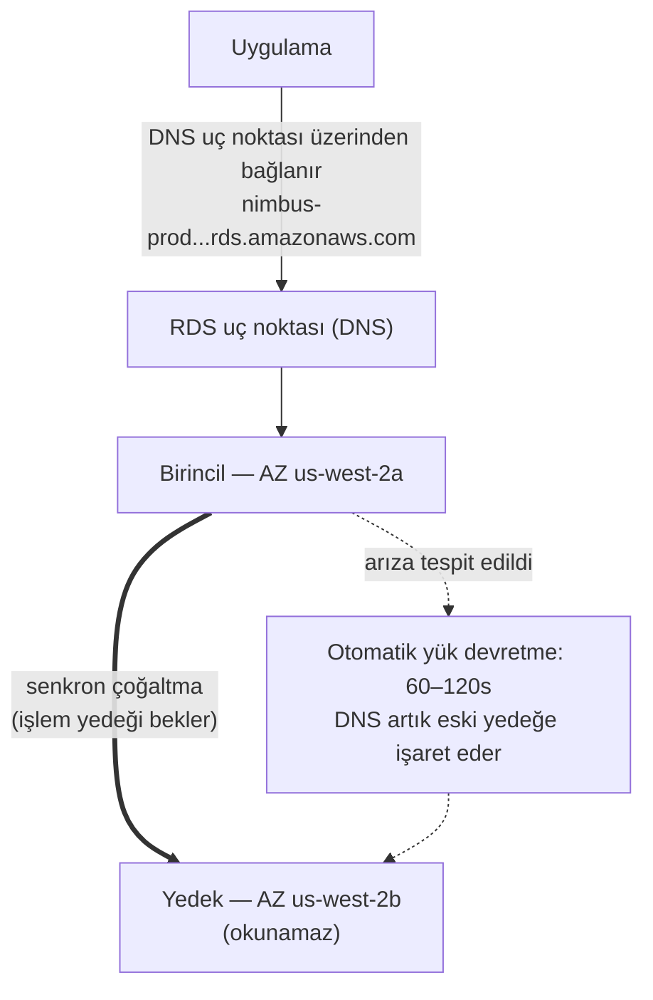

# Bölüm 8: Asla Hastalık İzni Almayan Veritabanı Yöneticisi

Uyarı geldiğinde saat sabahın 3'üydü.

Uyanık olan tek kişi Priya'ydı. Telefonu komodinin üzerinde yandı ve onu karanlıkta okudu,
ekran parlaklığı çok yüksekti. Doğruldu. Dizüstü bilgisayarını ezbere buldu ve ışık açmadan
açtı.

Klavye karanlık odada sessizce tıkırdadı.

Veritabanı sunucusu bir güvenlik yaması gerektiriyordu — yeniden başlatma gerektiren türden.
Zafiyet gerçekti, yama mevcuttu ve onu müşterileri kesintiye uğratmadan uygulama penceresi tam
şu andı, gecenin ortasında, trafiğin düşük olduğu zaman.

Sunucuya bağlandı. Yamayı çekti. Onu uyguladı.

Sonra sürüm notlarını okudu.

Paket güncellemesi, PostgreSQL'in bağlantı parametrelerini tanımlamak için kullandığı
yapılandırma dosyasına dokunuyordu. Sürüm notları bir uyarı içeriyordu: yükseltmenin nasıl
yapıldığına bağlı olarak, özelleştirilmiş bir yapılandırma dosyası paketin varsayılan sürümüyle
değiştirilebilirdi.

Onların yapılandırma dosyası özelleştirilmişti. Leo iki ay önce max_connections ayarını ince
ayarlamak için onu düzenlemişti.

Yama çalıştı. Sunucu yeniden başladı. Veritabanı tekrar çevrimiçi oldu.

Priya bir sorgu test etti. İşe yaradı.

Günlükleri kontrol etti. Her şey normal görünüyordu.

Saat 4.15'te yatağa geri döndü.

Sabah 9.05'te, Leo uygulamayı açtı ve bir hata aldı. Veritabanını kontrol etti. Max
connections varsayılana ayarlanmıştı: 100. Uygulamaları 500'e kadar bağlantı havuzları
kullanacak şekilde yapılandırılmıştı.

Her yeni bağlantı denemesi başarısız oluyordu. Uygulama, fiilen veritabanı erişimini
kaybetmişti.

"Ne oldu?" diye sordu Maya.

"Yama," dedi Priya. Çoktan yapılandırma dosyasına bakıyordu. "Paket güncellemesi
özelleştirilmiş config dosyamızın üzerine varsayılan olanı yazdı. Leo'nun max_connections ince
ayarı yok oldu — sunucu fabrika ayarlarıyla yeniden başladı ve kimse bir hata almadı. Sessizce
varsayılana geri döndü."

"Düzeltmesi ne kadar sürer?" diye sordu Leo.

"Yirmi dakika," dedi Priya. "Ama bir bakım penceresine ihtiyacımız var. Bu bir yapılandırma
değişikliği ve bir yeniden başlatma gerektiriyor."

"İki saat içinde öğle için açılacak restoranlarımız var," dedi Tom.

Priya bunu on sekiz dakikada düzeltti. Bakım penceresi on iki dakikalık gerçek kesinti
süresiydi. Restoranlar etkilendi, ama zirve henüz başlamamıştı.

Sabah ekibe ne olduğunu anlattı. Bir sessizlik oldu.

"Bu yine olacak," dedi Tom.

"Her yama olduğunda olacak," dedi Priya. "Ve her zaman yamalar vardır. Bunu yapmanın daha iyi
bir yolu olmalı."

Sekiz saniyelik sorgu süreleri hâlâ çözülmemişti. Ve aynı hafta, bu: sabaha bir olaya dönüşen
sabahın 3'ündeki bir bakım penceresi. Her iki sorunun da aynı kök nedeni vardı — Nimbus,
yönetecek donanıma sahip olmadığı bir veritabanı çalıştırıyordu.

Bir çözüm vardı. Sadece, veritabanını kendilerinin yönetmesi gerektiği fikrinden vazgeçmeyi
gerektiriyordu.

**Geleneksel Veritabanı Sorunu**

Bir veritabanını bir EC2 örneğinde kendiniz çalıştırdığınızda, her şeyden siz sorumlusunuz.

Veritabanı yazılımını yüklemek. Onu güvenli biçimde yapılandırmak. Güvenlik açıkları
keşfedildiğinde onu yamalamak. Yedek almak. Yedeklerin gerçekten çalıştığını test etmek (çoğu
ekibin iş işten geçene kadar atladığı bir adım). Disk alanını izlemek. Yedeklilik için
çoğaltmayı kurmak. Birincil sunucu çöktüğünde yük devretmeyi yapılandırmak. Sorgu performansını
ince ayarlamak. Yük altında bağlantıları yönetmek.

Bunların hiçbiri uygulama değildir. Hiçbiri özellik eklemez. Hepsi uzmanlık gerektirir.

Uzmanlık gereksinimi kilit meseledir. Nitelikli bir veritabanı yöneticisi yalnızca bir
veritabanını nasıl çalıştıracağını değil, şunları da anlar:

- Yavaş sorgu günlüklerini izlemek ve performans darboğazlarını belirlemek
- Disk G/Ç'sinden kaçınmak için çalışma kümesi için belleği boyutlandırmak
- Zaman noktası kurtarma için WAL arşivlemeyi yapılandırmak
- Otomatik yük devretmeli senkron akış çoğaltması kurmak
- Yük altında bağlantı tükenmesini önlemek için bağlantı havuzlamayı ince ayarlamak
- Veri kaybı ya da uzun kesinti olmadan büyük sürüm yükseltmeleri uygulamak

Bu, belirgin, özelleşmiş bir beceri setidir. Kıdemli DBA'ler tam da bunların hepsini iyi yapmak
zor olduğu için yüksek maaşlar talep eder. Çoğu girişim bunun için işe alım yapamaz. Çoğu
geliştirme ekibinin buna sahip değildir.

Çoğu geliştirme ekibi veritabanı yöneticisi değildir. Bu öngörülebilir bir kalıp yaratır:
veritabanı kurulur, asgari düzeyde yapılandırılır ve sonra bir şey felaket boyutunda ters
gidene kadar çoğunlukla unutulur. Nimbus PostgreSQL örneği varsayılan yapılandırmada
çalışıyordu — max_connections 100'de, bağlantı havuzlama yok, Leo'nun iki kez çalıştırıp sonra
unuttuğu manuel yedekler ve hiç çoğaltma yok.

Sabahın 3'ündeki yama olayı, uygulama kurmakta mükemmel olan ve veritabanı operasyonlarında
hiç geçmişi olmayan insanlarca çalıştırılan bir sistemin belirtisiydi. Bu bir eleştiri değil —
çoğu girişimin doğru bir tarifidir. Çözüm bir DBA tutmak değildir. Çözüm, DBA düzeyinde
operasyonları otomatik olarak sağlayan bir hizmet kullanmaktır.

"Yaptığımız bu muydu?" diye sordu Maya.

Leo'nun cevabı sessizlikti, ki bu da evet ile aynıydı.

**Yönetilen Veritabanı**

Asla hastalık izni almayan, her güvenlik yamasını otomatik olarak halleden, istenmeden her gece
bir yedek alan ve bir şey bozulduğunda kendisini düzelten bir veritabanı yöneticisi tutmayı
hayal edin. Bütün bunları sizi rahatsız etmeden yapar — ve hiçbir koşulda, asla uygulama
mantığınıza dokunmaz.

AWS bu hizmete **RDS** — Relational Database Service — der.

RDS ile, AWS şunları yönetir:

- Veritabanı motorunu yüklemek ve yamalamak
- Otomatik yedekler (S3'te saklanır, 35 güne kadar tutulur)
- Otomatik yük devretme (birincil çöktüğünde, bir yedek otomatik olarak devralır)
- İzleme ve metrikler
- Bekleme hâlinde ve aktarımda şifreleme
- Depolama otomatik ölçekleme (etkinleştirirseniz, disk dolduğunda büyür)

Siz şunları yönetirsiniz:

- Veritabanı şeması (tablolarınızın yapısı)
- Sorgularınız ve uygulama mantığınız
- Veritabanına kimin erişimi olduğu
- Veritabanını hangi örnek türünün çalıştırdığı
- Parametre ince ayarı (gerçi RDS makul varsayılanlar sağlar)

**Desteklenen Motorlar**

RDS, birkaç popüler veritabanı motorunu destekler:

- **MySQL** — en yaygın kullanılan açık kaynaklı ilişkisel veritabanı
- **PostgreSQL** — güçlü, genişletilebilir, karmaşık iş yükleri için giderek popüler
- **MariaDB** — açık kaynaklı MySQL çatallaması, tamamen uyumlu
- **Oracle** — kurumsal sınıf, eski gereksinimleri olan büyük kuruluşlarda kullanılır
- **Microsoft SQL Server** — Windows ağırlıklı ortamlar için
- **Amazon Aurora** — AWS'nin kendi MySQL/PostgreSQL uyumlu motoru, bulut için inşa edildi
  (Aurora'yı Bölüm 24'te derinlemesine ele alıyoruz)

Nimbus için seçim PostgreSQL'di. Leo'nun bildiği şeydi ve ilişkisel veriyi iyi kaldırıyordu.
Motor seçimi çoğu uygulama için düşündüğünüzden daha az önemlidir — RDS'nin operasyonel
faydaları her durumda geçerlidir.

Bir incelik: bir motoru RDS'de çalıştırdığınızda, AWS küçük sürüm yamalarını otomatik olarak
sürdürür (yapılandırdığınız bakım penceresi sırasında). Büyük sürüm yükseltmeleri — örneğin
PostgreSQL 14'ten 15'e geçmek — zamanladığınız ve yürüttüğünüz manuel bir işlemdir. AWS büyük
sürüm yükseltmelerini dikkatlice test eder, ama önce bir hazırlık ortamında test etmelisiniz.
Büyük sürüm değişiklikleri, belirli SQL söz dizimi, uzantılar ya da sürücü sürümleriyle uyumluluk
sorunları getirebilir.

Leo bunu, RDS küçük bir yama uyguladığında ve uygulama günlüğü kısaca bir alt sürümde kaldırılan
bir işlev hakkında bir kullanımdan kaldırma uyarısı gösterdiğinde keşfetti. Küçük yamalar
esasen şeffaf olmalı — ama her bakım penceresinden sonra uygulama günlüklerinizi izlemek iyi
bir uygulamadır.

"Bir küçük yama bir şeyi bozarsa ne olacağını düşündük mü?" diye sordu Priya.

"Önceki anlık görüntüye geri döneriz," dedi Leo.

"Bu ne kadar sürer?"

Leo veritabanı boyutları için RDS geri yükleme süresine baktı. `db.m6i.large` üzerinde 50 GB'lık
bir veritabanı için: bir anlık görüntüden geri yüklemek yaklaşık 15 ila 30 dakika.

"Yani bir yama üretimi bozarsa 15 ila 30 dakikalık bir kurtarma penceremiz var," dedi Priya.
"Ve yamayı sabahın erken saatlerindeki bakım penceresinde uyguluyoruz, böylece en azından etki
asgaridir."

"Ve yamaları önce hazırlıkta test ediyoruz," diye ekledi Leo.

"Evet," dedi Priya. "O da."

**RDS Örnek Boyutlandırması: Tüm İş Yükleri Eşit Değildir**

Bir RDS örneği oluşturduğunuzda, bir örnek türü seçersiniz — EC2 ile aynı kavram, ama
veritabanı iş yüklerine kapsanmış. AWS, RDS örnek türlerini birkaç yararlı katmana organize
eder.

**db.t3 ailesi**: Patlamalı performans örnekleri. Sürekli yüksek CPU gerektirmeyen geliştirme,
hazırlık ve hafif üretim iş yükleri için tasarlanmış. Bir `db.t3.micro`, düşük trafikli bir
geliştirme veritabanı için uygundur. Bir `db.t3.medium`, ara sıra patlamalarla orta üretim
yükünü kaldırır.

T serisi örneklerdeki ödünleşim: düşük kullanım dönemlerinde CPU kredileri biriktirir ve o
kredileri patlamalar sırasında harcarlar. Bir T serisi örneği sürekli yüksek CPU'da
çalıştırırsanız, kredileri tüketir ve performans, yetersiz olabilecek bir taban çizgisine
kısılır.

**db.m6i ailesi**: Tutarlı, patlamasız performansa sahip genel amaçlı örnekler. `db.m6i.large`,
üretim veritabanları için yaygın bir başlangıç noktasıdır. Bunların kredi sınırları yoktur —
CPU ihtiyaç duyduğunuzda tam kapasitede mevcuttur.

**db.r6i ailesi**: Bellek optimize örnekler. M ailesinden vCPU başına daha fazla RAM. Büyük
çalışma kümeleri olan veritabanları için uygundur — verinin her erişimde diskten getirilmesi
yerine bellekte olmasından yararlanan sorgular. Veritabanı performansınız RAM eklediğinizde
dramatik biçimde iyileşiyorsa, R ailesi doğru seçimdir.

Nimbus için:

- Geliştirme ve hazırlık: `db.t3.medium`. Geliştirme sorguları için yeterli, düşük maliyet.
- Üretim: `db.m6i.large`. Tutarlı performans, menü ve sipariş çalışma kümesi için yeterli RAM,
  kredi kısılması yok.

"m6i.large, t3.medium'dan ne kadar daha pahalı?" diye sordu Tom.

Leo fiyatlandırma sayfasını kontrol etti. `db.t3.medium` aylık yaklaşık 55 dolardı.
`db.m6i.large` aylık yaklaşık 140 dolardı. Fark gerçekti, ama güvenilirlik farkı da öyle.

"t3, sürekli yük altında kısılır," dedi Priya. "Yoğun bir cumamız olursa ve CPU dört saat yüksek
kalırsa, t3 kredisi tükenir ve kısılır. m6i kısılmaz."

Tom sayıyı yazdı. İki hafta önceki cuma kesintilerinin maliyetini de yazdı. Karşılaştırma yakın
değildi.

Üretim `db.m6i.large`a geçti.

**Multi-AZ: Devralan Yedek**

Bu, güvenilirlik hesabını tamamen değiştiren özelliktir.

**Multi-AZ dağıtımı**, RDS'nin birincilden farklı bir Erişilebilirlik Bölgesi'nde senkron bir
yedek örnek sürdürmesi demektir. Birincile işlenen her işlem, işlem onaylanmadan önce yedeğe
senkron olarak çoğaltılır.

Birincil arızalandığında — donanım arızası, AZ kesintisi, yazılım çökmesi — RDS otomatik olarak
yedeğe geçer. Veritabanı uç noktasının DNS kaydı güncellenir. Uygulamanız yeni birincile yeniden
bağlanır.

Yük devretme 60–120 saniye sürer. O pencere boyunca, uygulamanız bağlantı hataları yaşar.
Düzgün yazılmış uygulamalar bunu zarif biçimde ele almalıdır (geri çekilmeli bağlantı yeniden
denemeleri).

Yedek bir okuma çoğaltması değildir. Okuma trafiği sunmaz. Tek amacı devralmaya hazır olmaktır.



(Not: daha yeni **Multi-AZ DB Cluster** dağıtım seçeneği, **okunabilir** *iki* yedek tutar ve
~35 saniyede yük devreder — sınav onu burada tarif edilen klasik Multi-AZ *örnek* dağıtımından
ayırt edebilir.)

"Multi-AZ'nin maliyeti ne?" diye sordu Tom.

Kabaca tek bir örneğin iki katı maliyet — çünkü tam anlamıyla iki veritabanı örneği
çalıştırıyorsunuz. Yedek, birincil ile aynı maliyettedir.

Tom sipariş geçmişini açtı ve cuma zirveleri sırasında saat başına geliri tahmin etti.

"Peki ya biri yük devretme penceresi sırasında içeri girmeye çalışırsa?" diye sordu Priya.
"Birincil çökmüşken ve yedek terfi ederken, açıkta olduğumuz altmış saniye var mı?"

"Yük devretme şeffaftır," dedi Maya, "ama soru haklı. Bağlantı dizeleri sabit kodlanmış IP'leri
değil, RDS uç noktasını kullanmalı — yoksa yük devretme sorunsuz olmaz."

Multi-AZ o öğleden sonra etkinleştirildi.

**Otomatik Yedekler ve Zaman Noktası Kurtarma**

RDS her gün otomatik yedekler alır. AWS bu yedekleri S3'te saklar (RDS tarafından yönetilir —
onları S3 konsolunuzda doğrudan görmezsiniz). Veritabanını, yedekleme saklama döneminizdeki
herhangi bir noktaya geri yükleyebilirsiniz.

Yedekler, yapılandırılabilir bir **yedekleme penceresi** sırasında olur — tipik olarak sabahın
erken saatlerinde düşük trafikli bir dönem. (Bu, RDS'nin yamaları ve yapılandırma
değişikliklerini uyguladığı **bakım penceresinden** ayrı bir ayardır. Sınav, bunların iki
farklı pencere olduğunu test etmeyi sever.) Çoğu motor türü için, yedekler kesintiye neden
olmaz — ve Multi-AZ dağıtımlarında, anlık görüntü yedekten alınır, böylece birincile hiç
dokunulmaz.

**Zaman noktası kurtarma**, en değerli özelliklerden biridir: saklama döneminizdeki herhangi
bir saniyeye geri yükleyebilirsiniz. Sadece günlük anlık görüntülere değil — *herhangi bir
saniyeye*. Bu, RDS'nin günlük yedeklere ek olarak işlem günlüklerini sürekli arşivlemesi
sayesinde mümkündür.

Biri yanlışlıkla 14.37'de `DELETE FROM orders WHERE 1=1` çalıştırırsa, 14.36'ya geri
yükleyebilirsiniz.

Leo bunu anladığında gözle görülür biçimde rahatladı.

"Yedekleme saklamayı bir güne ayarlamıştım," dedi Leo. "Ay — yine de sorun değil, değil mi?
Değiştirebiliriz?"

"Asgari yedi güne değiştir," dedi Priya. "Üretim için otuz."

Leo onu hemen güncelledi.

"Geçen ay sildiğim şeyden kurtulabilir miydik?" diye sordu.

"RDS'den önce mi? Hayır," dedi Priya. "RDS'den sonra mı? Evet."

Şunu merak ediyor olabilirsiniz: otomatik bir yedek ile manuel bir anlık görüntü arasındaki
fark nedir? Otomatik yedekler, saklama dönemi sona erdiğinde silinir (35 güne kadar). Manuel
anlık görüntüler, siz açıkça silene kadar süresiz olarak tutulur. Bir veritabanı durumunu kalıcı
olarak korumanız gerekiyorsa — büyük bir taşımadan önce, riskli bir dağıtımdan önce — manuel
bir anlık görüntü alın.

**RDS Proxy: Bağlantı Sorununu Ölçekte Çözmek**

RDS'ye geçtikten iki hafta sonra, Leo metriklerde bir şey fark etti.

Veritabanı sorguları sorunsuz kaldırıyordu. Ama açık bağlantı sayısı yüksekti — beklediğinden
yüksek. Auto Scaling Group zirve sırasında EC2 örnekleri eklerken, her yeni örnek kendi
veritabanı bağlantı havuzunu açıyordu. On EC2 örneği, her biri 50 bağlantılı bir havuzla:
veritabanına beş yüz eşzamanlı bağlantı.

"PostgreSQL'in her bağlantı için bir yükü vardır," dedi Priya. "Bellek, bağlantı işleyici için
CPU. Beş yüz bağlantı, herhangi bir gerçek iş yapmadan önce, sadece bağlantı yönetimi için
veritabanının kaynaklarının anlamlı bir miktarını kullanır."

"Bağlantı havuzu boyutunu azaltabilir miyiz?" diye sordu Leo.

"Azaltabiliriz," dedi Priya. "Ama o zaman zirve sırasında isteklerin bir bağlantı için bekleyip
kuyruğa girme riskini alırız."

Daha iyi çözüm: **RDS Proxy**.

RDS Proxy, uygulama ile veritabanı arasında oturur. EC2 örnekleri doğrudan RDS örneğine değil,
Proxy'ye bağlanır. Proxy bir veritabanı bağlantısı havuzu sürdürür ve uygulama isteklerini
onlar arasında çoğullar. On EC2 örneğinin her biri Proxy'ye elli bağlantı açarsa, Proxy yalnızca
yüz gerçek veritabanı bağlantısı sürdürebilir — onları tüm uygulama istekleri arasında verimli
biçimde paylaşarak.

Faydalar:

**Bağlantı havuzlama**: Daha az gerçek veritabanı bağlantısı, RDS örneğinde daha az bellek yükü
ve yük altında daha iyi performans demektir.

**Daha hızlı yük devretme**: Bir Multi-AZ yük devretmesi sırasında, Proxy uygulama tarafındaki
bağlantıyı sürdürürken arka uçta veritabanı bağlantısını yeniden kurar. Uygulamalar tam bir
bağlantı sıfırlaması yerine kısa bir duraklama görür. RDS Proxy, yük devretme etkisini 60–120
saniyeden tipik olarak 30 saniye ya da daha azına indirir.

**IAM kimlik doğrulaması**: Veritabanı kimlik bilgilerini uygulamaya gömmek yerine, uygulama
RDS Proxy'ye bir IAM rolü kullanarak kimlik doğrulayabilir. Proxy gerçek veritabanı kimlik
bilgilerini halleder. Bu, sırları uygulama ortamından tamamen ortadan kaldırır.

"RDS Proxy'nin maliyeti ne?" diye sordu Tom.

Altta yatan RDS örneğinin vCPU-saati başına kabaca 0,015 dolara mal olur, örneğin kendisinden
ayrı faturalandırılır. Bir `db.m6i.large` (2 vCPU) için, Proxy aylık yaklaşık 22 dolar ekler.

Tom bağlantı sayısı grafiğine baktı — zirve sırasında veritabanı kaynakları için rekabet eden
beş yüz bağlantı — ve aylık 22 dolarlık maliyete baktı.

"Bu, bağlantı yükünü kaldırmak için daha büyük bir RDS örneğine yükseltmekten daha ucuz," dedi.

RDS Proxy o hafta etkinleştirildi.

"Peki ya biri Proxy üzerinden içeri girmeye çalışırsa?" diye sordu Priya. "Proxy için IAM
kimlik doğrulaması saldırı yüzeyini azaltır mı?"

"Evet," diye yanıtladı Priya kendi sorusunu. "Uygulama ortamında veritabanı kimlik bilgisi
olmaması, uygulamadan çalınacak veritabanı kimlik bilgisi olmaması demektir."

Proxy için IAM kimlik doğrulamasını etkinleştirdi.

**Okuma Çoğaltmaları: Okuma Trafiğini Ölçeklemek**

Multi-AZ kullanılabilirlikle ilgilidir. **Okuma çoğaltmaları (read replicas)** performansla
ilgilidir.

Bir okuma çoğaltması, okuma sorgularını sunabilen, birincil veritabanınızın eşzamansız bir
kopyasıdır. Büyük RDS motorları için 15 okuma çoğaltmasına kadar sahip olabilirsiniz — MySQL,
PostgreSQL ve MariaDB (Aurora da aynı depolama birimini paylaşan 15 Aurora Çoğaltmasına kadar
destekler).

Uygulama, okuma sorgularını çoğaltmaya ve yazma sorgularını birincile gönderecek şekilde
değiştirilir. Bu yükü dağıtır: birincil yazmaları ve karmaşık işlemleri kaldırır; çoğaltmalar
okumaları kaldırır.

Temel özellikler:

- Çoğaltma **eşzamansızdır (asynchronous)** — birincil ile çoğaltma arasında küçük bir gecikme
  (lag) olabilir. Bir kayıt yazıp hemen çoğaltmadan okursanız, onu henüz göremeyebilirsiniz.
- Okuma çoğaltmaları aynı Bölge'de ya da farklı bir Bölge'de olabilir (bölgeler arası
  çoğaltmalar gecikme ekler ama coğrafi dağıtımı mümkün kılar).
- Okuma çoğaltmaları, bir felaket senaryosunda bağımsız veritabanlarına terfi ettirilebilir.

Nimbus için: menü aramaları okumadır. Sipariş geçmişi okumadır. Trafiğin büyük çoğunluğu okuma
trafiğidir. Bir okuma çoğaltması ekleyip okumaları ona yönlendirmek, birincil veritabanı yükünü
önemli ölçüde keser.

Okuma çoğaltmalarını, Aurora'yı tartıştığımız Bölüm 24'te daha kapsamlı olarak ele alıyoruz.

**Okuma Ağırlıklıysa Bir Çoğaltma Ekle Ama Gecikmeye Dikkat Et**

İş yükünüz okuma ağırlıklıysa, bir okuma çoğaltması eklemek birincildeki yükü azaltır ve sorgu
performansını iyileştirir — ama çoğaltma eşzamansızdır, bu da çoğaltmanın birincilden biraz
geride olabileceği anlamına gelir. Uygulamanız bir kaydı yazıp hemen geri okuyorsa, onu
çoğaltmadan değil birincilden okumalıdır. Bunu yanlış yapmak, ince, hata ayıklaması zor veri
güncelliği hataları üretir: bir kullanıcı sipariş verir, onay sayfası çoğaltmayı sorgular,
çoğaltma yetişmemiştir, sipariş eksik görünür. Buna oku-yazdığını (read-your-writes)
tutarlılığı denir ve ekiplerin çoğaltma ilk eklediklerinde yaptığı en yaygın hatadır.

**Performance Insights: Yavaş Sorguyu Bulmak**

Sekiz saniyelik menü yükleme süresi hâlâ bir sorundu. RDS'ye geçiş güvenilirliği iyileştirdi,
ama sorgu hâlâ yavaştı.

Leo bir okuma çoğaltması ekledi ve menü sorgularını ona yönlendirdi. Menü yükleme süresi yaklaşık
dört saniyeye düştü. Daha iyi. Hâlâ iyi değil.

"Sorgu hâlâ yavaş," dedi Maya. "Darboğazı iyileştirdik, ama düzeltmedik."

RDS, **Performance Insights** denen bir özellik içerir — hangi sorguların en çok veritabanı
kaynağı tükettiğini, hangi oturumların beklediğini ve neyi beklediklerini gösteren bir izleme
aracı.

Leo okuma çoğaltmasında Performance Insights'ı etkinleştirdi ve bir öğleden sonra test oturumu
sırasında menü sayfasını tekrar tekrar yükledi.

Performance Insights panosu, yükü domine eden bir sorgu gösterdi: bir menü sayfası her
yüklendiğinde 22.000 satırın tümünü getiren, `menu_items` tablosunun tam bir tablo taraması.
Uygulamanın filtrelediği sütun olan `restaurant_id`'de bir dizin yoktu.

Dizinsiz yürütme süresi: 8,2 saniye.

Leo dizini ekledi.

```sql
CREATE INDEX idx_menu_items_restaurant_id ON menu_items(restaurant_id);
```

Dizinli yürütme süresi: 14 milisaniye.

8.200 milisaniyeden 14 milisaniyeye. Müşterileri uzaklaştıran bir restoran sipariş uygulaması
ile düşünmeden kullandıkları bir uygulama arasındaki fark.

"Bunca zamandır sorun buydu, öyle mi?" dedi Maya.

"Sorun buydu," dedi Leo.

"Ve Performance Insights onu ne kadar sürede buldu?"

"Yaklaşık yirmi dakika."

Tom çoktan hesaplıyordu. Üç hafta boyunca optimal olmayan menü yükleme süreleri, o dönemde
tahmini 200.000 menü sayfası yüklemesi, yavaşlık nedeniyle tahmini %15 terk etme. Vardığı sayı
rahatsız ediciydi.

"Bir dahaki sefere lansmandan önce eksik dizinleri ekle," dedi.

"Bir kontrol listesi olacak," dedi Priya. Çoktan onu yazıyordu.

**RDS Ne Zaman Kullanılmamalı**

RDS, geniş bir ilişkisel veritabanı iş yükü yelpazesi için mükemmeldir. Her şey için doğru cevap
değildir.

**İşletim sistemi düzeyinde erişime ihtiyaç duyduğunuzda**: RDS, altta yatan işletim sistemine
erişim vermez. Özel işletim sistemi paketleri yükleyemez, çekirdek parametrelerini değiştiremez
ya da veritabanı sunucusuna root erişimi gerektiren araçlar çalıştıramazsınız. Veritabanınızın
işletim sistemi erişimi talep eden gereksinimleri varsa — belirli Oracle yapılandırmaları, özel
depolama sürücüleri, belirli ağ arabirimleri — veritabanını doğrudan bir EC2 örneğinde
çalıştırmanız gerekir.

**Desteklenmeyen bir motor kullandığınızda**: RDS, MySQL, PostgreSQL, MariaDB, Oracle, SQL
Server ve Aurora'yı destekler. Uygulamanız farklı bir veritabanı motoru kullanıyorsa —
CockroachDB, SingleStore, Greenplum — onu RDS'de değil, EC2'de çalıştırıyorsunuz.

**Yazma ağırlıklı yatay ölçeklemeye ihtiyaç duyduğunuzda**: RDS, okumaları çoğaltmalar
aracılığıyla ölçekler. Yazmalar tek bir birincil örneğe gider. İş yükünüz yazma ağırlıklıysa ve
birden fazla yazma düğümüne dağıtılması gerekiyorsa, RDS doğru mimari değildir. Aurora'nın
Global Database'i büyük ölçekte yardımcı olabilir, ama aşırı yazma ölçeği gereksinimleri için,
DynamoDB (Bölüm 9) ya da EC2'de çalışan CockroachDB gibi dağıtık veritabanları uygun araçlardır.

**Yönetilen maliyet operasyonel maliyeti aştığında**: Ekibinizin gerçek veritabanı yönetimi
uzmanlığına sahip olduğu çok büyük, istikrarlı iş yükleri için, PostgreSQL'i EC2'de kendi
araçlarınızla çalıştırmak RDS'den daha ucuz olabilir. Bu, esas olarak DBA dükkânı olmayan
ekipler için olağandışıdır. Ama gerçektir ve iyi bir mimar bunu kabul eder.

Nimbus için — özel DBA kaynakları olmayan, yönetilen bir hizmette PostgreSQL çalıştıran,
öngörülemeyen büyümeli bir girişim — RDS açıkça doğru seçimdi.

**RDS Parametre Grupları ve Seçenek Grupları**

Sınavda iki yapılandırma mekanizması çıkar:

**Parametre grupları (parameter groups)**, veritabanı motoru ayarlarını kontrol eder —
maksimum bağlantılar, sorgu önbellek boyutu, zaman aşımı değerleri gibi. RDS, çoğu durum için
çalışan bir varsayılan parametre grubu oluşturur. Belirli ayarları ince ayarlamanız gerektiğinde
özel parametre grupları oluşturursunuz.

**Seçenek grupları (option groups)**, bazı motorlar için ek özellikleri etkinleştirir —
Oracle'ın yerel ağ şifrelemesi ya da SQL Server'ın şeffaf veri şifrelemesi gibi. Çoğu açık
kaynaklı motor dağıtımı özel seçenek gruplarına ihtiyaç duymaz.

Veritabanı motorunun davranışını bu mekanizmalar aracılığıyla özelleştirebilirsiniz — ama
varsayılanlar yeni başlayan çoğu ekip için çalışır.

### Veriyi İçeri Almak: AWS Database Migration Service

Birkaç hafta sonra, Tom ayaküstü toplantıya bir slaytla geldi.

Nimbus, küçük bir bölgesel rakibini satın alıyordu. Onların sipariş sistemi, bir co-location
tesisinde bir MySQL veritabanında çalışıyordu. Sistem, taşıma sırasında çevrimdışı olamazdı —
restoranlar onu kullanıyordu.

"Verilerini RDS'ye taşımamız gerekiyor," dedi Tom. "Sistemi çökertmeden."

"Veritabanı ne kadar büyük?" diye sordu Leo.

"Yaklaşık 80 gigabayt."

"Ne zaman geçiş yapmaları gerekiyor?"

"Altı hafta."

Priya çoktan dokümantasyonu açmıştı. "AWS DMS," dedi.

**AWS DMS (Database Migration Service)**, veriyi bir kaynak veritabanından bir hedef
veritabanına asgari kesintiyle taşır. Taşımayı iki aşamada halleder: mevcut verinin tam
yüklemesi, ardından kaynak çalışmaya devam ederken değişikliklerin sürekli çoğaltılması.

İki taşıma türü vardır:

**Homojen taşıma:** kaynak ve hedef aynı motordur — MySQL'den RDS MySQL'e, PostgreSQL'den
Aurora PostgreSQL'e. Şema uyumludur; DMS veriyi doğrudan taşır.

**Heterojen taşıma:** kaynak ve hedef farklı motorlardır — Oracle'dan Aurora PostgreSQL'e, SQL
Server'dan RDS MySQL'e. Şema önce dönüştürülmelidir. Bu, şemayı çevirmek için **AWS Schema
Conversion Tool (SCT)** gerektirir, sonra veriyi taşımak için DMS.

Nimbus satın alması için: MySQL'den RDS MySQL'e. Homojen. SCT gerekmez.

Pratikte nasıl çalışır:

1. DMS kaynaktan okur — co-location MySQL veritabanı
2. **Tam yükleme**: DMS tüm mevcut veriyi hedef RDS örneğine kopyalar
3. **CDC (Change Data Capture)**: tam yüklemeden sonra, DMS kaynak veritabanının işlem
   günlüğünü okur ve süregelen değişiklikleri neredeyse gerçek zamanlı olarak hedefe çoğaltır
4. Kaynak çalışmaya devam eder. Ekip hazır olduğunda, bağlantı dizesini çevirir.

"Yani restoran sipariş sistemi tüm süre boyunca canlı mı kalır?" diye sordu Tom.

"Tüm süre boyunca," diye doğruladı Priya. "Kaynak ve hedef CDC aracılığıyla senkronize kalır.
Hazır olduğumuzda, uç noktayı çeviririz. Kesinti, o değişikliğin yayılması için geçen
saniyelerdir."

DMS, onlarca kaynak ve hedef kombinasyonunu destekler: Oracle, SQL Server, MySQL, PostgreSQL,
MongoDB, DynamoDB, S3, Redshift, Aurora ve daha fazlası.

"Dur — ama heterojen taşımalar için neden ayrı bir araca ihtiyacımız var?" diye sordu Maya.
"DMS şema farklılıklarını kendisi çözemez mi?"

"Oracle'daki bir VARCHAR, PostgreSQL'deki bir VARCHAR ile aynı değildir," dedi Priya. "Veri
türleri, saklı yordamlar, diziler, özel işlevler — bire bir eşlenmezler. SCT kaynak şemayı
analiz eder ve hedef için en yakın eşdeğeri üretir. DMS sonra veriyi o dönüştürülmüş şemaya
taşır. Şema dönüşümünü veri hareketinden ayırmak, süreci güvenilir kılan şeydir."

"Peki ya biri DMS çoğaltma örneği üzerinden içeri girmeye çalışırsa?" diye sordu Priya bir an
sonra kendine. "Kaynağa okuma erişimine ve hedefe yazma erişimine ihtiyaç duyuyor."

"Her iki uçta en az yetki," dedi Leo. "Kaynakta salt okunur IAM. Yazma erişimi yalnızca taşıma
hedefine kapsanmış. Ve çoğaltma örneği özel alt ağda kalır."

Priya bunu yazdı.

## Güçlü Yönler ve Sınırlamalar

**RDS neden mükemmel**:

- Veritabanı yazılımını yönetmenin operasyonel yükünü ortadan kaldırır
- Otomatik yedekler ve zaman noktası kurtarma
- Asgari RTO ile otomatik yük devretme için Multi-AZ
- Okuma trafiğini ölçeklemek için okuma çoğaltmaları
- Yerleşik bekleme hâlinde ve aktarımda şifreleme
- Tüm büyük ilişkisel veritabanı motorları desteklenir
- Bağlantı havuzlama ve geliştirilmiş yük devretme yanıtı için RDS Proxy

**RDS'nin sınırları olduğu yer**:

- Altta yatan işletim sistemine erişemezsiniz. Veritabanınızın işletim sistemi düzeyinde
  erişim talep eden gereksinimleri varsa, kendi EC2 tabanlı veritabanınızı çalıştırmanız
  gerekebilir.
- RDS sunucusuz değildir (istisnalarla — Aurora Serverless var, Bölüm 24'te ele alınır). Boşta
  olsa bile çalışan bir örnek için ödersiniz.
- RDS, yatay parçalanmış veritabanları için tasarlanmamıştır. Yazma ağırlıklı ilişkisel iş
  yüklerinin devasa ölçek dışına çıkması için, eninde sonunda farklı bir mimariye ihtiyaç
  duyabilirsiniz.
- İlişkisel olmayan (NoSQL) veri kalıpları için, DynamoDB (Bölüm 9) daha uygundur.

## Özet

Priya'nın sabahın 3'ündeki yama penceresi belirtiydi. Kök neden, Nimbus'un, yönetilen bir
hizmetin daha iyi kaldırabileceği bir veritabanını yönetiyor olmasıydı. RDS sadece sabahın 3'ündeki
uyandırma çağrısını ortadan kaldırmaz — yamalama, yük devretme, yedekleme ve bağlantı yönetimi
sorumluluğunu AWS'ye kaydırır, ekibi gerçekten müşterilere hizmet eden uygulama koduna
odaklanmaya serbest bırakır. Ödünleşim, işletim sistemi düzeyinde erişimin kaybıdır, ki bu
nadiren önemlidir ve kulağa geldiğinden çok daha az.

- **Amazon RDS**, yönetilen bir ilişkisel veritabanı hizmetidir. AWS yamalamayı, yedeklemeyi,
  yük devretmeyi ve depolamayı halleder. Siz şemayı, sorguları ve uygulama mantığını
  hallederniz.
- **Multi-AZ**, farklı bir AZ'de senkron bir yedek sürdürür. Otomatik yük devretme 60–120
  saniyede gerçekleşir. Bağlantı dizelerinde her zaman RDS uç noktası DNS adını kullanın —
  sabit kodlanmış IP'leri değil — böylece yük devretme şeffaf olur.
- **Okuma çoğaltmaları**, okuma trafiği sunan eşzamansız kopyalardır. Çoğaltma gecikmesi, biraz
  geride olabilecekleri anlamına gelir — oku-yazdığını tutarlılığı, bir yazmadan hemen sonra
  birincilden okumayı gerektirir.
- **RDS Proxy**, bağlantıları havuzlar, yükü azaltır ve yük devretme hızını iyileştirir.
  Binlerce kısa ömürlü bağlantı oluşturabilen Lambda tabanlı iş yükleri için kritiktir.
- **Performance Insights**, yavaş sorguları belirler — eksik bir dizin bulmak, 8 saniyelik bir
  sorguyu 14 milisaniyelik bir sorguya dönüştürebilir. Büyük sürüm yükseltmeleri manueldir;
  önce hazırlıkta test edin.

## Sınav İpuçları

*SAA-C03 Alan 3 — Görev 3.3 (veritabanı çözümleri)*

- **Multi-AZ yüksek kullanılabilirlik içindir, performans için değil.** Yedek okuma trafiği
  sunmaz. Okuma çoğaltmaları performans içindir. Bu ayrım sık test edilir.
- **Multi-AZ yük devretmesi otomatiktir.** Ne zaman ya da nasıl gerçekleşeceğini
  yapılandırmazsınız. RDS birincili izler ve yük devretmeyi otomatik olarak tetikler.
- **Çoğaltma gecikmesi önemlidir.** Okuma çoğaltmaları birincilden biraz geride olabilir.
  Uygulamanız az önce yazdığı veriyi okumayı gerektiriyorsa, onu çoğaltmadan değil birincilden
  okumalıdır. Buna "oku-yazdığını tutarlılığı (read-your-writes consistency)" denir.
- **Otomatik yedekler 0–35 gün saklanır.** Saklamayı 0'a ayarlamak otomatik yedekleri devre dışı
  bırakır. Manuel anlık görüntüler, siz silene kadar süresiz olarak tutulur.
- **RDS depolama otomatik ölçekleme**, disk-dolu kesintilerini önler. Onu etkinleştirin.
  Yalnızca yukarı ölçekler, asla aşağı değil. Sınav bu asimetriyi bilip bilmediğinizi test
  edebilir.
- **RDS Proxy**, Lambda işlevlerinin RDS'ye bağlandığı sınav senaryolarında (Lambda binlerce
  kısa ömürlü bağlantı oluşturabilir, ki bu bir Proxy olmadan veritabanını bunaltır) ya da daha
  hızlı Multi-AZ yük devretmesi gerektiren senaryolarda çıkar.
- **db.t3 örnekleri patlar ve kısılır.** Küçük RDS örneklerinde aralıklı performans bozulmasını
  tarif eden sınav senaryoları, T serisi örneklerde CPU kredisi tükenmesini tarif ediyor
  olabilir. Düzeltme, bir M ya da R serisi örneğe yükseltmektir.
- **Multi-AZ DNS uç noktası**: Bir Multi-AZ yük devretmesi gerçekleştiğinde, RDS uç noktası DNS
  kaydı yeni birincile işaret edecek şekilde güncellenir. RDS uç noktasını (sabit kodlanmış bir
  IP değil) kullanan uygulamalar otomatik olarak yeniden bağlanır. Uzun DNS TTL'leri ya da
  sabit kodlanmış IP adresleri olan uygulamalar otomatik olarak yeniden bağlanmaz. Her zaman RDS
  uç noktasını kullanın.
- **Okuma çoğaltması terfisi**: Bir okuma çoğaltması bağımsız bir DB örneğine terfi
  ettirilebilir — birincil kaybedilirse ve Multi-AZ yapılandırılmamışsa felaket kurtarma için
  kullanışlıdır. Terfi tek yönlü bir işlemdir: çoğaltma bir birincil olur ve artık orijinalden
  çoğaltmaz. "Manuel terfi ettirme" ya da "bir okuma çoğaltmasını birincile dönüştürme"
  hakkındaki sınav senaryoları bu işlemi içerir.
- **Performance Insights**, en çok bekleme süresi ve CPU kullanımına göre en üstteki SQL
  sorgularını belirler. Bir sınav senaryosu bir RDS veritabanında yavaş sorguların nasıl teşhis
  edileceğini sorduğunda, AWS yerel cevabı Performance Insights'tır.
- **RDS ve bir veritabanını EC2'de çalıştırma**: Sınav bazen bunu bir seçim olarak sunar. RDS
  yönetilen operasyonlar sağlar ama işletim sistemi düzeyinde erişimi sınırlar. EC2 tabanlı
  veritabanları size tam kontrol verir ama operasyonlar için DBA uzmanlığı gerektirir. Bir sınav
  senaryosundaki "işletim sistemi düzeyinde erişim gerekli" ifadesi, RDS yerine EC2'yi seçmek
  için bir sinyaldir.
- **AWS DMS:** Veritabanlarını tam yükleme + CDC kullanarak asgari kesintiyle taşır. Homojen
  (aynı motor) = doğrudan DMS. Heterojen (farklı motorlar) = önce şemayı dönüştürmek için SCT,
  sonra veriyi taşımak için DMS. Sınav tetikleyicisi: "veritabanını asgari kesintiyle taşı" ya
  da "Oracle'dan Aurora'ya" → DMS + SCT.

## Alıştırmalar

**Alıştırma 1 — Hatırlama**

Kendi kelimelerinizle: RDS'de Multi-AZ ile okuma çoğaltmaları arasındaki fark nedir? Her biri
hangi sorunu çözer?

*(İpucu: Biri kesintiye karşı korur; diğeri okuma ağırlıklı yük altında performansı iyileştirir.
Farklı sorunları çözerler ve birlikte kullanılabilirler.)*

**Alıştırma 2 — SAA-C03 Senaryosu**

*Senaryo*: Bir şirket, RDS'de bir üretim PostgreSQL veritabanı çalıştırıyor. Veritabanı, gün
boyunca çalışan raporlama sorguları nedeniyle yüksek okuma trafiği yaşıyor. Ekip ayrıca
veritabanı kullanılabilirliği konusunda da endişeli — bir arıza senaryosunda birkaç dakikadan
fazla kesintiyi göze alamazlar. Raporlama iş yüklerinin birincil veritabanı üzerindeki etkisini
en aza indirmek istiyorlar.

Hangi RDS özellikleri kombinasyonu her iki kaygıyı da EN İYİ şekilde ele alır?

A) Multi-AZ'yi etkinleştirin ve tüm sorguları yedek örneğe karşı çalıştırın  
B) Daha sık manuel anlık görüntüler alın ve birincil arızalanırsa onlardan geri yükleyin  
C) Birden fazla okuma çoğaltması oluşturun ve maliyetleri azaltmak için Multi-AZ'yi devre dışı
   bırakın  
D) Yük devretme koruması için Multi-AZ'yi etkinleştirin ve raporlama sorguları için bir okuma
   çoğaltması oluşturun

**İpucu 1**: İki gereksinim: (1) arıza sırasında kullanılabilirlik, (2) okumaları boşaltma. Hangi
özellikler hangi gereksinimi ele alır?

**İpucu 2**: Multi-AZ otomatik yük devretme sağlar. Yedek okuma trafiği SUNMAZ. Yani Multi-AZ
tek başına okuma sorununa yardımcı olmaz.

**İpucu 3**: Okuma çoğaltmaları okuma trafiği sunar. Multi-AZ yük devretme sağlar. İkisine de
ihtiyacınız var.

**Cevap**: D

**Açıklama**: Multi-AZ, farklı bir AZ'deki bir yedeğe otomatik yük devretme sağlar — bu,
kullanılabilirlik gereksinimini ele alır. Bir okuma çoğaltması, raporlama sorgularının birincil
veritabanını etkilemeden çalışmasına olanak tanır — bu, performans gereksinimini ele alır. Her
iki özellik de aynı anda kullanılabilir.

**Neden A değil?** Multi-AZ yedeği okuma trafiği sunamaz. Yalnızca yük devretme içindir. Onu
doğrudan sorgulamaya çalışmak desteklenmez.

**Neden B değil?** Manuel anlık görüntüler veritabanının tam bir kopyasını geri yükler — çok
daha uzun bir süreç (büyük veritabanları için potansiyel olarak saatler). Bu, "birkaç dakika
kesinti" gereksinimini karşılamaz.

**Neden C değil?** Okuma çoğaltmaları okuma performansına yardımcı olur ama otomatik yük
devretme sağlamaz. Birincil arızalanırsa, bir okuma çoğaltmasını elle terfi ettirmeniz gerekir
— ki bu zaman alır ve otomatik değildir.

*SAA-C03 Alan 3 — Görev 3.3*

**Alıştırma 3 — Mimari Zorluk** *(İsteğe Bağlı)*

Nimbus, mevcut kendi yönetilen PostgreSQL veritabanını (bir EC2 örneğinde çalışan) RDS
PostgreSQL'e taşımayı düşünüyor. Taşımanın asgari kesintiyle gerçekleşmesi gerekiyor — ideal
olarak 15 dakikanın altında. Veritabanı 200 GB.

Hangi yaklaşımı önerirsiniz? Hangi AWS hizmetleri taşımaya yardımcı olabilir? Üretim trafiğine
geçmeden önce hangi riskleri test ederdiniz?

*(Tek bir doğru cevap yoktur. AWS Database Migration Service'i, mantıksal çoğaltmayı ve geçiş
sırasında veri tutarsızlığı riskini düşünün.)*

## Jenerik Sonrası Sahne

Gün sonunda, Nimbus Multi-AZ etkin olarak RDS PostgreSQL'e taşınmıştı. Taşımanın kendisi öğleden
sonranın çoğunu aldı — Leo, kısa bir bakım penceresiyle bir yedekle-ve-geri-yükle yaklaşımı
kullandı.

Tom faturayı dikkatle izlemişti.

"RDS örneği," dedi, "EC2 veritabanının iki katına mal oluyor."

"Peki otomatik yedekler?" diye sordu Maya.

"Biraz daha fazla."

"Peki birincil ölürse bedavaya alacağımız yük devretme?"

Tom'un bunun için bir fiyatı yoktu. Onu bir soru olarak yazdı.

Üç gün sonra, veritabanı sağlıklıydı. Leo eksik dizini ekledikten sonra sorgu süreleri dramatik
biçimde düşmüştü. Menü bir saniyenin altında yükleniyordu.

"Sorun," dedi Priya, "veritabanı motoru değil. Veri modeli."

Durdu.

"Bu verinin bir kısmı hiç ilişkisel değil. Menü öğeleri, restoran profilleri, teslimat
bölgeleri — bu verinin değişken biçimleri var. SQL bizimle savaşıyor."

Leo çoktan bir şey araştırıyordu.

"Ya menü için farklı bir veritabanı türü kullanırsak?" dedi.

Bir sonraki bölümde: bir milyon insan aynı anda sipariş verse bile yavaşlamayan veritabanı.
