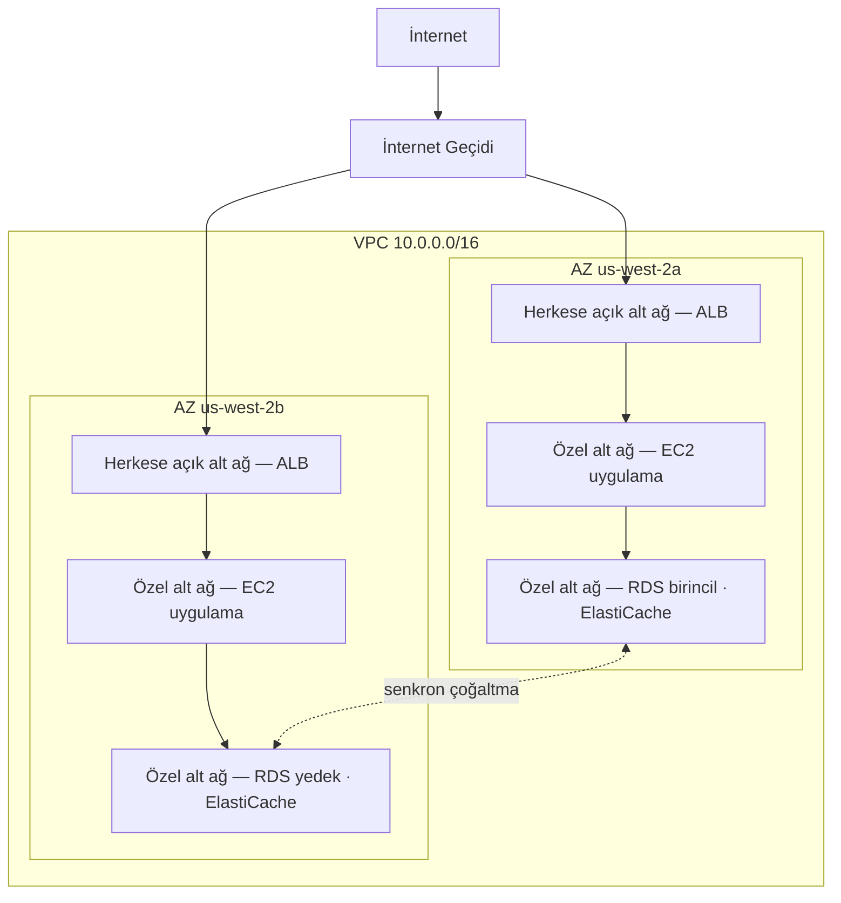

# Bölüm 11: Bulutun Özel Köşeniz

Priya'nın üzerinde bir çizim olan bir kağıt parçası vardı.

Karmaşık bir çizim değildi. "AWS" etiketli bir dikdörtgen. Dikdörtgenin içinde bir kutu kümesi: EC2 örnekleri, bir RDS veritabanı, bir ElastiCache kümesi. Her şeyi diğer her şeye bağlayan çizgiler. Ve dikdörtgenin dışında tek bir etiket: "İnternet."

Onu masanın ortasına koydu.

---

*Önbellekleme katmanı çalışıyordu. Redis, sayfa yüklemelerini 188 milisaniyeden 12'ye indirmişti. Ama Leo bu zaferi kutlarken, Priya ağ günlüklerini okumuştu — ve gördüğü şeyden hoşlanmamıştı. Her hizmet aynı düz ağdaydı. Veritabanının herkese açık bir IP adresi vardı. Redis kümesi teknik olarak dışarıdan erişilebilirdi. Uygulama çalışıyordu ama mimari bir otoparktı: çit yok, kapı yok, bölge yok.*

---

"Sahip olduğumuz şey bu," dedi. "Veritabanımızın herkese açık bir IP adresi var. Önbellek katmanımıza internetten erişilebilir. EC2 örneklerimiz hepsi aynı düz ağda."

"Bu iyi görünüyor," dedi Leo. "Güvenlik gruplarımız var."

"Senin yapılandırdığın güvenlik grupları," dedi Priya. "Gece. İlk kurulum sırasında."

Leo hiçbir şey söylemedi.

"Yapılandırmayı eleştirmiyorum," dedi. "Söylediğim şu: her şey düz, herkese açık bir ağda yaşadığında, tek bir yanlış yapılandırma, çalışan bir sistemle internetteki herkese erişilebilir bir sistem arasındaki farktır."

Kırmızı bir kalem aldı ve veritabanının etrafına bir daire çizdi.

"Bu internetten erişilebilir olmamalı. Hiç. Bir güvenlik grubu kuralı yoluyla değil, sertleştirilmiş bir yapılandırma yoluyla değil. Yapısal olarak erişilemez olmalı."

"Ağ mimarisi hakkında konuşmamız gerekiyor," dedi Maya.

"Üç ay önce konuşmamız gerekiyordu," dedi Priya. "Ama şimdi de iyi."

Ekip haftalardır ilk kez bir beyaz tahtanın etrafında toplandı.

**Açık Otopark Sorunu**

Devasa, herkese açık bir otopark hayal edin. On bin araba. Herhangi bir araba herhangi bir yere park edebilir. Bölgeler arasında bariyer yok, kapı yok, ayrılmış bölüm yok.

Bu, açık bir ağdır. Her hizmet diğer her hizmete ulaşabilir. Web sunucunuz veritabanınızla konuşabilir. Veritabanınız internete ulaşabilir. Önbellek katmanınız herhangi bir yerden bağlantı alabilir.

Her şey her şeyle konuşabildiğinde, tek bir ihlal her şeyi etkiler.

"Yani biri otoparka girerse," dedi Tom, "herhangi bir arabaya girebilir."

"Ve herhangi bir arabadan herhangi bir yere sürebilir," diye onayladı Priya. "Çitler istiyoruz. Kilitli kapılar istiyoruz. Bölgeler istiyoruz."

VPC, AWS'de bu bölgeleri inşa etme şeklinizdir.

**VPC Nedir?**

"Dur — ama bunu *neden* böyle yapalım?" diye sordu Maya. "Her kaynakta zaten güvenlik gruplarımız varsa, neden bir VPC'ye ihtiyacımız var? Güvenlik grupları aynı işi yapmıyor mu?"

Güvenlik grupları ve VPC'ler farklı düzeylerde koruma sağlar. Güvenlik grubu, belirli bir kaynağa eklenen bir kuraldır — "bu EC2 örneği yalnızca yük dengeleyiciden 8080 portunda trafik kabul eder" der. Ama hâlâ herkese açık ağdadır. IP adresine hâlâ ulaşılabilir; kural sadece bağlantıyı kapıda engeller. Bir VPC, kapıyı herkese açık caddeden tamamen kaldırır. Özel bir alt ağdaki kaynağın internete bir *rotası* yoktur — ve gelenek gereği herkese açık IP'si yoktur — bu yüzden güvenlik grubu ne derse desin internetten erişilemez. Bu, yapısal bir garantidir, yapılandırma garantisi değil.

Bir **Sanal Özel Bulut (VPC)**, AWS bulutunun mantıksal olarak izole edilmiş bir bölümüdür — tanımladığınız, varsayılan olarak yalnızca kaynaklarınızın erişebileceği özel bir ağ.

Onu, devasa herkese açık otoparkın içindeki çitle çevrili özel bir alan olarak düşünün. Alanınızın kendi kuralları vardır: kim girebilir, kim çıkabilir, bölümler arasında hangi rotalar var.

Bir VPC oluşturduğunuzda şunları tanımlarsınız:

**Bir CIDR bloğu**: Ağınızın içinde kullanılabilir IP adreslerinin aralığı. Örneğin, `10.0.0.0/16` size 65.536 olası IP adresi verir (10.0.0.0 ile 10.0.255.255 arası).

**Alt ağlar**: VPC'nizin, her biri IP adresi aralığınızın bir kısmına atanan ve belirli bir Erişilebilirlik Bölgesiyle ilişkilendirilen alt bölümleri.

**Rota tabloları**: Ağ trafiğinin nereye gideceğini belirleyen kurallar.

**İnternet Geçidi**: VPC'niz ile herkese açık internet arasındaki bağlantı.

**Alt Ağlar: Herkese Açık vs Özel**

Tüm kaynaklar herkese açık erişilebilir olmamalıdır.

Web sunucunuzun internetten trafik kabul etmesi gerekir — kullanıcıların tarayıcılarının ona ulaşması gerekir.

Veritabanınız *asla* internetten trafik kabul etmemelidir — yalnızca web sunucunuz onunla konuşabilmelidir.

İşte alt ağlar burada devreye girer.

Bir **herkese açık alt ağ**, bir İnternet Geçidine bağlıdır ve herkese açık IP adreslerine sahip kaynaklar barındırabilir. Trafik internete ve internetten akabilir.

Bir **özel alt ağın**, rota tablosunda internete giden bir rotası yoktur. Özel bir alt ağdaki kaynaklar yalnızca VPC'nizdeki diğer kaynaklarla iletişim kurabilir (belirli giden rotalar ayarlamadığınız sürece). Gelenek gereği, herkese açık IP adresleri de yoktur.

Nimbus için tasarım netleşti:



Yük dengeleyici herkese açıktır — internetten trafik alması gerekir. EC2 örnekleri özeldir — yalnızca yük dengeleyiciden trafik alır. Veritabanları özeldir — yalnızca EC2 örneklerinden trafik alır.

"Yani veritabanına ulaşmak için," dedi Tom, "birinin yük dengeleyiciden, sonra EC2 örneğinden, sonra veritabanı güvenlik grubundan geçmesi gerekir mi?"

"Üç katman," diye onayladı Priya. "Derinlemesine savunma."

---

**Nimbus'un CIDR Planı**

"Dur — ama bunu *neden* böyle yapalım?" diye sordu Maya, CIDR bloğu seçimlerine bakarak. "Priya neden IP adresi aralıkları konusunda bu kadar titiz? Sadece AWS'nin varsayılanını kullanamaz mıyız?"

"Çünkü CIDR bloklarını sonradan değiştirmek çok zordur," dedi Priya. "Ve çünkü bu VPC'yi başka bir VPC'ye ya da bir şirket içi ağa bağlarsak, örtüşen IP aralıkları, hata ayıklaması acı veren yönlendirme hatalarına neden olur."

Planı beyaz tahtaya çizdi.

Nimbus'un VPC'si: `10.0.0.0/16` — toplam 65.536 adres.

| Alt Ağ | CIDR | AZ | Amaç |
|---|---|---|---|
| Herkese Açık A | 10.0.0.0/24 | us-west-2a | Yük dengeleyiciler |
| Herkese Açık B | 10.0.1.0/24 | us-west-2b | Yük dengeleyiciler |
| Özel Uygulama A | 10.0.10.0/24 | us-west-2a | EC2 uygulama sunucuları |
| Özel Uygulama B | 10.0.11.0/24 | us-west-2b | EC2 uygulama sunucuları |
| Özel Veri A | 10.0.20.0/24 | us-west-2a | RDS, ElastiCache |
| Özel Veri B | 10.0.21.0/24 | us-west-2b | RDS, ElastiCache |

"Neden her şeyi bir /16 yapmıyoruz?" diye sordu Leo.

"Çünkü farklı AZ'lerdeki alt ağlar bir adres alanını paylaşmamalı. Her alt ağ tek bir AZ'dedir. Bu VPC'yi başka biriyle eşleştirirsek, ne kadar granüler olursak çakışma olasılığımız o kadar düşük olur. Ve her /24 bize 251 kullanılabilir adres verir — tek bir katman için fazlasıyla yeterli."

"AWS her alt ağda beş adres rezerve eder," diye gözlemledi Tom, belgelere bakarak. "Bu yüzden 256 değil 251."

"Doğru. İlk dört ve son bir. Ağ adresi, VPC yönlendiricisi, DNS sunucusu, gelecekteki kullanım, yayın."

"Yani gidebileceğin en küçük /24 mü?"

"Pratikte. Çok küçük alt ağlar için /28 kullanırsın — sadece bir avuç IP'ye ihtiyaç duyan bir VPN geçidi alt ağı gibi. Ama uygulama katmanları için /24 makul bir minimumdur."

Tom rakamları not aldı ve boyutlar arasındaki aylık maliyet farkını hesapladı. Hep yapardı.

---

**Kaçınılması Gereken CIDR Planlama Hataları**

"Bir alt ağı aştığımızda ne olacağını düşündük mü?" diye sordu Priya. Bilmediği için sormuyordu. Ekibin geri kalanının cevabı özümsemesi gerektiği için soruyordu.

Leo bunu düşündü. "Daha fazla alt ağ ekleyebilir miyiz?"

"Bir VPC'ye alt ağlar ekleyebilirsiniz. Ama mevcut bir alt ağı yeniden boyutlandıramazsınız. Özel uygulama alt ağınız dolarsa — 251 adres yeterli değilse — yeni bir alt ağ oluşturmanız ve örnekleri ona taşımanız gerekir."

"Bu aslında ne sıklıkta olur?"

"İyi planlarsanız nadiren. Ama insanlar üç yaygın hata yapar."

Onları sıraladı:

**Hata bir**: Çok küçük bir VPC CIDR kullanmak. Tüm VPC için `10.0.0.0/24` kullanırsanız (254 adres), alt ağları planlamayı bitirmeden alanınız tükenir. Esneklik için `/16` ile başlayın.

**Hata iki**: VPC'ler arasında örtüşen CIDR'ler kullanmak. Üretim VPC'niz `10.0.0.0/16` ve hazırlık VPC'niz de `10.0.0.0/16` ise, onları asla eşleştiremez veya bir transit geçidi üzerinden bağlayamazsınız. Yönlendiriciler trafiği hangi VPC'ye göndereceğini bilemez.

**Hata üç**: Gelecekteki katmanlar için adres alanı rezerve etmemek. Nimbus'un planı `10.0.30.0/24` ve `10.0.31.0/24`'ü atanmamış bıraktı — gelecekteki bir dahili araç katmanı, bir izleme alt ağı veya bir VPN uç noktası alt ağı için yer, tüm adres alanını yeniden yapılandırmak zorunda kalmadan.

"İhtiyacınız olduğunu düşündüğünüzün iki katı için plan yapın," dedi Priya. "Alt ağlar ücretsizdir. Bir `/16`'dan IP adresi alanı boldur. Yanlış planlamanın maliyeti bir ağ geçişidir."

---

**NAT Geçidi: Hâlâ Bir Şeyler İndirebilen Özel Alt Ağlar**

Özel alt ağlar internete ulaşamaz. Ama bazen ulaşmaları gerekir. EC2 örneğinizin bir yazılım güncellemesi indirmesi gerekir. Uygulamanızın harici bir API'yi çağırması gerekir.

İşte burada **NAT Geçidi** (Network Address Translation) devreye girer.

Bir NAT Geçidi herkese açık bir alt ağda bulunur. Özel alt ağlardaki kaynaklar, giden trafiği NAT Geçidine gönderebilir, o da onu internete iletir — ama internet geri bağlantı başlatamaz.

Tek yönlü döner kapı gibidir. Dışarı çıkabilirsiniz. Dışarıdan kimse giremez.

"Bu ayda ne kadar maliyet çıkarıyor?" diye sordu Tom.

NAT Geçidi fiyatlandırmasının iki bileşeni vardır: her NAT Geçidi için saatlik bir ücret, artı GB başına veri işleme ücreti.

Nimbus bunu kurduğu sırada, bu, NAT Geçidi başına yaklaşık aylık 32 dolar, artı işlenen GB başına 0,045 dolardı. Küçük trafik hacimleri için sabit maliyet baskındır. Ölçekte, veri ücretleri önemli olabilir.

Tom, NAT Geçidi yapılandırmasını bitirmeden önce veri işleme maliyetleri için bir faturalandırma uyarısı kurdu. Kimse onları izlemediğinde AWS veri maliyetlerinin nasıl göründüğünü görmüştü.

Ekipleri gafil avlayan sürpriz: bir NAT Geçidinden geçen her bayt ücretlendirilir. Özel alt ağlardaki EC2 örnekleriniz büyük yazılım paketleri indiriyorsa, günlükleri harici hizmetlere akışlıyorsa veya harici API'lere önemli veri gönderiyorsa, NAT Geçidi veri ücretleri faturada bir sürpriz olarak görünür. AWS'den AWS'ye trafik için çözüm: VPC Uç Noktaları, trafiği AWS hizmetlerine (S3, DynamoDB) özel olarak yönlendirir, NAT Geçidini tamamen atlar ve o veri ücretlerini ortadan kaldırır.

"Yani özel alt ağdaki EC2 örnekleri işletim sistemi güncellemelerini NAT Geçidi üzerinden indiriyor," dedi Tom. "O güncellemeler kaç gigabayt?"

"Örnek başına, ay başına, belki iki ila beş GB," dedi Leo.

"On örnek çarpı. On iki ay çarpı. GB başına 0,045 dolardan—"

"Yılda on bir ila yirmi yedi dolar," diye tamamladı Priya. "Bu durumda kabul edilebilir."

"Ama günlükleri akışlıyor olsaydık — tüm uygulama günlüklerimizi harici bir gözlemlenebilirlik hizmetine gönderiyor olsaydık—"

"Onları bir VPC Uç Noktası üzerinden yönlendirir ya da NAT üzerinden çıkmak yerine CloudWatch Logs kullanırdık."

Tom hesaplayıcıyı kapattı. Hesap yeterince netti.

### NAT Örneği: Bütçe Alternatifi

"Dur," dedi Tom, hâlâ fiyatlandırma sayfasına bakarak. "Sadece özel örneklerin internete ulaşmasına izin vermek için gigabayt başına mı ödüyoruz? Tek seçenek bu mu?"

"Yönetilen seçenek bu," dedi Priya. "Daha eski bir yol var ama takaslarıyla geliyor."

NAT Geçidi var olmadan önce, ekipler aynı giden yönlendirmeyi normal bir EC2 örneğiyle — bir "NAT örneği" ile — başarıyordu. Herkese açık bir alt ağda bir EC2 örneği başlatır, işletim sisteminde IP yönlendirmeyi etkinleştirir, kaynak/hedef kontrolünü devre dışı bırakır (AWS bunu, örneğe adreslenmemiş paketleri düşürmek için varsayılan olarak etkinleştirir) ve özel alt ağın rota tablosunu örneğin ENI'sine yönlendirirdiniz. Özel örneklerden gelen trafik, bir NAT Geçidi gibi, onun üzerinden internete akardı.

Hâlâ çalışıyor. AWS hâlâ belgeliyor. Ve çok düşük trafik hacimlerinde — bir avuç örneğin ara sıra paket indirdiği tek bir geliştirme ortamı — bir `t3.micro` NAT örneği ayda beş dolardan az tutabilir, NAT Geçidinin sabit saatlik ücreti artı GB başına ücretlere kıyasla.

| | NAT Geçidi | NAT Örneği |
|---|---|---|
| Yönetim | AWS tarafından tamamen yönetilir | EC2'yi siz yönetirsiniz |
| Erişilebilirlik | AZ içinde yedekli | Tek EC2 — tek hata noktası |
| Bant genişliği | 100 Gbps'ye kadar, otomatik ölçeklenir | EC2 örnek tipiyle sınırlı |
| Maliyet | GB başına 0,045 dolar + saatlik ücret | Yalnızca EC2 örnek maliyeti |

Maliyet avantajı hızla kaybolur. Anlamlı trafik hacimlerinde, GB başına NAT Geçidi ücreti, o bant genişliğini işlemek için ihtiyaç duyacağınız EC2 örnek tipiyle rekabetçidir — ve NAT Geçidi sıfır yama, sıfır izleme ve başarısız olduğunda (olmaz) sıfır olay müdahalesi gerektirir.

"Peki gerçekte bir NAT örneğini ne zaman kullanırdık?" diye sordu Leo.

"Bir kullan-at geliştirme ortamı," dedi Priya. "Bir veya iki örnek çalıştırdığın, ara sıra paket güncellemeleri yaptığın ve sabit maliyeti en aza indirmek istediğin bir yer. Üretim iş yükleri — erişilebilir olması gereken her şey — NAT Geçidi, AZ başına bir tane."

Sınav bu takası adıyla test eder. Desen: "düşük trafikli bir geliştirme veya test ortamında NAT maliyetini en aza indir" NAT Örneğine işaret eder. "Yüksek erişilebilirlik gerektiren üretim iş yükü" AZ başına dağıtılan NAT Geçidine işaret eder.

Şunu merak ediyor olabilirsiniz: güvenlik grupları zaten varsa ve trafiği varsayılan olarak engelliyorsa, özel alt ağlı bir VPC neden anlamlı koruma ekler? Çünkü "bir güvenlik grubu tarafından engellendi" ve "yapısal olarak erişilemez" farklı şeylerdir. Bir güvenlik grubu yanlış yapılandırması — bir yanlış kural, bir açık port — herkese açık IP'si olan bir kaynağı açığa çıkarabilir. Özel bir alt ağdaki kaynağın en başından ulaşılacak herkese açık IP'si yoktur. Veritabanına ulaşmayı denemeden önce bile yük dengeleyiciyi ve çalışan bir EC2 örneğini tehlikeye atmanız gerekir. Özel alt ağlar, kural düzeyinde değil, ağ düzeyinde izolasyon uygular.

**Rota Tabloları: Trafik Yolunu Nasıl Bulur**

Her alt ağın, trafiğe nereye gideceğini söyleyen bir **rota tablosu** vardır.

Tipik bir herkese açık alt ağ rota tablosu şöyle görünür:

| Hedef | Hedef Nokta                 |
|-------------|-----------------------------|
| 10.0.0.0/16 | yerel                       |
| 0.0.0.0/0   | igw-xxxx (İnternet Geçidi)  |

İlk kural: VPC aralığınızdaki herhangi bir IP'ye giden trafik yerel kalır. İkinci kural: diğer tüm trafik (`0.0.0.0/0` "her şey" demektir) İnternet Geçidine gider.

Bir özel alt ağ rota tablosu:

| Hedef | Hedef Nokta            |
|-------------|------------------------|
| 10.0.0.0/16 | yerel                  |
| 0.0.0.0/0   | nat-xxxx (NAT Geçidi)  |

Özel alt ağ trafiği yerel kalır veya NAT Geçidi üzerinden çıkar. İnternet Geçidine doğrudan rota yoktur.

**Güvenlik Grupları vs NACL'ler (Önizleme)**

VPC içinde, trafiği kaynak düzeyinde kontrol etmek için iki aracınız vardır:

**Güvenlik Grupları** (Bölüm 15 bunu derinlemesine ele alır) tekil kaynaklar için sanal güvenlik duvarları gibi davranır — bir EC2 örneği, bir RDS örneği, bir yük dengeleyici. *Durum bilgili*dir: trafiğe içeri girmesine izin verilirse, yanıt trafiğinin dışarı çıkmasına otomatik olarak izin verilir.

**Ağ ACL'leri (NACL'ler)** alt ağ düzeyinde çalışır ve *durumsuz*dur: hem gelen hem giden trafiğe ayrı ayrı açıkça izin vermeniz gerekir.

Çoğu kullanım durumu için Güvenlik Grupları yeterlidir. NACL'ler, alt ağ düzeyinde kontrollere ihtiyaç duyduğunuzda ekstra bir katman ekler — örneğin, belirli bir IP aralığının bir alt ağa hiç ulaşmasını engellemek.

"Örnek düzeyinde güvenlik grupları," diye yazdı Leo beyaz tahtaya. "Alt ağ düzeyinde NACL'ler."

"Ve 22 portunu asla 0.0.0.0/0'a açık bırakma," diye ekledi Priya, Leo'ya bakarak.

"O bir kereydi," dedi Leo.

"Her zaman tam olarak bir kere olur," dedi Priya, "olmayana kadar."

"Peki ya biri içeri girmeye çalışırsa?" dedi Priya, hâlâ beyaz tahtanın başında. "Yanlış yapılandırılmış bir güvenlik grubu yoluyla değil — ya yük dengeleyicinin kendisini tehlikeye atarlarsa? Onların özel alt ağa geçmesini ne durdurur?"

"Özel alt ağdaki EC2 örnekleri yalnızca yük dengeleyicinin güvenlik grubundan trafik kabul eder," dedi Leo. "Yük dengeleyici tehlikeye atılsa bile, saldırgan yalnızca normal API çağrıları gibi görünen istekler yapabilir."

"Ve veritabanı yalnızca EC2 güvenlik grubundan trafik kabul eder," dedi Priya. "Derinlemesine savunma. Her katman bir öncekinin başarısız olabileceğini varsayar."

---

**VPC Akış Günlükleri: Neler Olduğunu Görmek**

"Ağ üzerinde gözlere ihtiyacımız var," dedi Priya, VPC yeniden tasarımının üçüncü gününde.

"Güvenlik gruplarımız ve NACL'lerimiz var," dedi Leo. "Trafik kontrol ediliyor."

"Kontrol edilmek görünür olmak demek değil. Garip bir şey olursa — beklenmedik bir bağlantı denemesi, garip bir porta trafik — bunu nasıl biliriz?"

VPC Akış Günlükleri, VPC'nizden akan ağ trafiği hakkındaki meta verileri yakalar. Paket içeriklerini değil — sadece bağlantı düzeyindeki bilgileri: kaynak IP, hedef IP, port, protokol, paket sayısı, bayt sayısı, başlangıç zamanı, bitiş zamanı ve trafiğin kabul mu edildiği yoksa reddedilmiş mi olduğu.

Tipik bir akış günlüğü girişi şöyle görünür:

```
2 123456789012 eni-0abc123 10.0.10.5 10.0.20.8 49321 5432 6 20 4320 1620000000 1620000060 ACCEPT OK
```

Bu size şunu söyler: `10.0.10.5`'ten (uygulama alt ağındaki bir EC2 örneği) `10.0.20.8`'e (RDS örneği), 5432 portu (PostgreSQL), 20 paket, 4.320 bayt, kabul edildi. Normal trafik.

Ama Akış Günlüklerini etkinleştirdikten birkaç gün sonra, Priya şunu buldu:

```
2 123456789012 eni-0abc123 185.220.101.55 10.0.10.5 0 8080 6 1 40 1620003200 1620003201 REJECT OK
```

Harici bir IP — `185.220.101.55` — EC2 örneğine 8080 portunda bağlantı denemişti. Bağlantı güvenlik grubu tarafından reddedildi. Ama deneme günlüğe kaydedildi.

IP'yi araştırdı. Otomatik tarama ile bilinen bir Romanya adres bloğuna aitti — internetteki her herkese açık IP'nin sürekli aldığı türden arka plan gürültüsü yoklaması.

"Birisi bizi yokluyor," dedi.

"Ama reddediliyor," dedi Leo.

"Bu sefer. GuardDuty'yi etkinleştir" — Bölüm 17'de düzgünce tanışacağımız bir tehdit tespit hizmeti — "devam etmeden önce. Sadece çevre engellemesi değil, davranışsal tespite ihtiyacımız var."

Akış Günlükleri CloudWatch Logs veya S3'te saklanır. CloudWatch Insights veya Athena kullanılarak sorgulanabilir. Priya, her gece çalışan ve AWS olmayan IP aralıklarından gelen reddedilmiş bağlantı denemelerini işaretleyen bir CloudWatch Insights sorgusu kurdu.

"Bu ayda ne kadar maliyet çıkarıyor?" diye sordu Tom.

"Akış günlükleri, CloudWatch veya S3'e alınan veri GB'si başına ücretlendirilir. Bizim trafik hacmimizde, muhtemelen ayda sekiz ila on beş dolar."

Tom durakladı. "Ve alternatifi, birinin ağımızı yokladığını bilmemek."

"Evet."

"Bu iyi," dedi ve konsolu açtı.

**Akış Günlüklerinde Bir Port Taraması Okumak**

Akış günlüklerini etkinleştirdikten iki hafta sonra, Priya her gece çalışan CloudWatch Insights sorgusunu çalıştırdı ve yeni bir şey buldu. Bir reddedilmiş bağlantı değil — düzinelercesi, hızlı sırayla, aynı kaynak IP'den, ardışık portlarda.

```
185.220.101.55 → 10.0.10.5 port 22   REJECT
185.220.101.55 → 10.0.10.5 port 23   REJECT
185.220.101.55 → 10.0.10.5 port 25   REJECT
185.220.101.55 → 10.0.10.5 port 80   REJECT
185.220.101.55 → 10.0.10.5 port 443  REJECT
185.220.101.55 → 10.0.10.5 port 3306 REJECT
185.220.101.55 → 10.0.10.5 port 5432 REJECT
185.220.101.55 → 10.0.10.5 port 6379 REJECT
```

Hepsi beş saniyelik bir pencerede. Hepsi reddedildi.

"Bu bir port taraması," dedi Priya. "Birisi bu örneğin hangi hizmetleri çalıştırdığını yokluyor."

"Ama hepsi reddedildi," dedi Leo. "Yani güvenlik grubu işini yapıyor."

"Güvenlik grubu işini yapıyor. Tarama yine de saldırgan için bilgilendirici — bir zaman aşımı içinde hangi portların reddetmediğini söyler, bu da o portların bir yerde açık olduğu anlamına gelir. Ve bu ana bilgisayarın canlı ve araştırmaya değer olduğunu söyler."

"Ne yapalım?"

"İki şey," dedi Priya. "Birincisi: o IP'nin ait olduğu /24 aralığını engellemek için bir NACL kuralı ekle. Sadece o IP değil — tüm alt ağ. Port tarayıcıları bir aralık içinde IP'leri döndürür. İkincisi: tek bir kaynak IP altmış saniyede ondan fazla reddedilmiş bağlantı ürettiğinde tetiklenen bir CloudWatch alarmı ekle. O desen neredeyse her zaman bir taramadır."

İkisini de kurdu. Alarm sonraki hafta iki kez tetiklendi — bir kez aynı Romanya aralığından, bir kez Singapur merkezli otomatik bir tarayıcıdan. Her ikisi de tespitten dakikalar sonra NACL'de engellendi.

Akış günlükleri saldırıları durdurmaz. Saldırıları görünür kılar. Ve görünür saldırılara yanıt verilebilir. Alternatif — trafiğin görünmez akması — bir sorunun ilk işaretinin deneme değil, hasar olması demektir.

---

**Tek NAT Geçidi Tuzağı**

VPC yeniden tasarımından üç ay sonra, Priya bir arıza simülasyonu çalıştırdı. `us-west-2a` erişilebilirlik bölgesi bir kesinti yaşarsa Nimbus'a ne olacağını bilmek istiyordu.

Çoğu iyiydi. Yük dengeleyici `us-west-2b`'deki örneklere yük devretti. `us-west-2b`'deki RDS yedeği zaten canlıydı. ElastiCache replikayı yükseltti. Uygulama istekleri sunmaya devam etti.

Sonra Leo, `us-west-2b`'deki EC2 örneklerinin işletim sistemi güncelleme bildirimleri almayı bıraktığını fark etti. NAT Geçidi yapılandırmasını kontrol etti.

Bir tane vardı. `us-west-2a`'da.

"Her iki AZ'deki özel alt ağlardan gelen tüm giden internet trafiği, tek bir AZ'deki tek bir NAT Geçidi üzerinden yönlendiriliyor," dedi Priya.

"Yani `us-west-2a` çökerse—"

"`us-west-2b`'deki her EC2 örneği giden internet erişimini kaybeder. Güncelleme indiremezler. Harici API'lere ulaşamazlar. Önbelleğe alınmamış Secrets Manager aramaları başarısız olur. Giden internet gerektiren her şey bozulur."

Düzeltme: AZ başına bir NAT Geçidi. Her AZ'nin özel alt ağları, giden trafiği aynı AZ'deki NAT Geçidine yönlendirir. Bir AZ başarısız olduğunda yalnızca o AZ'nin trafiği etkilenir.

"Peki bu düzeltmenin fiyat etiketi?" diye sordu Tom.

"İkinci AZ'nin NAT Geçidi için ayda fazladan otuz iki dolar."

Tom bir an sessiz kaldı.

"`us-west-2b`'deki EC2 kapasitesinin bir kesinti sırasında harici API'lere ulaşamaması," dedi Priya, "otuz iki dolardan daha pahalıdır."

Tom değişikliği onayladı.

Bu, en yaygın VPC tasarım hatalarından biridir: yüksek erişilebilir görünen ama aslında tek bir hata noktası olan bir NAT Geçidi. Üç AZ'de kaynaklarınız ve bir NAT Geçidiniz varsa, üç AZ'lik bilgi işlem dayanıklılığınız ama bir AZ'lik ağ dayanıklılığınız vardır. İkisi eşleşmez.

Kural: AZ başına bir NAT Geçidi, o AZ'nin herkese açık alt ağında. Her AZ'nin özel rota tablosu kendi NAT Geçidine işaret eder. Maliyet mütevazıdır. Erişilebilirlik iyileştirmesi gerçektir.


---

**VPC Peering: Özel Ağları Bağlamak**

Ya Nimbus birden çok VPC'ye büyürse? (Bu olur. Ekipler büyür. Hizmetler ayrı hesaplara izole edilir.)

**VPC Peering**, iki VPC'nin aynı ağdaymış gibi özel olarak iletişim kurmasını sağlar. Trafik AWS'nin özel ağından ayrılmaz.

Önemli sınırlar:

- VPC peering geçişli değildir. VPC A, VPC B ile eşleşir ve VPC B, VPC C ile eşleşirse, A ve C iletişim kuramaz — doğrudan bir A-C eşleştirmesi eklemediğiniz sürece.
- Eşleştirilmiş VPC'ler arasında CIDR blokları örtüşemez.

Çok sayıda VPC'li daha büyük mimariler için, **AWS Transit Gateway** (Bölüm 25), tam bir eşleştirme bağlantısı ağı gerektirmeden geçişli yönlendirmeyi ele alır.

---

**AWS PrivateLink: AWS Hizmetlerine Özel Erişim**

"Peki özel alt ağdan S3'e ulaşmak?" diye sordu Leo. "EC2 örneklerimiz S3'e fişler yazıyor. Şu anda o trafik NAT Geçidi üzerinden çıkıyor."

"VPC Uç Noktaları," dedi Priya. "Özellikle S3 ve DynamoDB için Gateway Uç Noktaları — ücretsizler."

Bir **VPC Uç Noktası**, VPC'niz ile bir AWS hizmeti arasında özel bir bağlantı oluşturur ve herkese açık interneti tamamen atlar. Özel alt ağınız ile AWS hizmeti arasındaki trafik AWS ağında kalır. NAT Geçidi ücreti yok. İnternet maruziyeti yok.

S3 ve DynamoDB için, **Gateway Uç Noktaları** ücretsiz ve kolaydır: S3/DynamoDB trafiğini NAT Geçidi yerine uç noktaya yönlendiren bir giriş rota tablosuna eklersiniz.

Diğer AWS hizmetleri için (Secrets Manager, KMS, SNS, SQS), **Interface Uç Noktaları**, alt ağınızda özel bir IP adresine sahip bir esnek ağ arayüzü (ENI) oluşturur. Hizmete giden trafik o özel IP'ye gider. Interface uç noktaları para tutar — yaklaşık saatte 0,01 dolar **uç noktanın tahsis edildiği her AZ başına** (üç AZ'de ENI'leri olan bir uç nokta saatlik ücretin üç katına mal olur), artı işlenen veri GB'si başına yaklaşık 0,01 dolar — ama hassas API çağrılarını (Secrets Manager aramaları gibi) bir NAT Geçidi üzerinden veya herkese açık internet üzerinden yönlendirme ihtiyacını ortadan kaldırırlar.

"Yani EC2 örneklerimiz S3, DynamoDB, Secrets Manager ve KMS'ye ulaşabilir," dedi Priya, "hepsi özel alt ağdan, internet maruziyeti olmadan ve S3 ile DynamoDB için herhangi bir NAT Geçidi veri ücreti olmadan."

Tom yeniden hesapladı. S3 trafiği tasarrufu, birkaç ay içinde Secrets Manager için Interface Uç Noktası maliyetini telafi ederdi.

"PrivateLink genel addır," diye ekledi Priya. "AWS PrivateLink, Interface Uç Noktalarının altında yatan teknolojidir. Sınav her iki terimi de kullanır."

---

**Bir Hata Ayıklama Kontrol Listesi**

VPC yeniden tasarımından üç ay sonra, Leo ağı bozdu. Dramatik değil — bir rota tablosu ilişkilendirmesini değiştirmiş ve yanlışlıkla özel uygulama alt ağını NAT Geçidi rotasından koparmıştı.

EC2 örnekleri harici API'lere ulaşamıyordu. Birbirlerine ulaşabiliyorlardı ve veritabanlarına ulaşabiliyorlardı. Sadece internete değil. Giden HTTPS çağrıları başarısız olmaya başladı.

Priya ona bir kontrol listesi vermeden önce kırk dakika sorun gidermeye çalıştı.

"Bir VPC'de bir şey başka bir şeye ulaşamadığında, bunları sırayla kontrol et," dedi.

1. **Kaynaktaki güvenlik grubu**: Giden kural doğru mu? Göndermeye çalıştığınız trafiğe izin veriyor mu?
2. **Hedefteki güvenlik grubu**: Gelen kural doğru mu? Kaynaktan gelen trafiğe izin veriyor mu?
3. **Kaynak alt ağındaki NACL**: Yanıt trafiğini engelleyen bir gelen reddetme kuralı var mı? Bir giden izin kuralı var mı?
4. **Hedef alt ağındaki NACL**: Bir gelen izin kuralı var mı? Yanıtlar için bir giden izin kuralı var mı?
5. **Kaynak alt ağındaki rota tablosu**: Hedefe bir rotası var mı? Rota doğru hedefe (NAT Geçidi, IGW, VPC Uç Noktası) mı işaret ediyor?
6. **Hedef alt ağındaki rota tablosu**: Kaynağa geri bir rotası var mı?
7. **VPC Uç Noktası politikası**: Bir VPC Uç Noktası kullanılıyorsa, uç nokta politikası eyleme izin veriyor mu?
8. **IAM izinleri**: EC2 rolünün hizmeti çağırma izni var mı? (AWS API çağrıları için)

Leo onu 5. adımda buldu. Rota tablosu yanlış özel alt ağa yeniden ilişkilendirilmişti. NAT Geçidi rotası eksikti.

"Bu liste üç ay önce elimde olsaydı," dedi, "onu beş dakikada bulurdum."

"Bundan sonra elinde olacak," dedi Priya.

## Direct Connect: Özel Hat

VPC yeniden tasarımından üç ay sonra, Nimbus, Harborview Dining Group ile bir anlaşma yaptı — günde iki milyon dolarlık işlem işleyen, yüz lokasyonlu bir kurumsal zincir.

Teknik inceleme görüşmesi iyi başladı. Sonra uyum görevlileri sessizi açtı.

"Üretim işlem verisini herkese açık internet üzerinden yönlendiremeyiz," dedi. "Denetçilerimiz, veri merkezimizle herhangi bir bulut ortamı arasında özel, denetlenebilir, ayrılmış bir ağ yolu gerektiriyor. Site-to-Site VPN kabul edilemez. Bant genişliğini herkesle paylaşır. Tüketici trafiğiyle aynı kabloları kullanır."

Tom Leo'ya baktı. Leo Priya'ya baktı.

"Tam olmak gerekirse," dedi Priya dikkatlice, "PCI DSS'in kendisi internet üzerinden şifreli bir VPN'i yasaklamaz — şifreli aktarım standardı karşılar. Tarif ettiğiniz şey, denetçilerinizin daha katı olan dahili politikasıdır. Bu meşru. Ve bunun için bir hizmet var."

**AWS Direct Connect**, şirket içi veri merkeziniz ile AWS arasında ayrılmış bir fiziksel ağ bağlantısıdır. Bağlantı herkese açık interneti tamamen atlar — trafiğiniz asla paylaşılan altyapıya dokunmaz, asla başkasıyla bant genişliği için rekabet etmez ve asla sizin olmayan bir kablodan geçmez.

Direct Connect kurmak, bir Direct Connect lokasyonunda — AWS'nin ayrılmış ekipmanı olduğu bir veri merkezi — fiziksel bir çapraz bağlantı kurmak için AWS ve bir colocation veya ağ sağlayıcısıyla çalışmak demektir. Fiziksel bağlantı kurulduğunda, onun üzerinde VPC'nize veya doğrudan AWS hizmetlerine bağlanan sanal arayüzler oluşturursunuz.

**Temel özellikler:**

Bant genişliği iki biçimde gelir. *Ayrılmış bağlantılar* doğrudan AWS donanımına gider: 1 Gbps, 10 Gbps veya 100 Gbps. *Barındırılan bağlantılar* bir AWS İş Ortağı üzerinden gider ve 50 Mbps'den 10 Gbps'ye kadar daha granüler seçenekler sunar — tam ayrılmış bir porta ihtiyacınız olmadığında yararlı.

Gecikme tutarlıdır. İnternet bant genişliği için rekabet etmediğiniz için, AWS'ye gidiş-dönüş süresi öngörülebilirdir. İşlem başına yüzlerce API çağrısı yapan satış noktası sistemleri olan Harborview için, tutarlı 5 ms altı gecikme, 200 ms'lik bir ödeme ile 400 ms'lik bir ödeme arasındaki farktı.

Gizlilik yapısaldır, yapılandırmasal değil. Bir Site-to-Site VPN şifrelidir ama yine de herkese açık interneti kat eder — herkesin kullandığı aynı fiziksel altyapı. Direct Connect trafiği asla herkese açık internete dokunmaz. Harborview'in uyum ekibi için gereksinim buydu ve hiçbir VPN yapılandırması bunu karşılamazdı.

Maliyet VPN'den yüksektir. Direct Connect bağlantısı için bir port-saat ücreti artı veri aktarımı fiyatlandırması ödersiniz. Bağlantı ucuz değildir ve sağlanması haftalar ila aylar alır — bir fiziksel çapraz bağlantı kurulumu cuma öğleden sonra başlatacağınız bir şey değildir.

"Dur," dedi Maya. "VPN şifreliyse, herkese açık internet üzerinden gitmesi neden önemli?"

Çünkü uyum gereksinimi yalnızca şifreleme hakkında değil — izolasyon hakkında. VPN trafiğin içeriğini şifreler ama trafik yine de paylaşılan fiziksel altyapıyı kat eder. Yoldaki bir yönlendiriciyi kontrol eden herhangi biri, şifreli paketleri görebilir, kaydedebilir ve daha sonra şifrelerini çözmeyi deneyebilir. Ayrılmış bir fiziksel bağlantının paylaşılan yönlendiricisi yoktur. Yol fiziksel olarak sizindir. Katı veri egemenliği gereksinimleri olan sektörler için — finans, sağlık, devlet — bu ayrım uyumlu olmakla olmamak arasındaki farktır.

"Bir şey daha," dedi Priya. "Direct Connect varsayılan olarak özeldir ama varsayılan olarak şifreli değildir. İkisini de istiyorsanız — özel ve şifreli — Direct Connect bağlantısı üzerinde bir IPSec VPN çalıştırırsınız. Bu size ayrılmış bant genişliği artı şifreleme verir. İkisi de."

Tom fiyatlandırma sayfasını çoktan bulmuştu. 1 Gbps Ayrılmış bağlantı için aylık taahhüde baktı.

"Harborview'in 2 milyon dolarlık günlük hacmi, bunun kendini yuvarlama hatalarında amorti ettiği anlamına geliyor," dedi.

Teklifi gönderdi.

---

> **Sınav İpucu — Direct Connect vs. VPN**
>
> *SAA-C03 Alanı: Güvenli Mimariler Tasarlama (Alan 1)*
>
> - **VPN:** şifreli, sağlanması hızlı (dakikalar), herkese açık interneti kat eder, değişken bant genişliği ve gecikme.
> - **Direct Connect:** ayrılmış fiziksel bağlantı, tutarlı bant genişliği ve gecikme, özel (trafik asla herkese açık internete dokunmaz) ama varsayılan olarak şifreli değil. Sağlanması haftalar ila aylar alır.
> - **Şifreli VE özel:** Direct Connect üzerinde bir IPSec VPN çalıştırın. Hem ayrılmış bant genişliği hem şifreleme elde edersiniz.
> - **Sınav tetikleyicisi:** "AWS'ye tutarlı, özel, ayrılmış bant genişliği" veya "uyum trafiğin herkese açık interneti kat etmemesini gerektiriyor" → Direct Connect. "Şifreli VE özel" → Direct Connect + IPSec VPN. "Kurulumu hızlı, daha düşük maliyet, herkese açık interneti kullanmak kabul edilebilir" → Site-to-Site VPN.
> - **Maliyet ve kurulum süresi**, sınavın test ettiği takaslardır: VPN = hızlı + ucuz; Direct Connect = sağlanması yavaş + pahalı + tutarlı.

---

### Client VPN: Tekil Kullanıcılar İçin Uzaktan Erişim

Direct Connect ve Site-to-Site VPN ağları bağlar — bütün bir ofisi veya veri merkezini AWS'ye. Ama mühendisler ayrıca tekil dizüstü bilgisayarları bir VPC'ye bağlamaya ihtiyaç duyar: özel bir EC2 örneğinde hata ayıklamak, özel bir RDS veritabanını sorgulamak veya evden dahili araçlara erişmek için.

"Bu zaten bizde yok mu?" diye sordu Maya. "Bir bastion ana bilgisayarımız var. Leo onun üzerinden SSH yapamaz mı?"

"SSH için, evet," dedi Priya. "Ama ya Leo dizüstü bilgisayarındaki bir veritabanı GUI'sinden RDS örneğine bağlanması gerekirse? Ya da dahili metrik panosunu HTTP üzerinden sorgulaması gerekirse? Bastion yalnızca SSH'ı ele alır. Client VPN herhangi bir protokol için çalışır."

**AWS Client VPN**, tekil kullanıcıların VPC'nize herhangi bir cihazdan, herhangi bir yerden bağlanmasını sağlayan yönetilen bir VPN uç noktasıdır. Kullanıcılar dizüstü bilgisayarlarına standart bir OpenVPN istemcisi kurar; VPN uç noktası AWS'dedir.

Temel özellikler:

- AWS tarafından yönetilir — bir VPN sunucusu çalıştırmazsınız
- OpenVPN tabanlı — herhangi bir standart OpenVPN istemcisiyle çalışır
- Active Directory üzerinden kimlik doğrulama (kullanıcı tabanlı), sertifika tabanlı karşılıklı TLS veya SAML 2.0 federe kimlik doğrulama (bir kimlik sağlayıcısı üzerinden SSO)
- Bağlanan her istemci VPC'nizde özel bir IP alır ve özel kaynaklara (RDS, ElastiCache, dahili hizmetler) VPC'nin içindeymiş gibi erişebilir
- **Split-tunnel** (yalnızca VPC trafiği VPN'den geçer — internet trafiği doğrudan gider) veya **full-tunnel** (tüm trafik VPN'den) destekler

"Split-tunnel," dedi Tom hemen.

"Neden?" diye sordu Leo.

"Çünkü full-tunnel, Netflix akışımın VPN uç noktamızdan geçmesi ve onun üzerinde veri aktarımı ücretleri ödemem demek."

Bu doğruydu. Split-tunnel, geliştirici erişimi için varsayılan öneridir: VPC'ye bağlı trafik VPN'den geçer, internet trafiği doğrudan dışarı çıkar. VPN yalnızca özel olması gerekeni ele alır.

**vs. Site-to-Site VPN:** Site-to-Site iki ağı bağlar (ofis ↔ VPC). Client VPN tekil cihazları bağlar (dizüstü ↔ VPC).

**vs. bastion ana bilgisayarı:** bir bastion ana bilgisayarı SSH gerektirir; Client VPN herhangi bir protokol için çalışır — veritabanı bağlantıları, HTTP dahili hizmetler, TCP veya UDP üzerinde çalışan herhangi bir şey.

> **Sınav İpucu — Client VPN vs Site-to-Site VPN**
>
> - **Site-to-Site VPN:** ağdan ağa (ofisten VPC'ye, veri merkezinden VPC'ye).
> - **Client VPN:** tekil cihazdan VPC'ye (uzaktan çalışan mühendisler, evden özel kaynaklara erişim).
> - Sınav tetikleyicisi: "kullanıcıların evden özel VPC kaynaklarına erişmesi gerekiyor" veya "uzak geliştiricilerin veritabanı erişimine ihtiyacı var" → Client VPN. "Bütün bir şube ofisini AWS'ye bağla" → Site-to-Site VPN.

---

## Güçlü Yönler ve Sınırlamalar

**VPC tasarımı neden önemlidir**:

- Ağ izolasyonu derinlemesine savunmadır — bir katmanı aşmak her şeyi tehlikeye atmak demek değildir
- Özel alt ağlar saldırı yüzeyini önemli ölçüde azaltır
- Rota tabloları ve güvenlik grupları trafik akışları üzerinde hassas kontrol verir
- VPC'ler her AWS ağ hizmetiyle entegre olur (Direct Connect, VPN, Transit Gateway)
- Akış Günlükleri ağ trafiğini görünür ve denetlenebilir kılar

**Nerede karmaşıklaşır**:

- VPC tasarımı önceden planlama gerektirir — CIDR blokları sonradan değiştirmek zordur
- Çok sayıda küçük VPC eşleştirme karmaşıklığı yaratır (n-kare problemi)
- VPC'lerdeki ağ sorunlarını gidermek, rota tablolarını, güvenlik gruplarını, NACL'leri ve alt ağ ilişkilendirmelerini aynı anda anlamayı gerektirir
- NAT Geçidi maliyetleri ölçekte sizi şaşırtabilir (GB başına işleme ücretleri)
- VPC Uç Noktaları NAT maliyetlerini azaltır ama gateway olmayan uç noktalar için kendi saatlik ücretlerini ekler

## Özet

Ağ yeniden tasarımı üç gün aldı. Her kaynak doğru yerde sonuçlandı — ve doğru yer, ona yalnızca tam olarak ihtiyaç duyan hizmetlerin ulaşabilmesi ve başka hiçbir şeyin ulaşamaması demekti. İyi ağ tasarımı yalnızca ihlalleri zorlaştırmaz; bir saldırganın bir ihlalden sonra ne yapabileceğini sınırlar.

- Bir **VPC**, AWS'de mantıksal olarak izole edilmiş özel bir ağdır — herkese açık bulutun içindeki çitle çevrili alanınız.
- **Alt ağlar** VPC'nizi Erişilebilirlik Bölgesine göre böler. Herkese açık alt ağlar İnternet Geçidine bağlanır; özel alt ağlar bağlanmaz.
- İnternete bakan kaynakları (yük dengeleyiciler) herkese açık alt ağlara koyun. Diğer her şeyi (EC2, veritabanları, önbellekler) özel alt ağlara koyun.
- **Rota tabloları** trafiğin nereye akacağını kontrol eder. Her alt ağın bir tane vardır.
- **NAT Geçidi** (herkese açık bir alt ağda), özel kaynakların gelen bağlantı kabul etmeden giden internet bağlantıları başlatmasını sağlar.
- **VPC Akış Günlükleri** tüm ağ trafiği hakkında meta veri kaydeder — güvenlik görünürlüğü ve hata ayıklama için temeldir.
- **VPC Uç Noktaları** özel alt ağları NAT Geçidi veya herkese açık internet üzerinden geçmeden AWS hizmetlerine bağlar. Gateway Uç Noktaları (S3, DynamoDB) ücretsizdir.
- CIDR bloklarınızı dikkatlice planlayın — kaynaklar dağıtıldıktan sonra değiştirmek çok zordur.

## Sınav İpuçları

*SAA-C03 Alanı: Güvenli Mimariler Tasarlama (Alan 1, Görev 1.2)*

- **Herkese açık vs özel alt ağ**: fark rota tablosudur. Herkese açık alt ağın İnternet Geçidine bir rotası vardır. Özel alt ağın yoktur.
- **NAT Geçidi yerleşimi**: her zaman *herkese açık* alt ağda. Özel alt ağ kaynakları giden trafiği ona yönlendirir.
- **NAT için yüksek erişilebilirlik**: AZ başına bir NAT Geçidi oluşturun. AZ-a'da bir NAT Geçidiniz varsa ve AZ-b örnekleri onun üzerinden yönlendiriliyorsa, AZ-a arızası AZ-b'nin internet erişimini de düşürür.
- **VPC Peering geçişli değildir**: sınav üç VPC tanımlayacak ve ortadaki üzerinden iletişim kurup kuramayacaklarını soracaktır — cevap, doğrudan eşleştirme veya Transit Gateway olmadan hayır.
- **CIDR örtüşmesi**: eşleştirilmiş VPC'ler örtüşen CIDR bloklarına sahip olamaz. Klasik sınav tuzağı.
- **Bastion ana bilgisayarı (jump box)**: özel bir EC2 örneğine SSH yapmak için herkese açık alt ağda bir bastion ana bilgisayarına ihtiyacınız var. Bastion, herkese açık IP'si olan tek makinedir; özel örnekler yalnızca bastion'un güvenlik grubundan SSH kabul eder.
- **VPC Uç Noktaları**: özel kaynakların AWS hizmetlerine (S3, DynamoDB) NAT Geçidi üzerinden geçmeden ulaşmasını sağlar. İki tür: **Gateway uç noktaları** (S3, DynamoDB — ücretsiz) ve **Interface uç noktaları** (diğer hizmetler — saatlik artı veri ücretli).
- **VPC Akış Günlükleri**: yalnızca meta veri — paket içeriği değil. Güvenlik analizi, ağ hata ayıklama ve uyum için kullanılır. CloudWatch Logs veya S3'e gönderilebilir.
- **NAT Geçidi vs. NAT Örneği:** NAT Geçidi yönetilir, yüksek erişilebilirdir, otomatik ölçeklenir ama GB başına ücret çıkarır. NAT Örneği, IP yönlendirmeli kendi kendine yönetilen bir EC2'dir — çok düşük trafik hacimlerinde daha ucuzdur ama tek hata noktasıdır. Sınav tetikleyicisi: "geliştirme/testte NAT maliyetini en aza indir" → NAT Örneği.
- **Direct Connect vs. VPN:** VPN = şifreli, sağlanması hızlı, herkese açık interneti kat eder, değişken bant genişliği. Direct Connect = ayrılmış fiziksel bağlantı, tutarlı bant genişliği/gecikme, özel (varsayılan olarak şifreli değil), sağlanması haftalar. Sınav tetikleyicisi: "tutarlı, özel, ayrılmış bant genişliği" → Direct Connect. "Şifreli VE özel" → Direct Connect + üzerinde IPSec VPN. "Hızlı, daha düşük maliyet, herkese açık internet kabul edilebilir" → Site-to-Site VPN.
- **Client VPN vs. Site-to-Site VPN:** Site-to-Site = ağdan ağa (ofisten VPC'ye). Client VPN = tekil cihazdan VPC'ye (uzaktan çalışan mühendisler). Sınav tetikleyicisi: "kullanıcıların evden özel kaynaklara erişmesi gerekiyor" → Client VPN. "Şube ofisini AWS'ye bağla" → Site-to-Site VPN.

## Alıştırmalar

**Alıştırma 1 — Hatırlama**

Bir veritabanının neden özel bir alt ağda olması gerektiğini açıklayın. Bu, hangi belirli tehdidi azaltır?

*(İpucu: Birinin herkese açık internette olan bir veritabanına yapabileceği ama yalnızca VPC içinden erişilebilen bir veritabanına yapamayacağı şey nedir?)*

**Alıştırma 2 — SAA-C03 Senaryosu**

*Senaryo*: Bir şirket AWS'de üç katmanlı bir web uygulaması tasarlıyor. Web katmanı (ALB + EC2) internet trafiğini kabul etmelidir. Uygulama katmanı (EC2) yalnızca web katmanından trafik almalıdır. Veritabanı katmanı (RDS) yalnızca uygulama katmanından trafik almalıdır. Uygulama katmanı EC2 örneklerinin internetten yazılım paketleri indirmesi gerekir. Çözüm yüksek erişilebilir olmalıdır.

Bu gereksinimleri EN İYİ hangi mimari karşılar?

A) Tüm katmanlar herkese açık alt ağlarda; güvenlik grupları katmanlar arasındaki trafiği kısıtlar  
B) Web katmanı herkese açık alt ağlarda; uygulama ve veritabanı katmanları özel alt ağlarda; herkese açık bir alt ağda bir NAT Geçidi  
C) Web katmanı herkese açık alt ağlarda; uygulama ve veritabanı katmanları özel alt ağlarda; AZ başına bir NAT Geçidi  
D) Tüm katmanlar özel alt ağlarda; bir İnternet Geçidi tüm katmanlara çift yönlü internet erişimi sağlar

**İpucu 1**: "Yüksek erişilebilir" tek bir hata noktası olmaması demektir. Hangi seçenek NAT Geçidini tek bir hata noktası olarak getirir?

**İpucu 2**: NAT Geçidinin AZ'si çökerse, hangi örnekler internet erişimini kaybeder?

**İpucu 3**: Gereksinimi dikkatlice okuyun — uygulama katmanının *giden* internet erişimine ihtiyacı var, gelen değil.

**Cevap**: C

**Açıklama**: Herkese açık alt ağlardaki web katmanı, ALB aracılığıyla internete bakan erişim sağlar. Özel alt ağlardaki uygulama ve veritabanı katmanları, internetten doğrudan erişilemez olmalarını sağlar. AZ başına bir NAT Geçidi (her herkese açık alt ağda bir tane), özel alt ağ örnekleri için yüksek erişilebilir giden internet erişimi sağlar — bir AZ başarısız olursa, diğer AZ'nin NAT Geçidi trafik sunmaya devam eder.

**Neden A değil?** Tüm katmanlar için herkese açık alt ağlar, uygulamayı ve veritabanını doğrudan internete maruz bırakır, katmanlı güvenlik modelinin amacını boşa çıkarır.

**Neden B değil?** Tek bir AZ'deki bir NAT Geçidi tek bir hata noktasıdır. O AZ'nin NAT Geçidi başarısız olursa, tüm özel örnekler giden internet erişimini kaybeder.

**Neden D değil?** Bir İnternet Geçidi çift yönlü bağlantı sağlar — İnternet Geçidine rotası olan özel alt ağlar etkin biçimde herkese açık alt ağlardır.

*SAA-C03 Alanı: Güvenli Mimariler Tasarlama — Görev 1.2*

**Alıştırma 3 — Mimari Mücadelesi** *(İsteğe Bağlı)*

Nimbus büyüyor. Mühendislik ekibi, ana Nimbus uygulamasını ayrı bir hesap ve VPC'de tutarken, "menü hizmeti"ni kendi VPC'siyle kendi hesabına ayırmak istiyor.

Bu iki VPC'yi, ana uygulamanın menü hizmetini sorgulayabilmesi için nasıl bağlardınız? Plan yapmanız gereken kısıtlamalar nelerdir? Nimbus'un hepsinin iletişim kurması gereken on ayrı mikroservis VPC'si olsaydı bunun yerine ne kullanırdınız?

*(Tek bir doğru cevap yoktur. Amaç, çoklu VPC ağ tasarımı pratiği yapmaktır.)*

## Jenerik Sonrası Sahne

Priya ağı yeniden tasarladı.

Üç gün sonra, her kaynak doğru yerdeydi. EC2 örnekleri özel alt ağlarda. Yük dengeleyiciler herkese açık alt ağlarda. RDS ve ElastiCache yalnızca uygulama katmanından erişilebilir. Minimum gerekli portlara sahip güvenlik grupları.

"Zaten dağıttım — ah." Leo bir şeyi kontrol etmek için doğrudan veritabanına SSH yapmaya çalışmıştı. Yapamadı. Bağlantı zaman aşımına uğradı — ki bu aslında doğruydu — ama panikleyip mimarinin amaçlandığı gibi çalıştığını fark etmeden önce geçici bir güvenlik grubu kuralı açmıştı.

Priya kuralı yorum yapmadan kapatmıştı.

"Zaman aşımı iyiydi," dedi.

"Sadece bir şeyi kontrol etmem gerekiyordu," dedi Leo.

"Neyi?"

"İndeksin doğru kurulup kurulmadığını."

Priya dizüstü bilgisayarını açtı. "Bastion ana bilgisayarından, Secrets Manager'da doğru veritabanı kimlik bilgileri olan uygulama örneği üzerinden kontrol edebilirim."

"Bu dört atlama."

"Doğru." Bir şeyler yazdı. "İndeks kuruldu. Rica ederim."

Leo bir an ekrana baktı.

"Bunu öğreneceğim," dedi.

"Zaten öğreniyorsun," dedi. "Sadece güvenlik kontrollerinin var olmadığından şikayet etmek yerine, var oldukları için şikayet ettin."

Sonraki bölümde: internetin Nimbus'u nasıl bulduğu — alan adlarının görünmez makinesi.
