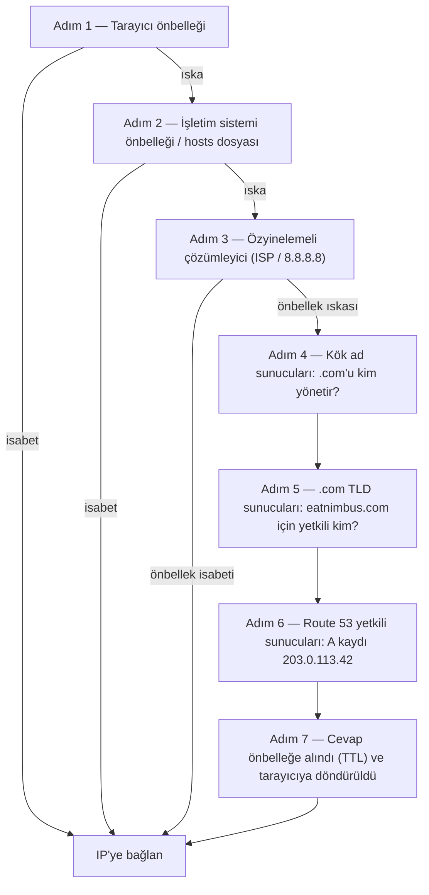

# Bölüm 12: İnternet Sizi Nasıl Bulur

Maya tarayıcısında `nimbus-alb-123456789.us-west-2.elb.amazonaws.com`'u bir kez daha yeniledi, sonra arkasına yaslandı ve tavana baktı. Sayfa yüklendi. Uygulama çalıştı. Ama linki bir restoran ortağıyla her paylaştığında, tam olarak adlandıramadığı küçük bir utanç hissediyordu.

O URL bir teknik artıktı, bir ürün değil.

---

*Önceki bölümdeki ağ yeniden tasarımı iyi gitmişti. Her kaynak doğru yerdeydi — yük dengeleyiciler herkese açık alt ağlarda, veritabanları özel olanlarda kilitli. Altyapı güvenli ve doğru biçimde bölümlenmişti. Ama Nimbus ilk halka açık lansmanına hazırlanırken yeni bir sorun belirmişti: AWS'nin otomatik olarak atadığı yük dengeleyici URL'si, insanların güveneceği bir ürün gibi değil, bir sistem tanımlayıcısı gibi görünüyordu. Gerçek bir alan adına ihtiyaçları vardı. Ve birinin `eatnimbus.com` yazdığı an ile sayfanın göründüğü an arasında ne olduğunu anlamaları gerekiyordu.*

---

Nimbus çalışıyordu. Yük dengeleyicinin herkese açık bir IP'si vardı. EC2 örneklerinin özel bir IP'si vardı. Veritabanları özel alt ağlarda kilitliydi. Priya ağ diyagramını onaylar şekilde başını sallamıştı.

Tom yük dengeleyici URL'sine baktı: `nimbus-alb-123456789.us-west-2.elb.amazonaws.com`.

"Müşteriler tarayıcılarına bunu mu yazıyor?" diye sordu.

"AWS otomatik olarak bunu atar," dedi Maya.

"Bunu bir kartvizite koymuyorum."

"Ben de."

Bir alan adına ihtiyaçları vardı. Bir alan adı kayıt kuruluşundan `eatnimbus.com`'u satın aldılar. Şimdi o adı AWS altyapılarına bağlamaları gerekiyordu.

"İnternet, `eatnimbus.com`'un us-west-2'deki yük dengeleyici demek olduğunu nasıl biliyor?" diye sordu Leo.

İyi soru, Leo.

**Telefon Rehberi Analojisi**

Akıllı telefonlardan önce her şehrin bir telefon rehberi vardı. "Mario's Pizza"ya ulaşmak istiyorsanız, telefon numaralarını ezberlemezdiniz — adı arar, numarayı bulur ve ararsınız.

İnternetin kendi telefon rehberi vardır: **Alan Adı Sistemi (DNS)**.

DNS, insan tarafından okunabilir adları (`eatnimbus.com` gibi) makine tarafından okunabilir IP adreslerine (`203.0.113.42` gibi) çevirir. Bir web sitesini her ziyaret ettiğinizde, bilgisayarınız sessizce alan adını DNS'te arar ve bağlanacağı IP adresini alır.

Sunucunuzun IP adresini değiştirirseniz, DNS kaydını güncellersiniz — telefon rehberinde numaranızı değiştirmek gibi — ve internet sizi yeni konumunuzda bulur.

**Tam DNS Çözümleme Yolculuğu**

"Ama arama *nasıl* çalışıyor?" diye sordu Leo. "Yani, adım adım. Tarayıcım `eatnimbus.com` adını biliyor. Sonra ne olur?"

Çoğu belge bunu geçiştirir. Önemlidir.

Tarayıcınızın `eatnimbus.com`'u çözmesi gerektiğinde, sırayla her adım şöyle:

**Adım 1 — Tarayıcı önbelleği**: Tarayıcı bu adı yakın zamanda zaten çözüp çözmediğini kontrol eder. Evetse, önbelleğe alınmış IP'yi kullanır. Hayırsa, devam edin.

**Adım 2 — İşletim sistemi önbelleği / yerel çözümleyici**: İşletim sisteminiz kendi DNS önbelleğini ve yerel `hosts` dosyasını kontrol eder. Bulunursa, tamam. Bulunmazsa, yapılandırdığınız DNS çözümleyicisine iletir — genellikle ISP'nizinki veya 8.8.8.8 gibi herkese açık biri.

**Adım 3 — Özyinelemeli çözümleyici**: Özyinelemeli çözümleyici (ISP'niz veya Google'ın 8.8.8.8'i) iş atıdır. Onun da bir önbelleği vardır. Cevabı biliyorsa, hemen döndürür. Bilmiyorsa, asıl çözümleme zincirini başlatır.

**Adım 4 — Kök ad sunucuları**: Özyinelemeli çözümleyici, 13 kök ad sunucusu kümesinden biriyle (dünya çapında dağıtılmış) iletişim kurar. Kök sunucu `eatnimbus.com`'un nerede olduğunu bilmez. Ama `.com` alan adlarını kimin yönettiğini bilir — `.com` TLD sunucularını. Adreslerini döndürür.

**Adım 5 — TLD (Üst Düzey Alan) ad sunucuları**: Özyinelemeli çözümleyici `.com` TLD sunucularıyla iletişim kurar. TLD sunucuları da `eatnimbus.com`'un nerede olduğunu bilmez. Ama `eatnimbus.com` için hangi ad sunucularının yetkili olduğunu bilir — DNS kayıtlarını gerçekten tutan sunucular. O adresleri döndürür.

**Adım 6 — Yetkili ad sunucuları**: Özyinelemeli çözümleyici Route 53'ün ad sunucularıyla — `eatnimbus.com` için yetkili ad sunucularıyla — iletişim kurar. Route 53'ün gerçek kayıtları vardır. A kaydını döndürür: `eatnimbus.com → 203.0.113.42`. Bu cevap yetkilidir — önbelleğe alınmış değil, gerçek cevaptır.

**Adım 7 — Yanıt önbelleğe alındı ve döndürüldü**: Özyinelemeli çözümleyici, cevabı kayıttaki TTL (Yaşam Süresi) süresince önbelleğe alır. IP'yi tarayıcınıza döndürür. Tarayıcınız onu önbelleğe alır. Tarayıcınız bağlanır.



"Bir IP adresi bulmak için bu yedi atlama," dedi Tom.

"Genellikle toplamda 100 milisaniyenin altında," dedi Priya. "Adım 3'ten 6'ya kadar her düzeyde agresif biçimde önbelleğe alınır. Popüler alan adları için, 4 ve 5. adımlar — kök ve TLD aramaları — çoğu zaman tamamen atlanır çünkü özyinelemeli çözümleyicinin o sunucuları zaten önbelleğindedir. Tüm zincir genellikle 20–40 milisaniyede çalışır."

"Ve ilk aramadan sonra, tarayıcı önbelleği sonraki isteklerin hepsini atladığı anlamına gelir," diye ekledi Leo.

"Doğru. DNS anında hissettirir çünkü çoğu arama önbellek isabetidir. Tam zincir yalnızca bir kayıt yeniyken veya TTL'si dolduğunda çalışır."

**Route 53 ile Tanışın**

Amazon Route 53, AWS'nin yönetilen DNS hizmetidir. Buna Route 53 denir çünkü 53 numaralı port standart DNS portudur. (Bazen AWS şeyleri doğrudan adlandırır.)

Route 53 birkaç şey yapar:

**Alan adı kaydı**: Alan adlarını doğrudan Route 53 üzerinden satın alabilirsiniz.

**DNS barındırma (barındırılan bölgeler)**: Alan adınız için bir *barındırılan bölge* oluşturursunuz ve Route 53, dünyaya sizi nerede bulacağını söyleyen DNS kayıtlarını yönetir.

**Sağlık kontrolü**: Route 53 uç noktalarınızı izleyebilir ve trafiği sağlıksız olanlardan uzağa yönlendirebilir.

**Trafik yönlendirme politikaları**: Route 53, basit DNS'in ötesinde birden çok yönlendirme stratejisini destekler — ağırlıklı, gecikme tabanlı, coğrafi konum, yük devretme.

**DNS Kayıtları: Telefon Rehberi Girişleri**

Bir DNS kaydı bir adı bir hedefe eşler. En yaygın türler:

**A kaydı**: Bir adı bir IPv4 adresine eşler.
`eatnimbus.com → 203.0.113.42`

**AAAA kaydı**: Bir adı bir IPv6 adresine eşler.

**CNAME kaydı**: Bir adı başka bir ada eşler (bir takma ad).
`www.eatnimbus.com → eatnimbus.com`

**MX kaydı**: Alan adının e-postasını hangi sunucuların işlediğini belirtir.

**TXT kaydı**: Keyfi metin saklar. Yaygın olarak alan adı doğrulaması (alan adına sahip olduğunuzu kanıtlamak) ve e-posta kimlik doğrulaması (SPF, DKIM) için kullanılır.

Nimbus için birincil kurulum:

- `eatnimbus.com` → Yük dengeleyiciye işaret eden Alias kaydı
- `www.eatnimbus.com` → `eatnimbus.com`'a işaret eden CNAME
- `api.eatnimbus.com` → API yük dengeleyiciye işaret eden Alias kaydı

"Dur," dedi Tom. "Yük dengeleyicinin IP'si değişebilir. AWS belgelerde öyle dedi."

İyi yakaladın, Tom.

**Alias Kayıtları: AWS'nin Dinamik IP'lere Çözümü**

Yük dengeleyicilerin, CloudFront dağıtımlarının ve S3 web sitelerinin statik IP adresleri değil, DNS adları vardır. Altta yatan IP'ler değişebilir.

Bir yük dengeleyicinin DNS adına işaret eden bir CNAME oluşturursanız, işe yarar — ama DNS standartları nedeniyle CNAME'leri kök alan adları için (`www` olmadan `eatnimbus.com`) kullanamazsınız.

Route 53 bunu **Alias kayıtları** ile çözer — DNS'e AWS'ye özgü bir uzantı. Bir Alias kaydı, bir adı doğrudan bir AWS kaynağına (yük dengeleyici, CloudFront dağıtımı, S3 web sitesi) eşler ve Route 53 dinamik IP çözümlemesini otomatik olarak ele alır. Alias kayıtları kök alan adı düzeyinde kullanılabilir. Ve harici hizmetlere yapılan normal DNS sorgularının aksine, AWS kaynaklarına yapılan Alias kaydı sorguları ücretsizdir.

"Yani yük dengeleyiciye işaret eden `eatnimbus.com` için bir Alias kaydı kullanıyoruz," diye onayladı Leo.

"Ve Route 53, yük dengeleyicinin herhangi bir anda kullandığı IP ne olursa olsun onu ele alır," diye ekledi Priya.

"Ücretsiz olarak," dedi Tom, aniden çok ilgilenerek. Route 53 fiyatlandırma sayfasını açtı. "Peki gerisi?"

"Barındırılan bölge başına elli sent," dedi Leo. "Artı milyon DNS sorgusu başına yaklaşık kırk sent. Şu anki trafiğimiz için, muhtemelen ayda iki dolardan az."

Tom fiyatlandırma sayfasını memnun kapattı.

**Yönlendirme Politikaları: Sadece "Nerede?"den Fazlası**

Route 53 burada ilginçleşir. DNS yalnızca bir arama hizmeti değildir — bir trafik yönetimi aracı olabilir.

**Basit yönlendirme**: Bir kayıt, bir hedef. Standart DNS.

**Ağırlıklı yönlendirme**: Trafiği ağırlığa göre birden çok hedef arasında böl. Bir geçiş sırasında %90'ını yeni sunucuya, %10'unu eski sunucuya gönder. Yeni sunucuya güvenene kadar ağırlıkları ayarla, sonra %100'e geç.

**Gecikme tabanlı yönlendirme**: Kullanıcıları kendileri için en düşük gecikmeye sahip AWS bölgesine yönlendir. Seattle'daki bir kullanıcı `us-west-2`'ye yönlendirilir. Tokyo'daki bir kullanıcı `ap-northeast-1`'e yönlendirilir. Aynı alan adı, farklı hedefler.

**Coğrafi konum yönlendirmesi**: Kullanıcının coğrafi konumuna göre yönlendir. Tüm Avrupalı kullanıcılar `eu-west-1`'e gider. Tüm Kuzey Amerikalı kullanıcılar `us-east-1`'e gider. Veri egemenliği (AB kullanıcı verisini AB bölgelerinde tutmak) veya içerik özelleştirme (dil, para birimi) için yararlı. Yönlendirme kararları sert sınırlar kullanır — bir kullanıcı bir ülkede, bir kıtada veya bir ABD eyaletindedir ve gittiği yer orasıdır.

**Coğrafi yakınlık yönlendirmesi**: Trafiği kullanıcıların coğrafi konumuna göre yönlendirir *ve* o kararları bir **eğilim (bias)** değeriyle ayarlamanıza izin verir. Pozitif bir eğilim, bir kaynağa yönlendiren coğrafi alanı genişletir — daha fazla trafik çeker. Negatif bir eğilim onu daraltır. Sert ülke ve kıta sınırları kullanan coğrafi konumun aksine, coğrafi yakınlık süreklidir: küçük bir eğilim değeri, herhangi bir sabit çizgiyi yeniden çizmeden trafiği kademeli olarak bir bölgeden diğerine kaydırabilir.

İkisini ayıran senaryo: bir şirket `us-east-1`'den `us-west-2`'ye kademeli olarak geçiyorsa ve trafiği batıya doğru kademeli olarak kaydırmak istiyorsa — bir anahtarı çevirmek değil, zaman içinde ayarlamak — batı uç noktasında giderek artan pozitif eğilimli coğrafi yakınlık doğru araçtır. Coğrafi konum, ya tüm Batı Yakası kullanıcılarını Oregon'a yönlendirir ya da yönlendirmez; bir ayar düğmesi yoktur. Ocak 2024'ten beri coğrafi yakınlık, doğrudan DNS kayıtlarında (Konsol, API, CLI) normal bir yönlendirme politikası olarak mevcuttur — artık Route 53 Traffic Flow gerektirmez, ancak orada da mevcut kalır.

**Yük devretme yönlendirmesi**: Bir birincil ve bir ikincil uç nokta belirleyin. Birincil, Route 53'ün sağlık kontrolünde başarısız olursa, trafik otomatik olarak ikincile yönlendirilir. Bu, felaket kurtarmanın DNS katmanıdır.

"Dur — ama zaten Multi-AZ'miz varsa, neden ikinci bir bölgeye yük devretme yönlendirmesi kuralım?" diye sordu Maya. "Multi-AZ'nin arızaları ele alması gerekmiyor mu?"

Güzel soru. Multi-AZ, bir bölge içindeki tek bir Erişilebilirlik Bölgesinin arızasına karşı korur — bir veri merkezi çökerse, başka bir AZ'deki yedek devralır. Ama ya tüm bir AWS bölgesi kullanılamaz hale gelirse? Ya da bölge çapında bir hizmet kesintisi olursa? DNS yük devretme yönlendirmesi farklı bir düzeyde çalışır: o bölgenin sağlık kontrolü başarısız olduğunda trafiği tüm bir bölgeden uzağa yönlendirir. Multi-AZ bölge içi dayanıklılıktır. DNS yük devretme bölgeler arası dayanıklılıktır.

**Çoklu değer yanıt yönlendirmesi**: Bir sorgu için sağlıklı sekiz adede kadar IP adresi döndür, istemcinin seçmesine izin ver. Trafiği birden çok sunucuya dağıtmak için bir yük dengeleyiciye basit bir alternatif.

"Yani Route 53 sadece bir telefon rehberi değil," dedi Maya. "Çağrıları nereden aradığınıza göre yönlendirebilen akıllı bir telefon rehberi."

"Ve numara sağlıksızsa sizi keser," diye ekledi Priya.

---

**Gecikme Yönlendirmesi Artı Sağlık Kontrolleri: Bir Düşünce Deneyi**

Priya beyaz tahtaya bir senaryo çizdi. Nimbus'un Doğu Yakası kullanıcı tabanının büyümeye devam ettiğini ve bir gün ekibin `us-east-1`'de (Kuzey Virginia) hafif bir yığın ayağa kaldırdığını varsayalım — pahalı ve karmaşık olacak tam bir çok bölgeli aktif-aktif kurulum değil, statik içerik ve gözat sayfaları sunan bir yük dengeleyici ve salt okunur bir EC2 örnekleri kümesi. Siparişler hâlâ batıya, `us-west-2`'deki birincil veritabanına giderdi. Gözat trafiği — isteklerin yüzde yetmişini oluşturan — her iki yakadan da sunulabilirdi.

Gözat uç noktası için Route 53 yapılandırması şöyle görünürdü:

```
browse.eatnimbus.com
  → Gecikme kaydı: us-east-1 ALB (sağlık kontrolüyle, set-identifier "east")
  → Gecikme kaydı: us-west-2 ALB (sağlık kontrolüyle, set-identifier "west")
```

(Kaydın bir *ana bilgisayar adı* olduğuna dikkat edin, `browse.eatnimbus.com` — DNS adları yönlendirir, asla URL yollarını değil. `/browse` gibi yol tabanlı yönlendirme yük dengeleyicinin işidir, Route 53'ün değil.)

Gecikme yönlendirmesiyle, Seattle'daki bir kullanıcı `us-west-2` uç noktasına çözümlenirdi. Boston'daki bir kullanıcı `us-east-1`'e giderdi. Route 53, altyapısından her bölgeye gecikmeyi sürekli ölçer ve kullanıcı başına daha hızlı olanı seçer.

"Ama ya batı bölgesinde bir sorun olursa?" diye sordu Tom. "Seattle'daki gözat kullanıcılarımız sıkışıp kalırdı."

"Sağlık kontrolleri bunun içindir," dedi Priya. "Her gecikme kaydı, ilgili yük dengeleyicisinde bir sağlık kontrolü alır. `us-west-2` sağlık kontrolü üç ardışık kontrolde başarısız olursa, Route 53 o kaydı döndürmeyi durdurur — Oregon'un normalde daha hızlı olacağı kullanıcılar için bile. Seattle kullanıcıları Oregon iyileşene kadar doğuya yönlendirilir."

"Yani gecikme yönlendirmesi normalde hangi bölgenin tercih edileceğini belirler," dedi Maya, "ve tercih edilen bölge çökerse sağlık kontrolleri o tercihi geçersiz kılar mı?"

"Aynen. Gecikme politikası normal koşullar altında kazananı seçer. Sağlık kontrolleri çalışmayı bırakan bir kazananı kaldırır."

Leo arıza senaryosunu düşündü. "Peki o kayıtlardaki TTL?"

"Altmış saniye," dedi Priya. "Onu tetiklemek için otuz saniye aralıklarla üç başarısız kontrol — arızayı tespit etmek için doksan saniyeye kadar — sonra DNS çözümleyicilerin değişikliği almaları için altmış saniyeye kadar."

"En kötü durumda iki buçuk dakika," dedi Leo.

"Bu yüzden TTL'yi önemsemeye başlamadan önce düşürürsünüz, sonra değil."

Bu kombinasyon — her kayıtta sağlık kontrolleriyle gecikme yönlendirmesi — çok bölgeli dağıtımlar için en güçlü Route 53 yapılandırmalarından biridir. Kullanıcılar her zaman en hızlı sağlıklı bölgeye gider. Bir bölgede sorun olduğunda sistem kendi kendini iyileştirir. Ve her şey DNS'tir: ek altyapı yok, proxy sunucusu yok, bölgeler arası yük dengeleyici yok.

---

**Sağlık Kontrolü Arıza Olayı**

Nimbus'un hazırlık ortamı, onlara yük devretme yönlendirmesinin tesadüfi bir gösterimini verdi.

Hazırlık yük dengeleyicisinde bir test olarak Route 53 sağlık kontrolleri yapılandırmışlardı — `/health` uç noktasını her 30 saniyede bir kontrol ediyordu. Bir cuma öğleden sonra, Leo hazırlığa bir hata içeren bir dağıtım gönderdi: sağlık uç noktası 500 hataları döndürmeye başladı. Yerel testlerini geçti ama sunucuda bozuldu.

Route 53 arızaları kaydetti. Üç ardışık başarısız kontrolden sonra, uç noktayı sağlıksız olarak işaretledi. Yük devretme kaydı etkinleşti ve hazırlık trafiğini "Bakım sürüyor" diyen salt okunur bir yedek sayfaya yönlendirdi.

Leo'nun ilk uyarısı bir QA mühendisinden gelen bir Slack mesajıydı: "Hazırlık bakım sayfasını gösteriyor."

Leo dağıtımı kontrol etti. 500 hataları günlüklerde bariz. Dağıtımı geri aldı. Sağlık uç noktası 200'leri döndürdükten 90 saniye içinde, Route 53 kontrolü yeniden değerlendirdi, üç ardışık başarı gördü ve trafiği hazırlık yük dengeleyicisine geri döndürdü. Bakım sayfası kayboldu.

Bakım sayfasında geçen toplam süre: yedi dakika.

"Bu, sistemin doğru çalışmasıydı," dedi Priya.

"Biliyorum," dedi Leo. "Korkutucu kısım, sağlık kontrolü olmadan ne olacağını düşünmek. 500 hataları gerçek kullanıcılara giderdi."

"Üretimde, sağlık kontrolü ikincil bölgeye veya statik hata sayfasına yük devrederdi. Kullanıcılar hatalar yerine bakımlı bir deneyim görürdü."

"Yük devretme gerçekte ne kadar sürüyor?" diye sordu Maya. "Sağlık kontrolünün başarısız olmasından DNS'in farklı yönlendirmeye başlamasına kadar?"

"Sağlık kontrolü aralığı varsayılan olarak 30 saniye. Yük devretmeyi tetiklemek için üç ardışık başarısızlık. Bu, sorunu tespit etmek için 90 saniyeye kadar. Sonra DNS TTL — 60 saniyeyse, yayılım bir dakika daha."

"Yani en kötü durumda yaklaşık üç dakika mı?"

"O kadar. Bu yüzden kritik kayıtlarda TTL'nizin düşük ve sağlık kontrolü aralığınızın bütçenizin izin verdiği kadar kısa olmasını istersiniz."

---

**Sağlık Kontrolleri: Arızanın Etrafından Dolaşmak**

"Peki ya biri içeri girmeye çalışırsa?" dedi Priya. "DNS herkese açık. Herkes `eatnimbus.com`'un nereye işaret ettiğini arayabilir. Bu, bir saldırganın hangi IP'yi hedefleyeceğini tam olarak bildiği anlamına gelir."

"Bu doğru," dedi Leo. "Ama buldukları IP yük dengeleyicinin IP'si. ALB, herkese açık adresi olan tek şey. Arkasındaki her şey — EC2, RDS, ElastiCache — özel alt ağlarda. DNS onlara ön kapıyı söyler. Arkasında ne olduğunu söylemez."

Route 53 uç noktalarınızı sağlık kontrolleriyle izleyebilir. Bir uç nokta başarısız olursa, Route 53 şunları yapabilir:

- Onu DNS yanıtlarından kaldırmak (oraya trafik göndermeyi durdurmak)
- Bir yedek uç noktaya yük devretme tetiklemek
- CloudWatch üzerinden bir uyarı göndermek

Sağlık kontrolleri, DNS yönlendirmesi ile gerçek uygulama sağlığı arasındaki bağlantıdır. Bir yük devretme yapılandırmasında: Route 53 birincil uç noktayı her 30 saniyede bir izler. Üç ardışık kontrol başarısız olursa, Route 53 ikincil uç noktanın adresini döndürmeye başlar. Bu sayıların hiçbiri sabit değildir: 30 saniye standart aralıktır (ücretli bir "hızlı" seçenek her 10 saniyede bir kontrol eder) ve arıza eşiği varsayılan olarak 3 ardışık kontroldür ama 1'den 10'a kadar yapılandırılabilir.

Bu anında değildir — DNS'in yayılma süresi vardır. Route 53 bir DNS kaydını değiştirdiğinde, dünyanın dört bir yanındaki DNS çözümleyicilerin değişikliği alması gerekir, bu da TTL ayarlarına bağlı olarak saniyelerden dakikalara kadar sürebilir.

**TTL: DNS Önbelleği**

DNS yanıtları birden çok düzeyde önbelleğe alınır — yönlendiricinizde, ISP'nizde, tarayıcınızda. Bir DNS kaydındaki **TTL (Yaşam Süresi)**, önbelleklere cevabı tekrar kontrol etmeden önce ne kadar süre hatırlayacaklarını söyler.

Yüksek TTL (1 saat veya daha fazla): Daha az DNS sorgusu, Route 53'te daha az yük, ama değişikliklerin yayılması daha uzun sürer.

Düşük TTL (60 saniye veya daha az): Değişiklikler hızlı yayılır, ama daha fazla DNS sorgusu gerekir.

Planlı bir geçişten önce (DNS'i yeni bir sunucuya işaret edecek şekilde güncellemek), bir gün önceden TTL'nizi 60 saniyeye düşürün. Sonra değişikliği yaptığınızda, yaklaşık bir dakikada yayılır. Geçişten sonra, normal değere geri yükseltin.

"Zaten dağıttım — ah." Leo TTL'yi düşürmeden önce DNS kaydını güncellemişti. Hatasını fark etmiş ve saymaya başlamıştı: eski TTL bir saatti. Bazı kullanıcılar sonraki altmış dakika boyunca eski sunucuyu alacaktı.

"Sadece geçiş sırasında düşürürsek, önce değil," dedi Leo yavaşça, "eski TTL bazı kullanıcıların eski sunucuyu bir saat göreceği anlamına gelir."

"Aynen," dedi Priya. "DNS geçişleri yalnızca geçiş sırasında değil, geçişten önce planlama gerektirir."

Şunu merak ediyor olabilirsiniz: TTL bir saate ayarlanmışsa, bu her kullanıcının bir DNS değişikliğinden sonra yeni sunucuyu görmeden önce tam bir saat bekleyeceği anlamına mı gelir? Tam olarak değil. TTL, çözümleyicilerin TTL dolana kadar yeniden kontrol etmeyeceği anlamına gelir. Bir kullanıcının DNS çözümleyicisi eski değeri 55 dakika önce 1 saatlik bir TTL ile önbelleğe aldıysa, yeni değeri 5 dakika içinde alır. 5 dakika önce önbelleğe aldıysa, 55 dakika bekler. Ortalama olarak, kullanıcılar değişikliği TTL süresinin yarısı içinde görür. Bu yüzden TTL'yi önceden düşürmek çok önemlidir: değişiklik gerçekleşmeden önce en kötü durum yayılım penceresini küçültür.

---

**Özel Barındırılan Bölgeler: Dahili DNS**

Priya, herkese açık alan adı canlı olduktan iki hafta sonra yeni bir gereksinim ortaya attı.

"EC2 örneklerimizin veritabanına ulaşması gerekiyor," dedi. "Şu anda RDS uç noktası DNS adını kullanıyorlar — `nimbus-prod.abc123.us-west-2.rds.amazonaws.com`. İşe yarıyor ama herkese açık bir DNS adı. Veritabanı yapılandırmamızı değiştirmek istersek, tüm uygulama yapılandırma dosyalarının güncellenmesi gerekir."

"Özel bir DNS adı kullanabiliriz," dedi Leo. "`db.nimbus.internal` gibi. Hizmetlerimizin dahili olarak kullandığı, mevcut veritabanı uç noktası ne ise ona eşlenen bir şey."

"Aynen. Route 53 özel barındırılan bölgeleri."

Bir **özel barındırılan bölge**, yalnızca VPC'nizin içinde çözümlenen bir DNS alan adıdır. `nimbus.internal` için harici DNS sorguları yanıt almaz. Ama VPC içinden, `db.nimbus.internal` RDS uç noktasına çözümlenir.

Onu kurdular:

- Özel barındırılan bölge: `nimbus.internal`
- CNAME kaydı: `db.nimbus.internal → nimbus-prod.abc123.us-west-2.rds.amazonaws.com`
- CNAME kaydı: `cache.nimbus.internal → nimbus-cache.abc123.usw2.cache.amazonaws.com`
- A kaydı: `api.nimbus.internal → 10.0.10.5` (dahili EC2 IP'si — A kayıtları adları IP adreslerine eşler; CNAME'ler adları başka adlara eşler. Burada sorun yok çünkü bu örnek statik bir özel IP tutar; Auto Scaling arkasındaki herhangi bir şey için bunun yerine bir yük dengeleyiciye işaret edersiniz)

Şimdi uygulama yapılandırması şunu okuyordu:

```
DATABASE_HOST=db.nimbus.internal
CACHE_HOST=cache.nimbus.internal
```

Yeni bir RDS örneğine geçtiklerinde, bir DNS kaydını güncellediler. Uygulama dağıtımı gerekmedi.

"Bu, bir veritabanı geçişi sırasında özel DNS'in neden önemli olduğunun da nedeni," dedi Priya. "`db.nimbus.internal`'i yeni uç noktaya işaret edecek şekilde güncellersiniz. Trafik kayar. Eski uç nokta TTL penceresi boyunca kullanılabilir kalır. Uygulama yapılandırma değişikliği yok."

**Dahili DNS Hata Ayıklama Hikayesi**

Üç hafta sonra, Leo yeni bir hizmet dağıttı — bir arka plan işçisi — ve veritabanına ulaşamadı. İşçi aynı VPC'de, API sunucularıyla aynı özel alt ağdaydı. API sunucuları veritabanına ulaşabiliyordu. İşçi ulaşamıyordu.

Güvenlik gruplarını kontrol etti. İşçinin güvenlik grubunun PostgreSQL için bir giden kuralı vardı. Veritabanı güvenlik grubunun işçinin güvenlik grubundan bir gelen kuralı vardı. Her şey doğru görünüyordu.

İşçi örneğinden `nslookup db.nimbus.internal` çalıştırdı.

Yanıt yok.

"DNS araması başarısız oluyor," dedi Priya'ya.

İşçi örneğinin VPC yapılandırmasına baktı. "İşçi gerçekte hangi VPC'de? Özel barındırılan bölgeler VPC'lerle ilişkilendirilir — örnek ilişkilendirilmiş bir VPC'de değilse, bölge onun için basitçe yoktur."

"Ana VPC'de. Diğer her şeyle aynı."

"Öyle mi?"

Özel barındırılan bölgeler, hizmet ettikleri her VPC ile açıkça ilişkilendirilmelidir — ilişkilendirme VPC başınadır, asla alt ağ başına değil. Priya, bölgeyi oluşturduğunda ana VPC'yi ilişkilendirmişti. Ama Leo işçiyi yanlışlıkla farklı bir deney için oluşturduğu bir test VPC'sine dağıtmıştı. Farklı VPC. Özel barındırılan bölgeyle ilişkilendirilmemiş.

"İşçi yanlış VPC'de," dedi Priya.

"Zaten dağıttım — ah." Leo işçiyi doğru VPC'ye taşıdı. DNS çözümlendi. İşçi veritabanına bağlandı.

"Bir VPC," dedi Leo, not alarak. "Birden fazla için bir nedenimiz olmadıkça."

---

**DNSSEC: DNS Yanıtlarını Doğrulamak**

"DNS sahteciliğini düşündük mü?" diye sordu Priya. "Ya birisi DNS sorgumuzu yakalar ve sahte bir IP döndürürse? Kullanıcılarımızın tarayıcıları bizimki yerine saldırganın sunucusuna bağlanırdı."

**DNSSEC (DNS Güvenlik Uzantıları)** bunu, DNS kayıtlarını kriptografik olarak imzalayarak çözer. Bir DNS yanıtı bir DNSSEC imzası içerdiğinde, çözümleyici yanıtın yetkili ad sunucusundan geldiğini ve değiştirilmediğini doğrulayabilir.

Route 53, herkese açık barındırılan bölgeler için DNSSEC imzalamayı destekler. Süreç şunları içerir:

1. Route 53'te barındırılan bölgede DNSSEC'i etkinleştirmek
2. Route 53, KMS'te saklanan bir anahtar imzalama anahtarı (KSK) oluşturur
3. Route 53 tüm kayıtları bölge imzalama anahtarıyla imzalar
4. Üst alan adı kayıt kuruluşunda (.com TLD) bir DS (Delegation Signer) kaydı eklersiniz
5. DNSSEC destekleyen çözümleyiciler artık yanıtların gerçekliğini doğrulayabilir

"DNS sahteciliği ne kadar yaygın?" diye sordu Leo.

"Herkese açık internette nadir ama mümkün," dedi Priya. "Çoğu ISP çözümleyicisi bugün DNSSEC doğrulamasını destekliyor. DNSSEC'i etkinleştirmek hiçbir maliyet çıkarmaz ve anlamlı bir gerçeklik katmanı ekler."

"Bu ayda ne kadar maliyet çıkarıyor?" diye sordu Tom.

"DNSSEC imzalamayı etkinleştirmenin kendisi Route 53'te ücretsizdir," dedi Priya. "Tek gerçek maliyet, anahtar imzalama anahtarını tutan KMS anahtarıdır: ayda 1 dolar, artı KMS API çağrıları — ve bir anahtar birden çok barındırılan bölge arasında paylaşılabilir. DNS ele geçirme saldırılarına karşı koruma bizim ölçeğimizde etkili biçimde ücretsizdir."

Tom onu öğle yemeğinden önce etkinleştirdi.

---

**Route 53 Resolver: Hibrit DNS**

Nimbus sonunda AWS VPC'lerini bir VPN aracılığıyla şirket içi geliştirme ağına bağladığında, yeni bir sorun ortaya çıktı: şirket içi sunucuların AWS özel DNS adlarını (`db.nimbus.internal` gibi) çözmesi gerekiyordu ve AWS kaynaklarının şirket içi ana bilgisayar adlarını (`jenkins.corp.nimbus.local` gibi) çözmesi gerekiyordu.

DNS çözümlemesi varsayılan olarak ağ sınırlarını geçmez. AWS kaynakları DNS'i Route 53 Resolver kullanarak çözer (her VPC'ye yerleşik). Şirket içi sunucular kendi DNS sunucularını kullanır. Hiçbiri diğerinin kayıtlarını göremez.

**Route 53 Resolver Uç Noktaları** bu boşluğu kapatır:

**Gelen uç noktalar**: Şirket içi DNS sunucuları, AWS'de barındırılan DNS bölgeleri için sorguları VPC'nizdeki bir gelen uç nokta IP'sine iletebilir. Route 53 Resolver sorguyu ele alır ve sonucu döndürür.

**Giden uç noktalar**: EC2 örneklerinin şirket içi ana bilgisayar adlarını çözmesi gerektiğinde, Resolver o sorguları giden uç nokta aracılığıyla şirket içi DNS sunucularına iletir.

"Yani bir çeviri hizmeti gibi," dedi Maya. "AWS DNS'iniz ve şirket içi DNS'iniz doğrudan birbiriyle konuşmuyor. Resolver uç noktaları aracı görevi görüyor."

"Aynen. Şirket içi sunucularınız artık `db.nimbus.internal`'i çözebilir. EC2 örnekleriniz `jenkins.corp.nimbus.local`'i çözebilir. Her iki taraf da her iki dünyadan DNS adlarını görür."

Nimbus için bu, geliştirme ekibi ofislerinden AWS'deki bir hazırlık ortamına karşı entegrasyon testleri çalıştırmak istediğinde geçerli hale geldi. Resolver uç noktaları olmadan, hosts dosyalarını elle düzenliyor olacaklardı. Onlarla, dahili DNS VPN üzerinden öylece çalıştı.

Resolver uç noktaları için mimari:

- **Gelen uç nokta**: VPC'nizde iki farklı AZ'de oluşturulan iki ENI (Elastik Ağ Arayüzü). Her biri özel bir IP alır. Şirket içi DNS sunucunuzu, AWS'de barındırılan bölgeleriniz için sorguları bu IP'lere iletecek şekilde yapılandırırsınız. Trafik VPN'iniz veya Direct Connect üzerinden geçer.
- **Giden uç nokta**: İki AZ'de iki ENI. Yönlendirme kuralları oluşturursunuz: "`corp.nimbus.local` için sorgular bu şirket içi DNS sunucu IP'lerine gider." EC2 örnekleri otomatik olarak Resolver'ı kullanır, o da yönlendirme kurallarınıza bakar ve sorguyu şirket içine gönderir.

"Neden uç nokta başına iki ENI?" diye sordu Leo.

"Yüksek erişilebilirlik," dedi Priya. "Bir AZ ağ bağlantısını kaybederse, diğer uç nokta IP'si hâlâ çalışır. NAT Geçitleriyle aynı ilke."

"Bu ayda ne kadar maliyet çıkarıyor?" diye sordu Tom.

Resolver uç noktaları **elastik ağ arayüzü başına** saatte yaklaşık 0,125 dolara mal olur ve her uç nokta erişilebilirlik için en az iki ENI gerektirir — bu yüzden gerçekçi bir alt sınır uç nokta başına ayda yaklaşık 180 dolar, artı milyon DNS sorgusu başına 0,40 dolardır. Dahili adları çözmek için hibrit DNS kullanan bir ekip için maliyet mütevazıdır — ve birden çok geliştirici makinesi ve CI/CD sistemi arasında hosts dosyaları tutma ihtiyacını ortadan kaldırır.

"Ana bilgisayar adlarını hosts dosyalarına koyabiliriz," diye önerdi Leo.

"Her geliştirici makinesinde, her CI çalıştırıcısında, her yeni işe alımda," dedi Priya. "Her şey her değiştiğinde."

"Uç noktaya değer," dedi Leo.

"Değer."

## Güçlü Yönler ve Sınırlamalar

**Route 53 şunlar için doğru seçimdir**: alan adlarını tamamen AWS içinde kaydetmek ve yönetmek; trafiği gecikmeye, coğrafi konuma veya birden çok uç nokta arasında ağırlıklı dağıtıma göre yönlendirmek; bölgeler arasında veya bir birincil ile bir felaket kurtarma uç noktası arasında sağlık kontrolü tabanlı yük devretme; DNS'i diğer AWS hizmetleriyle alias kayıtları aracılığıyla entegre etmek; dahili hizmet keşfi için özel barındırılan bölgeler.

**Route 53'ün ihtiyacınız olan şey olmadığı durumlar**: Route 53 bir DNS hizmetidir, bir yük dengeleyici değil. Bir bölge içinde birden çok sunucu veya konteyner arasında trafik dağıtmanız gerekiyorsa, bir Application Load Balancer kullanın — Route 53, bir yük dengeleyicinin yaptığı gibi bağlantı düzeyinde ağırlıklı round-robin yapamaz. Bölgeler arası gecikme tabanlı yönlendirme, yalnızca kullanıcılarınız gerçekten küresel olarak dağıldığında ve milisaniyeler dönüşüm için önemli olduğunda mantıklı olan maliyet ve operasyonel karmaşıklık ekler. Çoğu tek bölgeli uygulama için, bir ALB'ye işaret eden tek bir Alias kaydı ihtiyacınız olan tüm Route 53 yapılandırmasıdır.

## Özet

`nimbus-alb-123456789.us-west-2.elb.amazonaws.com`'dan `eatnimbus.com`'a geçmek küçük bir şey gibi hissettirdi. Değildi. DNS, tüm internetin üzerinde çalıştığı adres sistemidir ve Route 53 size o sistemi yalnızca aramalar için değil, trafik yönetimi ve dayanıklılık için de kullanma araçları verir.

- **DNS** alan adlarını IP adreslerine çevirir — internetin telefon rehberi.
- **Route 53**, AWS'nin yönetilen DNS hizmetidir: alan adı kaydı, DNS barındırma, sağlık kontrolleri ve yönlendirme politikaları.
- **A kayıtları** adları IPv4 adreslerine eşler. **CNAME'ler** adları başka adlara eşler. **Alias kayıtları** adları AWS kaynaklarına eşler (yük dengeleyiciler, CloudFront, S3).
- Kök alan adları ve dinamik IP'li kaynaklar için Alias kayıtları kullanın (CNAME'ler değil).
- Yönlendirme politikaları basit DNS'in ötesine geçer: **ağırlıklı** (trafik bölme), **gecikme tabanlı** (performans), **coğrafi konum** (veri egemenliği — sert ülke/kıta sınırları), **coğrafi yakınlık** (eğilim düğmeli mesafe tabanlı — kademeli trafik kaydırma), **yük devretme** (felaket kurtarma).
- **Özel barındırılan bölgeler** VPC kaynakları için dahili DNS sağlar — sabit kodlanmış IP değil, ada göre hizmetten hizmete iletişim.
- **DNSSEC** kayıtları kriptografik olarak imzalar, DNS sahteciliğine karşı korur.
- **Route 53 Resolver Uç Noktaları** hibrit ağları kapatır — AWS ve şirket içi DNS birbirinin adlarını çözebilir.

## Sınav İpuçları

*SAA-C03 Alanı: Yüksek Performanslı Mimariler Tasarlama (Alan 3, Görev 3.4)*

- **Alias vs CNAME**: Alias kayıtları kök alan adında kullanılabilir; CNAME'ler kullanılamaz. AWS kaynaklarına Alias kayıtları ücretsizdir; CNAME DNS sorguları ücretlidir. Sınav bir kök alan adını bir yük dengeleyiciye eşlemeyi sorduğunda → Alias kaydı.
- **Yönlendirme politikası kullanım durumları** (yaygın sınav senaryoları):
  - "Trafiği yeni bir sürüme kademeli olarak taşı" → Ağırlıklı yönlendirme
  - "Kullanıcıları en yakın AWS bölgesine yönlendir" → Gecikme tabanlı yönlendirme
  - "AB kullanıcı verisini AB bölgelerinde tut" → Coğrafi konum yönlendirmesi
  - "Birincil çöktüğünde otomatik DNS yük devretme" → Sağlık kontrolleriyle yük devretme yönlendirmesi
  - "Trafiği yeni bir bölgeye kademeli olarak kaydır" veya "AB dağıtımımıza çekilen trafiği artır" → Pozitif eğilimli coğrafi yakınlık yönlendirmesi
- **Coğrafi yakınlık vs. Coğrafi konum:** Coğrafi konum kullanıcının ülkesine/kıtasına göre sert sınırlarla yönlendirir. Coğrafi yakınlık coğrafi mesafeye göre yapılandırılabilir bir eğilimle yönlendirir — trafiği yeni bir bölgeye kademeli olarak kaydırmanız veya belirli bir dağıtıma daha fazla kullanıcı çekmeniz gerektiğinde kullanın. Ocak 2024'ten beri kayıtlarda normal bir yönlendirme politikası olarak mevcuttur (Traffic Flow artık gerekmez).
- **Route 53 sağlık kontrolleri**: HTTP/HTTPS/TCP uç noktalarını kontrol edebilir ve CloudWatch alarmlarını tetikleyebilir. Sınav bunları felaket kurtarma senaryolarında kullanır.
- **TTL ve yayılım**: TTL'nin DNS çözümleyicilerin bir kaydı ne kadar süre önbelleğe alacağını kontrol ettiğini bilin. Kısa TTL = daha hızlı değişiklikler. Sınav senaryosu: "ekip DNS'i güncelledi ama kullanıcılar hâlâ eski sunucuya çarpıyor" → TTL çok yüksek.
- **Özel barındırılan bölgeler**: Route 53 yalnızca bir VPC içinde çözümlenen DNS kayıtları oluşturabilir. Sınav bunu dahili hizmet keşfi için kullanır (örn. `database.internal`'in özel bir RDS uç noktasına çözümlenmesi).
- Route 53 **küreseldir** — bir bölgede dağıtılmaz. Barındırılan bölgeler oluştururken bölge seçimi gerekmez.
- **Route 53 Resolver Uç Noktaları**: Şirket içi ve AWS DNS'in birbirinin adlarını çözmesi gereken hibrit senaryolarda kullanılır. Şirket içi → AWS için gelen uç nokta. AWS → şirket içi için giden uç nokta.

## Alıştırmalar

**Alıştırma 1 — Hatırlama**

Bir CNAME kaydı ile bir Alias kaydı arasındaki farkı açıklayın. Her birini ne zaman kullanırsınız?

*(İpucu: CNAME'in kök alan adlarındaki kısıtlamalarını ve Alias kayıtlarının dinamik AWS kaynaklarıyla davranışını düşünün.)*

**Alıştırma 2 — SAA-C03 Senaryosu**

*Senaryo*: Bir medya şirketi iki AWS bölgesinden bir web sitesi işletiyor: `us-east-1` (birincil) ve `eu-west-1` (ikincil). Ekip, birincil bölge kullanılamaz hale gelirse trafiğin otomatik olarak `eu-west-1`'e yönlenmesini istiyor. Şirket ayrıca bu yük devretme mekanizmasının doğru çalıştığını, birincil bölgeyi gerçekten çökertmeden doğrulamak istiyor.

Bu gereksinimleri EN İYİ hangi Route 53 yapılandırması karşılar?

A) `us-east-1`'de %100 ağırlık ve `eu-west-1`'de %0 ağırlıkla ağırlıklı yönlendirme  
B) Her iki uç noktada sağlık kontrolleriyle gecikme tabanlı yönlendirme  
C) Birincil uç noktada bir sağlık kontrolü ve `eu-west-1`'e işaret eden ikincil bir kayıtla yük devretme yönlendirmesi  
D) Kuzey Amerika'yı `us-east-1`'e ve Avrupa'yı `eu-west-1`'e işaret eden coğrafi konum yönlendirmesi

**İpucu 1**: Gereksinim, birincil çöktüğünde otomatik yük devretme. Tam olarak bunun için hangi yönlendirme politikası tasarlanmıştır?

**İpucu 2**: "Birincil bölgeyi çökertmeden test et" — sağlık kontrolleri test için elle "sağlıksız" ayarlanabilir.

**İpucu 3**: Gecikme tabanlı yönlendirme hız için optimize eder, yük devretme için değil.

**Cevap**: C

**Açıklama**: Yük devretme yönlendirmesi tam olarak bu kullanım durumu için tasarlanmıştır. Birincil kayıt bir sağlık kontrolüyle `us-east-1`'e işaret eder. İkincil kayıt `eu-west-1`'e işaret eder. Sağlık kontrolü başarısız olursa, Route 53 otomatik olarak ikincil kaydı sunar. Sağlık kontrolleri, birincil bölgeyi gerçekten bozmadan test için elle başarısız olmaya zorlanabilir.

**Neden A değil?** %100/%0 ile ağırlıklı yönlendirme etkin biçimde statiktir — birincil başarısız olduğunda otomatik olarak geçiş yapmaz.

**Neden B değil?** Gecikme kayıtları *sağlık kontrolleriyle* sağlıksız bir uç noktayı döndürmeyi durdurur, bu yüzden B gerçek bir kesintiden sağ çıkar. Ama normal trafik desenini değiştirir (kullanıcılar gerektiği gibi birincil/ikincil değil, gecikmeye göre bölgeler arasında bölünür) ve yük devretmeyi *test* etmenin temiz bir yolu yoktur: üretimde birincilin sağlık kontrolünü gerçekten başarısız kılmanız gerekir. Yük devretme yönlendirmesi belirtilen amacı modellemiştir — belirlenmiş birincil, belirlenmiş ikincil, sağlık kontrolü durumunu zorlayarak test edilebilir.

**Neden D değil?** Coğrafi konum yönlendirmesi uç nokta sağlığına göre değil, kullanıcı konumuna göre yönlendirir. Avrupalı kullanıcılar `us-east-1` sağlıklı olsa bile `eu-west-1`'de sıkışıp kalır ve Kuzey Amerikalı kullanıcılar `us-east-1` çökse bile `eu-west-1`'e yük devretmez.

*SAA-C03 Alanı: Yüksek Performanslı Mimariler Tasarlama — Görev 3.4*

**Alıştırma 3 — Mimari Mücadelesi** *(İsteğe Bağlı)*

Nimbus uluslararası alanda genişliyor. `eatnimbus.com`'un Batı Yakası, Doğu Yakası ve Avustralya'daki kullanıcılar için hızlı yüklenmesini istiyorlar. Ayrıca bir düzenleyici gereksinimleri var: Avrupalı kullanıcılar tarafından verilen siparişler AB'deki sunucular tarafından işlenmelidir.

Her iki gereksinimi ele alan bir Route 53 yönlendirme stratejisi tasarlayın. Hangi yönlendirme politikasını veya politikaların kombinasyonunu kullanırdınız? Her bölgede hangi altyapıya ihtiyacınız olurdu?

*(Tek bir doğru cevap yoktur. Amaç, çok bölgeli yönlendirme tasarımı pratiği yapmaktır.)*

## Jenerik Sonrası Sahne

`eatnimbus.com` canlıydı.

Maya onu tarayıcısına yazmıştı ve Nimbus sipariş sayfası yüklenmişti. Akışı test etmek için kendi ailesinin restoranından arepa sipariş etmişti. Sipariş geçti. Mutfak onu aldı.

Arkasına yaslandı.

Tom zaten Route 53 sağlık kontrolü günlüklerini okuyordu. "us-west-2 kontrolörlerinden yanıt süresi 18 milisaniye."

"Bu hızlı mı?" diye sordu Maya.

"DNS için mi? Evet. Seattle kullanıcıları için de — pratikte Oregon'un hemen yanındalar."

"Ama Boston'daki bir kullanıcı için?"

Tom gecikme grafiğine baktı. "Yaklaşık 80 milisaniye."

Maya bunu düşündü. "Doğu Yakası ortaklarımız büyümeye devam ederse ve sunucularımız Oregon'daysa..."

"Her istek Boston'dan Oregon'a ve geri gider," dedi Leo odanın diğer ucundan. "Işık hızı. Fiziği yenemezsin."

"Yani Boston'a daha yakın sunuculara ihtiyacımız var."

"Ya da Boston'a daha yakın, onların adına içerik sunan bir şey."

Bu düşünce havada asılı kaldı.

Sonraki bölümde: Nimbus'un içeriğini her yerde, her kullanıcıya bir milisaniye uzakta tutan depolar.
