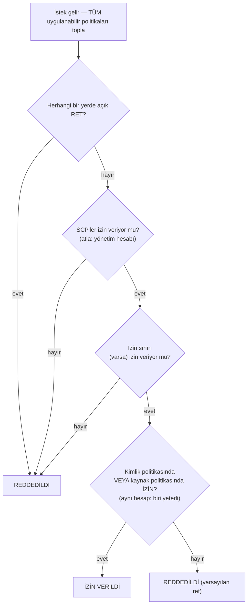

# Bölüm 14: Kimin Neyi Yapmasına İzin Var

Yeni mühendisler pazartesi başlıyordu. Soo-Jin ve Rafael. Maya onların ilk haftasını düşünüyordu — neye erişmeleri gerekeceğini, neye dokunmamaları gerektiğini ve mevcut IAM kurulumunun iki kişi daha eklemek için hazır olup olmadığını.

Ofis dolmadan önce bir kahveyle oturdu, bir liste yapıyordu.

---

*CloudFront dağıtılmıştı. Önbellek isabet oranları iyiydi. Performans artmıştı. Ama ekip yeni mühendisler almaya hazırlanırken, sessiz bir sorun yüzeye çıktı: IAM yapılandırması aceleci insanlar tarafından inşa edilmişti. Erişim anahtarları yapılandırma dosyalarındaydı. Bazı rollerin ihtiyaç duyduklarından fazla izni vardı. Ve iki yeni kişi, birden çok kullanıcı düşünülerek tasarlanmamış bir üretim sistemine kimlik bilgileri teslim edilmek üzereydi.*

---

Tom erişim anahtarlarını bir metin dosyasında açık tutmuştu, yapıştırmaya hazırdı.

"Ne yapıyorsun?" diye sordu Priya.

"EC2 örneğinin S3'ten yapılandırma dosyalarını okuması gerekiyor. Kimlik bilgilerini sunucu yapılandırmasına koyuyorum."

Bir an ekrana baktı. "O dosyayı kapat."

"Ben sadece—"

"Birisi o sunucuya girerse," dedi, "o anahtarları alır. Ve o anahtarlar IAM kullanıcısının dokunmasına izin verilen her şeye dokunur. Ki bu muhtemelen sadece S3'ten fazlası."

Tom dosyayı kapattı.

"Daha iyi bir yol var," dedi. "Sunucunun kendisinin bir rolü olabilir. Bunu bir iş unvanı gibi düşün — örneğin kimlik bilgisine ihtiyaç duymaz çünkü sistem zaten ne olduğunu ve ne yapmasına izin verildiğini bilir."

Tom şüpheci görünüyordu. "Yani sunucu kendini kimlik doğrular mı?"

"Evet. Parola olmadan. Yapılandırma dosyasında anahtarlar olmadan. Yanlışlıkla git'e commit edilebilecek hiçbir şey olmadan."

O son kısım yer etti. Tom iki hafta önce repoya neredeyse bir erişim anahtarı commit ediyordu — son saniyede diff'te yakaladı. Yeni bir tarayıcı sekmesi açtı.

**IAM'i Yeniden Ele Alma: Tam Resim**

Bölüm 3 IAM'i tanıttı: kullanıcılar, gruplar, roller ve politikalar. Şimdi derinleşme zamanı.

IAM politikaları, hangi kaynaklarda hangi eylemlere izin verildiğini veya reddedildiğini belirten JSON belgeleridir. Şöyle görünürler:

```json
{
  "Version": "2012-10-17",
  "Statement": [
    {
      "Effect": "Allow",
      "Action": [
        "s3:GetObject",
        "s3:PutObject"
      ],
      "Resource": "arn:aws:s3:::nimbus-assets/*"
    }
  ]
}
```

Bu politika, `nimbus-assets` paketindeki nesneleri okumaya ve yazmaya izin verir ve başka hiçbir şeye izin vermez. Silme değil. Paket listeleme değil. Başka herhangi bir S3 işlemi değil. Başka herhangi bir AWS hizmeti değil.

İzinleri vermenin doğru yolu budur: belirli eylemler, belirli kaynaklar.

**"Yönetici Erişimi"nin Sorunu**

`AdministratorAccess` gibi AWS Yönetilen Politikaları, hızlı başlamak için tasarlanmıştır. Gerçek ekip üyeleriyle üretim sistemleri çalıştırmak için tasarlanmamıştır.

`AdministratorAccess` her kaynakta her eylemi verir. Bu politikaya sahip bir ekip üyesi bir hata yaparsa — yanlışlıkla bir S3 paketini siler, yanlış EC2 örneğini sonlandırır, güvenlik grubu kurallarını değiştirir — AWS'nin onları durdurmak için yapabileceği hiçbir şey yoktur. İzin verilmişti.

Bir ekip üyesinin kimlik bilgileri tehlikeye atılırsa (kimlik avı saldırısı, sızdırılmış erişim anahtarı, dizüstü bilgisayar hırsızlığı), saldırgan AWS hesabınızdaki her şeye yönetici erişimine sahip olur.

"Peki Soo-Jin'in ne olması gerekir?" diye sordu Leo.

"Soo-Jin'in ne yapması gerekiyor?" diye yanıtladı Priya.

"API'yi dağıtmak. Günlükleri kontrol etmek. Başka bir şey değil."

"O zaman şunları alır: kod hattına gönderme yeteneği, CloudWatch günlüklerine okuma erişimi ve başka hiçbir şey."

"Bu... çok spesifik."

"Evet. Mesele bu."

**IAM Rolleri: Hizmetler İçin Kimlikler**

Bölüm 3 rolleri, EC2 örneklerinin kimlik bilgilerini saklamadan AWS hizmetlerine erişmesinin bir yolu olarak tanıttı. Bunu somutlaştıralım.

Nimbus API'sini çalıştıran EC2 örneklerinizin şunları yapması gerekir:

- DynamoDB'den okuma (menü)
- DynamoDB'ye yazma (siparişler)
- S3'e nesne koyma (fişler, yüklemeler)
- CloudWatch'a günlük yazma
- Secrets Manager'dan sırları okuma

Bir erişim anahtarıyla bir kullanıcı oluşturup o anahtarı EC2 örneğinde saklamak yerine (bir güvenlik kâbusu — erişim anahtarları SSH erişimi olan herkes tarafından okunabilir), EC2 örneği için tam olarak bu izinlere sahip bir **IAM rolü** oluşturursunuz.

"Dur — ama bunu *neden* böyle yapalım?" diye sordu Maya. "EC2 örneği zaten kodumuzu çalıştırıyor. Neden koda bir erişim anahtarı vermiyoruz?"

Çünkü erişim anahtarları bir yerde yaşayan statik kimlik bilgileridir — bir yapılandırma dosyasında, bir ortam değişkeninde, biri hata yaparsa bir git deposunda. Kopyalanabilir, sızdırılabilir, kazara commit edilebilir. Bir IAM rolü farklı çalışır: EC2 örneği rolü otomatik olarak üstlenir. AWS, örnek meta veri hizmeti aracılığıyla geçici kimlik bilgileri sağlar. Kimlik bilgileri otomatik olarak döner — birkaç saatte bir süreleri dolar ve sizden herhangi bir eylem olmadan yenilenir. Sızdırılacak bir şey yoktur çünkü saklanan bir şey yoktur.

"Peki ya birisi EC2 örneğine girerse?" diye sordu Leo.

"EC2 rolünün izin verdiğini yapabilirler," dedi Priya. "Ki bu menüyü okumak, sipariş yazmak ve günlük göndermek. S3 paketini silemezler. EC2 örneklerini sonlandıramazlar. IAM'e dokunamazlar."

"Çünkü EC2 rolünün o izinleri yok."

"Aynen."

---

**EC2 Rol Üstlenmesi Adım Adım Nasıl Çalışır**

"Bir şey mantıklı gelmiyor," dedi Maya. "Örnekte saklanan kimlik bilgisi yoksa, örnek AWS'ye kim olduğunu gerçekte nasıl kanıtlıyor? Bir yerde bir kimlik bilgisi olmalı."

Var. Ama geçicidir, otomatik döner ve yalnızca örneğin içinden erişilebilir.

Bir EC2 örneği eklenmiş bir IAM rolüyle başladığında, AWS şunu yapar:

**Adım 1**: AWS STS (Security Token Service) geçici kimlik bilgileri üretir — bir erişim anahtarı ID'si, bir gizli erişim anahtarı ve bir oturum token'ı. EC2 örnek rolleri için bunlar genellikle yaklaşık altı saat geçerlidir ve AWS bunları süreleri dolmadan önce otomatik olarak döndürür.

**Adım 2**: AWS bu kimlik bilgilerini özel bir IP adresinde kullanılabilir kılar: `169.254.169.254`. Bu, **örnek meta veri hizmetidir** (IMDS). Yalnızca EC2 örneğinin içinden erişilebilir. Örneğin dışındaki hiçbir şey ona erişemez.

**Adım 3**: Uygulama kodunuz herhangi bir AWS SDK'sını (boto3, Java SDK, Node.js SDK) çağırdığında, SDK otomatik olarak örnek meta veri uç noktasını sorgular:

```
GET http://169.254.169.254/latest/meta-data/iam/security-credentials/{role-name}
```

**Adım 4**: SDK geçici kimlik bilgilerini alır ve API isteğini imzalamak için kullanır — örneğin, S3'ten okuma isteği.

**Adım 5**: AWS kimlik bilgilerini doğrular, role eklenen IAM politikasını kontrol eder ve isteğe ya izin verir ya da reddeder.

**Adım 6**: Kimlik bilgilerinin süresi dolmadan yaklaşık on beş dakika önce, EC2 örneği bunları meta veri hizmetinden otomatik olarak yeniler. Uygulama kodunun bunu hiç ele alması gerekmez — SDK bunu şeffaf biçimde yapar.

Tüm süreç geliştiriciye görünmezdir. `s3.get_object(...)` yazarsınız. SDK gerisini halleder.

"Yani kimlik bilgisi var," dedi Maya. "Sadece geçici, otomatik dönen ve örnek meta veri uç noktasına kilitli."

"Bu yüzden statik bir erişim anahtarından çok daha güvenli," dedi Priya. "Statik bir anahtar, bir kez çalındığında, biri elle döndürene kadar geçerlidir. Çalınan geçici bir kimlik bilgisi kendi kendine sona erer — aylar değil, saatler içinde."

"Peki ya örneğin içindeki biri meta veri uç noktasını sorgularsa?"

"Mevcut geçici kimlik bilgisini alabilirler. Bu gerçek bir risk, bu yüzden AWS IMDSv2'yi — Örnek Meta Veri Hizmeti sürüm 2'yi — tanıttı. IMDSv2, çağıranın önce bir PUT isteğiyle bir oturum token'ı almasını gerektirir. Bu, kötü amaçlı kodun sunucuyu meta veri URL'sini saldırgan adına getirmesi için kandırdığı Server-Side Request Forgery adlı bir saldırı sınıfını önler."

Leo, EC2 başlatma yapılandırmasını IMDSv2'yi zorunlu kılacak şekilde güncelledi. Başlatma zamanında uygulanan bir ayar.

---

**Rol Üstlenme: Hizmetler Diğer Hizmetler Nasıl Olur**

Roller şunlar tarafından üstlenilebilir:

- **AWS hizmetleri** (EC2, Lambda, ECS görevleri vb.)
- Kendi hesabınızdaki **IAM kullanıcıları** (rol yükseltme — belirli bir görev için daha fazla izinli bir rol üstlenirsiniz)
- **Diğer AWS hesaplarındaki IAM kullanıcıları** (hesaplar arası erişim — başka bir kuruluşun hesabı sizinkinde bir rol üstlenebilir)
- **Harici kimlik sağlayıcıları** (Google, Active Directory, Okta — insan kullanıcılar için federe erişim)

"Nimbus, AWS kaynaklarımıza erişmesi gereken üçüncü taraf bir hizmet kullanırsa ne olacağını düşündük mü?" diye sordu Priya. "Örneğin harici bir analitik satıcısı. Onlar için bir IAM kullanıcısı oluşturup bir erişim anahtarı vermek istemiyoruz."

"Hesaplar arası roller," dedi Leo. "Hesabımızda bir rol oluşturur ve 'bu belirli harici hesabın bu rolü üstlenmesine izin verilir' diyen bir güven politikası yazarız. Rolü üstlenmek için kendi kimlik bilgilerini kullanır ve geçici erişim alırlar. Yönetilecek anahtar yok, sızdırılacak anahtar yok."

Bu son desen — **kimlik federasyonu** — büyük kuruluşların her kişi için ayrı IAM kullanıcıları oluşturmadan çalışanlarına AWS erişimi verme şeklidir. Şirketinizin Active Directory'sinde kimlik bilgileriniz vardır. AWS'ye giriş yaptığınızda, Active Directory'ye karşı kimlik doğrularsınız ve AWS size bir rol verir.

---

**Hesaplar Arası Erişim: Muhasebe Ekibi Senaryosu**

Altı ay sonra, Nimbus finansal raporlamaya yardımcı olması için bir muhasebe firmasıyla anlaştı. Muhasebe ekibinin Nimbus S3 faturalandırma paketindeki faturalandırma verisine okuma erişimine ihtiyacı vardı — ama kendi ayrı AWS hesaplarından çalışıyorlardı. Nimbus onlar için bir IAM kullanıcısı oluşturmak istemedi. Harici bir şirketteki birine statik bir erişim anahtarı vermek tam olarak yanlış hissettiriyordu.

"Hesaplar arası rol," dedi Priya.

Kurulumun üç parçası var:

**Birinci parça**: Nimbus hesabında bir IAM rolü oluşturun — adını `AccountingReadRole` koyun. Faturalandırma S3 paketinde `s3:GetObject` ve `s3:ListBucket`'a izin veren bir politika ekleyin. Başka hiçbir şey değil.

**İkinci parça**: `AccountingReadRole`'a bir güven politikası ekleyin. Güven politikası, bu rolü hangi harici kimliğin üstlenmesine izin verildiğini söyler:

```json
{
  "Version": "2012-10-17",
  "Statement": [{
    "Effect": "Allow",
    "Principal": {
      "AWS": "arn:aws:iam::ACCOUNTING-FIRM-ACCOUNT-ID:role/AccountingAppRole"
    },
    "Action": "sts:AssumeRole"
  }]
}
```

Bu şunu söyler: yalnızca muhasebe firmasının AWS hesabındaki belirli rol bu rolü üstlenebilir. Başka kimse değil.

**Üçüncü parça**: Muhasebe firmasının hesabında, uygulamaları `AccountingReadRole` için geçici kimlik bilgileri almak için `sts:AssumeRole` kullanır. Bu kimlik bilgileri yalnızca `AccountingReadRole`'un izin verdiğiyle kapsamlanır. Muhasebe uygulaması faturalandırma dosyalarını okuyabilir. Onlara yazamaz. Nimbus hesabındaki başka hiçbir şeye dokunamaz.

Tam olarak bu senaryo için bir sertleştirme adımı daha var — ve adlandırılmış bir sınav konusudur. Muhasebe firması birçok müşteriye hizmet eder. Onların kötü niyetli bir müşterisinin Nimbus'un `AccountingReadRole`'unun ARN'sini öğrendiğini ve firmanın yazılımından onu "analiz etmesini" istediğini varsayalım. Firmanın yazılımının rolleri üstlenmek için meşru izni var — yanlış müşteri adına Nimbus'un verisine erişmek için kandırılabilir. Bu, **kafası karışmış vekil problemidir** ve düzeltme, **ExternalId**'dir: Nimbus benzersiz bir gizli değer üretir, onu güven politikasına bir koşul olarak koyar (`"sts:ExternalId": "nimbus-7f3a..."`) ve onu yalnızca muhasebe firmasıyla paylaşır. Firmanın yazılımı her `AssumeRole` çağrısında o ExternalId'yi geçirmeli ve müşteri başına *farklı* bir ExternalId kullanır — böylece yanlış müşteri adına yapılan bir istek başarısız olur. Sınav tetikleyicisi: "üçüncü tarafın hesaplar arası erişime ihtiyacı var" → rol + güven politikası + **ExternalId**. Asla paylaşılan anahtarlı bir IAM kullanıcısı değil.

"Ya erişimlerini iptal etmemiz gerekirse?" diye sordu Tom.

"Güven politikasını sil veya rolü sil," dedi Priya. "Bitti. İzlenecek kimlik bilgisi yok, devre dışı bırakılacak anahtar yok. Rol erişimdir. Rolü kaldır, erişim gider."

"Ve onu her kullandıklarında CloudTrail'de görebiliriz," diye ekledi Leo.

"Yaptıkları her API çağrısı kaydedilir. Hangi paket, hangi dosya, hangi zaman, hangi sonuç."

Tom deseni not aldı. Bu yine ortaya çıkacaktı — her entegrasyon ortağı, her harici satıcı, AWS erişimine ihtiyaç duyan her üçüncü taraf araç, bir erişim anahtarlı kullanıcı değil, güven politikalı bir rol alacaktı.

---

**IAM Politika Değerlendirmesi: Karar Mantığı**

"Aynı isteğe birden çok politika uygulandığında ne olacağını düşündük mü?" diye sordu Priya. "Bir IAM kullanıcısının bir politikası var. Eriştikleri kaynağın bir kaynak politikası var. Bir SCP olabilir. AWS nasıl karar veriyor?"

Anlaşılması gereken önemli şey, AWS'nin politikaları **bir** seferde bir tür, sırayla kontrol etmediğidir. İsteğe uygulanan *tüm* politikaları toplar — kimlik tabanlı, kaynak tabanlı, SCP'ler, izin sınırları, oturum politikaları — ve bir dizi kuralı tüm yığına aynı anda uygular:

**Kural 1 — Açık ret her zaman kazanır.** Uygulanabilir herhangi bir politika — IAM, kaynak tabanlı, SCP veya sınır — eylemi açıkça reddederse, istek reddedilir. Hiçbir şey açık bir reddi geçersiz kılamaz.

**Kural 2 — SCP'ler ve izin sınırları filtre görevi görür.** Asla bir şey vermezler. Eylem, uygulanabilir her SCP tarafından ve (varsa) izin sınırı tarafından *izin verilmiş* olmalıdır, aksi takdirde reddedilir — diğer politikalar ne derse desin.

**Kural 3 — Aynı hesap içinde, bir izin yeterlidir.** Kimliğin IAM politikasında *veya* kaynağın politikasında açık bir izin eylemi mümkün kılar. Bunlar bir sıralama değil, birleşimdir — kaynak politikası IAM politikasından "önce" değerlendirilmez.

**Kural 4 — Varsayılan ret.** Hiçbir şey eyleme açıkça izin vermezse, reddedilir.



Sonuç: herhangi bir yerde açık ret = reddedildi. Hiçbir yerde izin yok = reddedildi. Kimlik politikasından *veya* kaynak politikasından bir izin = izin verildi, hiçbir ret, SCP veya sınır engellemediği sürece.

Sınavın sevdiği bir gerçek daha: **SCP'ler kuruluşun yönetim hesabına uygulanmaz** (hizmete bağlı rollere de uygulanmaz). "us-west-2 dışında EC2 yok" diyen bir SCP her üye hesabı kısıtlar — ama yönetim hesabı dokunulmazdır. Bu, AWS'nin iş yüklerini yönetim hesabından tamamen uzak tutmanızı söylemesinin nedenlerinden biridir.

Sınav adaylarını tökezleten bir incelik: **hesaplar arası erişim** için, hedef hesaptaki bir kaynak tabanlı politika tek başına yeterli değildir. Kaynak hesaptaki kimliğin ayrıca eylemi gerçekleştirmek için kendi IAM politikasında açık izne ihtiyacı vardır. Hesap B'nin nesnelerinizi okumasına izin veren bir S3 paket politikası verirseniz, ama Hesap B'nin IAM kullanıcılarının `s3:GetObject`'e izin veren bir IAM politikası yoksa, erişim yine reddedilir. Her iki taraf da eyleme izin vermelidir — kaynak politikası hedef tarafta kapıyı açar ve kaynak hesaptaki IAM politikası kullanıcıya içinden geçme izni verir.

"Yani Priya'nın SCP'si 'eu-west-1'de EC2 yok' diyorsa ve IAM politikası 'tüm EC2 eylemlerine izin ver' diyorsa, yine de eu-west-1'de bir örnek oluşturamaz mı?" diye sordu Leo.

"Doğru," dedi Priya. "SCP, IAM politikaları değerlendirilmeden önce neyin mümkün olduğunu filtreler. Bir eylemin başarılı olması için ikisinin de uyuşması gerekir."

"Ve bir IAM politikasındaki açık bir ret, bir kaynak politikasındaki açık bir izni geçersiz kılar mı?"

"Her zaman. Zincirin herhangi bir yerindeki açık bir ret kazanır."

---

**İzin Sınırları: Rollerin Ne Verebileceğini Sınırlamak**

İşte ince ama önemli bir problem: varsayılan olarak, IAM bir kullanıcının şu anda sahip olmadığı izinleri vermesini engellemez.

Soo-Jin'in `iam:CreatePolicy` ve `iam:AttachUserPolicy`'si varsa, S3 yazma erişimi veren bir politika oluşturup onu kendine ekleyebilir — mevcut politikaları yalnızca S3 okumaya izin verse bile. Bu güvenlik açığı sınıfına **ayrıcalık yükseltme** denir ve tam da bu yüzden izin sınırları vardır.

Ama IAM izin oluşturmayı bir ekip liderine, niyet ettiğinizden fazlasını veremeyeceklerinden emin olarak devretmek isterseniz?

**İzin sınırları**, bir kimliğe verilebilecek maksimum izinleri ayarlar. Kimliğin eklenen politikaları daha geniş olsa bile, etkili izinler izin sınırıyla sınırlandırılır.

Örnek: Bir ekip liderine IAM rolleri oluşturmasına izin veren bir politika verirsiniz. Ama "bu ekip lideri tarafından oluşturulan roller asla S3 silme erişimine sahip olamaz" diyen bir izin sınırı eklersiniz. Ekip lideri S3 tam erişimli bir rol oluştursa bile, sınır S3 silmenin etkili olmasını engeller.

Şunu merak ediyor olabilirsiniz: bir izin sınırı ile bir Service Control Policy arasındaki fark nedir? Kulağa benzer geliyorlar — ikisi de hangi izinlerin etkili olabileceğini sınırlar. Ayrım kapsamdır. Bir izin sınırı belirli bir IAM kimliğine (bir kullanıcı veya rol) uygulanır ve o kimliğin asla ne yapabileceğini sınırlar. Bir SCP tüm bir AWS hesabına veya kuruluş birimine uygulanır — yöneticiler dahil hesaptaki her kimliği etkileyen kuruluş düzeyinde bir korkuluktur. IAM yönetimini bir ekip liderine devrederken izin sınırları kullanın. Bir hesaptaki hiç kimsenin geçersiz kılamayacağı kuruluş çapında kurallara ihtiyacınız olduğunda SCP'ler kullanın.

Bu gelişmiş bir kavramdır ama sınavda görünür ve kuruluşların IAM yönetimini ölçekte nasıl devrettiğini yansıtır.

**Somut Bir İzin Sınırı: Rol Oluşturmayı Güvenle Devretmek**

Nimbus büyüyordu. Soo-Jin, platform ekibindeki her kıdemli mühendisin sahip oldukları Lambda işlevleri için IAM rolleri oluşturmasına izin verilmesini önerdi — Priya'nın her birini onaylaması gerekmeden.

"Risk," dedi Priya, "bir kıdemli mühendisin `AdministratorAccess`'li bir Lambda rolü oluşturmasıdır — ya hatayla ya da dikkatli düşünmeyerek."

"O yüzden izin sınırları kullanırız," dedi Soo-Jin.

Priya, `NimbusDeveloperBoundary` adlı bir izin sınırı politikası oluşturdu:

```json
{
  "Version": "2012-10-17",
  "Statement": [
    {
      "Effect": "Allow",
      "Action": [
        "s3:GetObject", "s3:PutObject",
        "dynamodb:GetItem", "dynamodb:PutItem", "dynamodb:Query",
        "cloudwatch:PutMetricData", "logs:CreateLogGroup",
        "logs:CreateLogStream", "logs:PutLogEvents",
        "secretsmanager:GetSecretValue",
        "xray:PutTraceSegments"
      ],
      "Resource": "*"
    }
  ]
}
```

Sonra her kıdemli mühendisin rol oluşturmasına izin verdi, ama yalnızca bu sınırı eklerlerse:

```json
{
  "Effect": "Allow",
  "Action": ["iam:CreateRole", "iam:AttachRolePolicy"],
  "Resource": "*",
  "Condition": {
    "StringEquals": {
      "iam:PermissionsBoundary": "arn:aws:iam::ACCOUNT_ID:policy/NimbusDeveloperBoundary"
    }
  }
}
```

Koşul olmadan, bir mühendis herhangi bir izne sahip bir rol oluşturabilirdi. Koşulla, oluşturdukları herhangi bir rolün `NimbusDeveloperBoundary` eklenmiş olması gerekir. `AdministratorAccess` artı `NimbusDeveloperBoundary`'li bir rol ikisinin kesişimine sahiptir — etkin biçimde yalnızca sınırda listelenen hizmetler.

"Yani rol oluşturabilirler," dedi Leo, "ama o roller asla S3'ten okumak, DynamoDB'ye yazmak ve CloudWatch'a günlük tutmaktan fazlasını yapamaz."

"Doğru. IAM'e dokunan roller oluşturamazlar. EC2 örneklerini silen roller oluşturamazlar. Sınır tavanı tanımlar."

"Peki sınırı eklemeyi unuturlarsa?"

"Koşul `CreateRole` çağrısının başarılı olmasını engeller. Sınır dahil edilmedikçe oluşturma başarısız olur."

Priya alıştırmayı Soo-Jin ile yaptı. Yirmi dakikalık kurulum. Sonuç: mühendisler her dağıtım için bir güvenlik incelemesi olmadan Lambda rol oluşturmalarını kendi kendilerine yapabilirdi ve platform ekibi hiçbir Lambda işlevinin tanımlı izinlerden fazlasına sahip olmayacağı konusunda güveni korudu.

**IAM Access Analyzer: İzinleri Denetlemek**

Priya ekibin IAM kurulumunu incelemek için iki gün harcadı. Şunları buldu:

- Leo'nun kişisel kullanıcısının yönetici erişimi vardı (keşfedildiği gibi)
- Eski bir Lambda işlevinin tüm S3 paketlerini okuma izinleri vardı (bir testten kalma)
- Bir hizmet rolünün artık var olmayan DynamoDB tablolarına yazma erişimi vardı

Bu normaldir. IAM yapılandırmaları zamanla birikinti toplar.

**IAM Access Analyzer**, AWS hesabınızın dışından erişilebilen kaynakları (S3 paketleri, IAM rolleri, KMS anahtarları, Lambda işlevleri, SQS kuyrukları) otomatik olarak tanımlayan bir AWS hizmetidir. Ayrıca politikaları IAM en iyi uygulamalarına göre kontrol eden bir politika doğrulama özelliği ve CloudTrail olaylarını analiz ederek en az ayrıcalık politikaları oluşturan bir politika oluşturma özelliği içerir.

"Bu ayda ne kadar maliyet çıkarıyor?" diye sordu Tom, tarayıcısından başını kaldırarak.

"Harici erişim analizi ücretsiz," dedi Priya. "Sürekli çalışır ve bulguları konsolda raporlar. Kullanılmayan erişim analizi — yakın zamanda kullanılmayan rolleri ve izinleri tanımlar — ay başına analiz edilen IAM rolü başına yaklaşık 0,20 dolara mal olur."

Tom tarayıcısına geri döndü.

Harici erişim bulguları en hemen değerli olanlardır. Priya Access Analyzer'ı etkinleştirdiğinde, iki şey buldu:

Birincisi, `nimbus-receipts` S3 paketinin, belirli bir harici AWS hesabından okumaya izin veren bir paket politikası vardı — sekiz ay önce ilk fiş dışa aktarma özelliğini oluşturmaya yardımcı olan bir yüklenicinin hesabı. Yüklenici artık görevde değildi. Paket politikası hiç temizlenmemişti.

"Kimsenin niyet etmediği sekiz aylık erişim," dedi Priya.

"Hâlâ ona erişiyorlar mıydı?" diye sordu Tom.

Leo S3 erişim günlüklerini açtı. Altı aydır o hesaptan istek yok. Ama izin oradaydı. Access Analyzer onu yüzeye çıkarmıştı; kimse onu manuel bir incelemede bulamazdı.

İkincisi, `nimbus-dev-assets` S3 paketi herkese açık okumaya ayarlanmıştı. Bu, geliştirme sırasında kasıtlıydı — herkese açık erişimle test etmek daha kolaydı. Unutulmuştu.

"Herkese açık erişim engeli geçersiz kılmasını kaldır," dedi Priya. "Ve hesap düzeyinde S3 Block Public Access'i etkinleştir. Bu, tek tek paket ayarlarından bağımsız olarak herhangi bir paketin herkese açık olmasını engeller."

İkisini de yaptılar.

Aylık çalışan kullanılmayan erişim analizi, 90 gündür kullanılmamış rolleri yüzeye çıkaracaktı. Bunlar silme adaylarıydı. IAM yapılandırmaları doğal olarak bir yönde büyür — roller ve politikalar birikir. Access Analyzer temizliği görünür kılar.

Düzenli IAM denetimleri operasyonlarınızın bir parçası olmalıdır. Access Analyzer denetimin yerini almaz — denetimi yönetilebilir kılar.

**Service Control Policies: Kuruluş Düzeyinde Korkuluklar**

AWS ortamınız birden çok hesaba büyürse (büyük ekipler için yaygın bir desen — geliştirme hesabı, hazırlık hesabı, üretim hesabı), **AWS Organizations** bunları merkezi bir hesaptan yönetmenizi sağlar. Hemen, pratik bir fayda: **konsolide faturalandırma**. Tüm üye hesaplar, yönetim hesabı tarafından ödenen tek bir faturada toplanır ve kullanım hesaplar arasında bir araya getirilir — böylece hacim indirimleri (örneğin S3 fiyatlandırma katmanları) ve Reserved Instance veya Savings Plans indirimleri hesap başına değil, kuruluş çapında uygulanır. Tom, Organizations hakkında başka hiçbir şeyi anlamadan önce onu onayladı.

Organizations içinde, **Service Control Policies (SCP'ler)** hesaptaki *her* IAM varlığını etkileyen korkuluklar uygular, yöneticiler dahil.

Örnek SCP: "Geliştirme hesabındaki hiç kimse eu-west-1 bölgesinde EC2 örnekleri oluşturamaz."

Birinin geliştirme hesabında yönetici erişimi olsa bile, bu SCP'yi ihlal edemez. Hesap düzeyinin üstünde, kuruluş düzeyinde uygulanır.

SCP'ler izin vermez — onları kısıtlar. Bir hesaptaki herhangi bir IAM varlığının sahip olabileceği maksimum izinleri tanımlar.

Nimbus çok hesaplı bir yapı kurduğunda — paylaşılan bir üretim hesabı, bir geliştirme hesabı ve bir güvenlik hesabı — Priya üç temel SCP yazdı:

**SCP 1 — Bölge kilidi**: Tüm hesaplar `us-east-1` ve `us-west-2` ile sınırlandırılır. Bir geliştirici yanlışlıkla `ap-southeast-1`'e dağıtırsa, eylem reddedilir. Bu, istenmeyen bölgelerdeki gölge altyapıyı önler.

**SCP 2 — CloudTrail koruması**: Hiçbir hesaptaki hiç kimse CloudTrail'i devre dışı bırakamaz veya CloudTrail günlüklerini silemez. Hesap yöneticileri bile. CloudTrail kararırsa, güvenlik görünürlüğü onunla gider — bu SCP onu yapısal olarak imkânsız kılar.

**SCP 3 — Root kullanıcı kilitlemesi**: Üye hesapların root kullanıcısı tarafından gerçekleştirilen tüm eylemleri reddeder (AWS'nin önerilen deseni, koşullu olarak MFA gerektirmek yerine root ile eşleşen `aws:PrincipalArn` üzerinde doğrudan bir rettir — koşullu MFA SCP'leri, MFA sunamayan hizmet akışlarını bozar). Root kullanıcısı neredeyse hiç kullanılmamalı; günlük iş rollere aittir. Unutmayın: SCP'ler üye hesap root kullanıcılarına uygulanır ama **asla** yönetim hesabına uygulanmaz.

"Bu üç politika, geçen yıl gördüğümüz üç gerçek olayı önlerdi," dedi Priya. "Bölge kilidi, işletmediğimiz bir bölgede yanlışlıkla iki yüz EC2 örneği başlatan geliştiriciyi durdururdu. CloudTrail koruması, önceki işverenimizdeki içeriden tehdit olayını durdururdu. Root kilitlemesi sadece hijyen."

"Bu güvenlik hesabına da uygulanır mı?" diye sordu Leo.

"Güvenlik hesabının farklı bir SCP'si var — daha az kısıtlama, çünkü güvenlik ekibinin bazen diğer hesapların yapamayacağı şeyleri yapması gerekir. Ama CloudTrail koruması her yerde geçerlidir. Günlük kaydı kutsaldır."

Genel kural: hiçbir koşulda, hiçbir hesapta, hiçbir yerde asla olmaması gerekenler için SCP'ler. Her ekip ve hizmetin özellikle ihtiyaç duyduğu şey için IAM politikaları.

---

## Landing Zone'u Otomatikleştirme: AWS Control Tower

SCP'ler çalışıyordu. Çok hesaplı yapı şekilleniyordu. Ama Priya sessiz bir hesaplama yapıyordu ve sayıları beğenmiyordu.

"Sekiz hesap," dedi. "Ve yeni zincirleri saymadık bile."

Nimbus tek bir AWS hesabını geçmişti. Üretimleri vardı. Hazırlıkları vardı. Üç satın alınmış restoran zinciri vardı — her biri kendi AWS ortamını çalıştırıyor, her biri Nimbus yönetişim modeline katılmaya ihtiyaç duyuyordu. Toplam sekiz hesap, daha fazlası geliyordu.

Soo-Jin bu sorunu biliyordu. "Son şirketimde, her yeni hesabı elle kuruyorduk," dedi. "Root hesap e-postası, IAM kullanıcıları, SCP ekleri, CloudTrail, Config, GuardDuty — hesap başına minimum iki saat. Ve bir şey hep biraz farklıydı. Bir hesapta CloudTrail yalnızca us-east-1'deydi. Bir başkasında biri etkinleştirmeyi unuttuğu için GuardDuty devre dışıydı. Elli hesabınız olduğunda, farkları denetlemek kendi başına bir projeydi."

"Bunu böyle yapmıyoruz," dedi Priya.

**AWS Control Tower**, çok hesaplı bir AWS ortamının kurulumunu ve yönetişimini otomatikleştirir. Her yeni hesap için Organizations, SCP'ler, CloudTrail, Config ve GuardDuty'yi elle birbirine bağlamak yerine, Control Tower yapıyı sizin için inşa eder ve sürdürür.

Control Tower'ı kurduğunuzda, bir **landing zone** oluşturur: hepsi AWS en iyi uygulamalarını izleyen bir yönetim hesabı, bir günlük arşivi hesabı ve bir denetim hesabıyla önceden yapılandırılmış, güvenli bir çok hesaplı ortam. Günlük arşivi hesabı kuruluştaki her hesaptan CloudTrail günlüklerini toplar. Denetim hesabı güvenlik araçlarını barındırır. Bu temel otomatik olarak kurulur — ekibiniz tarafından iki günde değil, Control Tower tarafından dakikalar içinde.

Landing zone var olduğunda, Control Tower onu **kontroller** aracılığıyla yönetir (eski adı **guardrail**'ler hâlâ her yerde, sınav dahil görünür) — üç biçimde önceden inşa edilmiş yönetişim kuralları. *Önleyici kontroller* SCP'lerdir: uyumsuz eylemleri gerçekleşmeden önce engellerler. *Tespit edici kontroller* AWS Config kurallarıdır: kaymayı tarar ve Control Tower panosuna raporlarlar. *Proaktif kontroller* CloudFormation kancalarıdır: kaynakları sağlanmadan *önce* uyumluluk için kontrol ederler, sonradan işaretlemek yerine dağıtımı başarısız kılarlar. Priya'nın CloudTrail koruması SCP'si, Control Tower diline çevrildiğinde, önleyici bir kontroldür. Herkese açık erişimli herhangi bir S3 paketini işaretleyen bir Config kuralı tespit edici bir kontroldür. Bir CloudFormation yığınının şifrelenmemiş bir EBS birimi oluşturmasını engelleyen bir kanca proaktif bir kontroldür.

Soo-Jin'in hesap başına iki saat sorununu çözen parça: **Account Factory**. Nimbus başka bir restoran zinciri satın aldığında, mühendislik ekibi Account Factory'yi açar, hesap adını ve e-postayı doldurur ve sağla'ya tıklar. Dakikalar sonra, doğru IAM rolleri, CloudTrail, Config ve tüm korkuluklar zaten uygulanmış olarak önceden yapılandırılmış yeni bir AWS hesabı gelir. Neredeyse doğru değil. Bir şey eksik değil. Diğer her hesapla aynı.

"Dur — ama bunu *neden* böyle yapalım?" diye sordu Maya. "Zaten Organizations ve SCP'lerimiz var. Neden üstüne başka bir hizmet ekleyelim?"

Çünkü SCP'li Organizations size korkuluklar verir — ama diğer her şeyi kendiniz inşa eder ve sürdürürsünüz. Control Tower size tam landing zone'u verir: hesap yapısı, günlük arşivi, denetim hesabı, temel güvenlik yapılandırması ve Account Factory, hepsi AWS tarafından sürdürülür. Control Tower kapakların altında Organizations kullanır ama Organizations'ın tek başına sağlamadığı otomatik fikir sahibi kurulumu ekler. Bugün sıfırdan başlıyorsanız ve ölçekte tutarlı yönetişime ihtiyacınız varsa, Control Tower cevaptır. Elle inşa ettiğiniz olgun bir Organizations kurulumunuz zaten varsa, onu Control Tower'a kaydedebilir — ya da olduğu gibi bırakabilirsiniz.

Sınav adaylarını tökezleten ayrım: "belirli bir eylemi hesaplar arasında kısıtlamak için bir SCP uygula" → doğrudan Organizations + SCP istiyorsunuz. "AWS en iyi uygulamalarını izleyen güvenli bir çok hesaplı ortamı, yeni bir hesap sağlama iş akışıyla otomatik olarak kur" → Control Tower istiyorsunuz.

"Meridian Kitchen hesabını kaydetmek ne kadar sürüyor?" diye sordu Leo.

"Account Factory yaklaşık otuz dakikada yeni bir hesap sağlar," dedi Priya. "Tamamen yapılandırılmış. 'Çoğunlukla yapılandırılmış' değil."

Tom hiçbir şey söylemedi. Bir mühendisin iki saatlik zamanının maliyetine, sekizle çarpılıp, gelecek hesaplar her ne kadarsa onunla çarpılmış haline bakıyordu.

---

> **Sınav İpucu — AWS Control Tower**
>
> *SAA-C03 Alanı: Güvenli Mimariler Tasarlama (Alan 1)*
>
> - **Control Tower**, çok hesaplı landing zone kurulumunu korkuluklar ve Account Factory ile otomatikleştirir. Yeni bir AWS kuruluşu başlatırken veya tutarlı yönetişim temelleriyle ölçekte hesap sağlamanız gerektiğinde kullanın.
> - **Önleyici kontroller = SCP'ler.** Uyumsuz eylemleri gerçekleşmeden önce engellerler.
> - **Tespit edici kontroller = AWS Config kuralları.** Kaymayı tespit ederler ve panoya raporlarlar.
> - **Proaktif kontroller = CloudFormation kancaları.** Kaynakları sağlamadan önce doğrularlar. Üç kontrol türü, üç mekanizma — sınav eşlemeyi test eder.
> - **Account Factory**, yeni hesapları kuruluşunuzun güvenlik temeliyle önceden yapılandırılmış olarak sağlar — elle kurulum yok.
> - **Control Tower vs. Organizations:** Organizations + SCP'ler = her şeyi siz inşa eder ve yönetirsiniz. Control Tower = AWS landing zone'u inşa eder ve korkuluk güncellemelerini sizin için yönetir, kapakların altında Organizations kullanarak.
> - **Sınav tetikleyicisi:** "yeni hesapları güvenlik temelleriyle otomatik olarak kur" → Control Tower. "Bir eylemi hesaplar arasında kısıtlamak için belirli bir SCP uygula" → doğrudan Organizations + SCP.

---

**CI/CD Hatları: Unuttuğunuz Kimlik Bilgileri**

"Dağıtım hattımızdaki kimlik bilgileriyle ne olacağını düşündük mü?" diye sordu Priya.

Nimbus uygulamasını dağıtan GitHub Actions iş akışları daha önce GitHub Secrets olarak saklanan AWS erişim anahtarları kullanıyordu. Bu standart uygulamaydı — ama üçüncü taraf bir sistemde uzun ömürlü erişim anahtarlarının var olduğu anlamına geliyordu.

"Ya GitHub tehlikeye atılırsa?" diye sordu Priya. "Veya bir depo yanlışlıkla herkese açık yapılırsa ve biri sırları okursa?"

Çözüm: GitHub OIDC federasyonu. GitHub Actions OpenID Connect'i destekler — GitHub'ın kimlik sağlayıcısından geçici bir token alabilir ve onu bir IAM rolü aracılığıyla AWS kimlik bilgileriyle değiştirebilir. Asla statik bir erişim anahtarı oluşturulmaz.

Dağıtım rolü için IAM güven politikası:

```json
{
  "Effect": "Allow",
  "Principal": {
    "Federated": "arn:aws:iam::ACCOUNT_ID:oidc-provider/token.actions.githubusercontent.com"
  },
  "Action": "sts:AssumeRoleWithWebIdentity",
  "Condition": {
    "StringEquals": {
      "token.actions.githubusercontent.com:aud": "sts.amazonaws.com",
      "token.actions.githubusercontent.com:sub": "repo:nimbus-org/nimbus-api:ref:refs/heads/main"
    }
  }
}
```

Bu güven politikası, GitHub Actions'ın dağıtım rolünü üstlenmesine izin verir — ama yalnızca `nimbus-api` deposunun `main` dalından çalışırken. Bir fork, harici bir katkıcıdan gelen bir pull request veya farklı bir dal rolü üstlenemez.

"GitHub Secrets'ta erişim anahtarı yok," dedi Leo. "Hat, GitHub'ın kimlik token'ını kullanarak AWS ile kimlik doğrular."

"Ve rol yalnızca dağıtımın gerçekten ihtiyaç duyduğuna izin verir," diye ekledi Priya. "ECR'ye gönder, ECS hizmetini güncelle, S3'e bir dosya koy. Başka hiçbir şey değil."

"Zaten dağıttım — ah." Leo OIDC federasyonunu `main` dalında test etmiş ama hazırlık ortamının bir `staging` dalından dağıtıldığını unutmuştu. Koşul çok kısıtlayıcıydı. Koşulu `ref:refs/heads/main` ve `ref:refs/heads/staging`'e izin verecek şekilde güncelledi.

Eski erişim anahtarları silindi. Dağıtım hattı artık uzun ömürlü kimlik bilgileri olmadan çalışıyordu.

---

**Kurumsal Ölçekte IAM**

Soo-Jin üç yüz mühendis ve beş yüz AWS hesabı olan bir şirketten gelmişti. Nimbus IAM kurulumuna baktı ve bir an hiçbir şey söylemedi.

"Temiz," dedi sonunda. "İyi en az ayrıcalık. Ama bu şirketin elli mühendisi olduğunda, bu yapı acı verici olacak."

"Ne değişiyor?" diye sordu Maya.

"Tek tek kullanıcı izinlerini yönetmeyi bırakır ve IAM Identity Center aracılığıyla kullanıcı gruplarını yönetmeye başlarsınız," dedi Soo-Jin. "Birden çok hesabınız var — geliştirme, hazırlık, üretim, güvenlik, paylaşılan hizmetler. Mühendislerin bazı hesaplara erişmesi gerekir, bazılarına gerekmez. Bunu her hesapta tek tek IAM kullanıcılarıyla yapmak, sürdürülecek yüzlerce yapılandırmadır."

IAM Identity Center (eskiden AWS Single Sign-On) bunu çözer. Mühendisler kurumsal kimlik bilgileriyle bir kez giriş yapar. Identity Center kimliklerini belirli hesaplardaki izin setlerine — politika demetlerine — eşler. Bir geliştirici geliştirme ve hazırlığa okuma erişimi, üretimde kendi hizmetinin kaynaklarına yazma erişimi alır. Bir güvenlik mühendisi tüm hesaplara okuma erişimi alır.

"Tüm hesaplar arasında kimin neye erişimi olduğunu yönetmek için tek bir yer," dedi Soo-Jin. "Biri katıldığında, onları bir gruba eklersin. Ayrıldığında, onları Identity Center'dan kaldırırsın ve her şeye erişimleri kaybolur."

"Ve temizlenecek tek tek IAM kullanıcısı yok," dedi Leo.

"Doğru. IAM kullanıcıları var olmaz. Federasyon var olur."

Kurumsal desen: birden çok hesaplı AWS Organizations, insan erişimini merkezi olarak yöneten Identity Center, otomasyon için her hesapta hizmet rolleri, hesap çapında korkuluklar uygulayan SCP'ler. Uzun ömürlü erişim anahtarı yok. Paylaşılan kimlik bilgisi yok. Biri ayrıldığında manuel kaldırma yok.

"Henüz orada değiliz," dedi Maya.

"Hayır," dedi Soo-Jin. "Ama yön bu. Şimdi verdiğiniz her karar oraya ulaşmayı zorlaştırmamalı, kolaylaştırmalı."

**Kurumsal Dizin Nerede Yaşar? AWS Directory Service**

Federasyon resminin bir parçası daha var. Identity Center bir kimlik *kaynağına* ihtiyaç duyar — kurumsal kimliklerin gerçekten yaşadığı bir yer. Birçok işletme için bu kaynak Microsoft Active Directory'dir ve AWS, **AWS Directory Service** çatısı altında onu bağlamanın üç yolunu sunar:

**AWS Managed Microsoft AD**, iki AZ'de AWS tarafından yönetilen etki alanı denetleyicilerinde çalışan gerçek Microsoft Active Directory'dir. Gerçek AD'nin desteklediği her şeyi destekler: grup politikası, şirket içi AD'nizle güven ilişkileri ve AD'ye bağımlı AWS iş yükleri — Windows File Server için FSx, Windows kimlik doğrulamasıyla SQL Server için Amazon RDS, etki alanına katılmış EC2 örnekleri. Bu, AWS *içinde* tam bir dizine ihtiyacınız olduğunda veya bulutta AD farkındalıklı uygulamalar çalıştırdığınızda seçimdir. (Bu, Leo'nun Bölüm 6'daki Copper Kettle FSx geçişi için kullandığı dizindir.)

**AD Connector** hiç dizin değildir — bir proxy'dir. Kimlik doğrulama isteklerini *mevcut şirket içi* AD'nize bir VPN veya Direct Connect bağlantısı üzerinden iletir. AWS'de hiçbir dizin verisi saklanmaz veya önbelleğe alınmaz; kullanıcılar mevcut kimlik bilgilerini korur ve şirket içi AD'niz tek gerçek kaynak olarak kalır. Bu, gereksinim "mevcut kurumsal kimlik bilgilerini kullan" ve "buluta hiçbir kimlik bilgisi saklanamaz" dediğinde seçimdir.

**Simple AD**, düşük maliyetli, Samba tabanlı, temel AD uyumlu bir dizindir. LDAP ve basit etki alanı katılımına ihtiyaç duyan küçük, bağımsız ortamlar için çalışır ama güvenleri, MFA'yı veya gelişmiş AD özelliklerini desteklemez. Çoğunlukla küçük dizinler için bütçe seçeneği olarak — ve bir sınav çeldiricisi olarak vardır.

"Karar ağacı kısa," dedi Soo-Jin. "Mevcut şirket içi AD ve onu buluta kopyalamama zorunluluğu mu? AD Connector. AWS'de çalışan AD'ye bağımlı iş yükleri ya da bir güven ilişkisi mi? Managed Microsoft AD. Küçük bağımsız dizin ve küçük bir bütçe mi? Simple AD. Hepsi bu."

---

## Kullanıcılar AWS Hesapları Olmadığında

Nimbus restoran operatörü portalı üç haftadır canlıydı. Restoran sahipleri siparişlerini görmek, çalışma saatlerini güncellemek ve haftalık raporlarını indirmek için giriş yapabiliyordu. Maya deneyimi tasarlamıştı. Leo onu inşa etmişti. Priya tüm bu süreç boyunca sessizdi — alışılmadık biçimde sessiz.

"Kimlik doğrulamayı nasıl ele alıyoruz?" diye sordu Priya bir perşembe öğleden sonra.

"RDS'te bir kullanıcılar tablosu inşa ettik," dedi Leo. "Kullanıcı adı, hash'lenmiş parola, restoran ID'si. Standart şeyler."

Priya ekrana baktı. "Yani parolaları yönetiyoruz. Onları saklıyoruz. Giriş akışlarını ele alıyoruz. Sıfırlama e-postaları. Kaba kuvvet koruması."

"Evet?"

"Birinin hesabı tehlikeye atıldığında da sorumluyuz. Sıfırlama e-postası sahte bir adrese gittiğinde. Bir restoran sahibi başka bir yerdeki bir ihlalden parolasını yeniden kullandığında."

Leo bunların hepsini düşünmemişti.

"Tam olarak bu sorun için yönetilen bir hizmet var," dedi Priya. "Ve bu IAM değil — IAM, AWS hesaplarınız, mühendisleriniz, dağıtım hatlarınız içindir. İhtiyacınız olan şey, *uygulama kullanıcılarınız* için kimlik doğrulamayı ele alan bir şey. AWS hesabı olmayan insanlar. Sadece siparişlerini görmek için giriş yapmaya çalışan insanlar."

O hizmet **Amazon Cognito**'dur.

**User Pool'lar: Yönetilen Bir Kullanıcı Dizini**

Bir Cognito User Pool'u uygulamanız için yönetilen bir kullanıcı dizini olarak düşünün. Kullanıcılarınızın kim olduğu ve nasıl kimlik doğruladıkları hakkındaki her şeyi ele alır — hiçbirini inşa etmenize gerek kalmadan.

Bir User Pool size şunları verir:

- **Kaydolma ve oturum açma akışları**: yerleşik arayüz veya barındırılan sayfaları kullanan özel arayüz. E-posta doğrulama, telefon numarası doğrulama veya her ikisi.
- **Parola yönetimi**: politikalar, hash'leme, sıfırlama akışları, geçici parolalar — hepsi yönetilir.
- **MFA**: SMS veya kimlik doğrulayıcı uygulamalar aracılığıyla tek seferlik parolalar. Siz etkinleştirirsiniz; Cognito istemleri ele alır.
- **Sosyal kimlik sağlayıcıları**: Google, Facebook veya herhangi bir OpenID Connect sağlayıcısını bağlayın. Kullanıcılarınız mevcut hesaplarıyla giriş yapabilir. Cognito OAuth akışını ele alır ve havuzunuzda bağlantılı bir kullanıcı oluşturur.

Bir kullanıcı bir User Pool'a karşı başarıyla kimlik doğruladığında, Cognito **JWT'ler** verir — JSON Web Token'ları, özellikle bir kimlik token'ı (kullanıcının kim olduğu) ve bir erişim token'ı (uygulamanız içinde ne yapmasına izin verildiği). Arka ucunuz her istekte JWT'yi doğrular.

"Sahip olduğumuz şeyin nesi yanlış?" diye sordu Maya. "Neden daha önce yaptığımız gibi kullanıcıyı veritabanımıza karşı kontrol etmiyoruz?"

Çünkü daha önce yaptığınız her şey — parola hash'leme, oturum yönetimi, sıfırlama akışı, kaba kuvvet koruması — Cognito otomatik olarak, doğru biçimde ve ekstra mühendislik maliyeti olmadan yapar. JWT imzalı, süresi dolan bir token'dır. Arka ucunuzun her istekte bir veritabanı aramasına ihtiyacı yoktur; sadece imzayı doğrular. Ve sonradan MFA veya Google girişi eklerseniz, kimlik doğrulama kodunuza dokunmadan Cognito'da yapılandırırsınız.

Leo o öğleden sonra 400 satır kimlik doğrulama kodu sildi.

**Identity Pool'lar: Uygulama Kullanıcılarını AWS Kimliklerine Dönüştürmek**

User Pool'lar kimlik doğrulamayı ele alır — "bu kişi kim?" sorusunu yanıtlarlar. Ama bazen uygulamanızın kullanıcılarının AWS kaynaklarıyla doğrudan etkileşime girmesi gerekir. Bir restoran sahibinin portalı, haftalık raporu için bir ön imzalı S3 URL'si oluşturabilir veya bir Lambda'yı çağıran bir API Gateway uç noktasını çağırabilir. Bunun için kullanıcının geçici AWS kimlik bilgilerine ihtiyacı vardır.

İşte **Cognito Identity Pool'ları** (Federated Identities da denir) bunu yapar. Bir Identity Pool, kimliği doğrulanmış bir kaynaktan — bir Cognito User Pool, Google, Facebook veya başka bir OpenID Connect sağlayıcısı — bir token alır ve onu STS aracılığıyla geçici AWS kimlik bilgileriyle değiştirir.

Akış:

1. Kullanıcı User Pool'a karşı kimlik doğrular → bir JWT alır
2. Uygulama JWT'yi Identity Pool'a geçirir
3. Identity Pool, kullanıcıyı tanımladığınız bir IAM rolüne eşleyerek geçici kimlik bilgileri üretmek için STS'yi çağırır
4. Uygulama o kimlik bilgilerini AWS hizmetlerini doğrudan çağırmak için kullanır

Bu, "uygulama kullanıcılarınızı geçici AWS kimliklerine dönüştürmektir." Kimlik bilgileri tam olarak IAM rolünde izin verdiğinizle kapsamlanır — bir restoran sahibi kendi S3 rapor klasörüne okuma erişimi alır ve başka hiçbir şeye almaz.

**İkisi Birlikte Çalışır**

En yaygın desen:

```
Kullanıcı giriş yapar
    → Cognito User Pool (kimlik doğrulama — JWT verir)
        → Cognito Identity Pool (yetkilendirme — JWT AWS kimlik bilgileriyle değiştirilir)
            → Belirli IAM rolü için geçici AWS kimlik bilgileri
```

User Pool şunu yanıtlar: "Bu kişi kim ve kimlik bilgileri geçerli mi?"
Identity Pool şunu yanıtlar: "Bu kimliği doğrulanmış kişi hangi AWS kaynaklarına erişebilir?"

Nimbus restoran portalı için: User Pool girişi, parola sıfırlamalarını ve isteğe bağlı Google girişini ele alır. Portaldaki çoğu özellik JWT'yi doğrudan doğrulayan Nimbus API'sini çağırır. Yalnızca rapor indirme özelliği geçici S3 kimlik bilgileri almak için Identity Pool'u kullanır — ve yalnızca o restoranın verisi için belirli önekten okumak için.

"Peki ya biri JWT'yi manipüle etmeye çalışırsa?" diye sordu Priya.

"JWT'ler Cognito'nun özel anahtarıyla imzalanır," dedi Leo. "Arka uç imzayı Cognito'nun herkese açık anahtarlarını kullanarak doğrular. Kurcalanmış bir JWT doğrulamayı hemen başarısız kılar."

"Ve Identity Pool kimlik bilgileri hangi IAM rolüyle kapsamlanır?"

"`arn:aws:s3:::nimbus-reports/{sub}/*` üzerinde `s3:GetObject`'e izin veren bir rol — burada `{sub}` kullanıcının Cognito kullanıcı ID'sidir. Her restoran sahibi yalnızca kendi raporlarını okuyabilir."

Priya onu onayladı.

---

> **Sınav İpucu — Cognito**
>
> *SAA-C03 Alanı: Güvenli Mimariler Tasarlama (Alan 1)*
>
> - **User Pool = kimlik doğrulama (sen kimsin?)**. Kaydolma, oturum açma, MFA, sosyal IdP federasyonu, JWT verme. Sınav sinyalleri: "uygulama kullanıcılarının kimlik doğrulaması gerekiyor," "bir web uygulaması için kullanıcı dizini," "sosyal giriş," "JWT token'ları."
> - **Identity Pool = yetkilendirme (hangi AWS kaynaklarına erişebilirsin?)**. Bir User Pool'dan veya harici IdP'den gelen token'ları geçici AWS kimlik bilgileriyle değiştirir. Sınav sinyalleri: "kimliği doğrulanmış kullanıcıların S3/DynamoDB/API Gateway'e doğrudan erişmesi gerekiyor," "federe kimliklerin AWS kimlik bilgilerine ihtiyacı var."
> - **Sınav ayrımı test eder.** "Bir mobil uygulamanın kullanıcıların giriş yapmasına ve sonra doğrudan S3'e fotoğraf yüklemesine izin vermesi gerekiyor" → kimlik doğrulama için User Pool, S3 kimlik bilgileri için Identity Pool. İkisini karıştırmak klasik Cognito tuzağıdır.
> - **Cognito vs IAM Identity Center**: Cognito *uygulama kullanıcılarınız* içindir (müşteriler, ortaklar, harici taraflar). IAM Identity Center AWS hesaplarına erişen *çalışanlarınız ve mühendisleriniz* içindir. Farklı sorunları çözerler.

---

## Güçlü Yönler ve Sınırlamalar

**IAM rolleri ve en az ayrıcalık neden önemlidir**:

- Kimlik bilgileri tehlikeye atıldığında patlama yarıçapını sınırlar
- Saldırganların hemen tam erişim kazanmak yerine birden çok sistemden yükselmesini gerektirir
- Bir denetim izi sağlar — CloudTrail hangi rolün ne yaptığını kaydeder
- Erişim hakkında bilinçli kararları zorlar — "bu hizmetin gerçekte neye ihtiyacı var?"

**Nerede karmaşıklaşır**:

- Hassas IAM politikaları yazmak, AWS'nin her hizmet için eylem/kaynak modelini anlamayı gerektirir (ve her hizmetin onlarca eylemi vardır)
- Aşırı kısıtlayıcı politikalar uygulamaları bozar — birden çok hizmette "erişim reddedildi" hatalarını ayıklamak zaman alıcıdır
- IAM değişiklikleri hafif gecikmeyle (genellikle saniyeler, bazen daha fazla) yayar — kafa karıştırıcı zamanlama sorunlarına neden olabilir
- Hesaplar arası roller dikkatli güven politikası yapılandırması gerektirir

## Özet

Hafta sonu IAM revizyonu mütevazılaştırıcıydı — iş teknik olarak zor olduğu için değil, niyet olmadan ne kadar erişimin biriktiğini görünür kıldığı için. İyi IAM tasarımı kendi başına kısıtlayıcı olmakla ilgili değildir. Her hizmetin tam olarak neye ihtiyacı olduğunu bilmek, tam olarak onu vermek ve herhangi bir sapmayı açıklayabilmekle ilgilidir.

- Üretimde **yönetici erişiminden** kaçının — kurulum içindir, operasyon için değil.
- IAM politikaları **Effect**, **Action** ve **Resource**'u belirtir — üçünde de spesifik olun.
- EC2 örnekleri, Lambda işlevleri ve diğer AWS hizmetleri erişim anahtarları değil, **IAM rolleri** kullanmalıdır.
- **İzin sınırları**, eklenen politikalardan bağımsız olarak herhangi bir kimliğin sahip olabileceği maksimum izinleri sınırlar. Rol oluşturmayı ekip liderlerine güvenle devretmek için kullanın.
- **SCP'ler** (Service Control Policies), yöneticilerin bile geçersiz kılamayacağı kuruluş çapında kısıtlamalar uygular.
- **Hesaplar arası roller**, harici hesapların kaynaklarınıza geçici kimlik bilgileri kullanarak erişmesini sağlar — statik erişim anahtarı yok.
- **IAM politika değerlendirmesi**: uygulanabilir tüm politikalar birlikte değerlendirilir — herhangi bir yerde açık ret kazanır; SCP'ler ve izin sınırları izin vermelidir (filtre ederler, asla vermezler); aynı hesap içinde kimlik politikasında *veya* kaynak politikasında bir izin yeterlidir; aksi takdirde varsayılan ret. SCP'ler asla yönetim hesabına uygulanmaz.
- EC2 örneklerinde **IMDSv2**, meta veri hizmetinde Server-Side Request Forgery saldırılarını önler. Her zaman zorunlu kılın.
- **IAM Identity Center**, birden çok hesapta insan erişimine kurumsal yaklaşımdır. Tek tek IAM kullanıcıları ölçeklenmez.
- **Amazon Cognito**, *uygulama kullanıcıları* için yönetilen kimlik doğrulama ve yetkilendirme hizmetidir — AWS hesaplarınıza erişmesi gereken mühendisler değil, ürünlerinize giriş yapması gereken müşteriler ve ortaklar. User Pool'lar kimlik doğrulamayı ele alır (kaydolma, oturum açma, MFA, sosyal IdP'ler, JWT'ler). Identity Pool'lar yetkilendirmeyi ele alır (bir User Pool JWT'sini geçici AWS kimlik bilgileriyle değiştirir).

## Sınav İpuçları

*SAA-C03 Alanı: Güvenli Mimariler Tasarlama (Alan 1, Görev 1.1)*

- **EC2 için IAM rolleri**: EC2'nin S3, DynamoDB, Secrets Manager veya herhangi bir AWS hizmetine erişmesi gerektiğinde kanonik cevap. Asla bir örnekte erişim anahtarları saklamayın.
- **Politika değerlendirme mantığı**: IAM bir isteği değerlendirdiğinde, açık bir izin/ret hiyerarşisi kullanır. Açık bir **Deny** her zaman kazanır, açık bir Allow'a karşı bile. Varsayılan Deny'dir.
- **İzin sınırları**: IAM yönetimini devrederken kullanılır. Sınav senaryosu: "geliştiricilerin Lambda işlevleri için roller oluşturmasına izin ver, ama sahip olduklarının ötesinde izin vermelerini engelle." → İzin sınırları.
- **SCP'ler izin vermez**: Sadece kısıtlarlar. Bir SCP S3'e izin verir ama bir IAM politikası reddederse, S3 reddedilir. Bir SCP S3'ü reddeder ama bir IAM politikası izin verirse, S3 reddedilir.
- **Kaynak tabanlı politikalar**: Bazı AWS hizmetlerinin (S3, SQS, Lambda) kaynak tabanlı politikaları vardır — kimliğe değil, kaynağa eklenen izinler. Bunlar IAM politikalarıyla birlikte çalışır.
- **Hesaplar arası erişim**: Hesap A'da Hesap B'nin üstlenmesine izin veren bir güven politikalı IAM rolü. Hesap B'nin kullanıcısı/rolü sonra Hesap A'da geçici kimlik bilgileri almak için `sts:AssumeRole` kullanır.
- **IAM Kullanıcıları vs Federe Erişim**: Büyük kuruluşlar için, federe erişim (IAM Identity Center aracılığıyla veya bir IdP ile doğrudan federasyon) tek tek IAM kullanıcılarına tercih edilir.
- **Örnek meta veri hizmeti**: EC2 rolleri geçici kimlik bilgilerini `http://169.254.169.254/latest/meta-data/iam/security-credentials/` aracılığıyla teslim eder. IMDSv2, SSRF saldırılarını önlemek için bir oturum token'ı gereksinimi ekler. Sınav güvenlik için hangi sürümün kullanılacağını sorabilir — her zaman IMDSv2.
- **IAM politika değerlendirme sırası**: Herhangi bir yerde açık ret = reddedildi. SCP maksimumları kısıtlar. Kaynak tabanlı politikalar erişimi bağımsız olarak verebilir. Kimlik tabanlı politikalar açık izin gerektirir. Varsayılan her zaman ret.
- **Access Analyzer**: Harici olarak (hesabınızın dışında) paylaşılan kaynakları tanımlar. Ücretsiz. Sürekli çalışır. Sınav, bir ekibin hangi S3 paketlerinin herkese açık erişilebilir veya bilinmeyen harici hesaplarla paylaşıldığını denetlemesi gereken senaryolarda kullanır.
- **IAM Identity Center**: Çok hesaplı insan erişimine modern yaklaşım. Kurumsal kimlik sağlayıcılarına (Active Directory, Okta) eşler. Sınav "birden çok AWS hesabı" ve "merkezi erişim yönetimi" olan senaryolarda kullanır.
- **Amazon Cognito User Pool'ları**: Uygulama kullanıcıları için yönetilen kullanıcı dizini (kaydolma, oturum açma, MFA, sosyal IdP'ler). JWT'ler döndürür. Sınav sinyali: "mobil/web uygulamasının kullanıcı kimlik doğrulamasına ihtiyacı var," "sosyal giriş," "JWT tabanlı kimlik doğrulama."
- **Amazon Cognito Identity Pool'ları**: Bir User Pool (veya harici IdP) token'ını STS aracılığıyla geçici AWS kimlik bilgileriyle değiştirir. Sınav sinyali: "kimliği doğrulanmış uygulama kullanıcılarının S3/DynamoDB'ye doğrudan erişmesi gerekiyor." Sınav User Pool vs Identity Pool ayrımını test eder — User Pool = sen kimsin, Identity Pool = hangi AWS kaynaklarına erişebilirsin.
- **AWS Control Tower:** Kontroller (korkuluklar) ve Account Factory ile otomatik çok hesaplı landing zone. Önleyici kontroller = SCP'ler. Tespit edici kontroller = Config kuralları. Proaktif kontroller = CloudFormation kancaları. Account Factory yeni hesapları kuruluşunuzun güvenlik temeliyle otomatik olarak sağlar. Sınav tetikleyicisi: "yeni hesapları güvenlik temelleriyle otomatik olarak kur" → Control Tower. "Belirli bir eylemi kısıtlamak için bir SCP uygula" → doğrudan Organizations + SCP.
- **AWS Directory Service:** Üç seçenek, üç tetikleyici. **AWS Managed Microsoft AD** = AWS'de çalışan gerçek Microsoft AD (güven ilişkileri, Windows için FSx gibi AD'ye bağımlı iş yükleri, >5.000 kullanıcı). **AD Connector** = *mevcut şirket içi* AD'nize bir proxy — bulutta dizin verisi yok, kimlik bilgisi önbelleğe alma yok. **Simple AD** = düşük maliyetli, Samba tabanlı, temel AD özellikleriyle küçük bağımsız dizinler. Sınav tetikleyicisi: "mevcut şirket içi AD kimlik bilgilerini AWS'de saklamadan kullan" → AD Connector. "AWS'de AD farkındalıklı iş yükleri çalıştır / şirket içi AD ile güven kur" → Managed Microsoft AD.

## Alıştırmalar

**Alıştırma 1 — Hatırlama**

Bir kullanıcıya eklenen bir IAM politikası ile bir EC2 örneği tarafından üstlenilen bir IAM rolü arasındaki farkı açıklayın. Her birini ne zaman kullanırsınız?

*(İpucu: Kimlik bilgilerini düşünün — nerede yaşarlar ve dönüşlerini kim yönetir?)*

**Alıştırma 2 — SAA-C03 Senaryosu**

*Senaryo*: Bir Lambda işlevinin bir S3 paketinden okuması ve bir DynamoDB tablosuna yazması gerekiyor. Bir geliştirici, geliştirme sırasında basitlik için Lambda işlevine `AdministratorAccess`'li bir rol vermişti. Üretime geçmeden önce, güvenlik ekibi en az ayrıcalığı izlemek istiyor.

Aşağıdakilerden hangisi EN İYİ yaklaşımdır?

A) Lambda işlevinin yürütme rolüne belirli pakette `s3:GetObject` ve belirli tabloda `dynamodb:PutItem` veren bir satır içi politika ekleyin  
B) S3 okuma ve DynamoDB yazma izinli yeni bir IAM kullanıcısı oluşturun; bir erişim anahtarı üretin; anahtarı Lambda ortam değişkenlerinde saklayın  
C) `AdministratorAccess`'i koruyun ama S3 ve DynamoDB dışındaki tüm eylemleri engelleyen bir SCP ekleyin  
D) S3 okuma ve DynamoDB yazma izinli bir IAM grubu oluşturun ve Lambda işlevini gruba ekleyin

**İpucu 1**: Lambda işlevleri erişim anahtarları değil, yürütme rolleri kullanır. Hangi seçenek buna saygı gösterir?

**İpucu 2**: En az ayrıcalık, geniş politikalar değil, belirli kaynaklarda belirli eylemler demektir.

**İpucu 3**: IAM grupları Lambda işlevlerini değil, kullanıcıları içerir.

**Cevap**: A

**Açıklama**: Lambda yürütme rolünün yalnızca işlevin ihtiyaç duyduğu belirli izinleri olmalıdır. Belirli eylemlere (`s3:GetObject`) ve belirli kaynaklara (paket ARN'si, DynamoDB tablo ARN'si) kapsamlanan satır içi politikalar en az ayrıcalık uygulamasıdır.

**Neden B değil?** Erişim anahtarlarını Lambda ortam değişkenlerinde saklamak bir güvenlik anti-deseni — anahtarlar Lambda konsol erişimi olan herkes tarafından veya yürütme bağlamı aracılığıyla okunabilir. Lambda işlevleri IAM'den geçici kimlik bilgileriyle yürütme rolleri kullanır.

**Neden C değil?** SCP'ler Organizasyon/hesap düzeyinde uygulanır ve işlev başına izin kontrolü olarak işlev görmez. SCP'li AdministratorAccess yanlış katmandır.

**Neden D değil?** Lambda işlevleri IAM gruplarına eklenemez. Gruplar yalnızca IAM kullanıcıları içindir.

*SAA-C03 Alanı: Güvenli Mimariler Tasarlama — Görev 1.1*

**Alıştırma 3 — Mimari Mücadelesi** *(İsteğe Bağlı)*

Nimbus üç ekibe büyüdü: çekirdek API ekibi, restoran ortağı portal ekibi ve analitik ekibi. Her ekibin beş geliştiricisi var ve paylaşılan bir AWS hesabına dağıtıyorlar.

Şunları yapan bir IAM yapısı tasarlayın:

- Her ekibe yalnızca kendi hizmetlerine erişim verir
- Analitik ekibinin üretim veritabanlarına yazmasını önler
- Her ekipteki bir ekip liderinin hizmetleri için IAM rolleri oluşturmasına izin verir ama kendi izinlerini yükseltmelerine izin vermez
- Platform ekibi için tüm hizmetleri yönetebilen bir yönetici grubu sağlar

Hangi IAM yapılarını kullanırdınız? İzin sınırları nerede uygulanırdı?

*(Tek bir doğru cevap yoktur. Amaç, çok ekipli IAM tasarımı pratiği yapmaktır.)*

## Jenerik Sonrası Sahne

Leo cuma öğleden sonra IAM'i yeniden çalışmaya başlamıştı.

"Zaten dağıttım — ah." Hazırlıkta test etmeden önce üretime yeni bir rol göndermişti. API, o fark etmeden önce on bir dakika boyunca erişim reddedildi hataları fırlatmıştı. Geri aldı, hazırlıkta düzeltti ve tekrar dağıttı. Bu sefer işe yaradı.

Pazartesiye kadar, her hizmetin tam olarak ihtiyaç duyduğu izinlere sahip bir rolü vardı. Soo-Jin ve Rafael'in gerçek iş işlevlerine uygun grup üyelikleri vardı. Leo'nun kendisi yönetici erişimini bırakmış ve tasarladığı bir rolü kullanıyordu — işini yapma izniyle ve daha fazlasıyla değil.

Beklenenden uzun sürmüştü.

Priya salı sabahı çalışmasını gözden geçirdi. Politika belgelerini dikkatlice okudu.

"Bu iyi," dedi.

"Teşekkürler," dedi Leo, JSON tarafından mütevazılaştırılarak bir hafta sonu geçirmiş birinin rahatlığıyla.

"Bir şey bıraktın."

Leo gerildi.

"İlk sürümden eski dağıtım anahtarı. Bir GitHub Actions sırrında."

"O devre dışı bırakılmıştı."

Priya bir şeyler yazdı. "Öyle mi?"

Bir duraklama.

"Onu devre dışı bırakacağım," dedi Leo.

"CloudTrail günlükleri geçen hafta üç API çağrısı yaptığını gösteriyor."

Daha uzun bir duraklama.

"Bir şey onu kullanıyordu," dedi Leo. "Araştıracağım."

Sonraki bölümde: yüzleri hatırlayan bir güvenlik görevlisi ile yalnızca rozetleri okuyan bir kapı arasındaki fark.
