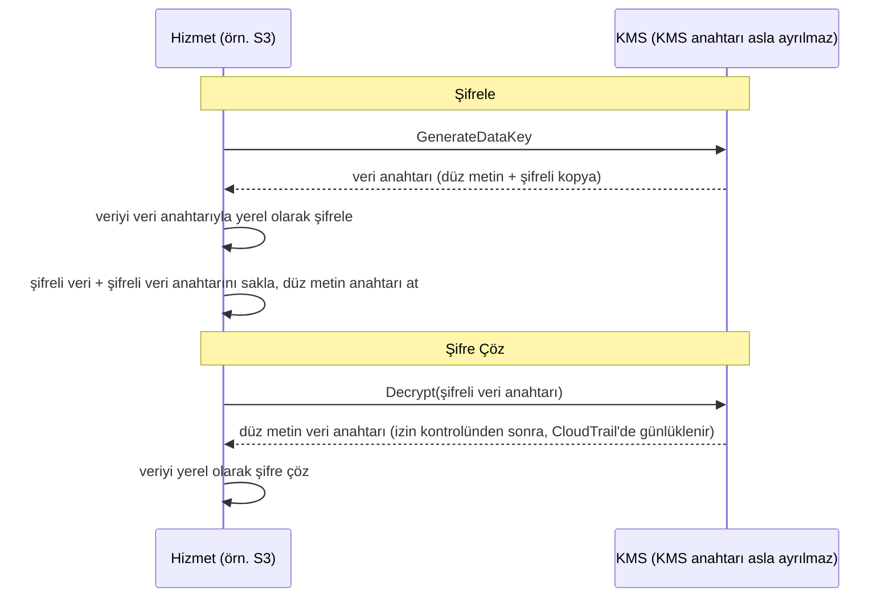

# Bölüm 16: Anahtarlar, Kilitler ve Sırlar

Git deposunun iki yıl geriye giden binlerce commit'i vardı. Leo yirmi dakikadır kaydırıyor, geçmişteki bir ipliği takip ediyordu — belirli bir veritabanı bağlantı dizesinin ilk ne zaman ortaya çıktığını arıyordu. Neredeyse kaçırdı. Bir salı öğleden sonrasıydı, iki sıradan commit arasına sıkışmıştı, o zamandan beri şirketten ayrılmış biri tarafından gönderilmişti.

Bir veritabanı parolası. Düz metin olarak. Geçmişte.

---

*Önceki bölümdeki ağ kontrolleri artık sıkıydı. Güvenlik grupları yanal hareketi sınırlıyordu. NACL'ler bilinen kötü IP aralıklarını engelliyordu. Çevre sertleştirilmişti. Ama güvenlik denetimi, çevrenin düzeltemeyeceği bir şey bulmuştu: altı aydır git geçmişinde yaşayan bir kimlik bilgisi. Çevre güvenliği, içindeki sırların güvenli olduğunu varsayar. Bu güvenli değildi.*

---

Leo git geçmişini incelerken onu buldu. Bir veritabanı parolası. Altı ay önce, düz metin olarak, artık Nimbus'ta çalışmayan biri tarafından commit edilmişti — bağlantı dizesinin iki satır altında dağıtım hattının IAM erişim anahtarını da içeren bir `.env` dosyasının parçası. Commit herkese açıktı. Parola o zamandan beri değiştirilmişti — ama bunu kesin olarak bilmiyorlardı. Her iki kimlik bilgisinin de dokunduğu her sistemi kontrol ettiler. Dört saat sürdü. O gün Nimbus sırları koda koymayı bırakmaya karar verdi.

"Birisi repoyu çatallarsa ne olacağını düşündük mü?" dedi Priya. "Git geçmişi kalıcıdır. Parolayı değiştirsek bile, düzeltmeden önce repoyu klonlamış olan herkesin yerel geçmişinde hâlâ eski kimlik bilgisi var."

"Kontrol ettik," dedi Leo. "Parola üç ay önce değiştirildi. Tüm sistemler onaylandı."

"Bu minimum," dedi Priya. "Ama o kimlik bilgisinin dokunduğu her sistem gözden geçirilmeli. Sadece bildiklerin değil."

**Dört Saatlik Denetim**

Leo sızdırılmış `.env` dosyasını git geçmişinde sabah 10'da bulmuştu. Öğleden sonra 2'ye kadar, önemli olan sorunun cevabını almışlardı: her iki kimlik bilgisi de — veritabanı parolası veya yanına commit edilmiş erişim anahtarı — Nimbus sistemleri dışında biri tarafından kullanılmış mıydı?

Denetim dört kategoriden geçti.

**RDS erişim günlükleri**: Veritabanına yapılan her bağlantı, zaman damgalı ve günlüğe kaydedilmiş. Sızdırılmış parola üç bağlantı dizesinde göründü — hepsi Nimbus VPC'sindeki EC2 örneklerinden, hepsi beklenen kaynak IP'leriyle. Harici bağlantı yok. Parola veritabanına dışarıdan bağlanmak için kullanılmamıştı.

**S3 erişim günlükleri**: Sızdırılmış erişim anahtarı, `nimbus-receipts` paketi için izinleri olan dağıtım hattının IAM kullanıcısına aitti. Leo son altı ay için S3 sunucu erişim günlüklerini sorguladı. Her erişim `us-west-2` EC2 örneklerinden veya CloudFront origin getirme rolünden geliyordu. Anomali yok.

**CloudTrail API çağrıları**: Sızdırılmış erişim anahtarı ID'siyle yapılan her AWS API çağrısı. Leo anahtar için CloudTrail olaylarını filtreledi. Üç yüz on iki olay — hepsi dağıtım hattından rutin `s3:PutObject` çağrıları, hepsi aynı IP'den, hepsi mesai saatleri içinde. Anahtar yalnızca CI/CD sunucusuyla eşleşen tek bir IP adresinden kullanılmıştı.

"Ve CI/CD sunucusu," dedi Priya, "VPC'nin içinde. Veriyi harici bir uç noktaya HTTPS aracılığıyla sızdırmak zorunda kalırdı ve bunu akış günlüklerinde görürdük."

"Kontrol ettik," dedi Leo. "Son altı ayda o sunucudan AWS olmayan IP'lere giden HTTPS yok."

**Karar**: Hiçbir kimlik bilgisi Nimbus ekibi dışında biri tarafından kullanılmamıştı. Maruziyet bir riskti, bir ihlal değil.

"Ama kesin olamayız," dedi Priya. "Günlüklere dayanarak makul ölçüde emin olabiliriz. Kesin olamayız. Bu ayrım önemli."

"Bizi ne kesin yapardı?"

"Bir kimlik bilgisi maruziyetinden sonra hiçbir şey sizi kesin yapmaz. Kimlik bilgisini döndürürsünüz, erişimi denetlersiniz, bulgularınızı belgelersiniz ve daha iyi kontrollerle ilerlersiniz. Kesinlik mevcut değil."

Tom konuşma sırasında hesaplıyordu. "Üç mühendisin dört saatlik zamanı. Tam yüklü maliyette dört bin dolar diyelim. Artı kimlik bilgisi döndürme, belgeleme, olay raporu."

"Ve bu sadece soruşturma," dedi Priya. "Bir ihlal kat kat fazla olurdu. Düzenleyici bildirimler. Müşteri iletişimleri. Olası cezalar."

"Yani dört bin dolarlık ders ucuzdu," dedi Tom.

"Hayli," dedi Priya. "Onu tekrarlamayalım."

---

**İki Sorun: Sırları Saklamak ve Veriyi Şifrelemek**

Hassas bilgiler etrafındaki güvenliğin iki ayrı sorunu vardır:

**Kimlik bilgilerini saklamak** (veritabanı parolaları, API anahtarları, bağlantı dizeleri): Bunlar nerede yaşar? Onlara kim erişebilir? Uygulamanızı yeniden dağıtmadan onları nasıl döndürürsünüz?

**Veriyi şifrelemek** (müşteri bilgileri, ödeme kayıtları, PII): Birisi veritabanınıza veya S3 paketinize yetkisiz erişim kazansa bile, veriyi okuyamayacağından nasıl emin olursunuz?

AWS'nin her sorun için özel bir hizmeti vardır:

- **AWS Secrets Manager**: Kimlik bilgilerini güvenli biçimde saklar ve yönetir
- **AWS KMS (Key Management Service)**: Veriyi şifrelemek ve şifre çözmek için şifreleme anahtarlarını yönetir

Secrets Manager'ı bir anahtarlık olarak düşünün: anahtarlarınızı (kimlik bilgileri) tutar, onları düzenli tutar ve bir programa göre döndürür. KMS'yi bir kasa olarak düşünün: değerli olanı tutmaz — değerli olanı koruyan kilidi açan anahtarı tutar.

**AWS Secrets Manager: Artık Sabit Kodlanmış Kimlik Bilgisi Yok**

Secrets Manager, sırlar için güvenli bir depodur: veritabanı kimlik bilgileri, API anahtarları, OAuth token'ları, SSH anahtarları veya hassas herhangi bir şey.

Uygulamanızın bir parolayı bir ortam değişkeninden veya yapılandırma dosyasından okuması yerine, başlangıçta (veya gerektiğinde) Secrets Manager API'sini çağırır ve sırı alır. Sır asla diske dokunmaz. Kodunuzda asla görünmez. Ortam değişkenlerinizde değildir.

Akış şöyle görünür:

**Eski yöntem**:
```
DB_PASSWORD=supersecretpassword123  # .env dosyasında veya ortam değişkeninde
```

**Secrets Manager yöntemi**:
```python
import boto3
client = boto3.client('secretsmanager')
secret = client.get_secret_value(SecretId='nimbus/production/db-password')
password = json.loads(secret['SecretString'])['password']
```

EC2 örneğinin, o belirli sır için `secretsmanager:GetSecretValue`'yu çağırma izni olan bir IAM rolüne ihtiyacı vardır. Başka hiçbir hizmet onu okuyamaz. Sır asla kodda değildir.

Şunu merak ediyor olabilirsiniz: neden sadece ortam değişkenleri kullanmıyoruz? Daha basitler — dağıtım zamanında ayarlanır ve uygulama onları okur. Ortam değişkenleri gizli görünür ama dağıtım yapılandırmanızda, CI/CD sır deponuzda saklanır, hata ayıklama oturumları sırasında muhtemelen günlüğe kaydedilir ve çalışan işleme erişimi olan herkese görünürdür. Daha da önemlisi, statiktirler: bir kez ayarlandığında, biri elle güncelleyene kadar değişmezler. Secrets Manager kimlik bilgilerini IAM erişim kontrolleri, CloudTrail aracılığıyla tam denetim günlüğü ve otomatik döndürmeyle şifreli bir hizmette saklar. Ortam değişkenleri dönmez. Sızdırılmış bir ortam değişkeni biri onu elle değiştirene kadar geçerli kalır.

**Otomatik Döndürme: Gerçek Güç**

Secrets Manager'ın en büyük özelliği sırları saklamak değil — onları otomatik döndürmektir.

Senaryo şu: her 30 günde bir, Secrets Manager yeni bir veritabanı parolası üretir, onu RDS'te günceller, saklanan sırı günceller ve uygulamanız bir sonraki ihtiyaç duyduğunda yeni parolayı alır. Manuel müdahale yok. Dağıtım yok. "Bunu döndürmeyi hatırlamam gerek" yok.

Döndürme bir Lambda işlevi olarak uygulanır. AWS RDS veritabanları (MySQL, PostgreSQL, Aurora) için şablonlar sağlar. İşlevi herhangi bir kimlik bilgisi türü için özelleştirebilirsiniz.

"Bu ayda ne kadar maliyet çıkarıyor?" diye sordu Tom.

Secrets Manager sır başına ay başına artı API çağrısı başına ücret alır. Az sayıda veritabanı parolası ve API anahtarı için, maliyet ayda dolarlarcadır — bir olayın maliyetine kıyasla önemsiz.

"Geçen haftaki tehlikeye atılma," dedi Priya, "soruşturmak ve düzeltmek ne maliyet çıkarırdı?"

Tom bir an sessiz kaldı. "Benim zamanım, senin zamanın, Leo'nun hafta sonu dahil... birkaç bin dolar."

"Secrets Manager statik anahtarı istismar edilmeden önce yakalardı. Ve onu otomatik olarak döndürürdü."

Tom fiyatlandırma sayfasını açtı.

**Döndürme Sırasında Ne Olur**

"Dur — ama bunu *neden* böyle yapalım?" diye sordu Maya. "Veritabanı parolası dönerse, uygulama bozulur mu? Bir dağıtım olmadan yeni parolayı nasıl alır?"

Bu meşru bir endişeydi. Kesintisiz döndürme dikkat gerektirir.

Secrets Manager döndürmesi aşamalarda çalışır — "eski parola aniden geçersiz, uygulama çöküyor" senaryosunu önlemek için tasarlanmıştır:

**Aşama 1: Yeni sır sürümü oluştur.** Secrets Manager yeni bir parola üretir ve onu sırın beklemedeki bir sürümü olarak saklar. Mevcut sürüm hâlâ aktiftir.

**Aşama 2: Hizmette ayarla.** Döndürme Lambda'sı parolayı yeni değere güncellemek için veritabanını çağırır. Dikkat edin: varsayılan **tek kullanıcılı** döndürme stratejisiyle, eski parolanın yeni durdurulduğu (PostgreSQL'in `ALTER ROLE ... PASSWORD`'ü hemen etkili olur) ve yeni sürümün henüz mevcut olmadığı kısa bir an vardır. Sıfır kesintili döndürme için, Secrets Manager bir **dönüşümlü kullanıcılar** stratejisini destekler: aynı izinlere sahip iki veritabanı kullanıcısı, döndürmenin her zaman *etkin olmayanı* güncellediği ve sonra geçiş yaptığı — aktif kimlik bilgileri uçuş ortasında asla geçersiz kılınmaz. Hatırlanması gereken sınav ifadesi "dönüşümlü kullanıcılar döndürme stratejisidir."

**Aşama 3: Yeni sırı test et.** Döndürme Lambda'sı yeni parolanın çalıştığını onunla bağlanarak doğrular. Bu başarısız olursa, döndürme geri alınır.

**Aşama 4: Bitir.** Secrets Manager yeni sürümü mevcut sürüm olarak işaretler ve eski sürümü önceki sürüme indirir. Önceki sürüm bir lütuf süresi için tutulur.

Lütuf süresi boyunca, her iki sürüm de alınabilir. Uygulamanız eski sırı önbelleğe aldıysa ve henüz yenisini almadıysa, hâlâ bağlanabilir. Bir sonraki `GetSecretValue` çağrısında, mevcut (yeni) sürümü alır.

"Yani uygulamanın asla yeniden başlatılmasına gerek yok," dedi Leo.

"Mutlaka değil. Uygulamanız sırı başlangıçta önbelleğe alır ve onu hiç yenilemezse, ya bir programa göre yenilemeniz ya da kimlik doğrulama hatalarını sırı yeniden getirerek ele almanız gerekir."

"Yani döndürme Lambda'sı ve uygulama işbirliği yapmalı," dedi Maya.

"Secrets Manager kendi yarısını yapar. Uygulama kodunuzun diğer yarısını yapması gerekir: sırı gerektiğinde getir, kimlik doğrulama hatalarını yeniden getirerek ele al."

Leo uygulamayı veritabanı kimlik doğrulama istisnalarını yakalayacak ve başarısızlıkta yeniden denemeden önce Secrets Manager'dan taze bir sır getirecek şekilde güncelledi. İki satır hata işleme. Döndürme kullanıcılara görünmez oldu.

---

**CI/CD Hattı Sır Enjeksiyonu**

"Dağıtım hattının ihtiyaç duyduğu sırları nasıl aldığını düşündük mü?" diye sordu Priya. "Hat altyapı dağıtır. AWS kimlik bilgilerine ihtiyacı var. Geçiş betikleri için veritabanı bağlantı dizelerine ihtiyacı olabilir."

Leo mevcut kurulumu açıkladı: sırlar GitHub Actions Secrets olarak saklanıyordu — GitHub'da beklemede şifreli, çalışma zamanında ortam değişkenleri olarak enjekte ediliyordu.

"Kimlik bilgileri GitHub'da," dedi Priya.

"Şifreli."

"Üçüncü taraf bir sistemde. Bir GitHub ihlali tüm hat sırlarımızı açığa çıkarır."

Çözüm: dağıtım hattı AWS'ye OIDC federasyonu (Bölüm 14'te ele alındı) aracılığıyla kimlik doğrular ve ihtiyaç duyduğu sırları çalışma zamanında Secrets Manager'dan alır. GitHub'da saklanan sır yok. Hattın AWS rolünün belirli sırları okuma izni vardır, başka hiçbir şey değil.

```yaml
# GitHub Actions iş akışı
- name: Get DB Migration Credentials
  env:
    AWS_DEFAULT_REGION: us-west-2
  run: |
    SECRET=$(aws secretsmanager get-secret-value \
      --secret-id nimbus/staging/db-migration \
      --query SecretString --output text)
    DB_URL=$(echo $SECRET | jq -r '.url')
    # DB_URL ile geçişi çalıştır — asla bir dosyada saklanmaz
    flyway -url="$DB_URL" migrate
```

Sır getirilir, bellekte kullanılır ve atılır. Asla diske yazılmaz, asla işten sonra kalan ortam değişkenlerinde saklanmaz, asla bir günlük dosyasında değildir.

"Ya sır günlüğe yazdırılırsa?" diye sordu Leo.

"GitHub Actions, GitHub Secrets olarak yapılandırılmış sırların değerlerini otomatik olarak maskeler. Ama bu sır bir GitHub Secret değil — Secrets Manager'dan geliyor. Onu elle maskelemen gerekir ya da daha iyisi, onu asla günlüğe yazmamalısın."

"Yani disiplin şu: getir, kullan, at. Sırları asla günlüğe yazma. Onları asla dosyalarda saklama."

"O disiplin," dedi Priya, "dört saatlik denetimin başarısız olduğumuzu doğruladığı şey."


**AWS KMS: Kilit Fabrikası**

"Dur — ama bunu *neden* böyle yapalım?" diye sordu Maya. "Neden ayrı bir anahtar yönetimi hizmeti? Veriyi kendimiz şifreleyip anahtarı Secrets Manager'da saklayamaz mıyız?"

Şifreleme anahtarlarını Secrets Manager'da saklayabilirsiniz. Ama o zaman anahtara erişimi kim kontrol eder? Anahtarın döndürüldüğünü ne sağlar? Anahtarın yalnızca yetkili hizmetler tarafından kullanıldığını bir denetçiye ne kanıtlar? KMS bu soruların hepsini yanıtlar. Sadece depolama değil — donanım destekli güvenlik, anahtar başına ince taneli IAM politikaları ve her kullanımın eksiksiz bir denetim izi olan bir anahtar yaşam döngüsü yönetimi hizmetidir. Secrets Manager sistemlere bağlanmak için ihtiyaç duyduğunuzu saklar. KMS sistemlerin kendilerini korur.

AWS KMS (Key Management Service) **kriptografik anahtarları** yönetir — veriyi şifrelemek ve şifre çözmek için kullanılan gizli değerler.

Analoji: KMS, ana anahtarı tutan bir kilit kutu şirketi gibidir. Veriniz (kutunun içeriği) şifrelidir. Yalnızca KMS anahtarını kullanma izni olan biri şifresini çözebilir. KMS her anahtarın her kullanımını CloudTrail'de günlüğe kaydeder.

**Customer Master Keys (CMK'lar)** — şimdi KMS anahtarları deniyor — üç tür sahiplikle gelir:

**AWS sahipli anahtarlar**: AWS'nin sahip olduğu ve birçok müşteri hesabında kullandığı anahtarlar — onları asla görmezsiniz, asla onlar için ödeme yapmazsınız ve hesabınızda görünmezler. Birkaç hizmet varsayılanı onları kullanır (örneğin DynamoDB'nin varsayılan şifrelemesi).

(Akılda tutmaya değer bir ayrım: S3'ün varsayılan **SSE-S3** şifrelemesi hiç bir KMS anahtarı modeli *değildir* — S3 kendi AES-256 anahtarlarını tamamen KMS dışında yönetir, görülecek anahtar ve anahtar kullanım denetim izi olmadan. **SSE-KMS**, KMS üzerinden geçen S3 seçeneğidir, ya AWS yönetilen `aws/s3` anahtarını ya da müşteri tarafından yönetilen bir anahtarı kullanır. Sınav tetikleyicisi: "şifreleme anahtarını kimin kullandığını denetle" veya "döndürmeyi ve anahtar politikasını kontrol et" → müşteri tarafından yönetilen anahtarla SSE-KMS — her kullanım CloudTrail'e düşer.)

**AWS yönetilen anahtarlar**: AWS, S3, EBS, RDS gibi hizmetler için anahtarı otomatik olarak *hesabınızda* oluşturur ve yönetir (`aws/s3` gibi adlandırılır). Onu görebilir ve kullanımını CloudTrail'de denetleyebilirsiniz ama politikasını veya döndürmesini değiştiremezsiniz — AWS onu her yıl otomatik olarak döndürür. Ücretsiz.

**Müşteri tarafından yönetilen anahtarlar**: Anahtarı KMS'te oluşturur ve onun her yönünü kontrol edersiniz: kim kullanabilir, ne zaman döner, kim yönetir. 90 gün ile 2.560 gün (7 yıl) arasında yapılandırılabilir bir periyotla otomatik anahtar döndürmeyi etkinleştirebilirsiniz; varsayılan döndürme periyodu 365 gündür (yıllık). Ayrıca hemen bir **isteğe bağlı döndürme** tetikleyebilirsiniz — şüpheli bir maruziyetten sonra, programı beklemeden yararlı. Not: otomatik döndürme, KMS tarafından üretilen materyalli simetrik anahtarlar için geçerlidir — asimetrik anahtarlar ve içe aktarılan anahtar materyali otomatik dönemez. Maliyet: anahtar başına ayda 1 dolar artı API çağrısı başına ücretler.

Müşteri tarafından yönetilen KMS anahtarları seçerseniz döndürme programları, erişim politikaları ve denetim görünürlüğü üzerinde tam kontrol elde edersiniz ama anahtar başına ay başına ödeme yaparsınız ve anahtar yönetimi sorumluluğunu üstlenirsiniz; AWS yönetilen anahtarlar seçerseniz sıfır operasyonel yük ve anahtarın kendisi için maliyet olmadan şifreleme elde edersiniz ama döndürme programlarını veya anahtar politikalarını özelleştiremezsiniz — bunlar tamamen AWS tarafından yönetilir.

**AWS Hizmetlerinde Şifreleme: KMS Entegrasyonu**

Çoğu AWS hizmeti şifreleme için KMS ile entegre olur:

**S3**: Bir pakette "KMS ile sunucu tarafı şifreleme"yi etkinleştirin. Her nesne beklemede bir KMS anahtarıyla şifrelenir. Bir nesneyi okumak hem S3 paketine *hem de* KMS anahtarına izin gerektirir.

**RDS**: Oluşturma zamanında şifrelemeyi etkinleştirin. Veritabanı depolama, yedeklemeler ve anlık görüntüler hepsi bir KMS anahtarıyla şifrelenir. Not: mevcut şifrelenmemiş bir RDS örneğinde şifreleme etkinleştirilemez — anlık görüntü almanız, anlık görüntüyü şifreleme etkin olarak kopyalamanız ve geri yüklemeniz gerekir.

**EBS**: Birimleri KMS ile şifreleyin. Şifreli anlık görüntülerden oluşturulan yeni birimler otomatik olarak şifrelenir.

**DynamoDB**: KMS kullanarak beklemede şifreleme tüm tablolarda varsayılan olarak etkindir.

**ElastiCache Redis**: Hassas önbelleğe alınmış veri için KMS ile beklemede şifreleme.

İlke: veri beklemede (diskte saklanan) ve aktarımda (bir ağ üzerinde hareket eden) şifrelenmelidir. KMS beklemede şifrelemeyi ele alır. TLS/SSL (AWS hizmetleri tarafından otomatik olarak sağlanır) aktarımda şifrelemeyi ele alır.

**Zarf Şifreleme: KMS Aslında Nasıl Çalışır**

KMS davranışını ve sınav sorularını anlamanıza yardımcı olan bir ayrıntı işte.

KMS çoğu durumda verinizi doğrudan şifrelemez. **Zarf şifreleme** kullanır:

1. KMS bir **veri anahtarı** (benzersiz bir simetrik anahtar) üretir
2. Hizmet veriyi yerel olarak şifrelemek için veri anahtarını kullanır (hızlı — simetrik şifreleme)
3. Hizmet KMS'ten veri anahtarının kendisini şifrelemesini ister (KMS anahtarınızı kullanarak)
4. Hem şifreli veri hem de şifreli veri anahtarı saklanır
5. Gerçek veriniz asla hizmetten ayrılmaz — yalnızca veri anahtarı şifreleme/şifre çözme için KMS'e gider

Veriyi okuduğunuzda:

1. Hizmet KMS'ten veri anahtarının şifresini çözmesini ister
2. KMS izinleri kontrol eder, veri anahtarının şifresini çözer, geri döndürür
3. Hizmet veriyi yerel olarak şifresini çözmek için şifresi çözülmüş veri anahtarını kullanır



Bu, KMS'nin çok büyük veriyi tümünü KMS API'si üzerinden göndermeden ele alabileceği anlamına gelir. Yalnızca küçük anahtarlar KMS'e gider. CloudTrail her KMS API çağrısını günlüğe kaydeder — her şifreleme ve şifre çözme işlemini.

**KMS Anahtar Politikaları: Erişim Modeli**

"Bir IAM politikası ile bir anahtar politikası çakışırsa ne olacağını düşündük mü?" diye sordu Priya. "KMS'in IAM'in üstünde kendi erişim kontrolü var."

KMS anahtarlarının **anahtar politikaları** vardır — anahtarın kendisine eklenen kaynak tabanlı politikalar. IAM politikalarından farklıdırlar ve farklı değerlendirme kurallarını izlerler.

Bir asilin bir KMS anahtarını kullanması için, iki şey doğru olmalıdır:

**Birincisi**: Anahtar politikası buna izin vermelidir. Anahtar politikası asile açıkça erişim vermezse, anahtarı kullanamazlar — IAM politikaları ne derse desin. Bu, IAM politikalarının tek başına yeterli olduğu çoğu AWS kaynağından farklıdır.

**İkincisi**: Asilin IAM politikası KMS eylemine izin vermelidir (örn. `kms:Decrypt`, `kms:GenerateDataKey`).

Her ikisi de evet demelidir. Birinin hayır demesi eylemin reddedilmesi demektir.

AWS'nin müşteri tarafından yönetilen anahtarlar için oluşturduğu varsayılan anahtar politikası "root hesabı bu anahtarı yönetebilir" diyen bir ifade içerir. Bu önemlidir: hesap düzeyinde bir IAM yöneticisinin, anahtar politikası onları doğrudan adlandırmasa bile bir anahtara her zaman erişim verebileceği anlamına gelir — çünkü root hesabı delegasyonu yerindedir.

"Yani anahtar politikasından root hesabını kaldırırsak," diye sordu Leo, "o anahtar için IAM politikaları çalışmayı durdurur mu?"

"Doğru. Root hesabı delegasyonunu kaldırmak, bir anahtarı o kadar sıkı kilitlemenin bir yoludur ki yalnızca anahtar politikasında adlandırılan belirli asiller onu kullanabilir — hesap yöneticileri bile değil. Aynı zamanda kendi anahtarınızdan kazara kilitlenmenin de bir yoludur."

"Kurtarabilir miyiz?"

"Yalnızca AWS Desteği ile iletişime geçerek. Hiç kimse anahtarı kullanamıyorsa ve anahtar politikası güncellenemiyorsa, o anahtarla şifrelenmiş veri etkin biçimde erişilemezdir."

"Yani çok iyi bir neden olmadan anahtar politikasından root hesabını kaldırma."

"Doğru."

---

**Asimetrik Anahtarlar: İmzalama ve Doğrulama**

KMS asimetrik anahtar çiftlerini de destekler — bir herkese açık anahtar ve bir özel anahtar.

Kullanım durumları:

**Dijital imzalama**: Bir belgeyi veya bir JWT token'ını özel anahtarla imzalarsınız. Herkese açık anahtarı olan herkes imzanın özel anahtarın sahibinden geldiğini ve içeriğin kurcalanmadığını doğrulayabilir.

**Herkese açık anahtar şifreleme**: Herkes veriyi herkese açık anahtarla şifreleyebilir. Yalnızca özel anahtarın sahibi şifresini çözebilir.

Nimbus için, asimetrik anahtarlar restoran ortakları için bir webhook imza sistemi uyguladıklarında geçerli hale geldi. Nimbus bir restoran ortağının sunucusuna bir olay gönderdiğinde (yeni bir sipariş, bir durum güncellemesi), ortağın olayın gerçekten Nimbus'tan geldiğini ve sahte olmadığını doğrulaması gerekiyordu.

Uygulama:

1. Nimbus asimetrik bir KMS anahtarı oluşturur (RSA 2048-bit, SIGN_VERIFY algoritması)
2. Bir webhook gönderirken, Nimbus olay yükünü imzalamak için özel anahtarla `kms:Sign`'i çağırır
3. İmza webhook başlığına dahil edilir
4. Nimbus herkese açık anahtarı yayınlar (KMS konsolundan indirilebilir)
5. Restoran ortağının sunucusu herkese açık anahtarı getirir ve her gelen webhook'ta imzayı doğrulamak için kullanır

Özel anahtar asla KMS'ten ayrılmaz. Nimbus'un ham özel anahtar materyaline asla erişimi olmaz. KMS imzalama işlemini donanım güvenlik modülünün içinde gerçekleştirir.

"Yani biri bir Nimbus sunucusunu tehlikeye atsa bile," dedi Rafael, "bir webhook imzasını sahteleyemezler. Özel anahtar KMS'te, herhangi bir sunucuda değil."

"Doğru. İmzalama bir KMS API çağrısı gerektirir. Her API çağrısı CloudTrail'de günlüklenir. Biri sahte bir olayı imzalamaya çalışsa, API çağrısını görürdük."

---

**Anahtar Silme Hikayesi**

KMS kurulumundan üç ay sonra, Tom bir hata yaptı.

Kullanılmayan AWS kaynaklarını temizliyordu — eski Lambda işlevleri, eski S3 paketleri, terk edilmiş CloudWatch panoları. Hızlı hareket ediyordu. Yanlışlıkla bir KMS anahtarını silme için zamanladı.

Anahtar `nimbus/prod/order-receipts` idi — sipariş fişleri S3 paketini şifrelemek için kullanılan müşteri tarafından yönetilen anahtar.

"Dün on iki kaynağı toplu sildim ve on ikincisinin ne olduğunu kontrol etmedim," dedi Tom düz bir sesle. Silmeyi zamanlamış ve devam etmişti. Hatayı ertesi sabah eylemlerini gözden geçirdiğinde fark etti.

KMS konsolunu açtı. Anahtar durumu şöyle yazıyordu: "Silinme bekliyor. 7 gün içinde silinme."

Onu minimum bekleme süresi için zamanlamıştı.

"İptal edebilir miyiz?" diye sordu.

Priya belgeleri açtı. "Evet. Bekleme süresi boyunca, anahtar devre dışıdır ama silinmemiştir. Silmeyi iptal edebilirsin."

Tom silmeyi dakika içinde iptal etti. Anahtar aktif duruma geri getirildi.

"Yedi gün minimum bekleme süresidir," dedi Priya. "AWS bunu uygular çünkü bir anahtar silinirse ve onunla veri şifrelenmişse, o veri sonsuza dek gider. Geri alınamaz. Bekleme süresi sana hatayı fark etme zamanı verir."

"Bekleme süresi ne kadar olmalı?"

"Maksimum otuz gündür. Üretim verisini şifreleyen herhangi bir anahtar için otuz gün kullan. Kazalara karşı fazladan üç haftalık koruma, küçük rahatsızlığa değer."

Tom tüm üretim anahtarı silme ayarlarını otuz güne güncelledi. Ayrıca herhangi bir KMS anahtarı durumu "Silinme bekliyor"a değişirse tetiklenen bir CloudWatch alarmı kurdu — böylece bir dahaki sefere biri (o dahil) aynı hatayı yaptığında, ekip beş dakika içinde bilirdi.

---

**Secrets Manager vs Parameter Store**

AWS'nin ayrıca yapılandırma değerlerini (sadece sırları değil) saklayan **Systems Manager Parameter Store**'u da vardır. Parameter Store daha ucuzdur — standart parametreler için ücretsizdir. KMS kullanarak şifreli parametreler de saklayabilir.

Döndürme gerektiren sırlar için: Secrets Manager.

Yapılandırma değerleri ve hassas olmayan parametreler için: Parameter Store (ücretsiz katman çok cömerttir).

Uygulama yapılandırması (port numaraları, özellik bayrakları, ortama özgü ayarlar) için: Parameter Store.

| | Secrets Manager | SSM Parameter Store |
|---|---|---|
| Otomatik döndürme | Evet (Lambda destekli) | Hayır |
| Maliyet | ~ay başına 0,40 dolar/sır | Ücretsiz (standart) |
| Şifreleme | Her zaman | İsteğe bağlı (KMS ile) |
| Sürümleme | Evet | Evet |
| Hesaplar arası erişim | Evet | Sınırlı |
| En iyi olduğu | Veritabanı parolaları, API anahtarları | Yapılandırma değerleri, özellik bayrakları |

## Kapıdaki Sertifika

Sırların geçişinden iki hafta sonra, Priya Nimbus hazırlık ortamını telefonunda gözden geçirirken adres çubuğunu fark etti.

"Güvenli Değil."

Üretim URL'sini açtı. Aynı şey.

"Leo," dedi, telefonunu masaya koyarak. "HTTP üzerinde mi çalışıyoruz?"

Leo kontrol etti. "ALB dinleyicisi 80 portunda. HTTPS'yi hiç kurmadık."

"Yani kullanıcılarımızın yaptığı her istek — her sipariş, her giriş — şifrelenmemiş HTTP üzerinden mi gidiyor?"

"RDS bağlantısında TLS'miz var," diye sundu Leo.

"Bu, uygulama ile veritabanı arasında aktarımdaki veri. Ben kullanıcının tarayıcısı ile yük dengeleyicimiz arasındaki aktarımdaki veriden bahsediyorum. Bu hiç şifreli değil."

Tom dinliyordu. "Bu bir güvenlik sorunu mu yoksa bir algı sorunu mu?"

"İkisi de," dedi Priya. "Şifrelenmemiş HTTP, kullanıcı ile sunucumuz arasındaki herhangi bir ağın — bir kafe yönlendiricisi, bir ISP — trafiği okuyabileceği anlamına gelir. Parolalar, sipariş ayrıntıları, oturum token'ları. Ve modern tarayıcılar kullanıcıları 'Güvenli Değil' ile uyarır. Bu dönüşüm oranlarını öldürür."

"Yani bir TLS sertifikasına ihtiyacımız var," dedi Maya. "Bu ne kadara mal olur?"

"Hiç," dedi Priya. "AWS Certificate Manager."

**AWS Certificate Manager (ACM)**, AWS tarafından yönetilen hizmetlerle kullanılmak üzere ücretsiz TLS/SSL sertifikaları sağlar: ALB'ler, CloudFront dağıtımları ve API Gateway. Bir sertifika satın almazsınız, bir yenileme takvimi yönetmezsiniz veya özel anahtar materyaline dokunmazsınız. ACM tüm sertifika yaşam döngüsünü ele alır.

ACM tarafından verilen bir sertifika 13 ay geçerlidir. Süresi dolmadan önce, ACM onu otomatik olarak yeniler. Yenileme başarılı olursa, yeni sertifika sizin tarafınızdan herhangi bir eylem olmadan yük dengeleyicinize veya dağıtımınıza eklenir. Tarayıcının asma kilidi yeşil kalır. Ayarlamayı unuttuğunuz süre dolma uyarısı asla tetiklenmez.

**İki tür ACM sertifikası**:

**Herkese açık sertifikalar**, Amazon'un sertifika yetkilisi tarafından verilir ve tüm büyük tarayıcılar tarafından güvenilir. ALB, CloudFront ve API Gateway ile kullanım için tamamen ücretsizdir. Alan adının sahipliğini DNS veya e-posta yoluyla doğrularsınız.

**Özel sertifikalar**, AWS Private CA tarafından verilir — dahili hizmetler (hizmetten hizmete mTLS, dahili araçlar, VPN istemcileri) için çalıştırdığınız yönetilen bir özel sertifika yetkilisi. Private CA'nın aylık maliyeti vardır.

Nimbus için, herkese açık sertifikalar doğru seçimdi.

**DNS doğrulama vs e-posta doğrulama**:

Leo ACM konsolunu açtı ve `eatnimbus.com` ve `*.eatnimbus.com` için bir sertifika isteği başlattı.

"Sahipliği nasıl doğrulamak istediğimi soruyor," dedi. "DNS veya e-posta."

"DNS," dedi Priya. "Her zaman DNS."

DNS doğrulamasıyla, ACM barındırılan bölgenize belirli bir CNAME kaydı ekler. Route 53 bunu otomatik olarak yapabilir — konsolda bir tıklama. O CNAME kaydı var olduğu sürece, ACM sertifikayı insan eylemi olmadan otomatik yenileyebilir. E-posta doğrulaması alan adının kayıtlı kişisine bir e-posta gönderir ve sertifika her yenilendiğinde manuel bir tıklama gerektirir. O tıklama unutulur. DNS doğrulaması kimsenin bir şey hatırlamasını gerektirmez.

"Yani CNAME kaydını bir kez eklerim," dedi Leo, "ve sonsuza dek yenilenir mi?"

"Biri CNAME kaydını silene kadar," dedi Priya. "CNAME kaydını silme."

Leo sertifikayı istedi, Route 53'e doğrulama CNAME'ini ekledi (ACM bunu otomatik yapmayı teklif etti) ve beş dakika bekledi. Sertifika durumu Issued'a değişti. Onu ALB'nin 443 portundaki HTTPS dinleyicisine ekledi ve tüm HTTP trafiğini HTTPS'ye göndermek için 80 portuna bir yönlendirme kuralı ekledi.

Tom üretim URL'sini yeniledi.

Asma kilit göründü.

İşaretlemeye değer bir bölgesel ayrıntı: bir sertifika bölgesel bir kaynaktır ve onu kullanan hizmetle aynı bölgede yaşamalıdır. Bir ALB için, bu ALB'nin bölgesidir. **CloudFront** için, sertifika **`us-east-1`**'de istenmeli (veya içe aktarılmalı) — her zaman, origin'lerinizin nerede çalıştığından bağımsız olarak — çünkü CloudFront orada sabitlenmiş küresel bir hizmettir. Leo bunu Bölüm 13'te zaten yaşamıştı; aynı zamanda güvenilir bir sınav gerçeğidir.

**ACM sertifikalarının yapamadığı tek şey**:

"Sertifikayı indirebilir miyim?" diye sordu Leo. "Onu dahili yönetici EC2 örneğine kurmak istiyorum."

"Hayır," dedi Priya.

Ücretsiz ACM herkese açık sertifikaları dışa aktarılamaz. Özel anahtarı indiremez ve bir EC2 örneğine, bir Nginx sunucusuna veya AWS tarafından yönetilen hizmetler dışında herhangi bir şeye kuramazsınız. Özel anahtar materyali asla ACM'den ayrılmaz. Bu kasıtlıdır — özel anahtarın sızdırılmasını, güvensiz biçimde saklanmasını veya sertifikanın süresi dolduğunda unutulmasını önler.

Kurulabilir bir sertifika gerektiren kullanım durumları için — özel bir proxy görevi gören bir EC2 örneği, bir şirket içi sunucu — üç yol vardır: üçüncü taraf bir yetkiliden (örneğin Let's Encrypt) bir sertifika, sertifika dışa aktarması etkin AWS Private CA veya — Haziran 2025'ten beri — ACM'nin ücretli **dışa aktarılabilir herkese açık sertifikaları** (verme sırasında tercih edilir, FQDN veya joker karakter başına ücretlendirilir), özel anahtarı her yerde kullanmak için dışa aktarılabilir.

"ALB'miz ve CloudFront dağıtımımız için," dedi Priya, "ACM tam doğru. Ücretsiz, otomatik ve asla bir anahtara dokunmuyoruz."

## Güçlü Yönler ve Sınırlamalar

**AWS Secrets Manager**:

- Kod değişiklikleri veya dağıtımlar olmadan otomatik sır döndürme
- Sır başına ince taneli IAM erişim kontrolü (her sır ayrı bir IAM kaynağıdır)
- Sürümleme — döndürme sırasında önceki sürüm erişilebilir kalır, bağlantı kopmalarını önler
- CloudTrail aracılığıyla denetim — her `GetSecretValue` çağrısı çağıranın kimliğiyle günlüklenir
- Hesaplar arası erişim — bir hesabın sırları başka bir hesabın rolüyle paylaşılabilir
- Maliyet: ~ay başına 0,40 dolar/sır + API çağrıları (10.000 API çağrısı başına kabaca 0,05 dolar)

**AWS KMS**:

- Tam denetim iziyle merkezi anahtar yönetimi — her şifreleme ve şifre çözme günlüklenir
- Müşteri tarafından yönetilen anahtarlar için yapılandırılabilir otomatik anahtar döndürme (90 gün ila 2.560 gün; varsayılan 365 gün) — eski anahtar materyali hâlâ mevcut veriyi çözer, yeni anahtar materyali yeni veriyi şifreler
- Anahtar başına ince taneli IAM izinleri (anahtar politikaları + IAM politikaları — her ikisi de izin vermeli)
- Donanım Güvenlik Modülü (HSM) destekli — anahtarlar HSM'i asla düz metin olarak terk etmez
- Felaket kurtarma senaryoları için çok bölgeli anahtar desteği
- Dijital imzalama ve doğrulama için asimetrik anahtar desteği
- Maliyet: anahtar başına ayda 1 dolar + 10.000 API çağrısı başına 0,03 dolar

**Nerede karmaşıklaşır**:

- KMS anahtar politikaları IAM politikalarından ayrıdır (ve onlarla birlikte değerlendirilir) — erişim reddedildi hatalarını ayıklamak her ikisini kontrol etmeyi gerektirir
- Beklemede şifreleme önceden planlanmalıdır — mevcut şifrelenmemiş bir RDS örneğini yerinde şifreleyemezsiniz
- KMS'te anahtar silme 7-30 günlük bir bekleme süresine sahiptir — bir güvenlik mekanizması ama kurulum sırasında unutmak kolay ve kazara tetiklemek tehlikeli
- Döndürme, uygulama kodunun kimlik doğrulama hatasında sırları yeniden getirmesini gerektirir — Secrets Manager kimlik bilgisini döndürür ama uygulama onu almalı
- Secrets Manager maliyetleri büyük ölçekte sır sayısı ve API çağrısı hacmiyle ölçeklenir
- Varsayılan anahtar politikası (root hesabı delegasyonu dahil) korunması kritiktir — onu kaldırmak yöneticileri anahtardan kilitleyebilir

## Özet

Tehlikeye atılmış bir kimlik bilgisini dokunduğu her sistemde izlemek için harcanan dört saat, Secrets Manager'ın önleyebileceği dört saatti. Otomatik döndürme, çalınmış bir kimlik bilgisinin kısa bir ömrü olduğu anlamına gelir. KMS, biri veriye ulaşsa bile, kullanmaya yetkili olmadığı bir anahtar olmadan onu okuyamayacağı anlamına gelir. Ve otuz günlük bir anahtar silme bekleme süresi, kazara bir silmenin bir veri kaybı olayına dönüşmeden önce iptal edilebileceği anlamına gelir.

- Kimlik bilgilerini asla kodda, ortam değişkenlerinde veya sürüm kontrolüne commit edilmiş yapılandırma dosyalarında saklamayın.
- **Secrets Manager** kimlik bilgilerini güvenli biçimde saklar ve onları otomatik döndürür. Uygulamalar sırları çalışma zamanında API aracılığıyla getirir.
- **Döndürme** aşamalarda gerçekleşir: yeni sürüm oluştur, hizmette güncelle, test et, terfi ettir. Hem eski hem yeni sürüm kısa süre geçerlidir, döndürme sırasında bağlantı kopmalarını önler.
- **KMS** şifreleme anahtarlarını yönetir. Çoğu AWS hizmeti beklemede şifreleme için KMS ile entegre olur.
- **Zarf şifreleme**: KMS veriyi değil, anahtarı doğrudan şifreler. Hizmet veriyi yerel bir veri anahtarı kullanarak şifreler, KMS onu şifreler. Yalnızca küçük anahtarlar KMS API'sini kat eder.
- **Müşteri tarafından yönetilen KMS anahtarları**: döndürme (yapılandırılabilir 90–2.560 gün, varsayılan 365 gün yıllık), erişim ve denetim üzerinde tam kontrol (ayda 1 dolar). **AWS yönetilen anahtarlar**: otomatik, yapılandırma gerekmez, ücretsiz.
- **KMS anahtar politikaları**: Anahtar politikası IAM ile birlikte çalışan kaynak tabanlı bir politikadır. Her ikisi de evet demeli. Varsayılan anahtar politikasındaki root hesabı delegasyonu, IAM yöneticilerinin her zaman erişim verebilmesini sağlar.
- **Asimetrik anahtarlar**: KMS imzalama ve doğrulama için RSA ve ECC anahtar çiftlerini destekler. Özel anahtar HSM'i asla terk etmez.
- **Anahtar silme**: Minimum 7 gün, maksimum 30 gün bekleme süresi. Silinen anahtarlar kalıcı olarak erişilemez şifreli veri demektir. Üretim anahtarları için 30 gün kullanın ve silinme bekliyor durumunu izleyin.
- **CI/CD sırları**: OIDC federasyonu kullanarak çalışma zamanında Secrets Manager'dan getirin. Sırları asla CI/CD platform değişkenleri olarak saklamayın.

## Sınav İpuçları

*SAA-C03 Alanı: Güvenli Mimariler Tasarlama (Alan 1, Görev 1.3)*

- **Secrets Manager vs SSM Parameter Store**: Otomatik döndürme gerektiren kimlik bilgileri için Secrets Manager; genel yapılandırma için Parameter Store. Sınav onları döndürme gereksinimi ve maliyet hassasiyetiyle ayırır.
- **KMS anahtar politikaları**: Bir KMS anahtarının kendi anahtar politikası vardır (kaynak tabanlı bir politika). IAM politikaları tek başına bir KMS anahtarına erişim vermez — anahtar politikası bunu açıkça izin vermelidir. Hem anahtar politikası hem IAM politikası eyleme izin vermelidir.
- **RDS'i Şifreleme**: Mevcut şifrelenmemiş bir RDS örneğinde şifreleme etkinleştirilemez. Süreç: bir anlık görüntü oluştur → anlık görüntüyü şifreleme etkin olarak kopyala → şifreli anlık görüntüden geri yükle → trafiği yeni örneğe taşı.
- **EBS şifrelemesi**: Yeni birimler şifrelenebilir. Şifreli birimlerin anlık görüntüleri her zaman şifrelidir. Şifrelenmemiş birimler doğrudan şifrelenemez — anlık görüntü + kopya + geri yükle.
- **CloudTrail + KMS**: Her KMS API çağrısı CloudTrail'de günlüklenir. Bu önemli bir uyumluluk özelliğidir. Bir sınav verinin kimliği doğrulanarak çözüldüğünü nasıl denetleyeceğinizi sorduğunda, cevap CloudTrail + KMS'tir.
- **Çok bölgeli KMS anahtarları**: Şifre çözmenin bölgeler arası API çağrıları olmadan gerçekleşebilmesi için anahtar materyalini birden çok bölgeye çoğaltın. Sınav bunu şifreli veriyle çok bölgeli felaket kurtarma için kullanır.
- **KMS vs CloudHSM**: KMS çok kiracılıdır (AWS tarafından yönetilir). CloudHSM yalnızca sizin kontrol ettiğiniz özel bir donanım güvenlik modülüdür. Sınav sinyalleri: "FIPS 140-2 Seviye 3," "özel HSM," "müşteri tarafından yönetilen kriptografik işlemler" → CloudHSM.
- **Zarf şifreleme**: KMS bir veri anahtarı üretir, hizmet veriyi yerel olarak şifrelemek için onu kullanır, KMS veri anahtarını şifreler. Sınav sorusu: "KMS neden büyük miktarda veriyi doğrudan şifrelemez?" → performans; zarf şifreleme büyük veriyi yerel tutar.
- **Asimetrik KMS anahtarları**: Dijital imzalama, JWT doğrulama veya herkese açık anahtar şifreleme için kullanılır. Özel anahtar asla KMS'ten ayrılmaz. `kms:Sign` imzalamak için API çağrısıdır; `kms:Verify` doğrulamak için.
- **Anahtar silme bekleme süresi**: 7-30 gün. Bu süre boyunca, anahtar devre dışıdır ve kullanılamaz ama silme iptal edilebilir. Silmeden sonra, o anahtarla şifrelenmiş herhangi bir veri kalıcı olarak kurtarılamazdır.
- **ACM (AWS Certificate Manager):** ALB, CloudFront ve API Gateway ile kullanım için ücretsiz herkese açık TLS sertifikaları. DNS doğrulaması aracılığıyla otomatik yenilenir. Ücretsiz herkese açık sertifikaların özel anahtarı dışa aktarılamaz — yalnızca AWS içinde yaşarlar (EC2/şirket içi kullanım için 2025'ten beri ücretli bir *dışa aktarılabilir herkese açık sertifika* seçeneği vardır). Sınav tetikleyicisi: "yük dengeleyici veya CDN'de HTTPS" → ACM.

## Alıştırmalar

**Alıştırma 1 — Hatırlama**

Zarf şifreleme kavramını açıklayın. KMS neden uygulama verinizi doğrudan şifrelemek yerine küçük bir veri anahtarını şifreler?

*(İpucu: Şifrelenecek 1GB veriniz olduğunda ne olacağını ve 1GB'ı uzak bir KMS hizmetine göndermenin performans etkilerinin ne olacağını düşünün.)*

**Alıştırma 2 — SAA-C03 Senaryosu**

*Senaryo*: Bir finansal hizmetler şirketi hassas müşteri verisini bir RDS MySQL veritabanında saklıyor. Yeni bir uyumluluk gereksinimi şunları zorunlu kılıyor:

1. Tüm veri beklemede şifrelenmeli
2. Tüm şifreleme anahtarı kullanımı denetlenebilir olmalı
3. Şifreleme anahtarları müşteri tarafından kontrol edilmeli (AWS tarafından yönetilmemeli)
4. Veritabanı parolası her 90 günde bir otomatik döndürülmeli

Veritabanı altı ay önce şifreleme etkinleştirilmeden oluşturuldu. Dört gereksinimi de EN İYİ hangi eylem seti karşılar?

A) Mevcut veritabanında RDS şifrelemesini etkinleştir; müşteri tarafından yönetilen bir KMS anahtarı oluştur; 90 günlük döndürmeyle Secrets Manager'ı yapılandır  
B) Mevcut veritabanının bir anlık görüntüsünü oluştur; anlık görüntüyü müşteri tarafından yönetilen bir KMS anahtarı kullanarak şifrelemeyle kopyala; şifreli anlık görüntüden geri yükle; 90 günlük döndürmeyle Secrets Manager'ı yapılandır  
C) Bir AWS yönetilen anahtarla yeni şifreli bir RDS örneği oluştur; veriyi eski örnekten taşı; 90 günlük döndürmeyle Secrets Manager'ı yapılandır  
D) Mevcut veritabanında bir AWS yönetilen anahtar kullanarak beklemede şifrelemeyi etkinleştir; 90 günlük döndürmeyle Secrets Manager'ı yapılandır

**İpucu 1**: Mevcut şifrelenmemiş bir RDS örneğinde şifrelemeyi doğrudan etkinleştiremezsiniz.

**İpucu 2**: "Müşteri tarafından kontrol edilen" anahtarlar, AWS yönetilen anahtarlar değil, müşteri tarafından yönetilen KMS anahtarları demektir.

**İpucu 3**: Anlık görüntü kopyalama süreci şifreli RDS'e standart geçiş yoludur.

**Cevap**: B

**Açıklama**: RDS şifrelemesi mevcut bir örnekte etkinleştirilemez. Standart yaklaşım şudur: mevcut örneğin anlık görüntüsünü al → anlık görüntüyü müşteri tarafından yönetilen bir KMS anahtarı kullanarak şifreleme etkin olarak kopyala (gereksinim 1, 2 ve 3'ü karşılar) → şifreli anlık görüntüden geri yükle. Müşteri tarafından yönetilen KMS anahtarları tüm kullanımı CloudTrail'de otomatik günlükler (denetim) ve şifreleme anahtarlarını sizin kontrolünüzde tutar. Secrets Manager otomatik 90 günlük parola döndürmeyi ele alır (gereksinim 4'ü karşılar).

**Neden A değil?** Mevcut şifrelenmemiş bir RDS örneğinde şifrelemeyi yerinde etkinleştiremezsiniz.

**Neden C değil?** AWS yönetilen anahtarlar "müşteri tarafından kontrol edilen" gereksinimini karşılamaz (gereksinim 3).

**Neden D değil?** A ile aynı sorun (yerinde etkinleştirilemez) artı AWS yönetilen anahtar gereksinim 3'ü karşılamaz.

*SAA-C03 Alanı: Güvenli Mimariler Tasarlama — Görev 1.3*

**Alıştırma 3 — Mimari Mücadelesi** *(İsteğe Bağlı)*

Nimbus'un aşağıdaki hassas veriyi saklaması gerekiyor:

- Üretim RDS örneği için veritabanı parolası
- Stripe API gizli anahtarı (ödeme işleme için kullanılır)
- Müşteri sipariş geçmişini DynamoDB'de şifrelemek için simetrik bir şifreleme anahtarı
- Restoran başına yapılandırma değerleri (API uç noktaları, özellik bayrakları — hassas değil)

Her biri için hangi AWS hizmetini veya yaklaşımı kullanırdınız? Her birine hangi döndürme stratejisini uygulardınız?

*(Tek bir doğru cevap yoktur. Amaç, güvenlik araçlarını kullanım durumlarına eşleştirme pratiği yapmaktır.)*

## Jenerik Sonrası Sahne

"Zaten dağıttım — ah." Leo üretim sırlarını Secrets Manager'a taşımıştı, geliştirme ortamı hâlâ eski ortam değişkenlerini kullanırken. Geliştirme ortamı bozuldu. Geliştirme yapılandırmasını elle geri almak zorunda kaldı.

"Önce hazırlık," dedi Priya. "Sonra üretim."

"Biliyorum," dedi Leo.

Sırlar taşındı.

Veritabanı parolaları: Secrets Manager, her 30 günde bir dönüyor.

API anahtarları: Secrets Manager, yeni bir anahtar üretmek için ödeme sağlayıcısının API'sini çağıran bir döndürme Lambda'sıyla.

Müşteri sipariş verisi: müşteri tarafından yönetilen bir KMS anahtarıyla şifrelendi.

Eski kimlik bilgileri: devre dışı bırakıldı. Eski yapılandırma dosyaları: silindi. Eski GitHub Actions sırları: kaldırıldı.

"Artık denetime hazırız," dedi Priya.

"Denetime hazırı tanımla," dedi Maya.

"Bir uyumluluk denetçisi bize hiçbir kimlik bilgisinin kodumuzda sabit kodlanmadığını veya altyapımızda açığa çıkmadığını kanıtlamamızı isterse, onlara gösterebiliriz: her sır Secrets Manager'da, her şifreleme anahtarı KMS'te, her erişim CloudTrail'de günlüklenir."

"CloudTrail günlüklerini en son ne zaman biri kontrol etti?"

Bir duraklama.

"Onları her hafta kontrol ediyorum," dedi Priya.

"Ve olağandışı bir şey ortaya çıksaydı, bunu nasıl bilirdik?"

"İşte o," dedi Priya, dizüstü bilgisayarını kapatarak, "sonraki konuşma."

Sonraki bölümde: Nimbus ile internet arasında duran üç savunma katmanı.
