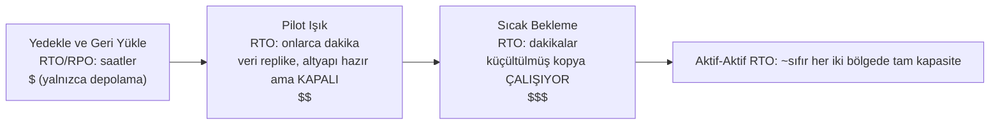

# Bölüm 18: Şeyler Arızalandığında

Işıklar saat 23:17'de söndü.

Nimbus ofisinde değil—Leo evdeydi, kanepede, dizüstü bilgisayarı yarı kapalı. Işıklar, Oregon'da hiç ziyaret etmediği bir veri merkezinde, hiç görmediği bir binada, hiç dokunmadığı sunucularla dolu bir odada söndü. Henüz bilmiyordu. Bir an—sadece bir an—uzakta bir yerde yedek jeneratörler devreye girmeden önce tam bir sessizlik oldu. Gözlerinizin açık mı kapalı mı olduğunu söyleyemediğiniz türden bir karanlık.

Sonra Slack bildirimi geldi.

---

Bölüm 17'deki izleme sistemleri devreye girdikten sonra, ekip güvene benzer bir şey hissetmişti. Uyarılar tetikleniyordu. Panolar yeşildi. Loglar CloudWatch'a akıyordu. Nimbus altyapısının her köşesine görünürlük kazandırmak için üç hafta harcamışlardı.

Kimsenin yüksek sesle söylemediği şey—izlemenin koruma sağlamadığı şey—görünürlük ile dayanıklılığın farklı şeyler olduğuydu. Bir şeyin başarısız olmasını mükemmel ayrıntıyla izleyebilirsiniz. İzlemek onu durdurmaz.

Bu ders bir Perşembe gecesi saat 23:23'te geldi.

---

Leo Slack bildirimini aldı.

"us-west-2 — veri merkezi kümesi arızası — azaltılmış hizmet."

AWS konsolunu açtı. Erişilebilirlik Bölgelerinden birindeki EC2 örnekleri durum kontrollerinde başarısız olduğunu gösteriyordu. Auto Scaling Grubu sağlıksız örnekleri tespit etmiş ve yerlerine yenilerini başlatıyordu—aynı bölgede.

Arızalanan kümede.

Yeni örnekler de başlayamadı. Aynı donanım arızası bölgesindeydiler.

"Yük dengeleyici trafiği her iki AZ'ye yönlendiriyor," dedi Leo kimseye. "Trafiğimizin yarısı çalışmayan örneklere gidiyor."

EC2 konsolunu açtı ve tıklamaya başladı. Load Balancers altında, Application Load Balancer her iki hedef grubunu da sağlıklı olarak gösteriyordu—çünkü sağlık kontrolü 80 numaralı bağlantı noktasında geçiyordu ve arızalanan örnekler bile bu kontrole yanıt veriyordu. Sadece gerçek istekleri işleyemiyorlardı.

Arızalanan AZ'yi hedef grubundan çıkarmaya çalıştı. Konsol değişikliği kabul etti. Ama dengeyi koruyacak şekilde yapılandırılmış Auto Scaling Grubu, sonlandırılan örneklerin yerine hemen yenilerini koymaya çalışmaya başladı—aynı arızalanan bölgede.

Leo ekrana baktı. Durumu daha da kötüleştirmişti.

ASG yapılandırmasını açtı. "Kapasiteyi Erişilebilirlik Bölgeleri arasında dengele" ayarı etkindi. Normal çalışmada bu iyi bir tasarımdı. Şu anda ise ona aktif olarak karşı koyuyordu.

ASG'yi yalnızca sağlıklı bölgeyi kullanacak şekilde değiştirdi. Değişikliği uyguladı.

Konsol değişikliği "Hizmette" olarak gösterdi.

Üç dakika sonra, ilk sağlıklı yedek örnekler devreye girdi.

Yük dengeleyici trafiği yönlendirmeye başladı. Hata oranı %52'den %4'e düştü. Kalan %4, hâlâ bağlantılarını boşaltan son birkaç sağlıksız örneğe ulaşan isteklerdi.

Saat 23:45'e kadar—arıza başladıktan yirmi iki dakika sonra—trafik kararlı hâle geldi.

Yirmi iki dakikalık azaltılmış hizmet, o fark edip ASG'yi manuel olarak yalnızca sağlıklı bölgeyi kullanacak şekilde değiştirmesinden önce yaşandı.

"Bu, her şeyin tek bir AZ'de olması nedeniyle oldu," dedi Priya ertesi sabah.

"Hayır," dedi Leo. "Örneklerim iki AZ'deydi. Sorun, yedek örneklerin arızalanan AZ'de oluşturulmasıydı."

"Ya veritabanı?"

Leo durdu.

"RDS birincil arızalanan bölgedeydi," dedi. "Multi-AZ aslında görevini yaptı—yaklaşık doksan saniyede sağlıklı bölgedeki beklemedeki örneğe geçiş yaptı. Ama uygulama sunucularımız ölü bağlantılarını açık tuttu ve uç noktanın DNS adını yeniden çözmek yerine önbelleğe alınmış IP adresini yeniden denedi. Veritabanı 23:25'te sağlıklıydı. Uygulamamız ben bağlantı havuzlarını yeniden başlatana kadar temiz bir şekilde yeniden bağlanmadı."

Yirmi iki dakikalık azaltılmış hizmet, otuz sekiz dakikaya çıkmıştı.

Leo, Auto Scaling Grubunu sekiz ay önce kurarken, "kapasiteyi AZ'ler arasında dengele" ayarını işaretlemiş ve bunun yeterince iyi olduğunu düşünmüştü. "İyi olacak," demişti o zaman Maya'ya. "AWS, AZ işlerini otomatik olarak halleder." AWS'nin bunu hallettiği konusunda haklıydı—ama "otomatik olarak" ne demek olduğu konusunda yanılmıştı.

"Ne olurdu," diye sordu Maya ertesi sabah, "her şeyi düzgün yapılandırsaydık? Gerçek bir arızada doğru Multi-AZ kurulumu nasıl görünür?"

Leo bunu düşündü. Saat 23:45'ten beri bunu düşünüyordu.

Varsayımsal doğru kurulumda: ASG, yalnızca EC2 durumuna değil, ALB sağlığına bakan örnek sağlık kontrollerine sahip olurdu. AZ arızalandığında, bu örneklerdeki sağlık kontrolü 30 saniye içinde başarısız olurdu. ASG arızaları tespit eder ve hemen yedekler başlatmaya başlardı—ve başlatmalar bir AZ'de sürekli başarısız olduğunda, grup arızalanan bölgeyle savaşmak yerine kapasiteyi kalan sağlıklı bölgelere kaydırırdı.

Yük dengeleyici, arızalanan AZ hedeflerini aynı 30 saniye içinde rotasyondan çıkarırdı. Trafik sağlıklı AZ'de yoğunlaşırdı.

Veritabanı için: Multi-AZ geçişinin kendisi çalışmıştı—eksik olan, istemci disiplini idi. Yeniden bağlantıda uç noktanın DNS adını yeniden çözen (IP'yi önbelleğe almak yerine) bağlantı havuzları, kısa DNS önbellek TTL'leri ve yeniden deneme mantığı. Bunlar yerinde olduğunda, bir RDS geçişi 16 dakikalık bir kuyruk değil, 60-120 saniyelik bir kesintidir.

Toplam müşteriye görünen etki: veritabanı geçiş yaparken 60-90 saniyelik azaltılmış gecikme. 38 dakikalık zincirleme hatalar değil.

"Bunu atlatmak için gereken tüm altyapıya sahiptik," dedi Leo. "Sadece yanlış yapılandırdık."

Bu cümleyi söylemek, asıl olayın kendisinden daha zordu.

**Elektrik Şebekesi Analojisi**

Evinizin elektriği nasıl aldığını düşünün. Elektrik, tek bir jeneratörden çıkan tek bir kablodan gelmez. Bir şebekeden gelir—birbirini destekleyen jeneratörler, trafo merkezleri ve iletim hatlarından oluşan bir ağ. Bir trafo merkezi yangın çıkarırsa, diğerleri gücü onun etrafından yeniden yönlendirir. Fark etmezsiniz. Işıklar yanmaya devam eder.

AWS Erişilebilirlik Bölgeleri aynı şekilde çalışır. Her şeyin bağlı olduğu tek bir dev veri merkezi yerine, AWS kaynaklarınızı birden fazla fiziksel olarak ayrı tesise yayar. Bir tesis güç kaybeder veya donanım arızası yaşarsa, diğerleri çalışmaya devam eder. Trafik otomatik olarak yeniden yönlendirilir. Uygulamanız çalışır durumda kalır—çünkü kesilecek tek bir kablo hiçbir zaman yoktu.

Bu **Multi-AZ mimarisidir**: kaynaklarınızı fiziksel olarak ayrı tesislere yayarak tek bir arızanın asla her şeyi çökertmemesini sağlamak.

Multi-Region bir sonraki seviyedir: tamamen farklı bir şehirde yedek jeneratörlere sahip olduğunuzu hayal edin. Tüm yerel elektrik şebekesi çökerse, uzaktaki şehir devreye girer. Kurulumu daha karmaşıktır, ancak felaket niteliğindeki arızalara karşı daha dayanıklıdır.

Şunu merak ediyor olabilirsiniz: Multi-AZ sadece kaynakları iki veri merkezine yaymak anlamına geliyorsa, AWS neden bunu her şey için varsayılan yapmıyor? Cevap maliyettir. Multi-AZ altyapıyı kabaca iki katına çıkarır—ve bir geliştirme ortamı veya düşük trafikli bir iç araç için, bu ekstra maliyet haklı çıkmaz. Üretim iş yükleri için ise soru tersine döner: buna sahip değilseniz kesinti süresini karşılayabilir misiniz?

**Arızanın Sözlüğü**

Dayanıklılık için tasarım yapmadan önce, neye karşı tasarladığınız için kelimelere ihtiyacınız vardır.

"Yeterince dayanıklı olup olmadığımızı nasıl ölçeriz ki?" diye sordu Priya.

"İki sayı," dedi Leo. "Ne kadar süre kapalı kalabiliriz ve ne kadar veri kaybedebiliriz."

**Erişilebilirlik (Availability)**: Bir sistemin çalışır durumda olduğu zamanın yüzdesi. "Dört dokuz" (%99,99) yılda 52 dakikadan az kesinti anlamına gelir. "Beş dokuz" (%99,999) yılda yaklaşık 5 dakika demektir.

**RTO (Recovery Time Objective — Kurtarma Süresi Hedefi)**: Bir iş sorunu hâline gelmeden önce sistem ne kadar süre kapalı kalabilir? RTO'nuz 4 saatse, SLA'lar ihlal edilmeden önce hizmeti geri yüklemek için 4 saatiniz vardır.

**RPO (Recovery Point Objective — Kurtarma Noktası Hedefi)**: Ne kadar veri kaybetmeyi göze alabilirsiniz? RPO'nuz 1 saatse, felaket niteliğindeki bir arızada bir saate kadar veri kaybını tolere edebilirsiniz. Arızadan önceki son saatte yazılan her şey gitmiştir.

**Arıza toleransı (Fault tolerance)**: Bir bileşen arızalandığında (bir düzeyde) çalışmaya devam etme yeteneği.

**Felaket kurtarma (DR)**: Felaket niteliğindeki bir arızadan—veri merkezi yangını, bölge genelinde kesinti, yanlışlıkla toplu silme—kurtulma süreci.

Bu beş kavram, bu bölümdeki her mimari kararı yönlendirir.

**RTO ve RPO Teknik Değil, İş Kararlarıdır**

Sayılar, onları kimin belirlediğinden daha az önemlidir. Bir mühendis RTO'yu tahmin edebilir. Bir iş paydaşı, 30 dakikalık bir kesintinin gerçekte ne kadara mal olduğunu bilir.

Aynı teknoloji yığınına sahip iki şirketi düşünün:

Aracılık işlemlerini işleyen bir fintech şirketi: 4 dakikalık RTO, sıfır RPO. Piyasa saatlerinde dört dakika kapalı kalan bir ticaret sistemi binlerce işlemi kaçırabilir. Kaçırılan her işlemin doğrudan bir dolar değeri vardır. Sıfır veri kaybı felsefi değildir—onaylanmış tek bir işlemi kaybetmek, uyumluluk sorunları ve müşteri davaları demektir. Bunu başarmak için mimari maliyet: senkron replikasyonlu aktif-aktif Multi-AZ, altı haneli yıllık altyapı bütçesi.

Bir restoran sipariş platformu: 30 dakikalık RTO, 5 dakikalık RPO. Akşam yemeği yoğunluğu sırasındaki 30 dakikalık bir kesinti gerçekten acı vericidir ve gerçek paraya mal olur. Ama bir arızadan önceki son 5 dakikalık siparişleri kaybetmek, birkaç müşterinin yeniden sipariş vermesi gerektiği anlamına gelir—can sıkıcı, ama felaket değil. Bunu başarmak için mimari maliyet: sıcak bekleme (warm standby) Multi-AZ, fintech bütçesinin bir kısmı.

"Bekle—ama bir restoran platformu *neden* 5 dakikalık veri kaybını kabul etsin ki?" diye sordu Maya, Leo bunu açıkladığında. "Bu hâlâ müşteri siparişlerini kaybetmek değil mi?"

"Soru, bu veri kaybını önlemenin değerinden daha pahalıya mal olup olmadığıdır," dedi Leo. "RPO'yu 5 dakikadan 0'a indirmek, bölgeler arası senkron replikasyon gerektirirdi. Bu önemli bir maliyet ve mühendislik yatırımıdır. Bizim ölçeğimizdeki bir restoran uygulaması için, 5 dakikalık RPO doğru takastır."

Ders: RTO ve RPO teknik minimumlar değildir. Sayılarla ifade edilen iş takaslarıdır. Bunları belirlemek hem mühendislik ekibini (neyin başarılabilir olduğunu bilen) hem de iş paydaşlarını (neyin kabul edilebilir olduğunu bilen) gerektirir.

**Multi-AZ: Erişilebilirlik Bölgesi Arızalarını Atlatmak**

Bir Erişilebilirlik Bölgesi (AZ), bir Bölge içinde fiziksel olarak ayrı bir veri merkezidir. AZ'ler bağımsız olacak şekilde tasarlanmıştır: ayrı güç kaynakları, ayrı soğutma, ayrı ağ altyapısı. Ancak aralarındaki ağ gecikmesinin 1-2 milisaniye olacağı kadar yakındırlar.

**Multi-AZ dağıtımları**, kaynaklarınızı bir Bölge içindeki iki veya daha fazla AZ'ye yayar. Bir AZ arızalanırsa:

- Yük dengeleyici, arızalanan AZ'deki sağlıksız örneklere yönlendirmeyi durdurur
- Auto Scaling Grubu örnekleri değiştirir—ancak *sağlıklı* AZ'de
- RDS, sağlıklı AZ'deki beklemedeki örneğe geçiş yapar

Leo'nun hatası: Auto Scaling Grubu, yedek örnekleri sağlıklı AZ'lerle sınırlayacak şekilde yapılandırılmamıştı. AZ'ler arasındaki dengeyi koruyacak şekilde yapılandırılmıştı. Bölge arızalandığında, ASG, oradaki—arızalanan bölgedeki—yedekleri başlatarak örnek sayısını dengelemeye çalıştı.

Düzeltme: ASG'yi yalnızca sağlıklı AZ'lere başlatacak ve her zaman en az iki AZ etkin olacak şekilde yapılandırın.

Daha derin ders: arıza senaryolarınızı üretimde gerçekleşmeden önce test etmek.

Multi-AZ'yi seçerseniz, otomatik geçiş ve sıfıra yakın RPO elde edersiniz—ama normal çalışma sırasında hiçbir trafiğe hizmet etmeyen altyapı için ödeme yaparsınız. O beklemedeki RDS örneği her zaman çalışır, her zaman replikasyon yapar ve birincil arızalanana kadar hiçbir sorgu yanıtlamaz. İşte takas budur: hiçbir şey bozuk olmasa bile güvenilirlik paraya mal olur.

**Kaos Mühendisliği: İlk Çalıştırma Nasıl Görünüyordu**

Nimbus'taki ilk kaos mühendisliği çalıştırması, dokümantasyonun kulağa hoş geldirdiği kadar temiz değildi.

Leo, çalışma kitabının 2. adımını çalıştırdı: bir RDS Multi-AZ geçişini zorla. AWS CLI'ı kullandı:

```
aws rds reboot-db-instance \
    --db-instance-identifier nimbus-prod \
    --force-failover
```

Komut hemen geri döndü. Leo zamanlayıcıyı başlattı.

T+0s: Geçiş başlatıldı. RDS konsolu birincil durumunu "yeniden başlatılıyor" olarak gösteriyor.

T+18s: Uygulama logları veritabanı bağlantı hatalarını göstermeye başlıyor. Bağlantı havuzu, artık birincil olmayan eski birincili deniyor.

T+34s: RDS konsolu durumu "yedekleniyor" olarak gösteriyor. Yeni birincil terfi ettiriliyor. DNS CNAME (veritabanı uç noktası) güncelleniyor.

T+52s: Uygulama logları yeniden başarılı bağlantılar göstermeye başlıyor. Bağlantı havuzu eski birincildeki yeniden denemeleri tüketti ve şimdi yeni birincili gösteren CNAME'e yeniden bağlandı.

T+4:17: Tüm bağlantılar yeniden kuruldu. Hata oranı sıfıra döndü.

Toplam: 4 dakika 17 saniye.

"Bu 257 saniyelik veritabanı erişilemezliği," dedi Tom. "Restoran ortaklarımızın tabletleri 4 dakika boyunca dönen bir gösterge gösteriyor."

"SLA'mız 5 dakika diyor," dedi Leo.

"Yani geçtik," dedi Priya. "Kıl payı."

"İki gözlem," dedi Tom. "Birincisi: geçtik çünkü RTO taahhüdümüz cömertti, mimarimiz özellikle hızlı olduğu için değil. İkincisi: ekstra 34 saniyeyi bize kazandıran şey bağlantı havuzunun yeniden deneme davranışıydı. Uygulama 10 saniye sonra pes etseydi, kalmıştık."

Leo, gözlemlenen zamanlamaları belgelemek için çalışma kitabını güncelledi. Bir sonraki çeyrek için hedef: bağlantı havuzu parametrelerini ve uygulamanın sağlık kontrolü mantığını ayarlayarak geçiş tespit süresini 52 saniyeden 30 saniyenin altına indirmek.

"Kaos mühendisliği tek seferlik bir test değildir," dedi Priya. "Bir geri bildirim döngüsüdür. Test edersiniz, gerçek sayıları bulursunuz, iyileştirirsiniz, tekrar test edersiniz."

Altı ay sonra geçiş testini üçüncü kez çalıştırdıklarında, kurtarma süresi 1 dakika 44 saniyeydi. RDS daha hızlı olduğu için değil—uygulamayı ayarladıkları için.

**Arızaları Simüle Etme: Kaos Mühendisliği**

"Multi-AZ kurulumumuzun gerçekten çalıştığını nasıl biliriz?" diye sordu Maya.

"Bilerek bir şeyleri kırarız," dedi Leo.

"Bekle—ama bunu *neden* o şekilde yaparız?" dedi Maya. "Neden AWS dokümantasyonunun çalıştığını söylemesine güvenmiyoruz?"

"Çünkü dokümantasyon hizmetin nasıl çalıştığını tarif eder. *Sizin yapılandırmanızın* nasıl çalıştığını tarif etmez. Bunlar farklı şeylerdir."

Priya öne eğildi. "Yük dengeleyici sağlık kontrolü ile ASG sağlık kontrolü çeliştiğinde ne olacağını düşündük mü? Yük dengeleyici bir örneği rotasyondan çıkarabilir, ama ASG örneğin sağlıklı olduğunu düşünür ve onu değiştirmez. Yük dengeleyiciye görünmeyen kapasitemiz olur."

"İşte tam da kaos mühendisliğinin bulacağı türden bir şey bu," dedi Leo.

Bu pervasızca geliyor. Aslında bir ekibin yapabileceği en sorumlu şeydir.

**RTO Taahhütlerini Test Etmek**

RTO hakkındaki rahatsız edici gerçek şu: çoğu ekip bir RTO belirler, sonra bunu gerçekten karşılayıp karşılayamayacaklarını asla test etmez.

30 dakikalık bir RTO bir garanti değildir. Bir hedeftir. Bunu tutturup tutturamayacağınızı bilmenin tek yolu, arızayı simüle etmek ve kurtarmayı zamanlamaktır.

Saat 23:23 olayından sonra, Nimbus ekibi her çeyrekte her arıza modunu test etmeye karar verdi. Sadece manuel olarak değil—yazılı kabul kriterleriyle. Bir AZ arızasından kurtarma 10 dakika içinde tamamlanmalıydı. Bir RDS geçişinden kurtarma 5 dakika içinde tamamlanmalıydı. Yedekten veritabanı geri yükleme (yedekle-ve-geri-yükle DR testi) 2 saat içinde tamamlanmalıydı.

Bu sayılar, akşam yemeği yoğunluğunda 10 dakikanın altındaki bir kesintinin "acı verici ama kabul edilebilir" olduğunu söyleyen restoran ortaklarıyla yapılan konuşmalardan geldi. 30 dakikanın üzeri bir sözleşme konuşmasıydı.

"SLA müzakeresi, RTO'yu belirlemeden önce yapılmalı," dedi Maya. "Sonra değil."

Haksız değildi. Bunu tersten yapmışlardı. RTO'yu dahili olarak belirlemiş, sonra işin gerçekte gerektirdiği şeye karşı kontrol etmeleri gerektiğini fark etmişlerdi.

RTO ve RPO'yu doğru sırada belirlemek: önce iş gereksinimi, sonra onu karşılayacak mimari, üçüncü olarak doğrulamak için test. Çoğu ekip mimariyle başlar ve geriye doğru çalışır. Sayılar bundan zarar görür.

**Kaos mühendisliği**, sisteminizin arızaları doğru bir şekilde ele aldığını doğrulamak için sisteminize kasıtlı olarak arıza enjekte etme uygulamasıdır. Bir EC2 örneğini bilerek sonlandırırsınız. RDS örneğini manuel olarak geçirirsiniz. Bir alt ağı yük dengeleyiciden engellersiniz.

Sistem RTO'nuz içinde otomatik olarak kurtulursa, tasarımınız işe yarar.

Kurtulmazsa, bunu kontrollü bir ortamda öğrenmiş olursunuz—gece 2'deki bir üretim olayı sırasında değil.

Nimbus için: Leo, her arıza senaryosunu test etmek için bir çalışma kitabı (belgelenmiş bir prosedür) yazdı. Çeyrekte bir kez, bir bileşeni kasıtlı olarak arızalandırıp kurtarma süresini ölçüyorlardı. Kurtarma RTO'dan uzun sürerse, tasarımı düzeltiyorlardı.

**Multi-Region: Bölgesel Arızaları Atlatmak**

Çoğu AWS arızası tüm Bölgeleri değil, Erişilebilirlik Bölgelerini etkiler. Bölgesel arızalar nadirdir—ama yaşanır.

Bir bölgesel arızada (veya her yerde çok düşük gecikme gerektiren küresel uygulamalar için), cevap **Multi-Region**'dır: uygulamanızı iki veya daha fazla AWS Bölgesinde dağıtın.

Multi-Region temel bir karmaşıklık getirir:

**Veri replikasyonu**: Veritabanlarınızın bölgeler arasında senkronize olması gerekir. us-east-1'de yazılan herhangi bir verinin eninde sonunda eu-west-1'e ulaşması gerekir. "Eninde sonunda" sorunun ta kendisidir—gecikme süresince, bölgelerin dünyaya dair biraz farklı görüşleri olur.

**Aktif-pasif vs aktif-aktif**:

- **Aktif-pasif**: Bir bölge tüm trafiğe hizmet eder. Diğeri sıcak bir beklemedir. Arıza durumunda, DNS trafiği beklemeye geçirir. Daha basittir, ama bekleme boştadır ve pahalıdır.
- **Aktif-aktif**: Her iki bölge de aynı anda trafiğe hizmet eder. Kurması daha karmaşıktır (eş zamanlı yazmalar için çakışma çözümü gerektirir), ama küresel olarak daha düşük gecikme ve boş kaynak yok.

Aktif-aktif, yazmaları dikkatlice düşünene kadar cazip gelir. Bir müşteri us-east-1'de bir sipariş verirse ve aynı anda restoran eu-west-1'de menüsünü güncellerse ve bölgeler arasında bir ağ bölünmesi varsa, hangi yazma kazanır? Bu, pratikte CAP teoremidir: dağıtık bir sistemde, bir ağ bölünmesi sırasında, tutarlılık (her iki bölge de aynı veride hemfikir) ile erişilebilirlik (her iki bölge de hemfikir olmasalar bile istek kabul etmeye devam eder) arasında seçim yapmalısınız. Aktif-aktif bu seçimi ortadan kaldırmaz. Onu açıkça, veri modelinizde yapmanızı gerektirir.

Nimbus için: aktif-pasif. Menü ve sipariş verilerinde eş zamanlı yazma çakışmalarını düşünmek istemiyorlardı. Tek bir yetkili birincil bölge, bu aşamada daha basit ve daha güvenliydi.

**Geçiş süresi**: DNS değişikliklerinin yayılması zaman alır (TTL'ye bağlı olarak). Yayılma penceresi sırasında, bazı kullanıcılar hâlâ arızalanan bölgeye ulaşır. Çok düşük RTO için tasarım yapmak, beklemeyi önceden ısıtmayı ve planlı geçişlerden önce TTL'yi en aza indirmeyi gerektirir.

**Route 53 DNS Geçişi: DR'nin Ağ Katmanı**

DR stratejileri spektrumunun tamamına geçmeden önce, DNS'in geçişe nasıl uyduğunu anlamaya değer—çünkü çoğu zaman bölgeler arasında trafiği gerçekten değiştiren şey odur.

**Amazon Route 53**, sağlık kontrolü tabanlı yönlendirmeyi destekler. Şunları yapılandırırsınız:

1. Birincil uç noktanızı izleyen bir sağlık kontrolü (genellikle sağlıklıysa 200 döndüren bir HTTP uç noktası)
2. Birincil bölgenizi gösteren bir birincil DNS kaydı
3. DR bölgenizi gösteren bir ikincil (geçiş) DNS kaydı

Route 53, birincil sağlık kontrolünün başarısız olduğunu tespit ettiğinde, DNS yanıtlarını otomatik olarak ikincil kayda geçirir. Etki alanınızı çözen kullanıcılar artık DR bölgesinin IP'sini alır.

"Peki geçiş penceresi sırasında biri içeri girmeye çalışırsa ne olur?" diye sordu Priya. "Etki alanımızın SSL sertifikası—her iki bölgede de çalışır mı, yoksa HTTPS bozulur mu?"

"Sertifikanın her iki bölgede de hazır olması gerekir," diye onayladı Leo. "ACM (AWS Certificate Manager) kullanıyorsanız, bu her bölgede bağımsız olarak bir sertifika talep etmek anlamına gelir."

Route 53 geçişinin mekaniği:

- Sağlık kontrolleri dünya çapında birden fazla AWS konumundan her 30 saniyede bir çalışır
- 3 ardışık başarısızlıktan sonra (90 saniye), Route 53 uç noktayı sağlıksız olarak işaretler
- DNS yanıtları hemen geçiş kaydına döner
- Ama: DNS TTL hâlâ geçerlidir. TTL'niz 300 saniyeyse, birincil IP'yi zaten önbelleğe almış istemciler arızalanan bölgeye 5 dakikaya kadar ulaşmaya devam eder

İşte bu yüzden TTL'yi düşürmek, felaket öncesi hazırlığın bir parçasıdır. TTL'yi bir olay sırasında değiştiremezsiniz (değişiklik zamanında yayılmaz). TTL değişikliği, ihtiyaç duyulmadan günler veya haftalar önce yapılmalıdır, böylece bir arıza meydana geldiğinde çözümleyici önbellekleri zaten kısa TTL'yi kullanıyor olur.

"Yani DNS TTL'sini düşürmek bir kurtarma eylemi değildir," dedi Leo. "Bir ön konumlandırma eylemidir."

"Bunu yaptık mı?" diye sordu Maya.

Yapmamışlardı.

O konuşmadan sonra, Leo eatnimbus.com için TTL'yi 300 saniyeden 60 saniyeye düşürdü. Değişiklik hiçbir maliyete yol açmadı ve en kötü durum geçiş sürelerini potansiyel olarak 8 dakikadan 3 dakikanın hemen altına iyileştirdi.

**Felaket Kurtarma Stratejileri: Bir Spektrum**

En ucuzdan (ve kurtarması en yavaş) en pahalıya (ve kurtarması en hızlı) doğru sıralanmış dört yaygın DR stratejisi vardır:



**Yedekle ve Geri Yükle (Backup and Restore)** (saatler RPO/RTO):

- Her şeyi farklı bir bölgedeki S3'e yedekleyin
- Felaket durumunda: altyapıyı sıfırdan oluşturun, yedekten geri yükleyin
- Maliyet: çok düşük (yalnızca depolama için ödüyorsunuz)
- Kurtarma süresi: saatler

**Pilot Işık (Pilot Light)** (dakikalar ila 1 saat RPO/RTO):

- Verileri sürekli olarak replike edin ve çekirdek altyapıyı DR bölgesinde *hazır ama kapalı* tutun—şablonlar, AMI'ler, durdurulmuş veya sıfır boyutlu kaynaklar. Hiçbir şey trafiğe hizmet etmez; yalnızca veri replikasyonu "yanmaktadır" (pilot ışık budur)
- Çekirdek veriler replike edilir (DR bölgesinde RDS okuma replikası)
- Felaket durumunda: DR bölgesinin işlem gücünü başlatın/ölçeklendirin, okuma replikasını birincile terfi ettirin, DNS'i geçirin
- (Aşağıdaki Sıcak Bekleme ile karşılaştırın: orada, uygulamanın küçültülmüş bir kopyası gerçekten *çalışıyordur*)
- Maliyet: orta (veri replikasyonu ve hazır-ama-kapalı kaynaklar için ödüyorsunuz, çalışan işlem gücü için değil)
- Kurtarma süresi: onlarca dakika

**Sıcak Bekleme (Warm Standby)** (saniyeler ila dakikalar RPO/RTO):

- Tam uygulamanın küçültülmüş bir sürümünü DR bölgesinde çalıştırın
- Tamamen çalışır durumda ama azaltılmış kapasitede
- Felaket durumunda: ölçeklendirin, DNS'i geçirin
- Maliyet: daha yüksek (tüm yığını azaltılmış ölçekte her zaman çalıştırıyorsunuz)
- Kurtarma süresi: dakikalar

**Aktif-Aktif / Çoklu Site (Active-Active / Multi-Site)** (sıfıra yakın RPO/RTO):

- İki veya daha fazla bölgede tam kapasite, aynı anda trafiğe hizmet eder
- Kurtarma gerekmez—bir bölge arızalanırsa, trafik otomatik olarak diğerine yönlenir
- Maliyet: en yüksek (tam ölçekte iki tam dağıtım)
- Kurtarma süresi: saniyeler (yalnızca DNS yayılımı)

Bu spektrumun ortasını otomatikleştiren bir hizmet vardır: **AWS Elastic Disaster Recovery (DRS)**, sunucularınızı—şirket içi veya EC2—blok blok düşük maliyetli bir hazırlık alanına sürekli olarak replike eder ve felaket geldiğinde dakikalar içinde tam kurtarma örnekleri başlatabilir. Aslında, bu *yönetilen bir pilot ışıktır*: yedekle-ve-geri-yükle fiyatlarına yakın fiyatlarla sıcak-beklemeye yakın kurtarma süreleri. Sınav sinyali: "sunucu tabanlı iş yükleri için yönetilen bir DR hizmetiyle kesinti ve veri kaybını en aza indirin" → Elastic Disaster Recovery.

Nimbus için bu aşamada: sıcak bekleme. Aktif-aktif'i karşılayamıyorlardı, ama yedekle ve geri yükle, iş gereksinimleri için çok yavaştı.

**Amazon RDS: Multi-AZ vs Okuma Replikaları vs Multi-Region**

Bu üçü farklıdır ve sıklıkla karıştırılır:

| Özellik       | Multi-AZ                     | Okuma Replikası     | Multi-Region Okuma Replikası |
|---------------|------------------------------|------------------|---------------------------|
| Amaç          | Yüksek erişilebilirlik (geçiş) | Okuma ölçeklendirme | Okuma ölçeklendirme + DR  |
| Veri senkr.   | Senkron                      | Asenkron         | Asenkron                  |
| Geçiş         | Otomatik                     | Manuel terfi     | Manuel terfi              |
| Okunabilir?   | Hayır (bekleme pasiftir)     | Evet             | Evet                      |
| Bölgeler arası? | Hayır (aynı bölge)         | Evet (isteğe bağlı) | Evet                   |
| Kullanım      | HA, RPO~0                    | Okuma yükü       | Felaket kurtarma          |

Temel kavrayış: Multi-AZ bekleme **senkrondur**—birincile yapılan her yazma, yazma onaylanmadan önce beklemede doğrulanır. Bu, birincil arızalanırsa hiç veri kaybedilmeyeceği anlamına gelir. RPO = 0.

Okuma replikaları **asenkrondur**—bir replikasyon gecikmesi vardır. Birincil arızalanır ve bir okuma replikasını terfi ettirirseniz, son yazmaların saniyelerini veya dakikalarını kaybedebilirsiniz. RPO > 0.

**Aurora Global Database: Üretim İçin Multi-Region**

Gerçek anlamda çok bölgeli dayanıklılığa ihtiyaç duyan ekipler için, **Aurora Global Database** denklemi değiştirir. Başka bir bölgedeki standart bir RDS okuma replikası, gecikmesi tipik olarak saniyelerle ölçülen asenkron replikasyon kullanır—yani bölgesel bir arıza o saniyelerdeki yazmaları kaybeder. Aurora Global Database, birincil bölge ile ikincil bölgeler arasında 1 saniyenin altında replikasyon gecikmesi sağlayan özel bir replikasyon altyapısı kullanır.

Ekip bunu olay sonrası incelemede tartıştığında, Leo karşılaştırmayı açtı:

- Standart RDS bölgeler arası okuma replikası: tipik olarak 1-10 saniye replikasyon gecikmesi, ağır yük altında dakikalara kadar çıkar. Bağımsız bir veritabanına terfi dakikalar sürer ve manuel adımlar içerir.
- Aurora Global Database ikincili: tipik olarak 1 saniyenin altında replikasyon gecikmesi. İkincilden birincile terfi 1 dakikanın altında sürer.

"Bu, eğer us-west-2 tamamen çökerse," diye açıkladı Leo, "1 saniyeden az potansiyel veri kaybımız olur ve bir dakika içinde us-east-1'den trafiğe hizmet edebiliriz demektir."

"Bu ayda ne kadara mal oluyor?" diye sordu Tom hemen.

Standart Multi-AZ'den daha fazla. Aurora Global Database, bölgeler arası replikasyon için yazma başına bir G/Ç ücreti ekler. Nimbus'un mevcut hacmi için, mevcut Aurora maliyetlerinin üzerine ayda 40-60 dolar eklerdi.

"İşte takas bu," dedi Leo. "Hız için ödeyin. Veya standart bir bölgeler arası okuma replikasının daha yavaş terfisini ve biraz daha yüksek RPO'sunu kabul edin."

Şimdilik Nimbus sıcak beklemede kaldı. Aurora Global Database, bir sonraki finansman turu için mimari istek listesine eklendi.

"Aynı geçiş penceresi, bir alt katman," dedi Priya. "Sertifikaları ele aldık. Şimdi kimlik bilgileri—bir örnekte rotasyona giriyorlar. Bekleme senkronize mi?"

Leo dokümantasyonu açtı. Güzel bir soruydu. RDS Multi-AZ verileri replike eder, gizli yapılandırmayı değil—Secrets Manager rotasyonu, geçiş çalışma kitabının bir parçası olarak test edilmeliydi.

## Güçlü Yönler ve Sınırlamalar

**Multi-AZ**:

- Üretim iş yükleri için zorunludur—tek-AZ tek bir arıza noktasıdır
- AWS hizmetleri tarafından iyi desteklenir (RDS, ElastiCache, EKS, ALB hepsi Multi-AZ'yi destekler)
- Sağladığı korumaya kıyasla nispeten düşük maliyet yükü
- AZ arızaları en yaygın AWS arıza kategorisidir—Multi-AZ en olası senaryoları kapsar

**Multi-Region**:

- Özellikle veritabanları için doğru uygulaması karmaşıktır
- Veri yerleşimi/egemenliği gereksinimleri aslında bunu gerektirebilir (AB kullanıcı verileri AB'de kalmalıdır)
- Küresel kullanıcılar için gecikme faydaları multi-region'ın kendisinden değil, yönlendirmeden gelir (statik içerik için CloudFront kullanın)
- Çoğu kuruluşun aktif-aktif'e ihtiyacı yoktur; çoğu sıcak beklemeye yeterince yatırım yapmaz
- Multi-Region sıcak beklemenin maliyeti önemsiz değildir, ama bölgesel bir arızanın maliyeti onsuz çok daha yüksek olabilir

**Multi-AZ'yi Ne Zaman Atlamalı** (nadir durumlar):

- Kesintinin kabul edilebilir olduğu geliştirme ve hazırlık (staging) ortamları
- SLA gereksinimi olmayan, gerçekten kritik olmayan iç araçlar
- Arızada basitçe yeniden çalıştırılabilen toplu (batch) iş yükleri

Multi-AZ'yi atlama baskısı neredeyse her zaman maliyetle ilgilidir. Bu argümanı kabul etmeden önce, olası arıza modlarının maliyetini hesaplayın: müşteri kaybı, SLA cezaları, kurtarma için mühendislik zamanı. Çoğu üretim ortamında, Multi-AZ sizi sabah 3'teki bir çağrıdan kurtardığı ilk seferde kendini amorti eder.

## Özet

Bölüm 17'deki izleme çalışması arızaları görünür kıldı. Bu bölüm, altyapının onlara dayanmasını sağlamakla ilgili. İkisi de önemlidir; hiçbiri diğeri olmadan yeterli değildir.

O Perşembe gecesi Nimbus olayı 38 dakikalık azaltılmış hizmete mal oldu. Üç yapılandırma hatası bir araya geldi: ASG yedek başlatmalardan arızalanan AZ'yi hariç tutmadı, RDS beklemesi tesadüfen arızalanan bölgedeydi ve kimse üretimde ona güvenmeden önce geçiş sürecini test etmemişti.

Üçü de bir öğleden sonrada düzeltilebilirdi. Olay, düzeltmeleri "en iyi uygulama dokümantasyonu"nun asla tam olarak yapamadığı bir şekilde acil hâle getirdi.

İşte kaos mühendisliği için dürüst gerekçe budur: titiz bir mühendislik uygulaması olduğu için değil (öyle olsa da), bir Oregon veri merkezinin donanım arızası yaşadığı geceye kadar teorik görünen yapılandırma hatalarını ortaya çıkardığı için.

- **RTO** (Recovery Time Objective): ne kadar süre kapalı kalabileceğiniz. **RPO** (Recovery Point Objective): ne kadar veri kaybedebileceğiniz.
- **Multi-AZ** kaynakları bir Bölge içindeki Erişilebilirlik Bölgeleri arasında yayar. AZ arızalarına karşı korur.
- **Multi-Region** birden fazla AWS Bölgesinde dağıtır. Bölgesel arızalara karşı korur ve küresel kullanıcılara daha düşük gecikmeyle hizmet eder.
- DR stratejileri (en ucuzdan en pahalıya): Yedekle ve Geri Yükle → Pilot Işık → Sıcak Bekleme → Aktif-Aktif.
- RDS Multi-AZ beklemesi: senkron, otomatik geçiş, bölge içinde RPO = 0. Okuma replikaları: asenkron, manuel terfi, RPO > 0.
- Arızalarınızı üretimde gerçekleşmeden önce kasıtlı olarak (kaos mühendisliği) test edin.

## Sınav İpuçları

*SAA-C03 Alanı: Dayanıklı Mimariler Tasarlama (Alan 2, Görev 2.2)*

- **RTO vs RPO**: Sınavın size gereksinimler vermesini ("kuruluş en fazla 1 saatlik kesinti ve hiç veri kaybı tolere edemez") ve doğru DR stratejisini seçmenizi istemesini bekleyin. Eşleyin: veri kaybı yok = senkron replikasyon = Multi-AZ veya aktif-aktif. 1 saatlik kesinti = yedekle-ve-geri-yükle çok yavaş; sıcak bekleme işe yarayabilir.
- **Multi-AZ RDS vs Okuma Replikaları**: Sınav, HA (Multi-AZ) ile okuma ölçeklendirme (okuma replikaları) arasında soru soracak. Multi-AZ beklemesi okunabilir değildir. Okuma replikaları DR için (manuel olarak) birincile terfi ettirilebilir.
- **Pilot Işık vs Sıcak Bekleme**: Pilot Işık'ta minimum altyapı çalışır (yalnızca veri replikasyonu). Sıcak Bekleme'de küçültülmüş ama işlevsel bir uygulama çalışır. Fark, ne kadar hızlı ölçeklendirebileceğinizdir.
- **Aurora Global Database**: Multi-region aktif-pasif için Aurora'ya özgü bir özellik. Birincil bölge yazmalara hizmet eder; ikincil bölgeler <1 saniye replikasyon gecikmesiyle okumalara hizmet eder. Geçişte, ikincil <1 dakikada terfi ettirilebilir. Sınav sinyali: "Aurora, multi-region, RTO < 1 dakika."
- **AWS Backup**: EBS, RDS, DynamoDB, EFS, Storage Gateway için merkezi yedekleme hizmeti. Sınav onu yedekle-ve-geri-yükle senaryoları için kullanır.
- **Elastic Disaster Recovery (DRS)**: "sunucular için (şirket içi veya EC2) minimum kesinti/veri kaybıyla yönetilen DR," "kendiniz kurmadan pilot ışık" → DRS (sürekli blok düzeyinde replikasyon + isteğe bağlı kurtarma başlatma).
- **Route 53 geçişi**: DR'nin DNS katmanı. Birincil sağlık kontrolü başarısız olur → Route 53 ikincile yönlendirir. Yayılma süresi bunun anında olmadığı anlamına gelir.

## Alıştırmalar

**Alıştırma 1 — Hatırlama**

RTO ile RPO arasındaki farkı açıklayın. Bir kuruluşun neden düşük bir RTO'ya (uzun süre kapalı kalamaz) ama yüksek bir RPO'ya (son verileri kaybetmeyi tolere edebilir) sahip olabilir?

*(İpucu: Her işlemi korumaktan çok müşterilere hızlı hizmet etmenin daha önemli olduğu bir işi düşünün.)*

**Alıştırma 2 — SAA-C03 Senaryosu**

*Senaryo*: Bir sağlık şirketi, `us-east-1`'de PostgreSQL uyumlu bir veritabanında bir hasta kayıtları sistemi çalıştırıyor. Düzenleyici gereksinimler, sistemin **tam bir bölgesel kesintiyi**, **saniyelerle** ölçülen bir RPO (sıfıra yakın veri kaybı) ve 30 dakikanın altında bir RTO ile atlatmasını zorunlu kılıyor. Birincil bölge içinde hiçbir veri kaybı kabul edilemez.

Bu gereksinimleri EN İYİ karşılayan mimari hangisidir?

A) `us-east-1`'de RDS Multi-AZ, `us-west-2`'deki S3'e günlük otomatik yedeklemelerle  
B) `us-east-1`'de RDS Multi-AZ, `us-west-2`'de manuel terfi için yapılandırılmış bir okuma replikasıyla  
C) `us-east-1`'de RDS, `us-west-2`'de sıcak bekleme ve aktif-aktif replikasyonla  
D) Birincili `us-east-1`'de ve ikincili `us-west-2`'de olan Aurora Global Database

**İpucu 1**: İki kapsamı ayırın. Bir bölge *içinde*, RPO = 0 senkron replikasyon demektir (Multi-AZ—ve Aurora'nın depolama katmanı 3 AZ arasında senkrondur). Bölgeler *arasında*, tüm gerçekçi seçenekler asenkron replike eder—soru, gecikmenin ne kadar küçük olduğudur.

**İpucu 2**: RTO = 30 dakika, kontrollü bir terfi için zamanınız olduğu anlamına gelir. Tam otomatik milisaniye geçişine ihtiyacınız yoktur.

**İpucu 3**: Her seçeneğin bölgeler arası RPO'sunu karşılaştırın: günlük yedeklemeler (saatler), RDS bölgeler arası okuma replikası (saniyeler ila dakikalar, yük altında sınırsız), Aurora Global Database (tipik olarak 1 saniyenin altında).

**Cevap**: D

**Açıklama**: Aurora Global Database, ikincil bölgeye depolama katmanında tipik olarak bir saniyenin altında gecikmeyle replike eder—bölgesel bir felaket için "saniyelerle RPO"yu karşılar—ve bir ikincil bir dakikanın altında terfi ettirilebilir, 30 dakikalık RTO içinde rahatça. Birincil bölge içinde, Aurora'nın depolaması üç AZ arasında senkron olarak replike edilir, bölge içi sıfır kayıp gereksinimini karşılar. **Nüansı ezberleyin**: Aurora Global bölgeler arasında *asenkrondur*—bölgeler arası RPO'su *sıfıra yakındır*, asla tam olarak sıfır değildir. Bir sınav sorusu mutlak RPO = 0 talep ediyorsa, bu *senkron* replikasyona eşlenir (Multi-AZ, tek bölge)—standart hiçbir bölgeler arası seçenek bunu sağlamaz.

**Neden A değil?** Günlük S3 yedeklemeleri, 24 saate kadar bölgeler arası RPO verir. Bu, bölgesel bir arızada saatlerce hasta verisi kaybı demektir.

**Neden B değil?** RDS bölgeler arası okuma replikaları, yük altında gecikmesi sınırsız büyüyebilen standart asenkron replikasyon kullanır—"saniyeler" dakikalara dönüşebilir. İşe yarar, ama saniyenin altında, depolama düzeyinde replikasyona sahip bir seçenek varken EN İYİ değildir.

**Neden C değil?** Bölgeler arası PostgreSQL için "aktif-aktif replikasyon" standart bir RDS özelliği değildir. Bu seçenek, önemli özel mühendislik gerektiren bir yetenek tarif eder.

*SAA-C03 Alanı: Dayanıklı Mimariler Tasarlama — Görev 2.2*

**Alıştırma 3 — Mimari Zorluk** *(İsteğe Bağlı)*

Nimbus, Seattle'daki büyük bir yemek festivali için sipariş hizmetleri sağlamak üzere seçildi. 72 saat boyunca, normal trafiklerinin 50 katını bekliyorlar ve kesintiye sıfır tolerans var (festival organizatörünün sözleşmesi, etkinlik sırasındaki herhangi bir kesinti için mali cezalar belirtiyor).

Özellikle festival penceresi için bir DR stratejisi tasarlayın. O 72 saat için aktif-aktif'e geçer miydiniz? Geçişi nasıl ön test ederdiniz? RTO'nuz ne olurdu ve onu etkinlikten önce nasıl doğrulardınız?

*(Tek bir doğru cevap yoktur. Amaç, belirli SLA gereksinimleri için DR tasarlama pratiği yapmaktır.)*

## Kredilerden Sonraki Sahne

Leo kaos mühendisliği çalışma kitabını oluşturdu.

Her çeyrek, planlı bir bakım penceresinde ekip:

1. Bir AZ'deki bir EC2 örneğini sonlandırıp ASG'nin onu sağlıklı bölgede doğru şekilde değiştirmesini izlerdi
2. Manuel olarak bir RDS Multi-AZ geçişini zorlar ve uygulamanın 60 saniye içinde yeniden bağlandığını doğrulardı
3. ASG'nin erişilebilirlik bölgelerini ayarlayarak tam bir AZ arızasını simüle ederdi
4. Bir haftalık eski bir yedeği yeni bir RDS örneğine geri yükler ve verilerin doğru göründüğünü doğrulardı

İlk çalıştırma—5 dakikalık SLA'larını kıl payı geçen 4 dakika 17 saniyelik geçiş—marjın ne kadar ince olduğunu onlara çoktan göstermişti.

"Tutturamadığımızda sözleşmelerde mali bir ceza var," dedi Tom.

"O zaman daha hızlı yapmalıyız," dedi Leo. Ve dakikalar değil, saniyeler içinde geçiş vaat eden yönetilen bir veritabanı için dokümantasyonu okumaya başladı.

Sonraki bölümde: Nimbus'un her parçasının kendi hızında çalışmasını sağlayan bilet makinesi.
