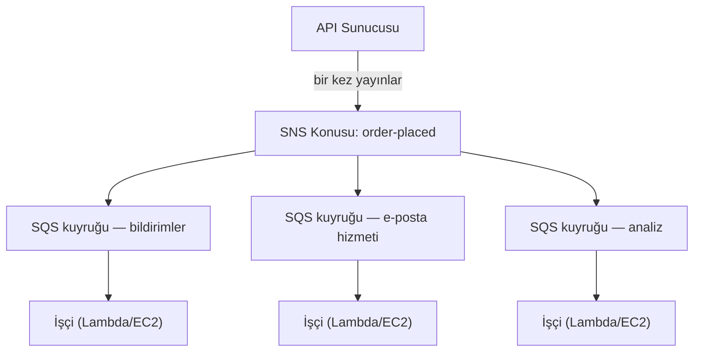

# Bölüm 19: Bilet Makinesi

Bilet makinesi sessiz bir devrimdi. Bir numara alın, çağrılmayı bekleyin. Sıra, bir kuyruğa dönüştü. İnsanlar oturabiliyordu. Hizmet masası kendi hızında çalışıyordu. Kimse kimseyi engellemiyordu.

Bilet makinesinden önce, sırada beklemek zorundaydınız. Sıradaki konumunuz fiziksel varlığınızı gerektiriyordu. Beklerken başka bir şey yapamazdınız. Ve sıranın başındaki kişi yavaşsa, arkasındaki herkes dururdu.

Bilet makinesi, varışı hizmetten ayırdı. Geldiniz, bir numara aldınız ve sistem yerinizi hatırladı. Gidip oturabilirdiniz. Hizmet masası, idare edebildiği hızda numaralarla çalışırdı. Masa geçici olarak kapalıysa, yeni gelenler yine de numara alırdı. Beklerlerdi. İş kaybolmazdı—kuyruğa girerdi.

Bu küçük buluş, insan sistemlerindeki en eski ayrıştırma (decoupling) örneklerinden biridir. Bu bölümün sonunda, Nimbus kendi bilet makinesini—yazılımda—inşa etmiş olacak ve buna neden ihtiyaç duyduğu, bir Cuma akşamı yaşanan on altı dakikalık kesintiyle başlıyor.

---

Ekip AZ arızasını atlatmıştı. Leo kaos mühendisliği sürecini düzeltmişti ve çalışma kitabı sağlamdı. Trafik toparlanmış ve yeniden büyüyordu—aslında öncekinden daha hızlı. Leo'nun gece geç saatlerde okuduğu Aurora dokümantasyonu, hâlâ Nimbus'un gerçekte bulunduğu noktanın birkaç bölüm ilerisindeydi.

Ama trafik büyüdükçe ve daha fazla restoran katıldıkça, farklı türde bir darboğaz görünür hâle geliyordu. Altyapıda değil. Uygulama kodunun kendisinde. Saatte 200 siparişte gayet iyi çalışan istek zinciri, 800'de zorlanmaya başlıyordu.

Ve sonra 14'ünün akşamı geldi.

---

Analiz panosuyla başlamıştı. Bir Cuma akşamı saat 18:47'de, analiz hizmetine yapılan bir dağıtım, bir zaman aşımı hatası getirdi. Hizmet, her zamanki 200 milisaniye yerine 8 saniyede yanıt vermeye başladı.

Sipariş akışı senkrondu. Her sipariş, müşteriye onaylanmadan önce analiz hizmetini bekliyordu. Yük arttıkça sekiz saniye 12'ye çıktı. API'nin bağlantı havuzu, analiz adımının tamamlanmasını bekleyen isteklerle dolmaya başladı.

Saat 18:53'te, bağlantı havuzu sınırına ulaştı. Yeni istekler hemen başarısız olmaya başladı—sipariş işlenemediği için değil, işlemeye başlayacak kullanılabilir bağlantı olmadığı için.

"Analiz hizmeti sipariş akışını çökertti," dedi Leo, ertesi sabah logları incelerken. "Birbirleriyle hiçbir ilgileri yok. Analiz hizmeti sadece panoları hesaplıyor."

"Ama aynı istek zincirindeler," dedi Priya.

"On altı dakikalık kesinti," dedi Maya. "Ve üç müşteriden iki kez ücret alındı."

Çift ücretlendirme, kesintiden daha kötüydü. Bağlantı havuzu doygunluğunun kaosunda, aslında başarılı olmuş bazı istekler için bir yeniden deneme mekanizması tetiklenmişti—ödeme adımı tamamlandı, sonra istek geri dönmeden zaman aşımına uğradı ve yeniden deneme ödemeyi tekrar denedi. Aynı kart, aynı tutar, iki ücret.

"Yeniden deneme mekanizmasının yardımcı olması gerekiyordu," dedi Leo.

"Yanlış yönde yardım etti," dedi Priya. "Ve o müşterilere geri ödeme yapmaya çalıştığımızda ne olacağını düşündük mü? Geri ödeme süreci, başarısız olan aynı sipariş akışını kullanıyor."

On altı dakikalık kesinti ve üç çift ücretlendirme. Senkron istek zincirinin iş maliyeti buydu.

---

Nimbus'un, siparişler popüler olana kadar bir sorun gibi hissettirmeyen bir sorunu vardı.

Her sipariş verildiğinde, API sunucusunun şunları yapması gerekiyordu:

1. Siparişi veritabanına kaydet
2. Restoranın tabletine bir bildirim gönder
3. Müşteriye bir onay e-postası gönder
4. Restoranın analiz panosunu güncelle
5. Faturalandırma için olayı kaydet

Yoğun bir şarküteri tezgâhında, kasadaki kişi bir sonraki müşteriye geçmeden önce dilimleyenin dilimlemeyi bitirmesini beklemez. Siparişi alır, mutfağa verir ve bir sonraki kişiye hizmet etmeye başlar. Mutfak siparişleri kendi hızında işler. Müşteri daha hızlı hizmet alır. Mutfak ani patlamalarla boğulmaz. Mutfak yavaş bir an yaşarsa, siparişler kasada hatalara neden olmak yerine tezgâhın arkasında birikir.

İşte analoji buydu. Nimbus'un bir tezgâhı ve bir mutfağı yoktu. Müşteri ayrılmadan önce her şeyi sırayla yapan tek bir kişisi vardı.

Ve 14'ünde, et kesen kişinin bir sorunu vardı. Bu yüzden tezgâh durdu. Bu yüzden ondan sonraki her müşteri bekledi. Mutfak, kasa, müşteriler—hepsi durakladı çünkü zincirdeki bir adım yavaşlamıştı.

Çözüm et kesmeyi hızlandırmak değildi. Çözüm, adımları ayırmaktı. Siparişi kasada al, bir bilet ver, mutfağın çalışmasına izin ver.

"Sıkı sıkıya bağlıyız (tightly coupled)," dedi Priya. "Herhangi bir alt akış adımı başarısız olursa, tüm sipariş başarısız olur. Analiz hizmeti ele geçirilir ve hatalı biçimlendirilmiş mesajları tüketmeye başlarsa ne olacağını düşündük mü? Tüm sipariş başarısız olur—çünkü onu bekliyoruz."

"Ya siparişi kaydedip müşteriye hemen onay verebilseydik," dedi Leo, "ve sonra geri kalanını arka planda işleseydik?"

"Bu bir kuyruk," dedi Priya.

Temel kavrayış: müşterinin, onayını almadan önce analiz panosunun güncellendiğini bilmesine gerek yoktur. Siparişlerinin alındığını bilmeleri gerekir. Bunlar farklı şeylerdir. Senkron zincir onları birbirine karıştırdı.

**Ayrıştırma Modeli**

Bu **ayrıştırmadır (decoupling)**: işi kabul eden bileşeni, onu işleyen bileşenlerden ayırmak.

Nimbus'un sipariş akışındaki tüm adımların, API müşteriye yanıt verebilmeden önce senkron olarak gerçekleşmesi gerekiyordu. E-posta hizmeti yavaşsa (bazen öyleydi), müşteri bekledi. Analiz panosu kapalıysa (bazen öyleydi), sipariş başarısız oldu.

14'ündeki çağlayan etkisi, bunun neden önemli olduğunu tam olarak gösterdi. Analiz hizmetinin, bir müşterinin siparişinin kabul edilip edilmemesiyle hiçbir ilgisi yoktu. Ama aynı senkron zincirde oturduğu için, onun arızası herkesin arızası oldu.

Yazılım sistemlerinde, kuyruk genellikle bir mesaj aracısıdır (message broker)—üreticilerden mesaj kabul eden ve onları tüketicilere ulaştıran bir hizmet.

Şunu merak ediyor olabilirsiniz: sipariş akışı artık asenkronsa, müşteri siparişinin gerçekten alındığını nasıl bilir? Cevap, mimari tasarımdadır: API, siparişi veritabanına kaydeder (senkron—yetkili onay budur), sonra olayları kuyruğa yayınlar. Müşteri onayı, alt akış hizmetlerinin tamamlanmasına değil, veritabanı yazmasının başarılı olmasına dayanır. E-posta hizmeti yavaşsa, müşteri zaten onayını almıştır. E-posta sadece güzel bir takip ekidir.

**Amazon SQS: Kuyruk**

**Amazon SQS (Simple Queue Service)**, AWS'nin yönetilen mesaj kuyruğu hizmetidir. Mesajları, bir tüketici tarafından işlenene kadar dayanıklı bir şekilde saklar.

Temel akış:

1. **Üretici** (API sunucusu) kuyruğa bir mesaj yerleştirir: `{ "orderId": "ORD-5532", "restaurantId": "47", "items": [...] }`
2. API müşteriye hemen yanıt verir: "Sipariş onaylandı!"
3. **Tüketiciler** (ayrı işçi hizmetleri) kuyruktan mesajları okur ve onları işler: restoran bildirimini gönder, onay e-postasını gönder, analizi güncelle

Müşteri deneyimi: anında onay. Alt akış işleme: asenkron olarak, işçilerin hızında gerçekleşir.

**SQS Temel Kavramları**

**Mesaj görünürlük zaman aşımı (visibility timeout)**: Bir tüketici SQS'den bir mesaj okuduğunda, mesaj bir süre boyunca (varsayılan: 30 saniye) diğer tüketicilere *görünmez* hâle gelir. Bu, tüketiciye onu işlemesi için zaman verir. Tüketici başarıyla bitirirse, mesajı siler. Tüketici çökerse, görünürlük zaman aşımı dolar ve mesaj başka bir tüketicinin yeniden denemesi için tekrar görünür hâle gelir.

Bu, en az bir kez teslimatı (at-least-once delivery) sağlar: bir tüketici işlemenin ortasında başarısız olsa bile, her mesaj en az bir kez işlenir.

Şunu merak ediyor olabilirsiniz: mesaj işlenirken görünmez hâle geliyor ama tüketici çöktüğünde silinmiyorsa, iki kez işlenemez mi? Evet—ve buna en az bir kez teslimat denir. Bu, her tüketicinin aynı mesajı birden fazla kez almayı bir soruna yol açmadan ele alacak şekilde tasarlanması gerektiği anlamına gelir. Yinelenen bir sipariş onay e-postası can sıkıcıdır. Yinelenen bir ücret ise bir destek talebidir. Tüketicilerinizi buna göre tasarlayın.

Görünürlük zaman aşımı, beklenen en uzun işleme sürenizden daha uzun olmalıdır. İşleme tipik olarak 20 saniye sürüyor ama zaman zaman 90 saniye sürüyorsa ve görünürlük zaman aşımınız 30 saniyeyse, o ara sıra olan 90 saniyelik işleme SQS'ye bir başarısızlık gibi görünecektir. Mesaj tekrar görünür olur. İkinci bir tüketici onu alır. Şimdi iki işçi aynı mesajı işliyor. İşlemeniz idempotent değilse, bir sorununuz var demektir.

Yaygın bir hata: görünürlük zaman aşımını ortalama işleme süresine eşit ayarlamak. Doğru yaklaşım: onu güvenlik payıyla birlikte 99. yüzdelik işleme süresine ayarlamak. P99 işleme süresi 45 saniyeyse, görünürlük zaman aşımını 90 saniyeye ayarlayın.

**Ölü mektup kuyrukları (DLQ)**: Bir mesaj işleme çok fazla kez başarısız olursa (yapılandırılabilir—örneğin, 5 yeniden deneme), SQS onu bir ölü mektup kuyruğuna taşır. Mesajları kaybetmeden neden başarısız olduklarını anlamak için DLQ'yu incelersiniz.

DLQ, üretimde gerçekte neyin başarısız olduğunu öğrendiğiniz yerdir. Onsuz, başarısız mesajlar basitçe kaybolur ve araştırmanın hiçbir yolu kalmaz.

SQS göçünden üç hafta sonra, Leo bildirim hizmetinin DLQ'sunda 23 mesajın biriktiğini fark etti. DLQ'yu kontrol etmiyordu (onu doğru kurmuş, sonra boş kalacağını varsaymıştı).

Bir mesaj çekti ve yükü inceledi:

```json
{
  "orderId": "ORD-9821",
  "restaurantId": "12",
  "customerMessage": "Extra spicy please 🌶️🔥",
  "timestamp": "2024-01-18T19:43:11Z"
}
```

Emoji. Restoran bildirim hizmeti, mesaj yüklerini restoranın eski tablet API'sine göndermeden önce Latin-1 olarak kodluyordu. Emoji karakterleri—UTF-8'de her biri dört bayt—bozuluyor ve tablet API'sinin isteği reddetmesine neden oluyordu. Mesaj yeniden denenir, tekrar başarısız olur, tekrar denenir, tekrar başarısız olurdu. 5 yeniden denemeden sonra, SQS onu DLQ'ya taşırdı.

"23 mesajın hepsinde müşteri notları alanında emoji var," dedi Leo.

"Yani sipariş notlarına emoji ekleyen her müşterinin notu, restorana sessizce ulaşamadı," dedi Maya.

"Evet."

"Ne kadar süredir?"

Leo en eski mesajın zaman damgasını kontrol etti. "Üç hafta."

Priya sessizdi. "Ya birisi bir sipariş notuna emoji eklemenin sessiz bir başarısızlığa neden olduğunu çözseydi? Emojiyle siparişler verir ve restoranın talimatı asla görmediğini garanti edebilirdin. Sonra yanlış siparişten şikâyet edersin."

Kimse bunu istismar etmemişti. Ama sorulması gereken doğru soruydu.

Leo kodlama hatasını düzeltti. Sonra DLQ'dan mahsur kalmış 23 mesajın tümünü yeniden oynatmak için bir komut dosyası yazdı. Restoranlar (üç hafta eski) acılı emoji talimatlarını aldı. Müşteriler hiçbir zaman öğrenmedi.

Ders: DLQ aktif olarak izlenmelidir, kurulup unutulmamalıdır. Büyüyen bir DLQ, bir şeyin tekrar tekrar başarısız olduğunun sessiz bir sinyalidir.

**Kuyruk türleri**:

**Standart kuyruklar**: Maksimum verim (saniyede sınırsız mesaj). Teslimat sırası en iyi çabaya dayanır (garanti edilmez). En az bir kez teslimat (çok nadiren, bir mesaj iki kez teslim edilebilir).

**FIFO kuyruklar**: Katı ilk giren ilk çıkar (first-in, first-out) sıralaması. Tam olarak bir kez **işleme**—5 dakikalık bir pencere içinde bir `MessageDeduplicationId`'ye dayalı yinelenenlerin kaldırılması (deduplication). Sıralama, `MessageGroupId` *başına* garanti edilir: aynı gruptaki mesajlar sırayla gelir; farklı gruplar paralel olarak işlenebilir, FIFO'nun ölçeklenme şekli budur. Temel verim, gruplandırmayla saniyede 3.000 mesajdır (gruplandırma olmadan 300); **yüksek verim modunu** etkinleştirmek, mesaj grupları arasında bölümleyerek bunu saniyede on binlere yükseltir. Sıranın önemli olduğu durumlarda FIFO kullanın (finansal işlemler, sıralı durum değişiklikleri).

Maksimum verime ihtiyacınız varsa ve ara sıra yinelenen mesajları tolere edebiliyorsanız, SQS Standard kullanın—ama her tüketiciyi yinelenenleri sorun çıkarmadan ele alacak şekilde tasarlamalısınız. Katı sıralama ve tam olarak bir kez işlemeye ihtiyacınız varsa, SQS FIFO kullanın—ve `MessageGroupId`'lerinizi iyi tasarlayın, çünkü paralellik (ve dolayısıyla verim) çok sayıda gruba sahip olmaktan gelir.

Nimbus için, çoğu kuyruk standart kuyruklar kullanıyordu. Faturalandırma kuyruğu, ücretlerin sırayla işlenmesini sağlamak için FIFO kullanıyordu.

**Kuyruk Derinliği Otomatik Ölçeklendirme: İşçileri Birikime Uyacak Şekilde Ölçeklendirmek**

SQS'nin en güçlü uygulamalarından biri, kuyruk derinliğini bir Auto Scaling tetikleyicisi olarak kullanmaktır. CPU veya belleğe göre ölçeklendirmek yerine, ne kadar işin beklediğine göre ölçeklendirirsiniz.

Nimbus'un bildirim hizmeti için: SQS kuyruk derinliği (işlenmeyi bekleyen mesaj sayısı), bildirim işçilerini çalıştıran ECS hizmeti için bir Application Auto Scaling politikasına bağlanmıştı.

Politika: kuyrukta işçi görevi başına 50'den fazla mesaj olduğunda, bir görev ekle. Kuyrukta işçi görevi başına 10'dan az mesaj olduğunda, bir görev kaldır.

Pratik etki: Cuma akşam zirvesinde 1.200 sipariş geldiğinde, bildirim kuyruğu derinliği fırladı ve işçi filosu 3 dakika içinde 2 görevden 8 göreve ölçeklendi. Gece yarısına kadar kuyruk boştu ve filo tekrar 2'ye dönmüştü.

"Bu ayda ne kadara mal oluyor?" diye sordu Tom, Auto Scaling grafiğine bakarak.

"Auto Scaling'in kendisi için ekstra bir şey yok," dedi Leo. "Ama Cuma akşamları 3 saat boyunca 6 ekstra ECS görevi—bu önemli."

Tom hesapladı. "Bu zirveler için ayda yaklaşık 14 dolar. Ve önceden, tam maliyetle sürekli 8 görev mi çalıştırıyorduk?"

"Evet."

"Yani ihtiyaç duyduğumuzda patlama için ödüyoruz ve aksi takdirde hiçbir şey ödemiyoruz."

Bu, kuyruk derinliği ölçeklendirme kalıbıdır: kuyruk, trafik zirvelerini emen bir tampon hâline gelir ve işçi filosu tamponu boşaltmak için ölçeklenir. Kullanıcılar yavaşlık yaşamaz—sipariş kabul edildiğinde onaylarını hemen aldılar. İşçiler sadece yetişmek için biraz daha uzun sürer. Ve zirve kapasitesini 7/24 çalıştırmadığınız için, maliyetler önemli ölçüde daha düşüktür.

**Amazon SNS: Yayıncı**

**Amazon SNS (Simple Notification Service)**, bir yayınla/abone ol (publish/subscribe, pub/sub) mesaj hizmetidir. Tek üretici, tek tüketici (kuyruk) yerine, SNS bir mesajın *birçok* aboneye aynı anda teslim edilmesini destekler.

Model:

1. Bir **yayıncı** bir SNS **konusuna (topic)** bir mesaj gönderir
2. O konunun tüm **aboneleri** mesajı aynı anda alır (fan-out)

Aboneler şunlar olabilir:

- SQS kuyrukları (asenkron işleme için mesajı bir kuyruğa iter)
- Lambda fonksiyonları (fonksiyonu doğrudan tetikler)
- HTTP/HTTPS uç noktaları (webhook teslimatı)
- E-posta adresleri
- SMS (telefon numaraları)

Nimbus için, sipariş-verildi olayı `order-events` adlı bir SNS konusuna yayınlanır:

- Restoran bildirim hizmeti abone olur (kendi SQS kuyruğuna alır)
- E-posta hizmeti abone olur (kendi SQS kuyruğuna alır)
- Analiz hizmeti abone olur (kendi SQS kuyruğuna alır)
- Faturalandırma hizmeti abone olur (kendi FIFO SQS kuyruğuna alır)

Tek bir sipariş olayı. Dört abone. Hepsi aynı anda bilgilendirilir. Her biri kendi hızında işler.

"Yani SNS duyurudur," dedi Maya, "ve SQS her ekibin duyuruyu kendi hızında işlediği gelen kutusudur. O zaman neden ikisini de kullanalım? Neden herkes doğrudan SNS konusuna abone olmasın?"

"Çünkü doğrudan SNS teslimatı 'ateşle ve unut'tur," dedi Leo. "SNS tetiklendiğinde analiz hizmeti kapalıysa, o mesaj gitmiştir. Arada bir SQS kuyruğu olduğunda, mesaj hizmet kurtarılana kadar bekler."

"Aynen," dedi Priya. "SNS/SQS fan-out standart kalıptır."

**SNS/SQS Fan-Out Kalıbı**

Bu kombinasyon—birden fazla SQS kuyruğunu besleyen bir SNS konusu—AWS'deki en önemli mimari kalıplardan biridir:



Her kuyruk bağımsızdır. Analiz hizmeti yavaş olabilir—kuyruğu dolar, ama bildirim ve e-posta hizmetleri etkilenmeden devam eder. Analiz hizmeti çökerse, mesajları geri gelene kadar kuyrukta bekler. Hiçbir şey kaybolmaz.

İşte temel özellik budur: **bağımsız arıza (independent failure)**. Bir tüketicideki sorunlar diğerlerine yayılmaz.

**Mesaj Filtreleme: Her Mesaj Her Abone İçin Değil**

Sistemler büyüdükçe, her abonenin her mesajı işlemesini istemezsiniz. Bir analiz hizmeti, yalnızca tamamlanmış siparişleri önemsiyorsa, başarısız ödeme işleme hakkında mesajlar almamalıdır.

**SNS mesaj filtreleme**, abonelerin filtre politikaları belirtmesine olanak tanır—yalnızca belirli özelliklere uyan mesajları teslim eder.

Restoran bildirim hizmeti bir filtreyle abone olur: yalnızca `status = "confirmed"` olan mesajlar.

Hata uyarı hizmeti bir filtreyle abone olur: yalnızca `status = "failed"` olan mesajlar.

Her abone yalnızca ihtiyacı olanı alır.

Filtreleme olmadan, her abone her mesajı alır ve alakasız olanı yok saymak zorunda kalır. Bu işlemeyi boşa harcar, parayı boşa harcar (SQS mesaj başına ücret alır) ve gürültü getirir. Filtrelemesiz yüksek hacimli bir sipariş sistemi, hata uyarı kuyruğunu başarılı siparişlerle doldururdu—gerçek arızaları bulmayı zorlaştırırdı.

Filtre politikaları şuna benzer:

```json
{
  "status": ["confirmed"],
  "region": ["us-west-2", "us-east-1"]
}
```

Bu abone, yalnızca status'ün "confirmed" VE region'ın ya "us-west-2" ya da "us-east-1" olduğu mesajları alır. Politikayla eşleşmeyen mesajlar bu abonenin kuyruğuna hiç teslim edilmez—SQS'ye bile asla ulaşmazlar.

"Yani filtreleme SNS katmanında gerçekleşiyor," dedi Priya, "mesajlar SQS'ye yazılmadan önce mi?"

"Doğru. Restoran bildirim hizmetinin SQS kuyruğu, yalnızca üzerinde harekete geçmesi gereken mesajları görür."

"Peki birisi tüm abone filtreleriyle eşleşen özel olarak hazırlanmış bir mesajı SNS konusuna yayınlayarak içeri girmeye çalışırsa?" diye sordu Priya.

SNS konusunda bir IAM kaynak politikası vardı: yalnızca sipariş API hizmetinin (IAM rolüyle) yayın yapmasına izin veriliyordu. SNS erişim politikaları ve SQS kuyruk politikaları erişim kontrol katmanını oluşturuyordu—filtreleme yalnızca yönlendirme içindi, güvenlik için değil.

**SQS vs SNS Ne Zaman Kullanılır**

**Yalnızca SQS**: Bir üretici, bir tüketici (veya aynı kuyrukta birden fazla rekabet eden tüketici). Mesajların bir kez işlenmesi gerekir, sırayla (FIFO) veya değil (standart). İşçi kuyruğu kalıbı—bir kuyruk, ondan tüketen birden fazla işçi.

**Yalnızca SNS**: Ateşle-ve-unut bildirimleri. E-posta, SMS veya HTTP uç noktalarına it. Mesajı kuyruğa almaya gerek yok—sadece bildir ve devam et.

**SNS + SQS (fan-out)**: Bir olay, birden fazla bağımsız tüketici. Her tüketicinin kendi kuyruğu vardır, bağımsız olarak işler ve bağımsız olarak başarısız olabilir.

## SNS FIFO Konuları

SNS hakkında yukarıdaki her şey standart konular kullanır—pratikte sınırsız verime sahiptirler, abonelere neredeyse aynı anda teslim ederler ve kullanım durumlarının büyük çoğunluğu için işi görürler.

Ama standart SNS konuları sıralamayı garanti etmez. Sırayla on mesaj yayınlarsanız, aboneler bunları biraz farklı bir sırada alabilir. Nimbus sipariş bildirimleri için bu sorun değil—bir analiz güncellemesinin bir e-posta onayından saniyenin bir kısmı önce gelmesi önemli değil.

Bazı senaryolar için önemlidir. Bir finansal defteri düşünün: iki olay—bir alacak ve sonra bir borç—ters sırada teslim edilirse, her iki olay sonunda doğru işlense bile işleme sırasındaki bakiye hesaplamaları yanlış olur.

**SNS FIFO konuları**, SQS FIFO kuyruklarıyla aynı ilkeyi fan-out modeline uygular. Mesajlar abonelere yayınlandıkları tam sırayla teslim edilir ve her mesaj tam olarak bir kez teslim edilir.

Takas: SNS FIFO konuları, SQS FIFO'ya benzer bir temel verime sahiptir (konu başına saniyede 3.000 mesaj; mesaj grubu başına saniyede 300—2025'ten beri çok daha fazlası için bir yüksek verim modu mevcut) ve yalnızca **SQS kuyruklarına** fan-out yapar—FIFO veya 2023'ten beri Standard. Standart bir kuyruğa abone olmak, sırayı önemsemeyenler için yararlıdır (örneğin bir analiz beslemesi), ama sıralama ve tam olarak bir kez uçtan uca **yalnızca** FIFO kuyruklarına korunur. Bir SNS FIFO konusunu HTTP uç noktalarına veya e-posta adreslerine teslim etmek için kullanamazsınız.

Nimbus'un faturalandırma hattı için—bir dizi fiyatlandırma güncellemesinin restoran hesaplarına sırayla uygulanması gerektiği yerde—faturalandırma SNS konusu standarttan FIFO'ya geçirildi. SQS faturalandırma kuyruğu zaten FIFO idi. Fan-out artık bir fiyat artışı olayının, bağımlı olduğu dönem-başlangıç olayından önce faturalandırma işlemcisine asla ulaşmamasını garanti ediyordu.

> **Sınav İpucu — SNS FIFO**
>
> Bir senaryo birden fazla abone arasında **sıralı fan-out teslimatı** gerektiriyorsa, cevap **SNS FIFO**'dur. Standart SNS sıralamayı garanti etmez. SNS FIFO yalnızca SQS kuyruklarına fan-out yapar—sıralamayı ve tam olarak bir kez teslimatı uçtan uca korumak için, abonenin bir SQS **FIFO** kuyruğu olması gerekir (Standart kuyruk abonelikleri izin verilir ama en iyi çaba sıralaması ve en az bir kez teslimat alır). Varsayılan verim konu başına saniyede 3.000'dir—senaryo çok daha yüksek hacim *ve* katı sıralama tarif ediyorsa, bu alternatif mimarilere (örneğin daha sonraki bir bölümde ele alınan Kinesis) bakmak için bir sinyaldir.

## Eski Kuyruk Bırakmadığında

Nimbus en büyük satın almasını kapatmak üzereydi: Barato, 200 restoranı ve operasyonlarda iki yıllık başlangıç avantajı olan bir yemek teslimat rakibi. Mühendislik ekibi bir entegrasyon planlama görüşmesi ayarladı.

Görüşme, Leo sessizleşmeden önce yirmi dakika sürdü.

"Sipariş işleme sistemleri," dedi. "Ne üzerinde çalışıyor?"

"ActiveMQ," dedi diğer uçtaki Barato mühendisi. "Şirket içi aracı. Uygulama Java. 2018'den beri çalışıyor. Her şey AMQP konuşuyor."

"AMQP," dedi Leo.

"Evet."

Ekranındaki mimari diyagrama baktı. Nimbus SQS ve SNS çalıştırıyordu. SQS AMQP konuşmaz. SNS AMQP konuşmaz. Barato uygulaması başka hiçbir şey konuşmuyordu.

"Onu yeniden yazmak altı ay sürer," dedi Leo ekibe görüşmeden sonra. "En azından."

"Satın almayı altı ay erteleyemeyiz," dedi Maya.

"Ve AWS'de çıplak bir ActiveMQ aracısı çalıştıramayız," diye ekledi Priya. "Bunun güvenlik ve güvenilirlik açısından nasıl göründüğünü düşündük mü? Yönetilen yamalama olmayan, otomatik geçiş olmayan, altyapımıza bağlanan, üretimde oturan, kendi kendine yönetilen bir mesaj aracısı?"

"Yönetilen bir seçenek var," dedi Leo yavaşça. Onlar konuşurken okumuştu. "Amazon MQ."

**Amazon MQ: Yönetilen Aracı**

**Amazon MQ**, Apache ActiveMQ ve RabbitMQ için yönetilen bir mesaj aracısı hizmetidir. Mevcut aracınızı çalıştırır—uygulamalarınızın yıllardır bağlı olduğu aynı aracı—ama yönetilen bir AWS hizmeti olarak. AWS, temel altyapıyı halleder: temin etme, yamalama, geçiş, yedeklemeler.

Amazon MQ'yu SQS ve SNS'den farklı kılan temel özellik: eski mesaj aracılarının konuştuğu protokolleri konuşur. AMQP, STOMP, MQTT, OpenWire, NMS. SQS ve SNS'nin basitçe anlamadığı protokoller.

Barato entegrasyonu için plan basitti. AWS, ActiveMQ olarak yapılandırılmış bir Amazon MQ aracısı çalıştıracaktı. Barato Java uygulaması, şirket içi olan yerine yeni aracı uç noktasına yönlendirilecekti. Uygulama tarafındaki değişiklik: yeni bağlantı dizesiyle bir yapılandırma dosyasını güncellemek. Hepsi buydu. Uygulamanın, Barato ofisindeki bir sunucu yerine yönetilen bir bulut aracısıyla konuştuğunu bilmesine gerek yoktu.

"Bir dakika," dedi Maya. "Eninde sonunda onları Nimbus'a entegre edeceksek, baştan SQS'ye geçirmemiz gerekmez mi?"

"Çünkü göç yolu var," dedi Leo. "Ve düzgün yapmaya değer—eninde sonunda. Ama şu anda, Barato'yu altı ayda değil, otuz günde AWS altyapısında operasyonel hâle getirmemiz gerekiyor. Amazon MQ, uygulamayı değiştirmeden çalışır hâle getiriyor. Sonra SQS göçünü, satın alma için telaşlı bir önkoşul olarak değil, kasıtlı bir proje olarak planlamak için zamanımız olur."

"Bu ayda ne kadara mal oluyor?" diye sordu Tom.

Amazon MQ aracısı—güvenilirlik için tek bir aktif/bekleme çifti—Barato'nun hacmine uygun bir aracı için ayda 200 dolar civarındaydı. Altı aylık yeniden yazma süresinin maliyetiyle karşılaştırıldığında, bu bir tartışma değildi.

Priya planı tek bir koşulla onayladı: Amazon MQ örneği, yalnızca Barato uygulama sunucularından gelen bağlantılara izin veren güvenlik grubu kurallarıyla özel bir alt ağda yaşayacaktı. Hiçbir genel maruziyet yok. Denetim günlüğü etkin.

Göç on iki gün sürdü. Barato uygulaması on üçüncü gün Amazon MQ'ya bağlandı. On dördüncü gün, tek bir kod değişikliği olmadan AWS altyapısında ilk siparişini işledi.

---

> **Sınav İpucu — Amazon MQ**
>
> *SAA-C03 Alanı: Dayanıklı Mimariler Tasarlama (Alan 2)*
>
> Sınav, Amazon MQ'yu SQS ve SNS'den tek bir eksende ayırır: **protokol uyumluluğu**. Senaryo, zaten bir mesaj aracısı kullanan ve belirli bir protokol konuşan bir uygulama tarif ediyorsa, Amazon MQ neredeyse kesinlikle cevaptır.
>
> Temel sinyaller: **"ActiveMQ," "RabbitMQ," "AMQP," "STOMP," "MQTT," "OpenWire,"** veya **"uygulama kodunu değiştirmeden"** eşdeğeri herhangi bir ifade. Bu ifadeleri görürseniz, cevap Amazon MQ'dur—SQS değil, SNS değil.
>
> Senaryo, ayrıştırmaya ihtiyaç duyan *yeni* bir uygulama tarif ediyorsa veya eski bir aracıdan veya belirli bir protokolden bahsetmiyorsa, SQS/SNS kullanın.
>
> Bir sinyal daha: "mevcut şirket içi mesaj aracısını AWS'ye taşı." Uygulamanın aynı türde bir aracıya aynı protokolü konuşmaya devam etmesi gerekiyorsa, Amazon MQ kaldır-ve-taşı (lift-and-shift) cevabıdır.

## Güçlü Yönler ve Sınırlamalar

**SQS ve SNS Neden Güçlüdür**:

- SQS dayanıklı, güvenilir mesaj teslimatı sağlar—mesajlar birden fazla AZ'de saklanır
- Ayrıştırma, üretici ve tüketici hizmetlerinin bağımsız ölçeklendirilmesini ve dağıtılmasını sağlar
- Ölü mektup kuyrukları, hiçbir mesajın arızada sessizce kaybolmamasını sağlar
- SNS fan-out kalıbı, üreticiyi değiştirmeden yeni tüketicilerin eklenmesine olanak tanır

**Karmaşıklaştığı Yer**:

- En az bir kez teslimat, tüketicilerin *idempotent* olması gerektiği anlamına gelir—aynı mesajı iki kez işlemek sorun yaratmamalıdır (yinelenen siparişler, yinelenen ücretler)
- FIFO kuyrukları daha pahalıdır ve verim sınırları vardır
- Birden fazla kuyruk ve hizmet arasında başarısız mesajları ayıklamak iyi günlükleme ve gözlemlenebilirlik gerektirir
- Mesaj sıralama garantileri sınırlıdır—birden fazla hizmet arasında katı sıralama önemliyse, tasarım karmaşıklaşır

**İdempotans (Idempotency): Pratik Bir Derinlemesine İnceleme**

İdempotans, üç müşteriden iki kez ücret alınana kadar soyut gelir.

Bir işlem, birden fazla kez çalıştırmak bir kez çalıştırmakla aynı sonucu üretiyorsa **idempotenttir**. Bir ücretlendirme işlemi doğal olarak idempotent değildir: iki kez çalıştırmak iki kez ücret alır. İdempotent bir ücretlendirme işlemi, denemeden önce ücretin zaten işlenip işlenmediğini kontrol eder.

Kalıp: her mesaj benzersiz bir kimlik taşır (sipariş kimliği veya ayrı bir mesaj kimliği). İşlemeden önce, tüketici bu mesaj kimliğinin zaten başarıyla işlenip işlenmediğini görmek için bir depoyu (DynamoDB bunun için iyi çalışır) kontrol eder. Evetse: hiçbir şey yapma, mesajı sil. Hayırsa: işle, kimliği kaydet, mesajı sil.

```python
def process_charge(message):
    order_id = message['orderId']
    
    # İdempotans kontrolü
    if already_processed(order_id):
        logger.info(f"Order {order_id} already charged, skipping duplicate")
        return  # Mesaj kuyruktan silinecek
    
    # Ücreti işle
    charge_result = payment_service.charge(
        amount=message['amount'],
        card_token=message['cardToken'],
        idempotency_key=order_id  # Ayrıca ödeme işlemcisine de ilet
    )
    
    # Bunu işlediğimizi kaydet
    mark_as_processed(order_id, charge_result)
```

İdempotans anahtarı, onu destekleyen alt akış hizmetlerine (ödeme işlemcileri, e-posta sistemleri) de iletilmelidir. Örneğin Stripe, aynı API çağrısı iki kez yapılsa bile yinelenen ücretleri önleyen bir `Idempotency-Key` başlığı kabul eder.

"Peki korelasyon kimlikleri (correlation ID) ne olacak?" diye sordu Priya. "Bir mesaj birden fazla hizmetten geçtiğinde, hangi isteğin hangi alt akış eylemine neden olduğunu nasıl izleriz?"

**Korelasyon Kimlikleri: Hizmetler Arası İzleme**

Bir müşteri sipariş verdiğinde, istek şuradan akar: API → SNS → SQS → bildirim işçisi → restoran tablet API'si → SQS → e-posta işçisi → SES.

Korelasyon kimlikleri olmadan, restoran tablet API'si 6. adımda bir hata döndürürse, her hizmetteki loglar olayı gösterir, ama onu en baştan belirli müşterinin siparişine kadar izlemenin bir yolu yoktur.

Bir **korelasyon kimliği**, orijinal isteğe eklenen ve her hizmet etkileşiminden geçen benzersiz bir tanımlayıcıdır. Her hizmet, korelasyon kimliğini günlüklerine dahil eder.

Priya CloudWatch'ta belirli bir korelasyon kimliği aradığında, o tek siparişin işlenmesinin parçası olan her log satırını—her hizmet arasında—elde eder.

"Bir uyarı," dedi Priya. "Korelasyon kimlikleri dışarıdan gelir. Birisi kötü amaçlı bir kimlik enjekte edip günlüklememizi bozabilir mi?"

Korelasyon kimlikleri dahilidir—işleme mantığını etkilemezler, yalnızca günlüklemeyi. Onları temizlemek (alfanümerik, sabit uzunluk) günlük çıktılarında enjeksiyon saldırılarını önler.

**Ayrıştırma Yanlış Seçim Olduğunda**

"Bekle—ama her şeyi *neden* ayrıştırmayalım ki?" diye sordu Maya.

Adil bir soruydu. Ayrıştırma çağlayan arızalarını önler ve sistemleri dayanıklı kılarsa, neden her yere uygulamayalım?

Çünkü ayrıştırmanın maliyetleri vardır. Ve bu maliyetlerin faydalardan daha ağır bastığı senaryolar vardır.

**Anında tutarlılığa ihtiyaç duyduğunuzda**: Bir sipariş ilerleyebilmeden önce bir ödemenin onaylanması gerekiyorsa—ve kullanıcı ekranda sonucu bekliyorsa—ödemeyi asenkron bir kuyruğa koyup ücretin başarılı olup olmadığını bilmeden bir onay döndüremezsiniz. Kullanıcı, ilk ücret tamamlanmadan önce iki kez sipariş verebilir. Asenkron ayrıştırma, yanıtın sonuca bağlı olduğu işlemler için işe yaramaz.

**İş akışı doğası gereği sıralı olduğunda**: Adım 3'ün bir karar vermek için adım 2'nin sonucunu görmesi gerekiyorsa, bir kuyruktan paralel çalışamazlar. Onları bir kuyruğa zorlamak, çoğu zaman senkron versiyondan daha karmaşık hâle gelen tuhaf bir sonuç-iletme mekanizması yaratır.

**Mesaj sıralaması kritik olduğunda ve hacim düşük olduğunda**: SQS Standard sıralamayı garanti etmez. SQS FIFO eder, ama varsayılan olarak gruplandırmayla saniyede 3.000 mesajda sınırlıdır (yüksek verim modu bunu önemli ölçüde artırır). Düşük hacimli, katı sıralı bir iş akışınız varsa, basit bir senkron kuyruk (bir veritabanı satır kilidi gibi) daha basit ve daha güvenilir olabilir.

**Ek yük faydayı aştığında**: Tek kullanıcılı ve SLA'sız küçük bir iç araç muhtemelen fan-out SNS konularına ve DLQ'lara ihtiyaç duymaz. Kuyrukları ve DLQ'ları izlemenin operasyonel ek yükü gerçektir. Mimariyi soruna göre boyutlandırın.

Soru "bunu ayrıştırmalı mıyım?" değildir. "Bu bağlamanın maliyeti nedir ve ayrıştırma bu maliyeti eklediğinden daha fazla azaltıyor mu?" sorusudur.

## Özet

Ayrıştırma, Bölüm 18 dayanıklılık ilkesinin dahili mimariye uygulanmasıdır: Multi-AZ'nin altyapıdaki tekil arıza noktalarını ortadan kaldırdığı gibi, SQS ve SNS de istek zincirlerindeki tekil arıza noktalarını ortadan kaldırır.

- **Ayrıştırma**, iş üreten bileşenleri onu işleyen bileşenlerden ayırır.
- **SQS**, tüketiciler yavaş, çevrimdışı veya ölçeklenirken üreticilere işi koyacak dayanıklı bir yer verir.
- **SNS**, bir olayın yayıncının kim olduklarını bilmeden birden fazla bağımsız tüketiciye ulaşmasını sağlar.
- **SNS + SQS fan-out**, her alt akış hizmetinin aynı olayı kendi hızında işlemesine olanak tanır.
- **DLQ'lar, idempotans ve korelasyon kimlikleri**, asenkron sistemleri gizemli yerine ayıklanabilir kılan operasyonel disiplindir.
- **Körü körüne ayrıştırmayın**: senkron iş akışları, anında tutarlılık gereksinimleri ve küçük düşük riskli araçlar eklenen operasyonel yüzeyi haklı çıkarmayabilir.

## Sınav İpuçları

*SAA-C03 Alanı: Dayanıklı Mimariler Tasarlama (Alan 2, Görev 2.1)*

- **SQS Standard vs FIFO**: Sınav, sıralama ve teslimat garantilerine göre ayırır. "Sırayla işlenmeli" → FIFO. "Maksimum verim" → Standard.
- **Kuyruk derinliği Auto Scaling**: "İşçileri kuyruk derinliğine göre ölçeklendir" → Application Auto Scaling veya ECS Service Auto Scaling ile kullanılan SQS metriği (ApproximateNumberOfMessagesVisible).
- **Görünürlük zaman aşımı**: En az bir kez teslimat için temel kavram. Bir tüketici başarısız olursa, mesaj zaman aşımından sonra tekrar görünür olur. Sınav senaryosu: "mesajlar iki kez işleniyor" → görünürlük zaman aşımı çok kısa (tüketici işlemek için zaman aşımından daha uzun sürüyor).
- **Ölü mektup kuyruğu**: N yeniden denemeden sonra başarısız olan mesajlar buraya taşınır. Sınav senaryosu: "işleme tekrar tekrar başarısız olsa bile hiçbir mesajın kaybolmamasını sağla" → DLQ.
- **SNS fan-out**: Bir olayın birden fazla tüketiciyi tetiklemesi için klasik sınav kalıbı. "Sipariş verildi bildirimi aynı anda e-posta, SMS ve envanter güncellemesini tetiklemeli" → SQS abonelikleriyle SNS konusu.
- **SQS + Lambda**: Lambda, bir SQS kuyruğunu yoklayacak ve her mesaj grubunda tetiklenecek şekilde yapılandırılabilir. Sınav bunu ölçekte olay odaklı işleme için kullanır.
- **SQS uzun yoklama (long polling)**: Tüketicilerin her birkaç saniyede bir yoklama yapması (kısa yoklama, API çağrılarını boşa harcar) yerine, uzun yoklama bir mesaj için 20 saniyeye kadar bekler. Maliyetleri ve yanlış boş yanıtları azaltır.
- **SQS genişletilmiş istemci kütüphanesi**: Kuyruğun yük sınırından (varsayılan olarak 256KB; 2025'ten beri 1MB'a yükseltilebilir) büyük mesajlar için, mesaj gövdesini S3'te saklayan ve SQS aracılığıyla bir referans gönderen SQS Extended Client Library'yi kullanın. Sınav hâlâ 256KB'ı SQS sınırı olarak ele alır—"SQS mesajı çok büyük" → Extended Client Library + S3.
- **SNS mesaj filtreleme**: Aboneler yalnızca filtre politikalarıyla eşleşen mesajları alır. Sınav senaryosu: "yalnızca belirli kriterlerle eşleşen bildirimleri bir aboneye gönder" → SNS mesaj filtreleme.
- **Not**: SNS/SQS fan-out, yüksek verimli asenkron işleme mimarileri hakkındaki Alan 3 senaryolarında da görünür. Kalıbı hem dayanıklılık hem de performans soruları için bilin.
- **Amazon MQ sinyalleri**: "ActiveMQ," "RabbitMQ," "AMQP," "STOMP," "MQTT," "OpenWire," veya "uygulama kodunu değiştirmeden" → Amazon MQ, SQS DEĞİL. Senaryo ayrıştırmaya ihtiyaç duyan yeni bir uygulama diyorsa → SQS/SNS.
- **SNS FIFO vs Standard**: Standart SNS sıralamayı garanti etmez. Senaryo **sıralı fan-out** gerektiriyorsa → SQS FIFO kuyruklarını besleyen SNS FIFO konusu. Unutmayın: SNS FIFO HTTP uç noktalarına veya e-postaya teslim edemez—yalnızca SQS kuyruklarına (sıralama/tam olarak bir kez için FIFO; Standart abonelikler çalışır ama en iyi çaba sıralamasına ve en az bir kez teslimata düşer).

## Alıştırmalar

**Alıştırma 1 — Hatırlama**

SNS/SQS fan-out kalıbını açıklayın. Kalıp neden hizmetlerin SNS konusuna doğrudan HTTP uç noktalarıyla abone olması yerine SQS kuyrukları kullanır?

*(İpucu: SNS bir mesaj yayınladığında HTTP uç noktalarından biri kapalıysa ne olacağını düşünün.)*

**Alıştırma 2 — SAA-C03 Senaryosu**

*Senaryo*: Bir e-ticaret platformu saatte 10.000 sipariş işliyor. Bir sipariş verildiğinde, sistem şunları yapmalı: (1) siparişi veritabanına kaydet, (2) envanteri düş, (3) bir onay e-postası gönder ve (4) analiz panosunu güncelle. Şu anda, dört adımın hepsi senkron olarak gerçekleşiyor—analiz hizmeti yavaşsa, müşteriler bekliyor. Ekip, hiçbir siparişin kaybolmamasını sağlarken müşteriye dönük yanıt süresini iyileştirmek istiyor.

Bu gereksinimi EN İYİ hangi mimari karşılar?

A) Dört adımın tümünü sırayla işlemek için SQS FIFO kuyrukları kullanın  
B) API'nin siparişi kaydedip müşteriye hemen onay vermesini sağlayın; bir SNS konusuna bir olay yayınlayın; envanter, e-posta ve analiz hizmetlerinin SQS kuyrukları aracılığıyla abone olmasını sağlayın  
C) Her adımı aynı anda, senkron olarak işlemek için paralel EC2 örnekleri kullanın  
D) Sipariş işlemeyi hızlandırmak için istek doğrulamalı bir API Gateway kullanın

**İpucu 1**: Müşteri onayı anında olmalı. Hangi adımlar yanıttan önce gerçekleşmeli ve hangileri sonra gerçekleşebilir?

**İpucu 2**: Analiz hizmetinin yavaş olması e-posta veya envanter hizmetlerini etkilememeli.

**İpucu 3**: SNS fan-out, üç alt akış hizmetinin de olayı aynı anda almasına olanak tanır.

**Cevap**: B

**Açıklama**: API siparişi veritabanına kaydeder (senkron—onaylamadan önce yapılmalı) ve hemen bir onay döndürür. Sonra bir SNS konusuna bir `order-placed` olayı yayınlar. Envanter, e-posta ve analiz hizmetlerinin her biri bağımsız SQS kuyrukları aracılığıyla abone olur. Kendi hızlarında işlerler—analiz yavaşsa, kuyruğu büyür ama diğer hizmetler etkilenmez. Herhangi bir hizmet başarısız olursa, mesajları SQS kuyruğunda kalır ve yeniden denenir; yapılandırılan başarısız yeniden deneme sayısından sonra DLQ'ya taşınırlar.

**Neden A değil?** FIFO kuyrukları mesajları sırayla işler—bu senkron yavaşlamaya yardımcı olmaz. Ayrıca, sıralı işleme, analizin yavaş olmasının hâlâ e-postayı engellemesi anlamına gelir.

**Neden C değil?** "Senkron işleyen paralel EC2 örnekleri" hâlâ tüm adımların müşteriye yanıt vermeden önce tamamlanmasını gerektirir. Örnek eklemek senkron bağlamayı çözmez.

**Neden D değil?** API Gateway, API yönlendirmesini ve doğrulamayı hızlandırır, ama alt akış işleme adımlarını ayrıştırmaz.

*SAA-C03 Alanı: Dayanıklı Mimariler Tasarlama — Görev 2.1*

**Alıştırma 3 — Mimari Zorluk** *(İsteğe Bağlı)*

Nimbus, restoran ortakları için bir bildirim sistemi inşa ediyor. Bir müşteri sipariş verdiğinde, restoranın şu yollarla bilgilendirilmesi gerekir:

- Tablet uygulamaları (push bildirimi)
- Bir mutfak ekran sistemi (yerel donanımlarına HTTP webhook)
- Bir yedek SMS (tablet bildirimi başarısız olursa)

Tablet bildirim hizmeti güvenilirdir. Mutfak webhook'u bazen kapalıdır (restoranlar kapanış saatinde donanımlarını kapatır). SMS yalnızca tablet bildirimi başarısız olursa tetiklenmelidir.

SNS ve SQS kullanarak mimariyi tasarlayın. "Yalnızca tablet başarısız olursa SMS" gereksinimini nasıl ele alırdınız? Mutfak webhook'u çevrimdışıyken tablet bildirimini engellemediğinden nasıl emin olurdunuz?

Ayrıca şunu düşünün: ortalama webhook yanıt süresi 2 saniyeyse ama yavaş donanımlı restoranlar 30 saniyeye kadar sürebiliyorsa, mutfak webhook teslimatı için hangi görünürlük zaman aşımı uygundur? Webhook yeniden denemeleri tükendikten sonra SMS yedeklemesini hangi DLQ politikası tetiklerdi?

*(Tek bir doğru cevap yoktur. Amaç, koşullu yönlendirmeyle fan-out tasarımı pratiği yapmaktır.)*

## Kredilerden Sonraki Sahne

Yeni sipariş akışı yayındaydı.

Leo onu bir Salı öğleden sonra önce tam bir yük testi çalıştırmadan dağıtmıştı. "İyi olacak," demişti Priya'ya. "Mimari sağlam."

Müşteriler sipariş verdi. API 95 milisaniyede yanıt verdi. Onay telefonlarında anında belirdi.

Perde arkasında: dört hizmet asenkron olarak işliyordu. Analiz hizmetinde, öğe adında belirli özel karakterler içeren siparişlerde çökmesine neden olan bir hata vardı. Kuyruğu iki saatte 3.200 mesaja kadar yedeklendi.

Müşteriler hiçbir zaman fark etmedi.

Leo hatayı düzeltip analiz hizmeti yeniden başladığında, birikimi 18 dakikada işledi. Hiçbir veri kaybolmadı. DLQ boştu.

CloudWatch panosunu yeniledi. Kuyruk derinliği: 0. İşlenen mesajlar: 3.200. Hatalar: 0 (düzeltmeden sonra).

"İşte 14'ü tam olarak böyle görünürdü," dedi. "Analizin bir sorunu vardı. Kuyruk onu emdi. Diğer her şey çalışmaya devam etti."

"Ayrıştırma bunu ifade eder," dedi Priya.

"Bu ayda ne kadara mal oluyor?" diye sordu Tom, zaten fiyatlandırma sayfasında.

"Mevcut hacmimizde, SQS için ayda yaklaşık on iki dolar." Ekrana baktı. "Daha fazlasını bekliyordum."

Beklenmedik şekilde ucuz olan bir şeyin aynı zamanda beklenmedik şekilde iyi olduğunu keşfeden birinin bakışına sahipti.

"DLQ uyarılarını kur," diye hatırlattı Priya Leo'ya. "Bir üç haftalık sessiz başarısızlık daha istemiyoruz."

"Zaten yapıldı," dedi Leo.

Bu sefer yapmıştı.

Sonraki bölümde: yalnızca birisi kapıyı çaldığında çalışan—ve çalmadıklarında hiçbir maliyeti olmayan fonksiyon.
