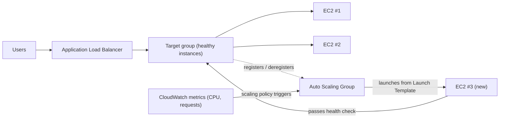

# باب 7: وہ ریستوران جو مصروف ہونے پر بڑا ہو جاتا ہے

جمعے کی شام 7:43 بجے کا وقت تھا۔

Tom کی کرسی تھوڑی پیچھے دھکیلی ہوئی تھی، اس طرح جیسے تب ہوتی جب وہ کسی چیز کو اس قسم کی توجہ سے گھور رہا ہوتا جس کا مطلب ہوتا کہ اگر آپ اس سے بات کریں تو وہ جواب نہیں دے گا۔ دفتر ایک گھنٹہ پہلے خالی ہو چکا تھا۔ وہ رک گیا تھا۔

اس کے پاس میٹرکس ڈیش بورڈ کا ایک ٹیب کھلا تھا جسے وہ اسی طرح ریفریش کرتا جیسے دوسرے لوگ سوشل میڈیا چیک کرتے ہیں — لاشعوری طور پر، مسلسل، بغیر خاص ارادے کے۔

اسٹوریج کا بحران ان کے پیچھے تھا۔ ڈیٹابیس کی اپنی ڈسک تھی۔ تصاویر S3 میں رہتی تھیں۔ دو ہفتوں سے، نظام مستحکم تھا — دلچسپ نہیں، بس مستحکم۔ یہ اچھا محسوس ہونا چاہیے تھا۔

پھر error rate 12% سے گزر گئی۔

"Leo،" Tom نے کہا۔

Leo پہلے ہی دیکھ رہا تھا۔ ردعمل کے اوقات: چڑھ رہے تھے۔ قطار میں درخواستیں: چڑھ رہی تھیں۔ واحد EC2 instance — حتیٰ کہ پچھلے مہینے کی محتاط right-sizing مشق کے بعد بھی — 94% CPU پر تھی۔

"ہم گاہکوں کو واپس بھیج رہے ہیں،" Tom نے کہا۔

"ہم انہیں واپس نہیں بھیج رہے،" Leo نے کہا۔ "سرور بھیج رہا ہے۔"

"یہ ایک ہی بات ہے۔"

تھی بھی۔ اور یہ تین ہفتوں سے ہر جمعے کو ہو رہا تھا۔ Nimbus اسٹوریج کے بحران سے بچ گیا تھا — ڈیٹابیس کی اپنی ڈسک تھی، تصاویر S3 میں رہتی تھیں — لیکن مستحکم اور قابلِ اسکیل مکمل طور پر مختلف مسائل ہیں۔ نظام کام کرتا تھا۔ یہ بس بڑھتا نہیں تھا۔

Maya کا ایک Slack پیغام ظاہر ہوا: *ڈیش بورڈ کہتا ہے آرڈرز پچھلے جمعے سے 40% کم۔ کیا ہو رہا ہے؟*

Tom نے جواب دیا: *سرور صلاحیت پر۔ اس پر کام کر رہا ہوں۔*

تین منٹ گزرے۔

Maya: *ہمارے پاس ایک ریستوران مالک سپورٹ لائن پر کال کر رہا ہے کہ ایپ ٹوٹ گئی ہے۔*

Leo کے ہاتھ کی بورڈ پر تھے۔ وہ instance resize کر رہا تھا — حل کا دستی ورژن، وہ جس کے لیے سرور روکنا اور instance type بدلنا درکار تھا۔ جس کا مطلب downtime تھا۔

"restart میں کتنا وقت لگے گا؟" Tom نے پوچھا۔

"سات منٹ،" Leo نے کہا۔

"ہم جمعے کی رات سات اور منٹ کا آؤٹیج برداشت کرنے والے ہیں،" Tom نے کہا۔ وہ پوچھ نہیں رہا تھا۔ اس نے Maya کو ایک Slack پیغام ٹائپ کیا۔ اس نے ایک ہی حرف سے جواب دیا: *k*

restart مکمل ہو گیا۔ instance واپس آ گئی۔ CPU 60% تک گر گیا۔ error rate گر گئی۔ Tom نے پندرہ منٹ بغیر بولے میٹرکس دیکھے۔

9:15 پر، ٹریفک کم ہو گئی۔ بحران ختم ہو گیا۔

Leo نے اپنے ہاتھوں کو دیکھا، جو رات 8 بجے ہلکے کانپ رہے تھے اور اب نہیں کانپ رہے تھے۔

"ہم ہر جمعے کو ایسا نہیں کر سکتے،" اس نے کہا۔

"نہیں،" Tom نے کہا۔ "ہم نہیں کر سکتے۔"

ٹیم کو اپنے نظام کی ضرورت تھی کہ وہ متغیر load کو خودکار طور پر سنبھالے۔ نہ کہ بدترین صورت کے لیے کافی سرور خریدے اور خاموش اوقات میں پیسہ ضائع کرے۔ اور نہ کہ جب ٹریفک کی چوٹیاں آئیں تو دستی طور پر بھاگ دوڑ کرے۔

اس کے لیے ایک پیٹرن ہے۔ AWS کے پاس دو سروسز ہیں جو اسے نافذ کرتی ہیں۔

**تصور: افقی اسکیلنگ**

کسی نظام کو زیادہ load سنبھالنے کے دو طریقے ہیں۔

**عمودی اسکیلنگ** کا مطلب ہے واحد سرور کو بڑا بنانا۔ زیادہ CPU۔ زیادہ RAM۔ ہم نے یہ باب 4 میں کیا جب ہم `t3.micro` سے `t3.large` پر اپ گریڈ ہوئے۔ یہ مدد کرتا ہے۔ لیکن اس کی حدود ہیں: آپ صرف اتنا بڑا جا سکتے ہیں، instance کو resize کرنے کے لیے restart کرنا پڑتا ہے، اور آپ کے پاس پھر بھی ناکامی کا واحد نقطہ ہوتا ہے۔

**افقی اسکیلنگ** کا مطلب ہے مزید سرور شامل کرنا۔ ایک بڑے سرور کے بجائے، پانچ درمیانے سرور چلائیں۔ جب ٹریفک گرتی ہے، دو چلائیں۔ جب یہ بڑھتی ہے، دس چلائیں۔

افقی اسکیلنگ کے ایسے فوائد ہیں جو عمودی کے نہیں:

- ناکامی کا کوئی واحد نقطہ نہیں۔ اگر ایک سرور مر جائے، تو باقی خدمت دیتے رہتے ہیں۔
- صلاحیت شامل کرنے کے لیے کوئی restart درکار نہیں۔
- صرف اس کے لیے ادائیگی کریں جو آپ استعمال کر رہے ہیں — جب ضرورت ہو سرور شامل کریں، جب نہ ہو ہٹائیں۔
- لکیری اسکیلنگ: دوگنے سرور، تقریباً دوگنا throughput۔

ایک قابلِ اعتماد ہونے کا پہلو بھی ہے جس کا عمودی اسکیلنگ مقابلہ نہیں کر سکتا۔ جب آپ کے پاس پانچ سرور ہوں اور ایک ناکام ہو جائے، تو آپ کی صلاحیت 80% تک گرتی ہے — جو ناکام instance کے تبدیل ہونے کے دوران ٹریفک پیش کرتے رہنے کے لیے کافی ہے۔ جب آپ کے پاس ایک سرور ہو اور وہ ناکام ہو جائے، تو صلاحیت 0% تک گرتی ہے۔ ریڈنڈنسی افقی اسکیلنگ میں اس طرح شامل ہوتی ہے جیسے عمودی اسکیلنگ کسی بھی سائز پر فراہم نہیں کر سکتی۔

یہ دیکھ بھال کے لیے بھی اہم ہے۔ جب کسی سیکیورٹی پیچ کے لیے سرور restart درکار ہو، تو افقی اسکیلنگ آپ کو ایک وقت میں ایک instance restart کرنے دیتی ہے — rolling restarts جو خدمت کا تسلسل برقرار رکھتے ہیں۔ ایک واحد بڑے سرور کے لیے یا تو restart کے دوران downtime قبول کرنا یا blue/green ڈیپلائمنٹ کی پیچیدگی نافذ کرنا درکار ہوتا ہے۔

مسئلہ: اگر آپ کے پاس متعدد سرور ہیں، تو صارفین کو کیسے پتہ چلے کہ کس سے بات کریں؟

اور افقی اسکیلنگ ایک ڈیزائن رکاوٹ مسلط کرتی ہے: آپ کی ایپلیکیشن کو متعدد ایک جیسے سرورز پر بیک وقت چلنے کے قابل ہونا چاہیے بغیر اس کے کہ سرور ایک دوسرے میں مداخلت کریں۔ یہ **stateless** کی ضرورت ہے — ہر درخواست خود مکمل ہونی چاہیے، کسی مخصوص سرور پر محفوظ state پر منحصر نہیں۔ ہم بالکل دیکھیں گے کہ یہ کیوں اہم ہے جب ہم sticky sessions کے مسئلے کا سامنا کریں گے۔

**Application Load Balancer: ایک دروازہ، بہت سے کمرے**

ایک بڑے ریستوران کا تصور کریں جس کے دروازے پر ایک host stand ہے۔ کھانے والے آتے ہیں اور host انہیں ایک دستیاب میز کی طرف لے جاتا ہے۔ host جانتا ہے کہ کون سی میزیں مصروف ہیں اور کون سی خالی۔ کھانے والوں کو جاننے کی ضرورت نہیں کہ کتنی میزیں ہیں — وہ بس اندر چلتے ہیں اور host تقسیم سنبھالتا ہے۔

ایک **Application Load Balancer** (ALB) ویب درخواستوں کے ساتھ یہ کرتا ہے۔

صارفین load balancer سے جڑتے ہیں۔ load balancer آنے والی درخواستیں آپ کی EC2 instances کے fleet میں تقسیم کرتا ہے۔ ہر صارف کو ایک پتہ نظر آتا ہے (load balancer کا URL)۔ اس پتے کے پیچھے، درخواستیں جتنے بھی سرور چل رہے ہوں ان میں پھیلائی جاتی ہیں۔

ALB خود AWS-managed انفراسٹرکچر پر چلتا ہے، آپ کے Region میں متعدد AZs میں تقسیم۔ یہ ایک واحد سرور نہیں ہے — یہ ایک managed، تقسیم شدہ سروس ہے۔ جب آپ cross-zone load balancing فعال کرتے ہیں (ALBs کے لیے ڈیفالٹ)، تو ہر ALB node درخواستوں کو تمام رجسٹرڈ targets میں یکساں طور پر تقسیم کرتا ہے، چاہے وہ کسی بھی AZ میں ہوں۔ یہ اس عام failure mode کو روکتا ہے جہاں ایک AZ میں دوسرے سے دوگنا صحت مند instances ہوں، جس کے نتیجے میں ناہموار load ہو۔

یہ ہر آنے والی HTTP درخواست وصول کرتا ہے اور فیصلہ کرتا ہے کہ کون سی EC2 instance (جسے **target** کہتے ہیں) اسے سنبھالے، عوامل کی بنیاد پر جیسے:

- Round-robin (ہر سرور کو باری باری موقع ملتا ہے)
- سب سے کم نمایاں درخواستیں (سب سے کم in-flight درخواستوں والے سرور کو اگلی درخواست ملتی ہے)
- صحت — صرف صحت مند targets ٹریفک وصول کرتے ہیں

**Health checks** ضروری ہیں۔ ALB باقاعدگی سے ہر target پر test درخواستیں بھیجتا ہے۔ اگر کوئی target درست طریقے سے جواب نہ دے، تو ALB اسے غیر صحت مند نشان زد کرتا ہے اور اسے ٹریفک بھیجنا بند کر دیتا ہے۔ جب target بحال ہو جاتا ہے، تو ٹریفک دوبارہ شروع ہو جاتی ہے۔

یہ خودکار ہے۔ آپ health check پیرامیٹرز کنفیگر کرتے ہیں؛ ALB انہیں نافذ کرتا ہے۔

آپ health checks کو تین اہم پیرامیٹرز کے ساتھ کنفیگر کرتے ہیں: چیک کرنے کے لیے **path** (مثلاً `/health`)، **interval** (کتنی بار چیک کرنا — ہر 5 سے 300 سیکنڈ؛ ڈیفالٹ 30)، اور **threshold** (target کی صحت کی حالت بدلنے سے پہلے کتنے لگاتار کامیاب یا ناکام چیک)۔

جارحانہ health check intervals مسائل کو تیزی سے پکڑتے ہیں لیکن targets پر زیادہ ٹریفک شامل کرتے ہیں۔ 3-ناکامی threshold کے ساتھ 30-سیکنڈ interval کا مطلب ہے کہ ایک ناکام ہوتا target 90 سیکنڈ کے اندر rotation سے ہٹا دیا جاتا ہے۔ 2-ناکامی threshold کے ساتھ 10-سیکنڈ interval کا مطلب ہے 20 سیکنڈ کے اندر ہٹانا — زیادہ health check ٹریفک کی قیمت پر۔

Nimbus کے لیے، Priya نے 3 ناکامیوں کے threshold (غیر صحت مند قرار دینے کے لیے 90 سیکنڈ) اور 2 کامیابیوں (بحالی کے بعد دوبارہ صحت مند قرار دینے کے لیے 60 سیکنڈ) کے ساتھ 30-سیکنڈ interval چنا۔ اس نے تیز ناکامی کا پتہ لگانے کو مختصر نیٹ ورک blips سے false positives سے بچنے کے ساتھ متوازن کیا۔

**Health Check کنفیگریشن: "کیا یہ زندہ ہے؟" سے زیادہ**

Leo کا پہلا health check ایک سادہ TCP ping تھا: "کیا port 80 کنکشن قبول کر رہا ہے؟" یہ کم از کم ہے۔ سرور port 80 پر کنکشن قبول کر سکتا تھا جبکہ ڈیٹابیس نیچے ہو، جبکہ ایپلیکیشن ایک error loop میں ہو، جبکہ ڈسک بھری ہو۔

Priya کا اس بارے میں ایک مختلف نظریہ تھا کہ "صحت مند" کا کیا مطلب ہونا چاہیے۔

"کیا ہم نے سوچا ہے کہ اگر health check پاس ہو جائے لیکن ایپلیکیشن ٹوٹی ہوئی ہو تو کیا ہوگا؟" اس نے پوچھا۔ "ایک سرور جو کنکشن قبول کر سکتا ہے لیکن ڈیٹابیس query نہیں کر سکتا، صحت مند نہیں ہے۔ یہ بس جواب دہ ہے۔"

Leo نے ایپلیکیشن کوڈ میں ایک `/health` endpoint بنایا۔ endpoint نے تین کام کیے:
1. تصدیق کی کہ ایپلیکیشن process چل رہی ہے
2. ڈیٹابیس پر ایک test query کی (ایک سادہ `SELECT 1`)
3. تصدیق کی کہ S3 کنکشن قابلِ رسائی ہے

اگر تینوں پاس ہو جاتے، تو endpoint HTTP 200 واپس کرتا۔ اگر کوئی ناکام ہو جاتا، تو یہ HTTP 503 واپس کرتا۔

ALB health check کو اس endpoint کو ہر 30 سیکنڈ میں call کرنے کے لیے کنفیگر کیا گیا تھا۔ اگر اسے تین لگاتار 503 جوابات ملتے، تو instance غیر صحت مند نشان زد ہوتی اور rotation سے ہٹا دی جاتی۔

"اس کا مطلب ہے اگر ڈیٹابیس نیچے چلا جائے،" Priya نے کہا، "تو health check اسے پکڑ لے گا اور متاثرہ سرورز کو 90 سیکنڈ کے اندر load balancer سے ہٹا دے گا۔"

"چاہے سرور خود ابھی بھی چل رہے ہوں،" Tom نے کہا۔

"چاہے وہ باہر سے ٹھیک لگ رہے ہوں۔"

ALB، ایک حقیقی ایپلیکیشن health check کی طرف اشارہ کیا گیا، اصل مسائل کا کہیں زیادہ قابلِ اعتماد detector بن گیا — نہ صرف سرور کا زندہ ہونا۔

**Auto Scaling: وہ ریستوران جو مزید میزیں کھولتا ہے**

ایک ALB آپ کے موجودہ سرورز میں ٹریفک تقسیم کرتا ہے۔ لیکن یہ سرور شامل نہیں کرتا جب آپ کو مزید کی ضرورت ہو۔

**Auto Scaling** کرتا ہے۔

ایک **Auto Scaling Group** (ASG) ایک کنفیگریشن ہے جو AWS کو بتاتی ہے:

- ہمیشہ چلتے رہنے کے لیے instances کی کم سے کم تعداد
- اجازت یافتہ instances کی زیادہ سے زیادہ تعداد
- وہ شرائط جن کے تحت scale out کرنا ہے (instances شامل کرنا) یا scale in کرنا ہے (انہیں ہٹانا)

اسکیلنگ کی شرائط کو **policies** کہتے ہیں۔ چار سب سے عام اقسام:

**Target tracking**: "اوسط CPU استعمال 70% پر رکھیں۔" جب اوسط CPU 70% سے تجاوز کرے، AWS نئی instances لانچ کرتا ہے۔ جب یہ نیچے گرے، instances terminate ہو جاتی ہیں۔ یہ زیادہ تر workloads کے لیے سب سے آسان اور سب سے زیادہ تجویز کردہ policy ہے — ایک target میٹرک سیٹ کریں اور AWS کو سمجھنے دیں کہ کتنی instances درکار ہیں۔ target CPU استعمال، فی target درخواست کی تعداد، یا کوئی بھی custom CloudWatch میٹرک ہو سکتا ہے۔

**Step scaling**: مخصوص جوابات کے ساتھ مخصوص thresholds define کریں۔ "جب CPU 60% سے تجاوز کرے، 1 instance شامل کریں۔ جب CPU 80% سے تجاوز کرے، 3 instances شامل کریں۔ جب CPU 30% سے نیچے گرے، 1 instance ہٹائیں۔" target tracking سے زیادہ باریک کنٹرول، لیکن زیادہ کنفیگریشن اور جاری tuning درکار ہے۔

**Scheduled scaling**: "ہر جمعے شام 6:45 بجے، یقینی بنائیں کہ کم از کم 4 instances چل رہی ہیں۔" یہ قابلِ پیش گوئی واقعات کے لیے proactive اسکیلنگ ہے۔ یہ reactive اسکیلنگ کے ساتھ کام کرتا ہے — scheduled action ایک فرش سیٹ کرتا ہے، اور target tracking ضرورت کے مطابق اس فرش سے اوپر instances شامل کرتا ہے۔

**Predictive scaling**: اسی خیال کا machine-learning ورژن۔ آپ کے شیڈول لکھنے کے بجائے، Auto Scaling دو ہفتوں تک کا تاریخی load تجزیہ کرتا ہے اور اگلے 48 گھنٹوں کی پیش گوئی کرتا ہے، پیش گوئی شدہ اضافے سے *پہلے* صلاحیت لانچ کرتے ہوئے۔ cyclical ٹریفک کے لیے — ہر جمعے کا dinner rush، ہر کاروباری دن کا market open — predictive scaling پیٹرن دریافت کرتا ہے اور خودکار طور پر پہلے سے گرم کرتا ہے، اور جیسے جیسے پیٹرن بدلتا ہے ایڈجسٹ کرتا رہتا ہے۔ امتحانی trigger: "بار بار/cyclical ٹریفک کی چوٹیاں؛ instances کو چوٹی سے *پہلے* تیار ہونا ضروری ہے" → predictive scaling۔ (Scheduled scaling دستی جواب ہے؛ predictive سیکھا ہوا ہے۔ دونوں صرف-reactive اسکیلنگ کو شکست دیتے ہیں، جو ہمیشہ instance boot time سے چوٹی سے پیچھے رہتی ہے۔)

Nimbus کے لیے، combination یہ تھی: reactive اسکیلنگ کے لیے target tracking (CPU کو 65% پر رکھیں)، نیز dinner rush سے پہلے 2 اضافی instances پہلے سے گرم کرنے کے لیے ہر جمعے شام 6:45 بجے ایک scheduled scaling action۔

یہ خودکار ہے۔ کسی کو میٹرکس نہیں دیکھنے ہوتے۔ کسی کو دستی طور پر سرور لانچ نہیں کرنے ہوتے۔ نظام ریئل ٹائم میں load پر ردعمل دیتا ہے۔

Priya نے یہ پہلی بار ایک جمعے کے rush کے دوران live ہوتے دیکھا۔ سرور کی تعداد پندرہ منٹ میں 2 سے 5 تک گئی، پھر rush کے بعد واپس 2 پر۔

"یہ،" اس نے کہا، "واقعی متاثر کن ہے۔"

Tom اس کے بجائے لاگت گراف دیکھ رہا تھا۔ بل rush کے دوران بڑھا اور بعد میں گرا۔ "ہم نے صرف اس کے لیے ادائیگی کی جو ہم نے استعمال کیا،" اس نے یکساں متاثر ہو کر کہا۔ "ایک عام ہفتے میں اوسطاً یہ ماہانہ کتنا پڑتا ہے؟"

Leo نے calculator کھولا۔ جمعے کی چوٹیاں ماہانہ بل میں شاید 15% شامل کرتی تھیں۔ Auto Scaling کے بغیر، انہیں پورا ہفتہ چوٹی کے لیے provision کرنا پڑتا۔ فرق: بیکار چوٹی کی صلاحیت پر تقریباً $120/ماہ ضائع، بمقابلہ Auto Scaling صحیح طور پر کنفیگر ہونے کے ساتھ $0 ضائع۔

scale-in میں ایک باریکی ہے جسے ٹیمیں اکثر چھوڑ دیتی ہیں: **scale-in protection**۔ آپ ASG میں مخصوص instances کو scale-in سے محفوظ ہونے کے لیے کنفیگر کر سکتے ہیں — یعنی وہ خودکار scale-in واقعات کے دوران terminate نہیں ہوں گی۔ یہ ان instances کے لیے مفید ہے جو کسی طویل-چلنے والے کام کے بیچ میں ہوں جسے آپ نہیں چاہتے کہ رکاوٹ ہو۔ ایپلیکیشن کوڈ بھی جب کوئی طویل کام شروع کرے تو programmatically instance protection سیٹ کر سکتا ہے اور کام مکمل ہونے پر protection ہٹا سکتا ہے۔ یہ ASG کو فعال کام کے نیچے سے زمین کھینچنے سے روکتا ہے۔

**Warm Pools: ہر چیز کو ٹھنڈا شروع کرنے کی ضرورت نہیں**

جس جمعے کو Auto Scaling پہلی بار کام میں آیا، Tom نے یہ وقت ناپا کہ "CPU threshold سے تجاوز کرتا ہے" سے "نئی instances ٹریفک پیش کرتی ہیں" تک کتنا وقت لگتا ہے۔

چار منٹ بیس سیکنڈ۔

"یہ چار منٹ ہیں جہاں ہم صلاحیت میں کم ہیں،" اس نے کہا۔

"ہم کم از کم instance کی تعداد بڑھا سکتے ہیں،" Leo نے کہا۔

"اس کا مطلب پورا ہفتہ بیکار instances کے لیے ادائیگی،" Tom نے کہا۔

ایک درمیانی راستہ تھا: **Warm Pools**۔

ایک Warm Pool پہلے سے initialize کی گئی EC2 instances کا ایک گروپ ہے جو ایک رکی ہوئی حالت میں بیٹھتی ہیں، پہلے سے boot شدہ، پہلے سے کنفیگر شدہ، پہلے سے UserData اسکرپٹ سے گزری ہوئی۔ انہوں نے ٹریفک پیش کرنا شروع کرنے کے علاوہ سب کچھ کر لیا ہے۔

جب Auto Scaling Group scale out کرنے کا فیصلہ کرتا ہے، تو شروع سے ایک نئی ٹھنڈی instance لانچ کرنے کے بجائے (جس میں boot ہونے، UserData چلانے، اور health checks پاس کرنے میں تین سے پانچ منٹ لگتے ہیں)، یہ Warm Pool سے ایک instance شروع کرتا ہے۔ ایک رکی ہوئی instance شروع کرنے میں تقریباً 30 سے 60 سیکنڈ لگتے ہیں۔

Nimbus کے جمعے کے پیٹرن کے لیے — تقریباً 7 بجے سے شروع ہونے والا ایک معلوم، قابلِ پیش گوئی اضافہ — Priya نے کاروباری اوقات کے دوران برقرار رکھنے کے لیے دو instances کا ایک Warm Pool کنفیگر کیا۔ 6:45 بجے تک، دو گرم instances تیار بیٹھی ہوتیں، رکی ہوئی لیکن initialize شدہ۔ جب 7 بجے ٹریفک چڑھتی اور ASG کو scale کرنے کی ضرورت ہوتی، تو گرم instances ایک منٹ سے کم میں شروع ہو جاتیں اور fleet میں شامل ہو جاتیں۔

"Warm Pool کی کتنی لاگت ہے؟" Tom نے پوچھا۔

ایک رکی ہوئی EC2 instance compute کے لیے ادائیگی نہیں کرتی — لیکن یہ منسلک EBS اسٹوریج کے لیے ادائیگی کرتی ہے۔ ایک Warm Pool میں دو `t3.small` instances: اسٹوریج لاگتوں میں تقریباً $4/ماہ۔ scale-out وقت میں چار منٹ سے ایک منٹ سے کم تک کی بہتری جمعے کی رات $4/ماہ کے قابل تھی۔

**ALB Path-Based Routing**

جیسے جیسے Nimbus بڑھا، Leo نے ایک دوسرا جزو شامل کیا: ریستوران مینجمنٹ کے لیے ایک الگ API سروس۔ ریستوران کے مالکان اس سروس تک اسی domain کے ذریعے لیکن ایک مختلف URL path پر رسائی کرتے تھے: `/` کے بجائے `/api/restaurant/`۔

"ٹھہریں — لیکن ہم ایسا *کیوں* کریں گے؟" Maya نے پوچھا۔ "ریستوران مینجمنٹ API کو مکمل طور پر ایک مختلف domain کیوں نہ دیں؟"

"ہم دے سکتے ہیں،" Leo نے کہا۔ "لیکن پھر ہمیں ایک دوسرا certificate، ایک دوسرا load balancer، ایک دوسری DNS entry چاہیے ہوگی۔ path-based routing اسے ایک certificate، ایک load balancer کے ساتھ سنبھالتا ہے۔"

ALB نے اسے مقامی طور پر سپورٹ کیا۔ ایک **path-based routing rule** نے ALB کو بتایا: جب URL `/api/restaurant/` سے شروع ہو، تو درخواست کو ریستوران مینجمنٹ target group کی طرف route کریں۔ جب URL کسی اور چیز سے شروع ہو، تو اسے گاہک کا سامنا کرنے والی ایپلیکیشن target group کی طرف route کریں۔

EC2 instances کے دو الگ fleets۔ ایک load balancer۔ URL path سے ہدایت کی گئی ٹریفک۔

"تو ہم ریستوران مینجمنٹ API کو گاہک کا سامنا کرنے والی ایپ سے آزادانہ طور پر اسکیل کر سکتے ہیں؟" Maya نے پوچھا۔

"بالکل،" Leo نے کہا۔ "اگر ریستوران کے مالکان بہت سی مینو اپڈیٹس کر رہے ہوں، تو وہ API سرور اسکیل ہوتے ہیں۔ اگر گاہک بھرپور آرڈر کر رہے ہوں، تو وہ سرور اسکیل ہوتے ہیں۔ وہ ایک دوسرے کو متاثر نہیں کرتے۔"

Maya اس کے ساتھ بیٹھی۔ "اور ہم دو کے بجائے صرف ایک ALB کے لیے ادائیگی کرتے ہیں۔"

"درست،" Tom نے کہا۔ اس کے پاس ایک عدد تھا۔ "ALB بنیادی فیس میں تقریباً $20 ماہانہ نیز ڈیٹا پروسیسنگ چارجز پڑتا ہے۔ ایک ALB دونوں workloads سنبھالتا ہوا بمقابلہ دو الگ: تقریباً $20 فی ماہ بچت۔ اور ہم متعدد certificates اور DNS records منظم کرنے سے بچ جاتے ہیں۔"

"لیکن،" Priya نے کہا، "اگر ALB خود نیچے چلا جائے، تو دونوں سروسز ایک ساتھ نیچے چلی جاتی ہیں۔"

"AWS، ALB کو متعدد AZs میں انتہائی دستیاب ہونے کے لیے ڈیزائن کرتا ہے،" Leo نے کہا۔ "ALB کی ناکامی کا خطرہ دو الگ load balancers برقرار رکھنے کی پیچیدگی کے مقابلے میں بہت کم ہے۔"

Priya نے اسے "قبول شدہ ٹریڈ آف، دستاویزی" کے تحت فائل کیا۔

**ALB اور ASG کیسے مل کر کام کرتے ہیں**

دونوں سروسز ایک ساتھ استعمال ہونے کے لیے ڈیزائن کی گئی ہیں۔

آپ ALB کو آگے رکھتے ہیں۔ ALB ایک **target group** کی طرف اشارہ کرتا ہے — instances کا ایک مجموعہ جنہیں ٹریفک ملنی چاہیے۔ Auto Scaling Group ان instances کو منظم کرتا ہے: scale out کرتے وقت انہیں target group میں شامل کرتا ہے، scale in کرتے وقت انہیں ہٹاتا ہے۔

بہاؤ:

1. ٹریفک ALB پر پہنچتی ہے
2. ALB صحت مند targets میں درخواستیں تقسیم کرتا ہے
3. ان targets پر CPU/load چڑھتا ہے
4. ASG load میں اضافہ محسوس کرتا ہے، نئی instances لانچ کرتا ہے
5. نئی instances health checks پاس کرتی ہیں، ALB کے ساتھ رجسٹر ہوتی ہیں
6. ALB انہیں ٹریفک بھیجنا شروع کرتا ہے
7. load کم ہوتا ہے، ASG اضافی instances terminate کرتا ہے
8. ALB terminate شدہ instances کو ٹریفک بھیجنا بند کر دیتا ہے

یہ بغیر کسی انسانی مداخلت کے ہوتا ہے۔

**Launch Templates: نئی instances کا خاکہ**

جب ASG ایک نئی instance لانچ کرتا ہے، تو اسے جاننا ہوتا ہے کہ کیا لانچ کرنا ہے۔ یہ ایک **Launch Template** میں define کیا گیا ہے — ایک AMI، ایک instance type، لاگو کرنے کے لیے security groups، اور کوئی بھی user data (startup scripts جو instance boot ہونے پر چلتی ہیں)۔

ایک عام پیٹرن: آپ اپنی ایپلیکیشن کو ایک custom AMI میں بناتے ہیں (باب 4 دیکھیں)۔ جب ASG کو ایک نئی instance کی ضرورت ہوتی ہے، تو یہ اس AMI کو لانچ کرتا ہے۔ نئی instance آپ کی ایپلیکیشن پہلے سے انسٹال کے ساتھ boot ہوتی ہے۔ کوئی دستی سیٹ اپ درکار نہیں۔

زیادہ متحرک ماحول کے لیے، آپ **user data scripts** بھی استعمال کر سکتے ہیں جو startup پر آپ کے کوڈ کا تازہ ترین ورژن کھینچتی اور انسٹال کرتی ہیں۔ یہ زیادہ لچکدار ہے لیکن boot ہونے میں زیادہ وقت لیتا ہے۔

صحیح انتخاب اس بات پر منحصر ہے کہ آپ کی instances کو boot ہونے میں کتنا وقت چاہیے اور آپ کی ایپلیکیشن کتنی بار بدلتی ہے۔

**Sticky Sessions: ایک باریک مسئلہ**

یہاں کچھ ایسا ہے جو بہت سی ٹیموں کو پہلی بار load balancing نافذ کرتے وقت پریشان کرتا ہے۔

کچھ ویب ایپلیکیشنز session ڈیٹا — لاگ ان حالت، شاپنگ کارٹ مواد — خود سرور پر (میموری میں یا مقامی ڈسک پر) محفوظ کرتی ہیں۔ یہ ایک سرور کے ساتھ ٹھیک کام کرتا ہے۔ متعدد سرورز کے ساتھ، یہ ٹوٹ جاتا ہے۔

ایک صارف لاگ ان ہوتا ہے۔ درخواست Server A پر جاتی ہے۔ Server A session محفوظ کرتا ہے۔ اگلی درخواست Server B پر جاتی ہے۔ Server B کا کوئی session نہیں۔ صارف لاگ آؤٹ نظر آتا ہے۔

اسے دو طریقوں سے حل کیا جا سکتا ہے:

**Sticky sessions** (یا session affinity): ALB کو ایک ہی صارف سے درخواستیں ہمیشہ ایک ہی سرور پر بھیجنے کے لیے کنفیگر کریں۔ یہ ایک قلیل مدتی حل ہے۔ یہ load balancing کو نقصان پہنچاتا ہے (کچھ سرورز کو زیادہ "sticky" صارف ملتے ہیں) اور جب کوئی instance terminate ہو جائے تو مسائل پیدا کرتا ہے۔

Maya نے sticky sessions کنفیگریشن صفحہ دیکھا۔ "اگر ہم صارفین کو مخصوص سرورز پر pin کریں، تو scale-in کے دوران ان سرورز کے terminate ہونے پر کیا ہوتا ہے؟"

"وہ اپنا session کھو دیتے ہیں،" Leo نے کہا۔

"تو sticky sessions بس مسئلے کو ٹال رہے ہیں۔"

"درست،" Priya نے کہا۔ "اصل حل stateless ایپلیکیشن ڈیزائن ہے۔"

**Stateless ایپلیکیشن ڈیزائن**: session ڈیٹا بیرونی طور پر محفوظ کریں — ایک ڈیٹابیس میں یا ElastiCache (باب 10) جیسے cache میں۔ ہر سرور بیرونی store سے کسی بھی صارف کا session دوبارہ بنا سکتا ہے۔ سرور قابلِ تبادلہ بن جاتے ہیں۔ یہ افقی طور پر قابلِ اسکیل ایپلیکیشنز کے لیے صحیح نقطہ نظر ہے۔

Priya نے اسے "سب سے اہم آرکیٹیکچرل فیصلہ جو آپ multi-server پر جاتے وقت کرتے ہیں" کہا۔ وہ صحیح ہے۔ ہم اسے باب 10 میں دوبارہ ملتے ہیں۔

**اگر Sticky Sessions تو کم پیچیدگی لیکن زیادہ خطرہ**

اگر آپ session state کا مسئلہ حل کرنے کے لیے sticky sessions استعمال کرتے ہیں، تو آپ قلیل مدت میں بیرونی session اسٹوریج سیٹ اپ کرنے کی ضرورت کم کرتے ہیں — لیکن جب کوئی sticky سرور scale-in کے دوران terminate ہوتا ہے، تو اس کے تمام منسلک صارفین ایک ساتھ اپنے sessions کھو دیتے ہیں۔ ناکامی بتدریج نہیں ہوتی؛ یہ اچانک ہوتی ہے اور صارفین کے ایک جھرمٹ کو بیک وقت متاثر کرتی ہے۔ اگر آپ session state کو بیرونی بناتے ہیں، تو آپ ایک انحصار (ElastiCache یا ایک ڈیٹابیس) شامل کرتے ہیں لیکن اس اچانک failure mode کو ختم کر دیتے ہیں۔ کسی بھی ایپلیکیشن کے لیے جو باقاعدگی سے اسکیل کرتی ہے، stateless ڈیزائن میں سرمایہ کاری پہلی بار جب Auto Scaling اس پر فعال sessions والی ایک instance terminate کرتا ہے خود کو ادا کر دیتی ہے۔

**Tom کا لاگت کا حساب**

اگلے ہفتے، Tom نے ALB اور ASG سیٹ اپ کے لیے ایک لاگت کا ماڈل بنایا۔

ALB: تقریباً $20/ماہ بنیادی نیز ڈیٹا پروسیسنگ چارجز۔ Nimbus کے ٹریفک حجم پر: تقریباً $22/ماہ۔

Auto Scaling Group خود: کوئی اضافی لاگت نہیں۔ آپ اس کی چلائی گئی instances کے لیے ادائیگی کرتے ہیں، لیکن وہ instances بہرحال موجود ہوتیں۔ ASG مفت ہے؛ آپ compute کے لیے ادائیگی کرتے ہیں۔

Warm Pool: دو رکی ہوئی instances کے لیے EBS اسٹوریج میں تقریباً $4/ماہ۔

کل اضافی انفراسٹرکچر لاگت: تقریباً $26/ماہ، یا $312/سال۔

پھر Tom نے ان تین جمعوں کے incident log کو دیکھا جو ALB اور ASG کے آنے سے پہلے تھے۔ ہر incident نے Nimbus کو آؤٹیج window کے دوران جمعے کی آمدنی کا تقریباً 40% پڑا۔ اوسط جمعے کی آمدنی: تقریباً $2,400۔ $2,400 کا 40% ہے فی incident $960۔ تین incidents: تین ہفتوں میں تقریباً $2,880 کھوئی ہوئی آمدنی۔

"ALB اور ASG کی لاگت سالانہ $312 ہے،" Tom نے کہا۔ "تین برے جمعوں نے ہمیں تقریباً $3,000 پڑا۔ اور یہ صرف براہِ راست آمدنی کا نقصان ہے — ان لوگوں کی customer churn نہیں جنہوں نے ایک برے تجربے کے بعد Nimbus استعمال کرنا بند کر دیا۔"

Maya نے اعداد پڑھے۔ "انفراسٹرکچر چلاؤ۔"

"پہلے ہی چل رہا ہے،" Leo نے کہا۔

## جب ALB کافی نہ ہو: NLB اور GWLB

Leo اس IoT انضمام کا جائزہ لے رہا تھا جو Nimbus نے ریستوران شراکت داروں کے لیے خاموشی سے شامل کیا تھا — walk-in coolers میں چھوٹے temperature sensors جو ہر تیس سیکنڈ Nimbus کو readings بھیجتے تھے، تاکہ کچن مینیجرز کو alerts مل سکیں اگر کوئی fridge محفوظ درجہ حرارت سے اوپر چلا جائے۔

"ٹھہریں،" Leo نے کہا۔ "یہ sensors UDP packets بھیج رہے ہیں۔"

"کیا یہ کوئی مسئلہ ہے؟" Maya نے پوچھا۔

"ALB، UDP سپورٹ نہیں کرتا،" Leo نے کہا۔ "ALB، HTTP سمجھتا ہے۔ بس۔"

Priya پہلے ہی دستاویزات دیکھ رہی تھی۔ "Network Load Balancer اسی کے لیے ہے۔"

**Network Load Balancer (NLB)** Layer 4 — transport layer — پر کام کرتا ہے۔ یہ TCP اور UDP packets route کرتا ہے۔ یہ ان packets کے مواد کا معائنہ نہیں کرتا، HTTP headers نہیں سمجھتا، path-based routing نہیں کرتا۔ جو یہ کرتا ہے وہ packets کو clients سے targets تک غیر معمولی رفتار سے منتقل کرنا ہے۔

- **فی سیکنڈ لاکھوں درخواستیں سنگل-ڈیجٹ ملی سیکنڈ latency کے ساتھ۔** ALB، Layer 7 پر HTTP پروسیس کرتا ہے، جس کا مطلب ہے کہ یہ headers parse کرتا ہے، routing rules کا جائزہ لیتا ہے، اور TLS connections terminate کرتا ہے۔ NLB یہ سب کچھ نہیں کرتا — یہ ایک web proxy سے زیادہ ایک تیز رفتار ٹریفک director کے قریب ہے۔
- **client کا source IP پتہ محفوظ رکھتا ہے۔** جب ALB کوئی کنکشن وصول کرتا ہے، تو یہ اسے terminate کرتا ہے اور target کے لیے ایک نیا کھولتا ہے — آپ کی EC2 instance ALB کا IP دیکھتی ہے، صارف کا نہیں۔ NLB یہ نہیں کرتا؛ packet کا source IP target پر بدلے بغیر پہنچتا ہے۔ اگر آپ کی ایپلیکیشن کو جاننے کی ضرورت ہو کہ درخواستیں کہاں سے آ رہی ہیں — geolocation، rate limiting، یا fraud detection کے لیے — اور آپ کو اسے درست ہونے کی ضرورت ہو، تو NLB صحیح انتخاب ہے۔ (ALB ایک `X-Forwarded-For` header شامل کرتا ہے جو اصل IP لے جاتا ہے، لیکن اس کے لیے ایپلیکیشن کو header پڑھنا درکار ہے؛ NLB حقیقی IP براہِ راست packet میں ڈالتا ہے۔)
- **Static IP پتے اور Elastic IPs۔** ALB کے IP پتے وقت کے ساتھ بدلتے ہیں — AWS انہیں منظم کرتا ہے اور وہ مقرر نہیں ہیں۔ NLB فی Availability Zone static IPs سپورٹ کرتا ہے، اور آپ ان کو Elastic IPs تفویض کر سکتے ہیں۔ اگر downstream نظاموں کو آپ کے load balancer سے ٹریفک کی اجازت دینے کے لیے ایک مخصوص IP پتہ whitelist کرنے کی ضرورت ہو — مالیاتی خدمات یا IoT آلہ مینجمنٹ میں ایک عام ضرورت — تو NLB واحد اختیار ہے۔ ALB یہ نہیں کر سکتا۔
- **TLS pass-through۔** NLB encrypted TLS ٹریفک کو decrypt کیے بغیر براہِ راست targets تک پہنچا سکتا ہے۔ target TLS terminate کرتا ہے۔ یہ تب مفید ہے جب تعمیل کی ضروریات کہیں کہ decryption ایک مخصوص آلے پر ہونا چاہیے، یا جب آپ load balancer پر TLS certificates منظم نہیں کرنا چاہتے۔

"اگر NLB اتنا تیز ہے،" Maya نے پوچھا، "تو ہم اسے ہر چیز کے لیے کیوں نہ استعمال کریں؟"

"کیونکہ یہ گونگا ہے،" Leo نے کہا۔ "بہترین معنوں میں۔ NLB نہیں جانتا کہ HTTP کیا ہے۔ یہ path-based routing نہیں کر سکتا۔ یہ HTTP کو HTTPS میں redirect نہیں کر سکتا۔ یہ security headers شامل نہیں کر سکتا۔ یہ WAF کے ساتھ ضم نہیں ہو سکتا۔ ایک ویب ایپلیکیشن کے لیے — کوئی بھی چیز جو HTTP بولتی ہے — ALB کی Layer 7 آگاہی ہی وہ ہے جو ان تمام خصوصیات کو ممکن بناتی ہے۔ sensor ڈیٹا کے لیے، جو UDP ہے، ہمارے پاس کوئی انتخاب نہیں۔"

"اور ہمارے ویب ٹریفک کے لیے؟"

"ALB، پہلے کی طرح۔"

"یہ ماہانہ کتنا پڑتا ہے؟" Tom نے پوچھا۔ "کیا NLB سستا ہے؟"

pricing ماڈل ALB جیسا ہی ہے: ایک بنیادی گھنٹہ وار چارج نیز پروسیس شدہ ٹریفک کی بنیاد پر فی Load Balancer Capacity Unit (LCU) ایک چارج۔ مساوی ٹریفک حجموں پر، لاگت موازنہ پذیر ہے۔ Nimbus IoT استعمال کے موقع کے لیے — کم-حجم sensor ڈیٹا — NLB کی لاگت $20/ماہ سے کم ہوگی۔

**Gateway Load Balancer (GWLB)** مکمل طور پر ایک مختلف چیز ہے۔ یہ Layer 3 — IP packet کی سطح — پر کام کرتا ہے، اور یہ ایک مخصوص مقصد کے لیے موجود ہے: تیسرے فریق کے ورچوئل نیٹ ورک appliances کو آپ کے ٹریفک کے بہاؤ میں داخل کرنا۔

تصور کریں Nimbus ایک ایسے سائز تک بڑھ گیا جہاں ان کی سیکیورٹی ٹیم نے تقاضا کیا کہ ان کے VPCs میں داخل اور خارج ہونے والی تمام ٹریفک ایک تجارتی firewall appliance سے گزرے — Palo Alto یا Fortinet جیسے vendor کا سافٹ ویئر چلانے والی ایک ورچوئل مشین۔ GWLB کے بغیر، آپ کو دستی طور پر ان appliances کے ذریعے ٹریفک route کرنا اور یہ معلوم کرنا پڑتا کہ انہیں کیسے اسکیل کریں اور انتہائی دستیاب رکھیں۔ GWLB کے ساتھ، آپ appliance کو ایک target کے طور پر کنفیگر کرتے ہیں، اور تمام ٹریفک شفاف طریقے سے GENEVE protocol کا استعمال کرتے ہوئے اس کے ذریعے route ہوتی ہے۔ ایپلیکیشن نہیں جانتی کہ ٹریفک کا معائنہ کیا جا رہا ہے۔ firewall کو نیٹ ورک topology جاننے کی ضرورت نہیں۔ GWLB routing، اسکیلنگ، اور failover سنبھالتا ہے۔

ابتدائی اور درمیانی مراحل پر زیادہ تر ویب ایپلیکیشنز کے لیے — بشمول Nimbus — GWLB ایسی سروس نہیں ہے جسے آپ کنفیگر کریں گے۔ لیکن امتحان کے لیے، اور اس دن کے لیے جب کوئی سیکیورٹی ضرورت نیٹ ورک-سطح کے معائنے کا تقاضا کرے، آپ جان لیں گے کہ یہ کس لیے ہے۔

Leo نے اسی دوپہر sensor endpoint کے لیے ایک NLB شامل کیا۔ temperature ڈیٹا بہنا شروع ہو گیا۔

"پہلے ریستوران کو ایک alert ملتا ہے کہ ان کا walk-in cooler 47 ڈگری پر ہے،" اس نے کہا۔ "یہ محفوظ threshold سے اوپر ہے۔"

"کیا یہ واقعی 47 ڈگری پر ہے؟" Maya نے پوچھا۔

"ریستوران مالک نے تصدیق کی۔ انہوں نے اسی دوپہر ایک repair technician کو بلایا۔"

Priya نے یہ Nimbus customer impact log میں لکھ دیا۔ کوئی سیکیورٹی واقعہ نہیں۔ بس IoT خصوصیت کام کرتی ہوئی۔

**تینوں Load Balancers، ساتھ ساتھ**

AWS تین قسم کے load balancers پیش کرتا ہے۔ ALB، HTTP اور HTTPS کو Layer 7 پر سنبھالتا ہے — یہ protocol سمجھتا ہے، اس لیے یہ URL path کی بنیاد پر route کر سکتا ہے (`/api` ایک گروپ کو، `/static` دوسرے کو)، host headers، اور query parameters۔ یہی وہ ہے جو زیادہ تر ویب ایپلیکیشنز استعمال کرتی ہیں، اور یہی Nimbus اپنے ویب ٹریفک کے لیے استعمال کرتا ہے۔

ALB، TLS connections بھی terminate کرتا ہے — SSL/HTTPS certificates load balancer پر انسٹال ہوتے ہیں، نہ کہ ہر انفرادی EC2 instance پر۔ ALB درخواست decrypt کرتا ہے، HTTP headers کا معائنہ کرتا ہے، rules کی بنیاد پر route کرتا ہے، اور (اختیاری طور پر) target تک forward کرنے سے پہلے دوبارہ encrypt کرتا ہے۔ یہ certificate management کو نمایاں طور پر آسان بناتا ہے: آپ ALB پر ایک certificate منظم کرتے ہیں نہ کہ ہر instance پر ایک certificate۔

NLB، جیسا کہ ٹیم نے temperature sensors کے ساتھ دیکھا، TCP، UDP، اور TLS کو Layer 4 پر سنبھالتا ہے — خام رفتار، source IP کی حفاظت، static IPs۔ GWLB، Layer 3 پر بیٹھتا ہے تاکہ firewalls اور intrusion detection systems جیسے تیسرے فریق کے appliances کے ذریعے ٹریفک پروئے — جونیئر سطح پر شاذ و نادر ہی درکار۔

Nimbus (اور زیادہ تر ویب ایپلیکیشنز) کے لیے، ALB صحیح انتخاب ہے۔

آپ سوچ رہے ہوں گے: کیا آپ ایک ہی ایپلیکیشن کے لیے ALB اور NLB دونوں استعمال کر سکتے ہیں؟ ہاں۔ ایک عام پیٹرن ALB کے سامنے NLB ہے — NLB کنارے پر خام TCP termination سنبھالتا ہے، ALB اس کے پیچھے HTTP routing سنبھالتا ہے۔ یہ پیچیدگی اور لاگت شامل کرتا ہے، اور زیادہ تر ویب ایپلیکیشنز کے لیے درکار نہیں۔

**امتحان کے لیے ALB بمقابلہ NLB**: اہم امتیاز Layer 7 بمقابلہ Layer 4 ہے۔ اگر امتحانی منظر نامہ URL پر مبنی routing، host پر مبنی routing، HTTP header معائنہ، یا WebSockets کا ذکر کرے — تو یہ ALB ہے۔ اگر یہ TCP pass-through، source IP محفوظ رکھنا، فی سیکنڈ لاکھوں درخواستیں، یا غیر-HTTP protocols کے لیے انتہائی کم latency کا ذکر کرے — تو یہ NLB ہے۔ جب کوئی منظر نامہ بس کہے "ایک ویب ایپلیکیشن کے لیے load balancer،" تو جواب تقریباً ہمیشہ ALB ہوتا ہے۔

## طاقتیں اور حدود

**ALB + Auto Scaling کیوں طاقتور ہے**:

- صفر-downtime اسکیلنگ (instances موجودہ connections میں خلل ڈالے بغیر شامل/ہٹائی جاتی ہیں)
- خودکار failover (غیر صحت مند instances خودکار طور پر ٹریفک سے ہٹا دی جاتی ہیں)
- لاگت کی کارکردگی (صرف چلتی instances کے لیے ادائیگی)
- ناکامی کا کوئی واحد نقطہ نہیں — متعدد AZs میں متعدد instances

**جہاں یہ پیچیدہ ہو جاتا ہے**:

- Stateful ایپلیکیشنز کو خصوصی ہینڈلنگ چاہیے (sticky sessions یا بیرونی state)
- Scale out کرنے میں وقت لگتا ہے — اگر ٹریفک فوراً بڑھے، تو نئی
  instances تیار ہونے سے پہلے ایک وقفہ ہوتا ہے۔ قابلِ پیش گوئی چوٹیوں کے لیے Warm Pools یا زیادہ کم سے کم تعداد سے اسے کم کریں۔
- زیادہ حرکت پذیر پرزوں کا مطلب نگرانی اور debug کرنے کے لیے زیادہ
- کچھ ایپلیکیشنز آسانی سے افقی طور پر اسکیل نہیں ہو سکتیں (ڈیٹابیسز، کچھ legacy
  نظام)۔ افقی اسکیلنگ stateless درجات کے لیے بہترین کام کرتی ہے۔

## خلاصہ

دو سروسز، ایک پیٹرن — اور پیٹرن ہی وہ ہے جو اہم ہے۔ ALB تقسیم سنبھالتا ہے؛ ASG fleet کا سائز سنبھالتا ہے۔ ساتھ مل کر وہ ایک نازک واحد-instance سیٹ اپ کو ایک ایسے نظام میں بدل دیتے ہیں جو کسی انسان کے جاگے بغیر جمعے کے dinner کی ٹریفک جذب کر سکتا ہے۔ $312/سال کی انفراسٹرکچر لاگت بمقابلہ تین جمعوں کی کھوئی ہوئی آمدنی (~$2,880) اس قسم کا حساب ہے جسے Tom ایک اسپریڈ شیٹ میں ڈالتا ہے اور کبھی نہیں بھولتا۔

- **افقی اسکیلنگ** (مزید سرور شامل کرنا) عمودی اسکیلنگ پر ترجیحی ہے کیونکہ یہ ناکامی کے واحد نقطوں کو ختم کرتی ہے اور لچکدار لاگت کی اجازت دیتی ہے۔ ایک **Application Load Balancer (ALB)** آنے والی HTTP/HTTPS ٹریفک تقسیم کرتا ہے اور صرف صحت مند instances کی طرف route کرتا ہے۔
- **Health checks کو اصل ایپلیکیشن فعالیت کا امتحان لینا چاہیے** — ایک `/health` endpoint جو ڈیٹابیس کنیکٹیویٹی کی تصدیق کرتا ہے گاہکوں سے پہلے حقیقی ناکامیاں پکڑتا ہے۔
- ایک **Auto Scaling Group (ASG)** اسکیلنگ policies کی بنیاد پر EC2 instances کی تعداد خودکار طور پر ایڈجسٹ کرتا ہے۔ target tracking سب سے عام قسم ہے؛ scheduled scaling جمعے کے dinner rush جیسی قابلِ پیش گوئی چوٹیاں سنبھالتا ہے۔
- Stateful ایپلیکیشنز کو طویل مدت میں sticky sessions پر انحصار کرنے کے بجائے session state کو بیرونی بنانا چاہیے۔ Sticky sessions ایک قلیل مدتی حل ہیں؛ state کو بیرونی بنانا صحیح آرکیٹیکچر ہے۔
- HTTP/HTTPS ٹریفک کے لیے، ALB استعمال کریں۔ خام TCP/UDP کارکردگی کے لیے، NLB استعمال کریں۔ ALB path-based routing ایک واحد load balancer کو URL path سے متعدد ایپلیکیشن اجزاء کی خدمت کرنے دیتا ہے۔

## Exam Tips

*SAA-C03 ڈومین 2 — ٹاسک 2.1 (scalable architectures) / ڈومین 3 — ٹاسک 3.2*

- **ASG health checks EC2 یا ALB سے آ سکتی ہیں۔** EC2 health checks صرف پتہ لگاتی ہیں کہ آیا instance چل رہی ہے۔ ALB health checks پتہ لگاتی ہیں کہ آیا ایپلیکیشن صحیح طریقے سے جواب دے رہی ہے۔ ALB health checks زیادہ مکمل ہیں اور ویب ایپلیکیشنز کے لیے انہیں ترجیح دی جانی چاہیے۔
- **Target tracking scaling، scaling policies کے لیے سب سے عام امتحانی جواب ہے۔** Simple scaling (الارم فائر ہونے پر N instances شامل کریں) پرانی اور کم موافق ہے۔
- **Scale-out تیز ہے؛ scale-in سست ہے۔** AWS scale-in کے دوران instances کو بتدریج terminate کرتا ہے تاکہ فعال connections میں خلل نہ پڑے — یہ رویہ ALB کی **deregistration delay** سیٹنگ سے کنٹرول ہوتا ہے۔
- **کم سے کم instance کی تعداد آپ کی لچک کا فرش ہے۔** اگر آپ minimum = 1 سیٹ کریں اور وہ instance ناکام ہو جائے، تو ASG کے ردعمل دینے سے پہلے آپ کی ایپلیکیشن نیچے چلی جاتی ہے۔ حقیقی لچک کے لیے minimum ≥ 2 سیٹ کریں اور AZs میں پھیلائیں۔
- **ALB، AZs میں خودکار طور پر ٹریفک تقسیم کر سکتا ہے۔** cross-zone load balancing فعال کے ساتھ، ہر ALB node درخواستوں کو AZ سے قطع نظر تمام رجسٹرڈ targets میں یکساں طور پر تقسیم کرتا ہے۔ یہ متوازن load کے لیے اہم ہے جب AZ instance کی تعداد مختلف ہو۔
- **ALB path-based routing** ان امتحانی منظر ناموں پر ظاہر ہوتا ہے جو ایک واحد load balancer شیئر کرنے والے متعدد ایپلیکیشن اجزاء بیان کرتے ہیں۔ صحیح اصطلاح "listener rules" ہے جو URL path شرائط کی بنیاد پر route کرتی ہیں۔
- **Load Balancer کا انتخاب:** ALB = HTTP/HTTPS، Layer 7، path/header routing، WebSockets، WAF انضمام۔ NLB = TCP/UDP، Layer 4، انتہائی کارکردگی، static IPs، source IP کی حفاظت۔ GWLB = Layer 3، ٹریفک کے راستے میں ورچوئل firewalls/appliances داخل کرنا۔ امتحانی trigger: "UDP protocol" یا "load balancer پر static IP" → NLB۔ "ٹریفک کے بہاؤ میں firewall appliance داخل کریں" → GWLB۔

## مشقیں

**مشق 1 — یاد کریں**

اپنے الفاظ میں: Application Load Balancer اور Auto Scaling Group کے درمیان کیا فرق ہے؟ ہر ایک کیا مسئلہ حل کرتا ہے، اور آپ عام طور پر انہیں ایک ساتھ کیوں استعمال کرتے ہیں؟

*(اشارہ: ایک پہلے سے موجود ٹریفک تقسیم کرتا ہے؛ دوسرا آپ کے پاس کتنی صلاحیت ہے اسے ایڈجسٹ کرتا ہے۔)*

**مشق 2 — SAA-C03 منظر نامہ**

*منظر نامہ*: ایک retail کمپنی کی e-commerce ویب سائٹ انتہائی متغیر ٹریفک کا تجربہ کرتی ہے: ہفتے کے دنوں میں کم ٹریفک، ہفتے کے آخر اور flash sale کے واقعات کے دوران بڑے اضافے۔ وہ چاہتے ہیں کہ ان کی ایپلیکیشن خاموش ادوار کے دوران غیر استعمال شدہ صلاحیت برقرار رکھے بغیر چوٹی کے loads سنبھالے۔ ایپلیکیشن فی الحال session ڈیٹا سرور میموری میں محفوظ کرتی ہے۔

کون سی آرکیٹیکچر تبدیلی ان کی قابلِ اسکیل ضروریات کو **بہترین** طریقے سے حل کرے گی؟

A) ایک واحد بہت بڑی EC2 instance پر اپ گریڈ کریں جو چوٹی ٹریفک سنبھال سکے
B) ایک Auto Scaling Group کے ساتھ ALB کے پیچھے متعدد EC2 instances deploy کریں، اور
   session اسٹوریج کو ElastiCache میں بیرونی بنائیں
C) sticky sessions فعال کے ساتھ ALB کے پیچھے متعدد EC2 instances deploy کریں
D) ہر متوقع ٹریفک اضافے سے پہلے دستی طور پر EC2 instances شامل کریں اور بعد میں
   انہیں terminate کریں

**اشارہ 1**: "غیر استعمال شدہ صلاحیت برقرار رکھے بغیر" کا مطلب ہے آپ کو خودکار اسکیلنگ چاہیے، نہ کہ ایک مقررہ بڑی instance یا دستی انتظام۔

**اشارہ 2**: سرور میموری میں session اسٹوریج multi-instance ڈیپلائمنٹس کے لیے ایک مسئلہ ہے۔ کون سے اختیارات اسے حل کرتے ہیں؟

**اشارہ 3**: اختیار C، sticky sessions استعمال کرتا ہے — یہ ایک workaround ہے، اصلاح نہیں۔ کون سا اختیار اسکیلنگ اور session اسٹوریج دونوں مسائل کو ٹھیک سے حل کرتا ہے؟

**جواب**: B

**وضاحت**: ایک Auto Scaling Group کے ساتھ ایک ALB خودکار، لچکدار اسکیلنگ فراہم کرتا ہے — اضافوں کے دوران instances شامل ہوتی ہیں اور خاموش ادوار کے دوران ہٹا دی جاتی ہیں۔ session اسٹوریج کو ElastiCache (ایک بیرونی cache) میں منتقل کرنا ایپلیکیشن کو stateless بناتا ہے: کوئی بھی instance کسی بھی صارف کی درخواست سنبھال سکتی ہے، اور ALB آزادانہ طور پر ٹریفک تقسیم کر سکتا ہے۔ یہ آرکیٹیکچرل طور پر درست حل ہے۔

**A کیوں نہیں؟** ایک واحد بڑی instance، چاہے کتنی بھی بڑی ہو، پھر بھی ناکامی کا واحد نقطہ ہے۔ یہ خاموش ادوار میں بھی پیسہ ضائع کرتی ہے جب اس کی زیادہ تر صلاحیت بیکار بیٹھتی ہے۔

**C کیوں نہیں؟** Sticky sessions ایک صارف کو ایک ہی instance پر route کرتے ہیں، جو session مسئلے کو جزوی طور پر کم کرتا ہے لیکن load balancing کو نقصان پہنچاتا ہے۔ اگر وہ instance terminate ہو جائے (scale-in یا ناکامی کے دوران)، تو صارف بہرحال اپنا session کھو دیتا ہے۔

**D کیوں نہیں؟** دستی اسکیلنگ کے لیے کسی کو ٹریفک کی چوٹیوں کی درست پیش گوئی کرنے اور پہلے سے عمل کرنے کی ضرورت ہے۔ یہ سست، غلطی کا شکار، اور محنت طلب ہے۔ Auto Scaling یہ خودکار طور پر سنبھالتا ہے۔

*SAA-C03 ڈومین 2 — ٹاسک 2.1 / ڈومین 3 — ٹاسک 3.2*

**مشق 3 — آرکیٹیکچر چیلنج** *(اختیاری)*

Nimbus کے لیے ایک بڑی پروموشن آنے والی ہے: اگلے ہفتے 4 گھنٹوں کے لیے تمام آرڈرز پر 50% رعایت۔ پچھلے سال، ایک ایسی ہی پروموشن نے معمول کی 10x ٹریفک پیدا کی۔ ٹیم کو اچانک اضافے کی توقع ہے جو بالکل 4 گھنٹے جاری رہے گا۔

Auto Scaling بالآخر ردعمل دے گا، لیکن ایک وقفہ ہے۔ آپ اس معلوم اضافے کے لیے کیسے ڈیزائن کریں گے؟ reactive اور proactive اسکیلنگ کے درمیان کیا فرق ہے، اور ہر ایک کب معنی رکھتا ہے؟

*(کوئی واحد درست جواب نہیں ہے۔ scheduled scaling actions، pre-warming، اور ہر نقطہ نظر کے لاگت کے اثرات کے بارے میں سوچیں۔)*

## پوسٹ کریڈٹس سین

Auto Scaling اور ALB deploy کرنے کے بعد پہلے جمعے کو، ٹیم نے مل کر میٹرکس دیکھے۔

7:15pm: دو instances چل رہی ہیں۔ معمول کا load۔
7:45pm: load چڑھتا ہے۔ Auto Scaling دو مزید instances لانچ کرتا ہے۔
8:00pm: چار instances چوٹی سنبھال رہی ہیں۔ ردعمل کے اوقات مستحکم۔
9:30pm: load گرتا ہے۔ Auto Scaling دو instances terminate کرتا ہے۔
9:45pm: واپس دو instances پر۔

سائٹ کبھی نیچے نہیں گئی۔ ایک بار بھی نہیں۔

Leo نے میٹرکس صفحہ تین بار ریفریش کیا، جیسے اسے کوئی ایسی ناکامی ملنے کی توقع تھی جو اس نے چھوڑ دی ہو۔

"کیا یہ عجیب ہے کہ مجھے ہلکا سا مایوس محسوس ہوتا ہے کہ کچھ نہیں ٹوٹا؟" اس نے کہا۔

"ہاں،" Priya نے کہا۔

Tom بل دیکھ رہا تھا۔ لاگت نے ٹریفک کو تقریباً بالکل ٹریک کیا تھا۔ "ہم نے بالکل اس کے لیے ادائیگی کی جو ہم نے استعمال کیا،" اس نے کہا۔ "زیادہ نہیں۔ کم نہیں۔"

وہ واقعی حیران لگ رہا تھا۔

اگلی صبح، Maya نے error logs میں ایک نیا مسئلہ پایا۔ کوئی آؤٹیج نہیں — بدتر۔

"ہمارا ڈیٹابیس،" اس نے کہا، "اوسطاً آٹھ سیکنڈ کے query times واپس کر رہا ہے۔"

آٹھ سیکنڈ۔ ایک ریستوران آرڈرنگ ایپ کے لیے۔

"ہر بار جب کوئی مینو لوڈ کرتا ہے، ہم صفحہ بنانے کے لیے ڈیٹابیس میں ہر آئٹم query کر رہے ہیں،" Leo نے کہا۔ "اور ہمارے پاس اب سینتالیس ریستوران ہیں۔"

"کل کتنے مینو آئٹمز ہیں؟" Tom نے پوچھا۔

Leo نے query چلائی۔

"تقریباً بائیس ہزار۔"

خاموشی۔

اگلے باب میں: وہ ڈیٹابیس جسے DBA کی ضرورت نہیں — بس ایک کریڈٹ کارڈ۔
