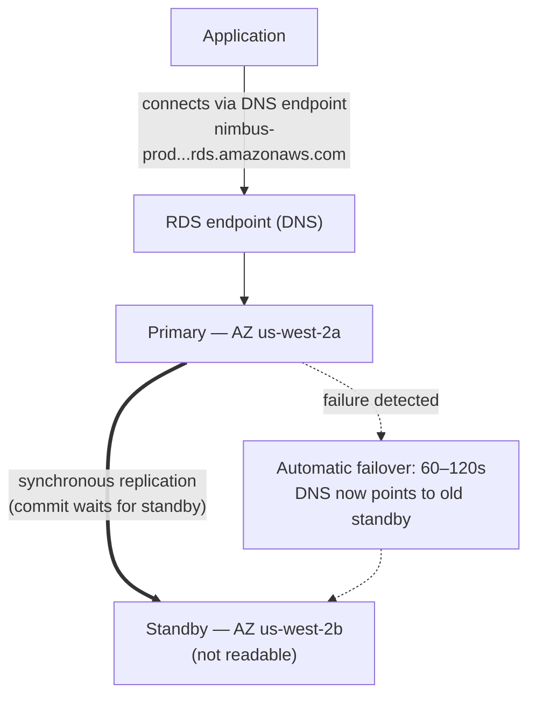

# باب 8: وہ ڈیٹابیس ایڈمنسٹریٹر جو کبھی بیمار نہیں پڑتا

رات کے 3 بجے تھے جب الرٹ آیا۔

Priya واحد جاگنے والی تھی۔ اس کا فون نائٹ اسٹینڈ پر روشن ہوا اور اس نے اسے اندھیرے میں پڑھا، اسکرین کی روشنی بہت زیادہ تھی۔ وہ اٹھ بیٹھی۔ اس نے یادداشت سے اپنا لیپ ٹاپ ڈھونڈا اور بغیر روشنی جلائے اسے کھولا۔

کی بورڈ اندھیرے کمرے میں خاموشی سے کلک کر رہا تھا۔

ڈیٹابیس سرور کو ایک سیکیورٹی پیچ کی ضرورت تھی — اس قسم کا جس کے لیے restart درکار تھا۔ کمزوری حقیقی تھی، پیچ دستیاب تھا، اور اسے گاہکوں میں خلل ڈالے بغیر لاگو کرنے کی window ابھی تھی، آدھی رات میں، جب ٹریفک کم تھی۔

اس نے سرور سے کنکشن کیا۔ اس نے پیچ کھینچا۔ اس نے اسے لاگو کیا۔

پھر اس نے release notes پڑھے۔

package update نے اس configuration فائل کو چھوا جسے PostgreSQL کنکشن پیرامیٹرز define کرنے کے لیے استعمال کرتا ہے۔ release notes میں ایک انتباہ شامل تھا: اس بات پر منحصر کہ upgrade کیسے انجام دیا گیا، ایک حسبِ ضرورت configuration فائل کو package کے ڈیفالٹ ورژن سے بدلا جا سکتا ہے۔

ان کی configuration فائل حسبِ ضرورت بنائی گئی تھی۔ Leo نے دو ماہ پہلے max_connections سیٹنگ tune کرنے کے لیے اسے ترمیم کیا تھا۔

پیچ چلا۔ سرور restart ہوا۔ ڈیٹابیس واپس آن لائن آ گیا۔

Priya نے ایک query کا امتحان لیا۔ یہ کام کر گئی۔

اس نے logs چیک کیے۔ سب کچھ معمول لگ رہا تھا۔

وہ صبح 4:15 بجے واپس بستر پر چلی گئی۔

صبح 9:05 بجے، Leo نے ایپلیکیشن کھولی اور ایک error ملا۔ اس نے ڈیٹابیس چیک کیا۔ Max connections ڈیفالٹ پر سیٹ تھا: 100۔ ان کی ایپلیکیشن 500 تک کے connection pools استعمال کرنے کے لیے کنفیگر تھی۔

ہر نئی کنکشن کوشش ناکام ہو رہی تھی۔ ایپلیکیشن نے عملاً ڈیٹابیس رسائی کھو دی تھی۔

"کیا ہوا؟" Maya نے پوچھا۔

"پیچ،" Priya نے کہا۔ وہ پہلے ہی configuration فائل دیکھ رہی تھی۔ "package update نے ہماری حسبِ ضرورت config فائل کو ڈیفالٹ والی سے اوور رائٹ کر دیا۔ Leo کی max_connections tuning بس ختم ہو گئی — سرور stock سیٹنگز کے ساتھ restart ہوا اور کسی کو error نہیں ملا۔ یہ خاموشی سے ڈیفالٹ پر واپس چلا گیا۔"

"اسے ٹھیک کرنے میں کتنا وقت؟" Leo نے پوچھا۔

"بیس منٹ،" Priya نے کہا۔ "لیکن ہمیں ایک maintenance window چاہیے۔ اس کے لیے ایک configuration تبدیلی اور ایک restart درکار ہے۔"

"ہمارے پاس دو گھنٹوں میں lunch کے لیے کھلنے والے ریستوران ہیں،" Tom نے کہا۔

Priya نے اسے اٹھارہ منٹ میں ٹھیک کیا۔ maintenance window بارہ منٹ کا اصل downtime تھا۔ ریستوران متاثر ہوئے، لیکن چوٹی ابھی شروع نہیں ہوئی تھی۔

صبح اس نے ٹیم کو بتایا کہ کیا ہوا۔ ایک خاموشی چھا گئی۔

"یہ پھر ہوگا،" Tom نے کہا۔

"یہ ہر بار ہوگا جب کوئی پیچ ہو،" Priya نے کہا۔ "اور پیچز ہمیشہ ہوتے ہیں۔ اسے کرنے کا ایک بہتر طریقہ ہونا چاہیے۔"

آٹھ-سیکنڈ کے query times ابھی بھی حل طلب تھے۔ اور اسی ہفتے، یہ: ایک 3am maintenance window جو ایک صبح کے incident میں بدل گیا۔ دونوں مسائل کی ایک ہی جڑ تھی — Nimbus ایک ایسا ڈیٹابیس چلا رہا تھا جسے منظم کرنے کے لیے وہ لیس نہیں تھے۔

ایک حل تھا۔ اس کے لیے بس اس خیال کو چھوڑنا درکار تھا کہ انہیں خود ڈیٹابیس منظم کرنے کی ضرورت ہے۔

**روایتی ڈیٹابیس کا مسئلہ**

جب آپ EC2 instance پر خود ڈیٹابیس چلاتے ہیں، تو آپ ہر چیز کے ذمہ دار ہیں۔

ڈیٹابیس سافٹ ویئر انسٹال کرنا۔ اسے محفوظ طریقے سے کنفیگر کرنا۔ جب سیکیورٹی کمزوریاں دریافت ہوں تو اسے پیچ کرنا۔ بیک اپ لینا۔ یہ امتحان لینا کہ بیک اپ دراصل کام کرتے ہیں (ایک قدم جسے زیادہ تر ٹیمیں اس وقت تک چھوڑ دیتی ہیں جب تک بہت دیر نہ ہو جائے)۔ ڈسک کی جگہ کی نگرانی کرنا۔ ریڈنڈنسی کے لیے replication سیٹ اپ کرنا۔ بنیادی سرور نیچے جانے پر failover کنفیگر کرنا۔ query کارکردگی tune کرنا۔ load کے تحت connections منظم کرنا۔

اس میں سے کچھ بھی ایپلیکیشن نہیں ہے۔ اس میں سے کچھ بھی خصوصیات شامل نہیں کرتا۔ اس سب کو مہارت درکار ہے۔

مہارت کی ضرورت اہم مسئلہ ہے۔ ایک اہل ڈیٹابیس ایڈمنسٹریٹر نہ صرف یہ سمجھتا ہے کہ ڈیٹابیس کیسے چلانا ہے، بلکہ یہ بھی:

- slow query logs کی نگرانی کرنا اور کارکردگی کی bottlenecks کی شناخت کرنا
- disk I/O سے بچنے کے لیے working set کے لیے میموری sizing کرنا
- point-in-time recovery کے لیے WAL archiving کنفیگر کرنا
- خودکار failover کے ساتھ synchronous streaming replication سیٹ اپ کرنا
- load کے تحت connection exhaustion روکنے کے لیے connection pooling tune کرنا
- بغیر ڈیٹا کے نقصان یا توسیع شدہ downtime کے بڑے ورژن upgrades لاگو کرنا

یہ ایک الگ، خصوصی ہنر کا سیٹ ہے۔ سینیئر DBAs بالکل اسی لیے اعلیٰ تنخواہیں طلب کرتے ہیں کیونکہ یہ سب کچھ اچھی طرح کرنا مشکل ہے۔ زیادہ تر اسٹارٹ اپس اس کے لیے رکھ نہیں سکتے۔ زیادہ تر ڈویلپمنٹ ٹیموں کے پاس یہ نہیں ہے۔

زیادہ تر ڈویلپمنٹ ٹیمیں ڈیٹابیس ایڈمنسٹریٹر نہیں ہیں۔ اس سے ایک قابلِ پیش گوئی پیٹرن بنتا ہے: ڈیٹابیس انسٹال ہوتا ہے، کم سے کم کنفیگر کیا جاتا ہے، اور پھر زیادہ تر بھلا دیا جاتا ہے جب تک کہ کچھ تباہ کن طور پر غلط نہ ہو جائے۔ Nimbus PostgreSQL instance ڈیفالٹ کنفیگریشن پر چل رہی تھی — max_connections 100 پر، کوئی connection pooling نہیں، دستی بیک اپس جو Leo نے دو بار چلائے اور پھر بھول گیا، اور بالکل کوئی replication نہیں۔

3am پیچ کا واقعہ ان لوگوں کے چلائے گئے نظام کی علامت تھا جو ایپلیکیشنز بنانے میں بہترین تھے اور جن کا ڈیٹابیس آپریشنز میں کوئی پس منظر نہیں تھا۔ یہ کوئی تنقید نہیں ہے — یہ زیادہ تر اسٹارٹ اپس کی ایک درست وضاحت ہے۔ حل ایک DBA رکھنا نہیں ہے۔ حل ایک ایسی سروس استعمال کرنا ہے جو خودکار طور پر DBA-سطح کی آپریشنز فراہم کرے۔

"کیا ہم نے یہی کیا؟" Maya نے پوچھا۔

Leo کا جواب خاموشی تھی، جو ہاں کے برابر تھی۔

**Managed ڈیٹابیس**

ایک ایسے ڈیٹابیس ایڈمنسٹریٹر کو رکھنے کا تصور کریں جو کبھی بیمار نہیں پڑتا، خودکار طور پر ہر سیکیورٹی پیچ سنبھالتا ہے، بغیر کہے ہر رات ایک بیک اپ لیتا ہے، اور جب کچھ ٹوٹے تو خود کو ٹھیک کر لیتا ہے۔ وہ یہ سب کچھ آپ کو پریشان کیے بغیر کرتے ہیں — اور وہ کبھی، کسی بھی صورت میں، آپ کی ایپلیکیشن منطق کو نہیں چھوتے۔

AWS اس سروس کو **RDS** کہتا ہے — Relational Database Service۔

RDS کے ساتھ، AWS منظم کرتا ہے:

- ڈیٹابیس انجن انسٹال کرنا اور پیچ کرنا
- خودکار بیک اپس (S3 میں محفوظ، 35 دنوں تک برقرار)
- خودکار failover (جب بنیادی نیچے جائے، ایک standby خودکار طور پر سنبھال لیتا ہے)
- نگرانی اور میٹرکس
- at rest اور in transit encryption
- اسٹوریج آٹو-اسکیلنگ (اگر آپ اسے فعال کریں، تو ڈسک بھر جانے پر بڑھتی ہے)

آپ منظم کرتے ہیں:

- ڈیٹابیس schema (آپ کے tables کی ساخت)
- آپ کی queries اور ایپلیکیشن منطق
- ڈیٹابیس تک کس کی رسائی ہے
- کون سی instance type ڈیٹابیس چلاتی ہے
- پیرامیٹر tuning (اگرچہ RDS سمجھدار ڈیفالٹس فراہم کرتا ہے)

**سپورٹ شدہ Engines**

RDS کئی مقبول ڈیٹابیس engines سپورٹ کرتا ہے:

- **MySQL** — سب سے زیادہ استعمال ہونے والا open-source relational ڈیٹابیس
- **PostgreSQL** — طاقتور، قابلِ توسیع، پیچیدہ workloads کے لیے بڑھتا ہوا مقبول
- **MariaDB** — open-source MySQL fork، مکمل طور پر مطابقت پذیر
- **Oracle** — enterprise-grade، legacy ضروریات والی بڑی تنظیموں میں استعمال
- **Microsoft SQL Server** — Windows-بھاری ماحول کے لیے
- **Amazon Aurora** — AWS کا اپنا MySQL/PostgreSQL-مطابقت پذیر انجن، کلاؤڈ کے لیے بنایا گیا
  (ہم Aurora کو باب 24 میں گہرائی سے کور کرتے ہیں)

Nimbus کے لیے، انتخاب PostgreSQL تھا۔ یہ وہی تھا جو Leo جانتا تھا، اور یہ relational ڈیٹا کو اچھی طرح سنبھالتا تھا۔ زیادہ تر ایپلیکیشنز کے لیے انجن کا انتخاب اتنا اہم نہیں ہوتا جتنا آپ سوچتے ہیں — RDS کے آپریشنل فوائد انجن سے قطع نظر لاگو ہوتے ہیں۔

ایک باریکی: جب آپ RDS پر ایک انجن چلاتے ہیں، تو AWS minor version پیچز خودکار طور پر برقرار رکھتا ہے (آپ کے کنفیگر کردہ maintenance window کے دوران)۔ بڑے ورژن upgrades — مثلاً PostgreSQL 14 سے 15 تک جانا — ایک دستی آپریشن ہے جسے آپ شیڈول اور انجام دیتے ہیں۔ AWS بڑے ورژن upgrades کا احتیاط سے امتحان لیتا ہے، لیکن آپ کو پہلے انہیں ایک staging ماحول میں آزمانا چاہیے۔ بڑے ورژن کی تبدیلیاں مخصوص SQL syntax، extensions، یا driver ورژنز کے ساتھ مطابقت کے مسائل متعارف کر سکتی ہیں۔

Leo نے اسے دریافت کیا جب RDS نے ایک minor پیچ لاگو کیا اور ایپلیکیشن log نے ایک ایسے function کے بارے میں مختصر طور پر ایک deprecation انتباہ دکھایا جو ایک ذیلی-release میں ہٹا دیا گیا تھا۔ minor پیچز کو بنیادی طور پر شفاف ہونا چاہیے — لیکن ہر maintenance window کے بعد اپنے ایپلیکیشن logs کی نگرانی کرنا اچھی پریکٹس ہے۔

"کیا ہم نے سوچا ہے کہ اگر کوئی minor پیچ کچھ توڑ دے تو کیا ہوگا؟" Priya نے پوچھا۔

"ہم پچھلے snapshot پر roll back کرتے ہیں،" Leo نے کہا۔

"اس میں کتنا وقت لگتا ہے؟"

Leo نے اپنے ڈیٹابیس کے سائز کے لیے RDS restore وقت دیکھا۔ ایک `db.m6i.large` پر 50GB ڈیٹابیس کے لیے: snapshot سے restore کرنے میں تقریباً 15 سے 30 منٹ۔

"تو اگر کوئی پیچ production توڑ دے تو ہمارے پاس 15-سے-30-منٹ کی ریکوری window ہے،" Priya نے کہا۔ "اور ہم پیچ صبح سویرے maintenance window میں لاگو کرتے ہیں، تو کم از کم اثر کم سے کم ہوتا ہے۔"

"اور ہم پہلے staging میں پیچز کا امتحان لیتے ہیں،" Leo نے مزید کہا۔

"ہاں،" Priya نے کہا۔ "وہ بھی۔"

**RDS Instance Sizing: تمام workloads برابر نہیں**

جب آپ ایک RDS instance بناتے ہیں، تو آپ ایک instance type چنتے ہیں — وہی تصور جو EC2 کا ہے، لیکن ڈیٹابیس workloads تک محدود۔ AWS، RDS instance types کو چند مفید درجات میں منظم کرتا ہے۔

**db.t3 family**: Burstable کارکردگی instances۔ development، staging، اور ہلکے production workloads کے لیے ڈیزائن کی گئیں جنہیں مستقل زیادہ CPU کی ضرورت نہیں۔ ایک `db.t3.micro` کم ٹریفک والے development ڈیٹابیس کے لیے موزوں ہے۔ ایک `db.t3.medium` کبھی کبھار bursts کے ساتھ معتدل production load سنبھالتا ہے۔

T-series instances کے ساتھ ٹریڈ آف: وہ کم-استعمال کے ادوار کے دوران CPU credits جمع کرتی ہیں اور bursts کے دوران ان credits کو خرچ کرتی ہیں۔ اگر آپ مستقل زیادہ CPU پر ایک T-series instance چلاتے ہیں، تو آپ credits ختم کر دیتے ہیں اور کارکردگی ایک بنیادی لکیر پر throttle ہو جاتی ہے جو ناکافی ہو سکتی ہے۔

**db.m6i family**: مستقل، غیر-burstable کارکردگی والی general-purpose instances۔ `db.m6i.large` production ڈیٹابیسز کے لیے ایک عام ابتدائی نقطہ ہے۔ ان کی credit حدود نہیں ہیں — CPU جب بھی آپ کو ضرورت ہو پوری صلاحیت پر دستیاب ہوتا ہے۔

**db.r6i family**: Memory-optimized instances۔ M family سے فی vCPU زیادہ RAM۔ بڑے working sets والے ڈیٹابیسز کے لیے موزوں — وہ queries جو ہر رسائی پر ڈیٹا کو ڈسک سے لانے کے بجائے میموری میں ہونے سے فائدہ اٹھاتی ہیں۔ اگر آپ کے ڈیٹابیس کی کارکردگی RAM شامل کرنے پر ڈرامائی طور پر بہتر ہوتی ہے، تو R family صحیح انتخاب ہے۔

Nimbus کے لیے:

- Development اور staging: `db.t3.medium`۔ development queries کے لیے کافی، کم لاگت۔
- Production: `db.m6i.large`۔ مستقل کارکردگی، مینو اور آرڈر working set کے لیے کافی RAM، کوئی credit throttling نہیں۔

"m6i.large، t3.medium سے کتنا زیادہ پڑتا ہے؟" Tom نے پوچھا۔

Leo نے pricing صفحہ چیک کیا۔ `db.t3.medium` تقریباً $55/ماہ پڑتا تھا۔ `db.m6i.large` تقریباً $140/ماہ پڑتا تھا۔ فرق حقیقی تھا، لیکن قابلِ اعتماد ہونے کا فرق بھی۔

"t3 مستقل load کے تحت throttle کرے گا،" Priya نے کہا۔ "اگر ہمارا کوئی مصروف جمعہ ہو اور CPU چار گھنٹے زیادہ رہے، تو t3 credits ختم کر دیتا ہے اور throttle کرتا ہے۔ m6i نہیں کرتا۔"

Tom نے عدد لکھ لیا۔ اس نے دو ہفتے پہلے کے جمعے کے آؤٹیجز کی لاگت بھی لکھ لی۔ موازنہ قریب نہیں تھا۔

Production، `db.m6i.large` پر گیا۔

**Multi-AZ: وہ Standby جو سنبھال لیتا ہے**

یہ وہ خصوصیت ہے جو قابلِ اعتماد ہونے کا حساب مکمل طور پر بدل دیتی ہے۔

**Multi-AZ ڈیپلائمنٹ** کا مطلب ہے RDS بنیادی سے ایک مختلف Availability Zone میں ایک synchronous standby instance برقرار رکھتا ہے۔ بنیادی میں commit کیا گیا ہر ٹرانزیکشن commit کے تسلیم ہونے سے پہلے synchronously standby میں نقل کیا جاتا ہے۔

جب بنیادی ناکام ہو — ہارڈ ویئر کی ناکامی، AZ آؤٹیج، سافٹ ویئر crash — RDS خودکار طور پر standby پر failover کرتا ہے۔ ڈیٹابیس endpoint کا DNS ریکارڈ اپڈیٹ ہو جاتا ہے۔ آپ کی ایپلیکیشن نئے بنیادی سے دوبارہ جڑ جاتی ہے۔

failover 60–120 سیکنڈ لیتا ہے۔ اس window کے دوران، آپ کی ایپلیکیشن کنکشن errors کا تجربہ کرے گی۔ ٹھیک سے لکھی گئی ایپلیکیشنز کو اسے خوش اسلوبی سے سنبھالنا چاہیے (backoff کے ساتھ connection retries)۔

standby ایک read replica نہیں ہے۔ یہ read ٹریفک پیش نہیں کرتا۔ اس کا واحد مقصد سنبھالنے کے لیے تیار رہنا ہے۔



(نوٹ: نیا تر **Multi-AZ DB Cluster** ڈیپلائمنٹ اختیار *دو* standbys رکھتا ہے جو
**قابلِ پڑھنے** کے ہیں اور تقریباً 35 سیکنڈ میں failover کرتا ہے — امتحان اسے یہاں بیان کردہ
کلاسک Multi-AZ *instance* ڈیپلائمنٹ سے ممتاز کر سکتا ہے۔)

"Multi-AZ کی کتنی لاگت ہے؟" Tom نے پوچھا۔

تقریباً ایک واحد instance کی دوگنی لاگت — کیونکہ آپ لفظی طور پر دو
ڈیٹابیس instances چلا رہے ہیں۔ standby کی لاگت بنیادی جتنی ہی ہے۔

Tom نے آرڈر کی تاریخ کھولی اور ان کی جمعے کی چوٹی کے دوران فی گھنٹہ آمدنی کا اندازہ لگایا۔

"اور اگر کوئی failover window کے دوران توڑ پھوڑ کرنے کی کوشش کرے تو؟" Priya نے پوچھا۔ "جب بنیادی نیچے ہو اور standby ترقی پا رہا ہو، کیا ساٹھ سیکنڈ ہیں جہاں ہم بے نقاب ہیں؟"

"failover شفاف ہے،" Maya نے کہا، "لیکن سوال مناسب ہے۔ connection strings کو RDS endpoint استعمال کرنا چاہیے، نہ کہ hardcoded IPs — ورنہ failover ہموار نہیں ہوگا۔"

Multi-AZ اسی دوپہر فعال ہو گیا۔

**خودکار بیک اپس اور Point-in-Time Recovery**

RDS ہر روز خودکار بیک اپس لیتا ہے۔ AWS یہ بیک اپس S3 میں محفوظ کرتا ہے (RDS کی طرف سے منظم — آپ انہیں براہِ راست اپنے S3 console میں نہیں دیکھتے)۔ آپ اپنی بیک اپ retention مدت کے اندر کسی بھی نقطے پر ڈیٹابیس restore کر سکتے ہیں۔

بیک اپس ایک کنفیگر کرنے کے قابل **backup window** کے دوران ہوتے ہیں — کم ٹریفک کا ایک دور، عام طور پر صبح سویرے۔ (یہ **maintenance window** سے ایک الگ سیٹنگ ہے، جو وہ وقت ہے جب RDS پیچز اور configuration تبدیلیاں لاگو کرتا ہے۔ امتحان یہ آزمانا پسند کرتا ہے کہ یہ دو مختلف windows ہیں۔) زیادہ تر engine types کے لیے، بیک اپس downtime نہیں پیدا کرتے — اور Multi-AZ ڈیپلائمنٹس پر، snapshot standby سے لیا جاتا ہے، اس لیے بنیادی کو بالکل نہیں چھوا جاتا۔

**Point-in-time recovery** سب سے قیمتی خصوصیات میں سے ایک ہے: آپ اپنی retention مدت کے اندر کسی بھی سیکنڈ پر restore کر سکتے ہیں۔ نہ صرف روزانہ snapshots — *کوئی بھی سیکنڈ*۔ یہ اس لیے ممکن ہے کیونکہ RDS روزانہ بیک اپس کے علاوہ ٹرانزیکشن logs مسلسل archive کرتا ہے۔

اگر کوئی غلطی سے دوپہر 2:37 بجے `DELETE FROM orders WHERE 1=1` چلا دے، تو آپ 2:36 بجے پر restore کر سکتے ہیں۔

Leo نے یہ سمجھنے پر واضح طور پر سکون محسوس کیا۔

"میں نے پہلے ہی backup retention ایک دن پر سیٹ کر دیا تھا،" Leo نے کہا۔ "اوہ — لیکن یہ ٹھیک ہے، نا؟ ہم اسے بدل سکتے ہیں؟"

"اسے کم از کم سات دن پر بدلیں،" Priya نے کہا۔ "production کے لیے تیس۔"

Leo نے اسے فوراً اپڈیٹ کیا۔

"کیا ہم اس سے بحال ہو سکتے تھے جو میں نے پچھلے مہینے حذف کیا؟" اس نے پوچھا۔

"RDS سے پہلے؟ نہیں،" Priya نے کہا۔ "RDS کے بعد؟ ہاں۔"

آپ سوچ رہے ہوں گے: ایک خودکار بیک اپ اور ایک دستی snapshot کے درمیان کیا فرق ہے؟ خودکار بیک اپس retention مدت ختم ہونے پر حذف ہو جاتے ہیں (35 دن تک)۔ دستی snapshots غیر معینہ مدت تک برقرار رہتے ہیں جب تک آپ انہیں واضح طور پر حذف نہ کریں۔ اگر آپ کو ایک ڈیٹابیس حالت کو مستقل طور پر محفوظ کرنے کی ضرورت ہو — ایک بڑی منتقلی سے پہلے، ایک خطرناک ڈیپلائمنٹ سے پہلے — تو ایک دستی snapshot لیں۔

**RDS Proxy: پیمانے پر connection کا مسئلہ حل کرنا**

RDS میں منتقلی کے دو ہفتے بعد، Leo نے میٹرکس میں کچھ نوٹ کیا۔

ڈیٹابیس queries ٹھیک سنبھال رہا تھا۔ لیکن کھلے connections کی تعداد زیادہ تھی — اس سے زیادہ جتنی اس نے توقع کی تھی۔ Auto Scaling Group کے چوٹی کے دوران EC2 instances شامل کرنے کے ساتھ، ہر نئی instance نے ڈیٹابیس connections کا اپنا pool کھولا۔ دس EC2 instances، ہر ایک 50 کے connection pool کے ساتھ: ڈیٹابیس سے پانچ سو بیک وقت connections۔

"PostgreSQL کے ہر connection کے لیے ایک overhead ہے،" Priya نے کہا۔ "میموری، connection handler کے لیے CPU۔ پانچ سو connections ڈیٹابیس کے resources کی ایک معنی خیز مقدار صرف connection management کے لیے استعمال کرتے ہیں — اس سے پہلے کہ اس نے کوئی اصل کام کیا ہو۔"

"کیا ہم connection pool کا سائز کم کر سکتے ہیں؟" Leo نے پوچھا۔

"ہم کر سکتے ہیں،" Priya نے کہا۔ "لیکن پھر ہم چوٹی کے دوران درخواستوں کے ایک connection کا انتظار کرتے ہوئے قطار میں لگنے کا خطرہ مول لیتے ہیں۔"

بہتر حل: **RDS Proxy**۔

RDS Proxy ایپلیکیشن اور ڈیٹابیس کے درمیان بیٹھتا ہے۔ EC2 instances Proxy سے جڑتی ہیں، براہِ راست RDS instance سے نہیں۔ Proxy ڈیٹابیس connections کا ایک pool برقرار رکھتا ہے اور ایپلیکیشن درخواستوں کو ان میں multiplex کرتا ہے۔ اگر دس EC2 instances ہر ایک Proxy سے پچاس connections کھولیں، تو Proxy شاید صرف ایک سو اصل ڈیٹابیس connections برقرار رکھے — انہیں تمام ایپلیکیشن درخواستوں میں مؤثر طریقے سے شیئر کرتے ہوئے۔

فوائد:

**Connection pooling**: کم اصل ڈیٹابیس connections کا مطلب RDS instance پر کم میموری overhead اور load کے تحت بہتر کارکردگی۔

**تیز failover**: Multi-AZ failover کے دوران، Proxy ایپلیکیشن کی طرف connection برقرار رکھتا ہے جبکہ backend پر ڈیٹابیس connection دوبارہ قائم کرتا ہے۔ ایپلیکیشنز ایک مکمل connection reset کے بجائے ایک مختصر وقفہ دیکھتی ہیں۔ RDS Proxy failover کے اثر کو 60–120 سیکنڈ سے عام طور پر 30 سیکنڈ یا اس سے کم تک کم کر دیتا ہے۔

**IAM authentication**: ایپلیکیشن میں ڈیٹابیس credentials embed کرنے کے بجائے، ایپلیکیشن ایک IAM role کا استعمال کرتے ہوئے RDS Proxy کی تصدیق کر سکتی ہے۔ Proxy اصل ڈیٹابیس credentials سنبھالتا ہے۔ یہ ایپلیکیشن کے ماحول سے secrets کو مکمل طور پر ختم کر دیتا ہے۔

"RDS Proxy کی کتنی لاگت ہے؟" Tom نے پوچھا۔

یہ بنیادی RDS instance کے فی vCPU-گھنٹہ تقریباً $0.015 پڑتا ہے، instance سے الگ bill کیا جاتا ہے۔ ایک `db.m6i.large` (2 vCPUs) کے لیے، Proxy تقریباً $22/ماہ شامل کرتا ہے۔

Tom نے connection count گراف دیکھا — چوٹی کے دوران ڈیٹابیس resources کے لیے مقابلہ کرتے پانچ سو connections — اور $22/ماہ کی لاگت دیکھی۔

"یہ connection overhead سنبھالنے کے لیے ایک بڑے RDS instance پر اپ گریڈ کرنے سے سستا ہے،" اس نے کہا۔

RDS Proxy اسی ہفتے فعال ہو گیا۔

"اور اگر کوئی Proxy کے ذریعے توڑ پھوڑ کرنے کی کوشش کرے تو؟" Priya نے پوچھا۔ "کیا Proxy کے لیے IAM auth حملہ کی سطح کم کرتا ہے؟"

"ہاں،" Priya نے اپنے سوال کا خود جواب دیا۔ "ایپلیکیشن ماحول میں کوئی ڈیٹابیس credentials نہ ہونے کا مطلب ہے ایپلیکیشن سے چرانے کے لیے کوئی ڈیٹابیس credentials نہیں۔"

اس نے Proxy کے لیے IAM authentication فعال کیا۔

**Read Replicas: Read ٹریفک کو اسکیل کرنا**

Multi-AZ دستیابی کے بارے میں ہے۔ **Read replicas** کارکردگی کے بارے میں ہیں۔

ایک read replica آپ کے بنیادی ڈیٹابیس کی ایک asynchronous کاپی ہے جو read queries پیش کر سکتی ہے۔ آپ کے پاس بڑے RDS engines کے لیے 15 read replicas تک ہو سکتی ہیں — MySQL، PostgreSQL، اور MariaDB (Aurora بھی 15 Aurora Replicas تک سپورٹ کرتا ہے، وہی اسٹوریج volume شیئر کرتے ہوئے)۔

ایپلیکیشن میں ترمیم کی جاتی ہے کہ read queries replica کو اور write queries بنیادی کو بھیجے۔ یہ load تقسیم کرتا ہے: بنیادی writes اور پیچیدہ ٹرانزیکشنز سنبھالتا ہے؛ replicas reads سنبھالتے ہیں۔

اہم خصوصیات:

- replication **asynchronous** ہے — بنیادی اور replica کے درمیان ایک چھوٹا وقفہ (lag) ہو سکتا ہے۔ اگر آپ ایک ریکارڈ لکھیں اور فوراً replica سے پڑھیں،
  تو آپ شاید اسے ابھی نہ دیکھیں۔
- read replicas ایک ہی Region یا ایک مختلف Region میں ہو سکتی ہیں (cross-Region
  replicas latency شامل کرتی ہیں لیکن جغرافیائی تقسیم کو ممکن بناتی ہیں)۔
- read replicas کو ایک ڈیزاسٹر منظر نامے میں standalone ڈیٹابیسز میں ترقی دی جا سکتی ہے۔

Nimbus کے لیے: مینو lookups reads ہیں۔ آرڈر کی تاریخ reads ہے۔ ٹریفک کی بہت بڑی اکثریت read ٹریفک ہے۔ ایک read replica شامل کرنا اور reads کو اس کی طرف route کرنا بنیادی ڈیٹابیس load کو نمایاں طور پر کم کرتا ہے۔

ہم باب 24 میں read replicas کو زیادہ اچھی طرح کور کرتے ہیں جب ہم Aurora پر بات کرتے ہیں۔

**اگر Read-Heavy تو ایک Replica شامل کریں لیکن lag پر نظر رکھیں**

اگر آپ کا workload read-heavy ہے، تو ایک read replica شامل کرنا بنیادی پر load کم کرتا ہے اور query کارکردگی بہتر کرتا ہے — لیکن replication asynchronous ہے، جس کا مطلب ہے کہ replica بنیادی سے قدرے پیچھے ہو سکتا ہے۔ اگر آپ کی ایپلیکیشن ایک ریکارڈ لکھتی ہے اور فوراً اسے واپس پڑھتی ہے، تو اسے بنیادی سے پڑھنا چاہیے، replica سے نہیں۔ اسے غلط کرنا باریک، debug کرنے میں مشکل data freshness bugs پیدا کرتا ہے: ایک صارف آرڈر دیتا ہے، confirmation صفحہ replica سے query کرتا ہے، replica پکڑ نہیں پایا، آرڈر غائب نظر آتا ہے۔ اسے read-your-writes consistency کہتے ہیں، اور یہ سب سے عام غلطی ہے جو ٹیمیں پہلی بار replicas شامل کرتے وقت کرتی ہیں۔

**Performance Insights: سست query ڈھونڈنا**

آٹھ-سیکنڈ کا مینو لوڈ وقت ابھی بھی ایک مسئلہ تھا۔ RDS میں منتقلی نے قابلِ اعتماد ہونے کو بہتر کیا، لیکن query ابھی بھی سست تھی۔

Leo نے ایک read replica شامل کیا اور مینو queries کو اس کی طرف route کیا۔ مینو لوڈ وقت تقریباً چار سیکنڈ تک گر گیا۔ بہتر۔ پھر بھی اچھا نہیں۔

"query ابھی بھی سست ہے،" Maya نے کہا۔ "ہم نے bottleneck بہتر کیا، لیکن ہم نے اسے ٹھیک نہیں کیا۔"

RDS میں ایک خصوصیت شامل ہے جسے **Performance Insights** کہتے ہیں — ایک نگرانی کا اوزار جو دکھاتا ہے کہ کون سی queries سب سے زیادہ ڈیٹابیس resources استعمال کر رہی ہیں، کون سے sessions انتظار کر رہے ہیں، اور وہ کس چیز کا انتظار کر رہے ہیں۔

Leo نے read replica پر Performance Insights فعال کیا اور ایک دوپہر کے امتحانی session کے دوران بار بار مینو صفحہ لوڈ کیا۔

Performance Insights ڈیش بورڈ نے ایک query کو load پر غالب دکھایا: `menu_items` table کا ایک full table scan، ہر بار جب مینو صفحہ لوڈ ہوتا تمام 22,000 rows لاتا ہوا۔ `restaurant_id` پر کوئی index نہیں تھا — وہ column جس سے ایپلیکیشن filter کر رہی تھی۔

index کے بغیر execution وقت: 8.2 سیکنڈ۔

Leo نے index شامل کیا۔

```sql
CREATE INDEX idx_menu_items_restaurant_id ON menu_items(restaurant_id);
```

index کے ساتھ execution وقت: 14 ملی سیکنڈ۔

8,200 ملی سیکنڈ سے 14 ملی سیکنڈ تک۔ ایک ایسے ریستوران آرڈرنگ ایپ، جو گاہکوں کو دور بھگاتا ہے، اور ایک ایسے، جسے وہ بغیر سوچے استعمال کرتے ہیں، کے درمیان فرق۔

"یہی پورے وقت مسئلہ تھا؟" Maya نے کہا۔

"یہی مسئلہ تھا،" Leo نے کہا۔

"اور Performance Insights نے اسے کتنی دیر میں ڈھونڈ لیا؟"

"تقریباً بیس منٹ۔"

Tom پہلے ہی حساب لگا رہا تھا۔ تین ہفتوں کے ذیلی-بہترین مینو لوڈ اوقات، اس مدت کے دوران اندازاً 200,000 مینو صفحہ لوڈز، سستی کی وجہ سے اندازاً 15% ترک۔ جس عدد پر وہ پہنچا وہ تکلیف دہ تھا۔

"اگلی بار launch سے پہلے غائب indexes شامل کرو،" اس نے کہا۔

"ایک چیک لسٹ ہوگی،" Priya نے کہا۔ وہ پہلے ہی اسے لکھ رہی تھی۔

**RDS کب استعمال نہ کریں**

RDS relational ڈیٹابیس workloads کی ایک وسیع رینج کے لیے بہترین ہے۔ یہ ہر چیز کا صحیح جواب نہیں ہے۔

**جب آپ کو OS-سطح کی رسائی چاہیے**: RDS آپ کو بنیادی آپریٹنگ سسٹم تک رسائی نہیں دیتا۔ آپ custom OS packages انسٹال نہیں کر سکتے، kernel پیرامیٹرز ترمیم نہیں کر سکتے، یا ایسے اوزار نہیں چلا سکتے جنہیں ڈیٹابیس سرور تک root رسائی چاہیے۔ اگر آپ کے ڈیٹابیس کی ایسی ضروریات ہیں جو OS رسائی کا تقاضا کرتی ہیں — بعض Oracle کنفیگریشنز، custom storage drivers، مخصوص نیٹ ورک interfaces — تو آپ کو ڈیٹابیس براہِ راست ایک EC2 instance پر چلانے کی ضرورت ہے۔

**جب آپ ایک غیر سپورٹ شدہ انجن استعمال کر رہے ہوں**: RDS، MySQL، PostgreSQL، MariaDB، Oracle، SQL Server، اور Aurora سپورٹ کرتا ہے۔ اگر آپ کی ایپلیکیشن ایک مختلف ڈیٹابیس انجن استعمال کرتی ہے — CockroachDB، SingleStore، Greenplum — تو آپ اسے EC2 پر چلا رہے ہیں، RDS پر نہیں۔

**جب آپ کو write-heavy افقی اسکیلنگ چاہیے**: RDS replicas کے ذریعے reads اسکیل کرتا ہے۔ Writes ایک بنیادی instance پر جاتی ہیں۔ اگر آپ کا workload write-heavy ہے اور اسے متعدد write nodes میں تقسیم کرنے کی ضرورت ہے، تو RDS صحیح آرکیٹیکچر نہیں ہے۔ Aurora کا Global Database بڑے پیمانے پر مدد کر سکتا ہے، لیکن انتہائی write-scale ضروریات کے لیے، DynamoDB (باب 9) یا EC2 پر چلنے والا CockroachDB جیسے تقسیم شدہ ڈیٹابیسز مناسب اوزار ہیں۔

**جب managed لاگت آپریشنل لاگت سے تجاوز کرے**: بہت بڑے، مستحکم workloads کے لیے جہاں آپ کی ٹیم کے پاس حقیقی ڈیٹابیس انتظامی مہارت ہو، اپنے tooling کے ساتھ EC2 پر PostgreSQL چلانا RDS سے سستا ہو سکتا ہے۔ یہ ان ٹیموں کے لیے غیر معمولی ہے جو بنیادی طور پر DBA shops نہیں ہیں۔ لیکن یہ حقیقی ہے، اور ایک اچھا آرکیٹیکٹ اسے تسلیم کرتا ہے۔

Nimbus کے لیے — ایک اسٹارٹ اپ بغیر مخصوص DBA resources کے، ایک managed سروس پر PostgreSQL چلاتے ہوئے، غیر متوقع ترقی کے ساتھ — RDS واضح طور پر صحیح انتخاب تھا۔

**RDS Parameter Groups اور Option Groups**

دو کنفیگریشن میکانزم امتحان میں آتے ہیں:

**Parameter groups** ڈیٹابیس انجن سیٹنگز کو کنٹرول کرتے ہیں — جیسے زیادہ سے زیادہ connections،
query cache سائز، timeout values۔ RDS ایک ڈیفالٹ parameter group بناتا ہے جو زیادہ تر کیسز کے لیے کام کرتا ہے۔ آپ custom parameter groups بناتے ہیں جب آپ کو مخصوص سیٹنگز tune کرنی ہوں۔

**Option groups** کچھ engines کے لیے اضافی خصوصیات فعال کرتے ہیں — جیسے Oracle کی مقامی
نیٹ ورک encryption یا SQL Server کی transparent data encryption۔ زیادہ تر open-source
انجن ڈیپلائمنٹس کو custom option groups کی ضرورت نہیں۔

آپ ان میکانزم کے ذریعے ڈیٹابیس انجن کے رویے کو حسبِ ضرورت بنا سکتے ہیں — لیکن شروع کرنے والی زیادہ تر ٹیموں کے لیے ڈیفالٹس کام کرتے ہیں۔

### ڈیٹا اندر لانا: AWS Database Migration Service

چند ہفتے بعد، Tom standup میں ایک slide لے کر آیا۔

Nimbus ایک چھوٹا علاقائی حریف حاصل کر رہا تھا۔ ان کا آرڈرنگ سسٹم ایک co-location سہولت میں ایک MySQL ڈیٹابیس پر چلتا تھا۔ نظام منتقلی کے دوران آف لائن نہیں ہو سکتا تھا — ریستوران اسے استعمال کر رہے تھے۔

"ہمیں ان کا ڈیٹا RDS میں منتقل کرنا ہے،" Tom نے کہا۔ "نظام بند کیے بغیر۔"

"ڈیٹابیس کتنا بڑا ہے؟" Leo نے پوچھا۔

"تقریباً 80 gigabytes۔"

"انہیں کب cut over کرنا ہے؟"

"چھ ہفتے۔"

Priya پہلے ہی دستاویزات کھول چکی تھی۔ "AWS DMS،" اس نے کہا۔

**AWS DMS (Database Migration Service)** ڈیٹا کو ایک source ڈیٹابیس سے ایک target ڈیٹابیس میں کم سے کم downtime کے ساتھ منتقل کرتا ہے۔ یہ منتقلی کو دو مراحل میں سنبھالتا ہے: موجودہ ڈیٹا کا ایک full load، اس کے بعد source کے چلتے رہنے پر تبدیلیوں کی مسلسل replication۔

دو منتقلی کی اقسام ہیں:

**Homogeneous منتقلی:** source اور target ایک ہی انجن ہیں — MySQL سے RDS MySQL، PostgreSQL سے Aurora PostgreSQL۔ schema مطابقت پذیر ہے؛ DMS ڈیٹا براہِ راست منتقل کرتا ہے۔

**Heterogeneous منتقلی:** source اور target مختلف engines ہیں — Oracle سے Aurora PostgreSQL، SQL Server سے RDS MySQL۔ schema کو پہلے تبدیل کرنا ضروری ہے۔ اس کے لیے schema کا ترجمہ کرنے کے لیے **AWS Schema Conversion Tool (SCT)**، پھر ڈیٹا منتقل کرنے کے لیے DMS درکار ہے۔

Nimbus کے حصول کے لیے: MySQL سے RDS MySQL۔ Homogeneous۔ کوئی SCT درکار نہیں۔

یہ عمل میں کیسے کام کرتا ہے:

1. DMS source سے پڑھتا ہے — co-location MySQL ڈیٹابیس
2. **Full load**: DMS تمام موجودہ ڈیٹا target RDS instance میں کاپی کرتا ہے
3. **CDC (Change Data Capture)**: full load کے بعد، DMS source ڈیٹابیس کا ٹرانزیکشن log پڑھتا ہے اور جاری تبدیلیاں تقریباً ریئل ٹائم میں target میں نقل کرتا ہے
4. source چلتا رہتا ہے۔ جب ٹیم تیار ہو، تو وہ connection string flip کر دیتے ہیں۔

"تو ریستوران آرڈرنگ سسٹم پورے وقت live رہتا ہے؟" Tom نے پوچھا۔

"پورے وقت،" Priya نے تصدیق کی۔ "source اور target CDC کے ذریعے sync میں رہتے ہیں۔ جب ہم تیار ہوں، تو ہم endpoint flip کرتے ہیں۔ downtime وہ سیکنڈ ہیں جو اس تبدیلی کو پھیلنے میں لگتے ہیں۔"

DMS درجنوں source اور target combinations سپورٹ کرتا ہے: Oracle، SQL Server، MySQL، PostgreSQL، MongoDB، DynamoDB، S3، Redshift، Aurora، اور مزید۔

"ٹھہریں — لیکن ہمیں heterogeneous منتقلیوں کے لیے ایک الگ اوزار کی *کیوں* ضرورت ہے؟" Maya نے پوچھا۔ "کیا DMS بس schema کے فرق معلوم نہیں کر سکتا؟"

"Oracle میں ایک VARCHAR، PostgreSQL میں ایک VARCHAR جیسا نہیں ہے،" Priya نے کہا۔ "ڈیٹا types، stored procedures، sequences، ملکیتی functions — وہ ایک-سے-ایک map نہیں ہوتے۔ SCT source schema کا تجزیہ کرتا ہے اور target کے لیے قریب ترین مساوی پیدا کرتا ہے۔ DMS پھر ڈیٹا کو اس تبدیل شدہ schema میں منتقل کرتا ہے۔ schema conversion کو ڈیٹا movement سے الگ کرنا ہی وہ ہے جو عمل کو قابلِ اعتماد بناتا ہے۔"

"اور اگر کوئی DMS replication instance کے ذریعے توڑ پھوڑ کرنے کی کوشش کرے تو؟" Priya نے ایک لمحے بعد خود سے پوچھا۔ "اسے source تک read رسائی اور target تک write رسائی چاہیے۔"

"دونوں سروں پر least privilege،" Leo نے کہا۔ "source پر read-only IAM۔ Write رسائی صرف منتقلی target تک محدود۔ اور replication instance private subnet میں رہتا ہے۔"

Priya نے اسے لکھ لیا۔

## طاقتیں اور حدود

**RDS کیوں بہترین ہے**:

- ڈیٹابیس سافٹ ویئر منظم کرنے کا آپریشنل بوجھ ختم کرتا ہے
- خودکار بیک اپس اور point-in-time recovery
- کم سے کم RTO کے ساتھ خودکار failover کے لیے Multi-AZ
- read ٹریفک اسکیل کرنے کے لیے read replicas
- at rest اور in transit encryption بلٹ ان
- تمام بڑے relational ڈیٹابیس engines سپورٹ
- connection pooling اور بہتر failover ردعمل کے لیے RDS Proxy

**جہاں RDS کی حدود ہیں**:

- آپ بنیادی OS تک رسائی نہیں کر سکتے۔ اگر آپ کے ڈیٹابیس کی ایسی ضروریات ہیں جو
  OS-سطح کی رسائی کا تقاضا کرتی ہیں، تو آپ کو اپنا EC2-بیسڈ ڈیٹابیس چلانے کی ضرورت ہو سکتی ہے۔
- RDS serverless نہیں ہے (استثنا کے ساتھ — Aurora Serverless موجود ہے، باب 24 میں
  کور کیا گیا)۔ آپ ایک چلتی instance کے لیے ادائیگی کرتے ہیں چاہے یہ بیکار ہو۔
- RDS افقی طور پر sharded ڈیٹابیسز کے لیے ڈیزائن نہیں کیا گیا۔ write-heavy relational
  workloads کے بڑے scale-out کے لیے، آپ کو بالآخر ایک مختلف آرکیٹیکچر کی ضرورت ہو سکتی ہے۔
- غیر-relational (NoSQL) ڈیٹا پیٹرنز کے لیے، DynamoDB (باب 9) زیادہ مناسب ہے۔

## خلاصہ

Priya کا 3am پیچ window علامت تھا۔ اصل وجہ یہ تھی کہ Nimbus ایک ایسا ڈیٹابیس منظم کر رہا تھا جسے ایک managed سروس بہتر سنبھال سکتی تھی۔ RDS صرف 3am کی wake-up call ختم نہیں کرتا — یہ پیچنگ، failover، بیک اپس، اور connection management کی ذمہ داری AWS کی طرف منتقل کرتا ہے، ٹیم کو اس ایپلیکیشن کوڈ پر توجہ دینے کے لیے آزاد کرتے ہوئے جو دراصل گاہکوں کی خدمت کرتا ہے۔ ٹریڈ آف OS-سطح کی رسائی کا نقصان ہے، جو شاذ و نادر ہی اور اس سے کہیں کم اہم ہے جتنا یہ لگتا ہے۔

- **Amazon RDS** ایک managed relational ڈیٹابیس سروس ہے۔ AWS پیچنگ، بیک اپس، failover، اور اسٹوریج سنبھالتا ہے۔ آپ schema، queries، اور ایپلیکیشن منطق سنبھالتے ہیں۔
- **Multi-AZ** ایک مختلف AZ میں ایک synchronous standby برقرار رکھتا ہے۔ خودکار failover 60–120 سیکنڈ میں ہوتا ہے۔ connection strings میں ہمیشہ RDS endpoint DNS نام استعمال کریں — نہ کہ hardcoded IPs — تاکہ failover شفاف ہو۔
- **Read replicas** asynchronous کاپیاں ہیں جو read ٹریفک پیش کرتی ہیں۔ Replication lag کا مطلب ہے وہ قدرے پیچھے ہو سکتی ہیں — read-your-writes consistency کے لیے write کے فوراً بعد بنیادی سے پڑھنا درکار ہے۔
- **RDS Proxy** connections pool کرتا ہے، overhead کم کرتا ہے اور failover کی رفتار بہتر کرتا ہے۔ Lambda پر مبنی workloads کے لیے اہم جو ہزاروں قلیل المدتی connections بنا سکتے ہیں۔
- **Performance Insights** سست queries کی شناخت کرتا ہے — ایک غائب index ڈھونڈنا ایک 8-سیکنڈ query کو ایک 14-ملی سیکنڈ والی میں بدل سکتا ہے۔ بڑے ورژن upgrades دستی ہیں؛ پہلے staging میں امتحان لیں۔

## Exam Tips

*SAA-C03 ڈومین 3 — ٹاسک 3.3 (database solutions)*

- **Multi-AZ اعلیٰ دستیابی کے لیے ہے، کارکردگی کے لیے نہیں۔** standby read ٹریفک پیش نہیں کرتا۔ Read replicas کارکردگی کے لیے ہیں۔ یہ امتیاز کثرت سے آزمایا جاتا ہے۔
- **Multi-AZ failover خودکار ہے۔** آپ کنفیگر نہیں کرتے کہ یہ کب یا کیسے ہوتا ہے۔ RDS بنیادی کی نگرانی کرتا ہے اور خودکار طور پر failover شروع کرتا ہے۔
- **Replication lag اہم ہے۔** Read replicas بنیادی سے قدرے پیچھے ہو سکتی ہیں۔ اگر آپ کی ایپلیکیشن کو ابھی لکھا گیا ڈیٹا پڑھنے کی ضرورت ہو، تو اسے replica سے نہیں بلکہ بنیادی سے پڑھنا چاہیے۔ اسے "read-your-writes consistency" کہتے ہیں۔
- **خودکار بیک اپس 0–35 دن کے لیے برقرار رہتے ہیں۔** retention 0 پر سیٹ کرنا خودکار بیک اپس غیر فعال کر دیتا ہے۔ دستی snapshots غیر معینہ مدت تک برقرار رہتے ہیں جب تک آپ انہیں حذف نہ کریں۔
- **RDS اسٹوریج آٹو-اسکیلنگ** disk-full آؤٹیجز روکتی ہے۔ اسے فعال کریں۔ یہ صرف اوپر اسکیل کرتی ہے، کبھی نیچے نہیں۔ امتحان آزما سکتا ہے کہ آیا آپ یہ غیر متناسبیت جانتے ہیں۔
- **RDS Proxy** ان امتحانی منظر ناموں میں ظاہر ہوتا ہے جن میں Lambda functions RDS سے جڑتے ہیں (Lambda ہزاروں قلیل المدتی connections بنا سکتا ہے، جو Proxy کے بغیر ڈیٹابیس کو مغلوب کر دیتے ہیں)، یا تیز Multi-AZ failover کا تقاضا کرنے والے منظر نامے۔
- **db.t3 instances burst اور throttle کرتے ہیں۔** چھوٹے RDS instances پر وقفے وقفے سے کارکردگی کی خرابی بیان کرنے والے امتحانی منظر نامے T-series instances پر CPU credit ختم ہونے کو بیان کر رہے ہو سکتے ہیں۔ حل ایک M یا R series instance پر اپ گریڈ کرنا ہے۔
- **Multi-AZ DNS endpoint**: جب Multi-AZ failover ہوتا ہے، RDS endpoint DNS ریکارڈ نئے بنیادی کی طرف اشارہ کرنے کے لیے اپڈیٹ ہو جاتا ہے۔ وہ ایپلیکیشنز جو RDS endpoint (نہ کہ ایک hardcoded IP) استعمال کرتی ہیں خودکار طور پر دوبارہ جڑ جاتی ہیں۔ طویل DNS TTLs یا hardcoded IP پتوں والی ایپلیکیشنز خودکار طور پر دوبارہ نہیں جڑیں گی۔ ہمیشہ RDS endpoint استعمال کریں۔
- **Read replica promotion**: ایک read replica کو ایک standalone DB instance میں ترقی دی جا سکتی ہے — ڈیزاسٹر ریکوری کے لیے مفید اگر بنیادی کھو جائے اور Multi-AZ کنفیگر نہ ہو۔ promotion ایک یک طرفہ آپریشن ہے: replica ایک بنیادی بن جاتا ہے اور اب اصل سے replication نہیں کر رہا ہوتا۔ "دستی طور پر ترقی دینے" یا "read replica کو بنیادی میں بدلنے" کے بارے میں امتحانی منظر نامے اس آپریشن کو شامل کرتے ہیں۔
- **Performance Insights** سب سے اوپر کی SQL queries کو wait time اور CPU استعمال کے لحاظ سے شناخت کرتا ہے۔ جب کوئی امتحانی منظر نامہ پوچھے کہ کسی RDS ڈیٹابیس پر سست queries کی تشخیص کیسے کریں، تو Performance Insights AWS-مقامی جواب ہے۔
- **RDS بمقابلہ EC2 پر ڈیٹابیس چلانا**: امتحان کبھی کبھی اسے ایک انتخاب کے طور پر پیش کرتا ہے۔ RDS managed آپریشنز فراہم کرتا ہے لیکن OS-سطح کی رسائی محدود کرتا ہے۔ EC2-بیسڈ ڈیٹابیسز آپ کو مکمل کنٹرول دیتے ہیں لیکن آپریشنز کے لیے DBA مہارت درکار ہے۔ کسی امتحانی منظر نامے میں "OS-سطح کی رسائی درکار" کا جملہ RDS کے بجائے EC2 چننے کا اشارہ ہے۔
- **AWS DMS:** full load + CDC کا استعمال کرتے ہوئے کم سے کم downtime کے ساتھ ڈیٹابیسز منتقل کرتا ہے۔ Homogeneous (ایک ہی انجن) = DMS براہِ راست۔ Heterogeneous (مختلف engines) = پہلے schema تبدیل کرنے کے لیے SCT، پھر ڈیٹا منتقل کرنے کے لیے DMS۔ امتحانی trigger: "کم سے کم downtime کے ساتھ ڈیٹابیس منتقل کریں" یا "Oracle سے Aurora" → DMS + SCT۔

## مشقیں

**مشق 1 — یاد کریں**

اپنے الفاظ میں: RDS میں Multi-AZ اور read replicas کے درمیان کیا فرق ہے؟ ہر ایک کیا مسئلہ حل کرتا ہے؟

*(اشارہ: ایک downtime سے بچاتا ہے؛ دوسرا read-heavy load کے تحت کارکردگی بہتر کرتا ہے۔ وہ مختلف مسائل حل کرتے ہیں اور ایک ساتھ استعمال کیے جا سکتے ہیں۔)*

**مشق 2 — SAA-C03 منظر نامہ**

*منظر نامہ*: ایک کمپنی RDS پر ایک production PostgreSQL ڈیٹابیس چلاتی ہے۔ ڈیٹابیس پورے دن چلنے والی reporting queries کی وجہ سے زیادہ read ٹریفک کا تجربہ کرتا ہے۔ ٹیم ڈیٹابیس کی دستیابی کے بارے میں بھی فکرمند ہے — وہ ناکامی کے منظر نامے میں چند منٹوں سے زیادہ downtime برداشت نہیں کر سکتی۔ وہ reporting workloads سے بنیادی ڈیٹابیس پر اثر کم سے کم کرنا چاہتے ہیں۔

RDS خصوصیات کا کون سا مجموعہ دونوں خدشات کو **بہترین** طریقے سے حل کرتا ہے؟

A) Multi-AZ فعال کریں اور تمام queries standby instance کے خلاف چلائیں  
B) ناکامی پر بنیادی سے زیادہ بار بار دستی snapshots لیں اور ان سے restore کریں  
C) متعدد read replicas بنائیں اور لاگت کم کرنے کے لیے Multi-AZ غیر فعال کریں  
D) failover تحفظ کے لیے Multi-AZ فعال کریں اور reporting queries کے لیے ایک read replica بنائیں

**اشارہ 1**: دو ضروریات ہیں: (1) ناکامی کے دوران دستیابی، (2) reads آف لوڈ کرنا۔ کون سی خصوصیات کون سی ضرورت پوری کرتی ہیں؟

**اشارہ 2**: Multi-AZ خودکار failover فراہم کرتا ہے۔ standby read ٹریفک پیش نہیں کرتا۔ لہذا Multi-AZ اکیلے read مسئلے میں مدد نہیں کرتا۔

**اشارہ 3**: Read replicas read ٹریفک پیش کرتی ہیں۔ Multi-AZ failover فراہم کرتا ہے۔ آپ کو دونوں چاہئیں۔

**جواب**: D

**وضاحت**: Multi-AZ ایک مختلف AZ میں ایک standby تک خودکار failover فراہم کرتا ہے — یہ دستیابی کی ضرورت پوری کرتا ہے۔ ایک read replica reporting queries کو بنیادی ڈیٹابیس پر اثر ڈالے بغیر چلنے دیتا ہے — یہ کارکردگی کی ضرورت پوری کرتا ہے۔ دونوں خصوصیات بیک وقت استعمال کی جا سکتی ہیں۔

**A کیوں نہیں؟** Multi-AZ standby read ٹریفک پیش نہیں کر سکتا۔ یہ خصوصی طور پر failover کے لیے ہے۔ اسے براہِ راست query کرنے کی کوشش سپورٹ نہیں کی جاتی۔

**B کیوں نہیں؟** دستی snapshots ڈیٹابیس کی ایک مکمل کاپی restore کرتے ہیں — ایک بہت طویل عمل (بڑے ڈیٹابیسز کے لیے ممکنہ طور پر گھنٹے)۔ یہ "چند منٹ downtime" کی ضرورت پوری نہیں کرتا۔

**C کیوں نہیں؟** Read replicas read کارکردگی میں مدد کرتی ہیں لیکن خودکار failover فراہم نہیں کرتیں۔ اگر بنیادی ناکام ہو، تو آپ کو دستی طور پر ایک read replica کو ترقی دینی ہوگی — جس میں وقت لگتا ہے اور خودکار نہیں ہے۔

*SAA-C03 ڈومین 3 — ٹاسک 3.3*

**مشق 3 — آرکیٹیکچر چیلنج** *(اختیاری)*

Nimbus اپنے موجودہ خود-منظم PostgreSQL ڈیٹابیس (ایک EC2 instance پر چل رہا) کو RDS PostgreSQL میں منتقل کرنے پر غور کر رہا ہے۔ منتقلی کم سے کم downtime کے ساتھ ہونی چاہیے — مثالی طور پر 15 منٹ سے کم۔ ڈیٹابیس 200 GB ہے۔

آپ کیا نقطہ نظر تجویز کریں گے؟ کون سی AWS سروسز منتقلی میں مدد کر سکتی ہیں؟ production ٹریفک cut over کرنے سے پہلے آپ کن خطرات کا امتحان لیں گے؟

*(کوئی واحد درست جواب نہیں ہے۔ AWS Database Migration Service، logical replication، اور cutover کے دوران ڈیٹا عدم مطابقت کے خطرے کے بارے میں سوچیں۔)*

## پوسٹ کریڈٹس سین

دن کے آخر تک، Nimbus نے Multi-AZ فعال کے ساتھ RDS PostgreSQL میں منتقلی کر لی۔ منتقلی خود زیادہ تر دوپہر لے گئی — Leo نے ایک backup-and-restore نقطہ نظر استعمال کیا، ایک مختصر maintenance window کے ساتھ۔

Tom نے بل احتیاط سے دیکھا تھا۔

"RDS instance،" اس نے کہا، "EC2 ڈیٹابیس سے دوگنی لاگت آتی ہے۔"

"اور خودکار بیک اپس؟" Maya نے پوچھا۔

"کچھ زیادہ۔"

"اور وہ failover جو ہمیں مفت ملے گا اگر بنیادی مر جائے؟"

Tom کے پاس اس کی قیمت نہیں تھی۔ اس نے اسے ایک سوال کے طور پر لکھ لیا۔

تین دن بعد، ڈیٹابیس صحت مند تھا۔ Leo کے غائب index شامل کرنے کے بعد query times ڈرامائی طور پر گر گئے تھے۔ مینو ایک سیکنڈ سے کم میں لوڈ ہوتا تھا۔

"مسئلہ،" Priya نے کہا، "ڈیٹابیس انجن نہیں ہے۔ ڈیٹا ماڈل ہے۔"

اس نے وقفہ کیا۔

"اس ڈیٹا میں سے کچھ بالکل relational نہیں ہے۔ مینو آئٹمز، ریستوران پروفائلز،
ڈیلیوری زونز — اس ڈیٹا کی متغیر شکلیں ہیں۔ SQL ہم سے لڑ رہا ہے۔"

Leo پہلے ہی کچھ تحقیق کر رہا تھا۔

"کیا ہو اگر ہم مینو کے لیے ایک مختلف قسم کا ڈیٹابیس استعمال کریں؟" اس نے کہا۔

اگلے باب میں: وہ ڈیٹابیس جو سست نہیں ہوتا، حتیٰ کہ جب دس لاکھ لوگ ایک ساتھ آرڈر دیں۔
