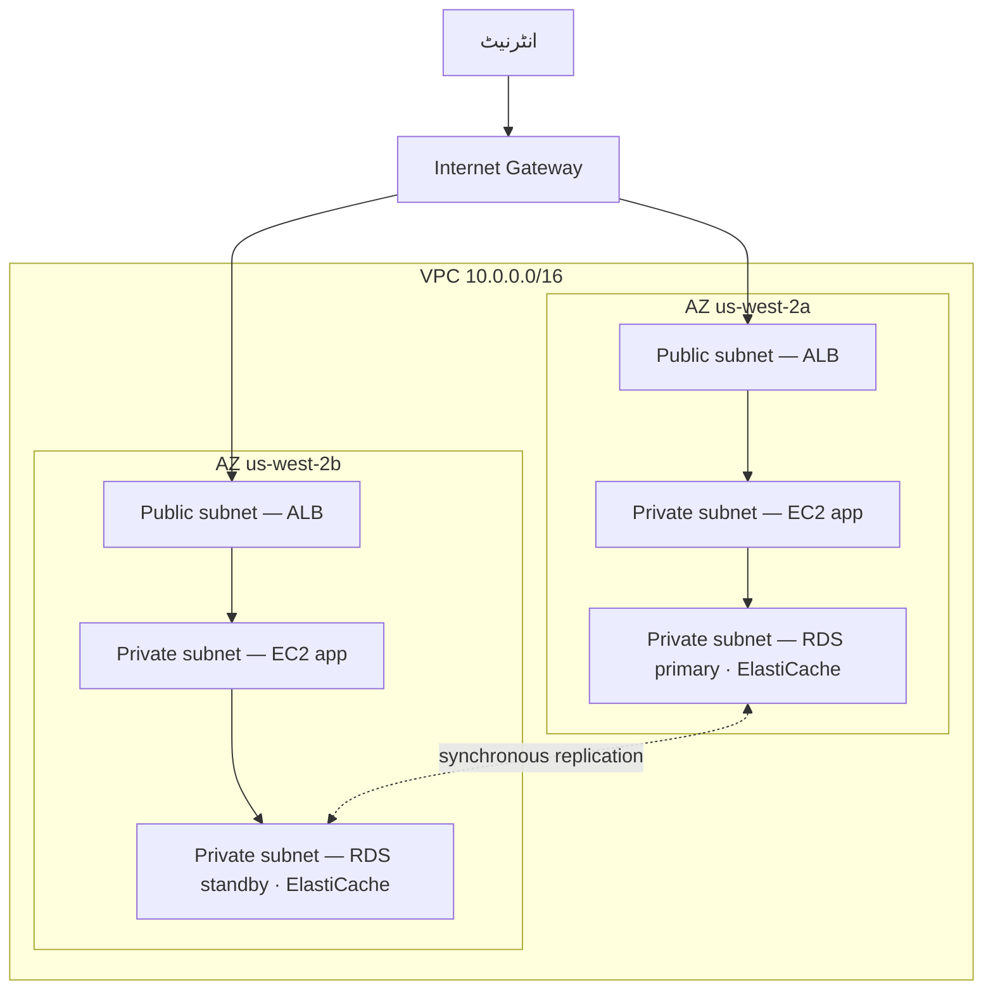

# باب ۱۱: بادل کا آپ کا نجی کونہ

Priya کے پاس ایک کاغذ کا ٹکڑا تھا جس پر ایک خاکہ تھا۔

یہ کوئی پیچیدہ خاکہ نہیں تھا۔ ایک مستطیل، جس پر "AWS" لکھا ہوا تھا۔ مستطیل کے اندر، ڈبوں کا ایک مجموعہ: EC2 انسٹینسز، ایک RDS ڈیٹابیس، ایک ElastiCache cluster۔ لائنیں ہر چیز کو ہر دوسری چیز سے جوڑ رہی تھیں۔ اور مستطیل کے باہر، ایک واحد label: "انٹرنیٹ۔"

اس نے اسے میز کے بیچ میں رکھا۔

---

*caching پرت کام کر رہی تھی۔ Redis نے صفحہ لوڈز کو 188 ملی سیکنڈ سے 12 پر کاٹ دیا تھا۔ لیکن جب Leo اس کامیابی کا جشن منا رہا تھا، Priya نیٹ ورک لاگز پڑھ رہی تھی — اور اسے جو نظر آیا وہ پسند نہیں آیا۔ ہر سروس ایک ہی فلیٹ نیٹ ورک پر تھی۔ ڈیٹابیس کا ایک عوامی IP پتہ تھا۔ Redis cluster تکنیکی طور پر باہر سے قابل رسائی تھا۔ ایپلیکیشن کام کرتی تھی، لیکن آرکیٹیکچر ایک پارکنگ لاٹ تھا: کوئی باڑیں نہیں، کوئی گیٹ نہیں، کوئی zones نہیں۔*

---

"یہ ہمارے پاس ہے،" اس نے کہا۔ "ہمارے ڈیٹابیس کا ایک عوامی IP پتہ ہے۔ ہماری cache پرت انٹرنیٹ سے قابل رسائی ہے۔ ہماری EC2 انسٹینسز سب ایک ہی فلیٹ نیٹ ورک پر ہیں۔"

"یہ ٹھیک لگتا ہے،" Leo نے کہا۔ "ہمارے پاس security groups ہیں۔"

"وہ security groups جو آپ نے ترتیب دیے،" Priya نے کہا۔ "رات کو۔ ابتدائی سیٹ اپ کے دوران۔"

Leo نے کچھ نہیں کہا۔

"میں ترتیب پر تنقید نہیں کر رہی،" اس نے کہا۔ "میں کہہ رہی ہوں کہ جب سب کچھ ایک فلیٹ عوامی نیٹ ورک پر رہتا ہے، تو ایک واحد غلط ترتیب کام کرنے والے نظام اور انٹرنیٹ پر ہر کسی کے لیے قابل رسائی نظام کے درمیان فرق ہے۔"

اس نے ایک سرخ مارکر اٹھایا اور ڈیٹابیس کے گرد ایک دائرہ کھینچا۔

"یہ انٹرنیٹ سے قابل رسائی نہیں ہونا چاہیے۔ بالکل نہیں۔ کسی security group rule کے ذریعے نہیں، کسی سخت ترتیب کے ذریعے نہیں۔ یہ ساختی طور پر ناقابل رسائی ہونا چاہیے۔"

"ہمیں نیٹ ورک آرکیٹیکچر کے بارے میں بات کرنے کی ضرورت ہے،" Maya نے کہا۔

"ہمیں تین ماہ پہلے اس کے بارے میں بات کرنی چاہیے تھی،" Priya نے کہا۔ "لیکن ابھی ٹھیک ہے۔"

ٹیم کئی ہفتوں میں پہلی بار وائٹ بورڈ کے گرد جمع ہوئی۔

**کھلی پارکنگ لاٹ کا مسئلہ**

ایک بڑے عوامی پارکنگ گیراج کا تصور کریں۔ دس ہزار گاڑیاں۔ کوئی بھی گاڑی کہیں بھی پارک کر سکتی ہے۔ zones کے درمیان کوئی رکاوٹ نہیں، کوئی گیٹ نہیں، کوئی محفوظ حصہ نہیں۔

یہ ایک کھلا نیٹ ورک ہے۔ ہر سروس ہر دوسری سروس تک پہنچ سکتی ہے۔ آپ کا ویب سرور آپ کے ڈیٹابیس سے بات کر سکتا ہے۔ آپ کا ڈیٹابیس انٹرنیٹ تک پہنچ سکتا ہے۔ آپ کی caching پرت کہیں سے بھی کنکشن وصول کر سکتی ہے۔

جب سب کچھ سب سے بات کر سکتا ہے، تو ایک سمجھوتہ ہر چیز کو متاثر کرتا ہے۔

"تو اگر کوئی پارکنگ گیراج میں گھس جائے،" Tom نے کہا، "وہ کسی بھی گاڑی میں جا سکتا ہے۔"

"اور کسی بھی گاڑی سے، کہیں بھی چلا سکتا ہے،" Priya نے تصدیق کی۔ "ہم باڑیں چاہتے ہیں۔ ہم بند گیٹ چاہتے ہیں۔ ہم zones چاہتے ہیں۔"

VPC ہی وہ طریقہ ہے جس سے آپ AWS میں وہ zones بناتے ہیں۔

**VPC کیا ہے؟**

"رکیں — لیکن ہم *کیوں* اسے اس طرح کریں؟" Maya نے پوچھا۔ "اگر ہمارے پاس پہلے سے ہی ہر resource پر security groups ہیں، تو ہمیں VPC کی ضرورت کیوں ہے؟ کیا security groups وہی کام نہیں کر رہے؟"

Security groups اور VPCs مختلف سطحوں پر تحفظ دیتے ہیں۔ ایک security group ایک مخصوص resource سے منسلک ایک قاعدہ ہے — یہ کہتا ہے "یہ EC2 انسٹینس صرف لوڈ بیلنسر سے port 8080 پر ٹریفک قبول کرتا ہے۔" لیکن یہ پھر بھی عوامی نیٹ ورک پر ہے۔ IP پتہ پھر بھی قابل رسائی ہے؛ قاعدہ صرف دروازے پر کنکشن کو روکتا ہے۔ ایک VPC دروازے کو عوامی گلی سے مکمل طور پر ہٹا دیتا ہے۔ private subnet میں ایک resource کا انٹرنیٹ تک کوئی *route* نہیں — اور رواج کے مطابق کوئی عوامی IP نہیں — لہٰذا اس تک انٹرنیٹ سے رسائی نہیں ہو سکتی، چاہے security group کچھ بھی کہے۔ یہ ایک ساختی ضمانت ہے، ترتیب کی نہیں۔

ایک **Virtual Private Cloud (VPC)** AWS کلاؤڈ کا ایک منطقی طور پر الگ تھلگ حصہ ہے — ایک نجی نیٹ ورک جسے آپ تعریف کرتے ہیں، جس تک ڈیفالٹ کے مطابق صرف آپ کے resources رسائی کر سکتے ہیں۔

اسے بڑے عوامی پارکنگ گیراج کے اندر ایک باڑ لگا نجی پلاٹ کے طور پر سوچیں۔ آپ کے پلاٹ کے اپنے قواعد ہیں: کون داخل ہو سکتا ہے، کون باہر جا سکتا ہے، sections کے درمیان کون سے راستے موجود ہیں۔

جب آپ VPC بناتے ہیں، تو آپ تعریف کرتے ہیں:

**ایک CIDR block**: آپ کے نیٹ ورک کے اندر دستیاب IP پتوں کی رینج۔ مثال کے طور پر، `10.0.0.0/16` آپ کو 65,536 ممکنہ IP پتے دیتا ہے (10.0.0.0 سے 10.0.255.255)۔

**Subnets**: آپ کے VPC کی تقسیمیں، ہر ایک کو آپ کی IP پتے کی رینج کا ایک حصہ تفویض کیا گیا اور ایک مخصوص Availability Zone سے منسلک۔

**Route tables**: قواعد جو طے کرتے ہیں کہ نیٹ ورک ٹریفک کہاں جاتی ہے۔

**Internet Gateway**: آپ کے VPC اور عوامی انٹرنیٹ کے درمیان کنکشن۔

**Subnets: عوامی بمقابلہ نجی**

تمام resources عوامی طور پر قابل رسائی نہیں ہونی چاہئیں۔

آپ کے ویب سرور کو انٹرنیٹ سے ٹریفک قبول کرنی ہے — صارفین کے براؤزرز کو اس تک پہنچنے کی ضرورت ہے۔

آپ کے ڈیٹابیس کو *کبھی بھی* انٹرنیٹ سے ٹریفک قبول نہیں کرنی چاہیے — صرف آپ کا ویب سرور ہی اس سے بات کر سکنا چاہیے۔

یہیں subnets کام آتے ہیں۔

ایک **public subnet** ایک Internet Gateway سے جڑا ہوا ہے اور عوامی IP پتوں والے resources رکھ سکتا ہے۔ ٹریفک انٹرنیٹ سے اور انٹرنیٹ کو جا سکتی ہے۔

ایک **private subnet** کا اپنی route table میں انٹرنیٹ کا کوئی route نہیں ہے۔ private subnet میں resources صرف آپ کے VPC کے اندر دوسرے resources سے ہی بات کر سکتی ہیں (جب تک آپ مخصوص outbound routes ترتیب نہ دیں)۔ رواج کے مطابق، ان کے کوئی عوامی IP پتے بھی نہیں ہوتے۔

Nimbus کے لیے، ڈیزائن واضح ہو گیا:



لوڈ بیلنسر عوام کے سامنے ہے — اسے انٹرنیٹ سے ٹریفک وصول کرنی ہے۔ EC2 انسٹینسز نجی ہیں — وہ صرف لوڈ بیلنسر سے ٹریفک وصول کرتی ہیں۔ ڈیٹابیسز نجی ہیں — وہ صرف EC2 انسٹینسز سے ٹریفک وصول کرتے ہیں۔

"تو ڈیٹابیس تک پہنچنے کے لیے،" Tom نے کہا، "کسی کو لوڈ بیلنسر کے ذریعے، پھر EC2 انسٹینس کے ذریعے، پھر ڈیٹابیس security group کے ذریعے جانا پڑے گا؟"

"تین پرتیں،" Priya نے تصدیق کی۔ "گہرائی میں دفاع۔"

---

**Nimbus کا CIDR منصوبہ**

"رکیں — لیکن ہم *کیوں* اسے اس طرح کریں؟" Maya نے CIDR block کے انتخاب دیکھتے ہوئے پوچھا۔ "Priya IP پتے کی رینجوں کے بارے میں اتنی مخصوص کیوں ہے؟ کیا ہم وہی استعمال نہیں کر سکتے جو AWS ڈیفالٹ کرتا ہے؟"

"کیونکہ CIDR blocks بعد میں بدلنا بہت مشکل ہے،" Priya نے کہا۔ "اور کیونکہ اگر ہم نے کبھی اس VPC کو کسی دوسرے VPC، یا کسی on-premises نیٹ ورک سے جوڑا، تو اوور لیپنگ IP رینجیں routing کی ناکامیاں پیدا کرتی ہیں جنہیں debug کرنا تکلیف دہ ہوتا ہے۔"

اس نے وائٹ بورڈ پر منصوبہ کھینچا۔

Nimbus کا VPC: `10.0.0.0/16` — کل 65,536 پتے۔

| Subnet | CIDR | AZ | مقصد |
|---|---|---|---|
| Public A | 10.0.0.0/24 | us-west-2a | لوڈ بیلنسرز |
| Public B | 10.0.1.0/24 | us-west-2b | لوڈ بیلنسرز |
| Private App A | 10.0.10.0/24 | us-west-2a | EC2 app سرورز |
| Private App B | 10.0.11.0/24 | us-west-2b | EC2 app سرورز |
| Private Data A | 10.0.20.0/24 | us-west-2a | RDS، ElastiCache |
| Private Data B | 10.0.21.0/24 | us-west-2b | RDS، ElastiCache |

"ہر چیز کو صرف /16 کیوں نہ بنائیں؟" Leo نے پوچھا۔

"کیونکہ مختلف AZs میں subnets کو ایک ہی پتے کی جگہ شیئر نہیں کرنی چاہیے۔ ہر subnet ایک AZ میں ہے۔ اگر ہم نے کبھی اس VPC کو کسی دوسرے کے ساتھ peer کیا، تو ہم جتنے باریک ہوں گے، اتنا کم امکان ہے کہ ہمارے پاس تنازعات ہوں۔ اور ہر /24 ہمیں 251 قابل استعمال پتے دیتا ہے — کسی ایک tier کے لیے کافی سے زیادہ۔"

"AWS ہر subnet میں پانچ پتے محفوظ رکھتا ہے،" Tom نے دستاویزات دیکھتے ہوئے مشاہدہ کیا۔ "اسی لیے یہ 251 ہے، 256 نہیں۔"

"درست۔ پہلے چار اور آخری ایک۔ Network پتہ، VPC router، DNS سرور، مستقبل کا استعمال، broadcast۔"

"تو /24 سب سے چھوٹا ہے جہاں تک آپ جائیں گے؟"

"عملی طور پر۔ آپ بہت چھوٹے subnets کے لیے /28 استعمال کریں گے — جیسے ایک VPN gateway subnet، جسے صرف چند IPs کی ضرورت ہوتی ہے۔ لیکن ایپلیکیشن tiers کے لیے، /24 ایک معقول کم از کم ہے۔"

Tom نے نمبر لکھے اور سائزوں کے درمیان ماہانہ لاگت کا فرق حساب کیا۔ وہ ہمیشہ کرتا تھا۔

---

**CIDR منصوبہ بندی کی غلطیاں جن سے بچنا ہے**

"کیا ہم نے سوچا ہے کہ اگر ہم کسی subnet سے بڑھ جائیں تو کیا ہوتا ہے؟" Priya نے پوچھا۔ وہ اس لیے نہیں پوچھ رہی تھی کہ اسے معلوم نہیں تھا۔ وہ اس لیے پوچھ رہی تھی کیونکہ باقی ٹیم کو جواب اپنے اندر سمونے کی ضرورت تھی۔

Leo نے اس پر سوچا۔ "ہم مزید subnets شامل کر سکتے ہیں؟"

"آپ ایک VPC میں subnets شامل کر سکتے ہیں۔ لیکن آپ کسی موجودہ subnet کا سائز تبدیل نہیں کر سکتے۔ اگر آپ کا private app subnet بھر جائے — 251 پتے کافی نہیں — تو آپ کو ایک نیا subnet بنانا اور انسٹینسز کو اس میں منتقل کرنا پڑے گا۔"

"یہ دراصل کتنی بار ہوتا ہے؟"

"شاذ و نادر، اگر آپ اچھی منصوبہ بندی کریں۔ لیکن لوگ تین عام غلطیاں کرتے ہیں۔"

اس نے انہیں فہرست بند کیا:

**غلطی ایک**: بہت چھوٹا VPC CIDR استعمال کرنا۔ اگر آپ پورے VPC کے لیے `10.0.0.0/24` استعمال کریں (254 پتے)، تو آپ subnets کی منصوبہ بندی مکمل کرنے سے پہلے ہی جگہ ختم کر دیں گے۔ لچک کے لیے `/16` سے شروع کریں۔

**غلطی دو**: VPCs میں اوور لیپنگ CIDRs استعمال کرنا۔ اگر آپ کا پروڈکشن VPC `10.0.0.0/16` ہے اور آپ کا staging VPC بھی `10.0.0.0/16` ہے، تو آپ انہیں کبھی peer نہیں کر سکتے یا transit gateway کے ذریعے جوڑ نہیں سکتے۔ routers کو معلوم نہیں ہوگا کہ ٹریفک کس VPC کو بھیجنی ہے۔

**غلطی تین**: مستقبل کے tiers کے لیے پتے کی جگہ محفوظ نہ کرنا۔ Nimbus کے منصوبے نے `10.0.30.0/24` اور `10.0.31.0/24` غیر تفویض چھوڑے — مستقبل کے داخلی tooling tier، ایک monitoring subnet، یا ایک VPN endpoint subnet کے لیے گنجائش، پوری پتے کی جگہ کی تشکیل نو کیے بغیر۔

"جتنا آپ سوچتے ہیں کہ آپ کو ضرورت ہے، اس سے دوگنا کے لیے منصوبہ بنائیں،" Priya نے کہا۔ "Subnets مفت ہیں۔ ایک `/16` سے IP پتے کی جگہ وافر ہے۔ غلط منصوبہ بندی کی لاگت ایک نیٹ ورک منتقلی ہے۔"

---

**NAT Gateway: نجی Subnets جو پھر بھی چیزیں ڈاؤن لوڈ کر سکتے ہیں**

نجی subnets انٹرنیٹ تک نہیں پہنچ سکتے۔ لیکن کبھی کبھی، انہیں ضرورت پڑتی ہے۔ آپ کی EC2 انسٹینس کو ایک سافٹ ویئر اپڈیٹ ڈاؤن لوڈ کرنی ہے۔ آپ کی ایپلیکیشن کو ایک بیرونی API کال کرنی ہے۔

یہیں **NAT Gateway** (Network Address Translation) کام آتا ہے۔

NAT Gateway ایک public subnet میں بیٹھتا ہے۔ private subnets میں resources NAT Gateway کو outbound ٹریفک بھیج سکتے ہیں، جو اسے انٹرنیٹ تک relay کرتا ہے — لیکن انٹرنیٹ واپس connections شروع نہیں کر سکتا۔

یہ ایک طرفہ گھومنے والے دروازے کی طرح ہے۔ آپ باہر جا سکتے ہیں۔ باہر کا کوئی اندر نہیں آ سکتا۔

"اس پر فی مہینہ کتنا خرچ آتا ہے؟" Tom نے پوچھا۔

NAT Gateway کی قیمت کے دو اجزاء ہیں: ہر NAT Gateway کے لیے فی گھنٹہ چارج، اور فی-GB ڈیٹا پروسیسنگ فیس۔

جس وقت Nimbus نے اسے سیٹ کیا، یہ تقریباً $32/مہینہ فی NAT Gateway تھا، علاوہ پروسیس کیے گئے فی GB ڈیٹا کے $0.045۔ چھوٹی ٹریفک مقدار کے لیے، مقررہ لاگت غالب رہتی ہے۔ پیمانے پر، ڈیٹا چارجز خاطر خواہ ہو سکتے ہیں۔

Tom نے NAT Gateway ترتیب مکمل کرنے سے پہلے ڈیٹا پروسیسنگ لاگتوں کے لیے ایک billing alert سیٹ کیا۔ اس نے دیکھا تھا کہ AWS ڈیٹا لاگتیں کیسی نظر آتی ہیں جب کوئی انہیں نہیں دیکھ رہا ہوتا۔

وہ حیرت جو ٹیموں کو بے خبری میں پکڑتی ہے: ہر بائٹ جو NAT Gateway سے گزرتا ہے، چارج ہوتا ہے۔ اگر نجی subnets میں آپ کی EC2 انسٹینسز بڑے سافٹ ویئر packages ڈاؤن لوڈ کر رہی ہیں، بیرونی سروسز کو لاگز stream کر رہی ہیں، یا بیرونی APIs کو خاطر خواہ ڈیٹا بھیج رہی ہیں، تو NAT Gateway ڈیٹا چارجز بل پر ایک حیرت کے طور پر ظاہر ہوتے ہیں۔ AWS-to-AWS ٹریفک کا حل: VPC Endpoints ٹریفک کو AWS سروسز (S3، DynamoDB) تک نجی طور پر route کرتے ہیں، NAT Gateway کو مکمل طور پر bypass کرتے ہیں اور ان ڈیٹا چارجز کو ختم کرتے ہیں۔

"تو نجی subnet میں EC2 انسٹینسز NAT Gateway کے ذریعے OS اپڈیٹس ڈاؤن لوڈ کرتی ہیں،" Tom نے کہا۔ "وہ اپڈیٹس کتنے gigabytes ہیں؟"

"فی انسٹینس، فی مہینہ، شاید دو سے پانچ GB،" Leo نے کہا۔

"ضرب دس انسٹینسز۔ ضرب بارہ مہینے۔ $0.045 فی GB پر—"

"گیارہ سے ستائیس ڈالر فی سال،" Priya نے مکمل کیا۔ "اس صورت میں، قابل قبول۔"

"لیکن اگر ہم لاگز stream کر رہے ہوتے — جیسے اپنے تمام ایپلیکیشن لاگز کسی بیرونی observability سروس کو بھیجنا—"

"تو ہم انہیں ایک VPC Endpoint کے ذریعے route کرتے یا NAT کے ذریعے باہر جانے کے بجائے CloudWatch Logs استعمال کرتے۔"

Tom نے کیلکولیٹر بند کر دیا۔ حساب کافی واضح تھا۔

### NAT Instance: بجٹ کا متبادل

"رکیں،" Tom نے کہا، اب بھی pricing صفحہ کو گھورتے ہوئے۔ "ہم صرف نجی انسٹینسز کو انٹرنیٹ تک پہنچنے دینے کے لیے فی gigabyte ادائیگی کر رہے ہیں؟ یہی واحد آپشن ہے؟"

"یہ منیجڈ آپشن ہے،" Priya نے کہا۔ "ایک پرانا طریقہ ہے، لیکن یہ ٹریڈ آفس کے ساتھ آتا ہے۔"

NAT Gateway کے وجود میں آنے سے پہلے، ٹیمیں ایک عام EC2 انسٹینس — ایک "NAT instance" — کے ساتھ وہی outbound routing حاصل کرتی تھیں۔ آپ ایک public subnet میں ایک EC2 انسٹینس لانچ کرتے، OS میں IP forwarding فعال کرتے، source/destination check غیر فعال کرتے (جسے AWS انسٹینس کو نہ بھیجے گئے packets گرانے کے لیے ڈیفالٹ کے طور پر فعال کرتا ہے)، اور private subnet کی route table کو انسٹینس کی ENI کی طرف اشارہ کرتے۔ نجی انسٹینسز سے ٹریفک اس کے ذریعے انٹرنیٹ تک بہتی، بالکل NAT Gateway کی طرح۔

یہ اب بھی کام کرتا ہے۔ AWS اب بھی اسے دستاویز کرتا ہے۔ اور بہت کم ٹریفک مقدار پر — ایک واحد dev ماحول جہاں چند انسٹینسز کبھی کبھار packages ڈاؤن لوڈ کرتی ہیں — ایک `t3.micro` NAT instance پانچ ڈالر فی مہینہ سے کم خرچ کر سکتا ہے، بمقابلہ NAT Gateway کے مقررہ فی گھنٹہ چارج علاوہ فی-GB فیس۔

| | NAT Gateway | NAT Instance |
|---|---|---|
| انتظام | AWS کے ذریعے مکمل طور پر منیجڈ | آپ EC2 منظم کرتے ہیں |
| دستیابی | AZ کے اندر redundant | واحد EC2 — ناکامی کا واحد نقطہ |
| Bandwidth | 100 Gbps تک، خودبخود اسکیل ہوتی ہے | EC2 انسٹینس قسم سے محدود |
| لاگت | $0.045/GB + فی گھنٹہ چارج | صرف EC2 انسٹینس لاگت |

لاگت کا فائدہ تیزی سے غائب ہو جاتا ہے۔ بامعنی ٹریفک مقدار پر، فی-GB NAT Gateway چارج اس EC2 انسٹینس قسم کے ساتھ مسابقتی ہے جو آپ کو اس bandwidth کو سنبھالنے کے لیے درکار ہوگی — اور NAT Gateway کو صفر patching، صفر monitoring، اور ناکام ہونے پر صفر incident response کی ضرورت ہوتی ہے (یہ ناکام نہیں ہوتا)۔

"تو ہم دراصل NAT instance کب استعمال کریں گے؟" Leo نے پوچھا۔

"ایک پھینکنے والا dev ماحول،" Priya نے کہا۔ "جہاں آپ ایک یا دو انسٹینسز چلا رہے ہوں، کبھی کبھار package اپڈیٹس کر رہے ہوں، اور مقررہ لاگت کم سے کم کرنا چاہتے ہوں۔ پروڈکشن ورک لوڈز — کوئی بھی چیز جسے دستیاب ہونے کی ضرورت ہو — NAT Gateway، فی AZ ایک۔"

امتحان اس ٹریڈ آف کو نام سے ٹیسٹ کرتا ہے۔ نمونہ: "کم ٹریفک والے dev یا test ماحول میں NAT لاگت کم سے کم کریں" NAT Instance کی طرف اشارہ کرتا ہے۔ "اعلیٰ دستیابی کا تقاضا کرنے والا پروڈکشن ورک لوڈ" فی AZ تعینات NAT Gateway کی طرف اشارہ کرتا ہے۔

آپ سوچ رہے ہوں گے: اگر security groups پہلے سے موجود ہیں اور ڈیفالٹ کے مطابق ٹریفک روکتے ہیں، تو نجی subnets والا VPC بامعنی تحفظ کیوں شامل کرتا ہے؟ کیونکہ "ایک security group سے روکا گیا" اور "ساختی طور پر ناقابل رسائی" مختلف چیزیں ہیں۔ ایک security group کی غلط ترتیب — ایک غلط قاعدہ، ایک کھلی port — ایک ایسے resource کو بے نقاب کر سکتی ہے جس کا عوامی IP ہو۔ private subnet میں ایک resource کا سرے سے کوئی عوامی IP نہیں ہوتا جس تک پہنچا جائے۔ آپ کو ڈیٹابیس تک پہنچنے کی کوشش کرنے سے پہلے لوڈ بیلنسر اور ایک چلتی ہوئی EC2 انسٹینس دونوں کو compromise کرنا ہوگا۔ نجی subnets نیٹ ورک کی سطح پر تنہائی نافذ کرتے ہیں، قاعدے کی سطح پر نہیں۔

**Route Tables: ٹریفک کو راستہ کیسے ملتا ہے**

ہر subnet کی ایک **route table** ہوتی ہے جو ٹریفک کو بتاتی ہے کہ کہاں جانا ہے۔

ایک عام public subnet route table اس طرح نظر آتی ہے:

| Destination | Target                      |
|-------------|-----------------------------|
| 10.0.0.0/16 | local                       |
| 0.0.0.0/0   | igw-xxxx (Internet Gateway) |

پہلا قاعدہ: آپ کی VPC رینج میں کسی بھی IP کی ٹریفک local رہتی ہے۔ دوسرا قاعدہ: باقی تمام ٹریفک (`0.0.0.0/0` کا مطلب "سب کچھ") Internet Gateway جاتی ہے۔

ایک private subnet route table:

| Destination | Target                 |
|-------------|------------------------|
| 10.0.0.0/16 | local                  |
| 0.0.0.0/0   | nat-xxxx (NAT Gateway) |

Private subnet ٹریفک local رہتی ہے یا NAT Gateway کے ذریعے باہر جاتی ہے۔ Internet Gateway کا کوئی براہ راست route نہیں۔

**Security Groups بمقابلہ NACLs (پیش نظارہ)**

VPC کے اندر، آپ کے پاس resource کی سطح پر ٹریفک کنٹرول کرنے کے لیے دو ٹولز ہیں:

**Security Groups** (باب ۱۵ اسے گہرائی سے کور کرتا ہے) انفرادی resources کے لیے ورچوئل firewalls کا کام کرتے ہیں — ایک EC2 انسٹینس، ایک RDS انسٹینس، ایک لوڈ بیلنسر۔ وہ *stateful* ہیں: اگر ٹریفک کو اندر آنے کی اجازت ہو، تو response ٹریفک خودبخود باہر جانے کی اجازت ہوتی ہے۔

**Network ACLs (NACLs)** subnet کی سطح پر کام کرتے ہیں اور *stateless* ہیں: آپ کو inbound اور outbound ٹریفک دونوں کے لیے الگ الگ واضح طور پر اجازت دینی ہوتی ہے۔

زیادہ تر استعمال کے کیسز کے لیے، Security Groups کافی ہیں۔ NACLs ایک اضافی پرت شامل کرتے ہیں جب آپ کو subnet کی سطح کے controls کی ضرورت ہو — مثلاً کسی مخصوص IP رینج کو کسی subnet تک پہنچنے سے ہمیشہ کے لیے روکنا۔

"Security groups instance کی سطح پر،" Leo نے وائٹ بورڈ پر لکھا۔ "NACLs subnet کی سطح پر۔"

"اور port 22 کبھی بھی 0.0.0.0/0 کے لیے نہ کھلی چھوڑیں،" Priya نے Leo کو دیکھتے ہوئے اضافہ کیا۔

"وہ ایک بار تھا،" Leo نے کہا۔

"یہ ہمیشہ بالکل ایک بار ہوتا ہے،" Priya نے کہا، "جب تک نہیں ہوتا۔"

"اور کیا ہو اگر کوئی توڑ کر داخل ہونے کی کوشش کرے؟" Priya نے کہا، اب بھی وائٹ بورڈ پر۔ "کسی غلط ترتیب شدہ security group کے ذریعے نہیں — کیا ہو اگر وہ خود لوڈ بیلنسر کو compromise کر لیں؟ انہیں نجی subnet میں pivot کرنے سے کیا روکتا ہے؟"

"نجی subnet کی EC2 انسٹینسز صرف لوڈ بیلنسر کے security group سے ٹریفک قبول کرتی ہیں،" Leo نے کہا۔ "چاہے لوڈ بیلنسر compromise ہو، حملہ آور صرف ایسی درخواستیں کر سکتا ہے جو عام API calls کی طرح نظر آئیں۔"

"اور ڈیٹابیس صرف EC2 security group سے ٹریفک قبول کرتا ہے،" Priya نے کہا۔ "گہرائی میں دفاع۔ ہر پرت یہ فرض کرتی ہے کہ پچھلی ناکام ہو سکتی ہے۔"

---

**VPC Flow Logs: دیکھنا کہ کیا ہو رہا ہے**

"ہمیں نیٹ ورک پر نظر چاہیے،" Priya نے VPC کے نئے ڈیزائن کے تین دن بعد کہا۔

"ہمارے پاس security groups اور NACLs ہیں،" Leo نے کہا۔ "ٹریفک کنٹرول میں ہے۔"

"کنٹرول میں ہونے کا مطلب نظر آنا نہیں۔ اگر کوئی عجیب بات ہو — ایک غیر متوقع کنکشن کی کوشش، کسی عجیب port پر ٹریفک — تو ہمیں کیسے پتہ چلے گا؟"

VPC Flow Logs آپ کے VPC سے بہنے والی نیٹ ورک ٹریفک کے بارے میں metadata پکڑتے ہیں۔ packet کے مواد نہیں — صرف کنکشن کی سطح کی معلومات: source IP، destination IP، port، protocol، packet گنتی، byte گنتی، آغاز کا وقت، اختتام کا وقت، اور آیا ٹریفک قبول کی گئی یا مسترد۔

ایک عام flow log entry اس طرح نظر آتی ہے:

```
2 123456789012 eni-0abc123 10.0.10.5 10.0.20.8 49321 5432 6 20 4320 1620000000 1620000060 ACCEPT OK
```

یہ آپ کو بتاتا ہے: `10.0.10.5` (app subnet میں ایک EC2 انسٹینس) سے `10.0.20.8` (RDS انسٹینس) تک، port 5432 (PostgreSQL)، 20 packets، 4,320 bytes، قبول۔ عام ٹریفک۔

لیکن Flow Logs فعال کرنے کے چند دن بعد، Priya نے یہ پایا:

```
2 123456789012 eni-0abc123 185.220.101.55 10.0.10.5 0 8080 6 1 40 1620003200 1620003201 REJECT OK
```

ایک بیرونی IP — `185.220.101.55` — نے port 8080 پر EC2 انسٹینس سے کنکشن کی کوشش کی تھی۔ کنکشن security group کے ذریعے مسترد کر دیا گیا۔ لیکن کوشش لاگ ہو گئی۔

اس نے IP تلاش کیا۔ یہ ایک رومانیائی پتے کے بلاک سے تعلق رکھتا تھا جو خودکار اسکیننگ کے لیے مشہور تھا — وہ پس منظر کے شور کی قسم کا probing جو انٹرنیٹ پر ہر عوامی IP کو مسلسل ملتا رہتا ہے۔

"کوئی ہمیں probe کر رہا ہے،" اس نے کہا۔

"لیکن مسترد ہو رہا ہے،" Leo نے کہا۔

"اس بار۔ GuardDuty فعال کریں" — ایک خطرے کا پتہ لگانے والی سروس جس سے ہم باب ۱۷ میں ٹھیک سے ملیں گے — "اس سے پہلے کہ ہم آگے بڑھیں۔ ہمیں رویے پر مبنی detection چاہیے، صرف perimeter blocking نہیں۔"

Flow Logs CloudWatch Logs یا S3 میں محفوظ ہوتے ہیں۔ انہیں CloudWatch Insights یا Athena کا استعمال کرتے ہوئے query کیا جا سکتا ہے۔ Priya نے ایک CloudWatch Insights query سیٹ کی جو رات کو چلتی اور غیر-AWS IP رینجوں سے کسی بھی مسترد کنکشن کی کوششوں کو flag کرتی۔

"اس پر فی مہینہ کتنا خرچ آتا ہے؟" Tom نے پوچھا۔

"Flow logs CloudWatch یا S3 میں ingest کیے گئے فی GB ڈیٹا پر چارج ہوتے ہیں۔ ہماری ٹریفک مقدار پر، شاید آٹھ سے پندرہ ڈالر فی مہینہ۔"

Tom رکا۔ "اور متبادل یہ ہے کہ ہمیں معلوم نہ ہو کہ کوئی ہمارے نیٹ ورک کو probe کر رہا ہے۔"

"ہاں۔"

"یہ ٹھیک ہے،" اس نے کہا، اور console کھولا۔

**Flow Logs میں ایک Port Scan پڑھنا**

flow logs فعال کرنے کے دو ہفتے بعد، Priya نے اپنی رات کی CloudWatch Insights query چلائی اور کچھ نیا پایا۔ ایک مسترد کنکشن نہیں — درجنوں، تیز ترتیب میں، ایک ہی source IP سے، یکے بعد دیگرے ports پر۔

```
185.220.101.55 → 10.0.10.5 port 22   REJECT
185.220.101.55 → 10.0.10.5 port 23   REJECT
185.220.101.55 → 10.0.10.5 port 25   REJECT
185.220.101.55 → 10.0.10.5 port 80   REJECT
185.220.101.55 → 10.0.10.5 port 443  REJECT
185.220.101.55 → 10.0.10.5 port 3306 REJECT
185.220.101.55 → 10.0.10.5 port 5432 REJECT
185.220.101.55 → 10.0.10.5 port 6379 REJECT
```

سب ایک پانچ سیکنڈ کی کھڑکی کے اندر۔ سب مسترد۔

"یہ ایک port scan ہے،" Priya نے کہا۔ "کوئی probe کر رہا ہے کہ یہ انسٹینس کون سی سروسز چلا رہی ہے۔"

"لیکن سب مسترد،" Leo نے کہا۔ "تو security group اپنا کام کر رہا ہے۔"

"security group اپنا کام کر رہا ہے۔ scan پھر بھی حملہ آور کے لیے معلوماتی ہے — یہ انہیں بتاتا ہے کہ کون سی ports نے ایک timeout کے اندر مسترد *نہیں* کیا، جس کا مطلب ہے کہ وہ ports کہیں کھلی ہیں۔ اور یہ انہیں بتاتا ہے کہ یہ host زندہ ہے اور تفتیش کے قابل ہے۔"

"ہم کیا کریں؟"

"دو چیزیں،" Priya نے کہا۔ "پہلی: اس /24 رینج کو روکنے کے لیے ایک NACL قاعدہ شامل کریں جس سے وہ IP تعلق رکھتا ہے۔ صرف وہ IP نہیں — پورا subnet۔ Port scanners ایک رینج کے اندر IPs گھماتے ہیں۔ دوسری: ایک CloudWatch alarm شامل کریں جو تب fire ہو جب کوئی واحد source IP ساٹھ سیکنڈ میں دس سے زیادہ مسترد کنکشن پیدا کرے۔ وہ نمونہ تقریباً ہمیشہ ایک scan ہوتا ہے۔"

اس نے دونوں سیٹ کیے۔ alarm اگلے ہفتے دو بار fire ہوا — ایک بار اسی رومانیائی رینج سے، ایک بار سنگاپور میں مقیم ایک خودکار scanner سے۔ دونوں کو detection کے منٹوں کے اندر NACL پر روک دیا گیا۔

Flow logs حملوں کو نہیں روکتے۔ وہ حملوں کو نظر آنے والا بناتے ہیں۔ اور نظر آنے والے حملوں کا جواب دیا جا سکتا ہے۔ متبادل — ٹریفک کا نادیدہ بہنا — کا مطلب ہے کہ مسئلے کی پہلی علامت نقصان ہے، کوشش نہیں۔

---

**سنگل NAT Gateway کا جال**

VPC کے نئے ڈیزائن کے تین ماہ بعد، Priya نے ایک ناکامی کی نقل چلائی۔ وہ جاننا چاہتی تھی کہ اگر `us-west-2a` availability zone میں خلل آئے تو Nimbus کے ساتھ کیا ہوگا۔

اس کا زیادہ تر ٹھیک تھا۔ لوڈ بیلنسر `us-west-2b` میں انسٹینسز پر failover ہو گیا۔ `us-west-2b` میں RDS standby پہلے سے live تھا۔ ElastiCache نے replica کو ترقی دی۔ ایپلیکیشن درخواستیں پیش کرتی رہی۔

پھر Leo نے دیکھا کہ `us-west-2b` میں اس کی EC2 انسٹینسز نے OS اپڈیٹ کی اطلاعات وصول کرنا بند کر دیا تھا۔ اس نے NAT Gateway ترتیب چیک کی۔

ایک تھا۔ `us-west-2a` میں۔

"دونوں AZs میں نجی subnets سے تمام outbound انٹرنیٹ ٹریفک ایک AZ میں ایک NAT Gateway کے ذریعے route ہوتی ہے،" Priya نے کہا۔

"تو اگر `us-west-2a` ڈاؤن ہو جائے—"

"`us-west-2b` میں ہر EC2 انسٹینس outbound انٹرنیٹ رسائی کھو دیتی ہے۔ وہ اپڈیٹس ڈاؤن لوڈ نہیں کر سکتیں۔ وہ بیرونی APIs تک نہیں پہنچ سکتیں۔ Secrets Manager lookups جو cache نہ ہوں ناکام ہو جائیں گی۔ کوئی بھی چیز جسے outbound انٹرنیٹ کی ضرورت ہو ٹوٹ جائے گی۔"

حل: فی AZ ایک NAT Gateway۔ ہر AZ کے نجی subnets اسی AZ میں NAT Gateway کو outbound ٹریفک route کرتے ہیں۔ جب ایک AZ ناکام ہو، تو صرف اس AZ کی ٹریفک متاثر ہوتی ہے۔

"اور اس حل کی قیمت؟" Tom نے پوچھا۔

"دوسرے AZ کے NAT Gateway کے لیے ایک اضافی بتیس ڈالر فی مہینہ۔"

Tom ایک لمحے کے لیے خاموش رہا۔

"کسی outage کے دوران `us-west-2b` میں EC2 صلاحیت کا بیرونی APIs تک پہنچنے میں ناکام ہونا،" Priya نے کہا، "بتیس ڈالر سے زیادہ خرچ کرتا ہے۔"

Tom نے تبدیلی منظور کی۔

یہ سب سے عام VPC ڈیزائن غلطیوں میں سے ایک ہے: ایک NAT Gateway جو اعلیٰ دستیابی کا نظر آتا ہے لیکن دراصل ناکامی کا واحد نقطہ ہے۔ اگر آپ کے پاس تین AZs میں resources ہیں اور ایک NAT Gateway، تو آپ کے پاس تین-AZ compute لچک ہے لیکن ایک-AZ نیٹ ورک لچک۔ دونوں میل نہیں کھاتے۔

قاعدہ: فی AZ ایک NAT Gateway، اس AZ کے public subnet میں۔ ہر AZ کی نجی route table اپنے NAT Gateway کی طرف اشارہ کرتی ہے۔ لاگت معمولی ہے۔ دستیابی کی بہتری حقیقی ہے۔

---

**VPC Peering: نجی نیٹ ورکس کو جوڑنا**

کیا ہو اگر Nimbus متعدد VPCs میں بڑھ جائے؟ (یہ ہوتا ہے۔ ٹیمیں بڑی ہوتی ہیں۔ سروسز الگ الگ accounts میں الگ ہو جاتی ہیں۔)

**VPC Peering** دو VPCs کو ایک ہی نیٹ ورک پر ہونے کی طرح نجی طور پر بات کرنے دیتا ہے۔ ٹریفک AWS کے نجی نیٹ ورک سے باہر نہیں جاتی۔

اہم حدود:

- VPC peering transitive نہیں ہے۔ اگر VPC A، VPC B کے ساتھ peer ہو، اور VPC B، VPC C کے ساتھ peer ہو، تو A اور C بات نہیں کر سکتے — جب تک آپ ایک براہ راست A-C peer نہ شامل کریں۔
- Peered VPCs کے درمیان CIDR blocks اوور لیپ نہیں کر سکتے۔

بہت سارے VPCs کے ساتھ بڑے آرکیٹیکچرز کے لیے، **AWS Transit Gateway** (باب ۲۵) peering connections کے مکمل mesh کی ضرورت کے بغیر transitive routing سنبھالتا ہے۔

---

**AWS PrivateLink: AWS سروسز تک نجی رسائی**

"نجی subnet سے S3 تک پہنچنے کا کیا؟" Leo نے پوچھا۔ "ہماری EC2 انسٹینسز S3 پر رسیدیں لکھتی ہیں۔ ابھی وہ ٹریفک NAT Gateway کے ذریعے باہر جاتی ہے۔"

"VPC Endpoints،" Priya نے کہا۔ "خاص طور پر، S3 اور DynamoDB کے لیے Gateway Endpoints — وہ مفت ہیں۔"

ایک **VPC Endpoint** آپ کے VPC اور ایک AWS سروس کے درمیان ایک نجی کنکشن بناتا ہے، عوامی انٹرنیٹ کو مکمل طور پر bypass کرتا ہے۔ آپ کے نجی subnet اور AWS سروس کے درمیان ٹریفک AWS نیٹ ورک پر رہتی ہے۔ کوئی NAT Gateway چارج نہیں۔ کوئی انٹرنیٹ exposure نہیں۔

S3 اور DynamoDB کے لیے، **Gateway Endpoints** مفت اور آسان ہیں: route table میں ایک entry شامل کریں جو S3/DynamoDB ٹریفک کو NAT Gateway کے بجائے endpoint کی طرف اشارہ کرے۔

دیگر AWS سروسز (Secrets Manager، KMS، SNS، SQS) کے لیے، **Interface Endpoints** آپ کے subnet میں ایک نجی IP پتے کے ساتھ ایک elastic network interface (ENI) بناتے ہیں۔ سروس کی ٹریفک اس نجی IP کو جاتی ہے۔ Interface endpoints پیسے خرچ کرتے ہیں — تقریباً $0.01/گھنٹہ **فی AZ جس میں endpoint provision کیا جائے** (تین AZs میں ENIs والا ایک endpoint فی گھنٹہ شرح سے تین گنا خرچ کرتا ہے)، علاوہ پروسیس کیے گئے ڈیٹا کے تقریباً $0.01/GB — لیکن یہ حساس API calls (جیسے Secrets Manager lookups) کو NAT Gateway کے ذریعے یا عوامی انٹرنیٹ پر route کرنے کی ضرورت ختم کرتے ہیں۔

"تو ہماری EC2 انسٹینسز S3، DynamoDB، Secrets Manager، اور KMS تک پہنچ سکتی ہیں،" Priya نے کہا، "سب نجی subnet سے، کسی انٹرنیٹ exposure کے بغیر، اور S3 اور DynamoDB کے لیے، کسی NAT Gateway ڈیٹا چارجز کے بغیر۔"

Tom نے دوبارہ حساب لگایا۔ S3 ٹریفک کی بچت چند مہینوں میں Secrets Manager کے لیے Interface Endpoint کی لاگت کو پورا کر دے گی۔

"PrivateLink عام نام ہے،" Priya نے اضافہ کیا۔ "AWS PrivateLink Interface Endpoints کے لیے بنیادی ٹیکنالوجی ہے۔ امتحان دونوں اصطلاحات استعمال کرتا ہے۔"

---

**ایک Debugging چیک لسٹ**

VPC کے نئے ڈیزائن کے تین ماہ بعد، Leo نے نیٹ ورک توڑ دیا۔ ڈرامائی طور پر نہیں — اس نے ایک route table association میں ترمیم کی تھی اور حادثاتی طور پر private app subnet کو اس کے NAT Gateway route سے منقطع کر دیا تھا۔

EC2 انسٹینسز بیرونی APIs تک نہیں پہنچ سکتی تھیں۔ وہ ایک دوسرے تک پہنچ سکتی تھیں، اور وہ ڈیٹابیسز تک پہنچ سکتی تھیں۔ بس انٹرنیٹ تک نہیں۔ Outbound HTTPS calls ناکام ہونا شروع ہو گئیں۔

اس نے چالیس منٹ مسئلہ حل کرنے میں گزارے اس سے پہلے کہ Priya نے اسے ایک چیک لسٹ دی۔

"جب کوئی چیز VPC میں کسی دوسری چیز تک نہ پہنچے، تو انہیں ترتیب سے چیک کریں،" اس نے کہا۔

1. **source پر security group**: کیا outbound قاعدہ درست ہے؟ کیا یہ اس ٹریفک کی اجازت دیتا ہے جو آپ بھیجنے کی کوشش کر رہے ہیں؟
2. **destination پر security group**: کیا inbound قاعدہ درست ہے؟ کیا یہ source سے ٹریفک کی اجازت دیتا ہے؟
3. **source subnet پر NACL**: کیا کوئی inbound deny قاعدہ response ٹریفک کو روک رہا ہے؟ کیا کوئی outbound allow قاعدہ ہے؟
4. **destination subnet پر NACL**: کیا کوئی inbound allow قاعدہ ہے؟ کیا responses کے لیے کوئی outbound allow قاعدہ ہے؟
5. **source subnet پر route table**: کیا اس کا destination تک ایک route ہے؟ کیا route صحیح target (NAT Gateway، IGW، VPC Endpoint) کی طرف اشارہ کر رہا ہے؟
6. **destination subnet پر route table**: کیا اس کا source کی طرف واپس ایک route ہے؟
7. **VPC Endpoint policy**: اگر VPC Endpoint استعمال کر رہے ہیں، تو کیا endpoint policy اس کارروائی کی اجازت دیتی ہے؟
8. **IAM اجازتیں**: کیا EC2 role کو سروس کال کرنے کی اجازت ہے؟ (AWS API calls کے لیے)

Leo نے اسے مرحلہ 5 پر پایا۔ route table کو غلط نجی subnet سے دوبارہ منسلک کر دیا گیا تھا۔ NAT Gateway route غائب تھا۔

"اگر مجھے یہ فہرست تین ماہ پہلے ملی ہوتی،" اس نے کہا، "تو میں اسے پانچ منٹ میں ڈھونڈ لیتا۔"

"اب سے آپ کے پاس یہ ہوگی،" Priya نے کہا۔

## Direct Connect: وقف شدہ لائن

VPC کے نئے ڈیزائن کے تین ماہ بعد، Nimbus نے Harborview Dining Group کے ساتھ ایک ڈیل بند کی — ایک سو-مقامات والی انٹرپرائز چین جو فی دن دو ملین ڈالر کے لین دین پروسیس کرتی تھی۔

تکنیکی جائزے کی کال اچھی طرح شروع ہوئی۔ پھر ان کے compliance افسر نے unmute کیا۔

"ہم پروڈکشن لین دین کا ڈیٹا عوامی انٹرنیٹ پر route نہیں کر سکتے،" اس نے کہا۔ "ہمارے auditors ہمارے ڈیٹا سینٹر اور کسی بھی کلاؤڈ ماحول کے درمیان ایک وقف شدہ، نجی، قابل تصدیق نیٹ ورک راستہ چاہتے ہیں۔ Site-to-Site VPN قابل قبول نہیں ہے۔ یہ ہر کسی کے ساتھ bandwidth شیئر کرتا ہے۔ یہ انہی تاروں پر سفر کرتا ہے جیسے صارف کی ٹریفک۔"

Tom نے Leo کی طرف دیکھا۔ Leo نے Priya کی طرف دیکھا۔

"درست ہونے کے لیے،" Priya نے احتیاط سے کہا، "PCI DSS خود انٹرنیٹ پر ایک encrypted VPN کو ممنوع نہیں کرتا — encrypted transport معیار کو پورا کرتا ہے۔ جو آپ بیان کر رہی ہیں وہ آپ کے auditors کی داخلی پالیسی ہے، جو زیادہ سخت ہے۔ یہ جائز ہے۔ اور اس کے لیے ایک سروس موجود ہے۔"

**AWS Direct Connect** آپ کے on-premises ڈیٹا سینٹر اور AWS کے درمیان ایک وقف شدہ جسمانی نیٹ ورک کنکشن ہے۔ کنکشن عوامی انٹرنیٹ کو مکمل طور پر bypass کرتا ہے — آپ کی ٹریفک کبھی مشترکہ بنیادی ڈھانچے کو نہیں چھوتی، کبھی کسی اور کے ساتھ bandwidth کے لیے مقابلہ نہیں کرتی، اور کبھی ایسے تار پر سفر نہیں کرتی جو آپ کا نہیں ہے۔

Direct Connect سیٹ اپ کرنے کا مطلب AWS اور ایک colocation یا نیٹ ورک فراہم کنندہ کے ساتھ کام کرنا ہے تاکہ ایک Direct Connect مقام پر ایک جسمانی cross-connect نصب کیا جائے — ایک ڈیٹا سینٹر جہاں AWS کے پاس وقف شدہ آلات ہوں۔ ایک بار جسمانی لنک لگ جانے کے بعد، آپ اس پر virtual interfaces قائم کرتے ہیں جو آپ کے VPC یا براہ راست AWS سروسز سے جڑتے ہیں۔

**اہم خصوصیات:**

Bandwidth دو شکلوں میں آتی ہے۔ *Dedicated connections* براہ راست AWS ہارڈ ویئر کو جاتے ہیں: 1 Gbps، 10 Gbps، یا 100 Gbps۔ *Hosted connections* ایک AWS Partner کے ذریعے جاتے ہیں اور 50 Mbps سے 10 Gbps تک زیادہ باریک آپشن پیش کرتے ہیں — مفید جب آپ کو پورا وقف شدہ port نہیں چاہیے۔

Latency مستقل ہے۔ کیونکہ آپ انٹرنیٹ bandwidth کے لیے مقابلہ نہیں کر رہے، تو AWS تک round-trip وقت قابل پیش گوئی ہے۔ Harborview کے لیے، جس کے point-of-sale نظام فی لین دین سینکڑوں API calls کرتے تھے، مستقل sub-5ms latency ایک 200ms checkout اور 400ms کے درمیان فرق تھا۔

Privacy ساختی ہے، ترتیبی نہیں۔ ایک Site-to-Site VPN encrypted ہے، لیکن یہ پھر بھی عوامی انٹرنیٹ کو عبور کرتا ہے — وہی جسمانی بنیادی ڈھانچہ جو ہر کوئی استعمال کرتا ہے۔ Direct Connect ٹریفک کبھی عوامی انٹرنیٹ کو نہیں چھوتی۔ Harborview کی compliance ٹیم کے لیے، یہی تقاضا تھا، اور کوئی بھی مقدار میں VPN ترتیب اسے پورا نہیں کرے گی۔

لاگت VPN سے زیادہ ہے۔ آپ Direct Connect کنکشن کے لیے ایک port-hour چارج علاوہ ڈیٹا منتقلی قیمت ادا کرتے ہیں۔ کنکشن سستا نہیں ہے، اور اسے provision کرنے میں ہفتوں سے مہینوں لگتے ہیں — ایک جسمانی cross-connect نصب کرنا کوئی ایسی چیز نہیں جسے آپ جمعہ کی دوپہر کو شروع کریں۔

"رکیں،" Maya نے کہا۔ "اگر VPN encrypted ہے، تو یہ کیوں اہم ہے کہ یہ عوامی انٹرنیٹ پر جاتا ہے؟"

کیونکہ compliance کا تقاضا صرف encryption کے بارے میں نہیں ہے — یہ تنہائی کے بارے میں ہے۔ VPN ٹریفک کے مواد کو encrypt کرتا ہے، لیکن ٹریفک پھر بھی مشترکہ جسمانی بنیادی ڈھانچے کو عبور کرتی ہے۔ کوئی بھی جو راستے میں ایک router کنٹرول کرتا ہے، encrypted packets دیکھ سکتا ہے، انہیں ریکارڈ کر سکتا ہے، اور بعد میں انہیں decrypt کرنے کی کوشش کر سکتا ہے۔ ایک وقف شدہ جسمانی لنک کے کوئی مشترکہ routers نہیں ہوتے۔ راستہ جسمانی طور پر آپ کا ہے۔ سخت ڈیٹا خود مختاری کے تقاضوں والی صنعتوں کے لیے — مالیات، صحت کی دیکھ بھال، حکومت — یہ فرق compliant اور نہ ہونے کے درمیان فرق ہے۔

"ایک اور بات،" Priya نے کہا۔ "Direct Connect ڈیفالٹ کے مطابق نجی ہے، لیکن ڈیفالٹ کے مطابق encrypted نہیں۔ اگر آپ دونوں چاہتے ہیں — نجی اور encrypted — تو آپ Direct Connect کنکشن پر ایک IPSec VPN چلاتے ہیں۔ یہ آپ کو وقف شدہ bandwidth علاوہ encryption دیتا ہے۔ دونوں۔"

Tom پہلے ہی pricing صفحہ ڈھونڈ چکا تھا۔ اس نے ایک 1 Gbps Dedicated کنکشن کے لیے ماہانہ commitment دیکھا۔

"Harborview کا $2M روزانہ والیوم کا مطلب ہے کہ یہ rounding errors میں اپنی قیمت ادا کر دیتا ہے،" اس نے کہا۔

اس نے تجویز بھیج دی۔

---

> **امتحانی نکتہ — Direct Connect بمقابلہ VPN**
>
> *SAA-C03 ڈومین: محفوظ آرکیٹیکچرز ڈیزائن کریں (ڈومین ۱)*
>
> - **VPN:** encrypted، provision کرنے میں تیز (منٹ)، عوامی انٹرنیٹ پر سفر کرتا ہے، متغیر bandwidth اور latency۔
> - **Direct Connect:** وقف شدہ جسمانی لنک، مستقل bandwidth اور latency، نجی (ٹریفک کبھی عوامی انٹرنیٹ کو نہیں چھوتی)، لیکن ڈیفالٹ کے مطابق encrypted نہیں۔ provision کرنے میں ہفتوں سے مہینوں لگتے ہیں۔
> - **Encrypted اور نجی:** Direct Connect کے اوپر ایک IPSec VPN چلائیں۔ آپ کو وقف شدہ bandwidth اور encryption دونوں ملتے ہیں۔
> - **امتحانی trigger:** "AWS تک مستقل، نجی، وقف شدہ bandwidth" یا "compliance کا تقاضا ہے کہ ٹریفک عوامی انٹرنیٹ پر سفر نہ کرے" → Direct Connect۔ "Encrypted اور نجی" → Direct Connect + IPSec VPN۔ "سیٹ اپ میں تیز، کم لاگت، عوامی انٹرنیٹ استعمال کرنا قابل قبول" → Site-to-Site VPN۔
> - **لاگت اور سیٹ اپ کا وقت** وہ ٹریڈ آفس ہیں جنہیں امتحان ٹیسٹ کرتا ہے: VPN = تیز + سستا؛ Direct Connect = provision میں سست + مہنگا + مستقل۔

---

### Client VPN: انفرادی صارفین کے لیے ریموٹ رسائی

Direct Connect اور Site-to-Site VPN نیٹ ورکس کو جوڑتے ہیں — ایک پورا دفتر یا ڈیٹا سینٹر AWS سے۔ لیکن انجینئرز کو انفرادی لیپ ٹاپس کو بھی VPC سے جوڑنے کی ضرورت ہوتی ہے: ایک نجی EC2 انسٹینس debug کرنے، ایک نجی RDS ڈیٹابیس query کرنے، یا گھر سے داخلی tooling تک رسائی کے لیے۔

"کیا ہمارے پاس پہلے سے یہ نہیں ہے؟" Maya نے پوچھا۔ "ہمارے پاس ایک bastion host ہے۔ کیا Leo اس کے ذریعے صرف SSH نہیں کر سکتا؟"

"SSH کے لیے، ہاں،" Priya نے کہا۔ "لیکن کیا ہو اگر Leo کو اپنے لیپ ٹاپ پر کسی ڈیٹابیس GUI سے RDS انسٹینس سے جڑنے کی ضرورت ہو؟ یا HTTP پر داخلی metrics dashboard query کرنی ہو؟ Bastion صرف SSH سنبھالتا ہے۔ Client VPN کسی بھی protocol کے لیے کام کرتا ہے۔"

**AWS Client VPN** ایک منیجڈ VPN endpoint ہے جو انفرادی صارفین کو کسی بھی device سے، کہیں سے بھی، آپ کے VPC سے جڑنے دیتا ہے۔ صارفین اپنے لیپ ٹاپ پر ایک معیاری OpenVPN client انسٹال کرتے ہیں؛ VPN endpoint AWS میں ہوتا ہے۔

اہم خصوصیات:

- AWS کے ذریعے منیجڈ — آپ کوئی VPN سرور نہیں چلاتے
- OpenVPN پر مبنی — کسی بھی معیاری OpenVPN client کے ساتھ کام کرتا ہے
- Active Directory (صارف پر مبنی)، certificate پر مبنی mutual TLS، یا SAML 2.0 federated authentication (کسی identity provider کے ذریعے SSO) کے ذریعے توثیق
- ہر منسلک client کو آپ کے VPC میں ایک نجی IP ملتا ہے اور وہ نجی resources (RDS، ElastiCache، داخلی سروسز) تک ایسے رسائی کر سکتا ہے جیسے وہ VPC کے اندر ہو
- **split-tunnel** (صرف VPC ٹریفک VPN کے ذریعے جاتی ہے — انٹرنیٹ ٹریفک براہ راست جاتی ہے) یا **full-tunnel** (تمام ٹریفک VPN کے ذریعے) سپورٹ کرتا ہے

"Split-tunnel،" Tom نے فوراً کہا۔

"کیوں؟" Leo نے پوچھا۔

"کیونکہ full-tunnel کا مطلب ہے کہ میری Netflix stream ہمارے VPN endpoint کے ذریعے جاتی ہے اور میں اس پر ڈیٹا منتقلی چارجز ادا کرتا ہوں۔"

یہ درست تھا۔ Split-tunnel ڈویلپر رسائی کے لیے ڈیفالٹ سفارش ہے: VPC سے بندھی ٹریفک VPN کے ذریعے route ہوتی ہے، انٹرنیٹ ٹریفک سیدھی باہر جاتی ہے۔ VPN صرف وہی سنبھالتا ہے جسے نجی ہونے کی ضرورت ہے۔

**بمقابلہ Site-to-Site VPN:** Site-to-Site دو نیٹ ورکس کو جوڑتا ہے (دفتر ↔ VPC)۔ Client VPN انفرادی devices کو جوڑتا ہے (لیپ ٹاپ ↔ VPC)۔

**بمقابلہ bastion host:** ایک bastion host کو SSH کی ضرورت ہے؛ Client VPN کسی بھی protocol کے لیے کام کرتا ہے — ڈیٹابیس کنکشنز، HTTP داخلی سروسز، کوئی بھی چیز جو TCP یا UDP پر چلتی ہو۔

> **امتحانی نکتہ — Client VPN بمقابلہ Site-to-Site VPN**
>
> - **Site-to-Site VPN:** نیٹ ورک-سے-نیٹ ورک (دفتر سے VPC، ڈیٹا سینٹر سے VPC)۔
> - **Client VPN:** انفرادی device سے VPC (ریموٹ کام کرنے والے انجینئرز، گھر سے نجی resources تک رسائی)۔
> - امتحانی trigger: "صارفین کو گھر سے نجی VPC resources تک رسائی چاہیے" یا "ریموٹ ڈویلپرز کو ڈیٹابیس رسائی چاہیے" → Client VPN۔ "ایک پورے برانچ دفتر کو AWS سے جوڑیں" → Site-to-Site VPN۔

---

## خوبیاں اور حدود

**VPC ڈیزائن کیوں اہم ہے**:

- نیٹ ورک تنہائی گہرائی میں دفاع ہے — ایک پرت کو توڑنے کا مطلب ہر چیز کو compromise کرنا نہیں
- Private subnets attack surface کو نمایاں طور پر کم کرتے ہیں
- Route tables اور security groups ٹریفک flows پر درست کنٹرول دیتے ہیں
- VPCs ہر AWS networking سروس (Direct Connect، VPN، Transit Gateway) کے ساتھ integrate ہوتے ہیں
- Flow Logs نیٹ ورک ٹریفک کو نظر آنے والا اور قابل تصدیق بناتے ہیں

**جہاں پیچیدہ ہو جاتا ہے**:

- VPC ڈیزائن کے لیے پہلے سے منصوبہ بندی ضروری ہے — CIDR blocks بعد میں بدلنا مشکل ہے
- بہت سارے چھوٹے VPCs peering پیچیدگی پیدا کرتے ہیں (n-squared مسئلہ)
- VPCs میں نیٹ ورک مسائل debug کرنے کے لیے route tables، security groups، NACLs، اور subnet associations کو بیک وقت سمجھنا ضروری ہے
- NAT Gateway کی لاگتیں پیمانے پر حیران کر سکتی ہیں (فی-GB processing fees)
- VPC Endpoints NAT لاگتیں کم کرتے ہیں لیکن non-gateway endpoints کے لیے اپنے فی گھنٹہ چارجز شامل کرتے ہیں

## خلاصہ

نیٹ ورک کے نئے ڈیزائن میں تین دن لگے۔ ہر resource صحیح جگہ پر پہنچ گیا — اور صحیح جگہ کا مطلب یہ تھا کہ اس تک صرف انہی سروسز سے رسائی ہو سکتی تھی جنہیں اس کی ضرورت تھی، اور کسی اور سے نہیں۔ اچھا نیٹ ورک ڈیزائن صرف خلاف ورزیوں کو مشکل نہیں بناتا؛ یہ محدود کرتا ہے کہ ایک حملہ آور خلاف ورزی کے بعد کیا کر سکتا ہے۔

- ایک **VPC** AWS میں ایک منطقی طور پر الگ تھلگ نجی نیٹ ورک ہے — عوامی کلاؤڈ کے اندر آپ کا باڑ لگا پلاٹ۔
- **Subnets** آپ کے VPC کو Availability Zone کے ذریعے تقسیم کرتے ہیں۔ Public subnets Internet Gateway سے جڑتے ہیں؛ private subnets نہیں۔
- انٹرنیٹ کے سامنے والے resources (لوڈ بیلنسرز) public subnets میں رکھیں۔ باقی سب (EC2، ڈیٹابیسز، caches) private subnets میں رکھیں۔
- **Route tables** کنٹرول کرتی ہیں کہ ٹریفک کہاں بہتی ہے۔ ہر subnet کی ایک ہوتی ہے۔
- **NAT Gateway** (ایک public subnet میں) نجی resources کو inbound connections قبول کیے بغیر outbound انٹرنیٹ connections شروع کرنے دیتا ہے۔
- **VPC Flow Logs** تمام نیٹ ورک ٹریفک کے بارے میں metadata ریکارڈ کرتے ہیں — سیکیورٹی نظر آنے اور debugging کے لیے ضروری۔
- **VPC Endpoints** نجی subnets کو NAT Gateway یا عوامی انٹرنیٹ کے ذریعے جائے بغیر AWS سروسز سے جوڑتے ہیں۔ Gateway Endpoints (S3، DynamoDB) مفت ہیں۔
- اپنے CIDR blocks کی احتیاط سے منصوبہ بندی کریں — resources تعینات ہونے کے بعد انہیں بدلنا بہت مشکل ہے۔

## امتحانی نکات

*SAA-C03 ڈومین: محفوظ آرکیٹیکچرز ڈیزائن کریں (ڈومین ۱، ٹاسک ۱.۲)*

- **Public بمقابلہ private subnet**: فرق route table ہے۔ Public subnet کا Internet Gateway کی طرف ایک route ہوتا ہے۔ Private subnet کا نہیں۔
- **NAT Gateway کی جگہ**: ہمیشہ *public* subnet میں۔ Private subnet resources اس تک outbound ٹریفک route کرتے ہیں۔
- **NAT کے لیے اعلیٰ دستیابی**: فی AZ ایک NAT Gateway بنائیں۔ اگر آپ کے پاس AZ-a میں ایک NAT Gateway ہے اور AZ-b instances اس کے ذریعے route کرتی ہیں، تو AZ-a کی ناکامی AZ-b کی انٹرنیٹ رسائی بھی ختم کر دیتی ہے۔
- **VPC Peering transitive نہیں ہے**: امتحان تین VPCs بیان کرے گا اور پوچھے گا کہ کیا وہ درمیانے والے کے ذریعے بات کر سکتے ہیں — جواب نہیں ہے، براہ راست peering یا Transit Gateway کے بغیر۔
- **CIDR اوور لیپ**: Peered VPCs کے overlapping CIDR blocks نہیں ہو سکتے۔ کلاسک امتحانی جال۔
- **Bastion host (jump box)**: کسی نجی EC2 انسٹینس میں SSH کرنے کے لیے، آپ کو public subnet میں ایک bastion host کی ضرورت ہے۔ Bastion واحد مشین ہے جس کا عوامی IP ہو؛ نجی instances صرف bastion کے security group سے SSH قبول کرتی ہیں۔
- **VPC Endpoints**: نجی resources کو AWS سروسز (S3، DynamoDB) تک NAT Gateway کے ذریعے جائے بغیر پہنچنے دیتے ہیں۔ دو اقسام: **Gateway endpoints** (S3، DynamoDB — مفت) اور **Interface endpoints** (دیگر سروسز — فی گھنٹہ علاوہ ڈیٹا کے ساتھ قیمت)۔
- **VPC Flow Logs**: صرف metadata — packet کے مواد نہیں۔ سیکیورٹی تجزیہ، نیٹ ورک debugging، اور compliance کے لیے استعمال۔ CloudWatch Logs یا S3 کو بھیجے جا سکتے ہیں۔
- **NAT Gateway بمقابلہ NAT Instance:** NAT Gateway منیجڈ، HA، خودبخود اسکیل ہوتا ہے لیکن فی GB خرچ کرتا ہے۔ NAT Instance ایک self-managed EC2 ہے جس میں IP forwarding ہو — بہت کم ٹریفک مقدار پر سستا، لیکن ناکامی کا واحد نقطہ۔ امتحانی trigger: "dev/test میں NAT لاگت کم سے کم کریں" → NAT Instance۔
- **Direct Connect بمقابلہ VPN:** VPN = encrypted، provision میں تیز، عوامی انٹرنیٹ پر سفر کرتا ہے، متغیر bandwidth۔ Direct Connect = وقف شدہ جسمانی لنک، مستقل bandwidth/latency، نجی (ڈیفالٹ کے مطابق encrypted نہیں)، provision میں ہفتے لگتے ہیں۔ امتحانی trigger: "مستقل، نجی، وقف شدہ bandwidth" → Direct Connect۔ "Encrypted اور نجی" → Direct Connect + اوپر IPSec VPN۔ "تیز، کم لاگت، عوامی انٹرنیٹ قابل قبول" → Site-to-Site VPN۔
- **Client VPN بمقابلہ Site-to-Site VPN:** Site-to-Site = نیٹ ورک-سے-نیٹ ورک (دفتر سے VPC)۔ Client VPN = انفرادی device سے VPC (ریموٹ کام کرنے والے انجینئرز)۔ امتحانی trigger: "صارفین کو گھر سے نجی resources تک رسائی چاہیے" → Client VPN۔ "برانچ دفتر کو AWS سے جوڑیں" → Site-to-Site VPN۔

## مشقیں

**مشق ۱ — یادداشت**

یہ بیان کریں کہ ڈیٹابیس کو private subnet میں کیوں ہونا چاہیے۔ یہ کون سا مخصوص خطرہ کم کرتا ہے؟

*(اشارہ: کوئی عوامی انٹرنیٹ پر موجود ڈیٹابیس کے ساتھ کیا کر سکتا ہے جو صرف VPC کے اندر سے قابل رسائی کسی ڈیٹابیس کے ساتھ نہیں کر سکتا؟)*

**مشق ۲ — SAA-C03 منظر نامہ**

*منظر نامہ*: ایک کمپنی AWS پر ایک three-tier ویب ایپلیکیشن ڈیزائن کر رہی ہے۔ ویب tier (ALB + EC2) کو انٹرنیٹ ٹریفک قبول کرنی ہوگی۔ ایپلیکیشن tier (EC2) کو صرف ویب tier سے ٹریفک وصول کرنی ہوگی۔ ڈیٹابیس tier (RDS) کو صرف ایپلیکیشن tier سے ٹریفک وصول کرنی ہوگی۔ ایپلیکیشن tier EC2 انسٹینسز کو انٹرنیٹ سے سافٹ ویئر packages ڈاؤن لوڈ کرنے کی ضرورت ہے۔ حل اعلیٰ دستیابی کا ہونا چاہیے۔

کون سا آرکیٹیکچر ان ضروریات کو بہترین طریقے سے پورا کرتا ہے؟

A) تمام tiers public subnets میں؛ security groups tiers کے درمیان ٹریفک کو محدود کریں  
B) ویب tier public subnets میں؛ app اور database tiers private subnets میں؛ ایک public subnet میں ایک NAT Gateway  
C) ویب tier public subnets میں؛ app اور database tiers private subnets میں؛ فی AZ ایک NAT Gateway  
D) تمام tiers private subnets میں؛ ایک Internet Gateway تمام tiers کو bidirectional انٹرنیٹ رسائی دیتا ہے

**اشارہ ۱**: "اعلیٰ دستیابی" کا مطلب ناکامی کا کوئی واحد نقطہ نہیں۔ کون سا آپشن NAT Gateway کو ناکامی کا واحد نقطہ بناتا ہے؟

**اشارہ ۲**: اگر NAT Gateway کا AZ ناکام ہو جائے، تو کون سی instances انٹرنیٹ رسائی کھو دیتی ہیں؟

**اشارہ ۳**: ضرورت کو غور سے پڑھیں — ایپلیکیشن tier کو *outbound* انٹرنیٹ رسائی کی ضرورت ہے، inbound نہیں۔

**جواب**: C

**وضاحت**: Public subnets میں ویب tier ALB کے ذریعے انٹرنیٹ کے سامنے رسائی فراہم کرتا ہے۔ Private subnets میں App اور database tiers یقینی بناتے ہیں کہ وہ براہ راست انٹرنیٹ سے قابل رسائی نہیں ہیں۔ فی AZ ایک NAT Gateway (ہر public subnet میں ایک) private-subnet instances کے لیے اعلیٰ دستیابی outbound انٹرنیٹ رسائی فراہم کرتا ہے — اگر ایک AZ ناکام ہو، تو دوسرے AZ کا NAT Gateway ٹریفک پیش کرتا رہتا ہے۔

**A کیوں نہیں؟** تمام tiers کے لیے public subnets ایپلیکیشن اور ڈیٹابیس کو براہ راست انٹرنیٹ کے سامنے بے نقاب کر دیتے ہیں، tiered security model کا مقصد ختم کر دیتے ہیں۔

**B کیوں نہیں؟** ایک واحد AZ میں ایک NAT Gateway ناکامی کا واحد نقطہ ہے۔ اگر اس AZ کا NAT Gateway ناکام ہو، تو تمام private instances outbound انٹرنیٹ رسائی کھو دیتی ہیں۔

**D کیوں نہیں؟** ایک Internet Gateway bidirectional connectivity فراہم کرتا ہے — Internet Gateway کی طرف route والے private subnets مؤثر طور پر public subnets بن جاتے ہیں۔

*SAA-C03 ڈومین: محفوظ آرکیٹیکچرز ڈیزائن کریں — ٹاسک ۱.۲*

**مشق ۳ — آرکیٹیکچر چیلنج** *(اختیاری)*

Nimbus بڑھ رہا ہے۔ انجینئرنگ ٹیم "مینو سروس" کو اپنے اکاؤنٹ اور اپنے VPC کے ساتھ الگ کرنا چاہتی ہے، جبکہ مرکزی Nimbus ایپلیکیشن ایک الگ اکاؤنٹ اور VPC میں رکھنا چاہتی ہے۔

آپ ان دو VPCs کو کیسے جوڑیں گے تاکہ مرکزی ایپلیکیشن مینو سروس کو query کر سکے؟ آپ کو کن پابندیوں کے لیے منصوبہ بنانا ہوگا؟ اگر Nimbus کے دس الگ microservice VPCs ہوں جن سب کو بات کرنی ہو تو آپ اس کے بجائے کیا استعمال کریں گے؟

*(کوئی ایک درست جواب نہیں ہے۔ مقصد multi-VPC نیٹ ورک ڈیزائن کی مشق کرنا ہے۔)*

## پوسٹ کریڈٹس منظر

Priya نے نیٹ ورک دوبارہ ڈیزائن کیا۔

تین دن بعد، ہر resource صحیح جگہ پر تھا۔ EC2 انسٹینسز private subnets میں۔ Load balancers public subnets میں۔ RDS اور ElastiCache صرف ایپلیکیشن پرت سے قابل رسائی۔ Security groups کم از کم ضروری ports کے ساتھ۔

"میں نے اسے پہلے ہی deploy کر دیا تھا — اوہ۔" Leo نے کچھ چیک کرنے کے لیے براہ راست ڈیٹابیس میں SSH کرنے کی کوشش کی تھی۔ وہ نہیں کر سکا۔ کنکشن time out ہو گیا — جو دراصل درست تھا — لیکن اس نے گھبرا کر یہ سمجھنے سے پہلے ایک عارضی security group قاعدہ کھول دیا کہ آرکیٹیکچر اپنے مقصد کے مطابق کام کر رہا تھا۔

Priya نے بغیر کسی تبصرے کے قاعدہ بند کر دیا تھا۔

"Timeout اچھا تھا،" اس نے کہا۔

"مجھے بس ایک چیز چیک کرنی تھی،" Leo نے کہا۔

"کیا؟"

"کہ کیا index درست طریقے سے سیٹ اپ ہے۔"

Priya نے اپنا لیپ ٹاپ کھولا۔ "میں bastion host کے ذریعے، ایپلیکیشن انسٹینس کے ذریعے چیک کر سکتی ہوں، جس کے پاس Secrets Manager میں درست ڈیٹابیس credentials ہیں۔"

"یہ چار hops ہیں۔"

"یہ درست ہے۔" اس نے کچھ ٹائپ کیا۔ "Index سیٹ اپ ہے۔ آپ کا خیر مقدم ہے۔"

Leo نے ایک لمحے کے لیے اسکرین کو دیکھا۔

"میں یہ سیکھوں گا،" اس نے کہا۔

"آپ پہلے سے سیکھ رہے ہیں،" اس نے کہا۔ "آپ نے سیکیورٹی controls کے بارے میں شکایت کی، اس کے بجائے کہ وہ موجود نہیں تھے۔"

اگلے باب میں: انٹرنیٹ Nimbus کو کیسے ڈھونڈتا ہے — domain names کی نادیدہ مشینری۔
