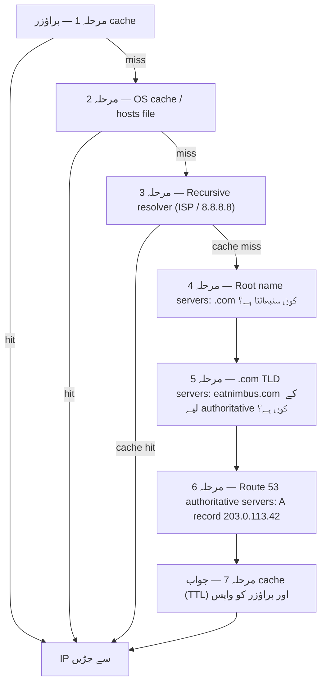

# باب ۱۲: انٹرنیٹ آپ کو کیسے ڈھونڈتا ہے

Maya نے اپنے براؤزر میں `nimbus-alb-123456789.us-west-2.elb.amazonaws.com` کو ایک اور بار refresh کیا، پھر پیچھے جھک گئی اور چھت کی طرف دیکھا۔ صفحہ لوڈ ہوا۔ ایپ نے کام کیا۔ لیکن ہر بار جب اس نے یہ لنک کسی ریستوران پارٹنر کے ساتھ شیئر کیا، اسے ایک چھوٹی سی شرمندگی محسوس ہوئی جسے وہ ٹھیک سے بیان نہیں کر سکتی تھی۔

وہ URL ایک تکنیکی نشانی تھی، کوئی پروڈکٹ نہیں۔

---

*پچھلے باب کا نیٹ ورک کا نیا ڈیزائن اچھا گیا تھا۔ ہر resource صحیح جگہ پر تھا — لوڈ بیلنسرز public subnets میں، ڈیٹابیسز نجی subnets میں بند۔ بنیادی ڈھانچہ محفوظ اور درست طریقے سے تقسیم تھا۔ لیکن جیسے ہی Nimbus اپنی پہلی عوامی لانچ کی تیاری کر رہا تھا، ایک نیا مسئلہ ظاہر ہوا: وہ لوڈ بیلنسر URL جو AWS نے خودبخود تفویض کیا تھا، ایک سسٹم شناخت کنندہ کی طرح نظر آتا تھا، نہ کہ ایسا پروڈکٹ جس پر لوگ بھروسہ کریں۔ انہیں ایک حقیقی domain name کی ضرورت تھی۔ اور انہیں سمجھنے کی ضرورت تھی کہ اس لمحے کے درمیان کیا ہوتا ہے جب کوئی `eatnimbus.com` ٹائپ کرتا ہے اور اس لمحے جب صفحہ ظاہر ہوتا ہے۔*

---

Nimbus چل رہا تھا۔ لوڈ بیلنسر کا ایک عوامی IP تھا۔ EC2 انسٹینسز کا ایک نجی IP تھا۔ ڈیٹابیسز نجی subnets میں بند تھے۔ Priya نے نیٹ ورک خاکے پر منظوری سے سر ہلایا تھا۔

Tom نے لوڈ بیلنسر کا URL دیکھا: `nimbus-alb-123456789.us-west-2.elb.amazonaws.com`۔

"کیا یہی صارفین اپنے براؤزر میں ٹائپ کرتے ہیں؟" اس نے پوچھا۔

"یہ وہ ہے جو AWS خودبخود تفویض کرتا ہے،" Maya نے کہا۔

"میں یہ بزنس کارڈ پر نہیں ڈالوں گا۔"

"میں بھی نہیں۔"

انہیں ایک domain name کی ضرورت تھی۔ انہوں نے ایک domain registrar سے `eatnimbus.com` خریدا۔ اب انہیں اس نام کو اپنے AWS بنیادی ڈھانچے سے جوڑنا تھا۔

"انٹرنیٹ کو کیسے پتہ چلتا ہے کہ `eatnimbus.com` کا مطلب us-west-2 میں لوڈ بیلنسر ہے؟" Leo نے پوچھا۔

اچھا سوال، Leo۔

**فون بک کی مثال**

اسمارٹ فونز سے پہلے، ہر شہر میں ایک فون بک ہوتی تھی۔ اگر آپ "Mario's Pizza" تک پہنچنا چاہتے تھے، تو آپ ان کا فون نمبر یاد نہیں کرتے تھے — آپ نام تلاش کرتے، نمبر ملتا، اور کال کرتے۔

انٹرنیٹ کی اپنی فون بک ہے: **Domain Name System (DNS)**۔

DNS انسانوں کے پڑھنے کے قابل ناموں (جیسے `eatnimbus.com`) کو مشینوں کے پڑھنے کے قابل IP پتوں (جیسے `203.0.113.42`) میں ترجمہ کرتا ہے۔ ہر بار جب آپ کوئی ویب سائٹ وزٹ کرتے ہیں، آپ کا کمپیوٹر خاموشی سے DNS میں domain name تلاش کرتا ہے اور جڑنے کے لیے IP پتہ ملتا ہے۔

اگر آپ اپنے سرور کا IP پتہ بدلتے، تو آپ DNS ریکارڈ اپڈیٹ کرتے — جیسے فون بک میں اپنا نمبر بدلنا — اور انٹرنیٹ آپ کو آپ کی نئی جگہ ڈھونڈ لیتا۔

**مکمل DNS Resolution کا سفر**

"لیکن lookup دراصل *کیسے* کام کرتی ہے؟" Leo نے پوچھا۔ "جیسے، مرحلہ وار۔ میرا براؤزر `eatnimbus.com` نام جانتا ہے۔ اس کے بعد کیا ہوتا ہے؟"

زیادہ تر دستاویزات اس پر سرسری نظر ڈالتی ہیں۔ یہ اہم ہے۔

جب آپ کے براؤزر کو `eatnimbus.com` کو resolve کرنے کی ضرورت ہوتی ہے، تو یہاں ہر hop ہے، ترتیب سے:

**مرحلہ 1 — براؤزر cache**: براؤزر چیک کرتا ہے کہ کیا اس نے حال ہی میں یہ نام پہلے ہی resolve کیا ہے۔ اگر ہاں، تو یہ cache شدہ IP استعمال کرتا ہے۔ اگر نہیں، تو جاری رکھیں۔

**مرحلہ 2 — OS cache / local resolver**: آپ کا آپریٹنگ سسٹم اپنا DNS cache اور local `hosts` فائل چیک کرتا ہے۔ اگر مل گیا، تو ہو گیا۔ اگر نہیں، تو یہ آپ کے ترتیب شدہ DNS resolver کو forward کرتا ہے — عام طور پر آپ کے ISP کا یا کوئی عوامی جیسے 8.8.8.8۔

**مرحلہ 3 — Recursive resolver**: recursive resolver (آپ کا ISP یا Google کا 8.8.8.8) محنتی کارکن ہے۔ اس کا بھی ایک cache ہے۔ اگر یہ جواب جانتا ہے، تو یہ فوری طور پر واپس کر دیتا ہے۔ اگر نہیں، تو یہ اصل resolution chain شروع کرتا ہے۔

**مرحلہ 4 — Root name servers**: recursive resolver 13 root name server clusters میں سے ایک سے رابطہ کرتا ہے (دنیا بھر میں تعینات)۔ root server نہیں جانتا کہ `eatnimbus.com` کہاں ہے۔ لیکن یہ جانتا ہے کہ `.com` domains کون منظم کرتا ہے — `.com` TLD servers۔ یہ ان کا پتہ واپس کرتا ہے۔

**مرحلہ 5 — TLD (Top Level Domain) name servers**: recursive resolver `.com` TLD servers سے رابطہ کرتا ہے۔ TLD servers بھی نہیں جانتے کہ `eatnimbus.com` کہاں ہے۔ لیکن وہ جانتے ہیں کہ کون سے name servers `eatnimbus.com` کے لیے authoritative ہیں — وہ servers جو دراصل DNS records رکھتے ہیں۔ وہ ان کے پتے واپس کرتے ہیں۔

**مرحلہ 6 — Authoritative name servers**: recursive resolver Route 53 کے name servers سے رابطہ کرتا ہے — `eatnimbus.com` کے لیے authoritative name servers۔ Route 53 کے پاس اصل records ہیں۔ یہ A record واپس کرتا ہے: `eatnimbus.com → 203.0.113.42`۔ یہ جواب authoritative ہے — یہ اصل جواب ہے، cache شدہ نہیں۔

**مرحلہ 7 — جواب cache اور واپس**: recursive resolver جواب کو ریکارڈ پر TTL (Time-To-Live) کی مدت کے لیے cache کرتا ہے۔ یہ IP آپ کے براؤزر کو واپس کرتا ہے۔ آپ کا براؤزر اسے cache کرتا ہے۔ آپ کا براؤزر جڑتا ہے۔



"یہ صرف ایک IP پتہ ڈھونڈنے کے لیے سات hops ہیں،" Tom نے کہا۔

"عام طور پر کل sub-100 ملی سیکنڈ،" Priya نے کہا۔ "مراحل 3 سے 6 ہر سطح پر جارحانہ طور پر cache ہوتے ہیں۔ مقبول domains کے لیے، مراحل 4 اور 5 — root اور TLD lookups — اکثر مکمل طور پر چھوڑ دیے جاتے ہیں کیونکہ recursive resolver کے پاس پہلے سے وہ servers cache میں ہوتے ہیں۔ پوری chain عام طور پر 20–40 ملی سیکنڈ میں چلتی ہے۔"

"اور پہلی lookup کے بعد، براؤزر cache کا مطلب ہے کہ بعد کی درخواستیں یہ سب چھوڑ دیتی ہیں،" Leo نے اضافہ کیا۔

"درست۔ DNS فوری محسوس ہوتا ہے کیونکہ زیادہ تر lookups cache hits ہوتی ہیں۔ پوری chain صرف تب چلتی ہے جب کوئی ریکارڈ نیا ہو یا اس کی TTL ختم ہو گئی ہو۔"

**Route 53 سے ملیں**

Amazon Route 53 AWS کی منیجڈ DNS سروس ہے۔ اسے Route 53 کہا جاتا ہے کیونکہ port 53 معیاری DNS port ہے۔ (کبھی کبھی AWS چیزوں کے نام سیدھے رکھتا ہے۔)

Route 53 کئی کام کرتا ہے:

**Domain registration**: آپ Route 53 کے ذریعے براہ راست domain names خرید سکتے ہیں۔

**DNS hosting (hosted zones)**: آپ اپنے domain کے لیے ایک *hosted zone* بناتے ہیں، اور Route 53 ان DNS records کو منظم کرتا ہے جو دنیا کو بتاتے ہیں کہ آپ کو کہاں ڈھونڈیں۔

**Health checking**: Route 53 آپ کے endpoints کی نگرانی کر سکتا ہے اور غیر صحت مند endpoints سے ٹریفک دوسری طرف موڑ سکتا ہے۔

**ٹریفک routing policies**: Route 53 آسان DNS سے آگے متعدد routing strategies سپورٹ کرتا ہے — weighted، latency-based، geolocation، failover۔

**DNS Records: فون بک کی Entries**

ایک DNS ریکارڈ ایک نام کو ایک منزل سے map کرتا ہے۔ سب سے عام اقسام:

**A record**: ایک نام کو IPv4 پتے سے map کرتا ہے۔
`eatnimbus.com → 203.0.113.42`

**AAAA record**: ایک نام کو IPv6 پتے سے map کرتا ہے۔

**CNAME record**: ایک نام کو دوسرے نام سے map کرتا ہے (ایک alias)۔
`www.eatnimbus.com → eatnimbus.com`

**MX record**: وہ servers بتاتا ہے جو domain کے لیے email سنبھالتے ہیں۔

**TXT record**: من مانی text محفوظ کرتا ہے۔ عام طور پر domain verification (ثابت کرنا کہ آپ domain کے مالک ہیں) اور email authentication (SPF، DKIM) کے لیے استعمال ہوتا ہے۔

Nimbus کے لیے، بنیادی سیٹ اپ:

- `eatnimbus.com` → Alias record لوڈ بیلنسر کی طرف اشارہ کرتا ہوا
- `www.eatnimbus.com` → CNAME `eatnimbus.com` کی طرف اشارہ کرتا ہوا
- `api.eatnimbus.com` → Alias record API لوڈ بیلنسر کی طرف اشارہ کرتا ہوا

"رکیں،" Tom نے کہا۔ "لوڈ بیلنسر کا IP بدل سکتا ہے۔ AWS نے دستاویزات میں یہی کہا۔"

اچھی پکڑ، Tom۔

**Alias Records: متحرک IPs کے لیے AWS کا حل**

Load balancers، CloudFront distributions، اور S3 ویب سائٹوں کے DNS نام ہوتے ہیں، static IP پتے نہیں۔ بنیادی IPs بدل سکتے ہیں۔

اگر آپ کسی لوڈ بیلنسر کے DNS نام کی طرف اشارہ کرتے ہوئے ایک CNAME بناتے ہیں، تو یہ کام کرتا ہے — لیکن آپ root domains (`eatnimbus.com` بغیر `www` کے) پر CNAMEs استعمال نہیں کر سکتے، DNS standards کی وجہ سے۔

Route 53 اسے **Alias records** سے حل کرتا ہے — DNS کا ایک AWS-specific extension۔ ایک Alias record ایک نام کو براہ راست ایک AWS resource (لوڈ بیلنسر، CloudFront distribution، S3 ویب سائٹ) سے map کرتا ہے، اور Route 53 متحرک IP resolution خودبخود سنبھالتا ہے۔ Alias records root domain کی سطح پر استعمال کیے جا سکتے ہیں۔ اور بیرونی سروسز کے لیے عام DNS queries کے برعکس، AWS resources کے لیے Alias record queries مفت ہیں۔

"تو ہم `eatnimbus.com` کے لیے ایک Alias record استعمال کرتے ہیں جو لوڈ بیلنسر کی طرف اشارہ کرتا ہے،" Leo نے تصدیق کی۔

"اور Route 53 جو بھی IP لوڈ بیلنسر کسی بھی دیے گئے لمحے استعمال کر رہا ہو اسے سنبھالتا ہے،" Priya نے اضافہ کیا۔

"مفت میں،" Tom نے کہا، اچانک بہت دلچسپی لیتے ہوئے۔ اس نے Route 53 pricing صفحہ کھولا۔ "اور باقی کا؟"

"فی hosted zone پچاس سینٹ،" Leo نے کہا۔ "علاوہ فی ملین DNS queries تقریباً چالیس سینٹ۔ ہماری ابھی کی ٹریفک کے لیے، شاید دو ڈالر فی مہینہ سے کم۔"

Tom نے مطمئن ہو کر pricing صفحہ بند کر دیا۔

**Routing Policies: صرف "یہ کہاں ہے؟" سے زیادہ**

یہاں Route 53 دلچسپ ہو جاتا ہے۔ DNS محض ایک تلاش سروس نہیں ہے — یہ ایک ٹریفک management ٹول ہو سکتا ہے۔

**Simple routing**: ایک record، ایک منزل۔ معیاری DNS۔

**Weighted routing**: وزن کے مطابق متعدد منازل کے درمیان ٹریفک تقسیم کریں۔ migration کے دوران 90% نئے سرور کو، 10% پرانے سرور کو بھیجیں۔ Weights ایڈجسٹ کریں جب تک آپ نئے سرور پر اعتماد حاصل نہ کر لیں، پھر 100% پر سوئچ کریں۔

**Latency-based routing**: صارفین کو AWS region کی طرف route کریں جس کی ان کے لیے سب سے کم latency ہو۔ Seattle میں ایک صارف `us-west-2` کی طرف route ہوتا ہے۔ Tokyo میں ایک صارف `ap-northeast-1` کی طرف route ہوتا ہے۔ ایک ہی domain نام، مختلف منازل۔

**Geolocation routing**: صارف کے جغرافیائی مقام کی بنیاد پر route کریں۔ تمام یورپی صارفین `eu-west-1` جاتے ہیں۔ تمام شمالی امریکی صارفین `us-east-1` جاتے ہیں۔ data sovereignty (EU صارف ڈیٹا EU regions میں رکھنا) یا content customization (زبان، currency) کے لیے مفید۔ Routing کے فیصلے سخت حدود استعمال کرتے ہیں — ایک صارف کسی ملک، کسی براعظم، یا کسی US ریاست میں ہے، اور یہی وہ جگہ ہے جہاں وہ جاتا ہے۔

**Geoproximity routing**: ٹریفک کو صارفین کے جغرافیائی مقام کی بنیاد پر route کرتا ہے *اور* آپ کو ان فیصلوں کو ایک **bias** قدر سے ایڈجسٹ کرنے دیتا ہے۔ ایک مثبت bias اس جغرافیائی علاقے کو پھیلاتا ہے جو کسی resource کی طرف route کرتا ہے — زیادہ ٹریفک کھینچتا ہے۔ ایک منفی bias اسے سکیڑتا ہے۔ geolocation کے برعکس، جو سخت ملکی اور براعظمی حدود استعمال کرتا ہے، geoproximity مسلسل ہے: ایک چھوٹی bias قدر کسی مقررہ لائن کو دوبارہ کھینچے بغیر ٹریفک کو ایک region سے دوسرے میں بتدریج منتقل کر سکتی ہے۔

وہ منظر نامہ جو دونوں کو ممتاز کرتا ہے: اگر کوئی کمپنی `us-east-1` سے `us-west-2` کی طرف بتدریج منتقل ہو رہی ہے اور ٹریفک کو مغرب کی طرف بتدریج منتقل کرنا چاہتی ہے — کوئی سوئچ نہیں پلٹنا، بلکہ وقت کے ساتھ اسے ڈائل کرنا — تو مغربی endpoint پر بڑھتے ہوئے مثبت bias کے ساتھ geoproximity صحیح ٹول ہے۔ Geolocation یا تو تمام West Coast صارفین کو Oregon کی طرف route کرے گا یا نہیں؛ اس کا کوئی ڈائل نہیں۔ جنوری 2024 سے، geoproximity DNS records پر براہ راست ایک عام routing policy کے طور پر دستیاب ہے (Console، API، CLI) — اب اسے Route 53 Traffic Flow کی ضرورت نہیں، اگرچہ یہ وہاں بھی دستیاب رہتا ہے۔

**Failover routing**: ایک primary اور ایک secondary endpoint نامزد کریں۔ اگر primary، Route 53 کی health check میں ناکام ہو، تو ٹریفک خودبخود secondary کی طرف redirect ہو۔ یہ disaster recovery کی DNS پرت ہے۔

"رکیں — لیکن ہم *کیوں* کسی دوسرے region کے لیے failover routing سیٹ کریں اگر ہمارے پاس پہلے سے Multi-AZ ہے؟" Maya نے پوچھا۔ "کیا Multi-AZ ناکامیاں سنبھالنے کے لیے نہیں ہے؟"

اچھا سوال۔ Multi-AZ ایک region کے اندر ایک واحد Availability Zone کی ناکامی کے خلاف تحفظ دیتا ہے — اگر ایک ڈیٹا سینٹر ڈاؤن ہو، تو دوسرے AZ میں standby سنبھال لیتا ہے۔ لیکن کیا ہو اگر ایک پورا AWS region غیر دستیاب ہو جائے؟ یا کیا ہو اگر کوئی region بھر کی سروس میں خلل ہو؟ DNS failover routing ایک مختلف سطح پر کام کرتا ہے: یہ ٹریفک کو ایک پورے region سے دور route کرتا ہے جب اس region کی health check ناکام ہو۔ Multi-AZ region کے اندر لچک ہے۔ DNS failover regions کے درمیان لچک ہے۔

**Multivalue answer routing**: ایک query کے لیے آٹھ صحت مند IP پتوں تک واپس کریں، client کو انتخاب کرنے دیں۔ متعدد servers میں ٹریفک تقسیم کرنے کے لیے لوڈ بیلنسر کا ایک سادہ متبادل۔

"تو Route 53 محض ایک فون بک نہیں ہے،" Maya نے کہا۔ "یہ ایک سمارٹ فون بک ہے جو آپ کے کہاں سے کال کرنے کی بنیاد پر calls route کر سکتی ہے۔"

"اور اگر نمبر غیر صحت مند ہو تو آپ کو disconnect کر سکتی ہے،" Priya نے اضافہ کیا۔

---

**Latency Routing علاوہ Health Checks: ایک فکری تجربہ**

Priya نے وائٹ بورڈ پر ایک منظر نامہ خاکہ بنایا۔ فرض کریں Nimbus کا East Coast صارف بیس بڑھتا رہا، اور ایک دن ٹیم نے `us-east-1` (Northern Virginia) میں ایک ہلکا پھلکا stack کھڑا کیا — کوئی مکمل multi-region active-active سیٹ اپ نہیں، جو مہنگا اور پیچیدہ ہوتا، بلکہ ایک لوڈ بیلنسر اور static content اور browsing صفحات پیش کرنے والی صرف-پڑھنے کی EC2 انسٹینسز کا ایک سیٹ۔ آرڈرز اب بھی `us-west-2` میں primary ڈیٹابیس کو مغرب جاتے۔ Browse ٹریفک — جو ستر فیصد درخواستوں کا حساب رکھتی تھی — کسی بھی ساحل سے پیش کی جا سکتی تھی۔

browse endpoint کے لیے Route 53 ترتیب اس طرح نظر آئے گی:

```
browse.eatnimbus.com
  → Latency record: us-east-1 ALB (health check کے ساتھ، set-identifier "east")
  → Latency record: us-west-2 ALB (health check کے ساتھ، set-identifier "west")
```

(نوٹ کریں کہ ریکارڈ ایک *hostname* ہے، `browse.eatnimbus.com` — DNS نام route کرتا ہے، کبھی URL paths نہیں۔ `/browse` جیسی path-based routing لوڈ بیلنسر کا کام ہے، Route 53 کا نہیں۔)

latency routing کے ساتھ، Seattle میں ایک صارف `us-west-2` endpoint پر resolve ہوگا۔ Boston میں ایک صارف `us-east-1` جائے گا۔ Route 53 اپنے بنیادی ڈھانچے سے ہر region تک latency کو مسلسل ماپتا ہے اور فی صارف تیز تر کو منتخب کرتا ہے۔

"لیکن کیا ہو اگر مغربی region میں کوئی مسئلہ ہو؟" Tom نے پوچھا۔ "Seattle میں ہمارے browsing صارفین پھنس جائیں گے۔"

"یہی وہ ہے جس کے لیے health checks ہیں،" Priya نے کہا۔ "ہر latency record کو اپنے متعلقہ لوڈ بیلنسر پر ایک health check ملتی ہے۔ اگر `us-west-2` health check تین مسلسل checks میں ناکام ہو، تو Route 53 وہ ریکارڈ واپس کرنا بند کر دیتا ہے — ان صارفین کے لیے بھی جہاں Oregon عام طور پر تیز تر ہوتا۔ Seattle کے صارفین Oregon کے بحال ہونے تک مشرق کی طرف route ہوتے ہیں۔"

"تو latency routing طے کرتا ہے کہ عام طور پر کون سا region ترجیحی ہے،" Maya نے کہا، "اور health checks اس ترجیح کو override کرتے ہیں اگر ترجیحی region ڈاؤن ہو جائے؟"

"بالکل۔ Latency policy عام حالات میں فاتح کا انتخاب کرتی ہے۔ Health checks ایک ایسے فاتح کو ہٹا دیتے ہیں جس نے کام کرنا بند کر دیا ہو۔"

Leo نے ناکامی کے منظر نامے کے بارے میں سوچا۔ "اور ان records پر TTL؟"

"ساٹھ سیکنڈ،" Priya نے کہا۔ "تیس سیکنڈ کے وقفوں پر تین ناکام checks اسے trip کرنے کے لیے — ناکامی کا پتہ لگانے میں نوے سیکنڈ تک — پھر DNS resolvers کے تبدیلی pick up کرنے میں ساٹھ سیکنڈ تک۔"

"بدترین صورت میں ڈھائی منٹ،" Leo نے کہا۔

"اسی لیے آپ TTL کو اس کی پروا کرنے سے پہلے کم کرتے ہیں، بعد میں نہیں۔"

یہ مجموعہ — ہر ریکارڈ پر health checks کے ساتھ latency routing — multi-region تعیناتیوں کے لیے سب سے طاقتور Route 53 ترتیبات میں سے ایک ہے۔ صارفین ہمیشہ تیز ترین صحت مند region جاتے ہیں۔ نظام خود کو ٹھیک کر لیتا ہے جب کسی region میں مسائل ہوں۔ اور یہ سب کچھ DNS ہے: کوئی اضافی بنیادی ڈھانچہ نہیں، کوئی proxy servers نہیں، regions کے درمیان کوئی لوڈ بیلنسرز نہیں۔

---

**Health Check ناکامی کا واقعہ**

Nimbus کے staging ماحول نے انہیں failover routing کا ایک حادثاتی مظاہرہ دیا۔

انہوں نے staging لوڈ بیلنسر پر Route 53 health checks کو ایک test کے طور پر ترتیب دیا تھا — ہر 30 سیکنڈ میں `/health` endpoint چیک کرتے ہوئے۔ ایک جمعہ کی دوپہر، Leo نے staging پر ایک تعیناتی push کی جس میں ایک bug تھا: health endpoint نے 500 errors واپس کرنا شروع کر دیا۔ یہ اس کے local tests میں پاس ہوئی لیکن سرور پر ٹوٹ گئی۔

Route 53 نے ناکامیوں کو نوٹ کیا۔ تین مسلسل ناکام checks کے بعد، اس نے endpoint کو غیر صحت مند نشان زد کر دیا۔ Failover record فعال ہوا، staging ٹریفک کو ایک صرف-پڑھنے کے fallback صفحے کی طرف route کرتے ہوئے جس پر لکھا تھا "Maintenance in progress۔"

Leo کا پہلا alert ایک QA انجینئر سے ایک Slack پیغام تھا: "Staging maintenance صفحہ دکھا رہا ہے۔"

Leo نے deploy چیک کیا۔ 500 errors logs میں واضح تھیں۔ اس نے تعیناتی rollback کی۔ health endpoint کے 200s واپس کرنے کے 90 سیکنڈ کے اندر، Route 53 نے check کا دوبارہ جائزہ لیا، تین مسلسل کامیابیاں دیکھیں، اور ٹریفک staging لوڈ بیلنسر کی طرف واپس کر دی۔ Maintenance صفحہ غائب ہو گیا۔

Maintenance صفحے پر کل وقت: سات منٹ۔

"یہ نظام درست طریقے سے کام کر رہا تھا،" Priya نے کہا۔

"مجھے معلوم ہے،" Leo نے کہا۔ "خوفناک حصہ یہ سوچنا ہے کہ health check کے بغیر کیا ہوتا۔ 500 errors حقیقی صارفین کو جاتیں۔"

"پروڈکشن میں، health check secondary region یا static error صفحے پر failover ہو جاتی۔ صارفین errors کے بجائے ایک maintained تجربہ دیکھتے۔"

"Failover دراصل کتنا وقت لیتا ہے؟" Maya نے پوچھا۔ "health check ناکام ہونے سے DNS کے مختلف طریقے سے route کرنا شروع کرنے تک؟"

"Health check وقفہ ڈیفالٹ کے مطابق 30 سیکنڈ ہے۔ Failover کو trip کرنے کے لیے تین مسلسل ناکامیاں۔ یہ مسئلے کا پتہ لگانے میں 90 سیکنڈ تک ہے۔ پھر DNS TTL — اگر یہ 60 سیکنڈ ہے، تو propagation ایک اور منٹ ہے۔"

"تو بدترین صورت میں، تقریباً تین منٹ؟"

"تقریباً اتنا۔ اسی لیے آپ اہم records پر اپنی TTL کم چاہتے ہیں، اور اپنا health check وقفہ اتنا مختصر جتنا آپ کا بجٹ اجازت دے۔"

---

**Health Checks: ناکامی کے گرد Routing**

"اور کیا ہو اگر کوئی توڑ کر داخل ہونے کی کوشش کرے؟" Priya نے کہا۔ "DNS عوامی ہے۔ کوئی بھی دیکھ سکتا ہے کہ `eatnimbus.com` کہاں اشارہ کرتا ہے۔ اس کا مطلب ہے کہ ایک حملہ آور کو عین معلوم ہے کہ کس IP کو نشانہ بنانا ہے۔"

"یہ سچ ہے،" Leo نے کہا۔ "لیکن جو IP انہیں ملتا ہے وہ لوڈ بیلنسر کا IP ہے۔ ALB واحد چیز ہے جس کا عوامی پتہ ہے۔ اس کے پیچھے ہر چیز — EC2، RDS، ElastiCache — نجی subnets میں ہے۔ DNS انہیں سامنے کا دروازہ بتاتا ہے۔ یہ انہیں نہیں بتاتا کہ اس کے پیچھے کیا ہے۔"

Route 53 health checks کے ساتھ آپ کے endpoints کی نگرانی کر سکتا ہے۔ اگر کوئی endpoint ناکام ہو، تو Route 53 یہ کر سکتا ہے:

- اسے DNS responses سے ہٹا دیں (وہاں ٹریفک بھیجنا بند کریں)
- backup endpoint پر failover trigger کریں
- CloudWatch کے ذریعے alert بھیجیں

Health checks DNS routing اور اصل ایپلیکیشن صحت کے درمیان کڑی ہیں۔ failover ترتیب میں: Route 53 ہر 30 سیکنڈ میں primary endpoint کی نگرانی کرتا ہے۔ اگر تین مسلسل checks ناکام ہوں، تو Route 53 secondary endpoint کا پتہ واپس کرنا شروع کر دیتا ہے۔ ان میں سے کوئی نمبر مقرر نہیں ہے: 30 سیکنڈ معیاری وقفہ ہے (ایک ادا شدہ "fast" آپشن ہر 10 سیکنڈ میں چیک کرتا ہے)، اور ناکامی کی حد ڈیفالٹ کے مطابق 3 مسلسل checks ہے لیکن 1 سے 10 تک قابل ترتیب ہے۔

یہ فوری نہیں ہے — DNS میں propagation کا وقت ہوتا ہے۔ ایک بار جب Route 53 DNS ریکارڈ بدلتا ہے، تو دنیا بھر کے DNS resolvers کو تبدیلی pick up کرنے کی ضرورت ہوتی ہے، جس میں TTL settings کے مطابق سیکنڈوں سے لے کر منٹوں تک کا وقت لگ سکتا ہے۔

**TTL: DNS Cache**

DNS responses کئی سطحوں پر cache ہوتے ہیں — آپ کے router پر، آپ کے ISP پر، آپ کے براؤزر میں۔ ایک DNS ریکارڈ پر **TTL (Time-To-Live)** caches کو بتاتا ہے کہ دوبارہ چیک کرنے سے پہلے کتنی دیر تک جواب یاد رکھنا ہے۔

زیادہ TTL (1 گھنٹہ یا زیادہ): کم DNS queries، Route 53 پر کم بوجھ، لیکن تبدیلیاں propagate ہونے میں زیادہ وقت لگتا ہے۔

کم TTL (60 سیکنڈ یا کم): تبدیلیاں جلدی propagate ہوتی ہیں، لیکن زیادہ DNS queries کی ضرورت ہوتی ہے۔

ایک منصوبہ بند migration (DNS کو نئے سرور کی طرف اشارہ کرنے کے لیے اپڈیٹ کرنے) سے پہلے، ایک دن پہلے اپنی TTL کو 60 سیکنڈ تک کم کریں۔ پھر جب آپ تبدیلی کریں، تو یہ تقریباً ایک منٹ میں propagate ہو جاتی ہے۔ migration کے بعد، اسے واپس normal قدر پر لے آئیں۔

"میں نے اسے پہلے ہی deploy کر دیا تھا — اوہ۔" Leo نے TTL کم کرنے سے پہلے DNS ریکارڈ اپڈیٹ کر دیا تھا۔ اس نے اپنی غلطی کا احساس کیا اور گننا شروع کیا: پرانی TTL ایک گھنٹہ تھی۔ کچھ صارفین کو اگلے ساٹھ منٹ تک پرانا سرور ملتا رہے گا۔

"اگر ہم نے صرف migration کے دوران اسے کم کیا، پہلے نہیں،" Leo نے آہستہ آہستہ کہا، "تو پرانی TTL کا مطلب ہے کہ کچھ صارفین ایک گھنٹے تک پرانا سرور دیکھتے رہیں گے۔"

"بالکل،" Priya نے کہا۔ "DNS migrations کے لیے migration سے پہلے منصوبہ بندی کی ضرورت ہے، نہ صرف اس کے دوران۔"

آپ سوچ رہے ہوں گے: اگر TTL ایک گھنٹے پر سیٹ ہو، تو کیا اس کا مطلب ہے کہ DNS تبدیلی کے بعد ہر صارف نیا سرور دیکھنے سے پہلے پورا ایک گھنٹہ انتظار کرے گا؟ بالکل نہیں۔ TTL کا مطلب ہے کہ resolvers TTL ختم ہونے تک دوبارہ چیک نہیں کریں گے۔ اگر کسی صارف کے DNS resolver نے 1-گھنٹہ TTL کے ساتھ پرانی قدر 55 منٹ پہلے cache کی، تو انہیں نئی قدر 5 منٹ میں ملے گی۔ اگر انہوں نے اسے 5 منٹ پہلے cache کیا، تو وہ 55 منٹ انتظار کریں گے۔ اوسطاً، صارفین TTL مدت کے نصف کے اندر تبدیلی دیکھتے ہیں۔ اسی لیے پہلے سے TTL کم کرنا اتنا اہم ہے: یہ تبدیلی ہونے سے پہلے بدترین صورت propagation کھڑکی کو سکیڑتا ہے۔

---

**Private Hosted Zones: داخلی DNS**

عوامی domain کے live ہونے کے دو ہفتے بعد Priya نے ایک نیا تقاضا اٹھایا۔

"ہماری EC2 انسٹینسز کو ڈیٹابیس تک پہنچنے کی ضرورت ہے،" اس نے کہا۔ "ابھی وہ RDS endpoint DNS نام استعمال کر رہی ہیں — `nimbus-prod.abc123.us-west-2.rds.amazonaws.com`۔ یہ کام کرتا ہے، لیکن یہ ایک عوامی DNS نام ہے۔ اگر ہم کبھی اپنی ڈیٹابیس ترتیب بدلنا چاہیں، تو تمام ایپلیکیشن config فائلز کو اپڈیٹ کرنے کی ضرورت ہوتی ہے۔"

"ہم ایک نجی DNS نام استعمال کر سکتے ہیں،" Leo نے کہا۔ "جیسے `db.nimbus.internal`۔ کوئی ایسی چیز جسے ہماری سروسز اندرونی طور پر استعمال کریں جو موجودہ ڈیٹابیس endpoint جو بھی ہو اس سے map کرے۔"

"بالکل۔ Route 53 private hosted zones۔"

ایک **private hosted zone** ایک DNS domain ہے جو صرف آپ کے VPC کے اندر resolve ہوتا ہے۔ `nimbus.internal` کے لیے بیرونی DNS queries کو کوئی جواب نہیں ملتا۔ لیکن VPC کے اندر سے، `db.nimbus.internal` RDS endpoint پر resolve ہوتا ہے۔

انہوں نے اسے سیٹ کیا:

- Private hosted zone: `nimbus.internal`
- CNAME record: `db.nimbus.internal → nimbus-prod.abc123.us-west-2.rds.amazonaws.com`
- CNAME record: `cache.nimbus.internal → nimbus-cache.abc123.usw2.cache.amazonaws.com`
- A record: `api.nimbus.internal → 10.0.10.5` (داخلی EC2 IP — A records نام کو IP پتوں سے map کرتے ہیں؛ CNAMEs نام کو دوسرے ناموں سے map کرتے ہیں۔ یہاں ٹھیک ہے کیونکہ یہ انسٹینس ایک static نجی IP رکھتی ہے؛ Auto Scaling کے پیچھے کسی بھی چیز کے لیے آپ اس کے بجائے ایک لوڈ بیلنسر کی طرف اشارہ کریں گے)

اب ایپلیکیشن config پڑھتا تھا:

```
DATABASE_HOST=db.nimbus.internal
CACHE_HOST=cache.nimbus.internal
```

جب وہ ایک نئے RDS انسٹینس میں منتقل ہوئے، تو انہوں نے ایک DNS ریکارڈ اپڈیٹ کیا۔ کوئی ایپلیکیشن تعیناتی درکار نہیں۔

"یہی وجہ بھی ہے کہ نجی DNS ایک ڈیٹابیس migration کے دوران اہم ہے،" Priya نے کہا۔ "آپ `db.nimbus.internal` کو نئے endpoint کی طرف اشارہ کرنے کے لیے اپڈیٹ کرتے ہیں۔ ٹریفک منتقل ہوتی ہے۔ پرانا endpoint TTL کھڑکی کے دوران دستیاب رہتا ہے۔ کوئی ایپلیکیشن config تبدیلیاں نہیں۔"

**داخلی DNS Debugging کی کہانی**

تین ہفتے بعد، Leo نے ایک نئی سروس تعینات کی — ایک background worker — اور یہ ڈیٹابیس تک نہیں پہنچ سکا۔ Worker اسی VPC میں تھا، API servers جیسے اسی نجی subnet میں۔ API servers ڈیٹابیس تک پہنچ سکتے تھے۔ Worker نہیں پہنچ سکتا تھا۔

اس نے security groups چیک کیے۔ Worker کے security group میں PostgreSQL کے لیے ایک outbound قاعدہ تھا۔ ڈیٹابیس security group میں worker کے security group سے ایک inbound قاعدہ تھا۔ سب کچھ درست لگتا تھا۔

اس نے worker انسٹینس سے `nslookup db.nimbus.internal` چلایا۔

کوئی جواب نہیں۔

"DNS lookup ناکام ہو رہی ہے،" اس نے Priya سے کہا۔

اس نے worker انسٹینس کی VPC ترتیب دیکھی۔ "Worker دراصل کس VPC میں ہے؟ Private hosted zones VPCs سے منسلک ہوتے ہیں — اگر انسٹینس کسی منسلک VPC میں نہیں ہے، تو zone اس کے لیے سرے سے موجود نہیں ہوتا۔"

"یہ مرکزی VPC میں ہے۔ باقی سب کی طرح۔"

"کیا ہے؟"

Private hosted zones کو ہر اس VPC سے واضح طور پر منسلک کرنا ضروری ہے جسے وہ پیش کرتے ہیں — association فی VPC ہوتا ہے، کبھی فی subnet نہیں۔ Priya نے zone بناتے وقت مرکزی VPC کو منسلک کیا تھا۔ لیکن Leo نے حادثاتی طور پر worker کو ایک test VPC میں تعینات کر دیا تھا جو اس نے ایک مختلف تجربے کے لیے بنایا تھا۔ مختلف VPC۔ private hosted zone سے منسلک نہیں۔

"Worker غلط VPC میں ہے،" Priya نے کہا۔

"میں نے اسے پہلے ہی deploy کر دیا تھا — اوہ۔" Leo نے worker کو صحیح VPC میں منتقل کیا۔ DNS resolve ہوا۔ Worker ڈیٹابیس سے جڑ گیا۔

"ایک VPC،" Leo نے ایک نوٹ بناتے ہوئے کہا۔ "جب تک ہمارے پاس ایک سے زیادہ کی کوئی وجہ نہ ہو۔"

---

**DNSSEC: DNS Responses کی توثیق**

"کیا ہم نے DNS spoofing کے بارے میں سوچا ہے؟" Priya نے پوچھا۔ "کیا ہو اگر کوئی ہماری DNS query کو intercept کرے اور ایک جعلی IP واپس کرے؟ ہمارے صارفین کے براؤزرز ہمارے بجائے حملہ آور کے سرور سے جڑ جائیں گے۔"

**DNSSEC (DNS Security Extensions)** اسے DNS records پر cryptographically دستخط کر کے حل کرتا ہے۔ جب ایک DNS response میں DNSSEC signature شامل ہو، تو resolver تصدیق کر سکتا ہے کہ response authoritative name server سے آیا اور اس کے ساتھ چھیڑ چھاڑ نہیں کی گئی۔

Route 53 عوامی hosted zones کے لیے DNSSEC signing سپورٹ کرتا ہے۔ اس عمل میں شامل ہے:

1. Route 53 میں hosted zone پر DNSSEC فعال کرنا
2. Route 53 KMS میں محفوظ ایک key signing key (KSK) پیدا کرتا ہے
3. Route 53 تمام records کو zone signing key سے دستخط کرتا ہے
4. آپ parent domain registrar (.com TLD) پر ایک DS (Delegation Signer) record شامل کرتے ہیں
5. DNSSEC سپورٹ کرنے والے resolvers اب responses کی صداقت کی تصدیق کر سکتے ہیں

"DNS spoofing کتنا عام ہے؟" Leo نے پوچھا۔

"عوامی انٹرنیٹ پر، نایاب لیکن ممکن،" Priya نے کہا۔ "آج زیادہ تر ISP resolvers DNSSEC validation سپورٹ کرتے ہیں۔ DNSSEC فعال کرنے میں کوئی لاگت نہیں آتی اور یہ صداقت کی ایک بامعنی پرت شامل کرتا ہے۔"

"اس پر فی مہینہ کتنا خرچ آتا ہے؟" Tom نے پوچھا۔

"DNSSEC signing خود فعال کرنا Route 53 میں مفت ہے،" Priya نے کہا۔ "واحد حقیقی لاگت وہ KMS key ہے جو key-signing key رکھتی ہے: $1/مہینہ، علاوہ KMS API calls — اور ایک key متعدد hosted zones میں شیئر کی جا سکتی ہے۔ DNS hijacking حملوں کے خلاف تحفظ ہمارے پیمانے پر مؤثر طور پر مفت ہے۔"

Tom نے اسے دوپہر کے کھانے سے پہلے فعال کر دیا۔

---

**Route 53 Resolver: Hybrid DNS**

جب Nimbus نے بالآخر اپنے AWS VPC کو ایک VPN کے ذریعے اپنے on-premises ڈیولپمنٹ نیٹ ورک سے جوڑا، تو ایک نیا مسئلہ ابھرا: on-premises servers کو AWS نجی DNS نام (جیسے `db.nimbus.internal`) resolve کرنے کی ضرورت تھی، اور AWS resources کو on-premises hostnames (جیسے `jenkins.corp.nimbus.local`) resolve کرنے کی ضرورت تھی۔

DNS resolution ڈیفالٹ کے مطابق نیٹ ورک کی حدود کو عبور نہیں کرتی۔ AWS resources Route 53 Resolver (ہر VPC میں بلٹ ان) کا استعمال کرتے ہوئے DNS resolve کرتے ہیں۔ On-premises servers اپنے DNS servers استعمال کرتے ہیں۔ کوئی بھی دوسرے کے records نہیں دیکھ سکتا۔

**Route 53 Resolver Endpoints** اس خلا کو پاٹتے ہیں:

**Inbound endpoints**: On-premises DNS servers AWS-hosted DNS zones کے لیے queries کو آپ کے VPC میں ایک inbound endpoint IP کی طرف forward کر سکتے ہیں۔ Route 53 Resolver query سنبھالتا ہے اور نتیجہ واپس کرتا ہے۔

**Outbound endpoints**: جب EC2 انسٹینسز کو on-premises hostnames resolve کرنے کی ضرورت ہو، تو Resolver ان queries کو outbound endpoint کے ذریعے on-premises DNS servers کو forward کرتا ہے۔

"تو یہ ایک ترجمہ سروس کی طرح ہے،" Maya نے کہا۔ "آپ کا AWS DNS اور آپ کا on-premises DNS براہ راست ایک دوسرے سے بات نہیں کرتے۔ Resolver endpoints ثالثوں کے طور پر کام کرتے ہیں۔"

"بالکل۔ آپ کے on-premises servers اب `db.nimbus.internal` resolve کر سکتے ہیں۔ آپ کی EC2 انسٹینسز `jenkins.corp.nimbus.local` resolve کر سکتی ہیں۔ دونوں طرف دونوں دنیاؤں سے DNS نام دیکھتے ہیں۔"

Nimbus کے لیے، یہ تب متعلقہ ہوا جب ڈیولپمنٹ ٹیم اپنے دفتر سے AWS میں ایک staging ماحول کے خلاف integration tests چلانا چاہتی تھی۔ Resolver endpoints کے بغیر، وہ ہاتھ سے hosts فائلز میں ترمیم کر رہے ہوتے۔ ان کے ساتھ، داخلی DNS بس VPN کے پار کام کرتا تھا۔

Resolver endpoints کا آرکیٹیکچر:

- **Inbound endpoint**: آپ کے VPC میں دو مختلف AZs میں بنائے گئے دو ENIs (Elastic Network Interfaces)۔ ہر ایک کو ایک نجی IP ملتا ہے۔ آپ اپنے on-premises DNS server کو ان IPs کی طرف اپنے AWS-hosted zones کے لیے queries forward کرنے کے لیے ترتیب دیتے ہیں۔ ٹریفک آپ کے VPN یا Direct Connect کے ذریعے سفر کرتی ہے۔
- **Outbound endpoint**: دو AZs میں دو ENIs۔ آپ forwarding rules بناتے ہیں: "`corp.nimbus.local` کے لیے queries ان on-premises DNS server IPs کو جاتی ہیں۔" EC2 انسٹینسز خودبخود Resolver استعمال کرتی ہیں، جو آپ کے forwarding rules سے مشورہ کرتا ہے اور query on-premises بھیجتا ہے۔

"فی endpoint دو ENIs کیوں؟" Leo نے پوچھا۔

"اعلیٰ دستیابی،" Priya نے کہا۔ "اگر ایک AZ نیٹ ورک connectivity کھو دے، تو دوسرا endpoint IP پھر بھی کام کرتا ہے۔ NAT Gateways جیسا ہی اصول۔"

"اس پر فی مہینہ کتنا خرچ آتا ہے؟" Tom نے پوچھا۔

Resolver endpoints **فی elastic network interface** تقریباً $0.125 فی گھنٹہ خرچ کرتے ہیں، اور ہر endpoint کو دستیابی کے لیے کم از کم دو ENIs کی ضرورت ہوتی ہے — لہٰذا ایک حقیقت پسندانہ کم از کم تقریباً $180 فی مہینہ فی endpoint ہے، علاوہ فی ملین DNS queries $0.40۔ داخلی نام resolve کرنے کے لیے hybrid DNS استعمال کرنے والی ٹیم کے لیے، لاگت معمولی ہے — اور متعدد ڈویلپر مشینوں اور CI/CD نظاموں میں hosts فائلز برقرار رکھنے کی ضرورت ختم کرتی ہے۔

"ہم بس hostnames کو hosts فائلز میں ڈال سکتے ہیں،" Leo نے تجویز کیا۔

"ہر ڈویلپر مشین پر، ہر CI runner پر، ہر نئی onboarding پر،" Priya نے کہا۔ "ہر بار جب کوئی چیز بدلے۔"

"Endpoint قابل قدر ہے،" Leo نے کہا۔

"یہ ہے۔"

## خوبیاں اور حدود

**Route 53 صحیح انتخاب ہے**: domain names کو مکمل طور پر AWS کے اندر register اور manage کرنے کے لیے؛ متعدد endpoints میں latency، geolocation، یا weighted distribution کی بنیاد پر ٹریفک route کرنے کے لیے؛ regions کے درمیان یا ایک primary اور ایک disaster-recovery endpoint کے درمیان health-check-based failover کے لیے؛ alias records کے ذریعے دوسری AWS سروسز کے ساتھ DNS integrate کرنے کے لیے؛ داخلی service discovery کے لیے private hosted zones۔

**جب Route 53 آپ کی ضرورت نہیں**: Route 53 ایک DNS سروس ہے، لوڈ بیلنسر نہیں۔ اگر آپ کو ایک region کے اندر متعدد servers یا containers کے درمیان ٹریفک تقسیم کرنی ہو، تو ایک Application Load Balancer استعمال کریں — Route 53 لوڈ بیلنسر کی طرح connection کی سطح پر weighted round-robin نہیں کر سکتا۔ regions میں latency-based routing لاگت اور آپریشنل پیچیدگی شامل کرتی ہے جو صرف تب سمجھ آتی ہے جب آپ کے صارفین واقعی عالمی سطح پر تقسیم ہوں اور ملی سیکنڈز conversion کے لیے اہم ہوں۔ زیادہ تر single-region ایپلیکیشنز کے لیے، ایک ALB کی طرف اشارہ کرتا ایک واحد Alias record ہی وہ تمام Route 53 ترتیب ہے جس کی آپ کو ضرورت ہے۔

## خلاصہ

`nimbus-alb-123456789.us-west-2.elb.amazonaws.com` سے `eatnimbus.com` تک پہنچنا ایک چھوٹی سی بات محسوس ہوئی۔ یہ نہیں تھی۔ DNS وہ پتہ نظام ہے جس پر پورا انٹرنیٹ چلتا ہے، اور Route 53 آپ کو اس نظام کو نہ صرف lookups کے لیے، بلکہ ٹریفک management اور لچک کے لیے استعمال کرنے کے ٹولز دیتا ہے۔

- **DNS** domain names کو IP پتوں میں ترجمہ کرتا ہے — انٹرنیٹ کی فون بک۔
- **Route 53** AWS کی منیجڈ DNS سروس ہے: domain registration، DNS hosting، health checks، اور routing policies۔
- **A records** نام کو IPv4 پتوں سے map کرتے ہیں۔ **CNAMEs** نام کو دوسرے ناموں سے map کرتے ہیں۔ **Alias records** نام کو AWS resources سے map کرتے ہیں (لوڈ بیلنسرز، CloudFront، S3)۔
- Root domains اور متحرک IPs والے resources کے لیے CNAMEs کی بجائے Alias records استعمال کریں۔
- Routing policies آسان DNS سے آگے جاتی ہیں: **weighted** (ٹریفک splitting)، **latency-based** (کارکردگی)، **geolocation** (data sovereignty — سخت ملکی/براعظمی حدود)، **geoproximity** (فاصلے پر مبنی ایک bias ڈائل کے ساتھ — بتدریج ٹریفک منتقلی)، **failover** (disaster recovery)۔
- **Private hosted zones** VPC resources کے لیے داخلی DNS فراہم کرتے ہیں — نام کے ذریعے service-to-service مواصلات، نہ کہ hard-coded IP۔
- **DNSSEC** records پر cryptographically دستخط کرتا ہے، DNS spoofing کے خلاف تحفظ دیتا ہے۔
- **Route 53 Resolver Endpoints** hybrid نیٹ ورکس کو پاٹتے ہیں — AWS اور on-premises DNS ایک دوسرے کے نام resolve کر سکتے ہیں۔

## امتحانی نکات

*SAA-C03 ڈومین: اعلیٰ کارکردگی آرکیٹیکچرز ڈیزائن کریں (ڈومین ۳، ٹاسک ۳.۴)*

- **Alias بمقابلہ CNAME**: Alias records root domain پر استعمال کیے جا سکتے ہیں؛ CNAMEs نہیں۔ AWS resources کے لیے Alias record queries مفت ہیں؛ CNAME DNS queries کی قیمت ہوتی ہے۔ جب امتحان کسی root domain کو لوڈ بیلنسر سے map کرنے کے بارے میں پوچھے → Alias record۔
- **Routing policy استعمال کے کیسز** (عام امتحانی منظر نامے):
  - "ٹریفک کو نئے ورژن میں بتدریج منتقل کریں" → Weighted routing
  - "صارفین کو قریب ترین AWS region کی طرف route کریں" → Latency-based routing
  - "EU صارف ڈیٹا EU regions میں رکھیں" → Geolocation routing
  - "Primary ناکام ہونے پر خودکار DNS failover" → Health checks کے ساتھ Failover routing
  - "ٹریفک کو ایک نئے region میں بتدریج منتقل کریں" یا "ہماری EU تعیناتی کی طرف کھینچی گئی ٹریفک بڑھائیں" → مثبت bias کے ساتھ Geoproximity routing
- **Geoproximity بمقابلہ Geolocation:** Geolocation صارف کے ملک/براعظم کے مطابق سخت حدود کے ساتھ route کرتا ہے۔ Geoproximity جغرافیائی فاصلے کے مطابق ایک قابل ترتیب bias کے ساتھ route کرتا ہے — اسے تب استعمال کریں جب آپ کو ٹریفک کو کسی نئے region میں بتدریج منتقل کرنا ہو یا کسی مخصوص تعیناتی کی طرف زیادہ صارفین کھینچنے ہوں۔ جنوری 2024 سے records پر ایک عام routing policy کے طور پر دستیاب (Traffic Flow اب درکار نہیں)۔
- **Route 53 health checks**: HTTP/HTTPS/TCP endpoints چیک کر سکتے ہیں، اور CloudWatch alarms trigger کر سکتے ہیں۔ امتحان انہیں disaster recovery منظر ناموں میں استعمال کرتا ہے۔
- **TTL اور propagation**: جانیں کہ TTL کنٹرول کرتی ہے کہ DNS resolvers ایک ریکارڈ کتنی دیر cache کریں۔ مختصر TTL = تیز تبدیلیاں۔ امتحانی منظر نامہ: "ٹیم نے DNS اپڈیٹ کیا لیکن صارفین اب بھی پرانے سرور پر جا رہے ہیں" → TTL بہت زیادہ ہے۔
- **Private hosted zones**: Route 53 ایسے DNS records بنا سکتا ہے جو صرف VPC کے اندر resolve ہوں۔ امتحان اسے داخلی service discovery کے لیے استعمال کرتا ہے (مثلاً `database.internal` ایک نجی RDS endpoint کی طرف resolve ہوتا ہے)۔
- Route 53 **عالمی** ہے — یہ کسی region میں تعینات نہیں ہے۔ hosted zones بناتے وقت کوئی region selection ضروری نہیں۔
- **Route 53 Resolver Endpoints**: hybrid منظر ناموں میں استعمال ہوتے ہیں جہاں on-premises اور AWS DNS کو ایک دوسرے کے نام resolve کرنے کی ضرورت ہو۔ on-premises → AWS کے لیے Inbound endpoint۔ AWS → on-premises کے لیے Outbound endpoint۔

## مشقیں

**مشق ۱ — یادداشت**

CNAME record اور Alias record کے درمیان فرق بیان کریں۔ آپ ہر ایک کب استعمال کریں گے؟

*(اشارہ: root domains پر CNAME کی پابندیوں اور متحرک AWS resources کے ساتھ Alias records کے رویے پر غور کریں۔)*

**مشق ۲ — SAA-C03 منظر نامہ**

*منظر نامہ*: ایک میڈیا کمپنی دو AWS regions سے ایک ویب سائٹ چلاتی ہے: `us-east-1` (primary) اور `eu-west-1` (secondary)۔ ٹیم چاہتی ہے کہ primary region غیر دستیاب ہونے پر ٹریفک خودبخود `eu-west-1` کی طرف route ہو۔ کمپنی یہ بھی تصدیق کرنا چاہتی ہے کہ یہ failover mechanism صحیح طریقے سے کام کرتا ہے بغیر اصل میں primary region کو بند کیے۔

کون سی Route 53 ترتیب ان ضروریات کو بہترین طریقے سے پورا کرتی ہے؟

A) `us-east-1` پر 100% weight اور `eu-west-1` پر 0% weight کے ساتھ Weighted routing  
B) دونوں endpoints پر health checks کے ساتھ Latency-based routing  
C) Primary endpoint پر ایک health check اور `eu-west-1` کی طرف اشارہ کرتے ایک secondary record کے ساتھ Failover routing  
D) شمالی امریکہ `us-east-1` کی طرف اور یورپ `eu-west-1` کی طرف اشارہ کرتے Geolocation routing

**اشارہ ۱**: ضرورت primary ناکام ہونے پر خودکار failover ہے۔ کون سی routing policy بالکل اسی کے لیے ڈیزائن کی گئی ہے؟

**اشارہ ۲**: "Primary region کو بند کیے بغیر test کریں" — health checks کو testing کے لیے ہاتھ سے "unhealthy" پر سیٹ کیا جا سکتا ہے۔

**اشارہ ۳**: Latency-based routing رفتار کے لیے optimize کرتا ہے، failover کے لیے نہیں۔

**جواب**: C

**وضاحت**: Failover routing بالکل اس استعمال کے کیس کے لیے ڈیزائن کیا گیا ہے۔ Primary record health check کے ساتھ `us-east-1` کی طرف اشارہ کرتا ہے۔ Secondary record `eu-west-1` کی طرف اشارہ کرتا ہے۔ اگر health check ناکام ہو، تو Route 53 خودبخود secondary record serve کرتا ہے۔ Health checks کو primary region کو اصل میں disrupt کیے بغیر testing کے لیے ہاتھ سے fail کرنے پر مجبور کیا جا سکتا ہے۔

**A کیوں نہیں؟** 100%/0% کے ساتھ Weighted routing مؤثر طور پر static ہے — یہ primary ناکام ہونے پر خودبخود نہیں بدلتا۔

**B کیوں نہیں؟** Latency records *health checks کے ساتھ* ایک غیر صحت مند endpoint واپس کرنا بند کر دیتے ہیں، لہٰذا B ایک حقیقی outage سے بچ جائے گا۔ لیکن یہ عام ٹریفک کے نمونے کو بدل دیتا ہے (صارفین latency کے مطابق regions میں تقسیم ہوں گے، نہ کہ مطلوبہ primary/secondary)، اور اس کے پاس failover کو *test* کرنے کا کوئی صاف طریقہ نہیں ہے: آپ کو پروڈکشن میں primary کی health check کو دراصل fail کرنا پڑے گا۔ Failover routing بیان کردہ ارادے کو ماڈل کرتا ہے — نامزد primary، نامزد secondary، health check حالت کو مجبور کر کے قابل test۔

**D کیوں نہیں؟** Geolocation routing صارف کے مقام کے مطابق route کرتا ہے، endpoint کی صحت کے مطابق نہیں۔ یورپی صارفین `eu-west-1` پر پھنسے رہیں گے چاہے `us-east-1` صحت مند ہو، اور شمالی امریکی صارفین `eu-west-1` پر failover نہیں ہوں گے چاہے `us-east-1` ڈاؤن ہو جائے۔

*SAA-C03 ڈومین: اعلیٰ کارکردگی آرکیٹیکچرز ڈیزائن کریں — ٹاسک ۳.۴*

**مشق ۳ — آرکیٹیکچر چیلنج** *(اختیاری)*

Nimbus بین الاقوامی سطح پر پھیل رہا ہے۔ وہ چاہتے ہیں کہ `eatnimbus.com` مغربی ساحل، مشرقی ساحل، اور آسٹریلیا کے صارفین کے لیے جلدی لوڈ ہو۔ انہیں ایک ریگولیٹری ضرورت بھی ہے: یورپی صارفین کے دیے گئے آرڈرز EU میں servers سے process ہونے چاہئیں۔

ایک Route 53 routing حکمت عملی ڈیزائن کریں جو دونوں ضروریات کو پورا کرے۔ آپ کون سی routing policy یا policies کا مجموعہ استعمال کریں گے؟ ہر region میں آپ کو کون سا بنیادی ڈھانچہ چاہیے ہوگا؟

*(کوئی ایک درست جواب نہیں ہے۔ مقصد multi-region routing ڈیزائن کی مشق کرنا ہے۔)*

## پوسٹ کریڈٹس منظر

`eatnimbus.com` live تھا۔

Maya نے اسے اپنے براؤزر میں ٹائپ کیا تھا، اور Nimbus ordering صفحہ لوڈ ہوا تھا۔ اس نے اپنے خاندان کے ریستوران سے arepa آرڈر کیا، صرف flow test کرنے کے لیے۔ آرڈر گیا۔ باورچی خانے نے اسے وصول کیا۔

وہ پیچھے جھک گئی۔

Tom پہلے سے Route 53 health check logs پڑھ رہا تھا۔ "us-west-2 checkers سے response time 18 ملی سیکنڈ ہے۔"

"کیا یہ تیز ہے؟" Maya نے پوچھا۔

"DNS کے لیے؟ ہاں۔ Seattle صارفین کے لیے بھی — وہ عملی طور پر Oregon کے پڑوس میں ہیں۔"

"لیکن Boston میں ایک صارف کے لیے؟"

Tom نے latency گراف دیکھا۔ "تقریباً 80 ملی سیکنڈ۔"

Maya نے یہ سوچا۔ "اگر ہمارے East Coast پارٹنرز بڑھتے رہے، اور ہمارے servers Oregon میں ہیں..."

"ہر درخواست Boston سے Oregon اور واپس جاتی ہے،" Leo نے کمرے کے دوسری طرف سے کہا۔ "روشنی کی رفتار۔ آپ physics کو نہیں ہرا سکتے۔"

"تو ہمیں Boston کے قریب servers کی ضرورت ہے۔"

"یا Boston کے قریب کوئی چیز جو ان کی جانب سے content serve کرے۔"

وہ خیال ہوا میں رہا۔

اگلے باب میں: وہ warehouses جو Nimbus کا content ہر جگہ ہر صارف سے ایک ملی سیکنڈ دور رکھتے ہیں۔
