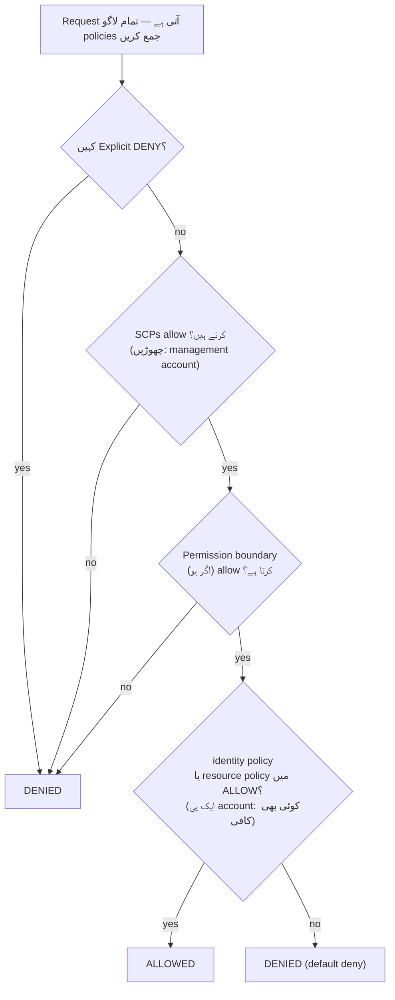

# باب ۱۴: کسے کیا کرنے کی اجازت ہے

نئے انجینئرز پیر کو شروع کر رہے تھے۔ Soo-Jin اور Rafael۔ Maya ان کے پہلے ہفتے کے بارے میں سوچ رہی تھی — انہیں کس چیز تک رسائی کی ضرورت ہوگی، انہیں کیا نہیں چھونا چاہیے، اور کیا موجودہ IAM سیٹ اپ سرے سے دو مزید لوگوں تک توسیع کے لیے تیار تھا۔

دفتر بھرنے سے پہلے وہ ایک کافی کے ساتھ بیٹھ گئی، ایک فہرست بناتے ہوئے۔

---

*CloudFront تعینات ہو چکا تھا۔ Cache hit rates اچھے تھے۔ کارکردگی بڑھ گئی تھی۔ لیکن جیسے ہی ٹیم نئے انجینئرز لانے کی تیاری کر رہی تھی، ایک خاموش مسئلہ سامنے آیا: IAM ترتیب جلدی میں لوگوں نے بنائی تھی۔ Access keys config files میں تھیں۔ کچھ roles کے پاس ضرورت سے زیادہ اجازتیں تھیں۔ اور دو نئے لوگوں کو ایک ایسے production system کے credentials دینے والے تھے جسے متعدد صارفین کو ذہن میں رکھ کر ڈیزائن نہیں کیا گیا تھا۔*

---

Tom کے پاس access keys ایک text file میں کھلے تھے، paste کرنے کے لیے تیار۔

"آپ کیا کر رہے ہیں؟" Priya نے پوچھا۔

"EC2 انسٹینس کو S3 سے config files پڑھنی ہیں۔ میں server configuration میں credentials ڈال رہا ہوں۔"

اس نے ایک لمحے کے لیے اسکرین کو دیکھا۔ "وہ file بند کریں۔"

"میں بس—"

"اگر کوئی اس سرور میں گھس جائے،" اس نے کہا، "تو انہیں وہ keys مل جاتی ہیں۔ اور وہ keys جو کچھ بھی IAM user چھونے کی اجازت رکھتا ہے اسے چھو سکتی ہیں۔ جو شاید صرف S3 سے زیادہ ہے۔"

Tom نے file بند کر دی۔

"ایک بہتر طریقہ ہے،" اس نے کہا۔ "سرور کا خود ایک role ہو سکتا ہے۔ اسے ایک job title کی طرح سوچیں — انسٹینس کو credentials کی ضرورت نہیں کیونکہ سسٹم پہلے سے جانتا ہے کہ یہ کیا ہے اور کیا کرنے کی اجازت رکھتا ہے۔"

Tom شکوک آمیز نظر آیا۔ "تو سرور خود authenticate کرتا ہے؟"

"ہاں۔ بغیر password کے۔ بغیر کسی config file میں keys کے۔ بغیر کسی ایسی چیز کے جو غلطی سے git میں commit ہو سکے۔"

یہ آخری بات لگی۔ Tom نے دو ہفتے پہلے تقریباً خود ایک access key repo میں commit کر دی تھی — آخری سیکنڈ میں diff میں پکڑ لی۔ اس نے ایک نیا browser tab کھولا۔

**IAM کا دوبارہ جائزہ: مکمل تصویر**

باب ۳ نے IAM متعارف کرایا: users، groups، roles، اور policies۔ اب گہرائی میں جانے کا وقت ہے۔

IAM policies JSON documents ہیں جو بتاتے ہیں کہ کون سے actions کن resources پر allowed یا denied ہیں۔ وہ اس طرح نظر آتے ہیں:

```json
{
  "Version": "2012-10-17",
  "Statement": [
    {
      "Effect": "Allow",
      "Action": [
        "s3:GetObject",
        "s3:PutObject"
      ],
      "Resource": "arn:aws:s3:::nimbus-assets/*"
    }
  ]
}
```

یہ policy `nimbus-assets` bucket میں objects پڑھنے اور لکھنے کی اجازت دیتی ہے، اور کچھ نہیں۔ Delete نہیں۔ Buckets list نہیں۔ کوئی اور S3 operation نہیں۔ کوئی اور AWS سروس نہیں۔

یہ اجازتیں دینے کا درست طریقہ ہے: مخصوص actions، مخصوص resources۔

**"Administrator Access" کا مسئلہ**

AWS Managed Policies جیسے `AdministratorAccess` جلدی شروع کرنے کے لیے ڈیزائن کیے گئے ہیں۔ وہ حقیقی ٹیم members کے ساتھ production systems چلانے کے لیے ڈیزائن نہیں کیے گئے۔

`AdministratorAccess` ہر resource پر ہر action دیتا ہے۔ اگر اس policy والا ٹیم member غلطی کرے — غلطی سے S3 bucket delete کرے، غلط EC2 انسٹینس terminate کرے، security group rules بدلے — تو AWS کے پاس انہیں روکنے کے لیے کچھ نہیں۔ اجازت دی جا چکی تھی۔

اگر کسی ٹیم member کے credentials compromise ہوں (phishing حملہ، leaked access key، laptop کی چوری)، تو حملہ آور کے پاس آپ کے AWS account میں ہر چیز پر administrator access ہے۔

"تو Soo-Jin کے پاس کیا ہونا چاہیے؟" Leo نے پوچھا۔

"Soo-Jin کو کیا کرنا ہے؟" Priya نے جواب میں پوچھا۔

"API deploy کرنا۔ Logs چیک کرنا۔ کچھ اور نہیں۔"

"تو اسے ملتا ہے: code pipeline پر push کرنے کی صلاحیت، CloudWatch logs پر read access، اور کچھ نہیں۔"

"یہ... بہت مخصوص ہے۔"

"ہاں۔ یہی مقصد ہے۔"

**IAM Roles: سروسز کے لیے Identities**

باب ۳ نے roles کو EC2 انسٹینسز کے لیے credentials store کیے بغیر AWS سروسز تک رسائی کے ایک طریقے کے طور پر متعارف کرایا۔ آئیے اسے ٹھوس بنائیں۔

Nimbus API چلانے والی آپ کی EC2 انسٹینسز کو یہ کرنا ہوتا ہے:

- DynamoDB سے پڑھنا (مینو)
- DynamoDB میں لکھنا (آرڈرز)
- S3 میں objects رکھنا (receipts، uploads)
- CloudWatch کو logs لکھنا
- Secrets Manager سے secrets پڑھنا

EC2 انسٹینس کے لیے ایک access key کے ساتھ ایک user بنانے اور وہ key EC2 انسٹینس پر store کرنے کے بجائے (ایک security nightmare — access keys کو SSH access والا کوئی بھی پڑھ سکتا ہے)، آپ EC2 انسٹینس کے لیے بالکل ان اجازتوں کے ساتھ ایک **IAM role** بناتے ہیں۔

"رکیں — لیکن ہم *کیوں* اسے اس طرح کریں؟" Maya نے پوچھا۔ "EC2 انسٹینس پہلے سے ہمارا کوڈ چلاتی ہے۔ کوڈ کو صرف ایک access key کیوں نہ دیں؟"

کیونکہ access keys static credentials ہیں جو کہیں رہتی ہیں — ایک config file میں، ایک environment variable میں، ایک git repository میں اگر کوئی غلطی کرے۔ انہیں کاپی کیا جا سکتا ہے، exfiltrate کیا جا سکتا ہے، حادثاتی طور پر commit کیا جا سکتا ہے۔ ایک IAM role مختلف طریقے سے کام کرتا ہے: EC2 انسٹینس خودبخود role assume کرتا ہے۔ AWS instance metadata service کے ذریعے temporary credentials فراہم کرتا ہے۔ Credentials خودبخود rotate ہوتی ہیں — وہ ہر چند گھنٹوں میں expire ہوتی ہیں اور آپ کی طرف سے کسی کارروائی کے بغیر refresh ہوتی ہیں۔ leak کرنے کے لیے کچھ نہیں، کیونکہ store کرنے کے لیے کچھ نہیں۔

"اور اگر کوئی EC2 انسٹینس میں hack کرے؟" Leo نے پوچھا۔

"وہ وہی کر سکتے ہیں جو EC2 role کی اجازت ہے،" Priya نے کہا۔ "جو ہے مینو پڑھنا، آرڈرز لکھنا، اور logs بھیجنا۔ وہ S3 bucket delete نہیں کر سکتے۔ وہ EC2 انسٹینسز terminate نہیں کر سکتے۔ وہ IAM کو چھو نہیں سکتے۔"

"کیونکہ EC2 role کے پاس وہ اجازتیں نہیں ہیں۔"

"بالکل۔"

---

**EC2 Role Assumption مرحلہ وار کیسے کام کرتی ہے**

"کچھ سمجھ نہیں آتا،" Maya نے کہا۔ "اگر انسٹینس پر کوئی credentials store نہیں ہیں، تو انسٹینس دراصل AWS کو کیسے ثابت کرتا ہے کہ یہ کون ہے؟ کہیں نہ کہیں ایک credential ضرور ہوگا۔"

ہے۔ لیکن یہ عارضی، خودبخود rotate ہونے والا، اور صرف انسٹینس کے اندر سے قابل رسائی ہے۔

جب ایک EC2 انسٹینس ایک منسلک IAM role کے ساتھ شروع ہوتی ہے، تو AWS یہ کرتا ہے:

**مرحلہ 1**: AWS STS (Security Token Service) temporary credentials پیدا کرتا ہے — ایک access key ID، ایک secret access key، اور ایک session token۔ EC2 instance roles کے لیے یہ عام طور پر تقریباً چھ گھنٹوں کے لیے درست ہوتے ہیں، اور AWS انہیں expire ہونے سے پہلے خودبخود rotate کرتا ہے۔

**مرحلہ 2**: AWS یہ credentials ایک خاص IP پتے پر دستیاب کراتا ہے: `169.254.169.254`۔ یہ **instance metadata service** (IMDS) ہے۔ یہ صرف EC2 انسٹینس کے اندر سے قابل رسائی ہے۔ انسٹینس سے باہر کوئی چیز اس تک رسائی نہیں کر سکتی۔

**مرحلہ 3**: جب آپ کا ایپلیکیشن کوڈ کسی AWS SDK (boto3، Java SDK، Node.js SDK) کو کال کرتا ہے، تو SDK خودبخود instance metadata endpoint سے query کرتا ہے:

```
GET http://169.254.169.254/latest/meta-data/iam/security-credentials/{role-name}
```

**مرحلہ 4**: SDK temporary credentials وصول کرتا ہے اور انہیں API request پر دستخط کرنے کے لیے استعمال کرتا ہے — مثلاً، S3 سے پڑھنے کی ایک request۔

**مرحلہ 5**: AWS credentials کی توثیق کرتا ہے، role سے منسلک IAM policy چیک کرتا ہے، اور یا تو request کی اجازت دیتا ہے یا deny کرتا ہے۔

**مرحلہ 6**: credentials کے expire ہونے سے تقریباً پندرہ منٹ پہلے، EC2 انسٹینس خودبخود انہیں metadata service سے refresh کرتا ہے۔ ایپلیکیشن کوڈ کو کبھی اسے سنبھالنے کی ضرورت نہیں — SDK اسے شفاف طریقے سے کرتا ہے۔

پورا عمل developer کے لیے نادیدہ ہے۔ آپ `s3.get_object(...)` لکھتے ہیں۔ SDK باقی سنبھالتا ہے۔

"تو credential موجود ہے،" Maya نے کہا۔ "یہ بس عارضی، خود-rotate ہونے والا، اور instance metadata endpoint سے بندھا ہوا ہے۔"

"اسی لیے یہ ایک static access key سے بہت زیادہ محفوظ ہے،" Priya نے کہا۔ "ایک static key، ایک بار چوری ہو جائے، تو کوئی اسے دستی طور پر rotate کرنے تک درست رہتی ہے۔ ایک چوری شدہ temporary credential خود ہی expire ہو جاتی ہے — گھنٹوں میں، مہینوں میں نہیں۔"

"اور اگر انسٹینس کے اندر کوئی metadata endpoint سے query کرے؟"

"وہ موجودہ temporary credential حاصل کر سکتے ہیں۔ یہ ایک حقیقی خطرہ ہے، اسی لیے AWS نے IMDSv2 — Instance Metadata Service version 2 — متعارف کرایا۔ IMDSv2 کے لیے ضروری ہے کہ caller پہلے ایک PUT request کے ذریعے ایک session token حاصل کرے۔ یہ ایک قسم کے حملے کو روکتا ہے جسے Server-Side Request Forgery کہا جاتا ہے، جہاں نقصان دہ کوڈ سرور کو حملہ آور کی طرف سے metadata URL لانے پر دھوکہ دیتا ہے۔"

Leo نے IMDSv2 نافذ کرنے کے لیے EC2 launch configuration اپڈیٹ کی۔ ایک setting، launch کے وقت لاگو۔

---

**Role Assumption: سروسز کیسے دوسری سروسز بنتی ہیں**

Roles یہ assume کر سکتے ہیں:

- **AWS سروسز** (EC2، Lambda، ECS tasks، وغیرہ)
- آپ کے اپنے account میں **IAM users** (role elevation — آپ کسی مخصوص task کے لیے زیادہ اجازتوں والا ایک role assume کرتے ہیں)
- **دوسرے AWS accounts میں IAM users** (cross-account رسائی — کسی اور تنظیم کا account آپ کے میں ایک role assume کر سکتا ہے)
- **بیرونی identity providers** (Google، Active Directory، Okta — انسانی صارفین کے لیے federated رسائی)

"کیا ہم نے سوچا ہے کہ اگر Nimbus کوئی third-party سروس استعمال کرے جسے ہمارے AWS resources تک رسائی چاہیے تو کیا ہوتا ہے؟" Priya نے پوچھا۔ "مثلاً، ایک بیرونی analytics وینڈر۔ ہم ان کے لیے ایک IAM user بنا کر ایک access key نہیں دینا چاہتے۔"

"Cross-account roles،" Leo نے کہا۔ "ہم اپنے account میں ایک role بناتے ہیں اور ایک trust policy لکھتے ہیں جو کہتی ہے 'اس مخصوص بیرونی account کو اس role کو assume کرنے کی اجازت ہے۔' وہ role assume کرنے اور temporary رسائی حاصل کرنے کے لیے اپنے credentials استعمال کرتے ہیں۔ منظم کرنے کے لیے کوئی keys نہیں، leak کرنے کے لیے کوئی keys نہیں۔"

یہ آخری pattern — **identity federation** — وہ طریقہ ہے جس سے بڑی تنظیمیں اپنے employees کو ہر شخص کے لیے انفرادی IAM users بنائے بغیر AWS رسائی دیتی ہیں۔ آپ کی کمپنی کے Active Directory کے پاس آپ کے credentials ہیں۔ جب آپ AWS میں login کرتے ہیں، تو آپ Active Directory کے خلاف authenticate کرتے ہیں، اور AWS آپ کو ایک role دیتا ہے۔

---

**Cross-Account رسائی: Accounting Team کا منظر نامہ**

چھ ماہ بعد، Nimbus نے مالی رپورٹنگ میں مدد کے لیے ایک accounting فرم لائی۔ accounting team کو Nimbus S3 billing bucket میں billing ڈیٹا تک read access چاہیے تھا — لیکن وہ اپنے الگ AWS account سے کام کرتے تھے۔ Nimbus ان کے لیے ایک IAM user بنانا نہیں چاہتا تھا۔ کسی بیرونی کمپنی میں کسی کو ایک static access key دینا بالکل غلط محسوس ہوا۔

"Cross-account role،" Priya نے کہا۔

سیٹ اپ کے تین حصے ہیں:

**حصہ ایک**: Nimbus account میں، ایک IAM role بنائیں — اسے `AccountingReadRole` کہیں۔ ایک policy attach کریں جو billing S3 bucket پر `s3:GetObject` اور `s3:ListBucket` کی اجازت دے۔ کچھ نہیں۔

**حصہ دو**: `AccountingReadRole` میں ایک trust policy شامل کریں۔ trust policy بتاتی ہے کہ کون سی بیرونی identity کو اس role کو assume کرنے کی اجازت ہے:

```json
{
  "Version": "2012-10-17",
  "Statement": [{
    "Effect": "Allow",
    "Principal": {
      "AWS": "arn:aws:iam::ACCOUNTING-FIRM-ACCOUNT-ID:role/AccountingAppRole"
    },
    "Action": "sts:AssumeRole"
  }]
}
```

یہ کہتا ہے: صرف accounting فرم کے AWS account میں مخصوص role اس role کو assume کر سکتا ہے۔ کوئی اور نہیں۔

**حصہ تین**: accounting فرم کے account میں، ان کی ایپلیکیشن `AccountingReadRole` کے لیے temporary credentials حاصل کرنے کے لیے `sts:AssumeRole` استعمال کرتی ہے۔ وہ credentials صرف اس تک محدود ہیں جس کی `AccountingReadRole` اجازت دیتا ہے۔ accounting ایپلیکیشن billing files پڑھ سکتی ہے۔ یہ ان میں لکھ نہیں سکتی۔ یہ Nimbus account میں کسی اور چیز کو چھو نہیں سکتی۔

بالکل اس منظر نامے کے لیے ایک اور سختی کا قدم ہے — اور یہ ایک نامزد امتحانی موضوع ہے۔ accounting فرم بہت سے کلائنٹس کی خدمت کرتی ہے۔ فرض کریں ان کا کوئی نقصان دہ کلائنٹ Nimbus کے `AccountingReadRole` کا ARN جان لیتا ہے اور فرم کے سافٹ ویئر سے اسے "تجزیہ" کرنے کو کہتا ہے۔ فرم کے سافٹ ویئر کے پاس roles assume کرنے کی جائز اجازت ہے — اسے غلط گاہک کی طرف سے Nimbus کے ڈیٹا تک رسائی کرنے کے لیے دھوکہ دیا جا سکتا ہے۔ یہ **confused deputy problem** ہے، اور حل **ExternalId** ہے: Nimbus ایک منفرد خفیہ قدر پیدا کرتا ہے، اسے trust policy میں ایک condition کے طور پر رکھتا ہے (`"sts:ExternalId": "nimbus-7f3a..."`)، اور اسے صرف accounting فرم کے ساتھ شیئر کرتا ہے۔ فرم کے سافٹ ویئر کو ہر `AssumeRole` کال میں وہ ExternalId پاس کرنا ضروری ہے، اور یہ فی گاہک ایک *مختلف* ExternalId استعمال کرتا ہے — لہٰذا غلط گاہک کی طرف سے کی گئی request ناکام ہو جاتی ہے۔ امتحانی trigger: "third party کو cross-account رسائی چاہیے" → role + trust policy + **ExternalId**۔ کبھی shared keys والا IAM user نہیں۔

"اگر ہمیں ان کی رسائی منسوخ کرنی ہو تو کیا؟" Tom نے پوچھا۔

"Trust policy delete کریں یا role delete کریں،" Priya نے کہا۔ "ہو گیا۔ ڈھونڈنے کے لیے کوئی credentials نہیں، deactivate کرنے کے لیے کوئی keys نہیں۔ Role ہی رسائی ہے۔ Role ہٹا دیں، رسائی ختم۔"

"اور ہم ہر بار جب انہوں نے اسے استعمال کیا CloudTrail میں دیکھ سکتے ہیں،" Leo نے اضافہ کیا۔

"ان کی کی گئی ہر API call، logged۔ کون سی bucket، کون سی file، کس وقت، کیا نتیجہ۔"

Tom نے pattern لکھ لیا۔ یہ دوبارہ سامنے آئے گا — ہر integration پارٹنر، ہر بیرونی وینڈر، ہر third-party ٹول جسے AWS رسائی چاہیے ہو، اسے ایک trust policy کے ساتھ ایک role ملے گا، نہ کہ access key کے ساتھ ایک user۔

---

**IAM Policy Evaluation: فیصلے کی منطق**

"کیا ہم نے سوچا ہے کہ کیا ہوتا ہے جب متعدد policies ایک ہی request پر لاگو ہوں؟" Priya نے پوچھا۔ "ایک IAM user کے پاس ایک policy ہے۔ جس resource تک وہ رسائی کر رہے ہیں اس کے پاس ایک resource policy ہے۔ ایک SCP ہو سکتی ہے۔ AWS کیسے فیصلہ کرتا ہے؟"

سمجھنے کی اہم بات یہ ہے کہ AWS policies کو **نہیں** ایک وقت میں ایک قسم، ترتیب سے، چیک کرتا۔ یہ request پر لاگو ہونے والی *تمام* policies جمع کرتا ہے — identity-based، resource-based، SCPs، permission boundaries، session policies — اور پورے ڈھیر پر ایک ساتھ قواعد کا ایک سیٹ لاگو کرتا ہے:

**قاعدہ 1 — Explicit deny جیتتا ہے، ہمیشہ۔** اگر کوئی بھی لاگو policy — IAM، resource-based، SCP، یا boundary — صریحاً action کو deny کرے، تو request denied ہے۔ کوئی چیز ایک explicit deny کو override نہیں کر سکتی۔

**قاعدہ 2 — SCPs اور permission boundaries filters کے طور پر کام کرتے ہیں۔** وہ کبھی کچھ نہیں دیتے۔ action کو ہر لاگو SCP اور permission boundary (اگر ہو) سے *allowed* ہونا چاہیے، ورنہ یہ denied ہے — چاہے دیگر policies کچھ بھی کہیں۔

**قاعدہ 3 — ایک ہی account کے اندر، ایک allow کافی ہے۔** identity کی IAM policy *یا* resource کی policy میں سے *کسی میں بھی* ایک explicit allow action کی اجازت دیتا ہے۔ وہ ایک union ہیں، ایک ترتیب نہیں — resource policy IAM policy سے "پہلے" evaluate نہیں ہوتی۔

**قاعدہ 4 — Default deny۔** اگر کوئی چیز صریحاً action کی اجازت نہ دے، تو یہ denied ہے۔



نتیجہ: کہیں بھی explicit deny = denied۔ کہیں کوئی allow نہیں = denied۔ identity policy *یا* resource policy سے ایک allow = allowed، جب تک کوئی deny، SCP، یا boundary اسے block نہ کرے۔

ایک اور حقیقت جو امتحان کو پسند ہے: **SCPs تنظیم کے management account پر لاگو نہیں ہوتیں** (نہ ہی service-linked roles پر)۔ ایک SCP جو کہتی ہے "us-west-2 کے باہر کوئی EC2 نہیں" ہر member account کو محدود کرتی ہے — لیکن management account اچھوتا رہتا ہے۔ یہ ان وجوہات میں سے ایک ہے کہ AWS آپ کو management account سے ورک لوڈز مکمل طور پر باہر رکھنے کو کہتا ہے۔

ایک باریکی جو امتحانی امیدواروں کو پھنساتی ہے: **cross-account رسائی** کے لیے، target account میں ایک resource-based policy خود کافی نہیں۔ source account میں identity کو بھی action انجام دینے کے لیے اپنی IAM policy میں صریح اجازت چاہیے۔ اگر آپ ایک S3 bucket policy دیتے ہیں جو Account B کو آپ کے objects پڑھنے کی اجازت دیتی ہے، لیکن Account B کے IAM users کے پاس `s3:GetObject` کی اجازت دینے والی کوئی IAM policy نہیں، تو رسائی پھر بھی denied ہے۔ دونوں اطراف کو action کی اجازت دینی ہوگی — resource policy target کی طرف دروازہ کھولتی ہے، اور source account میں IAM policy user کو اس سے گزرنے کی اجازت دیتی ہے۔

"تو اگر Priya کی SCP کہتی ہے 'eu-west-1 میں کوئی EC2 نہیں'، اور اس کی IAM policy کہتی ہے 'تمام EC2 actions allow کریں'، تو وہ پھر بھی eu-west-1 میں ایک انسٹینس نہیں بنا سکتی؟" Leo نے پوچھا۔

"درست،" Priya نے کہا۔ "SCP فلٹر کرتی ہے کہ IAM policies evaluate ہونے سے پہلے کیا ممکن ہے۔ کسی action کے کامیاب ہونے کے لیے دونوں کو متفق ہونا چاہیے۔"

"اور IAM policy میں ایک explicit deny resource policy میں ایک explicit allow کو override کرتا ہے؟"

"ہمیشہ۔ chain میں کہیں بھی ایک explicit deny جیتتا ہے۔"

---

**Permission Boundaries: Roles کیا Grant کر سکتی ہیں اس کو محدود کرنا**

یہاں ایک باریک لیکن اہم مسئلہ ہے: ڈیفالٹ کے مطابق، IAM کسی user کو ان اجازتوں کو grant کرنے سے نہیں روکتا جو اس کے پاس ابھی نہیں ہیں۔

اگر Soo-Jin کے پاس `iam:CreatePolicy` اور `iam:AttachUserPolicy` ہیں، تو وہ S3 write access دینے والی ایک policy بنا سکتی ہے اور اسے خود سے attach کر سکتی ہے — چاہے اس کی موجودہ policies صرف S3 read کی اجازت دیتی ہوں۔ کمزوریوں کی اس class کو **privilege escalation** کہا جاتا ہے، اور یہی بالکل وہ وجہ ہے کہ permission boundaries موجود ہیں۔

لیکن اگر آپ ایک team lead کو IAM permission creation delegate کرنا چاہتے ہیں، جبکہ یہ یقینی بناتے ہوئے کہ وہ آپ کی مرضی سے زیادہ grant نہ کر سکیں؟

**Permission boundaries** وہ زیادہ سے زیادہ اجازتیں سیٹ کرتی ہیں جو کبھی بھی کسی identity کو دی جا سکتی ہیں۔ چاہے identity کی attached policies زیادہ وسیع ہوں، effective اجازتیں permission boundary سے bounded ہیں۔

مثال: آپ ایک team lead کو ایک policy دیتے ہیں جو انہیں IAM roles بنانے کی اجازت دیتی ہے۔ لیکن آپ ایک permission boundary attach کرتے ہیں جو کہتی ہے "اس team lead کے بنائے ہوئے roles کبھی بھی S3 delete access نہیں رکھ سکتے۔" چاہے team lead S3 full access کے ساتھ ایک role بنائے، boundary S3 delete کو effective ہونے سے روکتی ہے۔

آپ سوچ رہے ہوں گے: ایک permission boundary اور ایک Service Control Policy میں کیا فرق ہے؟ وہ ملتی جلتی لگتی ہیں — دونوں محدود کرتی ہیں کہ کون سی اجازتیں effective ہو سکتی ہیں۔ فرق scope ہے۔ ایک permission boundary ایک مخصوص IAM identity (ایک user یا role) پر لاگو ہوتی ہے اور محدود کرتی ہے کہ وہ identity کبھی کیا کر سکتی ہے۔ ایک SCP ایک پورے AWS account یا organizational unit پر لاگو ہوتی ہے — یہ ایک organization-level guardrail ہے جو account میں ہر identity کو متاثر کرتی ہے، administrators سمیت۔ Permission boundaries تب استعمال کریں جب آپ IAM management کو ایک team lead کو delegate کر رہے ہوں۔ SCPs تب استعمال کریں جب آپ کو organization-wide قواعد چاہئیں جنہیں account میں کوئی override نہ کر سکے۔

یہ ایک ایڈوانس تصور ہے، لیکن یہ امتحان میں آتا ہے اور عکاسی کرتا ہے کہ تنظیمیں پیمانے پر IAM management کیسے delegate کرتی ہیں۔

**ایک ٹھوس Permission Boundary: Role Creation کو محفوظ طریقے سے Delegate کرنا**

Nimbus بڑھ رہا تھا۔ Soo-Jin نے تجویز دی کہ platform team پر ہر سینئر انجینئر کو اپنے owned Lambda functions کے لیے IAM roles بنانے کی اجازت ہو — Priya کے ہر ایک کو منظور کرنے کی ضرورت کے بغیر۔

"خطرہ،" Priya نے کہا، "یہ ہے کہ ایک سینئر انجینئر ایک Lambda role `AdministratorAccess` کے ساتھ بنا دے — یا تو غلطی سے یا احتیاط سے نہ سوچ کر۔"

"تو ہم permission boundaries استعمال کرتے ہیں،" Soo-Jin نے کہا۔

Priya نے `NimbusDeveloperBoundary` نامی ایک permission boundary policy بنائی:

```json
{
  "Version": "2012-10-17",
  "Statement": [
    {
      "Effect": "Allow",
      "Action": [
        "s3:GetObject", "s3:PutObject",
        "dynamodb:GetItem", "dynamodb:PutItem", "dynamodb:Query",
        "cloudwatch:PutMetricData", "logs:CreateLogGroup",
        "logs:CreateLogStream", "logs:PutLogEvents",
        "secretsmanager:GetSecretValue",
        "xray:PutTraceSegments"
      ],
      "Resource": "*"
    }
  ]
}
```

پھر اس نے ہر سینئر انجینئر کو roles بنانے کی اجازت دی، لیکن صرف اگر وہ یہ boundary attach کریں:

```json
{
  "Effect": "Allow",
  "Action": ["iam:CreateRole", "iam:AttachRolePolicy"],
  "Resource": "*",
  "Condition": {
    "StringEquals": {
      "iam:PermissionsBoundary": "arn:aws:iam::ACCOUNT_ID:policy/NimbusDeveloperBoundary"
    }
  }
}
```

condition کے بغیر، ایک انجینئر کسی بھی اجازتوں کے ساتھ ایک role بنا سکتا ہے۔ condition کے ساتھ، وہ جو بھی role بناتے ہیں اس میں `NimbusDeveloperBoundary` attach ہونا چاہیے۔ `AdministratorAccess` علاوہ `NimbusDeveloperBoundary` والے role کے پاس دونوں کا intersection ہوتا ہے — مؤثر طور پر صرف boundary میں درج سروسز۔

"تو وہ roles بنا سکتے ہیں،" Leo نے کہا، "لیکن وہ roles کبھی بھی S3 سے پڑھنے، DynamoDB میں لکھنے، اور CloudWatch کو log کرنے سے زیادہ نہیں کر سکتے۔"

"درست۔ وہ ایسے roles نہیں بنا سکتے جو IAM کو چھوئیں۔ وہ ایسے roles نہیں بنا سکتے جو EC2 انسٹینسز delete کریں۔ Boundary چھت تعریف کرتی ہے۔"

"اور اگر وہ boundary attach کرنا بھول جائیں؟"

"Condition `CreateRole` کال کو کامیاب ہونے سے روکتی ہے۔ create ناکام ہو جاتا ہے جب تک boundary شامل نہ ہو۔"

Priya نے Soo-Jin کے ساتھ مشق چلائی۔ بیس منٹ کا سیٹ اپ۔ نتیجہ: انجینئرز ہر تعیناتی کے لیے security review کے بغیر اپنی Lambda role creation خود کر سکتے تھے، اور platform team کو اعتماد رہا کہ کوئی Lambda function کبھی تعریف شدہ اجازتوں سے زیادہ نہیں رکھے گا۔

**IAM Access Analyzer: Permissions کی Auditing**

Priya نے ٹیم کی IAM setup کا جائزہ لینے میں دو دن گزارے۔ اسے ملا:

- Leo کے personal user کے پاس administrator access تھا (جیسا دریافت ہوا)
- ایک پرانے Lambda function کے پاس تمام S3 buckets پڑھنے کی اجازت تھی (ایک test سے باقی)
- ایک service role کے پاس DynamoDB tables میں write access تھا جو اب موجود نہیں

یہ عام ہے۔ IAM configurations وقت کے ساتھ کوڑا جمع کرتی ہیں۔

**IAM Access Analyzer** ایک AWS سروس ہے جو خودبخود ان resources (S3 buckets، IAM roles، KMS keys، Lambda functions، SQS queues) کی شناخت کرتی ہے جو آپ کے AWS account کے باہر سے قابل رسائی ہیں۔ اس میں ایک policy validation خصوصیت بھی شامل ہے جو policies کو IAM best practices کے خلاف چیک کرتی ہے، اور ایک policy generation خصوصیت جو CloudTrail events کا تجزیہ کر کے least-privilege policies بناتی ہے۔

"اس پر فی مہینہ کتنا خرچ آتا ہے؟" Tom نے اپنے browser سے نگاہ اٹھاتے ہوئے پوچھا۔

"External access analysis مفت ہے،" Priya نے کہا۔ "یہ مسلسل چلتی ہے اور console میں findings رپورٹ کرتی ہے۔ Unused access analysis — جو ان roles اور permissions کی شناخت کرتی ہے جو حال ہی میں استعمال نہیں ہوئیں — فی IAM role جس کا تجزیہ کیا جائے فی مہینہ تقریباً $0.20 خرچ کرتی ہے۔"

Tom واپس اپنے browser میں چلا گیا۔

External access findings سب سے زیادہ فوری طور پر قیمتی ہیں۔ جب Priya نے Access Analyzer فعال کیا، تو اسے دو چیزیں ملیں:

پہلی، `nimbus-receipts` S3 bucket کی ایک bucket policy تھی جو ایک مخصوص بیرونی AWS account سے reads کی اجازت دیتی تھی — ایک contractor کا account جس نے آٹھ ماہ پہلے ابتدائی receipt export خصوصیت بنانے میں مدد کی تھی۔ Contractor اب مصروف نہیں تھا۔ Bucket policy کبھی صاف نہیں کی گئی تھی۔

"آٹھ ماہ کی رسائی جو کسی کا ارادہ نہیں تھا،" Priya نے کہا۔

"کیا وہ پھر بھی اس تک رسائی کر رہے تھے؟" Tom نے پوچھا۔

Leo نے S3 access logs کھولے۔ چھ ماہ میں اس account سے کوئی requests نہیں۔ لیکن اجازت موجود تھی۔ Access Analyzer نے اسے سامنے لایا تھا؛ کوئی اسے دستی review میں نہ ڈھونڈ پاتا۔

دوسری، `nimbus-dev-assets` S3 bucket public read پر سیٹ تھی۔ یہ development کے دوران جان بوجھ کر تھا — public access کے ساتھ test کرنا آسان تھا۔ اسے بھلا دیا گیا تھا۔

"Public access block override ہٹا دیں،" Priya نے کہا۔ "اور account کی سطح پر S3 Block Public Access فعال کریں۔ یہ کسی بھی bucket کو public ہونے سے روکتا ہے، انفرادی bucket settings سے قطع نظر۔"

انہوں نے دونوں کیے۔

ماہانہ چلائی گئی unused access analysis ان roles کو سامنے لائے گی جو 90 دنوں میں استعمال نہیں ہوئے۔ وہ delete کرنے کے امیدوار تھے۔ IAM configurations قدرتی طور پر ایک سمت میں بڑھتی ہیں — roles اور policies جمع ہوتی ہیں۔ Access Analyzer صفائی کو نظر آنے والا بناتا ہے۔

باقاعدہ IAM audits آپ کے operations کا حصہ ہونی چاہئیں۔ Access Analyzer audit کی جگہ نہیں لیتا — یہ audit کو قابل انتظام بناتا ہے۔

**Service Control Policies: Organization-Level Guardrails**

اگر آپ کا AWS environment متعدد accounts میں بڑھے (بڑی ٹیموں کے لیے ایک عام pattern — dev account، staging account، production account)، تو **AWS Organizations** آپ کو انہیں ایک مرکزی account سے manage کرنے دیتا ہے۔ ایک فوری، عملی فائدہ: **consolidated billing**۔ تمام member accounts ایک واحد بل میں جمع ہوتے ہیں جو management account ادا کرتا ہے، اور استعمال accounts میں aggregate ہوتا ہے — لہٰذا volume discounts (مثلاً S3 pricing tiers) اور Reserved Instance یا Savings Plans discounts فی account کے بجائے organization-wide لاگو ہوتے ہیں۔ Tom نے Organizations کے بارے میں کچھ اور سمجھنے سے پہلے ہی اسے منظور کر دیا۔

Organizations کے اندر، **Service Control Policies (SCPs)** ایسے guardrails لاگو کرتی ہیں جو account میں *ہر* IAM entity کو متاثر کرتے ہیں، administrators سمیت۔

مثال SCP: "dev account میں کوئی بھی eu-west-1 region میں EC2 انسٹینسز نہیں بنا سکتا۔"

چاہے dev account میں کسی کے پاس administrator access ہو، وہ اس SCP کی خلاف ورزی نہیں کر سکتے۔ یہ organization کی سطح پر نافذ ہے، account کی سطح سے اوپر۔

SCPs اجازتیں نہیں دیتیں — وہ انہیں restrict کرتی ہیں۔ وہ وہ زیادہ سے زیادہ اجازتیں تعریف کرتی ہیں جو account میں کوئی بھی IAM entity کبھی رکھ سکتی ہے۔

جب Nimbus نے ایک multi-account ڈھانچہ قائم کیا — ایک shared production account، ایک development account، اور ایک security account — تو Priya نے تین بنیادی SCPs لکھیں:

**SCP 1 — Region lock**: تمام accounts `us-east-1` اور `us-west-2` تک محدود ہیں۔ اگر کوئی developer غلطی سے `ap-southeast-1` میں deploy کرے، تو action denied ہے۔ یہ غیر ارادی regions میں shadow infrastructure روکتا ہے۔

**SCP 2 — CloudTrail protection**: کسی بھی account میں کوئی CloudTrail غیر فعال نہیں کر سکتا یا CloudTrail logs delete نہیں کر سکتا۔ account administrators بھی۔ اگر CloudTrail اندھیرا ہو جائے، تو security visibility اس کے ساتھ چلی جاتی ہے — یہ SCP اسے ساختی طور پر ناممکن بناتی ہے۔

**SCP 3 — Root user lockdown**: member accounts کے root user کی کی گئی تمام actions کو deny کرتی ہے (AWS کا تجویز کردہ pattern root سے میل کھاتے `aws:PrincipalArn` پر ایک واضح deny ہے، نہ کہ مشروط طور پر MFA کا تقاضا — conditional-MFA SCPs ان service flows کو توڑتی ہیں جو MFA پیش نہیں کر سکتے)۔ Root user کو تقریباً کبھی استعمال نہیں ہونا چاہیے؛ روزمرہ کا کام roles کا ہے۔ یاد رکھیں: SCPs member-account root users پر لاگو ہوتی ہیں، لیکن management account پر **کبھی نہیں**۔

"یہ تین policies پچھلے سال میں ہمارے دیکھے گئے تین حقیقی واقعات کو روک دیتیں،" Priya نے کہا۔ "Region lock اس developer کو روک دیتی جس نے غلطی سے دو سو EC2 انسٹینسز ایک ایسے region میں launch کیں جس میں ہم کام نہیں کرتے۔ CloudTrail protection ہمارے پچھلے employer کے insider threat واقعے کو روک دیتی۔ Root lockdown بس صفائی ہے۔"

"کیا یہ security account پر بھی لاگو ہوتا ہے؟" Leo نے پوچھا۔

"security account کی ایک مختلف SCP ہے — کم پابندیاں، کیونکہ security team کو کبھی کبھی وہ کام کرنے پڑتے ہیں جو دوسرے accounts نہیں کر سکتے۔ لیکن CloudTrail protection ہر جگہ لاگو ہوتی ہے۔ Logging مقدس ہے۔"

اصول: SCPs اس کے لیے جو کبھی نہیں ہونا چاہیے، کہیں بھی، کسی بھی account میں کسی بھی صورت میں۔ IAM policies اس کے لیے جو ہر ٹیم اور سروس کو خاص طور پر چاہیے۔

---

## Landing Zone کو خودکار بنانا: AWS Control Tower

SCPs کام کر رہی تھیں۔ Multi-account ڈھانچہ شکل اختیار کر رہا تھا۔ لیکن Priya ایک خاموش حساب کر رہی تھی، اور اسے نمبر پسند نہیں آئے۔

"آٹھ accounts،" اس نے کہا۔ "اور ہم نے ابھی نئی chains بھی نہیں گنیں۔"

Nimbus ایک واحد AWS account سے آگے بڑھ گیا تھا۔ ان کے پاس production تھا۔ ان کے پاس staging تھا۔ ان کے پاس تین حاصل کردہ ریستوران chains تھیں — ہر ایک اپنا AWS environment چلا رہی، ہر ایک کو Nimbus governance model میں شامل کرنے کی ضرورت۔ کل آٹھ accounts، مزید آنے والے۔

Soo-Jin اس مسئلے کو جانتی تھی۔ "میری پچھلی کمپنی میں، ہم ہر نیا account دستی طور پر سیٹ کرتے تھے،" اس نے کہا۔ "Root account email، IAM users، SCP attachments، CloudTrail، Config، GuardDuty — فی account دو گھنٹے، کم از کم۔ اور کچھ نہ کچھ ہمیشہ تھوڑا مختلف ہوتا۔ ایک account میں CloudTrail صرف us-east-1 میں تھا۔ دوسرے میں GuardDuty غیر فعال تھا کیونکہ کوئی اسے فعال کرنا بھول گیا تھا۔ جب تک آپ کے پاس پچاس accounts ہوتے، فرق کا audit کرنا اپنا ایک پروجیکٹ تھا۔"

"ہم اسے اس طرح نہیں کر رہے،" Priya نے کہا۔

**AWS Control Tower** ایک multi-account AWS environment کے سیٹ اپ اور governance کو خودکار بناتا ہے۔ ہر نئے account کے لیے Organizations، SCPs، CloudTrail، Config، اور GuardDuty کو دستی طور پر جوڑنے کے بجائے، Control Tower ڈھانچہ آپ کے لیے بناتا اور برقرار رکھتا ہے۔

جب آپ Control Tower سیٹ کرتے ہیں، تو یہ ایک **landing zone** بناتا ہے: ایک پہلے سے ترتیب شدہ، محفوظ multi-account environment جس میں ایک management account، ایک log archive account، اور ایک audit account، سب AWS best practices پر چلتے ہیں۔ Log archive account تنظیم میں ہر account سے CloudTrail logs جمع کرتا ہے۔ Audit account security tooling host کرتا ہے۔ یہ baseline خودبخود سیٹ ہوتا ہے — آپ کی ٹیم کے ذریعے دو دنوں میں نہیں، بلکہ Control Tower کے ذریعے منٹوں میں۔

ایک بار landing zone موجود ہو، تو Control Tower اسے **controls** کے ذریعے manage کرتا ہے (پرانا نام، **guardrails**، اب بھی ہر جگہ ظاہر ہوتا ہے، امتحان میں بھی) — تین شکلوں میں پہلے سے بنے governance قواعد۔ *Preventive controls* SCPs ہیں: وہ غیر مطابق actions کو ہونے سے پہلے block کرتے ہیں۔ *Detective controls* AWS Config rules ہیں: وہ drift کے لیے scan کرتے ہیں اور Control Tower dashboard کو رپورٹ کرتے ہیں۔ *Proactive controls* CloudFormation hooks ہیں: وہ resources کو provision ہونے سے *پہلے* compliance کے لیے چیک کرتے ہیں، تعیناتی کو بعد میں flag کرنے کے بجائے ناکام کر دیتے ہیں۔ Priya کی CloudTrail protection SCP، Control Tower زبان میں ترجمہ، ایک preventive control ہے۔ ایک Config rule جو public access والی کسی بھی S3 bucket کو flag کرے ایک detective control ہے۔ ایک hook جو ایک CloudFormation stack کو ایک unencrypted EBS volume بنانے سے block کرے ایک proactive control ہے۔

وہ ٹکڑا جس نے Soo-Jin کے فی-account دو گھنٹے کے مسئلے کو حل کیا: **Account Factory**۔ جب Nimbus ایک اور ریستوران chain حاصل کرتا ہے، تو engineering team Account Factory کھولتی ہے، account کا نام اور email بھرتی ہے، اور provision پر کلک کرتی ہے۔ منٹوں بعد، ایک نیا AWS account صحیح IAM roles، CloudTrail، Config، اور تمام guardrails پہلے سے لاگو ہونے کے ساتھ پہلے سے ترتیب شدہ آتا ہے۔ تقریباً صحیح نہیں۔ ایک چیز کم نہیں۔ ہر دوسرے account کے یکساں۔

"رکیں — لیکن ہم *کیوں* اسے اس طرح کریں؟" Maya نے پوچھا۔ "ہمارے پاس پہلے سے Organizations اور SCPs ہیں۔ اوپر ایک اور سروس کیوں شامل کریں؟"

کیونکہ SCPs کے ساتھ Organizations آپ کو guardrails دیتا ہے — لیکن آپ باقی سب کچھ خود بناتے اور برقرار رکھتے ہیں۔ Control Tower آپ کو مکمل landing zone دیتا ہے: account ڈھانچہ، log archive، audit account، baseline security ترتیب، اور Account Factory، سب AWS کے ذریعے برقرار۔ Control Tower اندرونی طور پر Organizations استعمال کرتا ہے، لیکن یہ خودکار رائے پر مبنی سیٹ اپ شامل کرتا ہے جو اکیلا Organizations فراہم نہیں کرتا۔ اگر آپ آج بالکل شروع سے شروع کریں اور پیمانے پر مستقل governance چاہیں، تو Control Tower جواب ہے۔ اگر آپ کے پاس پہلے سے ایک پختہ Organizations سیٹ اپ ہے جو آپ نے دستی طور پر بنایا، تو آپ اسے Control Tower میں enroll کر سکتے ہیں — یا جیسا ہے ویسا چھوڑ سکتے ہیں۔

وہ فرق جو امتحانی امیدواروں کو پھنساتا ہے: "accounts میں ایک مخصوص action کو restrict کرنے کے لیے ایک SCP لاگو کریں" → آپ براہ راست Organizations + SCP چاہتے ہیں۔ "AWS best practices پر خودبخود ایک محفوظ multi-account environment سیٹ کریں، ایک نئے account provisioning workflow کے ساتھ" → آپ Control Tower چاہتے ہیں۔

"Meridian Kitchen account کو enroll کرنے میں کتنا وقت لگتا ہے؟" Leo نے پوچھا۔

"Account Factory تقریباً تیس منٹ میں ایک نیا account provision کرتا ہے،" Priya نے کہا۔ "مکمل طور پر ترتیب شدہ۔ 'زیادہ تر ترتیب شدہ' نہیں۔"

Tom نے کچھ نہیں کہا۔ وہ ایک انجینئر کے دو گھنٹے کے وقت کی لاگت دیکھ رہا تھا، آٹھ سے ضرب، آنے والے جتنے بھی accounts ہوں ان سے ضرب۔

---

> **امتحانی نکتہ — AWS Control Tower**
>
> *SAA-C03 ڈومین: محفوظ آرکیٹیکچرز ڈیزائن کریں (ڈومین ۱)*
>
> - **Control Tower** guardrails اور Account Factory کے ساتھ multi-account landing zone سیٹ اپ کو خودکار بناتا ہے۔ اسے تب استعمال کریں جب ایک نئی AWS organization شروع کر رہے ہوں یا مستقل governance baselines کے ساتھ پیمانے پر accounts provision کرنے کی ضرورت ہو۔
> - **Preventive controls = SCPs۔** وہ غیر مطابق actions کو ہونے سے پہلے block کرتے ہیں۔
> - **Detective controls = AWS Config rules۔** وہ drift کا پتہ لگاتے ہیں اور dashboard کو رپورٹ کرتے ہیں۔
> - **Proactive controls = CloudFormation hooks۔** وہ provisioning سے پہلے resources کی توثیق کرتے ہیں۔ تین control قسمیں، تین mechanisms — امتحان mapping ٹیسٹ کرتا ہے۔
> - **Account Factory** نئے accounts کو آپ کی تنظیم کے security baseline کے ساتھ پہلے سے ترتیب شدہ provision کرتا ہے — کوئی دستی سیٹ اپ نہیں۔
> - **Control Tower بمقابلہ Organizations:** Organizations + SCPs = آپ سب کچھ بناتے اور manage کرتے ہیں۔ Control Tower = AWS landing zone بناتا ہے اور آپ کے لیے guardrail اپڈیٹس manage کرتا ہے، اندرونی طور پر Organizations استعمال کرتے ہوئے۔
> - **امتحانی trigger:** "security baselines کے ساتھ نئے accounts خودبخود سیٹ کریں" → Control Tower۔ "accounts میں ایک action restrict کرنے کے لیے ایک مخصوص SCP لاگو کریں" → براہ راست Organizations + SCP۔

---

**CI/CD Pipelines: وہ Credentials جنہیں آپ بھول جاتے ہیں**

"کیا ہم نے سوچا ہے کہ ہماری deployment pipeline میں credentials کے ساتھ کیا ہوتا ہے؟" Priya نے پوچھا۔

Nimbus ایپلیکیشن deploy کرنے والے GitHub Actions workflows نے پہلے GitHub Secrets کے طور پر store کیے گئے AWS access keys استعمال کیے تھے۔ یہ معیاری عمل تھا — لیکن اس کا مطلب تھا کہ ایک third-party system میں long-lived access keys موجود تھیں۔

"کیا ہو اگر GitHub compromise ہو؟" Priya نے پوچھا۔ "یا کوئی repository غلطی سے public ہو جائے اور کوئی secrets پڑھ لے؟"

حل: GitHub OIDC federation۔ GitHub Actions OpenID Connect سپورٹ کرتا ہے — یہ GitHub کے identity provider سے ایک temporary token حاصل کر سکتا ہے اور اسے ایک IAM role کے ذریعے AWS credentials کے بدلے بدل سکتا ہے۔ کوئی static access key کبھی نہیں بنتی۔

deployment role کے لیے IAM trust policy:

```json
{
  "Effect": "Allow",
  "Principal": {
    "Federated": "arn:aws:iam::ACCOUNT_ID:oidc-provider/token.actions.githubusercontent.com"
  },
  "Action": "sts:AssumeRoleWithWebIdentity",
  "Condition": {
    "StringEquals": {
      "token.actions.githubusercontent.com:aud": "sts.amazonaws.com",
      "token.actions.githubusercontent.com:sub": "repo:nimbus-org/nimbus-api:ref:refs/heads/main"
    }
  }
}
```

یہ trust policy GitHub Actions کو deployment role assume کرنے کی اجازت دیتی ہے — لیکن صرف جب `nimbus-api` repository کی `main` branch سے چل رہی ہو۔ ایک fork، ایک بیرونی contributor کی pull request، یا ایک مختلف branch role assume نہیں کر سکتی۔

"GitHub Secrets میں کوئی access key نہیں،" Leo نے کہا۔ "Pipeline GitHub کے identity token کا استعمال کرتے ہوئے AWS کے ساتھ authenticate کرتی ہے۔"

"اور role صرف وہی اجازت دیتا ہے جس کی deployment کو دراصل ضرورت ہے،" Priya نے اضافہ کیا۔ "ECR کو push، ECS service اپڈیٹ، S3 میں ایک file رکھنا۔ کچھ نہیں۔"

"میں نے اسے پہلے ہی deploy کر دیا تھا — اوہ۔" Leo نے `main` branch میں OIDC federation test کی تھی لیکن بھول گیا تھا کہ staging environment ایک `staging` branch سے deploy ہوتا ہے۔ Condition بہت restrictive تھی۔ اس نے `ref:refs/heads/main` اور `ref:refs/heads/staging` دونوں کی اجازت دینے کے لیے condition اپڈیٹ کی۔

پرانی access keys delete کر دی گئیں۔ deployment pipeline اب کسی long-lived credentials کے بغیر کام کرتی تھی۔

---

**Enterprise پیمانے پر IAM**

Soo-Jin تین سو انجینئرز اور پانچ سو AWS accounts والی ایک کمپنی سے آئی تھی۔ اس نے Nimbus IAM سیٹ اپ دیکھا اور ایک لمحے کے لیے کچھ نہیں کہا۔

"یہ صاف ہے،" اس نے آخر کار کہا۔ "اچھا least privilege۔ لیکن جب اس کمپنی کے پاس پچاس انجینئرز ہوں گے، تو یہ ڈھانچہ تکلیف دہ ہوگا۔"

"کیا بدلتا ہے؟" Maya نے پوچھا۔

"آپ انفرادی user permissions manage کرنا بند کر دیتے ہیں اور IAM Identity Center کے ذریعے users کے گروپ manage کرنا شروع کرتے ہیں،" Soo-Jin نے کہا۔ "آپ کے پاس متعدد accounts ہیں — dev، staging، production، security، shared services۔ انجینئرز کو کچھ accounts تک رسائی چاہیے اور دوسروں تک نہیں۔ ہر account میں انفرادی IAM users کے ساتھ یہ کرنا برقرار رکھنے کے لیے سینکڑوں configurations ہیں۔"

IAM Identity Center (پہلے AWS Single Sign-On) اسے حل کرتا ہے۔ انجینئرز اپنے corporate credentials کے ساتھ ایک بار login کرتے ہیں۔ Identity Center ان کی identity کو مخصوص accounts میں permission sets — policies کے bundles — سے map کرتا ہے۔ ایک developer کو dev اور staging پر read access، production میں اپنی سروس کے resources پر write access ملتا ہے۔ ایک security انجینئر کو تمام accounts پر read access ملتا ہے۔

"تمام accounts میں کس کے پاس کس چیز تک رسائی ہے، اسے manage کرنے کے لیے ایک جگہ،" Soo-Jin نے کہا۔ "جب کوئی شامل ہوتا ہے، تو آپ اسے ایک گروپ میں شامل کرتے ہیں۔ جب وہ چھوڑتے ہیں، تو آپ انہیں Identity Center سے ہٹا دیتے ہیں اور ہر چیز تک ان کی رسائی غائب ہو جاتی ہے۔"

"اور صاف کرنے کے لیے کوئی انفرادی IAM users نہیں،" Leo نے کہا۔

"درست۔ IAM users موجود ہی نہیں۔ Federation موجود ہے۔"

Enterprise pattern: متعدد accounts کے ساتھ AWS Organizations، انسانی رسائی کو مرکزی طور پر manage کرنے والا Identity Center، automation کے لیے ہر account میں service roles، account-wide guardrails نافذ کرنے والی SCPs۔ کوئی long-lived access keys نہیں۔ کوئی shared credentials نہیں۔ جب کوئی چھوڑے تو کوئی دستی deprovisioning نہیں۔

"ہم ابھی وہاں نہیں ہیں،" Maya نے کہا۔

"نہیں،" Soo-Jin نے کہا۔ "لیکن یہ سمت ہے۔ آپ ابھی جو بھی فیصلہ کرتے ہیں اسے وہاں پہنچنا آسان بنانا چاہیے، مشکل نہیں۔"

**Corporate Directory کہاں رہتی ہے؟ AWS Directory Service**

federation کی تصویر کا ایک اور ٹکڑا ہے۔ Identity Center کو ایک identity *source* چاہیے — کہیں جہاں corporate identities دراصل رہتی ہوں۔ بہت سے enterprises کے لیے، وہ source Microsoft Active Directory ہے، اور AWS اسے جوڑنے کے تین طریقے پیش کرتا ہے، **AWS Directory Service** کی چھتری کے تحت:

**AWS Managed Microsoft AD** اصل Microsoft Active Directory ہے، دو AZs میں AWS-managed domain controllers پر چلتی ہے۔ یہ ہر اس چیز کو سپورٹ کرتی ہے جو اصل AD سپورٹ کرتی ہے: group policy، آپ کی on-premises AD کے ساتھ trust relationships، اور AD پر منحصر AWS ورک لوڈز — FSx for Windows File Server، Windows authentication کے ساتھ SQL Server کے لیے Amazon RDS، domain سے جڑی EC2 انسٹینسز۔ یہ انتخاب تب ہے جب آپ کو AWS *میں* ایک مکمل directory چاہیے، یا جب آپ cloud میں AD-aware applications چلا رہے ہوں۔ (یہ وہ directory ہے جو Leo نے باب ۶ میں Copper Kettle FSx migration کے لیے استعمال کی۔)

**AD Connector** کوئی directory نہیں ہے — یہ ایک proxy ہے۔ یہ authentication requests کو آپ کی *موجودہ on-premises* AD کو ایک VPN یا Direct Connect link پر forward کرتا ہے۔ AWS میں کوئی directory ڈیٹا store یا cache نہیں ہوتا؛ صارفین اپنے موجودہ credentials رکھتے ہیں، اور آپ کی on-premises AD سچائی کا واحد ذریعہ رہتی ہے۔ یہ انتخاب تب ہے جب ضرورت کہے "موجودہ corporate credentials استعمال کریں" اور "cloud میں کوئی identity معلومات store نہ ہو۔"

**Simple AD** ایک کم لاگت، Samba پر مبنی directory ہے جس میں بنیادی AD مطابقت ہے۔ یہ ان چھوٹے، standalone environments کے لیے کام کرتی ہے جنہیں LDAP اور سادہ domain-join کی ضرورت ہو، لیکن یہ trusts، MFA، یا ایڈوانس AD خصوصیات کو سپورٹ نہیں کرتی۔ یہ زیادہ تر چھوٹی directories کے لیے budget آپشن کے طور پر موجود ہے — اور ایک امتحانی distractor کے طور پر۔

"فیصلے کا درخت مختصر ہے،" Soo-Jin نے کہا۔ "موجودہ on-premises AD اور اسے cloud میں کاپی نہ کرنے کا حکم؟ AD Connector۔ AWS میں چلنے والے AD پر منحصر ورک لوڈز، یا ایک trust relationship؟ Managed Microsoft AD۔ چھوٹی standalone directory اور چھوٹا بجٹ؟ Simple AD۔ بس یہی ہے۔"

---

## جب صارفین AWS Accounts نہ ہوں

Nimbus ریستوران operator پورٹل تین ہفتے سے live تھا۔ ریستوران مالکان اپنے آرڈرز دیکھنے، اپنے اوقات اپڈیٹ کرنے، اور اپنی ہفتہ وار رپورٹس ڈاؤن لوڈ کرنے کے لیے login کر سکتے تھے۔ Maya نے تجربہ ڈیزائن کیا تھا۔ Leo نے اسے بنایا تھا۔ Priya پورے دوران خاموش رہی تھی — غیر معمولی طور پر خاموش۔

"ہم authentication کیسے سنبھال رہے ہیں؟" Priya نے ایک جمعرات کی دوپہر پوچھا۔

"ہم نے RDS میں ایک users table بنائی،" Leo نے کہا۔ "Username، hashed password، restaurant ID۔ معیاری چیزیں۔"

Priya نے اسکرین کو دیکھا۔ "تو ہم passwords manage کر رہے ہیں۔ انہیں store کر رہے ہیں۔ Login flows سنبھال رہے ہیں۔ Reset emails۔ Brute-force تحفظ۔"

"ہاں؟"

"ہم اس وقت بھی ذمہ دار ہیں جب کسی کا account compromise ہوتا ہے۔ جب reset email ایک spoofed پتے پر جاتا ہے۔ جب کوئی ریستوران مالک کہیں اور ایک breach سے اپنا password دوبارہ استعمال کرتا ہے۔"

Leo نے اس سب کے بارے میں نہیں سوچا تھا۔

"بالکل اس مسئلے کے لیے ایک منیجڈ سروس ہے،" Priya نے کہا۔ "اور یہ IAM نہیں — IAM آپ کے AWS accounts، آپ کے انجینئرز، آپ کی deployment pipelines کے لیے ہے۔ جو آپ کو چاہیے وہ کوئی ایسی چیز ہے جو آپ کے *ایپلیکیشن صارفین* کے لیے authentication سنبھالے۔ وہ لوگ جن کے AWS accounts نہیں ہیں۔ وہ لوگ جو بس اپنے آرڈرز دیکھنے کے لیے login کرنے کی کوشش کر رہے ہیں۔"

وہ سروس **Amazon Cognito** ہے۔

**User Pools: ایک منیجڈ User Directory**

ایک Cognito User Pool کو اپنی ایپلیکیشن کے لیے ایک منیجڈ user directory کے طور پر سوچیں۔ یہ اس بارے میں سب کچھ سنبھالتا ہے کہ آپ کے صارفین کون ہیں اور وہ کیسے authenticate کرتے ہیں — بغیر آپ کے اس میں سے کچھ بنائے۔

ایک User Pool آپ کو دیتا ہے:

- **Sign-up اور sign-in flows**: بلٹ ان UI یا hosted pages استعمال کرتے ہوئے custom UI۔ Email verification، phone number verification، یا دونوں۔
- **Password management**: policies، hashing، reset flows، temporary passwords — سب منیجڈ۔
- **MFA**: SMS یا authenticator apps کے ذریعے one-time passwords۔ آپ اسے فعال کرتے ہیں؛ Cognito prompts سنبھالتا ہے۔
- **Social identity providers**: Google، Facebook، یا کسی بھی OpenID Connect provider کو جوڑیں۔ آپ کے صارفین اپنے موجودہ accounts کے ساتھ sign in کر سکتے ہیں۔ Cognito OAuth flow سنبھالتا ہے اور آپ کے pool میں ایک linked user بناتا ہے۔

جب کوئی صارف کسی User Pool کے خلاف کامیابی سے authenticate کرتا ہے، تو Cognito **JWTs** جاری کرتا ہے — JSON Web Tokens، خاص طور پر ایک ID token (صارف کون ہے) اور ایک access token (وہ آپ کی ایپلیکیشن میں کیا کرنے کی اجازت رکھتے ہیں)۔ آپ کا backend ہر request پر JWT کی توثیق کرتا ہے۔

"جو ہمارے پاس تھا اس میں کیا غلط ہے؟" Maya نے پوچھا۔ "صارف کو ہماری ڈیٹابیس کے خلاف بس چیک کیوں نہ کریں جیسے ہم پہلے کر رہے تھے؟"

کیونکہ جو کچھ بھی آپ پہلے کر رہے تھے — password hashing، session management، reset flow، brute-force تحفظ — Cognito اسے خودبخود، درست طریقے سے، اور بغیر کسی اضافی engineering لاگت کے کرتا ہے۔ JWT ایک signed، expire ہونے والا token ہے۔ آپ کے backend کو ہر request پر ڈیٹابیس lookup کی ضرورت نہیں؛ یہ بس signature کی توثیق کرتا ہے۔ اور اگر آپ بعد میں MFA، یا Google sign-in شامل کریں، تو آپ اسے Cognito میں ترتیب دیتے ہیں بغیر اپنے authentication کوڈ کو چھوئے۔

Leo نے اس دوپہر 400 لائنوں کا auth کوڈ delete کر دیا۔

**Identity Pools: App صارفین کو AWS Identities میں بدلنا**

User Pools authentication سنبھالتے ہیں — وہ اس سوال کا جواب دیتے ہیں "یہ شخص کون ہے؟" لیکن کبھی کبھی آپ کی ایپلیکیشن کو اپنے صارفین کو براہ راست AWS resources کے ساتھ تعامل کرنے کی ضرورت ہوتی ہے۔ ایک ریستوران مالک کا پورٹل ان کی ہفتہ وار رپورٹ کے لیے ایک presigned S3 URL پیدا کر سکتا ہے، یا ایک API Gateway endpoint کال کر سکتا ہے جو ایک Lambda invoke کرے۔ اس کے لیے، صارف کو temporary AWS credentials کی ضرورت ہے۔

یہی **Cognito Identity Pools** (Federated Identities بھی کہلاتے ہیں) کرتے ہیں۔ ایک Identity Pool ایک authenticated source — ایک Cognito User Pool، Google، Facebook، یا کوئی اور OpenID Connect provider — سے ایک token لیتا ہے اور اسے STS کے ذریعے temporary AWS credentials کے بدلے بدلتا ہے۔

flow:

1. صارف User Pool کے خلاف authenticate کرتا ہے → ایک JWT وصول کرتا ہے
2. ایپلیکیشن JWT کو Identity Pool کو پاس کرتی ہے
3. Identity Pool temporary credentials پیدا کرنے کے لیے STS کال کرتا ہے، صارف کو آپ کے تعریف کردہ ایک IAM role سے map کرتے ہوئے
4. ایپلیکیشن ان credentials کو AWS سروسز کو براہ راست کال کرنے کے لیے استعمال کرتی ہے

یہ "آپ کے app صارفین کو temporary AWS identities میں بدلنا" ہے۔ Credentials بالکل اس تک محدود ہیں جس کی آپ IAM role میں اجازت دیتے ہیں — ایک ریستوران مالک کو ان کے S3 report folder تک read access ملتا ہے اور کچھ نہیں۔

**دونوں مل کر کام کرتے ہیں**

سب سے عام pattern:

```
صارف login کرتا ہے
    → Cognito User Pool (authentication — JWT جاری کرتا ہے)
        → Cognito Identity Pool (authorization — JWT AWS credentials کے بدلے بدلا گیا)
            → مخصوص IAM role کے لیے temporary AWS credentials
```

User Pool جواب دیتا ہے: "یہ شخص کون ہے، اور کیا ان کے credentials درست ہیں؟"
Identity Pool جواب دیتا ہے: "یہ authenticated شخص کن AWS resources تک رسائی کر سکتا ہے؟"

Nimbus ریستوران پورٹل کے لیے: User Pool login، password resets، اور اختیاری Google sign-in سنبھالتا ہے۔ پورٹل میں زیادہ تر خصوصیات Nimbus API کو کال کرتی ہیں، جو JWT کی براہ راست توثیق کرتا ہے۔ صرف report download خصوصیت temporary S3 credentials حاصل کرنے کے لیے Identity Pool استعمال کرتی ہے — اور صرف اس ریستوران کے ڈیٹا کے مخصوص prefix سے پڑھنے کے لیے۔

"اور اگر کوئی JWT کو manipulate کرنے کی کوشش کرے؟" Priya نے پوچھا۔

"JWTs Cognito کی private key سے signed ہیں،" Leo نے کہا۔ "Backend Cognito کی public keys کا استعمال کرتے ہوئے signature کی توثیق کرتا ہے۔ ایک چھیڑ چھاڑ کیا گیا JWT فوری طور پر validation میں ناکام ہو جاتا ہے۔"

"اور Identity Pool credentials کس IAM role تک محدود ہیں؟"

"ایک role جو `arn:aws:s3:::nimbus-reports/{sub}/*` پر `s3:GetObject` کی اجازت دیتا ہے — جہاں `{sub}` صارف کی Cognito user ID ہے۔ ہر ریستوران مالک صرف اپنی رپورٹس پڑھ سکتا ہے۔"

Priya نے اسے منظور کر لیا۔

---

> **امتحانی نکتہ — Cognito**
>
> *SAA-C03 ڈومین: محفوظ آرکیٹیکچرز ڈیزائن کریں (ڈومین ۱)*
>
> - **User Pool = authentication (آپ کون ہیں؟)**۔ Sign-up، sign-in، MFA، social IdP federation، JWT جاری کرنا۔ امتحانی اشارے: "ایپلیکیشن صارفین کو authenticate کرنے کی ضرورت ہے،" "ایک ویب ایپلیکیشن کے لیے user directory،" "social sign-in،" "JWT tokens۔"
> - **Identity Pool = authorization (آپ کن AWS resources تک رسائی کر سکتے ہیں؟)**۔ ایک User Pool یا بیرونی IdP سے tokens کو temporary AWS credentials کے بدلے بدلتا ہے۔ امتحانی اشارے: "authenticated صارفین کو S3/DynamoDB/API Gateway تک براہ راست رسائی چاہیے،" "federated identities کو AWS credentials چاہئیں۔"
> - **امتحان فرق ٹیسٹ کرتا ہے۔** "ایک mobile ایپ کو صارفین کو sign in کرنے دینا ہے اور پھر براہ راست S3 پر تصاویر اپ لوڈ کرنی ہیں" → auth کے لیے User Pool، S3 credentials کے لیے Identity Pool۔ دونوں کو الجھانا کلاسک Cognito جال ہے۔
> - **Cognito بمقابلہ IAM Identity Center**: Cognito آپ کے *ایپلیکیشن صارفین* (گاہک، پارٹنرز، بیرونی فریق) کے لیے ہے۔ IAM Identity Center آپ کے *employees اور انجینئرز* کے لیے ہے جو AWS accounts تک رسائی کرتے ہیں۔ وہ مختلف مسائل حل کرتے ہیں۔

---

## خوبیاں اور حدود

**IAM roles اور least privilege کیوں اہم ہیں**:

- Credentials compromise ہونے پر blast radius محدود کرتا ہے
- Attackers کو فوری طور پر مکمل رسائی ملنے کے بجائے متعدد systems کے ذریعے escalate کرنا ضروری ہوتا ہے
- ایک audit trail فراہم کرتا ہے — CloudTrail logs کرتا ہے کہ کس role نے کیا کیا
- رسائی کے بارے میں شعوری فیصلوں پر مجبور کرتا ہے — "اس سروس کو دراصل کیا چاہیے؟"

**جہاں پیچیدہ ہو جاتا ہے**:

- درست IAM policies لکھنے کے لیے ہر سروس کے لیے AWS کے action/resource model کو سمجھنا ضروری ہے (اور ہر سروس کے درجنوں actions ہیں)
- ضرورت سے زیادہ restrictive policies applications توڑتی ہیں — متعدد سروسز میں "access denied" errors debug کرنا وقت طلب ہے
- IAM تبدیلیاں تھوڑی تاخیر (عام طور پر سیکنڈ، کبھی کبھی زیادہ) سے propagate کرتی ہیں — confusing timing مسائل پیدا کر سکتی ہیں
- Cross-account roles کے لیے trust policy کی محتاط ترتیب درکار ہے

## خلاصہ

ویک اینڈ کی IAM اصلاح عاجز کرنے والی تھی — اس لیے نہیں کہ کام تکنیکی طور پر مشکل تھا، بلکہ اس لیے کہ اس نے نظر آنے والا بنایا کہ کتنی رسائی بغیر کسی ارادے کے جمع ہو گئی تھی۔ اچھا IAM ڈیزائن اپنے آپ میں restrictive ہونے کے بارے میں نہیں ہے۔ یہ بالکل جاننے کے بارے میں ہے کہ ہر سروس کو کیا چاہیے، بالکل وہی دینے کے بارے میں، اور کسی بھی انحراف کی وضاحت کرنے کے قابل ہونے کے بارے میں۔

- Production میں **administrator access** سے بچیں — یہ setup کے لیے ہے، operations کے لیے نہیں۔
- IAM policies **Effect**، **Action**، اور **Resource** بتاتی ہیں — تینوں پر مخصوص ہوں۔
- EC2 انسٹینسز، Lambda functions، اور دیگر AWS سروسز کو access keys نہیں بلکہ **IAM roles** استعمال کرنی چاہئیں۔
- **Permission boundaries** کسی بھی identity کی زیادہ سے زیادہ اجازتوں کو cap کرتی ہیں، attached policies سے قطع نظر۔ انہیں team leads کو IAM role creation محفوظ طریقے سے delegate کرنے کے لیے استعمال کریں۔
- **SCPs** (Service Control Policies) organization-wide restrictions لاگو کرتی ہیں جنہیں administrators بھی override نہیں کر سکتے۔
- **Cross-account roles** بیرونی accounts کو temporary credentials کا استعمال کرتے ہوئے آپ کے resources تک رسائی دیتے ہیں — کوئی static access keys نہیں۔
- **IAM policy evaluation**: تمام لاگو policies ایک ساتھ evaluate ہوتی ہیں — کہیں بھی explicit deny جیتتا ہے؛ SCPs اور permission boundaries کو allow کرنا ضروری ہے (وہ فلٹر کرتے ہیں، کبھی grant نہیں)؛ ایک ہی account کے اندر identity policy یا resource policy میں سے *کسی میں بھی* ایک allow کافی ہے؛ ورنہ default deny۔ SCPs کبھی management account پر لاگو نہیں ہوتیں۔
- EC2 انسٹینسز پر **IMDSv2** metadata service پر Server-Side Request Forgery حملوں کو روکتا ہے۔ ہمیشہ اسے نافذ کریں۔
- **IAM Identity Center** متعدد accounts میں انسانی رسائی کا enterprise طریقہ ہے۔ انفرادی IAM users scale نہیں ہوتے۔
- **Amazon Cognito** *ایپلیکیشن صارفین* کے لیے منیجڈ authentication اور authorization سروس ہے — گاہک اور پارٹنرز جنہیں آپ کے products میں login کرنے کی ضرورت ہے، نہ کہ انجینئرز جنہیں آپ کے AWS accounts تک رسائی چاہیے۔ User Pools authentication سنبھالتے ہیں (sign-up، sign-in، MFA، social IdPs، JWTs)۔ Identity Pools authorization سنبھالتے ہیں (ایک User Pool JWT کو temporary AWS credentials کے بدلے بدلتے ہیں)۔

## امتحانی نکات

*SAA-C03 ڈومین: محفوظ آرکیٹیکچرز ڈیزائن کریں (ڈومین ۱، ٹاسک ۱.۱)*

- **EC2 کے لیے IAM roles**: معیاری جواب جب EC2 کو S3، DynamoDB، Secrets Manager، یا کسی بھی AWS سروس تک رسائی کی ضرورت ہو۔ کبھی بھی کسی انسٹینس پر access keys store نہ کریں۔
- **Policy evaluation logic**: جب IAM ایک request evaluate کرتا ہے، تو یہ ایک explicit allow/deny hierarchy استعمال کرتا ہے۔ ایک explicit **Deny** ہمیشہ جیتتا ہے، چاہے ایک explicit Allow کے خلاف بھی۔ ڈیفالٹ Deny ہے۔
- **Permission boundaries**: IAM administration delegate کرتے وقت استعمال ہوتی ہیں۔ امتحانی منظر نامہ: "developers کو اپنے Lambda functions کے لیے roles بنانے کی اجازت دیں، لیکن انہیں اپنے سے زیادہ اجازتیں دینے سے روکیں۔" → Permission boundaries۔
- **SCPs اجازتیں نہیں دیتیں**: وہ صرف restrict کرتی ہیں۔ اگر کوئی SCP S3 allow کرتی ہے لیکن ایک IAM policy اسے deny کرتی ہے، تو S3 denied ہے۔ اگر کوئی SCP S3 deny کرتی ہے لیکن ایک IAM policy اسے allow کرتی ہے، تو S3 denied ہے۔
- **Resource-based policies**: کچھ AWS سروسز (S3، SQS، Lambda) کے resource-based policies ہیں — resource سے attached اجازتیں، identity سے نہیں۔ یہ IAM policies کے ساتھ مل کر کام کرتی ہیں۔
- **Cross-account رسائی**: Account A میں ایک IAM role، Account B کو اسے assume کرنے کی اجازت دینے والی ایک trust policy کے ساتھ۔ Account B کا user/role پھر Account A میں temporary credentials حاصل کرنے کے لیے `sts:AssumeRole` استعمال کرتا ہے۔
- **IAM Users بمقابلہ Federated Access**: بڑی تنظیموں کے لیے، federated access (IAM Identity Center کے ذریعے یا کسی IdP کے ساتھ براہ راست federation) انفرادی IAM users سے زیادہ ترجیحی ہے۔
- **Instance metadata service**: EC2 roles temporary credentials `http://169.254.169.254/latest/meta-data/iam/security-credentials/` کے ذریعے فراہم کرتے ہیں۔ IMDSv2 SSRF حملوں کو روکنے کے لیے ایک session token کی ضرورت شامل کرتا ہے۔ امتحان پوچھ سکتا ہے کہ سیکیورٹی کے لیے کون سا ورژن استعمال کریں — ہمیشہ IMDSv2۔
- **IAM policy evaluation order**: کہیں بھی explicit deny = denied۔ SCP زیادہ سے زیادہ restrict کرتی ہے۔ Resource-based policies آزادانہ طور پر رسائی grant کر سکتی ہیں۔ Identity-based policies کو explicit allow کی ضرورت ہے۔ ڈیفالٹ ہمیشہ deny ہے۔
- **Access Analyzer**: بیرونی طور پر shared (آپ کے account کے باہر) resources کی شناخت کرتا ہے۔ مفت۔ مسلسل چلتا ہے۔ امتحان اسے ان منظر ناموں میں استعمال کرتا ہے جہاں ایک ٹیم کو audit کرنا ہو کہ کون سی S3 buckets publicly قابل رسائی ہیں یا نامعلوم بیرونی accounts کے ساتھ shared ہیں۔
- **IAM Identity Center**: multi-account انسانی رسائی کا جدید طریقہ۔ Corporate identity providers (Active Directory، Okta) سے map ہوتا ہے۔ امتحان اسے "متعدد AWS accounts" اور "centralized access management" والے منظر ناموں میں استعمال کرتا ہے۔
- **Amazon Cognito User Pools**: ایپلیکیشن صارفین کے لیے منیجڈ user directory (sign-up، sign-in، MFA، social IdPs)۔ JWTs واپس کرتا ہے۔ امتحانی اشارہ: "mobile/web ایپ کو user authentication چاہیے،" "social sign-in،" "JWT پر مبنی auth۔"
- **Amazon Cognito Identity Pools**: ایک User Pool (یا بیرونی IdP) token کو STS کے ذریعے temporary AWS credentials کے بدلے بدلتا ہے۔ امتحانی اشارہ: "authenticated app صارفین کو S3/DynamoDB تک براہ راست رسائی چاہیے۔" امتحان User Pool بمقابلہ Identity Pool فرق ٹیسٹ کرتا ہے — User Pool = آپ کون ہیں، Identity Pool = آپ کن AWS resources تک رسائی کر سکتے ہیں۔
- **AWS Control Tower:** controls (guardrails) اور Account Factory کے ساتھ خودکار multi-account landing zone۔ Preventive controls = SCPs۔ Detective controls = Config rules۔ Proactive controls = CloudFormation hooks۔ Account Factory نئے accounts کو آپ کی تنظیم کے security baseline کے ساتھ خودبخود provision کرتا ہے۔ امتحانی trigger: "security baselines کے ساتھ نئے accounts خودبخود سیٹ کریں" → Control Tower۔ "ایک مخصوص action restrict کرنے کے لیے ایک SCP لاگو کریں" → براہ راست Organizations + SCP۔
- **AWS Directory Service:** تین آپشن، تین triggers۔ **AWS Managed Microsoft AD** = AWS میں چلنے والی اصل Microsoft AD (trust relationships، AD پر منحصر ورک لوڈز جیسے FSx for Windows، >5,000 صارفین)۔ **AD Connector** = آپ کی *موجودہ on-premises* AD کا ایک proxy — cloud میں کوئی directory ڈیٹا نہیں، credentials کی کوئی caching نہیں۔ **Simple AD** = کم لاگت، Samba پر مبنی، بنیادی AD خصوصیات والی چھوٹی standalone directories۔ امتحانی trigger: "موجودہ on-premises AD credentials کو AWS میں store کیے بغیر استعمال کریں" → AD Connector۔ "AWS میں AD-aware ورک لوڈز چلائیں / on-premises AD کے ساتھ ایک trust قائم کریں" → Managed Microsoft AD۔

## مشقیں

**مشق ۱ — یادداشت**

کسی user سے attached ایک IAM policy اور EC2 انسٹینس کے ذریعے assumed ایک IAM role کے درمیان فرق بیان کریں۔ آپ ہر ایک کب استعمال کریں گے؟

*(اشارہ: credentials کے بارے میں سوچیں — وہ کہاں رہتے ہیں، اور کون ان کی rotation manage کرتا ہے؟)*

**مشق ۲ — SAA-C03 منظر نامہ**

*منظر نامہ*: ایک Lambda function کو ایک S3 bucket سے پڑھنا اور ایک DynamoDB table میں لکھنا ہے۔ ایک developer نے development کے دوران آسانی کے لیے Lambda function کو `AdministratorAccess` کے ساتھ ایک role دی ہے۔ Production میں جانے سے پہلے، security team least privilege follow کرنا چاہتی ہے۔

درج ذیل میں سے کون سا BEST طریقہ ہے؟

A) Lambda function کے execution role پر ایک inline policy attach کریں جو مخصوص bucket پر `s3:GetObject` اور مخصوص table پر `dynamodb:PutItem` دیتی ہو  
B) S3 read اور DynamoDB write اجازتوں کے ساتھ ایک نیا IAM user بنائیں؛ ایک access key generate کریں؛ key Lambda environment variables میں store کریں  
C) `AdministratorAccess` رکھیں لیکن ایک SCP شامل کریں جو S3 اور DynamoDB کے علاوہ تمام actions block کرے  
D) S3 read اور DynamoDB write اجازتوں کے ساتھ ایک IAM group بنائیں اور Lambda function کو group میں شامل کریں

**اشارہ ۱**: Lambda functions execution roles استعمال کرتی ہیں، access keys نہیں۔ کون سا آپشن اس کا احترام کرتا ہے؟

**اشارہ ۲**: Least privilege کا مطلب مخصوص resources پر مخصوص actions ہیں، وسیع policies نہیں۔

**اشارہ ۳**: IAM groups users پر مشتمل ہیں، Lambda functions نہیں۔

**جواب**: A

**وضاحت**: Lambda execution role کے پاس صرف وہ مخصوص اجازتیں ہونی چاہئیں جن کی function کو ضرورت ہے۔ مخصوص actions (`s3:GetObject`) اور مخصوص resources (bucket ARN، DynamoDB table ARN) پر scoped inline policies least-privilege implementation ہے۔

**B کیوں نہیں؟** Lambda environment variables میں access keys store کرنا ایک security antipattern ہے — keys کو Lambda console access یا execution context کے ذریعے کوئی بھی پڑھ سکتا ہے۔ Lambda functions IAM سے temporary credentials کے ساتھ execution roles استعمال کرتی ہیں۔

**C کیوں نہیں؟** SCPs Organization/account کی سطح پر لاگو ہوتی ہیں اور per-function permission controls کے طور پر کام نہیں کرتیں۔ SCP کے ساتھ AdministratorAccess غلط layer ہے۔

**D کیوں نہیں؟** Lambda functions کو IAM groups میں شامل نہیں کیا جا سکتا۔ Groups صرف IAM users کے لیے ہیں۔

*SAA-C03 ڈومین: محفوظ آرکیٹیکچرز ڈیزائن کریں — ٹاسک ۱.۱*

**مشق ۳ — آرکیٹیکچر چیلنج** *(اختیاری)*

Nimbus تین ٹیموں تک بڑھ گیا ہے: core API ٹیم، ریستوران partner portal ٹیم، اور analytics ٹیم۔ ہر ٹیم میں پانچ developers ہیں اور ایک shared AWS account میں deploy کرتے ہیں۔

ایک IAM structure ڈیزائن کریں جو:

- ہر ٹیم کو صرف اپنی سروسز تک رسائی دے
- Analytics ٹیم کو production databases میں لکھنے سے روکے
- ہر ٹیم میں ایک team lead کو اپنی سروسز کے لیے IAM roles بنانے کی اجازت دے، لیکن اپنی اجازتیں escalate کرنے کی نہیں
- Platform ٹیم کے لیے ایک admin group فراہم کرے جو تمام سروسز manage کر سکے

آپ کون سے IAM constructs استعمال کریں گے؟ کہاں permission boundaries لاگو ہوں گی؟

*(کوئی ایک درست جواب نہیں ہے۔ مقصد multi-team IAM ڈیزائن کی مشق کرنا ہے۔)*

## پوسٹ کریڈٹس منظر

Leo نے جمعہ کی دوپہر IAM دوبارہ کام کرنا شروع کیا تھا۔

"میں نے اسے پہلے ہی deploy کر دیا تھا — اوہ۔" اس نے staging میں test کرنے سے پہلے ایک نیا role production میں push کر دیا تھا۔ API نے گیارہ منٹ تک access-denied errors پھینکیں اس سے پہلے کہ اس نے غور کیا۔ اس نے اسے rollback کیا، staging میں ٹھیک کیا، اور دوبارہ deploy کیا۔ اس بار یہ کام کر گیا۔

پیر تک، ہر سروس کے پاس بالکل وہ اجازتیں تھیں جن کی اسے ضرورت تھی۔ Soo-Jin اور Rafael کی group memberships ان کے اصل job functions سے match کرتی تھیں۔ Leo نے خود administrator access چھوڑ دی تھی اور ایک ایسا role استعمال کر رہا تھا جو اس نے ڈیزائن کیا تھا — اپنا کام کرنے کی اجازت کے ساتھ، اور کچھ نہیں۔

اس میں توقع سے زیادہ وقت لگا تھا۔

Priya نے منگل کی صبح اس کا کام review کیا۔ اس نے policy documents غور سے پڑھے۔

"یہ اچھا ہے،" اس نے کہا۔

"شکریہ،" Leo نے کہا، اس راحت کے ساتھ جو ایک ویک اینڈ JSON سے عاجز ہونے والے شخص کو ملتی ہے۔

"آپ نے ایک چیز چھوڑی۔"

Leo سخت ہو گیا۔

"پہلے ورژن سے پرانی deploy key۔ ایک GitHub Actions secret میں۔"

"وہ deactivate ہو چکی تھی۔"

Priya نے کچھ ٹائپ کیا۔ "تھی کیا؟"

ایک وقفہ۔

"میں اسے deactivate کروں گا،" Leo نے کہا۔

"CloudTrail logs دکھاتے ہیں کہ اس نے پچھلے ہفتے تین API calls کیے۔"

ایک لمبا وقفہ۔

"کوئی چیز اسے استعمال کر رہی تھی،" Leo نے کہا۔ "میں تحقیق کروں گا۔"

اگلے باب میں: ایک ایسے security guard کے درمیان فرق جو چہرے یاد رکھتا ہے اور ایک ایسے دروازے کے درمیان جو صرف badges پڑھتا ہے۔
