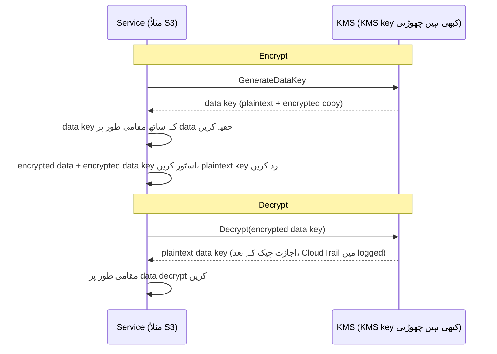

# باب ۱۶: چابیاں، تالے، اور راز

git repository میں دو سال پیچھے جاتے ہزاروں commits تھے۔ Leo بیس منٹ سے scroll کر رہا تھا، تاریخ میں ایک دھاگے کا پیچھا کرتے ہوئے — یہ ڈھونڈ رہا تھا کہ ایک خاص database connection string پہلی بار کب ظاہر ہوئی۔ وہ اسے تقریباً چھوڑ ہی دیتا۔ یہ ایک منگل کی دوپہر تھی، دو غیر قابل ذکر commits کے درمیان، اس شخص کے ذریعے push کی گئی جو اس کے بعد کمپنی چھوڑ گیا تھا۔

ایک database password۔ plain text میں۔ تاریخ میں۔

---

*پچھلے باب کے نیٹ ورک controls اب سخت تھے۔ Security groups نے lateral movement محدود کیا۔ NACLs نے معلوم-برے IP ranges block کیں۔ Perimeter سخت ہو گیا تھا۔ لیکن security audit نے کچھ ایسا پایا جو perimeter ٹھیک نہیں کر سکتا تھا: ایک credential جو چھ ماہ سے git history میں زندہ تھا۔ Perimeter security فرض کرتی ہے کہ اندر کے secrets محفوظ ہیں۔ یہ نہیں تھا۔*

---

Leo git history review کر رہا تھا جب اسے یہ ملا۔ ایک database password۔ چھ ماہ پہلے commit کیا گیا، plain text میں، کسی ایسے شخص کے ذریعے جو اب Nimbus میں کام نہیں کرتا تھا — ایک `.env` file کا حصہ جس میں deployment pipeline کی IAM access key بھی تھی، connection string سے دو لائنیں نیچے۔ Commit عوامی تھی۔ Password اس کے بعد بدلی جا چکی تھی — لیکن وہ یقینی طور پر یہ نہیں جانتے تھے۔ انہوں نے ہر اس نظام کی جانچ کی جسے کوئی بھی credential کبھی چھو چکی تھی۔ اس میں چار گھنٹے لگے۔ یہی وہ دن تھا جب Nimbus نے code میں secrets ڈالنا بند کرنے کا فیصلہ کیا۔

"کیا ہم نے سوچا ہے کہ کیا ہوتا ہے اگر کوئی repo کو fork کرے؟" Priya نے کہا۔ "Git history مستقل ہے۔ چاہے ہم password بدل دیں، fix سے پہلے repo clone کرنے والے کسی بھی شخص کے پاس اب بھی اپنی local history میں پرانا credential ہے۔"

"ہم نے چیک کیا،" Leo نے کہا۔ "Password تین ماہ پہلے بدلا گیا تھا۔ تمام نظاموں نے تصدیق کی۔"

"یہ کم از کم ہے،" Priya نے کہا۔ "لیکن ہر اس نظام کا جائزہ لینا ضروری ہے جسے وہ credential چھو چکی۔ صرف وہ نہیں جنہیں آپ جانتے ہیں۔"

**چار گھنٹے کا Audit**

Leo نے leaked `.env` file git history میں صبح 10 بجے پائی تھی۔ دوپہر 2 بجے تک، ان کے پاس اس سوال کا جواب تھا جو اہم تھا: کیا کوئی بھی credential — database password یا اس کے ساتھ commit کی گئی access key — Nimbus نظاموں کے علاوہ کسی نے استعمال کی تھی؟

Audit چار categories سے گزرا۔

**RDS access logs**: database کے ہر کنکشن، timestamped اور logged۔ Leaked password تین connection strings میں ظاہر ہوا — سب Nimbus VPC میں EC2 انسٹینسز سے، سب متوقع source IPs کے ساتھ۔ کوئی بیرونی کنکشن نہیں۔ Password باہر سے database سے جڑنے کے لیے استعمال نہیں ہوا تھا۔

**S3 access logs**: leaked access key deployment pipeline کے IAM user سے تعلق رکھتی تھی، جس کے پاس `nimbus-receipts` bucket کے لیے اجازتیں تھیں۔ Leo نے پچھلے چھ ماہ کے S3 server access logs query کیے۔ ہر رسائی `us-west-2` EC2 انسٹینسز سے یا CloudFront origin fetch role سے آئی۔ کوئی anomalies نہیں۔

**CloudTrail API calls**: leaked access key ID کے ساتھ کیا گیا ہر AWS API call۔ Leo نے key کے لیے CloudTrail events filter کیے۔ تین سو بارہ events — سب deployment pipeline سے معمول کے `s3:PutObject` calls، سب ایک ہی IP سے، سب business hours کے اندر۔ Key صرف ایک IP پتے سے استعمال ہوئی تھی، جو CI/CD server سے میل کھاتی تھی۔

"اور CI/CD server،" Priya نے کہا، "VPC کے اندر ہے۔ اسے HTTPS کے ذریعے ایک بیرونی endpoint کو data exfiltrate کرنا پڑتا، اور ہم نے flow logs میں وہ دیکھا ہوتا۔"

"ہم نے چیک کیا،" Leo نے کہا۔ "پچھلے چھ ماہ میں اس server سے غیر-AWS IPs کو کوئی outbound HTTPS نہیں۔"

**فیصلہ**: کوئی بھی credential Nimbus team کے باہر کسی نے استعمال نہیں کی تھی۔ Exposure ایک خطرہ تھا، breach نہیں۔

"لیکن ہم یقینی نہیں ہو سکتے،" Priya نے کہا۔ "ہم logs کی بنیاد پر معقول طور پر پراعتماد ہو سکتے ہیں۔ ہم یقینی نہیں ہو سکتے۔ یہ فرق اہم ہے۔"

"کیا چیز ہمیں یقینی بناتی؟"

"credential exposure کے بعد کوئی چیز آپ کو یقینی نہیں بناتی۔ آپ credential rotate کرتے ہیں، رسائی کا audit کرتے ہیں، اپنے نتائج document کرتے ہیں، اور بہتر controls کے ساتھ آگے بڑھتے ہیں۔ یقین دستیاب نہیں۔"

Tom گفتگو کے دوران حساب لگا رہا تھا۔ "تین انجینئرز کے چار گھنٹے۔ اسے fully-loaded لاگت میں چار ہزار dollars کہیں۔ علاوہ credential rotation، documentation، incident write-up۔"

"اور یہ صرف تحقیق ہے،" Priya نے کہا۔ "ایک breach آرڈرز آف میگنیٹیوڈ زیادہ ہوتا۔ ریگولیٹری اطلاعات۔ گاہک کی مواصلات۔ ممکنہ جرمانے۔"

"تو چار ہزار dollar کا سبق سستا تھا،" Tom نے کہا۔

"کافی،" Priya نے کہا۔ "آئیے اسے نہ دہرائیں۔"

---

**دو مسائل: Secrets اسٹور کرنا اور Data خفیہ کرنا**

حساس معلومات کے گرد security کے دو الگ مسائل ہیں:

**Credentials اسٹور کرنا** (database passwords، API keys، connection strings): یہ کہاں رہتے ہیں؟ کون انہیں access کر سکتا ہے؟ آپ اپنی ایپلیکیشن redeploy کیے بغیر انہیں کیسے rotate کرتے ہیں؟

**Data خفیہ کرنا** (customer information، payment records، PII): آپ کیسے یقینی بناتے ہیں کہ اگر کوئی آپ کے database یا S3 bucket تک غیر مجاز رسائی حاصل کر لے، تو وہ data نہ پڑھ سکے؟

AWS کے پاس ہر مسئلے کے لیے ایک dedicated سروس ہے:

- **AWS Secrets Manager**: Credentials محفوظ طریقے سے اسٹور اور manage کرتا ہے
- **AWS KMS (Key Management Service)**: data خفیہ کرنے اور decrypt کرنے کے لیے encryption keys manage کرتا ہے

Secrets Manager کو ایک keychain کے طور پر سوچیں: یہ آپ کی keys (credentials) رکھتا ہے، انہیں منظم رکھتا ہے، اور انہیں ایک شیڈول پر rotate کرتا ہے۔ KMS کو ایک vault کے طور پر سوچیں: یہ قیمتی چیز نہیں رکھتا — یہ وہ key رکھتا ہے جو قیمتی چیز کی حفاظت کرنے والے تالے کو کھولتی ہے۔

**AWS Secrets Manager: کوئی Hardcoded Credentials نہیں**

Secrets Manager secrets کا ایک محفوظ store ہے: database credentials، API keys، OAuth tokens، SSH keys، یا کوئی بھی حساس چیز۔

آپ کی ایپلیکیشن کسی environment variable یا config file سے password پڑھنے کے بجائے startup پر (یا جب ضرورت ہو) Secrets Manager API کو call کرتی ہے اور secret بازیافت کرتی ہے۔ Secret کبھی disk کو نہیں چھوتی۔ کبھی آپ کے code میں ظاہر نہیں ہوتی۔ آپ کے environment variables میں نہیں ہوتی۔

Flow یہ دکھتا ہے:

**پرانا طریقہ**:
```
DB_PASSWORD=supersecretpassword123  # .env file یا environment variable میں
```

**Secrets Manager طریقہ**:
```python
import boto3
client = boto3.client('secretsmanager')
secret = client.get_secret_value(SecretId='nimbus/production/db-password')
password = json.loads(secret['SecretString'])['password']
```

EC2 انسٹینس کو اس مخصوص secret کے لیے `secretsmanager:GetSecretValue` call کرنے کی اجازت کے ساتھ ایک IAM role کی ضرورت ہے۔ کوئی اور سروس اسے نہیں پڑھ سکتی۔ Secret کبھی code میں نہیں ہوتی۔

آپ سوچ رہے ہوں گے: صرف environment variables کیوں نہ استعمال کریں؟ وہ آسان ہیں — انہیں deploy time پر سیٹ کریں، اور ایپلیکیشن انہیں پڑھتی ہے۔ Environment variables چھپے ہوئے لگتے ہیں، لیکن وہ آپ کی deployment configuration میں محفوظ ہوتے ہیں، CI/CD secrets store میں، ممکنہ طور پر debug sessions کے دوران logged، اور چلتے process تک رسائی والے کسی کو نظر آتے ہیں۔ زیادہ اہم بات، وہ static ہیں: ایک بار سیٹ ہو جائیں، وہ تب تک نہیں بدلتے جب تک کوئی انہیں دستی طور پر اپڈیٹ نہ کرے۔ Secrets Manager credentials کو IAM access controls، CloudTrail کے ذریعے مکمل audit logging، اور خودکار rotation کے ساتھ ایک encrypted سروس میں اسٹور کرتا ہے۔ Environment variables rotate نہیں ہوتے۔ ایک leaked environment variable تب تک درست رہتا ہے جب تک کوئی اسے دستی طور پر نہ بدلے۔

**خودکار Rotation: اصل طاقت**

Secrets Manager کی سب سے بڑی خصوصیت secrets اسٹور کرنا نہیں ہے — یہ انہیں خودبخود rotate کرنا ہے۔

منظر نامہ: ہر 30 دن میں، Secrets Manager ایک نیا database password generate کرتا ہے، اسے RDS میں اپڈیٹ کرتا ہے، محفوظ secret اپڈیٹ کرتا ہے، اور آپ کی ایپلیکیشن اگلی بار جب ضرورت پڑتی ہے نیا password بازیافت کرتی ہے۔ کوئی ہاتھ سے مداخلت نہیں۔ کوئی deployment نہیں۔ کوئی "مجھے یہ rotate کرنا یاد رکھنا ہے" نہیں۔

Rotation ایک Lambda function کے طور پر نافذ ہے۔ AWS RDS databases (MySQL، PostgreSQL، Aurora) کے لیے templates فراہم کرتا ہے۔ آپ کسی بھی credential قسم کے لیے function customize کر سکتے ہیں۔

"اس پر فی مہینہ کتنا خرچ آتا ہے؟" Tom نے پوچھا۔

Secrets Manager فی secret فی ماہ علاوہ فی API call چارج کرتا ہے۔ database passwords اور API keys کی ایک چھوٹی تعداد کے لیے، لاگت فی ماہ چند dollars ہے — کسی واقعے کی لاگت کے مقابلے میں نہ ہونے کے برابر۔

"پچھلے ہفتے کا compromise،" Priya نے کہا، "اسے investigate اور remediate کرنے کی کتنی لاگت ہوتی؟"

Tom ایک لمحے کے لیے خاموش رہا۔ "میرا وقت، آپ کا وقت، Leo کا ہفتہ آخر شامل کرتے ہوئے... چند ہزار dollars۔"

"Secrets Manager static key کو exploit ہونے سے پہلے پکڑتا۔ اور اسے خودبخود rotate کرتا۔"

Tom نے pricing page کھولا۔

**Rotation کے دوران کیا ہوتا ہے**

"رکیں — لیکن ہم *کیوں* اسے اس طرح کریں؟" Maya نے پوچھا۔ "اگر database password rotate ہو، تو کیا ایپلیکیشن ٹوٹ جاتی ہے؟ یہ deployment کے بغیر نیا password کیسے pick کرتی ہے؟"

یہ ایک جائز تشویش تھی۔ خلل کے بغیر rotation محتاط ہونے کا تقاضا کرتا ہے۔

Secrets Manager rotation مراحل میں کام کرتا ہے — "پرانا password اچانک invalid، ایپلیکیشن کریش" کے منظر نامے کو روکنے کے لیے ڈیزائن کیا گیا:

**مرحلہ 1: نیا secret version بنائیں۔** Secrets Manager ایک نیا password generate کرتا ہے اور اسے secret کے ایک pending version کے طور پر اسٹور کرتا ہے۔ موجودہ version اب بھی فعال ہے۔

**مرحلہ 2: سروس پر سیٹ کریں۔** Rotation Lambda password کو نئی قدر پر اپڈیٹ کرنے کے لیے database کو call کرتا ہے۔ آگاہ رہیں: ڈیفالٹ **single-user** rotation حکمت عملی کے ساتھ ایک مختصر لمحہ ہوتا ہے جب پرانا password ابھی کام کرنا بند کر چکا ہے (PostgreSQL کا `ALTER ROLE ... PASSWORD` فوری اثر کرتا ہے) اور نیا version ابھی موجودہ نہیں۔ zero-downtime rotation کے لیے، Secrets Manager ایک **alternating-users** حکمت عملی سپورٹ کرتا ہے: یکساں اجازتوں والے دو database users، جہاں rotation ہمیشہ *غیر فعال* کو اپڈیٹ کرتا ہے اور پھر switch کرتا ہے — فعال credentials کبھی درمیان میں invalidate نہیں ہوتے۔ یاد رکھنے کا امتحانی جملہ "alternating users rotation strategy" ہے۔

**مرحلہ 3: نیا secret test کریں۔** Rotation Lambda اس کے ساتھ جڑ کر تصدیق کرتا ہے کہ نیا password کام کرتا ہے۔ اگر یہ ناکام ہو، تو rotation rollback ہو جاتا ہے۔

**مرحلہ 4: ختم کریں۔** Secrets Manager نئے version کو موجودہ version کے طور پر نشان زد کرتا ہے اور پرانے version کو پچھلے version کے درجے پر اتار دیتا ہے۔ پچھلا version ایک grace period کے لیے رکھا جاتا ہے۔

Grace period کے دوران، دونوں versions بازیافت کیے جا سکتے ہیں۔ اگر آپ کی ایپلیکیشن نے پرانا secret cache کیا اور ابھی نیا pick نہیں کیا، تو یہ پھر بھی جڑ سکتی ہے۔ اگلی بار جب یہ `GetSecretValue` کال کرتی ہے، اسے موجودہ (نیا) version ملتا ہے۔

"تو ایپلیکیشن کو کبھی restart کرنے کی ضرورت نہیں،" Leo نے کہا۔

"ضروری نہیں۔ اگر آپ کی ایپلیکیشن startup پر secret cache کرتی ہے اور اسے کبھی refresh نہیں کرتی، تو آپ کو یا تو اسے ایک شیڈول پر refresh کرنا ہوگا یا secret دوبارہ fetch کر کے authentication failures سنبھالنی ہوں گی۔"

"تو rotation Lambda اور ایپلیکیشن کو تعاون کرنا ہوگا،" Maya نے کہا۔

"Secrets Manager اپنا آدھا کرتا ہے۔ آپ کے ایپلیکیشن code کو دوسرا آدھا کرنا ہوگا: جب ضرورت ہو secret fetch کریں، authentication failures کو دوبارہ fetch کر کے سنبھالیں۔"

Leo نے ایپلیکیشن کو database authentication exceptions پکڑنے اور، ناکامی پر، دوبارہ کوشش کرنے سے پہلے Secrets Manager سے ایک تازہ secret fetch کرنے کے لیے اپڈیٹ کیا۔ error handling کی دو لائنیں۔ Rotation صارفین کے لیے نادیدہ ہو گئی۔

---

**CI/CD Pipeline Secrets Injection**

"کیا ہم نے سوچا ہے کہ deployment pipeline کو جن secrets کی ضرورت ہے وہ کیسے ملتے ہیں؟" Priya نے پوچھا۔ "Pipeline infrastructure deploy کرتی ہے۔ اسے AWS credentials چاہئیں۔ اسے migration scripts کے لیے database connection strings کی ضرورت ہو سکتی ہے۔"

Leo نے موجودہ سیٹ اپ سمجھایا: secrets GitHub Actions Secrets کے طور پر اسٹور تھے — GitHub میں at rest encrypted، runtime پر environment variables کے طور پر inject۔

"Credentials GitHub میں ہیں،" Priya نے کہا۔

"Encrypted۔"

"ایک third-party system میں۔ ایک GitHub breach ہماری تمام pipeline secrets expose کرتا ہے۔"

حل: deployment pipeline OIDC federation (باب ۱۴ میں احاطہ) کے ذریعے AWS سے authenticate کرتی ہے اور runtime پر Secrets Manager سے جن secrets کی ضرورت ہو بازیافت کرتی ہے۔ GitHub میں کوئی secrets اسٹور نہیں۔ Pipeline کے AWS role کے پاس مخصوص secrets پڑھنے کی اجازت ہے، کچھ نہیں۔

```yaml
# GitHub Actions workflow
- name: Get DB Migration Credentials
  env:
    AWS_DEFAULT_REGION: us-west-2
  run: |
    SECRET=$(aws secretsmanager get-secret-value \
      --secret-id nimbus/staging/db-migration \
      --query SecretString --output text)
    DB_URL=$(echo $SECRET | jq -r '.url')
    # DB_URL کے ساتھ migration چلائیں — کبھی کسی file میں اسٹور نہیں
    flyway -url="$DB_URL" migrate
```

Secret fetch کیا جاتا ہے، memory میں استعمال ہوتا ہے، اور رد کیا جاتا ہے۔ یہ کبھی disk پر نہیں لکھا جاتا، کبھی job کے بعد باقی رہنے والے environment variables میں اسٹور نہیں ہوتا، کبھی کسی log file میں نہیں ہوتا۔

"کیا ہو اگر secret log پر print ہو جائے؟" Leo نے پوچھا۔

"GitHub Actions خودبخود ان secrets کی قدریں mask کرتا ہے جو GitHub Secrets کے طور پر ترتیب دیے گئے ہوں۔ لیکن یہ secret کوئی GitHub Secret نہیں — یہ Secrets Manager سے آتا ہے۔ آپ کو اسے دستی طور پر mask کرنا ہوگا، یا بہتر، اسے کبھی log نہ کریں۔"

"تو نظم و ضبط ہے: fetch، استعمال، رد کریں۔ کبھی secrets log نہ کریں۔ کبھی انہیں files میں اسٹور نہ کریں۔"

"وہ نظم و ضبط،" Priya نے کہا، "وہی ہے جس پر چار گھنٹے کے audit نے تصدیق کی کہ ہم ناکام ہو رہے تھے۔"

**AWS KMS: Lock کی فیکٹری**

"رکیں — لیکن ہم *کیوں* اسے اس طرح کریں؟" Maya نے پوچھا۔ "ایک الگ key management سروس کیوں؟ کیا ہم خود data خفیہ کر کے key Secrets Manager میں اسٹور نہیں کر سکتے؟"

آپ encryption keys Secrets Manager میں اسٹور کر سکتے ہیں۔ لیکن پھر key تک رسائی کون control کرتا ہے؟ کیا چیز یقینی بناتی ہے کہ key rotate ہوتی ہے؟ کیا چیز ایک auditor کو ثابت کرتی ہے کہ key صرف مجاز سروسز نے استعمال کی؟ KMS ان تمام سوالات کا جواب دیتا ہے۔ یہ صرف اسٹوریج نہیں — یہ ایک key lifecycle management سروس ہے جس میں hardware-backed security، فی key باریک IAM policies، اور ہر استعمال کا مکمل audit trail ہے۔ Secrets Manager وہ اسٹور کرتا ہے جس کی آپ کو نظاموں سے جڑنے کے لیے ضرورت ہے۔ KMS خود نظاموں کی حفاظت کرتا ہے۔

AWS KMS (Key Management Service) **cryptographic keys** manage کرتا ہے — وہ secret values جو data خفیہ کرنے اور decrypt کرنے کے لیے استعمال ہوتی ہیں۔

مثال: KMS ایک lockbox کمپنی کی طرح ہے جو master key رکھتی ہے۔ آپ کا data (box کا مواد) خفیہ ہے۔ صرف وہی جس کے پاس KMS key استعمال کرنے کی اجازت ہے اسے decrypt کر سکتا ہے۔ KMS CloudTrail میں ہر key کا ہر استعمال log کرتا ہے۔

**Customer Master Keys (CMKs)** — اب KMS keys کہلاتی ہیں — تین قسم کی ملکیت میں آتی ہیں:

**AWS owned keys**: وہ keys جن کا AWS مالک ہے اور بہت سے customer accounts میں استعمال کرتا ہے — آپ انہیں کبھی نہیں دیکھتے، کبھی ادائیگی نہیں کرتے، اور وہ آپ کے account میں ظاہر نہیں ہوتیں۔ کئی service defaults انہیں استعمال کرتے ہیں (مثلاً DynamoDB کی default encryption)۔

(ایک فرق سیدھا رکھنے کے قابل: S3 کی default **SSE-S3** encryption سرے سے KMS key ماڈل نہیں ہے — S3 اپنی AES-256 keys مکمل طور پر KMS کے باہر manage کرتا ہے، کوئی key دیکھنے کے لیے نہیں اور کوئی key-usage audit trail نہیں۔ **SSE-KMS** S3 آپشن ہے جو KMS سے گزرتا ہے، یا تو AWS managed key `aws/s3` یا ایک customer-managed key استعمال کرتے ہوئے۔ امتحانی trigger: "audit کریں کہ encryption key کس نے استعمال کی" یا "rotation اور key policy control کریں" → ایک customer-managed key کے ساتھ SSE-KMS — ہر استعمال CloudTrail میں آتا ہے۔)

**AWS managed keys**: AWS *آپ کے account میں* S3، EBS، RDS جیسی سروسز کے لیے key خودبخود بناتا اور manage کرتا ہے (نام `aws/s3` جیسے)۔ آپ اسے دیکھ سکتے ہیں اور CloudTrail میں اس کے استعمال کا audit کر سکتے ہیں، لیکن آپ اس کی policy یا rotation نہیں بدل سکتے — AWS اسے ہر سال خودبخود rotate کرتا ہے۔ مفت۔

**Customer managed keys**: آپ KMS میں key بناتے ہیں اور اس کا ہر پہلو control کرتے ہیں: کون اسے استعمال کر سکتا ہے، کب rotate ہوتی ہے، کون اسے administer کر سکتا ہے۔ آپ 90 دنوں اور 2,560 دنوں (7 سال) کے درمیان ایک قابل ترتیب مدت کے ساتھ خودکار key rotation فعال کر سکتے ہیں؛ default rotation مدت 365 دن (سالانہ) ہے۔ آپ ایک **on-demand rotation** بھی فوری طور پر trigger کر سکتے ہیں — کسی مشتبہ exposure کے بعد مفید، شیڈول کا انتظار کیے بغیر۔ نوٹ: خودکار rotation KMS-generated material والی symmetric keys پر لاگو ہوتا ہے — asymmetric keys اور imported key material خود-rotate نہیں ہو سکتیں۔ لاگت: $1/month فی key علاوہ فی-API-call charges۔

اگر آپ customer-managed KMS keys چنتے ہیں، تو آپ کو rotation schedules، access policies، اور audit visibility پر مکمل control ملتا ہے، لیکن آپ فی key فی ماہ ادائیگی کرتے ہیں اور key management کی ذمہ داری اٹھاتے ہیں؛ اگر آپ AWS-managed keys چنتے ہیں، تو آپ کو صفر آپریشنل overhead اور key کی خود کوئی لاگت کے بغیر encryption ملتی ہے، لیکن آپ rotation schedules یا key policies customize نہیں کر سکتے — وہ مکمل طور پر AWS کے ذریعے managed ہیں۔

**AWS سروسز میں Encryption: KMS Integration**

زیادہ تر AWS سروسز encryption کے لیے KMS کے ساتھ integrate ہوتی ہیں:

**S3**: ایک bucket پر "server-side encryption with KMS" فعال کریں۔ ہر object ایک KMS key سے at rest خفیہ ہوتا ہے۔ کسی object کو پڑھنے کے لیے S3 bucket *اور* KMS key دونوں کی اجازت ضروری ہے۔

**RDS**: creation کے وقت encryption فعال کریں۔ Database storage، backups، اور snapshots سب ایک KMS key سے خفیہ ہوتے ہیں۔ نوٹ: encryption کسی موجودہ unencrypted RDS انسٹینس پر فعال نہیں کیا جا سکتا — آپ کو snapshot لینا، encryption فعال کے ساتھ snapshot copy کرنا، اور restore کرنا ہوگا۔

**EBS**: KMS کے ساتھ volumes خفیہ کریں۔ خفیہ snapshots سے بنائے گئے نئے volumes خودبخود خفیہ ہوتے ہیں۔

**DynamoDB**: KMS کا استعمال کرتے ہوئے at rest encryption تمام tables پر ڈیفالٹ کے مطابق فعال ہے۔

**ElastiCache Redis**: حساس cached data کے لیے KMS کے ساتھ at rest encryption۔

اصول: data at rest (disk پر محفوظ) اور in transit (نیٹ ورک میں جاتا ہوا) خفیہ ہونا چاہیے۔ KMS at-rest encryption سنبھالتا ہے۔ TLS/SSL (AWS سروسز کے ذریعے خودبخود فراہم) in-transit encryption سنبھالتا ہے۔

**Envelope Encryption: KMS اصل میں کیسے کام کرتا ہے**

یہاں ایک تفصیل ہے جو KMS کے رویے اور امتحانی سوالات سمجھنے میں مدد کرتی ہے۔

KMS زیادہ تر cases میں آپ کا data براہ راست خفیہ نہیں کرتا۔ یہ **envelope encryption** استعمال کرتا ہے:

1. KMS ایک **data key** (ایک منفرد symmetric key) generate کرتا ہے
2. سروس data key کا استعمال کر کے آپ کا data مقامی طور پر خفیہ کرتی ہے (تیز — symmetric encryption)
3. سروس KMS سے data key کو خود خفیہ کرنے کو کہتی ہے (آپ کی KMS key استعمال کرتے ہوئے)
4. خفیہ شدہ data اور خفیہ شدہ data key دونوں محفوظ ہوتے ہیں
5. آپ کا اصل data کبھی سروس نہیں چھوڑتا — صرف data key encryption/decryption کے لیے KMS جاتی ہے

جب آپ data پڑھتے ہیں:

1. سروس KMS سے data key decrypt کرنے کو کہتی ہے
2. KMS اجازتیں چیک کرتا ہے، data key decrypt کرتا ہے، واپس کرتا ہے
3. سروس decrypted data key استعمال کر کے آپ کا data مقامی طور پر decrypt کرتی ہے



اس کا مطلب ہے KMS KMS API کے ذریعے سب کچھ بھیجے بغیر بہت بڑا data سنبھال سکتا ہے۔ صرف چھوٹی keys KMS جاتی ہیں۔ CloudTrail ہر KMS API call log کرتا ہے — ہر encrypt اور decrypt operation۔

**KMS Key Policies: Access ماڈل**

"کیا ہم نے سوچا ہے کہ کیا ہوتا ہے اگر ایک IAM policy اور ایک key policy متصادم ہوں؟" Priya نے پوچھا۔ "KMS کا IAM کے اوپر اپنا access control ہے۔"

KMS keys کی **key policies** ہوتی ہیں — key سے خود منسلک resource-based policies۔ وہ IAM policies سے الگ ہیں اور مختلف evaluation rules follow کرتی ہیں۔

کسی principal کے لیے KMS key استعمال کرنے کے لیے، دو چیزیں سچ ہونی ضروری ہیں:

**پہلی**: key policy کو اسے allow کرنا ضروری ہے۔ اگر key policy principal کو واضح طور پر رسائی نہ دے، تو وہ key استعمال نہیں کر سکتے — چاہے ان کی IAM policy کچھ بھی کہے۔ یہ زیادہ تر AWS resources سے مختلف ہے، جہاں IAM policies اکیلے کافی ہیں۔

**دوسری**: principal کی IAM policy کو KMS action (مثلاً `kms:Decrypt`، `kms:GenerateDataKey`) allow کرنا ضروری ہے۔

دونوں کو ہاں کہنا ضروری ہے۔ کسی ایک کے بھی نہ کہنے کا مطلب ہے action denied۔

وہ default key policy جو AWS customer-managed keys کے لیے بناتا ہے، اس میں ایک statement شامل ہے جو کہتی ہے "root account اس key کو manage کر سکتا ہے۔" یہ اہم ہے: اس کا مطلب ہے کہ ایک account-level IAM administrator ہمیشہ ایک key تک رسائی دے سکتا ہے، چاہے key policy انہیں براہ راست نام نہ دے — کیونکہ root account delegation موجود ہے۔

"تو اگر ہم root account کو key policy سے ہٹا دیں،" Leo نے پوچھا، "تو اس key کے لیے IAM policies کام کرنا بند کر دیتی ہیں؟"

"درست۔ root account delegation ہٹانا ایک key کو اتنا سختی سے lock کرنے کا طریقہ ہے کہ صرف key policy میں نامزد مخصوص principals اسے استعمال کر سکیں — account administrators بھی نہیں۔ یہ خود کو اپنی key سے باہر کرنے کا حادثاتی طریقہ بھی ہے۔"

"کیا ہم بحال کر سکتے ہیں؟"

"صرف AWS Support سے رابطہ کر کے۔ اگر کوئی key استعمال نہ کر سکے اور key policy اپڈیٹ نہ ہو سکے، تو اس key سے خفیہ کیا گیا data مؤثر طور پر ناقابل رسائی ہے۔"

"تو ایک نہایت اچھی وجہ کے بغیر root account کو key policy سے نہ ہٹائیں۔"

"درست۔"

---

**Asymmetric Keys: Signing اور Verification**

KMS asymmetric key pairs بھی سپورٹ کرتا ہے — ایک public key اور ایک private key۔

استعمال کے کیسز:

**Digital signing**: آپ private key سے ایک document یا ایک JWT token پر دستخط کرتے ہیں۔ public key والا کوئی بھی تصدیق کر سکتا ہے کہ signature private key کے حامل سے آیا، اور یہ کہ مواد کے ساتھ چھیڑ چھاڑ نہیں کی گئی۔

**Public key encryption**: کوئی بھی public key سے data خفیہ کر سکتا ہے۔ صرف private key کا حامل اسے decrypt کر سکتا ہے۔

Nimbus کے لیے، asymmetric keys تب متعلقہ ہوئیں جب انہوں نے ریستوران partners کے لیے ایک webhook signature نظام نافذ کیا۔ جب Nimbus نے کسی ریستوران پارٹنر کے server کو ایک event بھیجا (ایک نیا آرڈر، ایک status update)، تو پارٹنر کو تصدیق کرنی پڑتی کہ event واقعی Nimbus سے آیا تھا اور forged نہیں کیا گیا تھا۔

نفاذ:

1. Nimbus ایک asymmetric KMS key بناتا ہے (RSA 2048-bit، SIGN_VERIFY algorithm)
2. ایک webhook بھیجتے وقت، Nimbus event payload پر دستخط کرنے کے لیے private key کے ساتھ `kms:Sign` کال کرتا ہے
3. Signature webhook header میں شامل ہوتا ہے
4. Nimbus public key شائع کرتا ہے (KMS console سے ڈاؤن لوڈ کے قابل)
5. ریستوران پارٹنر کا server public key fetch کرتا ہے اور ہر آنے والے webhook پر signature کی تصدیق کے لیے اسے استعمال کرتا ہے

Private key کبھی KMS نہیں چھوڑتی۔ Nimbus کو کبھی خام private key material تک رسائی نہیں۔ KMS signing operation اپنے hardware security module کے اندر انجام دیتا ہے۔

"تو چاہے کوئی Nimbus server کو compromise کرے،" Rafael نے کہا، "وہ ایک webhook signature forge نہیں کر سکتے۔ Private key KMS میں ہے، کسی server پر نہیں۔"

"درست۔ Signing کو ایک KMS API call درکار ہے۔ ہر API call CloudTrail میں logged ہے۔ اگر کوئی ایک جعلی event پر دستخط کرنے کی کوشش کرے، تو ہم API call دیکھیں گے۔"

---

**Key Deletion کی کہانی**

KMS سیٹ اپ کے تین ماہ بعد، Tom نے ایک غلطی کی۔

وہ غیر استعمال شدہ AWS resources صاف کر رہا تھا — پرانے Lambda functions، پرانی S3 buckets، ترک شدہ CloudWatch dashboards۔ وہ تیزی سے آگے بڑھ رہا تھا۔ اس نے حادثاتی طور پر ایک KMS key deletion کے لیے شیڈول کر دی۔

Key `nimbus/prod/order-receipts` تھی — وہ customer-managed key جو order receipts S3 bucket خفیہ کرنے کے لیے استعمال ہوتی تھی۔

"میں نے کل بارہ resources batch-delete کیں اور چیک نہیں کیا کہ بارہواں کیا تھا،" Tom نے سپاٹ لہجے میں کہا۔ اس نے deletion شیڈول کی تھی اور آگے بڑھ گیا تھا۔ اس نے اگلی صبح اپنی کارروائیوں کا جائزہ لیتے وقت غلطی محسوس کی۔

اس نے KMS console کھولا۔ Key status پڑھتا تھا: "Pending deletion۔ 7 دن میں deletion۔"

اس نے اسے کم از کم انتظار کی مدت کے لیے شیڈول کیا تھا۔

"کیا ہم اسے cancel کر سکتے ہیں؟" اس نے پوچھا۔

Priya نے دستاویزات کھولیں۔ "ہاں۔ انتظار کی مدت کے دوران، key غیر فعال ہے لیکن delete نہیں۔ آپ deletion cancel کر سکتے ہیں۔"

Tom نے منٹ کے اندر deletion cancel کر دی۔ Key فعال status پر بحال ہو گئی۔

"سات دن کم از کم انتظار کی مدت ہے،" Priya نے کہا۔ "AWS اسے نافذ کرتا ہے کیونکہ اگر کوئی key delete ہو جائے اور اس سے data خفیہ کیا گیا ہو، تو وہ data ہمیشہ کے لیے چلا جاتا ہے۔ ناقابل بحالی۔ انتظار کی مدت آپ کو غلطی کا احساس کرنے کا وقت دیتی ہے۔"

"انتظار کی مدت کتنی لمبی ہونی چاہیے؟"

"زیادہ سے زیادہ تیس دن ہے۔ کسی بھی key کے لیے جو production data خفیہ کرتی ہو، تیس دن استعمال کریں۔ حادثات کے خلاف تین اضافی ہفتوں کا تحفظ معمولی تکلیف کے قابل ہے۔"

Tom نے تمام production key deletion settings کو تیس دن پر اپڈیٹ کیا۔ اس نے ایک CloudWatch alarm بھی سیٹ کیا جو fire ہوتا اگر کسی KMS key کا status "Pending deletion" پر بدلے — تاکہ اگلی بار جب کوئی (بشمول وہ خود) یہی غلطی کرے، تو ٹیم کو پانچ منٹ کے اندر پتہ چل جائے۔

---

**Secrets Manager بمقابلہ Parameter Store**

AWS کے پاس **Systems Manager Parameter Store** بھی ہے، جو configuration values (نہ صرف secrets) اسٹور کرتا ہے۔ Parameter Store سستا ہے — standard parameters کے لیے مفت۔ یہ KMS کا استعمال کرتے ہوئے خفیہ شدہ parameters بھی اسٹور کر سکتا ہے۔

Rotation کی ضرورت والے secrets کے لیے: Secrets Manager۔

Configuration values اور non-sensitive parameters کے لیے: Parameter Store (free tier بہت generous ہے)۔

Application configuration (port numbers، feature flags، environment-specific settings) کے لیے: Parameter Store۔

| | Secrets Manager | SSM Parameter Store |
|---|---|---|
| خودکار rotation | ہاں (Lambda-backed) | نہیں |
| لاگت | ~$0.40/secret/month | مفت (standard) |
| Encryption | ہمیشہ | اختیاری (KMS کے ساتھ) |
| Versioning | ہاں | ہاں |
| Cross-account رسائی | ہاں | محدود |
| بہترین | Database passwords، API keys | Config values، feature flags |

## دروازے پر Certificate

secrets منتقلی کے دو ہفتے بعد، Priya اپنے فون پر Nimbus staging environment کا جائزہ لے رہی تھی جب اس نے address bar دیکھا۔

"Not Secure۔"

اس نے production URL کھولا۔ وہی چیز۔

"Leo،" اس نے اپنا فون میز پر رکھتے ہوئے کہا۔ "کیا ہم HTTP پر چل رہے ہیں؟"

Leo نے چیک کیا۔ "ALB listener port 80 پر ہے۔ ہم نے کبھی HTTPS سیٹ نہیں کیا۔"

"تو ہمارے صارفین کی ہر request — ہر آرڈر، ہر login — unencrypted HTTP پر جا رہی ہے؟"

"ہمارے پاس RDS کنکشن پر TLS ہے،" Leo نے پیش کیا۔

"وہ ایپلیکیشن اور database کے درمیان data in transit ہے۔ میں صارف کے براؤزر اور ہمارے لوڈ بیلنسر کے درمیان data in transit کی بات کر رہی ہوں۔ وہ بالکل خفیہ نہیں ہے۔"

Tom سن رہا تھا۔ "کیا یہ ایک security مسئلہ ہے یا ایک perception مسئلہ؟"

"دونوں،" Priya نے کہا۔ "Unencrypted HTTP کا مطلب ہے صارف اور ہمارے server کے درمیان کوئی بھی نیٹ ورک — ایک coffee shop router، ایک ISP — ٹریفک پڑھ سکتا ہے۔ Passwords، آرڈر کی تفصیلات، session tokens۔ اور جدید براؤزرز صارفین کو 'Not Secure' کے ساتھ خبردار کرتے ہیں۔ یہ conversion rates کو مار دیتا ہے۔"

"تو ہمیں ایک TLS certificate چاہیے،" Maya نے کہا۔ "اس کی کتنی لاگت ہے؟"

"کچھ نہیں،" Priya نے کہا۔ "AWS Certificate Manager۔"

**AWS Certificate Manager (ACM)** AWS-managed سروسز کے ساتھ استعمال کے لیے مفت TLS/SSL certificates فراہم کرتا ہے: ALBs، CloudFront distributions، اور API Gateway۔ آپ کوئی certificate نہیں خریدتے، کوئی renewal calendar manage نہیں کرتے، یا private key material کو نہیں چھوتے۔ ACM پورا certificate lifecycle سنبھالتا ہے۔

ACM کے ذریعے جاری کیا گیا ایک certificate 13 مہینوں کے لیے درست ہوتا ہے۔ اس کے expire ہونے سے پہلے، ACM اسے خودبخود renew کرتا ہے۔ اگر renewal کامیاب ہو، تو نیا certificate آپ کی طرف سے کسی کارروائی کے بغیر آپ کے لوڈ بیلنسر یا distribution سے attach ہو جاتا ہے۔ براؤزر کا padlock سبز رہتا ہے۔ وہ expiry alert جو آپ سیٹ کرنا بھول گئے کبھی fire نہیں ہوتا۔

**ACM certificates کی دو اقسام**:

**Public certificates** Amazon کی certificate authority کے ذریعے جاری ہوتے ہیں اور تمام بڑے براؤزرز کے ذریعے بھروسہ کیے جاتے ہیں۔ وہ ALB، CloudFront، اور API Gateway کے ساتھ استعمال کے لیے مکمل طور پر مفت ہیں۔ آپ domain کی ملکیت کی تصدیق یا تو DNS یا email کے ذریعے کرتے ہیں۔

**Private certificates** AWS Private CA کے ذریعے جاری ہوتے ہیں — ایک managed private certificate authority جسے آپ داخلی سروسز (service-to-service mTLS، داخلی tooling، VPN clients) کے لیے چلاتے ہیں۔ Private CA کی ایک ماہانہ لاگت ہے۔

Nimbus کے لیے، public certificates صحیح انتخاب تھے۔

**DNS validation بمقابلہ email validation**:

Leo نے ACM console کھولا اور `eatnimbus.com` اور `*.eatnimbus.com` کے لیے ایک certificate request شروع کی۔

"یہ پوچھ رہا ہے کہ میں ملکیت کیسے validate کرنا چاہتا ہوں،" اس نے کہا۔ "DNS یا email۔"

"DNS،" Priya نے کہا۔ "ہمیشہ DNS۔"

DNS validation کے ساتھ، ACM آپ کے hosted zone میں ایک مخصوص CNAME record شامل کرتا ہے۔ Route 53 یہ خودبخود کر سکتا ہے — console میں ایک کلک۔ جب تک وہ CNAME record موجود ہے، ACM کسی انسانی کارروائی کے بغیر certificate auto-renew کر سکتا ہے۔ Email validation domain کے registered contact کو ایک email بھیجتا ہے اور ہر بار certificate renew ہونے پر ایک دستی کلک کی ضرورت ہوتی ہے۔ وہ کلک بھول جایا جاتا ہے۔ DNS validation کو کسی کو کچھ یاد رکھنے کی ضرورت نہیں۔

"تو میں CNAME record ایک بار شامل کرتا ہوں،" Leo نے کہا، "اور یہ ہمیشہ کے لیے renew ہوتا ہے؟"

"جب تک کوئی CNAME record delete نہ کرے،" Priya نے کہا۔ "CNAME record delete نہ کریں۔"

Leo نے certificate request کیا، Route 53 میں validation CNAME شامل کیا (جو ACM نے خودبخود کرنے کی پیشکش کی)، اور پانچ منٹ انتظار کیا۔ Certificate status بدل کر Issued ہو گیا۔ اس نے اسے ALB کے HTTPS listener سے port 443 پر attach کیا اور port 80 پر ایک redirect rule شامل کی تاکہ تمام HTTP ٹریفک HTTPS کو بھیجی جائے۔

Tom نے production URL refresh کیا۔

Padlock ظاہر ہوا۔

ایک regional تفصیل جو flag کے قابل ہے: ایک certificate ایک regional resource ہے، اور اسے اسی region میں رہنا ضروری ہے جس میں اسے استعمال کرنے والی سروس ہے۔ ایک ALB کے لیے، وہ ALB کا region ہے۔ **CloudFront** کے لیے، certificate کو **`us-east-1`** میں request (یا import) کرنا ضروری ہے — ہمیشہ، چاہے آپ کے origins کہیں بھی چلیں — کیونکہ CloudFront ایک عالمی سروس ہے جو وہاں anchored ہے۔ Leo باب ۱۳ میں پہلے ہی اس پر ٹھوکر کھا چکا تھا؛ یہ ایک قابل اعتماد امتحانی حقیقت بھی ہے۔

**ایک چیز جو ACM certificates نہیں کر سکتے**:

"کیا میں certificate ڈاؤن لوڈ کر سکتا ہوں؟" Leo نے پوچھا۔ "میں اسے داخلی admin EC2 انسٹینس پر انسٹال کرنا چاہتا ہوں۔"

"نہیں،" Priya نے کہا۔

مفت ACM public certificates export نہیں کیے جا سکتے۔ آپ private key ڈاؤن لوڈ نہیں کر سکتے اور اسے ایک EC2 انسٹینس، ایک Nginx server، یا AWS-managed سروسز سے باہر کسی چیز پر انسٹال نہیں کر سکتے۔ Private key material کبھی ACM نہیں چھوڑتا۔ یہ جان بوجھ کر ہے — یہ private key کو leak ہونے، غیر محفوظ طریقے سے اسٹور ہونے، یا certificate کے expire ہونے پر بھول جانے سے روکتا ہے۔

ان استعمال کے کیسز کے لیے جن کو ایک قابل انسٹال certificate کی ضرورت ہے — ایک EC2 انسٹینس جو ایک custom proxy کے طور پر کام کرے، ایک on-premises server — تین راستے ہیں: ایک third-party authority سے ایک certificate (مثلاً Let's Encrypt)، certificate export فعال کے ساتھ AWS Private CA، یا — جون 2025 سے — ACM کے ادا شدہ **exportable public certificates** (issuance پر opt-in، فی FQDN یا wildcard چارج)، جن کی private key کہیں بھی استعمال کے لیے export کی *جا سکتی* ہے۔

"ہمارے ALB اور ہماری CloudFront distribution کے لیے،" Priya نے کہا، "ACM بالکل درست ہے۔ مفت، خودکار، اور ہم کبھی ایک key نہیں چھوتے۔"

## خوبیاں اور حدود

**AWS Secrets Manager**:

- Code تبدیلیوں یا deployments کے بغیر خودکار secret rotation
- فی secret باریک IAM access control (ہر secret ایک الگ IAM resource ہے)
- Versioning — rotation کے دوران پچھلا ورژن قابل رسائی رہتا ہے، connection drops کو روکتے ہوئے
- CloudTrail کے ذریعے audit — ہر `GetSecretValue` call کرنے والے کی identity کے ساتھ logged
- Cross-account رسائی — ایک account کے secrets کسی دوسرے account کے role کے ساتھ شیئر کیے جا سکتے ہیں
- لاگت: ~$0.40/secret/month + API calls (تقریباً $0.05 per 10,000 API calls)

**AWS KMS**:

- مکمل audit trail کے ساتھ مرکزی key management — ہر encrypt اور decrypt logged
- customer-managed keys کے لیے قابل ترتیب خودکار key rotation (90 دن سے 2,560 دن؛ default 365 دن) — پرانی key material اب بھی موجودہ data decrypt کرتی ہے، نئی key material نیا data خفیہ کرتی ہے
- فی key باریک IAM اجازتیں (key policies + IAM policies — دونوں کو allow کرنا ضروری)
- Hardware Security Module (HSM) backed — keys کبھی HSM کو plaintext میں نہیں چھوڑتیں
- disaster recovery منظر ناموں کے لیے Multi-Region key سپورٹ
- digital signing اور verification کے لیے asymmetric key سپورٹ
- لاگت: $1/month فی key + $0.03 per 10,000 API calls

**جہاں پیچیدہ ہو جاتا ہے**:

- KMS key policies IAM policies سے الگ ہیں (اور ساتھ evaluate ہوتی ہیں) — access denied errors debug کرنے کے لیے دونوں چیک کرنا ضروری ہے
- At rest encryption کی پہلے سے منصوبہ بندی ضروری ہے — آپ موجودہ unencrypted RDS انسٹینس کو in place خفیہ نہیں کر سکتے
- KMS میں key deletion کا 7-30 دن کا انتظار کی مدت ہے — ایک safety mechanism، لیکن سیٹ اپ کے دوران بھولنا آسان اور حادثاتی طور پر trigger کرنا خطرناک
- Rotation کو authentication failure پر secrets دوبارہ fetch کرنے کے لیے ایپلیکیشن code کی ضرورت ہے — Secrets Manager credential rotate کرتا ہے، لیکن ایپلیکیشن کو اسے pick کرنا ہوگا
- Secrets Manager کی لاگت پیمانے پر secrets اور API call volume کی تعداد کے ساتھ بڑھتی ہے
- default key policy (بشمول root account delegation) کو محفوظ رکھنا اہم ہے — اسے ہٹانا administrators کو key سے باہر کر سکتا ہے

## خلاصہ

ایک compromised credential کا ہر اس نظام کے ذریعے سراغ لگانے میں گزارے چار گھنٹے وہ چار گھنٹے تھے جنہیں Secrets Manager روک سکتا تھا۔ خودکار rotation کا مطلب ہے کہ ایک چوری شدہ credential کی عمر مختصر ہوتی ہے۔ KMS کا مطلب ہے کہ چاہے کوئی data تک پہنچ جائے، وہ ایک ایسی key کے بغیر اسے نہیں پڑھ سکتے جسے استعمال کرنے کا انہیں اختیار نہیں۔ اور تیس دن کا key deletion انتظار کی مدت کا مطلب ہے کہ ایک حادثاتی deletion کو data loss کا واقعہ بننے سے پہلے cancel کیا جا سکتا ہے۔

- credentials کو کبھی بھی code، environment variables، یا version control میں commit کردہ config files میں اسٹور نہ کریں۔
- **Secrets Manager** credentials محفوظ طریقے سے اسٹور کرتا ہے اور انہیں خودبخود rotate کرتا ہے۔ Applications runtime پر API کے ذریعے secrets fetch کرتی ہیں۔
- **Rotation** مراحل میں ہوتا ہے: نیا version بنائیں، سروس پر اپڈیٹ کریں، test کریں، promote کریں۔ پرانا اور نیا دونوں versions مختصراً درست ہوتے ہیں، rotation کے دوران connection drops کو روکتے ہیں۔
- **KMS** encryption keys manage کرتا ہے۔ زیادہ تر AWS سروسز at rest encryption کے لیے KMS کے ساتھ integrate ہوتی ہیں۔
- **Envelope encryption**: KMS key کو خفیہ کرتا ہے، data کو براہ راست نہیں۔ سروس ایک مقامی data key استعمال کر کے data خفیہ کرتی ہے، جسے KMS خفیہ کرتا ہے۔ صرف چھوٹی keys KMS API عبور کرتی ہیں۔
- **Customer-managed KMS keys**: rotation (قابل ترتیب 90–2,560 دن، default 365 دن سالانہ)، access، اور audit پر مکمل control ($1/month)۔ **AWS-managed keys**: خودکار، کوئی configuration ضروری نہیں، مفت۔
- **KMS key policies**: key policy ایک resource-based policy ہے جو IAM کے ساتھ کام کرتی ہے۔ دونوں کو ہاں کہنا ضروری ہے۔ default key policy میں root account delegation یقینی بناتا ہے کہ IAM administrators ہمیشہ رسائی دے سکتے ہیں۔
- **Asymmetric keys**: KMS signing اور verification کے لیے RSA اور ECC key pairs سپورٹ کرتا ہے۔ Private key کبھی HSM نہیں چھوڑتی۔
- **Key deletion**: کم از کم 7-دن، زیادہ سے زیادہ 30-دن انتظار کی مدت۔ Deleted keys کا مطلب مستقل طور پر ناقابل رسائی encrypted data۔ production keys کے لیے 30 دن استعمال کریں، اور pending deletion status کی نگرانی کریں۔
- **CI/CD secrets**: OIDC federation کا استعمال کرتے ہوئے runtime پر Secrets Manager سے fetch کریں۔ کبھی secrets کو CI/CD platform variables کے طور پر اسٹور نہ کریں۔

## امتحانی نکات

*SAA-C03 ڈومین: محفوظ آرکیٹیکچرز ڈیزائن کریں (ڈومین ۱، ٹاسک ۱.۳)*

- **Secrets Manager بمقابلہ SSM Parameter Store**: Secrets Manager خودکار rotation کی ضرورت والے credentials کے لیے؛ Parameter Store عام configuration کے لیے۔ امتحان انہیں rotation کی ضرورت اور لاگت sensitivity کے ذریعے distinguish کرتا ہے۔
- **KMS key policies**: ایک KMS key کی اپنی key policy ہوتی ہے (ایک resource-based policy)۔ IAM policies اکیلے KMS key تک رسائی نہیں دیتیں — key policy کو اسے واضح طور پر allow کرنا ضروری ہے۔ key policy اور IAM policy دونوں کو action allow کرنا ضروری ہے۔
- **RDS خفیہ کرنا**: کسی موجودہ unencrypted RDS انسٹینس پر encryption فعال نہیں کیا جا سکتا۔ عمل: ایک snapshot بنائیں → encryption فعال کے ساتھ snapshot copy کریں → encrypted snapshot سے restore کریں → ٹریفک نئی انسٹینس پر منتقل کریں۔
- **EBS encryption**: نئے volumes خفیہ کیے جا سکتے ہیں۔ خفیہ شدہ volumes کے snapshots ہمیشہ خفیہ ہوتے ہیں۔ Unencrypted volumes کو براہ راست خفیہ نہیں کیا جا سکتا — snapshot + copy + restore۔
- **CloudTrail + KMS**: ہر KMS API call CloudTrail میں log ہوتی ہے۔ یہ ایک اہم compliance خصوصیت ہے۔ جب کوئی امتحان پوچھے کہ کس نے کون سا data decrypt کیا اس کا audit کیسے کریں، تو جواب CloudTrail + KMS ہے۔
- **Multi-Region KMS keys**: key material کو متعدد regions میں replicate کریں تاکہ decryption cross-region API calls کے بغیر ہو سکے۔ امتحان اسے encrypted data کے ساتھ multi-region disaster recovery کے لیے استعمال کرتا ہے۔
- **KMS بمقابلہ CloudHSM**: KMS multi-tenant ہے (AWS کے ذریعے managed)۔ CloudHSM ایک dedicated hardware security module ہے جسے صرف آپ control کرتے ہیں۔ امتحانی اشارے: "FIPS 140-2 Level 3،" "dedicated HSM،" "customer-managed cryptographic operations" → CloudHSM۔
- **Envelope encryption**: KMS ایک data key generate کرتا ہے، سروس اسے data مقامی طور پر خفیہ کرنے کے لیے استعمال کرتی ہے، KMS data key خفیہ کرتا ہے۔ امتحانی سوال: "KMS بڑی مقدار میں data کو براہ راست کیوں خفیہ نہیں کرتا؟" → کارکردگی؛ envelope encryption بڑا data مقامی رکھتا ہے۔
- **Asymmetric KMS keys**: digital signing، JWT verification، یا public key encryption کے لیے استعمال۔ Private key کبھی KMS نہیں چھوڑتی۔ `kms:Sign` دستخط کرنے کا API call ہے؛ `kms:Verify` تصدیق کرنے کا۔
- **Key deletion waiting period**: 7-30 دن۔ اس مدت کے دوران، key غیر فعال اور غیر قابل استعمال ہے، لیکن deletion cancel کی جا سکتی ہے۔ deletion کے بعد، اس key سے خفیہ کیا گیا کوئی بھی data مستقل طور پر ناقابل بحالی ہے۔
- **ACM (AWS Certificate Manager):** ALB، CloudFront، اور API Gateway کے ساتھ استعمال کے لیے مفت public TLS certificates۔ DNS validation کے ذریعے auto-renew۔ مفت public certificates کی private key export نہیں کی جا سکتی — وہ صرف AWS کے اندر رہتے ہیں (EC2/on-premises استعمال کے لیے 2025 سے ایک ادا شدہ *exportable public certificate* آپشن موجود ہے)۔ امتحانی trigger: "لوڈ بیلنسر یا CDN پر HTTPS" → ACM۔

## مشقیں

**مشق ۱ — یادداشت**

Envelope encryption کے تصور کی وضاحت کریں۔ KMS آپ کے application data کو براہ راست خفیہ کرنے کے بجائے ایک چھوٹی data key کیوں خفیہ کرتا ہے؟

*(اشارہ: اس کے بارے میں سوچیں کہ اگر آپ کے پاس خفیہ کرنے کے لیے 1GB data ہو، اور 1GB کو ایک remote KMS سروس کو بھیجنے کے performance اثرات کیا ہوں گے۔)*

**مشق ۲ — SAA-C03 منظر نامہ**

*منظر نامہ*: ایک financial services کمپنی ایک RDS MySQL database میں حساس customer data اسٹور کرتی ہے۔ ایک نئی compliance ضرورت مانگتی ہے:

1. تمام data at rest خفیہ ہونا ضروری ہے
2. تمام encryption key usage auditable ہونا ضروری ہے
3. Encryption keys customer-controlled ہونی ضروری ہیں (AWS کے ذریعے managed نہیں)
4. Database password خودبخود ہر 90 دن میں rotate ہونا ضروری ہے

Database چھ ماہ پہلے encryption فعال کیے بغیر بنایا گیا تھا۔ کون سا set of actions تمام چار ضروریات کو بہترین طریقے سے پورا کرتا ہے؟

A) موجودہ database پر RDS encryption فعال کریں؛ ایک customer-managed KMS key بنائیں؛ Secrets Manager کو 90-day rotation کے ساتھ ترتیب دیں  
B) موجودہ database کا snapshot بنائیں؛ ایک customer-managed KMS key کا استعمال کرتے ہوئے encryption کے ساتھ snapshot copy کریں؛ encrypted snapshot سے restore کریں؛ Secrets Manager کو 90-day rotation کے ساتھ ترتیب دیں  
C) AWS-managed key کے ساتھ ایک نیا encrypted RDS انسٹینس بنائیں؛ پرانی انسٹینس سے data migrate کریں؛ Secrets Manager کو 90-day rotation کے ساتھ ترتیب دیں  
D) AWS-managed key کا استعمال کرتے ہوئے موجودہ database پر RDS at-rest encryption فعال کریں؛ Secrets Manager کو 90-day rotation کے ساتھ ترتیب دیں

**اشارہ ۱**: آپ موجودہ unencrypted RDS انسٹینس پر encryption براہ راست فعال نہیں کر سکتے۔

**اشارہ ۲**: "Customer-controlled" keys کا مطلب customer-managed KMS keys ہیں، AWS-managed keys نہیں۔

**اشارہ ۳**: Snapshot copy process encrypted RDS کی طرف standard migration path ہے۔

**جواب**: B

**وضاحت**: RDS encryption کسی موجودہ انسٹینس پر فعال نہیں کی جا سکتی۔ معیاری طریقہ ہے: موجودہ انسٹینس کا snapshot → ایک customer-managed KMS key کا استعمال کرتے ہوئے encryption فعال کے ساتھ snapshot copy کریں (ضروریات 1، 2، اور 3 پوری کرتا ہے) → encrypted snapshot سے restore کریں۔ Customer-managed KMS keys تمام استعمال CloudTrail میں خودبخود log کرتی ہیں (auditing) اور encryption keys آپ کے control میں رکھتی ہیں۔ Secrets Manager خودکار 90-day password rotation سنبھالتا ہے (ضرورت 4 پوری کرتا ہے)۔

**A کیوں نہیں؟** آپ موجودہ unencrypted RDS انسٹینس پر in place encryption فعال نہیں کر سکتے۔

**C کیوں نہیں؟** AWS-managed keys "customer-controlled" ضرورت (ضرورت 3) پوری نہیں کرتیں۔

**D کیوں نہیں؟** وہی مسئلہ جو A (in place فعال نہیں کر سکتے) علاوہ AWS-managed key ضرورت 3 پوری نہیں کرتی۔

*SAA-C03 ڈومین: محفوظ آرکیٹیکچرز ڈیزائن کریں — ٹاسک ۱.۳*

**مشق ۳ — آرکیٹیکچر چیلنج** *(اختیاری)*

Nimbus کو درج ذیل حساس data اسٹور کرنا ہے:

- Production RDS انسٹینس کے لیے Database password
- Stripe API secret key (payment processing کے لیے استعمال)
- DynamoDB میں customer order history خفیہ کرنے کے لیے ایک symmetric encryption key
- Per-restaurant configuration values (API endpoints، feature flags — حساس نہیں)

آپ ہر ایک کے لیے کون سی AWS سروس یا طریقہ استعمال کریں گے؟ ہر ایک کے لیے آپ کون سی rotation strategy لاگو کریں گے؟

*(کوئی ایک درست جواب نہیں ہے۔ مقصد security tools کو use cases سے match کرنے کی مشق کرنا ہے۔)*

## پوسٹ کریڈٹس منظر

"میں نے اسے پہلے ہی deploy کر دیا تھا — اوہ۔" Leo نے production secrets کو Secrets Manager میں منتقل کیا جبکہ development environment ابھی بھی پرانے environment variables استعمال کر رہا تھا۔ dev environment ٹوٹ گیا۔ اسے dev config دستی طور پر rollback کرنا پڑا۔

"پہلے stage،" Priya نے کہا۔ "پھر production۔"

"مجھے معلوم ہے،" Leo نے کہا۔

Secrets منتقل ہو گئے۔

Database passwords: Secrets Manager، ہر 30 دن rotate ہوتے ہوئے۔

API keys: Secrets Manager، ایک rotation Lambda کے ساتھ جو payment provider کی API کو ایک نیا key generate کرنے کے لیے call کرتی تھی۔

Customer order data: ایک customer-managed KMS key سے خفیہ۔

پرانے credentials: deactivate۔ پرانی config files: delete۔ پرانے GitHub Actions secrets: ہٹا دیے گئے۔

"ہم اب audit-ready ہیں،" Priya نے کہا۔

"Audit-ready define کریں،" Maya نے کہا۔

"اگر کوئی compliance auditor ہم سے یہ ثابت کرنے کو کہے کہ کوئی credentials ہمارے code میں hardcoded نہیں یا ہمارے infrastructure میں expose نہیں، تو ہم انہیں دکھا سکتے ہیں: ہر secret Secrets Manager میں ہے، ہر encryption key KMS میں ہے، ہر رسائی CloudTrail میں log ہے۔"

"آخری بار کسی نے CloudTrail logs چیک کیے کب؟"

ایک وقفہ۔

"میں انہیں ہر ہفتے چیک کرتی ہوں،" Priya نے کہا۔

"اور اگر کوئی غیر معمولی چیز ظاہر ہو، تو ہمیں کیسے پتہ چلے گا؟"

"وہ،" Priya نے اپنا لیپ ٹاپ بند کرتے ہوئے کہا، "اگلی گفتگو ہے۔"

اگلے باب میں: وہ تین دفاعی layers جو Nimbus اور انٹرنیٹ کے درمیان کھڑی ہیں۔
