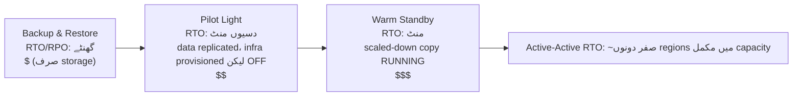

# باب 18: جب چیزیں ٹوٹتی ہیں

رات 11:17 پر روشنیاں بجھ گئیں۔

Nimbus کے دفتر میں نہیں — Leo گھر پر تھا، صوفے پر، لیپ ٹاپ آدھا بند۔ روشنیاں Oregon کے ایک data center میں بجھیں جسے اس نے کبھی نہیں دیکھا تھا، ایک ایسی عمارت میں جسے اس نے کبھی نہیں دیکھا، servers سے بھرے ایک کمرے میں جسے اس نے کبھی نہیں چھوا۔ اسے ابھی معلوم نہیں تھا۔ ایک لمحہ تھا — صرف ایک لمحہ — مکمل خاموشی کا، اس سے پہلے کہ backup generators کہیں دور چالو ہوں۔ ایسی تاریکی جس میں آپ بتا نہیں سکتے کہ آپ کی آنکھیں کھلی ہیں یا بند۔

پھر Slack notification آئی۔

---

باب 17 کے monitoring systems جگہ پر آنے کے بعد، ٹیم نے کچھ اعتماد جیسا محسوس کیا تھا۔ Alerts فائر ہو رہے تھے۔ Dashboards سبز تھے۔ Logs CloudWatch میں بہہ رہے تھے۔ انہوں نے Nimbus infrastructure کے ہر کونے میں visibility wire کرنے میں تین ہفتے گزارے تھے۔

جو کسی نے بلند آواز میں نہیں کہا تھا — جس کے خلاف monitoring تحفظ نہیں دیتی — وہ یہ تھا کہ visibility اور resilience مختلف چیزیں ہیں۔ آپ کسی چیز کو مکمل تفصیل میں ناکام ہوتے دیکھ سکتے ہیں۔ اسے دیکھنا اسے نہیں روکتا۔

وہ سبق جمعرات کی رات 11:23 پر آیا۔

---

Leo کو Slack notification ملی۔

"us-west-2 — data center cluster failure — degraded service۔"

اس نے AWS console کھولا۔ ایک Availability Zone میں EC2 انسٹینسز status checks میں ناکام دکھا رہی تھیں۔ اس کے Auto Scaling Group نے غیر صحت مند انسٹینسز محسوس کر لیے تھے اور replacements spin up کر رہا تھا — اسی zone میں۔

اس cluster میں جو ناکام ہو رہا تھا۔

نئی انسٹینسز بھی شروع نہیں ہو سکتی تھیں۔ وہ اسی hardware failure zone میں تھیں۔

"لوڈ بیلنسر دونوں AZs میں ٹریفک route کر رہا ہے،" Leo نے کسی سے نہیں کہا۔ "ہماری آدھی ٹریفک ان انسٹینسز کو جا رہی ہے جو کام نہیں کرتیں۔"

اس نے EC2 console کھولا اور کلک کرنا شروع کیا۔ Load Balancers کے تحت، Application Load Balancer دونوں target groups کو صحت مند دکھا رہا تھا — کیونکہ health check port 80 پر pass ہو رہا تھا، اور ناکام انسٹینسز بھی اس check کا جواب دے رہی تھیں۔ وہ بس حقیقی requests process نہیں کر سکتی تھیں۔

اس نے ناکام AZ کو target group سے ہٹانے کی کوشش کی۔ Console نے تبدیلی قبول کر لی۔ لیکن Auto Scaling Group، جو توازن برقرار رکھنے کے لیے ترتیب دیا گیا تھا، فوراً terminate کی گئی انسٹینسز کو replace کرنے کی کوشش کرنے لگا — اسی ناکام zone میں۔

Leo نے اسکرین کو گھورا۔ اس نے ابھی اسے بدتر بنا دیا تھا۔

اس نے ASG configuration کھولی۔ "Balance capacity across Availability Zones" setting فعال تھی۔ عام operation میں یہ اچھا ڈیزائن تھا۔ ابھی یہ اس کے خلاف فعال طور پر لڑ رہی تھی۔

اس نے ASG کو صرف صحت مند zone استعمال کرنے کے لیے تبدیل کیا۔ تبدیلی لاگو کی۔

Console نے تبدیلی کو "In Service" دکھایا۔

تین منٹ بعد، پہلی صحت مند replacement انسٹینسز up ہوئیں۔

لوڈ بیلنسر نے ٹریفک route کرنا شروع کیا۔ Error rate 52% سے 4% تک گر گئی۔ باقی 4% وہ requests تھیں جو آخری چند غیر صحت مند انسٹینسز پر land ہوئی تھیں جو ابھی connections drain کر رہی تھیں۔

11:45 PM تک — failure شروع ہونے کے بائیس منٹ بعد — ٹریفک مستحکم تھی۔

بائیس منٹ کی degraded service اس سے پہلے کہ اس نے نوٹ کیا اور ہاتھ سے ASG کو صرف صحت مند zone استعمال کرنے کے لیے shift کیا۔

"یہ اس لیے ہوا کیونکہ سب کچھ ایک AZ میں تھا،" Priya نے اگلی صبح کہا۔

"نہیں،" Leo نے کہا۔ "میرے پاس دو AZs میں انسٹینسز تھیں۔ مسئلہ یہ تھا کہ replacement انسٹینسز ناکام AZ میں spawn ہو رہی تھیں۔"

"اور database؟"

Leo رک گیا۔

"RDS primary ناکام zone میں تھا،" اس نے کہا۔ "Multi-AZ نے دراصل اپنا کام کیا — اس نے تقریباً نوے سیکنڈ میں صحت مند zone میں standby پر failover کر لیا۔ لیکن ہمارے application servers اپنے مردہ connections کھلے رکھے اور endpoint کے DNS name کو دوبارہ resolve کرنے کے بجائے cached IP address کو retry کرتے رہے۔ Database 11:25 تک صحت مند تھا۔ ہماری ایپ صاف طریقے سے دوبارہ connect نہیں ہوئی جب تک میں نے connection pools restart نہیں کیے۔"

بائیس منٹ کی degraded service اڑتیس منٹ ہو گئی تھی۔

جب Leo نے آٹھ ماہ پہلے Auto Scaling Group سیٹ اپ کیا تھا، اس نے "balance capacity across AZs" setting چیک کی تھی اور سمجھا کہ یہ کافی اچھا ہے۔ "یہ ٹھیک رہے گا،" اس نے اس وقت Maya سے کہا تھا۔ "AWS AZ والی چیزیں خودبخود سنبھالتا ہے۔" وہ صحیح تھا کہ AWS اسے سنبھالتا ہے — اور غلط تھا کہ "خودبخود" کا کیا مطلب تھا۔

"کیا ہوتا،" Maya نے اگلی صبح پوچھا، "اگر ہم نے سب کچھ صحیح طریقے سے ترتیب دیا ہوتا؟ ایک حقیقی failure میں صحیح Multi-AZ setup کیسی نظر آتی ہے؟"

Leo نے اس پر سوچا۔ وہ 11:45 PM سے اس کے بارے میں سوچ رہا تھا۔

فرضی صحیح setup میں: ASG کے پاس instance health checks ہوتے جو ALB health دیکھتے — صرف EC2 status نہیں۔ جب AZ ناکام ہوتا، ان انسٹینسز پر health check 30 سیکنڈ کے اندر ناکام ہو جاتا۔ ASG failures محسوس کرتا اور فوراً replacements لانچ کرنا شروع کر دیتا — اور جب لانچ مسلسل ایک AZ میں ناکام ہوتے ہیں، تو group ناکام zone سے لڑنے کے بجائے capacity کو باقی صحت مند zones میں shift کر دیتا ہے۔

لوڈ بیلنسر ناکام AZ targets کو اسی 30 سیکنڈ کے اندر rotation سے باہر نکال لیتا۔ ٹریفک صحت مند AZ میں مرتکز ہو جاتی۔

Database کے لیے: Multi-AZ failover خود کام کر گیا تھا — جو غائب تھا وہ client discipline تھا۔ Connection pools جو reconnect پر endpoint کے DNS name کو دوبارہ resolve کرتے ہیں (IP cache کرنے کے بجائے)، مختصر DNS cache TTLs، اور retry logic۔ ان کے ساتھ، RDS failover ایک 60–120 سیکنڈ کا جھٹکا ہے، 16 منٹ کی دم نہیں۔

کل صارف کو نظر آنے والا اثر: database failover کے دوران 60-90 سیکنڈ کی degraded latency۔ نہ کہ cascading errors کے 38 منٹ۔

"ہمارے پاس اس سے بچنے کے لیے تمام infrastructure تھی،" Leo نے کہا۔ "ہم نے بس اسے غلط طریقے سے ترتیب دیا۔"

وہ جملہ کہنا اصل incident سے زیادہ مشکل تھا۔

**Electricity Grid کی مثال**

سوچیں کہ آپ کے گھر کو بجلی کیسے ملتی ہے۔ بجلی ایک تار سے ایک generator سے نہیں آتی۔ یہ ایک grid سے آتی ہے — generators، substations، اور transmission lines کا ایک نیٹ ورک جو ایک دوسرے کو backup دیتے ہیں۔ اگر ایک substation میں آگ لگ جائے، باقی اس کے گرد بجلی re-route کر دیتے ہیں۔ آپ نوٹ نہیں کرتے۔ روشنیاں on رہتی ہیں۔

AWS Availability Zones اسی طرح کام کرتے ہیں۔ ایک بڑے data center کی بجائے جس پر سب کچھ depend کرتا ہے، AWS آپ کے resources کو متعدد جسمانی طور پر الگ الگ facilities میں پھیلاتا ہے۔ اگر ایک facility بجلی کھو دے یا hardware failure ہو، باقی چلتے رہتے ہیں۔ ٹریفک خودبخود re-route ہو جاتی ہے۔ آپ کی ایپلیکیشن up رہتی ہے — کیونکہ کبھی کوئی واحد تار نہیں تھی جسے کاٹا جا سکے۔

یہ **Multi-AZ architecture** ہے: اپنے resources کو جسمانی طور پر الگ facilities میں پھیلانا تاکہ ایک failure کبھی سب کچھ گرا نہ دے۔

Multi-Region اگلا level ہے: تصور کریں بالکل مختلف شہر میں backup generators ہوں۔ اگر پورا مقامی power grid بند ہو جائے، remote شہر ذمہ اٹھا لیتا ہے۔ سیٹ اپ کرنا زیادہ پیچیدہ، لیکن catastrophic failures کے لیے زیادہ resilient۔

آپ شاید سوچ رہے ہوں: اگر Multi-AZ کا مطلب صرف resources کو دو data centers میں پھیلانا ہے، تو AWS اسے ہر چیز کے لیے default کیوں نہیں بناتا؟ جواب لاگت ہے۔ Multi-AZ infrastructure کو تقریباً دوگنا کر دیتا ہے — اور ایک development environment یا کم ٹریفک والے internal tool کے لیے، وہ اضافی لاگت جائز نہیں۔ Production workloads کے لیے، البتہ، سوال پلٹ جاتا ہے: کیا آپ downtime برداشت کر سکتے ہیں اگر آپ کے پاس یہ نہ ہو؟

**ناکامی کی لغت**

Resilience کے لیے ڈیزائن کرنے سے پہلے، آپ کو ان چیزوں کے لیے الفاظ چاہئیں جن کے خلاف آپ ڈیزائن کر رہے ہیں۔

"ہم یہ کیسے ناپیں کہ ہم کافی resilient ہیں یا نہیں؟" Priya نے پوچھا۔

"دو نمبر،" Leo نے کہا۔ "ہم کتنی دیر بند رہ سکتے ہیں، اور ہم کتنا data کھو سکتے ہیں۔"

**Availability**: وہ فیصد وقت جب نظام چل رہا ہو۔ "Four nines" (99.99%) کا مطلب فی سال 52 منٹ سے کم downtime ہے۔ "Five nines" (99.999%) کا مطلب تقریباً 5 منٹ فی سال ہے۔

**RTO (Recovery Time Objective)**: نظام کتنی دیر بند رہ سکتا ہے اس سے پہلے کہ یہ ایک business مسئلہ بن جائے؟ اگر آپ کا RTO 4 گھنٹے ہے، تو آپ کے پاس SLAs violate ہونے سے پہلے service restore کرنے کے لیے 4 گھنٹے ہیں۔

**RPO (Recovery Point Objective)**: آپ کتنا data کھونا برداشت کر سکتے ہیں؟ اگر آپ کا RPO 1 گھنٹہ ہے، تو آپ catastrophic failure میں ایک گھنٹے تک کا data کھونا برداشت کر سکتے ہیں۔ failure سے پہلے آخری گھنٹے میں لکھی گئی ہر چیز چلی جاتی ہے۔

**Fault tolerance**: کوئی جزء ناکام ہونے پر بھی (کچھ سطح پر) کام جاری رکھنے کی صلاحیت۔

**Disaster recovery (DR)**: ایک catastrophic failure سے بحال ہونے کا عمل — data center آگ، region-wide outage، حادثاتی mass deletion۔

یہ پانچ تصورات اس باب کا ہر architectural فیصلہ چلاتے ہیں۔

**RTO اور RPO Business فیصلے ہیں، Technical نہیں**

نمبروں سے کم اہمیت اس کی ہے کہ انہیں کون سیٹ کرتا ہے۔ ایک engineer RTO کا اندازہ لگا سکتا ہے۔ ایک business stakeholder جانتا ہے کہ 30 منٹ کا outage دراصل کتنا خرچ کرتا ہے۔

ایک ہی technology stack والی دو کمپنیوں پر غور کریں:

ایک fintech کمپنی جو brokerage trades process کرتی ہے: RTO 4 منٹ، RPO صفر۔ market hours کے دوران چار منٹ کے لیے بند تجارتی نظام ہزاروں transactions چھوڑ سکتا ہے۔ ہر چھوٹی ہوئی transaction کی براہ راست ڈالر قدر ہوتی ہے۔ صفر data loss فلسفیانہ نہیں ہے — ایک واحد confirmed trade کھونے کا مطلب compliance مسائل اور customer lawsuits ہے۔ یہ حاصل کرنے کے لیے architecture لاگت: synchronous replication کے ساتھ active-active Multi-AZ، چھ ہندسوں کا سالانہ infrastructure بجٹ۔

ایک restaurant ordering platform: RTO 30 منٹ، RPO 5 منٹ۔ dinner rush کے دوران 30 منٹ کا outage واقعی تکلیف دہ ہے اور حقیقی پیسہ خرچ کرتا ہے۔ لیکن failure سے پہلے orders کے آخری 5 منٹ کھونے کا مطلب ہے کہ مٹھی بھر صارفین کو دوبارہ order کرنا پڑے گا — پریشان کن، تباہ کن نہیں۔ یہ حاصل کرنے کے لیے architecture لاگت: warm standby Multi-AZ، fintech بجٹ کا ایک حصہ۔

"رکو — لیکن ایک restaurant platform 5 منٹ کا data loss *کیوں* قبول کرے گی؟" Maya نے پوچھا جب Leo نے یہ سمجھایا۔ "کیا یہ پھر بھی customer orders کھونا نہیں ہے؟"

"سوال یہ ہے کہ کیا اس data loss کو روکنا اس سے زیادہ خرچ کرتا ہے جتنی اس کی قیمت ہے،" Leo نے کہا۔ "RPO کو 5 منٹ سے 0 تک کم کرنے کے لیے regions میں synchronous replication درکار ہوگی۔ یہ ایک نمایاں لاگت اور engineering سرمایہ کاری ہے۔ ہمارے scale پر ایک restaurant ایپ کے لیے، 5 منٹ کا RPO صحیح trade-off ہے۔"

سبق: RTO اور RPO technical minimums نہیں ہیں۔ یہ نمبروں کے طور پر بیان کیے گئے business trade-offs ہیں۔ انہیں سیٹ کرنے کے لیے engineering ٹیم (جو جانتی ہے کہ کیا قابل حصول ہے) اور business stakeholders (جو جانتے ہیں کہ کیا قابل قبول ہے) دونوں کی ضرورت ہے۔

**Multi-AZ: Availability Zone Failures سے بچنا**

ایک Availability Zone (AZ) ایک Region کے اندر ایک جسمانی طور پر الگ data center ہے۔ AZs آزاد ہونے کے لیے ڈیزائن کیے گئے ہیں: الگ بجلی کی supply، الگ cooling، الگ network infrastructure۔ لیکن وہ اتنے قریب ہیں کہ ان کے درمیان network latency 1-2 ملی سیکنڈ ہے۔

**Multi-AZ deployments** آپ کے resources کو ایک Region کے اندر دو یا زیادہ AZs میں پھیلاتی ہیں۔ اگر ایک AZ ناکام ہو:

- لوڈ بیلنسر ناکام AZ میں غیر صحت مند انسٹینسز کو ٹریفک route کرنا بند کرتا ہے
- Auto Scaling Group انسٹینسز replace کرتا ہے — لیکن *صحت مند* AZ میں
- RDS صحت مند AZ میں standby پر failover کرتا ہے

Leo کی غلطی: اس کا Auto Scaling Group replacement انسٹینسز کو صحت مند AZs تک محدود کرنے کے لیے ترتیب نہیں دیا گیا تھا۔ یہ AZs کے درمیان توازن برقرار رکھنے کے لیے ترتیب دیا گیا تھا۔ جب zone ناکام ہوا، ASG نے instance count کو balance کرنے کی کوشش میں وہاں replacements spin up کرنے کی کوشش کی — ناکام zone میں۔

Fix: ASG کو صرف صحت مند AZs میں لانچ کرنے کے لیے ترتیب دیں، کم از کم دو AZs ہمیشہ active کے ساتھ۔

گہرا سبق: اپنے failure scenarios کو پروڈکشن میں ہونے سے پہلے test کریں۔

اگر آپ Multi-AZ منتخب کرتے ہیں، آپ کو خودکار failover اور near-zero RPO ملتا ہے — لیکن آپ ایسے infrastructure کے لیے ادائیگی کر رہے ہیں جو عام operation کے دوران کوئی ٹریفک serve نہیں کرتا۔ وہ standby RDS انسٹینس ہمیشہ چل رہا ہوتا ہے، ہمیشہ replicate کر رہا ہوتا ہے، اور کبھی کسی query کا جواب نہیں دیتا جب تک primary ناکام نہ ہو۔ یہی trade-off ہے: reliability پیسہ خرچ کرتی ہے چاہے کچھ ٹوٹا نہ ہو۔

**Chaos Engineering: پہلا Run کیسا تھا**

Nimbus میں پہلا chaos engineering run اتنا صاف ستھرا نہیں تھا جتنا documentation نے بتایا تھا۔

Leo نے runbook کا step 2 چلایا: ایک RDS Multi-AZ failover force کرنا۔ اس نے AWS CLI استعمال کی:

```
aws rds reboot-db-instance \
    --db-instance-identifier nimbus-prod \
    --force-failover
```

کمانڈ فوراً واپس آ گئی۔ Leo نے timer شروع کیا۔

T+0s: Failover شروع ہوا۔ RDS console primary status کو "rebooting" دکھاتا ہے۔

T+18s: Application logs database connection errors دکھانا شروع کرتے ہیں۔ Connection pool پرانے primary کو try کر رہا ہے، جو اب primary نہیں رہا۔

T+34s: RDS console status کو "backing-up" دکھاتا ہے۔ نیا primary promote کیا جا رہا ہے۔ DNS CNAME (database endpoint) update کیا جا رہا ہے۔

T+52s: Application logs دوبارہ کامیاب connections دکھانا شروع کرتے ہیں۔ Connection pool نے پرانے primary پر retries ختم کر دیے ہیں اور CNAME سے دوبارہ connect ہو گیا، جو اب نئے primary کی طرف اشارہ کرتا ہے۔

T+4:17: تمام connections دوبارہ قائم۔ Error rate واپس صفر پر۔

کل: 4 منٹ اور 17 سیکنڈ۔

"یہ database عدم دستیابی کے 257 سیکنڈ ہیں،" Tom نے کہا۔ "ہمارے restaurant partners کے tablets 4 منٹ کے لیے ایک گھومتا indicator دکھاتے ہیں۔"

"ہمارا SLA کہتا ہے 5 منٹ،" Leo نے کہا۔

"تو ہم پاس ہو گئے،" Priya نے کہا۔ "بمشکل۔"

"دو مشاہدے،" Tom نے کہا۔ "پہلا: ہم پاس ہوئے کیونکہ ہمارا RTO commitment فراخدلانہ تھا، اس لیے نہیں کہ ہماری architecture خاص طور پر تیز ہے۔ دوسرا: connection pool کا retry behavior وہ ہے جس نے ہمیں اضافی 34 سیکنڈ دلائے۔ اگر ایپلیکیشن نے 10 سیکنڈ کے بعد ہار مان لی ہوتی، تو ہم ناکام ہو جاتے۔"

Leo نے مشاہدہ شدہ timings document کرنے کے لیے runbook update کی۔ اگلی تیماہی کا ہدف: connection pool parameters اور ایپلیکیشن کی health check logic tune کر کے failover detection time کو 52 سیکنڈ سے 30 سے کم کرنا۔

"Chaos engineering ایک بار کا test نہیں ہے،" Priya نے کہا۔ "یہ ایک feedback loop ہے۔ آپ test کرتے ہیں، آپ اصل نمبر پاتے ہیں، آپ بہتر کرتے ہیں، آپ دوبارہ test کرتے ہیں۔"

تیسری بار جب انہوں نے failover test چلایا، چھ ماہ بعد، recovery time 1 منٹ اور 44 سیکنڈ تھا۔ اس لیے نہیں کہ RDS تیز ہو گیا — اس لیے کہ انہوں نے ایپلیکیشن tune کر لی تھی۔

**Failures کی Simulation: Chaos Engineering**

"ہم کیسے جانیں کہ ہماری Multi-AZ setup اصل میں کام کرتی ہے؟" Maya نے پوچھا۔

"ہم چیزوں کو جان بوجھ کر توڑتے ہیں،" Leo نے کہا۔

"رکو — لیکن ہم یہ اس طرح *کیوں* کریں؟" Maya نے کہا۔ "کیوں نہ بس بھروسہ کریں کہ AWS documentation کہتی ہے یہ کام کرتا ہے؟"

"کیونکہ documentation بیان کرتی ہے کہ service کیسے کام کرتی ہے۔ یہ بیان نہیں کرتی کہ *آپ کی configuration* کیسے کام کرتی ہے۔ یہ مختلف چیزیں ہیں۔"

Priya آگے جھکی۔ "کیا ہم نے سوچا ہے کہ جب لوڈ بیلنسر health check اور ASG health check اختلاف کریں تو کیا ہوتا ہے؟ لوڈ بیلنسر شاید ایک انسٹینس کو rotation سے ہٹا دے، لیکن ASG سمجھتا ہے کہ انسٹینس صحت مند ہے اور اسے replace نہیں کرتا۔ ہمارے پاس capacity ہوگی جو لوڈ بیلنسر کے لیے غائب ہے۔"

"یہ بالکل وہی قسم کی چیز ہے جو chaos engineering پائے گی،" Leo نے کہا۔

یہ لاپروا لگتا ہے۔ یہ اصل میں سب سے ذمہ دارانہ کام ہے جو کوئی ٹیم کر سکتی ہے۔

**RTO Commitments کی Testing**

RTO کے بارے میں ناخوشگوار سچائی یہ ہے: زیادہ تر ٹیمیں ایک RTO سیٹ کرتی ہیں، پھر کبھی test نہیں کرتیں کہ وہ اسے دراصل پورا کر سکتی ہیں یا نہیں۔

30 منٹ کا RTO ضمانت نہیں ہے۔ یہ ایک ہدف ہے۔ یہ جاننے کا واحد طریقہ کہ آپ اسے پورا کریں گے یا نہیں failure کی simulation کرنا اور recovery کا وقت ناپنا ہے۔

11:23 PM incident کے بعد، Nimbus ٹیم نے ہر failure mode کو ہر تیماہی test کرنے کا عہد کیا۔ صرف ہاتھ سے نہیں — تحریری acceptance criteria کے ساتھ۔ AZ failure سے recovery کو 10 منٹ کے اندر مکمل ہونا تھا۔ RDS failover سے recovery کو 5 منٹ کے اندر مکمل ہونا تھا۔ Backup سے database restore (backup-and-restore DR test) کو 2 گھنٹے کے اندر مکمل ہونا تھا۔

یہ نمبر restaurant partners کے ساتھ بات چیت سے آئے، جنہوں نے کہا کہ 10 منٹ سے کم کا dinner-rush outage "تکلیف دہ لیکن قابل قبول" تھا۔ 30 منٹ سے زیادہ ایک contract کی بات تھی۔

"SLA مذاکرات RTO سیٹ کرنے سے پہلے ہونے چاہئیں،" Maya نے کہا۔ "بعد میں نہیں۔"

وہ غلط نہیں تھی۔ انہوں نے اسے الٹا کیا تھا۔ انہوں نے RTO اندرونی طور پر سیٹ کیا اور پھر محسوس کیا کہ انہیں اسے اس کے خلاف چیک کرنے کی ضرورت ہے جو business دراصل چاہتی تھی۔

RTO اور RPO کو صحیح ترتیب میں سیٹ کرنا: پہلے business requirement، پھر اسے پورا کرنے کے لیے architecture، تیسرا verify کرنے کے لیے test۔ زیادہ تر ٹیمیں architecture سے شروع کرتی ہیں اور پیچھے کی طرف کام کرتی ہیں۔ نمبر اس کے لیے بھگتتے ہیں۔

**Chaos engineering** اپنے نظام میں جان بوجھ کر failures inject کرنے کی مشق ہے یہ verify کرنے کے لیے کہ یہ انہیں صحیح طریقے سے سنبھالتا ہے۔ آپ جان بوجھ کر ایک EC2 انسٹینس terminate کرتے ہیں۔ آپ ہاتھ سے RDS انسٹینس کو failover کرتے ہیں۔ آپ لوڈ بیلنسر سے ایک subnet block کرتے ہیں۔

اگر نظام آپ کے RTO کے اندر خودبخود بحال ہو جائے، آپ کا ڈیزائن کام کرتا ہے۔

اگر نہیں، تو آپ نے یہ ایک controlled setting میں سیکھا — رات 2 بجے production incident کے دوران نہیں۔

Nimbus کے لیے: Leo نے ہر failure scenario test کرنے کے لیے ایک runbook (ایک documented procedure) لکھا۔ ہر تیماہی، وہ جان بوجھ کر ایک component fail کرتے اور recovery time ناپتے۔ اگر recovery RTO سے زیادہ وقت لیتی تو، وہ ڈیزائن fix کرتے۔

**Multi-Region: Regional Failures سے بچنا**

زیادہ تر AWS failures Availability Zones کو متاثر کرتے ہیں، پورے Regions کو نہیں۔ Regional failures نادر ہیں — لیکن ہوتے ہیں۔

ایک regional failure میں (یا عالمی ایپلیکیشنز کے لیے جنہیں ہر جگہ بہت کم latency کی ضرورت ہے)، **Multi-Region** جواب ہے: اپنی ایپلیکیشن دو یا زیادہ AWS Regions میں تعینات کریں۔

Multi-Region بنیادی پیچیدگی متعارف کراتا ہے:

**Data replication**: آپ کے databases کو regions میں sync ہونا ضروری ہے۔ us-east-1 میں لکھا گیا کوئی بھی data آخرکار eu-west-1 تک پہنچنا ضروری ہے۔ "آخرکار" مسئلہ ہے — time lag کے دوران، regions کی دنیا کا قدرے مختلف view ہوتا ہے۔

**Active-passive بمقابلہ active-active**:

- **Active-passive**: ایک region تمام ٹریفک پیش کرتا ہے۔ دوسرا ایک warm standby ہے۔ ناکامی پر، DNS ٹریفک کو standby کی طرف switch کرتا ہے۔ آسان، لیکن standby idle اور مہنگا ہے۔
- **Active-active**: دونوں regions بیک وقت ٹریفک پیش کرتے ہیں۔ بنانا زیادہ پیچیدہ (بیک وقت writes کے لیے conflict resolution ضروری ہے)، لیکن عالمی سطح پر کم latency اور کوئی idle resources نہیں۔

Active-active اس وقت تک پرکشش لگتا ہے جب تک آپ writes کے بارے میں احتیاط سے نہ سوچیں۔ اگر کوئی صارف us-east-1 میں ایک order دیتا ہے اور بیک وقت restaurant eu-west-1 میں اپنا menu update کرتا ہے، اور regions کے درمیان network partition ہے، تو کون سی write جیتتی ہے؟ یہ عملی طور پر CAP theorem ہے: ایک distributed system میں، network partition کے دوران، آپ کو consistency (دونوں regions ایک ہی data پر متفق ہوں) اور availability (دونوں regions requests قبول کرتے رہیں چاہے وہ اختلاف رکھیں) کے درمیان انتخاب کرنا ہوگا۔ Active-active اس انتخاب کو ختم نہیں کرتا۔ یہ آپ سے مطالبہ کرتا ہے کہ آپ اسے واضح طور پر، اپنے data model میں کریں۔

Nimbus کے لیے: active-passive۔ وہ اپنے menu اور order data میں بیک وقت write conflicts کے بارے میں سوچنا نہیں چاہتے تھے۔ ایک واحد authoritative primary region اس مرحلے پر آسان اور محفوظ تر تھا۔

**Failover time**: DNS تبدیلیوں کو propagate ہونے میں وقت لگتا ہے (TTL کے مطابق)۔ Propagation window کے دوران، کچھ صارفین پھر بھی ناکام region کو hit کرتے ہیں۔ بہت کم RTO کے لیے ڈیزائن کرنے کے لیے standby کو pre-warm کرنا اور planned switches سے پہلے TTL کم کرنا ضروری ہے۔

**Route 53 DNS Failover: DR کی Network Layer**

DR strategies کے مکمل spectrum تک پہنچنے سے پہلے، یہ سمجھنا قابل قدر ہے کہ DNS failover میں کیسے fit ہوتا ہے — کیونکہ یہ اکثر وہ چیز ہے جو دراصل regions کے درمیان ٹریفک switch کرتی ہے۔

**Amazon Route 53** health-check-based routing سپورٹ کرتا ہے۔ آپ ترتیب دیتے ہیں:

1. ایک health check جو آپ کے primary endpoint کی نگرانی کرتا ہے (عام طور پر ایک HTTP endpoint جو صحت مند ہونے پر 200 واپس کرتا ہے)
2. ایک primary DNS record جو آپ کے primary region کی طرف اشارہ کرتا ہے
3. ایک secondary (failover) DNS record جو آپ کے DR region کی طرف اشارہ کرتا ہے

جب Route 53 محسوس کرتا ہے کہ primary health check ناکام ہو رہا ہے، یہ خودبخود DNS responses کو secondary record پر switch کرتا ہے۔ آپ کا domain resolve کرنے والے صارفین اب DR region کا IP حاصل کرتے ہیں۔

"اور اگر failover window کے دوران کوئی toڑنے کی کوشش کرے تو؟" Priya نے پوچھا۔ "ہمارے domain کے لیے SSL certificate — کیا یہ دونوں regions میں کام کرتا ہے، یا HTTPS ٹوٹ جاتا ہے؟"

"Certificate کو دونوں regions میں provision کرنا ضروری ہے،" Leo نے تصدیق کی۔ "اگر آپ ACM (AWS Certificate Manager) استعمال کر رہے ہیں، تو اس کا مطلب ہر region میں آزادانہ طور پر certificate request کرنا ہے۔"

Route 53 failover کی mechanics:

- Health checks دنیا بھر میں متعدد AWS locations سے ہر 30 سیکنڈ میں چلتے ہیں
- 3 مسلسل failures (90 سیکنڈ) کے بعد، Route 53 endpoint کو غیر صحت مند نشان زد کرتا ہے
- DNS responses فوراً failover record پر switch ہو جاتے ہیں
- لیکن: DNS TTL پھر بھی لاگو ہوتا ہے۔ اگر آپ کا TTL 300 سیکنڈ ہے، تو وہ clients جنہوں نے پہلے ہی primary IP cache کر لیا ہے 5 منٹ تک ناکام region کو hit کرتے رہتے ہیں

یہی وجہ ہے کہ TTL کم کرنا pre-disaster preparation کا حصہ ہے۔ آپ incident کے دوران TTL تبدیل نہیں کر سکتے (تبدیلی وقت پر propagate نہیں ہوگی)۔ TTL تبدیلی اس کی ضرورت سے دن یا ہفتے پہلے کی جانی چاہیے، تاکہ failure ہونے پر resolver caches پہلے سے مختصر TTL استعمال کر رہے ہوں۔

"تو DNS TTL کم کرنا recovery action نہیں ہے،" Leo نے کہا۔ "یہ ایک pre-positioning action ہے۔"

"کیا ہم نے کیا ہے؟" Maya نے پوچھا۔

انہوں نے نہیں کیا تھا۔

اس بات چیت کے بعد، Leo نے eatnimbus.com کے لیے TTL کو 300 سیکنڈ سے 60 سیکنڈ تک کم کیا۔ تبدیلی نے کچھ خرچ نہیں کیا اور ان کے worst-case failover time کو ممکنہ طور پر 8 منٹ سے بمشکل 3 سے کم تک بہتر کیا۔

**Disaster Recovery Strategies: ایک Spectrum**

چار عام DR strategies ہیں، سب سے سستی (اور بحالی میں سست) سے سب سے مہنگی (اور بحالی میں تیز ترین) تک ترتیب دی گئی:



**Backup and Restore** (گھنٹے RPO/RTO):

- سب کچھ ایک مختلف region میں S3 میں backup کریں
- Disaster پر: infrastructure scratch سے provision کریں، backup سے restore کریں
- لاگت: بہت کم (آپ صرف storage کے لیے ادائیگی کر رہے ہیں)
- Recovery time: گھنٹے

**Pilot Light** (منٹوں سے 1 گھنٹہ RPO/RTO):

- data کو مسلسل replicate کریں اور core infrastructure کو DR region میں *provisioned لیکن بند* رکھیں — templates، AMIs، رکی ہوئی یا zero-sized resources۔ کچھ بھی ٹریفک serve نہیں کرتا؛ صرف data replication "روشن" ہے (یہی pilot light ہے)
- Core data replicated ہے (DR region میں RDS read replica)
- Disaster پر: DR region کا compute start/scale up کریں، read replica کو primary میں promote کریں، DNS switch کریں
- (نیچے Warm Standby سے فرق: وہاں، ایپلیکیشن کی ایک scaled-down copy دراصل *چل رہی* ہوتی ہے)
- لاگت: moderate (آپ data replication اور provisioned-but-off resources کی ادائیگی کر رہے ہیں، running compute کی نہیں)
- Recovery time: دسیوں منٹ

**Warm Standby** (سیکنڈوں سے منٹ RPO/RTO):

- DR region میں مکمل ایپلیکیشن کا ایک scaled-down version چلائیں
- مکمل طور پر operational لیکن کم capacity پر
- Disaster پر: scale up، DNS switch کریں
- لاگت: زیادہ (ہمیشہ reduced scale پر مکمل stack چلانا)
- Recovery time: منٹ

**Active-Active / Multi-Site** (near-zero RPO/RTO):

- دو یا زیادہ regions میں بیک وقت ٹریفک پیش کرنے والی مکمل capacity
- کوئی recovery ضروری نہیں — اگر ایک region ناکام ہو، ٹریفک خودبخود دوسرے کی طرف route ہو جاتی ہے
- لاگت: سب سے زیادہ (مکمل scale پر دو مکمل deployments)
- Recovery time: سیکنڈ (صرف DNS propagation)

ایک service اس spectrum کے درمیانی حصے کو خودکار کرتی ہے: **AWS Elastic Disaster Recovery (DRS)** آپ کے servers کو — on-premises یا EC2 — مسلسل block بہ block ایک کم لاگت staging area میں replicate کرتی ہے، اور disaster آنے پر چند منٹوں میں مکمل recovery instances لانچ کر سکتی ہے۔ مؤثر طور پر، یہ ایک *managed pilot light* ہے: backup-and-restore قیمتوں کے قریب near-warm-standby recovery times۔ امتحانی اشارہ: "server-based workloads کے لیے ایک managed DR service کے ساتھ downtime اور data loss کم سے کم کریں" → Elastic Disaster Recovery۔

Nimbus کے اس مرحلے پر: warm standby۔ وہ active-active afford نہیں کر سکتے تھے، لیکن backup and restore ان کی business requirements کے لیے بہت سست تھا۔

**Amazon RDS: Multi-AZ بمقابلہ Read Replicas بمقابلہ Multi-Region**

یہ تین الگ ہیں اور عام طور پر confused ہوتے ہیں:

| خصوصیت        | Multi-AZ                      | Read Replica     | Multi-Region Read Replica |
|----------------|-------------------------------|------------------|---------------------------|
| مقصد           | اعلیٰ دستیابی (failover)       | Read scaling     | Read scaling + DR         |
| Data sync      | Synchronous                   | Asynchronous     | Asynchronous              |
| Failover       | خودکار                         | ہاتھ سے promotion | ہاتھ سے promotion          |
| پڑھنے کے قابل؟ | نہیں (standby passive ہے)     | ہاں              | ہاں                        |
| Cross-region?  | نہیں (ایک ہی region)          | ہاں (اختیاری)    | ہاں                        |
| استعمال کریں   | HA، RPO~0                     | Read load        | Disaster recovery          |

اہم insight: Multi-AZ standby **synchronous** ہے — primary میں ہر write standby پر تسلیم کیے جانے سے پہلے confirm ہوتا ہے۔ اس کا مطلب ہے اگر primary ناکام ہو، کوئی data ضائع نہیں ہوتا۔ RPO = 0۔

Read replicas **asynchronous** ہیں — replication lag ہوتا ہے۔ اگر primary ناکام ہو اور آپ read replica promote کریں، تو آپ حالیہ writes کے سیکنڈ یا منٹ کھو سکتے ہیں۔ RPO > 0۔

**Aurora Global Database: Production کے لیے Multi-Region**

ان ٹیموں کے لیے جنہیں حقیقی multi-region resilience کی ضرورت ہے، **Aurora Global Database** ریاضی بدل دیتا ہے۔ کسی دوسرے region میں ایک معیاری RDS read replica asynchronous replication استعمال کرتا ہے جس کا lag عام طور پر سیکنڈوں میں ناپا جاتا ہے — جس کا مطلب ہے کہ ایک regional failure ان سیکنڈوں کی writes کھو دے گا۔ Aurora Global Database ایک مخصوص replication infrastructure استعمال کرتا ہے جو primary region اور secondary regions کے درمیان 1 سیکنڈ سے کم replication lag حاصل کرتا ہے۔

جب ٹیم نے post-incident review میں اس پر بات کی، Leo نے موازنہ کھولا:

- معیاری RDS cross-region read replica: replication lag عام طور پر 1-10 سیکنڈ، بھاری load کے تحت منٹوں تک۔ Standalone database میں promotion منٹ لیتا ہے اور اس میں ہاتھ سے steps شامل ہوتے ہیں۔
- Aurora Global Database secondary: replication lag عام طور پر 1 سیکنڈ سے کم۔ Secondary سے primary میں promotion 1 منٹ سے کم لیتا ہے۔

"اس کا مطلب ہے کہ اگر us-west-2 مکمل طور پر بند ہو جائے،" Leo نے سمجھایا، "ہمارے پاس 1 سیکنڈ سے کم کا ممکنہ data loss ہے اور ہم ایک منٹ کے اندر us-east-1 سے ٹریفک serve کر سکتے ہیں۔"

"یہ فی مہینہ کتنا خرچ کرتا ہے؟" Tom نے فوراً پوچھا۔

معیاری Multi-AZ سے زیادہ۔ Aurora Global Database regions میں replication کے لیے ایک per-write I/O charge شامل کرتا ہے۔ Nimbus کے موجودہ volume کے لیے، یہ موجودہ Aurora لاگتوں کے اوپر $40-60/مہینہ شامل کرے گا۔

"یہی trade-off ہے،" Leo نے کہا۔ "رفتار کے لیے ادائیگی کریں۔ یا ایک معیاری cross-region read replica کی سست promotion اور قدرے زیادہ RPO قبول کریں۔"

ابھی کے لیے، Nimbus warm standby کے ساتھ رہا۔ Aurora Global Database اگلے funding round کے لیے architecture wish list پر چلا گیا۔

"وہی failover window، ایک layer نیچے،" Priya نے کہا۔ "ہم نے certificates cover کر لیے۔ اب credentials — وہ ایک انسٹینس پر rotate ہو رہے ہیں۔ کیا standby sync میں ہے؟"

Leo نے documentation کھولی۔ یہ ایک اچھا سوال تھا۔ RDS Multi-AZ data replicate کرتا ہے، secrets configuration نہیں — Secrets Manager rotation کو failover runbook کے حصے کے طور پر test کرنا تھا۔

## خوبیاں اور حدود

**Multi-AZ**:

- Production workloads کے لیے ضروری — single-AZ ناکامی کا واحد نقطہ ہے
- AWS سروسز کے ذریعے اچھی طرح سپورٹ شدہ (RDS، ElastiCache، EKS، ALB سب Multi-AZ سپورٹ کرتے ہیں)
- یہ جو تحفظ فراہم کرتا ہے اس کے مقابلے میں نسبتاً کم لاگت overhead
- AZ failures AWS failure کی سب سے عام قسم ہیں — Multi-AZ سب سے زیادہ ممکنہ scenarios کو cover کرتا ہے

**Multi-Region**:

- درست نافذ کرنا پیچیدہ، خاص طور پر databases کے لیے
- Data residency/sovereignty requirements دراصل اس کا مطالبہ کر سکتی ہیں (EU user data EU میں رہنی چاہیے)
- عالمی صارفین کے لیے latency فوائد routing سے آتے ہیں، خود multi-region سے نہیں (static content کے لیے CloudFront استعمال کریں)
- زیادہ تر organizations کو active-active کی ضرورت نہیں؛ زیادہ تر warm standby میں under-invest کرتی ہیں
- Multi-Region warm standby کی لاگت معمولی نہیں، لیکن اس کے بغیر ایک regional failure کی لاگت بہت زیادہ ہو سکتی ہے

**Multi-AZ کب چھوڑیں** (نادر صورتیں):

- Development اور staging environments جہاں downtime قابل قبول ہو
- واقعی غیر اہم internal tools جن میں کوئی SLA requirements نہ ہوں
- Batch workloads جنہیں failure پر بس دوبارہ چلایا جا سکتا ہو

Multi-AZ چھوڑنے کا دباؤ تقریباً ہمیشہ لاگت کے بارے میں ہوتا ہے۔ اس دلیل کو قبول کرنے سے پہلے، ممکنہ failure modes کی لاگت کا حساب لگائیں: customer churn، SLA penalties، recover کرنے کے لیے engineering وقت۔ زیادہ تر production environments میں، Multi-AZ پہلی بار خود کی ادائیگی کر دیتا ہے جب یہ آپ کو 3 بجے رات کے page سے بچاتا ہے۔

## خلاصہ

باب 17 کے monitoring کام نے failures کو نظر آنے والا بنایا۔ یہ باب infrastructure کو ان سے بچانے کے بارے میں ہے۔ دونوں اہم ہیں؛ کوئی بھی دوسرے کے بغیر کافی نہیں۔

اس جمعرات کی رات Nimbus incident نے 38 منٹ کی degraded service خرچ کی۔ تین configuration غلطیاں مل گئیں: ASG نے ناکام AZ کو replacement launches سے خارج نہیں کیا، RDS standby اتفاق سے ناکام zone میں تھا، اور کسی نے production میں اس پر انحصار کرنے سے پہلے failover process کو test نہیں کیا تھا۔

تینوں ایک دوپہر میں قابل اصلاح تھیں۔ Incident نے fixes کو اس طرح فوری بنا دیا جس طرح "best practice documentation" نے کبھی نہیں کیا۔

یہی chaos engineering کا ایماندارانہ معاملہ ہے: یہ نہیں کہ یہ سخت engineering practice ہے (اگرچہ یہ ہے)، بلکہ یہ کہ یہ ان configuration غلطیوں کو سامنے لاتا ہے جو اس رات تک نظریاتی لگتی ہیں جب ایک Oregon data center میں hardware failure ہوتا ہے۔

- **RTO** (Recovery Time Objective): آپ کتنی دیر بند رہ سکتے ہیں۔ **RPO** (Recovery Point Objective): آپ کتنا data کھو سکتے ہیں۔
- **Multi-AZ** ایک Region کے اندر Availability Zones میں resources پھیلاتا ہے۔ AZ failures سے بچاتا ہے۔
- **Multi-Region** متعدد AWS Regions میں تعینات کرتا ہے۔ Regional failures سے بچاتا ہے اور عالمی صارفین کو کم latency کے ساتھ serve کرتا ہے۔
- DR strategies (سب سے سستی سے سب سے مہنگی): Backup & Restore → Pilot Light → Warm Standby → Active-Active۔
- RDS Multi-AZ standby: synchronous، خودکار failover، region کے اندر RPO = 0۔ Read replicas: asynchronous، ہاتھ سے promotion، RPO > 0۔
- اپنی failures کو جان بوجھ کر test کریں (chaos engineering) اس سے پہلے کہ وہ production میں ہوں۔

## امتحانی نکات

*SAA-C03 ڈومین: Resilient Architectures ڈیزائن کریں (ڈومین 2، ٹاسک 2.2)*

- **RTO بمقابلہ RPO**: امتحان آپ کو ضروریات دینے کی توقع کریں ("organization زیادہ سے زیادہ 1 گھنٹے downtime اور کوئی data loss برداشت نہیں کر سکتی") اور صحیح DR strategy چننے کو کہے گا۔ Map کریں: کوئی data loss = synchronous replication = Multi-AZ یا active-active۔ 1 گھنٹے downtime = backup-and-restore بہت سست ہے؛ warm standby کام کر سکتا ہے۔
- **Multi-AZ RDS بمقابلہ Read Replicas**: امتحان HA (Multi-AZ) بمقابلہ read scaling (read replicas) پوچھے گا۔ Multi-AZ standby پڑھنے کے قابل نہیں۔ Read replicas DR کے لیے primary میں promote کی جا سکتی ہیں (ہاتھ سے)۔
- **Pilot Light بمقابلہ Warm Standby**: Pilot Light میں minimal infrastructure چل رہا ہوتا ہے (صرف data replication)۔ Warm Standby میں ایک scaled-down لیکن functional ایپلیکیشن چل رہی ہوتی ہے۔ فرق یہ ہے کہ آپ کتنی جلدی scale up کر سکتے ہیں۔
- **Aurora Global Database**: multi-region active-passive کے لیے Aurora-specific خصوصیت۔ Primary region writes پیش کرتا ہے؛ secondary regions reads کو <1 second replication lag کے ساتھ پیش کرتے ہیں۔ Failover پر، secondary <1 منٹ میں promote ہو سکتا ہے۔ امتحانی اشارہ: "Aurora، multi-region، RTO < 1 منٹ۔"
- **AWS Backup**: EBS، RDS، DynamoDB، EFS، Storage Gateway کے لیے Centralized backup سروس۔ امتحان اسے backup-and-restore scenarios کے لیے استعمال کرتا ہے۔
- **Elastic Disaster Recovery (DRS)**: "servers کے لیے کم سے کم downtime/data loss کے ساتھ managed DR (on-premises یا EC2)،" "اسے خود بنائے بغیر pilot light" → DRS (مسلسل block-level replication + on-demand recovery launch)۔
- **Route 53 failover**: DR کی DNS layer۔ Primary health check ناکام → Route 53 secondary کی طرف route کرتا ہے۔ Propagation time کا مطلب یہ فوری نہیں۔

## مشقیں

**مشق 1 — یادداشت**

RTO اور RPO کے درمیان فرق بیان کریں۔ ایک organization کا کم RTO (زیادہ دیر بند نہیں رہ سکتی) لیکن زیادہ RPO (حالیہ data کھونا برداشت کر سکتی ہے) کیوں ہو سکتا ہے؟

*(اشارہ: ایسے business کے بارے میں سوچیں جہاں ہر transaction محفوظ کرنے سے زیادہ صارفین کو جلدی serve کرنا اہم ہو۔)*

**مشق 2 — SAA-C03 منظر نامہ**

*منظر نامہ*: ایک healthcare کمپنی `us-east-1` میں ایک PostgreSQL-compatible database پر patient records نظام چلاتی ہے۔ Regulatory requirements مانگتی ہیں کہ نظام کو **مکمل regional outage** سے بچنا چاہیے، **سیکنڈوں** میں ناپے گئے RPO (near-zero data loss) اور 30 منٹ سے کم RTO کے ساتھ۔ Primary region کے اندر، کوئی data loss قابل قبول نہیں۔

کون سا architecture ان ضروریات کو سب سے بہتر طریقے سے پورا کرتا ہے؟

A) `us-east-1` میں RDS Multi-AZ `us-west-2` میں S3 میں روزانہ automated backups کے ساتھ  
B) ہاتھ سے promotion کے لیے ترتیب دی گئی `us-west-2` میں read replica کے ساتھ `us-east-1` میں RDS Multi-AZ  
C) `us-west-2` میں warm standby اور active-active replication کے ساتھ `us-east-1` میں RDS  
D) `us-east-1` میں primary اور `us-west-2` میں secondary کے ساتھ Aurora Global Database

**اشارہ 1**: دونوں scopes کو الگ کریں۔ ایک region کے *اندر*، RPO = 0 کا مطلب synchronous replication (Multi-AZ — اور Aurora کی storage layer 3 AZs میں synchronous ہے)۔ regions کے *آر پار*، تمام حقیقت پسندانہ options asynchronously replicate کرتے ہیں — سوال یہ ہے کہ lag کتنا چھوٹا ہے۔

**اشارہ 2**: RTO = 30 منٹ کا مطلب ہے کہ آپ کے پاس ایک controlled promotion کے لیے وقت ہے۔ آپ کو مکمل خودکار millisecond failover کی ضرورت نہیں۔

**اشارہ 3**: ہر option کے cross-region RPO کا موازنہ کریں: روزانہ backups (گھنٹے)، RDS cross-region read replica (سیکنڈوں سے منٹ، load کے تحت لامحدود)، Aurora Global Database (عام طور پر 1 سیکنڈ سے کم)۔

**جواب**: D

**وضاحت**: Aurora Global Database storage layer پر secondary region میں replicate کرتا ہے جس کا عام lag ایک سیکنڈ سے کم ہوتا ہے — ایک regional disaster کے لیے "RPO سیکنڈوں میں" کو پورا کرتا ہے — اور ایک secondary ایک منٹ سے کم میں promote ہو سکتا ہے، 30 منٹ کے RTO کے اندر آرام سے۔ Primary region کے اندر، Aurora کی storage تین AZs میں synchronously replicate ہوتی ہے، in-region zero-loss requirement کو پورا کرتی ہے۔ **باریکی یاد رکھیں**: Aurora Global regions کے آر پار *asynchronous* ہے — اس کا cross-region RPO صفر کے *قریب* ہے، کبھی بالکل صفر نہیں۔ اگر ایک امتحانی سوال مطلق RPO = 0 کا مطالبہ کرتا ہے، تو وہ *synchronous* replication (Multi-AZ، single region) کی طرف map ہوتا ہے — کوئی معیاری cross-region option اسے فراہم نہیں کرتا۔

**A کیوں نہیں؟** روزانہ S3 backups 24 گھنٹے تک کا cross-region RPO دیتے ہیں۔ یہ ایک regional failure میں گھنٹوں کا patient data ضائع ہونا ہے۔

**B کیوں نہیں؟** RDS cross-region read replicas معیاری asynchronous replication استعمال کرتے ہیں جس کا lag load کے تحت لامحدود بڑھ سکتا ہے — "سیکنڈ" منٹ بن سکتے ہیں۔ قابل عمل، لیکن سب سے بہتر نہیں جب sub-second، storage-level replication والا ایک option موجود ہو۔

**C کیوں نہیں؟** PostgreSQL کے لیے regions کے آر پار "Active-active replication" ایک معیاری RDS خصوصیت نہیں ہے۔ یہ option ایک ایسی صلاحیت بیان کرتا ہے جس کے لیے نمایاں custom engineering درکار ہے۔

*SAA-C03 ڈومین: Resilient Architectures ڈیزائن کریں — ٹاسک 2.2*

**مشق 3 — آرکیٹیکچر چیلنج** *(اختیاری)*

Nimbus کو Seattle میں ایک بڑے food festival کے لیے ordering services فراہم کرنے کے لیے منتخب کیا گیا ہے۔ 72 گھنٹوں کے لیے، وہ 50x معمول کی ٹریفک کی توقع کرتے ہیں، downtime کے لیے صفر tolerance کے ساتھ (festival organizer کا contract event کے دوران کسی بھی downtime کے لیے financial penalties specify کرتا ہے)۔

خاص طور پر festival window کے لیے ایک DR strategy ڈیزائن کریں۔ کیا آپ ان 72 گھنٹوں کے لیے active-active پر switch کریں گے؟ آپ failover کو pre-test کیسے کریں گے؟ آپ کا RTO کیا ہوگا، اور آپ event سے پہلے اسے کیسے validate کریں گے؟

*(کوئی ایک درست جواب نہیں ہے۔ مقصد مخصوص SLA ضروریات کے لیے DR ڈیزائن کرنے کی مشق کرنا ہے۔)*

## پوسٹ کریڈٹس منظر

Leo نے chaos engineering runbook بنایا۔

ہر تیماہی، ایک planned maintenance window پر، ٹیم:

1. ایک AZ میں ایک EC2 انسٹینس terminate کرتی اور ASG کو اسے صحت مند zone میں صحیح طریقے سے replace کرتے دیکھتی
2. ہاتھ سے RDS Multi-AZ failover force کرتی اور verify کرتی کہ ایپلیکیشن 60 سیکنڈ کے اندر دوبارہ connect ہوئی
3. ASG کے availability zones ایڈجسٹ کر کے ایک مکمل AZ failure simulate کرتی
4. ایک ہفتہ پرانے backup کو ایک نئی RDS انسٹینس پر restore کرتی اور verify کرتی کہ data صحیح نظر آیا

پہلا run — وہ 4-منٹ-17-سیکنڈ کا failover جو بمشکل ان کے 5 منٹ کے SLA سے گزرا — انہیں پہلے ہی دکھا چکا تھا کہ margin کتنا پتلا تھا۔

"اگر ہم اسے چھوڑ دیں تو contracts میں ایک financial penalty ہے،" Tom نے کہا۔

"تو ہمیں اسے تیز کرنا ہوگا،" Leo نے کہا۔ اور اس نے ایک managed database کی documentation پڑھنا شروع کی جو منٹوں میں نہیں، سیکنڈوں میں failovers کا وعدہ کرتا تھا۔

اگلے باب میں: وہ ticket machine جو Nimbus کے ہر حصے کو اپنی رفتار سے کام کرنے دیتی ہے۔
