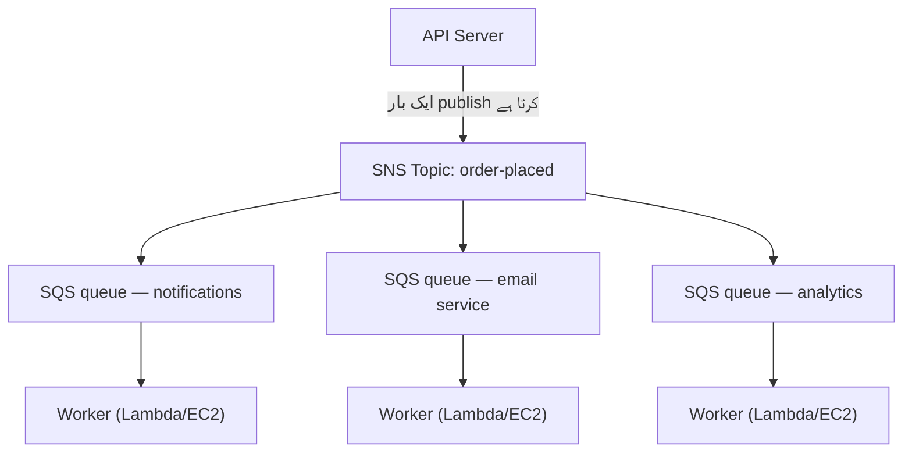

# باب 19: Ticket مشین

Ticket مشین ایک خاموش انقلاب تھی۔ ایک نمبر لو، بلائے جانے کا انتظار کرو۔ لائن ایک queue بن گئی۔ لوگ بیٹھ سکتے تھے۔ سروس کاؤنٹر اپنی رفتار سے کام کرتا رہا۔ کسی نے کسی کو block نہیں کیا۔

Ticket مشین سے پہلے، آپ کو لائن میں کھڑا ہونا پڑتا تھا۔ لائن میں آپ کی پوزیشن کے لیے آپ کی جسمانی موجودگی درکار تھی۔ آپ انتظار کرتے ہوئے کچھ اور نہیں کر سکتے تھے۔ اور اگر لائن کے آگے والا شخص سست تھا، تو اس کے پیچھے ہر کوئی رک جاتا تھا۔

Ticket مشین نے آمد کو service سے الگ کر دیا۔ آپ آتے، ایک نمبر لیتے، اور نظام آپ کی جگہ یاد رکھتا۔ آپ جا کر بیٹھ سکتے تھے۔ سروس کاؤنٹر نمبروں کے ذریعے جس رفتار سے ممکن ہوتا کام کرتا۔ اگر کاؤنٹر عارضی طور پر بند تھا، نئے آنے والوں کو پھر بھی نمبر ملتے۔ وہ انتظار کرتے۔ کام غائب نہیں ہوتا — وہ queue میں لگ جاتا۔

یہ چھوٹی ایجاد انسانی نظاموں میں decoupling کی قدیم ترین مثالوں میں سے ایک ہے۔ اس باب کے اختتام تک، Nimbus نے اپنی ticket مشین بنا لی ہوگی — software میں — اور اسے ایک کی ضرورت کیوں تھی اس کا آغاز ایک جمعہ کی شام سولہ منٹ کے downtime سے ہوتا ہے۔

---

ٹیم AZ failure سے بچ گئی تھی۔ Leo نے chaos engineering process fix کر دیا تھا، اور runbook مضبوط تھا۔ ٹریفک بحال ہو گئی تھی اور دوبارہ بڑھ رہی تھی — درحقیقت پہلے سے تیز۔ Aurora documentation جو Leo دیر رات پڑھ رہا تھا اب بھی Nimbus کے اصل مقام سے چند ابواب آگے تھی۔

لیکن ٹریفک بڑھنے اور مزید ریستورانوں کے onboard ہونے کے ساتھ، ایک مختلف قسم کا bottleneck نظر آنے لگا۔ infrastructure میں نہیں۔ خود application code میں۔ وہ request chain جو فی گھنٹہ 200 آرڈرز پر ٹھیک کام کرتی تھی 800 پر دباؤ دکھانا شروع کر رہی تھی۔

اور پھر 14 تاریخ کی شام آئی۔

---

اس کا آغاز analytics dashboard سے ہوا تھا۔ ایک جمعہ کو 6:47 PM پر، analytics service کے ایک deploy نے ایک timeout bug متعارف کرایا۔ Service معمول کے 200 ملی سیکنڈ کے بجائے 8 سیکنڈ میں جواب دینا شروع کر دیا۔

Order flow synchronous تھا۔ ہر آرڈر customer کو confirm کرنے سے پہلے analytics service کا انتظار کرتا۔ Load بڑھنے کے ساتھ آٹھ سیکنڈ 12 ہو گئے۔ API کا connection pool ان requests سے بھرنے لگا جو analytics step کے مکمل ہونے کا انتظار کر رہی تھیں۔

6:53 PM پر، connection pool اپنی حد کو پہنچ گیا۔ نئی requests فوراً ناکام ہونا شروع ہو گئیں — اس لیے نہیں کہ آرڈر process نہیں ہو سکتا تھا، بلکہ اس لیے کہ اسے process کرنا شروع کرنے کے لیے کوئی دستیاب connection نہیں تھا۔

"Analytics service نے order flow کو گرا دیا،" Leo نے اگلی صبح logs دیکھتے ہوئے کہا۔ "ان کا ایک دوسرے سے کوئی تعلق نہیں۔ Analytics service بس dashboards حساب کرتی ہے۔"

"لیکن وہ ایک ہی request chain میں ہیں،" Priya نے کہا۔

"سولہ منٹ کا downtime،" Maya نے کہا۔ "اور تین customers سے دو بار charge ہو گیا۔"

Double-charge downtime سے بدتر تھا۔ Connection pool saturation کی افراتفری میں، کچھ ایسی requests کے لیے ایک retry mechanism فائر ہوا تھا جو دراصل کامیاب ہو گئی تھیں — payment step مکمل ہوا، پھر واپس آنے سے پہلے request timeout ہو گئی، اور retry نے دوبارہ payment کی کوشش کی۔ وہی card، وہی رقم، دو charges۔

"Retry mechanism مدد کرنے والا تھا،" Leo نے کہا۔

"اس نے غلط سمت میں مدد کی،" Priya نے کہا۔ "اور کیا ہم نے سوچا ہے کہ جب ہم ان customers کو refund کرنے کی کوشش کریں گے تو کیا ہوگا؟ Refund process وہی order flow استعمال کرتا ہے جو ناکام ہوا۔"

سولہ منٹ کا downtime اور تین double-charges۔ یہ synchronous request chain کی business لاگت تھی۔

---

Nimbus کا ایک مسئلہ تھا جو مسئلے کی طرح نہیں لگتا تھا جب تک آرڈرز مشہور نہیں ہوئے۔

ہر بار جب آرڈر دیا جاتا، API server کو:

1. آرڈر database میں محفوظ کرنا
2. ریستوران کے tablet کو ایک notification بھیجنی
3. Customer کو ایک confirmation email بھیجنی
4. ریستوران کے analytics dashboard کو اپڈیٹ کرنا
5. Billing کے لیے event log کرنا

ایک مصروف deli counter پر، register پر شخص cutter کے slice کرنا ختم کرنے کا انتظار نہیں کرتا اگلے customer کی طرف جانے سے پہلے۔ وہ آرڈر لیتا ہے، اسے kitchen کو دیتا ہے، اور اگلے شخص کو serve کرنا شروع کرتا ہے۔ Kitchen اپنی رفتار سے آرڈرز کے ذریعے کام کرتی ہے۔ Customer کو تیز service ملتی ہے۔ Kitchen اچانک bursts سے overwhelm نہیں ہوتی۔ اگر kitchen کا کوئی slow moment ہو، آرڈرز counter کے پیچھے pile ہو جاتے ہیں نہ کہ register پر errors پیدا کرتے ہیں۔

یہی مثال تھی۔ Nimbus کے پاس ایک counter اور ایک kitchen نہیں تھی۔ اس کے پاس ایک شخص تھا جو customer کے جانے سے پہلے سب کچھ ترتیب میں کر رہا تھا۔

اور 14 تاریخ کو، گوشت کاٹنے والے شخص کو ایک مسئلہ تھا۔ تو counter رک گیا۔ تو اس کے بعد ہر customer انتظار کرنے لگا۔ Kitchen، register، customers — سب رک گئے کیونکہ chain میں ایک step سست ہو گیا تھا۔

Fix گوشت کاٹنا تیز کرنا نہیں تھا۔ Fix steps کو الگ کرنا تھا۔ register پر آرڈر لو، ایک ticket ہاتھ میں تھماؤ، kitchen کو کام کرنے دو۔

"ہم tightly coupled ہیں،" Priya نے کہا۔ "اگر کوئی downstream step ناکام ہو، پورا آرڈر ناکام ہوتا ہے۔ کیا ہم نے سوچا ہے کہ کیا ہوگا اگر analytics service compromised ہو جائے اور malformed messages consume کرنا شروع کر دے؟ پورا آرڈر ناکام ہوتا ہے — کیونکہ ہم اس کا انتظار کر رہے ہیں۔"

"اگر ہم آرڈر محفوظ کر کے فوراً customer کو confirm کر سکتے،" Leo نے کہا، "اور پھر باقی کو background میں process کرتے؟"

"یہ ایک queue ہے،" Priya نے کہا۔

اہم insight: customer کو یہ جاننے کی ضرورت نہیں کہ ان کا confirmation ملنے سے پہلے analytics dashboard اپڈیٹ ہوا۔ انہیں یہ جاننے کی ضرورت ہے کہ ان کا آرڈر وصول ہو گیا۔ یہ مختلف چیزیں ہیں۔ Synchronous chain نے انہیں خلط ملط کر دیا تھا۔

**Decoupling Model**

یہ **decoupling** ہے: وہ component جو کام accept کرتا ہے اسے ان components سے الگ کرنا جو اسے process کرتے ہیں۔

Nimbus کے order flow کے تمام steps کو API کے customer کو جواب دینے سے پہلے synchronously ہونا تھا۔ اگر email service سست تھی (کبھی کبھی تھی)، customer انتظار کرتا۔ اگر analytics dashboard بند تھا (کبھی کبھی تھا)، آرڈر ناکام ہوتا۔

14 تاریخ کے cascade نے بالکل وہی ظاہر کیا کہ یہ کیوں اہم تھا۔ Analytics service کا اس سے کوئی تعلق نہیں تھا کہ customer کا آرڈر accept ہوا یا نہیں۔ لیکن چونکہ یہ اسی synchronous chain میں بیٹھی تھی، اس کی ناکامی سب کی ناکامی بن گئی۔

Software systems میں، queue اکثر ایک message broker ہوتا ہے — ایک سروس جو producers سے messages accept کرتی ہے اور انہیں consumers کو deliver کرتی ہے۔

آپ شاید سوچ رہے ہوں: اگر order flow اب asynchronous ہے، تو customer کو کیسے معلوم کہ ان کا آرڈر دراصل وصول ہوا؟ جواب architecture design میں ہے: API آرڈر database میں محفوظ کرتا ہے (synchronous — یہ authoritative confirmation ہے)، پھر queue کو events publish کرتا ہے۔ Customer confirmation database write کے کامیاب ہونے پر مبنی ہے، downstream services کے مکمل ہونے پر نہیں۔ اگر email service سست ہے، customer کے پاس پہلے ہی اپنا confirmation ہے۔ Email بس ایک اچھی-اگر-مل-جائے follow-up ہے۔

**Amazon SQS: Queue**

**Amazon SQS (Simple Queue Service)** AWS کی managed message queue سروس ہے۔ یہ messages کو durably اسٹور کرتی ہے جب تک کوئی consumer انہیں process نہ کرے۔

بنیادی flow:

1. **Producer** (API server) queue میں ایک message رکھتا ہے: `{ "orderId": "ORD-5532", "restaurantId": "47", "items": [...] }`
2. API فوراً customer کو جواب دیتا ہے: "آرڈر confirmed!"
3. **Consumers** (الگ worker services) queue سے messages پڑھتے اور انہیں process کرتے ہیں: ریستوران notification بھیجیں، confirmation email بھیجیں، analytics اپڈیٹ کریں

Customer experience: فوری confirmation۔ Downstream processing: asynchronously ہوتی ہے، workers کی رفتار پر۔

**SQS کے اہم تصورات**

**Message visibility timeout**: جب ایک consumer SQS سے ایک message پڑھتا ہے، message ایک مدت کے لیے دوسرے consumers کے لیے *invisible* ہو جاتی ہے (default: 30 سیکنڈ)۔ یہ consumer کو اسے process کرنے کا وقت دیتا ہے۔ اگر consumer کامیابی سے ختم کرتا ہے، یہ message delete کر دیتا ہے۔ اگر consumer crash ہو جاتا ہے، visibility timeout ختم ہوتا ہے اور message کسی دوسرے consumer کے retry کرنے کے لیے دوبارہ visible ہو جاتی ہے۔

یہ at-least-once delivery یقینی بناتا ہے: ہر message کم از کم ایک بار process ہوگی، چاہے کوئی consumer mid-processing ناکام ہو جائے۔

آپ شاید سوچ رہے ہوں: اگر message process ہوتے ہوئے invisible ہو جاتی ہے لیکن consumer کے crash ہونے پر delete نہیں ہوتی، تو کیا یہ دو بار process نہیں ہو سکتی؟ ہاں — اور اسے at-least-once delivery کہا جاتا ہے۔ اس کا مطلب ہے کہ ہر consumer کو ایک ہی message ایک بار سے زیادہ وصول کرنے کو مسئلہ پیدا کیے بغیر سنبھالنے کے لیے ڈیزائن کرنا ضروری ہے۔ ایک duplicate آرڈر confirmation email پریشان کن ہے۔ ایک duplicate charge ایک support ticket ہے۔ اپنے consumers کو اسی کے مطابق ڈیزائن کریں۔

Visibility timeout آپ کے سب سے طویل متوقع processing time سے زیادہ ہونا چاہیے۔ اگر processing عام طور پر 20 سیکنڈ لیتی ہے لیکن کبھی کبھی 90 سیکنڈ لیتی ہے، اور آپ کا visibility timeout 30 سیکنڈ ہے، تو وہ کبھی کبھار 90 سیکنڈ کی processing SQS کو ایک failure کی طرح نظر آئے گی۔ Message دوبارہ visible ہو جاتی ہے۔ ایک دوسرا consumer اسے اٹھا لیتا ہے۔ اب دو workers ایک ہی message process کر رہے ہیں۔ اگر آپ کی processing idempotent نہیں ہے، آپ کو ایک مسئلہ ہے۔

ایک عام غلطی: visibility timeout کو اوسط processing time کے برابر سیٹ کرنا۔ صحیح طریقہ: اسے 99ویں percentile processing time پر سیٹ کریں، ایک safety margin کے ساتھ۔ اگر P99 processing time 45 سیکنڈ ہے، تو visibility timeout 90 سیکنڈ پر سیٹ کریں۔

**Dead-letter queues (DLQ)**: اگر ایک message بہت زیادہ بار process کرنے میں ناکام ہو (configurable — مثلاً 5 retries)، SQS اسے ایک dead-letter queue میں move کر دیتا ہے۔ آپ DLQ کا معائنہ کرتے ہیں یہ سمجھنے کے لیے کہ messages کیوں ناکام ہو رہی ہیں، انہیں کھوئے بغیر۔

DLQ وہ جگہ ہے جہاں آپ سیکھتے ہیں کہ production میں دراصل کیا ناکام ہو رہا ہے۔ اس کے بغیر، ناکام messages بس غائب ہو جاتی ہیں اور آپ کے پاس تحقیق کرنے کا کوئی طریقہ نہیں رہتا۔

SQS migration کے تین ہفتے بعد، Leo نے دیکھا کہ notification service کے DLQ میں 23 messages جمع ہو گئی تھیں۔ وہ DLQ چیک نہیں کر رہا تھا (اس نے اسے صحیح طریقے سے سیٹ اپ کیا تھا اور پھر فرض کر لیا تھا کہ یہ خالی رہے گا)۔

اس نے ایک message نکالی اور payload دیکھا:

```json
{
  "orderId": "ORD-9821",
  "restaurantId": "12",
  "customerMessage": "Extra spicy please 🌶️🔥",
  "timestamp": "2024-01-18T19:43:11Z"
}
```

Emoji۔ ریستوران notification service ریستوران کے legacy tablet API کو بھیجنے سے پہلے message payloads کو Latin-1 کے طور پر encode کر رہی تھی۔ Emoji characters — UTF-8 میں ہر ایک چار bytes — corrupt ہو رہے تھے، جس کی وجہ سے tablet API request کو reject کر رہا تھا۔ Message retry ہوتی، دوبارہ ناکام ہوتی، دوبارہ retry ہوتی، دوبارہ ناکام ہوتی۔ 5 retries کے بعد، SQS اسے DLQ میں move کر دیتا۔

"تمام 23 messages میں customer notes field میں emoji ہے،" Leo نے کہا۔

"تو ہر وہ customer جس نے اپنے آرڈر notes میں ایک emoji شامل کیا، اس کا note خاموشی سے ریستوران تک پہنچنے میں ناکام رہا،" Maya نے کہا۔

"ہاں۔"

"کتنی دیر تک؟"

Leo نے سب سے پرانی message کا timestamp چیک کیا۔ "تین ہفتے۔"

Priya خاموش تھی۔ "اور کیا ہو اگر کسی نے سمجھ لیا کہ ایک آرڈر note میں emoji شامل کرنے سے ایک خاموش failure ہوتی ہے؟ آپ emoji کے ساتھ آرڈرز دے سکتے ہیں اور ضمانت دے سکتے ہیں کہ ریستوران نے کبھی ہدایت نہ دیکھی۔ پھر غلط آرڈر کی شکایت کریں۔"

کسی نے اس کا فائدہ نہیں اٹھایا تھا۔ لیکن یہ پوچھنے کے لیے صحیح سوال تھا۔

Leo نے encoding bug fix کیا۔ پھر اس نے DLQ سے تمام 23 پھنسی ہوئی messages کو replay کرنے کے لیے ایک script لکھی۔ ریستورانوں کو ان کی (تین ہفتے پرانی) spicy emoji ہدایات موصول ہوئیں۔ Customers کو کبھی معلوم نہ ہوا۔

سبق: DLQ کو فعال طور پر monitor کرنا ضروری ہے، سیٹ اپ کر کے بھولنا نہیں۔ ایک بڑھتا ہوا DLQ ایک خاموش signal ہے کہ کوئی چیز بار بار ناکام ہو رہی ہے۔

**Queue کی اقسام**:

**Standard queues**: زیادہ سے زیادہ throughput (فی سیکنڈ unlimited messages)۔ Delivery order best-effort ہے (guaranteed نہیں)۔ At-least-once delivery (بہت کم، ایک message دو بار deliver ہو سکتی ہے)۔

**FIFO queues**: سخت first-in، first-out ordering۔ Exactly-once **processing** — ایک 5 منٹ کے window کے اندر `MessageDeduplicationId` پر مبنی deduplication۔ Ordering فی `MessageGroupId` guaranteed ہے: ایک ہی group میں messages ترتیب میں آتی ہیں؛ مختلف groups متوازی process ہو سکتے ہیں، جو یہ ہے کہ FIFO کیسے scale کرتا ہے۔ Baseline throughput batching کے ساتھ فی سیکنڈ 3,000 messages ہے (بغیر 300)؛ **high-throughput mode** فعال کرنا message groups میں partition کر کے اسے فی سیکنڈ دسیوں ہزار تک بڑھا دیتا ہے۔ FIFO استعمال کریں جب order اہمیت رکھتا ہو (financial transactions، sequential state changes)۔

اگر آپ کو زیادہ سے زیادہ throughput چاہیے اور آپ کبھی کبھار duplicate messages برداشت کر سکتے ہیں، SQS Standard استعمال کریں — لیکن آپ کو ہر consumer کو duplicates کو مسئلہ پیدا کیے بغیر سنبھالنے کے لیے ڈیزائن کرنا ضروری ہے۔ اگر آپ کو سخت ordering اور exactly-once processing چاہیے، SQS FIFO استعمال کریں — اور اپنے `MessageGroupId`s کو اچھی طرح ڈیزائن کریں، کیونکہ parallelism (اور اس لیے throughput) بہت سارے groups رکھنے سے آتا ہے۔

Nimbus کے لیے، زیادہ تر queues standard queues استعمال کرتی تھیں۔ Billing queue FIFO استعمال کرتی تھی تاکہ یقینی بنایا جائے کہ charges ترتیب میں process ہوں۔

**Queue Depth Auto Scaling: Backlog سے Match کرنے کے لیے Workers کو Scale کرنا**

SQS کے سب سے طاقتور applications میں سے ایک queue depth کو ایک Auto Scaling trigger کے طور پر استعمال کرنا ہے۔ CPU یا memory پر مبنی scale کرنے کے بجائے، آپ اس بنیاد پر scale کرتے ہیں کہ کتنا کام انتظار کر رہا ہے۔

Nimbus کی notification service کے لیے: SQS queue depth (process ہونے کا انتظار کرنے والی messages کی تعداد) notification workers چلانے والی ECS service کے لیے ایک Application Auto Scaling policy سے منسلک تھی۔

Policy: جب queue میں فی worker task 50 سے زیادہ messages ہوں، ایک task شامل کریں۔ جب queue میں فی worker task 10 سے کم messages ہوں، ایک task ہٹا دیں۔

عملی اثر: جب جمعہ کی شام کے peak کے دوران 1,200 آرڈرز آئے، notification queue depth بڑھ گئی اور worker fleet 3 منٹ کے اندر 2 tasks سے 8 tasks تک scale ہو گیا۔ آدھی رات تک، queue خالی تھی اور fleet واپس 2 پر آ گیا۔

"یہ فی مہینہ کتنا خرچ کرتا ہے؟" Tom نے Auto Scaling graph دیکھتے ہوئے پوچھا۔

"خود Auto Scaling کے لیے کچھ اضافی نہیں،" Leo نے کہا۔ "لیکن جمعہ کی شاموں کو 3 گھنٹے کے لیے 6 اضافی ECS tasks — یہ معنی خیز ہے۔"

Tom نے حساب لگایا۔ "ان peaks کے لیے تقریباً $14/مہینہ۔ اور پہلے، ہم 8 tasks مسلسل پوری لاگت پر چلا رہے تھے؟"

"ہاں۔"

"تو ہم burst کے لیے ادائیگی کرتے ہیں جب ہمیں اس کی ضرورت ہوتی ہے اور باقی وقت کچھ نہیں۔"

یہ queue-depth scaling pattern ہے: queue ایک buffer بن جاتا ہے جو traffic spikes جذب کرتا ہے، اور worker fleet buffer کو drain کرنے کے لیے scale کرتا ہے۔ Users سستی کا تجربہ نہیں کرتے — انہیں اپنا confirmation فوراً مل گیا جب آرڈر accept ہوا۔ Workers بس catch up کرنے میں تھوڑا زیادہ وقت لیتے ہیں۔ اور چونکہ آپ peak capacity 24/7 نہیں چلا رہے، لاگتیں نمایاں طور پر کم ہیں۔

**Amazon SNS: Broadcaster**

**Amazon SNS (Simple Notification Service)** ایک publish/subscribe (pub/sub) message سروس ہے۔ ایک producer، ایک consumer (queue) کے بجائے، SNS ایک message کو *بہت سارے* subscribers کو بیک وقت deliver کرنا سپورٹ کرتا ہے۔

Model:

1. ایک **publisher** ایک SNS **topic** کو ایک message بھیجتا ہے
2. اس topic کے تمام **subscribers** بیک وقت message وصول کرتے ہیں (fan-out)

Subscribers ہو سکتے ہیں:

- SQS queues (async processing کے لیے message کو ایک queue میں push کریں)
- Lambda functions (function کو براہ راست trigger کریں)
- HTTP/HTTPS endpoints (webhook delivery)
- Email addresses
- SMS (phone numbers)

Nimbus کے لیے، order placed event ایک SNS topic کو publish ہوتا ہے جسے `order-events` کہا جاتا ہے:

- Restaurant notification service subscribe کرتی ہے (اپنی SQS queue پر وصول کرتی ہے)
- Email service subscribe کرتی ہے (اپنی SQS queue پر وصول کرتی ہے)
- Analytics service subscribe کرتی ہے (اپنی SQS queue پر وصول کرتی ہے)
- Billing service subscribe کرتی ہے (اپنی FIFO SQS queue پر وصول کرتی ہے)

ایک order event۔ چار subscribers۔ سب بیک وقت notify ہوئے۔ ہر ایک اپنی رفتار سے process کرتا ہے۔

"تو SNS اعلان ہے،" Maya نے کہا، "اور SQS وہ inbox ہے جہاں ہر ٹیم اعلان کو اپنی رفتار سے process کرتی ہے۔ پھر دونوں کیوں استعمال کریں؟ کیوں نہ بس ہر کوئی براہ راست SNS topic کو subscribe کرے؟"

"کیونکہ براہ راست SNS delivery fire-and-forget ہے،" Leo نے کہا۔ "اگر SNS فائر ہوتے وقت analytics service بند ہو، وہ message ختم۔ درمیان میں ایک SQS queue کے ساتھ، message انتظار کرتی ہے جب تک service بحال نہ ہو۔"

"بالکل،" Priya نے کہا۔ "SNS/SQS fan-out standard pattern ہے۔"

**SNS/SQS Fan-Out Pattern**

یہ combination — SNS topic متعدد SQS queues کو feed کرتا ہوا — AWS میں سب سے اہم architectural patterns میں سے ایک ہے:



ہر queue آزاد ہے۔ Analytics service سست ہو سکتی ہے — اس کی queue بھر جاتی ہے، لیکن notification اور email services غیر متاثر چلتی رہتی ہیں۔ اگر analytics service بند ہو جائے، اس کی messages queue میں انتظار کرتی ہیں جب تک یہ واپس نہ آئے۔ کچھ نہیں کھوتا۔

یہ اہم خاصیت ہے: **independent failure**۔ ایک consumer میں مسائل دوسروں تک propagate نہیں ہوتے۔

**Message Filtering: ہر Subscriber کے لیے ہر Message نہیں**

جیسے systems بڑھتے ہیں، آپ نہیں چاہتے کہ ہر subscriber ہر message process کرے۔ ایک analytics service کو failed payment processing کے بارے میں messages نہیں ملنی چاہئیں اگر یہ صرف completed orders کی پرواہ کرتی ہے۔

**SNS message filtering** subscribers کو filter policies specify کرنے دیتا ہے — صرف وہی messages deliver کریں جو مخصوص attributes سے match کریں۔

Restaurant notification service ایک filter کے ساتھ subscribe کرتی ہے: صرف وہ messages جہاں `status = "confirmed"`۔

Error alerting service ایک filter کے ساتھ subscribe کرتی ہے: صرف وہ messages جہاں `status = "failed"`۔

ہر subscriber کو صرف وہی ملتا ہے جس کی اسے ضرورت ہے۔

Filtering کے بغیر، ہر subscriber ہر message وصول کرتا ہے اور اسے نظر انداز کرنا پڑتا ہے جو غیر متعلق ہو۔ یہ processing ضائع کرتا ہے، پیسہ ضائع کرتا ہے (SQS فی message charge کرتا ہے)، اور شور متعارف کراتا ہے۔ Filtering کے بغیر ایک high-volume order system error alerting queue کو کامیاب آرڈرز سے بھر دے گا — جس سے حقیقی failures تلاش کرنا مشکل ہو جائے گا۔

Filter policies ایسی نظر آتی ہیں:

```json
{
  "status": ["confirmed"],
  "region": ["us-west-2", "us-east-1"]
}
```

یہ subscriber صرف وہی messages وصول کرتا ہے جہاں status "confirmed" ہے AND region یا تو "us-west-2" یا "us-east-1" ہے۔ Policy سے match نہ کرنے والی messages اس subscriber کی queue کو بالکل deliver نہیں ہوتیں — وہ کبھی SQS تک بھی نہیں پہنچتیں۔

"تو filtering SNS layer پر ہوتی ہے،" Priya نے کہا، "messages SQS میں لکھے جانے سے پہلے؟"

"درست۔ ریستوران notification service کی SQS queue کبھی صرف وہی messages دیکھتی ہے جن پر اسے عمل کرنا ہے۔"

"اور اگر کوئی SNS topic کو ایک خاص طور پر تیار کی گئی message publish کر کے توڑنے کی کوشش کرے جو تمام subscriber filters سے match کرے؟" Priya نے پوچھا۔

SNS topic کی ایک IAM resource policy تھی: صرف order API service (اپنے IAM role کے ذریعے) کو publish کرنے کی اجازت تھی۔ SNS access policies اور SQS queue policies نے access control layer بنائی — filtering بس routing کے لیے تھی، security کے لیے نہیں۔

**SQS بمقابلہ SNS کب استعمال کریں**

**SQS اکیلے**: ایک producer، ایک consumer (یا ایک ہی queue پر متعدد competing consumers)۔ Messages کو ایک بار، ترتیب میں (FIFO) یا نہیں (standard) process ہونے کی ضرورت ہے۔ Worker queue pattern — ایک queue، متعدد workers اس سے consume کرتے ہوئے۔

**SNS اکیلے**: Fire-and-forget notifications۔ Email، SMS، یا HTTP endpoints کو push کریں۔ Message کو queue کرنے کی ضرورت نہیں — بس notify کریں اور آگے بڑھیں۔

**SNS + SQS (fan-out)**: ایک event، متعدد آزاد consumers۔ ہر consumer کی اپنی queue ہے، آزادانہ process کرتا ہے، اور آزادانہ ناکام ہو سکتا ہے۔

## SNS FIFO Topics

SNS کے بارے میں اوپر سب کچھ standard topics استعمال کرتا ہے — ان کا عملی طور پر لامحدود throughput ہوتا ہے، وہ subscribers کو تقریباً بیک وقت deliver کرتے ہیں، اور use cases کی بھاری اکثریت کے لیے کام چلا دیتے ہیں۔

لیکن standard SNS topics ordering کی ضمانت نہیں دیتے۔ اگر آپ دس messages ترتیب میں publish کرتے ہیں، subscribers انہیں قدرے مختلف ترتیب میں وصول کر سکتے ہیں۔ Nimbus کے order notifications کے لیے، یہ ٹھیک ہے — ایک email confirmation سے ایک سیکنڈ کے کسر پہلے ایک analytics update آنا کوئی فرق نہیں پڑتا۔

کچھ scenarios کے لیے، یہ فرق پڑتا ہے۔ ایک financial ledger پر غور کریں: اگر دو events — ایک credit اور پھر ایک debit — الٹی ترتیب میں deliver ہوں، تو processing کے دوران balance calculations غلط ہوں گے چاہے دونوں events بالآخر صحیح طریقے سے process ہو جائیں۔

**SNS FIFO topics** وہی اصول fan-out model پر لاگو کرتے ہیں جو SQS FIFO queues کرتے ہیں۔ Messages subscribers کو بالکل اسی ترتیب میں deliver ہوتی ہیں جس میں وہ publish کی گئیں، اور ہر message بالکل ایک بار deliver ہوتی ہے۔

Trade-off: SNS FIFO topics کا SQS FIFO کے مشابہ baseline throughput ہے (فی topic فی سیکنڈ 3,000 messages؛ فی message group فی سیکنڈ 300 — 2025 سے بہت زیادہ کے لیے ایک high-throughput mode دستیاب ہے)، اور وہ صرف **SQS queues** کو fan out کرتے ہیں — FIFO یا، 2023 سے، Standard۔ ایک Standard queue subscribe کرنا ان consumers کے لیے مفید ہے جو order کی پرواہ نہیں کرتے (مثلاً ایک analytics feed)، لیکن ordering اور exactly-once سرے سے سرے تک **صرف** FIFO queues میں بچتے ہیں۔ آپ ایک SNS FIFO topic کو HTTP endpoints یا email addresses کو deliver کرنے کے لیے استعمال نہیں کر سکتے۔

Nimbus کی billing pipeline کے لیے — جہاں pricing updates کا ایک سلسلہ ریستوران accounts پر ترتیب میں لاگو ہونا تھا — billing SNS topic standard سے FIFO میں منتقل کیا گیا۔ SQS billing queue پہلے ہی FIFO تھی۔ Fan-out اب ضمانت دیتا تھا کہ ایک price-increase event کبھی billing processor تک اس period-start event سے پہلے نہ پہنچے جس پر اس کا انحصار تھا۔

> **امتحانی نکتہ — SNS FIFO**
>
> اگر ایک منظر نامہ متعدد subscribers میں **ordered fan-out delivery** کا تقاضا کرتا ہے، جواب **SNS FIFO** ہے۔ Standard SNS ordering کی ضمانت نہیں دیتا۔ SNS FIFO صرف SQS queues کو fan out کرتا ہے — ordering اور exactly-once کو سرے سے سرے تک رکھنے کے لیے، subscriber کو ایک SQS **FIFO** queue ہونا ضروری ہے (Standard queue subscriptions کی اجازت ہے لیکن انہیں best-effort ordering اور at-least-once delivery ملتی ہے)۔ Default throughput فی topic فی سیکنڈ 3,000 ہے — اگر منظر نامہ بہت زیادہ volume *اور* سخت ordering بیان کرتا ہے، تو یہ متبادل architectures دیکھنے کا signal ہے (مثلاً Kinesis، جو ایک بعد کے باب میں cover ہوا ہے)۔

## جب Legacy Queue ہاتھ نہ چھوڑے

Nimbus اپنی اب تک کی سب سے بڑی acquisition بند کرنے والا تھا: Barato، ایک food delivery حریف جس کے پاس 200 ریستوران اور operations میں دو سال کی برتری تھی۔ Engineering ٹیم نے ایک integration planning call شیڈول کی۔

Call بیس منٹ تک چلی اس سے پہلے کہ Leo خاموش ہو گیا۔

"ان کا order processing system،" اس نے کہا۔ "یہ کس پر چلتا ہے؟"

"ActiveMQ،" دوسری طرف سے Barato engineer نے کہا۔ "On-prem broker۔ App Java ہے۔ یہ 2018 سے چل رہا ہے۔ سب کچھ AMQP بولتا ہے۔"

"AMQP،" Leo نے کہا۔

"ہاں۔"

اس نے اپنی اسکرین پر architecture diagram دیکھا۔ Nimbus SQS اور SNS چلاتا تھا۔ SQS AMQP نہیں بولتا۔ SNS AMQP نہیں بولتا۔ Barato application اور کچھ نہیں بولتی تھی۔

"اسے دوبارہ لکھنے میں چھ ماہ لگیں گے،" Leo نے call کے بعد ٹیم سے کہا۔ "کم از کم۔"

"ہم acquisition کو چھ ماہ کے لیے ملتوی نہیں کر سکتے،" Maya نے کہا۔

"اور ہم AWS میں ایک bare-metal ActiveMQ broker نہیں چلا سکتے،" Priya نے شامل کیا۔ "کیا ہم نے سوچا ہے کہ یہ security اور reliability کے نقطہ نظر سے کیسا نظر آتا ہے؟ ایک self-managed message broker، production میں بیٹھا، بغیر managed patching، بغیر automatic failover، ہماری infrastructure سے connect کرتا ہوا؟"

"ایک managed option ہے،" Leo نے آہستہ کہا۔ وہ ان کی باتوں کے دوران پڑھ رہا تھا۔ "Amazon MQ۔"

**Amazon MQ: Managed Broker**

**Amazon MQ** Apache ActiveMQ اور RabbitMQ کے لیے ایک managed message broker سروس ہے۔ یہ آپ کا موجودہ broker چلاتا ہے — وہی broker جس سے آپ کی applications برسوں سے connect رہی ہیں — لیکن ایک managed AWS service کے طور پر۔ AWS underlying infrastructure سنبھالتا ہے: provisioning، patching، failover، backups۔

وہ اہم خاصیت جو Amazon MQ کو SQS اور SNS سے مختلف بناتی ہے: یہ وہ protocols بولتا ہے جو legacy message brokers بولتے ہیں۔ AMQP، STOMP، MQTT، OpenWire، NMS۔ وہ protocols جنہیں SQS اور SNS بس نہیں سمجھتے۔

Barato integration کے لیے، plan سیدھا سادا تھا۔ AWS ایک Amazon MQ broker چلائے گا جو ActiveMQ کے طور پر ترتیب دیا گیا ہو۔ Barato Java application کو on-premises کے بجائے نئے broker endpoint کی طرف اشارہ کیا جائے گا۔ application کی طرف تبدیلی: نئی connection string کے ساتھ ایک configuration file اپڈیٹ کریں۔ بس اتنا ہی۔ Application کو یہ جاننے کی ضرورت نہیں تھی کہ وہ Barato دفتر میں ایک server کے بجائے ایک managed cloud broker سے بات کر رہی ہے۔

"رکو،" Maya نے کہا۔ "اگر ہم انہیں بالآخر Nimbus میں integrate کرنے والے ہیں، تو کیا ہمیں شروع سے ہی انہیں SQS میں منتقل نہیں کر دینا چاہیے؟"

"کیونکہ migration path موجود ہے،" Leo نے کہا۔ "اور اسے صحیح طریقے سے کرنا قابل قدر ہے — بالآخر۔ لیکن ابھی، ہمیں Barato کو AWS infrastructure پر تیس دنوں میں operational چاہیے، چھ ماہ میں نہیں۔ Amazon MQ application کو application تبدیل کیے بغیر چلا دیتا ہے۔ پھر ہمارے پاس SQS migration کو ایک سوچا سمجھا project کے طور پر منصوبہ بندی کرنے کا وقت ہے، نہ کہ acquisition کے لیے ایک افراتفری والی پیشگی شرط۔"

"یہ فی مہینہ کتنا خرچ کرتا ہے؟" Tom نے پوچھا۔

Amazon MQ broker — reliability کے لیے ایک واحد active/standby pair — Barato کے volume کے لیے موزوں ایک broker کے لیے $200/مہینہ کی حد میں تھا۔ چھ ماہ کے rewrite وقت کی لاگت کے مقابلے میں، یہ کوئی بحث نہیں تھی۔

Priya نے ایک شرط کے ساتھ plan کی منظوری دی: Amazon MQ instance ایک private subnet میں رہے گا، security group rules کے ساتھ جو صرف Barato application servers سے connections کی اجازت دیں۔ کوئی public exposure نہیں۔ Audit logging فعال۔

Migration بارہ دن لگی۔ Barato application تیرہویں دن Amazon MQ سے connect ہوئی۔ چودہویں دن، اس نے بغیر ایک code تبدیلی کے AWS infrastructure پر اپنا پہلا آرڈر process کیا۔

---

> **امتحانی نکتہ — Amazon MQ**
>
> *SAA-C03 ڈومین: Resilient Architectures ڈیزائن کریں (ڈومین 2)*
>
> امتحان Amazon MQ کو SQS اور SNS سے ایک واحد محور پر distinguish کرتا ہے: **protocol compatibility**۔ اگر منظر نامہ ایک ایسی application بیان کرتا ہے جو پہلے ہی ایک message broker استعمال کرتی ہے اور ایک مخصوص protocol بولتی ہے، تو Amazon MQ تقریباً یقینی طور پر جواب ہے۔
>
> اہم signals: **"ActiveMQ،" "RabbitMQ،" "AMQP،" "STOMP،" "MQTT،" "OpenWire،"** یا **"application code تبدیل کیے بغیر"** کے مساوی کوئی بھی جملہ۔ اگر آپ یہ جملے دیکھیں، جواب Amazon MQ ہے — SQS نہیں، SNS نہیں۔
>
> اگر منظر نامہ ایک *نئی* application بیان کرتا ہے جسے decoupling کی ضرورت ہے، یا کسی legacy broker یا مخصوص protocol کا ذکر نہیں کرتا، تو SQS/SNS استعمال کریں۔
>
> ایک اور signal: "موجودہ on-premises message broker کو AWS میں منتقل کریں۔" اگر app کو ایک ہی قسم کے broker سے وہی protocol بولتے رہنا ہے، تو Amazon MQ lift-and-shift جواب ہے۔

## خوبیاں اور حدود

**SQS اور SNS کیوں طاقتور ہیں**:

- SQS durable، reliable message delivery فراہم کرتا ہے — messages متعدد AZs میں اسٹور ہوتی ہیں
- Decoupling producer اور consumer services کی independent scaling اور deployment کو قابل بناتا ہے
- Dead-letter queues یقینی بناتے ہیں کہ کوئی message ناکامی پر خاموشی سے نہ کھوئے
- SNS fan-out pattern producer کو تبدیل کیے بغیر نئے consumers شامل کرنے کی اجازت دیتا ہے

**جہاں یہ پیچیدہ ہو جاتا ہے**:

- At-least-once delivery کا مطلب consumers کو *idempotent* ہونا ضروری ہے — ایک ہی message دو بار process کرنا مسائل پیدا نہیں کرنا چاہیے (duplicate orders، duplicate charges)
- FIFO queues زیادہ مہنگی ہیں اور ان کی throughput limits ہیں
- متعدد queues اور services میں ناکام messages کو debug کرنے کے لیے اچھی logging اور observability ضروری ہے
- Message ordering guarantees محدود ہیں — اگر متعدد services میں strict ordering اہمیت رکھتی ہو، ڈیزائن پیچیدہ ہو جاتا ہے

**Idempotency: ایک عملی گہرا غوطہ**

Idempotency تجریدی لگتی ہے جب تک آپ کے تین customers double-charge نہ ہو جائیں۔

ایک operation **idempotent** ہے اگر اسے متعدد بار چلانا وہی نتیجہ پیدا کرے جو اسے ایک بار چلانا۔ ایک charge operation قدرتی طور پر idempotent نہیں ہے: اسے دو بار چلانا دو بار charge کرتا ہے۔ ایک idempotent charge operation کوشش کرنے سے پہلے چیک کرتا ہے کہ charge پہلے ہی process ہو چکا ہے یا نہیں۔

Pattern: ہر message ایک unique ID رکھتا ہے (order ID، یا ایک علیحدہ message ID)۔ Process کرنے سے پہلے، consumer ایک store چیک کرتا ہے (DynamoDB اس کے لیے اچھی طرح کام کرتا ہے) کہ یہ message ID پہلے ہی کامیابی سے process ہو چکا ہے یا نہیں۔ اگر ہاں: کچھ نہ کریں، message delete کر دیں۔ اگر نہیں: process کریں، ID record کریں، message delete کر دیں۔

```python
def process_charge(message):
    order_id = message['orderId']
    
    # Idempotency check
    if already_processed(order_id):
        logger.info(f"Order {order_id} already charged, skipping duplicate")
        return  # Message will be deleted from queue
    
    # Process the charge
    charge_result = payment_service.charge(
        amount=message['amount'],
        card_token=message['cardToken'],
        idempotency_key=order_id  # Also pass to payment processor
    )
    
    # Record that we've processed this
    mark_as_processed(order_id, charge_result)
```

Idempotency key کو ان downstream services (payment processors، email systems) کو بھی pass کیا جانا چاہیے جو اسے سپورٹ کرتی ہیں۔ مثلاً Stripe، ایک `Idempotency-Key` header قبول کرتا ہے جو duplicate charges کو روکتا ہے چاہے وہی API call دو بار کی جائے۔

"اور correlation IDs کا کیا؟" Priya نے پوچھا۔ "جب ایک message متعدد services سے گزرتی ہے، تو ہم کیسے trace کریں کہ کس request نے کون سا downstream action پیدا کیا؟"

**Correlation IDs: Services میں Tracing**

جب ایک customer آرڈر دیتا ہے، request اس کے ذریعے بہتی ہے: API → SNS → SQS → notification worker → restaurant tablet API → SQS → email worker → SES۔

Correlation IDs کے بغیر، اگر restaurant tablet API step 6 پر ایک error واپس کرتا ہے، تو ہر service میں logs event دکھاتے ہیں، لیکن اسے شروع سے مخصوص customer کے آرڈر تک واپس trace کرنے کا کوئی طریقہ نہیں۔

ایک **correlation ID** ایک unique identifier ہے جو اصل request سے منسلک ہوتا ہے اور ہر service interaction سے گزرتا ہے۔ ہر service اپنے logs میں correlation ID شامل کرتی ہے۔

جب Priya ایک مخصوص correlation ID کے لیے CloudWatch تلاش کرتی ہے، اسے ہر log line ملتی ہے — ہر service میں — جو اس واحد آرڈر کی processing کا حصہ تھی۔

"ایک احتیاط،" Priya نے کہا۔ "Correlation IDs باہر سے آتی ہیں۔ کیا کوئی ایک malicious ID inject کر کے ہماری logging کو خراب کر سکتا ہے؟"

Correlation IDs internal ہیں — وہ processing logic کو متاثر نہیں کرتیں، صرف logging کو۔ انہیں sanitize کرنا (alphanumeric، fixed length) log outputs میں injection attacks کو روکتا ہے۔

**جب Decoupling غلط انتخاب ہو**

"رکو — لیکن ہم ہر چیز کو decouple *کیوں* نہ کریں؟" Maya نے پوچھا۔

یہ ایک منصفانہ سوال تھا۔ اگر decoupling cascade failures کو روکتی ہے اور systems کو resilient بناتی ہے، تو اسے ہر جگہ کیوں نہ لاگو کریں؟

کیونکہ decoupling کی لاگتیں ہیں۔ اور ایسے scenarios ہیں جہاں وہ لاگتیں فوائد سے زیادہ ہوتی ہیں۔

**جب آپ کو فوری consistency چاہیے**: اگر ایک آرڈر آگے بڑھنے سے پہلے ایک payment confirm ہونا ضروری ہے — اور user اسکرین پر نتیجے کا انتظار کر رہا ہے — تو آپ payment کو ایک asynchronous queue میں نہیں ڈال سکتے اور charge کامیاب ہوا یا نہیں یہ جاننے سے پہلے confirmation واپس کر سکتے۔ User پہلے charge کے مکمل ہونے سے پہلے دو بار آرڈر دے سکتا ہے۔ Asynchronous decoupling ان operations کے لیے کام نہیں کرتی جہاں جواب نتیجے پر منحصر ہو۔

**جب workflow فطری طور پر sequential ہو**: اگر step 3 کو فیصلہ کرنے کے لیے step 2 کا نتیجہ دیکھنا ضروری ہے، تو وہ ایک queue سے متوازی نہیں چل سکتے۔ انہیں ایک queue میں زبردستی ڈالنا ایک عجیب result-passing mechanism پیدا کرتا ہے جو اکثر synchronous version سے زیادہ پیچیدہ ہو جاتا ہے۔

**جب message ordering اہم ہو اور volume کم ہو**: SQS Standard ordering کی ضمانت نہیں دیتا۔ SQS FIFO دیتا ہے، لیکن default کے طور پر batching کے ساتھ فی سیکنڈ 3,000 messages پر محدود ہے (high-throughput mode اسے کافی بڑھا دیتا ہے)۔ اگر آپ کے پاس کم volume، سختی سے ordered workflow ہے، تو ایک سادہ synchronous queue (جیسے ایک database row lock) آسان اور زیادہ قابل اعتماد ہو سکتا ہے۔

**جب overhead فائدے سے زیادہ ہو**: ایک چھوٹا internal tool جس کا ایک user اور کوئی SLA نہ ہو شاید fan-out SNS topics اور DLQs کی ضرورت نہ ہو۔ Queues اور DLQs کی monitoring کا operational overhead حقیقی ہے۔ Architecture کو مسئلے کے مطابق size کریں۔

سوال یہ نہیں ہے کہ "کیا مجھے اسے decouple کرنا چاہیے؟" یہ ہے کہ "اس coupling کی لاگت کیا ہے، اور کیا decoupling اس لاگت کو اتنا کم کرتی ہے جتنا یہ شامل کرتی ہے؟"

## خلاصہ

Decoupling باب 18 کا resilience اصول ہے جو internal architecture پر لاگو ہوتا ہے: جس طرح Multi-AZ infrastructure میں single points of failure کو ختم کرتا ہے، اسی طرح SQS اور SNS request chains میں single points of failure کو ختم کرتے ہیں۔

- **Decoupling** کام produce کرنے والے components کو اسے process کرنے والے components سے الگ کرتا ہے۔
- **SQS** producers کو کام رکھنے کے لیے ایک durable جگہ دیتا ہے جب consumers سست، offline، یا scale up ہو رہے ہوں۔
- **SNS** ایک event کو متعدد آزاد consumers تک پہنچنے دیتا ہے بغیر publisher کے یہ جانے کہ وہ کون ہیں۔
- **SNS + SQS fan-out** ہر downstream service کو ایک ہی event کو اپنی رفتار سے process کرنے دیتا ہے۔
- **DLQs، idempotency، اور correlation IDs** وہ operational discipline ہیں جو asynchronous systems کو پراسرار کے بجائے قابل debug بناتے ہیں۔
- **آنکھیں بند کر کے decouple نہ کریں**: synchronous workflows، فوری consistency requirements، اور چھوٹے کم خطرے والے tools شاید بڑھے ہوئے operational surface کو جائز نہ ٹھہرائیں۔

## امتحانی نکات

*SAA-C03 ڈومین: Resilient Architectures ڈیزائن کریں (ڈومین 2، ٹاسک 2.1)*

- **SQS Standard بمقابلہ FIFO**: امتحان ordering اور delivery guarantees کے ذریعے distinguish کرتا ہے۔ "ترتیب میں process ہونا ضروری ہے" → FIFO۔ "زیادہ سے زیادہ throughput" → Standard۔
- **Queue depth Auto Scaling**: "Queue depth کی بنیاد پر workers کو scale کریں" → SQS metric (ApproximateNumberOfMessagesVisible) جو Application Auto Scaling یا ECS Service Auto Scaling کے ساتھ استعمال ہوتا ہے۔
- **Visibility timeout**: At-least-once delivery کے لیے اہم تصور۔ اگر consumer ناکام ہو، message timeout کے بعد دوبارہ visible ہو جاتی ہے۔ امتحانی منظر نامہ: "messages دو بار process ہو رہی ہیں" → visibility timeout بہت چھوٹا ہے (consumer process کرنے میں timeout سے زیادہ وقت لیتا ہے)۔
- **Dead-letter queue**: N retries کے بعد ناکام ہونے والی messages یہاں move ہوتی ہیں۔ امتحانی منظر نامہ: "یقینی بنائیں کہ بار بار ناکامی کے باوجود کوئی message نہ کھوئے" → DLQ۔
- **SNS fan-out**: ایک event کے متعدد consumers کو trigger کرنے کے لیے کلاسک امتحانی pattern۔ "Order placed notification کو بیک وقت email، SMS، اور inventory update trigger کرنا ضروری ہے" → SQS subscriptions کے ساتھ SNS topic۔
- **SQS + Lambda**: Lambda کو ایک SQS queue کو poll کرنے اور ہر message batch پر trigger کرنے کے لیے ترتیب دیا جا سکتا ہے۔ امتحان اسے پیمانے پر event-driven processing کے لیے استعمال کرتا ہے۔
- **SQS long polling**: consumers کے ہر چند سیکنڈ poll کرنے (short polling، API calls ضائع کرتا ہے) کے بجائے، long polling ایک message کے لیے 20 سیکنڈ تک انتظار کرتا ہے۔ لاگت کم کرتا ہے اور false empty responses کم کرتا ہے۔
- **SQS extended client library**: queue کی payload limit سے بڑی messages کے لیے (default کے طور پر 256KB؛ 2025 سے 1MB تک بڑھائی جا سکتی ہے)، SQS Extended Client Library استعمال کریں، جو message body کو S3 میں اسٹور کرتی ہے اور SQS کے ذریعے ایک reference بھیجتی ہے۔ امتحان اب بھی 256KB کو SQS limit مانتا ہے — "SQS message بہت بڑی" → Extended Client Library + S3۔
- **SNS message filtering**: Subscribers صرف اپنی filter policy سے match کرنے والی messages وصول کرتے ہیں۔ امتحانی منظر نامہ: "ایک subscriber کو صرف مخصوص معیار سے match کرنے والی notifications بھیجیں" → SNS message filtering۔
- **نوٹ**: SNS/SQS fan-out high-throughput asynchronous processing architectures کے بارے میں ڈومین 3 scenarios میں بھی ظاہر ہوتا ہے۔ Pattern کو resilience اور performance دونوں سوالات کے لیے جانیں۔
- **Amazon MQ signals**: "ActiveMQ،" "RabbitMQ،" "AMQP،" "STOMP،" "MQTT،" "OpenWire،" یا "application code تبدیل کیے بغیر" → Amazon MQ، SQS نہیں۔ اگر منظر نامہ کہتا ہے ایک نئی application جسے decoupling کی ضرورت ہے → SQS/SNS۔
- **SNS FIFO بمقابلہ Standard**: Standard SNS ordering کی ضمانت نہیں دیتا۔ اگر منظر نامہ **ordered fan-out** کا تقاضا کرتا ہے → SNS FIFO topic جو SQS FIFO queues کو feed کرتا ہے۔ یاد رکھیں: SNS FIFO HTTP endpoints یا email کو deliver نہیں کر سکتا — صرف SQS queues کو (ordering/exactly-once کے لیے FIFO؛ Standard subscriptions کام کرتی ہیں لیکن best-effort ordering اور at-least-once تک downgrade ہو جاتی ہیں)۔

## مشقیں

**مشق 1 — یادداشت**

SNS/SQS fan-out pattern بیان کریں۔ Pattern کیوں HTTP endpoints کے ساتھ services کو براہ راست SNS topic subscribe کروانے کے بجائے SQS queues استعمال کرتا ہے؟

*(اشارہ: اس کے بارے میں سوچیں کہ اگر SNS ایک message publish کرتے وقت HTTP endpoints میں سے ایک بند ہو تو کیا ہوتا ہے۔)*

**مشق 2 — SAA-C03 منظر نامہ**

*منظر نامہ*: ایک e-commerce platform فی گھنٹہ 10,000 آرڈرز process کرتا ہے۔ جب ایک آرڈر دیا جاتا ہے، نظام کو: (1) آرڈر database میں اسٹور کرنا، (2) inventory کم کرنا، (3) ایک confirmation email بھیجنا، اور (4) analytics dashboard اپڈیٹ کرنا ضروری ہے۔ فی الحال، چاروں steps synchronously ہوتے ہیں — اگر analytics service سست ہو، customers انتظار کرتے ہیں۔ ٹیم customer-facing response time بہتر کرنا چاہتی ہے جبکہ یقینی بناتی ہے کہ کوئی آرڈر نہ کھوئے۔

کون سا architecture اس ضرورت کو سب سے بہتر طریقے سے address کرتا ہے؟

A) چاروں steps کو ترتیب میں process کرنے کے لیے SQS FIFO queues استعمال کریں  
B) API آرڈر محفوظ کرے اور فوراً customer کو confirm کرے؛ ایک SNS topic کو ایک event publish کرے؛ inventory، email، اور analytics services SQS queues کے ذریعے subscribe کریں  
C) ہر step کو بیک وقت، synchronously process کرنے کے لیے parallel EC2 انسٹینسز استعمال کریں  
D) آرڈر processing تیز کرنے کے لیے request validation کے ساتھ ایک API Gateway استعمال کریں

**اشارہ 1**: Customer confirmation فوری ہونی چاہیے۔ کون سے steps جواب سے پہلے ہونے ضروری ہیں، اور کون سے بعد میں ہو سکتے ہیں؟

**اشارہ 2**: Analytics service کا سست ہونا email یا inventory services کو متاثر نہیں کرنا چاہیے۔

**اشارہ 3**: SNS fan-out تمام تین downstream services کو event بیک وقت receive کرنے دیتا ہے۔

**جواب**: B

**وضاحت**: API آرڈر database میں محفوظ کرتا ہے (synchronous — confirm کرنے سے پہلے ہونا ضروری) اور فوراً ایک confirmation واپس کرتا ہے۔ یہ پھر ایک SNS topic کو ایک `order-placed` event publish کرتا ہے۔ Inventory، email، اور analytics services ہر ایک آزاد SQS queues کے ذریعے subscribe کرتی ہیں۔ وہ اپنی رفتار سے process کرتی ہیں — اگر analytics سست ہو، اس کی queue بڑھتی ہے لیکن دوسری services غیر متاثر رہتی ہیں۔ اگر کوئی service ناکام ہو، اس کی messages SQS queue میں رہتی ہیں اور retry ہوتی ہیں؛ ناکام retries کی configured تعداد کے بعد وہ DLQ میں move ہو جاتی ہیں۔

**A کیوں نہیں؟** FIFO queues ترتیب میں messages process کرتی ہیں — یہ synchronous slowdown میں مدد نہیں کرتا۔ اس کے علاوہ، sequential processing کا مطلب ہے analytics کا سست ہونا اب بھی email کو block کرتا ہے۔

**C کیوں نہیں؟** "Parallel EC2 انسٹینسز synchronously process کرتی ہوئیں" کے لیے اب بھی customer کو جواب دینے سے پہلے تمام steps کا مکمل ہونا ضروری ہے۔ انسٹینسز شامل کرنا synchronous coupling حل نہیں کرتا۔

**D کیوں نہیں؟** API Gateway API routing اور validation تیز کرتا ہے، لیکن downstream processing steps کو decouple نہیں کرتا۔

*SAA-C03 ڈومین: Resilient Architectures ڈیزائن کریں — ٹاسک 2.1*

**مشق 3 — آرکیٹیکچر چیلنج** *(اختیاری)*

Nimbus ریستوران partners کے لیے ایک notification نظام بنا رہا ہے۔ جب ایک customer آرڈر دیتا ہے، ریستوران کو notify ہونا ضروری ہے:

- ان کے tablet app کے ذریعے (push notification)
- ایک kitchen display system کے ذریعے (ان کے local hardware کو HTTP webhook)
- ایک backup SMS (اگر tablet notification ناکام ہو)

Tablet notification service reliable ہے۔ Kitchen webhook کبھی کبھی بند ہوتا ہے (ریستوران closing time پر اپنا hardware بند کر دیتے ہیں)۔ SMS صرف اس صورت fire ہونی چاہیے جب tablet notification ناکام ہو۔

SNS اور SQS استعمال کرتے ہوئے architecture ڈیزائن کریں۔ آپ "SMS صرف اگر tablet ناکام ہو" کی ضرورت کو کیسے سنبھالیں گے؟ آپ کیسے یقینی بنائیں گے کہ kitchen webhook tablet notification کو block نہ کرے جب یہ offline ہو؟

یہ بھی غور کریں: kitchen webhook delivery کے لیے کون سا visibility timeout مناسب ہے اگر اوسط webhook response time 2 سیکنڈ ہے لیکن سست hardware والے ریستوران 30 سیکنڈ تک لے سکتے ہیں؟ webhook retries ختم ہونے کے بعد کون سی DLQ policy SMS fallback کو trigger کرے گی؟

*(کوئی ایک درست جواب نہیں ہے۔ مقصد conditional routing کے ساتھ fan-out ڈیزائن کی مشق کرنا ہے۔)*

## پوسٹ کریڈٹس منظر

نیا order flow live تھا۔

Leo نے اسے ایک منگل کی دوپہر پہلے ایک مکمل load test چلائے بغیر deploy کیا تھا۔ "یہ ٹھیک رہے گا،" اس نے Priya سے کہا تھا۔ "Architecture مضبوط ہے۔"

Customers نے آرڈرز دیے۔ API نے 95 ملی سیکنڈ میں جواب دیا۔ Confirmation ان کے phones پر فوراً ظاہر ہوئی۔

پردے کے پیچھے: چار services asynchronously process کر رہی تھیں۔ Analytics service میں ایک bug تھا جو اسے item name میں بعض special characters والے آرڈرز پر crash کرتا تھا۔ اس کی queue دو گھنٹوں میں 3,200 messages تک back up ہو گئی۔

Customers نے کبھی notice نہیں کیا۔

جب Leo نے bug fix کیا اور analytics service restart ہوئی، اس نے backlog کو 18 منٹ میں process کیا۔ کوئی data نہیں کھویا۔ DLQ خالی تھا۔

اس نے CloudWatch dashboard refresh کیا۔ Queue depth: 0۔ Messages processed: 3,200۔ Errors: 0 (fix کے بعد)۔

"14 تاریخ بالکل ایسی ہی نظر آتی،" اس نے کہا۔ "Analytics میں ایک مسئلہ تھا۔ Queue نے اسے جذب کر لیا۔ باقی سب کچھ کام کرتا رہا۔"

"یہی decoupling کا مطلب ہے،" Priya نے کہا۔

"یہ فی مہینہ کتنا خرچ کرتا ہے؟" Tom نے پوچھا، پہلے ہی pricing page پر۔

"ہمارے موجودہ volume پر، SQS کے لیے تقریباً بارہ ڈالر ماہانہ۔" اس نے اسکرین کو گھورا۔ "مجھے زیادہ کی توقع تھی۔"

اس کے چہرے پر وہ نظر تھی جو کسی ایسے شخص کی ہو جو غیر متوقع طور پر سستی چیز دریافت کر رہا ہو جو غیر متوقع طور پر اچھی بھی تھی۔

"DLQ alerts سیٹ اپ کریں،" Priya نے Leo کو یاد دلایا۔ "ہم خاموش failures کے مزید تین ہفتے نہیں چاہتے۔"

"پہلے ہی ہو گیا،" Leo نے کہا۔

اس نے اس بار یہ کر دیا تھا۔

اگلے باب میں: وہ function جو صرف تب چلتا ہے جب کوئی دستک دے — اور جب وہ نہ دیں تو کچھ لاگت نہیں آتی۔
