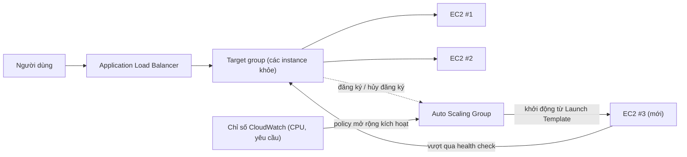

# Chương 7: Nhà Hàng Tăng Trưởng Khi Bận Rộn

Đã là 7:43 tối thứ Sáu.

Ghế của Tom được đẩy lùi lại một chút, theo cách nó trở nên khi anh đang nhìn chằm chằm vào thứ gì đó với loại tập trung có nghĩa là anh sẽ không trả lời nếu bạn nói với anh. Văn phòng đã vắng người một giờ trước. Anh đã ở lại.

Anh có một tab mở vào bảng điều khiển chỉ số mà anh làm mới theo cách những người khác kiểm tra mạng xã hội — theo phản xạ, liên tục, mà không hẳn cố ý.

Cuộc khủng hoảng lưu trữ đã ở phía sau họ. Cơ sở dữ liệu có đĩa riêng của nó. Các ảnh sống trong S3. Trong hai tuần, hệ thống đã ổn định — không thú vị, chỉ ổn định. Điều đó đáng lẽ phải cảm thấy tốt.

Rồi tỷ lệ lỗi vượt qua 12%.

"Leo," Tom nói.

Leo đã đang nhìn. Thời gian phản hồi: đang leo lên. Các yêu cầu xếp hàng: đang leo lên. EC2 instance đơn lẻ — ngay cả sau bài tập định cỡ đúng cẩn thận của tháng trước — đang ở 94% CPU.

"Chúng ta đang từ chối khách hàng," Tom nói.

"Chúng ta không từ chối họ," Leo nói. "Máy chủ đang làm vậy."

"Đó là cùng một thứ."

Đúng vậy. Và nó đã xảy ra mỗi thứ Sáu trong ba tuần. Nimbus đã sống sót qua cuộc khủng hoảng lưu trữ — cơ sở dữ liệu có đĩa riêng của nó, các ảnh sống trong S3 — nhưng ổn định và có thể mở rộng là những vấn đề hoàn toàn khác nhau. Hệ thống hoạt động. Nó chỉ không phát triển.

Một tin nhắn Slack xuất hiện từ Maya: *bảng điều khiển nói đơn hàng giảm 40% so với thứ Sáu tuần trước. chuyện gì đang xảy ra?*

Tom trả lời: *máy chủ đầy công suất. đang xử lý.*

Ba phút trôi qua.

Maya: *chúng ta có một chủ nhà hàng gọi đường dây hỗ trợ nói ứng dụng bị hỏng.*

Leo đặt tay lên bàn phím. Anh đang định cỡ lại instance — phiên bản thủ công của cách sửa, cái đòi hỏi dừng máy chủ và thay đổi loại instance. Có nghĩa là ngừng hoạt động.

"Việc khởi động lại sẽ mất bao lâu?" Tom hỏi.

"Bảy phút," Leo nói.

"Chúng ta sẽ có thêm bảy phút sự cố vào một tối thứ Sáu," Tom nói. Anh không hỏi. Anh gõ một tin nhắn Slack cho Maya. Cô trả lời bằng một ký tự duy nhất: *k*

Việc khởi động lại hoàn tất. Instance trở lại. CPU giảm xuống 60%. Tỷ lệ lỗi giảm. Tom theo dõi các chỉ số trong mười lăm phút mà không nói.

Lúc 9:15, lưu lượng giảm. Cuộc khủng hoảng kết thúc.

Leo nhìn tay mình, vốn đã run nhẹ lúc 8 giờ tối và giờ không còn nữa.

"Chúng ta không thể làm điều đó mỗi thứ Sáu," anh nói.

"Không," Tom nói. "Chúng ta không thể."

Nhóm cần hệ thống của họ xử lý tải biến đổi một cách tự động. Không phải mua đủ máy chủ cho trường hợp xấu nhất và lãng phí tiền trong những lúc yên ắng. Và không phải loay hoay thủ công khi các đợt tăng lưu lượng đột ngột tấn công.

Có một mẫu cho điều này. AWS có hai dịch vụ triển khai nó.

**Khái Niệm: Mở Rộng Ngang**

Có hai cách để làm cho một hệ thống xử lý nhiều tải hơn.

**Mở rộng dọc** có nghĩa là làm cho máy chủ đơn lẻ lớn hơn. Nhiều CPU hơn. Nhiều RAM hơn. Chúng ta đã làm điều này ở Chương 4 khi chúng ta nâng cấp từ `t3.micro` lên `t3.large`. Nó giúp ích. Nhưng nó có giới hạn: bạn chỉ có thể lớn đến mức đó, instance phải khởi động lại để định cỡ lại, và bạn vẫn có một điểm lỗi đơn lẻ.

**Mở rộng ngang** có nghĩa là thêm nhiều máy chủ hơn. Thay vì một máy chủ lớn, chạy năm máy chủ vừa. Khi lưu lượng giảm, chạy hai. Khi nó tăng vọt, chạy mười.

Mở rộng ngang có những lợi thế mà mở rộng dọc không có:

- Không có điểm lỗi đơn lẻ. Nếu một máy chủ chết, những cái khác tiếp tục phục vụ.
- Không cần khởi động lại để thêm công suất.
- Chỉ trả tiền cho những gì bạn đang sử dụng — thêm máy chủ khi bạn cần, gỡ khi bạn không cần.
- Mở rộng tuyến tính: gấp đôi máy chủ, gần gấp đôi thông lượng.

Cũng có một chiều độ tin cậy mà mở rộng dọc không thể sánh kịp. Khi bạn có năm máy chủ và một cái thất bại, công suất của bạn giảm xuống 80% — đủ để tiếp tục phục vụ lưu lượng trong khi instance thất bại được thay thế. Khi bạn có một máy chủ và nó thất bại, công suất giảm xuống 0%. Dự phòng là nội tại đối với mở rộng ngang theo một cách mà mở rộng dọc không thể cung cấp ở bất kỳ kích cỡ nào.

Điều này cũng quan trọng cho bảo trì. Khi một bản vá bảo mật đòi hỏi một lần khởi động lại máy chủ, mở rộng ngang cho phép bạn khởi động lại các instance từng cái một — các lần khởi động lại luân phiên duy trì tính liên tục của dịch vụ. Một máy chủ lớn đơn lẻ đòi hỏi hoặc chấp nhận ngừng hoạt động trong khi khởi động lại hoặc triển khai độ phức tạp triển khai blue/green.

Điểm khó khăn: nếu bạn có nhiều máy chủ, làm sao người dùng biết nói chuyện với cái nào?

Và có một ràng buộc thiết kế mà mở rộng ngang áp đặt: ứng dụng của bạn phải có thể chạy trên nhiều máy chủ giống hệt đồng thời mà không có các máy chủ can thiệp lẫn nhau. Đây là yêu cầu **stateless** (không trạng thái) — mỗi yêu cầu phải tự chứa, không phụ thuộc vào trạng thái được lưu trữ trên một máy chủ cụ thể. Chúng ta sẽ thấy chính xác tại sao điều này quan trọng khi chúng ta gặp vấn đề sticky session.

**Application Load Balancer: Một Cửa, Nhiều Phòng**

Hãy nghĩ về một nhà hàng lớn với một quầy tiếp đón ở cửa. Thực khách đến và người tiếp đón hướng họ đến một bàn còn trống. Người tiếp đón biết bàn nào bận và bàn nào trống. Thực khách không cần biết có bao nhiêu bàn — họ chỉ bước vào và người tiếp đón xử lý việc phân phối.

Một **Application Load Balancer** (ALB) làm điều này với các yêu cầu web.

Người dùng kết nối đến bộ cân bằng tải. Bộ cân bằng tải phân phối các yêu cầu đến trên đội EC2 instance của bạn. Mỗi người dùng thấy một địa chỉ (URL của bộ cân bằng tải). Đằng sau địa chỉ đó, các yêu cầu được trải ra trên bao nhiêu máy chủ đang chạy.

Bản thân ALB chạy trên cơ sở hạ tầng do AWS quản lý, được phân tán trên nhiều AZ trong Region của bạn. Nó không phải một máy chủ đơn lẻ — nó là một dịch vụ phân tán, được quản lý. Khi bạn bật cross-zone load balancing (mặc định cho các ALB), mỗi nút ALB phân phối các yêu cầu đều trên tất cả các target đã đăng ký bất kể chúng ở AZ nào. Điều này ngăn chế độ lỗi phổ biến nơi một AZ có gấp đôi số instance khỏe so với một cái khác, dẫn đến tải không đều.

Nó nhận mỗi yêu cầu HTTP đến và quyết định EC2 instance nào (gọi là một **target**) nên xử lý nó, dựa trên các yếu tố như:

- Round-robin (mỗi máy chủ có lượt theo vòng quay)
- Least outstanding requests (máy chủ với ít yêu cầu đang xử lý nhất nhận yêu cầu tiếp theo)
- Sức khỏe — chỉ các target khỏe nhận lưu lượng

**Health check** (kiểm tra sức khỏe) là thiết yếu. ALB thường xuyên gửi các yêu cầu kiểm tra đến mỗi target. Nếu một target không phản hồi đúng, ALB đánh dấu nó không khỏe và ngừng gửi lưu lượng đến nó. Khi target khôi phục, lưu lượng tiếp tục.

Điều này tự động. Bạn cấu hình các tham số kiểm tra sức khỏe; ALB thực thi chúng.

Bạn cấu hình các kiểm tra sức khỏe với ba tham số chính: **đường dẫn** để kiểm tra (ví dụ, `/health`), **khoảng thời gian** (kiểm tra thường xuyên thế nào — mỗi 5 đến 300 giây; mặc định 30), và **ngưỡng** (bao nhiêu kiểm tra thành công hoặc thất bại liên tiếp trước khi thay đổi trạng thái sức khỏe của target).

Các khoảng thời gian kiểm tra sức khỏe quyết liệt bắt các vấn đề nhanh hơn nhưng thêm nhiều lưu lượng vào các target. Một khoảng thời gian 30 giây với một ngưỡng 3 lần thất bại có nghĩa là một target thất bại được gỡ khỏi vòng quay trong vòng 90 giây. Một khoảng thời gian 10 giây với một ngưỡng 2 lần thất bại có nghĩa là gỡ trong vòng 20 giây — với chi phí nhiều lưu lượng kiểm tra sức khỏe hơn.

Đối với Nimbus, Priya chọn một khoảng thời gian 30 giây với một ngưỡng 3 lần thất bại (90 giây để tuyên bố không khỏe) và 2 lần thành công (60 giây để tuyên bố khỏe lại sau khi khôi phục). Điều này cân bằng phát hiện thất bại nhanh với việc tránh các dương tính giả từ các sự cố mạng ngắn.

**Cấu Hình Health Check: Hơn Là "Nó Còn Sống Không?"**

Health check đầu tiên của Leo là một ping TCP đơn giản: "Cổng 80 có chấp nhận kết nối không?" Đó là tối thiểu. Máy chủ có thể chấp nhận kết nối trên cổng 80 trong khi cơ sở dữ liệu sập, trong khi ứng dụng đang trong một vòng lặp lỗi, trong khi đĩa đầy.

Priya có một quan điểm khác về ý nghĩa của "khỏe."

"Chúng ta đã nghĩ về chuyện gì xảy ra nếu health check vượt qua nhưng ứng dụng bị hỏng chưa?" cô hỏi. "Một máy chủ có thể chấp nhận kết nối nhưng không thể truy vấn cơ sở dữ liệu thì không khỏe. Nó chỉ phản hồi."

Leo xây dựng một endpoint `/health` trong mã ứng dụng. Endpoint làm ba việc:
1. Xác nhận quy trình ứng dụng đang chạy
2. Thực hiện một truy vấn kiểm tra đến cơ sở dữ liệu (một `SELECT 1` đơn giản)
3. Xác nhận kết nối S3 có thể truy cập

Nếu cả ba vượt qua, endpoint trả về HTTP 200. Nếu bất kỳ cái nào thất bại, nó trả về HTTP 503.

Health check ALB được cấu hình để gọi endpoint này mỗi 30 giây. Nếu nó nhận ba phản hồi 503 liên tiếp, instance được đánh dấu không khỏe và gỡ khỏi vòng quay.

"Điều đó có nghĩa là nếu cơ sở dữ liệu sập," Priya nói, "health check sẽ bắt nó và gỡ các máy chủ bị ảnh hưởng khỏi bộ cân bằng tải trong vòng 90 giây."

"Ngay cả khi bản thân các máy chủ vẫn đang chạy," Tom nói.

"Ngay cả khi chúng trông ổn từ bên ngoài."

ALB, được trỏ vào một health check ứng dụng thực, trở thành một bộ phát hiện đáng tin cậy hơn nhiều về các vấn đề thực tế — không chỉ sự sống còn của máy chủ.

**Auto Scaling: Nhà Hàng Mở Thêm Bàn**

Một ALB phân phối lưu lượng trên các máy chủ hiện có của bạn. Nhưng nó không thêm máy chủ khi bạn cần nhiều hơn.

**Auto Scaling** làm vậy.

Một **Auto Scaling Group** (ASG) là một cấu hình nói với AWS:

- Số lượng instance tối thiểu luôn có đang chạy
- Số lượng instance tối đa được phép
- Các điều kiện mà dưới đó nên mở rộng ra (thêm instance) hoặc mở rộng vào (gỡ chúng)

Các điều kiện mở rộng được gọi là **policy**. Bốn loại phổ biến nhất:

**Target tracking**: "Giữ mức sử dụng CPU trung bình ở 70%." Khi CPU trung bình vượt 70%, AWS khởi động các instance mới. Khi nó giảm xuống dưới, các instance bị chấm dứt. Đây là policy đơn giản nhất và được khuyến nghị nhất cho hầu hết các khối lượng công việc — đặt một chỉ số mục tiêu và để AWS tìm ra cần bao nhiêu instance. Mục tiêu có thể là mức sử dụng CPU, số lượng yêu cầu mỗi target, hoặc bất kỳ chỉ số CloudWatch tùy chỉnh nào.

**Step scaling**: Định nghĩa các ngưỡng cụ thể với các phản ứng cụ thể. "Khi CPU vượt 60%, thêm 1 instance. Khi CPU vượt 80%, thêm 3 instance. Khi CPU giảm xuống dưới 30%, gỡ 1 instance." Kiểm soát chi tiết hơn target tracking, nhưng đòi hỏi nhiều cấu hình và điều chỉnh liên tục hơn.

**Scheduled scaling**: "Lúc 6:45 tối mỗi thứ Sáu, đảm bảo ít nhất 4 instance đang chạy." Đây là mở rộng chủ động cho các sự kiện có thể đoán trước. Nó hoạt động cùng với mở rộng phản ứng — hành động được lập lịch đặt một sàn, và target tracking thêm các instance trên sàn đó khi cần.

**Predictive scaling**: phiên bản học máy của cùng ý tưởng. Thay vì bạn viết lịch trình, Auto Scaling phân tích lên đến hai tuần tải lịch sử và dự báo 48 giờ tiếp theo, khởi động công suất *trước* sự gia tăng được dự đoán. Đối với lưu lượng theo chu kỳ — một giờ cao điểm bữa tối mỗi thứ Sáu, một thị trường mở mỗi ngày trong tuần — predictive scaling khám phá mẫu và làm nóng trước tự động, và tiếp tục điều chỉnh khi mẫu trôi đi. Kích hoạt thi: "các đợt tăng lưu lượng định kỳ/theo chu kỳ; các instance phải sẵn sàng *trước* đợt tăng" → predictive scaling. (Scheduled scaling là câu trả lời thủ công; predictive là cái được học. Cả hai đánh bại mở rộng chỉ-phản-ứng, luôn tụt sau đợt tăng bởi thời gian khởi động instance.)

Đối với Nimbus, sự kết hợp là: target tracking cho mở rộng phản ứng (giữ CPU ở 65%), cộng một hành động scheduled scaling mỗi thứ Sáu lúc 6:45 tối để làm nóng trước 2 instance bổ sung trước giờ cao điểm bữa tối.

Điều này tự động. Không ai phải theo dõi các chỉ số. Không ai phải khởi động máy chủ thủ công. Hệ thống phản ứng với tải theo thời gian thực.

Priya xem điều này xảy ra trực tiếp trong một giờ cao điểm thứ Sáu lần đầu tiên. Số lượng máy chủ đi từ 2 đến 5 trong mười lăm phút, rồi trở lại 2 sau giờ cao điểm.

"Đó," cô nói, "thực sự ấn tượng."

Tom đang theo dõi biểu đồ chi phí thay vào đó. Hóa đơn tăng trong giờ cao điểm và giảm sau. "Chúng ta chỉ trả cho những gì chúng ta sử dụng," anh nói, ấn tượng không kém. "Cái đó tốn bao nhiêu mỗi tháng, tính trung bình qua một tuần bình thường?"

Leo mở trình tính. Các đỉnh thứ Sáu thêm có lẽ 15% vào hóa đơn hàng tháng. Không có Auto Scaling, họ sẽ cần cấp phát cho đỉnh cả tuần. Sự khác biệt: khoảng 120 đô la/tháng lãng phí trên công suất đỉnh nhàn rỗi, so với 0 đô la lãng phí với Auto Scaling được cấu hình đúng.

Có một sự tinh tế trong scale-in mà các nhóm thường bỏ lỡ: **scale-in protection** (bảo vệ khỏi scale-in). Bạn có thể cấu hình các instance cụ thể trong một ASG để được bảo vệ khỏi scale-in — có nghĩa là chúng sẽ không bị chấm dứt trong các sự kiện scale-in tự động. Điều này hữu ích cho các instance đang ở giữa quá trình xử lý một công việc chạy dài mà bạn không muốn bị gián đoạn. Mã ứng dụng cũng có thể đặt bảo vệ instance theo chương trình khi nó bắt đầu một công việc dài và gỡ bảo vệ khi công việc hoàn thành. Điều này ngăn ASG kéo tấm thảm ra khỏi công việc đang hoạt động.

**Warm Pool: Không Phải Mọi Thứ Cần Khởi Động Lạnh**

Thứ Sáu mà Auto Scaling lần đầu kích hoạt, Tom tính thời gian từ "CPU vượt ngưỡng" đến "các instance mới phục vụ lưu lượng" mất bao lâu.

Bốn phút hai mươi giây.

"Đó là bốn phút nơi chúng ta thiếu công suất," anh nói.

"Chúng ta có thể tăng số lượng instance tối thiểu," Leo nói.

"Điều đó có nghĩa là trả tiền cho các instance nhàn rỗi cả tuần," Tom nói.

Có một điểm trung gian: **Warm Pool**.

Một Warm Pool là một nhóm EC2 instance được khởi tạo trước ngồi ở trạng thái dừng, đã khởi động, đã cấu hình, đã qua script UserData. Chúng đã làm mọi thứ ngoại trừ bắt đầu phục vụ lưu lượng.

Khi Auto Scaling Group quyết định mở rộng ra, thay vì khởi động một instance lạnh mới từ đầu (mất ba đến năm phút để khởi động, chạy UserData, và vượt qua các kiểm tra sức khỏe), nó khởi động một instance từ Warm Pool. Khởi động một instance bị dừng mất khoảng 30 đến 60 giây.

Đối với mẫu thứ Sáu của Nimbus — một đợt tăng đã biết, có thể đoán trước bắt đầu khoảng 7 giờ tối — Priya cấu hình một Warm Pool gồm hai instance để duy trì trong giờ kinh doanh. Đến 6:45 tối, hai instance ấm ngồi sẵn sàng, dừng nhưng được khởi tạo. Khi lưu lượng leo lên lúc 7 giờ tối và ASG cần mở rộng, các instance ấm khởi động trong dưới một phút và gia nhập đội.

"Warm Pool tốn bao nhiêu?" Tom hỏi.

Một EC2 instance bị dừng không trả tiền cho tính toán — nhưng nó trả tiền cho lưu trữ EBS được gắn. Hai instance `t3.small` trong một Warm Pool: khoảng 4 đô la/tháng chi phí lưu trữ. Cải thiện trong thời gian scale-out từ bốn phút xuống dưới một phút đáng giá 4 đô la/tháng vào một tối thứ Sáu.

**ALB Path-Based Routing**

Khi Nimbus phát triển, Leo thêm một thành phần thứ hai: một dịch vụ API riêng cho quản lý nhà hàng. Các chủ nhà hàng truy cập dịch vụ này qua cùng domain nhưng ở một đường dẫn URL khác: `/api/restaurant/` thay vì `/`.

"Khoan đã — nhưng *tại sao* chúng ta lại làm theo cách đó?" Maya hỏi. "Tại sao không cho API quản lý nhà hàng một domain hoàn toàn khác?"

"Chúng ta có thể," Leo nói. "Nhưng rồi chúng ta sẽ cần một chứng chỉ thứ hai, một bộ cân bằng tải thứ hai, một mục DNS thứ hai. Path-based routing xử lý nó với một chứng chỉ, một bộ cân bằng tải."

ALB hỗ trợ điều này một cách gốc. Một **quy tắc path-based routing** nói với ALB: khi URL bắt đầu bằng `/api/restaurant/`, định tuyến yêu cầu đến target group quản lý nhà hàng. Khi URL bắt đầu bằng bất cứ thứ gì khác, định tuyến nó đến target group ứng dụng hướng tới khách hàng.

Hai đội EC2 instance riêng biệt. Một bộ cân bằng tải. Lưu lượng được định hướng theo đường dẫn URL.

"Vậy chúng ta có thể mở rộng API quản lý nhà hàng độc lập với ứng dụng hướng tới khách hàng?" Maya hỏi.

"Chính xác," Leo nói. "Nếu các chủ nhà hàng đang làm nhiều cập nhật thực đơn, các máy chủ API đó mở rộng. Nếu các khách hàng đang đặt hàng nhiều, các máy chủ đó mở rộng. Chúng không ảnh hưởng lẫn nhau."

Maya ngồi với điều này. "Và chúng ta chỉ trả cho một ALB thay vì hai."

"Đúng," Tom nói. Anh có một con số. "ALB tốn khoảng 20 đô la một tháng phí cơ bản cộng các khoản phí xử lý dữ liệu. Một ALB xử lý cả hai khối lượng công việc so với hai cái riêng biệt: khoảng 20 đô la tiết kiệm mỗi tháng. Và chúng ta tránh quản lý nhiều chứng chỉ và bản ghi DNS."

"Nhưng," Priya nói, "nếu bản thân ALB sập, cả hai dịch vụ cùng sập."

"AWS thiết kế ALB để có tính khả dụng cao trên nhiều AZ," Leo nói. "Rủi ro thất bại ALB rất thấp so với độ phức tạp của việc duy trì hai bộ cân bằng tải riêng biệt."

Priya ghi lại điều này dưới "sự đánh đổi được chấp nhận, được ghi chép."

**Cách ALB và ASG Hoạt Động Cùng Nhau**

Hai dịch vụ được thiết kế để được sử dụng cùng nhau.

Bạn đặt ALB ở phía trước. ALB trỏ đến một **target group** — một tập hợp các instance nên nhận lưu lượng. Auto Scaling Group quản lý các instance đó: nó thêm chúng vào target group khi mở rộng ra, gỡ chúng khi mở rộng vào.

Luồng:

1. Lưu lượng đến ALB
2. ALB phân phối các yêu cầu đến các target khỏe
3. CPU/tải leo lên trên các target đó
4. ASG phát hiện sự tăng tải, khởi động các instance mới
5. Các instance mới vượt qua các kiểm tra sức khỏe, được đăng ký với ALB
6. ALB bắt đầu gửi lưu lượng đến chúng
7. Tải giảm, ASG chấm dứt các instance thừa
8. ALB ngừng gửi lưu lượng đến các instance bị chấm dứt

Điều này xảy ra mà không có bất kỳ can thiệp nào của con người.

**Launch Template: Bản Thiết Kế Cho Các Instance Mới**

Khi ASG khởi động một instance mới, nó cần biết phải khởi động cái gì. Điều này được định nghĩa trong một **Launch Template** — một AMI, một loại instance, các security group để áp dụng, và bất kỳ user data nào (các script khởi động chạy khi instance khởi động).

Một mẫu phổ biến: bạn xây dựng ứng dụng của mình vào một AMI tùy chỉnh (xem Chương 4). Khi ASG cần một instance mới, nó khởi động AMI đó. Instance mới khởi động với ứng dụng của bạn đã được cài đặt. Không cần thiết lập thủ công.

Đối với các môi trường động hơn, bạn cũng có thể sử dụng các **script user data** kéo và cài đặt phiên bản mới nhất của mã của bạn khi khởi động. Điều này linh hoạt hơn nhưng mất lâu hơn để khởi động.

Lựa chọn đúng phụ thuộc vào việc các instance của bạn cần khởi động bao lâu và ứng dụng của bạn thay đổi thường xuyên thế nào.

**Sticky Session: Một Vấn Đề Tinh Vi**

Đây là một thứ làm vấp ngã nhiều nhóm khi họ lần đầu triển khai cân bằng tải.

Một số ứng dụng web lưu trữ dữ liệu phiên — trạng thái đăng nhập, nội dung giỏ hàng — trên chính máy chủ (trong bộ nhớ hoặc trên đĩa cục bộ). Điều này hoạt động tốt với một máy chủ. Với nhiều máy chủ, nó hỏng.

Một người dùng đăng nhập. Yêu cầu đi đến Máy chủ A. Máy chủ A lưu trữ phiên. Yêu cầu tiếp theo đi đến Máy chủ B. Máy chủ B không có phiên. Người dùng có vẻ đã đăng xuất.

Điều này có thể được giải quyết theo hai cách:

**Sticky session** (hoặc session affinity): Cấu hình ALB để luôn gửi các yêu cầu từ cùng một người dùng đến cùng một máy chủ. Đây là một cách sửa ngắn hạn. Nó làm suy yếu cân bằng tải (một số máy chủ nhận nhiều người dùng "dính" hơn những cái khác) và tạo ra các vấn đề khi một instance bị chấm dứt.

Maya nhìn trang cấu hình sticky session. "Nếu chúng ta ghim người dùng vào các máy chủ cụ thể, chuyện gì xảy ra khi những máy chủ đó bị chấm dứt trong scale-in?"

"Họ mất phiên của họ," Leo nói.

"Vậy sticky session chỉ trì hoãn vấn đề."

"Đúng," Priya nói. "Cách sửa thực sự là thiết kế ứng dụng không trạng thái."

**Thiết kế ứng dụng không trạng thái**: Lưu trữ dữ liệu phiên bên ngoài — trong một cơ sở dữ liệu hoặc một bộ nhớ đệm như ElastiCache (Chương 10). Mỗi máy chủ có thể xây dựng lại phiên của bất kỳ người dùng nào từ kho lưu trữ bên ngoài. Các máy chủ trở nên có thể hoán đổi cho nhau. Đây là cách tiếp cận đúng cho các ứng dụng có thể mở rộng ngang.

Priya gọi đây là "quyết định kiến trúc quan trọng nhất bạn đưa ra khi bạn chuyển sang đa máy chủ." Cô đúng. Chúng ta gặp lại nó ở Chương 10.

**Nếu Sticky Session Thì Ít Phức Tạp Hơn Nhưng Nhiều Rủi Ro Hơn**

Nếu bạn sử dụng sticky session để giải quyết vấn đề trạng thái phiên, thì bạn giảm nhu cầu thiết lập lưu trữ phiên bên ngoài trong ngắn hạn — nhưng khi một máy chủ dính bị chấm dứt trong scale-in, tất cả người dùng bị ràng buộc với nó mất phiên của họ cùng một lúc. Thất bại không từ từ; nó đột ngột và ảnh hưởng đến một cụm người dùng đồng thời. Nếu bạn ngoại hóa trạng thái phiên, bạn thêm một sự phụ thuộc (ElastiCache hoặc một cơ sở dữ liệu) nhưng loại bỏ chế độ thất bại đột ngột đó. Đối với bất kỳ ứng dụng nào mở rộng đều đặn, khoản đầu tư vào thiết kế không trạng thái tự trả cho mình lần đầu tiên Auto Scaling chấm dứt một instance với các phiên đang hoạt động trên nó.

**Phép Tính Chi Phí Của Tom**

Tuần sau, Tom xây dựng một mô hình chi phí cho thiết lập ALB và ASG.

ALB: khoảng 20 đô la/tháng cơ bản cộng các khoản phí xử lý dữ liệu. Ở khối lượng lưu lượng của Nimbus: khoảng 22 đô la/tháng.

Bản thân Auto Scaling Group: không có chi phí bổ sung. Bạn trả tiền cho các instance nó chạy, nhưng những instance đó sẽ tồn tại bất kể. ASG miễn phí; bạn trả tiền cho tính toán.

Warm Pool: khoảng 4 đô la/tháng lưu trữ EBS cho hai instance bị dừng.

Tổng chi phí cơ sở hạ tầng bổ sung: khoảng 26 đô la/tháng, hoặc 312 đô la/năm.

Tom rồi nhìn nhật ký sự cố từ ba thứ Sáu trước khi ALB và ASG được đặt vào chỗ. Mỗi sự cố đã tốn cho Nimbus khoảng 40% doanh thu thứ Sáu trong cửa sổ sự cố. Doanh thu thứ Sáu trung bình: khoảng 2.400 đô la. 40% của 2.400 đô la là 960 đô la mỗi sự cố. Ba sự cố: khoảng 2.880 đô la doanh thu mất trong ba tuần.

"ALB và ASG tốn 312 đô la một năm," Tom nói. "Ba thứ Sáu tồi tệ tốn cho chúng ta gần 3.000 đô la. Và đó chỉ là mất doanh thu trực tiếp — không phải sự rời bỏ của khách hàng từ những người ngừng sử dụng Nimbus sau một trải nghiệm tồi."

Maya đọc các con số. "Chạy cơ sở hạ tầng."

"Đã chạy rồi," Leo nói.

## Khi ALB Không Đủ: NLB Và GWLB

Leo đang rà soát tích hợp IoT mà Nimbus đã âm thầm thêm cho các đối tác nhà hàng — các cảm biến nhiệt độ nhỏ trong các tủ lạnh đi vào gửi các kết quả đo cho Nimbus mỗi ba mươi giây, để các quản lý bếp có thể nhận cảnh báo nếu một tủ lạnh trôi trên nhiệt độ an toàn.

"Khoan," Leo nói. "Các cảm biến này đang gửi các gói UDP."

"Đó có phải vấn đề không?" Maya hỏi.

"ALB không hỗ trợ UDP," Leo nói. "ALB hiểu HTTP. Vậy thôi."

Priya đã đang nhìn tài liệu. "Đó là cái Network Load Balancer dành cho."

**Network Load Balancer (NLB)** hoạt động ở Layer 4 — lớp transport. Nó định tuyến các gói TCP và UDP. Nó không kiểm tra nội dung của các gói đó, không hiểu các header HTTP, không làm path-based routing. Cái nó làm là di chuyển các gói từ các client đến các target ở tốc độ phi thường.

- **Hàng triệu yêu cầu mỗi giây với độ trễ mili giây một chữ số.** ALB xử lý HTTP ở Layer 7, có nghĩa là nó phân tích các header, đánh giá các quy tắc định tuyến, và kết thúc các kết nối TLS. NLB không làm bất kỳ điều đó — nó gần với một người điều hướng giao thông tốc độ cao hơn một web proxy.
- **Bảo toàn địa chỉ IP nguồn của client.** Khi một ALB nhận một kết nối, nó kết thúc nó và mở một cái mới đến target — EC2 instance của bạn thấy IP của ALB, không phải của người dùng. NLB không làm điều này; IP nguồn của gói đến target không thay đổi. Nếu ứng dụng của bạn cần biết các yêu cầu đến từ đâu — cho định vị địa lý, giới hạn tốc độ, hoặc phát hiện gian lận — và bạn cần nó chính xác, NLB là lựa chọn đúng. (ALB thêm một header `X-Forwarded-For` mang IP gốc, nhưng điều đó đòi hỏi ứng dụng đọc header; NLB đặt IP thực trực tiếp vào gói.)
- **Các địa chỉ IP tĩnh và Elastic IP.** Các địa chỉ IP của ALB thay đổi theo thời gian — AWS quản lý chúng và chúng không cố định. NLB hỗ trợ các IP tĩnh mỗi Availability Zone, và bạn có thể gán các Elastic IP cho những cái đó. Nếu các hệ thống hạ nguồn cần whitelist một địa chỉ IP cụ thể để cho phép lưu lượng từ bộ cân bằng tải của bạn — một yêu cầu phổ biến trong dịch vụ tài chính hoặc quản lý thiết bị IoT — NLB là lựa chọn duy nhất. ALB không thể làm điều này.
- **TLS pass-through.** NLB có thể chuyển lưu lượng TLS được mã hóa trực tiếp đến các target mà không giải mã nó. Target kết thúc TLS. Điều này hữu ích khi các yêu cầu tuân thủ nói việc giải mã phải xảy ra trên một thiết bị cụ thể, hoặc khi bạn không muốn quản lý các chứng chỉ TLS trên bộ cân bằng tải.

"Nếu NLB nhanh như vậy," Maya hỏi, "tại sao chúng ta không chỉ sử dụng nó cho mọi thứ?"

"Vì nó ngốc nghếch," Leo nói. "Theo nghĩa tốt nhất. NLB không biết HTTP là gì. Nó không thể làm path-based routing. Nó không thể chuyển hướng HTTP sang HTTPS. Nó không thể thêm các security header. Nó không thể tích hợp với WAF. Đối với một ứng dụng web — bất cứ thứ gì nói HTTP — sự nhận thức Layer 7 của ALB là cái làm cho tất cả các tính năng đó khả thi. Đối với dữ liệu cảm biến, là UDP, chúng ta không có lựa chọn."

"Và cho lưu lượng web của chúng ta?"

"ALB, giống như trước."

"Cái đó tốn bao nhiêu mỗi tháng?" Tom hỏi. "NLB rẻ hơn không?"

Mô hình giá giống với ALB: một khoản phí hàng giờ cơ bản cộng một khoản phí mỗi Load Balancer Capacity Unit (LCU) dựa trên lưu lượng được xử lý. Ở các khối lượng lưu lượng tương đương, chi phí có thể so sánh. Đối với trường hợp sử dụng IoT của Nimbus — dữ liệu cảm biến khối lượng thấp — chi phí NLB sẽ dưới 20 đô la/tháng.

**Gateway Load Balancer (GWLB)** là một con vật hoàn toàn khác. Nó hoạt động ở Layer 3 — cấp gói IP — và nó tồn tại cho một mục đích cụ thể: chèn các thiết bị mạng ảo của bên thứ ba vào luồng lưu lượng của bạn.

Hãy tưởng tượng Nimbus phát triển đến một kích cỡ nơi nhóm bảo mật của họ yêu cầu tất cả lưu lượng đi vào và rời khỏi các VPC của họ phải đi qua một thiết bị tường lửa thương mại — một máy ảo chạy phần mềm từ một nhà cung cấp như Palo Alto hoặc Fortinet. Không có GWLB, bạn sẽ phải định tuyến lưu lượng qua các thiết bị đó một cách thủ công và tìm ra cách mở rộng chúng và giữ chúng có tính khả dụng cao. Với GWLB, bạn cấu hình thiết bị như một target, và tất cả lưu lượng được định tuyến trong suốt qua nó sử dụng giao thức GENEVE. Ứng dụng không biết lưu lượng đang được kiểm tra. Tường lửa không cần biết cấu trúc liên kết mạng. GWLB xử lý định tuyến, mở rộng, và failover.

Đối với hầu hết các ứng dụng web ở các giai đoạn đầu và giữa — bao gồm Nimbus — GWLB không phải là một dịch vụ bạn sẽ cấu hình. Nhưng cho kỳ thi, và cho ngày khi một yêu cầu bảo mật đòi hỏi kiểm tra cấp mạng, bạn sẽ biết nó dành cho gì.

Leo thêm một NLB cho endpoint cảm biến chiều hôm đó. Dữ liệu nhiệt độ bắt đầu chảy.

"Nhà hàng đầu tiên nhận một cảnh báo rằng tủ lạnh đi vào của họ ở 47 độ," anh nói. "Đó là trên ngưỡng an toàn."

"Nó có thực sự ở 47 độ không?" Maya hỏi.

"Chủ nhà hàng xác nhận. Họ gọi một kỹ thuật viên sửa chữa cùng chiều hôm đó."

Priya viết điều này vào nhật ký tác động khách hàng của Nimbus. Không phải một sự kiện bảo mật. Chỉ là tính năng IoT hoạt động.

**Ba Bộ Cân Bằng Tải, Cạnh Nhau**

AWS cung cấp ba loại bộ cân bằng tải. ALB xử lý HTTP và HTTPS ở Layer 7 — nó hiểu giao thức, vậy nên nó có thể định tuyến dựa trên đường dẫn URL (`/api` đến một nhóm, `/static` đến một nhóm khác), các header host, và các tham số truy vấn. Đây là cái mà hầu hết các ứng dụng web sử dụng, và đó là cái Nimbus sử dụng cho lưu lượng web của nó.

ALB cũng kết thúc các kết nối TLS — các chứng chỉ SSL/HTTPS được cài đặt trên bộ cân bằng tải, không phải trên mỗi EC2 instance riêng lẻ. ALB giải mã yêu cầu, kiểm tra các header HTTP, định tuyến dựa trên các quy tắc, và (tùy chọn) mã hóa lại trước khi chuyển tiếp đến target. Điều này đơn giản hóa quản lý chứng chỉ đáng kể: bạn quản lý một chứng chỉ trên ALB thay vì một chứng chỉ trên mỗi instance.

NLB, như nhóm thấy với các cảm biến nhiệt độ, xử lý TCP, UDP, và TLS ở Layer 4 — tốc độ thô, bảo toàn IP nguồn, các IP tĩnh. GWLB ngồi ở Layer 3 để luồn lưu lượng qua các thiết bị bên thứ ba như tường lửa và các hệ thống phát hiện xâm nhập — hiếm khi cần ở cấp độ cấp thấp.

Đối với Nimbus (và cho hầu hết các ứng dụng web), ALB là lựa chọn đúng.

Bạn có thể đang tự hỏi: bạn có thể sử dụng cả ALB và NLB cho cùng một ứng dụng không? Có. Một mẫu phổ biến là NLB trước ALB — NLB xử lý kết thúc TCP thô ở rìa, ALB xử lý định tuyến HTTP đằng sau nó. Điều này thêm độ phức tạp và chi phí, và không cần thiết cho hầu hết các ứng dụng web.

**ALB so với NLB cho kỳ thi**: Yếu tố phân biệt chính là Layer 7 so với Layer 4. Nếu tình huống thi đề cập đến định tuyến dựa trên URL, định tuyến dựa trên host, kiểm tra header HTTP, hoặc WebSocket — đó là ALB. Nếu nó đề cập đến TCP pass-through, bảo toàn IP nguồn, hàng triệu yêu cầu mỗi giây, hoặc độ trễ cực thấp cho các giao thức không phải HTTP — đó là NLB. Khi một tình huống chỉ nói "bộ cân bằng tải cho một ứng dụng web," câu trả lời gần như luôn là ALB.

## Điểm Mạnh Và Hạn Chế

**Tại sao ALB + Auto Scaling mạnh mẽ**:

- Mở rộng không ngừng hoạt động (các instance được thêm/gỡ mà không làm gián đoạn các kết nối hiện có)
- Failover tự động (các instance không khỏe được gỡ khỏi lưu lượng tự động)
- Hiệu quả chi phí (chỉ trả cho các instance đang chạy)
- Không có điểm lỗi đơn lẻ — nhiều instance trên nhiều AZ

**Nơi nó trở nên phức tạp**:

- Các ứng dụng có trạng thái cần xử lý đặc biệt (sticky session hoặc trạng thái bên ngoài)
- Mở rộng ra mất thời gian — nếu lưu lượng tăng vọt tức thì, có một độ trễ trước khi các
  instance mới sẵn sàng. Giảm thiểu với Warm Pool cho các đỉnh có thể đoán trước hoặc một số lượng tối thiểu cao hơn.
- Nhiều bộ phận chuyển động hơn có nghĩa là nhiều hơn để giám sát và gỡ lỗi
- Một số ứng dụng không thể được mở rộng ngang dễ dàng (cơ sở dữ liệu, một số hệ thống
  cũ nhất định). Mở rộng ngang hoạt động tốt nhất cho các tầng không trạng thái.

## Tóm Tắt

Hai dịch vụ, một mẫu — và mẫu là cái quan trọng. ALB xử lý phân phối; ASG xử lý kích cỡ đội. Cùng nhau chúng biến một thiết lập single-instance mong manh thành một hệ thống có thể hấp thụ lưu lượng bữa tối thứ Sáu mà không cần một con người thức. Chi phí cơ sở hạ tầng 312 đô la/năm so với ba thứ Sáu doanh thu mất (~2.880 đô la) là loại phép toán Tom đặt vào một bảng tính và không bao giờ quên.

- **Mở rộng ngang** (thêm nhiều máy chủ) được ưa thích hơn mở rộng dọc vì nó loại bỏ các điểm lỗi đơn lẻ và cho phép chi phí đàn hồi. Một **Application Load Balancer (ALB)** phân phối lưu lượng HTTP/HTTPS đến và chỉ định tuyến đến các instance khỏe.
- **Các health check nên kiểm tra chức năng ứng dụng thực tế** — một endpoint `/health` xác minh kết nối cơ sở dữ liệu bắt các thất bại thực trước khi khách hàng làm.
- Một **Auto Scaling Group (ASG)** tự động điều chỉnh số lượng EC2 instance dựa trên các policy mở rộng. Target tracking là loại phổ biến nhất; scheduled scaling xử lý các đỉnh có thể đoán trước như giờ cao điểm bữa tối thứ Sáu.
- Các ứng dụng có trạng thái phải ngoại hóa trạng thái phiên thay vì dựa vào sticky session dài hạn. Sticky session là một cách sửa ngắn hạn; ngoại hóa trạng thái là kiến trúc đúng.
- Đối với lưu lượng HTTP/HTTPS, sử dụng ALB. Đối với hiệu năng TCP/UDP thô, sử dụng NLB. ALB path-based routing cho phép một bộ cân bằng tải duy nhất phục vụ nhiều thành phần ứng dụng theo đường dẫn URL.

## Mẹo Thi

*SAA-C03 Domain 2 — Task 2.1 (kiến trúc có thể mở rộng) / Domain 3 — Task 3.2*

- **Các health check ASG có thể đến từ EC2 hoặc ALB.** Các health check EC2 chỉ phát hiện
  nếu instance đang chạy. Các health check ALB phát hiện nếu ứng dụng đang
  phản hồi đúng. Các health check ALB kỹ lưỡng hơn và nên được ưa thích
  cho các ứng dụng web.
- **Target tracking scaling là câu trả lời thi phổ biến nhất** cho các policy mở rộng.
  Simple scaling (thêm N instance khi cảnh báo kích hoạt) cũ hơn và ít thích ứng hơn.
- **Scale-out nhanh; scale-in chậm.** AWS chấm dứt các instance từ từ trong
  scale-in để tránh làm gián đoạn các kết nối đang hoạt động — một hành vi được kiểm soát bởi cài đặt **deregistration delay** của ALB.
- **Số lượng instance tối thiểu là sàn khả năng phục hồi của bạn.** Nếu bạn đặt minimum = 1
  và instance đó thất bại, ứng dụng của bạn sập trước khi ASG có thể phản ứng. Đặt
  minimum ≥ 2 và trải trên các AZ cho khả năng phục hồi thực.
- **ALB có thể phân phối lưu lượng trên các AZ tự động.** Với cross-zone load
  balancing được bật, mỗi nút ALB phân phối các yêu cầu đều trên tất cả các target đã đăng ký
  bất kể AZ. Điều này quan trọng cho tải cân bằng khi số lượng instance AZ
  khác nhau.
- **ALB path-based routing** xuất hiện trên các tình huống thi mô tả nhiều thành phần
  ứng dụng chia sẻ một bộ cân bằng tải duy nhất. Thuật ngữ đúng là "listener rule"
  định tuyến dựa trên các điều kiện đường dẫn URL.
- **Lựa chọn bộ cân bằng tải:** ALB = HTTP/HTTPS, Layer 7, định tuyến đường dẫn/header, WebSocket, tích hợp WAF. NLB = TCP/UDP, Layer 4, hiệu năng cực cao, các IP tĩnh, bảo toàn IP nguồn. GWLB = Layer 3, chèn các tường lửa/thiết bị ảo vào đường lưu lượng. Kích hoạt thi: "giao thức UDP" hoặc "IP tĩnh trên bộ cân bằng tải" → NLB. "Chèn thiết bị tường lửa vào luồng lưu lượng" → GWLB.

## Bài Tập

**Bài tập 1 — Nhớ lại**

Bằng lời của bạn: sự khác biệt giữa một Application Load Balancer và
một Auto Scaling Group là gì? Mỗi cái giải quyết vấn đề gì, và tại sao bạn thường
sử dụng chúng cùng nhau?

*(Gợi ý: Một cái phân phối lưu lượng đã tồn tại; cái kia điều chỉnh bao nhiêu
công suất bạn có.)*

**Bài tập 2 — Tình huống SAA-C03**

*Tình huống*: Website thương mại điện tử của một công ty bán lẻ trải qua lưu lượng rất biến đổi:
lưu lượng thấp trong các ngày trong tuần, các đợt tăng vọt khổng lồ vào cuối tuần và trong các sự kiện flash sale.
Họ muốn ứng dụng của họ xử lý các tải đỉnh mà không duy trì công suất không sử dụng
trong các giai đoạn yên ắng. Ứng dụng hiện lưu trữ dữ liệu phiên trong bộ nhớ máy chủ.

Thay đổi kiến trúc nào sẽ giải quyết TỐT NHẤT các yêu cầu khả năng mở rộng của họ?

A) Nâng cấp lên một EC2 instance rất lớn duy nhất có thể xử lý lưu lượng đỉnh
B) Triển khai nhiều EC2 instance đằng sau một ALB với một Auto Scaling Group, và
   ngoại hóa lưu trữ phiên sang ElastiCache
C) Triển khai nhiều EC2 instance đằng sau một ALB với sticky session được bật
D) Thủ công thêm các EC2 instance trước mỗi đợt tăng lưu lượng dự kiến và chấm dứt chúng
   sau đó

**Gợi ý 1**: "Không duy trì công suất không sử dụng" có nghĩa là bạn cần mở rộng tự động,
không phải một instance lớn cố định hoặc quản lý thủ công.

**Gợi ý 2**: Lưu trữ phiên trong bộ nhớ máy chủ là một vấn đề cho các triển khai
đa instance. Lựa chọn nào giải quyết điều này?

**Gợi ý 3**: Lựa chọn C sử dụng sticky session — đó là một cách giải quyết, không phải một cách sửa.
Lựa chọn nào giải quyết cả vấn đề mở rộng và vấn đề lưu trữ phiên một cách đúng đắn?

**Đáp án**: B

**Giải thích**: Một ALB với một Auto Scaling Group cung cấp mở rộng tự động, đàn hồi
— các instance được thêm trong các đợt tăng vọt và gỡ trong các giai đoạn yên ắng. Di chuyển lưu trữ
phiên sang ElastiCache (một bộ nhớ đệm bên ngoài) làm cho ứng dụng không trạng thái: bất kỳ
instance nào cũng có thể xử lý yêu cầu của bất kỳ người dùng nào, và ALB có thể phân phối lưu lượng tự do.
Đây là giải pháp đúng về mặt kiến trúc.

**Tại sao không A?** Một instance lớn duy nhất, dù lớn đến đâu, vẫn là một điểm lỗi
đơn lẻ. Nó cũng lãng phí tiền trong các giai đoạn yên ắng khi hầu hết công suất của nó nằm nhàn rỗi.

**Tại sao không C?** Sticky session định tuyến một người dùng đến cùng một instance, điều này một phần
giảm thiểu vấn đề phiên nhưng làm suy yếu cân bằng tải. Nếu instance đó
chấm dứt (trong scale-in hoặc thất bại), người dùng mất phiên của họ dù sao.

**Tại sao không D?** Mở rộng thủ công đòi hỏi ai đó dự đoán các đợt tăng lưu lượng đúng
và hành động trước. Nó chậm, dễ lỗi, và tốn nhiều công sức. Auto Scaling xử lý
điều này tự động.

*SAA-C03 Domain 2 — Task 2.1 / Domain 3 — Task 3.2*

**Bài tập 3 — Thách thức kiến trúc** *(Tùy chọn)*

Nimbus có một chương trình khuyến mãi lớn sắp tới: giảm giá 50% cho tất cả các đơn hàng trong 4 giờ
thứ Bảy tới. Năm ngoái, một chương trình khuyến mãi tương tự gây ra lưu lượng gấp 10 lần bình thường. Nhóm
mong đợi đợt tăng đột ngột và kéo dài chính xác 4 giờ.

Auto Scaling cuối cùng sẽ phản ứng, nhưng có một độ trễ. Bạn sẽ thiết kế cho đợt tăng đã
biết này như thế nào? Sự khác biệt giữa mở rộng phản ứng và chủ động là gì, và khi nào
mỗi cái có ý nghĩa?

*(Không có câu trả lời đúng duy nhất. Nghĩ về các hành động scheduled scaling,
làm nóng trước, và các hàm ý chi phí của mỗi cách tiếp cận.)*

## Cảnh Sau Tín Dụng

Thứ Sáu đầu tiên sau khi triển khai Auto Scaling và ALB, nhóm theo dõi các
chỉ số cùng nhau.

7:15 tối: hai instance đang chạy. Tải bình thường.
7:45 tối: tải leo lên. Auto Scaling khởi động hai instance nữa.
8:00 tối: bốn instance xử lý đỉnh. Thời gian phản hồi ổn định.
9:30 tối: tải giảm. Auto Scaling chấm dứt hai instance.
9:45 tối: trở lại hai instance.

Site không bao giờ sập. Không một lần nào.

Leo làm mới trang chỉ số ba lần, như thể anh mong đợi tìm thấy một thất bại anh đã bỏ lỡ.

"Có kỳ lạ không khi tôi cảm thấy hơi thất vọng vì không có gì hỏng?" anh nói.

"Có," Priya nói.

Tom đang nhìn hóa đơn. Chi phí đã theo sát lưu lượng gần như hoàn hảo.
"Chúng ta trả cho chính xác những gì chúng ta sử dụng," anh nói. "Không hơn. Không kém."

Anh nghe có vẻ thực sự ngạc nhiên.

Sáng hôm sau, Maya tìm thấy một vấn đề mới trong nhật ký lỗi. Không phải một sự cố — tệ hơn.

"Cơ sở dữ liệu của chúng ta," cô nói, "đang trả về thời gian truy vấn trung bình tám giây."

Tám giây. Cho một ứng dụng đặt hàng nhà hàng.

"Mỗi khi ai đó tải thực đơn, chúng ta đang truy vấn mọi mục trong cơ sở dữ liệu để
xây dựng trang," Leo nói. "Và chúng ta có bốn mươi bảy nhà hàng bây giờ."

"Tổng cộng bao nhiêu mục thực đơn?" Tom hỏi.

Leo chạy truy vấn.

"Khoảng hai mươi hai nghìn."

Im lặng.

Chương tiếp theo: cơ sở dữ liệu không đòi hỏi một DBA — chỉ một thẻ tín dụng.
