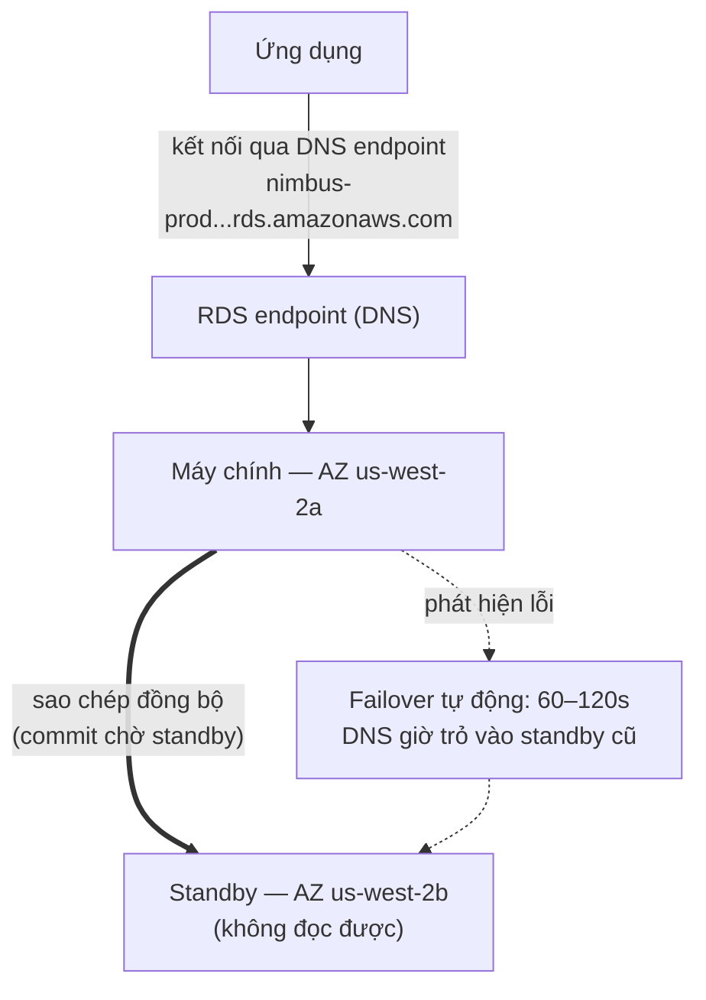

# Chương 8: Quản Trị Viên Cơ Sở Dữ Liệu Không Bao Giờ Ốm

Đã là 3 giờ sáng khi cảnh báo đến.

Priya là người duy nhất thức. Điện thoại của cô sáng lên trên bàn đầu giường và cô đọc nó trong bóng tối, độ sáng màn hình quá cao. Cô ngồi dậy. Cô tìm thấy máy tính xách tay của mình bằng trí nhớ và mở nó mà không bật đèn.

Bàn phím kêu lách cách lặng lẽ trong căn phòng tối.

Máy chủ cơ sở dữ liệu cần một bản vá bảo mật — loại đòi hỏi một lần khởi động lại. Lỗ hổng là thực, bản vá có sẵn, và cửa sổ để áp dụng nó mà không làm gián đoạn khách hàng là ngay bây giờ, giữa đêm, khi lưu lượng thấp.

Cô kết nối đến máy chủ. Cô kéo bản vá. Cô áp dụng nó.

Rồi cô đọc các ghi chú phát hành.

Bản cập nhật gói chạm vào tệp cấu hình mà PostgreSQL sử dụng để định nghĩa các tham số kết nối. Các ghi chú phát hành bao gồm một cảnh báo: tùy thuộc vào cách nâng cấp được thực hiện, một tệp cấu hình tùy chỉnh có thể bị thay thế bằng phiên bản mặc định của gói.

Tệp cấu hình của họ đã được tùy chỉnh. Leo đã chỉnh sửa nó hai tháng trước để điều chỉnh cài đặt max_connections.

Bản vá chạy. Máy chủ khởi động lại. Cơ sở dữ liệu trở lại trực tuyến.

Priya kiểm tra một truy vấn. Nó hoạt động.

Cô kiểm tra nhật ký. Mọi thứ trông bình thường.

Cô trở lại giường lúc 4:15 sáng.

Lúc 9:05 sáng, Leo mở ứng dụng và nhận một lỗi. Anh kiểm tra cơ sở dữ liệu. Max connections được đặt thành mặc định: 100. Ứng dụng của họ được cấu hình để sử dụng các connection pool lên đến 500.

Mỗi lần thử kết nối mới đều thất bại. Ứng dụng đã thực sự mất quyền truy cập cơ sở dữ liệu.

"Chuyện gì đã xảy ra?" Maya hỏi.

"Bản vá," Priya nói. Cô đã đang nhìn tệp cấu hình. "Bản cập nhật gói ghi đè tệp cấu hình tùy chỉnh của chúng ta bằng cái mặc định. Điều chỉnh max_connections của Leo chỉ biến mất — máy chủ khởi động lại với các cài đặt gốc và không ai nhận một lỗi. Nó âm thầm rơi về mặc định."

"Mất bao lâu để sửa nó?" Leo hỏi.

"Hai mươi phút," Priya nói. "Nhưng chúng ta cần một cửa sổ bảo trì. Điều này đòi hỏi một thay đổi cấu hình và một lần khởi động lại."

"Chúng ta có các nhà hàng mở cửa cho bữa trưa trong hai giờ," Tom nói.

Priya sửa nó trong mười tám phút. Cửa sổ bảo trì là mười hai phút ngừng hoạt động thực tế. Các nhà hàng bị ảnh hưởng, nhưng giờ cao điểm chưa bắt đầu.

Vào buổi sáng cô kể cho nhóm những gì đã xảy ra. Có một sự im lặng.

"Điều đó sẽ xảy ra lại," Tom nói.

"Nó sẽ xảy ra mỗi lần có một bản vá," Priya nói. "Và luôn có các bản vá. Phải có một cách tốt hơn để làm điều này."

Thời gian truy vấn tám giây vẫn chưa được giải quyết. Và trong cùng tuần, điều này: một cửa sổ bảo trì lúc 3 giờ sáng biến thành một sự cố buổi sáng. Cả hai vấn đề có cùng nguyên nhân gốc — Nimbus đang chạy một cơ sở dữ liệu mà họ không được trang bị để quản lý.

Có một giải pháp. Nó chỉ đòi hỏi từ bỏ ý tưởng rằng họ cần tự quản lý cơ sở dữ liệu.

**Vấn Đề Cơ Sở Dữ Liệu Truyền Thống**

Khi bạn tự chạy một cơ sở dữ liệu trên một EC2 instance, bạn chịu trách nhiệm về mọi thứ.

Cài đặt phần mềm cơ sở dữ liệu. Cấu hình nó an toàn. Vá nó khi các lỗ hổng bảo mật được phát hiện. Lấy các bản sao lưu. Kiểm tra rằng các bản sao lưu thực sự hoạt động (một bước mà hầu hết các nhóm bỏ qua cho đến khi quá muộn). Giám sát dung lượng đĩa. Thiết lập sao chép cho dự phòng. Cấu hình failover cho khi máy chủ chính sập. Điều chỉnh hiệu năng truy vấn. Quản lý các kết nối dưới tải.

Không cái nào trong số này là ứng dụng. Không cái nào thêm tính năng. Tất cả nó đòi hỏi chuyên môn.

Yêu cầu chuyên môn là vấn đề chính. Một quản trị viên cơ sở dữ liệu đủ điều kiện hiểu không chỉ cách chạy một cơ sở dữ liệu, mà cách:

- Giám sát nhật ký truy vấn chậm và xác định các điểm nghẽn hiệu năng
- Định cỡ bộ nhớ cho working set để tránh I/O đĩa
- Cấu hình lưu trữ WAL cho khôi phục tại một thời điểm
- Thiết lập sao chép streaming đồng bộ với failover tự động
- Điều chỉnh connection pooling để ngăn cạn kiệt kết nối dưới tải
- Áp dụng các nâng cấp phiên bản chính mà không mất dữ liệu hoặc ngừng hoạt động kéo dài

Đây là một bộ kỹ năng riêng biệt, chuyên dụng. Các DBA cấp cao chỉ huy mức lương cao chính xác vì làm tất cả điều này tốt là khó. Hầu hết các startup không thể thuê cho nó. Hầu hết các nhóm phát triển không có nó.

Hầu hết các nhóm phát triển không phải là quản trị viên cơ sở dữ liệu. Điều này tạo ra một mẫu có thể đoán trước: cơ sở dữ liệu được cài đặt, cấu hình tối thiểu, và rồi hầu như bị quên cho đến khi có gì đó trục trặc thảm họa. Instance PostgreSQL của Nimbus đang chạy trên cấu hình mặc định — max_connections ở 100, không có connection pooling, các bản sao lưu thủ công mà Leo đã chạy hai lần rồi quên, và không có sao chép nào cả.

Sự cố vá lúc 3 giờ sáng là triệu chứng của một hệ thống được vận hành bởi những người xuất sắc trong việc xây dựng ứng dụng và không có nền tảng trong vận hành cơ sở dữ liệu. Đó không phải là một lời chỉ trích — nó là một mô tả chính xác về hầu hết các startup. Giải pháp không phải là thuê một DBA. Giải pháp là sử dụng một dịch vụ cung cấp các vận hành cấp DBA một cách tự động.

"Đó có phải cái chúng ta đã làm không?" Maya hỏi.

Câu trả lời của Leo là im lặng, điều này giống như đồng ý.

**Cơ Sở Dữ Liệu Được Quản Lý**

Hãy tưởng tượng thuê một quản trị viên cơ sở dữ liệu không bao giờ ốm, tự động xử lý mọi bản vá bảo mật, lấy một bản sao lưu mỗi đêm mà không cần được yêu cầu, và tự sửa mình khi có gì đó hỏng. Họ làm tất cả điều này mà không làm phiền bạn — và họ không bao giờ, dưới bất kỳ hoàn cảnh nào, chạm vào logic ứng dụng của bạn.

AWS gọi dịch vụ này là **RDS** — Relational Database Service.

Với RDS, AWS quản lý:

- Cài đặt và vá engine cơ sở dữ liệu
- Sao lưu tự động (được lưu trữ trong S3, giữ lên đến 35 ngày)
- Failover tự động (khi máy chính sập, một standby tiếp quản tự động)
- Giám sát và các chỉ số
- Mã hóa khi nghỉ và trong khi truyền
- Tự động mở rộng lưu trữ (nếu bạn bật nó, đĩa phát triển khi nó đầy)

Bạn quản lý:

- Schema cơ sở dữ liệu (cấu trúc của các bảng của bạn)
- Các truy vấn và logic ứng dụng của bạn
- Ai có quyền truy cập vào cơ sở dữ liệu
- Loại instance nào chạy cơ sở dữ liệu
- Điều chỉnh tham số (mặc dù RDS cung cấp các mặc định hợp lý)

**Các Engine Được Hỗ Trợ**

RDS hỗ trợ một số engine cơ sở dữ liệu phổ biến:

- **MySQL** — cơ sở dữ liệu quan hệ mã nguồn mở được sử dụng rộng rãi nhất
- **PostgreSQL** — mạnh mẽ, có thể mở rộng, ngày càng phổ biến cho các khối lượng công việc phức tạp
- **MariaDB** — một fork MySQL mã nguồn mở, tương thích hoàn toàn
- **Oracle** — cấp doanh nghiệp, được sử dụng trong các tổ chức lớn với các yêu cầu kế thừa
- **Microsoft SQL Server** — cho các môi trường nặng Windows
- **Amazon Aurora** — engine tương thích MySQL/PostgreSQL của riêng AWS, được xây dựng cho đám mây
  (chúng ta đề cập Aurora sâu ở Chương 24)

Đối với Nimbus, lựa chọn là PostgreSQL. Đó là cái Leo biết, và nó xử lý dữ liệu quan hệ tốt. Lựa chọn engine ít quan trọng hơn bạn nghĩ đối với hầu hết các ứng dụng — các lợi ích vận hành của RDS áp dụng bất kể.

Một sắc thái: khi bạn chạy một engine trên RDS, AWS bảo trì các bản vá phiên bản phụ một cách tự động (trong cửa sổ bảo trì được cấu hình của bạn). Các nâng cấp phiên bản chính — đi từ PostgreSQL 14 lên 15, chẳng hạn — là một thao tác thủ công mà bạn lập lịch và thực thi. AWS kiểm tra các nâng cấp phiên bản chính một cách cẩn thận, nhưng bạn nên kiểm tra chúng trong một môi trường staging trước. Các thay đổi phiên bản chính có thể giới thiệu các vấn đề tương thích với cú pháp SQL cụ thể, các extension, hoặc các phiên bản driver.

Leo khám phá điều này khi RDS áp dụng một bản vá phụ và nhật ký ứng dụng tạm thời cho thấy một cảnh báo không dùng nữa về một hàm đã bị gỡ trong một bản phát hành phụ. Các bản vá phụ về cơ bản nên trong suốt — nhưng giám sát nhật ký ứng dụng của bạn sau mỗi cửa sổ bảo trì là thực hành tốt.

"Chúng ta đã nghĩ về chuyện gì xảy ra nếu một bản vá phụ làm hỏng thứ gì đó chưa?" Priya hỏi.

"Chúng ta cuộn lại về snapshot trước," Leo nói.

"Cái đó mất bao lâu?"

Leo tra thời gian khôi phục RDS cho kích cỡ cơ sở dữ liệu của họ. Đối với một cơ sở dữ liệu 50GB trên một `db.m6i.large`: khoảng 15 đến 30 phút để khôi phục từ một snapshot.

"Vậy chúng ta có một cửa sổ khôi phục 15-đến-30-phút nếu một bản vá làm hỏng production," Priya nói. "Và chúng ta áp dụng bản vá trong cửa sổ bảo trì sáng sớm, vậy nên ít nhất tác động là tối thiểu."

"Và chúng ta kiểm tra các bản vá trong staging trước," Leo thêm vào.

"Đúng," Priya nói. "Cái đó nữa."

**Định Cỡ Instance RDS: Không Phải Tất Cả Các Khối Lượng Công Việc Đều Bằng Nhau**

Khi bạn tạo một instance RDS, bạn chọn một loại instance — cùng khái niệm như EC2, nhưng được giới hạn phạm vi cho các khối lượng công việc cơ sở dữ liệu. AWS tổ chức các loại instance RDS thành một vài tầng hữu ích.

**Họ db.t3**: Các instance hiệu năng burstable. Được thiết kế cho phát triển, staging, và các khối lượng công việc production nhẹ không cần CPU cao bền vững. Một `db.t3.micro` phù hợp cho một cơ sở dữ liệu phát triển với lưu lượng thấp. Một `db.t3.medium` xử lý tải production trung bình với các đợt bùng nổ thỉnh thoảng.

Sự đánh đổi với các instance dòng T: chúng tích lũy CPU credit trong các giai đoạn mức sử dụng thấp và chi tiêu các credit đó trong các đợt bùng nổ. Nếu bạn chạy một instance dòng T ở CPU cao bền vững, bạn cạn kiệt các credit và hiệu năng bị điều tiết xuống một đường cơ sở có thể không đủ.

**Họ db.m6i**: Các instance đa năng với hiệu năng nhất quán, không burstable. `db.m6i.large` là một điểm khởi đầu phổ biến cho các cơ sở dữ liệu production. Những cái này không có giới hạn credit — CPU có sẵn ở công suất đầy đủ bất cứ khi nào bạn cần.

**Họ db.r6i**: Các instance được tối ưu hóa bộ nhớ. Nhiều RAM hơn mỗi vCPU so với họ M. Phù hợp cho các cơ sở dữ liệu với working set lớn — các truy vấn hưởng lợi từ dữ liệu ở trong bộ nhớ thay vì lấy nó từ đĩa trong mỗi lần truy cập. Nếu hiệu năng cơ sở dữ liệu của bạn cải thiện đáng kể khi bạn thêm RAM, họ R là lựa chọn đúng.

Đối với Nimbus:

- Phát triển và staging: `db.t3.medium`. Đủ cho các truy vấn phát triển, chi phí thấp.
- Production: `db.m6i.large`. Hiệu năng nhất quán, đủ RAM cho working set thực đơn và đơn hàng, không điều tiết credit.

"db.m6i.large tốn thêm bao nhiêu so với db.t3.medium?" Tom hỏi.

Leo kiểm tra trang giá. `db.t3.medium` chạy khoảng 55 đô la/tháng. `db.m6i.large` chạy khoảng 140 đô la/tháng. Sự khác biệt là thực, nhưng sự khác biệt độ tin cậy cũng vậy.

"t3 sẽ điều tiết dưới tải bền vững," Priya nói. "Nếu chúng ta có một thứ Sáu bận rộn và CPU ở cao trong bốn giờ, t3 cạn các credit và điều tiết. m6i thì không."

Tom viết con số xuống. Anh cũng viết chi phí của các sự cố thứ Sáu từ hai tuần trước. So sánh không hề sát.

Production đặt trên `db.m6i.large`.

**Multi-AZ: Standby Tiếp Quản**

Đây là tính năng thay đổi hoàn toàn phép tính độ tin cậy.

**Triển khai Multi-AZ** có nghĩa là RDS duy trì một instance standby đồng bộ ở một Availability Zone khác với máy chính. Mỗi giao dịch được commit vào máy chính được sao chép đồng bộ đến standby trước khi commit được xác nhận.

Khi máy chính thất bại — lỗi phần cứng, sự cố AZ, sập phần mềm — RDS tự động failover sang standby. Bản ghi DNS cho endpoint cơ sở dữ liệu được cập nhật. Ứng dụng của bạn kết nối lại với máy chính mới.

Failover mất 60–120 giây. Trong cửa sổ đó, ứng dụng của bạn sẽ trải qua các lỗi kết nối. Các ứng dụng được viết đúng nên xử lý điều này một cách nhẹ nhàng (thử lại kết nối với backoff).

Standby không phải là một read replica. Nó không phục vụ lưu lượng đọc. Mục đích duy nhất của nó là sẵn sàng để tiếp quản.



(Lưu ý: tùy chọn triển khai **Multi-AZ DB Cluster** mới hơn giữ *hai* standby mà **đọc được** và failover trong ~35 giây — kỳ thi có thể phân biệt nó với triển khai Multi-AZ *instance* cổ điển được mô tả ở đây.)

"Multi-AZ tốn bao nhiêu?" Tom hỏi.

Khoảng gấp đôi chi phí của một instance đơn — vì bạn thực sự đang chạy hai instance cơ sở dữ liệu. Standby tốn cùng như máy chính.

Tom mở lịch sử đơn hàng và ước tính doanh thu mỗi giờ trong giờ cao điểm thứ Sáu của họ.

"Và nếu ai đó cố xâm nhập trong cửa sổ failover thì sao?" Priya hỏi. "Khi máy chính sập và standby đang lên ngôi, có sáu mươi giây nào nơi chúng ta bị phơi bày không?"

"Failover trong suốt," Maya nói, "nhưng câu hỏi hợp lý. Các chuỗi kết nối nên sử dụng RDS endpoint, không phải các IP được mã hóa cứng — nếu không failover sẽ không liền mạch."

Multi-AZ được bật chiều hôm đó.

**Sao Lưu Tự Động Và Khôi Phục Tại Một Thời Điểm**

RDS lấy các bản sao lưu tự động mỗi ngày. AWS lưu trữ các bản sao lưu này trong S3 (được quản lý bởi RDS — bạn không thấy chúng trực tiếp trong console S3 của mình). Bạn có thể khôi phục cơ sở dữ liệu về bất kỳ thời điểm nào trong giai đoạn giữ bản sao lưu của bạn.

Các bản sao lưu xảy ra trong một **cửa sổ sao lưu** có thể cấu hình — một giai đoạn lưu lượng thấp, thường vào sáng sớm. (Đây là một cài đặt riêng biệt với **cửa sổ bảo trì**, là khi RDS áp dụng các bản vá và thay đổi cấu hình. Kỳ thi thích kiểm tra rằng đây là hai cửa sổ khác nhau.) Đối với hầu hết các loại engine, các bản sao lưu không gây ngừng hoạt động — và trên các triển khai Multi-AZ, snapshot được lấy từ standby, vậy nên máy chính hoàn toàn không bị chạm vào.

**Khôi phục tại một thời điểm** là một trong những tính năng giá trị nhất: bạn có thể khôi phục về bất kỳ giây nào trong giai đoạn giữ của bạn. Không chỉ các snapshot hàng ngày — *bất kỳ giây nào*. Điều này khả thi vì RDS liên tục lưu trữ các nhật ký giao dịch ngoài các bản sao lưu hàng ngày.

Nếu ai đó vô tình chạy `DELETE FROM orders WHERE 1=1` lúc 2:37 chiều, bạn có thể khôi phục về 2:36 chiều.

Leo thư giãn thấy rõ khi anh hiểu điều này.

"Tôi đã đặt giữ bản sao lưu thành một ngày," Leo nói. "Ồ — nhưng cái đó ổn, đúng không? Chúng ta có thể thay đổi nó?"

"Thay đổi nó thành tối thiểu bảy ngày," Priya nói. "Ba mươi cho production."

Leo cập nhật nó ngay lập tức.

"Chúng ta có thể đã khôi phục từ những gì tôi xóa tháng trước không?" anh hỏi.

"Trước RDS? Không," Priya nói. "Sau RDS? Có."

Bạn có thể đang tự hỏi: sự khác biệt giữa một bản sao lưu tự động và một snapshot thủ công là gì? Các bản sao lưu tự động bị xóa khi giai đoạn giữ hết hạn (lên đến 35 ngày). Các snapshot thủ công được giữ vô thời hạn cho đến khi bạn rõ ràng xóa chúng. Nếu bạn cần bảo toàn một trạng thái cơ sở dữ liệu vĩnh viễn — trước một cuộc di chuyển lớn, trước một triển khai rủi ro — hãy lấy một snapshot thủ công.

**RDS Proxy: Giải Quyết Vấn Đề Kết Nối Ở Quy Mô**

Hai tuần sau khi di chuyển sang RDS, Leo nhận thấy một điều trong các chỉ số.

Cơ sở dữ liệu đang xử lý các truy vấn ổn. Nhưng số lượng kết nối mở cao — cao hơn anh đã mong đợi. Với Auto Scaling Group thêm các EC2 instance trong giờ cao điểm, mỗi instance mới mở pool kết nối cơ sở dữ liệu riêng của nó. Mười EC2 instance, mỗi cái với một connection pool 50: năm trăm kết nối đồng thời đến cơ sở dữ liệu.

"PostgreSQL có một chi phí cho mỗi kết nối," Priya nói. "Bộ nhớ, CPU cho trình xử lý kết nối. Năm trăm kết nối sử dụng một lượng tài nguyên đáng kể của cơ sở dữ liệu chỉ cho quản lý kết nối — trước khi nó làm bất kỳ công việc thực tế nào."

"Chúng ta có thể giảm kích cỡ connection pool không?" Leo hỏi.

"Chúng ta có thể," Priya nói. "Nhưng rồi chúng ta rủi ro các yêu cầu xếp hàng chờ một kết nối trong giờ cao điểm."

Giải pháp tốt hơn: **RDS Proxy**.

RDS Proxy ngồi giữa ứng dụng và cơ sở dữ liệu. Các EC2 instance kết nối đến Proxy, không trực tiếp đến instance RDS. Proxy duy trì một pool kết nối cơ sở dữ liệu và multiplex các yêu cầu ứng dụng trên chúng. Nếu mười EC2 instance mỗi cái mở năm mươi kết nối đến Proxy, Proxy có thể chỉ duy trì một trăm kết nối cơ sở dữ liệu thực tế — chia sẻ chúng hiệu quả trên tất cả các yêu cầu ứng dụng.

Các lợi ích:

**Connection pooling**: Ít kết nối cơ sở dữ liệu thực tế hơn có nghĩa là ít chi phí bộ nhớ hơn trên instance RDS và hiệu năng tốt hơn dưới tải.

**Failover nhanh hơn**: Trong một failover Multi-AZ, Proxy duy trì kết nối với phía ứng dụng trong khi thiết lập lại kết nối cơ sở dữ liệu ở backend. Các ứng dụng thấy một khoảng dừng ngắn thay vì một lần đặt lại kết nối đầy đủ. RDS Proxy giảm tác động failover từ 60–120 giây xuống thường 30 giây hoặc ít hơn.

**Xác thực IAM**: Thay vì nhúng thông tin đăng nhập cơ sở dữ liệu trong ứng dụng, ứng dụng có thể xác thực với RDS Proxy sử dụng một IAM role. Proxy xử lý thông tin đăng nhập cơ sở dữ liệu thực tế. Điều này loại bỏ các bí mật khỏi môi trường ứng dụng hoàn toàn.

"RDS Proxy tốn bao nhiêu?" Tom hỏi.

Nó chạy khoảng 0,015 đô la mỗi vCPU-giờ của instance RDS cơ bản, được tính phí riêng với chính instance. Đối với một `db.m6i.large` (2 vCPU), Proxy thêm khoảng 22 đô la/tháng.

Tom nhìn biểu đồ số lượng kết nối — năm trăm kết nối cạnh tranh cho tài nguyên cơ sở dữ liệu trong giờ cao điểm — và nhìn chi phí 22 đô la/tháng.

"Cái đó rẻ hơn nâng cấp lên một instance RDS lớn hơn để xử lý chi phí kết nối," anh nói.

RDS Proxy được bật tuần đó.

"Và nếu ai đó cố xâm nhập qua Proxy thì sao?" Priya hỏi. "Xác thực IAM cho Proxy có giảm bề mặt tấn công không?"

"Có," Priya tự trả lời câu hỏi của mình. "Không có thông tin đăng nhập cơ sở dữ liệu trong môi trường ứng dụng có nghĩa là không có thông tin đăng nhập cơ sở dữ liệu để đánh cắp từ ứng dụng."

Cô bật xác thực IAM cho Proxy.

**Read Replica: Mở Rộng Lưu Lượng Đọc**

Multi-AZ là về tính khả dụng. **Read replica** là về hiệu năng.

Một read replica là một bản sao không đồng bộ của cơ sở dữ liệu chính của bạn có thể phục vụ các truy vấn đọc. Bạn có thể có lên đến 15 read replica cho các engine RDS chính — MySQL, PostgreSQL, và MariaDB (Aurora cũng hỗ trợ lên đến 15 Aurora Replica, chia sẻ cùng volume lưu trữ).

Ứng dụng được sửa đổi để gửi các truy vấn đọc đến replica và các truy vấn ghi đến máy chính. Điều này phân phối tải: máy chính xử lý các lần ghi và các giao dịch phức tạp; các replica xử lý các lần đọc.

Các đặc điểm chính:

- Sao chép là **không đồng bộ** — có thể có một độ trễ nhỏ (lag) giữa
  máy chính và replica. Nếu bạn ghi một bản ghi và ngay lập tức đọc từ replica,
  bạn có thể chưa thấy nó.
- Các read replica có thể ở cùng Region hoặc ở một Region khác (các replica
  giữa các Region thêm độ trễ nhưng cho phép phân phối địa lý).
- Các read replica có thể được lên ngôi thành các cơ sở dữ liệu độc lập trong một tình huống thảm họa.

Đối với Nimbus: các tra cứu thực đơn là các lần đọc. Lịch sử đơn hàng là các lần đọc. Đại đa số lưu lượng là lưu lượng đọc. Thêm một read replica và định tuyến các lần đọc đến nó cắt tải cơ sở dữ liệu chính đáng kể.

Chúng ta đề cập read replica kỹ lưỡng hơn ở Chương 24 khi chúng ta thảo luận về Aurora.

**Nếu Đọc Nhiều Thì Thêm Một Replica Nhưng Theo Dõi Độ Trễ**

Nếu khối lượng công việc của bạn đọc nhiều, thêm một read replica giảm tải trên máy chính và cải thiện hiệu năng truy vấn — nhưng sao chép là không đồng bộ, có nghĩa là replica có thể hơi tụt sau máy chính. Nếu ứng dụng của bạn ghi một bản ghi và ngay lập tức đọc nó lại, nó phải đọc từ máy chính, không phải replica. Làm sai điều này tạo ra các lỗi độ tươi dữ liệu tinh vi, khó gỡ lỗi: một người dùng đặt một đơn hàng, trang xác nhận truy vấn replica, replica chưa bắt kịp, đơn hàng có vẻ bị thiếu. Đây được gọi là tính nhất quán read-your-writes, và nó là sai lầm phổ biến nhất mà các nhóm mắc phải khi họ lần đầu thêm các replica.

**Performance Insights: Tìm Truy Vấn Chậm**

Thời gian tải thực đơn tám giây vẫn là một vấn đề. Việc chuyển sang RDS cải thiện độ tin cậy, nhưng truy vấn vẫn chậm.

Leo thêm một read replica và định tuyến các truy vấn thực đơn đến nó. Thời gian tải thực đơn giảm xuống khoảng bốn giây. Tốt hơn. Vẫn chưa tốt.

"Truy vấn vẫn chậm," Maya nói. "Chúng ta cải thiện điểm nghẽn, nhưng chúng ta không sửa nó."

RDS bao gồm một tính năng gọi là **Performance Insights** — một công cụ giám sát cho thấy các truy vấn nào đang tiêu thụ nhiều tài nguyên cơ sở dữ liệu nhất, các phiên nào đang chờ, và chúng đang chờ gì.

Leo bật Performance Insights trên read replica và tải trang thực đơn lặp đi lặp lại trong một phiên kiểm tra buổi chiều.

Bảng điều khiển Performance Insights cho thấy một truy vấn chiếm ưu thế trong tải: một full table scan của bảng `menu_items`, lấy tất cả 22.000 hàng mỗi khi một trang thực đơn tải. Không có chỉ mục trên `restaurant_id` — cột mà ứng dụng đang lọc theo.

Thời gian thực thi không có chỉ mục: 8,2 giây.

Leo thêm chỉ mục.

```sql
CREATE INDEX idx_menu_items_restaurant_id ON menu_items(restaurant_id);
```

Thời gian thực thi có chỉ mục: 14 mili giây.

8.200 mili giây xuống 14 mili giây. Sự khác biệt giữa một ứng dụng đặt hàng nhà hàng đẩy khách hàng đi và một cái họ sử dụng mà không cần suy nghĩ về nó.

"Đó là vấn đề suốt thời gian đó?" Maya nói.

"Đó là vấn đề," Leo nói.

"Và Performance Insights tìm thấy nó trong bao lâu?"

"Khoảng hai mươi phút."

Tom đã đang tính toán. Ba tuần thời gian tải thực đơn dưới mức tối ưu, ước tính 200.000 lần tải trang thực đơn trong giai đoạn đó, ước tính 15% bỏ cuộc do chậm. Con số anh đạt đến là khó chịu.

"Thêm các chỉ mục bị thiếu trước khi ra mắt lần sau," anh nói.

"Sẽ có một danh sách kiểm tra," Priya nói. Cô đã đang viết nó.

**Khi Không Sử Dụng RDS**

RDS xuất sắc cho một loạt rộng các khối lượng công việc cơ sở dữ liệu quan hệ. Nó không phải là câu trả lời đúng cho mọi thứ.

**Khi bạn cần truy cập cấp hệ điều hành**: RDS không cho bạn truy cập vào hệ điều hành cơ bản. Bạn không thể cài đặt các gói hệ điều hành tùy chỉnh, sửa đổi các tham số kernel, hoặc chạy các công cụ đòi hỏi truy cập root đến máy chủ cơ sở dữ liệu. Nếu cơ sở dữ liệu của bạn có các yêu cầu đòi hỏi truy cập hệ điều hành — một số cấu hình Oracle nhất định, các driver lưu trữ tùy chỉnh, các giao diện mạng cụ thể — bạn cần chạy cơ sở dữ liệu trên một EC2 instance trực tiếp.

**Khi bạn đang sử dụng một engine không được hỗ trợ**: RDS hỗ trợ MySQL, PostgreSQL, MariaDB, Oracle, SQL Server, và Aurora. Nếu ứng dụng của bạn sử dụng một engine cơ sở dữ liệu khác — CockroachDB, SingleStore, Greenplum — bạn đang chạy nó trên EC2, không phải RDS.

**Khi bạn cần mở rộng ngang nặng ghi**: RDS mở rộng các lần đọc qua các replica. Các lần ghi đi đến một instance chính. Nếu khối lượng công việc của bạn nặng ghi và cần được phân phối trên nhiều nút ghi, RDS không phải là kiến trúc đúng. Global Database của Aurora có thể giúp ở quy mô lớn, nhưng đối với các yêu cầu mở rộng ghi cực đoan, các cơ sở dữ liệu phân tán như DynamoDB (Chương 9) hoặc CockroachDB chạy trên EC2 là các công cụ phù hợp.

**Khi chi phí được quản lý vượt quá chi phí vận hành**: Đối với các khối lượng công việc rất lớn, ổn định nơi nhóm của bạn có chuyên môn quản trị cơ sở dữ liệu thực sự, chạy PostgreSQL trên EC2 với công cụ của riêng bạn có thể rẻ hơn RDS. Điều này bất thường đối với các nhóm không chủ yếu là các cửa hàng DBA. Nhưng nó là thực, và một kiến trúc sư giỏi thừa nhận nó.

Đối với Nimbus — một startup không có tài nguyên DBA chuyên dụng, chạy PostgreSQL trên một dịch vụ được quản lý, với tăng trưởng không thể đoán trước — RDS rõ ràng là lựa chọn đúng.

**RDS Parameter Group Và Option Group**

Hai cơ chế cấu hình xuất hiện trong kỳ thi:

**Parameter group** kiểm soát các cài đặt engine cơ sở dữ liệu — như số kết nối tối đa,
kích cỡ query cache, các giá trị timeout. RDS tạo một parameter group mặc định hoạt động
cho hầu hết các trường hợp. Bạn tạo các parameter group tùy chỉnh khi bạn cần điều chỉnh các cài đặt cụ thể.

**Option group** bật các tính năng bổ sung cho một số engine — như mã hóa mạng gốc của Oracle
hoặc mã hóa dữ liệu trong suốt của SQL Server. Hầu hết các triển khai engine mã nguồn mở
không cần các option group tùy chỉnh.

Bạn có thể tùy chỉnh hành vi của engine cơ sở dữ liệu qua các cơ chế này — nhưng các mặc định hoạt động cho hầu hết các nhóm bắt đầu.

### Đưa Dữ Liệu Vào: AWS Database Migration Service

Vài tuần sau, Tom đến buổi standup với một slide.

Nimbus đang mua lại một đối thủ cạnh tranh khu vực nhỏ. Hệ thống đặt hàng của họ chạy trên một cơ sở dữ liệu MySQL trong một cơ sở co-location. Hệ thống không thể ngoại tuyến trong khi di chuyển — các nhà hàng đang sử dụng nó.

"Chúng ta cần di chuyển dữ liệu của họ vào RDS," Tom nói. "Mà không làm sập hệ thống."

"Cơ sở dữ liệu lớn thế nào?" Leo hỏi.

"Khoảng 80 gigabyte."

"Khi nào họ cần chuyển sang?"

"Sáu tuần."

Priya đã mở tài liệu. "AWS DMS," cô nói.

**AWS DMS (Database Migration Service)** di chuyển dữ liệu từ một cơ sở dữ liệu nguồn sang một cơ sở dữ liệu đích với ngừng hoạt động tối thiểu. Nó xử lý việc di chuyển trong hai giai đoạn: một full load của dữ liệu hiện có, theo sau là sao chép liên tục các thay đổi khi nguồn tiếp tục chạy.

Có hai loại di chuyển:

**Di chuyển đồng nhất:** nguồn và đích là cùng engine — MySQL sang RDS MySQL, PostgreSQL sang Aurora PostgreSQL. Schema tương thích; DMS di chuyển dữ liệu trực tiếp.

**Di chuyển không đồng nhất:** nguồn và đích là các engine khác nhau — Oracle sang Aurora PostgreSQL, SQL Server sang RDS MySQL. Schema phải được chuyển đổi trước. Điều này đòi hỏi **AWS Schema Conversion Tool (SCT)** để dịch schema, rồi DMS để di chuyển dữ liệu.

Đối với việc mua lại Nimbus: MySQL sang RDS MySQL. Đồng nhất. Không cần SCT.

Cách nó hoạt động trong thực tế:

1. DMS đọc từ nguồn — cơ sở dữ liệu MySQL co-location
2. **Full load**: DMS sao chép tất cả dữ liệu hiện có sang instance RDS đích
3. **CDC (Change Data Capture)**: sau full load, DMS đọc nhật ký giao dịch của cơ sở dữ liệu nguồn và sao chép các thay đổi đang diễn ra đến đích trong gần thời gian thực
4. Nguồn tiếp tục chạy. Khi nhóm sẵn sàng, họ lật chuỗi kết nối.

"Vậy hệ thống đặt hàng nhà hàng vẫn hoạt động suốt thời gian?" Tom hỏi.

"Suốt thời gian," Priya xác nhận. "Nguồn và đích vẫn đồng bộ qua CDC. Khi chúng ta sẵn sàng, chúng ta lật endpoint. Ngừng hoạt động là vài giây cần thiết cho thay đổi đó lan truyền."

DMS hỗ trợ hàng chục tổ hợp nguồn và đích: Oracle, SQL Server, MySQL, PostgreSQL, MongoDB, DynamoDB, S3, Redshift, Aurora, và nhiều hơn nữa.

"Khoan đã — nhưng *tại sao* chúng ta cần một công cụ riêng cho các di chuyển không đồng nhất?" Maya hỏi. "DMS không thể chỉ tìm ra các khác biệt schema sao?"

"Một VARCHAR trong Oracle không giống một VARCHAR trong PostgreSQL," Priya nói. "Các kiểu dữ liệu, các stored procedure, các sequence, các hàm độc quyền — chúng không ánh xạ một-một. SCT phân tích schema nguồn và tạo ra cái tương đương gần nhất cho đích. DMS rồi di chuyển dữ liệu vào schema được chuyển đổi đó. Tách biệt chuyển đổi schema khỏi di chuyển dữ liệu là cái làm cho quá trình đáng tin cậy."

"Và nếu ai đó cố xâm nhập qua instance sao chép DMS thì sao?" Priya tự hỏi một lát sau. "Nó cần quyền truy cập đọc đến nguồn và quyền truy cập ghi đến đích."

"Đặc quyền tối thiểu ở cả hai đầu," Leo nói. "IAM chỉ-đọc trên nguồn. Quyền truy cập ghi được giới hạn phạm vi chỉ cho đích di chuyển. Và instance sao chép ở lại trong subnet riêng tư."

Priya viết nó xuống.

## Điểm Mạnh Và Hạn Chế

**Tại sao RDS xuất sắc**:

- Loại bỏ gánh nặng vận hành của việc quản lý phần mềm cơ sở dữ liệu
- Sao lưu tự động và khôi phục tại một thời điểm
- Multi-AZ cho failover tự động với RTO tối thiểu
- Read replica cho mở rộng lưu lượng đọc
- Mã hóa khi nghỉ và trong khi truyền được tích hợp sẵn
- Tất cả các engine cơ sở dữ liệu quan hệ chính được hỗ trợ
- RDS Proxy cho connection pooling và phản ứng failover được cải thiện

**Nơi RDS có giới hạn**:

- Bạn không thể truy cập hệ điều hành cơ bản. Nếu cơ sở dữ liệu của bạn có các yêu cầu đòi hỏi
  truy cập cấp hệ điều hành, bạn có thể cần chạy cơ sở dữ liệu dựa trên EC2 của riêng mình.
- RDS không phải serverless (với các ngoại lệ — Aurora Serverless tồn tại, được đề cập ở
  Chương 24). Bạn trả tiền cho một instance đang chạy ngay cả khi nó nhàn rỗi.
- RDS không được thiết kế cho các cơ sở dữ liệu được phân mảnh ngang. Đối với mở rộng quy mô lớn
  của các khối lượng công việc quan hệ nặng ghi, bạn cuối cùng có thể cần một kiến trúc khác.
- Đối với các mẫu dữ liệu phi quan hệ (NoSQL), DynamoDB (Chương 9) phù hợp hơn.

## Tóm Tắt

Cửa sổ vá lúc 3 giờ sáng của Priya là triệu chứng. Nguyên nhân gốc là Nimbus đang quản lý một cơ sở dữ liệu mà một dịch vụ được quản lý có thể xử lý tốt hơn. RDS không chỉ loại bỏ cuộc gọi đánh thức lúc 3 giờ sáng — nó chuyển trách nhiệm vá, failover, sao lưu, và quản lý kết nối sang AWS, giải phóng nhóm để tập trung vào mã ứng dụng thực sự phục vụ khách hàng. Sự đánh đổi là mất truy cập cấp hệ điều hành, điều quan trọng hiếm khi và ít hơn nhiều so với nghe có vẻ.

- **Amazon RDS** là một dịch vụ cơ sở dữ liệu quan hệ được quản lý. AWS xử lý vá, sao lưu, failover, và lưu trữ. Bạn xử lý schema, các truy vấn, và logic ứng dụng.
- **Multi-AZ** duy trì một standby đồng bộ ở một AZ khác. Failover tự động xảy ra trong 60–120 giây. Luôn sử dụng tên DNS RDS endpoint trong các chuỗi kết nối — không phải các IP được mã hóa cứng — để failover trong suốt.
- **Read replica** là các bản sao không đồng bộ phục vụ lưu lượng đọc. Độ trễ sao chép có nghĩa là chúng có thể hơi tụt sau — tính nhất quán read-your-writes đòi hỏi đọc từ máy chính ngay sau một lần ghi.
- **RDS Proxy** gộp các kết nối, giảm chi phí và cải thiện tốc độ failover. Quan trọng cho các khối lượng công việc dựa trên Lambda có thể tạo hàng nghìn kết nối tồn tại ngắn.
- **Performance Insights** xác định các truy vấn chậm — tìm một chỉ mục bị thiếu có thể biến một truy vấn 8 giây thành một cái 14 mili giây. Các nâng cấp phiên bản chính là thủ công; kiểm tra trong staging trước.

## Mẹo Thi

*SAA-C03 Domain 3 — Task 3.3 (giải pháp cơ sở dữ liệu)*

- **Multi-AZ là cho tính khả dụng cao, không phải hiệu năng.** Standby không phục vụ
  lưu lượng đọc. Read replica là cho hiệu năng. Sự phân biệt này được kiểm tra thường xuyên.
- **Failover Multi-AZ là tự động.** Bạn không cấu hình khi nào hoặc cách nào nó xảy ra.
  RDS giám sát máy chính và kích hoạt failover tự động.
- **Độ trễ sao chép quan trọng.** Các read replica có thể hơi tụt sau máy chính.
  Nếu ứng dụng của bạn đòi hỏi đọc dữ liệu nó vừa ghi, nó phải đọc từ
  máy chính, không phải replica. Đây được gọi là "tính nhất quán read-your-writes."
- **Các bản sao lưu tự động được giữ trong 0–35 ngày.** Đặt giữ thành 0
  vô hiệu hóa các bản sao lưu tự động. Các snapshot thủ công được giữ vô thời hạn cho đến khi
  bạn xóa chúng.
- **Tự động mở rộng lưu trữ RDS** ngăn các sự cố đĩa đầy. Bật nó. Nó chỉ mở rộng
  lên, không bao giờ xuống. Kỳ thi có thể kiểm tra liệu bạn có biết sự bất đối xứng này không.
- **RDS Proxy** xuất hiện trong các tình huống thi liên quan đến các hàm Lambda kết nối đến RDS
  (Lambda có thể tạo hàng nghìn kết nối tồn tại ngắn, làm quá tải cơ sở dữ liệu
  mà không có một Proxy), hoặc các tình huống đòi hỏi failover Multi-AZ nhanh hơn.
- **Các instance db.t3 bùng nổ và điều tiết.** Các tình huống thi mô tả suy giảm hiệu năng
  gián đoạn trên các instance RDS nhỏ có thể đang mô tả cạn kiệt CPU credit
  trên các instance dòng T. Cách sửa là nâng cấp lên một instance dòng M hoặc R.
- **Multi-AZ DNS endpoint**: Khi một failover Multi-AZ xảy ra, bản ghi DNS RDS endpoint
  được cập nhật để trỏ vào máy chính mới. Các ứng dụng sử dụng RDS endpoint
  (không phải một IP được mã hóa cứng) kết nối lại tự động. Các ứng dụng với các DNS TTL dài hoặc
  các địa chỉ IP được mã hóa cứng sẽ không kết nối lại tự động. Luôn sử dụng RDS endpoint.
- **Lên ngôi read replica**: Một read replica có thể được lên ngôi thành một DB instance độc lập
  — hữu ích cho khôi phục thảm họa nếu máy chính bị mất và Multi-AZ không được cấu hình.
  Lên ngôi là một thao tác một chiều: replica trở thành một máy chính và không còn
  sao chép từ cái gốc. Các tình huống thi hỏi về "lên ngôi thủ công" hoặc
  "chuyển đổi một read replica thành máy chính" liên quan đến thao tác này.
- **Performance Insights** xác định các truy vấn SQL hàng đầu theo thời gian chờ và sử dụng CPU.
  Khi một tình huống thi hỏi cách chẩn đoán các truy vấn chậm trên một cơ sở dữ liệu RDS, Performance
  Insights là câu trả lời gốc của AWS.
- **RDS so với chạy một cơ sở dữ liệu trên EC2**: Kỳ thi đôi khi trình bày điều này như một lựa chọn.
  RDS cung cấp các vận hành được quản lý nhưng hạn chế truy cập cấp hệ điều hành. Các cơ sở dữ liệu dựa trên EC2 cho
  bạn kiểm soát đầy đủ nhưng đòi hỏi chuyên môn DBA cho vận hành. Cụm từ "truy cập cấp hệ điều hành được yêu cầu"
  trong một tình huống thi là một tín hiệu để chọn EC2 thay vì RDS.
- **AWS DMS:** Di chuyển các cơ sở dữ liệu với ngừng hoạt động tối thiểu sử dụng full load + CDC. Đồng nhất (cùng engine) = DMS trực tiếp. Không đồng nhất (các engine khác nhau) = SCT để chuyển đổi schema trước, rồi DMS để di chuyển dữ liệu. Kích hoạt thi: "di chuyển cơ sở dữ liệu với ngừng hoạt động tối thiểu" hoặc "Oracle sang Aurora" → DMS + SCT.

## Bài Tập

**Bài tập 1 — Nhớ lại**

Bằng lời của bạn: sự khác biệt giữa Multi-AZ và read replica trong RDS là gì?
Mỗi cái giải quyết vấn đề gì?

*(Gợi ý: Một cái bảo vệ chống lại ngừng hoạt động; cái kia cải thiện hiệu năng dưới tải
nặng đọc. Chúng giải quyết các vấn đề khác nhau và có thể được sử dụng cùng nhau.)*

**Bài tập 2 — Tình huống SAA-C03**

*Tình huống*: Một công ty chạy một cơ sở dữ liệu PostgreSQL production trên RDS. Cơ sở dữ liệu
trải qua lưu lượng đọc cao do các truy vấn báo cáo chạy suốt cả ngày.
Nhóm cũng lo lắng về tính khả dụng cơ sở dữ liệu — họ không thể chấp nhận hơn
một vài phút ngừng hoạt động trong một tình huống thất bại. Họ muốn giảm thiểu tác động lên
cơ sở dữ liệu chính từ các khối lượng công việc báo cáo.

Tổ hợp tính năng RDS nào giải quyết TỐT NHẤT cả hai mối lo?

A) Bật Multi-AZ và chạy tất cả các truy vấn đối với instance standby  
B) Lấy các snapshot thủ công thường xuyên hơn và khôi phục từ chúng nếu máy chính thất bại  
C) Tạo nhiều read replica và vô hiệu hóa Multi-AZ để giảm chi phí  
D) Bật Multi-AZ cho bảo vệ failover và tạo một read replica cho các truy vấn báo cáo

**Gợi ý 1**: Hai yêu cầu là: (1) tính khả dụng trong khi thất bại, (2) chuyển tải
các lần đọc. Tính năng nào giải quyết yêu cầu nào?

**Gợi ý 2**: Multi-AZ cung cấp failover tự động. Standby KHÔNG phục vụ lưu lượng đọc.
Vậy nên Multi-AZ một mình không giúp ích với vấn đề đọc.

**Gợi ý 3**: Read replica phục vụ lưu lượng đọc. Multi-AZ cung cấp failover. Bạn cần cả hai.

**Đáp án**: D

**Giải thích**: Multi-AZ cung cấp failover tự động sang một standby ở một AZ khác —
điều này giải quyết yêu cầu tính khả dụng. Một read replica cho phép các truy vấn báo cáo
chạy mà không tác động đến cơ sở dữ liệu chính — điều này giải quyết yêu cầu
hiệu năng. Cả hai tính năng có thể được sử dụng đồng thời.

**Tại sao không A?** Standby Multi-AZ không thể phục vụ lưu lượng đọc. Nó dành riêng cho
failover. Cố truy vấn nó trực tiếp không được hỗ trợ.

**Tại sao không B?** Các snapshot thủ công khôi phục một bản sao đầy đủ của cơ sở dữ liệu — một quá trình
dài hơn nhiều (có khả năng hàng giờ cho các cơ sở dữ liệu lớn). Điều này không đáp ứng yêu cầu "một vài phút
ngừng hoạt động."

**Tại sao không C?** Read replica giúp với hiệu năng đọc nhưng không cung cấp failover
tự động. Nếu máy chính thất bại, bạn sẽ cần lên ngôi một read replica thủ công —
điều này mất thời gian và không tự động.

*SAA-C03 Domain 3 — Task 3.3*

**Bài tập 3 — Thách thức kiến trúc** *(Tùy chọn)*

Nimbus đang xem xét di chuyển cơ sở dữ liệu PostgreSQL tự quản lý hiện có của họ
(chạy trên một EC2 instance) sang RDS PostgreSQL. Việc di chuyển cần xảy ra
với ngừng hoạt động tối thiểu — lý tưởng dưới 15 phút. Cơ sở dữ liệu là 200 GB.

Bạn sẽ đề xuất cách tiếp cận nào? Những dịch vụ AWS nào có thể giúp với việc di chuyển?
Những rủi ro nào bạn sẽ kiểm tra trước khi chuyển lưu lượng production?

*(Không có câu trả lời đúng duy nhất. Nghĩ về AWS Database Migration Service,
sao chép logic, và rủi ro không nhất quán dữ liệu trong khi chuyển đổi.)*

## Cảnh Sau Tín Dụng

Đến cuối ngày, Nimbus đã di chuyển sang RDS PostgreSQL với Multi-AZ được bật. Bản thân
việc di chuyển mất hầu hết buổi chiều — Leo sử dụng cách tiếp cận sao-lưu-và-khôi-phục,
với một cửa sổ bảo trì ngắn.

Tom đã theo dõi hóa đơn cẩn thận.

"Instance RDS," anh nói, "tốn gấp đôi cái cơ sở dữ liệu EC2 đã tốn."

"Và các bản sao lưu tự động?" Maya hỏi.

"Hơi nhiều hơn."

"Và failover mà chúng ta sẽ nhận miễn phí nếu máy chính chết?"

Tom không có một giá cho cái đó. Anh viết nó xuống như một câu hỏi.

Ba ngày sau, cơ sở dữ liệu khỏe mạnh. Thời gian truy vấn đã giảm đáng kể sau khi Leo thêm chỉ mục bị thiếu. Thực đơn tải trong dưới một giây.

"Vấn đề," Priya nói, "không phải engine cơ sở dữ liệu. Mà là mô hình dữ liệu."

Cô dừng lại.

"Một số dữ liệu này hoàn toàn không phải quan hệ. Các mục thực đơn, hồ sơ nhà hàng,
các vùng giao hàng — dữ liệu này có hình dạng biến đổi. SQL đang chống lại chúng ta."

Leo đã đang nghiên cứu một thứ gì đó.

"Nếu chúng ta sử dụng một loại cơ sở dữ liệu khác cho thực đơn thì sao?" anh nói.

Chương tiếp theo: cơ sở dữ liệu không chậm lại, ngay cả khi một triệu người đặt hàng cùng một lúc.
