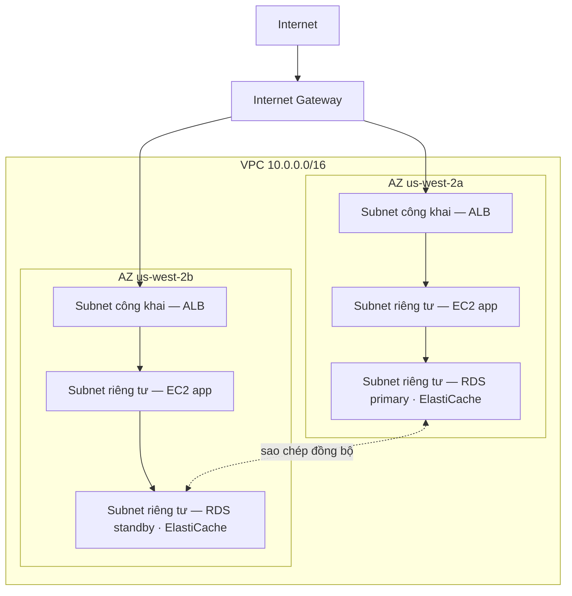

# Chương 11: Góc Riêng Tư Của Bạn Trong Đám Mây

Priya có một tờ giấy với một bản vẽ trên đó.

Đó không phải là một bản vẽ phức tạp. Một hình chữ nhật, được gán nhãn "AWS". Bên trong hình chữ nhật, một cụm các hộp: các EC2 instance, một cơ sở dữ liệu RDS, một cụm ElastiCache. Các đường nối mọi thứ với mọi thứ khác. Và bên ngoài hình chữ nhật, một nhãn duy nhất: "Internet".

Cô đặt nó ở giữa bàn.

---

*Lớp caching đang hoạt động. Redis đã cắt thời gian tải trang từ 188 mili giây xuống 12. Nhưng trong khi Leo ăn mừng chiến thắng đó, Priya đã đọc các nhật ký mạng — và cô không thích những gì cô thấy. Mọi dịch vụ đều ở trên cùng một mạng phẳng. Cơ sở dữ liệu có một địa chỉ IP công khai. Cụm Redis về mặt kỹ thuật có thể tiếp cận từ bên ngoài. Ứng dụng hoạt động, nhưng kiến trúc là một bãi đỗ xe: không hàng rào, không cổng, không khu vực.*

---

"Đây là những gì chúng ta có," cô nói. "Cơ sở dữ liệu của chúng ta có một địa chỉ IP công khai. Lớp cache của chúng ta có thể tiếp cận từ internet. Các EC2 instance của chúng ta đều ở trên cùng một mạng phẳng."

"Nghe có vẻ ổn," Leo nói. "Chúng ta có các security group."

"Các security group mà bạn đã cấu hình," Priya nói. "Vào ban đêm. Trong quá trình thiết lập ban đầu."

Leo không nói gì.

"Tôi không chỉ trích cấu hình," cô nói. "Tôi đang nói rằng khi mọi thứ sống trên một mạng phẳng công khai, một cấu hình sai duy nhất là sự khác biệt giữa một hệ thống hoạt động và một hệ thống có thể truy cập được bởi mọi người trên internet."

Cô cầm một cây bút đỏ và vẽ một vòng tròn quanh cơ sở dữ liệu.

"Cái này không nên tiếp cận được từ internet. Hoàn toàn không. Không qua một quy tắc security group, không qua một cấu hình được củng cố. Nó nên không thể tiếp cận được về mặt cấu trúc."

"Chúng ta cần nói về kiến trúc mạng," Maya nói.

"Chúng ta cần nói về nó ba tháng trước," Priya nói. "Nhưng bây giờ cũng được."

Đội ngũ tụ tập quanh một bảng trắng lần đầu tiên trong nhiều tuần.

**Vấn Đề Với Bãi Đỗ Xe Mở**

Hãy tưởng tượng một gara đỗ xe công cộng khổng lồ. Mười nghìn chiếc xe. Bất kỳ chiếc xe nào cũng có thể đỗ ở bất kỳ đâu. Không có rào chắn giữa các khu vực, không cổng, không phần được dành riêng.

Đây là một mạng mở. Mọi dịch vụ có thể tiếp cận mọi dịch vụ khác. Máy chủ web của bạn có thể nói chuyện với cơ sở dữ liệu. Cơ sở dữ liệu có thể tiếp cận internet. Lớp caching có thể nhận các kết nối từ bất kỳ đâu.

Khi mọi thứ có thể nói chuyện với mọi thứ, một sự xâm phạm ảnh hưởng đến mọi thứ.

"Vậy nếu ai đó đột nhập vào gara đỗ xe," Tom nói, "họ có thể bước vào bất kỳ chiếc xe nào."

"Và từ bất kỳ chiếc xe nào, lái đi bất kỳ đâu," Priya xác nhận. "Chúng ta muốn các hàng rào. Chúng ta muốn các cổng khóa. Chúng ta muốn các khu vực."

VPC là cách bạn xây dựng những khu vực đó trong AWS.

**VPC Là Gì?**

"Khoan — nhưng *tại sao* chúng ta lại làm theo cách đó?" Maya hỏi. "Nếu chúng ta đã có các security group trên mọi tài nguyên, tại sao chúng ta cần một VPC? Các security group không làm cùng công việc sao?"

Các security group và VPC bảo vệ ở các cấp độ khác nhau. Một security group là một quy tắc gắn vào một tài nguyên cụ thể — nó nói "EC2 instance này chỉ chấp nhận lưu lượng trên cổng 8080 từ load balancer." Nhưng nó vẫn ở trên mạng công khai. Địa chỉ IP vẫn tiếp cận được; quy tắc chỉ chặn kết nối ở cửa. Một VPC loại bỏ cửa khỏi đường phố công cộng hoàn toàn. Một tài nguyên trong một subnet riêng tư không có *tuyến* nào đến internet — và theo quy ước không có IP công khai — nên nó không thể tiếp cận được từ internet, bất kể security group nói gì. Đó là một sự đảm bảo về cấu trúc, không phải về cấu hình.

Một **Virtual Private Cloud (VPC)** là một phần được cô lập về mặt logic của đám mây AWS — một mạng riêng tư mà bạn xác định, mà chỉ các tài nguyên của bạn có thể truy cập theo mặc định.

Hãy nghĩ về nó như một bãi đỗ riêng tư có hàng rào bên trong gara đỗ xe công cộng khổng lồ. Bãi của bạn có các quy tắc riêng: ai có thể vào, ai có thể ra, những tuyến nào tồn tại giữa các phần.

Khi bạn tạo một VPC, bạn xác định:

**Một khối CIDR**: Phạm vi các địa chỉ IP có sẵn bên trong mạng của bạn. Ví dụ, `10.0.0.0/16` cho bạn 65.536 địa chỉ IP có thể (10.0.0.0 đến 10.0.255.255).

**Các subnet**: Các phân khu của VPC của bạn, mỗi cái được gán một phần của dải địa chỉ IP của bạn và được liên kết với một Availability Zone cụ thể.

**Các bảng định tuyến**: Các quy tắc xác định lưu lượng mạng đi đâu.

**Internet Gateway**: Kết nối giữa VPC của bạn và internet công khai.

**Subnet: Công Khai So Với Riêng Tư**

Không phải mọi tài nguyên đều nên có thể truy cập công khai.

Máy chủ web của bạn cần chấp nhận lưu lượng từ internet — các trình duyệt của người dùng cần tiếp cận nó.

Cơ sở dữ liệu của bạn *không bao giờ* nên chấp nhận lưu lượng từ internet — chỉ máy chủ web của bạn mới có thể nói chuyện với nó.

Đây là nơi các subnet xuất hiện.

Một **subnet công khai** được kết nối với một Internet Gateway và có thể có các tài nguyên với các địa chỉ IP công khai. Lưu lượng có thể chảy đến và từ internet.

Một **subnet riêng tư** không có tuyến nào đến internet trong bảng định tuyến của nó. Các tài nguyên trong một subnet riêng tư chỉ có thể giao tiếp với các tài nguyên khác trong VPC của bạn (trừ khi bạn thiết lập các tuyến đi cụ thể). Theo quy ước, chúng cũng không có địa chỉ IP công khai.

Đối với Nimbus, thiết kế trở nên rõ ràng:



Load balancer đối mặt với công khai — nó cần nhận lưu lượng từ internet. Các EC2 instance là riêng tư — chúng chỉ nhận lưu lượng từ load balancer. Các cơ sở dữ liệu là riêng tư — chúng chỉ nhận lưu lượng từ các EC2 instance.

"Vậy để tiếp cận cơ sở dữ liệu," Tom nói, "ai đó sẽ phải vượt qua load balancer, rồi qua EC2 instance, rồi qua security group của cơ sở dữ liệu?"

"Ba lớp," Priya xác nhận. "Phòng thủ theo chiều sâu."

---

**Kế Hoạch CIDR Của Nimbus**

"Khoan — nhưng *tại sao* chúng ta lại làm theo cách đó?" Maya hỏi, nhìn vào các lựa chọn khối CIDR. "Tại sao Priya lại cụ thể đến vậy về các phạm vi địa chỉ IP? Chúng ta không thể chỉ dùng bất cứ thứ gì AWS mặc định sao?"

"Vì các khối CIDR rất khó thay đổi sau này," Priya nói. "Và vì nếu chúng ta từng kết nối VPC này với một VPC khác, hoặc với một mạng tại chỗ, các dải IP chồng chéo gây ra các thất bại định tuyến rất khó debug."

Cô vẽ kế hoạch lên bảng trắng.

VPC của Nimbus: `10.0.0.0/16` — tổng cộng 65.536 địa chỉ.

| Subnet | CIDR | AZ | Mục đích |
|---|---|---|---|
| Public A | 10.0.0.0/24 | us-west-2a | Load balancer |
| Public B | 10.0.1.0/24 | us-west-2b | Load balancer |
| Private App A | 10.0.10.0/24 | us-west-2a | Máy chủ app EC2 |
| Private App B | 10.0.11.0/24 | us-west-2b | Máy chủ app EC2 |
| Private Data A | 10.0.20.0/24 | us-west-2a | RDS, ElastiCache |
| Private Data B | 10.0.21.0/24 | us-west-2b | RDS, ElastiCache |

"Tại sao không chỉ làm mọi thứ thành /16?" Leo hỏi.

"Vì các subnet ở các AZ khác nhau không nên chia sẻ một không gian địa chỉ. Mỗi subnet ở trong một AZ. Nếu chúng ta từng peer VPC này với một cái khác, chúng ta càng chi tiết, chúng ta càng ít có khả năng có xung đột. Và mỗi /24 cho chúng ta 251 địa chỉ có thể dùng — nhiều hơn đủ cho bất kỳ tầng đơn lẻ nào."

"AWS dành riêng năm địa chỉ trong mỗi subnet," Tom nhận xét, nhìn vào tài liệu. "Đó là lý do nó là 251, không phải 256."

"Đúng. Bốn cái đầu và một cái cuối. Địa chỉ mạng, router VPC, máy chủ DNS, sử dụng tương lai, broadcast."

"Vậy /24 là cái nhỏ nhất bạn sẽ đi?"

"Trên thực tế. Bạn sẽ dùng /28 cho các subnet rất nhỏ — như một subnet VPN gateway, chỉ cần một nhúm IP. Nhưng cho các tầng ứng dụng, /24 là mức tối thiểu hợp lý."

Tom viết các con số xuống và tính toán sự khác biệt chi phí hàng tháng giữa các kích thước. Anh luôn làm vậy.

---

**Các Lỗi Lập Kế Hoạch CIDR Cần Tránh**

"Chúng ta đã nghĩ về điều gì xảy ra nếu chúng ta vượt quá một subnet chưa?" Priya hỏi. Cô không hỏi vì cô không biết. Cô hỏi vì phần còn lại của đội ngũ cần thấm nhuần câu trả lời.

Leo suy nghĩ về nó. "Chúng ta có thể thêm các subnet?"

"Bạn có thể thêm các subnet vào một VPC. Nhưng bạn không thể đổi kích thước một subnet hiện có. Nếu subnet app riêng tư của bạn đầy — 251 địa chỉ không đủ — bạn sẽ cần tạo một subnet mới và di chuyển các instance sang nó."

"Điều đó thực sự xảy ra thường xuyên đến mức nào?"

"Hiếm khi, nếu bạn lập kế hoạch tốt. Nhưng mọi người mắc ba lỗi phổ biến."

Cô liệt kê chúng:

**Lỗi một**: Dùng một CIDR VPC quá nhỏ. Nếu bạn dùng `10.0.0.0/24` cho cả VPC (254 địa chỉ), bạn sẽ hết không gian trước khi bạn lập kế hoạch xong các subnet. Bắt đầu với `/16` cho sự linh hoạt.

**Lỗi hai**: Dùng các CIDR chồng chéo qua các VPC. Nếu VPC production của bạn là `10.0.0.0/16` và VPC staging của bạn cũng là `10.0.0.0/16`, bạn không bao giờ có thể peer chúng hoặc kết nối chúng qua một transit gateway. Các router sẽ không biết gửi lưu lượng đến VPC nào.

**Lỗi ba**: Không dành riêng không gian địa chỉ cho các tầng tương lai. Kế hoạch của Nimbus để `10.0.30.0/24` và `10.0.31.0/24` chưa được gán — chỗ cho một tầng công cụ nội bộ tương lai, một subnet giám sát, hoặc một subnet điểm cuối VPN, mà không phải tái cấu trúc toàn bộ không gian địa chỉ.

"Hãy lập kế hoạch cho gấp đôi những gì bạn nghĩ bạn cần," Priya nói. "Các subnet miễn phí. Không gian địa chỉ IP từ một `/16` rất dồi dào. Cái giá của việc lập kế hoạch sai là một cuộc di chuyển mạng."

---

**NAT Gateway: Subnet Riêng Tư Vẫn Có Thể Tải Xuống**

Các subnet riêng tư không thể tiếp cận internet. Nhưng đôi khi, chúng cần. EC2 instance của bạn cần tải xuống một bản cập nhật phần mềm. Ứng dụng của bạn cần gọi một API bên ngoài.

Đây là nơi **NAT Gateway** (Network Address Translation) xuất hiện.

Một NAT Gateway ngồi trong một subnet công khai. Các tài nguyên trong các subnet riêng tư có thể gửi lưu lượng đi đến NAT Gateway, chuyển tiếp nó đến internet — nhưng internet không thể khởi tạo các kết nối ngược lại.

Nó giống như một cửa quay một chiều. Bạn có thể đi ra. Không ai bên ngoài có thể vào.

"Cái đó tốn bao nhiêu mỗi tháng?" Tom hỏi.

Định giá NAT Gateway có hai thành phần: một phí theo giờ cho mỗi NAT Gateway, cộng với một phí xử lý dữ liệu theo mỗi GB.

Tại thời điểm Nimbus thiết lập điều này, đó là khoảng 32 đô la/tháng cho mỗi NAT Gateway, cộng với 0,045 đô la cho mỗi GB dữ liệu được xử lý. Đối với các khối lượng lưu lượng nhỏ, chi phí cố định chiếm ưu thế. Ở quy mô lớn, các phí dữ liệu có thể đáng kể.

Tom thiết lập một cảnh báo thanh toán cho các chi phí xử lý dữ liệu trước khi anh hoàn thành cấu hình NAT Gateway. Anh đã thấy chi phí dữ liệu AWS trông như thế nào khi không ai theo dõi chúng.

Điều bất ngờ khiến các đội ngũ mất cảnh giác: mỗi byte chảy qua một NAT Gateway đều bị tính phí. Nếu các EC2 instance của bạn trong các subnet riêng tư đang tải xuống các gói phần mềm lớn, truyền log đến các dịch vụ bên ngoài, hoặc gửi dữ liệu đáng kể đến các API bên ngoài, các phí dữ liệu NAT Gateway xuất hiện trên hóa đơn như một bất ngờ. Giải pháp cho lưu lượng AWS-đến-AWS: VPC Endpoint định tuyến lưu lượng đến các dịch vụ AWS (S3, DynamoDB) một cách riêng tư, bỏ qua NAT Gateway hoàn toàn và loại bỏ các phí dữ liệu đó.

"Vậy các EC2 instance trong subnet riêng tư tải xuống các bản cập nhật OS qua NAT Gateway," Tom nói. "Các bản cập nhật đó là bao nhiêu gigabyte?"

"Mỗi instance, mỗi tháng, có thể hai đến năm GB," Leo nói.

"Nhân mười instance. Nhân mười hai tháng. Ở 0,045 đô la mỗi GB—"

"Mười một đến hai mươi bảy đô la mỗi năm," Priya kết thúc. "Trong trường hợp này, chấp nhận được."

"Nhưng nếu chúng ta đang truyền log — như gửi tất cả log ứng dụng đến một dịch vụ quan sát bên ngoài—"

"Chúng ta sẽ định tuyến chúng qua một VPC Endpoint hoặc dùng CloudWatch Logs thay vì đi ra qua NAT."

Tom đóng công cụ tính toán. Phép toán đã đủ rõ ràng.

### NAT Instance: Lựa Chọn Tiết Kiệm

"Khoan," Tom nói, vẫn nhìn chằm chằm vào trang định giá. "Chúng ta đang trả tiền theo mỗi gigabyte chỉ để cho các instance riêng tư tiếp cận internet? Đó là lựa chọn duy nhất sao?"

"Đó là lựa chọn được quản lý," Priya nói. "Có một cách cũ hơn, nhưng nó đi kèm với các sự đánh đổi."

Trước khi NAT Gateway tồn tại, các đội ngũ đạt được cùng định tuyến đi với một EC2 instance thông thường — một "NAT instance." Bạn sẽ khởi chạy một EC2 instance trong một subnet công khai, bật chuyển tiếp IP trong OS, tắt kiểm tra nguồn/đích (mà AWS bật theo mặc định để loại bỏ các gói không được gửi đến instance), và trỏ bảng định tuyến của subnet riêng tư vào ENI của instance. Lưu lượng từ các instance riêng tư sẽ chảy qua nó đến internet, giống như một NAT Gateway.

Nó vẫn hoạt động. AWS vẫn ghi tài liệu về nó. Và ở các khối lượng lưu lượng rất thấp — một môi trường dev đơn lẻ nơi một nhúm instance thỉnh thoảng tải xuống các gói — một NAT instance `t3.micro` có thể tốn dưới năm đô la một tháng, so với phí theo giờ cố định cộng các phí theo mỗi GB của NAT Gateway.

| | NAT Gateway | NAT Instance |
|---|---|---|
| Quản lý | Được quản lý hoàn toàn bởi AWS | Bạn quản lý EC2 |
| Tính sẵn sàng | Dự phòng trong AZ | EC2 đơn lẻ — điểm thất bại duy nhất |
| Băng thông | Lên đến 100 Gbps, tự động mở rộng | Bị giới hạn bởi loại EC2 instance |
| Chi phí | 0,045 đô la/GB + phí theo giờ | Chỉ chi phí EC2 instance |

Lợi thế chi phí biến mất nhanh chóng. Ở các khối lượng lưu lượng đáng kể, phí NAT Gateway theo mỗi GB cạnh tranh với loại EC2 instance bạn sẽ cần để xử lý băng thông đó — và NAT Gateway đòi hỏi không vá lỗi, không giám sát, và không phản ứng sự cố khi nó thất bại (nó không thất bại).

"Vậy khi nào chúng ta thực sự dùng một NAT instance?" Leo hỏi.

"Một môi trường dev dùng một lần," Priya nói. "Nơi nào đó bạn đang chạy một hoặc hai instance, thỉnh thoảng cập nhật gói, và muốn giảm thiểu chi phí cố định. Các khối lượng công việc production — bất cứ thứ gì cần có sẵn — NAT Gateway, một cho mỗi AZ."

Kỳ thi kiểm tra sự đánh đổi này theo tên. Mẫu: "giảm thiểu chi phí NAT trong một môi trường dev hoặc test với lưu lượng thấp" chỉ về NAT Instance. "Khối lượng công việc production đòi hỏi tính sẵn sàng cao" chỉ về NAT Gateway được triển khai mỗi AZ.

Bạn có thể đang tự hỏi: nếu các security group đã tồn tại và chặn lưu lượng theo mặc định, tại sao một VPC với các subnet riêng tư lại thêm sự bảo vệ đáng kể? Vì "bị chặn bởi một security group" và "không thể tiếp cận về mặt cấu trúc" là những thứ khác nhau. Một cấu hình security group sai — một quy tắc sai, một cổng mở — có thể phơi bày một tài nguyên có một IP công khai. Một tài nguyên trong một subnet riêng tư không có IP công khai để tiếp cận ngay từ đầu. Bạn sẽ phải xâm phạm load balancer và một EC2 instance đang chạy trước khi bạn thậm chí có thể cố gắng tiếp cận cơ sở dữ liệu. Các subnet riêng tư thực thi sự cô lập ở cấp độ mạng, không phải cấp độ quy tắc.

**Bảng Định Tuyến: Cách Lưu Lượng Tìm Đường Của Nó**

Mỗi subnet có một **bảng định tuyến** cho biết lưu lượng đi đâu.

Một bảng định tuyến subnet công khai điển hình trông như thế này:

| Đích | Mục tiêu                     |
|-------------|-----------------------------|
| 10.0.0.0/16 | local                       |
| 0.0.0.0/0   | igw-xxxx (Internet Gateway) |

Quy tắc đầu tiên: lưu lượng đến bất kỳ IP nào trong phạm vi VPC của bạn ở lại cục bộ. Quy tắc thứ hai: tất cả lưu lượng khác (`0.0.0.0/0` nghĩa là "mọi thứ") đi đến Internet Gateway.

Một bảng định tuyến subnet riêng tư:

| Đích | Mục tiêu               |
|-------------|------------------------|
| 10.0.0.0/16 | local                  |
| 0.0.0.0/0   | nat-xxxx (NAT Gateway) |

Lưu lượng subnet riêng tư ở lại cục bộ hoặc thoát qua NAT Gateway. Không có tuyến trực tiếp đến Internet Gateway.

**Security Group So Với NACL (Xem Trước)**

Bên trong VPC, bạn có hai công cụ để kiểm soát lưu lượng ở cấp độ tài nguyên:

**Security Group** (Chương 15 đề cập chi tiết về điều này) hoạt động như các tường lửa ảo cho các tài nguyên riêng lẻ — một EC2 instance, một RDS instance, một load balancer. Chúng có *trạng thái* (stateful): nếu lưu lượng được phép vào, lưu lượng phản hồi được tự động phép ra.

**Network ACL (NACL)** hoạt động ở cấp độ subnet và *không có trạng thái* (stateless): bạn phải phép rõ ràng cả lưu lượng vào và ra riêng biệt.

Đối với hầu hết các trường hợp sử dụng, các Security Group là đủ. NACL thêm một lớp bổ sung khi bạn cần các kiểm soát cấp độ subnet — ví dụ, chặn một dải IP cụ thể không bao giờ tiếp cận một subnet.

"Security group ở cấp độ instance," Leo viết lên bảng trắng. "NACL ở cấp độ subnet."

"Và không bao giờ để cổng 22 mở cho 0.0.0.0/0," Priya thêm vào, nhìn Leo.

"Đó là một lần," Leo nói.

"Nó luôn chính xác là một lần," Priya nói, "cho đến khi nó không phải vậy."

"Và nếu ai đó cố gắng đột nhập thì sao?" Priya nói, vẫn ở bảng trắng. "Không phải qua một security group bị cấu hình sai — nếu họ xâm phạm chính load balancer thì sao? Điều gì ngăn họ xoay sang subnet riêng tư?"

"Các EC2 instance subnet riêng tư chỉ chấp nhận lưu lượng từ security group của load balancer," Leo nói. "Ngay cả khi load balancer bị xâm phạm, kẻ tấn công chỉ có thể tạo các yêu cầu trông như các lần gọi API bình thường."

"Và cơ sở dữ liệu chỉ chấp nhận lưu lượng từ security group EC2," Priya nói. "Phòng thủ theo chiều sâu. Mỗi lớp giả định lớp trước có thể thất bại."

---

**VPC Flow Logs: Thấy Những Gì Đang Xảy Ra**

"Chúng ta cần mắt trên mạng," Priya nói, ba ngày vào việc thiết kế lại VPC.

"Chúng ta có các security group và NACL," Leo nói. "Lưu lượng được kiểm soát."

"Được kiểm soát không có nghĩa là nhìn thấy được. Nếu điều gì đó kỳ lạ xảy ra — một nỗ lực kết nối bất ngờ, lưu lượng đến một cổng lạ — làm sao chúng ta biết?"

VPC Flow Logs ghi lại metadata về lưu lượng mạng chảy qua VPC của bạn. Không phải nội dung gói tin — chỉ thông tin cấp độ kết nối: IP nguồn, IP đích, cổng, giao thức, số gói, số byte, thời gian bắt đầu, thời gian kết thúc, và liệu lưu lượng đã được chấp nhận hay từ chối.

Một mục flow log điển hình trông như thế này:

```
2 123456789012 eni-0abc123 10.0.10.5 10.0.20.8 49321 5432 6 20 4320 1620000000 1620000060 ACCEPT OK
```

Điều này cho bạn biết: từ `10.0.10.5` (một EC2 instance trong subnet app) đến `10.0.20.8` (RDS instance), cổng 5432 (PostgreSQL), 20 gói, 4.320 byte, được chấp nhận. Lưu lượng bình thường.

Nhưng vài ngày sau khi bật Flow Logs, Priya tìm thấy điều này:

```
2 123456789012 eni-0abc123 185.220.101.55 10.0.10.5 0 8080 6 1 40 1620003200 1620003201 REJECT OK
```

Một IP bên ngoài — `185.220.101.55` — đã cố gắng một kết nối đến EC2 instance trên cổng 8080. Kết nối bị từ chối bởi security group. Nhưng nỗ lực đã được ghi log.

Cô tra cứu IP. Nó thuộc về một khối địa chỉ Romania nổi tiếng về quét tự động — loại thăm dò tiếng ồn nền mà mọi IP công khai trên internet liên tục nhận được.

"Ai đó đang thăm dò chúng ta," cô nói.

"Nhưng bị từ chối," Leo nói.

"Lần này. Bật GuardDuty" — một dịch vụ phát hiện mối đe dọa chúng ta sẽ gặp đúng cách ở Chương 17 — "trước khi chúng ta tiếp tục. Chúng ta cần phát hiện hành vi, không chỉ chặn vành đai."

Flow Logs được lưu trữ trong CloudWatch Logs hoặc S3. Chúng có thể được truy vấn bằng CloudWatch Insights hoặc Athena. Priya thiết lập một truy vấn CloudWatch Insights chạy hàng đêm và đánh dấu bất kỳ nỗ lực kết nối bị từ chối nào từ các dải IP không phải AWS.

"Cái đó tốn bao nhiêu mỗi tháng?" Tom hỏi.

"Flow logs được tính phí theo mỗi GB dữ liệu được nạp vào CloudWatch hoặc S3. Ở khối lượng lưu lượng của chúng ta, có lẽ tám đến mười lăm đô la một tháng."

Tom dừng lại. "Và lựa chọn thay thế là không biết ai đó đang thăm dò mạng của chúng ta."

"Đúng vậy."

"Vậy thì được," anh nói, và mở console.

**Đọc Một Cuộc Quét Cổng Trong Flow Logs**

Hai tuần sau khi bật flow logs, Priya chạy truy vấn CloudWatch Insights hàng đêm của cô và tìm thấy điều gì đó mới. Không phải một kết nối bị từ chối — hàng chục, theo trình tự nhanh, từ cùng một IP nguồn, qua các cổng liên tiếp.

```
185.220.101.55 → 10.0.10.5 port 22   REJECT
185.220.101.55 → 10.0.10.5 port 23   REJECT
185.220.101.55 → 10.0.10.5 port 25   REJECT
185.220.101.55 → 10.0.10.5 port 80   REJECT
185.220.101.55 → 10.0.10.5 port 443  REJECT
185.220.101.55 → 10.0.10.5 port 3306 REJECT
185.220.101.55 → 10.0.10.5 port 5432 REJECT
185.220.101.55 → 10.0.10.5 port 6379 REJECT
```

Tất cả trong một cửa sổ năm giây. Tất cả bị từ chối.

"Đó là một cuộc quét cổng," Priya nói. "Ai đó đang thăm dò những dịch vụ nào instance này đang chạy."

"Nhưng tất cả bị từ chối," Leo nói. "Vậy security group đang làm đúng công việc của nó."

"Security group đang làm đúng công việc của nó. Cuộc quét vẫn cung cấp thông tin cho kẻ tấn công — nó cho họ biết những cổng nào *không* từ chối trong một thời gian chờ, điều đó nghĩa là những cổng đó mở ở đâu đó. Và nó cho họ biết host này còn sống và đáng điều tra."

"Chúng ta làm gì?"

"Hai điều," Priya nói. "Thứ nhất: thêm một quy tắc NACL để chặn dải /24 mà IP đó thuộc về. Không chỉ IP đó — cả subnet. Các trình quét cổng xoay vòng các IP trong một dải. Thứ hai: thêm một cảnh báo CloudWatch kích hoạt khi bất kỳ IP nguồn đơn lẻ nào tạo ra hơn mười kết nối bị từ chối trong sáu mươi giây. Mẫu đó hầu như luôn là một cuộc quét."

Cô thiết lập cả hai. Cảnh báo kích hoạt hai lần trong tuần tiếp theo — một lần từ cùng dải Romania, một lần từ một trình quét tự động đặt tại Singapore. Cả hai đều bị chặn ở NACL trong vòng vài phút sau khi phát hiện.

Flow logs không dừng các cuộc tấn công. Chúng làm cho các cuộc tấn công nhìn thấy được. Và các cuộc tấn công nhìn thấy được có thể được phản ứng. Lựa chọn thay thế — lưu lượng chảy một cách vô hình — nghĩa là dấu hiệu đầu tiên của một vấn đề là thiệt hại, không phải nỗ lực.

---

**Bẫy NAT Gateway Đơn Lẻ**

Ba tháng sau việc thiết kế lại VPC, Priya chạy một mô phỏng sự cố. Cô muốn biết điều gì sẽ xảy ra với Nimbus nếu availability zone `us-west-2a` gặp một sự gián đoạn.

Hầu hết đều ổn. Load balancer chuyển đổi dự phòng sang các instance ở `us-west-2b`. RDS standby ở `us-west-2b` đã hoạt động. ElastiCache thăng cấp replica. Ứng dụng tiếp tục phục vụ các yêu cầu.

Sau đó Leo nhận thấy các EC2 instance của anh ở `us-west-2b` đã dừng nhận các thông báo cập nhật OS. Anh kiểm tra cấu hình NAT Gateway.

Có một cái. Ở `us-west-2a`.

"Tất cả lưu lượng internet đi từ các subnet riêng tư ở cả hai AZ định tuyến qua một NAT Gateway ở một AZ," Priya nói.

"Vậy nếu `us-west-2a` sập—"

"Mọi EC2 instance ở `us-west-2b` mất quyền truy cập internet đi. Chúng không thể tải xuống các bản cập nhật. Chúng không thể tiếp cận các API bên ngoài. Các lần tra cứu Secrets Manager không được cache sẽ thất bại. Bất cứ thứ gì đòi hỏi internet đi sẽ hỏng."

Cách khắc phục: một NAT Gateway cho mỗi AZ. Các subnet riêng tư của mỗi AZ định tuyến lưu lượng đi đến NAT Gateway ở cùng AZ. Khi một AZ thất bại, chỉ lưu lượng của AZ đó bị ảnh hưởng.

"Và mức giá cho cách khắc phục đó?" Tom hỏi.

"Thêm ba mươi hai đô la một tháng cho NAT Gateway của AZ thứ hai."

Tom im lặng một lúc.

"Dung lượng EC2 ở `us-west-2b` thất bại trong việc tiếp cận các API bên ngoài trong một sự cố," Priya nói, "tốn nhiều hơn ba mươi hai đô la."

Tom phê duyệt thay đổi.

Đây là một trong những lỗi thiết kế VPC phổ biến nhất: một NAT Gateway trông sẵn sàng cao nhưng thực ra là một điểm thất bại duy nhất. Nếu bạn có các tài nguyên ở ba AZ và một NAT Gateway, bạn có khả năng phục hồi tính toán ba-AZ nhưng khả năng phục hồi mạng một-AZ. Hai cái không khớp nhau.

Quy tắc: một NAT Gateway cho mỗi AZ, trong subnet công khai của AZ đó. Bảng định tuyến riêng tư của mỗi AZ trỏ đến NAT Gateway riêng của nó. Chi phí khiêm tốn. Sự cải thiện tính sẵn sàng là thật.


---

**VPC Peering: Kết Nối Các Mạng Riêng Tư**

Nếu Nimbus phát triển thành nhiều VPC thì sao? (Điều này xảy ra. Các đội ngũ lớn lên. Các dịch vụ được cô lập vào các tài khoản riêng biệt.)

**VPC Peering** cho phép hai VPC giao tiếp một cách riêng tư như thể chúng ở trên cùng một mạng. Lưu lượng không rời mạng riêng của AWS.

Các giới hạn quan trọng:

- VPC peering không có tính chuyển tiếp (transitive). Nếu VPC A peer với VPC B, và VPC B peer với VPC C, A và C không thể giao tiếp — trừ khi bạn thêm một peer trực tiếp A-C.
- Các khối CIDR không thể chồng chéo giữa các VPC được peer.

Đối với các kiến trúc lớn hơn với nhiều VPC, **AWS Transit Gateway** (Chương 25) xử lý định tuyến chuyển tiếp mà không đòi hỏi một lưới đầy đủ các kết nối peering.

---

**AWS PrivateLink: Truy Cập Riêng Tư Đến Các Dịch Vụ AWS**

"Còn việc tiếp cận S3 từ subnet riêng tư thì sao?" Leo hỏi. "Các EC2 instance của chúng ta ghi các hóa đơn vào S3. Hiện tại lưu lượng đó đi ra qua NAT Gateway."

"VPC Endpoints," Priya nói. "Cụ thể, Gateway Endpoints cho S3 và DynamoDB — chúng miễn phí."

Một **VPC Endpoint** tạo một kết nối riêng tư giữa VPC của bạn và một dịch vụ AWS, bỏ qua internet công khai hoàn toàn. Lưu lượng giữa subnet riêng tư của bạn và dịch vụ AWS ở lại trên mạng AWS. Không phí NAT Gateway. Không phơi bày internet.

Đối với S3 và DynamoDB, **Gateway Endpoints** miễn phí và dễ dàng: thêm một mục vào bảng định tuyến trỏ lưu lượng S3/DynamoDB đến endpoint thay vì đến NAT Gateway.

Đối với các dịch vụ AWS khác (Secrets Manager, KMS, SNS, SQS), **Interface Endpoints** tạo một giao diện mạng đàn hồi (ENI) trong subnet của bạn với một địa chỉ IP riêng tư. Lưu lượng đến dịch vụ đi đến IP riêng tư đó. Interface endpoints tốn tiền — khoảng 0,01 đô la/giờ **cho mỗi AZ mà endpoint được cấp phép trong đó** (một endpoint với các ENI ở ba AZ tốn gấp ba lần mức theo giờ), cộng với khoảng 0,01 đô la/GB dữ liệu được xử lý — nhưng chúng loại bỏ nhu cầu định tuyến các lần gọi API nhạy cảm (như các lần tra cứu Secrets Manager) qua một NAT Gateway hoặc qua internet công khai.

"Vậy các EC2 instance của chúng ta có thể tiếp cận S3, DynamoDB, Secrets Manager, và KMS," Priya nói, "tất cả từ subnet riêng tư, không có bất kỳ phơi bày internet nào, và đối với S3 và DynamoDB, không có bất kỳ phí dữ liệu NAT Gateway nào."

Tom tính toán lại. Khoản tiết kiệm lưu lượng S3 sẽ bù đắp chi phí Interface Endpoint cho Secrets Manager trong vòng vài tháng.

"PrivateLink là tên chung," Priya thêm vào. "AWS PrivateLink là công nghệ nền tảng cho Interface Endpoints. Kỳ thi dùng cả hai thuật ngữ."

---

**Một Danh Sách Kiểm Tra Debug**

Ba tháng sau việc thiết kế lại VPC, Leo làm hỏng mạng. Không kịch tính — anh đã sửa đổi một liên kết bảng định tuyến và vô tình ngắt kết nối subnet app riêng tư khỏi tuyến NAT Gateway của nó.

Các EC2 instance không thể tiếp cận các API bên ngoài. Chúng có thể tiếp cận nhau, và chúng có thể tiếp cận các cơ sở dữ liệu. Chỉ là không phải internet. Các lần gọi HTTPS đi bắt đầu thất bại.

Anh dành bốn mươi phút khắc phục sự cố trước khi Priya đưa cho anh một danh sách kiểm tra.

"Khi điều gì đó không tiếp cận được điều gì đó khác trong một VPC, hãy kiểm tra những cái này theo thứ tự," cô nói.

1. **Security group trên nguồn**: Quy tắc đi có đúng không? Nó có cho phép lưu lượng bạn đang cố gắng gửi không?
2. **Security group trên đích**: Quy tắc đến có đúng không? Nó có cho phép lưu lượng từ nguồn không?
3. **NACL trên subnet nguồn**: Có một quy tắc từ chối đến chặn lưu lượng phản hồi không? Có một quy tắc cho phép đi không?
4. **NACL trên subnet đích**: Có một quy tắc cho phép đến không? Có một quy tắc cho phép đi cho các phản hồi không?
5. **Bảng định tuyến trên subnet nguồn**: Nó có một tuyến đến đích không? Tuyến có trỏ đến mục tiêu đúng (NAT Gateway, IGW, VPC Endpoint) không?
6. **Bảng định tuyến trên subnet đích**: Nó có một tuyến quay lại nguồn không?
7. **Chính sách VPC Endpoint**: Nếu dùng một VPC Endpoint, chính sách endpoint có cho phép hành động không?
8. **Quyền IAM**: Vai trò EC2 có quyền gọi dịch vụ không? (Đối với các lần gọi API AWS)

Leo tìm thấy nó ở bước 5. Bảng định tuyến đã được liên kết lại với subnet riêng tư sai. Tuyến NAT Gateway bị thiếu.

"Nếu tôi có danh sách này ba tháng trước," anh nói, "tôi sẽ tìm thấy nó trong năm phút."

"Bạn sẽ có nó từ giờ trở đi," Priya nói.

## Direct Connect: Đường Dây Riêng Biệt

Ba tháng sau việc thiết kế lại VPC, Nimbus chốt một thương vụ với Harborview Dining Group — một chuỗi doanh nghiệp một trăm địa điểm xử lý hai triệu đô la giao dịch mỗi ngày.

Cuộc gọi đánh giá kỹ thuật bắt đầu tốt. Sau đó nhân viên tuân thủ của họ bỏ tắt tiếng.

"Chúng tôi không thể định tuyến dữ liệu giao dịch production qua internet công khai," cô nói. "Các kiểm toán viên của chúng tôi đòi hỏi một đường mạng riêng biệt, riêng tư, có thể kiểm toán giữa trung tâm dữ liệu của chúng tôi và bất kỳ môi trường đám mây nào. Site-to-Site VPN không chấp nhận được. Nó chia sẻ băng thông với mọi người khác. Nó đi cùng các dây với lưu lượng tiêu dùng."

Tom nhìn Leo. Leo nhìn Priya.

"Nói chính xác," Priya nói cẩn thận, "bản thân PCI DSS không cấm một VPN được mã hóa qua internet — vận chuyển được mã hóa thỏa mãn tiêu chuẩn. Những gì bạn đang mô tả là chính sách nội bộ của các kiểm toán viên của bạn, vốn nghiêm ngặt hơn. Điều đó là hợp pháp. Và có một dịch vụ cho nó."

**AWS Direct Connect** là một kết nối mạng vật lý riêng biệt giữa trung tâm dữ liệu tại chỗ của bạn và AWS. Kết nối bỏ qua internet công khai hoàn toàn — lưu lượng của bạn không bao giờ chạm hạ tầng chia sẻ, không bao giờ cạnh tranh băng thông với bất kỳ ai khác, và không bao giờ đi một dây không phải của bạn.

Thiết lập Direct Connect nghĩa là làm việc với AWS và một nhà cung cấp colocation hoặc mạng để cài đặt một cross-connect vật lý tại một địa điểm Direct Connect — một trung tâm dữ liệu nơi AWS có thiết bị riêng biệt. Một khi liên kết vật lý đã sẵn sàng, bạn thiết lập các giao diện ảo trên nó kết nối với VPC của bạn hoặc với các dịch vụ AWS trực tiếp.

**Các đặc điểm then chốt:**

Băng thông đến trong hai dạng. *Các kết nối riêng biệt (dedicated)* đi thẳng đến phần cứng AWS: 1 Gbps, 10 Gbps, hoặc 100 Gbps. *Các kết nối được host (hosted)* đi qua một AWS Partner và cung cấp các lựa chọn chi tiết hơn từ 50 Mbps lên đến 10 Gbps — hữu ích khi bạn không cần một cổng riêng biệt đầy đủ.

Độ trễ nhất quán. Vì bạn không cạnh tranh băng thông internet, thời gian đi-về đến AWS có thể đoán trước. Đối với Harborview, có các hệ thống điểm bán hàng thực hiện hàng trăm lần gọi API mỗi giao dịch, độ trễ dưới 5ms nhất quán là sự khác biệt giữa một lần thanh toán 200ms và một lần 400ms.

Tính riêng tư là về cấu trúc, không phải về cấu hình. Một Site-to-Site VPN được mã hóa, nhưng nó vẫn đi qua internet công khai — cùng hạ tầng vật lý mà mọi người khác dùng. Lưu lượng Direct Connect không bao giờ chạm internet công khai. Đối với đội ngũ tuân thủ của Harborview, đó là yêu cầu, và không có lượng cấu hình VPN nào sẽ thỏa mãn nó.

Chi phí cao hơn VPN. Bạn trả một phí cổng-giờ cho kết nối Direct Connect cộng với định giá truyền dữ liệu. Kết nối không rẻ, và nó mất vài tuần đến vài tháng để cấp phép — một cài đặt cross-connect vật lý không phải là thứ bạn quay lên vào một chiều thứ Sáu.

"Khoan," Maya nói. "Nếu VPN được mã hóa, tại sao việc nó đi qua internet công khai lại quan trọng?"

Vì yêu cầu tuân thủ không chỉ về mã hóa — nó về sự cô lập. VPN mã hóa nội dung của lưu lượng, nhưng lưu lượng vẫn đi qua hạ tầng vật lý chia sẻ. Bất kỳ ai kiểm soát một router trên đường đi đều có thể thấy các gói được mã hóa, ghi lại chúng, và cố gắng giải mã chúng sau đó. Một liên kết vật lý riêng biệt không có router chia sẻ. Đường đi về mặt vật lý là của bạn. Đối với các ngành với các yêu cầu chủ quyền dữ liệu nghiêm ngặt — tài chính, chăm sóc sức khỏe, chính phủ — sự phân biệt đó là sự khác biệt giữa tuân thủ và không.

"Một điều nữa," Priya nói. "Direct Connect là riêng tư theo mặc định, nhưng không được mã hóa theo mặc định. Nếu bạn muốn cả hai — riêng tư và được mã hóa — bạn chạy một IPSec VPN trên kết nối Direct Connect. Điều đó cho bạn băng thông riêng biệt cộng với mã hóa. Cả hai."

Tom đã tìm thấy trang định giá rồi. Anh nhìn vào cam kết hàng tháng cho một kết nối Dedicated 1 Gbps.

"Khối lượng 2 triệu đô la hàng ngày của Harborview nghĩa là cái này tự trả cho mình trong các lỗi làm tròn," anh nói.

Anh gửi đề xuất.

---

> **Mẹo Thi — Direct Connect so với VPN**
>
> *SAA-C03 Domain: Thiết kế kiến trúc an toàn (Domain 1)*
>
> - **VPN:** được mã hóa, nhanh để cấp phép (vài phút), đi qua internet công khai, băng thông và độ trễ thay đổi.
> - **Direct Connect:** liên kết vật lý riêng biệt, băng thông và độ trễ nhất quán, riêng tư (lưu lượng không bao giờ chạm internet công khai), nhưng không được mã hóa theo mặc định. Mất vài tuần đến vài tháng để cấp phép.
> - **Được mã hóa VÀ riêng tư:** chạy một IPSec VPN trên Direct Connect. Bạn có được cả băng thông riêng biệt và mã hóa.
> - **Kích hoạt thi:** "băng thông nhất quán, riêng tư, riêng biệt đến AWS" hoặc "tuân thủ đòi hỏi lưu lượng không đi qua internet công khai" → Direct Connect. "Được mã hóa VÀ riêng tư" → Direct Connect + IPSec VPN. "Nhanh để thiết lập, chi phí thấp hơn, chấp nhận dùng internet công khai" → Site-to-Site VPN.
> - **Chi phí và thời gian thiết lập** là các sự đánh đổi mà kỳ thi kiểm tra: VPN = nhanh + rẻ; Direct Connect = chậm để cấp phép + đắt + nhất quán.

---

### Client VPN: Truy Cập Từ Xa Cho Người Dùng Riêng Lẻ

Direct Connect và Site-to-Site VPN kết nối các mạng — toàn bộ một văn phòng hoặc trung tâm dữ liệu đến AWS. Nhưng các kỹ sư cũng cần kết nối các laptop riêng lẻ với một VPC: để debug một EC2 instance riêng tư, truy vấn một cơ sở dữ liệu RDS riêng tư, hoặc truy cập công cụ nội bộ từ nhà.

"Chúng ta đã có cái này rồi sao?" Maya hỏi. "Chúng ta có một bastion host. Leo không thể chỉ SSH qua nó sao?"

"Đối với SSH, có," Priya nói. "Nhưng nếu Leo cần kết nối với RDS instance từ một GUI cơ sở dữ liệu trên laptop của anh thì sao? Hoặc truy vấn bảng điều khiển chỉ số nội bộ qua HTTP? Bastion chỉ xử lý SSH. Client VPN hoạt động cho bất kỳ giao thức nào."

**AWS Client VPN** là một endpoint VPN được quản lý cho phép các người dùng riêng lẻ kết nối với VPC của bạn từ bất kỳ thiết bị nào, từ bất kỳ đâu. Người dùng cài đặt một client OpenVPN tiêu chuẩn trên laptop của họ; endpoint VPN ở trong AWS.

Các đặc điểm then chốt:

- Được quản lý bởi AWS — bạn không chạy một máy chủ VPN
- Dựa trên OpenVPN — hoạt động với bất kỳ client OpenVPN tiêu chuẩn nào
- Xác thực qua Active Directory (dựa trên người dùng), TLS lẫn nhau dựa trên chứng chỉ, hoặc xác thực liên kết SAML 2.0 (SSO qua một nhà cung cấp danh tính)
- Mỗi client được kết nối nhận một IP riêng tư trong VPC của bạn và có thể truy cập các tài nguyên riêng tư (RDS, ElastiCache, các dịch vụ nội bộ) như thể chúng ở bên trong VPC
- Hỗ trợ **split-tunnel** (chỉ lưu lượng VPC đi qua VPN — lưu lượng internet đi trực tiếp) hoặc **full-tunnel** (tất cả lưu lượng qua VPN)

"Split-tunnel," Tom nói ngay lập tức.

"Tại sao?" Leo hỏi.

"Vì full-tunnel nghĩa là luồng Netflix của tôi đi qua endpoint VPN của chúng ta và tôi trả các phí truyền dữ liệu trên nó."

Điều đó đúng. Split-tunnel là khuyến nghị mặc định cho truy cập của lập trình viên: lưu lượng hướng-VPC định tuyến qua VPN, lưu lượng internet đi thẳng ra. VPN chỉ xử lý những gì cần riêng tư.

**So với Site-to-Site VPN:** Site-to-Site kết nối hai mạng (văn phòng ↔ VPC). Client VPN kết nối các thiết bị riêng lẻ (laptop ↔ VPC).

**So với bastion host:** một bastion host đòi hỏi SSH; Client VPN hoạt động cho bất kỳ giao thức nào — các kết nối cơ sở dữ liệu, các dịch vụ nội bộ HTTP, bất cứ thứ gì chạy trên TCP hoặc UDP.

> **Mẹo Thi — Client VPN so với Site-to-Site VPN**
>
> - **Site-to-Site VPN:** mạng-đến-mạng (văn phòng đến VPC, trung tâm dữ liệu đến VPC).
> - **Client VPN:** thiết bị riêng lẻ đến VPC (các kỹ sư làm việc từ xa, truy cập các tài nguyên riêng tư từ nhà).
> - Kích hoạt thi: "người dùng cần truy cập các tài nguyên VPC riêng tư từ nhà" hoặc "các lập trình viên từ xa cần truy cập cơ sở dữ liệu" → Client VPN. "Kết nối toàn bộ một văn phòng chi nhánh với AWS" → Site-to-Site VPN.

---

## Điểm Mạnh và Hạn Chế

**Tại sao thiết kế VPC quan trọng**:

- Sự cô lập mạng là phòng thủ theo chiều sâu — phá vỡ một lớp không có nghĩa là xâm phạm mọi thứ
- Các subnet riêng tư giảm bề mặt tấn công đáng kể
- Các bảng định tuyến và các security group cho kiểm soát chính xác trên các luồng lưu lượng
- Các VPC tích hợp với mọi dịch vụ mạng AWS (Direct Connect, VPN, Transit Gateway)
- Flow Logs làm cho lưu lượng mạng nhìn thấy được và có thể kiểm toán

**Nơi nó trở nên phức tạp**:

- Thiết kế VPC đòi hỏi lập kế hoạch trước — các khối CIDR khó thay đổi sau này
- Quá nhiều VPC nhỏ tạo ra sự phức tạp peering (vấn đề n-bình-phương)
- Debug các vấn đề mạng trong các VPC đòi hỏi hiểu các bảng định tuyến, các security group, NACL, và các liên kết subnet đồng thời
- Chi phí NAT Gateway có thể làm bạn bất ngờ ở quy mô lớn (các phí xử lý theo mỗi GB)
- Các VPC Endpoint giảm chi phí NAT nhưng thêm các phí theo giờ riêng của chúng cho các endpoint không phải gateway

## Tóm Tắt

Việc thiết kế lại mạng mất ba ngày. Mọi tài nguyên kết thúc ở đúng vị trí — và đúng vị trí nghĩa là nó chỉ có thể tiếp cận được bởi chính xác các dịch vụ cần nó, và không gì khác. Thiết kế mạng tốt không chỉ làm cho các vụ xâm phạm khó hơn; nó giới hạn những gì kẻ tấn công có thể làm sau một vụ xâm phạm.

- Một **VPC** là một mạng riêng tư được cô lập về mặt logic trong AWS — bãi có hàng rào của bạn bên trong đám mây công cộng.
- Các **subnet** chia VPC của bạn theo Availability Zone. Các subnet công khai kết nối với Internet Gateway; các subnet riêng tư thì không.
- Đặt các tài nguyên đối mặt với internet (load balancer) trong các subnet công khai. Đặt tất cả mọi thứ khác (EC2, các cơ sở dữ liệu, các cache) trong các subnet riêng tư.
- Các **bảng định tuyến** kiểm soát lưu lượng chảy đâu. Mỗi subnet có một cái.
- **NAT Gateway** (trong một subnet công khai) cho phép các tài nguyên riêng tư khởi tạo các kết nối internet đi mà không chấp nhận các kết nối đến.
- **VPC Flow Logs** ghi lại metadata về tất cả lưu lượng mạng — thiết yếu cho khả năng nhìn thấy bảo mật và debug.
- **VPC Endpoints** kết nối các subnet riêng tư với các dịch vụ AWS mà không cần đi qua NAT Gateway hoặc internet công khai. Gateway Endpoints (S3, DynamoDB) miễn phí.
- Lập kế hoạch các khối CIDR của bạn cẩn thận — chúng rất khó thay đổi sau khi các tài nguyên được triển khai.

## Mẹo Thi

*SAA-C03 Domain: Thiết kế kiến trúc an toàn (Domain 1, Task 1.2)*

- **Subnet công khai so với riêng tư**: sự khác biệt là bảng định tuyến. Subnet công khai có một tuyến đến một Internet Gateway. Subnet riêng tư thì không.
- **Vị trí NAT Gateway**: luôn trong subnet *công khai*. Các tài nguyên subnet riêng tư định tuyến lưu lượng đi đến nó.
- **Tính sẵn sàng cao cho NAT**: tạo một NAT Gateway cho mỗi AZ. Nếu bạn có một NAT Gateway ở AZ-a và các instance AZ-b định tuyến qua nó, sự cố AZ-a cũng làm sập quyền truy cập internet của AZ-b.
- **VPC Peering không có tính chuyển tiếp**: kỳ thi sẽ mô tả ba VPC và hỏi liệu chúng có thể giao tiếp qua cái ở giữa — câu trả lời là không nếu không có peering trực tiếp hoặc Transit Gateway.
- **Chồng chéo CIDR**: các VPC được peer không thể có các khối CIDR chồng chéo. Bẫy thi kinh điển.
- **Bastion host (jump box)**: để SSH vào một EC2 instance riêng tư, bạn cần một bastion host trong subnet công khai. Bastion là máy duy nhất có một IP công khai; các instance riêng tư chỉ chấp nhận SSH từ security group của bastion.
- **VPC Endpoints**: cho phép các tài nguyên riêng tư tiếp cận các dịch vụ AWS (S3, DynamoDB) mà không cần đi qua NAT Gateway. Hai loại: **Gateway endpoints** (S3, DynamoDB — miễn phí) và **Interface endpoints** (các dịch vụ khác — định giá theo giờ cộng dữ liệu).
- **VPC Flow Logs**: chỉ metadata — không phải nội dung gói tin. Dùng cho phân tích bảo mật, debug mạng, và tuân thủ. Có thể được gửi đến CloudWatch Logs hoặc S3.
- **NAT Gateway so với NAT Instance:** NAT Gateway được quản lý, HA, tự động mở rộng nhưng tốn theo mỗi GB. NAT Instance là một EC2 tự quản lý với chuyển tiếp IP — rẻ hơn ở các khối lượng lưu lượng rất thấp, nhưng là một điểm thất bại duy nhất. Kích hoạt thi: "giảm thiểu chi phí NAT trong dev/test" → NAT Instance.
- **Direct Connect so với VPN:** VPN = được mã hóa, nhanh để cấp phép, đi qua internet công khai, băng thông thay đổi. Direct Connect = liên kết vật lý riêng biệt, băng thông/độ trễ nhất quán, riêng tư (không được mã hóa theo mặc định), vài tuần để cấp phép. Kích hoạt thi: "băng thông nhất quán, riêng tư, riêng biệt" → Direct Connect. "Được mã hóa VÀ riêng tư" → Direct Connect + IPSec VPN bên trên. "Nhanh, chi phí thấp hơn, internet công khai chấp nhận được" → Site-to-Site VPN.
- **Client VPN so với Site-to-Site VPN:** Site-to-Site = mạng-đến-mạng (văn phòng đến VPC). Client VPN = thiết bị riêng lẻ đến VPC (các kỹ sư làm việc từ xa). Kích hoạt thi: "người dùng cần truy cập các tài nguyên riêng tư từ nhà" → Client VPN. "Kết nối văn phòng chi nhánh với AWS" → Site-to-Site VPN.

## Bài Tập

**Bài tập 1 — Nhớ lại**

Giải thích tại sao một cơ sở dữ liệu nên ở trong một subnet riêng tư. Mối đe dọa cụ thể nào điều này giảm thiểu?

*(Gợi ý: Ai đó có thể làm gì với một cơ sở dữ liệu trên internet công khai mà họ không thể làm với một cái chỉ có thể truy cập từ bên trong VPC?)*

**Bài tập 2 — Kịch bản SAA-C03**

*Kịch bản*: Một công ty đang thiết kế một ứng dụng web ba tầng trên AWS. Tầng web (ALB + EC2) phải chấp nhận lưu lượng internet. Tầng ứng dụng (EC2) chỉ được nhận lưu lượng từ tầng web. Tầng cơ sở dữ liệu (RDS) chỉ được nhận lưu lượng từ tầng ứng dụng. Các EC2 instance tầng ứng dụng cần tải xuống các gói phần mềm từ internet. Giải pháp phải có tính sẵn sàng cao.

Kiến trúc nào đáp ứng TỐT NHẤT các yêu cầu này?

A) Tất cả các tầng trong các subnet công khai; các security group hạn chế lưu lượng giữa các tầng  
B) Tầng web trong các subnet công khai; các tầng app và cơ sở dữ liệu trong các subnet riêng tư; một NAT Gateway trong một subnet công khai  
C) Tầng web trong các subnet công khai; các tầng app và cơ sở dữ liệu trong các subnet riêng tư; một NAT Gateway cho mỗi AZ  
D) Tất cả các tầng trong các subnet riêng tư; một Internet Gateway cung cấp quyền truy cập internet hai chiều cho tất cả các tầng

**Gợi ý 1**: "Tính sẵn sàng cao" nghĩa là không có điểm thất bại duy nhất. Lựa chọn nào đưa vào một NAT Gateway như một điểm thất bại duy nhất?

**Gợi ý 2**: Nếu AZ của NAT Gateway sập, các instance nào mất quyền truy cập internet?

**Gợi ý 3**: Đọc yêu cầu cẩn thận — tầng ứng dụng cần quyền truy cập internet *đi*, không phải đến.

**Đáp án**: C

**Giải thích**: Tầng web trong các subnet công khai cung cấp quyền truy cập đối mặt với internet qua ALB. Các tầng app và cơ sở dữ liệu trong các subnet riêng tư đảm bảo chúng không tiếp cận được trực tiếp từ internet. Một NAT Gateway cho mỗi AZ (một cái trong mỗi subnet công khai) cung cấp quyền truy cập internet đi với tính sẵn sàng cao cho các instance subnet riêng tư — nếu một AZ thất bại, NAT Gateway của AZ kia tiếp tục phục vụ lưu lượng.

**Tại sao không phải A?** Các subnet công khai cho tất cả các tầng phơi bày ứng dụng và cơ sở dữ liệu trực tiếp ra internet, đánh bại mục đích của mô hình bảo mật phân tầng.

**Tại sao không phải B?** Một NAT Gateway trong một AZ đơn lẻ là một điểm thất bại duy nhất. Nếu NAT Gateway của AZ đó thất bại, tất cả các instance riêng tư mất quyền truy cập internet đi.

**Tại sao không phải D?** Một Internet Gateway cung cấp kết nối hai chiều — các subnet riêng tư với một tuyến đến Internet Gateway thực ra là các subnet công khai.

*SAA-C03 Domain: Thiết kế kiến trúc an toàn — Task 1.2*

**Bài tập 3 — Thử thách kiến trúc** *(Tùy chọn)*

Nimbus đang phát triển. Đội ngũ kỹ thuật muốn tách "dịch vụ menu" thành tài khoản riêng của nó với VPC riêng của nó, trong khi giữ ứng dụng Nimbus chính trong một tài khoản và VPC riêng biệt.

Bạn sẽ kết nối hai VPC này như thế nào để ứng dụng chính có thể truy vấn dịch vụ menu? Các ràng buộc nào bạn sẽ cần lập kế hoạch cho? Bạn sẽ dùng gì thay vào đó nếu Nimbus có mười VPC microservice riêng biệt tất cả đều cần giao tiếp?

*(Không có câu trả lời đúng duy nhất. Mục tiêu là luyện tập thiết kế mạng đa-VPC.)*

## Cảnh Sau Tín Dụng

Priya đã thiết kế lại mạng.

Ba ngày sau, mọi tài nguyên đều ở đúng vị trí. Các EC2 instance trong các subnet riêng tư. Các load balancer trong các subnet công khai. RDS và ElastiCache chỉ có thể truy cập từ lớp ứng dụng. Các security group với các cổng tối thiểu được yêu cầu.

"Tôi đã triển khai nó rồi — ồ." Leo đã thử SSH trực tiếp vào cơ sở dữ liệu để kiểm tra điều gì đó. Anh không thể. Kết nối hết thời gian — điều đó thực ra là đúng — nhưng anh đã hoảng loạn và mở một quy tắc security group tạm thời trước khi nhận ra kiến trúc đang hoạt động như dự định.

Priya đã đóng quy tắc mà không bình luận.

"Việc hết thời gian là tốt," cô nói.

"Tôi chỉ cần kiểm tra một thứ," Leo nói.

"Cái gì?"

"Liệu chỉ mục có được thiết lập đúng không."

Priya kéo laptop của cô lên. "Tôi có thể kiểm tra từ bastion host, qua instance ứng dụng, vốn có các thông tin xác thực cơ sở dữ liệu đúng trong Secrets Manager."

"Đó là bốn bước nhảy."

"Đó là đúng." Cô gõ gì đó. "Chỉ mục được thiết lập. Không có gì."

Leo nhìn màn hình một lúc.

"Tôi sẽ học cái này," anh nói.

"Bạn đã đang học rồi," cô nói. "Bạn vừa phàn nàn về các kiểm soát bảo mật thay vì phàn nàn rằng chúng không tồn tại."

Chương tiếp theo: cách internet tìm thấy Nimbus — bộ máy vô hình của các tên miền.
