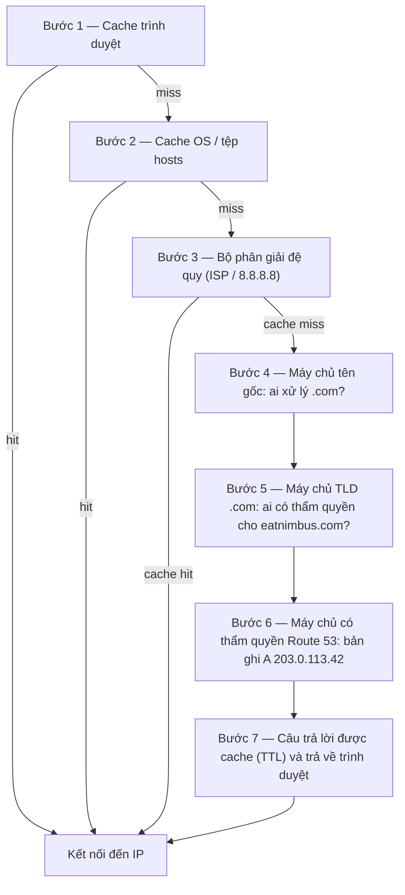

# Chương 12: Cách Internet Tìm Thấy Bạn

Maya làm mới `nimbus-alb-123456789.us-west-2.elb.amazonaws.com` trong trình duyệt của cô một lần nữa, rồi ngả ra sau và nhìn lên trần nhà. Trang tải. Ứng dụng hoạt động. Nhưng mỗi lần cô chia sẻ liên kết với một đối tác nhà hàng, cô cảm thấy một sự ngượng ngùng nhỏ mà cô không thể gọi tên.

URL đó là một sản phẩm phụ kỹ thuật, không phải một sản phẩm.

---

*Việc thiết kế lại mạng từ chương trước đã diễn ra tốt đẹp. Mọi tài nguyên đều ở đúng vị trí — các load balancer trong các subnet công khai, các cơ sở dữ liệu bị khóa trong các subnet riêng tư. Hạ tầng an toàn và được phân đoạn đúng. Nhưng khi Nimbus chuẩn bị cho lần ra mắt công khai đầu tiên, một vấn đề mới xuất hiện: URL load balancer mà AWS đã gán tự động trông như một định danh hệ thống, không phải một sản phẩm mà mọi người sẽ tin tưởng. Họ cần một tên miền thật. Và họ cần hiểu điều gì xảy ra giữa khoảnh khắc ai đó gõ `eatnimbus.com` và khoảnh khắc trang xuất hiện.*

---

Nimbus đang chạy. Load balancer có một IP công khai. Các EC2 instance có một IP riêng tư. Các cơ sở dữ liệu bị khóa trong các subnet riêng tư. Priya đã gật đầu chấp thuận sơ đồ mạng.

Tom nhìn vào URL của load balancer: `nimbus-alb-123456789.us-west-2.elb.amazonaws.com`.

"Đó là những gì khách hàng gõ vào trình duyệt của họ?" anh hỏi.

"Đó là những gì AWS tự động gán," Maya nói.

"Tôi sẽ không đặt cái đó lên một danh thiếp."

"Tôi cũng vậy."

Họ cần một tên miền. Họ đã mua `eatnimbus.com` từ một nhà đăng ký tên miền. Bây giờ họ cần kết nối tên đó với cơ sở hạ tầng AWS của họ.

"Làm sao internet biết rằng `eatnimbus.com` nghĩa là load balancer ở us-west-2?" Leo hỏi.

Câu hỏi hay, Leo.

**Tương Tự Sách Điện Thoại**

Trước điện thoại thông minh, mỗi thành phố có một cuốn sách điện thoại. Nếu bạn muốn liên hệ "Nhà hàng Pizza của Mario", bạn không ghi nhớ số điện thoại của họ — bạn tra cứu tên, lấy số, và gọi.

Internet có cuốn sách điện thoại riêng của nó: **Hệ Thống Tên Miền (DNS)**.

DNS dịch các tên có thể đọc được bởi con người (như `eatnimbus.com`) thành các địa chỉ IP có thể đọc được bởi máy (như `203.0.113.42`). Mỗi lần bạn truy cập một trang web, máy tính của bạn lặng lẽ tra cứu tên miền trong DNS và lấy địa chỉ IP để kết nối đến.

Nếu bạn thay đổi địa chỉ IP của máy chủ, bạn sẽ cập nhật bản ghi DNS — như thay đổi số của bạn trong cuốn sách điện thoại — và internet sẽ tìm thấy bạn ở vị trí mới của bạn.

**Hành Trình Phân Giải DNS Đầy Đủ**

"Nhưng *làm sao* việc tra cứu thực sự hoạt động?" Leo hỏi. "Kiểu, từng bước. Trình duyệt của tôi biết tên `eatnimbus.com`. Điều gì xảy ra tiếp theo?"

Hầu hết tài liệu lướt qua điều này. Nó quan trọng.

Khi trình duyệt của bạn cần phân giải `eatnimbus.com`, đây là mỗi bước nhảy, theo thứ tự:

**Bước 1 — Cache của trình duyệt**: Trình duyệt kiểm tra liệu nó đã phân giải tên này gần đây chưa. Nếu có, nó dùng IP đã cache. Nếu không, tiếp tục.

**Bước 2 — Cache của OS / bộ phân giải cục bộ**: Hệ điều hành của bạn kiểm tra cache DNS riêng của nó và tệp `hosts` cục bộ. Nếu tìm thấy, xong. Nếu không, nó chuyển tiếp đến bộ phân giải DNS được cấu hình của bạn — thường là của ISP của bạn hoặc một cái công khai như 8.8.8.8.

**Bước 3 — Bộ phân giải đệ quy**: Bộ phân giải đệ quy (ISP của bạn hoặc 8.8.8.8 của Google) là người làm việc chính. Nó cũng có một cache. Nếu nó biết câu trả lời, nó trả về ngay lập tức. Nếu không, nó bắt đầu chuỗi phân giải thực sự.

**Bước 4 — Các máy chủ tên gốc (root)**: Bộ phân giải đệ quy liên hệ một trong 13 cụm máy chủ tên gốc (được triển khai trên toàn thế giới). Máy chủ gốc không biết `eatnimbus.com` ở đâu. Nhưng nó biết ai quản lý các tên miền `.com` — các máy chủ TLD `.com`. Nó trả về địa chỉ của chúng.

**Bước 5 — Các máy chủ tên TLD (Top Level Domain)**: Bộ phân giải đệ quy liên hệ các máy chủ TLD `.com`. Các máy chủ TLD cũng không biết `eatnimbus.com` ở đâu. Nhưng chúng biết các máy chủ tên nào là có thẩm quyền cho `eatnimbus.com` — các máy chủ thực sự giữ các bản ghi DNS. Chúng trả về các địa chỉ đó.

**Bước 6 — Các máy chủ tên có thẩm quyền**: Bộ phân giải đệ quy liên hệ các máy chủ tên của Route 53 — các máy chủ tên có thẩm quyền cho `eatnimbus.com`. Route 53 có các bản ghi thực tế. Nó trả về bản ghi A: `eatnimbus.com → 203.0.113.42`. Câu trả lời này là có thẩm quyền — đó là câu trả lời thực, không phải một cái đã cache.

**Bước 7 — Phản hồi được cache và trả về**: Bộ phân giải đệ quy cache câu trả lời trong thời lượng của TTL (Time-To-Live) trên bản ghi. Nó trả về IP cho trình duyệt của bạn. Trình duyệt của bạn cache nó. Trình duyệt của bạn kết nối.



"Đó là bảy bước nhảy chỉ để tìm một địa chỉ IP," Tom nói.

"Thường dưới 100 mili giây tổng cộng," Priya nói. "Các bước 3 đến 6 được cache mạnh mẽ ở mọi cấp độ. Đối với các tên miền phổ biến, các bước 4 và 5 — các lần tra cứu gốc và TLD — thường được bỏ qua hoàn toàn vì bộ phân giải đệ quy đã có các máy chủ đó được cache. Cả chuỗi thường chạy trong 20–40 mili giây."

"Và sau lần tra cứu đầu tiên, cache của trình duyệt nghĩa là các yêu cầu tiếp theo bỏ qua tất cả," Leo thêm vào.

"Đúng. DNS có cảm giác tức thời vì hầu hết các lần tra cứu là cache hit. Cả chuỗi chỉ chạy khi một bản ghi mới hoặc TTL của nó đã hết hạn."

**Gặp Gỡ Route 53**

Amazon Route 53 là dịch vụ DNS được quản lý của AWS. Nó được gọi là Route 53 vì cổng 53 là cổng DNS tiêu chuẩn. (Đôi khi AWS đặt tên mọi thứ một cách thẳng thắn.)

Route 53 làm một số thứ:

**Đăng ký tên miền**: Bạn có thể mua các tên miền qua Route 53 trực tiếp.

**Lưu trữ DNS (hosted zones)**: Bạn tạo một *hosted zone* cho tên miền của mình, và Route 53 quản lý các bản ghi DNS cho cả thế giới biết nơi tìm thấy bạn.

**Kiểm tra sức khỏe**: Route 53 có thể giám sát các endpoint của bạn và định tuyến lưu lượng khỏi những cái không khỏe mạnh.

**Các chính sách định tuyến lưu lượng**: Route 53 hỗ trợ nhiều chiến lược định tuyến ngoài DNS đơn giản — có trọng số, dựa trên độ trễ, theo địa lý, failover.

**Bản Ghi DNS: Các Mục Trong Sách Điện Thoại**

Một bản ghi DNS ánh xạ một tên đến một đích. Các loại phổ biến nhất:

**Bản ghi A**: Ánh xạ một tên đến một địa chỉ IPv4.
`eatnimbus.com → 203.0.113.42`

**Bản ghi AAAA**: Ánh xạ một tên đến một địa chỉ IPv6.

**Bản ghi CNAME**: Ánh xạ một tên đến một tên khác (một bí danh).
`www.eatnimbus.com → eatnimbus.com`

**Bản ghi MX**: Chỉ định các máy chủ nào xử lý email cho tên miền.

**Bản ghi TXT**: Lưu trữ văn bản tùy ý. Thường dùng cho việc xác minh tên miền (chứng minh bạn sở hữu tên miền) và xác thực email (SPF, DKIM).

Đối với Nimbus, thiết lập chính:

- `eatnimbus.com` → Alias record trỏ đến load balancer
- `www.eatnimbus.com` → CNAME trỏ đến `eatnimbus.com`
- `api.eatnimbus.com` → Alias record trỏ đến load balancer API

"Khoan," Tom nói. "IP của load balancer có thể thay đổi. AWS đã nói vậy trong tài liệu."

Phát hiện hay, Tom.

**Alias Record: Giải Pháp Của AWS Cho IP Động**

Các load balancer, các phân phối CloudFront, và các trang web S3 có các tên DNS, không phải các địa chỉ IP tĩnh. Các IP nền tảng có thể thay đổi.

Nếu bạn tạo một CNAME trỏ đến tên DNS của một load balancer, nó hoạt động — nhưng bạn không thể dùng CNAME cho các tên miền gốc (`eatnimbus.com` không có `www`) vì các tiêu chuẩn DNS.

Route 53 giải quyết điều này với **Alias record** — một phần mở rộng đặc thù AWS cho DNS. Một Alias record ánh xạ một tên trực tiếp đến một tài nguyên AWS (load balancer, phân phối CloudFront, trang web S3), và Route 53 xử lý việc phân giải IP động một cách tự động. Các Alias record có thể được dùng ở cấp độ tên miền gốc. Và không giống các truy vấn DNS thông thường đến các dịch vụ bên ngoài, các truy vấn Alias record đến các tài nguyên AWS là miễn phí.

"Vậy chúng ta dùng một Alias record cho `eatnimbus.com` trỏ đến load balancer," Leo xác nhận.

"Và Route 53 xử lý bất kỳ IP nào load balancer đang dùng tại bất kỳ thời điểm nào," Priya thêm vào.

"Miễn phí," Tom nói, đột nhiên rất quan tâm. Anh mở trang định giá Route 53. "Và phần còn lại của nó?"

"Năm mươi cent cho mỗi hosted zone," Leo nói. "Cộng với khoảng bốn mươi cent cho mỗi triệu truy vấn DNS. Đối với lưu lượng của chúng ta hiện tại, có lẽ dưới hai đô la một tháng."

Tom đóng trang định giá một cách hài lòng.

**Các Chính Sách Định Tuyến: Hơn Cả "Nó Ở Đâu?"**

Đây là nơi Route 53 trở nên thú vị. DNS không chỉ là một dịch vụ tra cứu — nó có thể là một công cụ quản lý lưu lượng.

**Định tuyến đơn giản**: Một bản ghi, một đích. DNS chuẩn.

**Định tuyến có trọng số**: Chia lưu lượng giữa nhiều đích theo trọng số. Gửi 90% đến máy chủ mới, 10% đến máy chủ cũ trong một cuộc di chuyển. Điều chỉnh các trọng số cho đến khi bạn tự tin vào máy chủ mới, rồi chuyển sang 100%.

**Định tuyến dựa trên độ trễ**: Định tuyến người dùng đến AWS region có độ trễ thấp nhất cho họ. Một người dùng ở Seattle được định tuyến đến `us-west-2`. Một người dùng ở Tokyo được định tuyến đến `ap-northeast-1`. Cùng một tên miền, các đích khác nhau.

**Định tuyến theo địa lý**: Định tuyến dựa trên vị trí địa lý của người dùng. Tất cả người dùng châu Âu đi đến `eu-west-1`. Tất cả người dùng Bắc Mỹ đi đến `us-east-1`. Hữu ích cho chủ quyền dữ liệu (giữ dữ liệu người dùng EU ở các region EU) hoặc tùy chỉnh nội dung (ngôn ngữ, tiền tệ). Các quyết định định tuyến dùng các ranh giới cứng — một người dùng ở trong một quốc gia, một châu lục, hoặc một bang của Mỹ, và đó là nơi họ đi.

**Định tuyến theo độ gần địa lý (Geoproximity)**: Định tuyến lưu lượng dựa trên vị trí địa lý của người dùng *và* cho phép bạn điều chỉnh các quyết định đó với một giá trị **bias**. Một bias dương mở rộng khu vực địa lý định tuyến đến một tài nguyên — thu hút nhiều lưu lượng hơn. Một bias âm thu nhỏ nó. Không giống định tuyến theo địa lý, vốn dùng các ranh giới quốc gia và châu lục cứng, geoproximity là liên tục: một giá trị bias nhỏ có thể dần dần chuyển lưu lượng từ một region sang một region khác mà không vẽ lại bất kỳ đường cố định nào.

Kịch bản phân biệt hai cái: nếu một công ty đang dần di chuyển từ `us-east-1` sang `us-west-2` và muốn dần dần chuyển lưu lượng về phía tây — không phải lật một công tắc, mà điều chỉnh nó theo thời gian — geoproximity với một bias dương đang tăng trên endpoint phía tây là công cụ đúng. Định tuyến theo địa lý sẽ hoặc định tuyến tất cả người dùng Bờ Tây đến Oregon hoặc không; nó không có núm điều chỉnh. Kể từ tháng Một 2024, geoproximity có sẵn như một chính sách định tuyến thông thường trực tiếp trên các bản ghi DNS (Console, API, CLI) — nó không còn đòi hỏi Route 53 Traffic Flow, mặc dù nó vẫn có sẵn ở đó.

**Định tuyến Failover**: Chỉ định một endpoint primary và một endpoint secondary. Nếu primary không vượt qua kiểm tra sức khỏe của Route 53, lưu lượng tự động được chuyển hướng đến secondary. Đây là lớp DNS của khắc phục thảm họa.

"Khoan — nhưng *tại sao* chúng ta lại thiết lập định tuyến failover đến một region thứ hai nếu chúng ta đã có Multi-AZ?" Maya hỏi. "Multi-AZ không phải để xử lý các sự cố sao?"

Câu hỏi hay. Multi-AZ bảo vệ chống lại sự cố của một Availability Zone đơn lẻ trong một region — nếu một trung tâm dữ liệu sập, standby ở một AZ khác tiếp quản. Nhưng nếu cả một AWS region trở nên không khả dụng thì sao? Hoặc nếu có một sự gián đoạn dịch vụ trên toàn region thì sao? Định tuyến failover DNS hoạt động ở một cấp độ khác: nó định tuyến lưu lượng khỏi cả một region khi kiểm tra sức khỏe của region đó thất bại. Multi-AZ là khả năng phục hồi trong-region. Failover DNS là khả năng phục hồi liên-region.

**Định tuyến Multivalue answer**: Trả về tối đa tám địa chỉ IP khỏe mạnh cho một truy vấn, để client chọn. Một giải pháp thay thế đơn giản cho một load balancer để phân phối lưu lượng qua nhiều máy chủ.

"Vậy Route 53 không chỉ là một cuốn sách điện thoại," Maya nói. "Nó là một cuốn sách điện thoại thông minh có thể định tuyến các cuộc gọi dựa trên nơi bạn gọi từ."

"Và ngắt kết nối bạn nếu số đó không khỏe mạnh," Priya thêm vào.

---

**Định Tuyến Độ Trễ Cộng Kiểm Tra Sức Khỏe: Một Thí Nghiệm Tư Duy**

Priya phác thảo một kịch bản lên bảng trắng. Giả sử cơ sở người dùng Bờ Đông của Nimbus tiếp tục tăng, và một ngày đội ngũ dựng lên một ngăn xếp nhẹ ở `us-east-1` (Bắc Virginia) — không phải một thiết lập đa-region active-active đầy đủ, vốn sẽ đắt và phức tạp, mà là một load balancer và một bộ EC2 instance chỉ-đọc phục vụ nội dung tĩnh và các trang duyệt. Các đơn hàng vẫn sẽ đi về phía tây đến cơ sở dữ liệu primary ở `us-west-2`. Lưu lượng duyệt — vốn chiếm bảy mươi phần trăm các yêu cầu — có thể được phục vụ từ một trong hai bờ.

Cấu hình Route 53 cho endpoint duyệt sẽ trông như thế này:

```
browse.eatnimbus.com
  → Bản ghi Latency: us-east-1 ALB (với kiểm tra sức khỏe, set-identifier "east")
  → Bản ghi Latency: us-west-2 ALB (với kiểm tra sức khỏe, set-identifier "west")
```

(Lưu ý bản ghi là một *hostname*, `browse.eatnimbus.com` — DNS định tuyến các tên, không bao giờ các đường dẫn URL. Định tuyến dựa trên đường dẫn như `/browse` là công việc của load balancer, không phải của Route 53.)

Với định tuyến độ trễ, một người dùng ở Seattle sẽ được phân giải đến endpoint `us-west-2`. Một người dùng ở Boston sẽ đi đến `us-east-1`. Route 53 đo độ trễ từ hạ tầng của nó đến mỗi region liên tục và chọn cái nhanh hơn cho mỗi người dùng.

"Nhưng nếu region phía tây có vấn đề thì sao?" Tom hỏi. "Người dùng duyệt của chúng ta ở Seattle sẽ bị kẹt."

"Đó là mục đích của các kiểm tra sức khỏe," Priya nói. "Mỗi bản ghi độ trễ nhận một kiểm tra sức khỏe trên load balancer tương ứng của nó. Nếu kiểm tra sức khỏe `us-west-2` thất bại ba lần kiểm tra liên tiếp, Route 53 ngừng trả về bản ghi đó — ngay cả đối với người dùng nơi Oregon thường nhanh hơn. Người dùng Seattle được định tuyến về phía đông cho đến khi Oregon khôi phục."

"Vậy định tuyến độ trễ xác định region nào thường được ưu tiên," Maya nói, "và các kiểm tra sức khỏe ghi đè ưu tiên đó nếu region được ưu tiên sập?"

"Chính xác. Chính sách độ trễ chọn người thắng dưới các điều kiện bình thường. Các kiểm tra sức khỏe loại bỏ một người thắng đã ngừng hoạt động."

Leo nghĩ về kịch bản sự cố. "Và TTL trên các bản ghi đó?"

"Sáu mươi giây," Priya nói. "Ba lần kiểm tra thất bại ở các khoảng ba mươi giây để kích hoạt nó — lên đến chín mươi giây để phát hiện sự cố — rồi lên đến sáu mươi giây để các bộ phân giải DNS nhận thay đổi."

"Hai phút rưỡi trong trường hợp xấu nhất," Leo nói.

"Đó là lý do bạn hạ TTL trước khi bạn quan tâm đến nó, không phải sau."

Sự kết hợp này — định tuyến độ trễ với các kiểm tra sức khỏe trên mỗi bản ghi — là một trong những cấu hình Route 53 mạnh mẽ nhất cho các triển khai đa-region. Người dùng luôn đi đến region khỏe mạnh nhanh nhất. Hệ thống tự chữa lành khi một region có vấn đề. Và toàn bộ là DNS: không hạ tầng bổ sung, không máy chủ proxy, không load balancer giữa các region.

---

**Sự Cố Thất Bại Kiểm Tra Sức Khỏe**

Môi trường staging của Nimbus đã cho họ một minh chứng tình cờ về định tuyến failover.

Họ đã cấu hình các kiểm tra sức khỏe Route 53 trên load balancer staging như một thử nghiệm — kiểm tra endpoint `/health` mỗi 30 giây. Một chiều thứ Sáu, Leo đẩy một triển khai lên staging có một lỗi: endpoint sức khỏe bắt đầu trả về các lỗi 500. Nó vượt qua các bài kiểm tra cục bộ của anh nhưng hỏng trên máy chủ.

Route 53 ghi nhận các thất bại. Sau ba lần kiểm tra thất bại liên tiếp, nó đánh dấu endpoint không khỏe mạnh. Bản ghi failover kích hoạt, định tuyến lưu lượng staging đến một trang dự phòng chỉ-đọc nói "Đang bảo trì."

Cảnh báo đầu tiên của Leo là một tin nhắn Slack từ một kỹ sư QA: "Staging đang hiển thị trang bảo trì."

Leo kiểm tra triển khai. Các lỗi 500 rõ ràng trong các log. Anh cuộn lại triển khai. Trong vòng 90 giây sau khi endpoint sức khỏe trả về các 200, Route 53 đánh giá lại kiểm tra, thấy ba lần thành công liên tiếp, và trả lưu lượng về load balancer staging. Trang bảo trì biến mất.

Tổng thời gian trên trang bảo trì: bảy phút.

"Đó là hệ thống hoạt động đúng," Priya nói.

"Tôi biết," Leo nói. "Phần đáng sợ là nghĩ về điều gì sẽ xảy ra mà không có kiểm tra sức khỏe. Các lỗi 500 sẽ đến với người dùng thật."

"Trong production, kiểm tra sức khỏe sẽ chuyển đổi dự phòng sang region secondary hoặc trang lỗi tĩnh. Người dùng sẽ thấy một trải nghiệm được duy trì thay vì các lỗi."

"Failover thực sự mất bao lâu?" Maya hỏi. "Từ khi kiểm tra sức khỏe thất bại đến khi DNS bắt đầu định tuyến khác đi?"

"Khoảng kiểm tra sức khỏe là 30 giây theo mặc định. Ba lần thất bại liên tiếp để kích hoạt failover. Đó là lên đến 90 giây để phát hiện vấn đề. Rồi TTL DNS — nếu nó là 60 giây, lan truyền là thêm một phút."

"Vậy trong trường hợp xấu nhất, khoảng ba phút?"

"Khoảng đó. Đó là lý do bạn muốn TTL của bạn thấp trên các bản ghi quan trọng, và khoảng kiểm tra sức khỏe của bạn ngắn nhất mà ngân sách của bạn cho phép."

---

**Kiểm Tra Sức Khỏe: Định Tuyến Vòng Quanh Sự Cố**

"Và nếu ai đó cố gắng đột nhập thì sao?" Priya nói. "DNS là công khai. Bất kỳ ai cũng có thể tra cứu nơi `eatnimbus.com` trỏ đến. Điều đó nghĩa là một kẻ tấn công biết chính xác IP nào để nhắm vào."

"Đúng vậy," Leo nói. "Nhưng IP họ tìm thấy là IP của load balancer. ALB là thứ duy nhất có một địa chỉ công khai. Mọi thứ phía sau nó — EC2, RDS, ElastiCache — ở trong các subnet riêng tư. DNS cho họ biết cửa trước. Nó không cho họ biết những gì phía sau nó."

Route 53 có thể giám sát các endpoint của bạn với các kiểm tra sức khỏe. Nếu một endpoint thất bại, Route 53 có thể:

- Loại bỏ nó khỏi các phản hồi DNS (ngừng gửi lưu lượng đến đó)
- Kích hoạt một failover đến một endpoint dự phòng
- Gửi một cảnh báo qua CloudWatch

Các kiểm tra sức khỏe là liên kết giữa định tuyến DNS và sức khỏe ứng dụng thực tế. Trong một cấu hình failover: Route 53 giám sát endpoint primary mỗi 30 giây. Nếu ba lần kiểm tra liên tiếp thất bại, Route 53 bắt đầu trả về địa chỉ của endpoint secondary. Không có con số nào trong số này là cố định: 30 giây là khoảng tiêu chuẩn (một lựa chọn "nhanh" có trả phí kiểm tra mỗi 10 giây), và ngưỡng thất bại mặc định là 3 lần kiểm tra liên tiếp nhưng có thể cấu hình từ 1 đến 10.

Đây không phải là tức thời — DNS có thời gian lan truyền. Một khi Route 53 thay đổi một bản ghi DNS, các bộ phân giải DNS trên khắp thế giới cần nhận thay đổi, điều này có thể mất vài giây đến vài phút tùy thuộc các cài đặt TTL.

**TTL: Cache DNS**

Các phản hồi DNS được cache ở nhiều cấp độ — ở router của bạn, ở ISP của bạn, trong trình duyệt của bạn. **TTL (Time-To-Live)** trên một bản ghi DNS cho các cache biết ghi nhớ câu trả lời bao lâu trước khi kiểm tra lại.

TTL cao (1 giờ hoặc hơn): Ít truy vấn DNS hơn, ít tải hơn trên Route 53, nhưng các thay đổi mất lâu hơn để lan truyền.

TTL thấp (60 giây hoặc ít hơn): Các thay đổi lan truyền nhanh chóng, nhưng cần nhiều truy vấn DNS hơn.

Trước một cuộc di chuyển được lên kế hoạch (cập nhật DNS để trỏ đến một máy chủ mới), hạ TTL của bạn xuống 60 giây một ngày trước. Rồi khi bạn thực hiện thay đổi, nó lan truyền trong khoảng một phút. Sau cuộc di chuyển, nâng nó trở lại giá trị bình thường.

"Tôi đã triển khai nó rồi — ồ." Leo đã cập nhật bản ghi DNS trước khi hạ TTL. Anh đã nhận ra lỗi của mình và bắt đầu đếm: TTL cũ là một giờ. Một số người dùng sẽ nhận máy chủ cũ trong sáu mươi phút tiếp theo.

"Nếu chúng ta chỉ hạ nó trong cuộc di chuyển và không phải trước," Leo nói chậm rãi, "TTL cũ nghĩa là một số người dùng sẽ thấy máy chủ cũ trong một giờ."

"Chính xác," Priya nói. "Các cuộc di chuyển DNS đòi hỏi lập kế hoạch trước cuộc di chuyển, không chỉ trong lúc đó."

Bạn có thể đang tự hỏi: nếu TTL được đặt thành một giờ, điều đó có nghĩa là mọi người dùng sẽ chờ đủ một giờ sau một thay đổi DNS trước khi thấy máy chủ mới không? Không hẳn. TTL nghĩa là các bộ phân giải sẽ không kiểm tra lại cho đến khi TTL hết hạn. Nếu bộ phân giải DNS của một người dùng đã cache giá trị cũ 55 phút trước với TTL 1 giờ, họ sẽ nhận giá trị mới trong 5 phút. Nếu họ cache nó 5 phút trước, họ sẽ chờ 55 phút. Trung bình, người dùng thấy thay đổi trong vòng nửa thời lượng TTL. Đó là lý do hạ TTL trước là quan trọng đến vậy: nó thu nhỏ cửa sổ lan truyền trường hợp xấu nhất trước khi thay đổi xảy ra.

---

**Private Hosted Zone: DNS Nội Bộ**

Priya nêu một yêu cầu mới hai tuần sau khi tên miền công khai hoạt động.

"Các EC2 instance của chúng ta cần tiếp cận cơ sở dữ liệu," cô nói. "Hiện tại chúng đang dùng tên DNS endpoint RDS — `nimbus-prod.abc123.us-west-2.rds.amazonaws.com`. Cái đó hoạt động, nhưng nó là một tên DNS công khai. Nếu chúng ta từng muốn thay đổi cấu hình cơ sở dữ liệu, tất cả các tệp cấu hình ứng dụng cần cập nhật."

"Chúng ta có thể dùng một tên DNS riêng tư," Leo nói. "Như `db.nimbus.internal`. Cái gì đó mà các dịch vụ của chúng ta dùng nội bộ ánh xạ đến bất kỳ endpoint cơ sở dữ liệu hiện tại nào."

"Chính xác. Các private hosted zone của Route 53."

Một **private hosted zone** là một tên miền DNS chỉ phân giải bên trong VPC của bạn. Các truy vấn DNS bên ngoài cho `nimbus.internal` không nhận được phản hồi. Nhưng từ bên trong VPC, `db.nimbus.internal` phân giải đến endpoint RDS.

Họ thiết lập nó:

- Private hosted zone: `nimbus.internal`
- Bản ghi CNAME: `db.nimbus.internal → nimbus-prod.abc123.us-west-2.rds.amazonaws.com`
- Bản ghi CNAME: `cache.nimbus.internal → nimbus-cache.abc123.usw2.cache.amazonaws.com`
- Bản ghi A: `api.nimbus.internal → 10.0.10.5` (IP EC2 nội bộ — các bản ghi A ánh xạ tên đến địa chỉ IP; CNAME ánh xạ tên đến tên khác. Ổn ở đây vì instance này giữ một IP riêng tư tĩnh; cho bất cứ thứ gì phía sau Auto Scaling bạn sẽ trỏ vào một load balancer thay vào đó)

Bây giờ cấu hình ứng dụng đọc:

```
DATABASE_HOST=db.nimbus.internal
CACHE_HOST=cache.nimbus.internal
```

Khi họ di chuyển sang một RDS instance mới, họ cập nhật một bản ghi DNS. Không cần triển khai ứng dụng.

"Đây cũng là lý do DNS riêng tư quan trọng trong một cuộc di chuyển cơ sở dữ liệu," Priya nói. "Bạn cập nhật `db.nimbus.internal` để trỏ đến endpoint mới. Lưu lượng chuyển. Endpoint cũ vẫn có sẵn trong cửa sổ TTL. Không thay đổi cấu hình ứng dụng."

**Câu Chuyện Debug DNS Nội Bộ**

Ba tuần sau, Leo triển khai một dịch vụ mới — một background worker — và nó không thể tiếp cận cơ sở dữ liệu. Worker ở trong cùng VPC, cùng subnet riêng tư như các máy chủ API. Các máy chủ API có thể tiếp cận cơ sở dữ liệu. Worker thì không.

Anh kiểm tra các security group. Security group của worker có một quy tắc đi cho PostgreSQL. Security group cơ sở dữ liệu có một quy tắc đến từ security group của worker. Mọi thứ trông đúng.

Anh chạy `nslookup db.nimbus.internal` từ instance worker.

Không phản hồi.

"Việc tra cứu DNS đang thất bại," anh nói với Priya.

Cô nhìn vào cấu hình VPC của instance worker. "Worker thực sự ở trong VPC nào? Các private hosted zone được liên kết với các VPC — nếu instance không ở trong một VPC được liên kết, zone đơn giản là không tồn tại đối với nó."

"Nó ở trong VPC chính. Giống mọi thứ khác."

"Có phải vậy không?"

Các private hosted zone phải được liên kết rõ ràng với mỗi VPC chúng phục vụ — việc liên kết là theo mỗi VPC, không bao giờ theo mỗi subnet. Priya đã liên kết VPC chính khi cô tạo zone. Nhưng Leo đã vô tình triển khai worker vào một VPC test mà anh đã tạo cho một thí nghiệm khác. VPC khác. Không được liên kết với private hosted zone.

"Worker ở trong VPC sai," Priya nói.

"Tôi đã triển khai nó rồi — ồ." Leo chuyển worker sang VPC đúng. DNS phân giải. Worker kết nối với cơ sở dữ liệu.

"Một VPC," Leo nói, ghi chú lại. "Trừ khi chúng ta có lý do cho nhiều hơn một."

---

**DNSSEC: Xác Thực Các Phản Hồi DNS**

"Chúng ta đã nghĩ về giả mạo DNS chưa?" Priya hỏi. "Nếu ai đó chặn truy vấn DNS của chúng ta và trả về một IP giả thì sao? Trình duyệt của người dùng chúng ta sẽ kết nối với máy chủ của kẻ tấn công thay vì của chúng ta."

**DNSSEC (DNS Security Extensions)** giải quyết điều này bằng cách ký các bản ghi DNS một cách mật mã. Khi một phản hồi DNS bao gồm một chữ ký DNSSEC, bộ phân giải có thể xác minh rằng phản hồi đến từ máy chủ tên có thẩm quyền và chưa bị giả mạo.

Route 53 hỗ trợ ký DNSSEC cho các public hosted zone. Quá trình bao gồm:

1. Bật DNSSEC trên hosted zone trong Route 53
2. Route 53 tạo một key signing key (KSK) được lưu trữ trong KMS
3. Route 53 ký tất cả các bản ghi với zone signing key
4. Bạn thêm một bản ghi DS (Delegation Signer) tại nhà đăng ký tên miền cha (TLD .com)
5. Các bộ phân giải hỗ trợ DNSSEC giờ có thể xác minh tính xác thực của các phản hồi

"Giả mạo DNS phổ biến đến mức nào?" Leo hỏi.

"Trên internet công khai, hiếm nhưng có thể," Priya nói. "Hầu hết các bộ phân giải ISP hỗ trợ xác thực DNSSEC ngày nay. Bật DNSSEC không tốn gì và thêm một lớp xác thực có ý nghĩa."

"Cái đó tốn bao nhiêu mỗi tháng?" Tom hỏi.

"Việc bật ký DNSSEC bản thân nó miễn phí trong Route 53," Priya nói. "Chi phí thực duy nhất là khóa KMS giữ key-signing key: 1 đô la/tháng, cộng với các lần gọi API KMS — và một khóa có thể được chia sẻ qua nhiều hosted zone. Sự bảo vệ chống lại các cuộc tấn công cướp DNS thực ra là miễn phí ở quy mô của chúng ta."

Tom bật nó trước bữa trưa.

---

**Route 53 Resolver: DNS Lai (Hybrid)**

Khi cuối cùng Nimbus kết nối VPC AWS của họ với mạng phát triển tại chỗ của họ qua một VPN, một vấn đề mới xuất hiện: các máy chủ tại chỗ cần phân giải các tên DNS riêng tư AWS (như `db.nimbus.internal`), và các tài nguyên AWS cần phân giải các hostname tại chỗ (như `jenkins.corp.nimbus.local`).

Phân giải DNS không vượt qua các ranh giới mạng theo mặc định. Các tài nguyên AWS phân giải DNS bằng Route 53 Resolver (tích hợp sẵn trong mọi VPC). Các máy chủ tại chỗ dùng các máy chủ DNS riêng của họ. Không cái nào có thể thấy các bản ghi của cái kia.

**Route 53 Resolver Endpoints** bắc cầu qua khoảng cách này:

**Inbound endpoints**: Các máy chủ DNS tại chỗ có thể chuyển tiếp các truy vấn cho các zone DNS được host trên AWS đến một IP inbound endpoint trong VPC của bạn. Route 53 Resolver xử lý truy vấn và trả về kết quả.

**Outbound endpoints**: Khi các EC2 instance cần phân giải các hostname tại chỗ, Resolver chuyển tiếp các truy vấn đó đến các máy chủ DNS tại chỗ qua outbound endpoint.

"Vậy nó như một dịch vụ dịch thuật," Maya nói. "DNS AWS của bạn và DNS tại chỗ của bạn không nói chuyện trực tiếp với nhau. Các Resolver endpoint hoạt động như các trung gian."

"Chính xác. Các máy chủ tại chỗ của bạn giờ có thể phân giải `db.nimbus.internal`. Các EC2 instance của bạn có thể phân giải `jenkins.corp.nimbus.local`. Cả hai phía thấy các tên DNS từ cả hai thế giới."

Đối với Nimbus, điều này trở nên liên quan khi đội ngũ phát triển muốn chạy các bài kiểm tra tích hợp từ văn phòng của họ đối với một môi trường staging trong AWS. Nếu không có các Resolver endpoint, họ sẽ phải chỉnh sửa các tệp hosts thủ công. Với chúng, DNS nội bộ cứ thế hoạt động qua VPN.

Kiến trúc cho các Resolver endpoint:

- **Inbound endpoint**: Hai ENI (Elastic Network Interface) được tạo ở hai AZ khác nhau trong VPC của bạn. Mỗi cái nhận một IP riêng tư. Bạn cấu hình máy chủ DNS tại chỗ của bạn để chuyển tiếp các truy vấn cho các zone được host trên AWS của bạn đến các IP này. Lưu lượng đi qua VPN hoặc Direct Connect của bạn.
- **Outbound endpoint**: Hai ENI ở hai AZ. Bạn tạo các quy tắc chuyển tiếp: "các truy vấn cho `corp.nimbus.local` đi đến các IP máy chủ DNS tại chỗ này." Các EC2 instance tự động dùng Resolver, vốn tham vấn các quy tắc chuyển tiếp của bạn và gửi truy vấn đến tại chỗ.

"Tại sao hai ENI cho mỗi endpoint?" Leo hỏi.

"Tính sẵn sàng cao," Priya nói. "Nếu một AZ mất kết nối mạng, IP endpoint kia vẫn hoạt động. Cùng nguyên tắc như các NAT Gateway."

"Cái đó tốn bao nhiêu mỗi tháng?" Tom hỏi.

Các Resolver endpoint tốn khoảng 0,125 đô la mỗi giờ **cho mỗi elastic network interface**, và mỗi endpoint đòi hỏi ít nhất hai ENI cho tính sẵn sàng — vậy một mức sàn thực tế là khoảng 180 đô la mỗi tháng cho mỗi endpoint, cộng với 0,40 đô la cho mỗi triệu truy vấn DNS. Đối với một đội ngũ dùng DNS lai để phân giải các tên nội bộ, chi phí khiêm tốn — và loại bỏ nhu cầu duy trì các tệp hosts qua nhiều máy của lập trình viên và các hệ thống CI/CD.

"Chúng ta có thể chỉ đặt các hostname vào các tệp hosts," Leo đề nghị.

"Trên mọi máy của lập trình viên, mọi CI runner, mọi lần onboarding mới," Priya nói. "Mỗi lần bất cứ thứ gì thay đổi."

"Endpoint đáng giá," Leo nói.

"Đúng vậy."

## Điểm Mạnh và Hạn Chế

**Route 53 là lựa chọn đúng cho**: đăng ký và quản lý các tên miền hoàn toàn trong AWS; định tuyến lưu lượng dựa trên độ trễ, địa lý, hoặc phân phối có trọng số qua nhiều endpoint; failover dựa trên kiểm tra sức khỏe giữa các region hoặc giữa một endpoint primary và một endpoint khắc phục thảm họa; tích hợp DNS với các dịch vụ AWS khác qua các alias record; các private hosted zone cho khám phá dịch vụ nội bộ.

**Khi Route 53 không phải là cái bạn cần**: Route 53 là một dịch vụ DNS, không phải một load balancer. Nếu bạn cần phân phối lưu lượng giữa nhiều máy chủ hoặc container trong một region, dùng một Application Load Balancer — Route 53 không thể làm weighted round-robin ở cấp độ kết nối theo cách một load balancer có thể. Định tuyến dựa trên độ trễ qua các region thêm chi phí và sự phức tạp vận hành chỉ có ý nghĩa khi người dùng của bạn thực sự phân tán toàn cầu và các mili giây quan trọng cho chuyển đổi. Đối với hầu hết các ứng dụng đơn-region, một Alias record duy nhất trỏ đến một ALB là tất cả cấu hình Route 53 bạn cần.

## Tóm Tắt

Đi từ `nimbus-alb-123456789.us-west-2.elb.amazonaws.com` đến `eatnimbus.com` có cảm giác như một điều nhỏ. Nó không phải vậy. DNS là hệ thống địa chỉ mà toàn bộ internet chạy trên đó, và Route 53 cho bạn các công cụ để dùng hệ thống đó không chỉ cho tra cứu, mà cho quản lý lưu lượng và khả năng phục hồi.

- **DNS** dịch các tên miền thành các địa chỉ IP — cuốn sách điện thoại của internet.
- **Route 53** là dịch vụ DNS được quản lý của AWS: đăng ký tên miền, lưu trữ DNS, kiểm tra sức khỏe, và các chính sách định tuyến.
- **Các bản ghi A** ánh xạ tên đến các địa chỉ IPv4. **CNAME** ánh xạ tên đến các tên khác. **Alias record** ánh xạ tên đến các tài nguyên AWS (load balancer, CloudFront, S3).
- Dùng các Alias record (không phải CNAME) cho các tên miền gốc và cho các tài nguyên với IP động.
- Các chính sách định tuyến vượt ra ngoài DNS đơn giản: **có trọng số** (chia lưu lượng), **dựa trên độ trễ** (hiệu suất), **theo địa lý** (chủ quyền dữ liệu — các ranh giới quốc gia/châu lục cứng), **geoproximity** (dựa trên khoảng cách với một núm bias — chuyển lưu lượng dần dần), **failover** (khắc phục thảm họa).
- **Các private hosted zone** cung cấp DNS nội bộ cho các tài nguyên VPC — giao tiếp dịch vụ-đến-dịch vụ theo tên, không phải IP được mã hóa cứng.
- **DNSSEC** ký các bản ghi một cách mật mã, bảo vệ chống lại giả mạo DNS.
- **Route 53 Resolver Endpoints** bắc cầu các mạng lai — DNS AWS và tại chỗ có thể phân giải các tên của nhau.

## Mẹo Thi

*SAA-C03 Domain: Thiết kế kiến trúc hiệu suất cao (Domain 3, Task 3.4)*

- **Alias so với CNAME**: Các Alias record có thể được dùng ở tên miền gốc; CNAME thì không. Các Alias record đến các tài nguyên AWS miễn phí; các truy vấn DNS CNAME có tính phí. Khi kỳ thi hỏi về việc ánh xạ một tên miền gốc đến một load balancer → Alias record.
- **Các trường hợp sử dụng chính sách định tuyến** (các kịch bản thi phổ biến):
  - "Dần dần di chuyển lưu lượng sang một phiên bản mới" → Định tuyến có trọng số
  - "Định tuyến người dùng đến AWS region gần nhất" → Định tuyến dựa trên độ trễ
  - "Giữ dữ liệu người dùng EU ở các region EU" → Định tuyến theo địa lý
  - "Failover DNS tự động khi primary sập" → Định tuyến failover với các kiểm tra sức khỏe
  - "Dần dần chuyển lưu lượng sang một region mới" hoặc "tăng lưu lượng thu hút đến triển khai EU của chúng ta" → Định tuyến geoproximity với bias dương
- **Geoproximity so với Geolocation:** Geolocation định tuyến theo quốc gia/châu lục của người dùng với các ranh giới cứng. Geoproximity định tuyến theo khoảng cách địa lý với một bias có thể cấu hình — dùng nó khi bạn cần dần dần chuyển lưu lượng sang một region mới hoặc thu hút nhiều người dùng hơn đến một triển khai cụ thể. Có sẵn như một chính sách định tuyến thông thường trên các bản ghi kể từ tháng Một 2024 (Traffic Flow không còn cần thiết).
- **Các kiểm tra sức khỏe Route 53**: Có thể kiểm tra các endpoint HTTP/HTTPS/TCP, và có thể kích hoạt các cảnh báo CloudWatch. Kỳ thi dùng những cái này trong các kịch bản khắc phục thảm họa.
- **TTL và lan truyền**: Biết rằng TTL kiểm soát các bộ phân giải DNS cache một bản ghi bao lâu. TTL ngắn = các thay đổi nhanh hơn. Kịch bản thi: "đội ngũ đã cập nhật DNS nhưng người dùng vẫn đang chạm vào máy chủ cũ" → TTL quá cao.
- **Các private hosted zone**: Route 53 có thể tạo các bản ghi DNS chỉ phân giải bên trong một VPC. Kỳ thi dùng cái này cho khám phá dịch vụ nội bộ (ví dụ, `database.internal` phân giải đến một endpoint RDS riêng tư).
- Route 53 là **toàn cầu** — nó không được triển khai trong một region. Không cần chọn region khi tạo các hosted zone.
- **Route 53 Resolver Endpoints**: Dùng trong các kịch bản lai nơi DNS tại chỗ và AWS cần phân giải các tên của nhau. Inbound endpoint cho tại chỗ → AWS. Outbound endpoint cho AWS → tại chỗ.

## Bài Tập

**Bài tập 1 — Nhớ lại**

Giải thích sự khác biệt giữa một bản ghi CNAME và một Alias record. Khi nào bạn sẽ dùng mỗi cái?

*(Gợi ý: Cân nhắc các ràng buộc trên CNAME ở các tên miền gốc, và hành vi của các Alias record với các tài nguyên AWS động.)*

**Bài tập 2 — Kịch bản SAA-C03**

*Kịch bản*: Một công ty truyền thông vận hành một trang web từ hai AWS region: `us-east-1` (primary) và `eu-west-1` (secondary). Đội ngũ muốn lưu lượng tự động định tuyến đến `eu-west-1` nếu region primary trở nên không khả dụng. Công ty cũng muốn xác minh rằng cơ chế failover này hoạt động đúng mà không thực sự làm sập region primary.

Cấu hình Route 53 nào đáp ứng TỐT NHẤT các yêu cầu này?

A) Định tuyến có trọng số với 100% trọng số trên `us-east-1` và 0% trọng số trên `eu-west-1`  
B) Định tuyến dựa trên độ trễ với các kiểm tra sức khỏe trên cả hai endpoint  
C) Định tuyến failover với một kiểm tra sức khỏe trên endpoint primary và một bản ghi secondary trỏ đến `eu-west-1`  
D) Định tuyến theo địa lý với Bắc Mỹ trỏ đến `us-east-1` và châu Âu trỏ đến `eu-west-1`

**Gợi ý 1**: Yêu cầu là failover tự động khi primary sập. Chính sách định tuyến nào được thiết kế chính xác cho điều này?

**Gợi ý 2**: "Kiểm tra mà không làm sập region primary" — các kiểm tra sức khỏe có thể được đặt thủ công thành "không khỏe mạnh" cho việc kiểm tra.

**Gợi ý 3**: Định tuyến dựa trên độ trễ tối ưu hóa cho tốc độ, không phải cho failover.

**Đáp án**: C

**Giải thích**: Định tuyến failover được thiết kế chính xác cho trường hợp sử dụng này. Bản ghi primary trỏ đến `us-east-1` với một kiểm tra sức khỏe. Bản ghi secondary trỏ đến `eu-west-1`. Nếu kiểm tra sức khỏe thất bại, Route 53 tự động phục vụ bản ghi secondary. Các kiểm tra sức khỏe có thể được buộc thất bại thủ công cho việc kiểm tra mà không thực sự gây gián đoạn region primary.

**Tại sao không phải A?** Định tuyến có trọng số với 100%/0% thực ra là tĩnh — nó không tự động chuyển khi primary thất bại.

**Tại sao không phải B?** Các bản ghi độ trễ *với các kiểm tra sức khỏe* có ngừng trả về một endpoint không khỏe mạnh, vậy B sẽ sống sót qua một sự cố thật. Nhưng nó thay đổi mẫu lưu lượng bình thường (người dùng sẽ được chia qua các region theo độ trễ, không phải primary/secondary như được yêu cầu) và nó không có cách sạch sẽ để *kiểm tra* failover: bạn sẽ phải thực sự làm thất bại kiểm tra sức khỏe của primary trong production. Định tuyến failover mô hình hóa ý định được nêu — primary được chỉ định, secondary được chỉ định, có thể kiểm tra bằng cách buộc trạng thái kiểm tra sức khỏe.

**Tại sao không phải D?** Định tuyến theo địa lý định tuyến theo vị trí người dùng, không phải theo sức khỏe endpoint. Người dùng châu Âu sẽ bị kẹt trên `eu-west-1` ngay cả khi `us-east-1` khỏe mạnh, và người dùng Bắc Mỹ sẽ không failover sang `eu-west-1` ngay cả khi `us-east-1` sập.

*SAA-C03 Domain: Thiết kế kiến trúc hiệu suất cao — Task 3.4*

**Bài tập 3 — Thử thách kiến trúc** *(Tùy chọn)*

Nimbus đang mở rộng quốc tế. Họ muốn `eatnimbus.com` tải nhanh cho người dùng ở Bờ Tây, Bờ Đông, và Úc. Họ cũng có một yêu cầu pháp lý: các đơn hàng được đặt bởi người dùng châu Âu phải được xử lý bởi các máy chủ ở EU.

Thiết kế một chiến lược định tuyến Route 53 giải quyết cả hai yêu cầu. Chính sách định tuyến hoặc sự kết hợp các chính sách nào bạn sẽ dùng? Hạ tầng nào ở mỗi region bạn sẽ cần?

*(Không có câu trả lời đúng duy nhất. Mục tiêu là luyện tập thiết kế định tuyến đa-region.)*

## Cảnh Sau Tín Dụng

`eatnimbus.com` đã hoạt động.

Maya đã gõ nó vào trình duyệt của cô, và trang đặt hàng Nimbus đã tải. Cô đã đặt bánh arepa từ nhà hàng của chính gia đình cô, chỉ để kiểm tra luồng. Đơn hàng đã qua. Nhà bếp đã nhận được nó.

Cô ngả ra sau.

Tom đã đang đọc các nhật ký kiểm tra sức khỏe Route 53. "Thời gian phản hồi là 18 mili giây từ các bộ kiểm tra us-west-2."

"Điều đó có nhanh không?" Maya hỏi.

"Đối với DNS? Có. Đối với người dùng Seattle nữa — họ thực ra ở ngay cạnh Oregon."

"Nhưng đối với một người dùng ở Boston?"

Tom nhìn vào biểu đồ độ trễ. "Khoảng 80 mili giây."

Maya nghĩ về điều đó. "Nếu các đối tác Bờ Đông của chúng ta tiếp tục tăng, và các máy chủ của chúng ta ở Oregon..."

"Mỗi yêu cầu đi từ Boston đến Oregon và trở lại," Leo nói từ phía bên kia phòng. "Tốc độ ánh sáng. Bạn không thể đánh bại vật lý."

"Vậy chúng ta cần các máy chủ gần Boston hơn."

"Hoặc cái gì đó gần Boston hơn phục vụ nội dung thay mặt họ."

Suy nghĩ đó lơ lửng trong không khí.

Chương tiếp theo: những nhà kho đặt nội dung của Nimbus chỉ một mili giây cách mỗi người dùng, ở khắp nơi.
