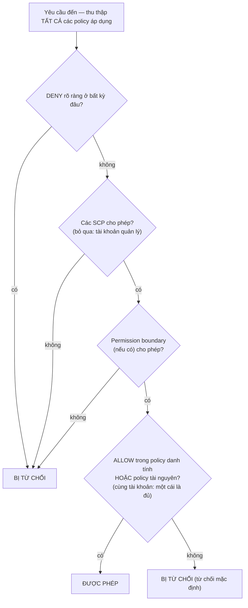

# Chương 14: Ai Được Phép Làm Gì

Các kỹ sư mới bắt đầu vào thứ Hai. Soo-Jin và Rafael. Maya đã suy nghĩ về tuần đầu tiên của họ — họ sẽ cần truy cập vào những gì, họ không nên chạm vào những gì, và liệu thiết lập IAM hiện tại có sẵn sàng để mở rộng cho hai người nữa hay không.

Cô ngồi với một ly cà phê trước khi văn phòng đông người, lập một danh sách.

---

*CloudFront đã được triển khai. Các tỷ lệ cache hit tốt. Hiệu suất đã tăng. Nhưng khi đội ngũ chuẩn bị đón các kỹ sư mới, một vấn đề lặng lẽ nổi lên: cấu hình IAM đã được xây dựng bởi những người vội vàng. Các access key nằm trong các tệp cấu hình. Một số role có nhiều quyền hơn chúng cần. Và hai người mới sắp được trao các thông tin xác thực vào một hệ thống production chưa được thiết kế với nhiều người dùng trong đầu.*

---

Tom có các access key mở trong một tệp văn bản, sẵn sàng để dán.

"Bạn đang làm gì vậy?" Priya hỏi.

"EC2 instance cần đọc các tệp cấu hình từ S3. Tôi đang đặt các thông tin xác thực vào cấu hình máy chủ."

Cô nhìn màn hình một lúc. "Đóng tệp đó lại."

"Tôi chỉ—"

"Nếu ai đó xâm nhập vào máy chủ đó," cô nói, "họ lấy được những key đó. Và những key đó chạm vào bất cứ thứ gì IAM user được phép chạm vào. Vốn có lẽ là nhiều hơn chỉ S3."

Tom đóng tệp lại.

"Có một cách tốt hơn," cô nói. "Bản thân máy chủ có thể có một role. Hãy nghĩ về nó như một chức danh công việc — instance không cần các thông tin xác thực vì hệ thống đã biết nó là gì và nó được phép làm gì."

Tom trông hoài nghi. "Vậy máy chủ tự xác thực chính nó?"

"Đúng. Không mật khẩu. Không key trong một tệp cấu hình. Không bất cứ thứ gì có thể vô tình được commit vào git."

Phần cuối đó tác động. Tom đã suýt commit một access key vào repo của chính mình hai tuần trước — bắt được nó trong diff vào giây cuối. Anh mở một tab trình duyệt mới.

**Quay Lại IAM: Bức Tranh Đầy Đủ**

Chương 3 đã giới thiệu IAM: các user, group, role, và policy. Bây giờ đến lúc đi sâu hơn.

Các policy IAM là các tài liệu JSON chỉ định những hành động nào được phép hoặc bị từ chối trên những tài nguyên nào. Chúng trông như thế này:

```json
{
  "Version": "2012-10-17",
  "Statement": [
    {
      "Effect": "Allow",
      "Action": [
        "s3:GetObject",
        "s3:PutObject"
      ],
      "Resource": "arn:aws:s3:::nimbus-assets/*"
    }
  ]
}
```

Policy này cho phép đọc và ghi các object trong bucket `nimbus-assets`, và không gì khác. Không xóa. Không liệt kê các bucket. Không bất kỳ thao tác S3 nào khác. Không bất kỳ dịch vụ AWS nào khác.

Đây là cách đúng để cấp quyền: các hành động cụ thể, các tài nguyên cụ thể.

**Vấn Đề Với "Administrator Access"**

Các AWS Managed Policy như `AdministratorAccess` được thiết kế để bắt đầu nhanh chóng. Chúng không được thiết kế để chạy các hệ thống production với các thành viên đội ngũ thật.

`AdministratorAccess` cấp mọi hành động trên mọi tài nguyên. Nếu một thành viên đội ngũ với policy này mắc lỗi — vô tình xóa một bucket S3, chấm dứt EC2 instance sai, thay đổi các quy tắc security group — không có gì AWS có thể làm để ngăn họ. Quyền đã được cấp.

Nếu các thông tin xác thực của một thành viên đội ngũ bị xâm phạm (tấn công phishing, access key bị rò rỉ, trộm laptop), kẻ tấn công có quyền administrator vào mọi thứ trong tài khoản AWS của bạn.

"Vậy Soo-Jin nên có gì?" Leo hỏi.

"Soo-Jin cần làm gì?" Priya đáp lại.

"Triển khai API. Kiểm tra các log. Không gì khác."

"Thì cô ấy có: khả năng đẩy vào pipeline mã, quyền đọc các log CloudWatch, và không gì khác."

"Đó là... rất cụ thể."

"Đúng. Đó là điểm mấu chốt."

**IAM Role: Danh Tính Cho Các Dịch Vụ**

Chương 3 đã giới thiệu các role như một cách để các EC2 instance truy cập các dịch vụ AWS mà không lưu trữ các thông tin xác thực. Hãy làm cho điều này cụ thể.

Các EC2 instance chạy Nimbus API của bạn cần:

- Đọc từ DynamoDB (menu)
- Ghi vào DynamoDB (các đơn hàng)
- Đặt các object trong S3 (các biên lai, các lần tải lên)
- Ghi các log vào CloudWatch
- Đọc các bí mật từ Secrets Manager

Thay vì tạo một user với một access key và lưu trữ key đó trên EC2 instance (một cơn ác mộng bảo mật — các access key có thể được đọc bởi bất kỳ ai có quyền truy cập SSH), bạn tạo một **IAM role** cho EC2 instance với chính xác những quyền này.

"Khoan — nhưng *tại sao* chúng ta lại làm theo cách đó?" Maya hỏi. "EC2 instance đã chạy mã của chúng ta. Tại sao không chỉ cho mã một access key?"

Vì các access key là các thông tin xác thực tĩnh sống ở đâu đó — trong một tệp cấu hình, một biến môi trường, một kho git nếu ai đó mắc lỗi. Chúng có thể được sao chép, lấy cắp, commit do tai nạn. Một IAM role hoạt động khác đi: EC2 instance đảm nhận role một cách tự động. AWS cung cấp các thông tin xác thực tạm thời thông qua dịch vụ metadata của instance. Các thông tin xác thực xoay vòng tự động — chúng hết hạn mỗi vài giờ và được làm mới mà không cần bất kỳ hành động nào từ bạn. Không có gì để rò rỉ, vì không có gì được lưu trữ.

"Và nếu ai đó hack vào EC2 instance?" Leo hỏi.

"Họ có thể làm những gì role EC2 cho phép," Priya nói. "Vốn là đọc menu, ghi các đơn hàng, và gửi các log. Họ không thể xóa bucket S3. Họ không thể chấm dứt các EC2 instance. Họ không thể chạm vào IAM."

"Vì role EC2 không có những quyền đó."

"Chính xác."

---

**Cách Đảm Nhận Role EC2 Hoạt Động Từng Bước**

"Có gì đó không hợp lý," Maya nói. "Nếu không có thông tin xác thực nào được lưu trữ trên instance, làm sao instance thực sự chứng minh với AWS nó là ai? Phải có một thông tin xác thực ở đâu đó."

Có. Nhưng nó là tạm thời, được xoay vòng tự động, và chỉ truy cập được từ bên trong instance.

Khi một EC2 instance khởi động với một IAM role được gắn vào, AWS làm những điều sau:

**Bước 1**: AWS STS (Security Token Service) tạo các thông tin xác thực tạm thời — một access key ID, một secret access key, và một session token. Đối với các role instance EC2, những cái này thường có hiệu lực khoảng sáu giờ, và AWS xoay vòng chúng tự động trước khi chúng hết hạn.

**Bước 2**: AWS làm cho các thông tin xác thực này có sẵn ở một địa chỉ IP đặc biệt: `169.254.169.254`. Đây là **dịch vụ metadata của instance** (IMDS). Nó chỉ tiếp cận được từ bên trong EC2 instance. Không gì bên ngoài instance có thể truy cập nó.

**Bước 3**: Khi mã ứng dụng của bạn gọi bất kỳ AWS SDK nào (boto3, Java SDK, Node.js SDK), SDK tự động truy vấn endpoint metadata của instance:

```
GET http://169.254.169.254/latest/meta-data/iam/security-credentials/{role-name}
```

**Bước 4**: SDK nhận các thông tin xác thực tạm thời và dùng chúng để ký yêu cầu API — ví dụ, một yêu cầu đọc từ S3.

**Bước 5**: AWS xác thực các thông tin xác thực, kiểm tra policy IAM được gắn vào role, và hoặc cho phép hoặc từ chối yêu cầu.

**Bước 6**: Khoảng mười lăm phút trước khi các thông tin xác thực hết hạn, EC2 instance tự động làm mới chúng từ dịch vụ metadata. Mã ứng dụng không bao giờ cần xử lý điều này — SDK làm nó một cách trong suốt.

Toàn bộ quá trình là vô hình đối với lập trình viên. Bạn viết `s3.get_object(...)`. SDK xử lý phần còn lại.

"Vậy thông tin xác thực tồn tại," Maya nói. "Nó chỉ là tạm thời, tự xoay vòng, và bị khóa vào endpoint metadata của instance."

"Đó là lý do nó an toàn hơn nhiều so với một access key tĩnh," Priya nói. "Một key tĩnh, một khi bị đánh cắp, có hiệu lực cho đến khi ai đó xoay vòng nó thủ công. Một thông tin xác thực tạm thời bị đánh cắp tự nó hết hạn — trong vòng vài giờ, không phải vài tháng."

"Và nếu ai đó bên trong instance truy vấn endpoint metadata?"

"Họ có thể lấy thông tin xác thực tạm thời hiện tại. Đó là một rủi ro thật, đó là lý do AWS giới thiệu IMDSv2 — Instance Metadata Service phiên bản 2. IMDSv2 đòi hỏi người gọi trước tiên lấy một session token qua một yêu cầu PUT. Cái này ngăn một lớp tấn công gọi là Server-Side Request Forgery, nơi mã độc lừa máy chủ lấy URL metadata thay mặt cho kẻ tấn công."

Leo cập nhật cấu hình khởi chạy EC2 để thực thi IMDSv2. Một cài đặt, được áp dụng tại thời điểm khởi chạy.

---

**Đảm Nhận Role: Cách Các Dịch Vụ Trở Thành Các Dịch Vụ Khác**

Các role có thể được đảm nhận bởi:

- **Các dịch vụ AWS** (EC2, Lambda, các tác vụ ECS, v.v.)
- **Các IAM user** trong tài khoản của riêng bạn (nâng cấp role — bạn đảm nhận một role với nhiều quyền hơn cho một tác vụ cụ thể)
- **Các IAM user trong các tài khoản AWS khác** (truy cập đa-tài-khoản — tài khoản của một tổ chức khác có thể đảm nhận một role trong tài khoản của bạn)
- **Các nhà cung cấp danh tính bên ngoài** (Google, Active Directory, Okta — truy cập liên kết cho người dùng là con người)

"Chúng ta đã nghĩ về điều gì xảy ra nếu Nimbus dùng một dịch vụ bên thứ ba cần truy cập vào các tài nguyên AWS của chúng ta chưa?" Priya hỏi. "Một nhà cung cấp phân tích bên ngoài, ví dụ. Chúng ta không muốn tạo một IAM user cho họ và trao một access key."

"Các role đa-tài-khoản," Leo nói. "Chúng ta tạo một role trong tài khoản của chúng ta và viết một trust policy nói rằng 'tài khoản bên ngoài cụ thể này được phép đảm nhận role này.' Họ dùng các thông tin xác thực riêng của họ để đảm nhận role và lấy quyền truy cập tạm thời. Không key để quản lý, không key để rò rỉ."

Mẫu cuối cùng này — **liên kết danh tính (identity federation)** — là cách các tổ chức lớn cho nhân viên của họ quyền truy cập AWS mà không tạo các IAM user riêng lẻ cho mỗi người. Active Directory của công ty bạn có các thông tin xác thực của bạn. Khi bạn đăng nhập vào AWS, bạn xác thực đối với Active Directory, và AWS cấp cho bạn một role.

---

**Truy Cập Đa-Tài-Khoản: Kịch Bản Đội Ngũ Kế Toán**

Sáu tháng sau, Nimbus đưa vào một công ty kế toán để giúp với báo cáo tài chính. Đội ngũ kế toán cần quyền đọc dữ liệu thanh toán trong bucket S3 thanh toán của Nimbus — nhưng họ hoạt động từ tài khoản AWS riêng biệt của họ. Nimbus không muốn tạo một IAM user cho họ. Trao cho ai đó trong một công ty bên ngoài một access key tĩnh cảm thấy chính xác là sai.

"Role đa-tài-khoản," Priya nói.

Thiết lập có ba phần:

**Phần một**: Trong tài khoản Nimbus, tạo một IAM role — gọi nó là `AccountingReadRole`. Gắn một policy cho phép `s3:GetObject` và `s3:ListBucket` trên bucket S3 thanh toán. Không gì khác.

**Phần hai**: Thêm một trust policy vào `AccountingReadRole`. Trust policy nói danh tính bên ngoài nào được phép đảm nhận role này:

```json
{
  "Version": "2012-10-17",
  "Statement": [{
    "Effect": "Allow",
    "Principal": {
      "AWS": "arn:aws:iam::ACCOUNTING-FIRM-ACCOUNT-ID:role/AccountingAppRole"
    },
    "Action": "sts:AssumeRole"
  }]
}
```

Cái này nói: chỉ role cụ thể trong tài khoản AWS của công ty kế toán mới có thể đảm nhận role này. Không ai khác.

**Phần ba**: Trong tài khoản của công ty kế toán, ứng dụng của họ dùng `sts:AssumeRole` để lấy các thông tin xác thực tạm thời cho `AccountingReadRole`. Các thông tin xác thực đó bị giới hạn vào chỉ những gì `AccountingReadRole` cho phép. Ứng dụng kế toán có thể đọc các tệp thanh toán. Nó không thể ghi vào chúng. Nó không thể chạm vào bất cứ thứ gì khác trong tài khoản Nimbus.

Có thêm một bước củng cố cho chính xác kịch bản này — và nó là một chủ đề thi có tên. Công ty kế toán phục vụ nhiều khách hàng. Giả sử một khách hàng độc hại của họ biết được ARN của `AccountingReadRole` của Nimbus và yêu cầu phần mềm của công ty "phân tích" nó. Phần mềm của công ty có quyền hợp pháp để đảm nhận các role — nó có thể bị lừa truy cập dữ liệu của Nimbus thay mặt cho khách hàng sai. Đây là **vấn đề phó quyền nhầm lẫn (confused deputy problem)**, và cách khắc phục là **ExternalId**: Nimbus tạo một giá trị bí mật duy nhất, đặt nó vào trust policy như một điều kiện (`"sts:ExternalId": "nimbus-7f3a..."`), và chia sẻ nó chỉ với công ty kế toán. Phần mềm của công ty phải truyền ExternalId đó trong mọi lần gọi `AssumeRole`, và nó dùng một ExternalId *khác* cho mỗi khách hàng — vậy một yêu cầu được thực hiện thay mặt cho khách hàng sai sẽ thất bại. Kích hoạt thi: "bên thứ ba cần truy cập đa-tài-khoản" → role + trust policy + **ExternalId**. Không bao giờ là một IAM user với các key được chia sẻ.

"Nếu chúng ta cần thu hồi quyền truy cập của họ thì sao?" Tom hỏi.

"Xóa trust policy hoặc xóa role," Priya nói. "Xong. Không thông tin xác thực để săn lùng, không key để hủy kích hoạt. Role là quyền truy cập. Loại bỏ role, quyền truy cập biến mất."

"Và chúng ta có thể thấy mỗi lần họ dùng nó trong CloudTrail," Leo thêm vào.

"Mọi lần gọi API họ thực hiện, được ghi log. Bucket nào, tệp nào, thời gian nào, kết quả gì."

Tom viết mẫu xuống. Nó sẽ xuất hiện lại — mỗi đối tác tích hợp, mỗi nhà cung cấp bên ngoài, mỗi công cụ bên thứ ba cần truy cập AWS sẽ nhận một role với một trust policy, không phải một user với một access key.

---

**Đánh Giá Policy IAM: Logic Quyết Định**

"Chúng ta đã nghĩ về điều gì xảy ra khi nhiều policy áp dụng cho cùng một yêu cầu chưa?" Priya hỏi. "Một IAM user có một policy. Tài nguyên họ đang truy cập có một resource policy. Có thể có một SCP. AWS quyết định như thế nào?"

Điều quan trọng cần hiểu là AWS **không** kiểm tra các policy từng loại một, theo trình tự. Nó thu thập *tất cả* các policy áp dụng cho yêu cầu — dựa trên danh tính, dựa trên tài nguyên, các SCP, các permission boundary, các session policy — và áp dụng một bộ quy tắc cho cả đống cùng một lúc:

**Quy tắc 1 — Từ chối rõ ràng thắng, luôn luôn.** Nếu bất kỳ policy áp dụng nào — IAM, dựa trên tài nguyên, SCP, hoặc boundary — từ chối rõ ràng hành động, yêu cầu bị từ chối. Không gì có thể ghi đè một từ chối rõ ràng.

**Quy tắc 2 — Các SCP và các permission boundary hoạt động như các bộ lọc.** Chúng không bao giờ cấp bất cứ thứ gì. Hành động phải được *cho phép* bởi mọi SCP áp dụng và bởi permission boundary (nếu có một cái), hoặc nó bị từ chối — bất kể các policy khác nói gì.

**Quy tắc 3 — Trong cùng một tài khoản, một allow là đủ.** Một allow rõ ràng trong *hoặc* policy IAM của danh tính *hoặc* policy của tài nguyên cho phép hành động. Chúng là một hợp (union), không phải một trình tự — resource policy không được đánh giá "trước" policy IAM.

**Quy tắc 4 — Từ chối mặc định.** Nếu không gì cho phép rõ ràng hành động, nó bị từ chối.



Kết quả: từ chối rõ ràng ở bất kỳ đâu = bị từ chối. Không allow ở bất kỳ đâu = bị từ chối. Một allow từ policy danh tính *hoặc* policy tài nguyên = được phép, miễn là không có deny, SCP, hoặc boundary chặn nó.

Thêm một sự thật mà kỳ thi yêu thích: **các SCP không áp dụng cho tài khoản quản lý của tổ chức** (cũng không cho các service-linked role). Một SCP nói "không EC2 ngoài us-west-2" ràng buộc mọi tài khoản thành viên — nhưng tài khoản quản lý không bị động đến. Đây là một trong những lý do AWS bảo bạn giữ các khối lượng công việc ra khỏi tài khoản quản lý hoàn toàn.

Một sắc thái làm vấp ngã các thí sinh thi: đối với **truy cập đa-tài-khoản**, một resource-based policy trong tài khoản đích không đủ một mình. Danh tính trong tài khoản nguồn cũng cần quyền rõ ràng trong policy IAM riêng của nó để thực hiện hành động. Nếu bạn cấp một bucket policy S3 cho phép Tài khoản B đọc các object của bạn, nhưng các IAM user của Tài khoản B không có policy IAM cho phép `s3:GetObject`, quyền truy cập vẫn bị từ chối. Cả hai phía phải cho phép hành động — resource policy mở cửa ở phía đích, và policy IAM trong tài khoản nguồn cấp cho user quyền đi qua nó.

"Vậy nếu SCP của Priya nói 'không EC2 ở eu-west-1,' và policy IAM của cô nói 'cho phép tất cả các hành động EC2,' cô vẫn không thể tạo một instance ở eu-west-1?" Leo hỏi.

"Đúng," Priya nói. "SCP lọc những gì có thể trước khi các policy IAM được đánh giá. Cả hai phải đồng ý để một hành động thành công."

"Và một từ chối rõ ràng trong một policy IAM ghi đè một allow rõ ràng trong một resource policy?"

"Luôn luôn. Một từ chối rõ ràng ở bất kỳ đâu trong chuỗi thắng."

---

**Permission Boundary: Giới Hạn Những Gì Các Role Có Thể Cấp**

Đây là một vấn đề tinh tế nhưng quan trọng: theo mặc định, IAM không ngăn một user cấp các quyền họ hiện không có.

Nếu Soo-Jin có `iam:CreatePolicy` và `iam:AttachUserPolicy`, cô có thể tạo một policy cấp quyền ghi S3 và gắn nó vào chính mình — ngay cả khi các policy hiện có của cô chỉ cho phép đọc S3. Lớp lỗ hổng này được gọi là **leo thang đặc quyền (privilege escalation)**, và nó chính xác là lý do các permission boundary tồn tại.

Nhưng nếu bạn muốn ủy quyền việc tạo quyền IAM cho một trưởng nhóm, trong khi đảm bảo họ không thể cấp nhiều hơn bạn dự định thì sao?

**Các permission boundary** đặt quyền tối đa có thể từng được cấp cho một danh tính. Ngay cả khi các policy được gắn của danh tính rộng hơn, các quyền hiệu quả bị giới hạn bởi permission boundary.

Ví dụ: Bạn cho một trưởng nhóm một policy cho phép họ tạo các IAM role. Nhưng bạn gắn một permission boundary nói "các role được tạo bởi trưởng nhóm này không bao giờ có thể có quyền xóa S3." Ngay cả khi trưởng nhóm tạo một role với quyền S3 đầy đủ, boundary ngăn việc xóa S3 có hiệu lực.

Bạn có thể đang tự hỏi: sự khác biệt giữa một permission boundary và một Service Control Policy là gì? Chúng nghe tương tự — cả hai giới hạn những quyền nào có thể có hiệu lực. Sự phân biệt là phạm vi. Một permission boundary áp dụng cho một danh tính IAM cụ thể (một user hoặc role) và giới hạn những gì danh tính đó có thể từng làm. Một SCP áp dụng cho cả một tài khoản AWS hoặc đơn vị tổ chức — nó là một guardrail cấp tổ chức ảnh hưởng đến mọi danh tính trong tài khoản, kể cả các administrator. Dùng các permission boundary khi bạn đang ủy quyền quản lý IAM cho một trưởng nhóm. Dùng các SCP khi bạn cần các quy tắc trên toàn tổ chức mà không ai trong một tài khoản có thể ghi đè.

Đây là một khái niệm nâng cao, nhưng nó xuất hiện trong kỳ thi và phản ánh cách các tổ chức ủy quyền quản lý IAM ở quy mô lớn.

**Một Permission Boundary Cụ Thể: Ủy Quyền Tạo Role Một Cách An Toàn**

Nimbus đang phát triển. Soo-Jin đề xuất rằng mỗi kỹ sư cấp cao trong đội ngũ nền tảng được phép tạo các IAM role cho các hàm Lambda họ sở hữu — mà không cần Priya phê duyệt từng cái.

"Rủi ro," Priya nói, "là một kỹ sư cấp cao tạo một role Lambda với `AdministratorAccess` — hoặc do lỗi hoặc do không suy nghĩ cẩn thận."

"Vậy chúng ta dùng các permission boundary," Soo-Jin nói.

Priya tạo một policy permission boundary gọi là `NimbusDeveloperBoundary`:

```json
{
  "Version": "2012-10-17",
  "Statement": [
    {
      "Effect": "Allow",
      "Action": [
        "s3:GetObject", "s3:PutObject",
        "dynamodb:GetItem", "dynamodb:PutItem", "dynamodb:Query",
        "cloudwatch:PutMetricData", "logs:CreateLogGroup",
        "logs:CreateLogStream", "logs:PutLogEvents",
        "secretsmanager:GetSecretValue",
        "xray:PutTraceSegments"
      ],
      "Resource": "*"
    }
  ]
}
```

Sau đó cô cho phép mỗi kỹ sư cấp cao tạo các role, nhưng chỉ khi họ gắn boundary này:

```json
{
  "Effect": "Allow",
  "Action": ["iam:CreateRole", "iam:AttachRolePolicy"],
  "Resource": "*",
  "Condition": {
    "StringEquals": {
      "iam:PermissionsBoundary": "arn:aws:iam::ACCOUNT_ID:policy/NimbusDeveloperBoundary"
    }
  }
}
```

Không có điều kiện, một kỹ sư có thể tạo một role với bất kỳ quyền nào. Với điều kiện, bất kỳ role nào họ tạo phải có `NimbusDeveloperBoundary` được gắn. Một role với `AdministratorAccess` cộng `NimbusDeveloperBoundary` có giao của hai cái — thực ra chỉ các dịch vụ được liệt kê trong boundary.

"Vậy họ có thể tạo các role," Leo nói, "nhưng các role đó không bao giờ có thể làm nhiều hơn đọc từ S3, ghi vào DynamoDB, và log vào CloudWatch."

"Đúng. Họ không thể tạo các role chạm vào IAM. Họ không thể tạo các role xóa các EC2 instance. Boundary định nghĩa trần."

"Và nếu họ quên gắn boundary?"

"Điều kiện ngăn lần gọi `CreateRole` thành công. Việc tạo thất bại trừ khi boundary được bao gồm."

Priya chạy qua bài tập với Soo-Jin. Hai mươi phút thiết lập. Kết quả: các kỹ sư có thể tự phục vụ việc tạo role Lambda của họ mà không cần một đánh giá bảo mật cho mỗi triển khai, và đội ngũ nền tảng giữ được sự tự tin rằng không hàm Lambda nào sẽ từng có nhiều hơn các quyền được định nghĩa.

**IAM Access Analyzer: Kiểm Toán Các Quyền**

Priya dành hai ngày xem xét thiết lập IAM của đội ngũ. Cô tìm thấy:

- User cá nhân của Leo có quyền administrator (như đã phát hiện)
- Một hàm Lambda cũ có quyền đọc tất cả các bucket S3 (sót lại từ một bài kiểm tra)
- Một service role có quyền ghi vào các bảng DynamoDB không còn tồn tại

Đây là bình thường. Các cấu hình IAM tích tụ rác theo thời gian.

**IAM Access Analyzer** là một dịch vụ AWS tự động xác định các tài nguyên (các bucket S3, các IAM role, các khóa KMS, các hàm Lambda, các hàng đợi SQS) có thể truy cập được từ bên ngoài tài khoản AWS của bạn. Nó cũng bao gồm một tính năng xác thực policy kiểm tra các policy đối với các thực hành tốt nhất của IAM, và một tính năng tạo policy tạo các policy đặc quyền tối thiểu bằng cách phân tích các sự kiện CloudTrail.

"Cái đó tốn bao nhiêu mỗi tháng?" Tom hỏi, ngước nhìn lên khỏi trình duyệt của anh.

"Phân tích truy cập bên ngoài miễn phí," Priya nói. "Nó chạy liên tục và báo cáo các phát hiện trong console. Phân tích truy cập không dùng — vốn xác định các role và quyền chưa được dùng gần đây — tốn khoảng 0,20 đô la cho mỗi IAM role được phân tích mỗi tháng."

Tom quay lại trình duyệt của anh.

Các phát hiện truy cập bên ngoài là có giá trị ngay lập tức nhất. Khi Priya bật Access Analyzer, nó tìm thấy hai điều:

Thứ nhất, bucket S3 `nimbus-receipts` có một bucket policy cho phép các lần đọc từ một tài khoản AWS bên ngoài cụ thể — tài khoản của một nhà thầu đã giúp xây dựng tính năng xuất biên lai ban đầu tám tháng trước. Nhà thầu không còn được thuê. Bucket policy chưa bao giờ được dọn dẹp.

"Tám tháng quyền truy cập mà không ai dự định," Priya nói.

"Họ có còn truy cập nó không?" Tom hỏi.

Leo mở các log truy cập S3. Không có yêu cầu nào từ tài khoản đó trong sáu tháng. Nhưng quyền vẫn ở đó. Access Analyzer đã làm nổi nó lên; không ai sẽ tìm thấy nó trong một đánh giá thủ công.

Thứ hai, bucket S3 `nimbus-dev-assets` được đặt thành đọc công khai. Cái đó đã là cố ý trong quá trình phát triển — dễ hơn để kiểm tra với quyền truy cập công khai. Nó đã bị quên.

"Loại bỏ ghi đè khối truy cập công khai," Priya nói. "Và bật S3 Block Public Access ở cấp độ tài khoản. Cái đó ngăn bất kỳ bucket nào trở nên công khai, bất kể các cài đặt bucket riêng lẻ."

Họ làm cả hai.

Phân tích truy cập không dùng, chạy hàng tháng, sẽ làm nổi các role chưa được dùng trong 90 ngày. Đó là các ứng viên để xóa. Các cấu hình IAM tăng theo một hướng tự nhiên — các role và policy tích tụ. Access Analyzer làm cho việc dọn dẹp nhìn thấy được.

Các kiểm toán IAM định kỳ nên là một phần của vận hành của bạn. Access Analyzer không thay thế kiểm toán — nó làm cho kiểm toán có thể quản lý được.

**Service Control Policy: Guardrail Cấp Tổ Chức**

Nếu môi trường AWS của bạn phát triển thành nhiều tài khoản (một mẫu phổ biến cho các đội ngũ lớn — tài khoản dev, tài khoản staging, tài khoản production), **AWS Organizations** cho phép bạn quản lý chúng từ một tài khoản trung tâm. Một lợi ích thực tế, tức thời: **thanh toán hợp nhất (consolidated billing)**. Tất cả các tài khoản thành viên gộp lại thành một hóa đơn duy nhất được trả bởi tài khoản quản lý, và việc sử dụng được tổng hợp qua các tài khoản — vậy các giảm giá theo khối lượng (các bậc định giá S3, ví dụ) và các giảm giá Reserved Instance hoặc Savings Plans áp dụng trên toàn tổ chức thay vì theo mỗi tài khoản. Tom đồng ý với Organizations trước khi anh hiểu bất cứ điều gì khác về nó.

Trong Organizations, **Service Control Policies (SCP)** áp dụng các guardrail ảnh hưởng đến *mọi* thực thể IAM trong tài khoản, kể cả các administrator.

SCP ví dụ: "Không ai trong tài khoản dev có thể tạo các EC2 instance ở region eu-west-1."

Ngay cả khi ai đó có quyền administrator trong tài khoản dev, họ không thể vi phạm SCP này. Nó được thực thi ở cấp độ tổ chức, trên cấp độ tài khoản.

Các SCP không cấp quyền — chúng hạn chế chúng. Chúng định nghĩa quyền tối đa mà bất kỳ thực thể IAM nào trong một tài khoản có thể từng có.

Khi Nimbus thiết lập một cấu trúc đa-tài-khoản — một tài khoản production chia sẻ, một tài khoản phát triển, và một tài khoản bảo mật — Priya viết ba SCP nền tảng:

**SCP 1 — Khóa region**: Tất cả các tài khoản bị hạn chế vào `us-east-1` và `us-west-2`. Nếu một lập trình viên vô tình triển khai đến `ap-southeast-1`, hành động bị từ chối. Cái này ngăn hạ tầng bóng tối ở các region không mong muốn.

**SCP 2 — Bảo vệ CloudTrail**: Không ai trong bất kỳ tài khoản nào có thể tắt CloudTrail hoặc xóa các log CloudTrail. Ngay cả các administrator tài khoản. Nếu CloudTrail tối đi, khả năng nhìn thấy bảo mật đi theo nó — SCP này làm cho điều đó không thể về mặt cấu trúc.

**SCP 3 — Khóa user root**: Từ chối tất cả các hành động được thực hiện bởi user root của các tài khoản thành viên (mẫu được khuyến nghị của AWS là một từ chối thẳng trên `aws:PrincipalArn` khớp root, thay vì điều kiện đòi hỏi MFA — các SCP MFA-điều-kiện phá vỡ các luồng dịch vụ không thể trình MFA). User root hầu như không bao giờ nên được dùng; công việc hàng ngày thuộc về các role. Hãy nhớ: các SCP áp dụng cho các user root tài khoản thành viên, nhưng **không bao giờ** cho tài khoản quản lý.

"Ba policy này sẽ đã ngăn ba sự cố thật chúng ta đã thấy trong năm qua," Priya nói. "Khóa region sẽ đã dừng lập trình viên vô tình khởi chạy hai trăm EC2 instance ở một region chúng ta không hoạt động. Bảo vệ CloudTrail sẽ đã dừng sự cố mối đe dọa nội bộ ở công ty trước đây của chúng ta. Khóa root chỉ là vệ sinh."

"Cái này có áp dụng cho tài khoản bảo mật nữa không?" Leo hỏi.

"Tài khoản bảo mật có một SCP khác — ít hạn chế hơn, vì đội ngũ bảo mật đôi khi cần làm những điều các tài khoản khác không thể. Nhưng bảo vệ CloudTrail áp dụng ở mọi nơi. Việc ghi log là thiêng liêng."

Quy tắc chung: SCP cho những gì không bao giờ nên xảy ra, ở bất kỳ đâu, trong bất kỳ tài khoản nào dưới bất kỳ hoàn cảnh nào. Các policy IAM cho những gì mỗi đội ngũ và dịch vụ cụ thể cần.

---

## Tự Động Hóa Landing Zone: AWS Control Tower

Các SCP đang hoạt động. Cấu trúc đa-tài-khoản đang định hình. Nhưng Priya đã làm một phép tính lặng lẽ, và cô không thích các con số.

"Tám tài khoản," cô nói. "Và chúng ta thậm chí chưa đếm các chuỗi mới."

Nimbus đã phát triển vượt qua một tài khoản AWS duy nhất. Họ có production. Họ có staging. Họ có ba chuỗi nhà hàng được mua lại — mỗi cái chạy môi trường AWS riêng của họ, mỗi cái cần được gập vào mô hình quản trị Nimbus. Tổng cộng tám tài khoản, với nhiều hơn đang đến.

Soo-Jin biết vấn đề này. "Ở công ty cuối của tôi, chúng tôi thiết lập mỗi tài khoản mới một cách thủ công," cô nói. "Email tài khoản root, các IAM user, các đính kèm SCP, CloudTrail, Config, GuardDuty — hai giờ cho mỗi tài khoản, tối thiểu. Và một thứ gì đó luôn hơi khác. Một tài khoản có CloudTrail chỉ ở us-east-1. Một cái khác có GuardDuty bị tắt vì ai đó đã quên bật nó. Đến lúc bạn có năm mươi tài khoản, kiểm toán các sự khác biệt là dự án riêng của nó."

"Đó không phải là cách chúng ta đang làm điều này," Priya nói.

**AWS Control Tower** tự động hóa việc thiết lập và quản trị một môi trường AWS đa-tài-khoản. Thay vì nối thủ công Organizations, các SCP, CloudTrail, Config, và GuardDuty cho mỗi tài khoản mới, Control Tower xây dựng và duy trì cấu trúc cho bạn.

Khi bạn thiết lập Control Tower, nó tạo một **landing zone**: một môi trường đa-tài-khoản an toàn, được cấu hình sẵn với một tài khoản quản lý, một tài khoản lưu trữ log, và một tài khoản kiểm toán, tất cả tuân theo các thực hành tốt nhất của AWS. Tài khoản lưu trữ log thu thập các log CloudTrail từ mọi tài khoản trong tổ chức. Tài khoản kiểm toán host công cụ bảo mật. Cơ sở này được thiết lập tự động — không phải bởi đội ngũ của bạn trong hai ngày, mà bởi Control Tower trong vài phút.

Một khi landing zone tồn tại, Control Tower quản lý nó thông qua các **control** (tên cũ hơn, **guardrail**, vẫn xuất hiện ở khắp nơi, kể cả trong kỳ thi) — các quy tắc quản trị được xây dựng sẵn trong ba dạng. *Các control phòng ngừa (preventive)* là các SCP: chúng chặn các hành động không tuân thủ trước khi chúng có thể xảy ra. *Các control phát hiện (detective)* là các quy tắc AWS Config: chúng quét tìm độ trôi và báo cáo nó cho bảng điều khiển Control Tower. *Các control chủ động (proactive)* là các CloudFormation hook: chúng kiểm tra các tài nguyên về tuân thủ *trước khi* chúng được cấp phép, làm thất bại việc triển khai thay vì gắn cờ nó sau đó. SCP bảo vệ CloudTrail của Priya, được dịch sang ngôn ngữ Control Tower, là một control phòng ngừa. Một quy tắc Config gắn cờ bất kỳ bucket S3 nào có quyền truy cập công khai là một control phát hiện. Một hook chặn một CloudFormation stack tạo một EBS volume không mã hóa là một control chủ động.

Phần giải quyết vấn đề hai-giờ-cho-mỗi-tài-khoản của Soo-Jin: **Account Factory**. Khi Nimbus mua lại một chuỗi nhà hàng khác, đội ngũ kỹ thuật mở Account Factory, điền tên tài khoản và email, và nhấp cấp phép. Vài phút sau, một tài khoản AWS mới đến được cấu hình sẵn với các IAM role đúng, CloudTrail, Config, và tất cả các guardrail đã được áp dụng. Không gần đúng. Không thiếu một thứ. Giống hệt mọi tài khoản khác.

"Khoan — nhưng *tại sao* chúng ta lại làm theo cách đó?" Maya hỏi. "Chúng ta đã có Organizations và các SCP. Tại sao thêm một dịch vụ khác lên trên?"

Vì Organizations với các SCP cho bạn các guardrail — nhưng bạn xây dựng và duy trì mọi thứ khác bản thân. Control Tower cho bạn landing zone đầy đủ: cấu trúc tài khoản, lưu trữ log, tài khoản kiểm toán, cấu hình bảo mật cơ sở, và Account Factory, tất cả được duy trì bởi AWS. Control Tower dùng Organizations bên dưới, nhưng nó thêm thiết lập có chủ kiến tự động mà chỉ Organizations không cung cấp. Nếu bạn bắt đầu từ đầu hôm nay và cần quản trị nhất quán ở quy mô lớn, Control Tower là câu trả lời. Nếu bạn đã có một thiết lập Organizations trưởng thành bạn đã xây dựng thủ công, bạn có thể đăng ký nó vào Control Tower — hoặc để nó nguyên trạng.

Sự phân biệt làm vấp ngã các thí sinh thi: "áp dụng một SCP để hạn chế một hành động cụ thể qua các tài khoản" → bạn muốn Organizations + SCP trực tiếp. "Thiết lập một môi trường đa-tài-khoản an toàn tuân theo các thực hành tốt nhất của AWS một cách tự động, với một quy trình cấp phép tài khoản mới" → bạn muốn Control Tower.

"Mất bao lâu để đăng ký tài khoản Meridian Kitchen?" Leo hỏi.

"Account Factory cấp phép một tài khoản mới trong khoảng ba mươi phút," Priya nói. "Được cấu hình đầy đủ. Không phải 'hầu hết được cấu hình.'"

Tom không nói gì. Anh đang nhìn vào chi phí của hai giờ thời gian của một kỹ sư, nhân với tám, nhân với bất kể bao nhiêu tài khoản đang đến.

---

> **Mẹo Thi — AWS Control Tower**
>
> *SAA-C03 Domain: Thiết kế kiến trúc an toàn (Domain 1)*
>
> - **Control Tower** tự động hóa thiết lập landing zone đa-tài-khoản với các guardrail và Account Factory. Dùng nó khi bắt đầu một tổ chức AWS mới hoặc cần cấp phép các tài khoản ở quy mô lớn với các cơ sở quản trị nhất quán.
> - **Các control phòng ngừa = các SCP.** Chúng chặn các hành động không tuân thủ trước khi chúng xảy ra.
> - **Các control phát hiện = các quy tắc AWS Config.** Chúng phát hiện độ trôi và báo cáo nó cho bảng điều khiển.
> - **Các control chủ động = các CloudFormation hook.** Chúng xác thực các tài nguyên trước khi cấp phép. Ba loại control, ba cơ chế — kỳ thi kiểm tra ánh xạ.
> - **Account Factory** cấp phép các tài khoản mới được cấu hình sẵn với cơ sở bảo mật của tổ chức của bạn — không thiết lập thủ công.
> - **Control Tower so với Organizations:** Organizations + SCP = bạn xây dựng và quản lý mọi thứ. Control Tower = AWS xây dựng landing zone và quản lý các cập nhật guardrail cho bạn, dùng Organizations bên dưới.
> - **Kích hoạt thi:** "thiết lập các tài khoản mới với các cơ sở bảo mật tự động" → Control Tower. "Áp dụng một SCP cụ thể để hạn chế một hành động qua các tài khoản" → Organizations + SCP trực tiếp.

---

**Các Pipeline CI/CD: Các Thông Tin Xác Thực Bạn Quên**

"Chúng ta đã nghĩ về điều gì xảy ra với các thông tin xác thực trong pipeline triển khai của chúng ta chưa?" Priya hỏi.

Các workflow GitHub Actions triển khai ứng dụng Nimbus trước đây đã dùng các access key AWS được lưu trữ như các GitHub Secret. Đây là thực hành tiêu chuẩn — nhưng nó nghĩa là các access key sống lâu tồn tại trong một hệ thống bên thứ ba.

"Nếu GitHub bị xâm phạm thì sao?" Priya hỏi. "Hoặc một kho vô tình được công khai và ai đó đọc các bí mật?"

Giải pháp: liên kết OIDC GitHub. GitHub Actions hỗ trợ OpenID Connect — nó có thể lấy một token tạm thời từ nhà cung cấp danh tính của GitHub và đổi nó lấy các thông tin xác thực AWS qua một IAM role. Không access key tĩnh nào từng được tạo.

Trust policy IAM cho role triển khai:

```json
{
  "Effect": "Allow",
  "Principal": {
    "Federated": "arn:aws:iam::ACCOUNT_ID:oidc-provider/token.actions.githubusercontent.com"
  },
  "Action": "sts:AssumeRoleWithWebIdentity",
  "Condition": {
    "StringEquals": {
      "token.actions.githubusercontent.com:aud": "sts.amazonaws.com",
      "token.actions.githubusercontent.com:sub": "repo:nimbus-org/nimbus-api:ref:refs/heads/main"
    }
  }
}
```

Trust policy này cho phép GitHub Actions đảm nhận role triển khai — nhưng chỉ khi chạy từ nhánh `main` của kho `nimbus-api`. Một fork, một pull request từ một người đóng góp bên ngoài, hoặc một nhánh khác không thể đảm nhận role.

"Không access key trong các GitHub Secret," Leo nói. "Pipeline xác thực với AWS bằng token danh tính của GitHub."

"Và role chỉ cho phép những gì triển khai thực sự cần," Priya thêm vào. "Đẩy vào ECR, cập nhật dịch vụ ECS, đặt một tệp trong S3. Không gì khác."

"Tôi đã triển khai nó rồi — ồ." Leo đã kiểm tra liên kết OIDC trong nhánh `main` nhưng quên rằng môi trường staging triển khai từ một nhánh `staging`. Điều kiện quá hạn chế. Anh cập nhật điều kiện để cho phép `ref:refs/heads/main` và `ref:refs/heads/staging`.

Các access key cũ đã bị xóa. Pipeline triển khai giờ hoạt động mà không có bất kỳ thông tin xác thực sống lâu nào.

---

**IAM Ở Quy Mô Doanh Nghiệp**

Soo-Jin đã đến từ một công ty với ba trăm kỹ sư và năm trăm tài khoản AWS. Cô nhìn thiết lập IAM Nimbus và không nói gì một lúc.

"Nó sạch sẽ," cuối cùng cô nói. "Đặc quyền tối thiểu tốt. Nhưng khi công ty này có năm mươi kỹ sư, cấu trúc này sẽ đau đớn."

"Cái gì thay đổi?" Maya hỏi.

"Bạn ngừng quản lý các quyền user riêng lẻ và bắt đầu quản lý các nhóm user qua IAM Identity Center," Soo-Jin nói. "Bạn có nhiều tài khoản — dev, staging, production, security, shared services. Các kỹ sư cần truy cập một số tài khoản và không phải những cái khác. Làm điều đó với các IAM user riêng lẻ trong mỗi tài khoản là hàng trăm cấu hình để duy trì."

IAM Identity Center (trước đây là AWS Single Sign-On) giải quyết điều này. Các kỹ sư đăng nhập một lần với các thông tin xác thực doanh nghiệp của họ. Identity Center ánh xạ danh tính của họ đến các permission set — các gói policy — trong các tài khoản cụ thể. Một lập trình viên nhận quyền đọc dev và staging, quyền ghi đến các tài nguyên dịch vụ riêng của họ trong production. Một kỹ sư bảo mật nhận quyền đọc tất cả các tài khoản.

"Một nơi để quản lý ai có quyền truy cập vào những gì, qua tất cả các tài khoản," Soo-Jin nói. "Khi ai đó gia nhập, bạn thêm họ vào một nhóm. Khi họ rời đi, bạn loại bỏ họ khỏi Identity Center và quyền truy cập của họ vào mọi thứ biến mất."

"Và không IAM user riêng lẻ để dọn dẹp," Leo nói.

"Đúng. Các IAM user không tồn tại. Liên kết tồn tại."

Mẫu doanh nghiệp: AWS Organizations với nhiều tài khoản, Identity Center quản lý truy cập của con người một cách tập trung, các service role trong mỗi tài khoản cho tự động hóa, các SCP thực thi các guardrail trên toàn tài khoản. Không access key sống lâu. Không thông tin xác thực được chia sẻ. Không hủy cấp phép thủ công khi ai đó rời đi.

"Chúng ta chưa ở đó," Maya nói.

"Chưa," Soo-Jin nói. "Nhưng đó là hướng đi. Mọi quyết định bạn làm bây giờ nên làm cho việc đến đó dễ hơn, không khó hơn."

**Thư Mục Doanh Nghiệp Sống Ở Đâu? AWS Directory Service**

Có thêm một mảnh của bức tranh liên kết. Identity Center cần một *nguồn* danh tính — nơi nào đó các danh tính doanh nghiệp thực sự sống. Đối với nhiều doanh nghiệp, nguồn đó là Microsoft Active Directory, và AWS cung cấp ba cách để kết nối nó, dưới chiếc ô của **AWS Directory Service**:

**AWS Managed Microsoft AD** là Microsoft Active Directory thực sự, chạy trên các domain controller được AWS quản lý qua hai AZ. Nó hỗ trợ mọi thứ AD thật hỗ trợ: group policy, các mối quan hệ tin cậy với AD tại chỗ của bạn, và các khối lượng công việc AWS phụ thuộc AD — FSx for Windows File Server, Amazon RDS cho SQL Server với xác thực Windows, các EC2 instance được gia nhập vào domain. Đây là lựa chọn khi bạn cần một thư mục đầy đủ *trong* AWS, hoặc khi bạn đang chạy các ứng dụng nhận biết AD trong đám mây. (Đây là thư mục Leo đã dùng cho việc di chuyển FSx của Copper Kettle trong Chương 6.)

**AD Connector** không phải là một thư mục chút nào — nó là một proxy. Nó chuyển tiếp các yêu cầu xác thực đến AD *tại chỗ hiện có* của bạn qua một liên kết VPN hoặc Direct Connect. Không dữ liệu thư mục nào được lưu trữ hoặc cache trong AWS; người dùng giữ các thông tin xác thực hiện có của họ, và AD tại chỗ của bạn vẫn là nguồn sự thật duy nhất. Đây là lựa chọn khi yêu cầu nói "dùng các thông tin xác thực doanh nghiệp hiện có" và "không thông tin danh tính nào có thể được lưu trữ trong đám mây."

**Simple AD** là một thư mục dựa trên Samba, chi phí thấp với tính tương thích AD cơ bản. Nó hoạt động cho các môi trường nhỏ, độc lập cần LDAP và gia nhập domain đơn giản, nhưng nó không hỗ trợ các trust, MFA, hoặc các tính năng AD nâng cao. Nó tồn tại chủ yếu như lựa chọn tiết kiệm cho các thư mục nhỏ — và như một câu gây nhiễu trong kỳ thi.

"Cây quyết định ngắn," Soo-Jin nói. "AD tại chỗ hiện có và một mệnh lệnh không sao chép nó lên đám mây? AD Connector. Các khối lượng công việc phụ thuộc AD chạy trong AWS, hoặc một mối quan hệ tin cậy? Managed Microsoft AD. Thư mục độc lập tí hon và một ngân sách tí hon? Simple AD. Đó là toàn bộ."

---

## Khi Người Dùng Không Phải Là Các Tài Khoản AWS

Cổng vận hành nhà hàng Nimbus đã hoạt động ba tuần. Các chủ nhà hàng có thể đăng nhập để xem các đơn hàng của họ, cập nhật giờ của họ, và tải xuống các báo cáo hàng tuần của họ. Maya đã thiết kế trải nghiệm. Leo đã xây dựng nó. Priya đã im lặng suốt cả quá trình — im lặng bất thường.

"Chúng ta đang xử lý xác thực như thế nào?" Priya hỏi vào một chiều thứ Năm.

"Chúng ta đã xây dựng một bảng users trong RDS," Leo nói. "Username, mật khẩu đã hash, ID nhà hàng. Thứ tiêu chuẩn."

Priya nhìn màn hình. "Vậy chúng ta đang quản lý các mật khẩu. Lưu trữ chúng. Xử lý các luồng đăng nhập. Các email đặt lại. Bảo vệ chống brute-force."

"Đúng?"

"Chúng ta cũng chịu trách nhiệm khi tài khoản của ai đó bị xâm phạm. Khi email đặt lại đi đến một địa chỉ giả mạo. Khi một chủ nhà hàng tái sử dụng mật khẩu của họ từ một vụ rò rỉ ở nơi khác."

Leo đã không nghĩ về tất cả những điều đó.

"Có một dịch vụ được quản lý cho chính xác vấn đề này," Priya nói. "Và nó không phải là IAM — IAM là cho các tài khoản AWS của bạn, các kỹ sư của bạn, các pipeline triển khai của bạn. Cái bạn cần là cái gì đó xử lý xác thực cho *người dùng ứng dụng* của bạn. Những người không có tài khoản AWS. Những người chỉ đang cố gắng đăng nhập để xem các đơn hàng của họ."

Dịch vụ đó là **Amazon Cognito**.

**User Pool: Một Thư Mục Người Dùng Được Quản Lý**

Hãy nghĩ về một Cognito User Pool như một thư mục người dùng được quản lý cho ứng dụng của bạn. Nó xử lý mọi thứ về người dùng của bạn là ai và họ xác thực như thế nào — mà không cần bạn xây dựng bất cứ cái nào.

Một User Pool cho bạn:

- **Các luồng đăng ký và đăng nhập**: UI tích hợp sẵn hoặc UI tùy chỉnh dùng các trang được host. Xác minh email, xác minh số điện thoại, hoặc cả hai.
- **Quản lý mật khẩu**: các policy, hashing, các luồng đặt lại, các mật khẩu tạm thời — tất cả được quản lý.
- **MFA**: mật khẩu một lần qua SMS hoặc các ứng dụng xác thực. Bạn bật nó; Cognito xử lý các lời nhắc.
- **Các nhà cung cấp danh tính xã hội**: kết nối Google, Facebook, hoặc bất kỳ nhà cung cấp OpenID Connect nào. Người dùng của bạn có thể đăng nhập với các tài khoản hiện có của họ. Cognito xử lý luồng OAuth và tạo một user được liên kết trong pool của bạn.

Khi một người dùng xác thực thành công đối với một User Pool, Cognito phát hành các **JWT** — JSON Web Token, cụ thể là một ID token (người dùng là ai) và một access token (họ được phép làm gì trong ứng dụng của bạn). Backend của bạn xác thực JWT trên mỗi yêu cầu.

"Có gì sai với những gì chúng ta đã có?" Maya hỏi. "Tại sao không chỉ kiểm tra người dùng đối với cơ sở dữ liệu của chúng ta như chúng ta đang làm trước đây?"

Vì mọi thứ bạn đang làm trước đây — hashing mật khẩu, quản lý session, luồng đặt lại, bảo vệ chống brute-force — Cognito làm tự động, đúng đắn, và không chi phí kỹ thuật thêm. JWT là một token được ký, hết hạn. Backend của bạn không cần một lần tra cứu cơ sở dữ liệu trên mỗi yêu cầu; nó chỉ xác thực chữ ký. Và nếu bạn thêm MFA sau, hoặc đăng nhập Google, bạn cấu hình nó trong Cognito mà không chạm vào mã xác thực của bạn.

Leo đã xóa 400 dòng mã xác thực chiều hôm đó.

**Identity Pool: Biến Người Dùng App Thành Các Danh Tính AWS**

Các User Pool xử lý xác thực — chúng trả lời câu hỏi "người này là ai?" Nhưng đôi khi ứng dụng của bạn cần người dùng của nó tương tác với các tài nguyên AWS trực tiếp. Cổng của một chủ nhà hàng có thể tạo một URL S3 được ký trước cho báo cáo hàng tuần của họ, hoặc gọi một endpoint API Gateway gọi một Lambda. Cho điều đó, người dùng cần các thông tin xác thực AWS tạm thời.

Đó là cái mà **Cognito Identity Pool** (còn gọi là Federated Identities) làm. Một Identity Pool lấy một token từ một nguồn được xác thực — một Cognito User Pool, Google, Facebook, hoặc một nhà cung cấp OpenID Connect khác — và đổi nó lấy các thông tin xác thực AWS tạm thời qua STS.

Luồng:

1. Người dùng xác thực đối với User Pool → nhận một JWT
2. Ứng dụng truyền JWT đến Identity Pool
3. Identity Pool gọi STS để tạo các thông tin xác thực tạm thời, ánh xạ người dùng đến một IAM role bạn định nghĩa
4. Ứng dụng dùng các thông tin xác thực đó để gọi các dịch vụ AWS trực tiếp

Đây là "biến người dùng app của bạn thành các danh tính AWS tạm thời." Các thông tin xác thực bị giới hạn vào chính xác những gì bạn cho phép trong IAM role — một chủ nhà hàng nhận quyền đọc thư mục báo cáo S3 của họ và không gì khác.

**Hai Cái Hoạt Động Cùng Nhau**

Mẫu phổ biến nhất:

```
Người dùng đăng nhập
    → Cognito User Pool (xác thực — phát hành JWT)
        → Cognito Identity Pool (ủy quyền — JWT được đổi lấy các thông tin xác thực AWS)
            → Các thông tin xác thực AWS tạm thời cho IAM role cụ thể
```

User Pool trả lời: "Người này là ai, và các thông tin xác thực của họ có hợp lệ không?"
Identity Pool trả lời: "Người được xác thực này có thể truy cập các tài nguyên AWS nào?"

Đối với cổng nhà hàng Nimbus: User Pool xử lý đăng nhập, các lần đặt lại mật khẩu, và đăng nhập Google tùy chọn. Hầu hết các tính năng trong cổng gọi Nimbus API, vốn xác thực JWT trực tiếp. Chỉ tính năng tải xuống báo cáo dùng Identity Pool để lấy các thông tin xác thực S3 tạm thời — và chỉ để đọc từ prefix cụ thể cho dữ liệu của nhà hàng đó.

"Và nếu ai đó cố gắng thao túng JWT?" Priya hỏi.

"Các JWT được ký với khóa riêng của Cognito," Leo nói. "Backend xác thực chữ ký dùng các khóa công khai của Cognito. Một JWT bị giả mạo thất bại xác thực ngay lập tức."

"Và các thông tin xác thực Identity Pool bị giới hạn vào IAM role nào?"

"Một role cho phép `s3:GetObject` trên `arn:aws:s3:::nimbus-reports/{sub}/*` — nơi `{sub}` là ID người dùng Cognito của người dùng. Mỗi chủ nhà hàng chỉ có thể đọc các báo cáo riêng của họ."

Priya phê duyệt nó.

---

> **Mẹo Thi — Cognito**
>
> *SAA-C03 Domain: Thiết kế kiến trúc an toàn (Domain 1)*
>
> - **User Pool = xác thực (bạn là ai?)**. Đăng ký, đăng nhập, MFA, liên kết IdP xã hội, phát hành JWT. Kỳ thi báo hiệu: "người dùng ứng dụng cần xác thực," "thư mục người dùng cho một ứng dụng web," "đăng nhập xã hội," "các token JWT."
> - **Identity Pool = ủy quyền (bạn có thể truy cập các tài nguyên AWS nào?)**. Đổi các token từ một User Pool hoặc IdP bên ngoài lấy các thông tin xác thực AWS tạm thời. Kỳ thi báo hiệu: "các người dùng được xác thực cần truy cập trực tiếp đến S3/DynamoDB/API Gateway," "các danh tính liên kết cần các thông tin xác thực AWS."
> - **Kỳ thi kiểm tra sự phân biệt.** "Một ứng dụng di động cần cho người dùng đăng nhập rồi trực tiếp tải lên các bức ảnh đến S3" → User Pool cho xác thực, Identity Pool cho các thông tin xác thực S3. Nhầm lẫn hai cái là bẫy Cognito cổ điển.
> - **Cognito so với IAM Identity Center**: Cognito là cho *người dùng ứng dụng* của bạn (các khách hàng, đối tác, các bên bên ngoài). IAM Identity Center là cho *nhân viên và kỹ sư* của bạn truy cập các tài khoản AWS. Chúng giải quyết các vấn đề khác nhau.

---

## Điểm Mạnh và Hạn Chế

**Tại sao các IAM role và đặc quyền tối thiểu quan trọng**:

- Giới hạn bán kính vụ nổ khi các thông tin xác thực bị xâm phạm
- Đòi hỏi các kẻ tấn công leo thang qua nhiều hệ thống thay vì giành quyền truy cập đầy đủ ngay lập tức
- Cung cấp một dấu vết kiểm toán — CloudTrail ghi log role nào làm gì
- Buộc các quyết định có ý thức về quyền truy cập — "dịch vụ này thực sự cần gì?"

**Nơi nó trở nên phức tạp**:

- Viết các policy IAM chính xác đòi hỏi hiểu mô hình hành động/tài nguyên của AWS cho mỗi dịch vụ (và mỗi dịch vụ có hàng chục hành động)
- Các policy quá hạn chế phá vỡ các ứng dụng — debug các lỗi "access denied" qua nhiều dịch vụ tốn thời gian
- IAM lan truyền các thay đổi với độ trễ nhẹ (thường vài giây, đôi khi nhiều hơn) — có thể gây ra các vấn đề thời gian khó hiểu
- Các role đa-tài-khoản đòi hỏi cấu hình trust policy cẩn thận

## Tóm Tắt

Cuộc đại tu IAM cuối tuần khiêm nhường — không phải vì công việc khó về mặt kỹ thuật, mà vì nó làm nhìn thấy được bao nhiêu quyền truy cập đã tích tụ mà không có chủ ý. Thiết kế IAM tốt không phải về việc hạn chế vì lợi ích riêng của nó. Nó về việc biết chính xác mỗi dịch vụ cần gì, cấp chính xác điều đó, và có thể giải thích bất kỳ sự lệch nào.

- Tránh **quyền administrator** trong production — nó là cho thiết lập, không phải vận hành.
- Các policy IAM chỉ định **Effect**, **Action**, và **Resource** — hãy cụ thể trên cả ba.
- Các EC2 instance, các hàm Lambda, và các dịch vụ AWS khác nên dùng **các IAM role**, không phải các access key.
- **Các permission boundary** giới hạn quyền tối đa bất kỳ danh tính nào có thể có, bất kể các policy được gắn. Dùng chúng để ủy quyền việc tạo IAM role cho các trưởng nhóm một cách an toàn.
- **Các SCP** (Service Control Policy) áp dụng các hạn chế trên toàn tổ chức mà ngay cả các administrator không thể ghi đè.
- **Các role đa-tài-khoản** cho phép các tài khoản bên ngoài truy cập các tài nguyên của bạn dùng các thông tin xác thực tạm thời — không access key tĩnh.
- **Đánh giá policy IAM**: tất cả các policy áp dụng được đánh giá cùng nhau — từ chối rõ ràng ở bất kỳ đâu thắng; các SCP và các permission boundary phải cho phép (chúng lọc, không bao giờ cấp); trong cùng một tài khoản một allow trong *hoặc* policy danh tính hoặc policy tài nguyên là đủ; nếu không thì từ chối mặc định. Các SCP không bao giờ áp dụng cho tài khoản quản lý.
- **IMDSv2** trên các EC2 instance ngăn các cuộc tấn công Server-Side Request Forgery trên dịch vụ metadata. Luôn thực thi nó.
- **IAM Identity Center** là cách tiếp cận doanh nghiệp cho truy cập của con người qua nhiều tài khoản. Các IAM user riêng lẻ không mở rộng được.
- **Amazon Cognito** là dịch vụ xác thực và ủy quyền được quản lý cho *người dùng ứng dụng* — các khách hàng và đối tác cần đăng nhập vào các sản phẩm của bạn, không phải các kỹ sư cần truy cập các tài khoản AWS của bạn. Các User Pool xử lý xác thực (đăng ký, đăng nhập, MFA, các IdP xã hội, các JWT). Các Identity Pool xử lý ủy quyền (đổi một JWT User Pool lấy các thông tin xác thực AWS tạm thời).

## Mẹo Thi

*SAA-C03 Domain: Thiết kế kiến trúc an toàn (Domain 1, Task 1.1)*

- **Các IAM role cho EC2**: Câu trả lời chuẩn khi EC2 cần truy cập S3, DynamoDB, Secrets Manager, hoặc bất kỳ dịch vụ AWS nào. Không bao giờ lưu trữ các access key trên một instance.
- **Logic đánh giá policy**: Khi IAM đánh giá một yêu cầu, nó dùng một hệ thống phân cấp allow/deny rõ ràng. Một **Deny** rõ ràng luôn thắng, ngay cả đối với một Allow rõ ràng. Mặc định là Deny.
- **Các permission boundary**: Dùng khi ủy quyền quản trị IAM. Kịch bản thi: "cho phép các lập trình viên tạo các role cho các hàm Lambda của họ, nhưng ngăn họ cấp các quyền vượt quá những gì họ có." → Các permission boundary.
- **Các SCP không cấp quyền**: Chúng chỉ hạn chế. Nếu một SCP cho phép S3 nhưng một policy IAM từ chối nó, S3 bị từ chối. Nếu một SCP từ chối S3 nhưng một policy IAM cho phép nó, S3 bị từ chối.
- **Các resource-based policy**: Một số dịch vụ AWS (S3, SQS, Lambda) có các resource-based policy — các quyền được gắn vào tài nguyên, không phải danh tính. Những cái này hoạt động cùng với các policy IAM.
- **Truy cập đa-tài-khoản**: IAM role trong Tài khoản A với một trust policy cho phép Tài khoản B đảm nhận nó. User/role của Tài khoản B sau đó dùng `sts:AssumeRole` để lấy các thông tin xác thực tạm thời trong Tài khoản A.
- **Các IAM User so với Truy Cập Liên Kết**: Đối với các tổ chức lớn, truy cập liên kết (qua IAM Identity Center hoặc liên kết trực tiếp với một IdP) được ưu tiên hơn các IAM user riêng lẻ.
- **Dịch vụ metadata của instance**: Các role EC2 cung cấp các thông tin xác thực tạm thời qua `http://169.254.169.254/latest/meta-data/iam/security-credentials/`. IMDSv2 thêm một yêu cầu session token để ngăn các cuộc tấn công SSRF. Kỳ thi có thể hỏi phiên bản nào để dùng cho bảo mật — luôn IMDSv2.
- **Thứ tự đánh giá policy IAM**: Từ chối rõ ràng ở bất kỳ đâu = bị từ chối. SCP hạn chế các mức tối đa. Các resource-based policy có thể cấp quyền truy cập độc lập. Các identity-based policy đòi hỏi allow rõ ràng. Mặc định luôn là từ chối.
- **Access Analyzer**: Xác định các tài nguyên được chia sẻ bên ngoài (ngoài tài khoản của bạn). Miễn phí. Chạy liên tục. Kỳ thi dùng nó trong các kịch bản nơi một đội ngũ cần kiểm toán các bucket S3 nào có thể truy cập công khai hoặc được chia sẻ với các tài khoản bên ngoài không xác định.
- **IAM Identity Center**: Cách tiếp cận hiện đại cho truy cập của con người đa-tài-khoản. Ánh xạ đến các nhà cung cấp danh tính doanh nghiệp (Active Directory, Okta). Kỳ thi dùng nó trong các kịch bản với "nhiều tài khoản AWS" và "quản lý truy cập tập trung."
- **Amazon Cognito User Pool**: Thư mục người dùng được quản lý cho người dùng ứng dụng (đăng ký, đăng nhập, MFA, các IdP xã hội). Trả về các JWT. Tín hiệu thi: "ứng dụng di động/web cần xác thực người dùng," "đăng nhập xã hội," "xác thực dựa trên JWT."
- **Amazon Cognito Identity Pool**: Đổi một token User Pool (hoặc IdP bên ngoài) lấy các thông tin xác thực AWS tạm thời qua STS. Tín hiệu thi: "các người dùng app được xác thực cần truy cập trực tiếp đến S3/DynamoDB." Kỳ thi kiểm tra sự phân biệt User Pool so với Identity Pool — User Pool = bạn là ai, Identity Pool = bạn có thể truy cập các tài nguyên AWS nào.
- **AWS Control Tower:** Landing zone đa-tài-khoản tự động với các control (guardrail) và Account Factory. Các control phòng ngừa = các SCP. Các control phát hiện = các quy tắc Config. Các control chủ động = các CloudFormation hook. Account Factory cấp phép các tài khoản mới với cơ sở bảo mật của tổ chức của bạn một cách tự động. Kích hoạt thi: "thiết lập các tài khoản mới với các cơ sở bảo mật tự động" → Control Tower. "Áp dụng một SCP để hạn chế một hành động cụ thể" → Organizations + SCP trực tiếp.
- **AWS Directory Service:** Ba lựa chọn, ba kích hoạt. **AWS Managed Microsoft AD** = AD Microsoft thực sự chạy trong AWS (các mối quan hệ tin cậy, các khối lượng công việc phụ thuộc AD như FSx for Windows, >5.000 người dùng). **AD Connector** = một proxy đến AD *tại chỗ hiện có* của bạn — không dữ liệu thư mục trong đám mây, không cache các thông tin xác thực. **Simple AD** = chi phí thấp, dựa trên Samba, các thư mục độc lập nhỏ với các tính năng AD cơ bản. Kích hoạt thi: "dùng các thông tin xác thực AD tại chỗ hiện có mà không lưu trữ chúng trong AWS" → AD Connector. "Chạy các khối lượng công việc nhận biết AD trong AWS / thiết lập một trust với AD tại chỗ" → Managed Microsoft AD.

## Bài Tập

**Bài tập 1 — Nhớ lại**

Giải thích sự khác biệt giữa một policy IAM được gắn vào một user và một IAM role được đảm nhận bởi một EC2 instance. Khi nào bạn sẽ dùng mỗi cái?

*(Gợi ý: Hãy nghĩ về các thông tin xác thực — chúng sống ở đâu, và ai quản lý việc xoay vòng của chúng?)*

**Bài tập 2 — Kịch bản SAA-C03**

*Kịch bản*: Một hàm Lambda cần đọc từ một bucket S3 và ghi vào một bảng DynamoDB. Một lập trình viên đã cho hàm Lambda một role với `AdministratorAccess` cho sự đơn giản trong quá trình phát triển. Trước khi chuyển sang production, đội ngũ bảo mật muốn tuân theo đặc quyền tối thiểu.

Cái nào sau đây là cách tiếp cận TỐT NHẤT?

A) Gắn một inline policy vào execution role của hàm Lambda cấp `s3:GetObject` trên bucket cụ thể và `dynamodb:PutItem` trên bảng cụ thể  
B) Tạo một IAM user mới với quyền đọc S3 và ghi DynamoDB; tạo một access key; lưu trữ key trong các biến môi trường Lambda  
C) Giữ `AdministratorAccess` nhưng thêm một SCP chặn tất cả các hành động ngoại trừ S3 và DynamoDB  
D) Tạo một IAM group với quyền đọc S3 và ghi DynamoDB và thêm hàm Lambda vào group

**Gợi ý 1**: Các hàm Lambda dùng các execution role, không phải các access key. Lựa chọn nào tôn trọng điều này?

**Gợi ý 2**: Đặc quyền tối thiểu nghĩa là các hành động cụ thể trên các tài nguyên cụ thể, không phải các policy rộng.

**Gợi ý 3**: Các IAM group chứa các user, không phải các hàm Lambda.

**Đáp án**: A

**Giải thích**: Execution role Lambda nên có chỉ các quyền cụ thể mà hàm cần. Các inline policy giới hạn vào các hành động cụ thể (`s3:GetObject`) và các tài nguyên cụ thể (ARN của bucket, ARN của bảng DynamoDB) là cách triển khai đặc quyền tối thiểu.

**Tại sao không phải B?** Lưu trữ các access key trong các biến môi trường Lambda là một anti-pattern bảo mật — các key có thể được đọc bởi bất kỳ ai có quyền truy cập console Lambda hoặc qua bối cảnh thực thi. Các hàm Lambda dùng các execution role với các thông tin xác thực tạm thời từ IAM.

**Tại sao không phải C?** Các SCP áp dụng ở cấp độ Organization/tài khoản và không hoạt động như các kiểm soát quyền theo từng hàm. AdministratorAccess với một SCP là lớp sai.

**Tại sao không phải D?** Các hàm Lambda không thể được thêm vào các IAM group. Các group chỉ dành cho các IAM user.

*SAA-C03 Domain: Thiết kế kiến trúc an toàn — Task 1.1*

**Bài tập 3 — Thử thách kiến trúc** *(Tùy chọn)*

Nimbus đã phát triển thành ba đội ngũ: đội ngũ API cốt lõi, đội ngũ cổng đối tác nhà hàng, và đội ngũ phân tích. Mỗi đội ngũ có năm lập trình viên và triển khai đến một tài khoản AWS chia sẻ.

Thiết kế một cấu trúc IAM mà:

- Cho mỗi đội ngũ quyền truy cập chỉ các dịch vụ của họ
- Ngăn đội ngũ phân tích ghi vào các cơ sở dữ liệu production
- Cho phép một trưởng nhóm trong mỗi đội ngũ tạo các IAM role cho các dịch vụ của họ, nhưng không leo thang các quyền riêng của họ
- Cung cấp một admin group cho đội ngũ nền tảng có thể quản lý tất cả các dịch vụ

Các cấu trúc IAM nào bạn sẽ dùng? Các permission boundary sẽ áp dụng ở đâu?

*(Không có câu trả lời đúng duy nhất. Mục tiêu là luyện tập thiết kế IAM đa-đội-ngũ.)*

## Cảnh Sau Tín Dụng

Leo đã bắt đầu làm lại IAM vào chiều thứ Sáu.

"Tôi đã triển khai nó rồi — ồ." Anh đã đẩy một role mới lên production trước khi kiểm tra nó trong staging. API đã ném các lỗi access-denied trong mười một phút trước khi anh nhận thấy. Anh cuộn nó lại, sửa nó trong staging, và triển khai lại. Lần này nó hoạt động.

Đến thứ Hai, mọi dịch vụ đều có một role với chính xác các quyền nó cần. Soo-Jin và Rafael có các thành viên nhóm khớp các chức năng công việc thực tế của họ. Bản thân Leo đã từ bỏ quyền administrator và đang dùng một role anh đã thiết kế — với quyền làm công việc của anh, và không gì hơn.

Nó mất lâu hơn mong đợi.

Priya xem xét công việc của anh vào sáng thứ Ba. Cô đọc qua các tài liệu policy cẩn thận.

"Cái này tốt," cô nói.

"Cảm ơn," Leo nói, với sự nhẹ nhõm của một người đã dành một cuối tuần bị JSON làm cho khiêm nhường.

"Bạn đã để lại một thứ."

Leo cứng người.

"Key deploy cũ từ phiên bản đầu tiên. Trong một GitHub Actions secret."

"Cái đó đã bị vô hiệu hóa."

Priya gõ điều gì đó. "Có phải không?"

Một khoảng dừng.

"Tôi sẽ vô hiệu hóa nó," Leo nói.

"Các log CloudTrail cho thấy nó đã thực hiện ba lần gọi API tuần trước."

Một khoảng dừng dài hơn.

"Cái gì đó đang dùng nó," Leo nói. "Tôi sẽ điều tra."

Chương tiếp theo: sự khác biệt giữa một bảo vệ nhớ các khuôn mặt và một cánh cửa chỉ đọc các thẻ.
