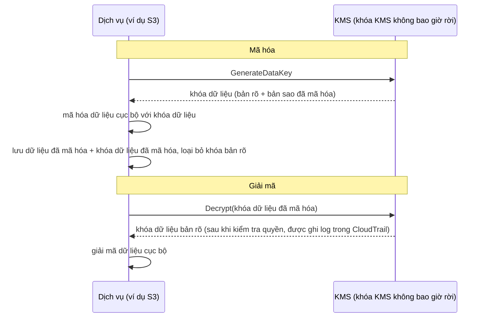

# Chương 16: Khóa, Ổ Khóa Và Bí Mật

Kho git có hàng nghìn commit trải dài hai năm. Leo đã cuộn trong hai mươi phút, theo một sợi chỉ qua lịch sử — tìm khi nào một chuỗi kết nối cơ sở dữ liệu nhất định lần đầu xuất hiện. Anh suýt bỏ lỡ nó. Nó vào một chiều thứ Ba, kẹp giữa hai commit không đáng chú ý, được đẩy bởi ai đó từ đó đã rời công ty.

Một mật khẩu cơ sở dữ liệu. Dạng văn bản thuần. Trong lịch sử.

---

*Các kiểm soát mạng từ chương trước giờ chặt chẽ. Các security group giới hạn sự di chuyển ngang. Các NACL chặn các dải IP biết-xấu. Vành đai đã được củng cố. Nhưng cuộc kiểm toán bảo mật đã tìm thấy một thứ mà vành đai không thể khắc phục: một thông tin xác thực đã sống trong lịch sử git trong sáu tháng. Bảo mật vành đai giả định các bí mật bên trong an toàn. Cái này thì không.*

---

Leo đang xem lại lịch sử git khi anh tìm thấy nó. Một mật khẩu cơ sở dữ liệu. Được commit sáu tháng trước, dạng văn bản thuần, bởi ai đó không còn làm việc tại Nimbus — một phần của một tệp `.env` cũng chứa access key IAM của pipeline triển khai, hai dòng dưới chuỗi kết nối. Commit là công khai. Mật khẩu từ đó đã được thay đổi — nhưng họ không biết điều đó chắc chắn. Họ kiểm tra mọi hệ thống mà một trong hai thông tin xác thực đã từng chạm vào. Nó mất bốn giờ. Đó là ngày Nimbus quyết định ngừng đặt các bí mật vào mã.

"Chúng ta đã nghĩ về điều gì xảy ra nếu ai đó fork repo chưa?" Priya nói. "Lịch sử git là vĩnh viễn. Ngay cả khi chúng ta thay đổi mật khẩu, bất kỳ ai đã clone repo trước cách khắc phục vẫn có thông tin xác thực cũ trong lịch sử cục bộ của họ."

"Chúng ta đã kiểm tra," Leo nói. "Mật khẩu đã được thay đổi ba tháng trước. Tất cả các hệ thống xác nhận."

"Đó là mức tối thiểu," Priya nói. "Nhưng mọi hệ thống mà thông tin xác thực đó chạm vào cần được xem xét. Không chỉ những cái bạn biết về."

**Cuộc Kiểm Toán Bốn Giờ**

Leo đã tìm thấy tệp `.env` bị rò rỉ trong lịch sử git lúc 10 giờ sáng. Đến 2 giờ chiều, họ có câu trả lời cho câu hỏi quan trọng: liệu một trong hai thông tin xác thực — mật khẩu cơ sở dữ liệu hoặc access key được commit cùng nó — đã được dùng bởi bất kỳ ai khác ngoài các hệ thống Nimbus?

Cuộc kiểm toán chạy qua bốn danh mục.

**Các log truy cập RDS**: Mọi kết nối đến cơ sở dữ liệu, được đánh dấu thời gian và ghi log. Mật khẩu bị rò rỉ xuất hiện trong ba chuỗi kết nối — tất cả từ các EC2 instance trong VPC Nimbus, tất cả với các IP nguồn mong đợi. Không kết nối bên ngoài. Mật khẩu chưa được dùng để kết nối với cơ sở dữ liệu từ bên ngoài.

**Các log truy cập S3**: Access key bị rò rỉ thuộc về IAM user của pipeline triển khai, vốn có các quyền cho bucket `nimbus-receipts`. Leo truy vấn các log truy cập server S3 cho sáu tháng qua. Mọi lần truy cập đến từ các EC2 instance `us-west-2` hoặc từ role lấy origin của CloudFront. Không bất thường.

**Các lần gọi API CloudTrail**: Mọi lần gọi API AWS được thực hiện với access key ID bị rò rỉ. Leo lọc các sự kiện CloudTrail cho key. Ba trăm mười hai sự kiện — tất cả các lần gọi `s3:PutObject` thường lệ từ pipeline triển khai, tất cả từ cùng một IP, tất cả trong giờ làm việc. Key chỉ từng được dùng từ một địa chỉ IP, vốn khớp với server CI/CD.

"Và server CI/CD," Priya nói, "ở bên trong VPC. Nó sẽ phải lấy cắp dữ liệu qua HTTPS đến một endpoint bên ngoài, và chúng ta sẽ thấy điều đó trong các flow log."

"Chúng ta đã kiểm tra," Leo nói. "Không HTTPS đi từ server đó đến các IP không phải AWS trong sáu tháng qua."

**Phán quyết**: Không thông tin xác thực nào đã được dùng bởi bất kỳ ai ngoài đội ngũ Nimbus. Sự phơi bày là một rủi ro, không phải một vụ rò rỉ.

"Nhưng chúng ta không thể chắc chắn," Priya nói. "Chúng ta có thể tự tin một cách hợp lý dựa trên các log. Chúng ta không thể chắc chắn. Sự phân biệt đó quan trọng."

"Điều gì sẽ làm chúng ta chắc chắn?"

"Không gì làm bạn chắc chắn sau một sự phơi bày thông tin xác thực. Bạn xoay vòng thông tin xác thực, kiểm toán quyền truy cập, ghi lại các phát hiện của bạn, và tiến lên với các kiểm soát tốt hơn. Sự chắc chắn không có sẵn."

Tom đã tính toán trong cuộc trò chuyện. "Bốn giờ thời gian của ba kỹ sư. Gọi nó là bốn nghìn đô la chi phí đầy đủ. Cộng với xoay vòng thông tin xác thực, tài liệu hóa, viết báo cáo sự cố."

"Và đó chỉ là cuộc điều tra," Priya nói. "Một vụ rò rỉ sẽ là các bậc độ lớn nhiều hơn. Các thông báo pháp lý. Các liên lạc với khách hàng. Các khoản phạt có thể có."

"Vậy bài học bốn nghìn đô la là rẻ," Tom nói.

"Đáng kể," Priya nói. "Đừng lặp lại nó."

---

**Hai Vấn Đề: Lưu Trữ Bí Mật Và Mã Hóa Dữ Liệu**

Bảo mật xung quanh thông tin nhạy cảm có hai vấn đề riêng biệt:

**Lưu trữ các thông tin xác thực** (các mật khẩu cơ sở dữ liệu, các API key, các chuỗi kết nối): Chúng sống ở đâu? Ai có thể truy cập chúng? Làm sao bạn xoay vòng chúng mà không triển khai lại ứng dụng của bạn?

**Mã hóa dữ liệu** (thông tin khách hàng, hồ sơ thanh toán, PII): Làm sao bạn đảm bảo rằng ngay cả khi ai đó giành quyền truy cập trái phép vào cơ sở dữ liệu hoặc bucket S3 của bạn, họ không thể đọc dữ liệu?

AWS có một dịch vụ chuyên dụng cho mỗi vấn đề:

- **AWS Secrets Manager**: Lưu trữ và quản lý các thông tin xác thực một cách an toàn
- **AWS KMS (Key Management Service)**: Quản lý các khóa mã hóa để mã hóa và giải mã dữ liệu

Hãy nghĩ về Secrets Manager như một móc khóa: nó giữ các khóa của bạn (các thông tin xác thực), giữ chúng có tổ chức, và xoay vòng chúng theo một lịch. Hãy nghĩ về KMS như một két: nó không giữ những gì có giá trị — nó giữ chìa khóa mở ổ khóa bảo vệ những gì có giá trị.

**AWS Secrets Manager: Không Còn Các Thông Tin Xác Thực Được Mã Hóa Cứng**

Secrets Manager là một kho an toàn cho các bí mật: các thông tin xác thực cơ sở dữ liệu, các API key, các token OAuth, các SSH key, hoặc bất cứ thứ gì nhạy cảm.

Thay vì ứng dụng của bạn đọc một mật khẩu từ một biến môi trường hoặc tệp cấu hình, nó gọi API Secrets Manager khi khởi động (hoặc khi cần) và truy xuất bí mật. Bí mật không bao giờ chạm vào đĩa. Nó không bao giờ xuất hiện trong mã của bạn. Nó không ở trong các biến môi trường của bạn.

Đây là luồng trông như thế nào:

**Cách cũ**:
```
DB_PASSWORD=supersecretpassword123  # trong tệp .env hoặc biến môi trường
```

**Cách Secrets Manager**:
```python
import boto3
client = boto3.client('secretsmanager')
secret = client.get_secret_value(SecretId='nimbus/production/db-password')
password = json.loads(secret['SecretString'])['password']
```

EC2 instance cần một IAM role với quyền gọi `secretsmanager:GetSecretValue` cho bí mật cụ thể đó. Không dịch vụ nào khác có thể đọc nó. Bí mật không bao giờ ở trong mã.

Bạn có thể đang tự hỏi: tại sao không chỉ dùng các biến môi trường? Chúng đơn giản hơn — đặt chúng tại thời điểm triển khai, và ứng dụng đọc chúng. Các biến môi trường có vẻ ẩn, nhưng chúng được lưu trữ trong cấu hình triển khai của bạn, kho bí mật CI/CD, có thể được ghi log trong các phiên debug, và nhìn thấy được bởi bất kỳ ai có quyền truy cập vào tiến trình đang chạy. Quan trọng hơn, chúng là tĩnh: một khi được đặt, chúng không thay đổi cho đến khi ai đó cập nhật chúng thủ công. Secrets Manager lưu trữ các thông tin xác thực trong một dịch vụ được mã hóa với các kiểm soát truy cập IAM, ghi log kiểm toán đầy đủ qua CloudTrail, và xoay vòng tự động. Các biến môi trường không xoay vòng. Một biến môi trường bị rò rỉ vẫn hợp lệ cho đến khi ai đó thay đổi nó thủ công.

**Xoay Vòng Tự Động: Sức Mạnh Thực Sự**

Tính năng tuyệt vời nhất của Secrets Manager không phải là lưu trữ các bí mật — mà là xoay vòng chúng tự động.

Đây là kịch bản: mỗi 30 ngày, Secrets Manager tạo một mật khẩu cơ sở dữ liệu mới, cập nhật nó trong RDS, cập nhật bí mật được lưu trữ, và ứng dụng của bạn truy xuất mật khẩu mới vào lần tiếp theo nó cần. Không can thiệp thủ công. Không triển khai. Không "tôi cần nhớ xoay vòng cái này."

Việc xoay vòng được triển khai như một hàm Lambda. AWS cung cấp các template cho các cơ sở dữ liệu RDS (MySQL, PostgreSQL, Aurora). Bạn có thể tùy chỉnh hàm cho bất kỳ loại thông tin xác thực nào.

"Cái đó tốn bao nhiêu mỗi tháng?" Tom hỏi.

Secrets Manager tính phí theo mỗi bí mật mỗi tháng cộng với theo mỗi lần gọi API. Đối với một số nhỏ các mật khẩu cơ sở dữ liệu và các API key, chi phí là vài đô la mỗi tháng — không đáng kể so với chi phí của một sự cố.

"Vụ xâm phạm tuần trước," Priya nói, "sẽ tốn bao nhiêu để điều tra và khắc phục?"

Tom im lặng một lúc. "Bao gồm thời gian của tôi, thời gian của bạn, cuối tuần của Leo... vài nghìn đô la."

"Secrets Manager sẽ đã bắt được key tĩnh trước khi nó bị khai thác. Và nó sẽ đã xoay vòng nó tự động."

Tom mở trang định giá lên.

**Điều Gì Xảy Ra Trong Lúc Xoay Vòng**

"Khoan — nhưng *tại sao* chúng ta lại làm theo cách đó?" Maya hỏi. "Nếu mật khẩu cơ sở dữ liệu xoay vòng, ứng dụng có hỏng không? Làm sao nó nhận mật khẩu mới mà không cần triển khai?"

Đây là một mối quan ngại hợp pháp. Xoay vòng mà không gián đoạn đòi hỏi sự cẩn thận.

Việc xoay vòng Secrets Manager hoạt động theo các giai đoạn — được thiết kế để ngăn kịch bản "mật khẩu cũ đột nhiên không hợp lệ, ứng dụng sập":

**Giai đoạn 1: Tạo phiên bản bí mật mới.** Secrets Manager tạo một mật khẩu mới và lưu trữ nó như một phiên bản đang chờ của bí mật. Phiên bản hiện tại vẫn đang hoạt động.

**Giai đoạn 2: Đặt trên dịch vụ.** Lambda xoay vòng gọi cơ sở dữ liệu để cập nhật mật khẩu thành giá trị mới. Hãy lưu ý: với chiến lược xoay vòng **single-user** mặc định có một khoảnh khắc ngắn khi mật khẩu cũ vừa ngừng hoạt động (`ALTER ROLE ... PASSWORD` của PostgreSQL có hiệu lực ngay lập tức) và phiên bản mới chưa phải là hiện tại. Cho xoay vòng không-thời-gian-chết, Secrets Manager hỗ trợ một chiến lược **alternating-users**: hai user cơ sở dữ liệu với các quyền giống hệt, nơi việc xoay vòng luôn cập nhật cái *không hoạt động* rồi chuyển — các thông tin xác thực đang hoạt động không bao giờ bị vô hiệu hóa giữa chừng. Cụm từ thi cần nhớ là "alternating users rotation strategy."

**Giai đoạn 3: Kiểm tra bí mật mới.** Lambda xoay vòng xác minh rằng mật khẩu mới hoạt động bằng cách kết nối với nó. Nếu cái này thất bại, việc xoay vòng bị cuộn lại.

**Giai đoạn 4: Hoàn thành.** Secrets Manager đánh dấu phiên bản mới là phiên bản hiện tại và hạ cấp phiên bản cũ thành một phiên bản trước. Phiên bản trước được giữ trong một thời gian ân hạn.

Trong thời gian ân hạn, cả hai phiên bản đều có thể truy xuất. Nếu ứng dụng của bạn đã cache bí mật cũ và chưa nhận cái mới, nó vẫn có thể kết nối. Lần tiếp theo nó gọi `GetSecretValue`, nó nhận phiên bản hiện tại (mới).

"Vậy ứng dụng không bao giờ cần được khởi động lại," Leo nói.

"Không nhất thiết. Nếu ứng dụng của bạn cache bí mật khi khởi động và không bao giờ làm mới nó, bạn cần hoặc làm mới nó theo một lịch hoặc xử lý các thất bại xác thực bằng cách lấy lại bí mật."

"Vậy Lambda xoay vòng và ứng dụng cần hợp tác," Maya nói.

"Secrets Manager làm phần của nó. Mã ứng dụng của bạn cần làm phần còn lại: lấy bí mật khi cần, xử lý các thất bại xác thực bằng cách lấy lại."

Leo cập nhật ứng dụng để bắt các ngoại lệ xác thực cơ sở dữ liệu và, khi thất bại, lấy một bí mật mới từ Secrets Manager trước khi thử lại. Hai dòng xử lý lỗi. Việc xoay vòng trở nên vô hình đối với người dùng.

---

**Tiêm Bí Mật Vào Pipeline CI/CD**

"Chúng ta đã nghĩ về cách pipeline triển khai lấy các bí mật nó cần chưa?" Priya hỏi. "Pipeline triển khai hạ tầng. Nó cần các thông tin xác thực AWS. Nó có thể cần các chuỗi kết nối cơ sở dữ liệu cho các script di chuyển."

Leo giải thích thiết lập hiện tại: các bí mật được lưu trữ như các GitHub Actions Secret — được mã hóa khi lưu trữ trong GitHub, được tiêm như các biến môi trường tại thời gian chạy.

"Các thông tin xác thực ở trong GitHub," Priya nói.

"Được mã hóa."

"Trong một hệ thống bên thứ ba. Một vụ xâm phạm GitHub phơi bày tất cả các bí mật pipeline của chúng ta."

Giải pháp: pipeline triển khai xác thực với AWS qua liên kết OIDC (được đề cập trong Chương 14) và truy xuất bất kỳ bí mật nào nó cần từ Secrets Manager tại thời gian chạy. Không bí mật được lưu trữ trong GitHub. Role AWS của pipeline có quyền đọc các bí mật cụ thể, không gì khác.

```yaml
# Workflow GitHub Actions
- name: Get DB Migration Credentials
  env:
    AWS_DEFAULT_REGION: us-west-2
  run: |
    SECRET=$(aws secretsmanager get-secret-value \
      --secret-id nimbus/staging/db-migration \
      --query SecretString --output text)
    DB_URL=$(echo $SECRET | jq -r '.url')
    # Chạy di chuyển với DB_URL — không bao giờ được lưu trong một tệp
    flyway -url="$DB_URL" migrate
```

Bí mật được lấy, dùng trong bộ nhớ, và bị loại bỏ. Nó không bao giờ được ghi vào đĩa, không bao giờ được lưu trữ trong các biến môi trường tồn tại sau công việc, không bao giờ trong một tệp log.

"Nếu bí mật được in ra log thì sao?" Leo hỏi.

"GitHub Actions tự động che các giá trị của các bí mật được cấu hình như các GitHub Secret. Nhưng bí mật này không phải là một GitHub Secret — nó đến từ Secrets Manager. Bạn cần che nó thủ công, hoặc tốt hơn, không bao giờ ghi log nó."

"Vậy kỷ luật là: lấy, dùng, loại bỏ. Không bao giờ ghi log các bí mật. Không bao giờ lưu trữ chúng trong các tệp."

"Kỷ luật đó," Priya nói, "là cái mà cuộc kiểm toán bốn giờ xác nhận chúng ta đã thất bại."


**AWS KMS: Nhà Máy Ổ Khóa**

"Khoan — nhưng *tại sao* chúng ta lại làm theo cách đó?" Maya hỏi. "Tại sao lại một dịch vụ quản lý khóa riêng biệt? Chúng ta không thể chỉ mã hóa dữ liệu bản thân và lưu trữ khóa trong Secrets Manager sao?"

Bạn có thể lưu trữ các khóa mã hóa trong Secrets Manager. Nhưng rồi ai kiểm soát quyền truy cập vào khóa? Cái gì đảm bảo khóa được xoay vòng? Cái gì chứng minh với một kiểm toán viên rằng khóa chỉ được dùng bởi các dịch vụ được ủy quyền? KMS trả lời tất cả các câu hỏi này. Nó không chỉ là lưu trữ — nó là một dịch vụ quản lý vòng đời khóa với bảo mật được phần cứng hỗ trợ, các policy IAM chi tiết cho mỗi khóa, và một dấu vết kiểm toán đầy đủ của mỗi lần dùng. Secrets Manager lưu trữ những gì bạn cần để kết nối với các hệ thống. KMS bảo vệ chính các hệ thống.

AWS KMS (Key Management Service) quản lý các **khóa mật mã** — các giá trị bí mật được dùng để mã hóa và giải mã dữ liệu.

Phép tương tự: KMS giống như một công ty lockbox giữ master key. Dữ liệu của bạn (nội dung của hộp) được mã hóa. Chỉ ai đó có quyền dùng khóa KMS mới có thể giải mã nó. KMS ghi log mọi lần dùng của mọi khóa trong CloudTrail.

**Customer Master Key (CMK)** — bây giờ gọi là KMS key — đến trong ba loại quyền sở hữu:

**Các khóa AWS sở hữu**: Các khóa mà AWS sở hữu và dùng qua nhiều tài khoản khách hàng — bạn không bao giờ thấy chúng, không bao giờ trả tiền cho chúng, và chúng không xuất hiện trong tài khoản của bạn. Một số mặc định dịch vụ dùng chúng (mã hóa mặc định của DynamoDB, ví dụ).

(Một sự phân biệt đáng giữ rõ: mã hóa **SSE-S3** mặc định của S3 *không* phải là một mô hình khóa KMS chút nào — S3 quản lý các khóa AES-256 riêng của nó hoàn toàn bên ngoài KMS, không có khóa để thấy và không có dấu vết kiểm toán sử dụng khóa. **SSE-KMS** là lựa chọn S3 đi qua KMS, dùng hoặc khóa được AWS quản lý `aws/s3` hoặc một khóa do khách hàng quản lý. Kích hoạt thi: "kiểm toán ai đã dùng khóa mã hóa" hoặc "kiểm soát xoay vòng và key policy" → SSE-KMS với một khóa do khách hàng quản lý — mọi lần dùng đáp xuống CloudTrail.)

**Các khóa được AWS quản lý**: AWS tạo và quản lý khóa tự động *trong tài khoản của bạn* cho các dịch vụ như S3, EBS, RDS (được đặt tên như `aws/s3`). Bạn có thể thấy nó và kiểm toán việc dùng nó trong CloudTrail, nhưng bạn không thể thay đổi policy hoặc việc xoay vòng của nó — AWS xoay vòng nó tự động mỗi năm. Miễn phí.

**Các khóa do khách hàng quản lý**: Bạn tạo khóa trong KMS và kiểm soát mọi khía cạnh của nó: ai có thể dùng nó, khi nào nó xoay vòng, ai có thể quản trị nó. Bạn có thể bật xoay vòng khóa tự động với một thời gian có thể cấu hình giữa 90 ngày và 2.560 ngày (7 năm); thời gian xoay vòng mặc định là 365 ngày (hàng năm). Bạn cũng có thể kích hoạt một **xoay vòng theo yêu cầu** ngay lập tức — hữu ích sau một sự phơi bày nghi ngờ, mà không phải chờ lịch. Lưu ý: xoay vòng tự động áp dụng cho các khóa đối xứng với material được KMS tạo — các khóa bất đối xứng và material khóa được nhập không thể tự xoay vòng. Chi phí: 1 đô la/tháng cho mỗi khóa cộng với các phí theo mỗi lần gọi API.

Nếu bạn chọn các khóa KMS do khách hàng quản lý, thì bạn có được kiểm soát đầy đủ trên các lịch xoay vòng, các policy truy cập, và khả năng nhìn thấy kiểm toán, nhưng bạn trả tiền theo mỗi khóa mỗi tháng và đảm nhận trách nhiệm quản lý khóa; nếu bạn chọn các khóa được AWS quản lý, thì bạn có được mã hóa với không chi phí vận hành và không chi phí cho bản thân khóa, nhưng bạn không thể tùy chỉnh các lịch xoay vòng hoặc các key policy — chúng được quản lý hoàn toàn bởi AWS.

**Mã Hóa Trong Các Dịch Vụ AWS: Tích Hợp KMS**

Hầu hết các dịch vụ AWS tích hợp với KMS để mã hóa:

**S3**: Bật "mã hóa phía server với KMS" trên một bucket. Mọi object được mã hóa khi nghỉ với một khóa KMS. Đọc một object đòi hỏi quyền cho cả bucket S3 *và* khóa KMS.

**RDS**: Bật mã hóa tại thời điểm tạo. Bộ lưu trữ cơ sở dữ liệu, các bản sao lưu, và các snapshot đều được mã hóa với một khóa KMS. Lưu ý: mã hóa không thể được bật trên một RDS instance không được mã hóa hiện có — bạn phải snapshot, sao chép snapshot với mã hóa được bật, và khôi phục.

**EBS**: Mã hóa các volume với KMS. Các volume mới được tạo từ các snapshot được mã hóa được tự động mã hóa.

**DynamoDB**: Mã hóa khi nghỉ dùng KMS được bật theo mặc định trên tất cả các bảng.

**ElastiCache Redis**: Mã hóa khi nghỉ với KMS cho dữ liệu được cache nhạy cảm.

Nguyên tắc: dữ liệu nên được mã hóa khi nghỉ (được lưu trữ trên đĩa) và khi truyền (di chuyển qua một mạng). KMS xử lý mã hóa khi-nghỉ. TLS/SSL (được cung cấp tự động bởi các dịch vụ AWS) xử lý mã hóa khi-truyền.

**Mã Hóa Phong Bì: Cách KMS Thực Sự Hoạt Động**

Đây là một chi tiết giúp bạn hiểu hành vi KMS và các câu hỏi thi.

KMS không mã hóa dữ liệu của bạn trực tiếp trong hầu hết các trường hợp. Nó dùng **mã hóa phong bì (envelope encryption)**:

1. KMS tạo một **khóa dữ liệu (data key)** (một khóa đối xứng duy nhất)
2. Dịch vụ dùng khóa dữ liệu để mã hóa dữ liệu của bạn cục bộ (nhanh — mã hóa đối xứng)
3. Dịch vụ yêu cầu KMS mã hóa chính khóa dữ liệu (dùng khóa KMS của bạn)
4. Cả dữ liệu được mã hóa và khóa dữ liệu được mã hóa đều được lưu trữ
5. Dữ liệu thực tế của bạn không bao giờ rời dịch vụ — chỉ khóa dữ liệu đi đến KMS để mã hóa/giải mã

Khi bạn đọc dữ liệu:

1. Dịch vụ yêu cầu KMS giải mã khóa dữ liệu
2. KMS kiểm tra các quyền, giải mã khóa dữ liệu, trả về nó
3. Dịch vụ dùng khóa dữ liệu đã giải mã để giải mã dữ liệu của bạn cục bộ



Điều này nghĩa là KMS có thể xử lý dữ liệu rất lớn mà không gửi tất cả qua API KMS. Chỉ các khóa nhỏ đi đến KMS. CloudTrail ghi log mọi lần gọi API KMS — mọi thao tác mã hóa và giải mã.

**Các KMS Key Policy: Mô Hình Truy Cập**

"Chúng ta đã nghĩ về điều gì xảy ra nếu một policy IAM và một key policy mâu thuẫn chưa?" Priya hỏi. "KMS có kiểm soát truy cập riêng của nó trên đỉnh IAM."

Các khóa KMS có **các key policy** — các resource-based policy được gắn vào chính khóa. Chúng riêng biệt với các policy IAM và tuân theo các quy tắc đánh giá khác nhau.

Để một principal dùng một khóa KMS, hai điều phải đúng:

**Thứ nhất**: Key policy phải cho phép nó. Nếu key policy không cấp rõ ràng cho principal quyền truy cập, họ không thể dùng khóa — bất kể policy IAM của họ nói gì. Cái này khác với hầu hết các tài nguyên AWS, nơi các policy IAM một mình là đủ.

**Thứ hai**: Policy IAM của principal phải cho phép hành động KMS (ví dụ, `kms:Decrypt`, `kms:GenerateDataKey`).

Cả hai phải nói có. Một trong hai nói không nghĩa là hành động bị từ chối.

Key policy mặc định mà AWS tạo cho các khóa do khách hàng quản lý bao gồm một câu nói "tài khoản root có thể quản lý khóa này." Cái này quan trọng: nó nghĩa là một IAM administrator cấp độ tài khoản luôn có thể cấp quyền truy cập vào một khóa, ngay cả khi key policy không nêu tên họ trực tiếp — vì sự ủy quyền tài khoản root đã có sẵn.

"Vậy nếu chúng ta loại bỏ tài khoản root khỏi key policy," Leo hỏi, "các policy IAM ngừng hoạt động cho khóa đó?"

"Đúng. Loại bỏ sự ủy quyền tài khoản root là một cách để khóa một khóa chặt đến mức chỉ các principal cụ thể được nêu tên trong key policy mới có thể dùng nó — thậm chí không các administrator tài khoản. Nó cũng là một cách để vô tình tự khóa mình ra khỏi khóa của chính bạn."

"Chúng ta có thể khôi phục không?"

"Chỉ bằng cách liên hệ AWS Support. Nếu không ai có thể dùng khóa và key policy không thể được cập nhật, dữ liệu được mã hóa với khóa đó thực ra không thể truy cập được."

"Vậy đừng loại bỏ tài khoản root khỏi key policy mà không có một lý do cực kỳ tốt."

"Đúng."

---

**Các Khóa Bất Đối Xứng: Ký Và Xác Minh**

KMS cũng hỗ trợ các cặp khóa bất đối xứng — một khóa công khai và một khóa riêng tư.

Các trường hợp sử dụng:

**Ký số**: Bạn ký một tài liệu hoặc một token JWT với khóa riêng tư. Bất kỳ ai có khóa công khai có thể xác minh rằng chữ ký đến từ người giữ khóa riêng tư, và rằng nội dung chưa bị giả mạo.

**Mã hóa khóa công khai**: Bất kỳ ai có thể mã hóa dữ liệu với khóa công khai. Chỉ người giữ khóa riêng tư có thể giải mã nó.

Đối với Nimbus, các khóa bất đối xứng trở nên liên quan khi họ triển khai một hệ thống chữ ký webhook cho các đối tác nhà hàng. Khi Nimbus gửi một sự kiện đến server của một đối tác nhà hàng (một đơn hàng mới, một cập nhật trạng thái), đối tác cần xác minh sự kiện thực sự đến từ Nimbus và không bị giả mạo.

Việc triển khai:

1. Nimbus tạo một khóa KMS bất đối xứng (RSA 2048-bit, thuật toán SIGN_VERIFY)
2. Khi gửi một webhook, Nimbus gọi `kms:Sign` với khóa riêng tư để ký payload sự kiện
3. Chữ ký được bao gồm trong header webhook
4. Nimbus xuất bản khóa công khai (có thể tải xuống từ console KMS)
5. Server của đối tác nhà hàng lấy khóa công khai và dùng nó để xác minh chữ ký trên mọi webhook đến

Khóa riêng tư không bao giờ rời KMS. Nimbus không bao giờ có quyền truy cập vào material khóa riêng tư thô. KMS thực hiện thao tác ký bên trong hardware security module của nó.

"Vậy ngay cả khi ai đó xâm phạm một server Nimbus," Rafael nói, "họ không thể giả mạo một chữ ký webhook. Khóa riêng tư ở trong KMS, không phải trên bất kỳ server nào."

"Đúng. Ký đòi hỏi một lần gọi API KMS. Mọi lần gọi API được ghi log trong CloudTrail. Nếu ai đó cố ký một sự kiện gian lận, chúng ta sẽ thấy lần gọi API."

---

**Câu Chuyện Xóa Khóa**

Ba tháng sau thiết lập KMS, Tom mắc một lỗi.

Anh đang dọn dẹp các tài nguyên AWS không dùng — các hàm Lambda cũ, các bucket S3 cũ kỹ, các bảng điều khiển CloudWatch bị bỏ rơi. Anh đang di chuyển nhanh. Anh vô tình lên lịch một khóa KMS để xóa.

Khóa là `nimbus/prod/order-receipts` — khóa do khách hàng quản lý được dùng để mã hóa bucket S3 biên lai đơn hàng.

"Tôi đã xóa hàng loạt mười hai tài nguyên hôm qua và không kiểm tra cái thứ mười hai là gì," Tom nói một cách phẳng lặng. Anh đã lên lịch việc xóa và tiếp tục. Anh nhận thấy lỗi vào sáng hôm sau khi anh xem lại các hành động của mình.

Anh mở console KMS. Trạng thái khóa đọc: "Đang chờ xóa. Xóa trong 7 ngày."

Anh đã lên lịch nó cho thời gian chờ tối thiểu.

"Chúng ta có thể hủy nó không?" anh hỏi.

Priya mở tài liệu. "Có. Trong thời gian chờ, khóa bị tắt nhưng chưa bị xóa. Bạn có thể hủy việc xóa."

Tom hủy việc xóa trong vòng một phút. Khóa được khôi phục về trạng thái hoạt động.

"Bảy ngày là thời gian chờ tối thiểu," Priya nói. "AWS thực thi nó vì nếu một khóa bị xóa và dữ liệu được mã hóa với nó, dữ liệu đó biến mất mãi mãi. Không thể khôi phục. Thời gian chờ cho bạn thời gian để nhận ra lỗi."

"Thời gian chờ nên là bao lâu?"

"Tối đa là ba mươi ngày. Đối với bất kỳ khóa nào mã hóa dữ liệu production, dùng ba mươi ngày. Ba tuần bảo vệ thêm chống lại các tai nạn đáng giá sự bất tiện nhỏ."

Tom cập nhật tất cả các cài đặt xóa khóa production thành ba mươi ngày. Anh cũng thiết lập một cảnh báo CloudWatch kích hoạt nếu bất kỳ trạng thái khóa KMS nào thay đổi thành "Đang chờ xóa" — vậy lần tiếp theo ai đó (kể cả anh) mắc cùng lỗi, đội ngũ sẽ biết trong vòng năm phút.

---

**Secrets Manager so với Parameter Store**

AWS cũng có **Systems Manager Parameter Store**, vốn lưu trữ các giá trị cấu hình (không chỉ các bí mật). Parameter Store rẻ hơn — miễn phí cho các tham số tiêu chuẩn. Nó cũng có thể lưu trữ các tham số được mã hóa dùng KMS.

Đối với các bí mật cần xoay vòng: Secrets Manager.

Đối với các giá trị cấu hình và các tham số không nhạy cảm: Parameter Store (bậc miễn phí rất hào phóng).

Đối với cấu hình ứng dụng (các số cổng, các feature flag, các cài đặt theo môi trường): Parameter Store.

| | Secrets Manager | SSM Parameter Store |
|---|---|---|
| Xoay vòng tự động | Có (Lambda hỗ trợ) | Không |
| Chi phí | ~0,40 đô la/bí mật/tháng | Miễn phí (tiêu chuẩn) |
| Mã hóa | Luôn luôn | Tùy chọn (với KMS) |
| Phiên bản hóa | Có | Có |
| Truy cập đa-tài-khoản | Có | Bị giới hạn |
| Tốt nhất cho | Các mật khẩu cơ sở dữ liệu, các API key | Các giá trị cấu hình, các feature flag |

## Chứng Chỉ Trên Cửa

Hai tuần sau cuộc di chuyển bí mật, Priya đang xem lại môi trường staging Nimbus trên điện thoại của cô khi cô nhận thấy thanh địa chỉ.

"Không An Toàn."

Cô mở URL production lên. Cùng một thứ.

"Leo," cô nói, đặt điện thoại của cô lên bàn. "Chúng ta đang chạy trên HTTP sao?"

Leo kiểm tra. "Listener ALB ở cổng 80. Chúng ta chưa bao giờ thiết lập HTTPS."

"Vậy mọi yêu cầu người dùng của chúng ta thực hiện — mọi đơn hàng, mọi lần đăng nhập — đang đi qua HTTP không được mã hóa?"

"Chúng ta có TLS trên kết nối RDS," Leo đề nghị.

"Đó là dữ liệu khi truyền giữa ứng dụng và cơ sở dữ liệu. Tôi đang nói về dữ liệu khi truyền giữa trình duyệt của người dùng và load balancer của chúng ta. Cái đó không được mã hóa chút nào."

Tom đã lắng nghe. "Đó là một vấn đề bảo mật hay một vấn đề nhận thức?"

"Cả hai," Priya nói. "HTTP không được mã hóa nghĩa là bất kỳ mạng nào giữa người dùng và server của chúng ta — một router quán cà phê, một ISP — có thể đọc lưu lượng. Các mật khẩu, các chi tiết đơn hàng, các token session. Và các trình duyệt hiện đại cảnh báo người dùng với 'Không An Toàn.' Cái đó giết các tỷ lệ chuyển đổi."

"Vậy chúng ta cần một chứng chỉ TLS," Maya nói. "Cái đó tốn bao nhiêu?"

"Không gì," Priya nói. "AWS Certificate Manager."

**AWS Certificate Manager (ACM)** cấp phép các chứng chỉ TLS/SSL miễn phí để dùng với các dịch vụ được AWS quản lý: các ALB, các phân phối CloudFront, và API Gateway. Bạn không mua một chứng chỉ, quản lý một lịch gia hạn, hoặc chạm vào material khóa riêng tư. ACM xử lý toàn bộ vòng đời chứng chỉ.

Một chứng chỉ được phát hành bởi ACM có hiệu lực trong 13 tháng. Trước khi nó hết hạn, ACM gia hạn nó tự động. Nếu gia hạn thành công, chứng chỉ mới được gắn vào load balancer hoặc phân phối của bạn mà không có bất kỳ hành động nào từ bạn. Ổ khóa của trình duyệt giữ màu xanh lá. Cảnh báo hết hạn bạn quên đặt không bao giờ kích hoạt.

**Hai loại chứng chỉ ACM**:

**Các chứng chỉ công khai** được phát hành bởi cơ quan chứng chỉ của Amazon và được tin cậy bởi tất cả các trình duyệt chính. Chúng hoàn toàn miễn phí để dùng với ALB, CloudFront, và API Gateway. Bạn xác thực quyền sở hữu tên miền hoặc qua DNS hoặc email.

**Các chứng chỉ riêng tư** được phát hành bởi AWS Private CA — một cơ quan chứng chỉ riêng tư được quản lý mà bạn chạy cho các dịch vụ nội bộ (mTLS dịch vụ-đến-dịch vụ, công cụ nội bộ, các client VPN). Private CA có một chi phí hàng tháng.

Đối với Nimbus, các chứng chỉ công khai là lựa chọn đúng.

**Xác thực DNS so với xác thực email**:

Leo mở console ACM và bắt đầu một yêu cầu chứng chỉ cho `eatnimbus.com` và `*.eatnimbus.com`.

"Nó đang hỏi tôi muốn xác thực quyền sở hữu như thế nào," anh nói. "DNS hoặc email."

"DNS," Priya nói. "Luôn DNS."

Với xác thực DNS, ACM thêm một bản ghi CNAME cụ thể vào hosted zone của bạn. Route 53 có thể làm điều này tự động — một lần nhấp trong console. Chừng nào bản ghi CNAME đó tồn tại, ACM có thể tự động gia hạn chứng chỉ mà không có bất kỳ hành động nào của con người. Xác thực email gửi một email đến liên hệ đã đăng ký của tên miền và đòi hỏi một lần nhấp thủ công mỗi lần chứng chỉ gia hạn. Lần nhấp đó bị quên. Xác thực DNS không đòi hỏi ai phải nhớ bất cứ điều gì.

"Vậy tôi thêm bản ghi CNAME một lần," Leo nói, "và nó gia hạn mãi mãi?"

"Cho đến khi ai đó xóa bản ghi CNAME," Priya nói. "Đừng xóa bản ghi CNAME."

Leo yêu cầu chứng chỉ, thêm CNAME xác thực trong Route 53 (mà ACM đề nghị làm tự động), và chờ năm phút. Trạng thái chứng chỉ thay đổi thành Issued. Anh gắn nó vào listener HTTPS của ALB trên cổng 443 và thêm một quy tắc chuyển hướng trên cổng 80 để gửi tất cả lưu lượng HTTP đến HTTPS.

Tom làm mới URL production.

Ổ khóa xuất hiện.

Một chi tiết theo region đáng gắn cờ: một chứng chỉ là một tài nguyên theo region, và nó phải sống trong cùng region với dịch vụ dùng nó. Đối với một ALB, đó là region của ALB. Đối với **CloudFront**, chứng chỉ phải được yêu cầu (hoặc nhập) trong **`us-east-1`** — luôn luôn, bất kể các origin của bạn chạy ở đâu — vì CloudFront là một dịch vụ toàn cầu neo ở đó. Leo đã vấp ngã vào cái này trong Chương 13; nó cũng là một sự thật thi đáng tin cậy.

**Một điều các chứng chỉ ACM không thể làm**:

"Tôi có thể tải xuống chứng chỉ không?" Leo hỏi. "Tôi muốn cài đặt nó trên EC2 instance admin nội bộ."

"Không," Priya nói.

Các chứng chỉ công khai ACM miễn phí không thể được xuất. Bạn không thể tải xuống khóa riêng tư và cài đặt nó trên một EC2 instance, một server Nginx, hoặc bất cứ thứ gì ngoài các dịch vụ được AWS quản lý. Material khóa riêng tư không bao giờ rời ACM. Cái này là cố ý — nó ngăn khóa riêng tư bị rò rỉ, được lưu trữ không an toàn, hoặc bị quên khi chứng chỉ hết hạn.

Đối với các trường hợp sử dụng đòi hỏi một chứng chỉ có thể cài đặt — một EC2 instance hoạt động như một proxy tùy chỉnh, một server tại chỗ — có ba con đường: một chứng chỉ từ một cơ quan bên thứ ba (Let's Encrypt, ví dụ), AWS Private CA với việc xuất chứng chỉ được bật, hoặc — kể từ tháng Sáu 2025 — các **chứng chỉ công khai có thể xuất** có trả phí của ACM (chọn tham gia tại lúc phát hành, được tính theo mỗi FQDN hoặc wildcard), có khóa riêng tư *có thể* được xuất để dùng ở bất kỳ đâu.

"Đối với ALB của chúng ta và phân phối CloudFront của chúng ta," Priya nói, "ACM chính xác là đúng. Miễn phí, tự động, và chúng ta không bao giờ chạm vào một khóa."

## Điểm Mạnh và Hạn Chế

**AWS Secrets Manager**:

- Xoay vòng bí mật tự động mà không thay đổi mã hoặc triển khai
- Kiểm soát truy cập IAM chi tiết cho mỗi bí mật (mỗi bí mật là một tài nguyên IAM riêng biệt)
- Phiên bản hóa — phiên bản trước vẫn truy cập được trong lúc xoay vòng, ngăn các lần rớt kết nối
- Kiểm toán qua CloudTrail — mọi lần gọi `GetSecretValue` được ghi log với danh tính của người gọi
- Truy cập đa-tài-khoản — các bí mật của một tài khoản có thể được chia sẻ với role của một tài khoản khác
- Chi phí: ~0,40 đô la/bí mật/tháng + các lần gọi API (khoảng 0,05 đô la cho mỗi 10.000 lần gọi API)

**AWS KMS**:

- Quản lý khóa tập trung với dấu vết kiểm toán đầy đủ — mọi lần mã hóa và giải mã được ghi log
- Xoay vòng khóa tự động có thể cấu hình cho các khóa do khách hàng quản lý (90 ngày đến 2.560 ngày; mặc định 365 ngày) — material khóa cũ vẫn giải mã dữ liệu hiện có, material khóa mới mã hóa dữ liệu mới
- Các quyền IAM chi tiết cho mỗi khóa (các key policy + các policy IAM — cả hai phải cho phép)
- Được Hardware Security Module (HSM) hỗ trợ — các khóa không bao giờ rời HSM dưới dạng bản rõ
- Hỗ trợ khóa đa-Region cho các kịch bản khắc phục thảm họa
- Hỗ trợ khóa bất đối xứng cho ký số và xác minh
- Chi phí: 1 đô la/tháng cho mỗi khóa + 0,03 đô la cho mỗi 10.000 lần gọi API

**Nơi nó trở nên phức tạp**:

- Các key policy KMS riêng biệt với (và được đánh giá cùng với) các policy IAM — debug các lỗi access denied đòi hỏi kiểm tra cả hai
- Mã hóa khi nghỉ phải được lập kế hoạch từ trước — bạn không thể mã hóa một RDS instance không được mã hóa hiện có tại chỗ
- Việc xóa khóa trong KMS có một thời gian chờ 7-30 ngày — một cơ chế an toàn, nhưng dễ quên trong lúc thiết lập và nguy hiểm khi vô tình kích hoạt
- Xoay vòng đòi hỏi mã ứng dụng xử lý việc lấy lại các bí mật khi thất bại xác thực — Secrets Manager xoay vòng thông tin xác thực, nhưng ứng dụng phải nhận nó
- Các chi phí Secrets Manager tăng theo số lượng các bí mật và khối lượng lần gọi API ở quy mô lớn
- Key policy mặc định (bao gồm sự ủy quyền tài khoản root) là quan trọng để bảo tồn — loại bỏ nó có thể khóa các administrator ra khỏi khóa

## Tóm Tắt

Bốn giờ dành cho việc lần theo một thông tin xác thực bị xâm phạm qua mọi hệ thống nó chạm vào là bốn giờ mà Secrets Manager có thể đã ngăn. Xoay vòng tự động nghĩa là một thông tin xác thực bị đánh cắp có một tuổi thọ ngắn. KMS nghĩa là ngay cả khi ai đó tiếp cận dữ liệu, họ không thể đọc nó mà không có một khóa họ không được ủy quyền dùng. Và một thời gian chờ xóa khóa ba mươi ngày nghĩa là một việc xóa do tai nạn có thể được hủy trước khi nó trở thành một sự kiện mất dữ liệu.

- Không bao giờ lưu trữ các thông tin xác thực trong mã, các biến môi trường, hoặc các tệp cấu hình được commit vào kiểm soát phiên bản.
- **Secrets Manager** lưu trữ các thông tin xác thực một cách an toàn và xoay vòng chúng tự động. Các ứng dụng lấy các bí mật qua API tại thời gian chạy.
- **Xoay vòng** xảy ra theo các giai đoạn: tạo phiên bản mới, cập nhật trên dịch vụ, kiểm tra, thăng cấp. Cả phiên bản cũ và mới đều hợp lệ trong giây lát, ngăn các lần rớt kết nối trong lúc xoay vòng.
- **KMS** quản lý các khóa mã hóa. Hầu hết các dịch vụ AWS tích hợp với KMS để mã hóa khi nghỉ.
- **Mã hóa phong bì**: KMS mã hóa khóa, không phải dữ liệu trực tiếp. Dịch vụ mã hóa dữ liệu dùng một khóa dữ liệu cục bộ, mà KMS mã hóa. Chỉ các khóa nhỏ đi qua API KMS.
- **Các khóa KMS do khách hàng quản lý**: kiểm soát đầy đủ trên xoay vòng (có thể cấu hình 90–2.560 ngày, mặc định 365 ngày hàng năm), truy cập, và kiểm toán (1 đô la/tháng). **Các khóa được AWS quản lý**: tự động, không cần cấu hình, miễn phí.
- **Các key policy KMS**: Key policy là một resource-based policy hoạt động cùng với IAM. Cả hai phải nói có. Sự ủy quyền tài khoản root trong key policy mặc định đảm bảo các IAM administrator luôn có thể cấp quyền truy cập.
- **Các khóa bất đối xứng**: KMS hỗ trợ các cặp khóa RSA và ECC cho ký và xác minh. Khóa riêng tư không bao giờ rời HSM.
- **Xóa khóa**: Thời gian chờ tối thiểu 7 ngày, tối đa 30 ngày. Các khóa bị xóa nghĩa là dữ liệu được mã hóa không thể truy cập vĩnh viễn. Dùng 30 ngày cho các khóa production, và giám sát trạng thái đang chờ xóa.
- **Các bí mật CI/CD**: Lấy từ Secrets Manager tại thời gian chạy dùng liên kết OIDC. Không bao giờ lưu trữ các bí mật như các biến nền tảng CI/CD.

## Mẹo Thi

*SAA-C03 Domain: Thiết kế kiến trúc an toàn (Domain 1, Task 1.3)*

- **Secrets Manager so với SSM Parameter Store**: Secrets Manager cho các thông tin xác thực cần xoay vòng tự động; Parameter Store cho cấu hình chung. Kỳ thi phân biệt chúng theo yêu cầu xoay vòng và độ nhạy cảm chi phí.
- **Các key policy KMS**: Một khóa KMS có key policy riêng của nó (một resource-based policy). Các policy IAM một mình không cấp quyền truy cập vào một khóa KMS — key policy phải cho phép nó rõ ràng. Cả key policy và policy IAM phải cho phép hành động.
- **Mã hóa RDS**: Không thể bật mã hóa trên một RDS instance không được mã hóa hiện có. Quá trình: tạo một snapshot → sao chép snapshot với mã hóa được bật → khôi phục từ snapshot được mã hóa → di chuyển lưu lượng đến instance mới.
- **Mã hóa EBS**: Các volume mới có thể được mã hóa. Các snapshot của các volume được mã hóa luôn được mã hóa. Các volume không được mã hóa không thể được mã hóa trực tiếp — snapshot + sao chép + khôi phục.
- **CloudTrail + KMS**: Mọi lần gọi API KMS được ghi log trong CloudTrail. Đây là một tính năng tuân thủ then chốt. Khi một kỳ thi hỏi cách kiểm toán ai đã giải mã dữ liệu nào, câu trả lời là CloudTrail + KMS.
- **Các khóa KMS đa-Region**: Sao chép material khóa đến nhiều region để việc giải mã có thể xảy ra mà không có các lần gọi API liên-region. Kỳ thi dùng cái này cho khắc phục thảm họa đa-region với dữ liệu được mã hóa.
- **KMS so với CloudHSM**: KMS là đa-thuê (được quản lý bởi AWS). CloudHSM là một hardware security module dành riêng mà chỉ bạn kiểm soát. Các tín hiệu thi: "FIPS 140-2 Level 3," "HSM dành riêng," "các thao tác mật mã do khách hàng quản lý" → CloudHSM.
- **Mã hóa phong bì**: KMS tạo một khóa dữ liệu, dịch vụ dùng nó để mã hóa dữ liệu cục bộ, KMS mã hóa khóa dữ liệu. Câu hỏi thi: "tại sao KMS không mã hóa các lượng lớn dữ liệu trực tiếp?" → hiệu suất; mã hóa phong bì giữ dữ liệu lớn cục bộ.
- **Các khóa KMS bất đối xứng**: Dùng cho ký số, xác minh JWT, hoặc mã hóa khóa công khai. Khóa riêng tư không bao giờ rời KMS. `kms:Sign` là lần gọi API để ký; `kms:Verify` để xác minh.
- **Thời gian chờ xóa khóa**: 7-30 ngày. Trong thời gian này, khóa bị tắt và không thể dùng được, nhưng việc xóa có thể được hủy. Sau khi xóa, bất kỳ dữ liệu nào được mã hóa với khóa đó không thể khôi phục vĩnh viễn.
- **ACM (AWS Certificate Manager):** Các chứng chỉ TLS công khai miễn phí để dùng với ALB, CloudFront, và API Gateway. Tự động gia hạn qua xác thực DNS. Các chứng chỉ công khai miễn phí không thể có khóa riêng tư của chúng được xuất — chúng sống bên trong AWS chỉ (một lựa chọn *chứng chỉ công khai có thể xuất* có trả phí tồn tại kể từ 2025 cho việc dùng EC2/tại chỗ). Kích hoạt thi: "HTTPS trên load balancer hoặc CDN" → ACM.

## Bài Tập

**Bài tập 1 — Nhớ lại**

Giải thích khái niệm mã hóa phong bì. Tại sao KMS mã hóa một khóa dữ liệu nhỏ thay vì mã hóa dữ liệu ứng dụng của bạn trực tiếp?

*(Gợi ý: Hãy nghĩ về điều gì xảy ra nếu bạn có 1GB dữ liệu để mã hóa, và các hệ quả hiệu suất của việc gửi 1GB đến một dịch vụ KMS từ xa sẽ là gì.)*

**Bài tập 2 — Kịch bản SAA-C03**

*Kịch bản*: Một công ty dịch vụ tài chính lưu trữ dữ liệu khách hàng nhạy cảm trong một cơ sở dữ liệu RDS MySQL. Một yêu cầu tuân thủ mới ủy quyền rằng:

1. Tất cả dữ liệu phải được mã hóa khi nghỉ
2. Tất cả việc sử dụng khóa mã hóa phải có thể kiểm toán
3. Các khóa mã hóa phải do khách hàng kiểm soát (không được AWS quản lý)
4. Mật khẩu cơ sở dữ liệu phải được xoay vòng tự động mỗi 90 ngày

Cơ sở dữ liệu được tạo sáu tháng trước mà không có mã hóa được bật. Bộ hành động nào đáp ứng TỐT NHẤT cả bốn yêu cầu?

A) Bật mã hóa RDS trên cơ sở dữ liệu hiện có; tạo một khóa KMS do khách hàng quản lý; cấu hình Secrets Manager với xoay vòng 90 ngày  
B) Tạo một snapshot của cơ sở dữ liệu hiện có; sao chép snapshot với mã hóa dùng một khóa KMS do khách hàng quản lý; khôi phục từ snapshot được mã hóa; cấu hình Secrets Manager với xoay vòng 90 ngày  
C) Tạo một RDS instance được mã hóa mới với một khóa được AWS quản lý; di chuyển dữ liệu từ instance cũ; cấu hình Secrets Manager với xoay vòng 90 ngày  
D) Bật mã hóa khi nghỉ RDS trên cơ sở dữ liệu hiện có dùng một khóa được AWS quản lý; cấu hình Secrets Manager với xoay vòng 90 ngày

**Gợi ý 1**: Bạn không thể bật mã hóa trên một RDS instance không được mã hóa hiện có trực tiếp.

**Gợi ý 2**: Các khóa "do khách hàng kiểm soát" nghĩa là các khóa KMS do khách hàng quản lý, không phải các khóa được AWS quản lý.

**Gợi ý 3**: Quá trình sao chép snapshot là con đường di chuyển tiêu chuẩn đến RDS được mã hóa.

**Đáp án**: B

**Giải thích**: Mã hóa RDS không thể được bật trên một instance hiện có. Cách tiếp cận tiêu chuẩn là: snapshot instance hiện có → sao chép snapshot với mã hóa được bật dùng một khóa KMS do khách hàng quản lý (thỏa mãn các yêu cầu 1, 2, và 3) → khôi phục từ snapshot được mã hóa. Các khóa KMS do khách hàng quản lý tự động ghi log tất cả việc sử dụng trong CloudTrail (kiểm toán) và giữ các khóa mã hóa dưới sự kiểm soát của bạn. Secrets Manager xử lý việc xoay vòng mật khẩu 90 ngày tự động (thỏa mãn yêu cầu 4).

**Tại sao không phải A?** Bạn không thể bật mã hóa trên một RDS instance không được mã hóa hiện có tại chỗ.

**Tại sao không phải C?** Các khóa được AWS quản lý không thỏa mãn yêu cầu "do khách hàng kiểm soát" (yêu cầu 3).

**Tại sao không phải D?** Cùng vấn đề như A (không thể bật tại chỗ) cộng khóa được AWS quản lý không thỏa mãn yêu cầu 3.

*SAA-C03 Domain: Thiết kế kiến trúc an toàn — Task 1.3*

**Bài tập 3 — Thử thách kiến trúc** *(Tùy chọn)*

Nimbus cần lưu trữ dữ liệu nhạy cảm sau:

- Mật khẩu cơ sở dữ liệu cho RDS instance production
- Stripe API secret key (được dùng cho xử lý thanh toán)
- Một khóa mã hóa đối xứng để mã hóa lịch sử đơn hàng khách hàng trong DynamoDB
- Các giá trị cấu hình theo từng nhà hàng (các endpoint API, các feature flag — không nhạy cảm)

Dịch vụ AWS hoặc cách tiếp cận nào bạn sẽ dùng cho mỗi cái? Chiến lược xoay vòng nào bạn sẽ áp dụng cho mỗi cái?

*(Không có câu trả lời đúng duy nhất. Mục tiêu là luyện tập việc khớp các công cụ bảo mật với các trường hợp sử dụng.)*

## Cảnh Sau Tín Dụng

"Tôi đã triển khai nó rồi — ồ." Leo đã di chuyển các bí mật production sang Secrets Manager trong khi môi trường phát triển vẫn đang dùng các biến môi trường cũ. Môi trường dev hỏng. Anh đã phải cuộn lại cấu hình dev thủ công.

"Stage trước," Priya nói. "Rồi production."

"Tôi biết," Leo nói.

Các bí mật đã được di chuyển.

Các mật khẩu cơ sở dữ liệu: Secrets Manager, xoay vòng mỗi 30 ngày.

Các API key: Secrets Manager, với một Lambda xoay vòng gọi API của nhà cung cấp thanh toán để tạo một key mới.

Dữ liệu đơn hàng khách hàng: được mã hóa với một khóa KMS do khách hàng quản lý.

Các thông tin xác thực cũ: bị vô hiệu hóa. Các tệp cấu hình cũ: bị xóa. Các GitHub Actions secret cũ: bị loại bỏ.

"Chúng ta giờ sẵn sàng kiểm toán," Priya nói.

"Định nghĩa sẵn sàng kiểm toán," Maya nói.

"Nếu một kiểm toán viên tuân thủ yêu cầu chúng ta chứng minh không có thông tin xác thực nào được mã hóa cứng trong mã của chúng ta hoặc bị phơi bày trong hạ tầng của chúng ta, chúng ta có thể cho họ thấy: mọi bí mật ở trong Secrets Manager, mọi khóa mã hóa ở trong KMS, mọi lần truy cập được ghi log trong CloudTrail."

"Lần cuối ai đó kiểm tra các log CloudTrail là khi nào?"

Một khoảng dừng.

"Tôi kiểm tra chúng mỗi tuần," Priya nói.

"Và nếu một thứ gì đó bất thường xuất hiện, làm sao chúng ta biết?"

"Đó," Priya nói, đóng laptop của cô, "là cuộc trò chuyện tiếp theo."

Chương tiếp theo: ba lớp phòng thủ đứng giữa Nimbus và internet.
